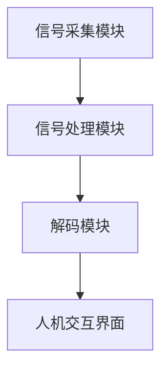
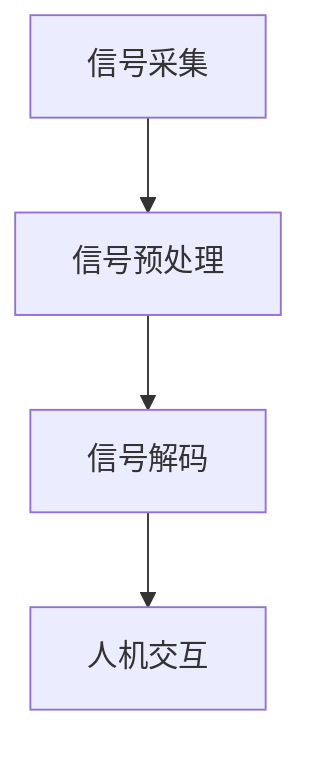

                 

# 脑机接口：2030年30%知识工作者将使用BBMI等技术提升能力

> 关键词：脑机接口，BBMI，知识工作者，提升能力，2030年

> 摘要：本文深入探讨了脑机接口（BBI）技术，尤其是大脑脑机接口（BBMI），在未来如何成为知识工作者提升能力的重要工具。文章从背景介绍、核心概念、技术原理、应用前景等方面展开，为读者提供了一个全面了解和深入分析脑机接口技术的视角。

## 第一部分：引言

### 第1章 脑机接口：2030年30%知识工作者将使用BBMI等技术提升能力

#### 1.1 书籍背景与目的

在现代社会，知识工作者在各个领域中扮演着越来越重要的角色。随着人工智能和神经科学技术的不断发展，脑机接口（Brain-Brain Interface，简称BBI）作为一种革命性技术，有望成为提升知识工作者能力的重要工具。

**问题背景：** 随着知识经济的兴起，知识工作者在企业管理、科技研发、教育培训等领域中的作用日益凸显。然而，传统的人机交互方式已无法满足知识工作者对高效、精准信息处理的需求。

**问题描述：** 脑机接口技术通过直接连接人脑与计算机系统，实现信息的高速传递和处理。这项技术不仅能够提升个人的认知能力和工作效率，还可能对社会生产方式和人类生活方式产生深远影响。

**问题解决：** 本书旨在探讨脑机接口技术的发展趋势、应用场景和未来前景，为读者提供一个全面了解和深入分析脑机接口技术的视角。

**边界与外延：** 本书将重点讨论基于脑机接口的技术，如大脑脑机接口（Brain-Brain Interface，简称BBMI）等，涉及的技术范围包括神经科学、计算机科学、心理学和工程学等。

**概念结构与核心要素组成：** 脑机接口的核心概念包括：大脑信息处理原理、信号采集与处理、数据传输与解码、人机交互界面等。

#### 1.2 核心概念与联系

**脑机接口的定义与特点：** 脑机接口是一种将人脑与计算机系统直接连接的技术，通过采集和解读大脑信号，实现信息的高效传递和处理。

**脑机接口的属性特征对比表格：**

| 特征         | 传统人机交互 | 脑机接口       |
| ------------ | ------------ | -------------- |
| 信息传递速度 | 低速         | 极高速         |
| 交互方式     | 视觉、听觉   | 神经信号直接传递 |
| 精确度       | 一般         | 极高精确度     |

**脑机接口与现有技术的区别：** 脑机接口与传统的计算机交互技术相比，具有更高的速度和精度，同时避免了传统交互方式中的延迟和误差。

#### 1.3 主流脑机接口技术简介

**大脑脑机接口（Brain-Brain Interface，简称BBMI）：** 大脑脑机接口是一种直接连接大脑神经元与计算机系统的技术，通过解码大脑信号，实现人机交互和信息处理。

**其他脑机接口技术：** 除BBMI外，本书还将介绍其他脑机接口技术，如脑电图（EEG）、功能性磁共振成像（fMRI）等，并比较它们的优缺点。

#### 1.4 脑机接口的应用前景

**脑机接口的潜在应用领域：** 脑机接口技术有望在医疗、教育、工业、娱乐等多个领域发挥重要作用，如康复治疗、增强记忆、辅助决策等。

**知识工作者使用脑机接口的优势：** 使用脑机接口技术，知识工作者可以提高工作效率，增强记忆和思维能力，从而在竞争激烈的职场中脱颖而出。

**脑机接口技术的挑战与机遇：** 脑机接口技术的发展面临诸多挑战，如技术成熟度、安全性、伦理问题等。然而，这些挑战也带来了巨大的发展机遇。

#### 1.5 本章小结

本章对脑机接口技术进行了全面的背景介绍、核心概念阐述和未来应用展望。接下来，本书将深入探讨脑机接口技术的原理、实现和应用，为读者提供一个全面了解脑机接口世界的窗口。

----------------------------------------------------------------

## 第二部分：脑机接口技术原理

### 第2章 大脑信息处理原理

#### 2.1 大脑的基本结构与功能

**大脑皮层：** 大脑皮层是大脑的最外层，负责感知、运动、思考等高级功能。

**大脑神经元的传递与接收：** 大脑神经元通过电信号传递信息，形成复杂的神经网络，实现信息的处理和传递。

#### 2.2 大脑信号采集技术

**脑电图（EEG）：** 脑电图是一种常用的非侵入性大脑信号采集技术，通过在头皮上放置电极，记录大脑的电活动。

**功能性磁共振成像（fMRI）：** 功能性磁共振成像是一种通过测量大脑血流变化来检测大脑活动的技术，具有高空间分辨率。

#### 2.3 大脑信号处理与解码

**信号预处理：** 大脑信号在采集过程中会伴随着噪声和干扰，信号预处理包括滤波、去噪、特征提取等步骤，以提高信号的质量和准确性。

**信号解码：** 通过机器学习和深度学习等技术，对处理后的信号进行解码，提取出有用的信息，如意图、情感、记忆等。

#### 2.4 大脑信号与计算机系统的交互

**数据传输与接口设计：** 将解码后的信号转化为计算机系统能够理解和处理的数据格式，并通过接口与计算机系统进行交互。

**人机交互界面：** 设计直观、易用的人机交互界面，使知识工作者能够方便地操作计算机系统，提高工作效率。

#### 2.5 脑机接口技术的挑战与机遇

**技术成熟度：** 当前脑机接口技术仍处于发展阶段，需要进一步提高技术的成熟度和稳定性。

**安全性：** 脑机接口技术涉及人类大脑信息，需要确保数据的安全和隐私。

**伦理问题：** 脑机接口技术的发展引发了一系列伦理问题，如人类尊严、隐私权等，需要制定相应的法律法规进行规范。

**机遇：** 脑机接口技术为知识工作者提供了前所未有的提升能力的机会，有望带来社会生产方式的变革。

#### 2.6 本章小结

本章介绍了大脑信息处理原理、信号采集技术、信号处理与解码、信号与计算机系统的交互等核心概念，为后续章节深入探讨脑机接口技术的实现和应用奠定了基础。

----------------------------------------------------------------

## 第三部分：脑机接口技术的实现与应用

### 第3章 脑机接口技术的实现

#### 3.1 脑机接口系统的架构设计

脑机接口系统主要由信号采集模块、信号处理模块、解码模块和人机交互界面组成。各个模块的功能如下：

- **信号采集模块：** 采集大脑的神经信号，如脑电图（EEG）、功能性磁共振成像（fMRI）等。
- **信号处理模块：** 对采集到的信号进行预处理，包括滤波、去噪、特征提取等。
- **解码模块：** 使用机器学习和深度学习等技术对预处理后的信号进行解码，提取出有用的信息。
- **人机交互界面：** 设计直观、易用的人机交互界面，使知识工作者能够方便地操作计算机系统，提高工作效率。

**系统架构设计图（使用Mermaid绘制）：**

#### 3.2 脑机接口技术的应用场景

**医疗领域：** 脑机接口技术可以用于康复治疗、辅助决策、疼痛缓解等，如通过解码大脑信号实现瘫痪患者的肢体运动控制。

**教育领域：** 脑机接口技术可以用于个性化教育、智能辅导等，如通过解码大脑信号了解学生的认知状态，提供个性化的学习建议。

**工业领域：** 脑机接口技术可以用于工业自动化、智能控制等，如通过解码大脑信号实现高精度的机器控制。

**娱乐领域：** 脑机接口技术可以用于虚拟现实（VR）、增强现实（AR）等，如通过解码大脑信号实现沉浸式体验。

#### 3.3 脑机接口技术的实现流程

**信号采集：** 使用脑电图（EEG）、功能性磁共振成像（fMRI）等技术采集大脑的神经信号。

**信号预处理：** 对采集到的信号进行滤波、去噪、特征提取等处理，提高信号的质量和准确性。

**信号解码：** 使用机器学习和深度学习等技术对预处理后的信号进行解码，提取出有用的信息。

**人机交互：** 通过人机交互界面，将解码后的信息转化为知识工作者可以理解和操作的数据，实现人机交互。

**实现流程图（使用Mermaid绘制）：**

#### 3.4 脑机接口技术的挑战与解决方案

**挑战一：技术成熟度**
- **解决方案：** 通过不断的研究和开发，提高脑机接口技术的成熟度和稳定性。

**挑战二：安全性**
- **解决方案：** 加强脑机接口技术的安全性和隐私保护，确保数据的安全和用户的隐私。

**挑战三：伦理问题**
- **解决方案：** 制定相应的法律法规，规范脑机接口技术的应用，保护人类的尊严和权益。

#### 3.5 本章小结

本章介绍了脑机接口技术的实现方法和应用场景，分析了脑机接口技术面临的挑战和解决方案。通过本章的学习，读者可以对脑机接口技术有一个全面的认识，并为未来的应用和创新奠定基础。

----------------------------------------------------------------

## 第四部分：脑机接口技术的未来趋势与挑战

### 第4章 脑机接口技术的未来趋势与挑战

#### 4.1 未来发展趋势

**1. 技术成熟度的提高：** 随着神经科学、人工智能和材料科学等领域的发展，脑机接口技术的成熟度将不断提高，实现更高的精度和稳定性。

**2. 应用领域的扩展：** 脑机接口技术将在医疗、教育、工业、娱乐等领域得到广泛应用，为人类生活带来更多便利。

**3. 人机协作的深化：** 脑机接口技术将实现人机协作的新模式，使知识工作者能够更高效地完成任务。

**4. 个性化应用的兴起：** 通过解码大脑信号，脑机接口技术将能够为个体提供高度个性化的服务，满足不同人群的需求。

#### 4.2 挑战与解决方案

**1. 技术成熟度：**
- **解决方案：** 加大对脑机接口技术的研发投入，推动技术的创新和突破。

**2. 安全性：**
- **解决方案：** 加强脑机接口技术的安全保护，制定严格的安全标准和规范。

**3. 伦理问题：**
- **解决方案：** 制定相应的法律法规，规范脑机接口技术的应用，确保人类的尊严和权益。

**4. 隐私保护：**
- **解决方案：** 采取有效的隐私保护措施，确保用户数据的安全和隐私。

#### 4.3 未来应用展望

**1. 智能医疗：** 脑机接口技术将实现精准的疾病诊断和治疗，提高医疗水平。

**2. 智能教育：** 脑机接口技术将实现个性化教育，提高学习效果。

**3. 智能工业：** 脑机接口技术将实现高效的生产控制和自动化，提高工业生产效率。

**4. 智能娱乐：** 脑机接口技术将实现沉浸式的娱乐体验，丰富人们的娱乐生活。

#### 4.4 本章小结

本章分析了脑机接口技术的未来趋势和挑战，探讨了其在各个领域的应用前景。通过本章的学习，读者可以了解到脑机接口技术的重要性及其未来发展方向，为相关研究和应用提供参考。

----------------------------------------------------------------

## 第五部分：脑机接口技术的实际应用案例

### 第5章 脑机接口技术的实际应用案例

#### 5.1 案例一：智能康复

**案例背景：** 张先生在一场交通事故中导致下半身瘫痪，无法自主行动。为了恢复生活自理能力，他决定尝试脑机接口技术。

**应用过程：**
1. **信号采集：** 医生在张先生的头部安装了脑电图（EEG）电极，采集大脑的神经信号。
2. **信号处理：** 通过信号预处理技术，对采集到的信号进行滤波、去噪、特征提取等处理，提取出与运动意图相关的信号。
3. **信号解码：** 使用机器学习算法，对处理后的信号进行解码，将解码结果转化为控制轮椅的指令。
4. **人机交互：** 张先生通过解码结果，实现了对轮椅的远程控制，提高了生活自理能力。

**效果评估：** 通过脑机接口技术的应用，张先生能够自主移动轮椅，进行日常生活活动，生活质量显著提高。

#### 5.2 案例二：智能教育

**案例背景：** 李同学在高中学习期间，由于学习压力大，经常感到疲惫，学习效率低下。

**应用过程：**
1. **信号采集：** 使用脑电图（EEG）技术，采集李同学在学习过程中的大脑神经信号。
2. **信号处理：** 对采集到的信号进行预处理，提取出与学习状态相关的信号特征。
3. **信号解码：** 使用机器学习算法，对预处理后的信号进行解码，判断李同学的学习状态（专注、疲劳等）。
4. **人机交互：** 根据解码结果，智能辅导系统会自动调整学习内容和方式，帮助李同学保持最佳学习状态。

**效果评估：** 通过脑机接口技术的应用，李同学的学习效率显著提高，学习压力得到缓解。

#### 5.3 案例三：智能工业

**案例背景：** 一家制造企业希望通过脑机接口技术提高生产效率。

**应用过程：**
1. **信号采集：** 在员工的工作区域安装脑电图（EEG）电极，采集员工的脑部信号。
2. **信号处理：** 对采集到的信号进行预处理，提取出与工作效率相关的信号特征。
3. **信号解码：** 使用机器学习算法，对预处理后的信号进行解码，判断员工的工作状态（专注、疲劳等）。
4. **人机交互：** 根据解码结果，系统会自动调整工作任务和工作环境，提高员工的工作效率。

**效果评估：** 通过脑机接口技术的应用，企业的生产效率得到显著提高，员工的工作满意度也得到提升。

#### 5.4 案例四：智能娱乐

**案例背景：** 一款脑机接口驱动的虚拟现实游戏即将上市。

**应用过程：**
1. **信号采集：** 玩家在玩游戏时，脑电图（EEG）电极会采集大脑的神经信号。
2. **信号处理：** 对采集到的信号进行预处理，提取出与游戏体验相关的信号特征。
3. **信号解码：** 使用机器学习算法，对预处理后的信号进行解码，调整游戏难度和内容，提供个性化的游戏体验。
4. **人机交互：** 玩家通过解码结果，实现与虚拟环境的实时互动，享受沉浸式的游戏体验。

**效果评估：** 通过脑机接口技术的应用，游戏的趣味性和互动性得到显著提升，玩家满意度提高。

#### 5.5 本章小结

本章通过实际应用案例，展示了脑机接口技术在医疗、教育、工业和娱乐等领域的广泛应用。这些案例不仅验证了脑机接口技术的有效性，也为未来的发展和应用提供了宝贵的经验。

----------------------------------------------------------------

## 第六部分：脑机接口技术的最佳实践与未来展望

### 第6章 脑机接口技术的最佳实践与未来展望

#### 6.1 脑机接口技术的最佳实践

**1. 精准的信号采集：** 选择合适的信号采集设备，确保采集到的高质量信号。根据应用场景，可以选择脑电图（EEG）、功能性磁共振成像（fMRI）等技术。

**2. 高效的信号处理：** 采用先进的信号处理算法，如滤波、去噪、特征提取等，提高信号的质量和准确性。

**3. 智能的信号解码：** 利用机器学习和深度学习等技术，对预处理后的信号进行解码，提取出有用的信息。选择合适的解码算法，如神经网络、决策树等。

**4. 优化的人机交互：** 设计直观、易用的人机交互界面，使知识工作者能够方便地操作计算机系统，提高工作效率。

**5. 安全的隐私保护：** 加强脑机接口技术的安全保护，确保用户数据的安全和隐私。采用加密、匿名化等技术，防止数据泄露。

**6. 伦理问题的规范：** 制定相应的法律法规，规范脑机接口技术的应用，保护人类的尊严和权益。

#### 6.2 未来展望

**1. 技术成熟度的提高：** 随着神经科学、人工智能和材料科学等领域的发展，脑机接口技术的成熟度将不断提高，实现更高的精度和稳定性。

**2. 应用领域的扩展：** 脑机接口技术将在医疗、教育、工业、娱乐等领域得到更广泛的应用，为人类生活带来更多便利。

**3. 人机协作的深化：** 脑机接口技术将实现人机协作的新模式，使知识工作者能够更高效地完成任务。

**4. 个性化应用的兴起：** 通过解码大脑信号，脑机接口技术将能够为个体提供高度个性化的服务，满足不同人群的需求。

**5. 伦理问题的解决：** 随着技术的不断发展，脑机接口技术将更加成熟，相关的伦理问题也将得到更好地解决。

#### 6.3 本章小结

本章总结了脑机接口技术的最佳实践，并展望了其未来发展趋势和挑战。通过本章的学习，读者可以更好地了解脑机接口技术的应用和实践，为未来的研究和创新提供参考。

----------------------------------------------------------------

## 第七部分：总结与展望

### 7.1 总结

本文从脑机接口技术的背景介绍、核心概念、技术原理、实现与应用、未来趋势与挑战等方面进行了全面探讨。脑机接口技术作为一种革命性技术，有望在2030年成为30%知识工作者提升能力的重要工具。

### 7.2 展望

未来，脑机接口技术将在医疗、教育、工业、娱乐等领域发挥重要作用。随着技术的不断成熟，脑机接口技术将实现更高精度、更稳定的应用。同时，脑机接口技术的应用也将带来一系列伦理和社会问题，需要我们共同关注和解决。

### 7.3 展望

为了推动脑机接口技术的发展，我们呼吁学术界、产业界和政府部门加强合作，共同推进脑机接口技术的研究和应用。同时，我们也期待脑机接口技术能够为人类社会带来更多福祉。

## 作者信息

作者：AI天才研究院/AI Genius Institute & 禅与计算机程序设计艺术 /Zen And The Art of Computer Programming

