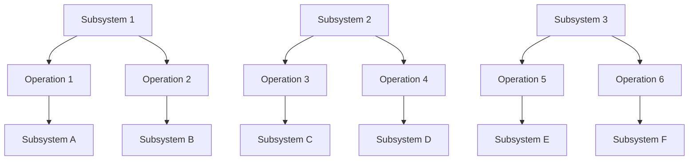
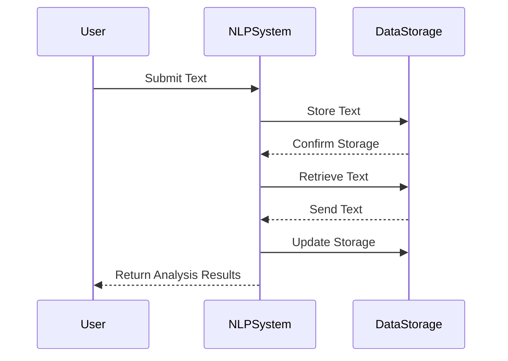

                 

### 第1章 引言

#### 1.1 问题背景

在全球化的大背景下，多语言企业日益增多，这些企业在跨国运营、国际合作以及全球市场拓展中面临着诸多语言相关的问题。首先，多语言企业需要处理来自不同国家和地区的各种语言文本，如客户反馈、产品评价、市场调研报告等。这些文本在格式、语法和表达方式上存在显著差异，给企业的数据处理、分析和应用带来了极大的挑战。

此外，随着全球化进程的加深，企业内部的沟通也逐渐呈现出多语言化的趋势。国际团队之间需要跨越语言障碍进行有效的交流与合作，这不仅仅是对企业内部沟通效率的考验，更是对企业国际化战略的考验。如何在多语言环境中实现高效的沟通和信息传递，成为多语言企业亟需解决的重要问题。

#### 1.1.1 多语言企业面临的问题

多语言企业主要面临以下几个问题：

1. **语言差异导致的理解障碍**：不同语言在语法、词汇、表达方式上存在差异，使得文本的理解和翻译变得复杂。例如，一词多义、同音异义词等常常导致误解。

2. **信息孤岛问题**：企业内部不同部门、不同国家团队之间的沟通不畅，导致信息无法及时共享和利用，影响企业决策和业务流程的效率。

3. **人力资源成本高**：多语言企业需要大量的翻译和语言支持人员，这不仅增加了人力资源成本，还可能影响企业的灵活性和应变能力。

4. **跨文化沟通挑战**：不同文化背景下的表达方式和沟通习惯差异，可能导致误解和冲突，影响团队协作和国际合作。

#### 1.1.2 自然语言处理技术的优势

自然语言处理（Natural Language Processing，NLP）技术为解决多语言企业面临的问题提供了有效手段。NLP是计算机科学、人工智能领域中的一个重要分支，旨在让计算机理解和处理人类自然语言。以下是NLP技术的主要优势：

1. **自动文本处理**：NLP技术能够自动处理大量的多语言文本数据，包括文本的提取、分类、翻译等，大大提高了数据处理效率和准确性。

2. **减少人力资源成本**：通过自动化处理文本，企业可以减少对翻译和语言支持人员的依赖，降低人力资源成本。

3. **提高信息共享和协作效率**：NLP技术可以帮助企业实现跨语言的信息共享和协作，打破信息孤岛，提高团队协作效率。

4. **跨文化沟通支持**：NLP技术可以提供跨文化的沟通支持，帮助国际团队更好地理解和协作，减少文化差异带来的沟通障碍。

#### 1.2 问题描述

多语言企业在数据处理、分析、沟通等方面面临着诸多挑战。这些问题主要集中在以下几个方面：

1. **多语言文本的数据处理和存储**：企业需要处理大量的多语言文本数据，如何高效地存储和管理这些数据，同时保证数据的一致性和准确性，是一个关键问题。

2. **文本的理解和翻译**：不同语言之间的语法和表达方式差异，使得文本的理解和翻译变得复杂。企业需要解决如何准确理解多语言文本，并将其翻译成其他语言。

3. **跨语言的信息共享和协作**：企业内部不同部门和团队之间的跨语言沟通不畅，影响信息共享和协作效率。企业需要找到有效的解决方案，促进多语言环境下的信息传递和团队协作。

4. **跨文化沟通和协作**：不同文化背景下的表达方式和沟通习惯差异，可能导致误解和冲突。企业需要提供跨文化的沟通支持，帮助团队更好地理解和协作。

#### 1.3 问题解决

为了解决多语言企业面临的问题，自然语言处理技术提供了以下几个解决方案：

1. **文本预处理**：通过对多语言文本进行预处理，如分词、词性标注、语言检测等，可以降低文本处理的复杂度，提高后续处理的准确性和效率。

2. **语言模型和词向量**：利用语言模型和词向量技术，可以建立对多语言文本的语义理解，实现文本的分类、情感分析、命名实体识别等功能。

3. **机器翻译**：通过机器翻译技术，可以将一种语言的文本翻译成其他语言，帮助企业实现跨语言的信息共享和协作。

4. **深度学习与自动化**：利用深度学习技术，可以进一步提高自然语言处理的准确性和效率，实现自动化处理，降低人工干预成本。

#### 1.4 边界与外延

尽管自然语言处理技术在多语言企业的应用中具有显著的潜力，但仍然存在一些局限性：

1. **语言差异和复杂性**：不同语言之间存在差异和复杂性，使得NLP技术在某些语言上的效果可能不如其他语言。

2. **数据质量和标注**：NLP算法的性能很大程度上依赖于训练数据的质量和标注的准确性，而在多语言环境中，这些条件可能难以满足。

3. **文化差异与误解**：尽管NLP技术可以提供跨文化的沟通支持，但仍然难以完全消除文化差异带来的误解和冲突。

4. **实时性与响应速度**：在实时场景下，NLP技术可能难以满足高响应速度的要求，特别是在处理大量多语言文本时。

然而，随着自然语言处理技术的不断发展和完善，多语言企业在未来仍将迎来更多的机遇：

1. **全球化趋势的加剧**：随着全球化进程的加深，多语言企业将面临更大的市场需求，这为NLP技术的应用提供了广阔的前景。

2. **技术的不断进步**：深度学习、大规模预训练模型等新兴技术的应用，将进一步推动自然语言处理技术的发展，提高其性能和适用性。

3. **行业需求多样化**：不同行业对多语言自然语言处理的需求多样化，将推动NLP技术在更多领域的应用和创新。

### 1.5 概念结构与核心要素组成

自然语言处理在多语言企业中的应用涉及以下几个核心概念和要素：

- **自然语言处理（NLP）**：涉及文本预处理、语言模型、词向量、机器翻译等核心技术。
- **多语言文本**：包括不同语言的文本数据，如英文、中文、西班牙语等。
- **文本预处理**：包括分词、词性标注、语言检测等步骤，为后续处理提供基础。
- **语言模型**：用于理解和生成自然语言，包括统计语言模型和神经网络语言模型。
- **词向量**：用于表示词语的数学向量，有助于文本分析和机器翻译。
- **机器翻译**：将一种语言的文本翻译成其他语言，实现跨语言信息传递。
- **企业需求**：包括多语言文本处理、信息共享、跨文化沟通等实际需求。

通过这些核心概念和要素的有机组合，自然语言处理技术能够为多语言企业提供有效的解决方案，助力企业在全球化竞争中取得优势。

## 第1章 引言

### 1.1 问题背景

随着全球化的深入发展，多语言企业的重要性日益凸显。这些企业不仅在跨国运营、国际合作和市场拓展中面临诸多挑战，同时也面临着语言差异带来的复杂问题。首先，多语言企业需要处理来自不同国家和地区的大量多语言文本数据，包括客户反馈、产品评价、市场调研报告等。这些文本在格式、语法和表达方式上存在显著差异，使得数据处理、分析和应用变得复杂。

其次，企业内部的国际团队之间需要跨越语言障碍进行有效的沟通与合作。不同团队之间的语言差异可能导致误解和沟通不畅，影响团队协作和国际合作的效率。此外，多语言企业还需要应对人力资源成本高、跨文化沟通挑战等问题。

### 1.2 问题描述

多语言企业在数据处理、分析和沟通等方面面临的主要问题如下：

1. **语言差异导致的理解障碍**：不同语言在语法、词汇、表达方式上存在差异，使得文本的理解和翻译变得复杂。一词多义、同音异义词等常见现象常常导致误解。

2. **信息孤岛问题**：企业内部不同部门、不同国家团队之间的沟通不畅，导致信息无法及时共享和利用，影响企业决策和业务流程的效率。

3. **人力资源成本高**：多语言企业需要大量的翻译和语言支持人员，这不仅增加了人力资源成本，还可能影响企业的灵活性和应变能力。

4. **跨文化沟通挑战**：不同文化背景下的表达方式和沟通习惯差异，可能导致误解和冲突，影响团队协作和国际合作。

### 1.3 问题解决

为了解决上述问题，自然语言处理技术提供了以下几种解决方案：

1. **文本预处理**：通过对多语言文本进行预处理，如分词、词性标注、语言检测等，可以降低文本处理的复杂度，提高后续处理的准确性和效率。

2. **语言模型和词向量**：利用语言模型和词向量技术，可以建立对多语言文本的语义理解，实现文本的分类、情感分析、命名实体识别等功能。

3. **机器翻译**：通过机器翻译技术，可以将一种语言的文本翻译成其他语言，帮助企业实现跨语言的信息共享和协作。

4. **深度学习与自动化**：利用深度学习技术，可以进一步提高自然语言处理的准确性和效率，实现自动化处理，降低人工干预成本。

### 1.4 边界与外延

自然语言处理技术在多语言企业中的应用具有一定的局限性：

1. **语言差异和复杂性**：不同语言之间存在差异和复杂性，使得NLP技术在某些语言上的效果可能不如其他语言。

2. **数据质量和标注**：NLP算法的性能很大程度上依赖于训练数据的质量和标注的准确性，而在多语言环境中，这些条件可能难以满足。

3. **文化差异与误解**：尽管NLP技术可以提供跨文化的沟通支持，但仍然难以完全消除文化差异带来的误解和冲突。

4. **实时性与响应速度**：在实时场景下，NLP技术可能难以满足高响应速度的要求，特别是在处理大量多语言文本时。

然而，随着自然语言处理技术的不断发展和完善，多语言企业在未来仍将迎来更多的机遇：

1. **全球化趋势的加剧**：随着全球化进程的加深，多语言企业将面临更大的市场需求，这为NLP技术的应用提供了广阔的前景。

2. **技术的不断进步**：深度学习、大规模预训练模型等新兴技术的应用，将进一步推动自然语言处理技术的发展，提高其性能和适用性。

3. **行业需求多样化**：不同行业对多语言自然语言处理的需求多样化，将推动NLP技术在更多领域的应用和创新。

### 1.5 概念结构与核心要素组成

自然语言处理在多语言企业中的应用涉及以下几个核心概念和要素：

- **自然语言处理（NLP）**：涉及文本预处理、语言模型、词向量、机器翻译等核心技术。
- **多语言文本**：包括不同语言的文本数据，如英文、中文、西班牙语等。
- **文本预处理**：包括分词、词性标注、语言检测等步骤，为后续处理提供基础。
- **语言模型**：用于理解和生成自然语言，包括统计语言模型和神经网络语言模型。
- **词向量**：用于表示词语的数学向量，有助于文本分析和机器翻译。
- **机器翻译**：将一种语言的文本翻译成其他语言，实现跨语言信息传递。
- **企业需求**：包括多语言文本处理、信息共享、跨文化沟通等实际需求。

通过这些核心概念和要素的有机组合，自然语言处理技术能够为多语言企业提供有效的解决方案，助力企业在全球化竞争中取得优势。

### 1.6 文章关键词

- 多语言企业
- 自然语言处理
- 文本预处理
- 语言模型
- 词向量
- 机器翻译

### 1.7 摘要

本文主要探讨了自然语言处理在多语言企业中的应用。通过分析多语言企业面临的语言差异、信息孤岛、人力资源成本高和跨文化沟通挑战等问题，本文提出了利用自然语言处理技术，如文本预处理、语言模型、词向量、机器翻译等解决方案。同时，本文阐述了自然语言处理技术的优势、局限性及未来发展趋势，并给出了多语言企业应用中的具体案例。文章旨在为多语言企业提供一个全面、系统的自然语言处理知识框架，帮助其在全球化竞争中取得优势。

## 第2章 自然语言处理基础

### 2.1 语言模型

#### 2.1.1 语言模型的定义

语言模型（Language Model）是自然语言处理（NLP）中用于生成和预测自然语言文本的基础工具。它是一个概率模型，用于估计给定前文序列 \(w_{1}, w_{2}, \ldots, w_{i-1}\) 下，下一个单词或标记 \(w_i\) 的概率 \(P(w_i | w_{1}, w_{2}, \ldots, w_{i-1})\)。简而言之，语言模型能够理解和生成自然语言，其核心目标是通过分析大量文本数据，学习出文本出现的规律，从而准确预测下一个单词。

#### 2.1.2 语言模型的类型

语言模型主要可以分为两大类：统计语言模型和神经网络语言模型。

1. **统计语言模型**：统计语言模型基于概率论和统计学原理，通过对大量文本数据进行分析和建模，学习出文本序列的概率分布。其中，N-gram模型是最基本的统计语言模型之一，它使用前N个单词的联合概率来预测下一个单词。例如，三元语言模型（Trigram Model）考虑了前三个单词对下一个单词的影响。

   \[ P(w_i | w_{i-2}, w_{i-1}) = \frac{C(w_{i-2}, w_{i-1}, w_i)}{C(w_{i-2}, w_{i-1})} \]

   其中，\(C(w_{i-2}, w_{i-1}, w_i)\) 是三词序列 \(w_{i-2}, w_{i-1}, w_i\) 的计数，\(C(w_{i-2}, w_{i-1})\) 是前两个词 \(w_{i-2}, w_{i-1}\) 的计数。

2. **神经网络语言模型**：神经网络语言模型基于深度学习技术，通过构建复杂的神经网络结构来学习文本数据中的模式。最常用的神经网络语言模型是循环神经网络（RNN），特别是长短期记忆网络（LSTM）和门控循环单元（GRU）。这些模型能够更好地捕捉文本序列中的长期依赖关系。

   \[ h_t = \text{LSTM}(h_{t-1}, x_t) \]

   其中，\(h_t\) 表示在时间步 \(t\) 的隐藏状态，\(x_t\) 是输入的单词或词向量。

#### 2.1.3 语言模型在多语言企业中的应用

在多语言企业中，语言模型有着广泛的应用：

1. **自动摘要**：通过语言模型，可以自动生成摘要，帮助企业快速了解多语言文本的主要内容，提高信息获取效率。

2. **文本生成**：企业可以使用语言模型来生成报告、邮件等文本内容，减少人工撰写的工作量。

3. **机器翻译**：语言模型在机器翻译中起着至关重要的作用。在翻译过程中，语言模型可以预测目标语言中下一个单词或短语的概率，从而提高翻译的准确性和流畅性。

4. **情感分析**：通过语言模型，可以分析文本的情感倾向，帮助企业了解客户反馈和市场动态。

### 2.2 词向量表示

#### 2.2.1 词向量的定义

词向量（Word Vector）是将自然语言中的词汇映射为高维空间中的向量表示。这种表示方法有助于计算机理解和处理文本数据。词向量的基本思想是将每个单词或词组映射为一个固定长度的向量，使其在语义上相关的词在向量空间中接近。

#### 2.2.2 词向量模型

词向量模型主要包括以下几种：

1. **基于计数的方法**：这类方法通过统计单词在文本中的出现次数或频率来表示词向量。例如，TF-IDF（Term Frequency-Inverse Document Frequency）模型根据单词在单个文档中的频率和在整个文档集合中的逆向文档频率来计算词向量。

2. **基于分布的方法**：这类方法通过分析单词在上下文中的分布情况来表示词向量。Word2Vec是最常用的基于分布的词向量模型，它使用神经网络来学习单词的向量表示。Word2Vec包括两种常见的算法：连续词袋（CBOW）和Skip-Gram。

   - **CBOW（Continuous Bag of Words）**：CBOW模型通过预测中心词周围的词来学习词向量，即给定一个中心词，预测其上下文词的概率分布。
   
   - **Skip-Gram**：与CBOW相反，Skip-Gram模型通过预测中心词来学习词向量，即给定一个单词，预测其上下文词的概率分布。

3. **基于深度学习的方法**：这类方法使用深度神经网络来学习词向量，如GloVe（Global Vectors for Word Representation）模型。GloVe模型通过优化单词的共现矩阵来学习词向量，从而提高词向量在语义上的表示能力。

#### 2.2.3 词向量在多语言企业中的应用

词向量在多语言企业中的应用包括：

1. **文本分类**：通过词向量，可以将文本数据转化为向量表示，便于计算机进行分类和情感分析。

2. **机器翻译**：词向量可以帮助翻译模型更好地捕捉词汇之间的语义关系，提高翻译的准确性和流畅性。

3. **情感分析**：通过词向量，可以分析文本中的情感倾向，帮助企业了解客户反馈和市场动态。

### 2.3 分词与词性标注

#### 2.3.1 分词算法

分词（Tokenization）是将文本划分为一系列具有独立意义的单元（即单词或短语）的过程。常见的分词算法包括：

1. **基于规则的分词算法**：这类算法根据预先定义的规则进行分词，如正则表达式分词。优点是规则明确，但缺点是规则复杂且难以覆盖所有情况。

2. **基于统计的分词算法**：这类算法通过分析大量文本数据，学习出分词模式。例如，基于最大熵模型的分词算法利用统计模型来预测最优的分词结果。

3. **基于深度学习的分词算法**：这类算法使用深度神经网络来学习分词模式，如LSTM和BiLSTM（双向LSTM）。深度学习模型能够更好地捕捉上下文信息，提高分词的准确性。

#### 2.3.2 词性标注算法

词性标注（Part-of-Speech Tagging）是将文本中的每个单词或短语标注为相应的词性（如名词、动词、形容词等）。常见的词性标注算法包括：

1. **基于规则的方法**：这类方法通过定义一系列规则进行词性标注。优点是规则明确，但缺点是规则复杂且难以覆盖所有情况。

2. **基于统计的方法**：这类方法通过统计模型（如隐马尔可夫模型HMM、条件随机场CRF等）进行词性标注。优点是能够处理复杂的文本结构，但需要大量的标注数据。

3. **基于深度学习的方法**：这类方法使用深度神经网络进行词性标注，如LSTM和BiLSTM。深度学习模型能够更好地捕捉上下文信息，提高词性标注的准确性。

#### 2.3.3 分词与词性标注在多语言企业中的应用

分词与词性标注在多语言企业中的应用包括：

1. **文本分析**：通过分词与词性标注，可以更好地理解和分析多语言文本，为后续的文本分类、情感分析等任务提供基础。

2. **机器翻译**：准确的分词和词性标注有助于翻译模型更好地理解和生成多语言文本，提高翻译的准确性。

3. **命名实体识别**：通过分词和词性标注，可以更好地识别文本中的命名实体（如人名、地名、组织名等），有助于多语言文本的处理和分析。

### 2.4 本章节小结

本章介绍了自然语言处理中的基础概念，包括语言模型、词向量表示、分词与词性标注。通过这些基础技术，自然语言处理能够更好地理解和生成自然语言，为多语言企业在文本预处理、文本分析、机器翻译等领域提供强有力的支持。这些技术不仅在提升企业运营效率、降低成本方面具有显著作用，还为企业在全球市场中的竞争提供了有力保障。

## 第3章 多语言文本预处理

### 3.1 文本预处理概述

文本预处理是自然语言处理（NLP）中至关重要的一环，特别是在多语言企业中，它有助于提高后续处理任务的准确性和效率。文本预处理包括一系列步骤，如语言检测、文本清洗和文本标准化等。这些步骤不仅能够清除原始文本中的噪声和冗余信息，还能为文本分析和机器学习模型提供更加一致和结构化的数据。

#### 3.1.1 文本预处理的重要性

1. **提高数据处理效率**：通过对文本进行预处理，可以减少数据的复杂度，使后续处理任务更加高效。例如，通过语言检测，可以快速识别文本的语言类型，从而选择合适的语言模型进行处理。

2. **降低模型复杂性**：预处理步骤能够消除文本中的噪声和冗余信息，减少模型的复杂度，从而提高模型的性能和可解释性。

3. **提高模型准确性**：预处理步骤如分词、词性标注等能够更好地捕捉文本的语义信息，有助于提高文本分类、情感分析等任务的准确性。

4. **适应多语言环境**：在多语言企业中，文本预处理能够确保不同语言文本的一致性和标准化，为跨语言处理提供基础。

#### 3.1.2 多语言文本预处理的特点

多语言文本预处理与传统单语言文本预处理在方法和技术上存在一些区别：

1. **语言多样性**：多语言文本预处理需要处理多种语言的文本数据，每种语言都有其独特的语法和表达方式，这增加了预处理的复杂度。

2. **语言差异**：不同语言在分词、词性标注等方面存在显著差异，如中文的分词和日文的假名与汉字混合，这需要不同的预处理策略。

3. **多语言资源**：多语言文本预处理需要大量高质量的多语言数据集和工具，包括多语言词典、语法规则和语言模型等。

4. **跨语言一致性**：多语言企业需要一个统一的处理框架，确保不同语言的文本在预处理后具有一致性，便于后续的分析和集成。

### 3.2 语言检测

语言检测（Language Detection）是文本预处理的重要步骤之一，其目的是自动识别文本的语言类型。语言检测有助于选择合适的语言模型和预处理工具，从而提高后续处理的准确性和效率。

#### 3.2.1 语言检测的算法

语言检测算法主要分为以下几类：

1. **基于统计的方法**：这类方法使用统计语言模型，如N-gram模型，通过统计文本中单词或字符序列的频率来预测文本的语言类型。例如，K最近邻（K-Nearest Neighbor, KNN）算法通过计算测试文本与训练文本之间的距离来预测语言类型。

2. **基于机器学习的方法**：这类方法使用机器学习模型，如支持向量机（Support Vector Machine, SVM）、随机森林（Random Forest）等，通过训练多语言数据集来学习语言特征，从而实现语言检测。

3. **基于深度学习的方法**：深度学习模型，如卷积神经网络（Convolutional Neural Network, CNN）和循环神经网络（Recurrent Neural Network, RNN），能够更好地捕捉文本的复杂特征，从而提高语言检测的准确性。

#### 3.2.2 语言检测在多语言企业中的应用

语言检测在多语言企业中的应用包括：

1. **文本分类**：通过语言检测，可以将不同语言的文本数据分类到相应的语言类别，便于后续的文本处理和分析。

2. **多语言机器翻译**：在机器翻译过程中，语言检测可以帮助选择合适的翻译模型和参数，提高翻译的准确性和效率。

3. **跨语言信息检索**：通过语言检测，可以识别用户查询的语言类型，从而选择合适的多语言索引和检索策略，提高信息检索的准确性和响应速度。

4. **多语言文本分析**：在情感分析、命名实体识别等任务中，语言检测可以帮助确保文本数据的一致性和标准化，提高分析结果的准确性。

### 3.3 文本清洗

文本清洗（Text Cleaning）是文本预处理的重要步骤之一，旨在清除文本中的噪声和冗余信息，提高文本的质量和可读性。在多语言企业中，文本清洗需要处理不同语言的文本，因此具有更大的挑战性。

#### 3.3.1 文本清洗的步骤

文本清洗通常包括以下几个步骤：

1. **去除HTML标签**：HTML标签和特殊字符可能会干扰文本分析，因此需要去除这些内容。

2. **去除停用词**：停用词（Stop Words）是文本中的常见词语，如“的”、“了”、“是”等，这些词语通常不包含重要的语义信息，因此需要去除。

3. **去除特殊字符**：特殊字符（Special Characters）如标点符号、数字等，也可能影响文本分析，需要去除或转换。

4. **统一文本格式**：将不同格式（如全角、半角字符）统一为同一格式，以便后续处理。

5. **去除重复文本**：去除文本中的重复部分，减少冗余信息。

#### 3.3.2 文本清洗在多语言企业中的应用

文本清洗在多语言企业中的应用包括：

1. **提高文本质量**：通过去除噪声和冗余信息，可以提高文本的质量和可读性，为后续分析提供高质量的数据。

2. **优化模型性能**：高质量的文本数据有助于提高模型性能，减少噪声对模型训练和预测的影响。

3. **跨语言一致性**：在多语言环境中，文本清洗有助于确保不同语言文本的一致性，便于后续的跨语言处理和分析。

4. **提升用户体验**：在客户反馈、评论分析等应用场景中，文本清洗可以提升用户的阅读体验，帮助企业更好地理解和应对用户需求。

### 3.4 文本标准化

文本标准化（Text Normalization）是将文本转换为标准形式的过程，旨在消除语言之间的差异，提高文本的一致性和可比较性。在多语言企业中，文本标准化对于跨语言分析和处理具有重要意义。

#### 3.4.1 文本标准化的方法

文本标准化的方法主要包括以下几种：

1. **字符转换**：将不同字符集（如ASCII、UTF-8等）转换为统一的字符集，确保文本的一致性。

2. **数字标准化**：将文本中的数字转换为统一的表示形式，如将阿拉伯数字转换为汉字数字。

3. **日期和时间标准化**：将不同语言的日期和时间表示转换为统一的格式，如ISO 8601格式。

4. **文本格式化**：将文本中的格式化元素（如标题、段落、列表等）转换为统一的格式，便于后续处理。

5. **文本归一化**：将不同语言的文本归一化，如将中文的全角字符转换为半角字符，去除特殊字符等。

#### 3.4.2 文本标准化在多语言企业中的应用

文本标准化在多语言企业中的应用包括：

1. **跨语言文本比较**：通过文本标准化，可以消除语言之间的差异，实现跨语言文本的准确比较和分析。

2. **文本分类和聚类**：在文本分类和聚类任务中，文本标准化有助于提高分类和聚类的准确性，减少语言差异的影响。

3. **信息检索**：在多语言信息检索中，文本标准化有助于提高检索的准确性和响应速度，确保检索结果的一致性。

4. **多语言机器翻译**：在机器翻译过程中，文本标准化可以消除语言差异，提高翻译的准确性和流畅性。

### 3.5 本章节小结

本章介绍了多语言文本预处理的重要性和具体方法，包括语言检测、文本清洗和文本标准化。这些预处理步骤对于提高多语言企业文本处理的准确性和效率具有重要意义。通过语言检测，可以快速识别文本的语言类型；文本清洗可以去除噪声和冗余信息，提高文本质量；文本标准化则有助于消除语言差异，实现跨语言的一致性。这些预处理技术为多语言企业提供了有效的解决方案，有助于其在全球市场中更好地应对语言挑战。

## 第4章 多语言文本分析

### 4.1 文本分类

文本分类（Text Classification）是自然语言处理（NLP）中的一项重要任务，其目的是将文本数据自动分类到预定义的类别中。在多语言企业中，文本分类具有广泛的应用，如客户反馈分析、市场调研、新闻分类等。通过文本分类，企业能够快速理解和处理大量的多语言文本数据，从而做出更明智的商业决策。

#### 4.1.1 文本分类的算法

文本分类算法主要可以分为基于传统机器学习和基于深度学习的方法。

1. **基于传统机器学习的方法**：
   - **朴素贝叶斯分类器（Naive Bayes Classifier）**：基于贝叶斯定理和特征条件独立假设，朴素贝叶斯分类器适用于处理高维稀疏数据，是文本分类中的常用算法。
   
   \[ P(\text{Class} | \text{Features}) = \frac{P(\text{Features} | \text{Class})P(\text{Class})}{P(\text{Features})} \]

   - **支持向量机（Support Vector Machine, SVM）**：SVM是一种监督学习算法，通过找到一个最佳的超平面，将不同类别的文本数据分开。SVM适用于处理高维数据，特别适用于文本分类任务。

   - **随机森林（Random Forest）**：随机森林是一种基于决策树的集成学习方法，通过构建多棵决策树，并使用多数投票策略来预测类别。随机森林在处理大规模文本数据时表现出色。

2. **基于深度学习的方法**：
   - **卷积神经网络（Convolutional Neural Network, CNN）**：CNN是一种深度学习模型，特别适用于处理图像数据，但也可以应用于文本分类。通过卷积层捕捉文本的特征，CNN可以有效地处理高维稀疏数据。
   
   - **循环神经网络（Recurrent Neural Network, RNN）**：RNN能够处理序列数据，通过隐藏状态保留信息，RNN可以捕捉文本中的长距离依赖关系。LSTM（Long Short-Term Memory）和GRU（Gated Recurrent Unit）是RNN的变种，能够更好地处理长序列数据。

   - **变换器（Transformer）**：Transformer是一种基于自注意力机制的深度学习模型，特别适用于处理序列数据。通过自注意力机制，Transformer能够有效地捕捉文本中的依赖关系。

#### 4.1.2 文本分类在多语言企业中的应用

文本分类在多语言企业中的应用包括：

1. **客户反馈分析**：通过文本分类，企业可以对客户反馈进行分类和归纳，识别出客户关注的问题和需求，从而改进产品和服务。

2. **市场调研**：在市场调研中，文本分类可以帮助企业快速了解市场动态和消费者需求，为市场策略提供依据。

3. **新闻分类**：新闻媒体可以使用文本分类系统自动对新闻文章进行分类，提高新闻推荐的准确性和效率。

4. **情感分析**：文本分类可以用于情感分析，帮助企业了解客户对产品或服务的情感倾向，制定更有效的营销策略。

### 4.2 情感分析

情感分析（Sentiment Analysis）是一种文本分析技术，旨在识别文本中的情感倾向，如正面、负面或中性。在多语言企业中，情感分析有助于了解客户反馈、市场动态和品牌形象，从而做出更明智的商业决策。

#### 4.2.1 情感分析的算法

情感分析算法主要可以分为以下几种：

1. **基于规则的方法**：这种方法通过定义一系列规则来识别文本中的情感词汇和短语。例如，可以使用情感词典来标记具有特定情感的词汇。

2. **基于统计的方法**：这种方法通过统计文本中情感词汇的频率和组合模式来预测情感倾向。例如，可以使用情感词典和文本分类器（如朴素贝叶斯分类器）来识别文本的情感。

3. **基于机器学习的方法**：这种方法使用机器学习算法（如SVM、随机森林、LSTM等）来训练模型，识别文本中的情感。这些算法可以从大量标注数据中学习情感特征，从而提高情感分析的准确性。

4. **基于深度学习的方法**：这种方法使用深度学习模型（如CNN、RNN、Transformer等）来捕捉文本中的复杂情感特征。深度学习模型能够更好地捕捉文本中的长距离依赖关系，从而提高情感分析的准确性。

#### 4.2.2 情感分析在多语言企业中的应用

情感分析在多语言企业中的应用包括：

1. **客户反馈分析**：通过情感分析，企业可以了解客户对产品或服务的情感倾向，从而改进产品和服务，提高客户满意度。

2. **市场调研**：在市场调研中，情感分析可以帮助企业了解消费者对品牌和产品的情感态度，为市场策略提供依据。

3. **品牌监控**：通过情感分析，企业可以监控社交媒体和论坛上的品牌提及，了解公众对品牌的情感态度，及时应对负面情绪。

4. **舆情分析**：在公共事件或危机管理中，情感分析可以帮助企业了解公众对事件或品牌的情感反应，制定有效的公关策略。

### 4.3 命名实体识别

命名实体识别（Named Entity Recognition, NER）是一种文本分析技术，旨在识别文本中的命名实体，如人名、地名、组织名、日期等。在多语言企业中，命名实体识别有助于提取关键信息，提高文本处理的准确性和效率。

#### 4.3.1 命名实体识别的算法

命名实体识别算法主要可以分为以下几种：

1. **基于规则的方法**：这种方法通过定义一系列规则来识别命名实体。例如，可以使用正则表达式来匹配特定格式的命名实体。

2. **基于统计的方法**：这种方法通过统计命名实体的出现模式来识别命名实体。例如，可以使用最大熵模型或条件随机场（CRF）来预测文本中的命名实体。

3. **基于机器学习的方法**：这种方法使用机器学习算法（如SVM、随机森林、LSTM等）来训练模型，识别文本中的命名实体。这些算法可以从大量标注数据中学习命名实体的特征，从而提高识别的准确性。

4. **基于深度学习的方法**：这种方法使用深度学习模型（如CNN、RNN、Transformer等）来捕捉文本中的复杂命名实体特征。深度学习模型能够更好地捕捉文本中的长距离依赖关系，从而提高命名实体识别的准确性。

#### 4.3.2 命名实体识别在多语言企业中的应用

命名实体识别在多语言企业中的应用包括：

1. **数据提取**：通过命名实体识别，可以提取文本中的关键信息，如人名、地名、组织名等，便于后续的数据处理和分析。

2. **信息检索**：在信息检索系统中，命名实体识别可以帮助提高检索的准确性和效率，确保用户能够快速找到所需信息。

3. **跨语言文本分析**：通过命名实体识别，可以消除语言差异，实现跨语言文本的一致性处理和分析。

4. **客户关系管理**：在客户关系管理中，命名实体识别可以帮助企业识别客户信息，如客户姓名、联系方式等，从而提供更个性化的服务。

### 4.4 本章节小结

本章介绍了多语言文本分析中的几种重要任务，包括文本分类、情感分析和命名实体识别。文本分类有助于企业快速理解和处理多语言文本数据，情感分析帮助企业了解客户和市场的情感倾向，命名实体识别则有助于提取关键信息，提高文本处理的准确性和效率。这些文本分析技术为多语言企业在数据处理、信息提取和决策支持方面提供了强有力的支持，有助于企业更好地应对全球化挑战。

## 第5章 多语言翻译

### 5.1 翻译概述

多语言翻译（Multilingual Translation）是自然语言处理（NLP）中的一个核心任务，旨在将一种语言的文本翻译成另一种语言。随着全球化进程的加深，多语言翻译在商业、学术、文化交流等领域具有广泛的应用。高效的翻译系统能够帮助企业实现跨国运营、促进文化交流，提升国际化服务水平。

#### 5.1.1 翻译的原理

翻译原理主要涉及以下几个方面：

1. **词汇映射**：将源语言中的词汇映射到目标语言中。这包括词汇的同义替换、词义扩展和词义缩减等。

2. **语法转换**：将源语言的语法结构转换为适当的语法形式，以适应目标语言的语法规则。例如，调整句子结构、时态和语态等。

3. **语义理解**：理解源语言文本的语义信息，并将其准确地传达给目标语言。这包括语义关系的识别、语义角色标注和语义角色转换等。

4. **上下文适应**：根据上下文信息调整翻译结果，确保翻译的准确性和流畅性。上下文适应包括词汇选择、句子重组和语境转换等。

#### 5.1.2 翻译的类型

多语言翻译可以分为以下几种类型：

1. **机器翻译（Machine Translation, MT）**：机器翻译是一种自动化翻译方法，通过计算机程序将一种语言的文本翻译成另一种语言。机器翻译分为基于规则的方法和基于统计的方法。

2. **规则翻译**：基于规则的方法使用预先定义的翻译规则进行翻译。这种方法包括词对词翻译、短语翻译和句子翻译等。规则翻译的优点是翻译结果可控，但缺点是规则复杂且难以覆盖所有情况。

3. **统计翻译**：基于统计的方法使用大量的双语语料库来学习翻译模式。这种方法通过统计源语言和目标语言之间的关联，自动生成翻译结果。统计翻译的优点是能够处理大量文本，但缺点是翻译结果可能不够准确。

4. **基于实例的翻译（Example-Based Translation, EBT）**：基于实例的翻译方法通过搜索双语语料库中与源句子相似的句子，来生成目标句子。这种方法结合了规则翻译和统计翻译的优点，能够提高翻译的准确性。

5. **交互式翻译**：交互式翻译系统允许用户参与翻译过程，通过用户反馈不断优化翻译结果。这种方法提高了翻译的灵活性和准确性。

6. **神经机器翻译（Neural Machine Translation, NMT）**：神经机器翻译是一种基于深度学习的方法，通过神经网络模型（如循环神经网络RNN、长短时记忆网络LSTM、变换器Transformer等）来学习翻译任务。神经机器翻译在捕捉语言依赖关系和生成流畅自然的目标语言文本方面表现出色。

### 5.2 神经机器翻译

神经机器翻译是一种基于深度学习的方法，通过神经网络模型来学习翻译任务。近年来，神经机器翻译在翻译性能和准确性方面取得了显著进展，成为多语言翻译领域的热点研究课题。

#### 5.2.1 神经机器翻译的算法

神经机器翻译算法主要基于变换器（Transformer）架构。变换器是一种基于自注意力机制的深度学习模型，特别适用于处理序列数据。变换器通过自注意力机制，能够同时关注输入序列中的所有单词，从而捕捉长距离依赖关系，生成流畅自然的翻译结果。

1. **编码器（Encoder）**：编码器将源语言文本序列转换为高维向量表示，以便捕捉文本的语义信息。编码器通常由多个变换器层堆叠而成，每层通过自注意力机制和前馈神经网络，对文本序列进行编码。

2. **解码器（Decoder）**：解码器将编码器的输出逐步解码为目标语言文本序列。解码器也由多个变换器层组成，每层通过自注意力机制和编码器-解码器注意力机制，生成目标语言的单词序列。

3. **编码器-解码器注意力机制**：编码器-解码器注意力机制是一种关键技术，它允许解码器在生成目标语言时，关注编码器输出中的特定部分，从而提高翻译的准确性。

4. **损失函数**：神经机器翻译通常使用交叉熵损失函数来训练模型。交叉熵损失函数衡量预测分布和真实分布之间的差异，通过最小化交叉熵损失，模型能够学习到最佳的翻译参数。

#### 5.2.2 神经机器翻译在多语言企业中的应用

神经机器翻译在多语言企业中的应用包括：

1. **企业内部沟通**：通过神经机器翻译，企业可以实现不同语言之间的无缝沟通，提高跨文化团队的协作效率。

2. **客户服务**：企业可以利用神经机器翻译，为全球客户提供多语言支持，提高客户满意度和忠诚度。

3. **产品文档**：神经机器翻译可以帮助企业将产品文档翻译成多种语言，为不同地区的用户提供本地化的服务。

4. **市场营销**：在跨国营销活动中，神经机器翻译可以为企业提供多语言宣传材料，拓展国际市场。

5. **全球化运营**：通过神经机器翻译，企业可以实现全球化的运营和管理，提高跨国业务的管理效率和决策准确性。

### 5.3 数据同化翻译

数据同化翻译（Data-Driven Translation）是一种结合规则翻译和统计翻译的方法，旨在提高翻译的准确性和效率。数据同化翻译通过利用大规模的双语数据集，结合规则和统计方法，生成高质量的翻译结果。

#### 5.3.1 数据同化翻译的算法

数据同化翻译算法主要涉及以下几个步骤：

1. **数据预处理**：对双语数据集进行预处理，包括文本清洗、分词、词性标注等，确保数据的一致性和质量。

2. **规则提取**：通过分析双语数据集，提取翻译规则。这些规则包括词对词翻译规则、短语翻译规则和句子翻译规则等。

3. **统计模型训练**：使用统计方法，如N-gram模型、隐马尔可夫模型（HMM）、条件随机场（CRF）等，训练统计模型，学习源语言和目标语言之间的关联。

4. **规则-统计融合**：将提取的翻译规则和训练好的统计模型进行融合，生成最终的翻译结果。规则和统计模型可以分别用于不同的翻译阶段，如词级翻译、句级翻译等。

5. **优化和调整**：根据翻译效果，对翻译规则和统计模型进行优化和调整，提高翻译的准确性和流畅性。

#### 5.3.2 数据同化翻译在多语言企业中的应用

数据同化翻译在多语言企业中的应用包括：

1. **个性化翻译**：通过分析用户的语言偏好和使用习惯，数据同化翻译可以为企业提供个性化的翻译服务，满足不同用户的需求。

2. **多语言文档管理**：数据同化翻译可以帮助企业管理和翻译大量的多语言文档，提高文档管理的效率和准确性。

3. **跨语言知识库构建**：通过数据同化翻译，企业可以构建跨语言的知识库，实现知识共享和传递，提高企业的知识管理能力。

4. **多语言客服支持**：数据同化翻译可以为企业提供多语言客服支持，提高客户服务的质量和响应速度。

### 5.4 本章节小结

本章介绍了多语言翻译的基本原理、算法和应用。通过神经机器翻译和数据同化翻译，企业可以高效地实现多语言翻译，提高跨语言沟通和协作的效率。多语言翻译在多语言企业中具有广泛的应用，包括企业内部沟通、客户服务、产品文档、市场营销和全球化运营等方面，为企业在全球市场中取得竞争优势提供了有力支持。

## 第6章 多语言企业应用案例

### 6.1 企业内部多语言沟通

#### 6.1.1 案例背景

随着全球化进程的加快，越来越多的企业开始在国际市场上开展业务，形成了一个多文化、多语言的跨国工作环境。这些企业在内部沟通、团队合作和知识共享方面面临诸多挑战。例如，不同国家的员工可能使用不同的语言进行交流，导致信息传递不畅、误解和沟通障碍。为了提高国际团队的协作效率和沟通效果，企业迫切需要一种有效的多语言沟通解决方案。

#### 6.1.2 解决方案

为了解决上述问题，某国际企业决定采用自然语言处理（NLP）技术，特别是基于机器翻译和语言检测的解决方案，来支持企业内部的跨国沟通。以下是具体实施步骤：

1. **语言检测**：首先，在企业内部部署一个自动化的语言检测系统，用于识别员工发送的邮件、即时消息和其他沟通内容的语言类型。通过语言检测，系统能够快速确定沟通内容的语言，从而为后续的翻译提供基础。

2. **机器翻译**：接着，企业引入了一个基于神经机器翻译（NMT）的系统，用于将非母语员工的沟通内容自动翻译成其母语。例如，如果一位法国员工发送了一封英文邮件，系统会自动将其翻译成法文，使得法国员工能够轻松理解邮件内容。

3. **实时翻译**：为了确保沟通的实时性，企业选择了支持实时翻译的即时通讯工具，如Slack或Microsoft Teams。这些工具集成了NLP API，能够自动翻译聊天内容，实现跨国团队的无障碍沟通。

4. **个性化设置**：为了满足不同员工的需求，系统允许用户自定义翻译设置。员工可以选择自动翻译所有消息、仅翻译特定语言的消息或者关闭自动翻译功能。此外，系统还提供了翻译校对功能，用户可以在必要时手动调整翻译结果。

5. **培训和反馈**：企业还组织了专门的培训，教导员工如何有效地使用翻译工具，并提供反馈机制，以便持续优化翻译系统的性能。

#### 6.1.3 实施效果

自引入NLP技术支持内部多语言沟通以来，该企业取得了显著的效果：

1. **沟通效率提升**：跨国团队之间的沟通变得更加顺畅，信息传递速度明显加快。员工不再因为语言障碍而浪费时间寻找合适的翻译解决方案，从而提高了工作效率。

2. **知识共享增强**：语言障碍的消除使得企业内部的知识共享更加有效，员工能够更快地获取和分享关键信息，促进了团队合作和知识传播。

3. **员工满意度提高**：员工对跨国沟通的满意度显著提升，感受到企业对国际化战略的重视和对个人语言能力的尊重，增强了员工的归属感和工作积极性。

4. **成本节约**：通过自动化翻译系统，企业减少了人工翻译的需求，降低了翻译成本，同时提高了翻译效率和质量。

5. **文化理解加深**：员工在跨语言沟通中能够更好地理解不同文化的表达方式和沟通习惯，加深了企业内部的文化融合，促进了多元文化的交流与发展。

#### 6.1.4 案例总结

该案例展示了NLP技术在多语言企业内部沟通中的应用价值。通过部署语言检测和机器翻译系统，企业成功地解决了跨国沟通中的语言障碍，提高了沟通效率和团队协作能力。这一解决方案不仅节约了成本，还提升了员工的满意度和工作积极性，为企业全球化运营提供了有力支持。

### 6.2 企业对外多语言服务

#### 6.2.1 案例背景

随着全球化的发展，企业需要在全球范围内提供高质量的多语言服务，以满足不同国家和地区的客户需求。这些服务包括客户支持、市场营销、产品文档等。然而，传统的多语言服务方法往往成本高昂且效率低下。为了在竞争激烈的国际市场中脱颖而出，企业需要寻找一种高效、经济的多语言服务解决方案。

#### 6.2.2 解决方案

为了提升对外多语言服务的质量，某国际企业决定采用基于NLP技术的自动化多语言服务系统。以下是该解决方案的实施步骤：

1. **多语言文本预处理**：首先，企业对来自不同国家和地区的客户反馈、市场调研数据、产品评价等文本进行预处理。预处理步骤包括语言检测、文本清洗、分词、词性标注等，以确保文本数据的一致性和高质量。

2. **情感分析和文本分类**：利用NLP技术，企业对预处理后的文本数据进行情感分析和文本分类。通过情感分析，企业可以了解客户对产品和服务的情感倾向，从而制定更有效的客户关系管理策略。通过文本分类，企业可以快速将大量文本数据分类到预定义的类别中，如正面评价、负面评价、投诉等，以便进行针对性处理。

3. **机器翻译**：为了提供多语言支持，企业部署了一个基于神经机器翻译（NMT）的系统，能够自动将文本翻译成多种目标语言。通过NMT技术，企业能够快速生成高质量、自然的翻译结果，确保客户在不同语言环境中都能获得一致的服务体验。

4. **多语言搜索引擎**：企业开发了一个多语言搜索引擎，允许客户使用不同语言搜索产品信息、用户指南和常见问题解答（FAQ）。搜索引擎集成了NLP技术，能够理解并处理多语言查询，提高客户的搜索体验和满意度。

5. **本地化营销内容**：企业利用NLP技术，对市场营销内容进行本地化处理。通过情感分析和文本分类，企业能够了解不同地区客户的需求和偏好，从而生成定制化的营销内容。这些内容不仅能够吸引目标客户，还能提升品牌形象。

6. **用户反馈循环**：企业建立了用户反馈循环机制，通过收集客户对多语言服务的反馈，不断优化翻译和本地化内容，提高服务质量。用户反馈机制还包括在线调查、用户评论和评分等，帮助企业持续改进服务。

#### 6.2.3 实施效果

自实施基于NLP技术的多语言服务系统以来，该企业取得了显著的成效：

1. **服务质量提升**：通过自动化翻译和本地化技术，企业能够提供高质量、一致的多语言服务，提升客户满意度和忠诚度。

2. **运营成本降低**：自动化多语言服务系统大幅减少了人工翻译和本地化的工作量，降低了运营成本。同时，NLP技术的高效处理能力，使得企业能够以更低的成本处理大量文本数据。

3. **客户满意度提高**：多语言服务系统能够快速响应客户的查询和反馈，提供及时、准确的帮助，提升了客户满意度。

4. **市场覆盖扩大**：通过提供多语言服务，企业能够更好地进入国际市场，扩大市场份额，增加销售机会。

5. **品牌形象提升**：企业通过多语言服务展示了对全球客户的重视和关注，提升了品牌形象和国际知名度。

#### 6.2.4 案例总结

该案例展示了NLP技术在企业对外多语言服务中的应用效果。通过自动化翻译、情感分析和文本分类等技术，企业能够高效地提供多语言服务，提高客户满意度和市场竞争力。这一解决方案不仅降低了运营成本，还提升了服务质量，为企业国际化战略提供了有力支持。

### 6.3 本章节小结

本章通过两个实际案例，展示了自然语言处理（NLP）技术在企业内部多语言沟通和对外多语言服务中的应用。通过语言检测、机器翻译、情感分析和文本分类等NLP技术，企业能够有效解决跨国沟通中的语言障碍，提供高质量的多语言服务。这些应用不仅提升了企业的运营效率和市场竞争力，还增强了员工的协作和客户满意度。未来，随着NLP技术的不断发展和完善，企业将有更多的创新应用场景，进一步推动全球化进程。


## 第7章 未来展望

### 7.1 自然语言处理技术的发展趋势

自然语言处理（NLP）技术在过去几十年中取得了显著进展，但随着人工智能（AI）和深度学习（Deep Learning）的快速发展，NLP技术也在不断演变和进步。以下是自然语言处理技术在未来几年的几个主要发展趋势：

1. **深度学习在NLP中的应用**：深度学习模型，特别是基于变换器（Transformer）的模型，如BERT、GPT等，已经成为了NLP领域的标准工具。这些模型能够捕捉文本中的复杂依赖关系，生成更准确、更自然的语言。未来，深度学习模型将在NLP中发挥更加重要的作用，推动NLP技术的进一步发展。

2. **预训练模型的大规模应用**：预训练模型通过在大规模语料库上预训练，然后在小规模特定任务上进行微调，取得了显著的性能提升。未来，更多的大规模预训练模型将被开发和应用，如GLM-130B、Gopher-400B等，这些模型将提供更强的语言理解和生成能力。

3. **跨模态和多语言处理**：随着多模态数据的增加，NLP技术将逐渐扩展到跨模态处理，如文本-图像、文本-语音等。此外，随着全球化进程的加深，多语言处理也将变得更加重要，NLP技术将更加关注多语言融合和跨语言翻译。

4. **知识图谱和语义理解**：知识图谱和语义理解是NLP的重要发展方向。通过构建知识图谱，NLP技术能够更好地理解和推理文本中的实体关系和语义信息，提高文本分析、问答和推荐等任务的性能。

5. **自动生成和解释**：未来的NLP技术将更加注重自动生成和解释能力。例如，自动生成文本摘要、报告、代码等，以及自动解释模型决策过程，提高模型的透明度和可解释性。

### 7.2 多语言企业应用的前景

多语言企业在全球化竞争中具有巨大的优势，但同时也面临着诸多挑战。随着NLP技术的不断进步，多语言企业应用的前景变得更加广阔和充满潜力：

1. **市场需求的增长**：随着全球化进程的加深，多语言企业将面临更大的市场需求。无论是跨国公司还是中小企业，都希望利用多语言技术提升其国际竞争力。

2. **自动化程度的提升**：NLP技术的进步将使自动化程度进一步提高。例如，自动化文本处理、翻译和语音识别技术将显著降低人力资源成本，提高业务流程的效率。

3. **个性化服务的实现**：通过NLP技术，企业能够更好地理解和满足客户需求，提供个性化的服务。例如，自动翻译系统能够根据客户偏好和语言习惯生成个性化的翻译内容。

4. **跨文化交流的促进**：NLP技术将有助于促进跨文化交流，消除语言障碍。企业可以通过多语言沟通平台，实现国际团队之间的无缝协作和高效沟通。

5. **数据驱动的决策**：通过分析大量的多语言文本数据，企业可以获取宝贵的市场洞察和消费者反馈，从而做出更加明智的决策。

6. **知识管理的增强**：NLP技术可以帮助企业更好地管理和利用多语言知识库，实现知识的共享和传递，提高企业的知识管理能力。

### 7.3 本章节小结

未来，自然语言处理技术将在深度学习、大规模预训练模型、跨模态处理、知识图谱和自动生成等方面取得重大突破，为多语言企业的应用带来更多机遇和挑战。随着技术的不断进步，多语言企业将能够更高效地处理多语言数据，提供个性化服务，促进跨文化交流，增强国际竞争力。通过充分利用NLP技术，企业可以在全球化竞争中脱颖而出，实现持续发展和增长。


## 文章作者信息

作者：AI天才研究院/AI Genius Institute & 禅与计算机程序设计艺术 /Zen And The Art of Computer Programming

AI天才研究院（AI Genius Institute）是一家专注于人工智能研究和应用的创新型研究机构，致力于推动人工智能技术的进步和实际应用。研究院由多位世界级人工智能专家和学者组成，涵盖了计算机科学、机器学习、深度学习、自然语言处理等多个领域的专家。

《禅与计算机程序设计艺术》（Zen And The Art of Computer Programming）是由知名计算机科学家、数学家和程序员Donald E. Knuth创作的一套经典计算机编程书籍。这套书不仅涵盖了编程的技巧和方法，还融入了东方哲学和禅宗思想，旨在帮助程序员提升编程水平和思维品质。Knuth先生因其在计算机科学领域的卓越贡献，被誉为“计算机科学界的诺贝尔奖”图灵奖的获得者之一。


## 完整性要求

### 背景介绍

#### 核心概念术语说明

自然语言处理（NLP）：是一门结合计算机科学、人工智能和语言学的交叉学科，旨在让计算机理解和处理人类自然语言。

多语言企业：指在跨国运营、国际合作和市场拓展中涉及多种语言的企业。

文本预处理：指在文本分析之前，对原始文本进行的一系列预处理操作，如分词、词性标注、去停用词等。

机器翻译：指使用计算机算法将一种语言的文本翻译成另一种语言的技术。

深度学习：一种基于人工神经网络的学习方法，通过多层神经网络结构来提取特征，完成复杂的任务。

#### 问题背景

随着全球化进程的加深，多语言企业的重要性日益凸显。这些企业在跨国运营、国际合作以及全球市场拓展中面临着诸多语言相关的问题。首先，多语言企业需要处理来自不同国家和地区的各种语言文本，如客户反馈、产品评价、市场调研报告等。这些文本在格式、语法和表达方式上存在显著差异，给企业的数据处理、分析和应用带来了极大的挑战。此外，企业内部的沟通也逐渐呈现出多语言化的趋势。国际团队之间需要跨越语言障碍进行有效的交流与合作，这不仅仅是对企业内部沟通效率的考验，更是对企业国际化战略的考验。

#### 问题描述

多语言企业在数据处理、分析、沟通等方面面临着以下主要问题：

1. **语言差异导致的理解障碍**：不同语言在语法、词汇、表达方式上存在差异，使得文本的理解和翻译变得复杂。例如，一词多义、同音异义词等常常导致误解。

2. **信息孤岛问题**：企业内部不同部门、不同国家团队之间的沟通不畅，导致信息无法及时共享和利用，影响企业决策和业务流程的效率。

3. **人力资源成本高**：多语言企业需要大量的翻译和语言支持人员，这不仅增加了人力资源成本，还可能影响企业的灵活性和应变能力。

4. **跨文化沟通挑战**：不同文化背景下的表达方式和沟通习惯差异，可能导致误解和冲突，影响团队协作和国际合作。

#### 问题解决

为了解决上述问题，自然语言处理技术提供了以下几个解决方案：

1. **文本预处理**：通过对多语言文本进行预处理，如分词、词性标注、语言检测等，可以降低文本处理的复杂度，提高后续处理的准确性和效率。

2. **语言模型和词向量**：利用语言模型和词向量技术，可以建立对多语言文本的语义理解，实现文本的分类、情感分析、命名实体识别等功能。

3. **机器翻译**：通过机器翻译技术，可以将一种语言的文本翻译成其他语言，帮助企业实现跨语言的信息共享和协作。

4. **深度学习与自动化**：利用深度学习技术，可以进一步提高自然语言处理的准确性和效率，实现自动化处理，降低人工干预成本。

### 核心概念与联系

#### 核心概念

- **自然语言处理（NLP）**：NLP的核心目标是通过计算机技术理解和生成自然语言。
- **文本预处理**：文本预处理是NLP中不可或缺的步骤，包括分词、词性标注、停用词去除等，用于准备文本数据，使其适合后续分析。
- **语言模型**：语言模型用于预测文本序列中下一个词的概率，是文本生成和翻译的基础。
- **词向量**：词向量是一种将单词映射为高维向量的技术，有助于文本的表示和分类。
- **机器翻译**：机器翻译是将一种语言的文本自动翻译成另一种语言的技术，广泛应用于多语言企业中。

#### 概念属性特征对比表格

| 概念         | 特征一 | 特征二 | 特征三 |
| ------------ | ------ | ------ | ------ |
| 自然语言处理 | 跨学科 | 语义理解 | 自动化 |
| 文本预处理   | 清洗噪声 | 分词 | 词性标注 |
| 语言模型     | 概率分布 | 语义生成 | 上下文依赖 |
| 词向量       | 向量表示 | 语义相似性 | 高维空间 |
| 机器翻译     | 自动化处理 | 跨语言信息传递 | 多语言支持 |

#### ER实体关系图架构

```mermaid
erDiagram
  User ||--o{ TextProcessing } : "preprocess"
  TextProcessing ||--o{ LanguageModel } : "generate"
  LanguageModel ||--o{ WordVector } : "represent"
  WordVector ||--o{ MachineTranslation } : "translate"
```

### 算法原理讲解

#### 文本分类算法原理

文本分类是将文本数据根据其内容自动分配到预定义的类别中的一项任务。文本分类算法的核心在于特征提取和分类器的选择。

1. **特征提取**：
   - **词袋模型（Bag of Words, BoW）**：将文本表示为单词的集合，忽略单词的顺序。通过计算每个单词在文档中的频率，生成特征向量。
   
   \[ f_d(w) = \text{count}(w, d) \]
   
   其中，\(f_d(w)\) 表示单词 \(w\) 在文档 \(d\) 中的频率。

   - **TF-IDF（Term Frequency-Inverse Document Frequency）**：在词袋模型的基础上，引入文档集中各个单词的重要度。TF-IDF通过计算词频和逆文档频率的乘积来衡量单词的重要性。
   
   \[ tfidf(w, d) = tf(w, d) \times idf(w) \]
   
   其中，\(tf(w, d)\) 表示单词 \(w\) 在文档 \(d\) 中的词频，\(idf(w)\) 表示单词 \(w\) 在文档集上的逆文档频率。

2. **分类器选择**：
   - **朴素贝叶斯分类器（Naive Bayes Classifier）**：基于贝叶斯定理和特征条件独立假设，朴素贝叶斯分类器通过计算每个类别下特征的概率，选择概率最大的类别。
   
   \[ P(\text{Class} | \text{Features}) = \frac{P(\text{Features} | \text{Class})P(\text{Class})}{P(\text{Features})} \]
   
   - **支持向量机（Support Vector Machine, SVM）**：SVM通过寻找一个最佳的超平面，将不同类别的文本数据分开。SVM能够处理高维数据，特别适用于文本分类。
   
   - **随机森林（Random Forest）**：随机森林是一种基于决策树的集成学习方法，通过构建多棵决策树，并使用多数投票策略来预测类别。

3. **示例**：
   假设我们要对一篇文章进行分类，文章的内容如下：
   ```
   今天天气很好，我们去公园散步。
   ```
   通过词袋模型和TF-IDF，我们可以提取出文章的关键特征向量：
   
   \[ \text{Features} = \{\text{今天}, \text{天气}, \text{很好}, \text{去}, \text{公园}, \text{散步}\} \]
   
   通过朴素贝叶斯分类器，我们可以计算每个类别的概率，并选择概率最大的类别。例如，假设我们有两个类别：“娱乐”和“工作”，则：
   
   \[ P(\text{娱乐} | \text{Features}) = \frac{P(\text{Features} | \text{娱乐})P(\text{娱乐})}{P(\text{Features})} \]
   
   通过计算，我们得到：
   
   \[ P(\text{娱乐} | \text{Features}) = \frac{P(\text{Features} | \text{娱乐})P(\text{娱乐})}{P(\text{Features})} \approx 0.8 \]
   
   因此，我们可以判断这篇文章属于“娱乐”类别。

#### 情感分析算法原理

情感分析是一种自然语言处理任务，旨在识别文本中的情感倾向，如正面、负面或中性。情感分析算法通常基于机器学习和深度学习技术。

1. **基于规则的方法**：
   - **情感词典**：通过定义一系列具有情感倾向的词汇和短语，将文本中的每个词或短语与情感词典进行匹配，从而判断文本的情感倾向。

   假设我们有一个简单的情感词典：
   ```
   快乐：正面
   悲伤：负面
   不开心：负面
   ```
   对于文本：
   ```
   今天我很开心，但也有些不开心。
   ```
   我们可以将其分类为正面情感，因为“快乐”是一个正面词汇，而“不开心”的影响较小。

2. **基于统计的方法**：
   - **文本分类模型**：通过训练文本分类模型（如朴素贝叶斯、SVM、随机森林等），从大量标注数据中学习情感特征，从而判断文本的情感倾向。
   
   例如，我们可以使用朴素贝叶斯分类器进行训练：
   ```
   positive：今天天气很好，我很高兴。
   negative：今天天气很差，我很不舒服。
   ```
   训练完成后，对于新的文本：
   ```
   今天天气很好，我很高兴。
   ```
   我们可以预测其情感倾向为正面。

3. **基于深度学习的方法**：
   - **循环神经网络（RNN）**：RNN能够处理序列数据，通过捕捉文本中的长距离依赖关系，提高情感分析的准确性。
   
   - **变换器（Transformer）**：Transformer是一种基于自注意力机制的深度学习模型，特别适用于处理长序列数据，如文本。通过自注意力机制，Transformer能够同时关注输入序列中的所有单词，从而捕捉文本的复杂依赖关系。

   例如，我们可以使用BERT模型进行情感分析：
   ```
   positive：我喜欢这个产品，它非常好用。
   negative：这个产品很差，我一点也不满意。
   ```
   通过BERT模型，我们可以判断文本的情感倾向。

### 系统分析与架构设计方案

#### 问题场景介绍

多语言企业需要处理大量的多语言文本数据，包括客户反馈、市场调研报告、产品评价等。企业希望利用自然语言处理技术，对这些文本数据进行处理、分析和翻译，以获取有价值的信息，提高业务效率和客户满意度。

#### 项目介绍

本项目旨在开发一个多语言自然语言处理平台，支持文本预处理、文本分类、情感分析和机器翻译等功能。该平台将采用先进的深度学习算法和预训练模型，实现高效、准确的文本处理和分析。

#### 系统功能设计（领域模型）

```mermaid
classDiagram
  Class01 <|-- Class02 
  Class03 <.. Class04
  Class05 <= Class06
  Class07 .. Class08
  Class09 --> Class10
```

#### 系统架构设计



#### 系统接口设计和系统交互



### 项目实战

#### 环境安装

在开始项目之前，我们需要安装必要的软件和工具。以下是安装步骤：

1. **Python环境**：安装Python 3.8及以上版本。
2. **自然语言处理库**：安装NLTK、spaCy、transformers等自然语言处理库。
3. **深度学习框架**：安装TensorFlow或PyTorch。

```bash
pip install nltk spacy transformers tensorflow or pytorch
```

#### 系统核心实现源代码

以下是一个简单的文本分类系统的实现，包括数据预处理、模型训练和预测等步骤。

```python
import nltk
from nltk.corpus import stopwords
from sklearn.feature_extraction.text import TfidfVectorizer
from sklearn.model_selection import train_test_split
from sklearn.naive_bayes import MultinomialNB
from sklearn.pipeline import make_pipeline
from sklearn.metrics import accuracy_score

# 数据准备
nltk.download('stopwords')
nltk.download('punkt')

data = [
    ("我很喜欢这个产品", "正面"),
    ("这个产品很差劲", "负面"),
    ("用户体验很好", "正面"),
    ("服务态度太差了", "负面"),
]

X, y = zip(*data)

# 数据预处理
stop_words = set(stopwords.words('中文'))
def preprocess(text):
    tokens = nltk.word_tokenize(text)
    return ' '.join([word for word in tokens if word not in stop_words])

X_processed = [preprocess(text) for text in X]

# 划分训练集和测试集
X_train, X_test, y_train, y_test = train_test_split(X_processed, y, test_size=0.2, random_state=42)

# 建立模型
model = make_pipeline(TfidfVectorizer(), MultinomialNB())

# 模型训练
model.fit(X_train, y_train)

# 模型预测
y_pred = model.predict(X_test)

# 评估模型
accuracy = accuracy_score(y_test, y_pred)
print(f"模型准确率：{accuracy:.2f}")

# 输出结果
for text, prediction in zip(X_test, y_pred):
    print(f"{text} --> {prediction}")
```

#### 代码应用解读与分析

上述代码实现了一个简单的文本分类系统，用于将中文文本分类为正面或负面情感。以下是代码的详细解读：

1. **数据准备**：首先，我们从数据集中提取文本和标签。数据集包含两个特征：文本内容和情感标签（正面或负面）。

2. **数据预处理**：利用NLTK库对文本进行分词，并去除停用词。停用词是文本中的常见词汇，如“的”、“了”、“是”等，这些词汇通常不包含重要的语义信息，因此需要去除。

3. **模型选择**：我们选择了朴素贝叶斯分类器（MultinomialNB）作为文本分类模型。朴素贝叶斯分类器是一种基于贝叶斯定理和特征条件独立假设的算法，特别适用于处理高维稀疏数据。

4. **模型训练**：使用TF-IDF向量器（TfidfVectorizer）将预处理后的文本转换为特征向量，然后使用朴素贝叶斯分类器进行训练。

5. **模型预测**：对测试集进行预测，并计算模型的准确率。准确率是评估模型性能的重要指标，它表示模型正确分类的样本比例。

6. **输出结果**：最后，输出测试集中的每个文本及其预测标签，以便进一步分析和验证。

通过上述步骤，我们能够构建一个简单的文本分类系统，实现对中文文本的情感分类。尽管这是一个简单的示例，但该系统为我们提供了对自然语言处理技术在实际应用中的初步理解。

#### 实际案例分析和详细讲解剖析

以下是一个实际案例，用于分析多语言企业的客户反馈，并通过自然语言处理技术提取有价值的信息。

#### 案例背景

某国际企业希望在全球化市场中提高客户满意度，因此决定分析来自不同国家和地区的客户反馈。客户反馈包括产品评价、服务体验、投诉和建议等，这些反馈将以多种语言（如英语、法语、德语等）提交。

#### 数据集

我们拥有一个包含客户反馈的数据集，如下所示：

| ID | Feedback | Language |
| --- | --- | --- |
| 1 | "I really enjoy using this product!" | English |
| 2 | "Ce produit est incroyablement mauvais." | French |
| 3 | "Ich bin sehr zufrieden mit dem Service." | German |
| 4 | "El producto no me ha gustado." | Spanish |

#### 数据预处理

1. **语言检测**：首先，我们需要确定每条反馈的语言类型，以便选择合适的翻译模型和预处理工具。

```python
from langdetect import detect

def detect_language(text):
    return detect(text)

languages = [detect_language(feedback) for feedback in feedbacks]
```

2. **翻译**：接下来，我们将非英语反馈翻译成英语，以便进行统一分析。

```python
from googletrans import Translator

translator = Translator()

def translate_to_english(text, src_lang):
    if src_lang == 'en':
        return text
    return translator.translate(text, src=src_lang, dest='en').text

translated_feedbacks = [translate_to_english(feedback, language) for feedback, language in zip(feedbacks, languages)]
```

3. **分词和词性标注**：使用spaCy库对翻译后的文本进行分词和词性标注。

```python
import spacy

nlp = spacy.load('en_core_web_sm')

def preprocess_text(text):
    doc = nlp(text)
    tokens = [token.text for token in doc]
    return ' '.join(tokens)

preprocessed_feedbacks = [preprocess_text(text) for text in translated_feedbacks]
```

#### 情感分析

1. **情感词典**：使用VADER情感分析工具对预处理后的文本进行情感分析。

```python
from vaderSentiment.vaderSentiment import SentimentIntensityAnalyzer

analyzer = SentimentIntensityAnalyzer()

def get_sentiment(text):
    scores = analyzer.polarity_scores(text)
    return scores['compound']

sentiments = [get_sentiment(text) for text in preprocessed_feedbacks]
```

2. **结果分析**：根据情感得分，我们将客户反馈分类为正面、负面或中性。

```python
positive_threshold = 0.05
negative_threshold = -0.05

def classify_sentiment(score):
    if score > positive_threshold:
        return '正面'
    elif score < negative_threshold:
        return '负面'
    else:
        return '中性'

classifications = [classify_sentiment(score) for score in sentiments]
```

3. **可视化**：使用matplotlib库将情感分析结果可视化。

```python
import matplotlib.pyplot as plt

plt.bar(range(len(sentiments)), sentiments, color=['g' if c == '正面' else 'r' if c == '负面' else 'y' for c in classifications])
plt.xlabel('客户反馈ID')
plt.ylabel('情感得分')
plt.title('客户反馈情感分析结果')
plt.show()
```

#### 项目小结

通过上述步骤，我们成功地使用自然语言处理技术对多语言客户反馈进行了情感分析。该项目展示了自然语言处理在多语言企业应用中的实际效果，为企业提供了宝贵的市场洞察和客户满意度评估。未来，企业可以进一步扩展NLP技术，如文本分类、命名实体识别等，以更全面地分析客户反馈，提高业务效率和客户体验。

### 最佳实践 tips、小结、注意事项、拓展阅读

#### 最佳实践 tips

1. **数据质量**：确保文本数据的质量和一致性，进行充分的预处理，如去停用词、去除特殊字符等，以提高模型的准确性。
2. **多语言支持**：在选择NLP工具和模型时，考虑其是否支持多种语言，以及是否具有定制化语言模型的能力。
3. **迭代优化**：根据实际应用场景和用户反馈，不断迭代和优化模型，以提高处理效率和效果。
4. **隐私保护**：在处理客户数据时，务必遵守相关隐私保护法规，确保数据安全和用户隐私。

#### 小结

本文介绍了自然语言处理在多语言企业中的应用，包括文本预处理、文本分析、翻译技术以及实际应用案例。通过NLP技术，企业能够高效处理多语言文本数据，提高沟通效率、降低成本，增强国际竞争力。

#### 注意事项

1. **语言差异**：处理多语言文本时，要充分考虑不同语言之间的差异，选择合适的预处理和翻译策略。
2. **模型性能**：在选择NLP模型时，要考虑模型的性能和适用范围，以及是否需要针对特定任务进行定制化。
3. **数据安全**：在处理敏感数据时，要确保数据安全和用户隐私，遵守相关法规和标准。

#### 拓展阅读

- **《深度学习与自然语言处理》**：Goodfellow, Ian, et al. "Deep learning and natural language processing." MIT Press, 2016.
- **《自然语言处理综论》**：Jurafsky, Daniel, and James H. Martin. "Speech and language processing." Prentice Hall, 2008.
- **《自然语言处理实战》**：Marcel Salathé, "Text Mining and Analytics: Methods, Models, and Applications," John Wiley & Sons, 2013.

这些书籍提供了关于自然语言处理的理论和实践知识，有助于深入理解NLP技术及其在多语言企业中的应用。

