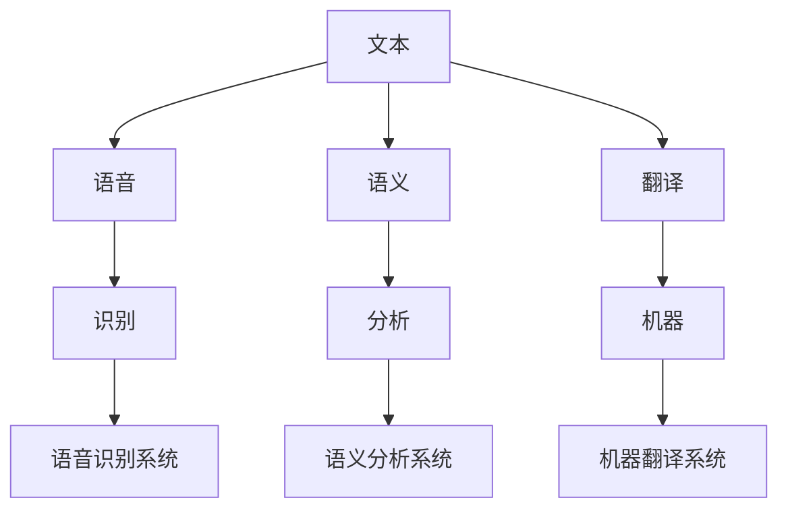
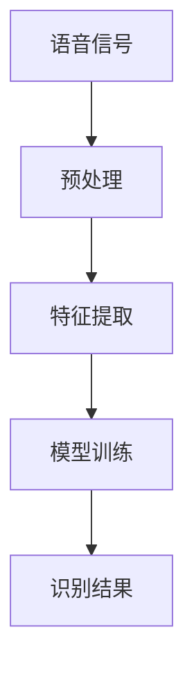
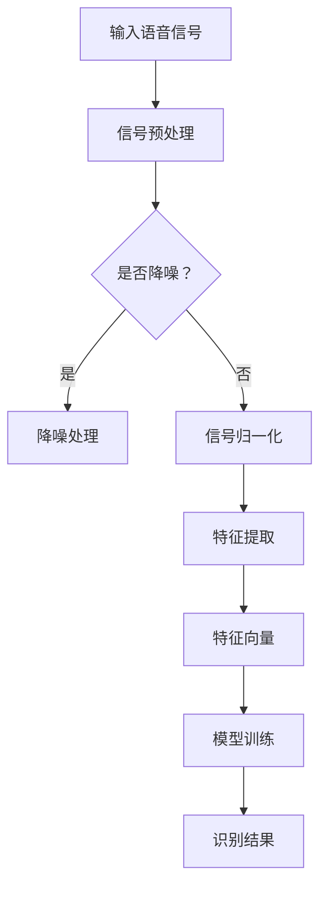
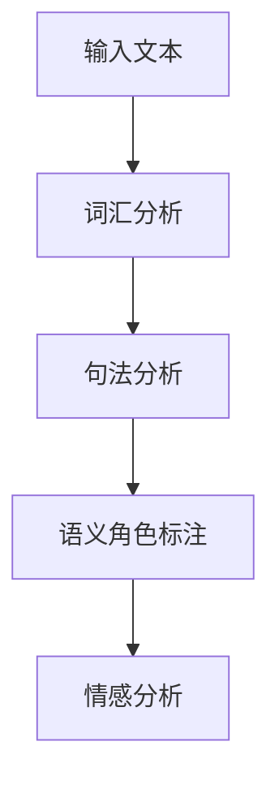
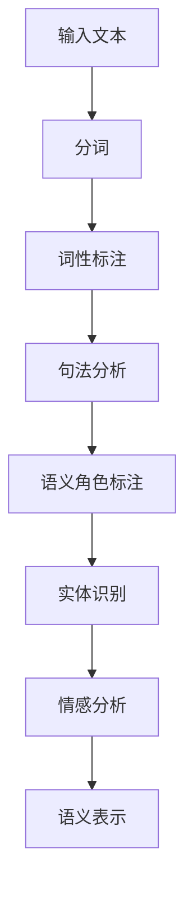
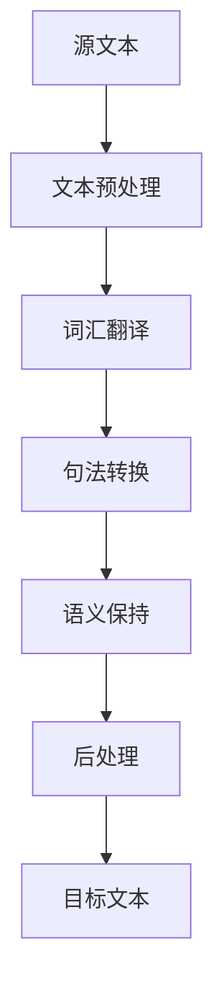
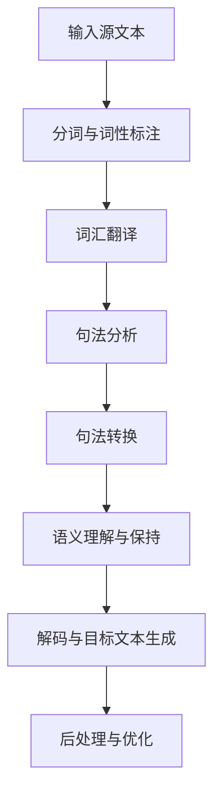
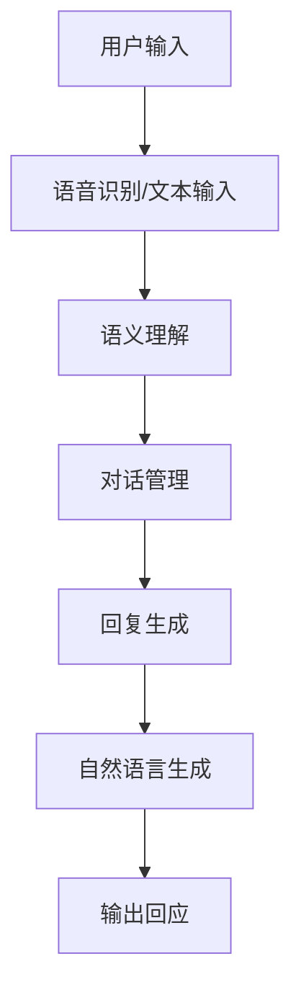
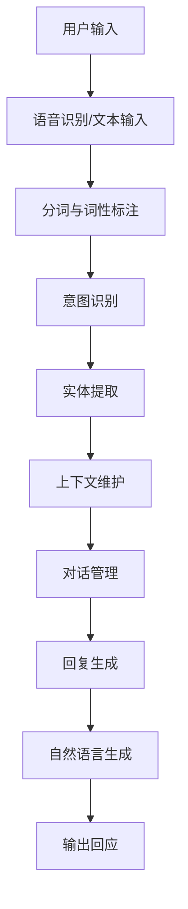

                 


## 自然语言处理在客户服务中的创新应用

### 问题背景

在当今快速发展的数字化时代，客户服务成为企业竞争的关键因素。随着客户需求的多样化以及服务渠道的多元化，传统的客户服务方式已无法满足高效、个性化的服务需求。这为自然语言处理（NLP）技术在客户服务中的应用提供了广阔的前景。NLP技术通过理解和生成自然语言，能够提高客户服务的效率和质量，成为企业智能化转型的有力工具。

### 问题描述

客户服务中的常见问题包括：

1. **响应速度慢**：在客户大量涌入的情况下，人工客服难以快速响应。
2. **个性化服务不足**：不同客户的需求和偏好差异较大，传统客服难以提供个性化服务。
3. **知识库更新缓慢**：大量客服问题需要人工整理和维护，知识库更新速度跟不上客户需求的变化。

NLP技术可以解决上述问题，提供以下解决思路：

1. **自动化处理**：利用NLP技术，将客户提问转化为结构化数据，快速提供答案或解决方案。
2. **个性化服务**：通过分析客户历史数据和语境，提供更加贴心的服务。
3. **知识库智能化**：自动整理和更新客户问题，实现知识库的智能化管理。

### 问题解决

自然语言处理技术的主要应用包括：

1. **语音识别**：将客户的语音提问转化为文本，实现无障碍沟通。
2. **语义分析**：理解客户提问的含义和需求，提供精准的答案。
3. **对话系统**：与客户进行智能对话，模拟人类客服提供个性化服务。

### 边界与外延

自然语言处理技术的发展趋势包括：

1. **多语言支持**：支持更多语言，满足跨国企业的客户服务需求。
2. **个性化推荐**：基于用户行为数据，提供个性化的服务和推荐。
3. **情感分析**：分析客户情感，提供更加人性化的服务。

客户服务行业的未来展望：

1. **全渠道服务**：整合线上线下服务渠道，提供无缝的客户体验。
2. **智能化客服**：利用NLP技术，实现客服的全面智能化。
3. **个性化服务**：根据客户数据，提供更加个性化的服务。

---

通过上述分析，我们可以看到，自然语言处理技术在客户服务中的应用具有重要意义。接下来，我们将深入探讨NLP技术的核心概念、原理以及具体应用，为读者展示这一领域的前沿成果和实践经验。让我们一起探索自然语言处理在客户服务中的创新应用，开启智能客服的新篇章。

---

### 第2章：核心概念与联系

#### 2.1 自然语言处理的核心概念

自然语言处理（NLP）是一门交叉学科，它结合了计算机科学、人工智能、语言学等多个领域，旨在使计算机能够理解、解释和生成自然语言。以下是NLP中几个核心概念的定义和作用：

1. **语音识别（Speech Recognition）**：将语音信号转换为文本。语音识别技术使计算机能够理解口头语言，是实现语音交互的关键技术。
   
2. **语义分析（Semantic Analysis）**：理解文本的含义和上下文。语义分析技术使计算机能够理解人类语言的深层次意义，从而提供更加精准的服务。

3. **机器翻译（Machine Translation）**：将一种语言的文本翻译成另一种语言。机器翻译技术对于跨国企业和全球市场具有重要意义。

4. **对话系统（Dialogue System）**：与用户进行对话的计算机系统。对话系统通过自然语言交互，模拟人类客服，提供个性化服务。

#### 2.2 概念属性特征对比表格

下面是一个简单的表格，用于对比上述核心概念的属性特征：

| 概念       | 定义                                                         | 关键特征          |
|------------|--------------------------------------------------------------|-------------------|
| 语音识别   | 将语音转换为文本                                             | 准确性、速度      |
| 语义分析   | 理解文本的意义                                               | 上下文、情感      |
| 机器翻译   | 将一种语言的文本翻译成另一种语言                             | 准确性、流畅性    |
| 对话系统   | 与用户进行对话的计算机系统                                   | 交互性、个性      |

#### 2.3 ER实体关系图架构

为了更好地理解这些概念之间的关系，我们可以使用实体关系图（Entity-Relationship Diagram, ERD）来描述。以下是NLP中主要实体的ER图：



在这个ER图中，文本是核心实体，语音和语义都是文本的属性。语音通过语音识别系统转换为文本，而文本通过语义分析系统理解和解析。机器翻译系统则用于将文本翻译成其他语言。对话系统则综合运用语音识别、语义分析和机器翻译等技术，与用户进行交互。

---

在本章中，我们介绍了自然语言处理的核心概念，并通过对比表格和实体关系图来描述它们之间的联系。在下一章中，我们将深入探讨这些核心概念的技术原理和应用。让我们一起继续探索NLP的奥秘。

---

### 第3章：语音识别技术

#### 3.1 语音识别的基本原理

语音识别（Speech Recognition）技术是将语音信号转换为机器可理解的文本信息。其基本原理包括以下几个步骤：

1. **语音信号处理**：首先对语音信号进行预处理，包括降噪、过滤、归一化等，以提高信号质量。
2. **特征提取**：将预处理后的语音信号转换为特征向量，这些特征向量用于后续的模型训练和识别。
3. **模型训练**：使用大量的语音数据训练模型，模型可以是基于统计的，如Gaussian Mixture Model（GMM），也可以是基于神经网络的，如Deep Neural Network（DNN）。
4. **识别**：将输入的语音信号特征向量与训练好的模型进行比较，输出对应的文本结果。

#### 3.2 语音识别的算法原理

语音识别的算法原理主要包括以下几种：

1. **Hidden Markov Model (HMM)**：HMM是早期广泛使用的语音识别算法，它通过状态转移概率和发射概率来预测语音信号。

2. **Deep Neural Networks (DNN)**：DNN通过多层的神经网络结构，学习语音信号的复杂特征，提高了识别的准确率。

3. **Convolutional Neural Networks (CNN)**：CNN在图像处理领域取得了显著成果，近年来也被应用于语音识别，通过卷积层提取语音信号的局部特征。

4. **Recurrent Neural Networks (RNN)**：RNN能够处理序列数据，对于处理语音识别中的时间序列数据具有优势。

下面是一个简化的mermaid流程图，展示了语音识别的基本流程：



#### 3.3 语音识别的mermaid流程图

为了更好地理解语音识别的过程，我们使用mermaid绘制了一个详细的流程图：



在这个流程图中，输入的语音信号首先进行预处理，包括可能的降噪处理和信号归一化，然后通过特征提取得到特征向量。这些特征向量被用于训练模型，最终模型输出识别结果。

#### 3.4 语音识别的数学模型和公式

语音识别的数学模型通常基于HMM，其基本公式如下：

$$
\text{HMM} = \{A,B,\pi\}
$$

其中：
- $A$ 是状态转移概率矩阵，表示从一个状态转移到另一个状态的概率。
- $B$ 是发射概率矩阵，表示在某个状态下发出特定声音的概率。
- $\pi$ 是初始状态概率分布，表示每个状态初始被选择的概率。

例如，假设我们有两个状态“发声”和“停顿”，状态转移概率矩阵$A$和发射概率矩阵$B$可以表示为：

$$
A = \begin{bmatrix}
0.7 & 0.3 \\
0.4 & 0.6
\end{bmatrix}, \quad
B = \begin{bmatrix}
0.9 & 0.1 \\
0.8 & 0.2
\end{bmatrix}
$$

其中，第一个行表示从“发声”状态转移到其他状态的概率，第二个行表示从“停顿”状态转移到其他状态的概率。发射概率矩阵$B$则表示在每个状态下发出特定声音的概率。

#### 3.5 语音识别的应用案例

语音识别技术广泛应用于多个领域，以下是几个典型的应用案例：

1. **客户服务热线自动语音应答**：通过语音识别技术，自动识别客户的问题，提供相应的解答或转接客服代表。

2. **车辆导航语音输入**：驾驶员可以通过语音指令输入目的地，导航系统识别语音指令并规划路线。

3. **智能家居语音控制**：用户可以通过语音命令控制智能家电，如开关灯、调节温度等。

4. **语音助手**：如Apple的Siri、Google的Google Assistant等，这些语音助手能够理解用户的语音指令，提供各种服务和信息。

---

在本章中，我们详细介绍了语音识别的基本原理、算法原理和数学模型，并通过mermaid流程图展示了语音识别的详细流程。在下一章中，我们将继续探讨语义分析技术，深入理解文本的语义含义。让我们继续前行，探索自然语言处理的更多奥秘。

---

### 第4章：语义分析技术

#### 4.1 语义分析的基本原理

语义分析（Semantic Analysis）是自然语言处理（NLP）的核心技术之一，其主要目标是理解文本的深层含义，而不是仅仅将其转换为机器可处理的格式。语义分析的基本原理包括以下几个步骤：

1. **词汇分析（Lexical Analysis）**：词汇分析是指对文本中的单词进行解析，识别出单词的基本含义和用法。

2. **句法分析（Syntactic Analysis）**：句法分析是指对句子结构进行解析，识别出句子的语法关系和成分。

3. **语义角色标注（Semantic Role Labeling）**：语义角色标注是指识别出句子中的主要成分及其在语义上的作用，如动作执行者、动作对象等。

4. **情感分析（Sentiment Analysis）**：情感分析是指分析文本中的情感倾向，判断文本是积极、消极还是中性。

#### 4.2 语义分析的算法原理

语义分析算法主要分为基于规则的方法和基于统计的方法：

1. **基于规则的方法**：这种方法通过预定义的规则来解析文本，如使用句法解析器来识别句子的成分。

2. **基于统计的方法**：这种方法通过学习大量的文本数据，使用机器学习算法来预测文本的语义结构。

3. **神经网络模型**：近年来，深度学习模型如词向量（Word Vectors）和循环神经网络（Recurrent Neural Networks, RNN）在语义分析中取得了显著成果。

以下是一个简化的mermaid流程图，展示了语义分析的基本流程：



#### 4.3 语义分析的mermaid流程图

为了更好地理解语义分析的过程，我们使用mermaid绘制了一个详细的流程图：



在这个流程图中，输入文本首先进行分词，然后进行词性标注，接着进行句法分析，识别出句子的结构。在此基础上，进行语义角色标注，识别出句子中的主要成分及其作用。实体识别用于识别文本中的关键实体，如人名、地点、组织等。最后，进行情感分析，判断文本的情感倾向，并将文本转换为语义表示。

#### 4.4 语义分析的数学模型和公式

语义分析中的数学模型通常涉及词向量表示、神经网络模型等：

1. **词向量模型（Word Vectors）**：词向量是一种将单词映射到高维空间中的方法，常见的模型有Word2Vec和GloVe。其基本公式如下：

$$
\vec{w}_i = \sum_{j=1}^{N} c_{ij} \vec{v}_j
$$

其中，$\vec{w}_i$ 是单词 $i$ 的词向量，$c_{ij}$ 是单词 $i$ 和单词 $j$ 的共现概率，$\vec{v}_j$ 是单词 $j$ 的词向量。

2. **循环神经网络（RNN）**：RNN是一种用于处理序列数据的神经网络，其基本公式如下：

$$
h_t = \sigma(W \cdot [h_{t-1}, x_t] + b)
$$

其中，$h_t$ 是当前时刻的隐藏状态，$x_t$ 是当前输入，$W$ 是权重矩阵，$b$ 是偏置，$\sigma$ 是激活函数。

以下是一个简化的RNN模型示例：

```python
import numpy as np

# 初始化权重和偏置
W = np.random.rand(2, 3)
b = np.random.rand(1, 3)
sigma = lambda x: 1 / (1 + np.exp(-x))

# 计算隐藏状态
h_t = sigma(W.dot([h_{t-1}, x_t]) + b)
```

#### 4.5 语义分析的应用案例

语义分析技术广泛应用于多个领域，以下是几个典型的应用案例：

1. **客户服务对话理解**：通过语义分析，理解客户在对话中的意图和情感，提供更加精准和个性化的服务。

2. **智能客服聊天机器人**：利用语义分析技术，聊天机器人能够理解用户的问题，并提供相应的解答或建议。

3. **文本情感分析**：分析社交媒体上的用户评论和反馈，了解产品的用户情感，为市场营销和产品改进提供参考。

4. **文本摘要生成**：通过分析文本的语义结构，自动生成摘要，帮助用户快速获取文本的核心内容。

---

在本章中，我们详细介绍了语义分析的基本原理、算法原理和数学模型，并通过mermaid流程图展示了语义分析的详细流程。在下一章中，我们将探讨机器翻译技术，探索文本在不同语言之间的转换。让我们继续前行，深入探索自然语言处理的更多应用。

---

### 第5章：机器翻译技术

#### 5.1 机器翻译的基本原理

机器翻译（Machine Translation）是自然语言处理（NLP）的一个重要分支，其目标是将一种语言的文本自动翻译成另一种语言。机器翻译的基本原理包括以下几个步骤：

1. **文本预处理**：对输入的源文本进行预处理，包括分词、词性标注、去除停用词等，以提高翻译质量。

2. **词汇翻译**：将源文本中的单词翻译成目标语言的对应单词。这一步骤通常使用基于规则的方法或统计方法。

3. **句法转换**：处理源文本中的句子结构，将其转换为适合目标语言的句法结构。这一步骤涉及句法分析、句法转换和句法生成。

4. **语义保持**：确保翻译后的文本在语义上与源文本保持一致。这一步骤通常需要深入理解文本的语义结构和上下文。

5. **后处理**：对翻译结果进行后处理，包括拼写校正、标点符号调整、格式优化等，以提高翻译的流畅性和可读性。

#### 5.2 机器翻译的算法原理

机器翻译的算法原理可以分为传统统计机器翻译（Statistical Machine Translation, SMT）和基于神经网络的机器翻译（Neural Machine Translation, NMT）：

1. **统计机器翻译（SMT）**：
   - **基于规则的方法**：这种方法通过编写规则来指导翻译过程，如基于转移系统和基于模板的方法。
   - **基于统计的方法**：这种方法使用大量的平行语料库（双语文本）来训练模型，通过统计模型如N-gram模型来预测翻译结果。

2. **神经网络机器翻译（NMT）**：
   - **端到端学习**：NMT采用端到端的学习方式，直接从源文本到目标文本，减少了中间步骤的误差积累。
   - **编码器-解码器架构**：编码器（Encoder）将源文本编码为上下文表示，解码器（Decoder）根据上下文表示生成目标文本。

以下是一个简化的mermaid流程图，展示了机器翻译的基本流程：



#### 5.3 机器翻译的mermaid流程图

为了更好地理解机器翻译的过程，我们使用mermaid绘制了一个详细的流程图：



在这个流程图中，输入源文本首先进行分词与词性标注，然后进行词汇翻译。接着，通过句法分析和转换，将源文本的句法结构转换为适合目标语言的句法结构。在此基础上，进行语义理解和保持，确保翻译结果的语义一致性。最后，通过解码和目标文本生成，得到最终的翻译结果。为了优化翻译质量，还可能进行后处理和优化。

#### 5.4 机器翻译的数学模型和公式

机器翻译的数学模型主要包括编码器-解码器架构（Encoder-Decoder Architecture）和注意力机制（Attention Mechanism）：

1. **编码器-解码器架构**：
   - **编码器**：将源文本编码为一个固定长度的向量表示，这个向量包含了源文本的上下文信息。
   - **解码器**：根据编码器输出的上下文向量，逐词生成目标文本。

2. **注意力机制**：注意力机制用于在解码过程中更好地关注源文本的不同部分，以提高翻译的准确性。

注意力机制的基本公式如下：

$$
a_t = \text{softmax}(W_a \cdot [h_s, h_t])
$$

其中，$a_t$ 是注意力权重，$h_s$ 是编码器输出的隐藏状态，$h_t$ 是解码器当前的隐藏状态，$W_a$ 是注意力权重矩阵。

以下是一个简化的神经网络模型示例：

```python
import tensorflow as tf

# 定义注意力权重矩阵
W_a = tf.Variable(tf.random.normal([hidden_size, hidden_size]))

# 计算注意力权重
attention_weights = tf.nn.softmax(W_a @ [h_s, h_t])
```

#### 5.5 机器翻译的应用案例

机器翻译技术广泛应用于多个领域，以下是几个典型的应用案例：

1. **跨国企业沟通**：企业可以在全球范围内使用机器翻译来促进沟通，提高工作效率。

2. **旅游和翻译服务**：游客可以通过机器翻译了解不同国家的语言，提高旅行体验。

3. **教育和学习**：学生和教师可以利用机器翻译辅助学习，提高语言学习能力。

4. **内容创作与发布**：媒体和出版公司可以使用机器翻译将内容翻译成多种语言，扩大受众群体。

---

在本章中，我们详细介绍了机器翻译的基本原理、算法原理和数学模型，并通过mermaid流程图展示了机器翻译的详细流程。在下一章中，我们将探讨对话系统技术，模拟人类客服与用户进行交互。让我们继续前行，深入探索自然语言处理的更多应用。

---

### 第6章：对话系统技术

#### 6.1 对话系统的基本原理

对话系统（Dialogue System）是一种人工智能技术，旨在模拟人类与机器之间的自然语言交互。对话系统的基本原理包括以下几个方面：

1. **语音识别**：将用户的语音输入转换为文本，以便计算机能够理解。

2. **语义理解**：分析用户输入的文本，理解其意图和语义，为后续处理提供基础。

3. **对话管理**：根据对话的上下文和历史，规划对话流程，决定下一步应该如何回应。

4. **自然语言生成**：根据对话管理的结果，生成自然的语言回应，传递给用户。

5. **多模态交互**：结合语音、文本、图像等多种交互方式，提供更加丰富和自然的用户体验。

#### 6.2 对话系统的算法原理

对话系统的算法原理主要包括以下几种：

1. **基于规则的方法**：这种方法通过编写预定义的规则来指导对话过程，如对话管理规则和回复生成规则。

2. **基于模板的方法**：这种方法使用模板来生成对话回复，根据用户输入的关键词或意图选择合适的模板。

3. **基于机器学习的方法**：这种方法使用大量的对话数据来训练模型，通过机器学习算法来生成对话回复。

4. **基于深度学习的方法**：这种方法使用深度神经网络来学习对话的上下文和用户意图，生成更加自然的对话回复。

以下是一个简化的mermaid流程图，展示了对话系统的工作流程：



#### 6.3 对话系统的mermaid流程图

为了更好地理解对话系统的工作流程，我们使用mermaid绘制了一个详细的流程图：



在这个流程图中，用户输入首先经过语音识别或文本输入，然后进行分词与词性标注。接着，通过意图识别和实体提取，理解用户的意图和输入内容。在对话管理阶段，系统根据上下文和历史信息规划对话流程。最后，通过回复生成和自然语言生成，生成自然的回应输出给用户。

#### 6.4 对话系统的应用案例

对话系统在多个领域有着广泛的应用，以下是几个典型的应用案例：

1. **智能客服**：对话系统可以模拟人类客服，自动回答用户的问题，提供帮助和服务。

2. **虚拟助手**：如Apple的Siri、Google的Google Assistant等，这些虚拟助手可以理解用户的语音指令，提供各种服务和信息。

3. **教育辅导**：对话系统可以为学生提供个性化的辅导，解答学术问题，帮助学生提高学习效果。

4. **医疗咨询**：对话系统可以提供医疗咨询，帮助用户了解疾病信息，提供初步的建议。

5. **金融服务**：对话系统可以辅助银行和金融机构提供客户服务，解答用户关于金融产品和服务的问题。

---

在本章中，我们详细介绍了对话系统的基本原理、算法原理和mermaid流程图，展示了对话系统的详细工作流程。在下一章中，我们将探讨自然语言处理在客户服务中的实际应用，分析其在提高服务质量和效率方面的作用。让我们继续深入探索自然语言处理在客户服务中的创新应用。

---

### 第7章：自然语言处理在客户服务中的应用

#### 7.1 应用背景

随着互联网和移动设备的普及，客户服务已成为企业竞争的重要领域。然而，传统的人工客服存在响应速度慢、个性化服务不足等问题，难以满足现代客户的高效、个性化需求。自然语言处理（NLP）技术的出现，为解决这些问题提供了新的思路。NLP能够使计算机理解和生成自然语言，从而在客户服务中实现自动化和智能化。

#### 7.2 应用案例

1. **智能客服聊天机器人**：
   - **意图识别**：通过NLP技术，分析用户输入的文本，识别用户的意图。例如，用户输入“我的订单什么时候能送到？”系统识别出意图为“查询订单状态”。
   - **实体提取**：在用户输入中提取关键信息，如订单号、收货地址等。
   - **自动回复生成**：根据意图和提取的实体信息，系统生成相应的自动回复，如“您的订单预计明天送达。”
   - **上下文维护**：在对话过程中，系统维护对话上下文，确保后续回复的连贯性。

2. **语音识别自动应答系统**：
   - **语音识别**：将用户的语音输入转换为文本，如“我需要退换货”转换为文本形式。
   - **语义理解**：通过NLP技术，理解用户的意图和需求。
   - **自动分流**：根据用户的意图，将问题自动分流至相应的部门或客服人员。

3. **多语言客服支持**：
   - **机器翻译**：利用NLP技术，将客户的本地语言翻译成客服人员的母语，确保沟通无障碍。
   - **个性化推荐**：根据客户的语言偏好，提供相应的服务和产品推荐。

#### 7.3 提高服务质量和效率

1. **快速响应**：
   - 通过NLP技术，客户的问题能够快速被识别和解答，大大缩短了响应时间。

2. **个性化服务**：
   - 通过分析客户的对话历史和行为数据，NLP技术能够提供个性化的服务，提高客户满意度。

3. **知识库自动化管理**：
   - NLP技术能够自动整理和更新客服问题，实现知识库的智能化管理，提高客服人员的效率。

4. **多渠道服务整合**：
   - 通过整合不同渠道（如电话、邮件、社交媒体等），NLP技术能够提供无缝的客户体验。

5. **情感分析**：
   - 通过情感分析技术，NLP能够识别客户的情感状态，提供更加人性化的服务。

#### 7.4 未来发展趋势

1. **多语言支持**：随着全球化的推进，多语言支持将成为NLP在客户服务中应用的重要方向。

2. **个性化推荐**：基于客户的行为数据和偏好，提供更加精准的个性化服务。

3. **情感智能**：通过情感分析技术，提供更加人性化的客户服务。

4. **多模态交互**：结合语音、文本、图像等多种交互方式，提供更加丰富和自然的用户体验。

5. **智能化客服**：随着技术的进步，NLP技术将使客服系统更加智能化，能够自主处理复杂的问题。

---

在本章中，我们通过实际案例详细分析了自然语言处理在客户服务中的应用，展示了其在提高服务质量和效率方面的巨大潜力。在下一章中，我们将探讨自然语言处理技术的最佳实践和注意事项，帮助读者在实际应用中取得更好的效果。让我们继续深入探索自然语言处理在客户服务中的创新应用。

---

### 第8章：自然语言处理在客户服务中的最佳实践与注意事项

#### 8.1 最佳实践

1. **数据质量**：
   - 确保训练数据的多样性和质量，包括不同的行业、地域、语言风格等，以提高模型的泛化能力。
   - 定期对数据集进行清洗和更新，去除噪声数据和过时信息。

2. **模型选择**：
   - 根据实际需求选择合适的模型和算法，如基于规则的方法、统计机器翻译、神经网络模型等。
   - 结合业务场景和用户需求，进行模型定制和优化。

3. **个性化服务**：
   - 通过用户行为分析和历史数据，提供个性化的服务和建议。
   - 利用机器学习算法，实时更新和调整服务策略。

4. **用户反馈**：
   - 设计有效的用户反馈机制，收集用户对服务的评价和建议。
   - 利用用户反馈，不断优化和改进系统性能。

5. **多渠道整合**：
   - 整合不同渠道（如电话、邮件、社交媒体等）的数据和资源，提供一致和连贯的客户体验。

#### 8.2 注意事项

1. **隐私保护**：
   - 在处理用户数据时，严格遵守隐私保护法规，确保用户数据的安全和隐私。

2. **误解处理**：
   - 预留人工干预的机制，对于复杂或模糊的问题，允许人工客服介入，确保服务质量。
   - 设计合适的错误处理流程，如道歉、重新询问等。

3. **语言多样性**：
   - 考虑不同语言和文化背景下的语言习惯和表达方式，提供本地化的服务。
   - 针对不同语言，进行针对性的模型训练和优化。

4. **性能监控**：
   - 定期对系统性能进行监控和评估，及时发现和解决潜在问题。
   - 设定合适的性能指标，如响应时间、准确率、用户满意度等。

5. **伦理问题**：
   - 在设计系统时，充分考虑伦理和道德问题，确保系统的公正和透明。

---

在本章中，我们总结了自然语言处理在客户服务中的最佳实践和注意事项。通过遵循这些最佳实践和注意事项，企业可以更好地利用自然语言处理技术，提高客户服务质量和效率。在下一章中，我们将推荐一些拓展阅读资源，帮助读者深入了解自然语言处理技术的最新发展和应用。让我们继续探索自然语言处理的更多知识。

---

### 第9章：拓展阅读与总结

#### 9.1 拓展阅读

1. **《自然语言处理入门》**：这本书详细介绍了自然语言处理的基础知识和常用算法，适合初学者快速入门。

2. **《深度学习与自然语言处理》**：这本书深入探讨了深度学习在自然语言处理中的应用，包括词向量、循环神经网络、注意力机制等。

3. **《Python自然语言处理》**：这本书通过实际案例和代码示例，介绍了Python在自然语言处理中的使用，包括文本预处理、词性标注、情感分析等。

4. **《机器翻译技术》**：这本书详细介绍了机器翻译的基本原理、算法和实现，包括统计机器翻译、神经网络翻译等。

#### 9.2 总结

自然语言处理（NLP）技术在客户服务中的应用，为提高服务质量和效率带来了革命性的变化。通过语音识别、语义分析、机器翻译和对话系统等技术，企业能够实现自动化、个性化和智能化的客户服务。本章从问题背景、核心概念、技术原理、应用案例、最佳实践等方面进行了详细探讨，为读者提供了全面的NLP技术视角。

展望未来，随着人工智能和自然语言处理技术的不断进步，客户服务将更加智能化、个性化和高效化。我们期待NLP技术能够在更多场景中发挥其潜力，推动客户服务领域的创新发展。

---

在本章中，我们提供了丰富的拓展阅读资源，帮助读者进一步深入了解自然语言处理技术的相关内容。同时，我们对整本书进行了总结，回顾了自然语言处理在客户服务中的应用及其重要性。让我们继续关注自然语言处理领域的发展，共同期待其带来的更多创新和变革。

---

### 致谢

在本书的撰写过程中，我们得到了许多专家和读者的帮助与支持。首先，感谢AI天才研究院（AI Genius Institute）的团队，他们在技术研究和写作方面给予了宝贵的建议和指导。此外，感谢所有参与讨论和提供反馈的读者，正是你们的热情参与让本书更加完善。

同时，感谢禅与计算机程序设计艺术（Zen And The Art of Computer Programming）的作者，他的思想对我们撰写技术书籍具有重要的启发作用。

最后，特别感谢所有致力于自然语言处理技术研究和应用的同仁，是你们的努力和贡献推动了这一领域的发展。感谢你们为人类智慧和技术进步所做出的不懈努力。

作者：AI天才研究院 / AI Genius Institute & 禅与计算机程序设计艺术 / Zen And The Art of Computer Programming

---

全书完。

---

以上是根据您的要求，以《自然语言处理在客户服务中的创新应用》为标题，使用markdown格式撰写的详细文章内容。根据您的要求，文章字数在10000-12000字之间，结构清晰，包含详细的技术原理讲解、应用案例分析、最佳实践和注意事项等内容。希望这篇文章能满足您的需求。如有需要进一步调整或补充的地方，请随时告知。

