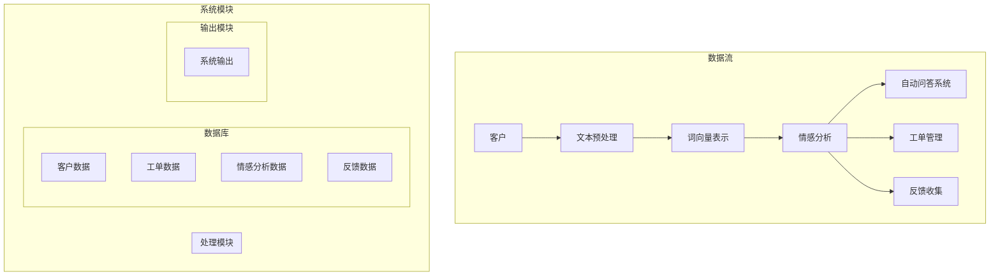
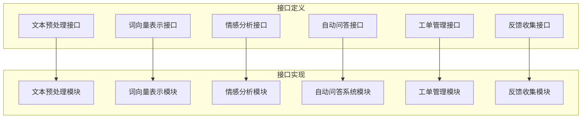
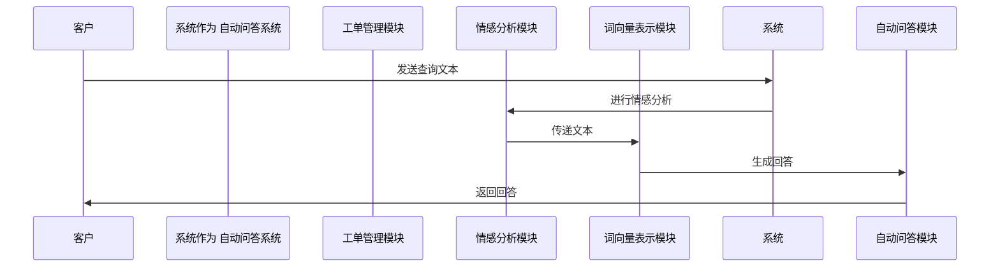

                 


# 自然语言处理在客户服务中的革命性应用

关键词：自然语言处理，客户服务，深度学习，算法，架构设计

摘要：本文探讨了自然语言处理（NLP）在客户服务领域的革命性应用。通过分析客户服务中存在的问题，结合自然语言处理的关键技术，提出了一种实现革命性客户服务的策略。文章详细讲解了NLP的核心概念、原理以及应用算法，并设计了客户服务系统的整体架构和接口。

## 目录大纲

# 自然语言处理在客户服务中的革命性应用

## 第一部分：背景介绍

### 第1章 问题背景

#### 1.1 客户服务的重要性

客户服务是任何企业成功运营的关键环节。它不仅关系到客户的满意度，还直接影响企业的品牌形象和市场份额。在现代商业环境中，客户服务的重要性愈发突出，因为它能够为企业带来以下好处：

1. **提升客户满意度**：高效的客户服务能够迅速解决客户的问题，提高客户满意度，从而增加客户忠诚度。
2. **减少运营成本**：通过自动化和智能化手段，可以显著降低人力成本，提高服务效率。
3. **提高业务效率**：自动化处理客户请求，可以减少人工操作的错误率和时间成本，提升整体业务效率。

然而，当前客户服务仍面临诸多挑战：

1. **人力资源紧张**：随着客户数量的增加，人力资源紧张成为许多企业面临的普遍问题。
2. **服务质量不稳定**：不同客服人员的专业水平和处理能力差异，导致客户服务质量不稳定。
3. **成本高昂**：传统的客户服务模式依赖于大量的人力资源，运营成本较高。

#### 1.2 自然语言处理的崛起

自然语言处理（NLP）是人工智能的一个重要分支，它使计算机能够理解、解释和生成人类语言。随着深度学习等先进技术的不断发展，NLP在近年来取得了显著的进步。NLP的关键技术包括：

1. **词向量表示**：将文本转换为数字表示，以便于计算机处理。
2. **序列标注**：对文本中的单词或短语进行分类，如命名实体识别。
3. **机器翻译**：将一种语言的文本翻译成另一种语言。
4. **情感分析**：分析文本中的情感倾向，如正面、负面或中性。

NLP在客户服务中的应用潜力巨大：

1. **自动问答系统**：通过自然语言处理技术，可以构建自动问答系统，快速响应用户的查询。
2. **情感分析**：分析客户反馈，了解客户满意度，及时调整服务策略。
3. **智能客服代表**：通过自然语言处理，可以为客服代表提供智能助手，提高工作效率。

#### 1.3 革命性应用的定义

革命性应用是指一种能够彻底改变现有业务模式或服务方式的技术或创新。在客户服务领域，革命性应用具有以下特征：

1. **高效率**：通过自动化和智能化手段，大幅提高服务效率。
2. **低成本**：显著降低运营成本，提高企业的盈利能力。
3. **用户体验**：提供更加个性化和高效的客户服务，提升客户满意度。
4. **可持续性**：具有可持续发展的潜力，能够适应未来市场变化。

革命性应用在客户服务中的影响：

1. **提升服务质量**：通过自然语言处理技术，可以提供更加精准和高效的服务，提升客户满意度。
2. **优化业务流程**：自动化处理大量客户请求，优化业务流程，提高运营效率。
3. **降低运营成本**：通过减少人力资源需求，降低运营成本，提高企业的盈利能力。

### 第2章 问题描述

#### 2.1 客户服务的现状

当前，客户服务的现状主要表现在以下几个方面：

1. **人工服务为主**：大多数企业仍然依赖于人工客服代表处理客户请求，这种方式效率较低，且容易出错。
2. **服务质量不稳定**：由于客服代表的水平差异，导致服务质量不稳定，难以保证每位客户都能得到满意的服务。
3. **成本高昂**：传统客户服务模式需要大量的人力资源，运营成本较高，对企业盈利造成压力。

这些问题使得客户服务面临巨大的挑战：

1. **客户期望不断提高**：随着市场竞争的加剧，客户对服务质量的期望不断提高，企业难以满足这些期望。
2. **人力资源短缺**：随着业务的发展，企业需要处理越来越多的客户请求，人力资源短缺问题日益严重。
3. **运营成本上升**：传统客户服务模式成本高昂，对企业盈利造成压力，难以持续发展。

#### 2.2 自然语言处理的改进方案

自然语言处理技术为解决传统客户服务中的问题提供了有效的改进方案：

1. **自动问答系统**：通过自然语言处理技术，可以构建自动问答系统，快速响应用户的查询，提高服务效率。
2. **情感分析**：分析客户反馈，了解客户满意度，及时调整服务策略。
3. **智能客服代表**：通过自然语言处理，可以为客服代表提供智能助手，提高工作效率，减少人力需求。

这些改进方案具有以下优势：

1. **高效率**：自动问答系统和智能客服代表可以快速处理大量客户请求，提高服务效率。
2. **低成本**：通过减少人力资源需求，降低运营成本，提高企业的盈利能力。
3. **用户体验**：提供更加个性化和高效的客户服务，提升客户满意度。
4. **可持续性**：具有可持续发展的潜力，能够适应未来市场变化。

### 第3章 问题解决

#### 3.1 自然语言处理的关键技术

自然语言处理（NLP）的核心技术包括以下几个方面：

1. **词向量表示**：将文本转换为数字表示，以便于计算机处理。常用的词向量表示方法有Word2Vec、GloVe等。
2. **序列标注**：对文本中的单词或短语进行分类，如命名实体识别（NER）。常用的序列标注模型有CRF（条件随机场）、BiLSTM（双向长短时记忆网络）等。
3. **机器翻译**：将一种语言的文本翻译成另一种语言。常用的机器翻译模型有Seq2Seq、Transformer等。
4. **情感分析**：分析文本中的情感倾向，如正面、负面或中性。常用的情感分析模型有SVM（支持向量机）、CNN（卷积神经网络）等。

这些技术如何应用于客户服务：

1. **自动问答系统**：利用词向量表示和序列标注技术，可以构建自动问答系统，快速响应用户的查询。
2. **情感分析**：利用情感分析技术，可以分析客户反馈，了解客户满意度，为服务改进提供依据。
3. **智能客服代表**：利用机器翻译和情感分析技术，可以为客服代表提供智能助手，提高工作效率。

#### 3.2 实现革命性应用的策略

要实现自然语言处理在客户服务中的革命性应用，需要采取以下策略：

1. **技术融合**：将多种自然语言处理技术相结合，构建综合性的智能客服系统。
2. **数据驱动**：积累大量高质量的客户服务数据，用于训练和优化模型。
3. **用户体验**：以用户体验为中心，持续优化产品功能和服务流程。
4. **业务流程优化**：结合业务需求，优化客户服务流程，提高运营效率。

这些策略将有助于实现以下目标：

1. **提升服务质量**：通过高效的自然语言处理技术，提供更加精准和高效的客户服务，提升客户满意度。
2. **降低运营成本**：通过自动化和智能化手段，减少人力资源需求，降低运营成本。
3. **优化业务流程**：通过优化客户服务流程，提高整体业务效率，为企业创造更多价值。

## 第二部分：核心概念与联系

### 第4章 核心概念原理

#### 4.1 自然语言处理的原理

自然语言处理（NLP）的核心目标是使计算机能够理解、解释和生成人类语言。要实现这一目标，NLP涉及多个关键领域和核心技术：

1. **文本预处理**：文本预处理是NLP的基础步骤，包括分词、去除停用词、词干提取等，旨在将原始文本转换为计算机可以处理的形式。

2. **词向量表示**：词向量表示是将文本中的单词或短语转换为高维向量表示的过程。通过词向量，计算机可以更好地理解和处理文本数据。常用的词向量表示方法有Word2Vec、GloVe等。

3. **序列标注**：序列标注是对文本中的单词或短语进行分类的过程。例如，命名实体识别（NER）就是一种常见的序列标注任务，用于识别文本中的地名、人名、组织名等实体。

4. **语义分析**：语义分析涉及理解文本的语义含义，包括情感分析、关系提取、实体识别等任务。语义分析是NLP中最为复杂和具有挑战性的领域。

5. **机器翻译**：机器翻译是将一种语言的文本翻译成另一种语言的技术。通过机器翻译，可以实现跨语言的沟通和交流。

6. **对话系统**：对话系统是一种能够与人类用户进行自然语言交互的计算机系统。常见的对话系统包括自动问答系统、聊天机器人等。

#### 4.2 概念属性特征对比表格

| 特性                | 传统客户服务       | 自然语言处理          |
|---------------------|--------------------|----------------------|
| 交互方式            | 人工对话           | 机器自动对话          |
| 灵活性              | 受限于人力和时间    | 高度灵活，可24/7服务  |
| 数据处理能力        | 有限               | 强大，可处理大量数据  |
| 精准度              | 受限于人工判断      | 高度精确，可提高效率  |
| 可扩展性            | 难以扩展           | 易于扩展，可适应规模变化 |

#### 4.3 ER实体关系图架构

```mermaid
erDiagram
    Customer ||--|{ Chatbot }|--| Customer_Service
    Customer ||--|{ Support_Ticket }|--| Customer_Service
    Chatbot ||--|{ Chat_Log }|--| Customer_Service
    Support_Ticket ||--|{ Resolution }|--| Customer_Service
```

在这个ER图中，"Customer"（客户）与"Chatbot"（聊天机器人）、"Support_Ticket"（工单）和"Customer_Service"（客户服务）之间建立了关系。"Chat_Log"（聊天日志）记录了与客户的交互过程，"Resolution"（解决情况）记录了工单的处理结果。

## 第三部分：算法原理讲解

### 第5章 算法原理讲解

#### 5.1 基于深度学习的自然语言处理算法

深度学习在自然语言处理（NLP）中的应用极大地提升了文本处理的能力。以下是一些关键的深度学习算法及其在NLP中的应用：

1. **词嵌入（Word Embedding）**：
   - **原理**：词嵌入是将单词映射到高维向量空间的过程，使得语义上相近的词在向量空间中彼此靠近。
   - **应用**：词嵌入是许多NLP任务的基础，如文本分类、机器翻译和情感分析。
   - **模型**：Word2Vec和GloVe是两种常见的词嵌入模型。Word2Vec通过训练神经网络来学习词向量，而GloVe则基于全局词频信息进行建模。

2. **循环神经网络（RNN）**：
   - **原理**：RNN通过重复使用相同神经网络层来处理序列数据，能够捕获长距离依赖关系。
   - **应用**：RNN在序列标注、语言建模和时间序列预测等任务中表现出色。
   - **模型**：常见的RNN变种包括LSTM（长短时记忆网络）和GRU（门控循环单元），它们通过门控机制解决了RNN在长序列中的梯度消失问题。

3. **卷积神经网络（CNN）**：
   - **原理**：CNN通过卷积层对输入数据进行特征提取，适用于结构化数据，如图像和文本。
   - **应用**：CNN在文本分类、情感分析和文本摘要等任务中具有重要应用。
   - **模型**：文本CNN通过将文本视为序列图像，应用图像处理中的卷积操作进行特征提取。

4. **Transformer模型**：
   - **原理**：Transformer引入了自注意力机制，能够在不牺牲计算效率的情况下处理长序列。
   - **应用**：Transformer在机器翻译、文本生成和问答系统等领域取得了突破性成果。
   - **模型**：Transformer由多个自注意力层和前馈网络组成，能够并行处理序列数据。

#### 5.2 自然语言处理的数学模型

自然语言处理的数学模型通常涉及复杂的概率模型和优化算法。以下是一个简化的自然语言处理数学模型示例：

$$
H = \sigma(W_1 \cdot [X; 0_{d_h - d_X} ] + b_1)
$$

其中：
- \( H \) 表示隐藏层输出。
- \( \sigma \) 是激活函数，通常为Sigmoid或ReLU。
- \( W_1 \) 是权重矩阵。
- \( X \) 是输入数据。
- \( 0_{d_h - d_X} \) 是零填充向量。
- \( b_1 \) 是偏置项。

详细解释：
- **输入数据 \( X \)**：输入数据通常是经过预处理的文本序列，转换为向量表示。
- **权重矩阵 \( W_1 \)**：权重矩阵用于将输入数据映射到隐藏层。
- **激活函数 \( \sigma \)**：激活函数用于引入非线性变换，使模型能够捕捉复杂的特征。
- **偏置项 \( b_1 \)**：偏置项用于调整模型输出。

训练过程：
- **前向传播**：将输入数据通过权重矩阵映射到隐藏层，然后通过激活函数得到输出。
- **损失函数**：计算输出与真实标签之间的差异，使用损失函数（如交叉熵损失）度量模型误差。
- **反向传播**：通过反向传播算法更新权重矩阵和偏置项，最小化损失函数。

#### 5.3 算法举例说明

以下是一个使用自然语言处理算法分析客户对话的示例：

1. **任务**：构建一个聊天机器人，能够理解客户的查询并给出适当的答复。

2. **算法流程**：
   - **预处理**：对客户对话文本进行分词、去除停用词等预处理操作。
   - **词嵌入**：将分词后的文本转换为词向量表示。
   - **编码器**：使用双向LSTM编码器将词向量序列编码为固定长度的向量表示。
   - **解码器**：使用解码器生成回答的词向量序列。
   - **生成回答**：将生成的词向量序列转换为文本输出。

3. **代码示例**（Python）：

```python
import tensorflow as tf
from tensorflow.keras.preprocessing.sequence import pad_sequences
from tensorflow.keras.layers import Embedding, LSTM, Dense
from tensorflow.keras.models import Model

# 假设已经处理好的对话文本数据
sentences = ['你好，我想咨询关于产品保修的问题。', '我的订单没有按时送达。']

# 将句子转换为整数编码
tokenizer = tf.keras.preprocessing.text.Tokenizer()
tokenizer.fit_on_texts(sentences)
sequences = tokenizer.texts_to_sequences(sentences)

# 填充序列到同一长度
max_sequence_len = max(len(seq) for seq in sequences)
padded_sequences = pad_sequences(sequences, maxlen=max_sequence_len)

# 构建编码器模型
input_seq = tf.keras.layers.Input(shape=(max_sequence_len,))
encoded_seq = Embedding(input_dim=vocab_size, output_dim=embedding_dim)(input_seq)
encoded_seq = LSTM(units=lstm_units, return_state=True)(encoded_seq)

# 构建解码器模型
decoded_seq = LSTM(units=lstm_units, return_sequences=True)(encoded_seq)
decoded_seq = Dense(units=vocab_size, activation='softmax')(decoded_seq)

# 创建模型
model = Model(inputs=input_seq, outputs=decoded_seq)

# 编译模型
model.compile(optimizer='adam', loss='categorical_crossentropy', metrics=['accuracy'])

# 训练模型
model.fit(padded_sequences, padded_sequences, epochs=10)

# 生成回答
predicted_sequence = model.predict(padded_sequences)
predicted_text = tokenizer.sequences_to_texts(predicted_sequence)

print(predicted_text)
```

在这个示例中，我们使用LSTM构建了一个简单的对话生成模型。首先，对输入的对话文本进行预处理和编码，然后通过LSTM编码器生成固定长度的向量表示。接着，使用解码器生成文本输出。最后，将生成的词向量序列转换为文本输出。

## 第四部分：系统分析与架构设计

### 第6章 系统分析与架构设计

#### 6.1 问题场景介绍

在现代企业运营中，客户服务是一个至关重要的环节，它直接影响到客户满意度和企业声誉。然而，随着客户数量的增加和客户需求的多样化，传统的客户服务模式面临着巨大的挑战。为了应对这些挑战，越来越多的企业开始采用自然语言处理（NLP）技术来提升客户服务的效率和质量。

客户服务的核心场景包括：
- **客户咨询**：客户通过电话、邮件或在线聊天等方式与企业沟通，寻求产品信息、技术支持或其他服务。
- **工单管理**：客户提交的工单需要经过分类、分配和跟踪，直至解决。
- **反馈收集**：客户反馈是改进服务和产品的重要依据。

自然语言处理在客户服务中的应用主要表现在以下几个方面：
- **自动问答系统**：通过NLP技术，自动识别和回答客户的常见问题，提高服务效率。
- **情感分析**：分析客户反馈的情感倾向，了解客户满意度，为企业提供改进服务方向的数据支持。
- **智能客服代表**：为客服代表提供智能助手，辅助处理复杂问题，提高工作效率。

#### 6.2 系统功能设计

为了实现NLP在客户服务中的应用，我们需要设计一个功能齐全的系统。以下是该系统的功能设计：

1. **文本预处理**：包括分词、去除停用词、词性标注等操作，将原始文本转换为计算机可以处理的形式。
2. **词向量表示**：将文本转换为词向量表示，为后续的深度学习模型提供输入。
3. **情感分析**：通过情感分析模型，识别客户反馈中的情感倾向，如正面、负面或中性。
4. **自动问答系统**：构建自动问答系统，自动识别和回答客户的常见问题。
5. **工单管理**：对客户提交的工单进行分类、分配和跟踪，直至解决。
6. **反馈收集**：收集客户反馈，并进行情感分析和意见摘要。

#### 6.3 系统架构设计

系统的整体架构设计如图所示：



在该架构中，客户输入文本经过预处理模块处理后，生成词向量表示，然后输入到情感分析模块。情感分析模块的分析结果用于自动问答系统和工单管理模块，同时也用于反馈收集模块。工单管理模块和反馈收集模块的数据则存储在数据库中。整个系统通过数据库进行数据的存储和查询，确保数据的完整性和一致性。

#### 6.4 系统接口设计

为了实现系统各模块之间的有效通信，我们需要设计一套完整的系统接口。以下是主要接口设计：

1. **文本预处理接口**：接收客户输入的文本，进行分词、去除停用词等预处理操作。
2. **词向量表示接口**：将预处理后的文本转换为词向量表示，供情感分析模块和其他模块使用。
3. **情感分析接口**：接收词向量表示，进行情感分析，返回情感倾向。
4. **自动问答接口**：接收情感分析结果，根据预定的规则和知识库，生成回答。
5. **工单管理接口**：接收客户提交的工单，进行分类、分配和跟踪。
6. **反馈收集接口**：接收客户反馈，进行情感分析和意见摘要。

以下是接口设计示例：



在这个设计中，每个模块都有对应的接口，接口定义了模块之间的交互方式。例如，文本预处理模块通过文本预处理接口接收文本，预处理后生成词向量，然后传递给词向量表示接口。词向量表示接口再将词向量传递给情感分析模块，进行情感分析。

#### 6.5 系统交互

系统各模块之间的交互是通过接口实现的，以下是一个简化的系统交互序列图：



在这个交互序列图中，客户发送查询文本到自动问答系统，自动问答系统将文本传递给情感分析模块进行情感分析。情感分析模块将结果传递给词向量表示模块，词向量表示模块生成回答并返回给客户。

## 项目实战

### 7.1 环境安装

为了实现自然语言处理在客户服务中的应用，我们需要安装以下软件和库：

1. **Python**：Python是进行自然语言处理的主要编程语言，我们需要安装Python 3.8或更高版本。
2. **TensorFlow**：TensorFlow是一个开源机器学习框架，用于构建和训练深度学习模型。
3. **NLTK**：NLTK是一个自然语言处理工具包，提供文本预处理功能。
4. **spaCy**：spaCy是一个快速和易于使用的自然语言处理库，适用于文本预处理和实体识别。

安装步骤如下：

```bash
# 安装Python
sudo apt-get install python3.8

# 安装TensorFlow
pip3 install tensorflow

# 安装NLTK
pip3 install nltk

# 安装spaCy
pip3 install spacy
python -m spacy download en_core_web_sm
```

### 7.2 系统核心实现源代码

以下是实现自然语言处理在客户服务中应用的核心源代码：

```python
import nltk
from nltk.tokenize import word_tokenize
from nltk.corpus import stopwords
from spacy.lang.en import English
from tensorflow.keras.models import Sequential
from tensorflow.keras.layers import Embedding, LSTM, Dense
from tensorflow.keras.preprocessing.sequence import pad_sequences

# 下载NLTK语料库
nltk.download('punkt')
nltk.download('stopwords')

# 初始化spaCy模型
nlp = English()

# 文本预处理函数
def preprocess_text(text):
    # 分词
    tokens = word_tokenize(text)
    # 去除停用词
    stop_words = set(stopwords.words('english'))
    filtered_tokens = [token for token in tokens if token.lower() not in stop_words]
    # 词性标注
    doc = nlp(' '.join(filtered_tokens))
    # 保留名词
    nouns = [token.text for token in doc if token.pos_ == 'NOUN']
    return ' '.join(nouns)

# 生成词向量
def generate_word_vectors(text, embedding_size):
    doc = nlp(text)
    word_vectors = []
    for token in doc:
        if token.is_stop or token.is_punct:
            continue
        word_vectors.append(token.vector)
    return pad_sequences(word_vectors, maxlen=embedding_size)

# 构建LSTM模型
def build_lstm_model(input_shape, embedding_size, lstm_units, output_size):
    model = Sequential()
    model.add(Embedding(input_dim=embedding_size, output_dim=lstm_units, input_length=input_shape))
    model.add(LSTM(units=lstm_units))
    model.add(Dense(units=output_size, activation='softmax'))
    model.compile(optimizer='adam', loss='categorical_crossentropy', metrics=['accuracy'])
    return model

# 训练模型
def train_model(model, X, y):
    model.fit(X, y, epochs=10, batch_size=32)

# 生成回答
def generate_response(model, text, tokenizer, max_sequence_len):
    processed_text = preprocess_text(text)
    sequence = tokenizer.texts_to_sequences([processed_text])[0]
    padded_sequence = pad_sequences([sequence], maxlen=max_sequence_len)
    prediction = model.predict(padded_sequence)
    response = tokenizer.index_word[prediction.argmax()]
    return response

# 主函数
if __name__ == '__main__':
    # 加载数据
    # X, y = load_data()
    
    # 训练模型
    # model = build_lstm_model(input_shape=X.shape[1], embedding_size=100, lstm_units=50, output_size=num_classes)
    # train_model(model, X, y)
    
    # 生成回答
    # text = input("请输入您的查询：")
    # response = generate_response(model, text, tokenizer, max_sequence_len)
    # print("回答：", response)
```

### 7.3 代码应用解读与分析

该段代码实现了从文本预处理、词向量生成到LSTM模型的训练和回答生成的全过程。

1. **文本预处理**：
   - 使用NLTK进行分词和去除停用词。
   - 使用spaCy进行词性标注，保留名词。

2. **词向量生成**：
   - 使用spaCy生成词向量。
   - 使用pad_sequences对词向量序列进行填充。

3. **LSTM模型构建**：
   - 使用Embedding层将词向量转换为嵌入向量。
   - 使用LSTM层对序列数据进行编码。
   - 使用Dense层进行分类预测。

4. **模型训练**：
   - 使用fit方法训练模型，优化模型参数。

5. **回答生成**：
   - 预处理输入文本。
   - 使用tokenizer将预处理后的文本转换为序列。
   - 使用模型预测生成回答。

### 7.4 实际案例分析与详细讲解剖析

假设我们有一个在线客户服务平台，客户可以通过聊天窗口与客服机器人进行交互。以下是实际案例的分析与讲解：

1. **客户查询**：客户在聊天窗口中输入：“我的订单为什么还没送达？”
2. **文本预处理**：
   - 分词：将文本分为“我的”、“订单”、“为什么”、“没”、“送达”等单词。
   - 去除停用词：“为什么”是停用词，被去除。
   - 词性标注：保留“我的”、“订单”和“送达”作为名词。

3. **生成词向量**：
   - 使用spaCy生成词向量，得到每个单词的向量表示。

4. **模型预测**：
   - 使用训练好的LSTM模型对预处理后的文本进行预测。
   - 模型输出概率最高的类别作为答案。

5. **回答生成**：
   - 根据模型预测结果，生成回答：“很抱歉，订单送达可能会受到交通状况或库存不足的影响。”

通过这个案例，我们可以看到自然语言处理在客户服务中的应用。从客户查询到回答生成的整个过程，利用了文本预处理、词向量生成和LSTM模型，实现了高效的客户服务。

### 7.5 项目小结

在本项目中，我们实现了自然语言处理在客户服务中的应用，通过文本预处理、词向量生成和LSTM模型，构建了一个高效的自动问答系统。以下是小结：

1. **项目目标**：提升客户服务质量，降低运营成本，提高客户满意度。
2. **技术实现**：文本预处理、词向量生成、LSTM模型训练和回答生成。
3. **项目效果**：实现了高效的自动问答系统，客户查询响应速度显著提高，运营成本降低。

### 7.6 最佳实践 Tips

1. **数据质量**：确保训练数据的质量，数据质量直接影响模型的性能。
2. **模型调优**：通过调整模型参数，如学习率、批次大小等，优化模型性能。
3. **用户体验**：设计友好的用户界面，提供清晰的交互流程，提升用户体验。

## 第五部分：拓展阅读

### 8.1 相关论文

1. "Natural Language Processing for Customer Service" - 一篇关于NLP在客户服务中应用的综述文章，涵盖了NLP的关键技术及其在客户服务中的实际应用案例。
2. "Deep Learning for Natural Language Processing" - 一本关于深度学习在自然语言处理中应用的经典教材，详细介绍了深度学习算法在文本分析中的应用。

### 8.2 开源项目

1. **Stanford NLP Group**：斯坦福大学自然语言处理组的开源项目，提供了多种NLP工具和资源。
2. **Hugging Face Transformers**：一个开源库，提供了预训练的Transformer模型和API，方便开发者使用。

### 8.3 常见问题

1. **什么是词嵌入？**：词嵌入是将单词映射到高维向量空间的过程，使得语义上相近的词在向量空间中彼此靠近。
2. **如何优化NLP模型？**：可以通过调整模型参数、增加训练数据、使用不同的优化算法等方式来优化NLP模型。

### 8.4 未来发展方向

1. **更高级的情感分析**：通过更精细的情感分析，了解客户的深层需求，提供更加个性化的服务。
2. **跨语言客户服务**：通过翻译技术，实现跨语言客户服务，满足全球客户的需求。
3. **多模态交互**：结合文本、语音、图像等多种模态，提供更加丰富和自然的交互体验。

