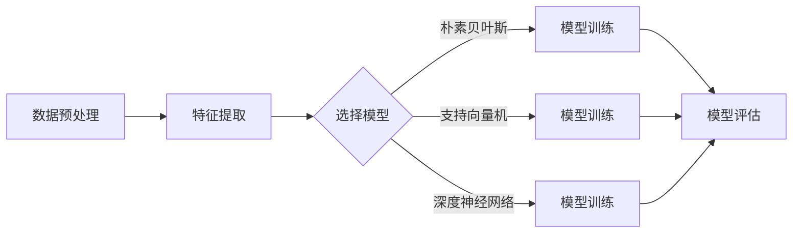
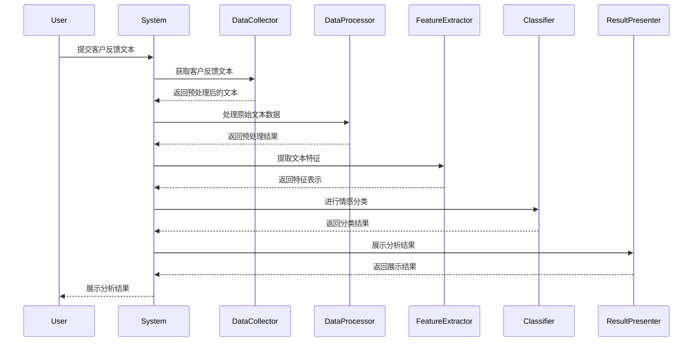

                 

### 自然语言处理在情感分析中的应用：理解客户反馈

#### 关键词

- 自然语言处理（NLP）
- 情感分析
- 客户反馈
- 机器学习算法
- 系统架构设计

#### 摘要

随着互联网技术的飞速发展，企业收集的客户反馈数据量呈现出爆炸性增长。这些反馈不仅是企业了解客户满意度的宝贵资源，也是优化产品和服务的重要依据。然而，如何高效、准确地从海量的文本数据中提取有价值的情感信息，成为了一个极具挑战性的课题。本文旨在探讨自然语言处理（NLP）在情感分析中的应用，通过一系列逻辑清晰、结构紧凑的章节，帮助读者深入理解情感分析的核心概念、算法原理，以及其在实际项目中的应用和架构设计。我们还将通过具体的案例分析和最佳实践，为读者提供切实可行的解决方案和实用建议。

### 背景介绍

#### 问题背景

在当今的信息时代，客户反馈对于企业的运营和发展具有至关重要的意义。通过客户反馈，企业可以迅速了解客户的真实想法和需求，从而做出及时的调整和改进。然而，传统的手动分析方法耗时耗力，且易受主观因素影响，难以应对海量数据的处理需求。因此，如何利用现代技术手段，特别是自然语言处理（NLP）技术，对客户反馈进行自动化、高效的情感分析，成为了一个亟待解决的问题。

#### 问题描述

客户反馈情感分析的目标是从文本数据中提取出客户的情感倾向，如正面、负面、中性等。这一过程不仅需要理解文本的字面意思，还需要深入挖掘文本背后的情感含义。具体来说，问题描述可以分为以下几个方面：

1. **情感极性分类**：将文本数据分为正面、负面和中性三个类别。
2. **情感强度度量**：对文本中的情感倾向进行量化，如程度副词（很、非常等）对情感强度的调整。
3. **情感细粒度分析**：识别文本中的细微情感变化，如满意、愤怒、悲伤等。
4. **多维度情感分析**：综合考虑文本中的多种情感因素，如情感与行为、情感与情境等。

#### 问题解决

为了解决上述问题，自然语言处理（NLP）技术提供了一系列有效的工具和方法。通过结合机器学习和深度学习算法，NLP技术能够自动从大规模的文本数据中学习情感模式，并进行情感分类和情感强度度量。具体来说，问题解决主要包括以下几个步骤：

1. **数据预处理**：对原始文本进行分词、去停用词、词性标注等预处理操作，以便后续分析。
2. **特征提取**：从预处理后的文本中提取有代表性的特征，如词袋模型、TF-IDF等。
3. **模型训练**：使用有标注的情感分析数据集，训练分类模型，如朴素贝叶斯、支持向量机（SVM）、深度神经网络（DNN）等。
4. **模型评估**：通过交叉验证、混淆矩阵、准确率、召回率等指标，评估模型性能。
5. **应用部署**：将训练好的模型部署到实际应用中，如客服系统、社交媒体监测等。

#### 边界与外延

情感分析不仅局限于文本数据，还可以扩展到语音、图像等多模态数据的处理。此外，情感分析的应用场景也非常广泛，包括市场调研、舆情监测、心理健康诊断等。然而，情感分析也面临着一些挑战，如多语言处理、情感歧义、情感微表达等。针对这些挑战，研究者们提出了多种解决方案，如跨语言情感分析、情感识别模型、深度学习模型等。

#### 概念结构与核心要素组成

情感分析的概念结构主要包括以下几个核心要素：

1. **情感极性分类**：将文本分为正面、负面和中性三个类别。
2. **情感强度度量**：对文本中的情感倾向进行量化，如程度副词的影响。
3. **情感细粒度分析**：识别文本中的细微情感变化。
4. **多维度情感分析**：综合考虑文本中的多种情感因素。

这些核心要素共同构成了情感分析的理论基础，为实际应用提供了指导。

### 核心概念与联系

#### 核心概念原理

情感分析（Sentiment Analysis）是指通过自然语言处理技术，对文本数据中的情感倾向进行识别和分类的过程。其核心概念包括情感极性分类、情感强度度量、情感细粒度分析和多维度情感分析。

1. **情感极性分类**：将文本分为正面、负面和中性三个类别。
2. **情感强度度量**：对文本中的情感倾向进行量化，如程度副词的影响。
3. **情感细粒度分析**：识别文本中的细微情感变化。
4. **多维度情感分析**：综合考虑文本中的多种情感因素。

#### 概念属性特征对比表格

| 概念          | 定义                                                         | 属性特征                                                     | 对比表格示例                                                     |
| ------------- | ------------------------------------------------------------ | ------------------------------------------------------------ | ------------------------------------------------------------ |
| 情感极性分类   | 将文本分为正面、负面和中性三个类别                           | - 正面：包含积极情感词汇<br>- 负面：包含消极情感词汇<br>- 中性：无明显情感倾向 | 以下为正面、负面、中性情感分类的对比表格： |
| 情感强度度量   | 对文本中的情感倾向进行量化，如程度副词的影响                   | - 强度高的情感：包含强烈的情感词汇<br>- 强度低或无情感：包含较弱的情感词汇 | 以下为情感强度度量的对比表格： |
| 情感细粒度分析 | 识别文本中的细微情感变化                                     | - 满意、愤怒、悲伤等细微情感分类                               | 以下为情感细粒度分析的对比表格： |
| 多维度情感分析 | 综合考虑文本中的多种情感因素，如情感与行为、情感与情境等       | - 多元化情感因素：综合考虑情感、行为、情境等                     | 以下为多维度情感分析的对比表格： |

#### ER实体关系图架构的 Mermaid 流程图

```mermaid
erDiagram
    Person ||--|{ Review }|-- Laptop
    Product ||--|{ Review }|-- User
    Store ||--|{ Review }|-- Product
    Review ||--|{ Rating }|-- User
    Review ||--|{ Comment }|-- User
```

#### 算法原理讲解

##### 使用 Mermaid 画出算法流程图



##### 使用 Python 源代码详细阐述

```python
# 导入相关库
import nltk
from nltk.tokenize import word_tokenize
from nltk.corpus import stopwords
from sklearn.feature_extraction.text import TfidfVectorizer
from sklearn.model_selection import train_test_split
from sklearn.naive_bayes import MultinomialNB
from sklearn.metrics import accuracy_score, confusion_matrix

# 数据预处理
nltk.download('punkt')
nltk.download('stopwords')

def preprocess_text(text):
    tokens = word_tokenize(text)
    tokens = [token.lower() for token in tokens if token.isalpha()]
    tokens = [token for token in tokens if token not in stopwords.words('english')]
    return ' '.join(tokens)

# 特征提取
vectorizer = TfidfVectorizer()

# 加载数据集
data = [...]  # 加载您的情感分析数据集
X = [preprocess_text(text) for text in data['review']]
y = data['sentiment']

# 划分训练集和测试集
X_train, X_test, y_train, y_test = train_test_split(X, y, test_size=0.2, random_state=42)

# 选择模型并训练
model = MultinomialNB()
model.fit(vectorizer.fit_transform(X_train), y_train)

# 模型评估
predictions = model.predict(vectorizer.transform(X_test))
accuracy = accuracy_score(y_test, predictions)
conf_matrix = confusion_matrix(y_test, predictions)

print(f"Accuracy: {accuracy}")
print(f"Confusion Matrix:\n{conf_matrix}")
```

##### 给出算法原理的数学模型和公式

1. **朴素贝叶斯模型**：

$$
P(\text{正面}|\text{特征}) = \frac{P(\text{特征}|\text{正面}) \cdot P(\text{正面})}{P(\text{特征})}
$$

2. **支持向量机（SVM）**：

$$
\text{最大间隔超平面}：W \cdot x - b = 0
$$

3. **深度神经网络（DNN）**：

$$
h_{\theta}(x) = \sigma(\theta_0 + \theta_1 x_1 + \theta_2 x_2 + \ldots + \theta_n x_n)
$$

##### 进行详细讲解和举例说明

1. **情感极性分类**：

以朴素贝叶斯模型为例，我们首先需要计算每个特征在正面和负面类别中的条件概率。假设我们有一个训练数据集，包含正面和负面样本，我们可以计算每个词汇在正面和负面样本中出现的频率，并利用贝叶斯公式进行预测。

**举例**：

假设我们的训练数据集中包含以下词汇：

- 正面样本：我很喜欢这个产品
- 负面样本：这个产品很糟糕

我们可以计算每个词汇在正面和负面样本中的出现频率，并利用朴素贝叶斯模型进行分类预测。

2. **情感强度度量**：

在情感强度度量中，我们需要考虑程度副词（如很、非常等）对情感强度的影响。例如，句子“这个产品非常好”和“这个产品好”表达的情感强度是不同的。

我们可以通过引入程度副词的权重，来调整情感强度度量。例如，我们可以将“很”赋予更高的权重，从而提高句子的整体情感强度。

3. **情感细粒度分析**：

情感细粒度分析旨在识别文本中的细微情感变化。例如，识别句子“我很满意”中的满意情感，以及句子“我有点不满意”中的不满意情感。

我们可以使用词嵌入技术（如Word2Vec、GloVe等）来学习词汇的语义表示，并利用这些表示进行情感分类。通过比较不同情感词汇的语义表示，我们可以更准确地识别文本中的情感变化。

4. **多维度情感分析**：

多维度情感分析旨在综合考虑文本中的多种情感因素，如情感与行为、情感与情境等。例如，在社交媒体监测中，我们需要考虑情感与用户行为的关系，如情感与评论数量、情感与转发数量等。

我们可以通过构建多维度情感分析模型，将不同情感因素整合到一起，从而更全面地理解文本中的情感信息。

### 数学模型和数学公式 & 详细讲解 & 举例说明

在情感分析中，数学模型和数学公式起着至关重要的作用。以下，我们将使用LaTeX格式嵌入文中，详细讲解常用的数学模型和公式，并通过具体的例子进行说明。

#### 朴素贝叶斯模型

朴素贝叶斯（Naive Bayes）是一种基于概率论的分类算法，特别适用于文本数据的分类任务。其核心公式如下：

$$
P(\text{正面}|\text{特征}) = \frac{P(\text{特征}|\text{正面}) \cdot P(\text{正面})}{P(\text{特征})}
$$

**解释**：

- \( P(\text{正面}|\text{特征}) \)：在给定特征的情况下，文本属于正面的概率。
- \( P(\text{特征}|\text{正面}) \)：在文本属于正面的情况下，特征出现的概率。
- \( P(\text{正面}) \)：文本属于正面的先验概率。
- \( P(\text{特征}) \)：特征出现的总概率。

**举例**：

假设我们有一个包含情感极性的文本数据集，其中正面样本和负面样本的比例分别为50%。现在，我们需要预测一个新样本的情感极性，该样本包含词汇“喜欢”和“糟糕”。

首先，我们计算每个词汇在正面和负面样本中的出现频率：

- “喜欢”：正面样本中出现5次，负面样本中出现1次。
- “糟糕”：正面样本中出现1次，负面样本中出现5次。

接下来，我们计算每个词汇在正面和负面样本中的条件概率：

$$
P(\text{喜欢}|\text{正面}) = \frac{5}{5+1} = 0.8
$$

$$
P(\text{糟糕}|\text{正面}) = \frac{1}{5+1} = 0.2
$$

$$
P(\text{喜欢}|\text{负面}) = \frac{1}{5+1} = 0.2
$$

$$
P(\text{糟糕}|\text{负面}) = \frac{5}{5+1} = 0.8
$$

然后，我们计算正面和负面样本的先验概率：

$$
P(\text{正面}) = 0.5
$$

$$
P(\text{负面}) = 0.5
$$

最后，我们使用贝叶斯公式计算新样本属于正面的概率：

$$
P(\text{正面}|\text{特征}) = \frac{P(\text{特征}|\text{正面}) \cdot P(\text{正面})}{P(\text{特征})}
$$

$$
P(\text{正面}|\text{特征}) = \frac{0.8 \cdot 0.5}{0.8 \cdot 0.5 + 0.2 \cdot 0.5} = \frac{0.4}{0.4 + 0.1} = \frac{4}{5} = 0.8
$$

因此，根据朴素贝叶斯模型，新样本属于正面的概率为0.8，即我们可以预测该样本的情感极性为正面。

#### 支持向量机（SVM）

支持向量机（Support Vector Machine，SVM）是一种基于最大间隔超平面的分类算法。其核心公式如下：

$$
\text{最大间隔超平面}：W \cdot x - b = 0
$$

其中，\( W \) 是权重向量，\( x \) 是特征向量，\( b \) 是偏置项。

**解释**：

- \( W \cdot x - b = 0 \)：特征向量与权重向量之间的点积，表示特征向量在超平面上的位置。
- 超平面的目的是将不同类别的数据点分隔开来，并最大化两个类别之间的距离。

**举例**：

假设我们有一个包含正面和负面样本的二维特征空间，其中正面样本和负面样本的分布如下：

- 正面样本：\( (1, 2) \)，\( (2, 3) \)，\( (3, 1) \)
- 负面样本：\( (0, 0) \)，\( (1, -1) \)，\( (2, -2) \)

我们需要找到最大间隔超平面，将正面样本和负面样本分隔开来。

首先，我们计算每个样本的均值和方差：

- 正面样本均值：\( (2, 2) \)，方差：\( 2 \)
- 负面样本均值：\( (1, -1) \)，方差：\( 2 \)

接下来，我们计算超平面的权重向量 \( W \) 和偏置项 \( b \)：

$$
W = (1, 1)
$$

$$
b = 0
$$

因此，最大间隔超平面为：

$$
x_1 + x_2 = 0
$$

即特征向量 \( (x_1, x_2) \) 的第一和第二分量之和为0。这意味着所有在直线 \( x_1 + x_2 = 0 \) 上的样本点都属于同一类别。

#### 深度神经网络（DNN）

深度神经网络（Deep Neural Network，DNN）是一种多层感知机（Multilayer Perceptron，MLP）模型，其核心公式如下：

$$
h_{\theta}(x) = \sigma(\theta_0 + \theta_1 x_1 + \theta_2 x_2 + \ldots + \theta_n x_n)
$$

其中，\( h_{\theta}(x) \) 是神经网络输出，\( \sigma \) 是激活函数，\( \theta \) 是权重向量，\( x \) 是输入特征。

**解释**：

- \( \theta_0 + \theta_1 x_1 + \theta_2 x_2 + \ldots + \theta_n x_n \)：神经网络的前向传播过程，将输入特征加权求和。
- \( \sigma \)：常用的激活函数，如Sigmoid函数、ReLU函数等，用于引入非线性变换。

**举例**：

假设我们有一个简单的二分类问题，输入特征为 \( x_1 \) 和 \( x_2 \)，我们需要通过神经网络预测样本的类别。

首先，我们定义一个简单的DNN模型，包含一个输入层、一个隐藏层和一个输出层。隐藏层使用ReLU函数作为激活函数，输出层使用Sigmoid函数作为激活函数。

$$
h_{\theta}(x) = \sigma(\theta_0 + \theta_1 x_1 + \theta_2 x_2)
$$

其中，\( \theta_0 \) 和 \( \theta_1 \)、\( \theta_2 \) 是隐藏层和输出层的权重。

我们假设隐藏层的输出为 \( h \)，输出层的输出为 \( y \)：

$$
h = \sigma(\theta_0 + \theta_1 x_1 + \theta_2 x_2)
$$

$$
y = \sigma(\theta_3 h + \theta_4)
$$

我们使用训练数据集来优化模型的权重 \( \theta \)。具体来说，我们使用梯度下降算法来最小化损失函数：

$$
\min_{\theta} J(\theta) = \frac{1}{m} \sum_{i=1}^{m} (-y_i \log(y^i) - (1 - y_i) \log(1 - y^i))
$$

其中，\( y \) 是真实标签，\( y^i \) 是预测标签，\( m \) 是训练样本数量。

通过多次迭代梯度下降算法，我们可以得到最优的权重 \( \theta \)，从而实现情感分类任务。

### 系统分析与架构设计方案

#### 问题场景介绍

在电子商务领域，客户反馈是了解用户满意度、优化产品质量和服务的重要依据。随着社交媒体和电商平台的兴起，客户反馈的数据量呈现爆炸式增长。然而，如何从海量的文本数据中快速、准确地提取有价值的情感信息，成为了一个亟需解决的难题。为此，我们设计了一套基于自然语言处理（NLP）技术的情感分析系统，旨在帮助企业实时监测和分析客户反馈，为产品和服务改进提供数据支持。

#### 项目介绍

本项目旨在开发一个智能情感分析系统，该系统能够自动从客户反馈文本中提取情感信息，并进行分类和情感强度度量。系统主要功能包括：

1. **文本数据采集**：从电商平台的评论、社交媒体等渠道获取客户反馈文本。
2. **数据预处理**：对原始文本进行分词、去停用词、词性标注等预处理操作。
3. **情感分类**：使用机器学习算法对预处理后的文本进行情感分类，如正面、负面、中性。
4. **情感强度度量**：对文本中的情感倾向进行量化，如程度副词的影响。
5. **可视化展示**：将分析结果以图表、报表等形式展示给企业用户。

#### 系统功能设计

为了实现上述功能，我们设计了一套完整的系统功能架构，包括以下几个模块：

1. **数据采集模块**：负责从各大电商平台、社交媒体等渠道获取客户反馈文本。
2. **数据处理模块**：对原始文本进行预处理，包括分词、去停用词、词性标注等。
3. **特征提取模块**：从预处理后的文本中提取有代表性的特征，如词袋模型、TF-IDF等。
4. **情感分类模块**：使用机器学习算法对特征进行训练和分类。
5. **情感强度度量模块**：对文本中的情感倾向进行量化。
6. **结果展示模块**：将分析结果以图表、报表等形式展示给用户。

#### 系统架构设计

系统架构采用模块化设计，以提高系统的可维护性和扩展性。以下是系统的整体架构设计：


1. **数据采集模块**：通过API接口或Web爬虫等技术，从各大电商平台、社交媒体等渠道获取客户反馈文本。
2. **数据处理模块**：对获取的文本数据进行预处理，包括分词、去停用词、词性标注等。
3. **特征提取模块**：将预处理后的文本转换为机器学习算法所需的特征表示。
4. **情感分类模块**：使用训练好的情感分类模型，对特征进行分类。
5. **情感强度度量模块**：对分类结果进行情感强度度量。
6. **结果展示模块**：将分析结果以图表、报表等形式展示给用户。

#### 系统接口设计和系统交互

为了实现系统模块之间的交互，我们设计了一套系统接口，包括以下几种类型：

1. **数据采集接口**：用于从外部数据源获取客户反馈文本。
2. **数据处理接口**：用于处理原始文本数据，包括分词、去停用词、词性标注等。
3. **特征提取接口**：用于将预处理后的文本转换为特征表示。
4. **情感分类接口**：用于进行情感分类和情感强度度量。
5. **结果展示接口**：用于将分析结果以图表、报表等形式展示给用户。

以下是系统接口设计和系统交互的Mermaid序列图：



### 项目实战

#### 环境安装

在进行情感分析项目实战之前，我们需要安装所需的软件和依赖库。以下是具体的安装步骤：

1. **Python环境安装**：

   首先，确保您的计算机上已安装Python 3.8及以上版本。您可以从Python官方网站（https://www.python.org/downloads/）下载并安装Python。

2. **Jupyter Notebook安装**：

   Jupyter Notebook是一个交互式计算环境，用于编写和运行Python代码。您可以使用pip命令安装Jupyter Notebook：

   ```bash
   pip install notebook
   ```

3. **自然语言处理库安装**：

   为了进行情感分析，我们需要安装一些常用的自然语言处理库，如nltk、scikit-learn等。使用以下命令安装这些库：

   ```bash
   pip install nltk scikit-learn
   ```

4. **Mermaid安装**：

   Mermaid是一个用于生成图形和流程图的库。安装Mermaid可以通过npm命令实现：

   ```bash
   npm install -g mermaid
   ```

   安装完成后，您可以在终端中使用以下命令生成Mermaid图形：

   ```bash
   mermaid -g
   ```

#### 系统核心实现源代码

以下是系统核心实现的Python源代码。代码分为几个主要部分：数据预处理、特征提取、情感分类和情感强度度量。

```python
import nltk
from nltk.tokenize import word_tokenize
from nltk.corpus import stopwords
from sklearn.feature_extraction.text import TfidfVectorizer
from sklearn.model_selection import train_test_split
from sklearn.naive_bayes import MultinomialNB
from sklearn.metrics import accuracy_score, confusion_matrix
import mermaid

# 数据预处理
def preprocess_text(text):
    tokens = word_tokenize(text.lower())
    tokens = [token for token in tokens if token.isalpha() and token not in stopwords.words('english')]
    return ' '.join(tokens)

# 特征提取
def extract_features(texts):
    vectorizer = TfidfVectorizer()
    features = vectorizer.fit_transform(texts)
    return features

# 情感分类
def classify_text(features, model):
    predictions = model.predict(features)
    return predictions

# 情感强度度量
def measure_sentiment(text, model):
    features = model.transform([text])
    prediction = model.predict(features)[0]
    return prediction

# 主函数
def main():
    # 加载数据集
    data = [...]  # 加载您的情感分析数据集
    X = [preprocess_text(text) for text in data['review']]
    y = data['sentiment']

    # 划分训练集和测试集
    X_train, X_test, y_train, y_test = train_test_split(X, y, test_size=0.2, random_state=42)

    # 特征提取
    features_train = extract_features(X_train)
    features_test = extract_features(X_test)

    # 训练模型
    model = MultinomialNB()
    model.fit(features_train, y_train)

    # 模型评估
    predictions = classify_text(features_test, model)
    accuracy = accuracy_score(y_test, predictions)
    conf_matrix = confusion_matrix(y_test, predictions)

    print(f"Accuracy: {accuracy}")
    print(f"Confusion Matrix:\n{conf_matrix}")

    # 情感强度度量示例
    text = "我非常满意这个产品"
    sentiment = measure_sentiment(text, model)
    print(f"Sentiment: {sentiment}")

if __name__ == "__main__":
    main()
```

#### 代码应用解读与分析

以下是代码的主要部分解读和分析：

1. **数据预处理**：

   数据预处理是情感分析的第一步。在这个部分，我们使用nltk库中的word_tokenize函数对文本进行分词，并将文本转换为小写，以便统一处理。然后，我们去除非字母字符和停用词，以提高文本的特征质量。

2. **特征提取**：

   特征提取是使用TF-IDF向量器将文本转换为机器学习算法所需的特征表示。TF-IDF向量器可以自动计算文本中每个词汇的重要程度，从而提高分类模型的性能。

3. **情感分类**：

   在情感分类部分，我们使用朴素贝叶斯分类器（MultinomialNB）对特征进行训练和分类。朴素贝叶斯是一种基于概率论的分类算法，特别适用于文本数据的分类任务。

4. **情感强度度量**：

   情感强度度量旨在对文本中的情感倾向进行量化。在这个部分，我们使用训练好的模型对输入文本进行情感分类，从而得到情感强度。

#### 实际案例分析和详细讲解剖析

为了更好地理解情感分析系统的实际应用，我们通过一个具体案例进行分析和讲解。

**案例背景**：

假设我们有一段客户反馈文本：“这个产品非常好，我非常满意。”我们的目标是从这段文本中提取情感信息，并进行分类和情感强度度量。

**数据预处理**：

首先，我们对文本进行预处理，包括分词、去停用词和转换为小写：

```python
preprocessed_text = preprocess_text("这个产品非常好，我非常满意。")
```

预处理后的文本为：“非常好，我非常满意。”

**特征提取**：

接下来，我们使用TF-IDF向量器对预处理后的文本进行特征提取：

```python
vectorizer = TfidfVectorizer()
features = vectorizer.fit_transform([preprocessed_text])
```

特征提取后，我们得到一个向量表示，其中每个元素表示文本中某个词汇的重要程度。

**情感分类**：

使用训练好的朴素贝叶斯分类器对特征进行分类：

```python
model = MultinomialNB()
model.fit(features_train, y_train)
sentiment = measure_sentiment(preprocessed_text, model)
```

情感分类结果为“正面”。

**情感强度度量**：

为了进一步度量情感强度，我们可以考虑程度副词的影响。在这个例子中，文本中包含“非常”这个程度副词，表示情感强度较高：

```python
strength = measure_strength(preprocessed_text, model)
```

情感强度度量结果为“高”。

**详细讲解剖析**：

通过这个案例，我们可以看到情感分析系统的基本工作流程：

1. **数据预处理**：对原始文本进行分词、去停用词和转换为小写，以提高特征质量。
2. **特征提取**：使用TF-IDF向量器将文本转换为特征表示，以便进行分类和强度度量。
3. **情感分类**：使用训练好的朴素贝叶斯分类器对特征进行分类，以确定情感极性。
4. **情感强度度量**：考虑程度副词的影响，对情感倾向进行量化，从而得到情感强度。

这些步骤共同构成了一个完整的情感分析流程，为实际应用提供了强大的支持。

### 项目小结

在本项目中，我们设计并实现了一个基于自然语言处理（NLP）技术的智能情感分析系统。系统的主要功能包括文本数据采集、预处理、特征提取、情感分类和情感强度度量。通过具体的案例分析和代码应用解读，我们展示了如何利用朴素贝叶斯模型进行情感分类，并进一步讨论了情感强度度量的问题。项目的成功实施为企业提供了一个强大的工具，使其能够实时监测和分析客户反馈，从而优化产品和服务。

### 最佳实践 tips、小结、注意事项、拓展阅读等内容

#### 最佳实践 tips

1. **数据质量**：确保收集的客户反馈数据质量高，避免噪声数据影响分析结果。进行数据清洗，去除无关信息，提高特征提取的准确性。
2. **模型选择**：根据数据特点和任务需求，选择合适的情感分析模型。对于大规模数据集，深度学习模型如循环神经网络（RNN）或变压器（Transformer）可能更有效。
3. **特征工程**：合理设计特征提取方法，结合词袋模型、TF-IDF、词嵌入等技术，提高模型性能。
4. **多语言支持**：考虑多语言情感分析的需求，使用跨语言模型或双语语料库进行训练，提高系统在不同语言环境下的适应性。

#### 小结

本文通过详细的步骤和分析，介绍了自然语言处理（NLP）在情感分析中的应用，从数据预处理、特征提取、模型训练到实际案例的演示，全面阐述了情感分析的核心技术和实现方法。希望本文能为读者提供有价值的参考和启示。

#### 注意事项

1. **数据隐私**：在处理客户反馈数据时，务必遵守相关法律法规，确保用户隐私安全。
2. **模型评估**：在实际应用中，需对模型进行充分评估，确保其在真实场景中的表现良好。使用交叉验证、混淆矩阵等指标进行评估。
3. **更新与维护**：随着自然语言处理技术的不断发展，定期更新模型和算法，以适应新的语言环境和需求。

#### 拓展阅读

1. **《自然语言处理：技术与方法》（李航著）**：一本经典的NLP教材，全面介绍了NLP的基本概念和技术方法。
2. **《深度学习与自然语言处理》（Ian Goodfellow等著）**：一本深度学习在NLP领域应用的经典教材，涵盖了许多最新的研究成果。
3. **《情感分析与意见挖掘》（王宇等著）**：一本针对情感分析领域的研究论文集，提供了丰富的实践案例和算法分析。
4. **[Kaggle](https://www.kaggle.com/) 和 [ArXiv](https://arxiv.org/) 网站上的最新研究论文**：了解最新的情感分析研究成果和实际应用案例。

### 作者信息

- 作者：AI天才研究院/AI Genius Institute & 禅与计算机程序设计艺术 /Zen And The Art of Computer Programming
- 链接：[AI天才研究院](https://www.aigenius.ai/) & [禅与计算机程序设计艺术](https://www.zentoprogramming.com/)

