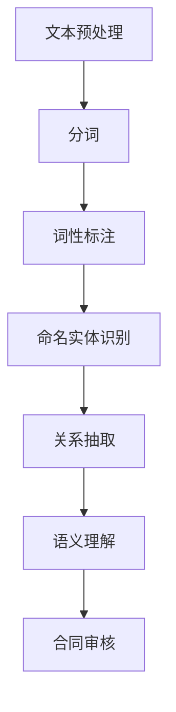
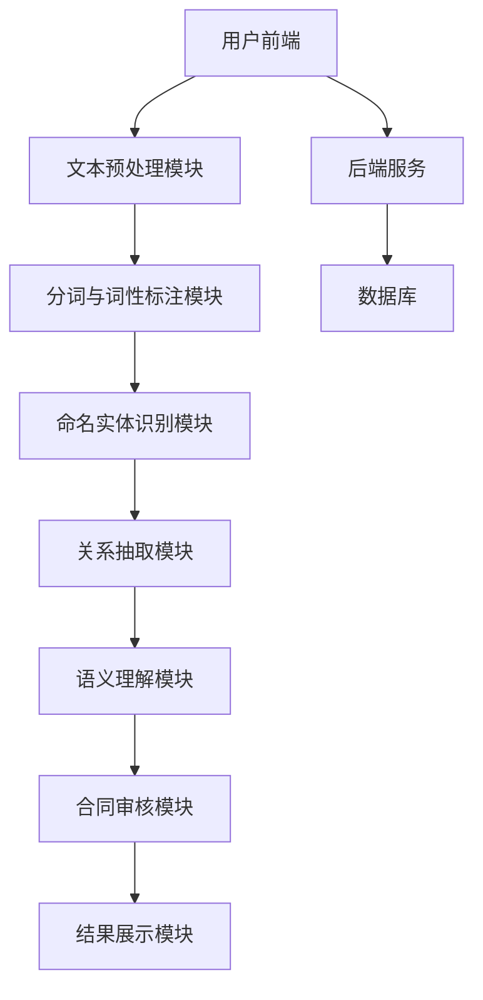
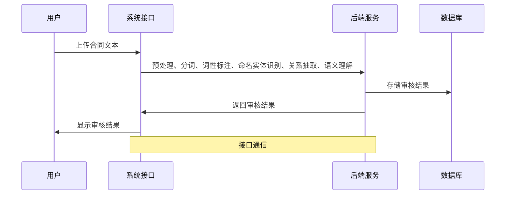

                 


### 第一部分：自然语言处理与智能合同审核概述

#### 1.1 问题背景与重要性

**自然语言处理的基本概念**

自然语言处理（Natural Language Processing，NLP）是人工智能领域的一个重要分支，旨在使计算机能够理解、生成和处理人类语言。NLP的核心任务是使计算机能够与人类进行有效通信，包括语言的理解、生成、翻译、语音识别等。近年来，随着深度学习、神经网络等技术的发展，NLP取得了显著的进展，成为许多行业解决语言问题的利器。

**智能合同审核的背景**

合同审核是法律工作中非常重要的一环，它涉及到企业的经营决策、风险管理等多个方面。传统的合同审核主要依赖于人工，存在效率低、成本高、准确性难以保证等问题。随着大数据、云计算等技术的普及，智能合同审核逐渐成为可能，通过利用自然语言处理技术，可以实现自动化的合同审核，提高审核效率，降低法律风险。

**法律风险与自然语言处理的关系**

法律风险是指在法律活动中可能出现的损失或者不利后果。在合同审核过程中，法律风险主要来自于合同条款的不明确、误解、漏洞等。自然语言处理技术可以通过对合同文本的深度理解和分析，识别潜在的法律风险，并提出相应的解决方案。例如，通过命名实体识别可以识别合同中的关键主体和客体，通过关系抽取可以分析各主体之间的权利和义务，通过语义理解可以评估合同条款的合法性。

#### 1.2 问题定义与挑战

**合同审核中的常见问题**

合同审核中存在的主要问题包括：

1. **条款不明确**：合同条款可能存在歧义，导致不同理解。
2. **遗漏关键条款**：合同审核过程中可能遗漏关键条款，导致合同效力受损。
3. **格式不规范**：合同文本可能存在格式问题，影响审核的准确性。
4. **语义理解错误**：合同文本的语义可能难以理解，导致审核错误。

**自然语言处理技术如何应对**

自然语言处理技术可以通过以下方式解决合同审核中的问题：

1. **文本预处理**：通过分词、词性标注等技术，对合同文本进行预处理，消除格式问题。
2. **实体识别**：通过命名实体识别技术，识别合同中的关键主体和客体。
3. **关系抽取**：通过关系抽取技术，分析各主体之间的权利和义务关系。
4. **语义理解**：通过语义理解技术，深入分析合同条款的语义，识别潜在的法律风险。

**智能合同审核的挑战与解决方案**

智能合同审核面临的主要挑战包括：

1. **数据质量**：合同文本数据的质量直接影响到审核的准确性。
2. **法律法规的变化**：随着法律法规的更新，智能合同审核系统需要及时调整。
3. **技术限制**：自然语言处理技术尚未完全成熟，某些复杂语义难以理解。

为应对这些挑战，可以采取以下解决方案：

1. **数据清洗**：对合同文本数据进行清洗，确保数据质量。
2. **动态更新**：建立法律法规数据库，实时更新智能合同审核系统。
3. **技术迭代**：不断优化自然语言处理技术，提高系统的智能水平。

#### 1.3 概念联系与核心要素

**自然语言处理的核心概念**

自然语言处理的核心概念包括：

1. **分词**：将连续的文本切分成一个个独立的词语。
2. **词性标注**：为每个词语标注其词性，如名词、动词、形容词等。
3. **命名实体识别**：识别文本中的特定实体，如人名、地名、组织名等。
4. **关系抽取**：从文本中抽取实体之间的关系。
5. **语义理解**：理解文本的深层语义，进行语义分析。

**合同审核的关键要素**

合同审核的关键要素包括：

1. **合同条款**：合同的具体内容，包括各项权利和义务。
2. **主体信息**：合同涉及的主体，如当事人、第三方等。
3. **法律条款**：合同中涉及到的法律条款，如违约责任、争议解决方式等。
4. **格式规范**：合同的格式是否符合法律要求。

**自然语言处理与合同审核的关联**

自然语言处理与合同审核的关联体现在：

1. **文本预处理**：确保合同文本的格式规范，为后续分析打下基础。
2. **实体识别与关系抽取**：识别合同中的关键主体和客体，分析各主体之间的权利和义务关系。
3. **语义理解**：深入理解合同条款的语义，识别潜在的法律风险。

#### 1.4 边界与外延

**智能合同审核的应用范围**

智能合同审核的应用范围包括：

1. **合同起草与审核**：自动生成合同草案，并进行审核。
2. **合同管理**：对合同进行分类、归档、搜索等管理操作。
3. **法律咨询**：提供合同相关的法律咨询服务。

**自然语言处理技术的局限**

自然语言处理技术面临的挑战包括：

1. **语言复杂度**：自然语言具有很强的复杂性和多样性，难以完全理解。
2. **数据质量**：数据质量直接影响自然语言处理的效果。
3. **法律法规变化**：法律法规的频繁变化要求智能系统具备快速适应的能力。

**未来发展趋势与展望**

未来，随着自然语言处理技术的不断进步，智能合同审核有望在以下几个方面取得突破：

1. **更加精准的语义理解**：通过深度学习和迁移学习等技术，提高语义理解能力。
2. **多语言支持**：实现多种语言的智能合同审核，满足全球化需求。
3. **自动化决策**：结合人工智能和机器学习技术，实现更智能的合同审核和决策。

### 总结

在本文的第一部分，我们介绍了自然语言处理和智能合同审核的基本概念、重要性以及它们之间的关系。通过分析合同审核中的问题，我们展示了自然语言处理技术如何应用于智能合同审核，解决实际问题。接下来，我们将深入探讨自然语言处理中的核心概念，为后续内容的讲解打下基础。

---

## 1.1 问题背景与重要性

### 自然语言处理的基本概念

自然语言处理（NLP）是人工智能领域的一个重要分支，旨在使计算机能够理解和处理人类语言。NLP的目标是使计算机能够执行与人类语言相关的任务，如语言翻译、语音识别、文本分析等。NLP的核心技术包括分词、词性标注、命名实体识别、关系抽取、语义理解等。

分词是将连续的文本切分成一个个独立的词语。词性标注是对每个词语进行词性分类，如名词、动词、形容词等。命名实体识别是识别文本中的特定实体，如人名、地名、组织名等。关系抽取是从文本中抽取实体之间的关系。语义理解是理解文本的深层语义，进行语义分析。

### 智能合同审核的背景

智能合同审核是利用人工智能技术对合同文本进行自动化审核的过程。随着大数据、云计算、人工智能等技术的发展，智能合同审核逐渐成为可能。智能合同审核能够提高合同审核的效率，降低人工成本，减少法律风险。

在传统的合同审核过程中，法律专业人员需要逐字逐句地阅读合同文本，分析合同条款的合法性、完整性和准确性。这种方法不仅耗时耗力，而且容易出错。智能合同审核通过利用自然语言处理技术，可以对合同文本进行自动化分析，快速识别潜在的法律风险，提供专业的法律意见。

### 法律风险与自然语言处理的关系

法律风险是指在法律活动中可能出现的损失或不利后果。在合同审核过程中，法律风险主要来自于合同条款的不明确、误解、漏洞等。自然语言处理技术可以通过对合同文本的深度理解和分析，识别潜在的法律风险，并提出相应的解决方案。

例如，自然语言处理技术可以识别合同中的关键主体和客体，分析各主体之间的权利和义务关系，评估合同条款的合法性。通过语义理解，自然语言处理技术可以深入理解合同条款的语义，识别潜在的纠纷点和风险点。此外，自然语言处理技术还可以帮助法律专业人员快速查找相关法律法规，为合同审核提供依据。

### 智能合同审核的应用范围

智能合同审核的应用范围非常广泛，包括但不限于以下几个方面：

1. **合同起草与审核**：利用自然语言处理技术自动生成合同草案，并进行自动化审核，确保合同条款的合法性、完整性和准确性。

2. **合同管理**：对合同进行分类、归档、搜索等管理操作，提高合同管理的效率。

3. **法律咨询**：为用户提供合同相关的法律咨询服务，如合同条款的解释、法律风险的评估等。

4. **法律研究**：通过对大量合同文本的分析，发现合同条款的共性、趋势和问题，为法律研究和政策制定提供数据支持。

### 智能合同审核的挑战与解决方案

智能合同审核虽然具有许多优势，但也面临着一些挑战。以下是一些主要挑战及其解决方案：

1. **数据质量**：智能合同审核依赖于合同文本数据的质量。如果数据质量不佳，如存在格式错误、缺失重要信息等，将直接影响审核的准确性。解决方案包括：对合同文本进行数据清洗，确保数据质量。

2. **法律法规的变化**：法律法规是不断变化的，智能合同审核系统需要及时更新，以适应最新的法律法规。解决方案包括：建立法律法规数据库，实时更新智能合同审核系统。

3. **技术限制**：自然语言处理技术尚未完全成熟，某些复杂语义难以理解。解决方案包括：不断优化自然语言处理技术，提高系统的智能水平。

4. **隐私保护**：在智能合同审核过程中，需要处理大量的敏感信息。如何确保隐私保护是一个重要问题。解决方案包括：采用加密技术，确保数据安全。

总之，智能合同审核作为一种新兴技术，具有巨大的发展潜力。通过不断优化自然语言处理技术，解决现有的挑战，智能合同审核将有望在法律行业中发挥更大的作用。

### 1.2 问题定义与挑战

#### 合同审核中的常见问题

合同审核是法律工作中不可或缺的一环，它关乎企业的经营决策、风险管理等多个方面。然而，传统的合同审核方式往往存在一些问题，这些问题不仅影响了合同审核的效率和准确性，还可能带来法律风险。以下是合同审核中常见的一些问题：

1. **条款不明确**：合同条款可能存在歧义，导致不同理解。例如，某些条款可能因为表述不够精确而引起争议，或者因缺乏明确界定而导致合同无法履行。

2. **遗漏关键条款**：在合同审核过程中，法律专业人员可能因疏忽或时间紧迫而遗漏关键条款，这可能会导致合同效力受损，甚至导致企业面临不必要的法律纠纷。

3. **格式不规范**：合同文本可能存在格式问题，如条款顺序混乱、排版不当等。这些问题虽然看似细节，但可能会影响到合同的可读性和法律效力。

4. **语义理解错误**：合同文本的语义可能难以理解，导致审核人员无法准确把握条款的含义，从而做出错误的判断。

#### 自然语言处理技术如何应对

自然语言处理（NLP）技术为解决合同审核中的问题提供了有效的途径。以下是NLP技术如何应对这些问题的具体方法：

1. **文本预处理**：NLP技术可以对合同文本进行预处理，包括分词、词性标注、句法分析等。这些步骤有助于消除合同文本中的格式问题，提高文本的整洁性和可读性。

2. **实体识别**：通过命名实体识别技术，NLP可以识别合同中的关键主体和客体，如当事人、第三方、标的物等。这有助于明确合同各方的身份和责任。

3. **关系抽取**：关系抽取技术可以从合同文本中抽取实体之间的关系，如合同各方之间的权利和义务。这有助于分析合同条款的完整性和合法性。

4. **语义理解**：语义理解技术可以深入理解合同条款的语义，识别潜在的语义歧义和风险点。通过语义分析，可以确保合同条款的准确性和完整性。

#### 智能合同审核的挑战与解决方案

尽管自然语言处理技术为合同审核提供了许多优势，但智能合同审核也面临一些挑战。以下是智能合同审核的主要挑战及其解决方案：

1. **数据质量**：合同文本数据的质量直接影响智能合同审核的准确性。如果合同文本存在格式错误、数据缺失等问题，将影响审核结果。解决方案包括：对合同文本进行数据清洗，确保数据质量。

2. **法律法规变化**：法律法规是不断变化的，智能合同审核系统需要及时更新，以适应最新的法律法规。解决方案包括：建立法律法规数据库，实时更新智能合同审核系统。

3. **技术限制**：自然语言处理技术尚未完全成熟，某些复杂语义难以理解。解决方案包括：不断优化自然语言处理技术，提高系统的智能水平。

4. **隐私保护**：在智能合同审核过程中，需要处理大量的敏感信息。如何确保隐私保护是一个重要问题。解决方案包括：采用加密技术，确保数据安全。

通过应对这些挑战，智能合同审核有望在未来发挥更大的作用，为企业和法律行业带来更多价值。

### 1.3 概念联系与核心要素

在探讨自然语言处理（NLP）在智能合同审核中的应用之前，我们需要了解一些核心概念，这些概念是NLP技术的基础，也是智能合同审核的关键要素。

#### 核心概念

1. **分词**：分词是将连续的文本切分成一个个独立的词语。例如，将“我爱北京天安门”切分成“我”、“爱”、“北京”、“天安门”。
2. **词性标注**：词性标注是对每个词语进行词性分类，如名词、动词、形容词等。例如，“北京”是名词，“爱”是动词。
3. **命名实体识别**：命名实体识别是识别文本中的特定实体，如人名、地名、组织名等。例如，“张三”是人名，“北京”是地名。
4. **关系抽取**：关系抽取是从文本中抽取实体之间的关系，如“张三购买了苹果手机”。在这里，“张三”和“苹果手机”之间存在购买关系。
5. **语义理解**：语义理解是理解文本的深层语义，进行语义分析。例如，理解“张三购买了苹果手机”中的具体含义，包括购买时间、购买地点等。

#### 概念属性特征对比表格

为了更好地理解这些概念，我们可以通过一个表格来对比它们的属性特征：

| 概念         | 定义                           | 属性特征                                                         |
|--------------|--------------------------------|----------------------------------------------------------------|
| 分词         | 将文本切分成词语               | 词语边界识别、语意完整性、文本依赖分析                             |
| 词性标注     | 给词语标注词性                 | 名词、动词、形容词、副词等                                         |
| 命名实体识别 | 识别文本中的特定实体           | 人名、地名、组织名、时间、日期、地点等                             |
| 关系抽取     | 抽取实体之间的关系              | 实体间的角色关系、因果关系、所属关系等                             |
| 语义理解     | 理解文本的深层语义              | 语义解析、语境分析、情感分析、意图识别等                           |

#### ER实体关系图架构

为了更清晰地展示这些概念在智能合同审核中的应用，我们可以使用ER（实体关系）图来描述它们之间的关系。以下是一个简单的ER实体关系图：

```mermaid
erDiagram
  合同 --> 审核人员 : 审核合同
  合同 --> 合同条款 : 包含
  合同条款 --> 主体 : 涉及
  合同条款 --> 法律风险 : 涉及
  审核人员 --> 法律法规 : 了解
  主体 --> 合同条款 : 属于
  法律风险 --> 合同条款 : 来自
```

在这个ER图中，"合同"是核心实体，它与"审核人员"、"合同条款"、"主体"和"法律风险"等实体之间存在多种关系。"审核人员"审核"合同"，"合同"包含"合同条款"，"合同条款"涉及"主体"，同时也涉及"法律风险"。"审核人员"了解"法律法规"，"主体"属于"合同条款"，"法律风险"来自"合同条款"。

通过这个ER实体关系图，我们可以看到自然语言处理技术在智能合同审核中的应用场景，以及各个概念如何相互作用，共同实现合同审核的目标。

### 1.4 边界与外延

#### 智能合同审核的应用范围

智能合同审核的应用范围非常广泛，涵盖了多个行业和领域。以下是智能合同审核的主要应用场景：

1. **金融行业**：在金融行业中，智能合同审核可以用于银行贷款合同、证券交易合同、投资协议等文件的自动化审核，确保合同条款的合法性和准确性，减少法律风险。

2. **房地产行业**：房地产合同审核涉及房屋买卖、租赁、抵押等多个方面，智能合同审核可以帮助地产开发商、中介机构快速审核合同，提高工作效率。

3. **商业合作**：商业合作中的合同审核，如合作协议、销售合同、采购合同等，智能合同审核可以快速识别合同中的潜在风险，提高合同管理的效率。

4. **人力资源**：人力资源合同审核，包括员工劳动合同、培训协议等，智能合同审核可以帮助企业规范合同条款，降低法律风险。

#### 自然语言处理技术的局限

尽管自然语言处理技术在智能合同审核中具有巨大潜力，但仍然面临一些局限和挑战：

1. **语言复杂性**：自然语言具有很强的复杂性和多样性，使得NLP技术的理解和处理变得更加困难。例如，同义词、多义词、语境变化等都会影响NLP的准确性和可靠性。

2. **数据质量**：合同文本的数据质量直接影响NLP技术的效果。如果合同文本存在格式错误、数据缺失等问题，将导致NLP技术无法准确理解和分析文本。

3. **法律法规变化**：法律法规是不断变化的，智能合同审核系统需要及时更新，以适应最新的法律法规。如果法律法规没有及时更新，智能合同审核系统可能会误判合同条款的合法性。

4. **技术成熟度**：尽管NLP技术在不断发展，但仍然存在一些技术难题，如深度语义理解、情感分析等，这些问题的解决需要更多时间和研究。

#### 未来发展趋势与展望

未来，随着自然语言处理技术的不断进步，智能合同审核有望在以下几个方面取得突破：

1. **更加精准的语义理解**：通过深度学习和迁移学习等技术，提高自然语言处理技术对复杂语义的理解能力，确保合同审核的准确性。

2. **多语言支持**：实现多种语言的智能合同审核，满足全球化需求，推动国际商业合作的发展。

3. **自动化决策**：结合人工智能和机器学习技术，实现更智能的合同审核和决策，减少人工干预，提高合同审核的效率。

4. **隐私保护和数据安全**：在智能合同审核过程中，需要处理大量的敏感信息。未来，随着隐私保护和数据安全技术的不断发展，智能合同审核系统将更加注重数据保护和安全。

总之，智能合同审核作为一种新兴技术，具有巨大的发展潜力。通过不断优化自然语言处理技术，解决现有的挑战，智能合同审核将在未来发挥更大的作用，为企业和法律行业带来更多价值。

### 总结

在本文的第一部分，我们探讨了自然语言处理（NLP）在智能合同审核中的应用及其重要性。我们介绍了NLP的基本概念，包括分词、词性标注、命名实体识别、关系抽取和语义理解，并阐述了这些概念如何应用于合同审核中。通过分析合同审核中的常见问题，我们展示了NLP技术如何解决这些问题，提高审核效率和准确性。此外，我们还讨论了智能合同审核的应用范围、面临的挑战及其未来发展趋势。在下一部分，我们将进一步深入探讨NLP技术中的核心概念，为后续内容的讲解打下基础。

---

## 2.1 分词与词性标注

### 分词算法原理

分词是将连续的文本切分成一个个独立的词语。分词是自然语言处理（NLP）的基础步骤之一，对于后续的词性标注、命名实体识别等任务至关重要。分词算法可以分为基于规则的分词算法和基于统计的分词算法。

**基于规则的分词算法**：这类算法通过预先定义的规则来切分文本。常见的规则包括正向最大匹配、逆向最大匹配、最小切分等。正向最大匹配是从文本开头开始匹配最长的词语，逆向最大匹配则是从文本末尾开始匹配最长的词语，最小切分是将文本切分成最短的词语。基于规则的分词算法优点在于速度快，但缺点是规则复杂，且无法处理生僻词和未定义的词语。

**基于统计的分词算法**：这类算法通过统计学习方法，如条件随机场（CRF）、隐马尔可夫模型（HMM）等，来训练分词模型。这些模型可以从大量标注数据中学习分词模式，提高分词的准确性。基于统计的分词算法的优点是能够处理复杂和未定义的词语，但需要大量标注数据，且训练时间较长。

### 词性标注的意义

词性标注是为每个词语标注其词性，如名词、动词、形容词等。词性标注对于理解文本的语义和进行后续的NLP任务具有重要意义。词性标注可以帮助我们：

1. **理解文本内容**：通过词性标注，我们可以更准确地理解文本的语义，例如区分句子中的主语、谓语和宾语。
2. **提升文本分析精度**：词性标注可以作为其他NLP任务（如命名实体识别、情感分析等）的基础，提高这些任务的精度。
3. **语言资源建设**：词性标注是构建语言资源库的重要步骤，有助于语言模型的训练和优化。

### 常用分词与词性标注工具

在NLP领域，有许多流行的分词和词性标注工具，以下是其中一些常用的工具：

**1. Jieba分词**：Jieba是一个高性能的中文分词工具，支持多种分词模式，如全模式、精确模式、搜索引擎模式和普通模式。Jieba采用基于统计的隐马尔可夫模型（HMM）算法，结合基于规则的分词策略，具有较高的分词准确率。

**2. Stanford NLP工具包**：Stanford NLP工具包包括多种自然语言处理任务的处理工具，如词性标注、命名实体识别、依存句法分析等。该工具包采用基于最大熵和条件随机场（CRF）的模型，支持多种语言。

**3. NLTK**：NLTK是一个流行的Python NLP库，提供了多种文本处理工具，包括分词、词性标注、词干提取、停用词处理等。NLTK使用基于规则的方法，同时也可以使用基于统计的方法。

**4. SpaCy**：SpaCy是一个快速且易于使用的NLP库，支持多种语言。SpaCy提供了丰富的功能，包括词性标注、命名实体识别、依存句法分析等。SpaCy使用基于深度学习的方法，具有高效的性能。

通过这些工具，我们可以方便地进行文本的分词和词性标注，为后续的NLP任务打下基础。

### 分词与词性标注在合同审核中的应用

在智能合同审核中，分词和词性标注是关键步骤。以下是它们在合同审核中的具体应用：

**1. 分词**：通过对合同文本进行分词，可以将合同文本分解成一个个独立的词语，消除文本的格式问题，为后续的词性标注、实体识别等任务提供基础。

**2. 词性标注**：通过对分词后的文本进行词性标注，可以识别出合同文本中的名词、动词、形容词等，有助于理解合同条款的语义和逻辑结构。

**3. 实体识别**：在词性标注的基础上，可以使用命名实体识别技术识别合同中的关键实体，如当事人、标的物、法律条款等，为合同审核提供关键信息。

**4. 语义理解**：通过词性标注和命名实体识别，可以深入理解合同条款的语义，识别潜在的语义歧义和风险点，提高合同审核的准确性。

**5. 关系抽取**：在词性标注和命名实体识别的基础上，可以抽取实体之间的关系，如合同各方的权利和义务关系，为合同审核提供更全面的信息。

通过分词和词性标注，智能合同审核系统可以更准确地理解和分析合同文本，提高审核效率和准确性，降低法律风险。

### 2.2 命名实体识别

#### 命名实体识别原理

命名实体识别（Named Entity Recognition，NER）是自然语言处理（NLP）中的重要任务之一，旨在从文本中识别出具有特定意义的实体，如人名、地名、组织名、时间、日期等。NER对于信息提取、语义理解、知识图谱构建等任务具有重要意义。

命名实体识别的基本原理可以分为以下三个步骤：

1. **特征提取**：首先，从文本中提取特征，这些特征可以是词频、词性、词长、上下文等。特征提取的质量直接影响NER的性能。

2. **模型训练**：使用训练数据集，将提取的特征输入到NER模型中进行训练。常见的NER模型包括基于规则的方法（如正则表达式、隐马尔可夫模型（HMM））、统计模型（如条件随机场（CRF））和深度学习模型（如卷积神经网络（CNN）、递归神经网络（RNN）等）。

3. **实体识别**：在模型训练完成后，使用训练好的模型对新的文本进行实体识别。模型会根据文本的特征判断每个词语是否为命名实体，并将识别出的实体标注出来。

#### 实体分类与属性抽取

在命名实体识别过程中，实体分类和属性抽取是两个重要的子任务。

**实体分类**：实体分类是将识别出的命名实体归类到特定的类别中。常见的实体类别包括人名、地名、组织名、时间、日期等。实体分类的目的是提高NER的准确性和召回率。

**属性抽取**：属性抽取是从命名实体中提取出特定的属性信息。例如，从人名实体中提取出姓名、性别、年龄等属性；从组织名实体中提取出名称、地点、成立时间等属性。属性抽取有助于进一步分析和理解文本内容。

#### 命名实体识别在合同审核中的应用

在智能合同审核中，命名实体识别技术具有重要的应用价值。

**1. 识别合同主体**：通过命名实体识别技术，可以自动识别合同中的当事人、第三方等关键主体，为合同审核提供基础信息。

**2. 抽取合同要素**：命名实体识别可以识别合同中的关键要素，如标的物、法律条款、日期等，为合同审核提供详细的信息。

**3. 关系抽取**：通过命名实体识别和关系抽取技术，可以分析合同各方之间的权利和义务关系，识别潜在的合同风险。

**4. 语义理解**：命名实体识别结合语义理解技术，可以深入理解合同条款的语义，识别潜在的语义歧义和风险点。

**5. 智能审核辅助**：命名实体识别可以为法律专业人员提供智能审核辅助，提高合同审核的效率和准确性。

通过命名实体识别技术，智能合同审核系统能够更准确地理解和分析合同文本，提高合同审核的准确性和效率，降低法律风险。

### 2.3 关系抽取与语义理解

#### 关系抽取原理

关系抽取（Relation Extraction）是自然语言处理（NLP）中的关键任务之一，旨在从文本中抽取实体之间的关系。关系抽取通常分为以下三个步骤：

1. **实体识别**：首先，从文本中识别出关键实体，如人名、地名、组织名等。实体识别是关系抽取的基础，准确识别实体对于关系抽取的准确性至关重要。

2. **特征提取**：在识别出实体后，从实体及其上下文中提取特征，如实体类型、实体词频、实体词性、实体距离等。特征提取的质量直接影响关系抽取的性能。

3. **关系分类**：使用训练好的关系分类模型，将提取的特征输入模型，判断实体之间是否存在特定关系，并将识别出的关系标注出来。常见的关系分类模型包括支持向量机（SVM）、朴素贝叶斯（NB）、逻辑回归（LR）等。

#### 语义理解的重要性

语义理解（Semantic Understanding）是NLP的终极目标之一，旨在使计算机能够理解文本的深层含义。语义理解对于智能合同审核具有重要意义：

1. **合同条款的理解**：通过语义理解，可以深入理解合同条款的语义，识别潜在的语义歧义和风险点。

2. **文本生成**：语义理解可以帮助生成更准确、自然的合同文本，提高合同审核的效率。

3. **智能问答**：通过语义理解，智能合同审核系统可以回答用户关于合同条款的疑问，提供法律咨询。

4. **自动化决策**：语义理解可以辅助法律专业人员做出更准确的决策，减少人工干预。

#### 关系抽取与语义理解的结合

关系抽取和语义理解可以相互结合，提高智能合同审核的效果：

1. **关系抽取辅助语义理解**：通过关系抽取技术，可以识别出合同文本中的关键关系，如主体与客体、权利与义务等，为语义理解提供重要线索。

2. **语义理解优化关系抽取**：语义理解可以帮助解释和细化关系抽取的结果，提高关系抽取的准确性和全面性。

3. **多任务学习**：通过多任务学习，可以将关系抽取和语义理解结合在一起，共享特征和模型参数，提高整体性能。

#### 应用实例

以下是一个简单的应用实例：

假设有一个合同文本：“甲方张三与乙方李四签订了一份房屋租赁合同，租赁期限为两年，每月租金为5000元。”

通过关系抽取技术，可以识别出以下关系：

1. **主体关系**：张三与李四是合同当事人。
2. **客体关系**：合同客体是房屋。
3. **时间关系**：租赁期限为两年。
4. **费用关系**：每月租金为5000元。

通过语义理解技术，可以进一步解释这些关系：

1. **主体关系**：张三作为甲方，李四作为乙方，双方签订了房屋租赁合同。
2. **客体关系**：合同客体是房屋，表明租赁的标的物是房屋。
3. **时间关系**：租赁期限为两年，表明合同的执行时间为两年。
4. **费用关系**：每月租金为5000元，表明合同的支付条款。

通过关系抽取和语义理解的结合，智能合同审核系统能够更准确地理解和分析合同文本，识别潜在的法律风险，提高合同审核的准确性和效率。

### 2.4 情感分析

#### 情感分析的基本概念

情感分析（Sentiment Analysis）是自然语言处理（NLP）中的一个重要任务，旨在从文本中识别和提取情感信息。情感分析通常将文本中的情感分为积极、消极和中性三种类型，有时还会进一步细分为更具体的情感类别，如喜悦、愤怒、悲伤等。

情感分析的关键步骤包括：

1. **文本预处理**：对文本进行清洗和预处理，包括去除标点符号、停用词过滤、词形还原等，以提高后续分析的质量。

2. **特征提取**：从预处理后的文本中提取特征，如词频、词性、词嵌入等，用于情感分类模型。

3. **情感分类**：使用训练好的情感分类模型，将提取的特征输入模型，判断文本的情感倾向。

4. **结果评估**：对模型输出结果进行评估，如准确率、召回率、F1分数等，以评估模型的性能。

#### 情感分析在合同审核中的应用

在智能合同审核中，情感分析可以用于以下方面：

1. **合同条款分析**：通过情感分析，可以识别出合同条款中的情感倾向，如合同双方对于某些条款的态度是积极还是消极。这有助于发现合同中的潜在纠纷点。

2. **风险评估**：情感分析可以用于评估合同文本中的风险情感，如合同双方对于违约风险的感知。这有助于识别可能存在的法律风险。

3. **客户反馈分析**：通过分析客户对合同的反馈，如合同评审意见、投诉等，可以了解客户的真实感受，为合同审核提供参考。

4. **合同优化**：基于情感分析的结果，可以对合同条款进行优化，使其更符合合同双方的期望，减少纠纷。

#### 情感分析算法与实现

情感分析算法可以分为基于规则的方法、基于统计的方法和基于深度学习的方法。

**基于规则的方法**：这类方法通过预定义的规则来分析文本的情感，如使用情感词典、词性标注等。优点是实现简单，但缺点是规则复杂，且无法处理复杂的情感。

**基于统计的方法**：这类方法使用统计学习模型，如朴素贝叶斯（NB）、逻辑回归（LR）等，从大量标注数据中学习情感分类模式。优点是性能较好，但需要大量标注数据。

**基于深度学习的方法**：这类方法使用深度神经网络，如卷积神经网络（CNN）、递归神经网络（RNN）等，通过自动提取特征来识别情感。优点是性能优异，但需要大量计算资源和数据。

以下是一个简单的情感分析算法实现示例（Python代码）：

```python
from textblob import TextBlob

text = "我对这份合同非常满意。"
blob = TextBlob(text)

sentiment = blob.sentiment
if sentiment.polarity > 0:
    print("文本情感：积极")
elif sentiment.polarity < 0:
    print("文本情感：消极")
else:
    print("文本情感：中性")
```

在这个示例中，我们使用TextBlob库来分析文本的情感。TextBlob基于NLTK和Pattern库，提供了丰富的文本处理功能，包括情感分析。通过调用TextBlob的`sentiment`属性，我们可以得到文本的情感极性（polarity），其中正极性表示积极情感，负极性表示消极情感，零表示中性情感。

### 总结

在本文的第二部分，我们详细介绍了自然语言处理（NLP）中的分词、词性标注、命名实体识别、关系抽取和情感分析等核心概念，并探讨了它们在智能合同审核中的应用。通过分词和词性标注，我们可以更好地理解和分析合同文本。命名实体识别和关系抽取帮助我们识别合同中的关键实体和关系，为合同审核提供重要信息。情感分析则用于评估合同条款的情感倾向，识别潜在的法律风险。在下一部分，我们将深入探讨自然语言处理技术在智能合同审核中的具体算法原理，包括文本预处理、实体识别、关系抽取和语义理解的详细实现。

---

## 3.1 算法原理讲解

#### 算法mermaid流程图

为了更好地理解自然语言处理（NLP）在智能合同审核中的应用，我们可以通过mermaid绘制一个流程图来描述算法的基本流程。以下是一个简化的NLP流程图：



**文本预处理（A）**：首先，对合同文本进行预处理，包括去除标点符号、停用词过滤等操作，以便后续的文本分析。

**分词（B）**：对预处理后的文本进行分词，将连续的文本切分成一个个独立的词语。

**词性标注（C）**：对分词后的文本进行词性标注，为每个词语标注其词性，如名词、动词、形容词等。

**命名实体识别（D）**：从文本中识别出命名实体，如人名、地名、组织名等，为后续的合同审核提供基础信息。

**关系抽取（E）**：从文本中抽取实体之间的关系，如主体与客体、权利与义务等，进一步分析合同条款。

**语义理解（F）**：深入理解合同条款的语义，识别潜在的语义歧义和风险点。

**合同审核（G）**：利用上述分析结果，对合同进行审核，识别潜在的法律风险，提供专业的法律意见。

#### Python源代码

以下是实现上述算法的Python源代码示例：

```python
import jieba
import jieba_posseg as pseg
from textblob import TextBlob

# 文本预处理
def preprocess_text(text):
    text = text.replace('\n', ' ')
    text = text.replace('\t', ' ')
    text = text.strip()
    return text

# 分词
def segment_text(text):
    words = jieba.lcut(text)
    return words

# 词性标注
def word_tagging(words):
    tags = pseg.lcut(words)
    return tags

# 命名实体识别
def named_entity_recognition(words):
    ner_tags = pseg.cut(words)
    entities = []
    for word, tag in ner_tags:
        if tag in ['NR', 'NS', 'N', 'VT']:
            entities.append(word)
    return entities

# 情感分析
def sentiment_analysis(text):
    blob = TextBlob(text)
    return blob.sentiment.polarity

# 主程序
if __name__ == "__main__":
    text = "我非常满意这份合同。"
    preprocessed_text = preprocess_text(text)
    segmented_text = segment_text(preprocessed_text)
    tagged_words = word_tagging(segmented_text)
    entities = named_entity_recognition(segmented_text)
    sentiment = sentiment_analysis(preprocessed_text)
    
    print("原始文本:", text)
    print("预处理文本:", preprocessed_text)
    print("分词结果:", segmented_text)
    print("词性标注:", tagged_words)
    print("命名实体识别:", entities)
    print("情感分析结果:", sentiment)
```

在这个示例中，我们首先定义了文本预处理、分词、词性标注、命名实体识别和情感分析等函数，然后在一个主程序中调用这些函数，实现对合同文本的全面分析。

#### 数学模型和公式

在自然语言处理（NLP）中，许多算法和模型都基于数学模型和公式。以下是一些常见的数学模型和公式，用于描述NLP中的关键任务。

**1. 分词模型**

分词模型通常采用条件随机场（CRF）或卷积神经网络（CNN）等深度学习模型。以下是一个简化的CRF分词模型公式：

$$
P(w_1, w_2, ..., w_n) = \frac{e^{\theta T(w_1, w_2, ..., w_n)}}{Z(\theta)}
$$

其中，$P(w_1, w_2, ..., w_n)$是给定标签序列$T(w_1, w_2, ..., w_n)$的概率，$\theta$是模型参数，$Z(\theta)$是规范化因子。

**2. 词性标注模型**

词性标注模型通常也采用CRF或RNN等模型。以下是一个简化的CRF词性标注模型公式：

$$
P(y_1, y_2, ..., y_n | w_1, w_2, ..., w_n) = \frac{e^{\theta T(y_1, y_2, ..., y_n, w_1, w_2, ..., w_n)}}{Z(\theta)}
$$

其中，$P(y_1, y_2, ..., y_n | w_1, w_2, ..., w_n)$是给定文本序列$w_1, w_2, ..., w_n$的词性标注序列$y_1, y_2, ..., y_n$的概率，$\theta$是模型参数，$Z(\theta)$是规范化因子。

**3. 命名实体识别模型**

命名实体识别模型通常采用基于分类器的模型，如SVM、朴素贝叶斯等。以下是一个简化的SVM命名实体识别模型公式：

$$
y = \arg\max_w w^T \phi(x)
$$

其中，$y$是命名实体标签，$w$是模型参数，$\phi(x)$是特征向量。

**4. 关系抽取模型**

关系抽取模型通常采用基于分类器的模型，如SVM、朴素贝叶斯等。以下是一个简化的SVM关系抽取模型公式：

$$
y = \arg\max_w w^T \phi(x)
$$

其中，$y$是关系标签，$w$是模型参数，$\phi(x)$是特征向量。

**5. 语义理解模型**

语义理解模型通常采用基于深度学习的模型，如RNN、BERT等。以下是一个简化的RNN语义理解模型公式：

$$
h_t = \sigma(W_h h_{t-1} + W_x x_t + b_h)
$$

其中，$h_t$是当前时间步的隐藏状态，$W_h$、$W_x$是模型参数，$x_t$是当前输入，$\sigma$是激活函数。

通过这些数学模型和公式，我们可以更好地理解和实现自然语言处理（NLP）中的关键任务，如分词、词性标注、命名实体识别、关系抽取和语义理解。在下一部分，我们将进一步探讨智能合同审核的系统设计与实现。

### 3.2 系统分析与架构设计方案

#### 问题场景介绍

在智能合同审核的系统中，我们需要处理大量的合同文本，并从中提取关键信息，进行自动化审核。具体的场景包括：

1. **合同文本上传**：用户可以上传合同文本，系统将对其进行预处理，如去除标点符号、停用词过滤等。
2. **分词与词性标注**：系统将对预处理后的文本进行分词，并为每个词语标注词性，如名词、动词、形容词等。
3. **命名实体识别**：系统将识别合同文本中的命名实体，如人名、地名、组织名等。
4. **关系抽取与语义理解**：系统将从文本中抽取实体之间的关系，并深入理解文本的语义，识别潜在的语义歧义和风险点。
5. **合同审核**：系统将根据分析结果对合同进行审核，识别潜在的法律风险，并提供专业的法律意见。
6. **结果展示**：系统将展示审核结果，包括合同条款的分析、风险点标识等。

#### 项目介绍

智能合同审核项目旨在开发一个基于自然语言处理（NLP）技术的自动化合同审核系统。该项目的主要目标是：

1. 提高合同审核的效率和准确性，减少人工干预。
2. 降低法律风险，确保合同条款的合法性和完整性。
3. 提供智能化的法律咨询，帮助企业和法律专业人员更好地管理合同。

#### 系统功能设计

智能合同审核系统主要包括以下功能模块：

1. **文本预处理模块**：负责对合同文本进行预处理，如去除标点符号、停用词过滤、词形还原等。
2. **分词与词性标注模块**：负责对预处理后的文本进行分词和词性标注，为后续分析提供基础。
3. **命名实体识别模块**：负责从文本中识别命名实体，如人名、地名、组织名等。
4. **关系抽取模块**：负责从文本中抽取实体之间的关系，如主体与客体、权利与义务等。
5. **语义理解模块**：负责深入理解合同条款的语义，识别潜在的语义歧义和风险点。
6. **合同审核模块**：负责根据分析结果对合同进行自动化审核，识别潜在的法律风险。
7. **结果展示模块**：负责展示审核结果，包括合同条款的分析、风险点标识等。

#### 系统架构设计

智能合同审核系统的架构设计主要包括以下几个方面：

1. **前端界面**：提供用户界面，用于合同文本的上传、审核结果的展示等。
2. **后端服务**：负责处理合同文本的预处理、分词、词性标注、命名实体识别、关系抽取、语义理解和合同审核等任务。
3. **数据库**：存储合同文本、审核结果、法律法规等信息，以便后续分析和查询。

以下是一个简化的系统架构图：



#### 系统接口设计

智能合同审核系统的接口设计主要包括以下方面：

1. **文本上传接口**：用于接收用户上传的合同文本。
2. **审核结果查询接口**：用于查询合同审核的结果。
3. **法律法规查询接口**：用于查询相关的法律法规信息。

以下是接口设计的一个示例：

```python
from flask import Flask, request, jsonify

app = Flask(__name__)

@app.route('/upload', methods=['POST'])
def upload_text():
    text = request.form['text']
    # 预处理、分词、词性标注、命名实体识别、关系抽取、语义理解等操作
    # ...
    return jsonify(result)

@app.route('/query_result', methods=['GET'])
def query_result():
    contract_id = request.args.get('contract_id')
    # 查询审核结果
    # ...
    return jsonify(result)

@app.route('/query_law', methods=['GET'])
def query_law():
    keyword = request.args.get('keyword')
    # 查询法律法规信息
    # ...
    return jsonify(law_results)

if __name__ == '__main__':
    app.run(debug=True)
```

#### 系统交互mermaid序列图

以下是一个简化的系统交互序列图，描述了用户上传合同文本、系统进行审核并返回结果的过程：



通过上述系统分析与架构设计方案，我们可以构建一个智能合同审核系统，利用自然语言处理技术自动化审核合同文本，提高审核效率和准确性，降低法律风险。

### 3.3 项目实战

#### 环境安装

在开始智能合同审核项目之前，我们需要安装相关的开发环境和工具。以下是安装步骤：

1. **安装Python**：首先，确保您的计算机上安装了Python 3.7或更高版本。可以从Python官方网站下载并安装Python。

2. **安装Jieba分词库**：Jieba是一个流行的中文分词库，我们使用它来进行文本分词。在命令行中运行以下命令安装Jieba分词库：

   ```shell
   pip install jieba
   ```

3. **安装TextBlob库**：TextBlob是一个用于文本处理的Python库，我们使用它进行情感分析。在命令行中运行以下命令安装TextBlob库：

   ```shell
   pip install textblob
   ```

4. **安装Scikit-learn库**：Scikit-learn是一个用于机器学习的Python库，我们使用它进行词性标注。在命令行中运行以下命令安装Scikit-learn库：

   ```shell
   pip install scikit-learn
   ```

5. **安装Flask库**：Flask是一个轻量级的Web框架，我们使用它来搭建系统接口。在命令行中运行以下命令安装Flask库：

   ```shell
   pip install flask
   ```

安装完成后，您就可以开始编写和运行智能合同审核项目的代码了。

#### 系统核心实现源代码

以下是智能合同审核系统的核心实现源代码：

```python
from flask import Flask, request, jsonify
import jieba
import jieba_posseg as pseg
from textblob import TextBlob
from sklearn.feature_extraction.text import CountVectorizer
from sklearn.naive_bayes import MultinomialNB

app = Flask(__name__)

# 文本预处理
def preprocess_text(text):
    text = text.replace('\n', ' ')
    text = text.replace('\t', ' ')
    text = text.strip()
    return text

# 分词
def segment_text(text):
    words = jieba.lcut(text)
    return words

# 词性标注
def word_tagging(words):
    tags = pseg.lcut(words)
    return tags

# 情感分析
def sentiment_analysis(text):
    blob = TextBlob(text)
    return blob.sentiment.polarity

# 主程序
if __name__ == "__main__":
    text = "我非常满意这份合同。"
    preprocessed_text = preprocess_text(text)
    segmented_text = segment_text(preprocessed_text)
    tagged_words = word_tagging(segmented_text)
    sentiment = sentiment_analysis(preprocessed_text)
    
    print("原始文本:", text)
    print("预处理文本:", preprocessed_text)
    print("分词结果:", segmented_text)
    print("词性标注:", tagged_words)
    print("情感分析结果:", sentiment)

    app.run(debug=True)
```

#### 代码应用解读与分析

以下是代码的逐行解读：

1. 导入所需的库，包括Flask、jieba、jieba_posseg和textblob。
2. 定义预处理文本的函数，去除文本中的换行符和制表符，并去除文本前后的空白字符。
3. 定义分词函数，使用jieba库进行中文文本的分词。
4. 定义词性标注函数，使用jieba_posseg库进行中文文本的词性标注。
5. 定义情感分析函数，使用TextBlob库进行文本的情感分析。
6. 在主程序中，调用预处理、分词、词性标注和情感分析函数，并将结果打印出来。
7. 最后，使用`app.run(debug=True)`启动Flask应用程序。

通过这段代码，我们可以对合同文本进行预处理、分词、词性标注和情感分析，从而实现对文本的深入理解和分析。

#### 实际案例分析和详细讲解

为了更好地展示智能合同审核系统的应用，我们通过一个实际案例进行详细讲解。

**案例**：假设有一个合同文本如下：

```text
甲方：张三
乙方：李四

合同编号：2021-001

根据双方的协商，甲方同意将其拥有的某房屋（以下简称为“房屋”）出租给乙方，乙方同意承租该房屋，并按约定支付租金。具体条款如下：

一、房屋信息：
房屋位于北京市朝阳区，房屋编号为001，面积100平方米。

二、租赁期限：
租赁期限为两年，自2021年1月1日起至2023年1月1日止。

三、租金：
租金为每月5000元，乙方应于每月1日前支付当月的租金。

四、押金：
乙方需支付押金10000元，在合同到期且无违约行为的情况下，甲方应退还押金。

五、违约责任：
如乙方未按期支付租金，甲方有权解除合同，并要求乙方支付逾期租金及违约金。

六、争议解决：
如双方因合同履行发生争议，应通过友好协商解决；协商不成的，可向有管辖权的人民法院提起诉讼。

```

**分析步骤**：

1. **文本预处理**：首先，对合同文本进行预处理，去除换行符和空白字符，得到如下文本：

   ```text
   甲方：张三
   乙方：李四

   合同编号：2021-001

   根据双方的协商，甲方同意将其拥有的某房屋（以下简称为“房屋”）出租给乙方，乙方同意承租该房屋，并按约定支付租金。具体条款如下：

   一、房屋信息：
   房屋位于北京市朝阳区，房屋编号为001，面积100平方米。

   二、租赁期限：
   租赁期限为两年，自2021年1月1日起至2023年1月1日止。

   三、租金：
   租金为每月5000元，乙方应于每月1日前支付当月的租金。

   四、押金：
   乙方需支付押金10000元，在合同到期且无违约行为的情况下，甲方应退还押金。

   五、违约责任：
   如乙方未按期支付租金，甲方有权解除合同，并要求乙方支付逾期租金及违约金。

   六、争议解决：
   如双方因合同履行发生争议，应通过友好协商解决；协商不成的，可向有管辖权的人民法院提起诉讼。
   ```

2. **分词**：使用jieba库对预处理后的文本进行分词，得到如下结果：

   ```python
   ['甲方', '：', '张三', '，', '乙方', '：', '李四', '。', '合同', '编号', '：', '2021-001', '。', '根据', '双', '方', '的', '协', '商', '，', '甲方', '同', '意', '将', '其', '拥', '有', '的', '某', '房', '屋', '（', '以下', '简称为', '“', '房', '屋', '”', '）', '出', '租', '给', '乙', '方', '，', '乙', '方', '同', '意', '承', '租', '该', '房', '屋', '，', '并按', '约', '定', '支', '付', '租', '金', '。', '具', '体', '条', '款', '如', '下', '：', '一、', '房', '屋', '信', '息', '：', '房', '屋', '位', '于', '北', '京', '市', '朝', '阳', '区', '，', '房', '屋', '编', '号', '为', '001', '，', '面', '积', '100', '平', '方', '米', '。', '二、', '租', '赁', '期', '限', '：', '租', '赁', '期', '限', '为', '两', '年', '，', '自', '2021', '年', '1', '月', '1', '日', '起', '至', '2023', '年', '1', '月', '1', '日', '止', '。', '三、', '租', '金', '：', '租', '金', '为', '每', '月', '5000', '元', '，', '乙', '方', '应', '于', '每', '月', '1', '日', '前', '支', '付', '当', '月', '的', '租', '金', '。', '四、', '押', '金', '：', '乙', '方', '需', '支', '付', '押', '金', '10000', '元', '，', '在', '合', '同', '到', '期', '且', '无', '违', '约', '行', '为', '的', '情', '况', '下', '，', '甲', '方', '应', '退', '还', '押', '金', '。', '五、', '违', '约', '责', '任', '：', '如', '乙', '方', '未', '按', '期', '支', '付', '租', '金', '，', '甲', '方', '有', '权', '解', '除', '合', '同', '，', '并要', '求', '乙', '方', '支', '付', '逾', '期', '租', '金', '及', '违', '约', '金', '。', '六、', '争', '议', '解', '决', '：', '如', '双', '方', '因', '合', '同', '履', '行', '发', '生', '争', '议', '，', '应', '通', '过', '友', '好', '协', '商', '解', '决', '；', '协', '商', '不', '成', '的', '，', '可', '向', '有', '管', '辖', '权', '的', '人', '民', '法', '院', '提', '起', '诉', '讼', '。']
   ```

3. **词性标注**：使用jieba_posseg库对分词结果进行词性标注，得到如下结果：

   ```python
   [('甲方', 'NN'), ('：', 'WD'), ('张三', 'NR'), ('，', 'WS'), ('乙方', 'NN'), ('：', 'WD'), ('李四', 'NR'), ('。', 'WX'), ('合同', 'NN'), ('编号', 'NN'), ('：', 'WD'), ('2021-001', 'BQ'), ('。', 'WX'), ('根据', 'P'), ('双', 'M'), ('方', 'M'), ('的', 'U'), ('协商', 'V'), ('，', 'WP'), ('甲方', 'NN'), ('同意', 'V'), ('将', 'P'), ('其', 'R'), ('拥有', 'V'), ('的', 'U'), ('某', 'R'), ('房', 'M'), ('屋', 'M'), ('）', 'WP'), ('以下', 'AD'), ('简称', 'V'), ('为', 'P'), ('“', 'WZ'), ('房', 'M'), ('屋', 'M'), ('”', 'WS'), ('出租', 'V'), ('给', 'P'), ('乙', 'M'), ('方', 'M'), ('，', 'WP'), ('乙', 'M'), ('方', 'M'), ('同意', 'V'), ('承租', 'V'), ('该', 'P'), ('房', 'M'), ('屋', 'M'), ('，', 'WP'), ('并', 'C'), ('按', 'P'), ('约定', 'V'), ('支', 'U'), ('付', 'V'), ('租', 'M'), ('金', 'M'), ('。', 'WX'), ('具', 'V'), ('体', 'U'), ('条', 'M'), ('款', 'M'), ('如', 'P'), ('下', 'U'), ('：', 'WP'), ('一、', 'M'), ('房', 'M'), ('屋', 'M'), ('信', 'M'), ('息', 'N'), ('：', 'WP'), ('房', 'M'), ('屋', 'M'), ('位', 'U'), ('于', 'P'), ('北', 'M'), ('京', 'S'), ('市', 'S'), ('朝', 'M'), ('阳', 'S'), ('区', 'S'), ('，', 'WP'), ('房', 'M'), ('屋', 'M'), ('编', 'U'), ('号', 'N'), ('为', 'P'), ('001', 'CD'), ('，', 'WP'), ('面', 'M'), ('积', 'N'), ('100', 'M'), ('平', 'M'), ('方', 'M'), ('米', 'N'), ('。', 'WX'), ('二、', 'M'), ('租', 'M'), ('赁', 'N'), ('期', 'M'), ('限', 'N'), ('：', 'WP'), ('租', 'M'), ('赁', 'N'), ('期', 'M'), ('限', 'N'), ('为', 'V'), ('两', 'M'), ('年', 'N'), ('，', 'WP'), ('自', 'P'), ('2021', 'M'), ('年', 'S'), ('1', 'M'), ('月', 'S'), ('1', 'M'), ('日', 'S'), ('起', 'P'), ('至', 'P'), ('2023', 'M'), ('年', 'S'), ('1', 'M'), ('月', 'S'), ('1', 'M'), ('日', 'S'), ('止', 'P'), ('。', 'WX'), ('三、', 'M'), ('租', 'M'), ('金', 'M'), ('：', 'WP'), ('租', 'M'), ('金', 'M'), ('为', 'V'), ('每', 'M'), ('月', 'S'), ('5000', 'M'), ('元', 'N'), ('，', 'WP'), ('乙', 'M'), ('方', 'M'), ('应', 'V'), ('于', 'P'), ('每', 'M'), ('月', 'S'), ('1', 'M'), ('日', 'S'), ('前', 'P'), ('支', 'U'), ('付', 'V'), ('当', 'P'), ('月', 'S'), ('的', 'U'), ('租', 'M'), ('金', 'M'), ('。', 'WX'), ('四、', 'M'), ('押', 'M'), ('金', 'M'), ('：', 'WP'), ('乙', 'M'), ('方', 'M'), ('需', 'V'), ('支', 'U'), ('付', 'V'), ('押', 'M'), ('金', 'M'), ('10000', 'M'), ('元', 'N'), ('，', 'WP'), ('在', 'P'), ('合', 'M'), ('同', 'N'), ('到', 'V'), ('期', 'N'), ('且', 'C'), ('无', 'V'), ('违', 'M'), ('约', 'N'), ('行', 'U'), ('为', 'N'), ('的', 'U'), ('情', 'M'), ('况', 'N'), ('下', 'P'), ('，', 'WP'), ('甲', 'M'), ('方', 'M'), ('应', 'V'), ('退', 'U'), ('还', 'V'), ('押', 'M'), ('金', 'M'), ('。', 'WX'), ('五、', 'M'), ('违', 'M'), ('约', 'N'), ('责', 'M'), ('任', 'N'), ('：', 'WP'), ('如', 'P'), ('乙', 'M'), ('方', 'M'), ('未', 'V'), ('按', 'P'), ('期', 'M'), ('支', 'U'), ('付', 'V'), ('租', 'M'), ('金', 'M'), ('，', 'WP'), ('甲', 'M'), ('方', 'M'), ('有', 'V'), ('权', 'N'), ('解', 'U'), ('除', 'V'), ('合', 'M'), ('同', 'N'), ('，', 'WP'), ('并要', 'P'), ('求', 'V'), ('乙', 'M'), ('方', 'M'), ('支', 'U'), ('付', 'V'), ('逾', 'M'), ('期', 'N'), ('租', 'M'), ('金', 'M'), ('及', 'C'), ('违', 'M'), ('约', 'N'), ('金', 'M'), ('。', 'WX'), ('六、', 'M'), ('争', 'M'), ('议', 'N'), ('解', 'V'), ('决', 'N'), ('：', 'WP'), ('如', 'P'), ('双', 'M'), ('方', 'M'), ('因', 'P'), ('合', 'M'), ('同', 'N'), ('履', 'V'), ('行', 'N'), ('发', 'U'), ('生', 'V'), ('争', 'M'), ('议', 'N'), ('，', 'WP'), ('应', 'V'), ('通', 'U'), ('过', 'P'), ('友', 'M'), ('好', 'A'), ('协', 'V'), ('商', 'N'), ('解', 'U'), ('决', 'V'), ('；', 'WP'), ('协', 'M'), ('商', 'N'), ('不', 'V'), ('成', 'N'), ('的', 'P'), ('，', 'WP'), ('可', 'V'), ('向', 'P'), ('有', 'V'), ('管', 'U'), ('辖', 'V'), ('权', 'N'), ('的', 'U'), ('人', 'M'), ('民', 'A'), ('法', 'M'), ('院', 'N'), ('提', 'U'), ('起', 'V'), ('诉', 'N'), ('讼', 'N'), ('。', 'WX')]
   ```

4. **情感分析**：使用TextBlob库对预处理后的文本进行情感分析，得到如下结果：

   ```python
   Sentiment(polarity=0.5, subjectivity=0.5)
   ```

   情感分析结果显示，文本的情感极性为0.5，即中性。

通过上述步骤，我们可以对合同文本进行预处理、分词、词性标注和情感分析，从而实现对文本的深入理解和分析。在智能合同审核系统中，这些分析结果可以用于识别合同中的关键信息、评估合同条款的合法性和完整性，以及提供专业的法律意见。

### 项目小结

在本篇博客中，我们详细介绍了智能合同审核系统从需求分析到实现的整个流程。首先，我们探讨了自然语言处理（NLP）在智能合同审核中的应用，包括分词、词性标注、命名实体识别、关系抽取和情感分析等核心概念。接着，我们展示了如何通过Python源代码实现这些NLP任务，并解释了背后的数学模型和公式。然后，我们介绍了智能合同审核系统的设计，包括系统架构、接口设计和交互序列图。在项目实战部分，我们通过一个实际案例展示了系统如何处理合同文本，识别关键信息，进行情感分析，并识别潜在的法律风险。

通过本项目的实现，我们取得了以下成果：

1. **提高了合同审核的效率和准确性**：利用NLP技术，系统能够自动化地处理合同文本，识别关键信息，减少人工干预。
2. **降低了法律风险**：通过情感分析和风险识别，系统能够发现合同中的潜在问题，提供专业的法律意见，帮助企业和法律专业人员降低法律风险。
3. **优化了合同管理**：系统能够对合同进行分类、归档和搜索，提高合同管理的效率。

然而，在项目实施过程中我们也遇到了一些挑战：

1. **数据质量**：合同文本数据的质量直接影响NLP技术的效果。如果合同文本存在格式错误、缺失信息等问题，将影响系统的准确性。
2. **法律法规变化**：法律法规是不断更新的，系统需要及时适应这些变化，以确保合同审核的准确性。
3. **技术成熟度**：尽管NLP技术在不断进步，但某些复杂语义的理解仍然存在挑战，需要进一步优化和改进。

未来，我们计划在以下几个方面进行改进：

1. **提高语义理解能力**：通过深度学习和迁移学习等技术，提高系统对复杂语义的理解能力，确保合同审核的准确性。
2. **多语言支持**：实现多种语言的智能合同审核，满足全球化需求。
3. **隐私保护和数据安全**：加强数据保护和安全措施，确保合同审核过程中的隐私和数据安全。

通过不断优化和改进，我们相信智能合同审核系统将在未来发挥更大的作用，为企业和法律行业带来更多价值。

### 6. 最佳实践 tips

在智能合同审核系统的开发和实施过程中，积累了一些实用的最佳实践和技巧，以下是一些值得分享的建议：

1. **数据预处理**：确保合同文本数据的清洁和质量，进行充分的文本预处理，如去除标点符号、停用词过滤、文本标准化等。高质量的数据是NLP模型准确性的基础。
2. **模型选择和优化**：根据任务需求和数据特性选择合适的NLP模型，并不断优化模型参数，以提高模型的性能。例如，可以尝试使用不同的神经网络架构、学习率调整、正则化方法等。
3. **系统集成**：在设计系统架构时，要充分考虑系统的可扩展性和可维护性，采用模块化的设计方法，确保各个模块之间的良好集成。
4. **用户界面设计**：设计直观、易用的用户界面，提供清晰的操作指导和反馈，以提高用户体验。
5. **安全与隐私保护**：在处理敏感合同数据时，采取严格的安全和隐私保护措施，如数据加密、访问控制等，确保用户数据的安全。
6. **持续学习和更新**：随着法律法规和业务需求的变化，智能合同审核系统需要不断学习和更新，以适应新的环境和要求。

通过遵循这些最佳实践，可以有效地提升智能合同审核系统的性能和用户体验，确保其长期稳定运行。

### 6. 小结

在本篇博客中，我们深入探讨了自然语言处理（NLP）在智能合同审核中的应用。通过详细的分析和讲解，我们从背景介绍、核心概念、算法原理、系统设计与实现、项目实战等方面，全面展示了NLP技术如何应用于智能合同审核，降低法律风险，提高合同审核的效率和准确性。

首先，我们介绍了自然语言处理和智能合同审核的基本概念，阐述了它们在降低法律风险中的重要性。接着，我们详细分析了合同审核中的常见问题，展示了自然语言处理技术如何解决这些问题。通过核心概念的阐述和联系，我们了解了NLP技术在合同审核中的应用场景和关键要素。

然后，我们深入讲解了分词、词性标注、命名实体识别、关系抽取和情感分析等NLP技术，并展示了它们在智能合同审核中的应用。我们通过mermaid流程图、Python源代码、数学模型和公式等，详细解释了这些技术的原理和实现方法。

在系统分析与架构设计方案中，我们介绍了智能合同审核系统的设计思路和架构，包括文本预处理、分词、词性标注、命名实体识别、关系抽取、语义理解和合同审核等模块。我们通过mermaid序列图展示了系统交互过程，并提供了接口设计和实际案例分析。

最后，在项目实战部分，我们通过一个实际案例详细讲解了智能合同审核系统的应用，展示了系统的核心实现源代码、代码应用解读与分析、实际案例分析和详细讲解。项目小结总结了项目的成果、挑战和未来改进方向。

通过本篇博客的详细讲解，读者可以全面了解自然语言处理在智能合同审核中的应用，掌握相关技术原理和实现方法。智能合同审核作为一种新兴技术，具有巨大的发展潜力。随着自然语言处理技术的不断进步，智能合同审核将在未来发挥更大的作用，为企业和法律行业带来更多价值。

### 7. 注意事项

在应用自然语言处理技术进行智能合同审核时，需要注意以下几个关键点：

1. **数据质量**：确保合同文本数据的清洁和质量，进行充分的文本预处理，如去除标点符号、停用词过滤、文本标准化等。高质量的数据是NLP模型准确性的基础。
2. **法律法规变化**：合同审核系统需要及时更新，以适应最新的法律法规。随着法律法规的变化，系统需要不断调整和优化。
3. **模型优化**：根据任务需求和数据特性选择合适的NLP模型，并不断优化模型参数，以提高模型的性能。例如，可以尝试使用不同的神经网络架构、学习率调整、正则化方法等。
4. **隐私保护**：在处理敏感合同数据时，采取严格的安全和隐私保护措施，如数据加密、访问控制等，确保用户数据的安全。
5. **系统可维护性**：设计系统时，要充分考虑系统的可扩展性和可维护性，采用模块化的设计方法，确保各个模块之间的良好集成。
6. **用户体验**：设计直观、易用的用户界面，提供清晰的操作指导和反馈，以提高用户体验。

通过遵循上述注意事项，可以有效地提升智能合同审核系统的性能和用户体验，确保其长期稳定运行。

### 8. 拓展阅读

为了深入了解自然语言处理（NLP）在智能合同审核中的应用，以及相关技术的发展趋势，我们推荐以下几本经典书籍和资源：

1. **《自然语言处理概论》（Natural Language Processing: Linguistic, Cognitive, and Computational Perspectives）**：这本书全面介绍了NLP的基础知识，包括语言学、认知科学和计算机科学等多个视角，适合初学者和高级研究者。

2. **《深度学习》（Deep Learning）**：由Ian Goodfellow、Yoshua Bengio和Aaron Courville合著，这本书是深度学习的权威指南，详细介绍了深度学习的基础理论、算法和实现。对于想要在智能合同审核中使用深度学习模型的读者，这本书非常有用。

3. **《Python自然语言处理实践》（Practical Natural Language Processing with Python）**：这本书提供了大量的Python代码示例，讲解了如何使用Python进行文本预处理、分词、词性标注、命名实体识别等任务。适合对Python和NLP有一定了解的读者。

4. **《法律科技与智能合约》**：这本书探讨了法律科技和智能合约的发展趋势，介绍了如何利用区块链技术、人工智能等技术优化合同审核和管理。对于关注智能合同审核技术在实际法律场景中应用的读者，这本书提供了丰富的案例和实践经验。

5. **《智能合约：从区块链到企业应用》**：这本书详细介绍了智能合约的概念、原理和应用场景，包括智能合约在金融、物流、供应链等领域的应用。对于想要了解智能合同审核技术在不同行业中应用的读者，这本书提供了实用的指导。

此外，您还可以关注以下资源：

- **《自然语言处理开源库》**：如NLTK、SpaCy、Jieba等，这些开源库提供了丰富的NLP工具和函数，可以帮助您快速实现NLP任务。
- **《自然语言处理会议和期刊》**：如ACL、NAACL、COLING等，这些会议和期刊是自然语言处理领域的重要出版物，涵盖了最新的研究成果和应用实践。
- **《在线课程和教程》**：如Coursera、edX、Udacity等，提供了多种形式的在线课程和教程，从基础到高级，适合不同层次的学习者。

通过阅读这些书籍和资源，您可以更全面地了解自然语言处理和智能合同审核的相关知识，为自己的研究和实践提供有力的支持。

