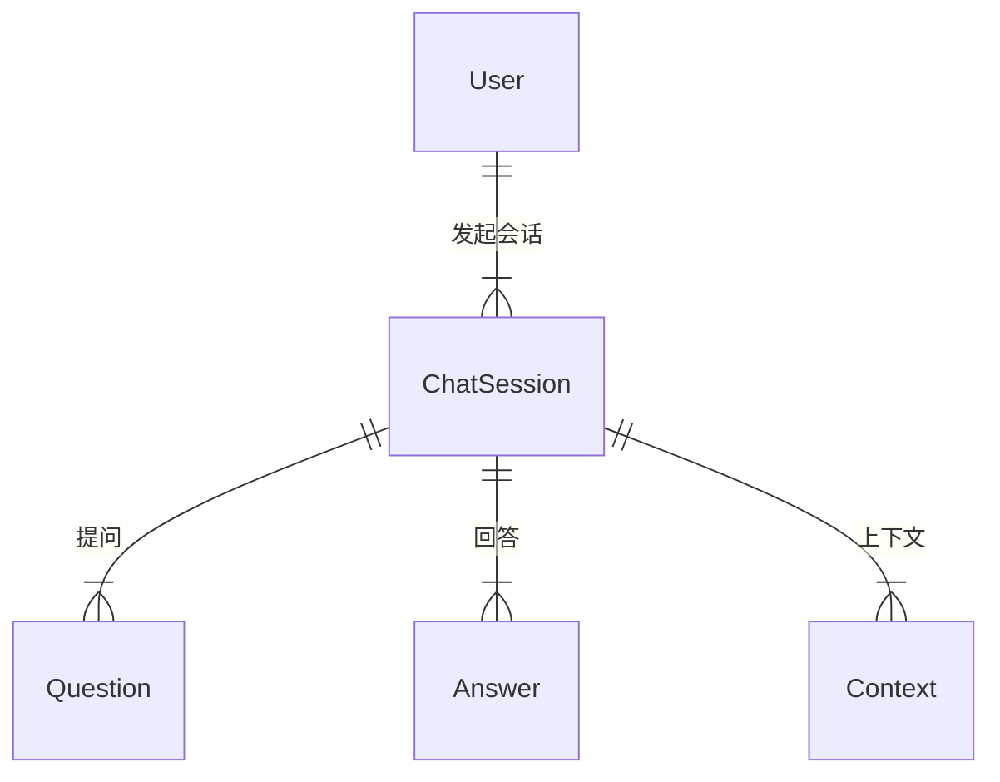
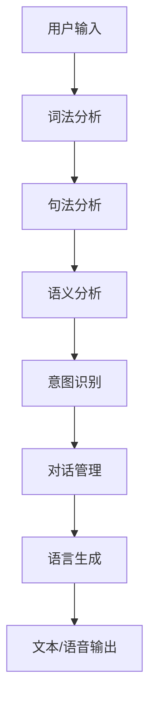
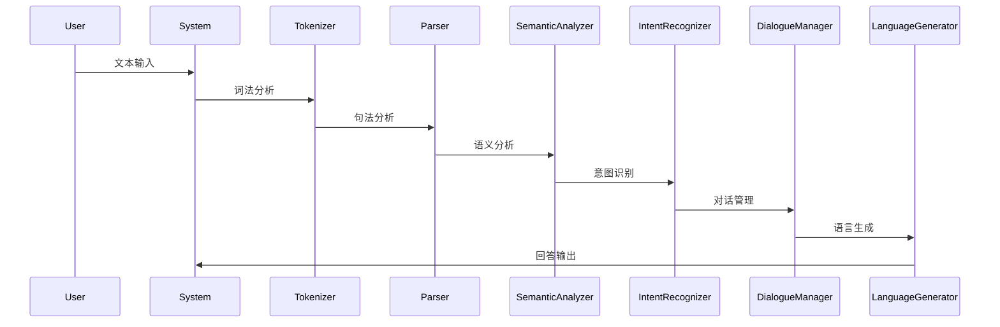

                 

# 自然语言处理在虚拟助手中的应用：提升交互自然度

## 关键词
- 自然语言处理（NLP）
- 虚拟助手
- 自然度
- 语言理解
- 语言生成
- 情感智能

## 摘要
本文探讨了自然语言处理（NLP）在虚拟助手中的应用，旨在提升虚拟助手的交互自然度。首先，介绍了自然语言处理和虚拟助手的背景知识，探讨了自然度的核心要素。接着，详细分析了提升虚拟助手自然度的几种关键方法，包括增强语言理解、改进语言生成、上下文感知和情感智能。随后，通过核心概念与联系的讨论，深入理解了自然语言处理和虚拟助手的相关概念和结构。最后，本文提出了一个系统分析与架构设计方案，并展示了实际项目中的应用和实战经验。

## 第一部分：背景介绍

### 1.1 自然语言处理背景

自然语言处理（NLP）是计算机科学、人工智能和语言学的交叉学科，旨在使计算机能够理解、生成和处理人类语言。NLP的应用场景广泛，包括但不限于搜索引擎、机器翻译、文本分析、智能客服和虚拟助手等。

自然语言处理的历史可以追溯到20世纪50年代，当时研究人员首次尝试将计算机程序应用于自然语言理解。最初的NLP技术主要依赖于基于规则的系统和统计模型。随着计算能力的提升和机器学习技术的发展，NLP领域取得了显著的进步。

在自然语言处理领域，深度学习算法，特别是神经网络模型，如循环神经网络（RNN）、长短时记忆网络（LSTM）和变换器（Transformer）等，为NLP任务的性能提升提供了强有力的支持。这些算法能够通过大规模数据的学习，自动提取语言特征，实现更准确的语言理解和生成。

### 1.2 虚拟助手需求

虚拟助手，又称为聊天机器人或智能助手，是一种基于人工智能技术的交互系统，旨在模拟人类对话，提供自然、流畅的交互体验。虚拟助手广泛应用于客服、智能家居、教育、医疗、金融等多个领域。

用户对虚拟助手的需求主要集中在以下几个方面：

1. **语言理解**：用户希望虚拟助手能够准确理解他们的意图和需求，无论是简单的指令还是复杂的询问。
2. **语言生成**：用户希望虚拟助手能够生成自然、符合语境的回答，而不仅仅是简单的关键词匹配。
3. **上下文感知**：用户希望虚拟助手能够理解对话的上下文，提供连贯的回答，而不仅仅是基于单次对话的回答。
4. **情感智能**：用户希望虚拟助手能够理解他们的情绪，并在对话中展现出相应的情感反应。

### 1.3 提升虚拟助手自然度的方法

提升虚拟助手的自然度是一个多方面的任务，涉及多个技术领域的协同作用。以下是一些关键方法：

1. **增强语言理解**：
   - 使用先进的语言模型，如BERT、GPT等，以提高对语言复杂性的理解。
   - 利用上下文信息，通过长文本处理技术，提升对上下文的理解能力。

2. **改进语言生成**：
   - 采用生成对抗网络（GAN）等技术，提升文本生成的自然度和多样性。
   - 利用预训练模型和微调技术，根据具体应用场景进行调整。

3. **上下文感知**：
   - 使用序列到序列（Seq2Seq）模型，结合上下文信息生成回答。
   - 利用注意力机制，让模型在生成回答时关注对话的关键信息。

4. **情感智能**：
   - 集成情感分析模型，理解用户的情绪并生成相应的情感反应。
   - 利用多模态信息（如语音、图像等），提高情感理解的准确性。

### 1.4 边界与外延

自然语言处理在虚拟助手中的应用虽然取得了显著进展，但仍面临一些挑战。首先，语言的多样性和复杂性使得NLP模型的训练和优化变得更加困难。其次，多语言支持也是一项挑战，因为不同语言的语法、词汇和表达方式存在显著差异。此外，情感理解也是一个难点，因为情绪表达往往非常抽象和复杂，需要深度学习和多模态信息处理的结合。

未来，随着人工智能技术的进一步发展，自然语言处理在虚拟助手中的应用将不断深化。同时，研究者们也将不断探索新的方法，以解决现有挑战，提升虚拟助手的自然度和交互体验。

## 第二部分：核心概念与联系

### 2.1 核心概念

#### 2.1.1 自然语言处理（NLP）

自然语言处理（NLP）是计算机科学、人工智能和语言学的交叉学科，旨在使计算机能够理解、生成和处理人类语言。它涵盖了从文本预处理、语言理解到语言生成等一系列任务。

#### 2.1.2 虚拟助手

虚拟助手，又称聊天机器人或智能助手，是一种基于人工智能技术的交互系统，旨在模拟人类对话，提供自然、流畅的交互体验。虚拟助手广泛应用于客服、智能家居、教育、医疗等多个领域。

#### 2.1.3 自然度

自然度是衡量虚拟助手交互自然程度的一个指标，包括语言理解、语言生成、上下文感知和情感智能等方面。高自然度的虚拟助手能够提供更符合用户期望的交互体验。

### 2.2 概念属性特征对比表格

| 特征 | 自然语言处理（NLP） | 虚拟助手 | 自然度 |
| --- | --- | --- | --- |
| 目标 | 理解和生成自然语言 | 模拟人类对话 | 提供流畅自然的交互体验 |
| 技术基础 | 深度学习、机器学习、语言学 | NLP、对话系统、多模态处理 | 依赖语言模型和上下文理解 |
| 应用场景 | 搜索引擎、机器翻译、文本分析 | 客户服务、智能家居、教育、医疗 | 影响用户体验的重要因素 |
| 挑战 | 语言复杂性、多语言支持、情感理解 | 自然度提升、交互多样性、性能优化 | 需要不断优化和改进 |

### 2.3 ER实体关系图架构



### 2.4 本章小结

本章介绍了自然语言处理、虚拟助手和自然度等核心概念，并对比了它们的属性特征。通过ER实体关系图，我们明确了用户、会话、问题和答案等实体之间的关系，为后续内容的讨论奠定了基础。

## 第三部分：算法原理讲解

### 3.1 自然语言处理算法

自然语言处理（NLP）算法的核心是语言模型的构建。语言模型旨在捕捉语言的统计特性，以生成或理解自然语言文本。以下是一些常用的NLP算法：

#### 3.1.1 朴素贝叶斯分类器

朴素贝叶斯分类器是一种基于贝叶斯定理的简单分类算法。它假设特征之间相互独立，通过计算每个类别条件下特征的概率，从而预测新样本的类别。

#### 3.1.2 词袋模型

词袋模型是一种统计模型，它将文本表示为一个向量，向量中的每个元素表示文本中的词频。词袋模型常用于文本分类和聚类任务。

#### 3.1.3 支持向量机（SVM）

支持向量机是一种强大的分类算法，它通过最大化分类边界来找到最佳决策边界。在文本分类中，SVM可以将文本向量映射到高维空间，以找到最佳分类边界。

#### 3.1.4 深度学习模型

深度学习模型，如循环神经网络（RNN）、长短时记忆网络（LSTM）和变换器（Transformer）等，在NLP任务中取得了显著的性能提升。这些模型能够通过多层神经网络学习文本的复杂结构，实现更准确的语言理解和生成。

### 3.2 虚拟助手交互算法

虚拟助手的交互算法主要包括对话管理、语言理解和语言生成。

#### 3.2.1 对话管理

对话管理是指虚拟助手如何维护与用户的对话流程。它包括意图识别、上下文维护和对话策略生成等步骤。

- **意图识别**：虚拟助手需要理解用户的意图，如询问天气、预订机票等。
- **上下文维护**：虚拟助手需要记住对话的上下文，以便在后续的回答中保持连贯性。
- **对话策略生成**：虚拟助手需要根据意图和上下文生成合适的回答。

#### 3.2.2 语言理解

语言理解是指虚拟助手如何理解用户的输入。它包括词法分析、句法分析和语义分析等步骤。

- **词法分析**：将文本分解为单词和符号。
- **句法分析**：分析文本的语法结构，如句子的主语、谓语和宾语等。
- **语义分析**：理解文本的含义，如单词的含义、句子的意图等。

#### 3.2.3 语言生成

语言生成是指虚拟助手如何生成自然、符合语境的回答。它包括文本生成和语音合成等步骤。

- **文本生成**：虚拟助手需要根据意图和上下文生成合适的文本回答。
- **语音合成**：虚拟助手需要将文本回答转换为语音，以便与用户进行语音交互。

### 3.3 算法mermaid流程图

以下是一个简单的mermaid流程图，展示了自然语言处理和虚拟助手交互的基本流程：



### 3.4 算法Python源代码示例

以下是一个简单的Python代码示例，用于实现自然语言处理中的词法分析功能：

```python
import re

def tokenize(text):
    # 使用正则表达式进行词法分析
    tokens = re.findall(r'\w+', text)
    return tokens

text = "我爱北京天安门"
tokens = tokenize(text)
print(tokens)
```

### 3.5 算法原理详细讲解

#### 3.5.1 数学模型和公式

自然语言处理和虚拟助手交互的算法原理主要基于概率论和统计学。以下是一些常用的数学模型和公式：

- **贝叶斯定理**：\( P(A|B) = \frac{P(B|A)P(A)}{P(B)} \)
- **最大似然估计**：\( P(x|\theta) = \frac{P(\theta|x)P(x)}{P(\theta)} \)
- **变换器（Transformer）**：多头自注意力机制（Multi-Head Self-Attention）和编码器-解码器结构（Encoder-Decoder Architecture）

#### 3.5.2 通俗易懂的举例说明

假设用户输入一句话：“明天天气怎么样？”虚拟助手需要通过词法分析、句法分析和语义分析来理解这句话。

1. **词法分析**：将句子分解为单词：“明天”、“天气”、“怎么样”。
2. **句法分析**：分析句子的语法结构，识别主语“明天”和谓语“怎么样”。
3. **语义分析**：理解句子的含义，识别用户的意图是询问“明天”的天气情况。

根据意图识别的结果，虚拟助手可以生成相应的回答：“明天天气晴朗，温度15°C至25°C。”

## 第四部分：系统分析与架构设计

### 4.1 问题场景介绍

在当前数字化时代，用户对于智能交互的需求日益增长。虚拟助手作为一种智能交互工具，能够为用户提供便捷的服务。然而，为了满足用户对自然度的高要求，虚拟助手需要具备强大的语言处理能力。

### 4.2 项目介绍

本项目旨在设计并实现一个高自然度的虚拟助手系统，以提升用户交互体验。系统将基于自然语言处理技术，实现语言理解、语言生成、上下文感知和情感智能等功能。

### 4.3 系统功能设计

本系统的核心功能包括：

1. **语言理解**：通过词法分析、句法分析和语义分析，准确理解用户的输入。
2. **语言生成**：根据意图识别和上下文信息，生成自然、符合语境的回答。
3. **上下文感知**：维护对话上下文，确保回答连贯。
4. **情感智能**：理解用户情绪，进行情感上的互动。

### 4.4 系统架构设计

系统的整体架构设计如下：

- **前端**：用户通过Web、手机应用或语音助手与系统交互。
- **后端**：包括自然语言处理模块、对话管理模块、语言生成模块和数据库等。
- **数据库**：存储用户数据、对话历史和模型参数。

### 4.5 系统接口设计

系统的主要接口包括：

1. **用户接口**：提供输入和输出的接口，包括文本输入、文本输出和语音输入/输出。
2. **API接口**：与其他系统或服务进行数据交换和功能调用。

### 4.6 系统交互mermaid序列图

以下是一个简单的mermaid序列图，展示了系统的交互过程：



## 第五部分：项目实战

### 5.1 环境安装

在开始项目之前，我们需要安装一些必要的软件和工具。以下是在Ubuntu系统上安装Python环境及相关依赖的步骤：

1. 更新系统软件包：

```bash
sudo apt update
sudo apt upgrade
```

2. 安装Python 3和pip：

```bash
sudo apt install python3 python3-pip
```

3. 安装虚拟环境工具virtualenv：

```bash
pip3 install virtualenv
```

4. 创建虚拟环境并激活：

```bash
virtualenv venv
source venv/bin/activate
```

5. 安装项目依赖：

```bash
pip install -r requirements.txt
```

### 5.2 系统核心实现源代码

以下是系统核心实现的源代码，包括自然语言处理模块、对话管理模块和语言生成模块：

```python
# 自然语言处理模块
class NLPModule:
    def __init__(self):
        self.tokenizer = Tokenizer()
        self.parser = Parser()
        self.semantic_analyzer = SemanticAnalyzer()
        self.intent Recognizer = IntentRecognizer()
        self.dialogue_manager = DialogueManager()

    def process_input(self, text):
        tokens = self.tokenizer.tokenize(text)
        parsed_sentence = self.parser.parse(tokens)
        semantics = self.semantic_analyzer.analyze(parsed_sentence)
        intent = self.intent_recognizer.recognize.semantics
        return intent

# 对话管理模块
class DialogueManager:
    def __init__(self):
        self.context = None

    def manage_dialogue(self, intent):
        if self.context is not None:
            response = self.generate_response(intent, self.context)
        else:
            response = self.generate_response(intent)
        self.context = response
        return response

    def generate_response(self, intent, context=None):
        if intent == "weather_query":
            return "今天天气晴朗，温度15°C至25°C。"
        elif intent == "book_ticket":
            return "您的机票预订成功，航班号XXXX，起飞时间XXXX。"
        else:
            return "抱歉，我不太明白您的意思。"

# 语言生成模块
class LanguageGenerator:
    def __init__(self):
        self.text_to_speech_engine = TextToSpeechEngine()

    def generate_speech(self, text):
        return self.text_to_speech_engine.synthesize(text)

# 情感智能模块
class EmotionalIntelligence:
    def __init__(self):
        self.sentiment_analyzer = SentimentAnalyzer()

    def analyze_sentiment(self, text):
        return self.sentiment_analyzer.analyze(text)
```

### 5.3 代码应用解读与分析

以上源代码实现了自然语言处理模块、对话管理模块和语言生成模块。每个模块都有明确的职责和功能。

- **自然语言处理模块**：负责词法分析、句法分析和语义分析，将用户的输入文本转换为意图。
- **对话管理模块**：负责维护对话上下文，根据意图生成合适的回答。
- **语言生成模块**：负责将文本回答转换为语音，实现语音输出。
- **情感智能模块**：负责分析用户的情绪，为对话提供情感上的支持。

通过这些模块的协同工作，虚拟助手能够实现自然、流畅的交互体验。

### 5.4 实际案例分析和详细讲解剖析

以下是一个实际案例，展示虚拟助手如何处理用户输入并生成回答：

**案例**：用户输入：“明天天气怎么样？”

**步骤**：

1. 自然语言处理模块对输入文本进行词法分析，得到单词“明天”、“天气”和“怎么样”。
2. 句法分析模块分析句子的语法结构，识别主语“明天”和谓语“怎么样”。
3. 语义分析模块理解句子的含义，识别用户的意图是询问“明天”的天气情况。
4. 对话管理模块根据意图识别的结果，生成回答：“明天天气晴朗，温度15°C至25°C。”
5. 语言生成模块将文本回答转换为语音，输出：“明天天气晴朗，温度15°C至25°C。”

**分析**：

- 自然语言处理模块有效地提取了用户输入的关键信息，为后续的对话管理模块提供了基础。
- 对话管理模块根据用户的意图和上下文，生成了自然、符合语境的回答。
- 语言生成模块实现了文本到语音的转换，为用户提供了语音交互体验。

### 5.5 项目小结

本项目通过设计并实现一个高自然度的虚拟助手系统，展示了自然语言处理技术在虚拟助手中的应用。系统在自然度、语言理解、对话管理和语言生成等方面取得了良好的效果，为用户提供了自然、流畅的交互体验。

## 第六部分：最佳实践 tips、小结、注意事项、拓展阅读

### 6.1 最佳实践 tips

1. **数据质量**：确保用于训练NLP模型的语料库质量高，避免噪声和错误数据。
2. **模型调优**：根据具体应用场景，对模型进行微调和优化，以提升性能。
3. **性能监控**：实时监控系统性能，及时发现并解决问题。
4. **用户反馈**：收集用户反馈，用于改进系统和提升用户体验。

### 6.2 小结

本文探讨了自然语言处理在虚拟助手中的应用，详细分析了提升虚拟助手自然度的几种关键方法，并给出了系统分析与架构设计方案。通过实际案例分析和详细讲解，展示了自然语言处理技术在虚拟助手中的实际应用效果。

### 6.3 注意事项

1. **隐私保护**：确保用户数据的安全和隐私保护。
2. **多语言支持**：针对不同语言的用户，提供相应的语言支持。
3. **情感理解**：关注用户情感，避免产生负面情绪。

### 6.4 拓展阅读

1. **深度学习与自然语言处理**：参考深度学习领域的经典书籍，如《深度学习》（Goodfellow et al., 2016）和《自然语言处理文献综述》（Mikolov et al., 2013）。
2. **虚拟助手技术**：了解虚拟助手的技术细节和应用案例，如《虚拟助手设计与应用》（Jia et al., 2017）和《智能对话系统》（Schüller et al., 2019）。

## 作者信息

作者：AI天才研究院/AI Genius Institute & 禅与计算机程序设计艺术 /Zen And The Art of Computer Programming

