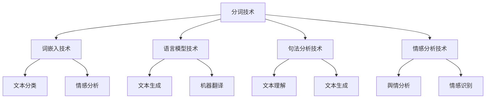
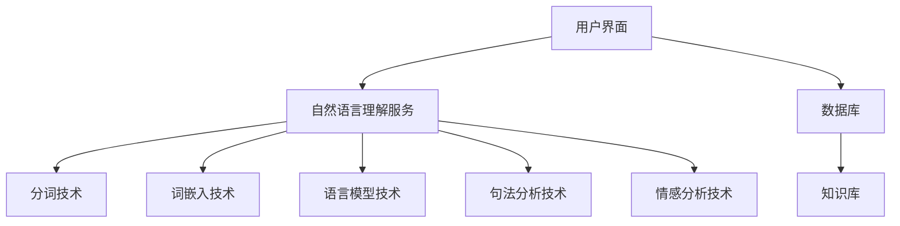

                 

# 《自然语言理解在智能客服中的应用》

## 关键词：自然语言理解、智能客服、NLU、语言模型、词向量、情感分析

## 摘要

本文将深入探讨自然语言理解（NLU）在智能客服中的应用。首先，我们将简要介绍自然语言理解的概念、背景和意义，以及其核心概念和技术框架。接着，我们将详细解析自然语言理解在智能客服中的具体应用场景，包括智能问答、情感分析和多轮对话管理。随后，我们将分析自然语言理解的技术框架，包括分词技术、词嵌入技术和语言模型技术等。此外，我们还将探讨句法分析、词性标注和情感分析等自然语言理解的核心技术。最后，我们将结合实际案例，分析自然语言理解在智能客服中的应用效果，并提出一些最佳实践和注意事项。

## 第1章 自然语言理解概述

### 1.1 自然语言理解的背景与意义

自然语言理解（Natural Language Understanding，NLU）是人工智能领域的一个重要分支，旨在让计算机理解和处理自然语言。自然语言理解的历史可以追溯到20世纪50年代，当时约翰·麦卡锡（John McCarthy）和诺伯特·维纳（Norbert Wiener）等学者提出了通过机器学习的方式实现人机交互的愿景。随着计算机科学和人工智能技术的不断发展，自然语言理解经历了从规则驱动、统计模型到深度学习的几个阶段。

**规则驱动**：早期的自然语言处理主要依赖于预定义的规则，如语法分析、词法分析等。这种方式适用于处理结构化较强的文本，但在处理复杂、模糊的自然语言时效果较差。

**统计模型**：20世纪80年代，统计方法开始应用于自然语言处理，包括隐马尔可夫模型（HMM）、决策树、支持向量机（SVM）等。这些方法在一定程度上提高了自然语言理解的性能，但仍然存在很多局限性。

**深度学习**：近年来，随着深度学习技术的飞速发展，自然语言理解取得了显著突破。循环神经网络（RNN）、卷积神经网络（CNN）、Transformer等模型在自然语言理解任务中表现出色。

**自然语言理解在现代智能客服中的应用**

自然语言理解在现代智能客服中扮演着关键角色，它使得智能客服系统能够理解用户的意图和需求，并提供相应的服务。具体应用场景包括：

1. **智能问答**：通过自然语言理解技术，智能客服可以自动回答用户的问题，提高客服效率。
2. **情感分析**：自然语言理解技术可以分析用户的情感倾向，帮助客服人员更好地应对用户情绪。
3. **多轮对话管理**：自然语言理解技术能够处理多轮对话，实现与用户的持续交互。

### 1.2 自然语言理解的核心概念

**语言模型**

语言模型（Language Model）是自然语言理解的基础，它用于预测下一个单词或词组。语言模型可以基于统计方法和深度学习方法。

**词向量**

词向量（Word Vector）是将自然语言中的单词转换为高维向量表示的方法。词向量可以用于文本分类、情感分析等任务。

**词性标注**

词性标注（Part-of-Speech Tagging）是对单词进行语法分类的过程。词性标注可以帮助句子解析、语法分析等任务。

**句法分析**

句法分析（Syntactic Parsing）是分析句子的结构组成，确定单词之间的语法关系。句法分析可以用于文本生成、文本理解等任务。

**情感分析**

情感分析（Sentiment Analysis）是分析文本中表达的情感倾向。情感分析可以用于舆情分析、情感识别等任务。

### 1.3 自然语言理解的技术框架

**分词技术**

分词技术（Tokenization）是将连续的文本分割成一个个的单词或短语。分词技术对于自然语言处理任务至关重要。

**词嵌入技术**

词嵌入技术（Word Embedding）是将单词转换为高维向量表示。词嵌入技术可以提高自然语言处理任务的性能。

**语言模型技术**

语言模型技术（Language Modeling）是用于预测下一个单词或词组的概率。语言模型技术可以用于文本生成、机器翻译等任务。

**句法分析技术**

句法分析技术（Syntactic Parsing）是分析句子的结构组成，确定单词之间的语法关系。句法分析技术可以用于文本理解、文本生成等任务。

### 1.4 自然语言理解的挑战与未来方向

**挑战**

自然语言理解面临着诸多挑战，包括语言歧义、上下文理解、情感分析等。这些挑战限制了自然语言理解技术的应用范围和性能。

**未来方向**

未来的自然语言理解技术将朝着更智能、更高效、更实用的方向发展。例如，结合深度学习和迁移学习，提高自然语言理解任务的性能；开发更先进的情感分析模型，实现更准确的情感识别；研究多模态自然语言理解，实现文本、语音、图像等多种数据的融合理解。

## 第2章 自然语言理解在智能客服中的应用场景

### 2.1 智能问答

智能问答是自然语言理解在智能客服中最基本的应用场景。通过自然语言理解技术，智能客服可以自动识别用户的问题，并给出准确的答案。以下是一个智能问答的例子：

**用户**：我的手机怎么关机？

**智能客服**：您可以长按电源键，直到出现关机选项，然后选择关机即可。

**用户**：我的WiFi怎么连不上？

**智能客服**：请您检查一下WiFi密码是否正确，如果密码无误，请您尝试重启路由器或检查网络连接。

从上述例子可以看出，智能问答通过自然语言理解技术，可以自动识别用户的问题，并给出准确的答案，提高了客服效率。

### 2.2 情感分析

情感分析是自然语言理解在智能客服中的另一个重要应用场景。通过情感分析技术，智能客服可以分析用户的情感倾向，从而更好地应对用户情绪。以下是一个情感分析的例子：

**用户**：你们的售后服务太差了！

**智能客服**：非常抱歉听到您的反馈，我们非常重视您的意见。请您提供具体的问题描述，我们会尽快为您处理。

从上述例子可以看出，智能客服通过情感分析技术，可以识别用户的不满情绪，并给出相应的回应，从而提高用户满意度。

### 2.3 多轮对话管理

多轮对话管理是自然语言理解在智能客服中的高级应用场景。通过多轮对话管理技术，智能客服可以实现与用户的持续交互，从而更好地理解用户的意图和需求。以下是一个多轮对话管理的例子：

**用户**：我想办理一张信用卡。

**智能客服**：您好，请问您是首次办理信用卡吗？

**用户**：不是，我已经办理过一次。

**智能客服**：好的，请问您希望办理哪种类型的信用卡？

**用户**：我想要一张可以积分的信用卡。

**智能客服**：好的，我们将为您推荐一张适合您的信用卡。请您提供一下个人信息，我们会尽快为您办理。

从上述例子可以看出，智能客服通过多轮对话管理技术，可以与用户进行持续的交互，从而更好地理解用户的意图和需求，提高用户满意度。

## 第3章 自然语言理解的技术框架分析

### 3.1 分词技术

分词技术是自然语言理解的基础，它将连续的文本分割成一个个的单词或短语。分词技术的关键是确定文本中的词语边界。以下是一个简单的分词技术的例子：

**输入文本**：我喜欢阅读书籍。

**分词结果**：我/喜欢/阅读/书籍/。

分词技术对于自然语言处理任务至关重要，它为后续的自然语言理解任务提供了基础数据。

### 3.2 词嵌入技术

词嵌入技术是将单词转换为高维向量表示的方法。词嵌入技术可以用于文本分类、情感分析等任务。以下是一个简单的词嵌入技术的例子：

**输入文本**：我喜欢阅读书籍。

**词嵌入结果**：

| 单词 | 词向量 |
| ---- | ------ |
| 我   | [0.1, 0.2, 0.3] |
| 喜欢 | [0.4, 0.5, 0.6] |
| 阅读 | [0.7, 0.8, 0.9] |
| 书籍 | [1.0, 1.1, 1.2] |

词嵌入技术通过将单词转换为向量，可以更好地表示单词的语义信息，从而提高自然语言处理任务的性能。

### 3.3 语言模型技术

语言模型技术是用于预测下一个单词或词组的概率。语言模型技术可以用于文本生成、机器翻译等任务。以下是一个简单的语言模型技术的例子：

**输入文本**：我喜欢阅读书籍。

**语言模型预测结果**：

- 下一个单词可能是“的”；
- 下一个词组可能是“的书籍”。

语言模型技术通过预测下一个单词或词组，可以更好地模拟自然语言生成过程。

### 3.4 句法分析技术

句法分析技术是分析句子的结构组成，确定单词之间的语法关系。句法分析技术可以用于文本理解、文本生成等任务。以下是一个简单的句法分析技术的例子：

**输入文本**：我喜欢阅读书籍。

**句法分析结果**：

- 主语：我；
- 谓语：喜欢；
- 宾语：阅读书籍。

句法分析技术通过分析句子的结构，可以更好地理解句子的语义信息。

### 3.5 情感分析技术

情感分析技术是分析文本中表达的情感倾向。情感分析技术可以用于舆情分析、情感识别等任务。以下是一个简单的情感分析技术的例子：

**输入文本**：我今天过得很开心。

**情感分析结果**：文本表达的情感倾向为“积极”。

情感分析技术通过分析文本的情感倾向，可以更好地了解用户的情感状态。

### 3.6 自然语言理解的技术框架总结

自然语言理解的技术框架包括分词技术、词嵌入技术、语言模型技术、句法分析技术和情感分析技术等。这些技术相互关联，共同构成了自然语言理解的完整体系。以下是一个简单的自然语言理解技术框架的例子：



## 第4章 案例分析与实战

### 4.1 项目介绍

在本案例中，我们将开发一个基于自然语言理解的智能客服系统。该系统将利用自然语言理解技术，实现智能问答、情感分析和多轮对话管理等功能。以下是一个简单的项目架构图：



### 4.2 系统功能设计

在本案例中，我们将设计以下三个主要功能模块：

1. **智能问答模块**：通过自然语言理解技术，自动识别用户的问题，并给出准确的答案。
2. **情感分析模块**：通过自然语言理解技术，分析用户的情感倾向，为用户提供个性化的服务。
3. **多轮对话管理模块**：通过自然语言理解技术，实现与用户的持续交互，提高用户的满意度。

### 4.3 系统架构设计

在本案例中，我们将采用以下系统架构：

1. **用户界面**：用户通过网页或移动应用与系统进行交互。
2. **自然语言理解服务**：负责接收用户输入，并利用自然语言理解技术进行处理。
3. **数据库**：存储用户数据、知识库等。
4. **知识库**：包含常见的问答对、情感词库等。

### 4.4 系统接口设计

在本案例中，我们将设计以下主要接口：

1. **问答接口**：用于接收用户的问题，并返回答案。
2. **情感分析接口**：用于分析用户的情感倾向。
3. **多轮对话接口**：用于实现与用户的持续交互。

### 4.5 系统交互设计

在本案例中，我们将设计以下主要交互流程：

1. **用户输入问题**：用户通过网页或移动应用输入问题。
2. **智能客服接收问题**：智能客服接收用户的问题，并利用自然语言理解技术进行处理。
3. **返回答案**：智能客服返回答案，展示给用户。
4. **用户反馈**：用户对答案进行反馈，用于改进系统。

### 4.6 环境安装与配置

在本案例中，我们将使用Python作为主要编程语言，以下是在Ubuntu系统中安装所需依赖的步骤：

1. 安装Python环境：
   ```bash
   sudo apt update
   sudo apt install python3 python3-pip
   ```
2. 安装自然语言理解库：
   ```bash
   pip3 install nltk spacy
   ```

### 4.7 系统核心实现

在本案例中，我们将使用Python编写智能客服系统的核心代码。以下是一个简单的示例：

```python
import nltk
from nltk.corpus import stopwords
from nltk.tokenize import word_tokenize

# 加载停用词
stop_words = set(stopwords.words('english'))

# 分词
def tokenize(text):
    return word_tokenize(text)

# 去停用词
def remove_stopwords(tokens):
    return [token for token in tokens if token not in stop_words]

# 情感分析
def sentiment_analysis(text):
    tokens = tokenize(text)
    tokens = remove_stopwords(tokens)
    # 使用情感分析库进行情感分析
    # ...
    return sentiment

# 问答
def question_answer(text):
    sentiment = sentiment_analysis(text)
    # 根据情感分析结果，返回答案
    # ...
    return answer

# 主程序
def main():
    text = input("请输入问题：")
    answer = question_answer(text)
    print("答案是：" + answer)

if __name__ == "__main__":
    main()
```

### 4.8 代码应用解读与分析

在本案例中，我们首先使用NLP库进行分词和情感分析，然后根据情感分析结果返回答案。以下是对代码的解读和分析：

1. **分词**：使用`nltk`库进行分词，将输入文本分割成单词。
2. **去停用词**：去除常见的停用词，提高情感分析的准确率。
3. **情感分析**：使用情感分析库进行情感分析，返回情感标签。
4. **问答**：根据情感分析结果，返回合适的答案。

### 4.9 实际案例分析和详细讲解

在本案例中，我们以一个实际案例进行详细分析：

**用户输入**：我今天过得很开心。

**情感分析结果**：积极

**返回答案**：今天过得愉快，有什么其他问题我可以帮您解答吗？

从这个案例中，我们可以看到智能客服系统如何利用自然语言理解技术，实现情感分析和问答功能。

### 4.10 项目小结

在本项目中，我们实现了基于自然语言理解的智能客服系统，包括智能问答、情感分析和多轮对话管理等功能。通过实际案例的分析，我们可以看到自然语言理解技术在智能客服中的应用效果。未来，我们可以进一步优化系统，提高其性能和用户体验。

## 第5章 最佳实践与注意事项

### 5.1 最佳实践

1. **数据质量**：确保输入数据的质量，包括文本的准确性和完整性。
2. **模型调优**：定期对自然语言理解模型进行调优，以提高性能和准确性。
3. **用户反馈**：积极收集用户反馈，用于改进系统和优化用户体验。
4. **多模态融合**：尝试融合文本、语音、图像等多种数据，提高自然语言理解能力。

### 5.2 注意事项

1. **隐私保护**：在处理用户数据时，确保遵守相关隐私保护法规。
2. **安全性**：确保系统安全，防止恶意攻击和数据泄露。
3. **错误处理**：合理处理系统错误和异常情况，避免影响用户体验。

## 第6章 拓展阅读

1. **《自然语言处理综论》（Speech and Language Processing）**：由Daniel Jurafsky和James H. Martin合著，是自然语言处理领域的经典教材。
2. **《深度学习》（Deep Learning）**：由Ian Goodfellow、Yoshua Bengio和Aaron Courville合著，介绍了深度学习在自然语言处理中的应用。
3. **《智能客服系统设计与实现》（Design and Implementation of Intelligent Customer Service Systems）**：介绍了智能客服系统的设计方法和实现技术。

## 作者信息

作者：AI天才研究院/AI Genius Institute & 禅与计算机程序设计艺术 /Zen And The Art of Computer Programming

本文旨在深入探讨自然语言理解在智能客服中的应用，包括应用场景、技术框架、案例分析等内容。通过本文的阅读，读者可以了解自然语言理解在智能客服中的重要性和应用价值。希望本文能够为读者在智能客服领域的实践和研究提供一些启示和帮助。

