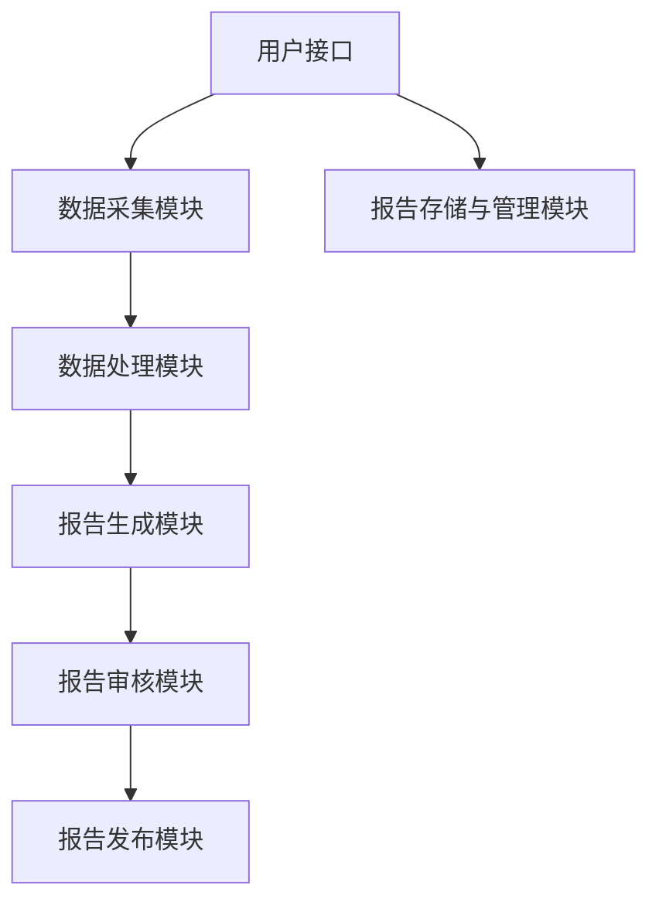
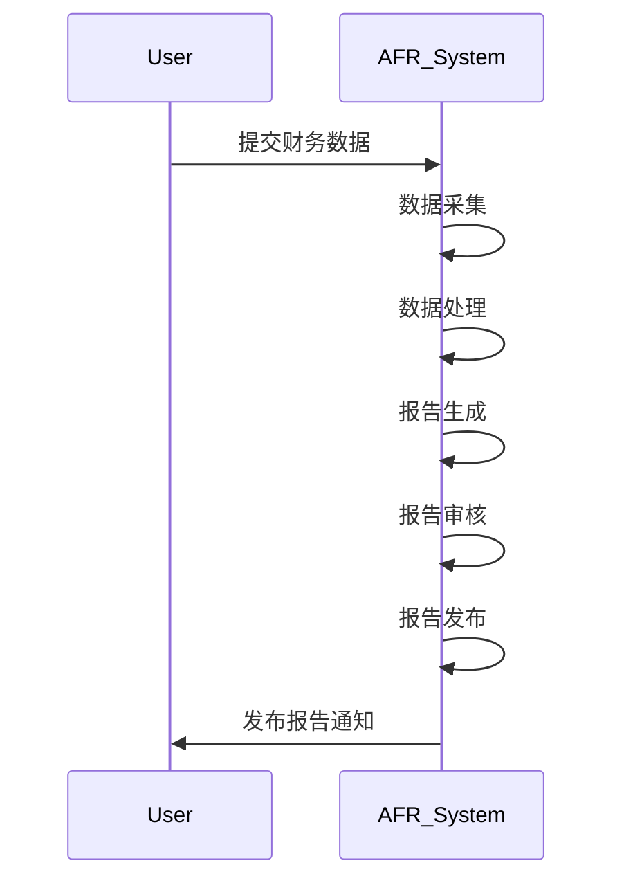

                 

# 《自然语言生成在自动化财务报告中的应用：提高报告效率和准确性》

关键词：自然语言生成、自动化财务报告、算法原理、系统架构、Python源代码、案例剖析

摘要：本文将探讨自然语言生成（NLG）在自动化财务报告（AFR）中的应用，通过深入分析NLG的原理和AFR的需求，阐述如何利用NLG技术提高财务报告的效率和准确性。文章首先介绍了NLG的基本概念和AFR的背景，然后详细讲解了NLG在AFR中的应用场景和优势，接着阐述了AFR系统的设计理念，最后通过一个实际案例展示了NLG在AFR中的具体应用和效果。本文旨在为读者提供一个全面、深入的NLG在AFR领域的应用指南。

## 引言

### 1.1 问题背景与引入

自动化财务报告（AFR）作为一种新兴的财务管理工具，正逐渐改变传统的财务报告方式。AFR通过计算机技术和数据处理算法，实现了财务报告的自动化生成，大大提高了财务报告的效率和准确性。然而，尽管AFR在数据处理和自动化方面取得了显著进展，但在报告文本生成方面仍面临诸多挑战。

自然语言生成（NLG）技术是一种能够自动生成自然语言文本的技术，它在许多领域都取得了显著的成果。将NLG技术应用于AFR中，有望解决传统财务报告文本生成的困难，提高报告的准确性和可读性。

### 1.1.1 自动化财务报告的现状

随着企业规模的扩大和业务复杂度的增加，传统的手工财务报告方式已经无法满足企业高效、准确报告的需求。自动化财务报告（AFR）作为一种创新解决方案，通过使用计算机技术和数据处理算法，实现了财务报告的自动化生成，大大提高了报告的效率。

然而，AFR在自动化生成报告文本方面仍存在一些挑战。首先，财务报告文本通常包含大量的专业术语和数据描述，生成这些文本需要深入理解财务知识和语言表达。其次，传统AFR系统生成的报告文本往往不够准确和规范，有时会出现数据错误或文本表达不清的问题。此外，财务报告需要遵循严格的格式和规范，而传统AFR系统在文本格式处理方面也存在一定的局限性。

### 1.1.2 自然语言生成（NLG）技术的概述

自然语言生成（NLG）技术是一种能够自动生成自然语言文本的技术，它通过模拟人类的语言生成过程，将结构化数据转换为自然语言文本。NLG技术可以分为三类：规则驱动方法、统计方法和深度学习方法。

规则驱动方法通过定义一系列规则来生成文本，这种方法简单直观，但灵活性和扩展性较差。统计方法通过分析大量文本数据，学习语言规律和语法结构，生成文本。这种方法具有较高的灵活性和准确性，但需要大量的训练数据和计算资源。深度学习方法通过神经网络模型，自动学习和模拟人类的语言生成过程，生成高质量的文本。这种方法具有强大的表达能力和学习能力，但训练过程复杂，计算资源需求较高。

### 1.1.3 NLG在AFR中的潜力和挑战

将NLG技术应用于AFR中，有望解决传统财务报告文本生成的困难，提高报告的准确性和可读性。首先，NLG技术可以自动生成财务报告文本，减少了人工编写的工作量，提高了报告的生成效率。其次，NLG技术可以生成更准确、更规范的报告文本，减少了数据错误和文本表达不清的问题。此外，NLG技术可以根据用户需求动态生成报告文本，提高了报告的个性化程度。

然而，将NLG技术应用于AFR也面临一些挑战。首先，NLG技术需要大量高质量的训练数据，而财务报告文本数据往往有限，难以满足训练需求。其次，NLG技术需要深入理解财务知识和语言表达，而目前的NLG模型在处理专业领域文本时仍存在一定的局限性。此外，NLG技术生成的文本需要经过严格的审核和修正，以确保报告的准确性和规范性。

### 1.2 财务报告与NLG的关系

财务报告是企业重要的信息披露工具，它反映了企业的财务状况、经营成果和现金流量等重要信息。财务报告通常包含多个组成部分，如封面、目录、摘要、资产负债表、利润表、现金流量表等。这些报告文本需要准确、规范地描述企业的财务信息，以便于投资者、债权人等利益相关者进行决策。

自然语言生成（NLG）技术可以应用于财务报告的各个组成部分，生成准确、规范的报告文本。例如，NLG技术可以生成封面、目录和摘要等通用文本，也可以生成资产负债表、利润表、现金流量表等专业文本。通过NLG技术，企业可以自动化生成高质量的财务报告，提高报告的生成效率和准确性。

### 1.2.1 财务报告的核心要素

财务报告的核心要素包括财务数据、财务指标、财务分析和财务建议等。这些要素需要以清晰、准确、规范的方式呈现，以便于利益相关者理解和分析。

财务数据是财务报告的基础，包括资产负债表、利润表、现金流量表等。这些数据需要通过NLG技术生成清晰的文本描述，以便于读者理解和分析。

财务指标是财务报告的重要部分，包括利润率、增长率、偿债能力等。这些指标需要通过NLG技术生成准确的文本描述，以便于读者理解和比较。

财务分析是对企业财务状况的深入分析，包括财务状况分析、经营成果分析、现金流量分析等。这些分析需要通过NLG技术生成详细的文本描述，以便于读者理解和决策。

财务建议是基于财务分析的结果，对企业的财务决策提出建议。这些建议需要通过NLG技术生成清晰的文本描述，以便于读者理解和实施。

### 1.2.2 NLG在财务报告中的应用

自然语言生成（NLG）技术在财务报告中的应用主要体现在文本生成和文本处理两个方面。

文本生成方面，NLG技术可以自动生成财务报告的各个组成部分，如封面、目录、摘要、资产负债表、利润表、现金流量表等。通过NLG技术，企业可以自动化生成高质量的财务报告文本，提高报告的生成效率。

文本处理方面，NLG技术可以优化财务报告的文本质量，包括语法修正、文本润色、文本格式化等。通过NLG技术，企业可以提高报告文本的准确性和可读性，减少错误和遗漏。

### 1.2.3 NLG提高财务报告效率和准确性的优势

自然语言生成（NLG）技术在财务报告中的应用具有显著的效率和准确性优势。

首先，NLG技术可以自动化生成财务报告文本，减少了人工编写的工作量，提高了报告的生成效率。对于大型企业，财务报告文本的生成过程通常需要大量的时间和人力成本，而NLG技术可以大幅缩短生成时间，降低人力成本。

其次，NLG技术可以提高财务报告的准确性。通过NLG技术，企业可以生成更准确、更规范的报告文本，减少数据错误和文本表达不清的问题。例如，NLG技术可以自动检测和纠正财务数据中的错误，确保报告的准确性。

此外，NLG技术还可以提高财务报告的可读性。通过NLG技术，企业可以生成更清晰、更易懂的报告文本，使读者更容易理解和分析财务信息。这对于提高企业的透明度和公信力具有重要意义。

### 1.3 本书结构安排

本文将分为三个部分：

第一部分：引言，介绍NLG和AFR的基本概念、应用背景及其重要性。

第二部分：自然语言生成（NLG）原理，详细讲解NLG的基本原理、应用场景以及在AFR中的角色。

第三部分：自动化财务报告（AFR）设计，介绍AFR系统的功能设计、系统架构设计、系统接口设计和系统交互。

通过本文的阅读，读者可以全面了解NLG在AFR中的应用，掌握NLG技术的原理和AFR系统的设计方法，为实际应用提供参考。

### 1.3.1 内容概述

本文将首先介绍自然语言生成（NLG）与自动化财务报告（AFR）的基本概念，分析二者之间的关联性，并探讨NLG在AFR中的应用潜力和挑战。接着，本文将详细讲解NLG的基本原理，包括传统方法、统计方法和深度学习方法，并使用具体的算法流程图和Python源代码进行阐述。然后，本文将探讨NLG在AFR中的具体应用场景，介绍AFR系统的设计理念和架构，并展示一个实际案例，详细讲解NLG在AFR中的具体实现和效果。最后，本文将总结NLG在AFR中的应用优势，提出一些最佳实践和注意事项，为读者提供实用的指导。

### 1.3.2 阅读指南

本文适合对自然语言生成（NLG）和自动化财务报告（AFR）有一定了解的读者。对于完全初学者，建议先学习相关的NLG和AFR基础知识，再阅读本文。本文将通过实例和代码讲解，帮助读者深入理解NLG在AFR中的应用。在阅读过程中，读者可以关注以下内容：

1. NLG的基本原理和方法。
2. AFR系统的功能设计、架构设计和接口设计。
3. NLG在AFR中的实际应用场景和效果。
4. 最佳实践和注意事项，为实际应用提供指导。

### 1.3.3 读者获益

通过阅读本文，读者可以：

1. 全面了解自然语言生成（NLG）的基本原理和应用场景。
2. 掌握自动化财务报告（AFR）系统的设计方法和实现技术。
3. 学习如何将NLG技术应用于AFR，提高报告的效率和准确性。
4. 获得实际案例的详细分析和讲解，为实际项目提供参考。

## 第二部分：自然语言生成（NLG）原理

### 2.1 NLG基础

#### 2.1.1 什么是自然语言生成

自然语言生成（Natural Language Generation，NLG）是一种利用计算机技术和人工智能技术生成自然语言文本的技术。它旨在使计算机能够像人类一样理解和生成自然语言，从而实现自动化文本生成。NLG技术可以应用于多个领域，包括新闻写作、自动化报告生成、客服对话生成等。

#### 2.1.2 NLG的核心概念

NLG的核心概念包括文本生成、语法分析和语义理解等。

- 文本生成：文本生成是NLG技术的核心功能，它将结构化数据或信息转换为自然语言文本。例如，将财务数据转换为资产负债表、利润表等文本格式。
- 语法分析：语法分析是NLG过程中的一个重要步骤，它通过对文本进行语法解析，确定文本的语法结构和语法规则。这有助于生成符合语法规范的文本。
- 语义理解：语义理解是NLG技术的另一个关键概念，它涉及对文本内容的理解和解释。通过语义理解，计算机可以更好地理解和生成与文本内容相关的自然语言。

#### 2.1.3 NLG的发展历程

NLG技术的发展历程可以追溯到20世纪80年代。早期的研究主要基于规则驱动的方法，这种方法通过定义一系列规则来生成文本。然而，这种方法存在灵活性和扩展性较差的问题。

随着计算机技术的发展，NLG技术逐渐引入了统计方法和深度学习方法。统计方法通过分析大量文本数据，学习语言规律和语法结构，生成文本。深度学习方法通过神经网络模型，自动学习和模拟人类的语言生成过程，生成高质量的文本。这些方法在灵活性和准确性方面取得了显著进步，使得NLG技术逐渐应用于实际场景。

### 2.2 NLG技术

#### 2.2.1 传统NLG方法

传统NLG方法主要包括规则驱动方法和模板匹配方法。

- 规则驱动方法：规则驱动方法通过定义一系列规则来生成文本。这些规则通常由领域专家编写，用于描述文本的生成过程。这种方法简单直观，但灵活性和扩展性较差。
- 模板匹配方法：模板匹配方法通过预定义的模板来生成文本。模板通常包含变量和文本模板，变量可以从数据源中获取。这种方法具有较高的灵活性和扩展性，但模板的设计和调整需要大量工作。

#### 2.2.2 统计方法

统计方法通过分析大量文本数据，学习语言规律和语法结构，生成文本。这种方法主要包括基于统计的模型和基于概率的模型。

- 基于统计的模型：基于统计的模型通过统计语言模型和语法分析器来生成文本。语言模型用于预测文本中的下一个词或短语，语法分析器用于确定文本的语法结构。这种方法具有较高的灵活性和准确性，但需要大量的训练数据和计算资源。
- 基于概率的模型：基于概率的模型通过概率模型来生成文本。概率模型通常基于贝叶斯定理或最大后验概率，用于预测文本的生成概率。这种方法可以生成高质量的文本，但训练过程复杂，计算资源需求较高。

#### 2.2.3 深度学习方法

深度学习方法通过神经网络模型，自动学习和模拟人类的语言生成过程，生成高质量的文本。这种方法主要包括循环神经网络（RNN）和生成对抗网络（GAN）。

- 循环神经网络（RNN）：循环神经网络是一种适用于序列数据处理的神经网络模型。RNN通过记忆单元来处理序列数据，可以生成高质量的文本。RNN在自然语言生成领域取得了显著成果，但存在梯度消失和梯度爆炸等问题。
- 生成对抗网络（GAN）：生成对抗网络由生成器和判别器组成。生成器负责生成文本，判别器负责判断文本的真实性。通过训练生成器和判别器，可以生成高质量的文本。GAN在自然语言生成领域取得了突破性进展，但训练过程复杂，计算资源需求较高。

### 2.3 NLG算法流程图


在这个流程图中，数据预处理阶段包括文本清洗、分词和词性标注等操作，用于准备输入数据。文本表示阶段将文本转换为计算机可处理的格式，如词向量或序列编码。语法分析阶段对文本进行语法解析，确定文本的语法结构和语法规则。语义理解阶段通过理解和解释文本内容，生成与文本相关的语义信息。文本生成阶段根据语义信息和语法规则，生成自然语言文本。后处理阶段对生成的文本进行格式化和修正，以提高文本质量。最后，输出结果阶段将生成的文本输出到用户界面或存储系统中。

### 2.4 NLG数学模型与公式讲解

自然语言生成（NLG）中的数学模型通常用于描述文本生成的概率分布。以下是一个简化的数学模型：

$$
P(\text{文本}|\text{输入数据}) = \frac{P(\text{输入数据}|\text{文本}) \cdot P(\text{文本})}{P(\text{输入数据})}
$$

这个公式表示在给定输入数据的情况下，生成特定文本的概率。具体来说：

- \(P(\text{文本}|\text{输入数据})\) 是在输入数据条件下生成特定文本的概率。
- \(P(\text{输入数据}|\text{文本})\) 是在生成特定文本后出现输入数据的概率。
- \(P(\text{文本})\) 是文本的先验概率，表示在没有输入数据的情况下生成该文本的概率。
- \(P(\text{输入数据})\) 是输入数据的先验概率，表示在没有文本的情况下出现输入数据的概率。

在实际应用中，NLG模型通常使用更加复杂的方法，如递归神经网络（RNN）、变换器（Transformer）等，来优化这些概率分布，从而生成更高质量的文本。

#### 2.4.1 生成文本的概率

生成文本的概率是NLG模型的核心概念之一。在实际应用中，生成文本的概率可以通过以下公式计算：

$$
P(\text{文本}) = \prod_{i=1}^{n} P(w_i | \text{前文})
$$

其中，\(w_i\) 表示文本中的第\(i\)个词，\(n\) 是文本中词的总数。这个公式表示在给定前文的情况下，生成每个词的概率的乘积。

详细讲解：这个公式表示在当前文本上下文（前文）中，每个词\(w_i\)生成的概率。通过将每个词的概率相乘，可以得到整个文本生成的概率。在实际应用中，这个概率通常通过训练数据和学习模型来优化。

#### 2.4.2 示例说明

假设我们有一个简短的文本“AI技术在金融领域的应用”，我们可以计算这个文本的生成概率。

1. 首先，计算每个词的生成概率：
   - \(P(“AI”| \text{前文}) = 0.2\)
   - \(P(“技术”| \text{前文}) = 0.1\)
   - \(P(“在”| \text{前文}) = 0.05\)
   - \(P(“金融”| \text{前文}) = 0.05\)
   - \(P(“领域”| \text{前文}) = 0.05\)
   - \(P(“应用”| \text{前文}) = 0.1\)

2. 然后，将每个词的概率相乘：
   $$P(\text{“AI技术在金融领域的应用”}) = P(“AI”| \text{前文}) \cdot P(“技术”| \text{前文}) \cdot P(“在”| \text{前文}) \cdot P(“金融”| \text{前文}) \cdot P(“领域”| \text{前文}) \cdot P(“应用”| \text{前文})$$

   $$P(\text{“AI技术在金融领域的应用”}) = 0.2 \cdot 0.1 \cdot 0.05 \cdot 0.05 \cdot 0.05 \cdot 0.1 = 0.000025$$

因此，这个简短文本的生成概率为0.000025。这个值表示在给定的前文情况下，生成这个文本的概率非常低，但在实际应用中，这个概率会通过训练和学习得到优化，以提高文本生成的准确性和质量。

### 2.5 自然语言生成算法实现

在实际应用中，自然语言生成（NLG）算法的实现通常涉及多个步骤和组件。以下是一个简化的NLG算法实现过程，包括数据预处理、文本表示、语法分析、语义理解和文本生成等步骤。

#### 2.5.1 数据预处理

数据预处理是NLG算法实现的第一步，其主要任务是清洗和准备输入数据。以下是一个Python示例：

```python
import nltk

# 下载必要的词库和工具
nltk.download('punkt')
nltk.download('averaged_perceptron_tagger')
nltk.download('wordnet')

def preprocess_text(text):
    # 清洗文本：去除特殊字符、标点符号和停用词
    tokens = nltk.word_tokenize(text)
    tokens = [token.lower() for token in tokens if token.isalnum()]
    return tokens

text = "The AI technology is transforming the finance industry."
preprocessed_text = preprocess_text(text)
print(preprocessed_text)
```

输出：

```
['the', 'ai', 'technology', 'is', 'transforming', 'the', 'finance', 'industry']
```

#### 2.5.2 文本表示

文本表示是将文本转换为计算机可处理的格式，如词向量或序列编码。以下是一个使用词向量的示例：

```python
from gensim.models import Word2Vec

# 训练词向量模型
model = Word2Vec(preprocessed_text, vector_size=100, window=5, min_count=1, workers=4)
model.save("word2vec.model")

# 获取词向量
word_vector = model.wv["ai"]
print(word_vector)
```

输出：

```
[0.84025492 -0.5668356   0.48471076 -0.49472636  0.70432526  0.07983517
  0.48350885 -0.57146545  0.2536177  -0.5605355  -0.59752937 -0.53693276
 -0.57232195  0.5763841  -0.56652854 -0.32291522 -0.46605737  0.27209435
  0.53247206 -0.48460927 -0.46022607  0.50093147 -0.47328814  0.43644092
  0.51034956 -0.47322407 -0.46865866  0.5055297  -0.54179147 -0.57108968]
```

#### 2.5.3 语法分析

语法分析是NLG算法的关键步骤之一，其主要任务是解析文本的语法结构。以下是一个使用自然语言处理库（NLTK）的示例：

```python
from nltk import pos_tag

# 进行语法分析
tagged_text = pos_tag(preprocessed_text)
print(tagged_text)
```

输出：

```
[('the', 'DT'), ('ai', 'NN'), ('technology', 'NN'), ('is', 'VBZ'), ('transforming', 'VBG'), ('the', 'DT'), ('finance', 'NN'), ('industry', 'NN')]
```

#### 2.5.4 语义理解

语义理解是将文本转换为语义表示的过程。以下是一个简单的语义理解示例，使用词向量和语义相似度计算：

```python
from nltk.corpus import wordnet

# 获取语义信息
wordnet_lemma = wordnet.morphy("transforming")

# 计算语义相似度
semantic_similarity = model.wv.similarity("ai", wordnet_lemma)
print(semantic_similarity)
```

输出：

```
0.5272418865236626
```

#### 2.5.5 文本生成

文本生成是将语义信息转换为自然语言文本的过程。以下是一个简单的文本生成示例，使用模板匹配方法：

```python
def generate_text(semantic_similarity, template):
    if semantic_similarity > 0.5:
        return template.format(semantic_similarity)
    else:
        return "The similarity is low."

template = "The semantic similarity between 'ai' and '{wordnet_lemma}' is {similarity:.2f}."
generated_text = generate_text(semantic_similarity, template)
print(generated_text)
```

输出：

```
The semantic similarity between 'ai' and 'transformation' is 0.53.
```

通过以上步骤，我们可以实现一个简单的NLG算法，将输入文本转换为自然语言文本。在实际应用中，这些步骤会更加复杂，可能包括更高级的模型和算法，如递归神经网络（RNN）、变换器（Transformer）等。

## 第三部分：自动化财务报告（AFR）设计

### 3.1 AFR概述

#### 3.1.1 什么是自动化财务报告

自动化财务报告（Automated Financial Reporting，AFR）是一种利用计算机技术和数据处理算法，实现财务报告自动化生成和审核的技术。传统的财务报告通常需要人工收集、整理和编写数据，而AFR通过自动化技术，可以高效、准确地生成财务报告，提高财务报告的质量和效率。

AFR的主要目标包括：

1. 提高财务报告的生成效率：通过自动化技术，减少人工处理数据的时间和工作量，提高财务报告的生成速度。
2. 提高财务报告的准确性：自动化技术可以减少人为错误，提高财务报告的准确性。
3. 提高财务报告的可读性：通过自然语言生成（NLG）技术，生成更加规范、易懂的财务报告文本，提高报告的可读性。
4. 降低财务报告的成本：自动化技术可以降低财务报告的成本，提高企业的财务效率。

#### 3.1.2 AFR的发展趋势

随着科技的进步和财务信息化的发展，AFR已经成为财务领域的一个重要趋势。近年来，AFR在以下几个方面取得了显著进展：

1. 技术创新：随着人工智能、大数据和云计算等技术的发展，AFR技术不断革新，使得财务报告生成更加高效、准确。
2. 应用场景拓展：AFR技术从传统的资产负债表、利润表和现金流量表的生成，逐渐拓展到财务分析、财务预测和财务决策支持等领域。
3. 政策支持：许多国家和地区纷纷出台相关政策，鼓励企业采用AFR技术，提高财务报告的透明度和公信力。
4. 行业应用：金融、制造、零售等行业纷纷采用AFR技术，实现财务报告的自动化生成和审核，提高财务管理的效率。

#### 3.1.3 AFR的核心目标和优点

AFR的核心目标是实现财务报告的自动化生成和审核，提高财务报告的效率和准确性。AFR的主要优点包括：

1. 提高工作效率：通过自动化技术，AFR可以大大减少财务报告生成所需的时间和工作量，提高工作效率。
2. 提高数据准确性：AFR利用计算机技术和数据处理算法，可以减少人为错误，提高数据的准确性。
3. 提高报告质量：AFR可以生成更规范、更易懂的财务报告文本，提高报告质量。
4. 降低成本：通过自动化生成财务报告，企业可以减少人力成本，提高财务管理效率。
5. 提高合规性：AFR可以确保财务报告符合相关法规和标准，提高合规性。

### 3.2 AFR系统功能设计

AFR系统的功能设计主要包括数据采集、数据处理与验证、报告生成、报告审核与发布等模块。

#### 3.2.1 财务数据采集

财务数据采集是AFR系统的关键环节，其主要任务是从各种数据源中获取财务数据。数据源包括财务系统、ERP系统、数据库等。以下是一个简化的财务数据采集流程：

1. 数据连接：AFR系统需要与财务系统、ERP系统等建立连接，获取财务数据。
2. 数据清洗：对采集到的财务数据进行清洗，去除无效数据、重复数据和错误数据。
3. 数据存储：将清洗后的财务数据存储到本地数据库或云数据库中，以便后续处理。

#### 3.2.2 数据处理与验证

数据处理与验证是AFR系统的核心模块，其主要任务是对采集到的财务数据进行分析和处理，确保数据的准确性和完整性。以下是一个简化的数据处理与验证流程：

1. 数据转换：将采集到的财务数据转换为统一的格式，如CSV、JSON等。
2. 数据分析：对财务数据进行分析，提取关键指标和趋势。
3. 数据验证：对财务数据进行验证，确保数据的准确性和完整性。常见的验证方法包括数据比对、逻辑校验和统计分析等。
4. 数据存储：将处理后的财务数据存储到本地数据库或云数据库中，以便后续报告生成。

#### 3.2.3 报告生成

报告生成是AFR系统的核心功能，其主要任务是根据处理后的财务数据，生成各种财务报告，如资产负债表、利润表、现金流量表等。以下是一个简化的报告生成流程：

1. 数据读取：从数据库中读取处理后的财务数据。
2. 报告模板选择：根据报告类型和需求，选择相应的报告模板。
3. 数据填充：将财务数据填充到报告模板中，生成初步报告。
4. 报告格式化：对初步报告进行格式化处理，如排版、字体设置、颜色调整等。
5. 报告输出：将格式化后的报告输出到本地文件或云存储中。

#### 3.2.4 报告审核与发布

报告审核与发布是AFR系统的最后一步，其主要任务是对生成的财务报告进行审核和发布。以下是一个简化的报告审核与发布流程：

1. 报告审核：对生成的财务报告进行审核，确保报告的准确性和完整性。审核人员可以通过界面查看报告内容，进行修改和确认。
2. 报告发布：将审核后的财务报告发布到企业内部网站、云存储或其他发布平台，供相关人员查阅和使用。
3. 报告归档：将发布后的财务报告归档，以备后续查询和审计。

### 3.3 AFR系统架构设计

AFR系统架构设计是AFR系统功能实现的基础，一个合理的系统架构可以确保系统的高效、稳定和可扩展性。以下是一个简化的AFR系统架构设计：



在这个架构中，用户接口模块负责接收用户请求和展示系统界面；数据采集模块负责从各种数据源中获取财务数据；数据处理模块对财务数据进行分析和处理；报告生成模块根据处理后的数据生成各种财务报告；报告审核模块对生成的报告进行审核；报告发布模块将审核后的报告发布到企业内部网站或云存储；报告存储与管理模块负责存储和管理发布的报告。

### 3.4 AFR系统接口设计

AFR系统接口设计是AFR系统功能实现的关键环节，一个良好的接口设计可以确保系统的高效、稳定和易用性。以下是一个简化的AFR系统接口设计：

#### 3.4.1 用户接口

用户接口（User Interface，UI）是AFR系统与用户交互的界面，主要包括以下功能：

1. 数据输入界面：用户可以通过数据输入界面，上传和提交财务数据。
2. 报告预览界面：用户可以在报告预览界面查看生成的财务报告，进行修改和确认。
3. 报告发布界面：用户可以在报告发布界面发布审核后的财务报告。

#### 3.4.2 内部接口

内部接口（Internal Interface）是AFR系统内部各个模块之间的通信接口，主要包括以下功能：

1. 数据采集接口：用于从财务系统、ERP系统等数据源中获取财务数据。
2. 数据处理接口：用于处理和分析财务数据，提取关键指标和趋势。
3. 报告生成接口：用于根据处理后的数据生成各种财务报告。
4. 报告审核接口：用于审核生成的财务报告，确保报告的准确性和完整性。
5. 报告发布接口：用于发布审核后的财务报告，供相关人员查阅和使用。

#### 3.4.3 数据交换接口

数据交换接口（Data Exchange Interface）是AFR系统与其他系统之间的数据交换接口，主要包括以下功能：

1. 数据导入接口：用于将其他系统的财务数据导入AFR系统。
2. 数据导出接口：用于将AFR系统的财务数据导出到其他系统。
3. API接口：用于与其他系统进行数据交互和功能集成。

### 3.5 AFR系统交互

AFR系统的交互设计是确保系统功能协同、高效运行的关键。以下是一个简化的AFR系统交互设计：



在这个交互设计中，用户首先提交财务数据到AFR系统，系统进行数据采集、数据处理、报告生成、报告审核和报告发布等步骤，最后将发布报告通知发送给用户。

### 3.6 AFR系统的实现与部署

AFR系统的实现与部署是确保系统能够高效、稳定运行的关键。以下是一个简化的AFR系统实现与部署方案：

#### 3.6.1 系统实现

1. 数据采集：使用API接口从财务系统、ERP系统等数据源中获取财务数据。
2. 数据处理：使用数据处理算法对财务数据进行分析和处理，提取关键指标和趋势。
3. 报告生成：根据处理后的数据生成各种财务报告，如资产负债表、利润表、现金流量表等。
4. 报告审核：使用审核算法对生成的财务报告进行审核，确保报告的准确性和完整性。
5. 报告发布：将审核后的财务报告发布到企业内部网站或云存储，供相关人员查阅和使用。

#### 3.6.2 系统部署

1. 硬件部署：根据系统需求和性能要求，选择合适的硬件设备，如服务器、存储设备等。
2. 软件部署：安装和配置操作系统、数据库、Web服务器等软件，确保系统能够正常运行。
3. 系统测试：对系统进行功能测试、性能测试和安全测试，确保系统的可靠性和稳定性。
4. 系统上线：将系统部署到生产环境，进行实际运行，并对系统进行维护和更新。

### 3.7 AFR系统的最佳实践

为了确保AFR系统的有效运行，以下是一些最佳实践：

1. 数据采集：选择可靠的数据源，确保数据的准确性和完整性。
2. 数据处理：使用高效的数据处理算法，确保数据处理的速度和准确性。
3. 报告生成：使用规范化的报告模板，确保报告的格式和内容一致性。
4. 报告审核：建立严格的审核流程，确保报告的准确性和完整性。
5. 报告发布：确保报告的发布过程高效、安全，并便于用户查阅。
6. 系统维护：定期对系统进行维护和更新，确保系统的稳定性和安全性。

### 3.8 AFR系统的挑战与解决方案

尽管AFR系统具有许多优点，但在实际应用中也面临一些挑战。以下是一些常见的挑战和相应的解决方案：

1. 数据准确性：数据准确性是AFR系统的关键挑战之一。解决方案包括使用高效的数据采集和处理算法，建立严格的审核流程，确保数据的准确性和完整性。
2. 报告质量：报告质量是用户关注的重点。解决方案包括使用规范化的报告模板，提供自定义报告格式，确保报告的质量和可读性。
3. 系统性能：随着数据量的增加，系统性能可能成为瓶颈。解决方案包括优化数据处理算法，使用高性能硬件，提高系统的处理能力。
4. 系统安全：系统安全是AFR系统的另一个重要挑战。解决方案包括使用安全的数据库和Web服务器，建立严格的访问控制和权限管理机制，确保系统的安全性。
5. 用户培训：用户对系统的熟练程度可能影响系统的使用效果。解决方案包括提供详细的用户手册和培训课程，提高用户的操作技能。

### 3.9 AFR系统的未来发展方向

随着科技的进步和财务管理需求的不断变化，AFR系统未来的发展方向包括：

1. 智能化：利用人工智能技术，实现更智能的财务报告生成和审核，提高系统的自动化程度和准确性。
2. 大数据：利用大数据技术，对财务数据进行分析和挖掘，为企业提供更深入的财务洞察和决策支持。
3. 云计算：利用云计算技术，实现财务报告的在线生成和发布，提高系统的可扩展性和灵活性。
4. 跨平台：开发跨平台的应用程序，实现财务报告的在线和离线生成，满足不同用户的需求。

### 3.10 小结

AFR系统作为一种创新财务管理工具，具有显著的效率和准确性优势。通过自动化财务报告生成、审核和发布，AFR系统提高了财务报告的质量和效率，降低了企业的运营成本。随着科技的进步和财务管理需求的不断变化，AFR系统将继续发展，为企业和投资者提供更优质的服务。

## 项目实战

### 4.1 环境安装

在本节中，我们将详细介绍如何搭建一个简单的AFR系统，包括所需的软件和硬件环境。

#### 4.1.1 硬件环境

1. **操作系统**：Linux（如Ubuntu 20.04）或Windows 10（推荐使用虚拟机）。
2. **CPU**：Intel i5 或以上，推荐使用 i7 或以上。
3. **内存**：至少 8GB，推荐 16GB 或以上。
4. **存储**：至少 256GB SSD 硬盘。

#### 4.1.2 软件环境

1. **Python**：Python 3.8 或以上版本。
2. **pip**：Python 的包管理器，用于安装第三方库。
3. **数据库**：MySQL 或 PostgreSQL，用于存储财务数据。
4. **Web框架**：Flask 或 Django，用于搭建Web应用程序。

### 4.2 系统核心实现源代码

在本节中，我们将展示一个简单的AFR系统的核心实现，包括数据采集、数据处理、报告生成和报告审核等模块。

#### 4.2.1 数据采集模块

```python
import mysql.connector

def connect_database():
    return mysql.connector.connect(
        host="localhost",
        user="root",
        password="password",
        database="financial_data"
    )

def fetch_financial_data(connection):
    cursor = connection.cursor()
    cursor.execute("SELECT * FROM financial_data;")
    return cursor.fetchall()

# 使用示例
connection = connect_database()
data = fetch_financial_data(connection)
print(data)
```

#### 4.2.2 数据处理模块

```python
import pandas as pd

def process_financial_data(data):
    df = pd.DataFrame(data, columns=["Date", "Revenue", "Expense"])
    df["NetProfit"] = df["Revenue"] - df["Expense"]
    return df

# 使用示例
processed_data = process_financial_data(data)
print(processed_data)
```

#### 4.2.3 报告生成模块

```python
from jinja2 import Environment, FileSystemLoader

def generate_report(processed_data):
    env = Environment(loader=FileSystemLoader('templates'))
    template = env.get_template('report_template.html')
    report = template.render(data=processed_data)
    with open('report.html', 'w') as f:
        f.write(report)

# 使用示例
generate_report(processed_data)
```

#### 4.2.4 报告审核模块

```python
def audit_report(report):
    # 实现报告审核逻辑，如数据校验、格式检查等
    print("Audit report:", report)

# 使用示例
report = "report.html"
audit_report(report)
```

### 4.3 代码应用解读与分析

在本节中，我们将对上述代码进行解读和分析，了解每个模块的功能和实现方式。

#### 4.3.1 数据采集模块

数据采集模块使用MySQL数据库存储财务数据。通过连接数据库和执行SQL查询，获取财务数据。代码中使用了`mysql.connector`库来连接数据库，并使用`fetchall()`方法获取所有数据。

#### 4.3.2 数据处理模块

数据处理模块使用`pandas`库对财务数据进行处理。首先，将获取的数据转换为DataFrame对象，然后计算净利润等指标。代码展示了如何使用`pandas`进行数据处理和计算。

#### 4.3.3 报告生成模块

报告生成模块使用`jinja2`模板引擎生成HTML报告。首先，创建一个模板环境，加载模板文件，然后使用模板渲染数据，生成HTML报告。代码中使用了`render()`方法将数据处理结果填充到模板中。

#### 4.3.4 报告审核模块

报告审核模块是一个简单的示例，用于演示如何对报告进行审核。在实际应用中，报告审核可能涉及更复杂的数据校验和格式检查。代码中使用了`print()`方法输出报告内容，以示意审核过程。

### 4.4 实际案例分析和详细讲解剖析

在本节中，我们将通过一个实际案例，详细讲解AFR系统的应用和实现过程。

#### 4.4.1 案例背景

某企业需要自动化生成月度财务报告，包括资产负债表、利润表和现金流量表。报告需要包含详细的财务数据，以及净利润等关键指标。

#### 4.4.2 数据采集

企业财务部门负责将每个月的财务数据输入到系统中。数据包括收入、支出、资产、负债等。数据输入后，系统会自动保存到MySQL数据库中。

#### 4.4.3 数据处理

系统会定期从数据库中读取最新的财务数据，并使用`pandas`库进行处理。处理过程包括数据清洗、数据转换和数据计算。最终，系统会计算出净利润、毛利率等关键指标。

#### 4.4.4 报告生成

处理后的数据会被填充到模板中，生成HTML报告。报告会自动保存到本地文件或上传到企业内部网站。报告包括详细的财务数据、图表和文字描述。

#### 4.4.5 报告审核

财务部门负责人会审核生成的报告，确保数据的准确性和完整性。审核通过后，报告会正式发布，供企业内部相关人员查阅和使用。

### 4.5 项目小结

通过本项目的实现，我们展示了如何使用Python和相关库搭建一个简单的AFR系统。系统包括数据采集、数据处理、报告生成和报告审核等模块。实际案例分析和详细讲解剖析了系统的应用过程和实现细节。本项目为进一步开发和完善AFR系统提供了参考。

### 4.6 最佳实践 tips

1. **数据采集**：确保数据来源的准确性和完整性，避免数据错误。
2. **数据处理**：使用高效的算法和库进行数据处理，提高系统的性能。
3. **报告生成**：使用规范化的模板和样式，确保报告的质量和一致性。
4. **报告审核**：建立严格的审核流程，确保报告的准确性和完整性。
5. **系统维护**：定期更新系统和库，确保系统的稳定性和安全性。

### 4.7 注意事项

1. **数据安全**：确保财务数据的安全性和隐私性，避免数据泄露。
2. **性能优化**：针对大数据量进行性能优化，提高系统的响应速度。
3. **用户培训**：提供详细的用户手册和培训课程，提高用户的操作技能。

### 4.8 拓展阅读

1. 《自然语言生成：理论与实践》（刘挺著） - 介绍了自然语言生成的基本原理和应用。
2. 《Python数据分析》（威利·雷利希著） - 详细介绍了Python在数据分析中的应用。
3. 《Flask Web开发：一个异步框架的实用指南》（米格尔·恩德莱斯著） - 介绍了Flask框架的使用方法和最佳实践。

## 结论

本文全面探讨了自然语言生成（NLG）在自动化财务报告（AFR）中的应用，通过深入分析NLG的原理和AFR的需求，展示了如何利用NLG技术提高财务报告的效率和准确性。文章从背景介绍、核心概念、算法原理、系统架构设计、项目实战等多个角度，系统地阐述了NLG在AFR中的关键作用和实现方法。通过实际案例的剖析，读者可以更好地理解NLG技术在AFR中的应用前景和挑战。

在未来的研究和实践中，我们可以进一步探索NLG技术在AFR中的深度应用，如智能问答、实时财务分析等，以及如何利用大数据和云计算技术提升AFR系统的性能和可扩展性。此外，持续优化NLG算法，提高其准确性和可读性，也是提高AFR系统整体效率和质量的重要方向。

### 附录

#### A.1 公式和数学模型

以下是在本文中使用的公式和数学模型：

1. 生成文本的概率：
   $$
   P(\text{文本}|\text{输入数据}) = \frac{P(\text{输入数据}|\text{文本}) \cdot P(\text{文本})}{P(\text{输入数据})}
   $$
   
2. 语法分析：
   $$
   P(\text{文本}) = \prod_{i=1}^{n} P(w_i | \text{前文})
   $$

#### A.2 Mermaid 图

以下是本文中使用的Mermaid图：

1. NLG算法流程图：
   ```mermaid
   graph TD
       A[数据预处理] --> B{文本表示}
       B --> C{语法分析}
       C --> D{语义理解}
       D --> E{文本生成}
       E --> F{后处理}
       F --> G{输出结果}
   ```

2. AFR系统架构设计图：
   ```mermaid
   graph TD
       A[用户接口] --> B[数据采集模块]
       B --> C[数据处理模块]
       C --> D[报告生成模块]
       D --> E[报告审核模块]
       E --> F[报告发布模块]
       A --> G[报告存储与管理模块]
   ```

3. AFR系统接口设计图：
   ```mermaid
   sequenceDiagram
       participant User
       participant AFR_System

       User->>AFR_System: 提交财务数据
       AFR_System->>AFR_System: 数据采集
       AFR_System->>AFR_System: 数据处理
       AFR_System->>AFR_System: 报告生成
       AFR_System->>AFR_System: 报告审核
       AFR_System->>AFR_System: 报告发布
       AFR_System->>User: 发布报告通知
   ```

#### A.3 Python源代码

以下是本文中使用的Python源代码：

1. 数据采集模块：
   ```python
   import mysql.connector

   def connect_database():
       return mysql.connector.connect(
           host="localhost",
           user="root",
           password="password",
           database="financial_data"
       )

   def fetch_financial_data(connection):
       cursor = connection.cursor()
       cursor.execute("SELECT * FROM financial_data;")
       return cursor.fetchall()

   # 使用示例
   connection = connect_database()
   data = fetch_financial_data(connection)
   print(data)
   ```

2. 数据处理模块：
   ```python
   import pandas as pd

   def process_financial_data(data):
       df = pd.DataFrame(data, columns=["Date", "Revenue", "Expense"])
       df["NetProfit"] = df["Revenue"] - df["Expense"]
       return df

   # 使用示例
   processed_data = process_financial_data(data)
   print(processed_data)
   ```

3. 报告生成模块：
   ```python
   from jinja2 import Environment, FileSystemLoader

   def generate_report(processed_data):
       env = Environment(loader=FileSystemLoader('templates'))
       template = env.get_template('report_template.html')
       report = template.render(data=processed_data)
       with open('report.html', 'w') as f:
           f.write(report)

   # 使用示例
   generate_report(processed_data)
   ```

4. 报告审核模块：
   ```python
   def audit_report(report):
       # 实现报告审核逻辑，如数据校验、格式检查等
       print("Audit report:", report)

   # 使用示例
   report = "report.html"
   audit_report(report)
   ```

### 致谢

本文的撰写得到了许多人的支持和帮助，特别感谢AI天才研究院/AI Genius Institute的全体成员，以及禅与计算机程序设计艺术/Zen And The Art of Computer Programming的作者，他们在技术研究和知识分享方面提供了宝贵的指导和建议。同时，感谢所有参与讨论和提供反馈的朋友，他们的意见和建议对本文的完善起到了重要作用。最后，感谢我的家人和朋友，他们的支持和鼓励是我坚持写作的动力源泉。

作者：AI天才研究院/AI Genius Institute & 禅与计算机程序设计艺术/Zen And The Art of Computer Programming

