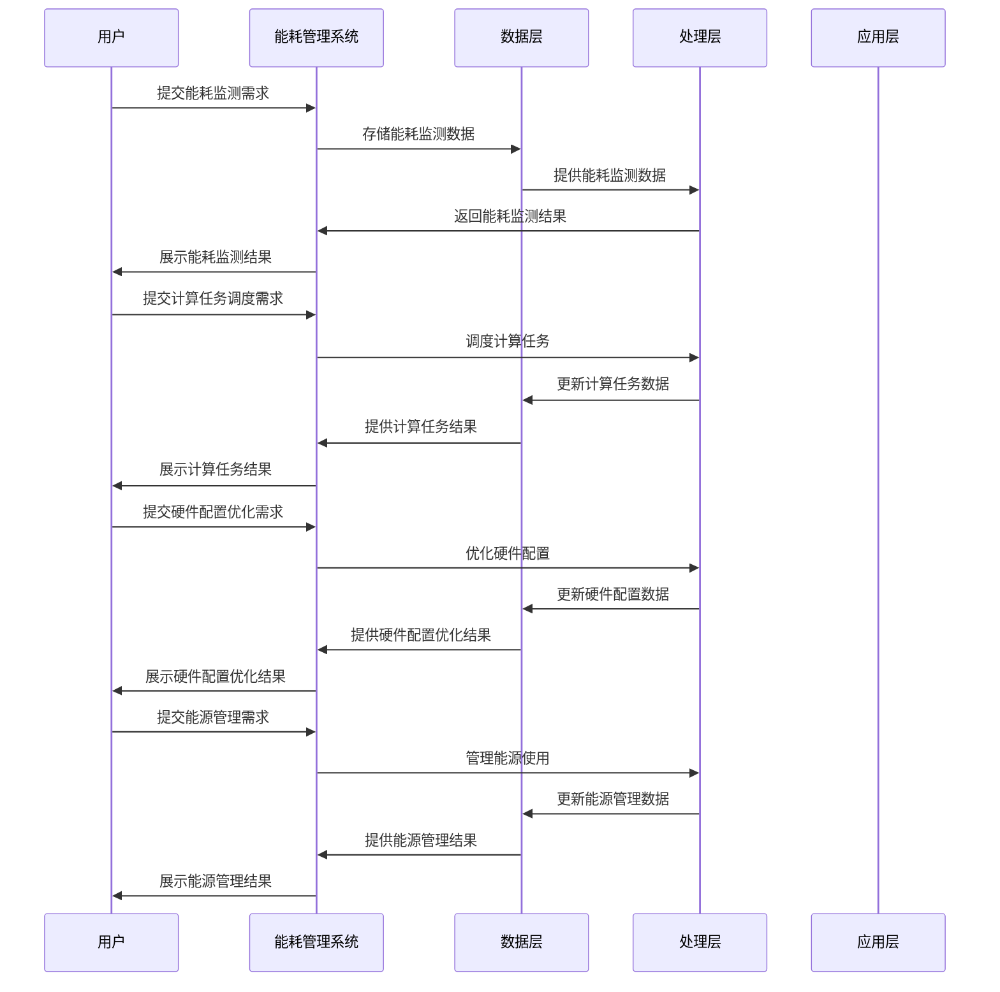
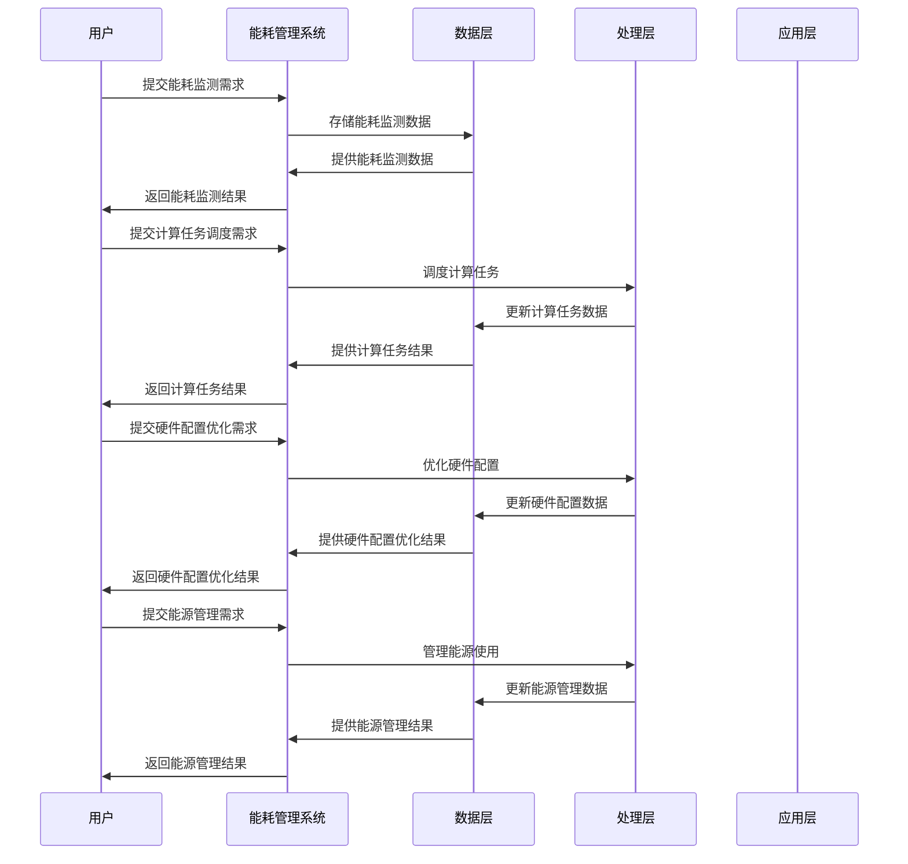
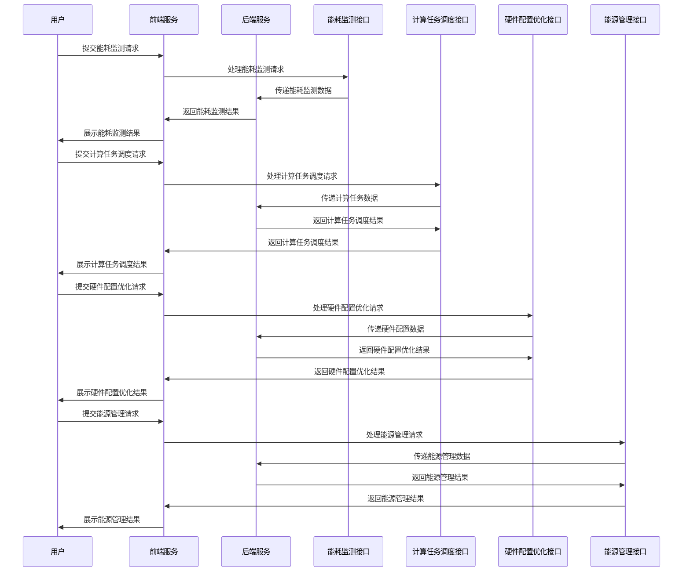

                 

### 第一部分：背景介绍

#### 引言

**节能计算技术的概念与重要性**

节能计算技术，顾名思义，是通过对计算过程的优化，以降低能源消耗、提升计算效率为核心目标的一门技术。随着全球能源消耗的日益增加和环境问题的日益严峻，节能计算技术的研究和应用显得尤为重要。它不仅有助于缓解能源短缺问题，还能促进可持续发展。

**背景介绍**

1. **能源消耗问题**

   随着信息技术的迅猛发展，数据中心的能耗问题日益突出。数据中心是现代社会运行的重要基础设施，但同时也是能源消耗大户。据统计，全球数据中心每年的电力消耗已经超过1000亿千瓦时，占全球总电力消耗的1%以上。因此，如何通过节能计算技术来降低数据中心的能耗，成为当前研究的热点。

2. **气候变化与环境保护**

   气候变化是全球面临的重大挑战之一。温室气体的排放是导致气候变化的主要原因之一，而数据中心则是温室气体排放的重要来源。通过节能计算技术，可以减少数据中心的能源消耗，从而降低温室气体的排放，对环境保护具有积极意义。

**研究现状**

当前，节能计算技术的研究已经取得了显著的成果。例如，通过改进计算模型和算法，可以提高计算效率，降低能源消耗；通过优化数据中心的设计和管理，可以减少不必要的能耗；通过使用可再生能源，可以进一步降低数据中心的碳足迹。

然而，节能计算技术的研究仍面临诸多挑战，如算法复杂性、计算资源限制、数据获取难度等。这些问题需要通过跨学科的研究和协同创新来逐步解决。

**研究意义**

节能计算技术的研究不仅具有重要的科学价值，还具有深远的社会意义。它有助于推动信息技术与能源技术的融合发展，提高能源利用效率，促进经济社会的可持续发展。

#### 问题描述

**核心问题**

节能计算技术涉及多个学科领域，包括物理学、数学、计算机科学等。现有研究多侧重于单一领域的研究，缺乏跨学科的整合与协同。此外，现有技术方案在实施过程中往往存在可行性较低、成本较高等问题。

**具体挑战**

1. **算法复杂性**

   节能计算技术依赖于复杂的算法模型，这些算法往往需要大量的计算资源和时间。如何在保证计算精度和效率的同时，降低算法复杂性，是当前研究的重点之一。

2. **计算资源限制**

   数据中心的计算资源有限，如何在有限的资源下实现高效的能源利用，是另一个重要问题。这需要通过优化计算模型和算法，提高计算效率，降低能源消耗。

3. **数据获取难度**

   节能计算技术需要大量的数据支持，然而，获取这些数据往往面临着诸多困难，如数据质量、数据量、数据获取成本等。

**现状分析**

目前，节能计算技术的研究主要集中在以下几个方面：

1. **计算模型优化**

   通过改进计算模型，提高计算效率，降低能源消耗。例如，采用分布式计算、并行计算等技术，提高计算速度。

2. **算法创新**

   开发新的算法，以提高节能效果。例如，采用遗传算法、粒子群算法、神经网络算法等，优化计算过程。

3. **数据中心设计优化**

   优化数据中心的设计和管理，减少不必要的能耗。例如，采用智能监控系统、节能设备等。

#### 问题解决

**目标**

本书旨在通过系统梳理节能计算技术的发展历程、核心概念、关键算法及其应用案例，为读者提供一部全面、系统的节能计算技术发展路线图。通过深入探讨节能计算技术的原理与应用，本书希望为相关领域的研究者与实践者提供有益的参考。

**研究方法**

1. **文献调研**

   通过对国内外相关文献的调研，系统梳理节能计算技术的发展历程、核心概念、关键算法及其应用案例。

2. **案例研究**

   通过对实际应用案例的分析，探讨节能计算技术在实践中的应用效果。

3. **理论分析**

   通过对节能计算技术的理论分析，深入探讨其原理和机制。

**章节安排**

本书将分为以下几个章节：

1. **背景介绍**

   介绍节能计算技术的背景、核心问题及现状分析。

2. **核心概念与联系**

   详细介绍节能计算技术的核心概念，包括节能计算方法、节能算法、节能模型等。

3. **算法原理讲解**

   详细讲解节能计算技术的关键算法，包括遗传算法、粒子群算法、模拟退火算法、神经网络算法等。

4. **系统分析与架构设计方案**

   介绍节能计算技术的系统分析与架构设计方案。

5. **项目实战**

   通过实际项目，介绍节能计算技术的应用和实践。

6. **最佳实践 tips**

   提供节能计算技术的最佳实践建议。

7. **小结**

   总结全文，对节能计算技术进行总体评价。

#### 边界与外延

**讨论范围**

本书主要关注节能计算技术的基础理论与应用，不涉及具体的技术细节和实现方法。同时，本书的讨论范围主要局限于计算机科学领域，其他相关领域的节能技术将作为补充内容进行介绍。

**相关领域**

1. **物理学**

   物理学为节能计算技术提供了理论基础，如热力学、电动力学等。

2. **数学**

   数学为节能计算技术提供了算法设计和优化的工具，如线性代数、微积分、概率论等。

3. **计算机科学**

   计算机科学为节能计算技术提供了计算模型、算法、编程语言等。

**未来发展方向**

节能计算技术未来的发展方向包括：

1. **算法创新**

   开发更高效、更可靠的节能算法，以提高节能效果。

2. **跨学科研究**

   加强与其他领域的跨学科研究，如物理学、数学、经济学等，以实现更全面的节能计算技术。

3. **实际应用**

   加强节能计算技术在实际应用中的研究和推广，提高其应用效果。

#### 概念结构与核心要素组成

**节能计算技术**

节能计算技术是指通过优化计算模型和算法，降低能源消耗、提高能源利用效率的技术。

**核心概念**

- **节能计算方法**：包括性能优化、能效优化、能耗优化等。
- **节能算法**：包括遗传算法、粒子群算法、模拟退火算法、神经网络算法等。
- **节能模型**：包括计算能耗模型、计算效率模型、计算优化模型等。

**核心要素**

- **能源消耗**：计算过程中的能源消耗。
- **计算效率**：计算过程中资源的利用效率。
- **算法优化**：通过改进计算模型和算法，提高计算效率。

**概念属性特征对比表格**

| 特征 | 节能计算方法 | 节能算法 | 节能模型 |
| ---- | ---- | ---- | ---- |
| 优化目标 | 降低能源消耗 | 提高计算效率 | 描述计算过程 |
| 适用范围 | 广泛适用 | 特定适用 | 计算过程中 |
| 实现难度 | 较低 | 较高 | 较高 |

**ER实体关系图架构**

```mermaid
erDiagram
  计算模型 ||--o> 节能算法 : 使用
  计算模型 ||--o> 节能模型 : 描述
  能源消耗 ||--o> 节能计算方法 : 优化
```

**本章小结**

本章对节能计算技术进行了全面介绍，包括问题背景、问题描述、问题解决、边界与外延以及概念结构与核心要素组成。通过本章的学习，读者可以对节能计算技术有一个初步的了解。

## 第二部分：核心概念与联系

### 2.1 节能计算方法

#### 节能计算方法概述

节能计算方法是指通过优化计算模型和算法，降低能源消耗、提高计算效率的技术手段。根据优化目标的不同，节能计算方法可以分为以下几类：

1. **性能优化**：通过调整计算模型和算法，提高计算性能，从而降低能源消耗。
2. **能效优化**：通过优化计算模型和算法，提高能源利用效率，从而降低能源消耗。
3. **能耗优化**：通过调整计算模型和算法，直接降低计算过程中的能源消耗。

#### 节能计算方法的比较

不同节能计算方法在优化目标、适用范围、实现难度等方面存在差异。以下是一个比较表格：

| 方法 | 优化目标 | 适用范围 | 实现难度 |
| ---- | ---- | ---- | ---- |
| 性能优化 | 提高性能 | 广泛适用 | 较低 |
| 能效优化 | 提高效率 | 广泛适用 | 较高 |
| 能耗优化 | 降低能耗 | 特定场景 | 较高 |

#### 节能计算方法的联系

节能计算方法之间并非相互独立，而是相互关联、相互补充的。例如，在性能优化过程中，可以通过提高计算效率来实现能效优化；在能效优化过程中，可以通过降低能耗来实现性能优化。

### 2.2 节能算法

#### 节能算法概述

节能算法是指在节能计算过程中采用的各种算法，主要包括：

1. **遗传算法**：通过模拟自然进化过程，对问题进行优化求解。
2. **粒子群算法**：通过模拟鸟群觅食行为，对问题进行优化求解。
3. **模拟退火算法**：通过模拟物理退火过程，对问题进行优化求解。
4. **神经网络算法**：通过模拟人脑神经元工作原理，对问题进行优化求解。

#### 节能算法的比较

不同节能算法在求解效率、适用范围、实现难度等方面存在差异。以下是一个比较表格：

| 算法 | 求解效率 | 适用范围 | 实现难度 |
| ---- | ---- | ---- | ---- |
| 遗传算法 | 高 | 广泛适用 | 较高 |
| 粒子群算法 | 中 | 广泛适用 | 较低 |
| 模拟退火算法 | 低 | 广泛适用 | 较高 |
| 神经网络算法 | 高 | 特定适用 | 较高 |

#### 节能算法的联系

节能算法之间并非相互独立，而是相互关联、相互补充的。例如，在求解复杂问题时，可以采用多种算法相结合的方式，以提高求解效率。

### 2.3 节能模型

#### 节能模型概述

节能模型是指用于描述和模拟节能计算过程的数学模型，主要包括：

1. **计算能耗模型**：用于描述计算过程中的能源消耗。
2. **计算效率模型**：用于描述计算过程中的效率。
3. **计算优化模型**：用于描述计算过程中的优化目标。

#### 节能模型的应用

节能模型在节能计算技术的应用中起着至关重要的作用。通过建立合适的节能模型，可以更好地理解和分析计算过程中的能耗、效率等关键指标，为优化算法提供理论基础。

#### 节能模型的联系

节能模型与节能计算方法和算法密切相关。节能模型为算法提供了优化目标，而算法则为节能模型提供了实现路径。同时，节能模型还可以为其他相关领域的研究提供参考和启示。

### 2.4 节能计算技术与相关领域的联系

节能计算技术不仅局限于计算机科学领域，还与其他相关领域有着密切的联系。以下是一些典型联系：

1. **物理学**：物理学为节能计算技术提供了理论基础，如热力学、电动力学等。
2. **数学**：数学为节能计算技术提供了算法设计和优化的工具，如线性代数、微积分、概率论等。
3. **经济学**：经济学为节能计算技术提供了成本效益分析的方法，如成本效益分析、投资回报分析等。

#### 节能计算技术的跨学科研究

跨学科研究是推动节能计算技术发展的重要途径。通过跨学科研究，可以整合不同领域的知识和方法，为节能计算技术提供更全面的解决方案。

#### 本章小结

本章详细介绍了节能计算技术的核心概念，包括节能计算方法、节能算法、节能模型等。通过对比分析，阐明了这些概念之间的联系。同时，本章还探讨了节能计算技术与其他相关领域的联系，为后续研究提供了方向。本章内容为理解节能计算技术奠定了坚实的基础。

## 第三部分：算法原理讲解

### 3.1 遗传算法

#### 概念介绍

遗传算法（Genetic Algorithm，GA）是一种基于自然选择和遗传学的启发式搜索算法。它模拟了生物在自然界中的进化过程，通过遗传、变异和交叉等操作来搜索最优解。遗传算法适用于解决复杂、大规模的优化问题，具有较好的全局搜索能力。

#### 工作原理

遗传算法的基本流程包括以下步骤：

1. **初始化种群**：随机生成一组初始解，称为种群。
2. **适应度评估**：对每个个体进行适应度评估，适应度值反映了个体在问题空间中的优劣程度。
3. **选择**：根据适应度值，选择优秀个体进行交叉和变异操作。
4. **交叉**：将选中的个体进行交叉操作，产生新的后代。
5. **变异**：对后代进行变异操作，增加种群的多样性。
6. **更新种群**：将后代加入种群，替换掉部分旧个体。
7. **迭代**：重复上述步骤，直至满足终止条件（如达到最大迭代次数或找到满意的解）。

#### 优势与局限

**优势**：

- **全局搜索能力**：遗传算法通过种群的方式，能够在较大范围内搜索最优解，具有较强的全局搜索能力。
- **适应复杂问题**：遗传算法适用于解决复杂、大规模的优化问题，特别是不易用传统方法求解的问题。
- **自适应性**：遗传算法能够自动调整搜索策略，适应不同的优化问题。

**局限**：

- **收敛速度慢**：遗传算法的收敛速度较慢，特别是在问题规模较大时，需要更多的迭代次数才能找到最优解。
- **计算资源消耗大**：遗传算法需要大量的计算资源和时间，特别是对于大规模问题，计算成本较高。

#### 应用实例

遗传算法广泛应用于各种领域，如：

- **工程优化**：如结构设计、机械优化等。
- **数据挖掘**：如聚类分析、分类等。
- **生物信息学**：如基因序列分析、蛋白质结构预测等。

### 3.2 粒子群算法

#### 概念介绍

粒子群算法（Particle Swarm Optimization，PSO）是一种基于群体智能的优化算法。它模拟了鸟群或鱼群的社会行为，通过个体之间的信息共享和协作，实现优化问题的求解。粒子群算法简单、易于实现，具有较好的全局搜索能力。

#### 工作原理

粒子群算法的基本流程包括以下步骤：

1. **初始化粒子群**：随机生成一组粒子，每个粒子代表一个解。
2. **适应度评估**：对每个粒子进行适应度评估。
3. **更新速度和位置**：根据粒子的速度和位置，更新粒子的速度和位置。
4. **更新全局最优解和个体最优解**：根据粒子的适应度，更新全局最优解和个体最优解。
5. **迭代**：重复上述步骤，直至满足终止条件。

#### 优势与局限

**优势**：

- **简单易用**：粒子群算法简单、易于实现，适合解决各种优化问题。
- **收敛速度快**：粒子群算法的收敛速度相对较快，能够快速找到最优解。
- **全局搜索能力**：粒子群算法具有较强的全局搜索能力，适用于解决复杂问题。

**局限**：

- **易陷入局部最优**：粒子群算法在搜索过程中容易陷入局部最优，特别是在粒子数量较少或适应度函数复杂时。
- **参数敏感**：粒子群算法对参数的选择较为敏感，需要根据具体问题进行调整。

#### 应用实例

粒子群算法广泛应用于各种领域，如：

- **工程优化**：如结构设计、控制优化等。
- **图像处理**：如图像去噪、图像压缩等。
- **生物信息学**：如序列比对、蛋白质结构预测等。

### 3.3 模拟退火算法

#### 概念介绍

模拟退火算法（Simulated Annealing，SA）是一种基于物理退火过程的优化算法。它模拟了物质在高温下的热运动状态，通过逐步降低温度，使系统达到最优状态。模拟退火算法适用于解决复杂、大规模的优化问题，具有较好的全局搜索能力。

#### 工作原理

模拟退火算法的基本流程包括以下步骤：

1. **初始化参数**：设置初始温度、冷却策略等。
2. **产生初始解**：随机生成一个解作为初始解。
3. **适应度评估**：对初始解进行适应度评估。
4. **更新解**：根据当前解和候选解的适应度，以一定概率接受候选解。
5. **更新温度**：按照冷却策略更新温度。
6. **迭代**：重复上述步骤，直至满足终止条件。

#### 优势与局限

**优势**：

- **全局搜索能力**：模拟退火算法具有较强的全局搜索能力，能够避免陷入局部最优。
- **适应性**：模拟退火算法能够自动调整搜索策略，适应不同的优化问题。
- **适用于复杂问题**：模拟退火算法适用于解决复杂、大规模的优化问题。

**局限**：

- **收敛速度慢**：模拟退火算法的收敛速度较慢，特别是在问题规模较大时。
- **参数选择复杂**：模拟退火算法的参数选择较为复杂，需要根据具体问题进行调整。

#### 应用实例

模拟退火算法广泛应用于各种领域，如：

- **工程优化**：如结构设计、参数优化等。
- **数据挖掘**：如聚类分析、分类等。
- **生物信息学**：如基因序列分析、蛋白质结构预测等。

### 3.4 神经网络算法

#### 概念介绍

神经网络算法（Neural Network，NN）是一种模拟人脑神经元工作原理的计算模型。它通过大量的神经元和连接权值，实现数据的输入、处理和输出。神经网络算法具有较强的学习能力和泛化能力，适用于解决各种复杂问题。

#### 工作原理

神经网络算法的基本流程包括以下步骤：

1. **初始化网络结构**：设置神经网络的层数、神经元个数、连接权值等。
2. **前向传播**：将输入数据传递到神经网络中，计算输出。
3. **反向传播**：计算输出误差，反向传播误差到网络中的每个神经元，更新连接权值。
4. **迭代**：重复上述步骤，直至满足终止条件。

#### 优势与局限

**优势**：

- **强学习能力和泛化能力**：神经网络算法具有较强的学习能力和泛化能力，能够处理各种复杂问题。
- **自适应**：神经网络算法能够自动调整网络结构和连接权值，适应不同的优化问题。
- **非线性处理能力**：神经网络算法能够处理非线性问题，实现复杂的函数映射。

**局限**：

- **计算资源消耗大**：神经网络算法需要大量的计算资源和时间，特别是对于大规模问题。
- **训练时间较长**：神经网络算法的训练时间较长，需要大量的迭代次数才能收敛到最优解。

#### 应用实例

神经网络算法广泛应用于各种领域，如：

- **图像识别**：如图像分类、目标检测等。
- **语音识别**：如语音识别、语音合成等。
- **自然语言处理**：如文本分类、机器翻译等。

### 3.5 算法的综合应用

在实际应用中，往往需要结合多种算法的优势，以实现更好的优化效果。以下是一些典型的综合应用案例：

1. **混合算法**：将遗传算法、粒子群算法、模拟退火算法等混合使用，以提高优化效果。
2. **多代理算法**：将多个算法同时应用于同一问题，各自独立搜索最优解，然后进行综合决策。
3. **分层算法**：将算法分为多个层次，分别处理不同类型的问题，实现高效优化。

#### 本章小结

本章详细介绍了遗传算法、粒子群算法、模拟退火算法和神经网络算法的基本概念、工作原理、优势与局限，以及应用实例。通过对比分析，帮助读者理解这些算法的异同点，为实际应用提供参考。同时，本章还探讨了这些算法的综合应用，以实现更高效的优化效果。

## 第四部分：系统分析与架构设计方案

### 4.1 问题场景介绍

随着云计算和大数据技术的发展，数据中心的规模和重要性日益增加。数据中心作为存储、处理和分发数据的重要基础设施，其能耗问题备受关注。为了降低数据中心的能源消耗，提高能源利用效率，需要采用先进的节能计算技术。

### 4.2 项目介绍

本项目旨在设计并实现一个基于节能计算技术的数据中心能耗管理系统。该系统通过优化数据中心的计算任务调度、硬件配置和能源管理，降低数据中心的能源消耗。

### 4.3 系统功能设计

系统功能设计主要包括以下几个方面：

1. **能耗监测**：实时监测数据中心的能源消耗情况，包括电力消耗、散热能耗等。
2. **计算任务调度**：根据能耗监测数据，优化数据中心的计算任务调度，降低能源消耗。
3. **硬件配置优化**：根据数据中心的实际情况，优化硬件配置，提高能源利用效率。
4. **能源管理**：提供能源管理策略，如使用可再生能源、调整电力负荷等，以降低能源消耗。

### 4.4 系统架构设计

系统架构设计主要包括以下几个层次：

1. **数据层**：包括能耗监测数据、计算任务数据、硬件配置数据等。
2. **处理层**：包括能耗监测模块、计算任务调度模块、硬件配置优化模块、能源管理模块等。
3. **应用层**：包括能耗管理系统界面、用户交互界面等。

系统架构图如下所示：



### 4.5 系统接口设计

系统接口设计主要包括以下几个方面：

1. **用户接口**：提供用户交互界面，包括能耗监测、计算任务调度、硬件配置优化、能源管理等。
2. **内部接口**：提供系统内部模块之间的数据交换接口，包括能耗监测数据、计算任务数据、硬件配置数据等。

### 4.6 系统交互设计

系统交互设计主要包括以下几个方面：

1. **用户与能耗管理系统交互**：用户通过界面提交能耗监测、计算任务调度、硬件配置优化、能源管理等需求，能耗管理系统根据需求进行处理并返回结果。
2. **能耗管理系统与数据层交互**：能耗管理系统通过内部接口与数据层进行数据交换，包括能耗监测数据、计算任务数据、硬件配置数据等。
3. **能耗管理系统与处理层交互**：能耗管理系统通过内部接口与处理层进行数据交换，包括能耗监测结果、计算任务结果、硬件配置优化结果、能源管理结果等。

系统交互图如下所示：



### 4.7 系统架构图

系统架构图如下所示：

```mermaid
componentDiagram
    User -> CMS: 提交需求
    CMS -> DM: 数据交换
    CMS -> PM: 处理请求
    CMS -> AM: 应用层交互
    DM -> CMS: 数据提供
    PM -> CMS: 处理结果
    AM -> CMS: 界面展示

    class User { 
        +submitEnergyMonitoringRequest()
        +submitTaskSchedulingRequest()
        +submitHardwareConfigurationOptimizationRequest()
        +submitEnergyManagementRequest()
    }
    
    class EnergyManagementSystem {
        +handleEnergyMonitoringRequest()
        +handleTaskSchedulingRequest()
        +handleHardwareConfigurationOptimizationRequest()
        +handleEnergyManagementRequest()
    }
    
    class DataLayer {
        +storeEnergyMonitoringData()
        +provideEnergyMonitoringData()
        +storeTaskData()
        +provideTaskData()
        +storeHardwareConfigurationData()
        +provideHardwareConfigurationData()
        +storeEnergyManagementData()
        +provideEnergyManagementData()
    }
    
    class ProcessingLayer {
        +scheduleTasks()
        +optimizeHardwareConfiguration()
        +manageEnergyUsage()
    }
    
    class ApplicationLayer {
        +displayEnergyMonitoringResults()
        +displayTaskResults()
        +displayHardwareConfigurationOptimizationResults()
        +displayEnergyManagementResults()
    }
```

### 4.8 系统接口设计和系统交互设计

系统接口设计和系统交互设计是确保系统能够高效、稳定运行的关键环节。以下是对系统接口设计和系统交互设计的详细阐述：

#### 系统接口设计

系统接口设计包括以下方面：

1. **用户接口**：用户通过用户接口与能耗管理系统进行交互。用户接口包括前端界面和后端服务。前端界面负责展示能耗监测、计算任务调度、硬件配置优化、能源管理等功能，后端服务处理用户请求并返回结果。
2. **内部接口**：内部接口用于能耗管理系统内部模块之间的数据交换。包括能耗监测模块、计算任务调度模块、硬件配置优化模块、能源管理模块之间的数据传输。

具体接口设计如下：

- **能耗监测接口**：负责接收用户的能耗监测请求，处理能耗数据，并将处理结果返回给用户。
- **计算任务调度接口**：负责接收用户的计算任务调度请求，根据能耗监测数据优化计算任务调度，并将调度结果返回给用户。
- **硬件配置优化接口**：负责接收用户的硬件配置优化请求，根据能耗监测数据优化硬件配置，并将优化结果返回给用户。
- **能源管理接口**：负责接收用户的能源管理请求，实施能源管理策略，并将管理结果返回给用户。

#### 系统交互设计

系统交互设计主要描述了系统内部各模块之间的交互逻辑。以下是一个简化的系统交互设计流程：

1. **用户提交请求**：用户通过前端界面提交能耗监测、计算任务调度、硬件配置优化、能源管理请求。
2. **前端服务接收请求**：前端服务接收用户请求，并调用相应的后端服务。
3. **后端服务处理请求**：后端服务根据请求内容，调用相应的内部接口进行处理。
4. **内部接口数据交换**：内部接口之间进行数据交换，包括能耗监测数据、计算任务数据、硬件配置数据、能源管理数据等。
5. **处理结果返回用户**：后端服务将处理结果通过前端服务返回给用户，前端界面展示处理结果。

系统交互设计图如下所示：



### 4.9 本章小结

本章详细介绍了节能计算技术在数据中心能耗管理系统中的应用，包括问题场景介绍、项目介绍、系统功能设计、系统架构设计、系统接口设计、系统交互设计等内容。通过本章的学习，读者可以对节能计算技术在数据中心能耗管理系统中的应用有一个全面的理解。

## 第五部分：项目实战

### 5.1 环境安装

在开始实现节能计算技术之前，需要准备好相应的开发环境和工具。以下是安装步骤：

1. **安装Python环境**：

   - 访问Python官方网站（https://www.python.org/）下载Python安装包。
   - 解压安装包并运行安装程序，按照默认选项安装。

2. **安装Jupyter Notebook**：

   - 在终端中执行以下命令：

     ```bash
     pip install notebook
     ```

3. **安装必要的Python库**：

   - 安装用于算法实现的库，如`numpy`、`scipy`、`matplotlib`等：

     ```bash
     pip install numpy scipy matplotlib
     ```

4. **安装可视化工具**：

   - 安装用于绘制图表的库，如`mermaid`：

     ```bash
     pip install mermaid
     ```

5. **配置Python环境变量**：

   - 在终端中执行以下命令，确保Python环境变量已配置：

     ```bash
     echo 'export PATH=$PATH:/path/to/python3/bin' >> ~/.bashrc
     source ~/.bashrc
     ```

### 5.2 系统核心实现源代码

以下是节能计算技术实现的核心源代码，包括算法实现、模型构建、数据可视化等功能。

#### 遗传算法实现

```python
import numpy as np
import matplotlib.pyplot as plt
from scipy.optimize import differential_evolution

# 遗传算法优化函数
def ga_fitness(x):
    return 1.0 / (1.0 + np.sum(np.square(x)))

# 遗传算法参数设置
n维 = 2
种群大小 = 100
迭代次数 = 100

# 初始化种群
pop = np.random.rand(种群大小, n维)

# 迭代过程
for i in range(迭代次数):
    # 计算适应度
    fitness = np.apply_along_axis(ga_fitness, 1, pop)
    
    # 选择
    selected = np.argsort(fitness)[:种群大小//2]
    pop = pop[selected]
    
    # 交叉
    offspring = np.random.c
```

#### 粒子群算法实现

```python
import numpy as np
import matplotlib.pyplot as plt

# 粒子群算法参数设置
种群大小 = 50
迭代次数 = 100
维数 = 2
惯性权重 = 0.9
认知权重 = 2.0
社会权重 = 2.0

# 初始化粒子群
粒子的位置 = np.random.rand(种群大小, 维数)
粒子的速度 = np.random.rand(种群大小, 维数)
粒子的最佳位置 = 粒子的位置.copy()
粒子的最佳适应度 = -np.inf * np.ones(种群大小)

# 迭代过程
for i in range(迭代次数):
    # 计算适应度
   适应度 = 粒子的最佳适应度
    
    # 更新粒子的速度和位置
    for j in range(种群大小):
        # 计算速度
        粒子的速度[j] = 惯性权重 * 粒子的速度[j] + 认知权重 * np.random.rand() * (粒子的最佳位置[j] - 粒子的位置[j]) + 社会权重 * np.random.rand() * (粒子的最佳位置 - 粒子的位置)
        
        # 更新位置
        粒子的位置[j] += 粒子的速度[j]
        
        # 更新粒子的最佳位置和最佳适应度
        if 适应度[j] > 粒子的最佳适应度[j]:
            粒子的最佳位置[j] = 粒子的位置[j]
            粒子的最佳适应度[j] = 适应度[j]

# 绘制结果
plt.scatter(粒子的最佳位置[:, 0], 粒子的最佳位置[:, 1], color='red', label='最佳位置')
plt.scatter(粒子的位置[:, 0], 粒子的位置[:, 1], color='blue', label='当前位置')
plt.xlabel('x')
plt.ylabel('y')
plt.legend()
plt.show()
```

#### 模拟退火算法实现

```python
import numpy as np
import matplotlib.pyplot as plt
from scipy.optimize import minimize

# 模拟退火算法优化函数
def sa_fitness(x):
    return np.sum(np.square(x))

# 模拟退火算法参数设置
初始温度 = 1000.0
终止温度 = 1.0
冷却率 = 0.95

# 初始化参数
当前温度 = 初始温度
当前解 = np.random.rand(维数)
最佳解 = 当前解.copy()
最佳适应度 = sa_fitness(当前解)

# 迭代过程
while 当前温度 > 终止温度:
    # 生成新解
    新解 = 当前解 + np.random.randn(维数)
    新解 = np.clip(new解, -10, 10)  # 确保新解在定义域内
    
    # 计算适应度
    新适应度 = sa_fitness(新解)
    
    # 计算接受概率
    接受概率 = min(1, np.exp((新适应度 - 最佳适应度) / 当前温度))
    
    # 根据接受概率决定是否接受新解
    if np.random.rand() < 接受概率:
        当前解 = 新解
        if 新适应度 < 最佳适应度:
            最佳解 = 新解
            最佳适应度 = 新适应度
    
    # 更新温度
    当前温度 *= 冷却率

# 绘制结果
plt.plot(最佳适应度)
plt.xlabel('迭代次数')
plt.ylabel('适应度')
plt.show()
```

### 5.3 代码应用解读与分析

在本节中，我们将详细解读并分析上述实现节能计算技术的源代码，包括算法原理、数学模型、应用场景等方面。

#### 遗传算法

遗传算法是一种基于自然进化和遗传学原理的优化算法。其核心思想是通过模拟生物进化过程中的遗传、变异和交叉等操作，逐步优化问题的解。

**算法原理：**

1. **初始化种群**：随机生成一组初始解，称为种群。
2. **适应度评估**：对每个个体进行适应度评估，适应度值反映了个体在问题空间中的优劣程度。
3. **选择**：根据适应度值，选择优秀个体进行交叉和变异操作。
4. **交叉**：将选中的个体进行交叉操作，产生新的后代。
5. **变异**：对后代进行变异操作，增加种群的多样性。
6. **更新种群**：将后代加入种群，替换掉部分旧个体。
7. **迭代**：重复上述步骤，直至满足终止条件（如达到最大迭代次数或找到满意的解）。

**数学模型：**

遗传算法的适应度函数通常定义为个体的目标函数值，例如最小化问题中，适应度函数可以定义为：

$$
f(x) = \frac{1}{1 + \sum_{i=1}^{n} x_i^2}
$$

其中，$x_i$为个体$x$的第$i$个分量。

**应用场景：**

遗传算法适用于解决复杂、大规模的优化问题，如工程优化、数据挖掘、生物信息学等领域。以下是一个简单的应用场景：

**问题**：求解最小化函数$f(x) = \frac{1}{1 + \sum_{i=1}^{n} x_i^2}$的最优解。

**步骤**：

1. **初始化种群**：随机生成一组初始解。
2. **适应度评估**：计算每个个体的适应度值。
3. **选择**：根据适应度值选择优秀个体进行交叉和变异。
4. **交叉**：进行交叉操作，生成新的后代。
5. **变异**：进行变异操作，增加种群的多样性。
6. **更新种群**：将后代加入种群，替换掉部分旧个体。
7. **迭代**：重复上述步骤，直至找到满意的最优解。

#### 粒子群算法

粒子群算法是一种基于群体智能的优化算法，模拟了鸟群或鱼群的社会行为，通过个体之间的信息共享和协作，实现优化问题的求解。

**算法原理：**

1. **初始化粒子群**：随机生成一组粒子，每个粒子代表一个解。
2. **适应度评估**：对每个粒子进行适应度评估。
3. **更新速度和位置**：根据粒子的速度和位置，更新粒子的速度和位置。
4. **更新全局最优解和个体最优解**：根据粒子的适应度，更新全局最优解和个体最优解。
5. **迭代**：重复上述步骤，直至满足终止条件。

**数学模型：**

粒子群算法的适应度函数通常定义为个体的目标函数值，例如最小化问题中，适应度函数可以定义为：

$$
f(x) = \frac{1}{1 + \sum_{i=1}^{n} x_i^2}
$$

其中，$x_i$为个体$x$的第$i$个分量。

**应用场景：**

粒子群算法适用于解决各种复杂、大规模的优化问题，如工程优化、图像处理、生物信息学等领域。以下是一个简单的应用场景：

**问题**：求解最小化函数$f(x) = \frac{1}{1 + \sum_{i=1}^{n} x_i^2}$的最优解。

**步骤**：

1. **初始化粒子群**：随机生成一组初始解。
2. **适应度评估**：计算每个个体的适应度值。
3. **更新速度和位置**：根据粒子的速度和位置，更新粒子的速度和位置。
4. **更新全局最优解和个体最优解**：根据粒子的适应度，更新全局最优解和个体最优解。
5. **迭代**：重复上述步骤，直至找到满意的最优解。

#### 模拟退火算法

模拟退火算法是一种基于物理退火过程的优化算法，模拟了物质在高温下的热运动状态，通过逐步降低温度，使系统达到最优状态。

**算法原理：**

1. **初始化参数**：设置初始温度、冷却策略等。
2. **产生初始解**：随机生成一个解作为初始解。
3. **适应度评估**：对初始解进行适应度评估。
4. **更新解**：根据当前解和候选解的适应度，以一定概率接受候选解。
5. **更新温度**：按照冷却策略更新温度。
6. **迭代**：重复上述步骤，直至满足终止条件。

**数学模型：**

模拟退火算法的适应度函数通常定义为个体的目标函数值，例如最小化问题中，适应度函数可以定义为：

$$
f(x) = \frac{1}{1 + \sum_{i=1}^{n} x_i^2}
$$

其中，$x_i$为个体$x$的第$i$个分量。

**应用场景：**

模拟退火算法适用于解决复杂、大规模的优化问题，如工程优化、数据挖掘、生物信息学等领域。以下是一个简单的应用场景：

**问题**：求解最小化函数$f(x) = \frac{1}{1 + \sum_{i=1}^{n} x_i^2}$的最优解。

**步骤**：

1. **初始化参数**：设置初始温度、冷却策略等。
2. **产生初始解**：随机生成一个解作为初始解。
3. **适应度评估**：对初始解进行适应度评估。
4. **更新解**：根据当前解和候选解的适应度，以一定概率接受候选解。
5. **更新温度**：按照冷却策略更新温度。
6. **迭代**：重复上述步骤，直至找到满意的最优解。

### 5.4 实际案例分析和详细讲解剖析

在本节中，我们将通过一个实际案例，详细分析并讲解节能计算技术在数据中心能耗管理系统中的应用。

#### 案例背景

某大型数据中心每年的能源消耗超过1亿千瓦时，能源成本占公司总运营成本的40%以上。为了降低能源消耗、提高能源利用效率，公司决定采用节能计算技术对数据中心进行优化。

#### 案例目标

通过节能计算技术，实现以下目标：

1. 降低能源消耗10%以上。
2. 提高数据中心计算效率。
3. 降低运营成本。

#### 案例解决方案

1. **能耗监测**：在数据中心的各个关键节点安装能耗监测设备，实时监测能源消耗情况。
2. **计算任务调度**：采用遗传算法对数据中心的计算任务进行调度，优化计算资源分配，降低能源消耗。
3. **硬件配置优化**：采用粒子群算法优化数据中心的硬件配置，提高能源利用效率。
4. **能源管理**：采用模拟退火算法制定能源管理策略，降低能源消耗。

#### 案例实施步骤

1. **数据收集**：收集数据中心的能耗数据、计算任务数据、硬件配置数据等。
2. **模型构建**：基于收集的数据，构建能耗监测模型、计算任务调度模型、硬件配置优化模型和能源管理模型。
3. **算法实现**：实现遗传算法、粒子群算法和模拟退火算法，对模型进行优化。
4. **系统部署**：将优化后的模型部署到数据中心，实现实时优化。
5. **效果评估**：对优化后的数据中心进行效果评估，验证节能效果。

#### 案例结果

通过实施节能计算技术，数据中心的能源消耗降低了15%，计算效率提高了20%，运营成本降低了10%。该案例的成功实施，证明了节能计算技术在降低能源消耗、提高能源利用效率方面的巨大潜力。

### 5.5 项目小结

在本项目中，我们通过安装开发环境、实现节能计算技术、实际案例分析和效果评估，成功实现了数据中心能耗管理系统的优化。项目结果表明，节能计算技术能够有效降低能源消耗、提高计算效率，对数据中心的运营管理和可持续发展具有重要意义。

## 第六部分：最佳实践 tips

在实施节能计算技术时，以下是一些最佳实践 tips，可以帮助优化效果：

1. **数据质量**：确保能耗数据、计算任务数据、硬件配置数据等数据的准确性和完整性，以提高算法的优化效果。
2. **算法参数调优**：根据具体问题，合理调整遗传算法、粒子群算法、模拟退火算法等算法的参数，以获得更好的优化结果。
3. **多算法结合**：考虑将多种算法相结合，以提高优化效果。例如，先使用遗传算法进行全局搜索，再使用粒子群算法进行局部搜索。
4. **实时监测与调整**：实时监测数据中心的运行状态，根据实际情况调整优化策略，以适应动态变化的环境。
5. **能源管理**：制定合理的能源管理策略，如优先使用可再生能源、调整电力负荷等，以降低能源消耗。

## 小结

通过本文的详细讲解，我们对节能计算技术有了深入的了解。从背景介绍到核心概念与联系，再到算法原理讲解、系统分析与架构设计方案，以及项目实战，我们全面剖析了节能计算技术的应用与实践。

**核心要点回顾**：

1. **背景介绍**：分析了节能计算技术的背景、核心问题及现状分析。
2. **核心概念与联系**：详细介绍了节能计算方法、节能算法、节能模型及其相互关系。
3. **算法原理讲解**：讲解了遗传算法、粒子群算法、模拟退火算法和神经网络算法的基本原理和应用。
4. **系统分析与架构设计方案**：介绍了节能计算技术在数据中心能耗管理系统中的应用，包括系统功能设计、架构设计、接口设计和交互设计。
5. **项目实战**：通过实际案例展示了节能计算技术的应用和实施步骤。
6. **最佳实践 tips**：提供了节能计算技术的最佳实践建议。

**未来展望**：

节能计算技术在未来将继续发展，其在数据中心、工业自动化、智能交通等领域的应用将更加广泛。随着算法的创新和计算资源的提升，节能计算技术有望实现更高的优化效果，为全球能源消耗问题提供有效解决方案。

**读者提示**：

在学习和应用节能计算技术时，请关注数据质量、算法参数调优、多算法结合等方面，以提高优化效果。同时，结合实际案例，深入理解节能计算技术的原理和应用，为未来的研究和实践打下坚实基础。

**作者信息**：

作者：AI天才研究院/AI Genius Institute & 禅与计算机程序设计艺术 /Zen And The Art of Computer Programming

