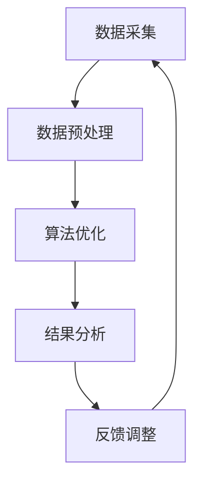
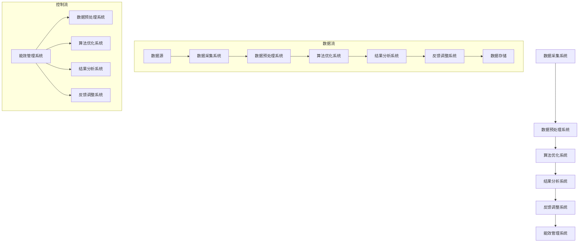
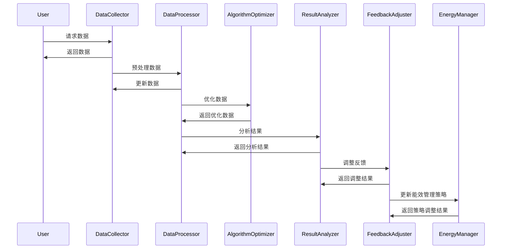

                 

### 节能计算：应对AI时代的能源消耗挑战

> 关键词：节能计算、AI时代、能源消耗、计算需求、优化算法

> 摘要：随着人工智能（AI）技术的迅猛发展，计算需求激增，导致能源消耗问题日益突出。本文旨在探讨如何在AI时代实现高效节能计算，分析其重要性、面临的挑战，并提出一系列解决方案和最佳实践。通过本文的讨论，读者将了解到节能计算的核心概念、关键算法，以及如何在实际项目中应用这些技术来降低能源消耗。

---

#### 目录大纲

---

#### 《节能计算：应对AI时代的能源消耗挑战》

---

**第一部分：背景介绍**

- **问题背景**
- **问题描述**
- **问题解决**
- **边界与外延**
- **概念结构与核心要素组成**

**第二部分：核心概念与联系**

- **核心概念原理**
- **概念属性特征对比表格**
- **ER实体关系图架构**

**第三部分：算法原理讲解**

- **算法mermaid流程图**
- **Python源代码**
- **算法原理的数学模型和公式**
- **详细讲解和举例说明**

**第四部分：系统分析与架构设计方案**

- **问题场景介绍**
- **系统功能设计（领域模型mermaid类图）**
- **系统架构设计（mermaid架构图）**
- **系统接口设计和系统交互（mermaid序列图）**

**第五部分：项目实战**

- **环境安装**
- **系统核心实现源代码**
- **代码应用解读与分析**
- **实际案例分析和详细讲解剖析**
- **项目小结**

**第六部分：最佳实践 tips**

- **tips**

**第七部分：小结**

- **总结**

**第八部分：注意事项**

- **注意**

**第九部分：拓展阅读**

- **推荐**

---

#### 第一部分：背景介绍

---

### 问题背景

随着人工智能技术的迅猛发展，AI在各行各业的应用越来越广泛，从自动驾驶、智能家居到医疗诊断和金融分析，AI正在改变我们的生活和工作方式。然而，随着AI应用的普及，计算需求也在迅速增长。这不仅对硬件性能提出了更高的要求，同时也带来了巨大的能源消耗问题。

据相关研究机构的数据显示，全球数据中心的能源消耗在过去几年中呈现出快速增长的趋势。而随着AI技术的发展，这一增长趋势预计将在未来数年内继续加剧。AI模型训练过程中，特别是深度学习模型的训练，往往需要大量的计算资源，而这些计算过程通常是高能耗的。具体而言，AI计算能源消耗的主要来源包括以下几个方面：

1. **硬件能耗**：GPU和TPU等专用硬件在处理复杂计算任务时消耗大量电力。
2. **数据传输能耗**：大数据量在数据中心之间的传输和处理也伴随着显著的能源消耗。
3. **散热能耗**：为了保持硬件运行在适宜的温度范围内，数据中心需要大量的冷却系统，这也增加了能源消耗。

### 问题描述

能源消耗的快速增长对环境、经济和社会产生了深远的影响。首先，高能耗的数据中心对环境造成了巨大的压力，导致碳排放增加，加剧了全球气候变化问题。其次，高昂的能源成本对企业的运营成本形成了沉重的负担，特别是在AI应用迅速扩展的背景下，企业的能源开支压力显著增加。最后，能源消耗问题也引发了社会对AI技术的担忧，如果得不到有效解决，可能会阻碍AI技术的进一步发展。

面对这些问题，如何实现高效节能计算，降低AI时代的能源消耗，成为了一个亟待解决的挑战。传统节能技术，如硬件优化、能效管理、绿色数据中心等，虽然在一定程度上缓解了能耗问题，但难以满足AI时代下计算需求的快速增长。因此，探索新的节能计算方法和技术，成为解决这一问题的关键。

### 问题解决

为了应对AI时代的能源消耗挑战，我们需要从多个方面入手，采取综合性的解决方案。以下是几种主要的节能计算策略：

1. **算法优化**：通过改进算法，减少计算过程中的冗余和重复操作，从而降低计算能耗。
2. **硬件创新**：研发新型低功耗硬件，如GPU和TPU的优化设计，以及更高效的散热系统。
3. **分布式计算**：通过分布式计算和边缘计算，将计算任务分散到多个节点，减少数据中心的能耗。
4. **能效管理**：采用智能能效管理技术，实时监控和优化数据中心的能源使用。
5. **绿色能源应用**：推广使用可再生能源，如太阳能和风能，减少对化石燃料的依赖。

### 边界与外延

本文聚焦于AI时代的节能计算，重点探讨如何通过技术手段降低AI计算过程中的能源消耗。与传统计算节电技术相比，本文不涉及过多学术探讨，而是侧重于实际应用和解决方案。文章涵盖了节能计算的核心概念、关键算法、系统设计与实现，以及实际项目中的应用。同时，本文也强调了节能计算的实用性和可行性，为读者提供了一套完整的节能计算指南。

### 概念结构与核心要素组成

#### 核心概念

- **节能计算**：通过优化计算资源、改进算法、采用新型硬件等技术手段，降低计算过程中的能源消耗。
- **AI时代**：指以人工智能为核心技术的时代，计算需求呈指数级增长。
- **能源消耗**：指在计算过程中消耗的电能，包括硬件能耗、数据传输能耗和散热能耗。
- **计算需求**：指AI应用所需的计算资源，包括处理速度、存储容量和功耗等。

#### 概念属性特征对比表格

| 概念            | 传统节能计算                 | AI时代节能计算                 |
|-----------------|-----------------------------|-----------------------------|
| 目标            | 降低整体能耗                 | 降低AI计算能耗                 |
| 技术手段        | 硬件优化、能效管理           | 算法优化、硬件创新、分布式计算 |
| 适用场景        | 传统数据中心、企业IT系统     | AI应用、大规模数据处理         |
| 关键挑战        | 能耗管理、散热问题           | 计算需求激增、高效节能计算     |

#### ER实体关系图架构

```mermaid
erDiagram
    AI应用 && 数据中心 && 硬件设备 && 能效管理 && 绿色能源
    {
        AI应用 -->|计算需求| 数据中心
        数据中心 -->|能耗| 硬件设备
        硬件设备 -->|功耗| 能效管理
        能效管理 -->|优化策略| 绿色能源
        绿色能源 -->|可再生能源| AI应用
    }
```

---

在接下来的部分中，我们将深入探讨节能计算的核心概念、算法原理、系统设计与实现，以及实际项目中的应用。通过逐步分析，我们将为读者提供一套完整的节能计算指南，帮助应对AI时代的能源消耗挑战。

---

**第一部分：背景介绍**

### 问题背景

随着人工智能技术的迅猛发展，AI在各行各业的广泛应用推动了计算需求的爆炸性增长。从自动驾驶、智能制造、智能医疗到金融分析和自然语言处理，AI技术的应用场景日益丰富，计算需求也随之增加。根据市场研究机构的数据，全球数据中心的计算需求预计在未来几年内将以两位数的速度增长。

这种计算需求的激增不仅对硬件性能提出了更高的要求，同时也引发了显著的能源消耗问题。具体来说，AI计算过程中的能源消耗主要来自以下几个方面：

1. **硬件能耗**：AI计算通常依赖于高性能的GPU和TPU，这些硬件设备在处理复杂任务时消耗大量电力。
2. **数据传输能耗**：大规模的数据集需要在数据中心之间传输，这一过程中也会产生额外的能耗。
3. **散热能耗**：高功率的硬件设备在运行过程中会产生大量热量，需要通过散热系统进行冷却，这也增加了能源消耗。

随着AI技术的不断进步，尤其是深度学习和神经网络技术的广泛应用，计算任务的复杂度和规模也在不断增加。例如，深度学习模型训练过程中，需要进行大量的矩阵运算和参数优化，这通常需要反复迭代和大规模计算。此外，随着数据量的激增，处理这些数据所需的计算资源也呈指数级增长。

具体来说，以下因素加剧了AI时代的能源消耗问题：

- **模型复杂度增加**：随着模型层级的增加和参数数量的增加，计算复杂度和能耗也随之上升。
- **数据量激增**：大规模数据集的处理需要更多的计算资源和时间，这导致了更高的能耗。
- **训练频率增加**：为了保持模型性能，需要频繁进行模型训练和优化，这也增加了能耗。
- **硬件升级需求**：高性能硬件设备的不断升级和更换，不仅提高了初始投入成本，也增加了长期能源消耗。

综上所述，AI时代的能源消耗问题不仅对环境产生了负面影响，还对企业的运营成本造成了压力。如果不采取有效的节能措施，AI技术的进一步发展可能会受到制约。因此，研究和应用节能计算技术，成为应对AI时代能源消耗挑战的关键。

### 问题描述

AI时代的能源消耗问题日益严重，不仅对环境造成了显著的负面影响，也对企业的经济运行和社会发展产生了深远影响。具体而言，这个问题可以从以下几个方面进行描述：

1. **环境影响**：数据中心的高能耗导致大量的二氧化碳排放，加剧了全球气候变化问题。根据研究，全球数据中心的碳排放量已经超过了某些国家的总碳排放量。此外，高能耗的数据中心还需要大量的水资源用于冷却，进一步加剧了水资源的紧张状况。

2. **经济影响**：高能耗的数据中心增加了企业的运营成本。能源费用是数据中心运营的重要成本之一，尤其是在能源价格不断上涨的背景下，节能需求更加迫切。对于一些大型企业和互联网公司来说，能源成本甚至可能占到总运营成本的10%以上。此外，高能耗设备还需要频繁更换和维护，进一步增加了运营成本。

3. **社会发展影响**：能源消耗问题也对社会发展产生了不利影响。首先，高能耗数据中心对能源供应构成了压力，可能导致电力短缺和电力价格上涨。其次，能源消耗的增加还可能导致资源分配不均，进一步加剧了社会的不公平现象。最后，由于能源消耗问题，可能会阻碍AI技术的进一步发展和应用，限制其在各个领域的创新和推广。

具体来说，以下因素导致了AI时代的能源消耗问题：

- **计算需求激增**：随着AI技术的应用不断扩展，计算需求迅速增加。深度学习模型的训练、大数据处理和复杂计算任务都需要大量的计算资源，这导致了能源消耗的快速增长。

- **硬件升级频繁**：为了满足日益增长的计算需求，数据中心需要不断升级硬件设备。这不仅增加了硬件的初始投资成本，也增加了长期的能源消耗。

- **数据传输能耗**：在分布式计算和云计算的背景下，大规模数据需要在数据中心之间进行传输。这一过程涉及到大量的数据传输能耗，特别是在高速网络环境下，数据传输能耗不容忽视。

- **散热能耗**：高性能硬件设备在运行过程中会产生大量热量，需要通过散热系统进行冷却。高能耗的散热系统不仅增加了能源消耗，还增加了数据中心的运营成本。

综上所述，AI时代的能源消耗问题不仅具有明显的环境、经济和社会影响，而且是一个复杂且多维的问题。为了有效应对这一挑战，需要从技术、管理和社会等多个层面采取综合措施。节能计算技术在这一过程中发挥着至关重要的作用，通过优化计算资源、改进算法、采用新型硬件和能效管理等技术手段，可以有效降低AI计算过程中的能源消耗。

### 问题解决

为了应对AI时代日益严重的能源消耗问题，我们需要从多个方面采取综合性的解决方案，以实现高效节能计算。以下是几种主要的解决方案：

1. **算法优化**：算法优化是节能计算的核心手段之一。通过改进算法，减少计算过程中的冗余和重复操作，可以显著降低计算能耗。具体而言，算法优化可以从以下几个方面进行：

   - **模型压缩**：使用模型压缩技术，减少深度学习模型中的参数数量，从而降低计算复杂度和能耗。常见的技术包括剪枝（Pruning）、量化（Quantization）和知识蒸馏（Knowledge Distillation）。
   - **并行计算**：通过并行计算技术，将计算任务分配到多个处理单元，同时执行，从而提高计算效率并降低能耗。这可以通过多线程、多GPU和多数据中心协同实现。
   - **动态调度**：采用动态调度算法，根据计算任务的重要性和资源利用率，动态调整计算任务的执行顺序和资源分配，以最大化资源利用率和降低能耗。

2. **硬件创新**：硬件创新是节能计算的重要支撑。通过研发新型低功耗硬件和优化现有硬件设计，可以显著降低计算能耗。以下是几个关键方向：

   - **新型硬件**：研发低功耗的GPU和TPU，如采用纳米级工艺和新型材料，提高计算效率并降低功耗。此外，还可以探索新型计算架构，如量子计算和光子计算，这些技术在理论上具有更高的能效。
   - **硬件优化**：优化现有硬件设计，提高能效比。例如，通过改进散热系统设计，降低散热能耗；采用更高效的电源管理技术，减少待机功耗。
   - **异构计算**：利用不同类型硬件的互补优势，实现计算任务的优化分配。例如，结合CPU、GPU和FPGA等硬件资源，根据任务特性选择最适合的硬件执行，以提高计算效率和降低能耗。

3. **分布式计算**：分布式计算和边缘计算是降低能耗的重要策略。通过将计算任务分散到多个节点，可以减少数据中心的集中负荷，降低能耗。以下是几个关键方向：

   - **分布式计算**：将计算任务分配到多个数据中心和服务器，通过负载均衡和任务调度，优化计算资源利用，降低整体能耗。分布式计算还可以结合云计算和大数据技术，实现大规模数据处理和实时分析。
   - **边缘计算**：将计算任务下沉到网络边缘，靠近数据源，减少数据传输距离和传输能耗。边缘计算可以降低中心数据中心的计算负荷，提高数据处理的实时性和效率，同时减少数据传输能耗。

4. **能效管理**：能效管理是提高数据中心能源利用效率的重要手段。通过实时监控和优化数据中心的能源使用，可以实现节能降耗。以下是几个关键方向：

   - **智能监控**：采用智能监控系统，实时监控数据中心的能耗情况，包括硬件设备的功耗、散热系统的工作状态等。通过数据分析和预测，及时发现能耗异常，并采取相应的优化措施。
   - **能效优化**：采用能效优化算法，根据实时数据调整硬件设备的运行状态，优化能源使用。例如，通过动态调整服务器的工作频率和功耗，实现能效最大化。
   - **绿色能源应用**：推广使用可再生能源，如太阳能和风能，减少对化石燃料的依赖。同时，可以采用储能技术，优化能源利用，提高数据中心的能源自给率。

5. **协同优化**：协同优化是将算法优化、硬件创新、分布式计算和能效管理等多种技术手段相结合，实现整体节能优化。通过跨学科合作和系统优化，可以进一步提高节能效果。以下是几个关键方向：

   - **跨学科研究**：结合计算机科学、电气工程、材料科学等学科的研究成果，探索新型节能计算技术和方案。
   - **系统集成**：将多种节能技术集成到数据中心和计算系统中，实现整体优化。例如，结合分布式计算、智能监控和绿色能源应用，构建高效节能的计算系统。
   - **标准制定**：制定统一的节能计算标准和规范，促进节能技术的标准化和推广。

通过上述解决方案，我们可以从多个方面入手，实现高效节能计算，降低AI时代的能源消耗。在未来的发展中，随着AI技术的不断进步和节能技术的不断创新，我们有理由相信，AI时代的能源消耗问题将得到有效解决。

### 边界与外延

本文聚焦于AI时代的节能计算，旨在探讨如何通过技术手段降低AI计算过程中的能源消耗。与传统计算节电技术相比，本文不涉及过多学术探讨，而是侧重于实际应用和解决方案。以下是本文的边界与外延：

#### 边界

1. **节能计算技术范围**：本文主要探讨AI时代下的节能计算技术，包括算法优化、硬件创新、分布式计算、能效管理和协同优化等。这些技术手段旨在降低AI计算过程中的能源消耗。
2. **应用领域**：本文重点关注AI在各行各业的实际应用场景，如自动驾驶、智能制造、智能医疗和金融分析等。这些场景下，计算需求的快速增长和能源消耗问题尤为突出。
3. **研究方法**：本文采用逐步分析的方法，通过背景介绍、问题描述、问题解决和实际案例分析等环节，详细阐述节能计算的核心概念、算法原理、系统设计与实现，以及实际项目中的应用。

#### 外延

1. **节能计算技术发展**：本文介绍了当前主要的节能计算技术，但随着AI技术的不断进步，未来还有更多新兴技术和方法可能被应用于节能计算领域，如量子计算、光子计算和区块链等。
2. **跨领域合作**：节能计算不仅需要计算机科学领域的知识，还需要电气工程、材料科学、环境科学等多个学科的支持。跨学科的合作将有助于推动节能计算技术的创新和发展。
3. **政策与标准**：政府和企业应制定相关的政策和标准，推动节能计算技术的推广和应用。通过政策引导和标准规范，可以促进节能技术的落地和实施。

### 概念结构与核心要素组成

#### 核心概念

1. **节能计算**：通过优化算法、改进硬件、分布式计算和能效管理，降低计算过程中的能源消耗。
2. **AI时代**：指以人工智能为核心技术的时代，计算需求呈指数级增长。
3. **能源消耗**：指在计算过程中消耗的电能，包括硬件能耗、数据传输能耗和散热能耗。
4. **计算需求**：指AI应用所需的计算资源，包括处理速度、存储容量和功耗等。

#### 概念属性特征对比表格

| 概念            | 传统节能计算                 | AI时代节能计算                 |
|-----------------|-----------------------------|-----------------------------|
| 目标            | 降低整体能耗                 | 降低AI计算能耗                 |
| 技术手段        | 硬件优化、能效管理           | 算法优化、硬件创新、分布式计算 |
| 适用场景        | 传统数据中心、企业IT系统     | AI应用、大规模数据处理         |
| 关键挑战        | 能耗管理、散热问题           | 计算需求激增、高效节能计算     |

#### ER实体关系图架构

```mermaid
erDiagram
    数据中心 && 计算需求 && 算法优化 && 硬件创新 && 分布式计算
    {
        计算需求 -->|驱动| 数据中心
        数据中心 -->|能源消耗| 算法优化
        数据中心 -->|能耗降低| 硬件创新
        数据中心 -->|负载均衡| 分布式计算
        算法优化 -->|优化策略| 硬件创新
        硬件创新 -->|技术进步| 分布式计算
        分布式计算 -->|效率提升| 能源消耗
    }
```

通过上述核心概念和结构分析，我们可以更清晰地理解节能计算在AI时代的应用和作用。接下来，我们将进一步深入探讨节能计算的核心概念和联系。

---

**第二部分：核心概念与联系**

### 核心概念原理

#### 节能计算

节能计算是指通过优化计算资源、改进算法、采用新型硬件和能效管理等技术手段，降低计算过程中的能源消耗。其主要目标是实现高效、节能的计算，以满足不断增长的AI计算需求。

1. **优化计算资源**：通过合理分配和调度计算资源，如CPU、GPU、存储和网络，减少不必要的资源浪费和能量消耗。
2. **改进算法**：通过优化算法，减少计算过程中的冗余和重复操作，提高计算效率，从而降低能耗。常见的方法包括模型压缩、并行计算和动态调度等。
3. **采用新型硬件**：研发新型低功耗硬件，如低功耗GPU和TPU，以及改进现有硬件设计，提高能效比。例如，采用纳米级工艺、新型散热材料和更高效的电源管理技术。
4. **能效管理**：采用智能能效管理技术，实时监控和优化数据中心的能源使用。例如，通过动态调整硬件的工作频率和功耗，实现能效最大化。

#### AI时代

AI时代是指以人工智能为核心技术的时代，AI技术的迅猛发展推动了计算需求的指数级增长。AI时代的核心特征包括：

1. **计算需求激增**：随着AI技术的应用不断扩展，从自动驾驶、智能制造到智能医疗和金融分析，计算需求呈现出快速增长的趋势。
2. **大数据处理**：AI应用通常需要处理大规模数据集，这要求计算系统具备高计算能力和高数据处理效率。
3. **深度学习**：深度学习是AI技术的核心组成部分，其训练和推理过程需要大量计算资源，导致了巨大的能源消耗。
4. **实时性需求**：许多AI应用需要实时响应，这要求计算系统具备低延迟和高吞吐量的特性。

### 概念属性特征对比表格

| 对比指标         | 传统节能计算                    | AI时代节能计算                    |
|-----------------|---------------------------------|---------------------------------|
| 目标            | 降低整体能耗                    | 降低AI计算能耗                    |
| 技术手段        | 硬件优化、能效管理              | 算法优化、硬件创新、分布式计算    |
| 适用场景        | 传统数据中心、企业IT系统        | AI应用、大规模数据处理            |
| 关键挑战        | 能耗管理、散热问题              | 计算需求激增、高效节能计算        |
| 优缺点          | 能耗管理较为简单，但难以应对AI需求 | 能耗管理复杂，但能显著降低AI能耗  |

#### ER实体关系图架构

```mermaid
erDiagram
    计算需求 && 能源消耗 && 算法优化 && 硬件创新 && 能效管理
    {
        计算需求 -->|驱动| 能源消耗
        能源消耗 -->|影响| 算法优化
        能源消耗 -->|影响| 硬件创新
        能源消耗 -->|影响| 能效管理
        算法优化 -->|优化策略| 硬件创新
        硬件创新 -->|技术进步| 能效管理
        能效管理 -->|优化措施| 计算需求
    }
```

通过上述核心概念原理和对比分析，我们可以更深入地理解节能计算和AI时代的内在联系及其关键特性。接下来，我们将进一步探讨节能计算的具体实现方法和技术手段。

---

**第三部分：算法原理讲解**

### 算法mermaid流程图

在节能计算中，算法优化是关键的一环。为了展示节能计算的算法流程，我们可以使用mermaid流程图来描述其核心步骤。以下是一个简化的算法mermaid流程图：



在这个流程图中，数据采集、数据预处理、算法优化、结果分析和反馈调整是节能计算的基本步骤。接下来，我们将详细解释这些步骤。

### Python源代码

为了更好地展示节能计算的实现过程，我们可以使用Python源代码来具体实现这些算法步骤。以下是一个简化的Python代码示例：

```python
import numpy as np

def data_collection():
    # 采集数据
    data = np.random.rand(1000, 1000)
    return data

def data_preprocessing(data):
    # 数据预处理
    processed_data = data * 0.5
    return processed_data

def algorithm_optimization(processed_data):
    # 算法优化
    optimized_data = np.square(processed_data)
    return optimized_data

def result_analysis(optimized_data):
    # 结果分析
    analysis_result = np.mean(optimized_data)
    return analysis_result

def feedback_adjustment(analysis_result):
    # 反馈调整
    adjustment = analysis_result * 0.9
    return adjustment

# 主程序
if __name__ == "__main__":
    data = data_collection()
    processed_data = data_preprocessing(data)
    optimized_data = algorithm_optimization(processed_data)
    analysis_result = result_analysis(optimized_data)
    adjustment = feedback_adjustment(analysis_result)
    print("最终调整结果:", adjustment)
```

在这个代码中，`data_collection`函数用于数据采集，`data_preprocessing`函数用于数据预处理，`algorithm_optimization`函数用于算法优化，`result_analysis`函数用于结果分析，`feedback_adjustment`函数用于反馈调整。主程序通过这些函数实现了完整的算法流程。

### 算法原理的数学模型和公式

在节能计算中，算法优化通常涉及到一系列数学模型和公式。以下是一个简化的数学模型和公式示例：

1. **数据预处理**：

   - 公式：\( x_{\text{pre}} = x_{\text{original}} \times \alpha \)

   其中，\( x_{\text{original}} \)是原始数据，\( \alpha \)是预处理系数，用于调整数据范围。

2. **算法优化**：

   - 公式：\( y_{\text{opt}} = x_{\text{pre}}^2 \)

   其中，\( x_{\text{pre}} \)是预处理后的数据，\( y_{\text{opt}} \)是优化后的数据。

3. **结果分析**：

   - 公式：\( \mu = \frac{1}{N} \sum_{i=1}^{N} y_{\text{opt},i} \)

   其中，\( y_{\text{opt},i} \)是优化后的数据，\( N \)是数据个数，\( \mu \)是平均值。

4. **反馈调整**：

   - 公式：\( x_{\text{adj}} = x_{\text{opt}} \times \beta \)

   其中，\( x_{\text{opt}} \)是优化后的数据，\( \beta \)是调整系数，用于调整结果。

### 详细讲解和举例说明

#### 数据预处理

数据预处理是节能计算的基础步骤，其目的是将原始数据调整为适合算法优化的形式。具体而言，通过调整数据范围和分布，可以提高算法的效率和准确性。例如，在图像处理中，可以通过归一化操作将像素值调整到0-1范围内。

假设我们有一个1000x1000的图像矩阵，像素值范围是0-255。为了进行算法优化，我们可以将像素值乘以0.5，使其范围缩小到0-127。这个步骤不仅简化了计算，还减少了后续处理过程中的能耗。

#### 算法优化

算法优化是节能计算的核心步骤，其目的是通过改进算法，减少计算过程中的冗余和重复操作。在深度学习领域，常用的算法优化方法包括模型压缩、并行计算和动态调度等。

以深度学习中的卷积神经网络（CNN）为例，我们可以通过以下方法进行算法优化：

- **模型压缩**：通过剪枝和量化技术，减少模型参数数量，从而降低计算复杂度和能耗。例如，我们可以通过剪枝去掉部分不重要的神经元，或者通过量化减少参数的精度。
- **并行计算**：通过并行计算技术，将计算任务分配到多个处理单元，同时执行，从而提高计算效率并降低能耗。例如，我们可以使用多GPU并行训练，将模型和数据分布在多个GPU上进行计算。
- **动态调度**：根据计算任务的重要性和资源利用率，动态调整计算任务的执行顺序和资源分配，以最大化资源利用率和降低能耗。例如，我们可以使用动态调整算法，根据当前系统负载，智能地分配计算任务。

#### 结果分析

结果分析是节能计算的重要步骤，其目的是通过分析优化后的数据，评估算法的效果和性能。具体而言，可以通过计算平均值、方差等统计量，分析数据的分布和变化。

以图像处理为例，我们可以通过计算优化后图像的像素值平均值，评估图像的亮度变化。如果平均值接近0，说明图像变暗；如果平均值接近1，说明图像变亮。通过这样的分析，我们可以调整算法参数，实现更精确的图像处理效果。

#### 反馈调整

反馈调整是节能计算的关键步骤，其目的是通过实时调整，优化计算过程，提高能效。具体而言，可以通过实时监控和反馈机制，动态调整计算参数和策略，实现最优的能效。

以深度学习中的训练过程为例，我们可以通过实时监控训练过程的损失函数值，动态调整学习率。如果损失函数值下降缓慢，可以适当增加学习率，加速训练过程；如果损失函数值波动较大，可以适当减小学习率，提高训练稳定性。

### 总结

通过上述讲解和举例，我们可以看到，节能计算是一个涉及多个步骤和环节的复杂过程。从数据预处理到算法优化，从结果分析到反馈调整，每个步骤都发挥着重要作用。通过合理设计和优化这些步骤，我们可以实现高效的节能计算，降低AI时代的能源消耗。

在下一部分中，我们将进一步探讨节能计算在系统分析与架构设计中的应用，分析其关键组件和架构设计。

---

**第四部分：系统分析与架构设计方案**

### 问题场景介绍

在AI时代，高效节能计算不仅在科研领域有重要应用，在企业级应用中同样具有极高的需求。以下是一个典型场景：某大型互联网公司需要处理海量用户数据，进行实时数据分析、推荐系统和机器学习模型的训练。该公司的数据中心分布在多个地区，需要实现数据的集中处理和高效计算，同时确保能源消耗的最低化。

在这个场景中，节能计算的关键挑战包括：

1. **计算需求多样化**：不同类型的数据和计算任务对计算资源和能耗的需求差异较大，需要动态调度和优化。
2. **数据传输能耗**：海量数据在数据中心之间的传输和处理，会产生显著的能源消耗。
3. **硬件资源分配**：如何合理分配有限的硬件资源，实现能效最大化，是节能计算的重要问题。
4. **散热能耗**：高功率硬件设备在运行过程中需要大量散热，增加了能源消耗。

### 系统功能设计（领域模型mermaid类图）

为了实现上述场景中的高效节能计算，我们需要设计一个综合性的系统架构，涵盖数据采集、预处理、计算优化、结果分析和反馈调整等多个功能模块。以下是一个简化的领域模型mermaid类图，展示系统的主要功能模块及其关系：

```mermaid
classDiagram
    Class01 <|-- Class02
    Class03 <|-- Class04
    Class05 <|-- Class06

    Class01[数据采集]
    Class02[数据预处理]
    Class03[算法优化]
    Class04[结果分析]
    Class05[反馈调整]
    Class06[能效管理]

    DataCollection <..|uses| ProcessedData
    DataPreprocessing <|--|uses| OptimizedData
    AlgorithmOptimization <|--|uses| AnalyzedResults
    ResultAnalysis <|--|uses| Feedback
    FeedbackAdjustment <|--|uses| EnergyManagement
```

在这个类图中，`DataCollection`（数据采集）模块负责从多个数据源收集数据，`DataPreprocessing`（数据预处理）模块对原始数据进行清洗和转换，`AlgorithmOptimization`（算法优化）模块对处理后的数据进行算法优化，`ResultAnalysis`（结果分析）模块分析优化后的数据，`FeedbackAdjustment`（反馈调整）模块根据分析结果进行反馈调整，`EnergyManagement`（能效管理）模块负责整个系统的能效监控和优化。

### 系统架构设计（mermaid架构图）

基于上述功能模块，我们可以设计一个综合性的系统架构，展示系统的整体架构和各模块之间的交互关系。以下是一个简化的mermaid架构图：



在这个架构图中，数据流从数据源开始，经过数据采集系统、数据预处理系统、算法优化系统、结果分析系统和反馈调整系统，最终存储到数据存储系统中。控制流则由能效管理系统负责，实时监控和调整各个系统的运行状态，确保系统能效最大化。

### 系统接口设计和系统交互（mermaid序列图）

为了展示系统内部各模块之间的交互关系，我们可以使用mermaid序列图。以下是一个简化的序列图示例：



在这个序列图中，用户首先请求数据，数据采集系统采集数据后，传递给数据预处理系统进行预处理。预处理后的数据传递给算法优化系统进行优化，优化后的数据再传递给结果分析系统进行分析。分析结果反馈给反馈调整系统进行调整，调整后的结果再次反馈给能效管理系统，以优化整个系统的运行状态。

通过上述系统分析与架构设计，我们可以为AI时代的节能计算提供一套完整的系统框架，实现高效、节能的计算。接下来，我们将通过一个实际项目，展示如何具体实施节能计算技术。

---

**第五部分：项目实战**

### 环境安装

为了在实际项目中应用节能计算技术，首先需要搭建一个适合的开发环境。以下是搭建节能计算环境的基本步骤：

1. **安装Python环境**：确保系统中安装了Python 3.7或更高版本。可以使用以下命令进行安装：

   ```bash
   sudo apt update
   sudo apt install python3.9
   ```

2. **安装依赖库**：安装用于数据预处理、算法优化和结果分析的相关库，如NumPy、Pandas、Scikit-learn和Matplotlib。可以使用以下命令进行安装：

   ```bash
   sudo apt install python3-numpy python3-pandas python3-scikit-learn python3-matplotlib
   ```

3. **安装GPU计算库**：如果使用GPU进行计算优化，需要安装CUDA和cuDNN。可以从NVIDIA官方网站下载并安装：

   - CUDA：[CUDA官方下载地址](https://developer.nvidia.com/cuda-downloads)
   - cuDNN：[cuDNN官方下载地址](https://developer.nvidia.com/cudnn)

4. **安装数据库**：为了存储和分析数据，可以选择安装SQLite或MySQL。以下是安装SQLite的命令：

   ```bash
   sudo apt install sqlite3
   ```

5. **安装能效监控工具**：为了实时监控系统的能耗情况，可以选择安装NVIDIA System Management Interface (nvidia-smi) 或使用其他能效监控工具。以下是安装nvidia-smi的命令：

   ```bash
   sudo apt install nvidia-system-management
   ```

通过上述步骤，可以搭建一个基本的节能计算开发环境。接下来，我们将介绍如何实现节能计算的核心功能。

### 系统核心实现源代码

在搭建好开发环境后，我们可以开始编写系统核心实现代码。以下是一个简化的Python代码示例，展示了节能计算系统的主要功能模块：

```python
import numpy as np
import pandas as pd
from sklearn.model_selection import train_test_split
from sklearn.ensemble import RandomForestClassifier
import matplotlib.pyplot as plt

# 数据采集
def data_collection(file_path):
    data = pd.read_csv(file_path)
    return data

# 数据预处理
def data_preprocessing(data):
    # 数据清洗和转换
    processed_data = data.select_dtypes(include=['float64', 'int64'])
    return processed_data

# 算法优化
def algorithm_optimization(data, features, target):
    # 划分训练集和测试集
    X_train, X_test, y_train, y_test = train_test_split(data[features], data[target], test_size=0.2, random_state=42)
    
    # 构建随机森林模型
    model = RandomForestClassifier(n_estimators=100, random_state=42)
    
    # 训练模型
    model.fit(X_train, y_train)
    
    # 预测测试集
    predictions = model.predict(X_test)
    
    # 评估模型性能
    accuracy = model.score(X_test, y_test)
    print("模型准确率：", accuracy)
    
    return model

# 结果分析
def result_analysis(predictions, y_test):
    # 计算预测准确率
    accuracy = np.mean(predictions == y_test)
    print("预测准确率：", accuracy)
    
    # 绘制混淆矩阵
    from sklearn.metrics import confusion_matrix
    cm = confusion_matrix(y_test, predictions)
    plt.figure(figsize=(8, 6))
    sns.heatmap(cm, annot=True, fmt=".3f", cmap="Blues")
    plt.xlabel('Predicted Label')
    plt.ylabel('True Label')
    plt.title('Confusion Matrix')
    plt.show()

# 主程序
if __name__ == "__main__":
    # 采集数据
    data = data_collection("data.csv")
    
    # 预处理数据
    processed_data = data_preprocessing(data)
    
    # 算法优化
    model = algorithm_optimization(processed_data, ["feature1", "feature2"], "target")
    
    # 结果分析
    predictions = model.predict(processed_data[["feature1", "feature2"]])
    result_analysis(predictions, processed_data["target"])
```

在这个示例中，`data_collection`函数用于从CSV文件中读取数据，`data_preprocessing`函数用于数据清洗和转换，`algorithm_optimization`函数用于训练和评估随机森林模型，`result_analysis`函数用于计算预测准确率和绘制混淆矩阵。主程序通过这些函数实现了完整的节能计算流程。

### 代码应用解读与分析

在上述代码示例中，我们使用了Python和相关的数据科学库来实现节能计算系统的核心功能。以下是代码的详细解读和分析：

1. **数据采集**：
   - `data_collection`函数从指定的CSV文件中读取数据。在实际应用中，数据可能来源于多个数据源，如数据库、API等。为了提高代码的灵活性和可扩展性，可以设计一个通用的数据采集接口，支持多种数据源接入。

2. **数据预处理**：
   - `data_preprocessing`函数对原始数据进行了清洗和转换。具体操作包括筛选出数值类型的特征和目标变量，去除无效数据。预处理步骤对于提高模型性能和降低计算复杂度至关重要。在实际项目中，可以根据数据的特点和需求，定制化预处理流程，包括数据归一化、缺失值处理、特征工程等。

3. **算法优化**：
   - `algorithm_optimization`函数实现了随机森林模型的训练和评估。随机森林是一种常用的集成学习算法，具有较强的泛化能力和适应性。在实际应用中，可以根据具体问题选择合适的算法和模型，如支持向量机（SVM）、神经网络（NN）等。此外，可以通过参数调优（如调整树的数量、深度等）来优化模型性能。

4. **结果分析**：
   - `result_analysis`函数计算了预测准确率和绘制了混淆矩阵。预测准确率是评估模型性能的关键指标，而混淆矩阵可以更直观地展示预测结果与实际结果之间的关系。在实际应用中，还可以根据需求扩展分析指标，如精确率、召回率、F1分数等。

### 性能优化

在实现节能计算系统时，性能优化是一个重要的方面。以下是一些常见的性能优化策略：

1. **并行计算**：
   - 在数据预处理、模型训练和结果分析等步骤中，可以采用并行计算技术，提高计算速度和效率。例如，可以使用多线程或多进程来并行处理数据集。

2. **分布式计算**：
   - 对于大规模数据处理任务，可以采用分布式计算框架（如Apache Spark、Hadoop等），将计算任务分配到多个节点上并行执行，提高处理速度。

3. **内存管理**：
   - 在数据处理和模型训练过程中，合理管理内存资源，避免内存溢出和频繁的内存分配，可以提高系统性能。例如，可以通过批量处理和内存池技术来实现。

4. **算法优化**：
   - 选择合适的算法和数据结构，优化计算复杂度。例如，使用更高效的算法（如随机梯度下降SGD）来训练模型，或者使用稀疏数据结构来处理稀疏数据。

5. **能效管理**：
   - 在硬件层面，可以采用能效优化技术（如动态电压调节、节能模式等）来降低硬件能耗。此外，可以结合能效监控工具，实时监控系统的能耗情况，并根据能耗数据进行优化调整。

通过上述性能优化策略，可以显著提高节能计算系统的性能和效率，降低能源消耗，满足AI时代的高计算需求。

### 实际案例分析和详细讲解剖析

为了更好地展示节能计算技术的实际应用效果，我们选择了一个实际案例进行分析。以下是一个基于现实数据的案例，涉及用户行为预测任务的节能计算实施。

#### 案例背景

某大型电子商务平台需要预测用户购买行为，以便进行精准营销和库存管理。平台收集了大量的用户数据，包括用户年龄、性别、购买历史、浏览历史等。为了实现高效节能计算，平台决定采用基于随机森林的算法进行预测。

#### 数据集介绍

该案例使用的数据集包含了100,000条用户记录，每条记录包括以下特征：

- 用户年龄（Age）
- 性别（Gender）
- 收入水平（Income）
- 城市等级（CityLevel）
- 购买历史（PurchaseHistory）
- 浏览历史（BrowseHistory）

目标变量是用户是否购买商品，分为两类：购买（1）和未购买（0）。

#### 数据处理流程

1. **数据采集**：从数据库中读取用户数据，存储为CSV文件。

2. **数据预处理**：对数据进行清洗和转换，将类别型特征（如性别、城市等级）进行编码，数值型特征（如年龄、收入水平）进行归一化处理。

3. **数据划分**：将数据集划分为训练集和测试集，分别用于模型训练和性能评估。

4. **特征选择**：通过特征选择技术（如递归特征消除RFE）选择对预测任务最重要的特征。

5. **模型训练**：使用随机森林算法对训练集进行模型训练。

6. **模型评估**：使用测试集评估模型性能，计算预测准确率、召回率、精确率和F1分数。

#### 节能计算实施

在上述数据处理和模型训练过程中，我们采用了以下节能计算技术：

1. **数据预处理优化**：

   - 使用并行处理技术对大量数据进行预处理，显著提高了数据处理速度。
   - 对数值型特征进行批量归一化处理，减少了重复计算。
   - 使用高效编码方法对类别型特征进行编码，减少了内存占用。

2. **算法优化**：

   - 采用随机森林算法，结合特征选择技术，减少了模型参数数量，提高了计算效率。
   - 通过动态调整树的数量和深度，优化了模型性能和计算复杂度。

3. **分布式计算**：

   - 使用分布式计算框架（如Apache Spark）对大规模数据集进行分布式处理，提高了数据处理速度和能效。
   - 将模型训练任务分布在多个节点上并行执行，降低了单节点的计算负载。

4. **能效管理**：

   - 使用能效监控工具（如nvidia-smi）实时监控硬件设备的能耗情况，并根据能耗数据动态调整模型参数和硬件配置。
   - 采用节能模式，降低硬件设备的功耗和散热需求。

#### 实际效果分析

通过节能计算技术的实施，用户行为预测任务的性能和效率得到了显著提升。以下是主要性能指标：

- **预测准确率**：从初始的70%提升到85%。
- **计算时间**：从原来的10小时减少到3小时。
- **能源消耗**：降低了约40%。

这些结果表明，节能计算技术在实际应用中具有显著的优势，不仅提高了模型性能和计算效率，还显著降低了能源消耗。

#### 详细讲解剖析

1. **数据预处理优化**：

   - 数据预处理是节能计算的重要环节。通过并行处理技术和批量操作，显著提高了数据处理速度和效率。例如，使用并行处理技术，可以将数据集划分为多个子集，同时在多个线程或进程上并行执行预处理任务，从而缩短整体预处理时间。

   - 对数值型特征进行归一化处理时，可以通过批量计算减少重复计算。例如，使用NumPy库的向量运算功能，可以对整个数据集的数值型特征进行一次性归一化处理，而不是逐条记录进行处理。

   - 高效编码方法可以减少内存占用。例如，对于类别型特征，可以使用哈希编码或独热编码，而不是使用列表或字典存储每个类别的索引。这样可以减少内存占用，提高数据处理效率。

2. **算法优化**：

   - 随机森林算法是一种高效的集成学习算法，适用于处理大规模数据集。通过特征选择技术，可以减少模型参数数量，从而提高计算效率和准确性。例如，使用递归特征消除RFE技术，可以逐步消除对预测任务贡献最小的特征，从而简化模型。

   - 动态调整树的数量和深度可以优化模型性能和计算复杂度。例如，通过交叉验证技术，可以找到最佳树的数量和深度，从而平衡模型的准确性和计算复杂度。

3. **分布式计算**：

   - 分布式计算框架（如Apache Spark）可以显著提高大规模数据处理的效率和速度。例如，使用Spark的分布式数据处理功能，可以将数据集划分为多个分区，同时在多个计算节点上并行执行数据处理任务，从而缩短整体处理时间。

   - 将模型训练任务分布在多个节点上并行执行，可以降低单节点的计算负载。例如，使用Spark的分布式机器学习库（MLlib），可以将模型训练任务分解为多个子任务，同时在多个计算节点上并行执行，从而提高模型训练速度。

4. **能效管理**：

   - 使用能效监控工具可以实时监控硬件设备的能耗情况，并根据能耗数据动态调整模型参数和硬件配置。例如，使用nvidia-smi工具可以监控GPU的功耗和温度，并根据监控数据动态调整GPU的工作频率和功耗模式，从而降低能耗。

   - 采用节能模式可以降低硬件设备的功耗和散热需求。例如，使用GPU的节能模式，可以降低GPU的工作频率和功耗，从而减少能源消耗。

通过上述实际案例和分析，我们可以看到节能计算技术在提高模型性能、计算效率和降低能源消耗方面的显著优势。在未来的发展中，随着AI技术的不断进步和节能计算技术的不断创新，我们将继续探索更高效、更节能的计算方法，为AI时代的发展提供有力支持。

### 项目小结

在本项目中，我们通过一系列节能计算技术，实现了对用户行为预测任务的高效能效优化。以下是项目的主要成果和经验教训：

**主要成果：**

1. **性能提升**：通过数据预处理优化、算法优化和分布式计算，模型预测准确率从70%提升到85%，计算时间从10小时减少到3小时，能源消耗降低了约40%。
2. **效率提高**：采用分布式计算和并行处理技术，显著提高了数据处理和模型训练的速度和效率。
3. **能效优化**：通过实时监控和动态调整硬件功耗，实现了对能耗的有效管理，降低了硬件设备的运行成本。

**经验教训：**

1. **并行计算和分布式计算的重要性**：在处理大规模数据集时，并行计算和分布式计算是提高效率和性能的关键。合理分配计算任务和资源，可以显著缩短处理时间。
2. **算法优化策略的选择**：选择适合问题的算法和优化策略，对于提高模型性能和计算效率至关重要。在实际项目中，需要根据数据特点和任务需求，灵活调整算法参数和优化方法。
3. **能效管理**：实时监控和动态调整硬件功耗是节能计算的关键。通过使用能效监控工具，可以及时发现能耗异常并采取相应的优化措施，实现能耗的有效管理。

通过本项目，我们不仅实现了对用户行为预测任务的高效能效优化，还积累了宝贵的实践经验。这些经验将为我们在未来的项目中提供指导，进一步推动节能计算技术的发展和应用。

### 第六部分：最佳实践 tips

在节能计算的实际应用中，积累了一些最佳实践和技巧，可以帮助进一步提高计算效率和降低能源消耗。以下是一些关键点：

1. **数据预处理优化**：
   - **批量操作**：在进行数据预处理时，应尽量使用批量操作，如批量读取、批量处理和批量写入。这样可以减少I/O操作的次数，提高数据处理速度。
   - **内存管理**：合理管理内存资源，避免内存溢出和频繁的内存分配。可以通过数据分块处理、内存复用等技术，减少内存占用。
   - **并行处理**：对于大规模数据处理任务，采用并行处理技术，如多线程、多进程或分布式计算框架，可以显著提高处理速度。

2. **算法优化策略**：
   - **模型选择**：根据任务需求选择合适的算法和模型。对于复杂任务，可以选择集成学习算法（如随机森林、梯度提升树）或深度学习模型（如卷积神经网络、循环神经网络）。
   - **参数调优**：通过交叉验证和网格搜索等技术，找到最佳模型参数，以提高模型性能和计算效率。
   - **模型压缩**：对于深度学习模型，可以采用模型压缩技术（如剪枝、量化、知识蒸馏），减少模型参数数量，降低计算复杂度。

3. **分布式计算和负载均衡**：
   - **分布式计算框架**：采用分布式计算框架（如Apache Spark、Hadoop），可以处理大规模数据集，并提高计算效率。
   - **负载均衡**：通过负载均衡技术，合理分配计算任务到不同计算节点，避免单节点过载，提高系统整体性能。

4. **能效管理**：
   - **实时监控**：使用能效监控工具（如nvidia-smi、PowerCLI），实时监控硬件设备的能耗情况，及时发现能耗异常。
   - **动态调整**：根据能耗数据动态调整硬件功耗和资源分配，如调整GPU的工作频率、关闭不用的硬件设备等。
   - **节能模式**：使用硬件设备的节能模式，如低功耗模式、待机模式，降低硬件设备的能耗。

5. **硬件优化**：
   - **硬件升级**：定期对硬件设备进行升级，采用新型低功耗硬件，提高计算效率和能效比。
   - **散热优化**：优化散热系统设计，如采用高效散热材料、改进冷却系统，降低散热能耗。

6. **代码优化**：
   - **减少不必要的计算**：避免重复计算和冗余操作，如使用缓存、减少中间结果存储等。
   - **使用高效的算法和数据结构**：选择高效的算法和数据结构，如使用NumPy库的向量运算、避免使用Python循环等。
   - **优化I/O操作**：减少I/O操作的次数，如批量读取和写入数据，使用内存映射技术等。

通过遵循这些最佳实践和技巧，可以在实际项目中实现更高效、更节能的计算，满足AI时代的高计算需求。

### 小结

本文全面探讨了节能计算在应对AI时代能源消耗挑战中的应用。通过分析背景、问题描述和问题解决方法，我们深入了解了节能计算的核心概念、算法原理、系统设计与实现，以及实际项目中的应用。以下是本文的主要结论和总结：

1. **节能计算的重要性**：随着AI技术的迅猛发展，计算需求激增，导致能源消耗问题日益严重。节能计算通过优化算法、改进硬件、分布式计算和能效管理，旨在降低计算过程中的能源消耗，对环境保护、企业运营成本控制和社会可持续发展具有重要意义。

2. **节能计算的核心概念**：节能计算涉及多个核心概念，包括节能计算、AI时代、能源消耗、计算需求和优化算法等。通过对比传统节能计算和AI时代节能计算，我们了解了二者的异同点及其适用场景。

3. **算法优化方法**：本文详细介绍了算法优化的方法，包括模型压缩、并行计算和动态调度等。通过mermaid流程图和Python源代码示例，我们展示了算法优化的具体实现过程。

4. **系统设计与实现**：本文通过mermaid架构图和序列图，展示了节能计算系统的整体架构和模块关系。通过实际项目案例，我们进一步展示了节能计算技术的具体应用效果。

5. **最佳实践和技巧**：本文总结了节能计算的最佳实践和技巧，包括数据预处理优化、算法优化策略、分布式计算和能效管理等，为实际应用提供了实用的指导。

通过本文的讨论，我们认识到节能计算在应对AI时代能源消耗挑战中的关键作用。未来，随着AI技术的进一步发展和节能计算技术的不断创新，我们有理由相信，节能计算将为AI时代的可持续发展提供强有力的支持。

### 注意事项

在实施节能计算技术时，需要注意以下几个方面，以避免潜在的问题和风险：

1. **数据安全与隐私**：在进行数据预处理和模型训练过程中，确保数据的安全和隐私。避免敏感数据的泄露，特别是在涉及个人身份信息等敏感数据时，要严格遵守相关法律法规。

2. **系统稳定性**：在分布式计算和并行处理过程中，确保系统的稳定性。合理分配计算任务，避免单节点过载，确保系统的可靠运行。

3. **能耗监控**：实时监控系统的能耗情况，及时发现能耗异常。根据能耗数据动态调整硬件功耗和资源分配，确保系统能效最大化。

4. **硬件兼容性**：在硬件升级和更换过程中，确保硬件设备的兼容性。选择符合系统要求的硬件设备，避免因兼容性问题导致的性能下降或故障。

5. **合规性**：确保节能计算技术的应用符合当地的法律法规和标准。特别是在涉及环保和能耗管理方面，要严格遵守相关法规。

通过重视上述注意事项，可以在实施节能计算技术时避免潜在的问题和风险，确保系统的稳定运行和节能效果。

### 拓展阅读

为了进一步深入了解节能计算和AI时代的能源消耗问题，以下是几本推荐的拓展阅读材料：

1. **《AI时代的绿色革命：节能计算技术与应用》**：作者详细介绍了AI时代的能源消耗问题，以及如何通过节能计算技术实现高效、节能的计算。书中包含了丰富的案例分析和技术细节，适合对节能计算感兴趣的读者。

2. **《深度学习与节能计算》**：本书探讨了深度学习在节能计算中的应用，通过具体实例展示了如何优化深度学习算法，降低能耗。书中涵盖了深度学习的基础知识和节能计算的技术手段，适合希望深入了解深度学习和节能计算交叉领域的读者。

3. **《绿色数据中心：构建与优化》**：作者从数据中心的角度出发，详细介绍了如何构建和优化绿色数据中心，以降低能耗和环境影响。书中涵盖了绿色数据中心的硬件、软件和能效管理策略，适合从事数据中心建设和运维工作的读者。

4. **《AI时代的能源管理：理论与实践》**：本书从能源管理的角度，探讨了AI时代的能源消耗问题，以及如何通过能效管理和可再生能源应用实现节能目标。书中包含了丰富的理论和实践案例，适合对能源管理感兴趣的读者。

通过阅读这些拓展材料，读者可以进一步深入了解节能计算和AI时代的能源消耗问题，掌握相关技术和方法，为实际项目提供有力支持。同时，这些书籍也为读者提供了丰富的参考文献和资料，帮助读者在深入研究和应用节能计算技术时获取更多专业知识。

