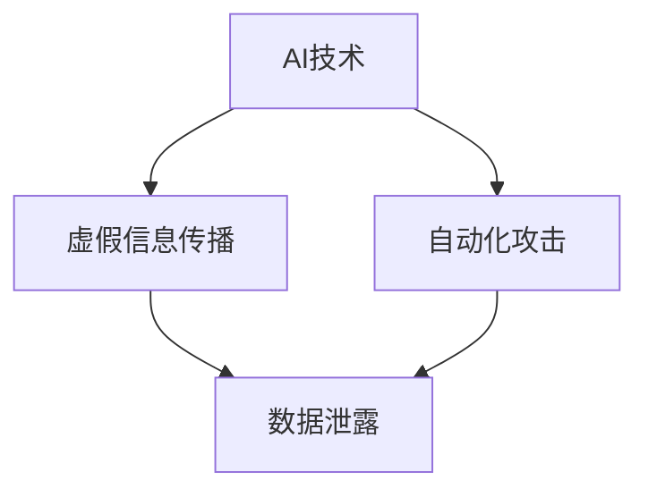

                 

### 第1章: 信息安全面临的新挑战

**1.1 AI时代信息安全的重要性**

在信息化和数字化迅速发展的今天，信息安全已经成为社会稳定和经济发展的基石。随着人工智能（AI）技术的不断进步，信息安全面临的新挑战愈发严峻。AI不仅改变了我们的生活方式，也在信息安全领域引发了革命性的变革。

**核心概念**

首先，让我们明确几个核心概念。信息安全是指保护信息资产免受未经授权的访问、使用、披露、破坏、修改或破坏。AI技术则是指通过模拟人类智能行为，实现机器学习和智能决策的技术。

**概念属性特征对比表格**

为了更直观地理解AI时代信息安全与传统信息安全的区别，我们可以通过以下特征对比表格来展示：

| 特征               | 传统信息安全           | AI时代信息安全           |
|--------------------|------------------------|--------------------------|
| 面临的威胁         | 网络入侵、数据泄露等    | 虚假信息传播、自动化攻击等 |
| 技术手段           | 防火墙、加密等         | 大数据、人工智能等       |
| 管理方式           | 规范操作、权限管理等     | 主动防御、智能监控等     |

**ER实体关系图架构的 Mermaid 流程图**

接下来，我们可以通过Mermaid流程图来展示AI技术对信息安全的影响：



在这个流程图中，AI技术引发了虚假信息传播和自动化攻击，最终可能导致数据泄露。

**ER实体关系图架构的 Mermaid 流程图**

我们还可以通过ER实体关系图来展示信息安全的核心要素及其相互关系：

```mermaid
erDiagram
  User ||--|{ Data }|>
  Data ||--|{ Threat }|>
  Threat ||--|{ Countermeasure }|>
  Countermeasure ||--|{ Security }|>
```

这个ER图描述了用户、数据、威胁、应对措施和信息安全之间的相互关系。

**1.2 AI技术对信息安全的影响**

AI技术的快速发展不仅改变了信息安全的威胁形式，也提升了防范和应对这些威胁的能力。AI技术对信息安全的影响主要体现在以下几个方面：

- **自动化攻击**：AI能够自动化执行复杂攻击，如自动化钓鱼攻击、恶意软件生成等。
- **虚假信息传播**：AI能够生成高度逼真的虚假信息，使得辨别真伪更加困难。
- **个性化攻击**：AI能够根据用户行为和偏好进行个性化攻击，提高攻击的成功率。

**数学模型和数学公式**

为了更好地理解AI技术在信息安全中的应用，我们可以借助概率论中的贝叶斯公式来分析。假设AI系统能够以80%的概率检测出虚假信息，而系统误报的概率为5%。当检测到一个信息时，如何确定其为虚假信息的概率，我们可以使用以下公式：

$$
P(\text{虚假信息}| \text{检测结果}) = \frac{P(\text{检测结果}|\text{虚假信息})P(\text{虚假信息})}{P(\text{检测结果})}
$$

其中，$P(\text{虚假信息})$ 是虚假信息的先验概率，$P(\text{检测结果}|\text{虚假信息})$ 是在虚假信息存在时检测结果的概率，$P(\text{检测结果})$ 是检测结果的总概率。

**1.3 虚假信息安全的定义与特征**

虚假信息安全是指在AI时代，由于AI技术的滥用导致的信息完整性问题。虚假信息安全具有以下特征：

- **高度逼真**：AI生成的虚假信息难以通过传统方法识别，具有高度逼真性。
- **广泛传播**：虚假信息可以通过AI技术快速传播，影响范围广泛。
- **难以追溯**：虚假信息的来源和传播路径复杂，难以追溯。

**概念属性特征对比表格**

为了更清晰地展示虚假信息安全与传统虚假信息之间的差异，我们可以使用以下特征对比表格：

| 特征             | 传统虚假信息           | AI时代的虚假信息           |
|------------------|------------------------|---------------------------|
| 来源             | 人类有意传播           | 人工智能自动生成           |
| 形式             | 文字、图片、视频等      | 文本生成、图像生成、音频生成等 |
| 传播途径         | 社交媒体、电子邮件等    | 大数据平台、自动化机器人等   |
| 识别难度         | 较高                   | 极高                      |
| 害影响           | 资产损失、声誉受损等    | 社会影响、经济危机等       |

通过上述分析，我们可以看到AI时代信息安全面临的新挑战。在下一章中，我们将深入探讨AI时代信息安全的核心概念与原理。

