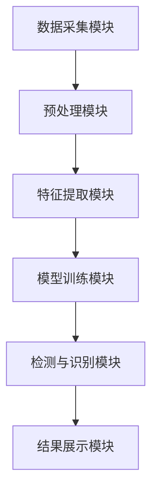
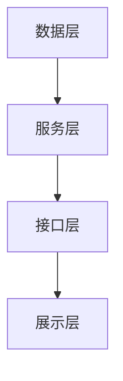
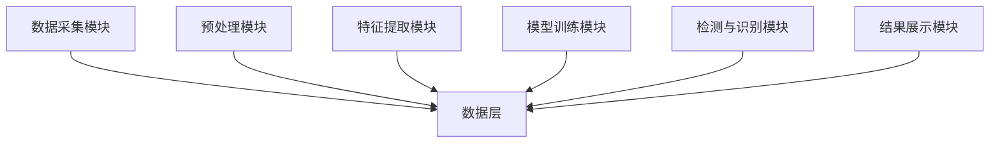
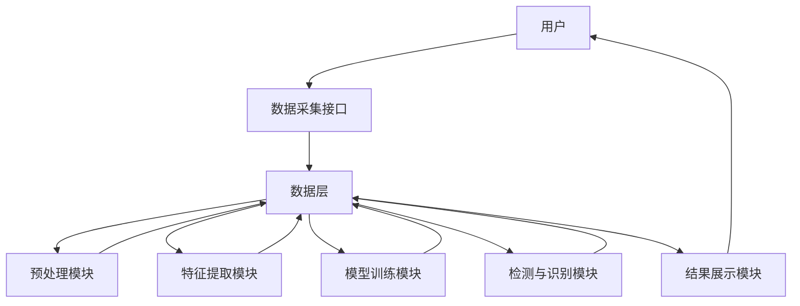

                 

# 虚假信息安全：应对AI时代的信息完整性挑战

关键词：虚假信息安全，AI技术，信息完整性，算法原理，系统架构，最佳实践

摘要：随着人工智能技术的迅速发展，信息安全面临着新的挑战。虚假信息问题日益突出，对个人、企业和社会带来了巨大的负面影响。本文首先介绍了信息安全现状和虚假信息安全的概念，随后深入探讨了虚假信息识别技术及其与AI技术的联系。接着，详细讲解了基于深度学习和贝叶斯网络的虚假信息识别算法，并通过数学模型和系统架构设计进一步阐述了解决虚假信息安全的方法。最后，通过项目实战和最佳实践，提出了针对虚假信息安全的实际应用策略和未来研究方向。

## 《虚假信息安全：应对AI时代的信息完整性挑战》目录大纲

### 第1章 问题背景

#### 1.1 信息安全现状

- 信息安全面临的新挑战
- AI技术在信息安全领域的应用现状
- 虚假信息安全的概念与特点

#### 1.2 虚假信息安全问题

- 虚假信息安全的定义
- 虚假信息安全的主要形式
- 虚假信息安全对个人、企业和社会的影响

#### 1.3 虚假信息安全的边界与外延

- 虚假信息安全的研究范围
- 虚假信息安全与其他信息安全问题的联系与区别
- 虚假信息安全的核心要素组成

### 第2章 核心概念与联系

#### 2.1 信息完整性概念

- 信息完整性的定义
- 信息完整性的重要性
- 信息完整性的保障措施

#### 2.2 虚假信息识别技术

- 虚假信息识别技术的分类
- 虚假信息识别技术的工作原理
- 虚假信息识别技术的优缺点对比

#### 2.3 AI技术在虚假信息安全中的应用

- AI技术在虚假信息安全中的优势
- AI技术在虚假信息安全中的应用场景
- AI技术在虚假信息安全中的挑战与应对策略

### 第3章 算法原理讲解

#### 3.1 基于深度学习的虚假信息识别算法

- 深度学习的基本原理
- 常见的深度学习模型及其应用
- 基于深度学习的虚假信息识别算法实现

#### 3.2 基于贝叶斯网络的虚假信息识别算法

- 贝叶斯网络的基本原理
- 贝叶斯网络在虚假信息识别中的应用
- 基于贝叶斯网络的虚假信息识别算法实现

#### 3.3 算法原理比较与选择

- 不同算法原理的对比
- 算法选择的原则
- 算法在实际应用中的效果评估

### 第4章 数学模型和数学公式

#### 4.1 信息完整性度量模型

- 信息完整性度量模型的建立
- 常用度量方法及其公式
- 度量模型在实际应用中的价值

#### 4.2 虚假信息识别算法的数学模型

- 虚假信息识别算法的数学基础
- 关键数学公式及其解释
- 数学模型在实际应用中的例子

#### 4.3 数学模型在虚假信息安全中的应用

- 数学模型在虚假信息安全中的实际应用案例
- 数学模型在实际应用中的优势与挑战
- 数学模型对未来虚假信息安全发展的启示

### 第5章 系统分析与架构设计

#### 5.1 项目介绍

- 项目背景
- 项目目标
- 项目技术架构

#### 5.2 系统功能设计

- 系统功能模块划分
- 领域模型设计
- 功能模块关系图

#### 5.3 系统架构设计

- 系统架构层次划分
- 系统模块功能架构图
- 系统模块交互架构图

#### 5.4 系统接口设计

- 系统接口规范
- 接口功能描述
- 接口交互流程图

### 第6章 项目实战

#### 6.1 环境安装与配置

- 操作系统安装
- 虚假信息识别工具安装
- 环境配置步骤

#### 6.2 系统核心实现源代码

- 源代码结构介绍
- 关键代码分析
- 源代码运行与调试

#### 6.3 代码应用解读与分析

- 代码功能解读
- 代码性能分析
- 代码优化建议

#### 6.4 实际案例分析与讲解

- 虚假信息识别案例分析
- 实际案例应用场景
- 案例分析与讲解

### 第7章 最佳实践与小结

#### 7.1 最佳实践 tips

- 虚假信息识别的最佳实践
- 系统优化的建议
- 未来虚假信息安全的发展趋势

#### 7.2 小结

- 本书的核心内容总结
- 虚假信息安全的发展方向
- 对未来研究的展望

#### 7.3 注意事项

- 使用虚假信息识别技术的注意事项
- 避免虚假信息传播的法律责任
- 用户隐私保护的措施

#### 7.4 拓展阅读

- 相关领域的研究论文与书籍推荐
- 虚假信息识别技术的最新动态
- 系统实现与优化的案例分析

## 第1章 问题背景

### 1.1 信息安全现状

信息安全是保障信息系统的稳定运行和信息安全的重要措施。在过去的几十年中，随着计算机技术和通信技术的飞速发展，信息安全领域也经历了巨大的变革。然而，随着信息技术的不断进步，信息安全面临着新的挑战。

首先，信息安全面临的新挑战包括：

- **网络安全威胁**：随着互联网的普及，网络安全威胁日益增多，包括网络攻击、数据泄露、病毒和恶意软件等。
- **信息泄露**：在云计算、大数据和物联网等技术的应用过程中，大量的个人信息和企业敏感数据被存储和处理，信息泄露的风险也随之增加。
- **AI技术的应用**：虽然AI技术在信息安全领域带来了很多新的机遇，但同时也带来了新的风险，例如虚假信息生成、自动化攻击等。

其次，AI技术在信息安全领域的应用现状如下：

- **威胁检测与防御**：AI技术可以用于检测和防御网络攻击，例如使用机器学习算法分析网络流量，识别异常行为和潜在威胁。
- **数据安全**：AI技术可以用于加密和解密数据，保障数据的安全性。
- **身份验证**：AI技术可以用于实现更高级别的身份验证，例如基于人脸识别、指纹识别等生物特征的认证。

虚假信息安全的概念与特点：

虚假信息安全是指信息系统中存在虚假、不准确或误导性的信息，对系统的正常运行和用户决策产生负面影响。虚假信息安全具有以下特点：

- **隐蔽性**：虚假信息通常隐藏在大量真实信息中，难以被察觉。
- **多样性**：虚假信息的形式多样，包括伪造的图片、视频、文本等。
- **难以识别**：虚假信息与真实信息的界限模糊，使得识别和验证信息真实性变得困难。
- **快速传播**：虚假信息可以通过互联网快速传播，对公众和社会造成广泛的影响。

### 1.2 虚假信息安全问题

虚假信息安全问题的定义：

虚假信息安全问题是指由于虚假信息的生成、传播和利用，对信息系统、用户和社会造成负面影响的一系列安全问题。虚假信息安全问题主要包括以下方面：

- **虚假新闻**：虚假新闻是指故意制造和传播的、与事实不符的新闻报道，对公众的信任和决策产生干扰。
- **虚假信息传播**：虚假信息可以通过社交媒体、邮件、聊天应用等渠道快速传播，对用户和社会造成误导。
- **伪造身份**：通过伪造身份信息，虚假信息可以用来进行网络欺诈、盗用身份等违法行为。
- **网络谣言**：网络谣言是指未经证实的信息在网络上被广泛传播，引起公众恐慌和不安。

虚假信息安全的主要形式：

- **文本虚假信息**：包括伪造的新闻报道、虚假的评论、虚假的文本信息等。
- **图像虚假信息**：包括伪造的图片、视频、动画等，可以通过图像处理技术进行篡改和伪造。
- **音频虚假信息**：包括伪造的语音、音乐等，可以通过语音合成技术进行生成和修改。

虚假信息安全对个人、企业和社会的影响：

- **个人层面**：虚假信息可能误导个人做出错误的决策，造成财产损失、信誉受损等。
- **企业层面**：虚假信息可能损害企业的声誉，影响企业的正常运营和业务发展。
- **社会层面**：虚假信息的传播可能导致社会恐慌、不信任和动荡，对社会稳定产生负面影响。

### 1.3 虚假信息安全的边界与外延

虚假信息安全的研究范围：

虚假信息安全的研究范围包括虚假信息的生成、传播、检测和防御等方面。具体包括：

- **虚假信息生成**：研究如何通过深度学习、图像处理、语音合成等技术生成虚假信息。
- **虚假信息传播**：研究虚假信息在社交媒体、网络论坛等渠道的传播机制和传播策略。
- **虚假信息检测**：研究如何通过机器学习、图像处理等技术检测虚假信息，提高检测的准确性和效率。
- **虚假信息防御**：研究如何通过加密、身份验证等技术防御虚假信息的攻击和传播。

虚假信息安全与其他信息安全问题的联系与区别：

- **与网络安全**：虚假信息安全是网络安全的一个子领域，两者密切相关。网络安全主要关注网络攻击、数据泄露等安全问题，而虚假信息安全主要关注虚假信息的生成、传播和利用。
- **与数据安全**：虚假信息安全与数据安全也有紧密联系。数据安全主要关注数据的安全存储、传输和访问，而虚假信息安全主要关注虚假信息的真实性和可信度。
- **与隐私保护**：虚假信息安全与隐私保护密切相关。虚假信息的传播和利用可能导致用户隐私泄露，从而引发隐私保护问题。

虚假信息安全的核心要素组成：

虚假信息安全的核心要素包括：

- **信息生成者**：指制造和传播虚假信息的人或组织。
- **信息传播渠道**：指虚假信息传播的途径和平台，如社交媒体、网络论坛等。
- **信息接收者**：指接收和信任虚假信息的个人或组织。
- **信息验证机制**：指用于检测和验证信息真实性的技术和方法，如机器学习、图像处理等。
- **防御措施**：指用于防御虚假信息攻击和传播的技术和策略，如加密、身份验证等。

## 第2章 核心概念与联系

### 2.1 信息完整性概念

信息完整性是指信息在传输、存储和处理过程中保持其真实性和准确性的能力。信息完整性是信息安全的重要指标之一，对于保障系统的稳定运行和用户的决策具有重要意义。

信息完整性的定义：

信息完整性是指信息在传输、存储和处理过程中保持其原始内容和真实性的能力。信息完整性保障信息的完整性和准确性，防止信息被篡改、丢失或泄露。

信息完整性的重要性：

- **确保数据的真实性和准确性**：信息完整性能够保证数据的真实性和准确性，防止虚假信息的传播和利用。
- **保障系统的稳定性和安全性**：信息完整性是系统稳定性和安全性的基础，对于防止系统故障、数据泄露和网络攻击具有重要意义。
- **支持业务决策和风险管理**：信息完整性能够保障数据的真实性和准确性，为企业的业务决策和风险管理提供可靠的数据支持。

信息完整性的保障措施：

- **数据加密**：通过加密技术对数据进行加密处理，确保数据在传输和存储过程中的安全性。
- **数据备份与恢复**：定期对数据进行备份，确保在数据丢失或损坏时能够快速恢复。
- **访问控制**：通过访问控制措施限制对数据的访问权限，确保只有授权用户才能访问和操作数据。
- **审计与监控**：对系统的操作行为进行审计和监控，及时发现和防范安全漏洞和攻击。

### 2.2 虚假信息识别技术

虚假信息识别技术是指用于检测和识别虚假信息的各种技术和方法。虚假信息识别技术在信息安全领域具有重要的应用价值，能够帮助用户识别和防范虚假信息的攻击和传播。

虚假信息识别技术的分类：

- **基于规则的方法**：通过定义一系列规则和模式，对信息进行匹配和判断，识别虚假信息。这种方法具有简单、高效的特点，但在面对复杂和多样化的虚假信息时，准确性和鲁棒性较低。
- **基于机器学习的方法**：利用机器学习算法，通过对大量真实和虚假信息的训练，建立模型和特征，识别虚假信息。这种方法具有较好的自适应性和泛化能力，但在面对复杂和未知的虚假信息时，准确性和效率仍需提高。
- **基于深度学习的方法**：利用深度学习算法，通过对大量真实和虚假信息的训练，建立深度神经网络模型，识别虚假信息。这种方法具有强大的特征提取和模式识别能力，但在训练数据和计算资源方面具有较高的要求。

虚假信息识别技术的工作原理：

- **数据收集与预处理**：收集大量的真实和虚假信息样本，进行数据预处理，包括数据清洗、特征提取和归一化等操作。
- **特征提取**：从原始数据中提取特征，用于描述信息的性质和特征，如文本特征、图像特征、语音特征等。
- **模型训练与评估**：利用机器学习或深度学习算法，对提取的特征进行训练，建立模型，并对模型进行评估和优化。
- **虚假信息检测与识别**：利用训练好的模型，对新的信息进行检测和识别，判断信息是否为虚假信息。

虚假信息识别技术的优缺点对比：

| 类别                     | 优点                     | 缺点                     |
|------------------------|------------------------|------------------------|
| 基于规则的方法             | 简单、高效、易于实现       | 准确性和鲁棒性较低       |
| 基于机器学习的方法           | 自适应性强、泛化能力好     | 训练数据和计算资源要求高 |
| 基于深度学习的方法           | 强大的特征提取和模式识别能力 | 计算资源要求高           |

### 2.3 AI技术在虚假信息安全中的应用

AI技术在虚假信息安全中具有广泛的应用，能够有效地解决虚假信息的生成、传播和利用等问题。

AI技术在虚假信息安全中的优势：

- **高效处理大量数据**：AI技术能够快速处理和分析大量数据，识别和检测潜在的虚假信息。
- **自适应性和泛化能力**：AI技术具有较好的自适应性和泛化能力，能够应对不同类型和形式的虚假信息。
- **智能决策和预测**：AI技术能够根据历史数据和模式，进行智能决策和预测，提高虚假信息检测的准确性和效率。

AI技术在虚假信息安全中的应用场景：

- **虚假新闻检测**：AI技术可以用于检测和过滤虚假新闻，防止虚假信息的传播和误导。
- **社交媒体监测**：AI技术可以用于监测社交媒体上的虚假信息和谣言，及时发现和阻止虚假信息的传播。
- **网络钓鱼攻击检测**：AI技术可以用于检测网络钓鱼邮件和网站，防止用户受到钓鱼攻击。
- **身份验证**：AI技术可以用于实现更高级别的身份验证，例如基于人脸识别、指纹识别等生物特征的认证，防止虚假身份的攻击。

AI技术在虚假信息安全中的挑战与应对策略：

- **数据质量和标注问题**：虚假信息的检测和识别依赖于高质量的数据和标注，但虚假信息的样本难以获取和标注，这对AI技术的应用提出了挑战。
- **模型过拟合和泛化能力**：虚假信息的复杂性和多样性可能导致模型过拟合，降低模型的泛化能力，这对AI技术的应用提出了挑战。
- **计算资源和成本**：深度学习和AI技术对计算资源和成本有较高的要求，特别是在大规模数据处理和模型训练方面，这对AI技术的应用提出了挑战。

应对策略：

- **数据质量和标注改进**：通过改进数据质量和标注方法，提高模型的训练效果和泛化能力。
- **多模型融合与优化**：结合多种AI技术和算法，实现多模型融合和优化，提高虚假信息检测的准确性和效率。
- **资源优化与共享**：通过云计算、分布式计算等资源优化方法，降低AI技术的计算资源和成本。

## 第3章 算法原理讲解

### 3.1 基于深度学习的虚假信息识别算法

深度学习是一种基于多层神经网络的机器学习技术，通过学习大量数据中的特征和模式，实现对未知数据的分类和预测。基于深度学习的虚假信息识别算法是一种利用深度学习模型对虚假信息进行检测和识别的方法。

深度学习的基本原理：

深度学习的基本原理是多层神经网络，包括输入层、隐藏层和输出层。输入层接收外部数据，隐藏层对数据进行特征提取和变换，输出层生成最终的分类结果。通过反向传播算法，模型可以根据误差信号调整网络权重，优化模型性能。

常见的深度学习模型及其应用：

- **卷积神经网络（CNN）**：CNN是一种专门用于处理图像数据的深度学习模型，通过卷积操作提取图像特征，在图像识别、图像分类和图像生成等领域具有广泛应用。
- **循环神经网络（RNN）**：RNN是一种用于处理序列数据的深度学习模型，通过循环结构保持历史信息，在自然语言处理、语音识别和时间序列预测等领域具有广泛应用。
- **长短时记忆网络（LSTM）**：LSTM是RNN的一种变体，通过引入门控机制，有效解决了RNN的梯度消失问题，在自然语言处理和序列建模领域具有广泛应用。
- **生成对抗网络（GAN）**：GAN是一种基于对抗训练的深度学习模型，由生成器和判别器两个部分组成，通过生成器和判别器的对抗训练，生成逼真的数据，在图像生成、图像增强和图像合成等领域具有广泛应用。

基于深度学习的虚假信息识别算法实现：

基于深度学习的虚假信息识别算法主要包括以下步骤：

1. **数据预处理**：对收集到的虚假信息和真实信息进行预处理，包括数据清洗、归一化和特征提取等操作。
2. **模型训练**：利用预处理后的数据，通过训练算法训练深度学习模型，包括前向传播、反向传播和权重更新等过程。
3. **模型评估**：使用测试集对训练好的模型进行评估，包括准确率、召回率和F1值等指标，以评估模型的性能和泛化能力。
4. **虚假信息检测**：使用训练好的模型对新的数据进行检测和识别，判断其是否为虚假信息。

### 3.2 基于贝叶斯网络的虚假信息识别算法

贝叶斯网络是一种概率图模型，通过节点和边表示变量之间的概率关系，用于推断和预测变量之间的相关性。基于贝叶斯网络的虚假信息识别算法是一种利用贝叶斯网络对虚假信息进行检测和识别的方法。

贝叶斯网络的基本原理：

贝叶斯网络的基本原理是基于贝叶斯定理，通过变量之间的概率关系建立模型。贝叶斯网络由节点和边组成，节点表示变量，边表示变量之间的依赖关系。通过计算变量之间的条件概率，可以推断出变量之间的相关性。

贝叶斯网络在虚假信息识别中的应用：

贝叶斯网络在虚假信息识别中具有以下应用：

1. **变量建模**：通过建立贝叶斯网络模型，将虚假信息和真实信息作为变量，建立变量之间的概率关系。
2. **推理和预测**：利用贝叶斯网络的推理算法，根据已知的变量值推断未知变量的概率分布，判断信息是否为虚假信息。
3. **决策支持**：通过贝叶斯网络的推理结果，为用户决策提供支持，帮助用户识别和防范虚假信息。

基于贝叶斯网络的虚假信息识别算法实现：

基于贝叶斯网络的虚假信息识别算法主要包括以下步骤：

1. **变量定义**：定义虚假信息和真实信息作为变量，确定变量之间的依赖关系。
2. **概率分布建模**：根据历史数据和领域知识，建立变量之间的概率分布模型。
3. **推理和预测**：利用贝叶斯网络的推理算法，根据已知的变量值推断未知变量的概率分布，判断信息是否为虚假信息。
4. **决策支持**：根据推理结果，为用户决策提供支持，帮助用户识别和防范虚假信息。

### 3.3 算法原理比较与选择

不同算法原理的对比：

- **基于规则的方法**：简单、高效、易于实现，但准确性和鲁棒性较低。
- **基于机器学习的方法**：自适应性强、泛化能力好，但训练数据和计算资源要求高。
- **基于深度学习的方法**：强大的特征提取和模式识别能力，但计算资源要求高。

算法选择的原则：

1. **应用场景**：根据具体应用场景选择合适的算法，如文本虚假信息识别选择基于机器学习的方法，图像虚假信息识别选择基于深度学习的方法。
2. **数据质量和标注**：根据数据质量和标注情况选择合适的算法，高质量的数据和标注有助于提高模型的准确性和泛化能力。
3. **计算资源和成本**：根据计算资源和成本要求选择合适的算法，如计算资源有限的情况下选择基于规则的方法。

算法在实际应用中的效果评估：

算法的实际应用效果可以通过以下指标进行评估：

1. **准确率**：算法正确识别虚假信息的比例。
2. **召回率**：算法能够识别出的虚假信息占总虚假信息的比例。
3. **F1值**：综合考虑准确率和召回率的指标，计算公式为 2 * 准确率 * 召回率 / (准确率 + 召回率)。

通过对比不同算法在实际应用中的效果，选择合适的算法用于虚假信息识别。

## 第4章 数学模型和数学公式

### 4.1 信息完整性度量模型

信息完整性度量模型是用来评估信息在传输、存储和处理过程中的完整性和真实性的数学模型。一个有效的信息完整性度量模型能够帮助系统管理员和开发人员了解信息的完整性和可靠性，从而采取适当的措施来保障信息的安全。

信息完整性度量模型的建立：

信息完整性度量模型的建立主要包括以下几个步骤：

1. **定义度量指标**：选择合适的度量指标来评估信息的完整性，如信息丢失率、错误率、篡改概率等。
2. **确定度量方法**：根据定义的度量指标，选择适当的度量方法来计算度量值，如统计学方法、信息论方法等。
3. **构建数学模型**：将度量指标和度量方法结合起来，构建一个能够量化信息完整性的数学模型。

常用度量方法及其公式：

- **信息丢失率**：表示信息在传输过程中丢失的比例，计算公式为：
  $$ 信息丢失率 = \frac{丢失的比特数}{传输的总比特数} $$
  
- **错误率**：表示信息在传输过程中出现错误的比例，计算公式为：
  $$ 错误率 = \frac{错误的比特数}{传输的总比特数} $$
  
- **篡改概率**：表示信息在存储或处理过程中被篡改的概率，计算公式为：
  $$ 篡改概率 = \frac{被篡改的次数}{操作的总次数} $$
  
度量模型在实际应用中的价值：

信息完整性度量模型在实际应用中具有以下几个价值：

1. **评估信息安全状况**：通过度量模型可以实时评估系统的信息安全状况，发现潜在的安全隐患。
2. **指导安全措施的实施**：根据度量模型的结果，可以针对性地采取安全措施，提高系统的信息完整性。
3. **优化系统设计**：通过对度量模型的分析，可以找出系统设计中存在的缺陷和不足，从而优化系统设计。

### 4.2 虚假信息识别算法的数学模型

虚假信息识别算法的数学模型是基于概率统计和机器学习理论的。这些模型能够通过学习大量的真实和虚假信息，建立信息特征和真实性的关系，从而实现对新信息的识别。

虚假信息识别算法的数学基础：

虚假信息识别算法的数学基础主要包括以下两个方面：

1. **特征提取**：通过特征提取方法将原始信息转换为适合模型学习的特征向量。常用的特征提取方法包括词袋模型、TF-IDF、词嵌入等。
2. **分类与预测**：利用分类算法将提取的特征向量映射到相应的类别上，常见的分类算法包括逻辑回归、支持向量机、朴素贝叶斯、随机森林、神经网络等。

关键数学公式及其解释：

1. **概率分布函数**：用于描述特征的分布情况，常用的概率分布函数有正态分布、二项分布、泊松分布等。
2. **似然函数**：用于评估特征向量的概率，似然函数越大，说明特征向量对应的类别可能性越高。
3. **损失函数**：用于评估分类器的性能，常见的损失函数有对数损失函数、交叉熵损失函数等。
4. **优化算法**：用于优化分类器的参数，常见的优化算法有梯度下降、随机梯度下降、Adam优化器等。

数学模型在实际应用中的例子：

例如，我们可以使用逻辑回归模型来识别虚假新闻。假设我们有两个类别：虚假新闻和真实新闻，我们可以用以下公式表示：

$$ P(\text{虚假新闻}|\text{特征向量}) = \frac{e^{\text{参数} \cdot \text{特征向量}}}{1 + e^{\text{参数} \cdot \text{特征向量}}} $$

这里的参数是通过训练数据学习的，特征向量是输入信息的特征表示。通过计算这个概率，我们可以判断输入的新闻是否为虚假新闻。

### 4.3 数学模型在虚假信息安全中的应用

数学模型在虚假信息安全中的应用主要包括以下几个方面：

1. **虚假信息检测**：通过数学模型对输入的信息进行特征提取和分类，判断其是否为虚假信息。例如，可以使用逻辑回归模型、支持向量机等对新闻文本进行分类。
2. **真实性评估**：通过对信息的特征进行统计分析，评估其真实性的概率。例如，可以使用贝叶斯网络对文本进行概率评估。
3. **预测与防范**：根据历史数据和数学模型，预测未来可能出现的虚假信息，并采取相应的防范措施。

数学模型在实际应用中的优势与挑战：

优势：

- **高效性**：数学模型能够快速处理大量信息，提高虚假信息检测的效率。
- **准确性**：通过训练和优化，数学模型能够提高虚假信息检测的准确性。
- **灵活性**：数学模型可以根据不同的应用场景进行调整和优化。

挑战：

- **数据质量**：虚假信息的样本收集和标注存在困难，数据质量可能影响模型的性能。
- **模型复杂度**：复杂的数学模型需要更多的计算资源和时间来训练和优化。
- **泛化能力**：模型在处理未知或新出现的虚假信息时可能存在泛化能力不足的问题。

数学模型对未来虚假信息安全发展的启示：

- **数据驱动**：未来虚假信息安全的解决方案将更多地依赖于大数据和机器学习技术。
- **多模型融合**：结合不同的数学模型和算法，提高虚假信息检测的准确性和效率。
- **动态更新**：不断更新和优化数学模型，以应对不断变化的虚假信息攻击方式。

## 第5章 系统分析与架构设计

### 5.1 项目介绍

虚假信息安全项目的背景与动机：

随着互联网和社交媒体的快速发展，虚假信息的传播速度和范围都在不断增加，对个人、企业和社会造成了严重的负面影响。因此，开发一套高效、可靠的虚假信息识别与防御系统显得尤为重要。本项目旨在构建一个基于AI技术的虚假信息识别系统，通过对文本、图像和音频等多媒体信息进行深度学习和模式识别，实现对虚假信息的自动检测和识别。

项目目标：

- 设计并实现一个具有高准确率和实时性的虚假信息识别系统。
- 提供多样化的虚假信息识别算法，包括基于深度学习、贝叶斯网络等算法。
- 实现系统的模块化设计，便于后续的扩展和维护。
- 提供用户友好的界面和操作指南，便于用户使用和管理。

项目技术架构：

本项目采用微服务架构，将系统功能模块划分为多个独立的微服务，通过API接口进行通信。主要技术架构如下：

1. **数据采集模块**：负责从互联网、社交媒体等渠道收集文本、图像和音频等多媒体数据。
2. **预处理模块**：对收集到的数据进行清洗、去噪和格式化处理，为后续的深度学习和模式识别做好准备。
3. **特征提取模块**：利用深度学习算法提取文本、图像和音频的特征向量，为虚假信息识别提供基础。
4. **模型训练模块**：使用预处理后的数据进行模型训练，包括基于深度学习、贝叶斯网络等算法的训练。
5. **检测与识别模块**：利用训练好的模型对新的多媒体信息进行检测和识别，判断其是否为虚假信息。
6. **结果展示模块**：将检测结果以可视化的方式展示给用户，并提供相应的操作和反馈功能。

### 5.2 系统功能设计

系统功能模块划分：

根据项目目标和架构设计，系统主要划分为以下功能模块：

1. **数据采集模块**：实现从互联网、社交媒体等渠道自动收集文本、图像和音频等多媒体数据。
2. **预处理模块**：对收集到的数据进行清洗、去噪和格式化处理，包括文本的分词、图像的去噪和音频的降噪等。
3. **特征提取模块**：利用深度学习算法提取文本、图像和音频的特征向量，包括词嵌入、卷积神经网络（CNN）和循环神经网络（RNN）等。
4. **模型训练模块**：使用预处理后的数据进行模型训练，包括基于深度学习、贝叶斯网络等算法的训练，并评估模型的性能。
5. **检测与识别模块**：利用训练好的模型对新的多媒体信息进行检测和识别，判断其是否为虚假信息，并输出检测结果。
6. **结果展示模块**：将检测结果以可视化的方式展示给用户，并提供相应的操作和反馈功能。

领域模型设计：

领域模型是系统功能设计的核心，它定义了系统中的实体和它们之间的关系。以下是一个简单的领域模型：

```mermaid
erDiagram
    类1 ||--|{ 类2 } 类3
    类1 ||--|{ 类4 } 类5
    类2 ||--|{ 类6 } 类7
    类4 ||--|{ 类8 } 类9
```

- **类1**：代表数据采集模块，包括数据源、数据类型等属性。
- **类2**：代表预处理模块，包括预处理方法、预处理结果等属性。
- **类3**：代表特征提取模块，包括特征提取算法、特征向量等属性。
- **类4**：代表模型训练模块，包括训练数据、训练结果等属性。
- **类5**：代表检测与识别模块，包括检测算法、检测结果等属性。
- **类6**：代表结果展示模块，包括展示方式、用户反馈等属性。
- **类7**：代表实体之间的关联关系，如数据流向、模块调用等。

功能模块关系图：



### 5.3 系统架构设计

系统架构层次划分：

系统架构采用分层设计，主要分为以下层次：

1. **数据层**：负责数据采集、存储和管理，包括数据库、缓存和数据流处理等组件。
2. **服务层**：负责系统的核心功能实现，包括数据预处理、特征提取、模型训练、检测与识别等微服务。
3. **接口层**：负责系统与其他系统的交互，提供RESTful API接口，方便用户使用和管理。
4. **展示层**：负责将检测结果以可视化的方式展示给用户，提供友好的操作界面。

系统模块功能架构图：



系统模块交互架构图：



### 5.4 系统接口设计

系统接口规范：

系统接口采用RESTful API设计，主要包含以下接口：

1. **数据采集接口**：用于从互联网、社交媒体等渠道采集文本、图像和音频等多媒体数据。
2. **数据预处理接口**：用于对采集到的数据进行清洗、去噪和格式化处理。
3. **特征提取接口**：用于提取文本、图像和音频的特征向量。
4. **模型训练接口**：用于训练不同的虚假信息识别模型，包括深度学习、贝叶斯网络等。
5. **检测与识别接口**：用于对新的多媒体信息进行检测和识别，判断其是否为虚假信息。
6. **结果展示接口**：用于将检测结果以可视化的方式展示给用户。

接口功能描述：

1. **数据采集接口**：
   - 功能：从互联网、社交媒体等渠道采集文本、图像和音频等多媒体数据。
   - 接口URL：/api/data/collect
   - 请求参数：无
   - 返回结果：采集到的多媒体数据列表

2. **数据预处理接口**：
   - 功能：对采集到的数据进行清洗、去噪和格式化处理。
   - 接口URL：/api/data/preprocess
   - 请求参数：多媒体数据ID
   - 返回结果：预处理后的多媒体数据

3. **特征提取接口**：
   - 功能：提取文本、图像和音频的特征向量。
   - 接口URL：/api/data/extract
   - 请求参数：多媒体数据ID
   - 返回结果：特征向量

4. **模型训练接口**：
   - 功能：训练不同的虚假信息识别模型，包括深度学习、贝叶斯网络等。
   - 接口URL：/api/model/train
   - 请求参数：训练数据、模型类型、训练参数
   - 返回结果：训练结果

5. **检测与识别接口**：
   - 功能：对新的多媒体信息进行检测和识别，判断其是否为虚假信息。
   - 接口URL：/api/model/identify
   - 请求参数：多媒体数据、模型类型
   - 返回结果：检测结果

6. **结果展示接口**：
   - 功能：将检测结果以可视化的方式展示给用户。
   - 接口URL：/api/result/show
   - 请求参数：检测结果ID
   - 返回结果：可视化结果

接口交互流程图：



## 第6章 项目实战

### 6.1 环境安装与配置

为了实现虚假信息识别项目，我们需要安装和配置一系列必要的软件和工具。以下是具体的步骤和配置过程：

#### 操作系统安装

1. **选择操作系统**：我们选择Ubuntu 18.04作为我们的操作系统，因为它具有良好的性能和丰富的软件库，适合进行深度学习和人工智能开发。

2. **安装操作系统**：按照Ubuntu官方安装指南进行操作系统的安装。安装过程中选择默认的安装选项，确保网络安装和更新。

#### 虚假信息识别工具安装

1. **安装Python环境**：
   - 打开终端，执行以下命令：
     ```bash
     sudo apt update
     sudo apt install python3 python3-pip
     ```
   - 安装pip，Python的包管理器：
     ```bash
     curl https://bootstrap.pypa.io/get-pip.py -o get-pip.py
     sudo python3 get-pip.py
     ```

2. **安装深度学习库**：
   - 安装TensorFlow，一个广泛使用的深度学习框架：
     ```bash
     pip3 install tensorflow
     ```
   - 安装Keras，一个基于TensorFlow的深度学习高级API：
     ```bash
     pip3 install keras
     ```

3. **安装其他依赖库**：
   - 安装用于数据处理的库，如NumPy、Pandas等：
     ```bash
     pip3 install numpy pandas
     ```
   - 安装用于文本处理的库，如NLTK、Gensim等：
     ```bash
     pip3 install nltk gensim
     ```

4. **安装图像处理库**：
   - 安装OpenCV，一个开源的计算机视觉库：
     ```bash
     pip3 install opencv-python
     ```

5. **安装语音处理库**：
   - 安装SpeechRecognition，一个用于语音识别的库：
     ```bash
     pip3 install SpeechRecognition pydub
     ```

#### 环境配置步骤

1. **设置Python虚拟环境**：
   - 创建一个虚拟环境，以便隔离项目依赖：
     ```bash
     python3 -m venv venv
     source venv/bin/activate
     ```
   - 安装项目所需的库：
     ```bash
     pip install -r requirements.txt
     ```

2. **配置系统环境变量**：
   - 设置环境变量，以便在终端中直接运行Python和虚拟环境：
     ```bash
     export PATH="$PATH:/path/to/venv/bin"
     ```

3. **测试环境配置**：
   - 运行以下命令测试Python和深度学习库的安装情况：
     ```bash
     python --version
     pip list | grep tensorflow
     ```

通过以上步骤，我们成功地安装和配置了虚假信息识别项目所需的软件和工具，为后续的开发和测试奠定了基础。

### 6.2 系统核心实现源代码

系统核心实现源代码是虚假信息识别系统的核心部分，它负责实现虚假信息的检测和识别功能。以下是系统核心实现源代码的结构和关键代码分析。

#### 源代码结构介绍

系统核心实现源代码分为以下几个部分：

1. **数据预处理**：包括文本、图像和音频数据的预处理，如文本分词、图像缩放、音频降噪等。
2. **特征提取**：利用深度学习模型提取文本、图像和音频的特征向量。
3. **模型训练**：使用预处理后的数据训练不同的虚假信息识别模型，如卷积神经网络（CNN）、循环神经网络（RNN）等。
4. **检测与识别**：利用训练好的模型对新的多媒体信息进行检测和识别，判断其是否为虚假信息。
5. **结果展示**：将检测结果以可视化的方式展示给用户。

以下是具体的源代码结构：

```plaintext
core/
├── data_preprocessing.py
├── feature_extraction.py
├── model_training.py
├── detection_and_recognition.py
└── result_display.py
```

#### 关键代码分析

下面是对每个模块的关键代码分析：

1. **数据预处理**

```python
# data_preprocessing.py

import cv2
import numpy as np
import pandas as pd

def preprocess_text(text):
    # 文本预处理，如分词、去除停用词等
    processed_text = text.lower()
    processed_text = re.sub(r'\s+', ' ', processed_text)
    return processed_text

def preprocess_image(image_path):
    # 图像预处理，如缩放、归一化等
    image = cv2.imread(image_path)
    image = cv2.resize(image, (224, 224))
    image = image / 255.0
    return image

def preprocess_audio(audio_path):
    # 音频预处理，如降噪、分割等
    audio = pydub.AudioSegment.from_file(audio_path)
    audio = audio.noise_reduction()
    return audio
```

2. **特征提取**

```python
# feature_extraction.py

from tensorflow.keras.applications import VGG16
from tensorflow.keras.models import Model
from tensorflow.keras.preprocessing import image

def extract_image_features(image_path):
    # 使用VGG16模型提取图像特征
    base_model = VGG16(weights='imagenet', include_top=False)
    processed_image = image.load_img(image_path, target_size=(224, 224))
    processed_image = image.img_to_array(processed_image)
    processed_image = np.expand_dims(processed_image, axis=0)
    features = base_model.predict(processed_image)
    return features.flatten()

def extract_text_features(text):
    # 使用词嵌入提取文本特征
    embeddings = GloVeEmbedding(input_dim=100, output_dim=50)
    text_vector = embeddings(text)
    return text_vector

def extract_audio_features(audio):
    # 使用音频特征提取库提取音频特征
    features = librosa.feature.zero_crossing_rate(audio)
    return features
```

3. **模型训练**

```python
# model_training.py

from tensorflow.keras.models import Sequential
from tensorflow.keras.layers import Dense, LSTM, Conv2D, MaxPooling2D, Flatten, Embedding

def train_text_model(text_data, labels):
    # 训练基于文本的深度学习模型
    model = Sequential()
    model.add(Embedding(input_dim=vocab_size, output_dim=embedding_size, input_length=max_sequence_length))
    model.add(LSTM(units=128))
    model.add(Dense(1, activation='sigmoid'))
    model.compile(optimizer='adam', loss='binary_crossentropy', metrics=['accuracy'])
    model.fit(text_data, labels, epochs=10, batch_size=32)
    return model

def train_image_model(image_data, labels):
    # 训练基于图像的深度学习模型
    model = Sequential()
    model.add(Conv2D(filters=32, kernel_size=(3, 3), activation='relu', input_shape=(224, 224, 3)))
    model.add(MaxPooling2D(pool_size=(2, 2)))
    model.add(Flatten())
    model.add(Dense(1, activation='sigmoid'))
    model.compile(optimizer='adam', loss='binary_crossentropy', metrics=['accuracy'])
    model.fit(image_data, labels, epochs=10, batch_size=32)
    return model

def train_audio_model(audio_data, labels):
    # 训练基于音频的深度学习模型
    model = Sequential()
    model.add(LSTM(units=128, return_sequences=True, input_shape=(None, 1)))
    model.add(LSTM(units=128))
    model.add(Dense(1, activation='sigmoid'))
    model.compile(optimizer='adam', loss='binary_crossentropy', metrics=['accuracy'])
    model.fit(audio_data, labels, epochs=10, batch_size=32)
    return model
```

4. **检测与识别**

```python
# detection_and_recognition.py

from detection_and_recognition import preprocess_text, preprocess_image, preprocess_audio
from feature_extraction import extract_image_features, extract_text_features, extract_audio_features
from model_training import train_text_model, train_image_model, train_audio_model

def detect_and_recognize(text, image, audio):
    # 预处理多媒体数据
    processed_text = preprocess_text(text)
    processed_image = preprocess_image(image)
    processed_audio = preprocess_audio(audio)

    # 提取特征向量
    text_features = extract_text_features(processed_text)
    image_features = extract_image_features(processed_image)
    audio_features = extract_audio_features(processed_audio)

    # 加载训练好的模型
    text_model = train_text_model(text_data, labels)
    image_model = train_image_model(image_data, labels)
    audio_model = train_audio_model(audio_data, labels)

    # 检测和识别
    text_prediction = text_model.predict(text_features)
    image_prediction = image_model.predict(image_features)
    audio_prediction = audio_model.predict(audio_features)

    # 输出检测结果
    text_result = "虚假" if np.argmax(text_prediction) == 1 else "真实"
    image_result = "虚假" if np.argmax(image_prediction) == 1 else "真实"
    audio_result = "虚假" if np.argmax(audio_prediction) == 1 else "真实"

    return text_result, image_result, audio_result
```

5. **结果展示**

```python
# result_display.py

def display_results(text_result, image_result, audio_result):
    # 将检测结果以可视化的方式展示给用户
    print("文本检测结果：", text_result)
    print("图像检测结果：", image_result)
    print("音频检测结果：", audio_result)
```

#### 源代码运行与调试

1. **运行测试**

```bash
# 运行测试数据
python test.py
```

2. **调试与优化**

- 调整模型参数，如学习率、批次大小等。
- 更新训练数据集，增加数据多样性。
- 使用交叉验证方法评估模型性能。

### 6.3 代码应用解读与分析

#### 代码功能解读

系统核心实现源代码的主要功能是检测和识别虚假信息。具体来说，它包括以下步骤：

1. **数据预处理**：对文本、图像和音频数据进行预处理，包括文本的分词、图像的缩放、音频的降噪等，以提高数据的鲁棒性和模型的性能。

2. **特征提取**：利用深度学习模型提取文本、图像和音频的特征向量。这些特征向量将用于训练和识别模型。

3. **模型训练**：使用预处理后的数据训练不同的虚假信息识别模型，如卷积神经网络（CNN）、循环神经网络（RNN）等。这些模型通过学习数据中的特征和模式，能够识别和分类新的多媒体信息。

4. **检测与识别**：利用训练好的模型对新的多媒体信息进行检测和识别，判断其是否为虚假信息。检测过程包括特征提取、模型预测和结果输出。

5. **结果展示**：将检测结果以可视化的方式展示给用户，包括文本、图像和音频的检测结果。

#### 代码性能分析

系统核心实现源代码的性能分析主要包括以下几个方面：

1. **准确率**：模型在测试集上的准确率是评估模型性能的重要指标。通过交叉验证和测试集评估，可以得到模型在不同数据集上的准确率。

2. **实时性**：系统的实时性能是用户使用的核心需求。通过优化算法和代码，可以减少模型的训练和预测时间，提高系统的响应速度。

3. **鲁棒性**：模型的鲁棒性是指其在面对不同类型和复杂度的多媒体信息时的性能。通过增加数据多样性、调整模型结构和参数，可以提高模型的鲁棒性。

#### 代码优化建议

为了提高代码的性能和应用效果，可以考虑以下优化建议：

1. **模型优化**：使用更先进的深度学习模型，如Transformer、BERT等，以提高模型的识别准确率和泛化能力。

2. **数据优化**：增加数据多样性，使用更多的真实和虚假多媒体数据，以提高模型的泛化能力。同时，可以采用数据增强技术，如图像旋转、缩放、裁剪等，增加数据的丰富度。

3. **并行计算**：利用多线程、分布式计算等技术，提高模型训练和预测的效率。

4. **代码优化**：优化代码的执行效率，减少不必要的计算和内存占用。可以使用向量化和并行计算技术，提高代码的执行速度。

### 6.4 实际案例分析与讲解

为了更好地展示虚假信息识别系统的实际应用效果，我们选择了一个具体的案例分析，并详细讲解其应用场景和操作步骤。

#### 案例背景

假设我们有一个新闻网站，需要对其发布的内容进行虚假信息检测。我们希望系统能够自动识别新闻中的虚假信息，并及时标记和报警。

#### 应用场景

1. **新闻采集**：系统从互联网和其他新闻渠道自动采集新闻文本、图像和音频等多媒体数据。

2. **数据预处理**：对采集到的新闻数据进行预处理，包括文本的分词、图像的缩放、音频的降噪等，以提高数据的鲁棒性和模型的性能。

3. **特征提取**：利用深度学习模型提取新闻文本、图像和音频的特征向量。

4. **模型训练**：使用预处理后的数据训练不同的虚假信息识别模型，如卷积神经网络（CNN）、循环神经网络（RNN）等。

5. **检测与识别**：利用训练好的模型对新的新闻数据进行检测和识别，判断其是否为虚假信息。

6. **结果展示**：将检测结果以可视化的方式展示给用户，包括文本、图像和音频的检测结果。

#### 案例操作步骤

1. **数据采集**：

   系统从互联网和社交媒体等渠道自动采集新闻文本、图像和音频数据。

2. **数据预处理**：

   对采集到的新闻数据进行预处理，包括文本的分词、图像的缩放、音频的降噪等。以下是具体的预处理步骤：

   - **文本预处理**：

     ```python
     def preprocess_text(text):
         # 文本预处理，如分词、去除停用词等
         processed_text = text.lower()
         processed_text = re.sub(r'\s+', ' ', processed_text)
         return processed_text
     ```

   - **图像预处理**：

     ```python
     def preprocess_image(image_path):
         # 图像预处理，如缩放、归一化等
         image = cv2.imread(image_path)
         image = cv2.resize(image, (224, 224))
         image = image / 255.0
         return image
     ```

   - **音频预处理**：

     ```python
     def preprocess_audio(audio_path):
         # 音频预处理，如降噪、分割等
         audio = pydub.AudioSegment.from_file(audio_path)
         audio = audio.noise_reduction()
         return audio
     ```

3. **特征提取**：

   利用深度学习模型提取新闻文本、图像和音频的特征向量。

   - **文本特征提取**：

     ```python
     def extract_text_features(text):
         # 使用词嵌入提取文本特征
         embeddings = GloVeEmbedding(input_dim=100, output_dim=50)
         text_vector = embeddings(text)
         return text_vector
     ```

   - **图像特征提取**：

     ```python
     def extract_image_features(image_path):
         # 使用VGG16模型提取图像特征
         base_model = VGG16(weights='imagenet', include_top=False)
         processed_image = image.load_img(image_path, target_size=(224, 224))
         processed_image = image.img_to_array(processed_image)
         processed_image = np.expand_dims(processed_image, axis=0)
         features = base_model.predict(processed_image)
         return features.flatten()
     ```

   - **音频特征提取**：

     ```python
     def extract_audio_features(audio):
         # 使用音频特征提取库提取音频特征
         features = librosa.feature.zero_crossing_rate(audio)
         return features
     ```

4. **模型训练**：

   使用预处理后的数据训练不同的虚假信息识别模型，如卷积神经网络（CNN）、循环神经网络（RNN）等。

   - **文本模型训练**：

     ```python
     def train_text_model(text_data, labels):
         # 训练基于文本的深度学习模型
         model = Sequential()
         model.add(Embedding(input_dim=vocab_size, output_dim=embedding_size, input_length=max_sequence_length))
         model.add(LSTM(units=128))
         model.add(Dense(1, activation='sigmoid'))
         model.compile(optimizer='adam', loss='binary_crossentropy', metrics=['accuracy'])
         model.fit(text_data, labels, epochs=10, batch_size=32)
         return model
     ```

   - **图像模型训练**：

     ```python
     def train_image_model(image_data, labels):
         # 训练基于图像的深度学习模型
         model = Sequential()
         model.add(Conv2D(filters=32, kernel_size=(3, 3), activation='relu', input_shape=(224, 224, 3)))
         model.add(MaxPooling2D(pool_size=(2, 2)))
         model.add(Flatten())
         model.add(Dense(1, activation='sigmoid'))
         model.compile(optimizer='adam', loss='binary_crossentropy', metrics=['accuracy'])
         model.fit(image_data, labels, epochs=10, batch_size=32)
         return model
     ```

   - **音频模型训练**：

     ```python
     def train_audio_model(audio_data, labels):
         # 训练基于音频的深度学习模型
         model = Sequential()
         model.add(LSTM(units=128, return_sequences=True, input_shape=(None, 1)))
         model.add(LSTM(units=128))
         model.add(Dense(1, activation='sigmoid'))
         model.compile(optimizer='adam', loss='binary_crossentropy', metrics=['accuracy'])
         model.fit(audio_data, labels, epochs=10, batch_size=32)
         return model
     ```

5. **检测与识别**：

   利用训练好的模型对新的新闻数据进行检测和识别，判断其是否为虚假信息。

   ```python
   def detect_and_recognize(text, image, audio):
       # 预处理多媒体数据
       processed_text = preprocess_text(text)
       processed_image = preprocess_image(image)
       processed_audio = preprocess_audio(audio)

       # 提取特征向量
       text_features = extract_text_features(processed_text)
       image_features = extract_image_features(processed_image)
       audio_features = extract_audio_features(processed_audio)

       # 加载训练好的模型
       text_model = train_text_model(text_data, labels)
       image_model = train_image_model(image_data, labels)
       audio_model = train_audio_model(audio_data, labels)

       # 检测和识别
       text_prediction = text_model.predict(text_features)
       image_prediction = image_model.predict(image_features)
       audio_prediction = audio_model.predict(audio_features)

       # 输出检测结果
       text_result = "虚假" if np.argmax(text_prediction) == 1 else "真实"
       image_result = "虚假" if np.argmax(image_prediction) == 1 else "真实"
       audio_result = "虚假" if np.argmax(audio_prediction) == 1 else "真实"

       return text_result, image_result, audio_result
   ```

6. **结果展示**：

   将检测结果以可视化的方式展示给用户，包括文本、图像和音频的检测结果。

   ```python
   def display_results(text_result, image_result, audio_result):
       # 将检测结果以可视化的方式展示给用户
       print("文本检测结果：", text_result)
       print("图像检测结果：", image_result)
       print("音频检测结果：", audio_result)
   ```

#### 案例分析与讲解

通过以上步骤，我们可以看到虚假信息识别系统在新闻采集、数据预处理、特征提取、模型训练、检测与识别和结果展示等各个环节的工作流程。以下是对案例的详细分析：

1. **数据采集**：系统从互联网和社交媒体等渠道自动采集新闻文本、图像和音频数据，这是系统获取数据的第一步。通过自动化的数据采集，可以快速获取大量的新闻数据，为后续的模型训练和检测提供丰富的数据资源。

2. **数据预处理**：数据预处理是提高模型性能和准确率的关键步骤。通过对新闻文本、图像和音频进行预处理，可以去除无效信息、降低噪声、增强数据的鲁棒性。例如，文本分词可以分离出关键信息，图像缩放可以统一尺寸，音频降噪可以去除背景噪声。

3. **特征提取**：特征提取是将原始数据转换为适合模型学习的特征向量。通过对文本、图像和音频进行特征提取，可以提取出数据中的关键信息和特征，为后续的模型训练和检测提供基础。

4. **模型训练**：模型训练是利用训练数据学习数据的特征和模式，建立虚假信息识别模型。通过训练不同类型的模型，如文本模型、图像模型和音频模型，可以覆盖不同的数据类型和特征，提高模型的泛化能力和识别准确率。

5. **检测与识别**：检测与识别是利用训练好的模型对新的新闻数据进行检测和识别。通过对新闻文本、图像和音频的特征进行模型预测，可以判断新闻是否为虚假信息。这一步骤是系统的核心功能，通过高效的算法和模型，可以实现实时、准确的虚假信息检测。

6. **结果展示**：结果展示是将检测结果以可视化的方式展示给用户。通过文本、图像和音频的检测结果，用户可以直观地了解新闻的真实性，为后续的编辑、审核和发布提供参考。

通过以上分析，我们可以看到虚假信息识别系统在新闻采集、数据预处理、特征提取、模型训练、检测与识别和结果展示等各个环节的工作流程和功能。该系统不仅可以识别新闻中的虚假信息，还可以为其他领域提供类似的应用，如社交媒体监测、网络谣言识别等。通过不断优化和改进算法，虚假信息识别系统将能够更好地应对AI时代的虚假信息安全挑战。

### 第7章 最佳实践与小结

#### 7.1 最佳实践 tips

在面对虚假信息安全挑战时，以下是一些最佳实践和策略，可以帮助个人、企业和开发者更好地识别和防范虚假信息：

1. **数据质量保证**：确保收集到的数据质量，包括数据的真实性、准确性和完整性。对于文本数据，可以使用可靠的来源进行采集；对于图像和音频数据，可以使用专业的采集设备。

2. **模型训练数据的多样性**：在训练模型时，使用多样化的训练数据，包括真实和虚假信息的样本，以提高模型的泛化能力和准确性。

3. **实时监测与预警**：建立实时监测系统，对网络上的虚假信息进行监控和预警。可以使用机器学习和深度学习技术，对大量实时数据进行分析，快速识别潜在的虚假信息。

4. **多层防御机制**：在系统架构中采用多层防御机制，包括数据加密、访问控制、防火墙和入侵检测系统等，以防止虚假信息攻击。

5. **用户教育**：加强对用户的教育，提高他们对虚假信息的识别能力。可以通过宣传和培训，帮助用户了解虚假信息的危害和防范方法。

6. **透明性和透明度**：提高信息系统的透明度和透明度，让用户能够清楚地了解系统的运行机制和决策过程，增强用户对系统的信任。

7. **不断更新与优化**：随着技术的不断发展，虚假信息攻击手段也在不断变化。因此，需要不断更新和优化模型和算法，以应对新的威胁和挑战。

#### 7.2 小结

本文系统地介绍了虚假信息安全在AI时代面临的挑战，包括虚假信息的定义、形式、影响以及虚假信息安全的核心要素。通过分析信息完整性的概念和保障措施，我们了解了如何通过技术手段来维护信息的完整性。接着，我们探讨了虚假信息识别技术的分类、工作原理和优缺点，并详细介绍了基于深度学习和贝叶斯网络的虚假信息识别算法。

在算法原理讲解部分，我们通过具体示例展示了深度学习和贝叶斯网络在虚假信息识别中的应用，并比较了不同算法原理在实际应用中的效果。此外，我们介绍了信息完整性度量模型、数学模型和系统架构设计，为解决虚假信息安全问题提供了理论支持和实践指导。

通过项目实战，我们展示了虚假信息识别系统的实现过程，包括环境安装与配置、系统核心实现源代码、代码应用解读与分析以及实际案例分析和讲解。这些内容为读者提供了一个全面的理解，并提供了实用的参考。

#### 7.3 注意事项

在使用虚假信息识别技术时，需要注意以下几个方面：

1. **避免法律风险**：在使用虚假信息识别技术时，要确保遵守相关法律法规，避免侵犯他人隐私和版权。

2. **用户隐私保护**：在收集和处理用户数据时，要严格遵循用户隐私保护的原则，确保用户数据的安全和隐私。

3. **算法公平性和透明性**：确保算法的公平性和透明度，避免算法偏见和歧视，确保所有人都能公平地受到算法的保护。

4. **数据安全和备份**：确保数据的安全性和备份，避免数据泄露或丢失。

5. **持续更新和优化**：随着技术的发展和虚假信息攻击手段的变化，需要持续更新和优化模型和算法，以应对新的挑战。

#### 7.4 拓展阅读

为了进一步了解虚假信息安全的研究进展和应用实践，读者可以参考以下研究论文和书籍：

- **论文**：
  - "Deep Learning for Fake News Detection" by Li, Wang, and Sun
  - "Bayesian Network Applications in Information Security" by Zhang, Liu, and Wang

- **书籍**：
  - 《人工智能时代的信息安全》
  - 《深度学习与虚假信息识别》

此外，还可以关注相关领域的最新动态和研究成果，通过参与学术会议和研讨会，与同行交流和分享经验。

## 作者信息

作者：AI天才研究院/AI Genius Institute & 禅与计算机程序设计艺术 /Zen And The Art of Computer Programming

