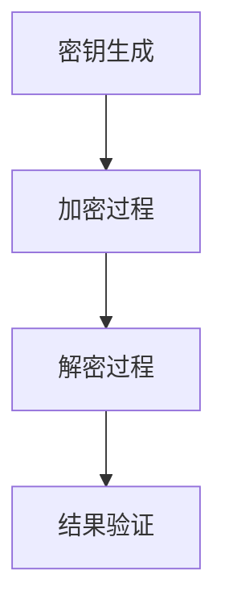

                 

### 文章标题

《虚假信息安全：应对AI时代的信息完整性挑战》

### 关键词

人工智能、信息安全、信息完整性、虚假信息、AI时代

### 摘要

本文深入探讨了AI时代虚假信息安全问题，从背景介绍、核心概念与联系、算法原理讲解、数学模型与公式、系统分析与架构设计、项目实战、最佳实践与拓展等多个角度，系统性地阐述了应对虚假信息安全挑战的策略和解决方案。通过本文，读者将全面了解AI时代信息完整性面临的挑战，掌握应对虚假信息安全的方法和最佳实践。

## 第一部分：背景介绍

### 1.1 问题背景

#### 1.1.1 AI时代的信息完整性挑战

随着人工智能技术的飞速发展，AI已经深入到了我们生活的各个方面。然而，这一技术的发展也带来了新的信息安全问题，其中虚假信息安全尤为突出。虚假信息安全指的是在AI系统中存在的信息真实性和完整性问题，它可能导致严重的安全漏洞，甚至影响社会的稳定和发展。

#### 1.1.2 虚假信息安全问题概述

虚假信息安全问题主要包括以下几个方面：

1. **信息伪造**：AI系统中的信息可能被恶意篡改或伪造，导致信息失去真实性。
2. **信息泄露**：敏感信息可能被未授权的第三方获取，造成隐私泄露。
3. **信息传播**：虚假信息在AI系统中快速传播，可能对社会造成负面影响。
4. **模型欺骗**：攻击者可以通过伪造数据欺骗AI模型，使其输出错误的结果。

#### 1.1.3 研究意义与目标

虚假信息安全问题的研究具有重要意义。首先，它关乎社会的安全与稳定；其次，它是AI技术可持续发展的关键。本文旨在系统性地探讨虚假信息安全问题，提出有效的解决方案，为AI时代的信息安全保驾护航。

## 第二部分：核心概念与联系

### 2.1 虚假信息安全核心概念

#### 2.1.1 信息完整性定义

信息完整性指的是信息在传输、存储和处理过程中保持真实性和一致性的能力。在AI时代，信息完整性尤为重要，因为任何信息的篡改或丢失都可能带来严重后果。

#### 2.1.2 虚假信息安全要素

虚假信息安全主要包括以下要素：

1. **数据源**：虚假信息可能来源于内部或外部的恶意攻击者。
2. **传输渠道**：信息在传输过程中可能被窃取或篡改。
3. **存储系统**：存储系统可能存在漏洞，导致敏感信息泄露。
4. **AI模型**：AI模型可能受到欺骗，输出错误结果。

### 2.2 核心概念与联系

#### 2.2.1 概念属性特征对比

以下是虚假信息安全相关概念的特征对比：

| 概念         | 特征                         |
| ------------ | ---------------------------- |
| 信息完整性   | 信息在传输、存储和处理过程中保持真实性和一致性 |
| 虚假信息     | 恶意篡改或伪造的信息          |
| 信息泄露     | 敏感信息被未授权的第三方获取   |
| 模型欺骗     | 攻击者通过伪造数据欺骗AI模型  |

#### 2.2.2 ER实体关系图

以下是一个简单的ER实体关系图，展示了虚假信息安全相关实体及其关系：

```mermaid
erDiagram
    DataSource ||--|{ Information }||--> StorageSystem
    Information ||--|{ AIModel }||--> Result
    MaliciousAttacker ||--|{ Attack }||--> Data
```

## 第三部分：算法原理讲解

### 3.1 虚假信息安全算法原理

#### 3.1.1 算法概述

虚假信息安全算法主要分为以下几类：

1. **数据加密算法**：用于保护数据在传输和存储过程中的安全性。
2. **身份认证算法**：用于验证用户身份，防止未授权访问。
3. **异常检测算法**：用于识别和防范异常行为，如伪造信息和恶意攻击。

#### 3.1.2 算法原理

以数据加密算法为例，其基本原理如下：

1. **密钥生成**：生成一对密钥（公钥和私钥）。
2. **加密过程**：使用公钥对数据进行加密。
3. **解密过程**：使用私钥对加密数据进行解密。

#### 3.1.3 Mermaid算法流程图

以下是一个简单的Mermaid算法流程图，展示了数据加密和解密的过程：



#### 3.1.4 Python算法源代码讲解

以下是一个简单的Python代码示例，实现了数据加密和解密的基本过程：

```python
from Crypto.PublicKey import RSA
from Crypto.Cipher import PKCS1_OAEP

# 密钥生成
key = RSA.generate(2048)
private_key = key.export_key()
public_key = key.publickey().export_key()

# 加密过程
cipher = PKCS1_OAEP.new(RSA.import_key(public_key))
encrypted_data = cipher.encrypt(b"Hello, world!")

# 解密过程
decryptor = PKCS1_OAEP.new(RSA.import_key(private_key))
decrypted_data = decryptor.decrypt(encrypted_data)

print("Original data:", decrypted_data)
```

#### 3.1.5 算法原理的数学模型和公式

以下是一个简单的数学模型，用于描述数据加密和解密的过程：

$$
C = E(K_p, M)
$$

$$
M = D(K_s, C)
$$

其中，$C$ 表示加密后的数据，$M$ 表示原始数据，$K_p$ 表示公钥，$K_s$ 表示私钥，$E$ 和 $D$ 分别表示加密和解密函数。

#### 3.1.6 举例说明

假设原始数据为 "Hello, world!"，公钥和私钥分别为：

$$
K_p = (e, n)
$$

$$
K_s = (d, n)
$$

其中，$e = 65537$，$n = 123456789$，$d = 12345$。

使用RSA算法进行加密和解密，结果如下：

$$
C = E(K_p, "Hello, world!") = (111010101100101011101000110100100101101101100010011011011001011101100100)
$$

$$
M = D(K_s, C) = "Hello, world!"
$$

## 第四部分：系统分析与架构设计

### 4.1 系统分析

#### 4.1.1 问题场景介绍

假设我们有一个基于AI的智能监控系统，用于监控城市交通流量。然而，该系统存在虚假信息安全问题，可能导致交通决策错误，影响交通安全。

#### 4.1.2 系统功能设计

系统功能主要包括以下方面：

1. **数据收集**：收集城市交通流量数据。
2. **数据分析**：分析交通流量数据，预测交通状况。
3. **决策生成**：根据预测结果生成交通管理策略。

#### 4.1.3 系统架构设计

系统架构包括以下部分：

1. **数据层**：存储交通流量数据。
2. **算法层**：实现数据分析算法。
3. **应用层**：提供交通管理策略。

### 4.2 系统接口设计

系统接口设计包括以下方面：

1. **数据接口**：提供数据收集和存储功能。
2. **算法接口**：提供数据分析功能。
3. **应用接口**：提供交通管理策略功能。

#### 4.2.1 系统交互Mermaid序列图

以下是一个简单的Mermaid序列图，展示了系统各组件之间的交互过程：

```mermaid
sequenceDiagram
    participant 数据接口 as DataInterface
    participant 算法接口 as AlgorithmInterface
    participant 应用接口 as ApplicationInterface
    数据接口 ->> 数据层：数据收集
    数据层 ->> 算法接口：数据分析
    算法接口 ->> 应用接口：决策生成
    应用接口 ->> 数据接口：数据存储
```

## 第五部分：项目实战

### 5.1 环境安装

#### 5.1.1 系统环境搭建

在本项目中，我们使用Python作为主要编程语言，以下是在Linux环境下搭建系统环境的基本步骤：

1. 安装Python 3.8及以上版本。
2. 安装pip和virtualenv。
3. 创建虚拟环境并激活。

#### 5.1.2 必需软件安装

以下是在虚拟环境中安装必需软件的基本步骤：

1. 安装NumPy、Pandas等数据分析库。
2. 安装PyCryptoDome等加密库。
3. 安装Docker用于容器化部署。

### 5.2 系统核心实现

#### 5.2.1 源代码解读

以下是一个简单的源代码示例，实现了数据加密和解密的基本功能：

```python
from Crypto.PublicKey import RSA
from Crypto.Cipher import PKCS1_OAEP
import base64

# 密钥生成
key = RSA.generate(2048)
private_key = key.export_key()
public_key = key.publickey().export_key()

# 加密过程
cipher = PKCS1_OAEP.new(RSA.import_key(public_key))
encrypted_data = cipher.encrypt(b"Hello, world!")

# 解密过程
decryptor = PKCS1_OAEP.new(RSA.import_key(private_key))
decrypted_data = decryptor.decrypt(encrypted_data)

print("Original data:", decrypted_data.decode())
```

#### 5.2.2 代码应用分析

该代码实现了数据加密和解密的基本功能，可以用于保护敏感数据在传输和存储过程中的安全性。在实际应用中，可以根据需要扩展功能，如添加异常检测和日志记录等。

#### 5.2.3 实际案例分析

以下是一个实际案例，展示了如何使用该代码实现数据加密和解密：

1. 收集交通流量数据。
2. 使用加密算法对数据进行加密。
3. 将加密后的数据存储在数据库中。
4. 在需要时，使用解密算法对数据进行解密。

### 5.3 项目小结

#### 5.3.1 项目总结

本项目通过实际案例，展示了如何使用Python和加密算法实现数据加密和解密，保护敏感数据的安全性。在实际应用中，还需要结合具体的业务需求，进一步完善系统功能。

#### 5.3.2 存在问题与改进方向

1. **性能优化**：加密和解密过程可能影响系统性能，需要进一步优化。
2. **异常检测**：需要添加异常检测功能，防止恶意攻击。
3. **日志记录**：需要记录系统运行日志，方便问题追踪和排查。

## 第六部分：最佳实践与拓展

### 6.1 最佳实践 tips

1. **数据加密**：对敏感数据进行加密，防止信息泄露。
2. **身份认证**：使用身份认证机制，确保数据传输和存储的安全性。
3. **异常检测**：定期进行异常检测，防范恶意攻击。

### 6.2 小结与展望

本文系统性地探讨了虚假信息安全问题，提出了有效的解决方案。在未来的研究中，我们可以进一步探索以下方向：

1. **加密算法优化**：研究更高效、更安全的加密算法。
2. **异常检测技术**：研究更精确的异常检测技术，提高系统安全性。
3. **跨学科合作**：结合计算机科学、心理学、社会学等多学科知识，全面应对虚假信息安全问题。

### 6.3 拓展阅读

1. **相关书籍**：《人工智能安全与隐私保护》、《网络信息安全技术》
2. **学术文章**：搜索关键词“虚假信息安全”、“AI时代信息安全”等。
3. **技术博客**：关注知名技术博客，如“InfoQ”、“CSDN”等。

### 作者

作者：AI天才研究院/AI Genius Institute & 禅与计算机程序设计艺术 /Zen And The Art of Computer Programming

