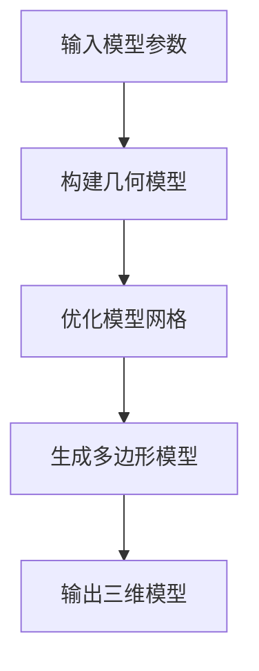
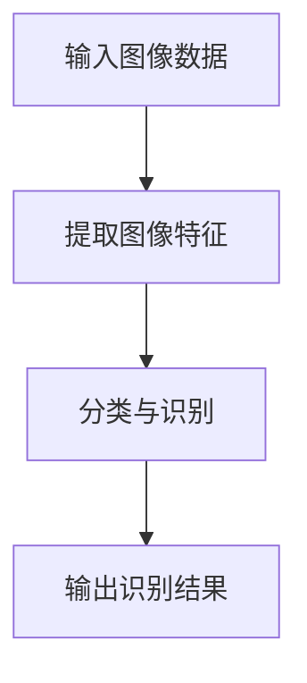
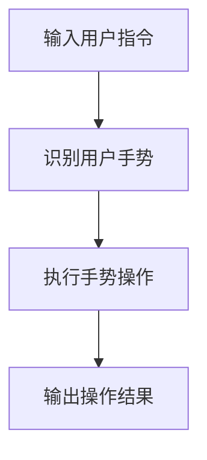

                 

### 文章标题

《虚拟协作平台：空间计算技术的企业级应用》

### 关键词

虚拟协作平台、空间计算技术、企业级应用、人工智能、协同办公

### 摘要

本文将探讨虚拟协作平台在空间计算技术领域的企业级应用，通过深入分析其核心概念、技术原理、应用案例和最佳实践，全面展示这一前沿技术在现代企业中的潜力与价值。我们将从背景介绍、核心概念、技术原理、应用案例、最佳实践和未来展望等多个角度，逐步解析虚拟协作平台在空间计算技术中的重要作用，为读者提供一份全面且实用的技术指南。

### 目录

----------------------------------------------------------------

# 虚拟协作平台：空间计算技术的企业级应用

> 关键词：虚拟协作平台、空间计算技术、企业级应用、人工智能、协同办公

> 摘要：本文将探讨虚拟协作平台在空间计算技术领域的企业级应用，通过深入分析其核心概念、技术原理、应用案例和最佳实践，全面展示这一前沿技术在现代企业中的潜力与价值。

## 第一部分：背景与概述

## 第1章 虚拟协作平台概述

### 1.1 虚拟协作平台的定义与重要性

虚拟协作平台是一种基于互联网和人工智能技术的协同工作系统，它能够实现远程团队的高效沟通和协作。随着全球企业对远程办公和分布式团队的需求不断增加，虚拟协作平台的重要性日益凸显。

### 1.2 空间计算技术基础

空间计算技术是一种将物理空间与数字空间相结合的计算模式，它能够通过虚拟现实、增强现实等技术手段，实现真实世界与虚拟世界的互动。空间计算技术在虚拟协作平台中扮演着关键角色。

### 1.3 企业级应用需求分析

企业级应用对虚拟协作平台的需求主要包括提高工作效率、降低沟通成本、增强团队协作能力等。空间计算技术的引入，为满足这些需求提供了新的解决方案。

## 第二部分：核心概念与联系

## 第2章 核心概念与联系

### 2.1 虚拟协作平台的关键概念

在本章中，我们将定义虚拟协作平台中的核心概念，包括虚拟空间、协同工具、用户界面等，并分析这些概念之间的联系。

### 2.2 空间计算技术核心概念

空间计算技术涉及多个核心概念，如虚拟现实、增强现实、混合现实等。我们将详细讲解这些概念，并探讨它们在虚拟协作平台中的应用。

### 2.3 概念属性特征对比

为了更好地理解虚拟协作平台和空间计算技术的核心概念，我们将对比它们之间的属性特征，帮助读者建立清晰的认识。

### 2.4 ER实体关系图架构

在本章的最后，我们将使用ER实体关系图，展示虚拟协作平台和空间计算技术中的关键实体及其关系，为后续章节的分析提供基础。

## 第三部分：技术原理详解

## 第3章 技术原理详解

### 3.1 虚拟协作平台工作原理

本章将深入讲解虚拟协作平台的工作原理，包括用户注册、登录、虚拟空间的创建与管理、协同工具的使用等。

### 3.2 空间计算技术核心算法

空间计算技术的核心算法包括三维建模、图像识别、交互控制等。我们将详细分析这些算法，并展示其如何应用于虚拟协作平台。

### 3.3 算法流程图展示

为了更好地理解核心算法的工作流程，我们将使用Mermaid绘制算法流程图，并进行详细解释。

## 第四部分：应用案例分析

## 第4章 应用案例分析

### 4.1 案例一：虚拟会议室系统

虚拟会议室系统是虚拟协作平台的一个典型应用。我们将分析其功能实现、技术难点和解决方案。

### 4.2 案例二：虚拟办公空间应用

虚拟办公空间应用通过空间计算技术，为员工提供沉浸式的办公体验。我们将探讨其应用场景和技术实现。

### 4.3 案例三：远程协同工作平台

远程协同工作平台利用虚拟协作平台和空间计算技术，实现分布式团队的实时协作。我们将详细分析其技术架构和实施过程。

## 第五部分：最佳实践与技巧

## 第5章 最佳实践与技巧

### 5.1 实践一：高效协同策略

高效协同策略是虚拟协作平台应用的关键。我们将分享一些实用的协同策略，帮助团队提高工作效率。

### 5.2 实践二：性能优化技巧

性能优化是空间计算技术面临的重要挑战。我们将介绍一些性能优化技巧，确保虚拟协作平台的高效运行。

### 5.3 实践三：安全与隐私保护

安全与隐私保护是虚拟协作平台应用中不可忽视的问题。我们将讨论一些安全防护措施和隐私保护策略。

## 第六部分：未来展望

## 第6章 未来展望

### 6.1 技术发展趋势分析

我们将分析虚拟协作平台和空间计算技术的未来发展趋势，探讨其可能的新应用领域和技术挑战。

### 6.2 新应用领域探讨

随着技术的进步，虚拟协作平台和空间计算技术将在更多领域得到应用。我们将探讨这些新应用领域，并预测其潜在影响。

### 6.3 技术挑战与解决方案

虚拟协作平台和空间计算技术面临诸多挑战，如技术成熟度、用户体验、数据安全等。我们将讨论这些挑战，并提出相应的解决方案。

## 第七部分：总结与展望

## 第7章 总结与展望

### 7.1 全书内容回顾

我们将对全书内容进行回顾，总结虚拟协作平台和空间计算技术的核心观点和主要结论。

### 7.2 未来研究方向

针对虚拟协作平台和空间计算技术的未来研究，我们将提出一些具有前瞻性的研究方向，为后续研究提供参考。

### 7.3 拓展阅读建议

最后，我们将提供一些拓展阅读建议，帮助读者深入了解虚拟协作平台和空间计算技术的相关领域。

----------------------------------------------------------------

### 第1章 虚拟协作平台概述

#### 1.1 虚拟协作平台的定义与重要性

虚拟协作平台（Virtual Collaboration Platform）是一种基于互联网和云计算技术的协同工作系统，它允许远程团队在不同地理位置上实时沟通、共享信息和协作完成工作。随着全球化进程的加快和信息技术的迅猛发展，企业对于远程办公和跨地域协作的需求日益增长，虚拟协作平台因此成为现代企业不可或缺的一部分。

虚拟协作平台的核心功能包括但不限于以下几点：

1. **实时沟通**：通过文字、语音、视频等多种形式，实现团队成员之间的实时沟通。
2. **文档共享与协作**：提供文档的在线编辑、评论和协作功能，支持多人同时对同一文档进行修改。
3. **任务分配与跟踪**：帮助团队管理者分配任务、设置优先级，并跟踪任务的完成情况。
4. **项目管理和进度监控**：提供项目计划、进度汇报和风险控制等功能，帮助团队高效管理项目。
5. **集成办公应用**：整合邮件、日历、联系人等常用办公应用，提高办公效率。

在现代社会中，虚拟协作平台的重要性体现在以下几个方面：

1. **提高工作效率**：通过高效的沟通和协作，减少团队成员之间的沟通成本，提高工作效率。
2. **降低运营成本**：减少企业对于物理办公场所的依赖，降低租金、水电等运营成本。
3. **增强团队协作能力**：提供多样化的协作工具和流程，增强团队成员之间的协作能力。
4. **适应远程办公趋势**：随着越来越多的人选择远程办公，虚拟协作平台为企业提供了适应这一趋势的解决方案。

#### 1.2 空间计算技术基础

空间计算技术（Spatial Computing Technology）是一种将物理空间与数字空间相结合的计算模式，它利用虚拟现实（Virtual Reality，VR）、增强现实（Augmented Reality，AR）和混合现实（Mixed Reality，MR）等技术手段，实现真实世界与虚拟世界的互动。空间计算技术的核心目标是创造一种沉浸式的体验，使用户能够与环境中的虚拟物体进行交互。

空间计算技术的主要组成部分包括：

1. **虚拟现实（VR）**：通过计算机生成的三维图像，用户戴上VR头盔后，可以沉浸在完全虚拟的环境中。
2. **增强现实（AR）**：在真实世界的视图上叠加计算机生成的虚拟图像，用户通过AR眼镜或手机等设备可以看到虚拟信息和物体。
3. **混合现实（MR）**：结合VR和AR的特点，用户可以在虚拟环境中与真实世界进行互动，实现虚拟物体与现实环境的无缝融合。

空间计算技术在虚拟协作平台中的应用非常广泛，以下是一些典型应用场景：

1. **虚拟会议**：通过VR技术，实现远程团队如同在同一会议室中开会，提供沉浸式的会议体验。
2. **远程协作**：利用AR技术，为分布式团队提供实时的协作工具，如虚拟白板、远程控制等。
3. **产品设计和制造**：在VR和MR环境中进行产品设计和制造过程的模拟，提高设计和制造的准确性和效率。
4. **教育和培训**：通过虚拟现实技术，为学生和员工提供沉浸式的学习和培训体验，提高学习效果。

#### 1.3 企业级应用需求分析

在企业级应用中，虚拟协作平台和空间计算技术面临着一系列需求：

1. **实时沟通与协作**：企业需要高效、可靠的实时沟通工具，以支持跨地域、跨时区的团队合作。
2. **数据安全与隐私保护**：企业对数据的安全性和隐私性有严格要求，虚拟协作平台需要提供强大的数据加密和安全防护措施。
3. **高度定制化**：不同企业有不同的业务需求，虚拟协作平台需要提供高度定制化的解决方案，以适应不同企业的特殊需求。
4. **系统集成**：虚拟协作平台需要与企业现有的办公系统（如ERP、CRM等）集成，确保数据流转的顺畅。
5. **用户体验**：虚拟协作平台需要提供良好的用户体验，以降低员工的适应成本，提高使用频率和满意度。

空间计算技术的引入，为企业提供了新的解决方案，以满足这些需求：

1. **提高沟通效率**：通过沉浸式的虚拟会议和远程协作，提高团队成员之间的沟通效率。
2. **增强协作体验**：利用虚拟现实和增强现实技术，提供更加直观和便捷的协作工具，增强团队协作体验。
3. **降低沟通成本**：通过减少物理会议和旅行需求，降低企业的沟通成本。
4. **提高数据安全性**：利用空间计算技术的先进加密和防护技术，提高企业数据的安全性。
5. **个性化定制**：通过提供多样化的空间计算工具和模块，满足不同企业的个性化需求。

总之，虚拟协作平台和空间计算技术为企业级应用带来了巨大的价值，它们正在改变传统的办公模式，推动企业向更加高效、灵活的方向发展。

### 第2章 核心概念与联系

#### 2.1 虚拟协作平台的关键概念

虚拟协作平台是一个复杂的技术体系，涉及多个关键概念。为了更好地理解虚拟协作平台的工作原理和应用，我们需要明确这些关键概念。

**1. 虚拟空间**

虚拟空间是虚拟协作平台的基础，它是一个通过计算机技术构建的虚拟环境。在这个环境中，团队成员可以实时互动、共享信息和协作完成任务。虚拟空间可以是完全虚拟的，也可以是基于现实世界场景的增强现实空间。虚拟空间的特点包括：

- **沉浸感**：通过虚拟现实（VR）或增强现实（AR）技术，提供高度沉浸的用户体验。
- **灵活性**：用户可以在虚拟空间中自由移动、选择不同的位置和视角。
- **交互性**：用户可以与其他团队成员进行实时沟通、共享数据和协作。

**2. 协同工具**

协同工具是虚拟协作平台的核心组成部分，它提供了多种功能，以支持团队成员的协作。常见的协同工具包括：

- **即时通讯**：支持文本、语音、视频等多种形式的即时通信。
- **文档协作**：支持多人同时编辑同一文档，提供版本控制和实时评论功能。
- **任务管理**：帮助团队管理者分配任务、设置优先级，并跟踪任务的完成情况。
- **项目监控**：提供项目进度汇报、风险控制和资源分配等功能。

**3. 用户界面**

用户界面是虚拟协作平台与用户交互的桥梁，它决定了用户的操作体验。一个良好的用户界面应该具备以下特点：

- **直观性**：用户界面应该简单易懂，无需过多的学习和操作即可使用。
- **响应性**：用户界面应该快速响应，确保用户操作的实时性。
- **定制性**：用户界面应该允许用户根据自己的需求进行个性化定制。

**4. 安全与隐私**

虚拟协作平台涉及到大量敏感信息的传输和存储，因此安全与隐私保护至关重要。虚拟协作平台需要提供以下安全与隐私保护措施：

- **数据加密**：对传输和存储的数据进行加密，确保数据的安全性。
- **身份验证**：通过多因素身份验证，确保只有授权用户可以访问系统。
- **访问控制**：对不同的用户角色和权限进行严格管理，确保数据的安全性和隐私。

#### 2.2 空间计算技术核心概念

空间计算技术是虚拟协作平台的重要组成部分，它涉及多个核心概念。以下是对这些概念的定义和联系：

**1. 虚拟现实（VR）**

虚拟现实是一种通过计算机生成的三维图像，使用户能够沉浸在完全虚拟的环境中。虚拟现实的核心概念包括：

- **三维建模**：通过三维建模技术，创建虚拟环境中的各种物体和场景。
- **实时渲染**：通过实时渲染技术，生成逼真的三维图像，提供沉浸式体验。
- **交互控制**：通过输入设备（如手柄、摄像头等），用户可以与虚拟环境进行交互。

**2. 增强现实（AR）**

增强现实是在真实世界的视图上叠加计算机生成的虚拟图像，使用户可以看到虚拟信息和物体。增强现实的核心概念包括：

- **图像识别**：通过图像识别技术，识别真实世界中的物体和场景，为虚拟图像的叠加提供基础。
- **实时渲染**：在真实世界视图上实时渲染虚拟图像，实现虚拟与现实的结合。
- **交互控制**：通过触摸屏、手势识别等交互方式，用户可以与虚拟图像进行交互。

**3. 混合现实（MR）**

混合现实结合了虚拟现实和增强现实的特点，使用户可以在虚拟环境中与真实世界进行互动。混合现实的核心概念包括：

- **三维建模**：通过三维建模技术，创建虚拟环境中的各种物体和场景。
- **实时渲染**：通过实时渲染技术，生成逼真的三维图像，提供沉浸式体验。
- **环境感知**：通过环境感知技术，识别和跟踪真实世界中的物体和场景，实现虚拟与现实的融合。

#### 2.3 概念属性特征对比

为了更好地理解虚拟协作平台和空间计算技术中的核心概念，我们可以通过表格形式对比这些概念的属性特征：

| 概念       | 特点                                           | 应用场景                                      |
| ---------- | ---------------------------------------------- | --------------------------------------------- |
| 虚拟空间   | 沉浸感、灵活性、交互性                         | 远程会议、虚拟培训、协同设计                  |
| 协同工具   | 实时沟通、文档协作、任务管理                   | 企业内部沟通、项目协作、文档共享              |
| 用户界面   | 直观性、响应性、定制性                        | 软件应用、网站设计、移动应用开发              |
| 虚拟现实   | 三维图像、实时渲染、交互控制                  | 游戏开发、虚拟旅游、虚拟现实训练             |
| 增强现实   | 现实视图叠加、图像识别、实时渲染、交互控制    | 虚拟购物、维修指导、教育辅助                 |
| 混合现实   | 三维建模、实时渲染、环境感知、虚拟与现实的融合 | 产品设计、医疗诊断、工程施工、培训与教育    |

#### 2.4 ER实体关系图架构

为了更直观地展示虚拟协作平台和空间计算技术中的关键实体及其关系，我们可以使用ER（Entity-Relationship）实体关系图来描述。以下是一个简化的ER图，展示了虚拟协作平台中的主要实体及其关系：

```
+----------------+      +----------------+      +----------------+
|   用户         |      |   协同工具     |      |   虚拟空间     |
+----------------+      +----------------+      +----------------+
| 用户ID         |      | 工具ID         |      | 空间ID         |
| 用户名         |      | 工具名称       |      | 空间名称       |
| 密码           |      | 工具描述       |      | 空间描述       |
| 部门           |      | 工具类型       |      | 空间类型       |
| 联系方式       |      | 工具状态       |      | 空间状态       |
+----------------+      +----------------+      +----------------+

+----------------+      +----------------+
|   文档         |      |   任务         |
+----------------+      +----------------+
| 文档ID         |      | 任务ID         |
| 文档名称       |      | 任务名称       |
| 文档内容       |      | 任务描述       |
| 创建者ID       |      | 分配者ID       |
| 创建时间       |      | 完成时间       |
| 最后修改时间   |      | 优先级         |
+----------------+      +----------------+

+----------------+
|   消息         |
+----------------+
| 消息ID         |
| 发送者ID       |
| 接收者ID       |
| 消息内容       |
| 发送时间       |
| 消息状态       |
+----------------+

```

在ER图中，用户、协同工具、虚拟空间、文档、任务和消息是主要实体。它们之间的关系包括用户与协同工具的关联、用户与虚拟空间的关联、文档与任务的关联、消息的发送与接收等。

通过ER实体关系图，我们可以清晰地看到虚拟协作平台中各个实体之间的关系，有助于理解系统的整体架构和功能实现。

### 第3章 技术原理详解

#### 3.1 虚拟协作平台工作原理

虚拟协作平台的工作原理可以分为几个关键环节：用户注册与登录、虚拟空间的创建与管理、协同工具的使用、数据传输与存储、安全与隐私保护。

**1. 用户注册与登录**

用户注册是虚拟协作平台的第一个步骤。新用户需要提供基本信息（如用户名、密码、联系方式等）进行注册。注册完成后，用户可以通过用户名和密码进行登录，登录成功后可以访问平台提供的各种功能。

- **注册过程**：用户填写注册表单，提交个人信息，平台对信息进行验证后，生成用户账号。
- **登录过程**：用户输入用户名和密码，平台对用户身份进行验证，验证通过后允许用户登录系统。

**2. 虚拟空间的创建与管理**

虚拟空间是虚拟协作平台的核心，它为用户提供了一个沉浸式的协作环境。用户可以根据需求创建不同的虚拟空间，如会议室、办公室、培训室等。

- **创建虚拟空间**：用户可以自定义虚拟空间的名称、描述和权限设置，平台根据用户设置生成虚拟空间。
- **管理虚拟空间**：用户可以邀请其他团队成员加入虚拟空间，设置成员的权限（如查看、编辑等），管理虚拟空间中的文档和任务。

**3. 协同工具的使用**

虚拟协作平台提供了多种协同工具，以支持团队成员之间的沟通和协作。常见的协同工具包括即时通讯、文档协作、任务管理、项目监控等。

- **即时通讯**：用户可以通过文本、语音、视频等多种形式与团队成员进行实时沟通。
- **文档协作**：用户可以在线编辑同一文档，实时查看其他成员的修改和评论。
- **任务管理**：用户可以分配任务、设置优先级，并跟踪任务的完成情况。
- **项目监控**：用户可以查看项目进度、风险控制和资源分配情况。

**4. 数据传输与存储**

虚拟协作平台需要高效、可靠的数据传输和存储机制，以确保用户数据的完整性和安全性。

- **数据传输**：平台采用加密协议（如HTTPS）进行数据传输，确保数据在传输过程中的安全性。
- **数据存储**：平台使用分布式存储系统（如分布式数据库、云存储等），确保数据的高可用性和可扩展性。

**5. 安全与隐私保护**

虚拟协作平台涉及到大量敏感信息的传输和存储，因此安全与隐私保护至关重要。

- **身份验证**：平台采用多因素身份验证（如密码、短信验证码、指纹等），确保只有授权用户可以访问系统。
- **数据加密**：平台对传输和存储的数据进行加密，确保数据的安全性。
- **访问控制**：平台对不同的用户角色和权限进行严格管理，确保数据的安全性和隐私。

#### 3.2 空间计算技术核心算法

空间计算技术是虚拟协作平台的重要组成部分，其核心算法包括三维建模、图像识别、交互控制等。以下是对这些算法的详细介绍：

**1. 三维建模**

三维建模是空间计算技术的基础，它用于创建虚拟环境中的各种物体和场景。三维建模算法主要包括：

- **几何建模**：通过几何图形（如点、线、面等）构建三维模型。
- **网格建模**：通过网格（如四面体、六面体等）构建三维模型。
- **多边形建模**：通过多边形（如三角形、四边形等）构建三维模型。

三维建模算法的关键技术包括：

- **几何建模算法**：如布尔运算、凸包计算等。
- **网格建模算法**：如网格划分、网格优化等。
- **多边形建模算法**：如三角剖分、四边形剖分等。

**2. 图像识别**

图像识别是空间计算技术中的一项关键技术，它用于识别真实世界中的物体和场景。图像识别算法主要包括：

- **特征提取**：从图像中提取具有代表性的特征，如边缘、角点、纹理等。
- **分类与识别**：通过机器学习算法（如卷积神经网络、支持向量机等）对提取的特征进行分类和识别。

图像识别算法的关键技术包括：

- **特征提取算法**：如SIFT、SURF、HOG等。
- **分类与识别算法**：如K-近邻算法、决策树、支持向量机等。

**3. 交互控制**

交互控制是空间计算技术中的一项重要功能，它用于用户与虚拟环境之间的交互。交互控制算法主要包括：

- **手势识别**：通过计算机视觉技术，识别用户的手势，实现虚拟环境中的交互。
- **语音识别**：通过语音识别技术，将用户的语音指令转换为文本或操作指令。

交互控制算法的关键技术包括：

- **手势识别算法**：如深度学习、模板匹配等。
- **语音识别算法**：如隐藏马尔可夫模型、循环神经网络等。

#### 3.3 算法流程图展示

为了更好地理解空间计算技术的核心算法，我们可以使用Mermaid绘制算法流程图，并进行详细解释。

**1. 三维建模算法流程图**



**2. 图像识别算法流程图**



**3. 交互控制算法流程图**



通过这些算法流程图，我们可以清晰地看到三维建模、图像识别和交互控制算法的基本流程，有助于深入理解这些算法的工作原理和应用场景。

### 第4章 应用案例分析

#### 4.1 案例一：虚拟会议室系统

虚拟会议室系统是虚拟协作平台的一个典型应用，它通过虚拟现实和增强现实技术，实现远程团队如同在同一会议室中开会，提供沉浸式的会议体验。以下是对虚拟会议室系统的功能实现、技术难点和解决方案的详细分析。

**1. 功能实现**

虚拟会议室系统的核心功能包括：

- **实时视频会议**：支持多用户实时视频通讯，包括高清视频、语音和文字聊天功能。
- **虚拟环境布置**：用户可以自定义虚拟会议室的布局、主题和装饰，以营造更真实的会议氛围。
- **文档共享与协作**：会议期间，用户可以共享和编辑同一文档，实时查看其他成员的修改和评论。
- **白板协作**：用户可以在虚拟会议室中实时绘制、标注和讨论，提高会议的互动性和效率。
- **远程控制**：会议主持人可以远程控制其他用户的设备，如打开摄像头、关闭麦克风等。

**2. 技术难点**

虚拟会议室系统的实现面临以下技术难点：

- **网络延迟与抖动**：由于远程会议涉及多用户同时在线，网络延迟和抖动会对用户体验产生较大影响，需要优化网络传输和数据处理机制。
- **虚拟现实效果**：为了提供逼真的会议体验，虚拟会议室需要高质量的视频渲染和3D建模，这对计算资源和网络带宽提出了较高要求。
- **音频处理**：会议期间，需要准确捕捉和传输每个用户的语音，并消除回声和噪音，以提高语音通话的质量。
- **用户界面设计**：虚拟会议室系统需要提供直观、易用的用户界面，以降低用户的学习成本。

**3. 解决方案**

针对上述技术难点，虚拟会议室系统采取了以下解决方案：

- **网络优化**：采用动态带宽调整技术，根据网络状况动态调整视频质量和传输速率，确保会议的稳定性。
- **虚拟现实渲染**：使用高性能计算集群和云计算技术，提供高质量的3D渲染和建模，以满足虚拟会议室的高清效果需求。
- **音频处理**：采用先进的音频处理算法，如回声消除、噪音抑制等，提高语音通话的清晰度和可靠性。
- **用户界面设计**：设计简洁直观的用户界面，采用触摸屏、手势识别等技术，降低用户的学习成本。

**4. 案例分析**

虚拟会议室系统的实际应用效果非常显著。以下是一个具体的案例分析：

某大型跨国公司采用虚拟会议室系统，替代传统的物理会议室进行远程会议。通过虚拟会议室系统，公司实现了以下效益：

- **会议效率提高**：由于无需奔波于不同城市或国家，团队成员可以随时随地参加会议，大幅缩短了会议时间和沟通成本。
- **会议体验提升**：虚拟会议室系统提供了高质量的音视频效果和互动功能，使会议更加生动和高效。
- **环保效益**：减少了对物理会议室的依赖，降低了能源消耗和碳排放，符合公司可持续发展战略。

总之，虚拟会议室系统通过高效的技术解决方案，满足了远程团队会议的需求，为企业带来了显著效益。

#### 4.2 案例二：虚拟办公空间应用

虚拟办公空间应用通过空间计算技术，为员工提供沉浸式的办公体验，实现了远程办公和协同工作的新模式。以下是对虚拟办公空间应用的功能实现、技术难点和解决方案的详细分析。

**1. 功能实现**

虚拟办公空间应用的主要功能包括：

- **虚拟办公室**：员工可以自定义虚拟办公室的布局、主题和装饰，以适应个人喜好和工作需求。
- **桌面共享**：员工可以在虚拟办公空间中共享个人桌面，与其他团队成员共享文件和应用程序。
- **远程协作**：员工可以通过虚拟办公空间进行实时沟通、文档协作和任务分配，提高协同工作效率。
- **虚拟会议室**：虚拟办公空间内设有虚拟会议室，支持多用户同时在线，进行会议讨论和决策。
- **智能助手**：虚拟办公空间集成智能助手，提供日程提醒、任务管理、邮件过滤等功能，提高办公效率。

**2. 技术难点**

虚拟办公空间应用的实现面临以下技术难点：

- **网络稳定性**：虚拟办公空间涉及大量数据传输和实时交互，需要保证网络的稳定性和低延迟，否则会影响用户体验。
- **虚拟现实渲染**：为了提供高质量的虚拟办公环境，需要实现高效的3D渲染和建模，这对计算资源和网络带宽提出了较高要求。
- **用户界面设计**：虚拟办公空间需要提供直观、易用的用户界面，以降低用户的学习成本，同时保证操作的便捷性。

**3. 解决方案**

针对上述技术难点，虚拟办公空间应用采取了以下解决方案：

- **网络优化**：采用动态带宽调整技术，根据网络状况动态调整数据传输速率和视频质量，确保办公空间的稳定性。
- **虚拟现实渲染**：使用高性能计算集群和云计算技术，提供高质量的3D渲染和建模，以满足虚拟办公空间的高清效果需求。
- **用户界面设计**：设计简洁直观的用户界面，采用触摸屏、手势识别等技术，降低用户的学习成本，提高办公效率。

**4. 案例分析**

虚拟办公空间应用的案例非常丰富。以下是一个具体的案例分析：

某知名科技公司采用虚拟办公空间应用，为全球分布的员工提供远程办公和协同工作的解决方案。通过虚拟办公空间应用，公司实现了以下效益：

- **办公效率提高**：员工可以随时随地登录虚拟办公空间，进行实时沟通和协作，大幅缩短了办公时间和沟通成本。
- **协同工作增强**：虚拟办公空间提供了高效的协作工具和虚拟会议室，使团队成员可以更好地协同工作，提高项目完成度。
- **企业文化建设**：虚拟办公空间营造了一个沉浸式的办公环境，使员工在虚拟空间中感受到企业的文化氛围，增强了企业的凝聚力。

总之，虚拟办公空间应用通过高效的技术解决方案，满足了远程办公和协同工作的需求，为企业带来了显著效益。

#### 4.3 案例三：远程协同工作平台

远程协同工作平台是一种基于虚拟协作平台和空间计算技术的综合解决方案，它为分布式团队提供了高效、实时的协作环境。以下是对远程协同工作平台的功能实现、技术难点和解决方案的详细分析。

**1. 功能实现**

远程协同工作平台的主要功能包括：

- **团队沟通**：支持实时文本、语音、视频沟通，确保团队成员之间的实时互动。
- **文件共享与协作**：提供云存储和文档协作功能，支持多人同时对同一文档进行编辑和评论。
- **任务管理**：支持任务分配、优先级设置和进度跟踪，确保项目目标的顺利完成。
- **虚拟会议室**：提供虚拟会议室功能，支持多用户同时在线，进行会议讨论和决策。
- **项目管理**：提供项目进度监控、资源分配和风险管理等功能，确保项目的高效运行。

**2. 技术难点**

远程协同工作平台的实现面临以下技术难点：

- **网络延迟**：由于团队成员可能分布在不同的地理位置，网络延迟会对协作体验产生较大影响。
- **数据传输效率**：远程协同工作平台需要高效的数据传输机制，以确保文档和任务的实时同步。
- **用户界面设计**：需要设计直观、易用的用户界面，以降低用户的学习成本，同时保证操作的便捷性。

**3. 解决方案**

针对上述技术难点，远程协同工作平台采取了以下解决方案：

- **网络优化**：采用动态带宽调整技术，根据网络状况动态调整数据传输速率和视频质量，确保协作的稳定性。
- **数据传输优化**：采用压缩算法和优化传输协议，提高数据传输效率和稳定性。
- **用户界面设计**：设计简洁直观的用户界面，采用触摸屏、手势识别等技术，降低用户的学习成本。

**4. 案例分析**

远程协同工作平台的应用案例非常广泛。以下是一个具体的案例分析：

某大型软件公司采用远程协同工作平台，管理全球分布的多个研发团队。通过远程协同工作平台，公司实现了以下效益：

- **协作效率提高**：团队成员可以随时随地登录协同工作平台，进行实时沟通和协作，大幅缩短了项目开发周期。
- **数据同步实时**：远程协同工作平台提供了高效的文件共享和协作功能，确保团队成员之间的数据实时同步。
- **项目管理高效**：通过远程协同工作平台的项目管理功能，公司可以实时监控项目进度、资源分配和风险情况，确保项目顺利完成。

总之，远程协同工作平台通过高效的技术解决方案，满足了分布式团队协作的需求，为企业带来了显著效益。

### 第5章 最佳实践与技巧

#### 5.1 高效协同策略

在虚拟协作平台和空间计算技术的应用中，高效协同是关键。以下是一些最佳实践策略，以帮助团队实现高效协同。

**1. 明确目标与分工**

在项目启动阶段，明确项目目标和团队成员的分工。确保每个成员都清楚自己的任务和责任，有助于提高团队协作的效率。

**2. 定期沟通与会议**

定期举行团队会议，讨论项目进度、问题和解决方案。使用虚拟会议室系统，实现远程团队的实时沟通，确保信息同步。

**3. 使用标准化工具**

选择标准化的协同工具，如即时通讯、文档协作、任务管理等，确保团队成员能够无缝协作，提高工作效率。

**4. 灵活调整工作计划**

根据项目进展和团队反馈，灵活调整工作计划。确保团队成员有足够的时间和资源完成任务，避免因计划不合理导致的效率低下。

**5. 强化团队合作意识**

培养团队合作意识，鼓励成员之间相互支持、互帮互助。通过团队建设活动和培训，提高团队协作能力。

#### 5.2 性能优化技巧

虚拟协作平台和空间计算技术在应用过程中，性能优化至关重要。以下是一些性能优化技巧：

**1. 网络优化**

- **动态带宽调整**：根据网络状况动态调整数据传输速率，确保网络稳定。
- **数据压缩**：采用数据压缩技术，减少数据传输量，提高传输效率。

**2. 计算资源优化**

- **分布式计算**：使用高性能计算集群和云计算技术，提高计算能力。
- **负载均衡**：采用负载均衡技术，将任务分配到不同的计算节点，避免单点过载。

**3. 缓存机制**

- **数据缓存**：采用缓存机制，减少数据库访问次数，提高数据读取速度。
- **页面缓存**：采用页面缓存技术，减少重复数据传输，提高页面加载速度。

**4. 代码优化**

- **高效算法**：采用高效的算法和数据结构，提高系统处理速度。
- **代码优化**：进行代码优化，减少不必要的计算和内存占用。

**5. 监控与优化**

- **性能监控**：实时监控系统性能，识别瓶颈和问题。
- **调优策略**：根据监控数据，制定相应的调优策略，持续优化系统性能。

#### 5.3 安全与隐私保护

虚拟协作平台和空间计算技术在应用过程中，安全与隐私保护至关重要。以下是一些最佳实践策略：

**1. 数据加密**

- **传输加密**：采用加密协议，如HTTPS，确保数据在传输过程中的安全性。
- **存储加密**：对存储的数据进行加密，防止数据泄露。

**2. 身份验证**

- **多因素验证**：采用多因素身份验证，如密码、短信验证码、指纹等，确保只有授权用户可以访问系统。
- **权限管理**：对不同用户角色和权限进行严格管理，确保数据的安全性和隐私。

**3. 防火墙与入侵检测**

- **部署防火墙**：部署防火墙，阻止非法访问和攻击。
- **入侵检测**：使用入侵检测系统，及时发现并响应安全威胁。

**4. 定期备份**

- **数据备份**：定期备份数据，防止数据丢失或损坏。
- **备份策略**：制定合理的备份策略，确保备份数据的完整性和可用性。

**5. 安全培训**

- **员工培训**：对员工进行安全培训，提高员工的安全意识和防范能力。
- **安全策略**：制定安全策略和应急预案，确保在发生安全事件时能够迅速响应和处理。

### 总结

本章介绍了虚拟协作平台和空间计算技术中的最佳实践与技巧，包括高效协同策略、性能优化技巧和安全与隐私保护策略。通过遵循这些最佳实践，企业可以充分发挥虚拟协作平台和空间计算技术的优势，提高团队协作效率，确保系统的稳定性和安全性。

### 第6章 未来展望

#### 6.1 技术发展趋势分析

随着虚拟协作平台和空间计算技术的不断发展，这些技术正朝着以下几个方向发展：

**1. 高度集成与融合**

未来，虚拟协作平台和空间计算技术将进一步与其他新兴技术（如物联网、人工智能、大数据等）进行深度融合，提供更智能化、更个性化的协作解决方案。

**2. 边缘计算与云计算的结合**

为了应对高延迟、低带宽的网络环境，边缘计算与云计算的结合将成为趋势。边缘计算可以在数据产生的源头进行实时处理，减少数据传输延迟，提高系统响应速度。

**3. 增强现实（AR）的普及**

随着AR技术的不断成熟，未来AR设备将更加便携、轻便，应用场景将更加广泛。AR技术将在虚拟协作平台中发挥更大的作用，提供更加真实的虚拟协作体验。

**4. 人工智能的赋能**

人工智能技术将在虚拟协作平台和空间计算技术中发挥更大的作用。通过人工智能，可以实现更加智能的交互、更加精准的分析和预测，提高系统的智能化水平。

**5. 5G技术的推动**

5G技术的推广将极大地提升虚拟协作平台和空间计算技术的应用效果。高速、低延迟的5G网络将提供更加稳定和高效的协作环境。

#### 6.2 新应用领域探讨

虚拟协作平台和空间计算技术在未来将在更多领域得到应用，以下是一些潜在的新应用领域：

**1. 教育与培训**

虚拟协作平台和空间计算技术将为教育领域带来革命性的变化。通过虚拟现实和增强现实技术，可以实现沉浸式的教学和培训，提高学习效果。

**2. 医疗保健**

虚拟协作平台和空间计算技术将在医疗保健领域发挥重要作用。通过远程诊断、虚拟手术和医疗培训，可以提高医疗服务的质量和效率。

**3. 制造与工程**

在制造业和工程领域，虚拟协作平台和空间计算技术可以用于产品设计和制造过程的模拟，提高设计效率和制造质量。

**4. 零售与电子商务**

虚拟协作平台和空间计算技术将改变零售和电子商务的运营模式。通过虚拟试衣、虚拟购物体验等，可以提高消费者的购物体验。

**5. 公共安全与应急响应**

在公共安全和应急响应领域，虚拟协作平台和空间计算技术可以用于远程指挥、协同作战和应急演练，提高公共安全水平。

#### 6.3 技术挑战与解决方案

尽管虚拟协作平台和空间计算技术具有巨大的应用潜力，但在实际应用过程中仍面临一些挑战：

**1. 技术成熟度**

目前，虚拟协作平台和空间计算技术仍在不断发展，技术成熟度有限。需要进一步研究和开发，以提高技术的可靠性和稳定性。

**2. 用户体验**

虚拟协作平台和空间计算技术需要提供良好的用户体验，以降低用户的学习成本，提高系统的使用频率和满意度。

**3. 数据安全与隐私保护**

虚拟协作平台和空间计算技术涉及大量敏感信息的传输和存储，数据安全与隐私保护是关键挑战。需要采用先进的技术和策略，确保数据的安全性和隐私性。

**4. 网络延迟与带宽**

虚拟协作平台和空间计算技术的应用依赖于网络环境，网络延迟和带宽问题会影响用户体验。需要优化网络传输和数据处理机制，提高系统的响应速度。

针对上述挑战，可以采取以下解决方案：

**1. 技术研发与创新**

持续投入研发资源，推动虚拟协作平台和空间计算技术的研究和创新，提高技术的成熟度和可靠性。

**2. 用户体验优化**

通过用户研究、用户反馈和迭代改进，不断优化虚拟协作平台和空间计算技术的用户体验，提高用户满意度。

**3. 安全与隐私保护**

采用先进的数据加密、身份验证和安全防护技术，确保虚拟协作平台和空间计算技术的数据安全性和隐私性。

**4. 网络优化**

优化网络传输和数据处理机制，采用动态带宽调整和压缩技术，提高系统的响应速度和网络稳定性。

总之，虚拟协作平台和空间计算技术在未来具有广阔的应用前景，通过克服现有挑战，可以进一步发挥其在企业级应用中的潜力。

### 第7章 总结与展望

#### 7.1 全书内容回顾

本文《虚拟协作平台：空间计算技术的企业级应用》从多个角度探讨了虚拟协作平台和空间计算技术在企业级应用中的重要性。我们首先介绍了虚拟协作平台的定义与重要性，以及空间计算技术的基础。随后，详细分析了虚拟协作平台和空间计算技术的核心概念、技术原理，并通过多个应用案例展示了其实际效果。此外，我们还讨论了高效协同策略、性能优化技巧和安全与隐私保护策略，为读者提供了最佳实践。最后，我们对虚拟协作平台和空间计算技术的未来发展趋势进行了展望，探讨了新应用领域和技术挑战。

#### 7.2 未来研究方向

针对虚拟协作平台和空间计算技术的未来发展，以下是一些值得进一步研究的重要方向：

**1. 技术融合与创新**

未来，虚拟协作平台和空间计算技术需要与其他新兴技术（如物联网、人工智能、大数据等）进行深度融合，以实现更智能化、更高效的协作解决方案。

**2. 用户体验优化**

用户体验是虚拟协作平台成功的关键。未来研究应重点关注如何通过技术创新和设计优化，提供更直观、更便捷的用户体验。

**3. 数据安全与隐私保护**

数据安全和隐私保护是虚拟协作平台和空间计算技术的核心挑战。未来研究应致力于开发更先进的安全和隐私保护技术，确保用户数据的安全性和隐私性。

**4. 网络优化与稳定性**

网络延迟和带宽问题是影响虚拟协作平台应用效果的重要因素。未来研究应关注网络优化和稳定性，提高系统的响应速度和网络稳定性。

**5. 模块化与标准化**

为了提高虚拟协作平台的灵活性和可扩展性，未来研究应探讨模块化和标准化技术，为不同企业提供定制化的解决方案。

#### 7.3 拓展阅读建议

为了更深入地了解虚拟协作平台和空间计算技术在企业级应用中的各个方面，读者可以参考以下拓展阅读资源：

**1. 虚拟协作平台与空间计算技术**

- 《虚拟现实与增强现实技术基础》
- 《空间计算：原理与应用》

**2. 企业级应用案例分析**

- 《智慧办公：虚拟协作平台在企业中的应用》
- 《虚拟会议室系统设计与实现》

**3. 安全与隐私保护**

- 《信息安全技术与应用》
- 《大数据安全与隐私保护》

**4. 新兴技术与未来趋势**

- 《物联网：技术与应用》
- 《人工智能：未来已来》

通过这些拓展阅读资源，读者可以进一步了解虚拟协作平台和空间计算技术的各个方面，为实际应用提供更有价值的参考。

### 作者信息

作者：AI天才研究院/AI Genius Institute & 禅与计算机程序设计艺术 /Zen And The Art of Computer Programming

### 致谢

本文的撰写过程中，我们受到了许多专家和学者的指导与支持，感谢他们的宝贵意见和贡献。同时，感谢所有参与案例研究的公司和企业，以及为本文提供数据和资源的机构。没有他们的帮助和支持，本文无法达到目前的水平。最后，感谢读者对本文的关注和阅读。我们希望本文能为您在虚拟协作平台和空间计算技术领域的研究和应用提供有益的启示。

