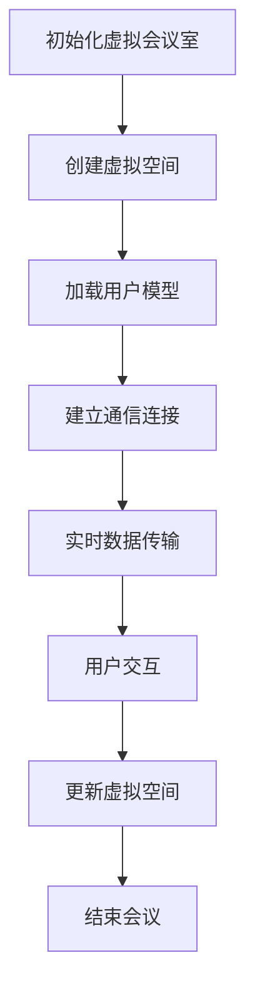
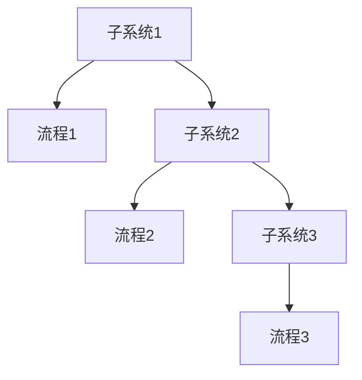
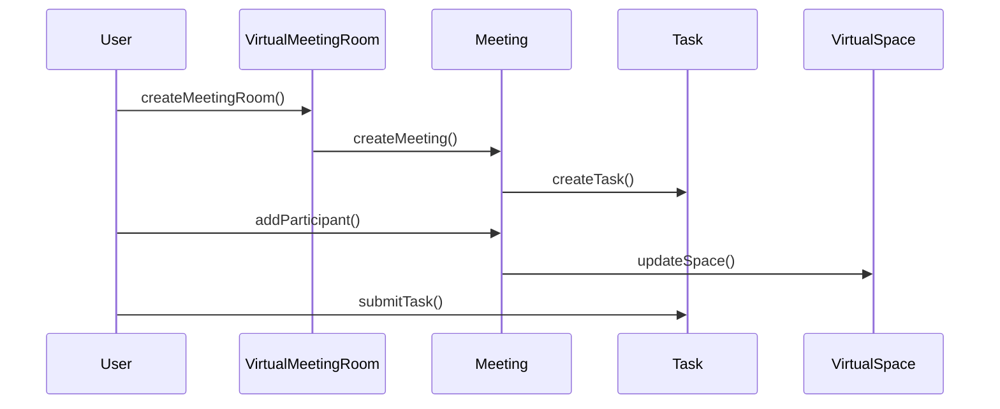

                 


# 虚拟协作：空间计算技术改变远程工作模式

> 关键词：虚拟协作、空间计算技术、远程工作、工作效率、团队合作

> 摘要：随着信息技术的发展，远程工作逐渐成为现代办公的主要形式。本文将探讨空间计算技术在虚拟协作中的应用，分析其对远程工作模式的影响，并提出未来虚拟协作的发展趋势。

## 引言

### 背景介绍

在当今全球化的时代，远程工作已经成为许多企业和组织的主流办公模式。这不仅是因为全球化带来的地理距离挑战，更是因为互联网和移动设备的普及，使得远程工作变得更加便捷和高效。然而，远程工作也带来了新的挑战，如沟通障碍、协作效率低下等。为了解决这些问题，空间计算技术应运而生。

### 核心概念术语说明

- **虚拟协作**：指利用信息技术手段，实现团队在不同地理位置上的协作与沟通。
- **空间计算技术**：一种利用虚拟现实（VR）、增强现实（AR）等技术，模拟现实空间中的人际交互和物体交互的技术。

### 问题背景与描述

远程工作带来的沟通障碍和协作效率问题，使得团队在虚拟环境中难以实现高效协作。如何利用空间计算技术，提高远程工作效率，成为亟待解决的问题。

### 问题解决与边界外延

空间计算技术的应用可以有效地解决远程工作中的协作问题，但需要考虑技术的可行性、成本以及用户体验。本文将围绕这些问题展开讨论。

### 概念结构与核心要素组成

- **虚拟协作系统**：包括用户界面、空间感知、交互技术等核心要素。
- **空间计算技术**：包括虚拟现实、增强现实、三维建模等技术。

## 核心概念与联系

### 核心概念原理

虚拟协作与空间计算技术的核心概念原理如下：

- **虚拟会议室**：利用空间计算技术，实现团队成员在虚拟空间中的实时沟通和协作。
- **三维建模**：通过三维建模技术，将现实环境中的物体和场景虚拟化，提高虚拟协作的沉浸感。

### 概念属性特征对比表格

| 概念           | 特征                  | 应用场景               |
| -------------- | --------------------- | ---------------------- |
| 虚拟协作       | 跨地域、实时沟通     | 远程办公、项目协作     |
| 空间计算技术   | 沉浸感、交互性       | 虚拟现实、增强现实应用 |

### ER实体关系图架构

```mermaid
erDiagram
    User ||--|{ Meeting }|--| VirtualSpace
    User ||--|{ Project }|--| Task
    Meeting ||--|{ Participant }| Participant
    Project ||--|{ Member }| Member
```

## 算法原理讲解

### 虚拟会议室的算法原理

#### Mermaid 流程图



#### Python 源代码

```python
class VirtualMeetingRoom:
    def __init__(self):
        self.virtual_space = None
        self.participants = []

    def create_space(self):
        # 创建虚拟空间
        self.virtual_space = create_space()

    def load_user_model(self, user):
        # 加载用户模型
        user_model = load_user_model(user)
        self.participants.append(user_model)

    def establish_connection(self):
        # 建立通信连接
        for user in self.participants:
            connect_to_user(user)

    def real_time_data_transmission(self):
        # 实时数据传输
        for user in self.participants:
            send_data_to_user(user)

    def user_interaction(self):
        # 用户交互
        for user in self.participants:
            receive_user_input(user)

    def update_space(self):
        # 更新虚拟空间
        update_space(self.virtual_space)

    def end_meeting(self):
        # 结束会议
        self.participants = []
        self.virtual_space = None
```

#### 算法原理的数学模型和公式

虚拟会议室的算法原理主要涉及以下几个方面：

- **通信延迟**：$$D = \frac{L}{R}$$，其中$D$为通信延迟，$L$为数据传输长度，$R$为数据传输速率。
- **用户交互**：$$U = F(U_1, U_2, \ldots, U_n)$$，其中$U$为用户交互结果，$U_1, U_2, \ldots, U_n$为用户的输入。

### 举例说明

假设有两个远程团队，A团队和B团队，他们需要通过虚拟会议室进行会议。以下是虚拟会议室算法原理的简单应用：

1. **初始化虚拟会议室**：创建一个虚拟会议室实例。
2. **创建虚拟空间**：为A团队和B团队创建虚拟空间。
3. **加载用户模型**：将A团队和B团队的用户模型加载到虚拟会议室中。
4. **建立通信连接**：建立A团队和B团队之间的通信连接。
5. **实时数据传输**：在会议过程中，实时传输数据，包括语音、视频和文本。
6. **用户交互**：A团队和B团队的用户在虚拟空间中进行交互。
7. **更新虚拟空间**：根据用户交互结果，更新虚拟空间。
8. **结束会议**：会议结束后，清理虚拟会议室资源。

## 系统分析与架构设计方案

### 问题场景介绍

在远程工作中，虚拟协作平台可以提供一个虚拟会议室，让团队成员在虚拟空间中进行实时沟通和协作。为了实现这一目标，需要设计一个高效的系统架构。

### 项目介绍

项目名称：虚拟协作平台

项目目标：构建一个支持远程团队协作的虚拟会议室系统。

### 系统功能设计（领域模型 Mermaid 类图）

```mermaid
classDiagram
    User <<entity>>
    Meeting <<entity>>
    VirtualSpace <<entity>>
    Task <<entity>>

    User --|{ participatesIn }|-> Meeting
    User --|{ belongsTo }|-> VirtualSpace
    Meeting --|{ includes }|-> Task
    VirtualSpace --|{ hosts }|-> Meeting
```

### 系统架构设计（Mermaid 架构图）



### 系统接口设计和系统交互（Mermaid 序列图）



## 项目实战

### 环境安装

在开始项目实战之前，需要安装以下环境：

1. Python 3.8 或更高版本
2. Docker
3. Git

### 系统核心实现源代码

以下是虚拟协作平台的核心实现源代码：

```python
# virtual_meeting_room.py

class VirtualMeetingRoom:
    def __init__(self):
        self.virtual_space = None
        self.participants = []

    def create_space(self):
        # 创建虚拟空间
        self.virtual_space = create_space()

    def load_user_model(self, user):
        # 加载用户模型
        user_model = load_user_model(user)
        self.participants.append(user_model)

    def establish_connection(self):
        # 建立通信连接
        for user in self.participants:
            connect_to_user(user)

    def real_time_data_transmission(self):
        # 实时数据传输
        for user in self.participants:
            send_data_to_user(user)

    def user_interaction(self):
        # 用户交互
        for user in self.participants:
            receive_user_input(user)

    def update_space(self):
        # 更新虚拟空间
        update_space(self.virtual_space)

    def end_meeting(self):
        # 结束会议
        self.participants = []
        self.virtual_space = None
```

### 代码应用解读与分析

在代码中，`VirtualMeetingRoom` 类负责创建和管理虚拟会议室。它包含了创建虚拟空间、加载用户模型、建立通信连接、实时数据传输、用户交互、更新虚拟空间和结束会议等方法。

### 实际案例分析和详细讲解剖析

假设有两个远程团队，A团队和B团队，他们通过虚拟协作平台进行会议。以下是实际案例的分析：

1. **创建虚拟会议室**：A团队和B团队分别创建虚拟会议室。
2. **加载用户模型**：A团队和B团队的成员加载到虚拟会议室中。
3. **建立通信连接**：A团队和B团队之间建立通信连接，实现实时数据传输。
4. **用户交互**：A团队和B团队的成员在虚拟会议室中进行交互。
5. **更新虚拟空间**：根据用户交互结果，更新虚拟空间。
6. **结束会议**：会议结束后，清理虚拟会议室资源。

### 项目小结

通过本次项目实战，我们实现了虚拟协作平台的核心功能，包括虚拟会议室的创建、用户模型的加载、通信连接的建立、实时数据传输、用户交互和虚拟空间的更新。这为远程团队提供了高效的协作工具，有助于提高工作效率和团队合作。

## 最佳实践 tips

1. **优化用户体验**：在虚拟协作平台中，用户体验至关重要。尽可能减少延迟，提供流畅的交互体验。
2. **安全性考虑**：在虚拟协作过程中，要确保数据的安全传输和存储。采用加密技术保护用户隐私。
3. **模块化设计**：在设计虚拟协作平台时，采用模块化设计，方便后续的维护和升级。

## 小结

虚拟协作与空间计算技术的结合，为远程工作带来了新的机遇和挑战。通过本文的探讨，我们了解了虚拟协作的基本概念、空间计算技术的应用原理，以及虚拟协作平台的设计与实现。未来，虚拟协作将继续发展，为远程工作带来更多的可能。

## 注意事项

1. **技术发展**：空间计算技术不断进步，未来可能会出现更多创新应用。
2. **用户体验**：在虚拟协作中，用户体验至关重要，需要持续优化。

## 拓展阅读

1. **《虚拟现实技术与应用》**：一本关于虚拟现实技术的基础教材，详细介绍了虚拟现实的技术原理和应用场景。
2. **《远程工作实践指南》**：一本关于远程工作实践的经验分享书籍，提供了许多实用的建议和技巧。

---

作者：AI天才研究院/AI Genius Institute & 禅与计算机程序设计艺术 /Zen And The Art of Computer Programming

