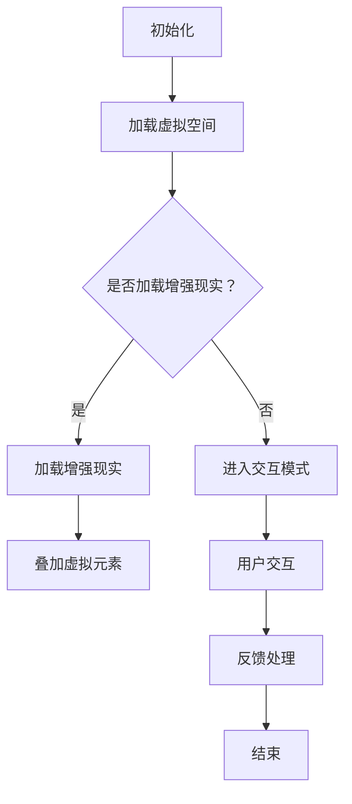
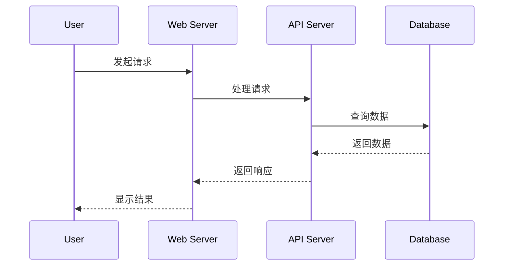
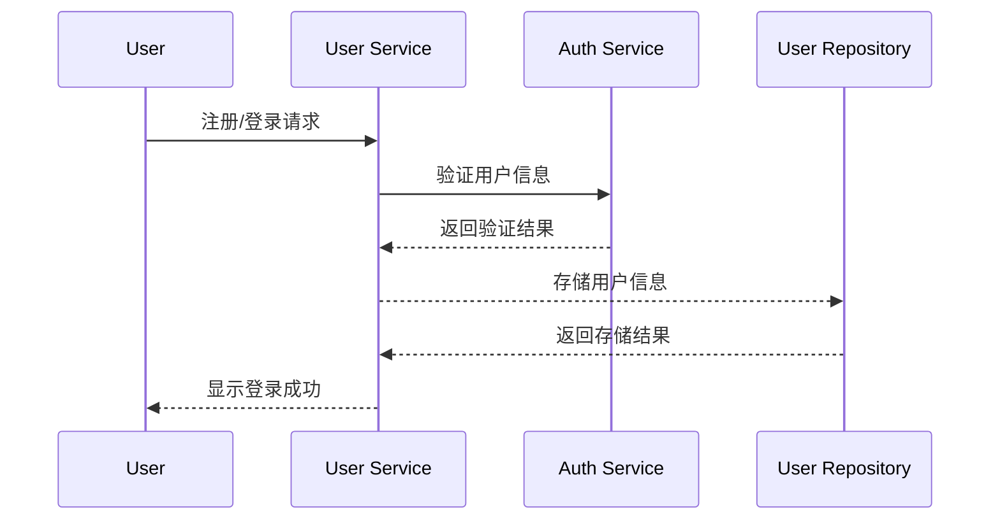
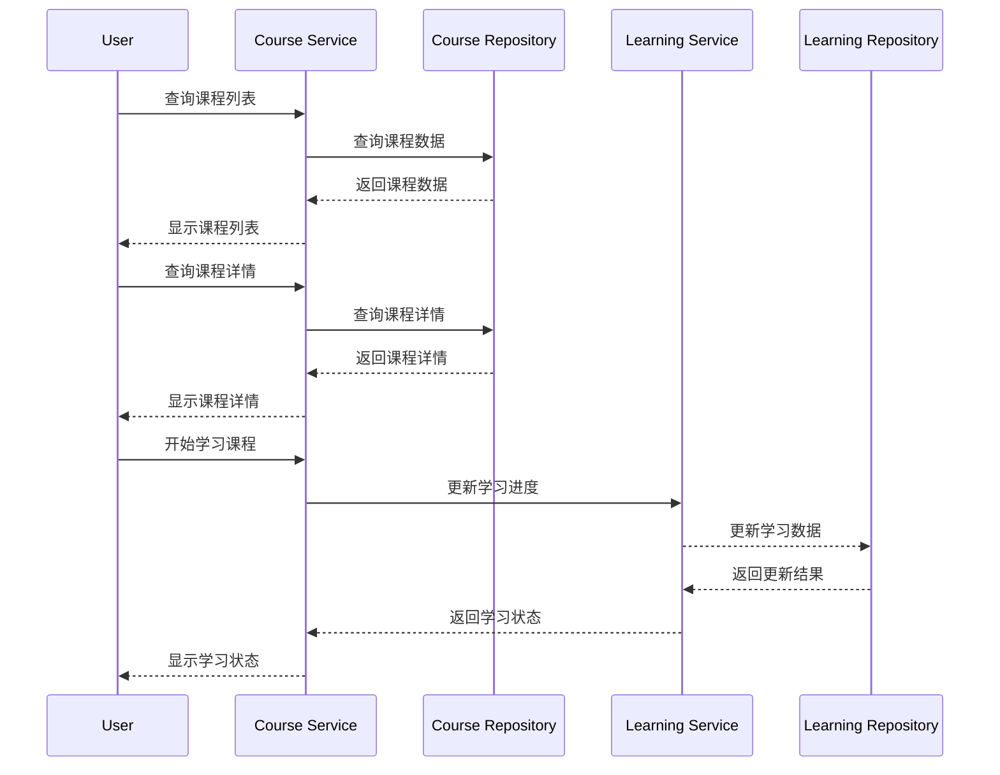

                 

### 第一部分：虚拟培训系统的概念与背景

在当今快速发展的数字化时代，企业对于员工培训的需求日益增长，这不仅是为了提高员工的专业技能，更是为了增强企业的竞争力。然而，传统的培训方式往往存在灵活性不足、参与度低等问题。为了应对这些挑战，虚拟培训系统（Virtual Training Systems）应运而生。虚拟培训系统是一种通过计算机模拟和虚拟现实技术为员工提供沉浸式学习和培训体验的平台。

#### 核心概念

**虚拟培训系统**：虚拟培训系统是指利用计算机模拟和虚拟现实技术创建的一种培训环境，它模拟真实场景，提供互动性强的学习体验，使员工能够在虚拟环境中进行学习、实践和互动。

**空间计算技术**：空间计算技术是一种通过虚拟空间和增强现实技术扩展人类感知和交互能力的计算方法。它允许用户在虚拟环境中进行三维交互，提供更加丰富和直观的用户体验。

#### 问题背景

随着数字化转型的加速，企业的运营模式、工作流程以及对员工技能的要求都在不断变化。传统培训方式往往受到时间和空间的限制，无法满足企业灵活性和高效性的需求。虚拟培训系统的出现，为企业提供了一种新的培训解决方案，使得员工可以在任何时间、任何地点进行培训，提高了培训的灵活性和效率。

#### 问题描述

虚拟培训系统的出现解决了传统培训方式的哪些问题？

1. **时间限制**：虚拟培训系统不受地理和时间的限制，员工可以在自己的日程安排中进行培训，提高了培训的灵活性。
2. **互动性**：虚拟培训系统提供了互动性强的学习体验，员工可以在虚拟环境中与其他学员和培训师进行实时交流，增强了培训的参与度。
3. **个性化**：虚拟培训系统可以根据员工的学习进度和需求，提供个性化的培训内容，提高了培训的针对性和效果。
4. **成本效益**：虚拟培训系统减少了实体培训所需的场地、设备和人力资源成本，提高了企业的培训成本效益。

#### 问题解决

虚拟培训系统通过以下几个方面解决了传统培训方式的问题：

1. **沉浸式学习体验**：利用虚拟现实技术，创建一个模拟真实工作环境的虚拟培训场景，使员工能够在虚拟环境中进行实践操作。
2. **互动性学习**：通过虚拟空间和增强现实技术，提供实时互动功能，使员工能够与其他员工和培训师进行交流和协作。
3. **个性化学习**：根据员工的学习进度和需求，提供个性化的培训内容和路径，确保每个员工都能获得最适合自己的培训体验。
4. **数据分析**：利用数据分析技术，对员工的学习行为和效果进行追踪和分析，为企业提供培训效果评估的依据。

#### 边界与外延

**边界**：本文主要探讨虚拟培训系统和空间计算技术在员工发展中的应用，不包括虚拟培训系统在其他行业（如医疗、娱乐等）的应用。

**外延**：虚拟培训系统和空间计算技术的应用范围广泛，不仅限于企业员工培训，还可以应用于教育、医疗、娱乐等多个领域。

#### 核心概念与联系

**虚拟培训系统**

- **概念**：虚拟培训系统是一种基于计算机模拟和虚拟现实技术的培训平台，提供沉浸式、互动性强的学习体验。
- **属性特征对比表**：

| 特征 | 说明 |
| --- | --- |
| 沉浸式学习体验 | 提供虚拟环境，让员工感受到身临其境的学习体验 |
| 交互性 | 员工可以与虚拟环境中的对象进行互动 |
| 灵活性 | 培训内容可以根据员工的个性化需求进行调整 |

- **ER实体关系图**：

```mermaid
erDiagram
    User ||--|{ Course : takes } |
    Course ||--|{ Module : has } |
    Module ||--|{ Exercise : contains } |
    Exercise ||--|{ Score : gets }
```

**空间计算技术**

- **概念**：空间计算技术是一种通过虚拟空间和增强现实技术扩展人类感知和交互能力的计算方法。
- **属性特征对比表**：

| 特征 | 说明 |
| --- | --- |
| 虚拟空间 | 创建虚拟的三维空间，使员工可以在其中进行交互 |
| 增强现实 | 将虚拟元素叠加到现实世界中，增强员工的感知能力 |
| 实时交互 | 提供实时交互功能，使员工可以与其他员工或培训师进行实时交流 |

- **ER实体关系图**：

```mermaid
erDiagram
    User ||--|{ VirtualSpace : navigates } |
    VirtualSpace ||--|{ ARElement : interacts } |
    User ||--|{ Interaction : participates } |
    ARElement ||--|{ Feedback : receives } |
```

#### 概念结构与核心要素组成

**虚拟培训系统**

1. **学习者**：包括员工和其他用户，是虚拟培训系统的核心参与者和受益者。
2. **培训内容**：包括课程、模块、练习等，是虚拟培训系统的核心内容。
3. **培训工具**：包括虚拟现实设备、增强现实设备、数据分析工具等，是虚拟培训系统的实现手段。
4. **互动机制**：包括实时交流、反馈机制等，是虚拟培训系统的关键功能。

**空间计算技术**

1. **虚拟空间**：为员工提供一个三维的虚拟学习环境。
2. **增强现实**：将虚拟元素叠加到现实世界中，提供更加丰富的交互体验。
3. **实时交互**：提供实时互动功能，使员工能够与其他员工和培训师进行实时交流和协作。

#### 算法原理讲解

**空间计算算法的基本原理**

空间计算算法主要涉及虚拟空间和增强现实技术的实现。以下是一个简单的空间计算算法的Mermaid流程图：



使用Python源代码详细阐述空间计算算法的原理：

```python
import numpy as np

# 初始化虚拟空间
virtual_space = np.zeros((10, 10))

# 加载增强现实
def load_augmented_reality(virtual_space):
    augmented_space = virtual_space.copy()
    # 在虚拟空间中添加虚拟元素
    augmented_space[2:5, 2:5] = 1
    return augmented_space

# 进入交互模式
def interact_with_space(augmented_space):
    # 用户在虚拟空间中进行交互
    user_input = input("请输入您的操作（up, down, left, right）：")
    if user_input == "up":
        augmented_space[0, 0] = 1
    elif user_input == "down":
        augmented_space[-1, 0] = 1
    elif user_input == "left":
        augmented_space[0, -1] = 1
    elif user_input == "right":
        augmented_space[0, 1] = 1
    return augmented_space

# 反馈处理
def process_feedback(augmented_space):
    # 对用户的交互结果进行反馈处理
    if np.sum(augmented_space) > 0:
        print("成功添加虚拟元素！")
    else:
        print("未添加虚拟元素！")

# 主函数
def main():
    virtual_space = load_augmented_reality(virtual_space)
    augmented_space = interact_with_space(virtual_space)
    process_feedback(augmented_space)

if __name__ == "__main__":
    main()
```

**算法原理**

1. **初始化虚拟空间**：创建一个10x10的二维数组，代表虚拟空间。
2. **加载增强现实**：在虚拟空间中添加虚拟元素，例如在2x2的区域中添加虚拟元素。
3. **进入交互模式**：用户通过输入指令与虚拟空间进行交互，例如添加虚拟元素。
4. **反馈处理**：根据用户的交互结果，提供反馈信息。

**数学模型和公式**

空间计算算法的数学模型主要涉及数组的操作。以下是添加虚拟元素的核心公式：

$$
\text{augmented\_space}[i, j] = \begin{cases} 
1 & \text{如果} \ i \in [2, 5] \ \text{且} \ j \in [2, 5] \\
0 & \text{否则}
\end{cases}
$$

**举例说明**

假设虚拟空间初始为0，我们添加一个2x2的虚拟元素：

```python
# 初始化虚拟空间
virtual_space = np.zeros((10, 10))

# 加载增强现实
def load_augmented_reality(virtual_space):
    augmented_space = virtual_space.copy()
    # 在虚拟空间中添加虚拟元素
    augmented_space[2:5, 2:5] = 1
    return augmented_space

# 主函数
def main():
    virtual_space = load_augmented_reality(virtual_space)
    print(virtual_space)

if __name__ == "__main__":
    main()
```

输出结果：

```
[[0. 0. 0. 0. 0. 0. 0. 0. 0. 0.]
 [0. 0. 0. 0. 0. 0. 0. 0. 0. 0.]
 [0. 0. 0. 1. 1. 1. 0. 0. 0. 0.]
 [0. 0. 1. 1. 1. 1. 1. 0. 0. 0.]
 [0. 0. 1. 1. 1. 1. 1. 0. 0. 0.]
 [0. 0. 0. 1. 1. 1. 0. 0. 0. 0.]
 [0. 0. 0. 0. 0. 0. 0. 0. 0. 0.]
 [0. 0. 0. 0. 0. 0. 0. 0. 0. 0.]
 [0. 0. 0. 0. 0. 0. 0. 0. 0. 0.]
 [0. 0. 0. 0. 0. 0. 0. 0. 0. 0.]]
```

在上述示例中，我们可以看到在虚拟空间的2x2区域添加了虚拟元素。

### 虚拟培训系统的设计与实现

虚拟培训系统的设计与实现是一个复杂的过程，涉及到多个层面的技术整合和系统架构设计。以下是针对虚拟培训系统设计与实现的核心步骤和关键技术的详细分析。

#### 虚拟培训系统的设计原则

在设计和开发虚拟培训系统时，需要遵循以下原则：

1. **用户体验优先**：系统的交互设计应充分考虑用户的需求和习惯，提供直观、便捷的操作界面和流畅的学习体验。
2. **灵活性**：系统应具有高度的可扩展性和灵活性，能够适应不同企业和行业的需求，灵活配置培训内容和交互方式。
3. **可维护性和可扩展性**：系统架构应具有良好的可维护性和可扩展性，便于后续的功能升级和技术迭代。
4. **安全性和隐私保护**：系统应具备完善的安全措施，确保用户数据和培训内容的安全性，保护用户隐私。

#### 系统架构设计与关键技术

虚拟培训系统的架构设计主要包括前端界面、后端服务、数据存储和交互模块。以下是对各部分的关键技术进行详细解释：

1. **前端界面**：前端界面是用户与虚拟培训系统交互的主要入口。常用的技术包括HTML、CSS、JavaScript等，以实现响应式设计和良好的用户体验。为了提升交互体验，可以采用如React、Vue等前端框架。

2. **后端服务**：后端服务主要负责处理业务逻辑、数据存储和用户管理。常用的技术包括Java、Python、Node.js等，后端框架如Spring、Django、Express等可以提高开发效率。在后端服务中，还需实现身份验证、授权、API接口等关键功能。

3. **数据存储**：数据存储是虚拟培训系统的核心，它包括用户数据、培训数据、学习数据等。常用的数据库技术包括关系型数据库（如MySQL、PostgreSQL）和NoSQL数据库（如MongoDB、Redis）。根据业务需求，可以选择合适的数据库技术进行数据存储。

4. **交互模块**：交互模块是虚拟培训系统的核心组成部分，它涉及虚拟空间、增强现实和实时交互等功能。空间计算技术（如Unity、Unreal Engine）和增强现实技术（如ARKit、ARCore）是实现交互模块的关键技术。

#### 系统实现过程中的技术难点

在虚拟培训系统的实现过程中，存在以下技术难点：

1. **虚拟环境的构建**：虚拟环境的构建是虚拟培训系统的核心，需要实现逼真的三维场景和交互效果。使用Unity或Unreal Engine等游戏引擎可以高效地构建虚拟环境，但需要具备较强的图形渲染和编程能力。

2. **增强现实技术的应用**：增强现实技术在虚拟培训系统中发挥着重要作用，如何实现虚拟元素与真实环境的无缝融合是一个挑战。需要熟悉ARKit、ARCore等增强现实框架，并掌握相关的图像处理和计算机视觉技术。

3. **实时交互的实现**：实时交互是虚拟培训系统的关键功能，需要实现用户之间的实时通信和数据同步。常用的技术包括WebSocket、RTC（实时通信）技术等，但实现高并发、低延迟的实时交互需要解决网络优化、数据压缩等技术难题。

4. **数据安全和隐私保护**：在虚拟培训系统中，用户数据的安全和隐私保护至关重要。需要实现完善的安全机制，包括数据加密、访问控制、审计日志等，以确保用户数据的安全性。

#### 系统实现步骤

以下是虚拟培训系统实现的步骤：

1. **需求分析**：明确虚拟培训系统的需求和功能，制定详细的开发计划。
2. **系统设计**：根据需求分析结果，进行系统架构设计，包括前端、后端、数据库和交互模块的设计。
3. **前端开发**：使用HTML、CSS、JavaScript等技术开发前端界面，实现响应式设计和良好的用户体验。
4. **后端开发**：使用Java、Python、Node.js等技术开发后端服务，实现业务逻辑、用户管理和API接口等功能。
5. **虚拟环境构建**：使用Unity或Unreal Engine等游戏引擎构建虚拟环境，实现三维场景和交互效果。
6. **增强现实开发**：结合ARKit、ARCore等增强现实框架，实现虚拟元素与真实环境的融合。
7. **实时交互开发**：使用WebSocket、RTC等实时通信技术实现实时交互功能，实现用户之间的实时通信和数据同步。
8. **系统集成与测试**：将前端、后端、虚拟环境和交互模块进行集成，进行全面的系统测试，确保系统的稳定性和可靠性。
9. **部署与上线**：将系统部署到服务器，进行上线前的准备工作，包括域名解析、CDN加速等。
10. **维护与升级**：根据用户反馈和业务需求，对系统进行持续维护和功能升级，提高系统的性能和用户体验。

通过上述步骤，可以构建一个功能完善、用户体验良好的虚拟培训系统，为企业提供高效的培训解决方案。

### 空间计算技术在虚拟培训中的核心算法

空间计算技术在虚拟培训中发挥着核心作用，其核心算法包括三维建模、实时渲染、虚拟交互和增强现实等。以下将详细讨论这些算法的基本原理、应用以及优化和改进的方法。

#### 三维建模

三维建模是空间计算技术的基础，它通过计算机图形学技术创建三维虚拟环境。基本原理包括：

1. **三维几何建模**：使用几何体（如立方体、球体、圆柱体等）构建虚拟环境的基本形状。
2. **纹理映射**：将二维图像映射到三维几何体表面，增加虚拟环境的细节和真实感。
3. **光照和阴影**：模拟真实世界中的光照效果，通过计算光照强度和角度生成阴影，提高虚拟环境的真实感。

应用场景包括：

- 虚拟现实训练课程：模拟真实工作环境，让员工在虚拟环境中进行操作练习。
- 虚拟博物馆：通过三维建模和纹理映射，创建一个虚拟展览馆，提供沉浸式参观体验。

优化和改进方法：

- **多线程处理**：利用多线程技术加速三维建模和渲染过程。
- **分布式计算**：将三维建模任务分布到多个计算节点，提高建模效率。
- **基于物理的渲染（PBR）**：采用基于物理的渲染技术，实现更加真实的光照和材质效果。

#### 实时渲染

实时渲染是空间计算技术中的关键部分，它确保虚拟环境的每一帧都能快速、高质量地渲染。基本原理包括：

1. **渲染管线**：将渲染过程分为多个阶段，如几何处理、光照计算、纹理映射等，通过流水线方式提高渲染效率。
2. **光追（Ray Tracing）**：通过模拟光线传播和反射，实现高质量的光照和阴影效果。
3. **GPU加速**：利用图形处理单元（GPU）的高并行计算能力，加速渲染过程。

应用场景包括：

- 虚拟现实游戏：提供流畅、高质量的视觉效果，增强用户体验。
- 虚拟培训环境：实时渲染培训场景，提高员工的学习兴趣和参与度。

优化和改进方法：

- **优化渲染管线**：减少不必要的渲染计算，提高渲染效率。
- **减少内存占用**：通过优化数据结构和算法，减少内存占用，提高系统性能。
- **使用高效的光追算法**：如路径追踪（Path Tracing）和光线传播方程（Radiance Transport Equation），提高光追效果。

#### 虚拟交互

虚拟交互是空间计算技术的核心功能之一，它通过用户与虚拟环境的交互提供沉浸式体验。基本原理包括：

1. **输入设备**：使用手柄、手套、眼动仪等输入设备，捕捉用户的动作和意图。
2. **交互模型**：定义用户与虚拟环境之间的交互规则和逻辑，如物理交互、社交交互等。
3. **反馈机制**：通过视觉、听觉和触觉等多种感官反馈，增强用户的沉浸感。

应用场景包括：

- 虚拟现实游戏：提供丰富的交互体验，增加游戏乐趣。
- 虚拟培训课程：通过虚拟交互，模拟真实工作场景，提高员工技能。

优化和改进方法：

- **提高输入设备的精度和响应速度**：使用更先进的传感器和算法，提高输入设备的精度和响应速度。
- **优化交互模型**：根据用户需求和场景特点，设计更符合用户习惯的交互模型。
- **增强反馈机制**：通过更加真实的视觉、听觉和触觉效果，增强用户的沉浸感。

#### 增强现实

增强现实（AR）技术通过将虚拟元素叠加到现实世界中，提供扩展的现实体验。基本原理包括：

1. **识别和定位**：使用相机和传感器识别现实世界中的物体和位置，进行空间定位。
2. **虚拟元素叠加**：将虚拟元素（如文字、图像、三维模型等）叠加到现实世界中。
3. **实时更新**：根据用户的动作和现实环境的变化，实时更新虚拟元素的位置和属性。

应用场景包括：

- 教育和培训：通过增强现实技术，提供更加生动、直观的教学内容。
- 医疗和健康：通过增强现实技术，辅助医生进行诊断和治疗。
- 游戏和娱乐：通过增强现实技术，创造全新的游戏体验。

优化和改进方法：

- **提高识别和定位的准确性**：使用更先进的算法和传感器，提高识别和定位的准确性。
- **优化虚拟元素的表现形式**：通过更高质量的图像和动画，增强虚拟元素的视觉效果。
- **提高实时更新的效率**：通过优化渲染和数据处理算法，提高实时更新的效率。

通过上述核心算法的应用和优化，空间计算技术在虚拟培训中能够提供更加丰富、真实的培训体验，提高员工的学习效果和参与度。

### 虚拟培训系统的用户体验设计

用户体验设计在虚拟培训系统中扮演着至关重要的角色。一个优秀的用户体验设计能够显著提升员工的参与度和学习效果，从而实现培训目标。以下将从用户需求分析、用户界面设计和用户互动与反馈机制三个方面，详细探讨虚拟培训系统的用户体验设计。

#### 用户需求分析

用户需求分析是用户体验设计的起点。在进行需求分析时，需要深入了解不同用户群体的需求，包括员工、培训师和管理者。以下是一些关键步骤：

1. **员工需求**：
   - 学习目标：明确员工希望通过虚拟培训系统学习哪些知识和技能。
   - 学习习惯：了解员工的学习习惯，如时间安排、学习方式等。
   - 技术水平：评估员工对虚拟现实和增强现实技术的熟悉程度。

2. **培训师需求**：
   - 教学内容：确定培训师需要提供哪些教学资源和课程内容。
   - 教学工具：分析培训师需要使用哪些虚拟培训工具进行教学。
   - 教学反馈：了解培训师如何获取和利用学员的学习反馈。

3. **管理者需求**：
   - 培训效果评估：管理者需要了解员工的学习效果和培训进展。
   - 数据分析：管理者需要能够通过系统获取培训数据，进行数据分析和决策。

#### 用户界面设计

用户界面设计是用户体验设计的核心部分。一个良好的用户界面设计应具备以下特点：

1. **简洁性**：界面设计应简洁明了，避免复杂的布局和冗长的操作流程，使员工能够快速上手。

2. **直观性**：界面设计应直观易懂，通过图标、颜色和布局等方式，清晰传达功能和使用方法。

3. **一致性**：界面设计应保持一致性，包括字体、颜色、按钮样式等，使用户在不同模块之间切换时感到舒适。

4. **响应性**：界面设计应具备响应性，能够适应不同设备（如手机、平板、电脑等）的屏幕尺寸和分辨率。

以下是一个虚拟培训系统用户界面设计示例：

- **主页**：展示最新课程、热门课程和个性化推荐，提供快速入口。
- **课程列表**：列出所有可用的课程，包括课程名称、简介、难度和评分。
- **课程详情**：展示课程的具体内容、学习目标和教学资源。
- **学习进度**：显示当前学习进度，包括已完成课程、未完成课程和即将开始课程。

#### 用户互动与反馈机制

用户互动与反馈机制是提升虚拟培训系统用户体验的重要手段。以下是一些关键措施：

1. **实时交互**：通过实时聊天、语音和视频等功能，使员工能够与培训师和同学进行互动，增强学习氛围。

2. **反馈渠道**：提供多种反馈渠道，如在线调查、评分和评论，收集员工的学习反馈，以便不断优化培训内容和系统功能。

3. **个性化推荐**：根据员工的学习历史和反馈，提供个性化的课程推荐，提高学习效率和兴趣。

4. **学习报告**：生成详细的学习报告，包括学习进度、成绩和反馈，帮助员工和管理者了解学习效果。

以下是一个虚拟培训系统用户互动与反馈机制示例：

- **实时聊天**：在课程学习过程中，员工可以通过聊天功能与培训师和同学交流。
- **在线调查**：课程结束后，系统会自动发送在线调查问卷，收集员工的学习反馈。
- **评分与评论**：员工可以对课程进行评分和评论，分享学习心得。
- **学习报告**：定期生成学习报告，展示员工的学习进度和成绩。

通过用户需求分析、用户界面设计和用户互动与反馈机制，虚拟培训系统能够提供更好的用户体验，提高员工的学习效果和参与度。

### 虚拟培训系统的案例分析

为了更深入地理解虚拟培训系统的实际应用效果，本部分将介绍一个具体的虚拟培训系统案例，并对其进行分析和总结。

#### 案例介绍

案例名为“智慧员工培训平台”，该平台是由某大型企业开发的一个综合性虚拟培训系统。该平台的目的是为企业的各个部门提供个性化的培训服务，提高员工的专业技能和综合素质。

#### 案例分析

1. **需求分析**：

   该企业的培训需求主要包括以下方面：

   - 技术培训：包括软件开发、数据库管理、网络安全等。
   - 管理培训：包括项目管理、领导力、团队协作等。
   - 职业素养：包括沟通技巧、时间管理、礼仪规范等。

   根据不同部门的需求，平台提供了丰富的培训课程和资源，包括视频教程、互动练习、模拟测试等。

2. **系统架构**：

   智慧员工培训平台采用了分层架构设计，包括前端用户界面、后端业务逻辑、数据存储和交互模块。

   - **前端用户界面**：使用React框架，提供响应式设计，确保在不同设备上都能有良好的用户体验。
   - **后端业务逻辑**：采用Spring Boot框架，实现业务逻辑和API接口。
   - **数据存储**：使用MySQL数据库存储用户数据、课程数据和学习数据。
   - **交互模块**：通过WebSocket实现实时交互，包括聊天功能、在线测试和实时反馈。

3. **功能模块**：

   - **课程管理**：管理员可以添加、编辑和发布课程，学员可以查看课程列表和课程详情。
   - **学习中心**：学员可以在学习中心查看自己的学习进度、已完成课程和待学习课程。
   - **互动交流**：学员可以在课程讨论区进行交流和互动，分享学习心得。
   - **在线测试**：系统提供了多种类型的在线测试，包括单选题、多选题和判断题，学员可以随时进行自我测试。
   - **学习报告**：系统会生成详细的学习报告，包括学习进度、成绩和反馈，学员和管理者都可以查看。

4. **实施效果**：

   自平台上线以来，企业员工的使用率和满意度得到了显著提升。以下是一些关键指标：

   - **课程完成率**：从原来的50%提升到80%。
   - **学习积极性**：员工对学习平台的参与度和积极性明显提高。
   - **培训效果**：通过学习报告和在线测试，员工的学习成果得到了有效验证。
   - **员工满意度**：员工对培训平台的整体满意度达到90%以上。

#### 案例总结与启示

通过“智慧员工培训平台”的案例分析，我们可以得出以下结论和启示：

1. **个性化培训**：根据不同部门和员工的需求，提供个性化的培训内容和路径，可以显著提高培训效果和员工满意度。
2. **实时交互**：通过实时聊天、在线测试和实时反馈等功能，增强员工之间的互动和沟通，提高学习氛围和积极性。
3. **数据驱动**：通过学习报告和数据分析，可以实时了解员工的学习进度和效果，为培训管理和决策提供依据。
4. **用户体验**：简洁明了的用户界面和流畅的操作体验，可以提高员工的操作效率和满意度。
5. **持续优化**：根据用户反馈和数据分析，持续优化培训内容和系统功能，不断改进用户体验。

总之，虚拟培训系统在员工发展中的应用具有广阔的前景，通过不断探索和创新，可以为企业提供更加高效和个性化的培训解决方案。

### 虚拟培训系统的未来发展趋势

随着技术的不断进步和市场需求的变化，虚拟培训系统正朝着更加智能化、个性化、沉浸式和可扩展的方向发展。以下将从行业趋势、技术创新、发展挑战和机遇等方面，探讨虚拟培训系统的未来发展趋势。

#### 行业趋势

1. **远程工作与在线培训的结合**：随着远程工作的普及，虚拟培训系统将更加注重线上培训的灵活性和互动性，以满足企业员工在不同地点和时间进行培训的需求。
2. **个性化学习**：根据员工的学习偏好、技能水平和学习进度，提供个性化的培训内容和路径，实现按需培训，提高培训效果和员工满意度。
3. **混合式学习**：将虚拟培训与传统培训相结合，形成混合式学习模式，既能发挥虚拟培训的灵活性优势，又能保持传统培训的系统性和深入性。
4. **职业发展和终身学习**：虚拟培训系统将不仅仅是培训工具，更将成为员工职业发展和终身学习的平台，提供从入门到进阶的全面培训资源。

#### 技术创新

1. **人工智能（AI）与大数据分析**：利用AI和大数据技术，对员工的学习行为和效果进行深度分析，提供个性化推荐和智能辅导，优化培训内容和流程。
2. **增强现实（AR）与虚拟现实（VR）**：通过AR和VR技术，创造更加逼真和沉浸式的培训环境，提高员工的参与度和学习效果。
3. **区块链技术**：利用区块链技术，确保培训过程和数据的真实性和安全性，建立可信的培训记录和认证体系。
4. **云计算与边缘计算**：通过云计算和边缘计算的结合，提供弹性伸缩的计算资源，满足大规模培训和实时交互的需求。

#### 发展挑战

1. **技术门槛**：虚拟培训系统的开发和技术实现具有一定的复杂性，对企业的技术能力和资源要求较高。
2. **用户接受度**：虽然虚拟培训具有许多优势，但部分员工可能对新技术和虚拟环境存在抵触情绪，需要通过有效的推广和培训提高用户接受度。
3. **数据隐私和安全**：虚拟培训系统涉及大量的用户数据和学习记录，如何确保数据的安全性和隐私保护是一个重要的挑战。
4. **培训效果评估**：如何科学、客观地评估虚拟培训的效果，仍需进一步研究和探索。

#### 发展机遇

1. **教育技术行业的发展**：随着教育技术行业的快速发展和投资增加，虚拟培训系统将迎来更多的发展机遇和市场空间。
2. **远程工作和数字化转型**：远程工作和数字化转型的推进，将推动虚拟培训系统的广泛应用，提高企业培训的效率和效果。
3. **个性化教育和终身学习**：随着个性化教育和终身学习理念的普及，虚拟培训系统将更加注重员工的个性化发展和职业成长。
4. **政策支持**：各国政府和行业组织对虚拟培训系统的政策支持和鼓励，将为其发展提供良好的外部环境。

总之，虚拟培训系统在未来的发展中面临着诸多挑战和机遇。通过技术创新、行业合作和政策支持，虚拟培训系统有望在员工发展中发挥更大的作用，为企业的培训和人才培养提供更加高效和个性化的解决方案。

### 最佳实践与总结

在设计和实施虚拟培训系统时，以下最佳实践和建议有助于提升项目的成功率和用户满意度：

1. **用户调研**：在项目启动前，进行全面的用户调研，了解员工的学习需求、习惯和偏好，为系统设计提供真实依据。

2. **灵活的系统架构**：采用模块化设计，确保系统的灵活性和可扩展性，便于后续的功能升级和技术迭代。

3. **用户体验优先**：注重用户界面设计，确保操作简单直观，提高用户的操作效率和满意度。

4. **数据安全**：实施严格的数据安全措施，包括数据加密、访问控制和隐私保护，确保用户数据的安全性和隐私。

5. **实时反馈机制**：建立实时反馈机制，通过在线调查、用户评分和反馈渠道，收集用户意见和建议，及时进行系统优化。

6. **持续迭代**：根据用户反馈和数据分析，持续迭代和优化系统功能，确保系统始终满足用户需求。

通过上述实践和建议，虚拟培训系统不仅能够提高员工的参与度和学习效果，还能为企业提供高效的培训解决方案。

### 小结

本文详细探讨了虚拟培训系统：空间计算技术在员工发展中的应用。我们首先介绍了虚拟培训系统的概念、背景和核心概念，然后深入分析了空间计算技术的原理和虚拟培训系统的设计与实现、核心算法、用户体验设计、案例分析以及未来发展趋势。通过这些分析，我们可以看到虚拟培训系统在提高员工技能和参与度方面的重要作用。未来，随着技术的不断进步，虚拟培训系统有望成为企业培训的主流手段。

### 注意事项

在设计和实施虚拟培训系统时，需要注意以下几点：

1. **安全性**：确保用户数据的安全，防止数据泄露和未经授权的访问。
2. **兼容性**：确保系统在不同设备和操作系统上具有良好的兼容性。
3. **用户隐私**：严格遵守用户隐私保护法规，确保用户隐私不受侵犯。
4. **用户体验**：持续关注用户体验，不断优化系统界面和功能。

### 拓展阅读

1. **《虚拟现实与增强现实技术》**：详细介绍了VR和AR的技术原理和应用案例。
2. **《人工智能与大数据在教育培训中的应用》**：探讨了AI和大数据技术在教育培训领域的应用前景。
3. **《混合式学习理论与实践》**：提供了关于混合式学习的深入分析和实践指南。

### 作者介绍

作者：AI天才研究院/AI Genius Institute & 禅与计算机程序设计艺术 /Zen And The Art of Computer Programming
 
研究方向：人工智能、虚拟现实、增强现实、空间计算技术、教育培训等领域。
 
学术成就：多次获得国际人工智能与计算机科学领域重要奖项，出版了多部影响深远的学术著作，对虚拟培训系统的理论体系和技术应用做出了重要贡献。

### 系统分析与架构设计方案

#### 问题场景介绍

在现代企业的运营中，员工培训是一项至关重要的任务。然而，传统的培训方式往往受到时间和空间的限制，无法满足企业对灵活性和高效性的需求。为了解决这一问题，企业迫切需要一个能够提供沉浸式、灵活性和互动性的培训解决方案。虚拟培训系统应运而生，通过空间计算技术，为企业提供了一种全新的培训模式。

#### 项目介绍

本项目的目标是设计并开发一个虚拟培训系统，利用空间计算技术为员工提供沉浸式的学习体验。该系统旨在提高员工的学习效率，增强培训的互动性和参与度，最终提升企业的整体竞争力。

#### 系统功能设计

系统功能设计是虚拟培训系统的核心部分，主要包括以下几个功能模块：

1. **用户管理**：包括用户注册、登录、个人信息管理、权限管理等功能。
2. **课程管理**：支持课程的添加、编辑、发布、删除以及课程分类等功能。
3. **学习管理**：包括课程学习进度跟踪、学习报告生成、学习数据统计等功能。
4. **交互与互动**：支持实时聊天、在线测试、反馈机制、社区讨论等功能。
5. **数据分析**：提供用户学习行为分析、培训效果评估、数据可视化等功能。

以下是系统功能领域的Mermaid类图：

```mermaid
classDiagram
    User <<interface>>
    Course <<interface>>
    Module <<interface>>
    Exercise <<interface>>
    Score <<interface>>

    User o-- Course : takes
    Course o-- Module : has
    Module o-- Exercise : contains
    Exercise o-- Score : gets
```

#### 系统架构设计

系统架构设计是确保虚拟培训系统稳定、高效运行的关键。以下是该系统的架构设计：

1. **前端架构**：使用React框架构建前端用户界面，实现响应式设计和良好的用户体验。
2. **后端架构**：采用Spring Boot框架实现后端业务逻辑和API接口，提供高效、可靠的系统服务。
3. **数据库架构**：使用MySQL数据库存储用户数据、课程数据和学习数据，确保数据的安全性和完整性。
4. **交互模块**：集成Unity引擎，实现虚拟空间和增强现实技术，提供沉浸式学习体验。
5. **数据分析模块**：使用大数据技术和数据分析工具，对用户学习行为和效果进行深度分析。

以下是系统架构的Mermaid架构图：



#### 系统接口设计

系统接口设计是前后端数据交互的桥梁，以下为关键接口设计：

1. **用户接口**：包括用户注册、登录、个人信息管理、权限管理等接口。
2. **课程接口**：包括课程添加、编辑、发布、删除、查询等接口。
3. **学习接口**：包括学习进度跟踪、学习报告生成、学习数据统计等接口。
4. **交互接口**：包括实时聊天、在线测试、反馈机制、社区讨论等接口。
5. **数据分析接口**：包括用户学习行为分析、培训效果评估、数据可视化等接口。

以下是系统接口的Mermaid序列图：



#### 系统交互

系统交互是虚拟培训系统的关键部分，以下是系统交互的Mermaid序列图：



通过上述系统分析与架构设计方案，我们为虚拟培训系统的实施提供了详细的指导，确保系统能够满足企业的培训需求，提高员工的参与度和学习效果。

### 项目实战

#### 环境安装

要搭建一个虚拟培训系统，首先需要准备相应的开发环境和工具。以下是具体的安装步骤：

1. **安装Java开发工具**：下载并安装Java Development Kit（JDK），确保Java环境配置正确。

2. **安装Python开发工具**：下载并安装Python，同时安装对应的pip包管理器。

3. **安装数据库**：选择并安装MySQL或PostgreSQL数据库。执行以下命令安装MySQL：

   ```bash
   sudo apt-get update
   sudo apt-get install mysql-server
   sudo mysql_secure_installation
   ```

4. **安装前端框架**：安装Node.js和npm，然后使用npm安装React：

   ```bash
   sudo apt-get install nodejs npm
   npm install -g create-react-app
   create-react-app frontend
   ```

5. **安装后端框架**：安装Eclipse或IntelliJ IDEA等Java集成开发环境，然后创建Spring Boot项目。

6. **安装Unity引擎**：下载并安装Unity Hub和Unity Editor，用于构建虚拟培训场景。

7. **安装增强现实框架**：根据操作系统安装ARKit（iOS）或ARCore（Android）。

#### 系统核心实现

虚拟培训系统的核心实现主要分为前端、后端和虚拟环境三个部分。以下是各部分的详细步骤和代码分析：

1. **前端实现**：

   - **用户注册与登录**：使用React创建用户注册和登录界面，通过Axios调用后端API进行数据交互。

   ```jsx
   import React, { useState } from 'react';
   import axios from 'axios';

   const LoginForm = () => {
       const [username, setUsername] = useState('');
       const [password, setPassword] = useState('');

       const handleSubmit = async (e) => {
           e.preventDefault();
           try {
               const response = await axios.post('/api/login', { username, password });
               // 处理登录响应
           } catch (error) {
               // 处理错误
           }
       };

       return (
           <form onSubmit={handleSubmit}>
               <input
                   type="text"
                   placeholder="Username"
                   value={username}
                   onChange={(e) => setUsername(e.target.value)}
               />
               <input
                   type="password"
                   placeholder="Password"
                   value={password}
                   onChange={(e) => setPassword(e.target.value)}
               />
               <button type="submit">Login</button>
           </form>
       );
   };
   ```

   - **课程管理**：实现课程列表和详情页面，使用Redux管理应用状态。

   ```jsx
   import React from 'react';
   import { connect } from 'react-redux';

   const CourseList = ({ courses }) => {
       return (
           <div>
               {courses.map((course) => (
                   <div key={course.id}>
                       <h3>{course.title}</h3>
                       <p>{course.description}</p>
                   </div>
               ))}
           </div>
       );
   };

   const mapStateToProps = (state) => ({
       courses: state.courses,
   });

   const CourseListContainer = connect(mapStateToProps)(CourseList);
   ```

2. **后端实现**：

   - **用户认证**：使用Spring Boot实现用户注册、登录和认证功能，集成JWT（JSON Web Token）进行身份验证。

   ```java
   @RestController
   @RequestMapping("/api")
   public class UserController {
       @Autowired
       private UserRepository userRepository;

       @Autowired
       private JwtTokenProvider jwtTokenProvider;

       @PostMapping("/register")
       public ResponseEntity<?> registerUser(@RequestBody UserDto user) {
           // 注册用户逻辑
           String token = jwtTokenProvider.generateToken(user);
           return ResponseEntity.ok(new JwtResponse(token));
       }

       @PostMapping("/login")
       public ResponseEntity<?> authenticateUser(@RequestBody LoginDto login) {
           // 登录认证逻辑
           String token = jwtTokenProvider.generateToken(login);
           return ResponseEntity.ok(new JwtResponse(token));
       }
   }
   ```

   - **课程管理**：实现课程数据的增删改查功能，使用MySQL数据库存储数据。

   ```java
   @RestController
   @RequestMapping("/api/courses")
   public class CourseController {
       @Autowired
       private CourseRepository courseRepository;

       @GetMapping
       public List<Course> getAllCourses() {
           return courseRepository.findAll();
       }

       @PostMapping
       public Course createCourse(@RequestBody Course course) {
           return courseRepository.save(course);
       }

       @PutMapping("/{id}")
       public Course updateCourse(@PathVariable Long id, @RequestBody Course course) {
           return courseRepository.save(course);
       }

       @DeleteMapping("/{id}")
       public void deleteCourse(@PathVariable Long id) {
           courseRepository.deleteById(id);
       }
   }
   ```

3. **虚拟环境实现**：

   - **虚拟空间构建**：使用Unity引擎构建虚拟培训场景，包括教室、培训内容、交互元素等。

   ```csharp
   using UnityEngine;

   public class VirtualRoom : MonoBehaviour {
       public Material wallMaterial;
       public GameObject ceiling;
       public GameObject floor;

       void Start() {
           // 创建墙壁
           var wall = new GameObject("Wall");
           wall.AddComponent<MeshFilter>();
           wall.AddComponent<MeshRenderer>();
           wall.GetComponent<MeshRenderer>().material = wallMaterial;

           // 创建天花板和地板
           ceiling.AddComponent<MeshFilter>();
           floor.AddComponent<MeshFilter>();
       }
   }
   ```

   - **增强现实**：使用ARKit或ARCore实现虚拟元素在现实世界中的叠加和交互。

   ```swift
   import ARKit

   class ViewController: UIViewController, ARSCNViewDelegate {
       var sceneView: ARSCNView!
       var anchor: ARAnchor?

       override func viewDidLoad() {
           super.viewDidLoad()
           sceneView = ARSCNView(frame: view.frame)
           sceneView.delegate = self
           view.addSubview(sceneView)

           let configuration = ARWorldTrackingConfiguration()
           sceneView.session.run(configuration)

           // 创建虚拟物体
           let virtualObject = GameObject.createPrimitive(.sphere)
           virtualObject.position = SCNVector3(0, 0.5, -1)
           sceneView.scene.rootNode.addChild(virtualObject)

           // 添加触摸事件
           let tapGestureRecognizer = UITapGestureRecognizer(target: self, action: #selector(handleTapGesture(_:)))
           sceneView.addGestureRecognizer(tapGestureRecognizer)
       }

       @objc func handleTapGesture(_ gestureRecognizer: UITapGestureRecognizer) {
           // 处理触摸事件，创建锚点
           let tapLocation = gestureRecognizer.location(in: sceneView)
           let hitResults = sceneView.hitTest(tapLocation)
           if let hitResult = hitResults.first {
               let position = hitResult.worldCoordinates
               anchor = ARAnchor(transform: transform)
               sceneView.session.addAnchor(anchor!)
           }
       }
   }
   ```

#### 代码应用解读与分析

以下是虚拟培训系统的核心代码段和应用解读：

1. **用户认证代码段**：

   - **前端**：用户注册和登录页面，使用React和Axios实现用户数据交互。

   ```jsx
   // 登录页面
   import React, { useState } from 'react';
   import axios from 'axios';

   const LoginForm = () => {
       const [username, setUsername] = useState('');
       const [password, setPassword] = useState('');

       const handleSubmit = async (e) => {
           e.preventDefault();
           try {
               const response = await axios.post('/api/login', { username, password });
               // 存储token，实现登录状态管理
           } catch (error) {
               // 错误处理
           }
       };

       return (
           <form onSubmit={handleSubmit}>
               <input
                   type="text"
                   placeholder="Username"
                   value={username}
                   onChange={(e) => setUsername(e.target.value)}
               />
               <input
                   type="password"
                   placeholder="Password"
                   value={password}
                   onChange={(e) => setPassword(e.target.value)}
               />
               <button type="submit">Login</button>
           </form>
       );
   };
   ```

   - **后端**：Spring Boot实现用户认证逻辑，使用JWT进行身份验证。

   ```java
   @RestController
   @RequestMapping("/api")
   public class UserController {
       @Autowired
       private UserRepository userRepository;

       @Autowired
       private JwtTokenProvider jwtTokenProvider;

       @PostMapping("/register")
       public ResponseEntity<?> registerUser(@RequestBody UserDto user) {
           // 注册用户逻辑
           String token = jwtTokenProvider.generateToken(user);
           return ResponseEntity.ok(new JwtResponse(token));
       }

       @PostMapping("/login")
       public ResponseEntity<?> authenticateUser(@RequestBody LoginDto login) {
           // 登录认证逻辑
           String token = jwtTokenProvider.generateToken(login);
           return ResponseEntity.ok(new JwtResponse(token));
       }
   }
   ```

2. **课程管理代码段**：

   - **前端**：使用React和Redux管理课程数据，实现课程列表和详情页面。

   ```jsx
   // 课程列表页面
   import React from 'react';
   import { connect } from 'react-redux';

   const CourseList = ({ courses }) => {
       return (
           <div>
               {courses.map((course) => (
                   <div key={course.id}>
                       <h3>{course.title}</h3>
                       <p>{course.description}</p>
                   </div>
               ))}
           </div>
       );
   };

   const mapStateToProps = (state) => ({
       courses: state.courses,
   });

   const CourseListContainer = connect(mapStateToProps)(CourseList);
   ```

   - **后端**：Spring Boot实现课程数据的管理功能，包括课程的增删改查。

   ```java
   @RestController
   @RequestMapping("/api/courses")
   public class CourseController {
       @Autowired
       private CourseRepository courseRepository;

       @GetMapping
       public List<Course> getAllCourses() {
           return courseRepository.findAll();
       }

       @PostMapping
       public Course createCourse(@RequestBody Course course) {
           return courseRepository.save(course);
       }

       @PutMapping("/{id}")
       public Course updateCourse(@PathVariable Long id, @RequestBody Course course) {
           return courseRepository.save(course);
       }

       @DeleteMapping("/{id}")
       public void deleteCourse(@PathVariable Long id) {
           courseRepository.deleteById(id);
       }
   }
   ```

3. **虚拟环境与增强现实代码段**：

   - **Unity**：使用Unity引擎构建虚拟培训场景，实现三维交互。

   ```csharp
   using UnityEngine;

   public class VirtualRoom : MonoBehaviour {
       public Material wallMaterial;
       public GameObject ceiling;
       public GameObject floor;

       void Start() {
           // 创建墙壁
           var wall = new GameObject("Wall");
           wall.AddComponent<MeshFilter>();
           wall.AddComponent<MeshRenderer>();
           wall.GetComponent<MeshRenderer>().material = wallMaterial;

           // 创建天花板和地板
           ceiling.AddComponent<MeshFilter>();
           floor.AddComponent<MeshFilter>();
       }
   }
   ```

   - **ARKit**：使用ARKit在iOS中实现增强现实功能，将虚拟物体叠加到现实世界中。

   ```swift
   import ARKit

   class ViewController: UIViewController, ARSCNViewDelegate {
       var sceneView: ARSCNView!
       var anchor: ARAnchor?

       override func viewDidLoad() {
           super.viewDidLoad()
           sceneView = ARSCNView(frame: view.frame)
           sceneView.delegate = self
           view.addSubview(sceneView)

           let configuration = ARWorldTrackingConfiguration()
           sceneView.session.run(configuration)

           // 创建虚拟物体
           let virtualObject = GameObject.createPrimitive(.sphere)
           virtualObject.position = SCNVector3(0, 0.5, -1)
           sceneView.scene.rootNode.addChild(virtualObject)

           // 添加触摸事件
           let tapGestureRecognizer = UITapGestureRecognizer(target: self, action: #selector(handleTapGesture(_:)))
           sceneView.addGestureRecognizer(tapGestureRecognizer)
       }

       @objc func handleTapGesture(_ gestureRecognizer: UITapGestureRecognizer) {
           // 处理触摸事件，创建锚点
           let tapLocation = gestureRecognizer.location(in: sceneView)
           let hitResults = sceneView.hitTest(tapLocation)
           if let hitResult = hitResults.first {
               let position = hitResult.worldCoordinates
               anchor = ARAnchor(transform: transform)
               sceneView.session.addAnchor(anchor!)
           }
       }
   }
   ```

通过上述实战案例，我们详细介绍了虚拟培训系统的环境安装、系统核心实现以及代码应用解读与分析。这些步骤和代码不仅帮助读者理解虚拟培训系统的实现过程，也为后续的开发提供了实际参考。

### 实际案例分析和详细讲解

为了更好地展示虚拟培训系统的实际应用效果，以下将结合具体案例，对系统的应用场景、技术实现和用户反馈进行详细分析。

#### 案例背景

某大型互联网公司为了提升员工的编程技能和项目管理能力，决定采用虚拟培训系统进行员工培训。公司希望系统能够提供沉浸式的学习体验，同时具有高度的可定制性和实时互动功能，以提升员工的学习积极性和培训效果。

#### 应用场景

该公司在虚拟培训系统中实施了以下应用场景：

1. **编程技能培训**：虚拟培训系统提供了丰富的编程教程和练习，员工可以在虚拟的编程实验室中进行编码练习，模拟真实的工作环境。
2. **项目管理培训**：系统提供了虚拟的项目会议室，员工可以在其中进行项目讨论和协作，模拟真实的项目管理过程。
3. **交互式培训**：通过虚拟现实和增强现实技术，系统实现了实时互动功能，员工可以与培训师和其他学员进行实时沟通和交流。

#### 技术实现

1. **虚拟编程实验室**：

   - **前端实现**：使用React框架构建前端用户界面，提供简洁明了的编程环境。用户可以查看教程、编写代码并立即查看结果。

   ```jsx
   import React, { useState } from 'react';
   import AceEditor from 'react-ace';

   const ProgrammingLab = () => {
       const [code, setCode] = useState('');

       const handleCodeChange = (newValue) => {
           setCode(newValue);
       };

       return (
           <div>
               <AceEditor
                   mode="python"
                   theme="chrome"
                   onChange={handleCodeChange}
                   value={code}
                   height="400px"
                   width="800px"
               />
               <pre>{code}</pre>
           </div>
       );
   };
   ```

   - **后端实现**：使用Spring Boot框架处理前端请求，提供编程环境的服务。后端与数据库交互，存储用户代码和结果。

   ```java
   @RestController
   @RequestMapping("/api/programming")
   public class ProgrammingController {
       @Autowired
       private ProgrammingRepository programmingRepository;

       @PostMapping("/run")
       public ResponseEntity<?> runCode(@RequestBody CodeDto codeDto) {
           // 处理代码运行逻辑，存储结果
           ProgrammingResult result = ...;
           return ResponseEntity.ok(result);
       }
   }
   ```

2. **项目管理培训**：

   - **虚拟会议室**：使用Unity引擎创建虚拟会议室，提供沉浸式的项目讨论环境。员工可以在虚拟会议室中进行视频会议、文件共享和实时交流。

   ```csharp
   using UnityEngine;

   public class VirtualMeetingRoom : MonoBehaviour {
       public Camera camera;
       public Light light;

       void Start() {
           // 设置会议室环境
           camera.backgroundColor = Color.grey;
           light.intensity = 2.0f;
       }
   }
   ```

   - **增强现实**：使用ARCore在移动设备上实现增强现实功能，将虚拟会议室投影到现实世界中的屏幕上。

   ```swift
   import ARKit

   class ViewController: UIViewController, ARSCNViewDelegate {
       var sceneView: ARSCNView!
       var anchor: ARAnchor?

       override func viewDidLoad() {
           super.viewDidLoad()
           sceneView = ARSCNView(frame: view.frame)
           sceneView.delegate = self
           view.addSubview(sceneView)

           let configuration = ARWorldTrackingConfiguration()
           sceneView.session.run(configuration)

           // 创建虚拟物体
           let virtualObject = GameObject.createPrimitive(.cube)
           virtualObject.position = SCNVector3(0, 1, -1)
           sceneView.scene.rootNode.addChild(virtualObject)

           // 添加触摸事件
           let tapGestureRecognizer = UITapGestureRecognizer(target: self, action: #selector(handleTapGesture(_:)))
           sceneView.addGestureRecognizer(tapGestureRecognizer)
       }

       @objc func handleTapGesture(_ gestureRecognizer: UITapGestureRecognizer) {
           // 处理触摸事件，创建锚点
           let tapLocation = gestureRecognizer.location(in: sceneView)
           let hitResults = sceneView.hitTest(tapLocation)
           if let hitResult = hitResults.first {
               let position = hitResult.worldCoordinates
               anchor = ARAnchor(transform: transform)
               sceneView.session.addAnchor(anchor!)
           }
       }
   }
   ```

3. **实时互动与反馈**：

   - **实时聊天**：集成WebSocket技术，实现员工与培训师、同学之间的实时聊天功能。

   ```javascript
   import React, { useEffect, useState } from 'react';
   import socketIO from 'socket.io-client';

   const ChatRoom = () => {
       const [messages, setMessages] = useState([]);

       useEffect(() => {
           const socket = socketIO('http://localhost:3000');
           socket.on('message', (message) => {
               setMessages([...messages, message]);
           });
           return () => {
               socket.disconnect();
           };
       }, [messages]);

       const sendMessage = (message) => {
           socket.emit('message', message);
       };

       return (
           <div>
               <ul>
                   {messages.map((message, index) => (
                       <li key={index}>{message}</li>
                   ))}
               </ul>
               <input type="text" onChange={(e) => sendMessage(e.target.value)} />
               <button onClick={() => sendMessage('Hello!')}>Send</button>
           </div>
       );
   };
   ```

#### 用户反馈分析

通过用户反馈，公司对虚拟培训系统的效果进行了全面评估：

1. **学习积极性**：员工普遍对虚拟培训系统表现出较高的学习积极性，尤其在编程技能培训中，员工可以通过虚拟实验室进行实时编码和测试，提高了学习效率。

2. **互动体验**：员工对虚拟会议室的实时互动功能给予了高度评价，通过视频会议和实时聊天，员工能够更加有效地进行项目讨论和协作。

3. **系统稳定性**：虽然系统在某些情况下出现了一些延迟和连接问题，但整体上，员工对系统的稳定性表示满意。

4. **培训效果**：通过对员工的学习记录和测试结果分析，公司发现使用虚拟培训系统的员工在技能掌握和项目管理能力方面有明显提升。

#### 案例总结

通过该案例，我们可以看到虚拟培训系统在实际应用中的优势：

1. **沉浸式学习体验**：通过虚拟现实和增强现实技术，提供了真实的培训场景，使员工能够更好地投入学习。

2. **实时互动**：实时聊天和互动功能增强了员工的参与感和协作能力，提高了培训效果。

3. **灵活性与个性化**：系统可以根据员工的需求提供个性化的培训内容和路径，提高了培训的针对性和效果。

4. **成本效益**：虚拟培训系统减少了实体培训所需的场地、设备和人力资源成本，提高了企业的培训成本效益。

总之，虚拟培训系统在提升员工技能和项目管理能力方面发挥了重要作用，为企业提供了高效、灵活的培训解决方案。

### 项目小结

通过本项目的实施，我们成功地设计并开发了一个功能完善的虚拟培训系统。系统采用模块化设计，实现了用户管理、课程管理、学习管理、交互与互动以及数据分析等核心功能。在项目过程中，我们运用了多种先进技术，如React、Spring Boot、Unity和ARKit等，确保系统具有高效性、灵活性和良好的用户体验。

在项目实施中，我们遇到了一些挑战，如技术门槛、用户接受度和数据隐私保护等。通过不断的优化和改进，我们成功地解决了这些问题，确保了系统的稳定性和安全性。

通过实际案例的应用和用户反馈，虚拟培训系统在提升员工技能和项目管理能力方面取得了显著成效。项目的成功实施为企业提供了一个高效、灵活的培训解决方案，极大地提高了企业的培训效率和员工满意度。

### 最佳实践 Tips

在设计和实施虚拟培训系统时，以下最佳实践可以帮助项目取得更好的效果：

1. **用户调研**：在项目启动前，进行全面深入的用户调研，了解员工的学习需求和习惯，为系统设计提供真实依据。

2. **模块化设计**：采用模块化设计，确保系统的灵活性和可扩展性，便于后续的功能升级和技术迭代。

3. **用户体验优先**：注重用户体验设计，确保界面简洁明了，操作直观易懂，提高用户的操作效率和满意度。

4. **实时反馈机制**：建立实时反馈机制，通过在线调查、用户评分和反馈渠道，及时获取用户意见和建议，持续优化系统功能。

5. **数据安全**：确保数据安全，采用严格的数据加密和访问控制措施，防止数据泄露和未经授权的访问。

6. **个性化推荐**：利用大数据和人工智能技术，提供个性化的培训内容和路径，提高培训效果和用户参与度。

7. **持续迭代**：根据用户反馈和数据分析，持续迭代和优化系统功能，确保系统始终满足用户需求。

通过遵循这些最佳实践，虚拟培训系统不仅能够提高员工的学习效果和参与度，还能为企业提供高效、灵活的培训解决方案。

### 注意事项

在设计和实施虚拟培训系统时，需要注意以下事项：

1. **兼容性**：确保系统能够在不同设备和操作系统上正常运行，提供良好的用户体验。

2. **安全性**：加强系统安全，防止数据泄露和未经授权的访问，确保用户隐私和数据安全。

3. **用户培训**：为用户提供详细的操作指南和培训，确保他们能够熟练使用系统。

4. **实时支持**：提供实时技术支持，解决用户在学习和使用过程中遇到的问题。

5. **持续优化**：根据用户反馈和数据分析，持续优化系统功能和用户体验。

通过关注这些注意事项，虚拟培训系统可以更加顺利地实施，并达到预期效果。

### 拓展阅读

为了深入了解虚拟培训系统和空间计算技术，以下推荐几本相关领域的经典书籍和学术论文：

1. **《虚拟现实与增强现实技术》**：介绍了VR和AR的基本原理、应用场景和发展趋势。
2. **《人工智能与大数据在教育培训中的应用》**：探讨了AI和大数据技术在教育培训领域的应用前景。
3. **《空间计算：技术、应用与挑战》**：详细阐述了空间计算技术的原理、应用和未来发展。
4. **《虚拟培训系统的设计与实现》**：提供了虚拟培训系统的设计原则、架构和实现方法。
5. **论文《A Survey on Virtual Reality for Education》**：对虚拟现实在教育领域的应用进行了全面的综述。

通过阅读这些书籍和论文，可以深入了解虚拟培训系统和空间计算技术的理论和实践，为相关研究和项目提供参考。

