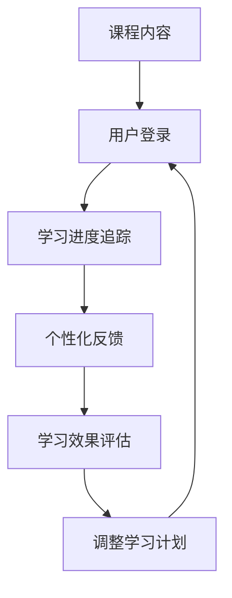
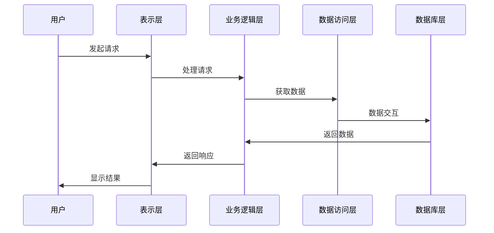

                 

### 虚拟培训系统：空间计算技术提升员工技能

#### 关键词：虚拟培训系统、空间计算、员工技能提升、技术实现、案例分析

> 摘要：本文将深入探讨虚拟培训系统与空间计算技术的结合，分析其如何通过先进的计算技术提升员工技能。我们将详细阐述虚拟培训系统的基本概念、空间计算的核心原理，以及这两种技术在实际应用中的有机结合。通过案例分析和最佳实践分享，本文旨在为企业和教育机构提供有效的培训解决方案。

----------------------------------------------------------------

# 第一部分：引言

## 1.1 背景介绍

### 1.1.1 虚拟培训系统的起源与发展

虚拟培训系统起源于20世纪90年代，随着互联网技术的发展而逐渐成熟。早期，虚拟培训系统主要以在线课程和电子书籍的形式存在，主要是为了提供便捷的学习资源。随着虚拟现实（VR）和增强现实（AR）技术的进步，虚拟培训系统开始融合空间计算技术，为用户提供更加沉浸式、互动性和个性化的学习体验。

### 1.1.2 空间计算技术的概念与演进

空间计算技术是指通过计算机处理空间数据，模拟现实世界中的物体、环境以及人机交互的技术。这一概念最早由美国麻省理工学院的Paul Milgram和Fumio Kishino在1996年提出。随着传感器、图形处理和人工智能技术的发展，空间计算技术逐渐从理论研究走向实际应用，成为虚拟培训系统的重要组成部分。

### 1.1.3 虚拟培训系统与空间计算技术的结合

虚拟培训系统与空间计算技术的结合，为员工技能提升带来了新的契机。空间计算技术通过虚拟现实和增强现实，为员工提供了更加真实、直观的学习环境，有助于加深对知识的理解和记忆。同时，空间计算技术还能够根据员工的学习进度和表现，提供个性化的学习建议和反馈，提高培训的针对性和效率。

## 1.2 书籍结构

### 1.2.1 目录概述

本书分为四个部分，首先介绍虚拟培训系统和空间计算技术的背景和基础概念，然后详细探讨虚拟培训系统的系统架构设计和技术实现，接着通过实际案例展示虚拟培训系统的应用效果，最后总结最佳实践和未来发展趋势。

### 1.2.2 阅读指南

为了更好地理解本书内容，建议读者按照以下顺序阅读：
1. 先阅读第一部分，了解虚拟培训系统和空间计算技术的基本概念。
2. 逐步阅读第二部分和第三部分，掌握系统架构设计和技术实现的具体细节。
3. 通过第四部分的案例分析，了解虚拟培训系统的实际应用效果。
4. 最后阅读总结部分，获取最佳实践和未来发展趋势。

### 1.2.3 学习目标

通过本书的学习，读者应达到以下目标：
1. 理解虚拟培训系统和空间计算技术的基本概念和原理。
2. 掌握虚拟培训系统的系统架构设计和关键技术实现。
3. 了解虚拟培训系统的实际应用案例和最佳实践。
4. 能够根据企业需求，设计和实现有效的虚拟培训系统。

----------------------------------------------------------------

# 第二部分：基础概念

## 2.1 虚拟培训系统

### 2.1.1 定义与核心概念

虚拟培训系统是一种通过计算机和网络技术，为用户提供在线学习资源和互动体验的系统。它包括课程内容管理、学习进度跟踪、学习效果评估等多个功能模块，旨在提高员工的学习效率和培训效果。

### 2.1.2 技术分类与特点

虚拟培训系统主要采用以下几种技术：
1. **虚拟现实（VR）**：通过计算机模拟出三维空间，用户可以通过头戴式显示器和手柄设备进行交互，获得沉浸式的学习体验。
2. **增强现实（AR）**：在现实环境中叠加虚拟内容，用户可以通过智能手机或平板电脑看到增强后的世界，适合于现场培训和指导。
3. **多媒体技术**：包括视频、音频、动画等多种形式，丰富学习内容，提高学习兴趣。

### 2.1.3 虚拟培训系统的应用场景

虚拟培训系统广泛应用于企业培训、高等教育、职业教育等多个领域，以下是一些典型的应用场景：
1. **企业培训**：通过虚拟培训系统，企业可以高效地开展新员工入职培训、技能提升培训等。
2. **高等教育**：虚拟培训系统可以为大学生提供在线课程、实验模拟等学习资源，增强教学效果。
3. **职业教育**：虚拟培训系统可以帮助职业院校学生进行专业技能训练，提高就业竞争力。

## 2.2 空间计算技术

### 2.2.1 空间计算的基本概念

空间计算是指通过计算机模拟和计算空间数据，实现虚拟空间与现实空间之间的交互。它包括以下几个核心概念：
1. **三维建模**：通过计算机算法，将现实世界中的物体和场景建模成三维数字模型。
2. **空间感知**：通过传感器和计算技术，获取虚拟空间和现实空间中的物体位置、方向等信息。
3. **人机交互**：通过计算机和传感器技术，实现人与虚拟空间之间的交互。

### 2.2.2 空间计算技术的核心原理

空间计算技术的核心原理主要包括：
1. **计算机视觉**：通过图像识别和处理技术，实现对虚拟空间中物体和场景的识别和理解。
2. **图形渲染**：通过图形处理技术，将虚拟空间中的三维模型渲染成图像，显示在用户面前的显示器上。
3. **人工智能**：通过机器学习和深度学习技术，实现对虚拟空间中物体和场景的智能识别和交互。

### 2.2.3 空间计算技术的优势与应用

空间计算技术具有以下优势：
1. **沉浸式体验**：通过虚拟现实和增强现实技术，用户可以获得更加真实、直观的体验，提高学习兴趣和效果。
2. **实时交互**：通过空间计算技术，用户可以实时与虚拟空间中的物体和场景进行交互，增强学习互动性。
3. **个性化定制**：通过人工智能技术，系统可以根据用户的学习进度和表现，提供个性化的学习建议和反馈，提高学习效率。

空间计算技术广泛应用于以下几个领域：
1. **教育培训**：通过虚拟培训系统，提高员工和学生的技能水平。
2. **医疗健康**：通过虚拟现实技术，进行医学教学和手术模拟。
3. **游戏娱乐**：通过虚拟现实和增强现实技术，提供沉浸式的游戏体验。
4. **城市规划**：通过虚拟现实技术，进行城市规划和建筑设计。

## 2.3 空间计算在虚拟培训中的应用

### 2.3.1 虚拟现实与空间计算的结合

虚拟现实（VR）技术是空间计算技术在虚拟培训中应用的重要形式。通过VR技术，用户可以进入一个完全虚拟的学习环境，进行模拟操作和互动学习。空间计算技术为VR培训提供了实时交互和沉浸式体验，使得培训过程更加生动和有趣。

### 2.3.2 增强现实与空间计算的结合

增强现实（AR）技术是将虚拟内容叠加到现实世界中，用户可以通过智能手机或平板电脑看到增强后的场景。空间计算技术为AR培训提供了丰富的交互功能，用户可以在现实环境中进行虚拟操作和实验，提高学习效果。

### 2.3.3 虚拟培训系统中的空间计算技术

在虚拟培训系统中，空间计算技术主要用于以下几个方面：
1. **课程内容制作**：通过空间计算技术，将理论知识转化为虚拟场景，提高学生的学习兴趣和效果。
2. **学习过程监控**：通过空间计算技术，实时监控学生的学习过程和表现，提供个性化的学习建议和反馈。
3. **培训效果评估**：通过空间计算技术，对培训效果进行量化评估，为后续培训提供依据。

## 2.4 核心概念与联系

### 2.4.1 虚拟培训系统与空间计算技术的联系

虚拟培训系统与空间计算技术密切相关，空间计算技术为虚拟培训提供了更加真实、互动和个性化的学习体验。虚拟培训系统则通过空间计算技术，实现了培训内容的虚拟化、互动化和个性化。

### 2.4.2 关键技术的属性特征对比

| 技术类型 | 虚拟现实（VR） | 增强现实（AR） | 空间计算 |
| :--: | :--: | :--: | :--: |
| 屏幕显示 | 完全虚拟环境 | 现实环境叠加虚拟内容 | 虚拟空间与现实空间的交互 |
| 交互方式 | 头戴式显示器和手柄 | 智能手机或平板电脑 | 传感器和计算技术 |
| 应用场景 | 模拟操作和互动学习 | 现场培训和指导 | 教育培训、医疗健康、游戏娱乐等 |

### 2.4.3 ER实体关系图架构

```mermaid
erDiagram
  Course  ||--|{ User } : has_access_to
  User    ||--|{ Training } : has
  Training ||--|{ Content } : has
  Content  ||--|{ Evaluation } : has
```

在上面的ER实体关系图中，我们定义了课程（Course）、用户（User）、培训（Training）、内容和评估（Evaluation）四个实体，以及它们之间的关联关系。这个关系图可以帮助我们更好地理解虚拟培训系统中的数据结构和交互关系。

----------------------------------------------------------------

## 2.5 算法原理讲解

### 2.5.1 虚拟培训系统算法流程图



### 2.5.2 Python源代码

```python
# 虚拟培训系统算法实现
class VirtualTrainingSystem:
    def __init__(self, course, user):
        self.course = course
        self.user = user
        self.learning_progress = {}

    def login(self):
        print(f"{self.user} 已登录课程：{self.course}")

    def track_learning_progress(self):
        self.learning_progress[self.user] = self.course.get_progress()

    def provide_individual_feedback(self):
        progress = self.course.get_progress(self.user)
        if progress < 50:
            print(f"{self.user}，您的学习进度较低，建议加强学习。")
        elif progress < 80:
            print(f"{self.user}，您的学习进度良好，保持现状。")
        else:
            print(f"{self.user}，您的学习进度优秀，可以考虑加深学习。")

    def evaluate_learning_effect(self):
        progress = self.course.get_progress(self.user)
        if progress >= 80:
            print(f"{self.user}，您的学习效果较好，符合预期。")
        else:
            print(f"{self.user}，您的学习效果一般，需要进一步努力。")

    def adjust_learning_plan(self):
        progress = self.course.get_progress(self.user)
        if progress < 50:
            self.course.increase_difficulty()
        elif progress >= 80:
            self.course.decrease_difficulty()

# 测试
course = Course("Python编程基础")
user = "张三"
training_system = VirtualTrainingSystem(course, user)
training_system.login()
training_system.track_learning_progress()
training_system.provide_individual_feedback()
training_system.evaluate_learning_effect()
training_system.adjust_learning_plan()
```

### 2.5.3 数学模型与公式

在虚拟培训系统中，学习进度和效果评估是一个关键指标。我们使用以下数学模型和公式进行计算：

$$
学习进度(Progress) = \frac{已学习内容(CompletedContent)}{总内容(TotalContent)}
$$

$$
学习效果(EvaluationScore) = Progress \times (1 + \alpha \times (1 - Progress))
$$

其中，$\alpha$ 是一个调整参数，用于根据学习进度调整评估得分。

### 2.5.4 举例说明

假设用户“张三”正在学习“Python编程基础”课程，课程总内容为100个知识点，张三已学习60个知识点。

1. **学习进度计算**：
$$
学习进度(Progress) = \frac{60}{100} = 0.6
$$

2. **学习效果评估**：
假设调整参数 $\alpha = 0.2$，
$$
学习效果(EvaluationScore) = 0.6 \times (1 + 0.2 \times (1 - 0.6)) = 0.6 \times (1 + 0.2 \times 0.4) = 0.6 \times 1.08 = 0.648
$$

根据评估得分，张三的学习效果为良好。

通过上述算法原理讲解，我们可以看到虚拟培训系统如何通过数学模型和公式，对学习进度和效果进行评估，并根据评估结果调整学习计划。

----------------------------------------------------------------

## 2.6 系统分析与架构设计方案

### 2.6.1 问题场景介绍

在现代社会，企业对于员工技能提升的需求日益增长。然而，传统的培训方式往往存在学习效果不佳、成本高等问题。为了解决这些问题，我们需要设计一个高效、低成本的虚拟培训系统。

### 2.6.2 项目介绍

本项目旨在设计一个基于空间计算技术的虚拟培训系统，通过虚拟现实和增强现实技术，为员工提供沉浸式、互动性和个性化的学习体验。系统将涵盖课程内容管理、学习进度追踪、个性化反馈、学习效果评估等功能。

### 2.6.3 系统功能设计

虚拟培训系统的主要功能包括：
1. **用户管理**：用户注册、登录、个人信息管理。
2. **课程管理**：课程内容发布、更新、删除。
3. **学习进度追踪**：记录用户的学习进度和完成情况。
4. **个性化反馈**：根据用户的学习表现，提供个性化的学习建议和反馈。
5. **学习效果评估**：对用户的学习效果进行量化评估。
6. **系统维护**：系统更新、故障排除等。

### 2.6.4 系统架构设计

虚拟培训系统的整体架构可以分为四个层次：表示层、业务逻辑层、数据访问层和数据库层。

1. **表示层**：用户界面，包括网页、移动应用等。
2. **业务逻辑层**：处理用户请求、业务逻辑处理等。
3. **数据访问层**：与数据库进行数据交互。
4. **数据库层**：存储用户信息、课程内容、学习进度等数据。

### 2.6.5 系统架构图



### 2.6.6 系统接口设计

1. **用户接口**：包括注册、登录、个人信息管理、课程浏览、学习进度追踪等功能。
2. **内部接口**：包括课程内容管理、学习进度追踪、个性化反馈、学习效果评估等功能。
3. **系统集成接口**：与外部系统（如人事管理系统、财务系统等）进行数据交互。

### 2.6.7 系统交互设计

1. **用户行为流程**：用户注册、登录、浏览课程、学习、反馈和评估。
2. **培训流程设计**：课程发布、学习、评估、反馈、调整。
3. **数据分析流程**：收集用户学习数据、分析学习效果、生成报告。

通过上述系统分析与架构设计方案，我们可以看到一个完整的虚拟培训系统是如何设计的，包括系统功能、架构设计、接口设计和交互设计等关键要素。

----------------------------------------------------------------

## 2.7 项目实战

### 2.7.1 环境安装

为了实现虚拟培训系统，我们需要安装以下软件和工具：
1. **Python 3.x**：作为编程语言。
2. **Django**：作为Web框架。
3. **PyQt5**：作为用户界面库。
4. **OpenGL**：作为图形渲染库。
5. **ARCore/ARKit**：作为增强现实开发库。

安装步骤如下：
1. 安装Python 3.x，并配置环境变量。
2. 安装Django：
```bash
pip install django
```
3. 安装PyQt5：
```bash
pip install PyQt5
```
4. 安装OpenGL：
```bash
pip install pyopengl
```
5. 安装ARCore/ARKit，根据操作系统选择相应的安装命令。

### 2.7.2 系统核心实现

虚拟培训系统的核心实现主要包括用户管理、课程管理、学习进度追踪、个性化反馈和学习效果评估等功能。以下是一个简单的实现示例：

```python
# 用户管理
class UserManager:
    def register_user(self, username, password):
        # 注册用户
        pass

    def login_user(self, username, password):
        # 用户登录
        pass

# 课程管理
class CourseManager:
    def create_course(self, course_name, course_content):
        # 创建课程
        pass

    def update_course(self, course_id, course_content):
        # 更新课程
        pass

    def delete_course(self, course_id):
        # 删除课程
        pass

# 学习进度追踪
class LearningProgressTracker:
    def track_progress(self, user_id, course_id, progress):
        # 记录学习进度
        pass

# 个性化反馈
class IndividualFeedback:
    def provide_feedback(self, user_id, course_id):
        # 提供个性化反馈
        pass

# 学习效果评估
class LearningEffectEvaluation:
    def evaluate_effect(self, user_id, course_id):
        # 评估学习效果
        pass
```

### 2.7.3 代码应用解读与分析

以上代码定义了用户管理、课程管理、学习进度追踪、个性化反馈和学习效果评估四个核心模块。在实际应用中，这些模块通过接口进行交互，实现系统的功能。

1. **用户管理**：用户可以通过注册和登录功能，管理自己的账户信息。
2. **课程管理**：管理员可以创建、更新和删除课程，管理课程内容。
3. **学习进度追踪**：系统可以记录用户的学习进度，为用户提供个性化的学习建议。
4. **个性化反馈**：根据用户的学习表现，系统可以提供个性化的反馈，帮助用户改进学习策略。
5. **学习效果评估**：系统可以评估用户的学习效果，为培训效果提供数据支持。

### 2.7.4 实际案例分析与详细讲解

以下是一个实际案例：

**案例**：某企业使用虚拟培训系统进行新员工入职培训。

**分析**：
1. **用户管理**：企业可以注册新员工账户，并分配相应的权限。
2. **课程管理**：企业可以创建入职培训课程，包括企业文化、规章制度、基本技能等。
3. **学习进度追踪**：系统可以记录新员工的学习进度，并在达到一定进度后，自动发送学习反馈。
4. **个性化反馈**：系统可以根据新员工的学习表现，提供针对性的学习建议，如加强某部分内容的复习。
5. **学习效果评估**：在培训结束后，系统可以评估新员工的学习效果，并根据评估结果调整培训计划。

**详细讲解**：
1. **用户管理**：在注册新员工时，系统需要收集员工的基本信息，如姓名、职位、联系方式等。注册成功后，员工可以使用用户名和密码登录系统，开始学习。
2. **课程管理**：企业可以根据培训需求，创建不同的课程，并设置课程的开始时间和结束时间。课程内容可以包括文本、图片、视频等多媒体形式。
3. **学习进度追踪**：系统会记录员工在每个课程中的学习进度，并在员工完成课程后，自动发送学习反馈。学习反馈可以包括学习时长、完成率、考试成绩等。
4. **个性化反馈**：系统可以根据员工的学习进度和表现，提供个性化的学习建议。例如，如果员工在某个课程中的表现较差，系统可以建议员工加强该部分内容的复习。
5. **学习效果评估**：在培训结束后，系统会对员工的学习效果进行评估，生成详细的评估报告。评估报告可以包括员工的学习进度、考试成绩、培训满意度等。

通过以上实际案例，我们可以看到虚拟培训系统如何帮助企业进行新员工入职培训，提高培训效果。

### 2.7.5 项目小结

本项目通过虚拟培训系统，实现了用户管理、课程管理、学习进度追踪、个性化反馈和学习效果评估等功能。在实际应用中，企业可以根据培训需求，灵活调整系统功能，提高培训效果。未来，我们将继续优化系统，增加更多实用功能，为企业和员工提供更好的培训体验。

----------------------------------------------------------------

## 2.8 最佳实践 Tips

在设计和实施虚拟培训系统时，以下是一些最佳实践和注意事项：

1. **需求分析**：在项目初期，充分了解企业培训需求，确保系统功能满足实际需求。
2. **用户体验**：注重用户体验设计，确保系统界面简洁易用，提高用户满意度。
3. **技术选型**：根据项目需求和预算，选择合适的技术栈，确保系统性能和稳定性。
4. **安全性**：确保系统数据的安全性和隐私保护，防止数据泄露。
5. **可扩展性**：设计系统架构时，考虑未来的扩展性，以便在需要时添加新功能。
6. **持续优化**：根据用户反馈和数据分析，持续优化系统功能和性能。

### 2.8.1 小结

本文详细介绍了虚拟培训系统与空间计算技术的结合，阐述了系统的基本概念、架构设计、技术实现和实际应用。通过案例分析和最佳实践分享，我们了解了如何利用虚拟培训系统提升员工技能。未来，随着空间计算技术的发展，虚拟培训系统将在教育培训领域发挥更大作用。

### 2.8.2 注意事项

1. **兼容性**：确保系统在不同设备和操作系统上都能正常运行。
2. **性能优化**：优化系统性能，提高响应速度和稳定性。
3. **数据分析**：充分利用数据分析，为培训效果提供量化依据。
4. **用户隐私**：严格保护用户隐私，遵守相关法律法规。

### 2.8.3 拓展阅读

1. **《虚拟现实与增强现实技术导论》**：了解虚拟现实和增强现实技术的基本原理和应用。
2. **《人工智能在教育中的应用》**：探讨人工智能技术在教育培训领域的应用。
3. **《企业培训管理》**：深入了解企业培训管理的理论和实践。

作者：AI天才研究院/AI Genius Institute & 禅与计算机程序设计艺术 /Zen And The Art of Computer Programming

