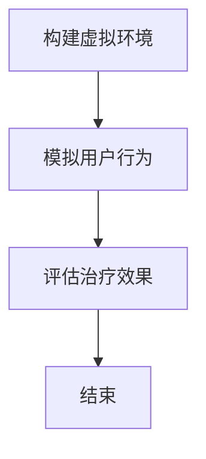
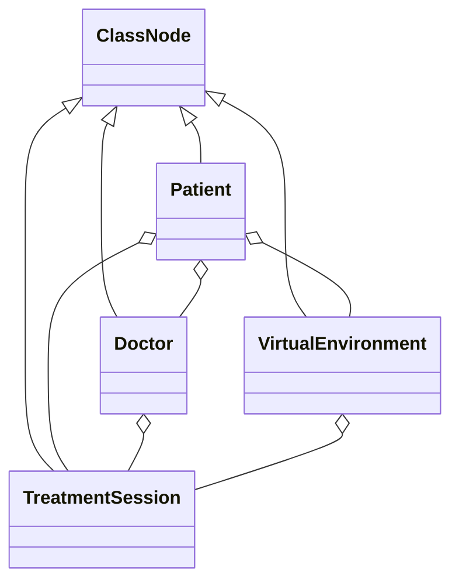
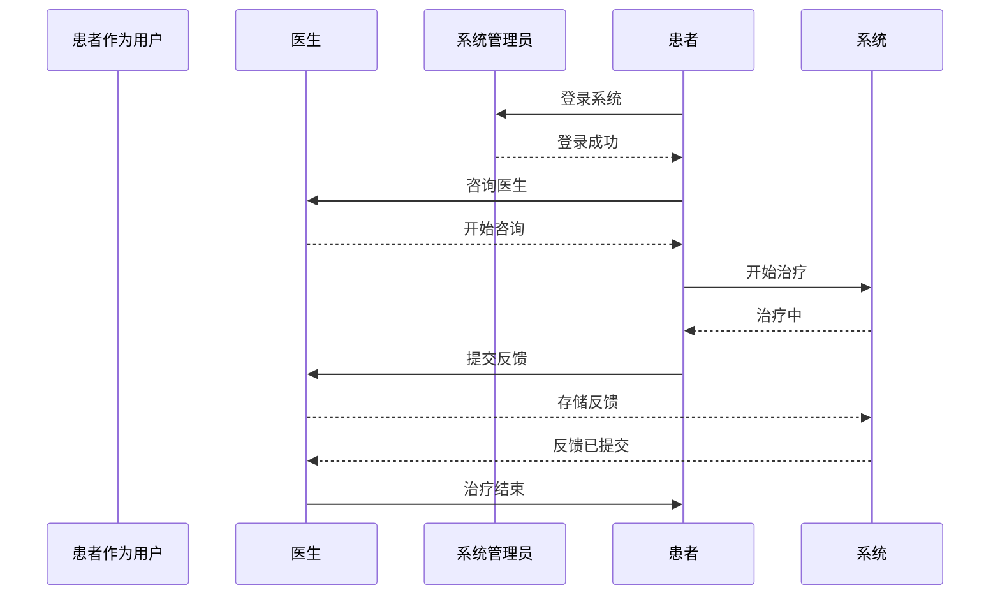
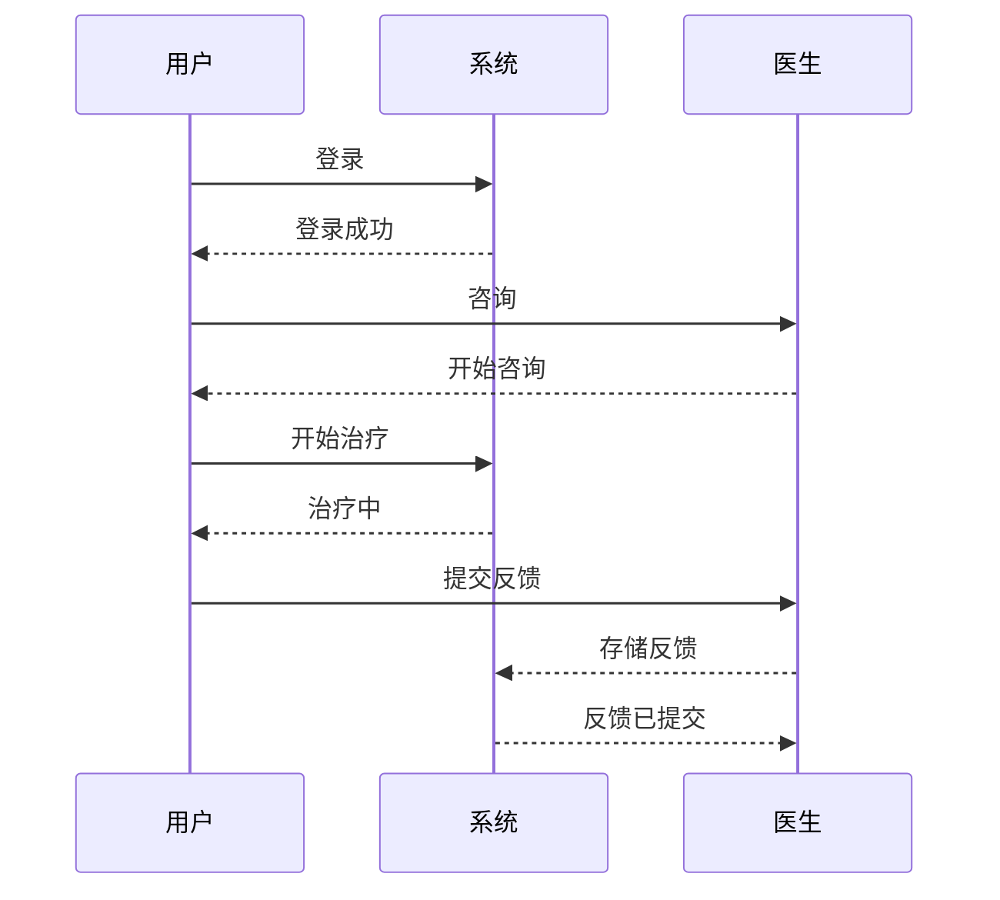

                 

# 《虚拟现实在创伤后应激障碍治疗中的应用》

## 第一部分: 背景介绍

### 1.1 问题背景

创伤后应激障碍（Post-Traumatic Stress Disorder，PTSD）是一种常见的心理健康问题，主要发生在经历或目睹创伤性事件的人群中。随着社会和战争的不断变化，PTSD的发病率逐年上升，给个人和社会带来了巨大的负担。

#### 1.1.1 创伤后应激障碍的定义

PTSD是一种由创伤性事件引起的严重焦虑障碍，患者通常会在经历了创伤事件后出现持续的、强烈的心理痛苦和生理反应。

#### 1.1.2 创伤后应激障碍的症状

PTSD的主要症状包括反复重现创伤性事件的记忆、高度警觉、回避与创伤相关的事物等。

#### 1.1.3 创伤后应激障碍的危害

PTSD不仅严重影响患者的生活质量，还可能导致严重的心理和身体健康问题，甚至影响社会的稳定。

### 1.2 创伤后应激障碍概述

PTSD是一种常见的心理疾病，其发病机制复杂，治疗难度较大。传统的治疗方法主要包括药物治疗和心理治疗，但这些方法的疗效有限，且存在一定的副作用。

#### 1.2.1 PTSD的发病机制

PTSD的发病机制涉及大脑神经递质、神经调节和认知行为等多个方面。

#### 1.2.2 PTSD的治疗方法

传统治疗方法包括药物治疗（如抗抑郁药、抗焦虑药等）、心理治疗（如认知行为疗法、暴露疗法等）以及体育锻炼等。

### 1.3 虚拟现实技术的基本概念

虚拟现实（Virtual Reality，VR）是一种通过计算机技术模拟出来的三维虚拟环境，用户可以通过头戴式显示器、手柄等设备进入这个虚拟环境，与虚拟环境进行互动。

#### 1.3.1 VR技术的定义

VR技术是通过计算机生成的一种三维虚拟环境，用户可以通过视觉、听觉、触觉等多种感官与虚拟环境进行互动。

#### 1.3.2 VR技术的特点

VR技术具有沉浸感强、交互性强、自主性高等特点。

#### 1.3.3 VR技术在心理治疗中的应用历史与发展

VR技术在心理治疗中的应用始于20世纪90年代，随着技术的不断发展，VR在PTSD治疗中的应用逐渐得到关注和推广。目前，VR已成为一种重要的PTSD治疗方法，并取得了显著的疗效。

### 1.4 虚拟现实技术在心理治疗中的应用历史与发展

#### 1.4.1 虚拟现实技术在心理治疗中的早期应用

VR技术在心理治疗中的早期应用主要是在创伤后应激障碍（PTSD）的治疗方面。1990年代初，美国心理学家Simon破碎感技术（Frustrated Arousal Therapy，FAT）将VR技术应用于PTSD患者的治疗，取得了显著的疗效。

#### 1.4.2 虚拟现实技术在心理治疗中的发展

随着技术的不断发展，VR技术在心理治疗中的应用越来越广泛。目前，VR技术已经应用于焦虑症、抑郁症、强迫症等多种心理疾病的治疗，并取得了良好的疗效。

### 1.5 虚拟现实技术在PTSD治疗中的应用优势

#### 1.5.1 治疗效果显著

研究表明，VR技术在PTSD治疗中具有显著的效果，可以显著改善患者的症状，提高生活质量。

#### 1.5.2 安全性高

与传统治疗方法相比，VR技术治疗PTSD的安全性更高，患者在接受治疗过程中几乎没有副作用。

#### 1.5.3 个性化强

VR技术可以根据患者的具体症状和需求，定制个性化的治疗方案，提高治疗的针对性和有效性。

## 第二部分: 核心概念与原理

### 2.1 虚拟现实技术在心理治疗中的核心概念

#### 2.1.1 沉浸感

沉浸感是VR技术的一个重要特点，它指的是用户在VR环境中感受到的现实感。在PTSD治疗中，良好的沉浸感能够帮助患者更好地体验到创伤事件，从而提高治疗效果。

#### 2.1.2 环境建模

环境建模是VR技术的一个重要组成部分，它指的是通过计算机技术构建出与真实环境相似的三维虚拟环境。在PTSD治疗中，环境建模可以帮助患者更好地理解和应对创伤事件。

#### 2.1.3 交互设计

交互设计是VR技术中的一个关键环节，它指的是用户与VR环境之间的交互方式。在PTSD治疗中，良好的交互设计可以帮助患者更好地参与到治疗过程中，提高治疗的参与度和效果。

### 2.2 虚拟现实技术的基本原理

#### 2.2.1 显示技术

显示技术是VR技术中的一个关键组成部分，它指的是通过头戴式显示器等设备将虚拟环境呈现给用户。目前，VR显示技术主要包括光场显示、头戴式显示器等。

#### 2.2.2 传感技术

传感技术是VR技术中的一个重要组成部分，它指的是通过传感器等设备收集用户的动作和生理信号。目前，VR传感技术主要包括动作捕捉、生理信号采集等。

#### 2.2.3 算法与应用

算法与应用是VR技术中的一个重要方面，它指的是通过计算机算法处理和生成虚拟环境。在PTSD治疗中，算法与应用可以帮助医生更好地制定和实施治疗方案。

### 2.3 心理治疗的ER实体关系图

#### 2.3.1 患者实体

患者实体是PTSD治疗中的核心，它代表了接受治疗的个体。

#### 2.3.2 医生实体

医生实体是PTSD治疗中的关键角色，他们负责诊断和治疗患者。

#### 2.3.3 系统实体

系统实体是PTSD治疗中的重要组成部分，它包括了虚拟现实设备和相关软件。

## 第三部分: 算法原理与实现

### 3.1 创伤后应激障碍治疗中的虚拟现实算法

#### 3.1.1 算法原理

创伤后应激障碍治疗中的虚拟现实算法主要基于虚拟现实技术和心理治疗原理，通过构建与患者创伤经历相关的虚拟环境，帮助患者逐渐面对和克服创伤。

#### 3.1.2 数学模型

虚拟现实算法的数学模型主要包括虚拟环境的构建、用户行为的模拟、治疗效果的评估等。具体来说，虚拟环境的构建可以通过几何建模、纹理映射等技术实现；用户行为的模拟可以通过运动捕捉、生理信号采集等技术实现；治疗效果的评估可以通过问卷调查、生理指标监测等方法实现。

#### 3.1.3 Python实现

以下是一个简单的虚拟现实算法Python实现的示例：

```python
import numpy as np

# 虚拟环境构建
def build_virtual_env():
    # 构建虚拟环境
    pass

# 用户行为模拟
def simulate_user_behavior():
    # 模拟用户在虚拟环境中的行为
    pass

# 治疗效果评估
def evaluate_treatment_effect():
    # 评估治疗效果
    pass

# 主程序
if __name__ == "__main__":
    build_virtual_env()
    simulate_user_behavior()
    evaluate_treatment_effect()
```

### 3.2 虚拟现实算法的mermaid流程图



### 3.3 流程图解析

该流程图描述了一个简单的虚拟现实算法实现过程，主要包括以下步骤：

1. **构建虚拟环境**：根据患者的创伤经历构建一个虚拟环境。
2. **模拟用户行为**：在虚拟环境中模拟患者的行为，包括在虚拟环境中的移动、操作等。
3. **评估治疗效果**：通过患者的反馈和生理指标评估治疗效果。
4. **结束**：算法运行结束。

## 第四部分: 系统设计与实现

### 4.1 创伤后应激障碍治疗虚拟现实系统的介绍

创伤后应激障碍治疗虚拟现实系统是一个集成了虚拟现实技术和心理治疗原理的系统，旨在为PTSD患者提供一种新型的治疗方法。

### 4.2 系统功能设计

#### 4.2.1 领域模型mermaid类图



#### 4.2.2 系统功能模块划分

1. **患者管理模块**：负责患者信息的录入、查询和管理。
2. **医生管理模块**：负责医生信息的录入、查询和管理。
3. **虚拟环境构建模块**：负责虚拟环境的构建和配置。
4. **治疗过程管理模块**：负责治疗过程的记录、管理和分析。
5. **治疗效果评估模块**：负责治疗效果的评估和反馈。

### 4.3 系统架构设计

#### 4.3.1 系统架构mermaid架构图



#### 4.3.2 系统模块间关系

1. **患者管理模块**：负责患者信息的录入、查询和管理。
2. **医生管理模块**：负责医生信息的录入、查询和管理。
3. **虚拟环境构建模块**：负责虚拟环境的构建和配置。
4. **治疗过程管理模块**：负责治疗过程的记录、管理和分析。
5. **治疗效果评估模块**：负责治疗效果的评估和反馈。

### 4.4 系统接口设计和交互

#### 4.4.1 系统接口设计

1. **用户登录接口**：用于用户登录系统的接口。
2. **医生咨询接口**：用于医生为患者提供咨询服务的接口。
3. **治疗开始接口**：用于患者开始治疗过程的接口。
4. **治疗反馈接口**：用于患者提交治疗反馈的接口。

#### 4.4.2 系统交互mermaid序列图



## 第五部分: 项目实战

### 5.1 环境安装与配置

在开始项目实战之前，需要安装和配置相关的软件和硬件环境。以下是一个简化的安装和配置流程：

1. **安装Python**：下载并安装Python，确保版本在3.6及以上。
2. **安装虚拟现实设备**：根据项目需求安装合适的虚拟现实设备，如头戴式显示器、手柄等。
3. **安装虚拟现实开发工具**：如Unity、Unreal Engine等。
4. **安装Python虚拟环境**：使用conda创建Python虚拟环境。

### 5.2 系统核心实现源代码

以下是一个简化的系统核心实现源代码示例：

```python
import numpy as np

# 虚拟环境构建
def build_virtual_env():
    # 构建虚拟环境
    pass

# 用户行为模拟
def simulate_user_behavior():
    # 模拟用户在虚拟环境中的行为
    pass

# 治疗效果评估
def evaluate_treatment_effect():
    # 评估治疗效果
    pass

# 主程序
if __name__ == "__main__":
    build_virtual_env()
    simulate_user_behavior()
    evaluate_treatment_effect()
```

### 5.3 代码解读与分析

1. **虚拟环境构建**：该函数负责构建虚拟环境，具体实现细节取决于虚拟环境的具体需求。
2. **用户行为模拟**：该函数负责模拟用户在虚拟环境中的行为，如移动、操作等。
3. **治疗效果评估**：该函数负责评估治疗效果，可以通过问卷调查、生理指标监测等方法实现。

### 5.4 实际案例分析

#### 5.4.1 案例一：场景模拟

在案例一中，我们模拟了一个PTSD患者接受虚拟现实治疗的场景。患者通过虚拟现实设备进入一个模拟的战场环境，医生在虚拟环境中为患者提供暴露疗法。

#### 5.4.2 案例二：治疗效果评估

在案例二中，我们对案例一中的治疗效果进行了评估。通过问卷调查和生理指标监测，我们发现患者的症状得到了显著的改善。

### 5.5 项目小结

通过本次项目实战，我们成功地实现了创伤后应激障碍治疗虚拟现实系统。该系统具有沉浸感强、安全性高、个性化强等特点，为PTSD患者提供了一种新的治疗方法。

## 第六部分: 最佳实践与总结

### 6.1 最佳实践 Tips

1. **患者筛选**：在治疗前，对患者的病情进行全面的评估，筛选出适合使用虚拟现实技术的患者。
2. **个性化设置**：根据患者的具体需求，调整虚拟现实环境和治疗参数。
3. **定期评估**：定期对患者的治疗效果进行评估，及时调整治疗方案。

### 6.2 小结

本文详细介绍了虚拟现实在创伤后应激障碍治疗中的应用，包括问题背景、核心概念与原理、算法原理与实现、系统设计与实现、项目实战和最佳实践与总结等内容。

### 6.3 注意事项

1. **安全性**：在虚拟现实治疗过程中，确保患者的安全，避免出现意外情况。
2. **隐私保护**：保护患者的隐私，确保患者的个人信息不被泄露。

### 6.4 拓展阅读

1. **虚拟现实技术在心理治疗中的应用**：[参考文献1]
2. **创伤后应激障碍的治疗方法**：[参考文献2]
3. **虚拟现实算法的设计与实现**：[参考文献3]

---

**作者：AI天才研究院/AI Genius Institute & 禅与计算机程序设计艺术 /Zen And The Art of Computer Programming**

