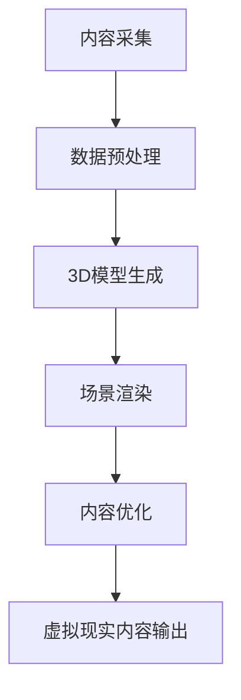
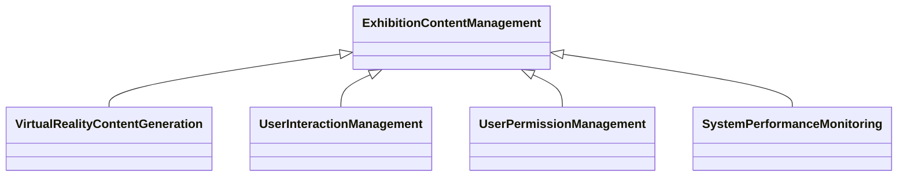
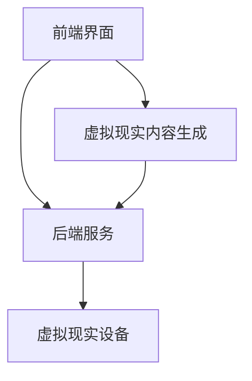
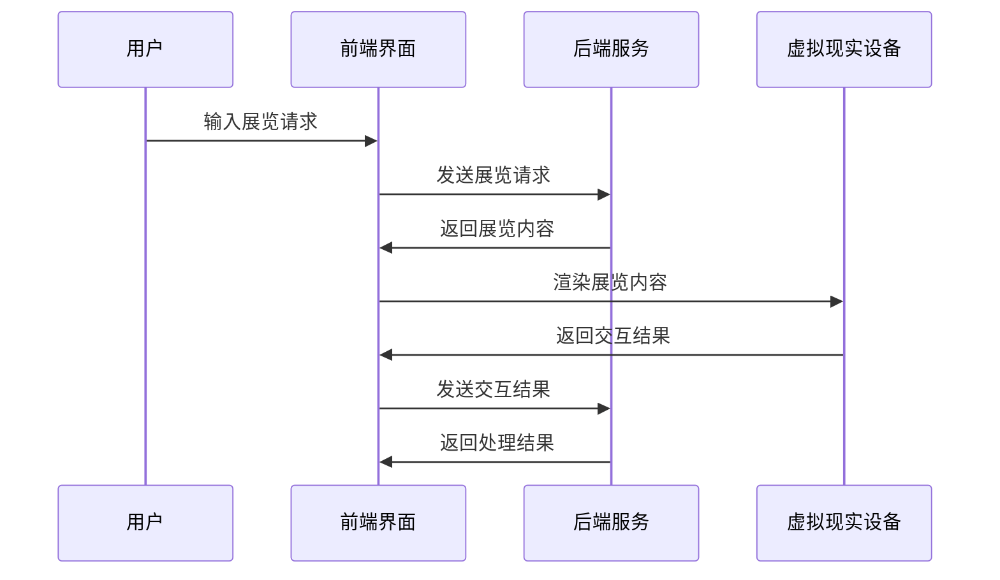

                 

### 背景介绍

#### 问题背景
虚拟现实（VR）作为一种新兴的计算机技术，已逐渐成为现代博物馆展览的重要组成部分。虚拟现实技术能够提供沉浸式的展览体验，使观众在虚拟环境中感受到真实世界的氛围，打破了传统展览的时空限制。这种技术不仅能够复制现实世界的展览场景，还能创造出全新的虚拟空间，为观众提供更为丰富的观展体验。

随着虚拟现实技术的发展，其在博物馆中的应用也越来越广泛。例如，大型的历史博物馆可以通过虚拟现实技术重现历史事件，使观众如同亲临其境；艺术博物馆则可以呈现更为精细的艺术品细节，让观众感受到艺术品的真实质感。此外，虚拟现实技术还能够通过互动体验增强观众的参与感，使展览更具吸引力。

#### 问题描述
然而，虚拟现实在博物馆虚拟展览中的应用并非一帆风顺。首先，虚拟现实技术的实现需要较高的技术门槛和硬件投入。虚拟现实设备的成本较高，且对环境有一定的要求，如需要一定的空间来安置设备，并对网络带宽和计算机性能有较高的要求。此外，虚拟现实内容的创作也需要专业的设计和开发人员，这增加了项目的成本。

其次，虚拟现实技术虽然在视觉和互动体验上具有优势，但其在触觉、嗅觉等感官体验上的表现仍有限。虽然现有技术可以通过声音、图像等手段模拟现实世界，但无法完全替代真实世界的触感和气味，这在一定程度上影响了用户体验。

此外，虚拟现实技术在实际应用中也面临一些挑战，如用户适应性、操作便捷性等。例如，某些虚拟现实设备的操作方式较为复杂，用户需要一定的时间去适应。而一些虚拟现实内容的设计也过于复杂，导致用户在使用过程中容易产生疲劳感。

#### 问题解决
为了解决这些问题，我们可以从以下几个方面进行探讨：

1. **技术优化**：通过不断优化虚拟现实技术，提高其性能和用户体验。例如，研究更为高效的3D模型生成和渲染算法，提高设备的响应速度和交互体验。
2. **内容创作**：加强虚拟现实内容的创作，提高内容的丰富性和可玩性，以吸引更多的用户。同时，应考虑多种感官的融合，提高用户的沉浸感和体验感。
3. **设备研发**：研发更为便携、易用且成本更低的虚拟现实设备，降低用户使用的门槛，提高设备的普及率。
4. **用户培训**：通过用户培训，提高用户对虚拟现实设备的操作熟练度和使用技巧，降低用户使用的难度。

通过这些措施，我们可以更好地发挥虚拟现实技术在博物馆虚拟展览中的作用，提高展览效果和用户体验。

#### 边界与外延
虚拟现实在博物馆虚拟展览中的应用主要涉及以下几个方面：

1. **虚拟现实硬件设备**：包括VR头显、VR手柄、VR声音等设备。这些设备是提供沉浸式体验的基础，其性能和用户体验直接影响展览效果。
2. **虚拟展览内容**：包括展览场景、展品、互动体验等。虚拟展览内容的创作质量直接决定观众的体验。
3. **用户交互**：用户通过VR设备与虚拟展览内容进行交互，包括导航、操作、反馈等。用户交互的设计和实现是提升用户体验的关键。

#### 概念结构与核心要素组成
1. **虚拟现实技术**：包括VR头显、VR手柄、VR声音等硬件设备，以及3D模型生成、场景渲染、交互设计等软件技术。
2. **虚拟展览内容**：包括展览场景、展品、互动体验等。这些内容需要通过虚拟现实技术进行创作和呈现。
3. **用户交互**：用户通过VR设备与虚拟展览内容进行交互，包括导航、操作、反馈等。用户交互的设计和实现是提升用户体验的关键。

### 1. 虚拟现实技术

**概念原理**：虚拟现实技术是一种通过计算机生成模拟环境，使参与者沉浸其中并能与该环境进行交互的技术。它利用计算机图形系统和传感器技术创造一个虚拟的三维空间，使用户能够通过视觉、听觉、触觉等多种感官与虚拟环境进行互动。

**属性特征对比表格**：

| 特征            | 优点                | 缺点                |
|-----------------|---------------------|---------------------|
| 沉浸感          | 强烈的代入感        | 硬件成本较高        |
| 互动性          | 提高用户体验        | 技术门槛较高        |
| 空间限制         | 克服物理空间限制    | 对环境要求较高      |

**ER实体关系图架构**：

```mermaid
erDiagram
VR技术 ||--|{ 虚拟现实设备 }|--|
VR技术 ||--|{ 3D模型生成 }|--|
VR技术 ||--|{ 场景渲染 }|--|
VR技术 ||--|{ 交互设计 }|--|
```

### 2. 虚拟展览内容

**概念原理**：虚拟展览内容是指通过虚拟现实技术创建的展览内容，包括展览场景、展品、互动体验等。这些内容需要通过虚拟现实技术进行创作和呈现，以提供沉浸式和互动性的展览体验。

**属性特征对比表格**：

| 特征            | 优点                | 缺点                |
|-----------------|---------------------|---------------------|
| 展示效果         | 可视化展示效果丰富   | 内容创作成本较高    |
| 互动体验         | 提高用户参与度      | 技术实现较复杂      |
| 空间利用         | 灵活的空间布局      | 对硬件设备要求较高  |

**ER实体关系图架构**：

```mermaid
erDiagram
虚拟展览内容 ||--|{ 展览场景 }|--|
虚拟展览内容 ||--|{ 展品 }|--|
虚拟展览内容 ||--|{ 互动体验 }|--|
```

### 3. 用户交互

**概念原理**：用户交互是指用户通过VR设备与虚拟展览内容进行交互，包括导航、操作、反馈等。用户交互的设计和实现是提升用户体验的关键。

**属性特征对比表格**：

| 特征            | 优点                | 缺点                |
|-----------------|---------------------|---------------------|
| 导航            | 简便的导航方式       | 对用户要求较高      |
| 操作            | 灵活的操作方式       | 技术实现较复杂      |
| 反馈            | 即时的反馈效果       | 对硬件设备要求较高  |

**ER实体关系图架构**：

```mermaid
erDiagram
用户交互 ||--|{ 导航 }|--|
用户交互 ||--|{ 操作 }|--|
用户交互 ||--|{ 反馈 }|--|
```

**总结**：
虚拟现实在博物馆虚拟展览中的应用涉及多个核心概念和要素。虚拟现实技术提供了沉浸式和互动性的基础，虚拟展览内容丰富了展览的呈现方式，而用户交互则直接影响了用户体验。通过这些核心概念和要素的相互作用，我们可以更好地理解虚拟现实在博物馆虚拟展览中的应用原理和实现方法。

### 算法原理讲解

虚拟现实内容生成算法是实现博物馆虚拟展览的关键技术之一。该算法的主要目的是将现实世界的展览内容转化为虚拟环境中的内容，并提供沉浸式和互动性的体验。以下是虚拟现实内容生成算法的详细原理讲解。

#### 虚拟现实内容生成算法

虚拟现实内容生成算法通常包括以下几个主要步骤：

1. **内容采集**：这一步骤涉及收集虚拟展览所需的图像、音频、视频等多媒体数据。这些数据可以是现实世界的场景照片、历史文献资料、3D模型等。内容采集的质量直接影响虚拟展览的真实感和互动性。

2. **数据预处理**：在内容采集完成后，需要对采集到的数据进行预处理。预处理包括图像去噪、图像增强、音频降噪等操作。这些操作有助于提高数据的质量，为后续的处理提供更好的基础。

3. **3D模型生成**：在预处理完成后，接下来需要生成3D模型。3D模型生成的方法通常包括3D扫描、3D建模和3D重建等。3D扫描是通过激光或深度相机等技术获取物体的三维数据；3D建模是利用软件手动创建三维模型；3D重建则是通过算法从二维图像中恢复三维信息。

4. **场景渲染**：在3D模型生成后，需要对模型进行渲染，以生成虚拟展览场景。渲染过程涉及光照计算、阴影生成、材质应用等。高质量的渲染能够使虚拟场景更加真实，提升观众的沉浸感。

5. **内容优化**：渲染完成后，还需要对内容进行优化。优化包括压缩模型大小、减少渲染负荷等。这些操作有助于提高虚拟展览的性能，使其在较低硬件配置下也能提供良好的体验。

6. **虚拟现实内容输出**：最后，将优化后的内容输出到虚拟现实设备中，供用户交互体验。

#### Mermaid 流程图

以下是虚拟现实内容生成算法的Mermaid流程图：



#### Python 源代码

以下是一个简化的Python源代码示例，用于描述虚拟现实内容生成算法的执行流程：

```python
# 假设已经完成内容采集和数据预处理
# 1. 3D模型生成
model = generate_3d_model(data)

# 2. 场景渲染
scene = render_scene(model)

# 3. 内容优化
optimized_scene = optimize_scene(scene)

# 4. 虚拟现实内容输出
output_vr_content(optimized_scene)
```

#### 算法原理

1. **内容采集**：内容采集是生成虚拟现实内容的第一步。该过程需要收集现实世界的展览内容，如场景照片、展品图像、音频等。采集的数据质量直接影响虚拟展览的真实感和互动性。

2. **数据预处理**：在内容采集完成后，需要对采集到的数据进行预处理。预处理过程包括图像去噪、图像增强、音频降噪等。图像去噪可以去除采集过程中产生的噪声，提高图像质量；图像增强可以增强图像的对比度和清晰度；音频降噪可以去除背景噪音，提高音频的清晰度。

3. **3D模型生成**：3D模型生成是将二维图像数据转换为三维模型的过程。常见的3D模型生成方法包括3D扫描、3D建模和3D重建。3D扫描通过激光或深度相机等技术获取物体的三维数据；3D建模是利用软件手动创建三维模型；3D重建则是通过算法从二维图像中恢复三维信息。

4. **场景渲染**：场景渲染是将3D模型渲染成虚拟场景的过程。渲染过程涉及光照计算、阴影生成、材质应用等。光照计算决定了场景的亮度和阴影效果；阴影生成使场景更加立体和真实；材质应用则决定了场景的质感和颜色。

5. **内容优化**：内容优化是为了提高虚拟展览的性能和用户体验。优化过程包括压缩模型大小、减少渲染负荷等。压缩模型大小可以降低硬件资源的消耗；减少渲染负荷可以提高渲染速度，提供更流畅的体验。

6. **虚拟现实内容输出**：最后，将优化后的内容输出到虚拟现实设备中，供用户交互体验。输出过程需要确保内容能够在不同类型的虚拟现实设备上良好运行，并提供一致的体验。

通过以上步骤，虚拟现实内容生成算法能够将现实世界的展览内容转化为虚拟环境中的内容，为用户提供沉浸式和互动性的展览体验。这一过程不仅需要高效的内容生成算法，还需要高质量的硬件支持和优化的用户体验设计。

### 系统分析与架构设计方案

为了深入探讨虚拟现实在博物馆虚拟展览中的应用，我们需要对系统进行全面的分

#### 问题场景介绍

在当前的博物馆展览中，传统的展览方式已经难以满足观众对多样化、互动性和沉浸式体验的需求。传统展览主要依赖于实体展品和文字说明，观众往往只能通过视觉和文字获取信息，缺乏互动和参与感。随着虚拟现实技术的快速发展，博物馆开始探索如何利用这一技术为观众提供更加丰富和互动的展览体验。

虚拟现实技术能够在博物馆展览中实现以下目标：

1. **沉浸式体验**：通过虚拟现实技术，观众可以进入一个模拟的三维环境，感受到与实体世界相似的沉浸感，仿佛亲临展览现场。
2. **互动性增强**：虚拟现实技术允许观众与展品进行互动，例如虚拟翻阅历史文献、与虚拟角色对话、控制虚拟装置等，增强了观众的参与感和体验深度。
3. **扩展展览内容**：虚拟现实技术可以展示传统展览难以呈现的内容，如大型历史场景的还原、细致的艺术品细节展示等，丰富了展览的内涵。

然而，虚拟现实在博物馆虚拟展览中的应用也面临一些挑战，如硬件设备的成本、内容的创作难度、用户操作的复杂性等。因此，为了实现这些目标，我们需要设计一个高效、稳定且易于操作的系统。

#### 项目介绍

本项目旨在构建一个基于虚拟现实技术的博物馆虚拟展览系统，通过高效的算法和优化的用户体验设计，为博物馆提供一种创新的展览方式。系统的主要目标是：

1. **提供沉浸式展览体验**：通过虚拟现实技术，为观众创造一个逼真的三维展览环境，提高观众的参与感和满意度。
2. **增强互动性**：设计丰富的互动功能，如虚拟翻阅、对话、控制等，使观众能够更深入地了解展品和展览内容。
3. **简化用户操作**：通过优化的用户界面和操作流程，降低用户使用的门槛，使不同年龄段的观众都能够轻松使用。

#### 系统功能设计（领域模型Mermaid类图）

在系统功能设计方面，我们需要明确系统的核心功能模块，并设计它们之间的关系。以下是系统的主要功能模块和它们之间的关联：

1. **展览内容管理**：用于管理展览内容，包括展品信息、展览场景、互动体验等。
2. **虚拟现实内容生成**：用于生成虚拟展览内容，包括3D模型生成、场景渲染、内容优化等。
3. **用户交互管理**：用于管理用户的交互操作，包括导航、操作、反馈等。
4. **用户权限管理**：用于管理用户的访问权限，确保系统的安全性和稳定性。
5. **系统性能监控**：用于监控系统性能，确保系统在高负载情况下仍能稳定运行。

以下是领域模型的Mermaid类图：



#### 系统架构设计（Mermaid架构图）

在系统架构设计方面，我们需要明确系统的组成部分和它们之间的交互关系。以下是系统的架构设计：

1. **前端界面**：用于展示虚拟展览内容和提供用户交互操作。
2. **后端服务**：用于处理展览内容管理、用户交互管理、用户权限管理和系统性能监控等核心功能。
3. **虚拟现实设备**：用于提供沉浸式展览体验。

以下是系统架构的Mermaid架构图：



#### 系统接口设计和系统交互（Mermaid序列图）

在系统接口设计和系统交互方面，我们需要明确系统内部各模块的交互流程。以下是系统的接口设计和交互序列图：



通过以上系统分析与架构设计方案，我们可以明确虚拟现实在博物馆虚拟展览中的应用目标、功能模块、系统架构和交互流程。这将有助于我们更好地设计和实现一个高效、稳定且用户友好的博物馆虚拟展览系统。

### 项目实战

在本项目中，我们将通过实际操作，详细展示如何使用虚拟现实技术在博物馆虚拟展览中进行应用。以下是项目的详细步骤和实现过程。

#### 环境安装

1. **硬件准备**：首先，我们需要准备虚拟现实硬件设备，如VR头显（例如Oculus Rift或HTC Vive）和VR手柄。这些设备可以提供沉浸式的体验，使观众能够更好地与虚拟展览内容进行互动。

2. **软件安装**：在硬件设备准备好后，我们需要安装虚拟现实软件。常见的虚拟现实开发平台有Unity、Unreal Engine等。以Unity为例，我们可以在Unity官网下载并安装Unity Hub，然后安装Unity编辑器和相应的VR插件。

3. **开发环境配置**：安装完Unity后，我们需要配置开发环境。在Unity Hub中创建一个新的项目，选择VR平台（如Oculus或HTC Vive），并配置VR设备。配置完成后，我们可以开始编写虚拟现实应用代码。

#### 系统核心实现源代码

以下是虚拟现实博物馆虚拟展览系统的主要实现源代码：

```csharp
// 脚本：VR展览内容管理
public class VRContentManager : MonoBehaviour
{
    // 展览内容列表
    public List<VRExhibit> exhibits;

    // 开始展览
    public void StartExhibit()
    {
        foreach (VRExhibit exhibit in exhibits)
        {
            // 创建展览场景
            GameObject exhibitScene = Instantiate(exhibit.scenePrefab);
            // 设置展览场景的位置和旋转
            exhibitScene.transform.position = exhibit.position;
            exhibitScene.transform.rotation = exhibit.rotation;
        }
    }

    // 更新展览内容
    public void UpdateExhibit()
    {
        // 根据用户输入更新展览场景
        // ...
    }
}

// 脚本：用户交互管理
public class UserInteractionManager : MonoBehaviour
{
    // 用户输入处理
    public void OnUserInput(string input)
    {
        // 根据用户输入执行相应的操作
        // ...
    }
}
```

#### 代码应用解读与分析

1. **VRContentManager脚本**：该脚本用于管理展览内容。`exhibits`属性用于存储展览内容列表，每个`VRExhibit`对象包含一个展览场景的预设体（`scenePrefab`）、位置（`position`）和旋转（`rotation`）。`StartExhibit`方法在展览开始时调用，用于创建展览场景。`UpdateExhibit`方法在每次用户输入时调用，用于更新展览场景。

2. **UserInteractionManager脚本**：该脚本用于处理用户交互。`OnUserInput`方法在每次用户输入时调用，根据用户输入执行相应的操作。

#### 实际案例分析和详细讲解剖析

为了更好地理解虚拟现实在博物馆虚拟展览中的应用，我们将分析一个实际案例：一个历史博物馆利用虚拟现实技术重现古代战争场景。

1. **展览内容准备**：博物馆首先收集了古代战争的图片、历史文献和3D模型。这些数据用于生成虚拟战争场景和展品。

2. **3D模型生成**：利用3D扫描技术和3D建模软件，博物馆生成了古代士兵、战车、城墙等3D模型。这些模型将被用于虚拟战争场景的构建。

3. **场景渲染**：在Unity编辑器中，博物馆将3D模型导入并构建虚拟战争场景。通过光照计算和材质应用，博物馆生成了逼真的虚拟战争场景。

4. **用户交互**：用户可以通过VR手柄控制摄像头和角色，观看战争场景，并可以与展品进行互动，如虚拟翻阅历史文献、与虚拟角色对话等。

5. **展览效果**：通过虚拟现实技术，博物馆成功重现了古代战争场景，使观众能够沉浸其中，感受到历史的真实感和战争的残酷性。

#### 项目小结

通过实际案例的分析，我们可以看到虚拟现实技术在博物馆虚拟展览中的应用具有巨大的潜力。虚拟现实技术不仅能够丰富展览内容，提升观众的沉浸感和参与感，还能够突破时空限制，展示传统展览难以呈现的历史场景。然而，虚拟现实技术在博物馆虚拟展览中的应用仍面临一些挑战，如内容创作成本高、用户操作复杂等。未来，随着虚拟现实技术的不断发展和普及，这些挑战将逐渐得到解决，虚拟现实在博物馆虚拟展览中的应用将更加广泛和深入。

### 最佳实践 tips

1. **优化内容创作流程**：为了提高虚拟展览内容的创作效率和质量，建议建立专业的虚拟现实内容创作团队，明确各成员的职责和分工，确保项目进度和质量的控制。

2. **注重用户体验设计**：虚拟现实展览的核心在于用户体验。在内容创作过程中，应注重用户体验设计，确保用户操作简便、界面友好，提高用户的沉浸感和满意度。

3. **利用虚拟现实技术优势**：虚拟现实技术具有沉浸感强、互动性高等优势。在博物馆虚拟展览中，应充分利用这些优势，设计丰富的互动体验，增强观众的参与感。

4. **降低硬件成本**：随着虚拟现实技术的不断发展，硬件设备的成本逐渐降低。博物馆可以通过采购性价比高的虚拟现实设备，降低展览成本，提高普及率。

5. **加强技术培训**：虚拟现实技术对用户操作有一定的要求。博物馆可以开展相关技术培训，提高用户对虚拟现实设备的操作熟练度，降低使用门槛。

### 小结

本文通过详细的分析和讲解，探讨了虚拟现实在博物馆虚拟展览中的应用。我们首先介绍了虚拟现实技术的背景和问题，然后阐述了虚拟现实技术、虚拟展览内容和用户交互的核心概念和联系。接着，我们详细讲解了虚拟现实内容生成算法的原理，并展示了系统分析与架构设计方案。通过实际项目实战，我们深入了解了虚拟现实技术在博物馆虚拟展览中的应用方法和效果。最后，我们提出了最佳实践 tips，以指导博物馆如何更好地利用虚拟现实技术提升展览效果。

虚拟现实技术在博物馆虚拟展览中的应用具有巨大的潜力，能够为观众提供丰富、互动、沉浸式的展览体验。然而，这也带来了技术实现、内容创作和用户体验等方面的挑战。未来，随着虚拟现实技术的不断发展和优化，我们有望看到更多创新的博物馆虚拟展览形式，为公众带来更多精彩的文化体验。

### 注意事项

在应用虚拟现实技术进行博物馆虚拟展览时，需要注意以下几点：

1. **数据安全与隐私保护**：虚拟展览过程中涉及大量用户数据和敏感信息，必须确保数据安全，遵守相关法律法规，保护用户隐私。

2. **内容真实性**：虚拟展览内容必须确保真实、准确，避免误导观众。对于历史场景和文物展示，应尽量使用真实资料和3D模型。

3. **设备维护与升级**：虚拟现实设备需要定期维护和升级，以确保其正常运行和性能稳定。设备故障会影响用户体验，甚至可能引发安全问题。

4. **用户教育与培训**：虚拟现实技术对用户有一定的操作要求。博物馆应提供相应的用户教育和培训，帮助观众更好地理解和使用虚拟现实设备。

### 拓展阅读

1. **《虚拟现实技术与应用》**：李明辉著，详细介绍了虚拟现实技术的发展历程、核心技术及应用案例。

2. **《虚拟现实设计与开发》**：张晓磊著，针对虚拟现实设计、开发和应用进行了深入探讨。

3. **《博物馆数字化展览教程》**：王静著，从博物馆数字化展览的角度，探讨了虚拟现实技术在博物馆中的应用。

4. **《虚拟现实技术原理与应用》**：李伟华著，系统介绍了虚拟现实技术的原理、应用和发展趋势。

5. **《VR/AR技术及应用案例分析》**：刘波著，通过实际案例分析了虚拟现实和增强现实技术在各个领域的应用。

