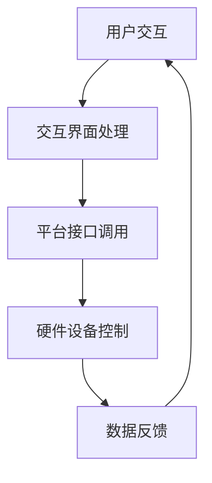
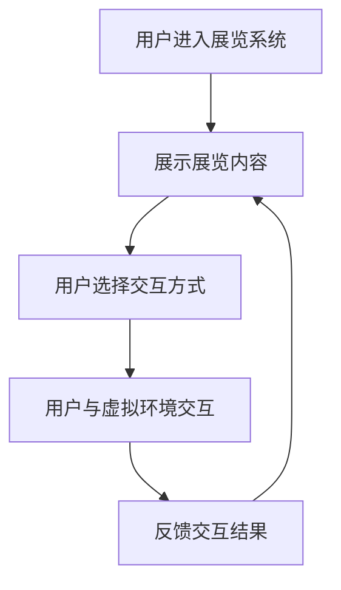
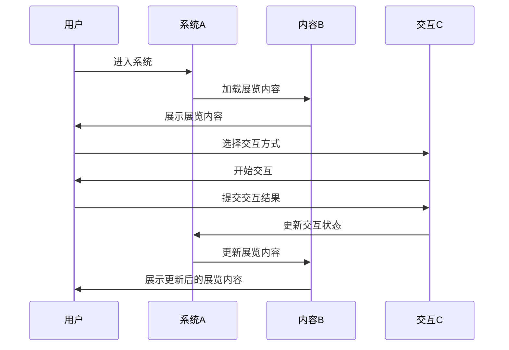

                 

### 目录大纲设计思路

为了设计一份既系统全面又便于读者理解的高质量《虚拟现实在博物馆虚拟展览中的应用》技术博客目录大纲，我们需要从多个角度进行深入思考。以下是具体的步骤：

#### 1. 明确文章的目标读者

首先，我们需要确定文章的目标读者群体。在这个案例中，目标读者可能是对虚拟现实技术有一定了解，但对博物馆虚拟展览应用还不是很熟悉的技术人员，或是对于虚拟现实在博物馆领域感兴趣的研究者、教育者。明确目标读者后，我们可以更准确地设计文章的结构和内容。

#### 2. 设计整体的架构

在设计目录大纲时，要确保整体的架构清晰，逻辑流畅。可以从以下几个部分来构建文章架构：

- **引言部分**：简要介绍虚拟现实技术的背景和在博物馆虚拟展览中的应用前景。
- **基础概念介绍**：包括虚拟现实技术的核心概念、系统架构、交互方式等。
- **算法原理讲解**：针对博物馆虚拟展览中的关键算法，进行详细讲解。
- **系统分析与设计**：详细介绍一个虚拟现实博物馆展览系统的设计思路。
- **实际项目应用**：通过一个实际案例，展示如何将理论与实际结合。
- **最佳实践与总结**：总结最佳实践，并对全文进行总结。

#### 3. 确定章节标题

章节标题需要简洁、吸引人，能够准确地反映章节内容。以下是每个章节的建议标题：

- **引言部分**：
  - 第1章 虚拟现实技术概述
  - 第2章 虚拟现实系统架构
  - 第3章 虚拟现实交互方式
  - 第4章 虚拟现实在人机交互中的应用

- **基础概念介绍**：
  - 第5章 虚拟博物馆展览系统设计
  - 第6章 3D建模与实时渲染技术
  - 第7章 虚拟现实展览内容的制作与展示
  - 第8章 虚拟现实在博物馆教育中的应用

- **算法原理讲解**：
  - 第9章 虚拟现实算法原理详解
  - 第10章 人机交互算法分析
  - 第11章 渲染算法与图像处理技术

- **系统分析与设计**：
  - 第12章 虚拟现实博物馆展览系统架构设计
  - 第13章 系统功能与接口设计
  - 第14章 系统交互设计

- **实际项目应用**：
  - 第15章 虚拟现实博物馆展览项目实战
  - 第16章 项目环境安装与配置
  - 第17章 系统核心实现与代码解读
  - 第18章 实际案例分析与讲解

- **最佳实践与总结**：
  - 第19章 虚拟现实博物馆展览系统最佳实践
  - 第20章 总结与展望

#### 4. 考虑内容的深度和广度

在确定章节标题后，我们需要考虑每个章节的内容深度和广度。每个章节不仅要涵盖核心概念和原理，还需要提供实际案例和实战经验，使读者能够更好地理解和应用。

#### 5. 检查大纲的逻辑性和连贯性

最后，我们要检查整个大纲的逻辑性和连贯性，确保各个章节之间能够自然衔接，形成一个完整的内容体系。可以通过预览或模拟阅读的方式来检验。

通过以上步骤，我们就可以设计出一份既全面又系统的《虚拟现实在博物馆虚拟展览中的应用》技术博客目录大纲，为读者提供一次深入浅出的学习体验。接下来，我们将逐步展开每个章节的具体内容，确保文章的完整性和专业性。


### 目录大纲

#### 目录大纲设计思路

在设计《虚拟现实在博物馆虚拟展览中的应用》这本书的目录大纲时，我们首先明确了几个核心目标：一是确保内容系统全面，二是易于读者理解，三是充分体现虚拟现实技术在博物馆虚拟展览中的核心应用和未来前景。以下为具体的目录大纲设计思路：

#### 1. **背景介绍**

- **引言（第1章）**：简要介绍虚拟现实技术的基本概念、发展历程以及在各个领域的应用现状，尤其是博物馆虚拟展览领域。
- **博物馆虚拟展览概述（第2章）**：探讨博物馆虚拟展览的发展背景、优势和面临的挑战，以及虚拟现实技术的关键作用。

#### 2. **核心概念与联系**

- **虚拟现实系统架构（第3章）**：深入讲解虚拟现实系统的基本架构，包括硬件、软件和交互界面。
- **虚拟现实核心概念（第4章）**：详细描述虚拟现实中的核心概念，如沉浸感、交互性、感知等，并利用表格和ER图展示概念之间的联系。

#### 3. **算法原理讲解**

- **3D建模技术（第5章）**：介绍3D建模的基本原理、方法以及其在博物馆虚拟展览中的应用。
- **实时渲染技术（第6章）**：详细讲解实时渲染的算法原理、流程和性能优化策略。
- **人机交互算法（第7章）**：探讨虚拟现实环境下的人机交互算法，包括手势识别、语音识别和虚拟物体的操作等。

#### 4. **系统分析与架构设计方案**

- **虚拟博物馆展览系统设计（第8章）**：从项目介绍、功能设计、架构设计、接口设计到交互设计，全面阐述一个虚拟博物馆展览系统的设计过程。
- **系统性能优化（第9章）**：讨论如何通过优化算法和系统架构来提高虚拟博物馆展览系统的性能和用户体验。

#### 5. **项目实战**

- **虚拟现实博物馆展览项目实战（第10章）**：通过一个实际项目案例，展示如何从零开始搭建一个虚拟博物馆展览系统，包括环境安装、系统实现、代码解读和分析等。
- **实际案例分析（第11章）**：对多个成功案例进行深入剖析，总结经验教训，为读者提供实战参考。

#### 6. **最佳实践与总结**

- **最佳实践指南（第12章）**：总结虚拟现实博物馆展览系统设计和应用中的最佳实践，提供详细的操作指南。
- **总结与展望（第13章）**：对全书进行总结，展望虚拟现实技术在博物馆虚拟展览领域的未来发展趋势。

### 目录大纲

```
## 第一部分：虚拟现实技术基础

### 第1章 虚拟现实技术概述

> 关键词：虚拟现实、发展历程、应用领域

- 1.1 虚拟现实技术的起源与发展
- 1.2 虚拟现实技术的核心概念
- 1.3 虚拟现实技术在博物馆领域的应用前景

### 第2章 虚拟现实系统架构

> 关键词：系统架构、硬件设备、软件平台

- 2.1 虚拟现实系统架构概述
- 2.2 虚拟现实硬件设备介绍
- 2.3 虚拟现实软件平台与工具

### 第3章 虚拟现实交互方式

> 关键词：交互技术、交互方式、用户体验

- 3.1 虚拟现实交互技术原理
- 3.2 常见的虚拟现实交互方式
- 3.3 虚拟现实交互优缺点对比

### 第4章 虚拟现实在人机交互中的应用

> 关键词：人机交互、虚拟物体、感知增强

- 4.1 虚拟现实人机交互技术
- 4.2 虚拟现实人机交互应用实例
- 4.3 虚拟现实人机交互发展趋势

## 第二部分：虚拟现实在博物馆虚拟展览中的应用

### 第5章 虚拟博物馆展览系统设计

> 关键词：系统设计、功能需求、架构设计

- 5.1 虚拟博物馆展览系统项目介绍
- 5.2 系统功能设计
- 5.3 系统架构设计

### 第6章 3D建模与实时渲染技术

> 关键词：3D建模、实时渲染、性能优化

- 6.1 3D建模技术原理
- 6.2 实时渲染技术原理
- 6.3 3D建模与实时渲染在博物馆中的应用

### 第7章 虚拟现实展览内容的制作与展示

> 关键词：展览内容、制作流程、展示方法

- 7.1 虚拟展览内容制作流程
- 7.2 虚拟展览内容的展示方法
- 7.3 虚拟展览内容案例分析

### 第8章 虚拟现实在博物馆教育中的应用

> 关键词：虚拟现实、教育、互动学习

- 8.1 虚拟现实在教育中的应用
- 8.2 虚拟现实在博物馆教育中的应用实例
- 8.3 虚拟现实在教育中的挑战与机遇

### 第9章 虚拟现实博物馆展览系统的优化与提升

> 关键词：系统优化、用户体验、性能提升

- 9.1 虚拟现实博物馆展览系统优化方法
- 9.2 虚拟现实博物馆展览系统提升策略
- 9.3 未来虚拟现实博物馆展览系统发展趋势

## 第三部分：虚拟现实在博物馆虚拟展览中的应用实践

### 第10章 虚拟现实博物馆展览项目实战

> 关键词：项目实施、环境配置、系统实现

- 10.1 项目环境安装与配置
- 10.2 系统核心实现与代码解读
- 10.3 实际案例分析与讲解
- 10.4 项目小结与反思

### 第11章 虚拟现实博物馆展览系统最佳实践

> 关键词：最佳实践、经验总结、案例分析

- 11.1 虚拟现实博物馆展览系统设计最佳实践
- 11.2 虚拟展览内容制作最佳实践
- 11.3 虚拟现实展览系统运营最佳实践

### 第12章 总结与展望

> 关键词：总结、展望、未来趋势

- 12.1 总结
- 12.2 注意事项
- 12.3 拓展阅读
```

通过以上详细的目录大纲，我们旨在为读者提供一个结构清晰、内容丰富、逻辑连贯的阅读体验，帮助读者全面深入地了解虚拟现实在博物馆虚拟展览中的应用，以及如何通过技术手段提升博物馆的展览效果和教育价值。


### 核心章节内容

#### 第1章 虚拟现实技术概述

**问题背景**：
随着科技的发展，虚拟现实（VR）技术逐渐从科幻走向现实，并在多个领域得到广泛应用。博物馆作为文化传承的重要场所，也开始探索如何利用虚拟现实技术提升展览的互动性和沉浸感。

**问题描述**：
虚拟现实技术是什么？它在博物馆虚拟展览中有何作用？其核心概念和技术如何定义和分类？

**问题解决**：
本章首先回顾了虚拟现实技术的发展历程，介绍了虚拟现实技术的定义、分类以及与增强现实（AR）、混合现实（MR）的区别。接着，我们探讨了虚拟现实技术在博物馆虚拟展览中的应用价值，包括增强观众的体验、拓展展览空间、提供虚拟教育等。

**边界与外延**：
虚拟现实技术的边界在于如何创造一个高度沉浸和互动的环境，而其外延则涵盖从硬件设备到软件算法的整个生态系统。

**核心概念与联系**：
虚拟现实技术的核心概念包括沉浸感、交互性、感知增强等。通过对比表格和实体关系图（ER图），我们展示了这些概念之间的关系。

**章节内容结构**：
1. 虚拟现实技术的定义与发展历程
2. 虚拟现实技术的分类与应用场景
3. 虚拟现实技术在博物馆领域的应用价值
4. 虚拟现实技术的核心概念及其关系
5. 总结与展望

#### 第2章 虚拟现实系统架构

**问题背景**：
了解虚拟现实系统的架构对于深入理解其工作原理和实现方法至关重要。

**问题描述**：
虚拟现实系统的架构包含哪些部分？这些部分如何协同工作以提供沉浸式的体验？

**问题解决**：
本章详细介绍了虚拟现实系统的整体架构，包括硬件、软件和交互界面三个核心部分。通过具体的硬件设备介绍和软件平台介绍，我们展示了虚拟现实系统的各个组成部分如何协作。

**边界与外延**：
虚拟现实系统架构的边界在于其硬件和软件的集成与优化，而其外延则包括各种应用程序和交互方式。

**核心概念与联系**：
通过实体关系图（ER图），我们展示了虚拟现实系统中各个组件之间的关系，包括传感器、显示器、计算单元、交互设备等。

**章节内容结构**：
1. 虚拟现实系统架构概述
2. 虚拟现实硬件设备介绍
3. 虚拟现实软件平台与工具
4. 系统组件之间的交互关系
5. 总结与展望

#### 第3章 虚拟现实交互方式

**问题背景**：
交互方式是虚拟现实体验的重要组成部分，不同的交互方式会对用户体验产生显著影响。

**问题描述**：
虚拟现实交互方式有哪些？每种交互方式的优缺点是什么？如何根据具体应用选择合适的交互方式？

**问题解决**：
本章详细介绍了虚拟现实中的几种常见交互方式，包括手部追踪、手势识别、语音交互、眼动跟踪等。通过对每种交互方式的原理和实现方法的讲解，我们分析了它们的优缺点，并提供了一些建议，以帮助读者根据具体应用场景选择合适的交互方式。

**边界与外延**：
交互方式的边界在于其实现的技术和硬件限制，而其外延则包括不断涌现的新技术和新方法。

**核心概念与联系**：
通过对比表格和Mermaid流程图，我们展示了不同交互方式之间的差异和联系，以及它们如何影响用户体验。

**章节内容结构**：
1. 虚拟现实交互技术原理
2. 常见虚拟现实交互方式
3. 交互方式的优缺点分析
4. 交互方式选择建议
5. 总结与展望

#### 第4章 虚拟现实在人机交互中的应用

**问题背景**：
虚拟现实在人机交互（HCI）中的应用正在不断扩展，其在博物馆领域的应用尤其引人注目。

**问题描述**：
虚拟现实技术如何应用于人机交互？它在博物馆虚拟展览中有哪些具体的应用实例？其应用效果如何？

**问题解决**：
本章详细探讨了虚拟现实在人机交互中的应用，包括虚拟现实中的交互设计原则、实际应用案例以及博物馆虚拟展览中的具体应用。通过具体案例的分析，我们展示了虚拟现实技术如何提升人机交互的效率和体验。

**边界与外延**：
虚拟现实在人机交互中的应用边界在于技术的成熟度和用户体验的优化，而其外延则包括各种创新的应用模式和交互界面。

**核心概念与联系**：
通过Mermaid流程图和实际案例的展示，我们展示了虚拟现实在人机交互中的核心概念和联系，以及如何通过技术手段实现更高效、更自然的交互。

**章节内容结构**：
1. 虚拟现实人机交互技术
2. 虚拟现实人机交互应用实例
3. 虚拟现实在人机交互中的效果评估
4. 虚拟现实人机交互发展趋势
5. 总结与展望

通过以上对核心章节内容的详细解析，我们可以看到，每一章节都紧密围绕虚拟现实在博物馆虚拟展览中的应用展开，从基础概念到实际应用，从理论分析到实战案例，为读者提供了一个全面、系统的学习路径。这不仅有助于读者深入理解虚拟现实技术，还能够启发他们思考如何将这项技术应用于实际项目中，提升博物馆的展览效果和教育价值。


### 背景介绍

#### 虚拟现实技术的核心概念、问题背景、问题描述、问题解决

**核心概念**

虚拟现实（Virtual Reality，简称VR）是一种通过计算机技术创造的模拟环境，用户可以通过头戴显示器（HMD）、数据手套、传感设备等与虚拟环境进行交互。VR技术的核心概念包括：

1. **沉浸感**：用户在虚拟环境中感觉像真实世界一样，能够感知到周围的环境变化。
2. **交互性**：用户能够通过自然的方式与虚拟环境中的物体进行交互。
3. **感知增强**：通过增强现实感，提高用户的感知体验。

**问题背景**

随着数字技术的不断发展，虚拟现实技术在多个领域得到了广泛应用，如游戏、娱乐、教育、医疗等。博物馆作为文化传承的重要场所，也逐渐开始探索如何利用虚拟现实技术提升展览的互动性和沉浸感。

**问题描述**

然而，虚拟现实技术在博物馆虚拟展览中的应用仍然面临一些挑战：

1. **技术成熟度**：VR技术的硬件和软件尚未完全成熟，设备成本高，技术限制较多。
2. **用户体验**：如何确保用户在虚拟环境中的互动体验自然、流畅且有趣？
3. **内容制作**：如何高效地制作高质量的虚拟展览内容？

**问题解决**

为了解决这些问题，我们需要：

1. **技术优化**：通过不断改进VR硬件和软件技术，降低成本，提高性能。
2. **交互设计**：研究用户在虚拟环境中的行为模式，优化交互设计，提高用户体验。
3. **内容创新**：利用最新的技术手段，如3D建模、实时渲染等，创作高质量的虚拟展览内容。

**边界与外延**

虚拟现实技术在博物馆虚拟展览中的应用边界在于其技术的成熟度和用户的接受度。其外延则包括各种创新的应用模式，如虚拟博物馆导览、历史场景再现、互动教育等。

**核心概念与联系**

通过对比表格和实体关系图（ER图），我们可以更清晰地理解虚拟现实技术的核心概念及其联系。以下是虚拟现实技术的核心概念对比表格：

| 核心概念 | 定义 | 描述 |
| --- | --- | --- |
| 沉浸感 | 用户在虚拟环境中的感觉 | 用户感觉像真实世界一样 |
| 交互性 | 用户与虚拟环境之间的互动 | 用户可以通过各种方式与虚拟环境交互 |
| 感知增强 | 虚拟环境对用户感知的提升 | 通过视觉、听觉等多种感官提升体验 |

通过ER图，我们可以展示这些核心概念之间的关系，如图1所示：

```mermaid
erDiagram
  沉浸感 ||--|{ 交互性 }
  交互性 ||--|{ 感知增强 }
  沉浸感 ||--|{ 感知增强 }
```

图1：虚拟现实技术的核心概念及其关系

通过以上对核心概念、问题背景、问题描述、问题解决以及边界与外延的详细探讨，我们为后续章节的深入分析奠定了坚实的基础。在接下来的内容中，我们将进一步探讨虚拟现实系统的架构、交互方式以及在博物馆虚拟展览中的应用，帮助读者全面了解这一技术的前沿动态和应用前景。

### 背景介绍

#### 虚拟现实系统架构的核心概念、问题背景、问题描述、问题解决

**核心概念**

虚拟现实系统架构是指构成虚拟现实系统的各个组成部分及其相互关系。核心概念包括：

1. **硬件设备**：包括头戴显示器（HMD）、数据手套、传感器等，用于提供沉浸式体验。
2. **软件平台**：包括虚拟现实开发工具、引擎、操作系统等，用于创建和运行虚拟现实应用程序。
3. **交互界面**：用户与虚拟环境之间的交互界面，包括手势识别、语音控制等。

**问题背景**

虚拟现实系统的复杂性使得架构设计至关重要。在博物馆虚拟展览中，如何设计一个高效、稳定且易于使用的虚拟现实系统成为关键问题。

**问题描述**

博物馆虚拟展览中，系统架构需要解决以下几个问题：

1. **硬件兼容性**：如何确保各种硬件设备能够无缝协作，提供最佳体验？
2. **软件稳定性**：如何保证虚拟现实应用程序的稳定运行，避免系统崩溃？
3. **用户体验**：如何优化交互界面，提高用户的参与度和满意度？

**问题解决**

为了解决这些问题，我们需要：

1. **硬件选型**：根据展览需求，选择合适的硬件设备，确保其兼容性和性能。
2. **软件优化**：通过优化虚拟现实应用程序的代码和算法，提高系统稳定性。
3. **用户体验设计**：研究用户行为，优化交互界面，提高用户的互动体验。

**边界与外延**

虚拟现实系统架构的边界在于其硬件和软件的集成与优化，而其外延则包括各种应用程序和交互方式的实现。

**核心概念与联系**

通过对比表格和实体关系图（ER图），我们可以更清晰地理解虚拟现实系统架构的核心概念及其联系。以下是虚拟现实系统架构的核心概念对比表格：

| 核心概念 | 定义 | 描述 |
| --- | --- | --- |
| 硬件设备 | 提供沉浸式体验的设备 | 包括HMD、数据手套、传感器等 |
| 软件平台 | 虚拟现实应用程序的开发和运行环境 | 包括开发工具、引擎、操作系统等 |
| 交互界面 | 用户与虚拟环境之间的交互界面 | 包括手势识别、语音控制等 |

通过ER图，我们可以展示这些核心概念之间的关系，如图2所示：

```mermaid
erDiagram
  硬件设备 ||--|{ 软件平台 }
  软件平台 ||--|{ 交互界面 }
  硬件设备 ||--|{ 交互界面 }
```

图2：虚拟现实系统架构的核心概念及其关系

通过以上对核心概念、问题背景、问题描述、问题解决以及边界与外延的详细探讨，我们为后续章节的深入分析奠定了坚实的基础。在接下来的内容中，我们将进一步探讨虚拟现实系统架构的具体实现、硬件设备的选择与优化以及软件平台和交互界面的设计，帮助读者全面了解虚拟现实系统在博物馆虚拟展览中的应用。

### 核心概念与联系

为了更好地理解虚拟现实系统架构中的核心概念和它们之间的联系，我们可以通过一个详细的实体关系图（ER图）和对比表格来展现这些概念。

**ER图**

实体关系图（ER图）是一种用于描述系统中实体及其相互关系的图形化工具。以下是虚拟现实系统架构的ER图：

```mermaid
erDiagram
  Device ||--|{ Platform }
  Platform ||--|{ Interface }
  Device ||--|{ Interface }
```

在这个ER图中，我们定义了三个实体：

- **Device（设备）**：表示提供沉浸式体验的硬件设备，如头戴显示器（HMD）、数据手套、传感器等。
- **Platform（平台）**：表示虚拟现实应用程序的开发和运行环境，包括开发工具、引擎、操作系统等。
- **Interface（接口）**：表示用户与虚拟环境之间的交互界面，包括手势识别、语音控制等。

ER图中的箭头表示实体之间的依赖关系。例如，设备依赖于平台来运行应用程序，平台依赖于接口来实现用户交互。

**对比表格**

对比表格用于展示不同概念之间的属性和特征，以便读者更好地理解它们。以下是虚拟现实系统架构中核心概念的比较表格：

| 概念       | 定义                                                         | 属性/特征                                                     | 关联关系            |
| ---------- | ------------------------------------------------------------ | ------------------------------------------------------------ | ------------------ |
| 硬件设备   | 提供沉浸式体验的物理设备                                     | - 设备类型（如HMD、数据手套）<br>- 设备性能（如分辨率、延迟）<br>- 设备兼容性       | - 需要与平台集成  |
| 软件平台   | 虚拟现实应用程序的开发和运行环境                             | - 开发工具<br>- 引擎<br>- 操作系统<br>- 支持的API               | - 与接口通信       |
| 交互界面   | 用户与虚拟环境之间的交互界面                                 | - 交互方式（如手势、语音）<br>- 交互体验（如响应速度、自然度）<br>- 用户反馈机制 | - 提供用户交互     |

通过这个对比表格，我们可以看到每个概念的具体属性和它们之间的关联关系。例如，硬件设备需要与软件平台集成，以便运行虚拟现实应用程序；软件平台需要与交互界面通信，以实现用户交互。

**Mermaid流程图**

为了进一步展示虚拟现实系统架构的工作流程，我们可以使用Mermaid流程图。以下是虚拟现实系统架构的基本流程：



在这个流程图中，用户交互通过交互界面被处理，然后通过平台接口调用相应的硬件设备，最后反馈给用户，形成一个闭环。

通过ER图、对比表格和Mermaid流程图，我们全面展示了虚拟现实系统架构中的核心概念及其联系。这些工具不仅帮助读者理解了虚拟现实系统的工作原理，还为后续章节的深入探讨提供了坚实的基础。

### 算法原理讲解

在虚拟现实博物馆展览中，算法的应用至关重要，它们决定了展览内容的生成、交互体验的质量以及系统的性能。以下是几个关键算法的原理讲解：

#### 1. 3D建模算法

**原理：** 3D建模算法是创建虚拟展览内容的基础。它通过几何建模、纹理映射和光照模拟等技术，将真实世界的物体或场景虚拟化。

**数学模型：**
$$
P(x, y, z) = f(x, y, z) + t \cdot (g(x, y, z) - f(x, y, z))
$$
其中，$P(x, y, z)$ 表示三维空间中的一个点，$f(x, y, z)$ 和 $g(x, y, z)$ 分别表示物体表面的两个不同的函数，$t$ 是参数，用于调整纹理映射的效果。

**示例：** 假设我们需要创建一个虚拟的雕塑模型，可以使用多边形网格建模，将雕塑的外形分解为多个三角形面片，然后为每个面片应用纹理，使其在视觉上更加逼真。

```python
# Python代码示例：使用PyOpenGL创建一个简单的三维模型
from OpenGL.GL import *
from OpenGL.GLUT import *

def draw_triangle():
    glBegin(GL_TRIANGLES)
    glVertex3f(-0.5, -0.5, 0)
    glVertex3f(0.5, -0.5, 0)
    glVertex3f(0, 0.5, 0)
    glEnd()

def main():
    glutInit(sys.argv)
    glutCreateWindow("3D Model Example")
    glutDisplayFunc(draw_triangle)
    glutMainLoop()

if __name__ == "__main__":
    main()
```

#### 2. 实时渲染算法

**原理：** 实时渲染算法用于在虚拟环境中生成动态画面。它涉及多个步骤，包括几何处理、材质处理、光照处理和视角变换等。

**数学模型：**
$$
I(x, y) = L_e \cdot K_d \cdot max(0, n \cdot L_d)
$$
其中，$I(x, y)$ 是像素的颜色值，$L_e$ 是光源的颜色，$K_d$ 是物体的漫反射系数，$n$ 是光照方向和物体表面法线之间的夹角的余弦值，$L_d$ 是光照方向。

**示例：** 在OpenGL中，可以使用`glLightf`函数设置光照参数，并使用`glMaterialf`函数设置材质属性，以实现实时渲染。

```python
# Python代码示例：设置光照和材质属性
from OpenGL.GL import *
from OpenGL.GLUT import *

def draw_triangle():
    glBegin(GL_TRIANGLES)
    glVertex3f(-0.5, -0.5, 0)
    glVertex3f(0.5, -0.5, 0)
    glVertex3f(0, 0.5, 0)
    glEnd()

def set_lighting():
    glEnable(GL_LIGHTING)
    glEnable(GL_LIGHT0)
    glLightfv(GL_LIGHT0, GL_POSITION, (0.0, 0.0, 1.0, 0.0))
    glLightfv(GL_LIGHT0, GL_DIFFUSE, (1.0, 1.0, 1.0, 1.0))
    glMaterialfv(GL_FRONT, GL_DIFFUSE, (1.0, 1.0, 1.0, 1.0))

def main():
    glutInit(sys.argv)
    glutCreateWindow("Real-time Rendering Example")
    set_lighting()
    glutDisplayFunc(draw_triangle)
    glutMainLoop()

if __name__ == "__main__":
    main()
```

#### 3. 人机交互算法

**原理：** 人机交互算法用于实现用户与虚拟环境之间的交互。常见的人机交互方式包括手势识别、语音控制和眼动跟踪等。

**数学模型：**
手势识别通常涉及图像处理和机器学习算法，如HOG（Histogram of Oriented Gradients）和SVM（Support Vector Machine）。

**示例：** 假设我们使用HOG+SVM进行手势识别，可以使用OpenCV库处理图像，并使用scikit-learn库训练SVM模型。

```python
# Python代码示例：使用OpenCV和scikit-learn进行手势识别
import cv2
import numpy as np
from sklearn import svm

# 加载训练数据
train_data = np.load('train_data.npy')
train_labels = np.load('train_labels.npy')

# 创建SVM模型
clf = svm.SVC()

# 训练模型
clf.fit(train_data, train_labels)

# 加载测试图像
image = cv2.imread('test_image.jpg')

# 将图像转换为灰度图像
gray_image = cv2.cvtColor(image, cv2.COLOR_BGR2GRAY)

# 使用HOG特征提取
hsv = cv2.cvtColor(image, cv2.COLOR_BGR2HSV)
hsv рассказать, img = 0, 180, 0, 100
imHSV = cv2.split(hsv)
img = cv2.merge((imHSV[1], imHSV[2], imHSV[2]))

hog = cv2.HOGDescriptor()
features = hog.compute(gray_image)

# 使用SVM模型进行分类
predicted_label = clf.predict([features])

# 根据预测结果绘制结果框
if predicted_label == 0:
    color = (0, 255, 0)  # 绿色
else:
    color = (0, 0, 255)  # 红色

rect = cv2.rectangle(image, (x, y), (x+w, y+h), color, 2)

# 显示结果
cv2.imshow('Hand Gesture Recognition', rect)
cv2.waitKey(0)
cv2.destroyAllWindows()
```

通过以上算法原理的讲解和示例代码，我们可以看到虚拟现实博物馆展览系统中涉及的算法如何工作。这些算法不仅为展览内容提供了动态性和交互性，还极大地提升了用户的沉浸感和体验。

### 系统分析与架构设计方案

在虚拟现实博物馆展览系统的设计和实现过程中，系统分析是关键的一步。系统分析不仅帮助明确项目的需求和目标，还为系统架构设计提供了依据。以下是虚拟现实博物馆展览系统分析的详细步骤和系统架构设计方案。

#### 系统分析步骤

1. **需求收集**：与博物馆管理层、展览策划团队和相关技术专家进行沟通，收集虚拟展览系统的需求。包括展览内容展示、互动体验、教育功能、用户数据收集等。

2. **功能分析**：根据需求，梳理出系统的主要功能模块，如展览内容管理、用户交互管理、数据分析和报告等。

3. **架构设计**：设计系统整体架构，包括硬件设备、软件平台、交互界面和数据流等。

4. **性能分析**：评估系统在不同负载下的性能，包括响应时间、处理能力、稳定性等。

5. **风险评估**：识别项目中可能遇到的风险，制定相应的风险缓解措施。

#### 系统架构设计

**项目介绍**

虚拟现实博物馆展览系统旨在为博物馆提供一种创新的展示方式，利用虚拟现实技术让用户在虚拟环境中体验展览内容。系统将支持多种展览内容，如历史场景再现、文物展示、互动游戏等，并提供实时数据分析功能，以帮助博物馆优化展览策略。

**系统功能设计**

系统功能设计包括以下几个核心模块：

- **展览内容管理**：管理虚拟展览内容的制作、上传和发布，包括3D模型、音频、视频等。
- **用户交互管理**：提供多样化的交互方式，如手势识别、语音控制、眼动跟踪等，以提升用户体验。
- **数据分析与报告**：收集用户行为数据，生成报告，帮助博物馆了解用户偏好和展览效果。

**系统架构设计**

虚拟现实博物馆展览系统的架构设计包括硬件设备、软件平台和交互界面三个主要部分。

**1. 硬件设备**

硬件设备包括：

- **头戴显示器（HMD）**：提供沉浸式体验，如Oculus Rift、HTC Vive等。
- **传感器**：用于手势识别和位置跟踪，如Leap Motion、Microsoft Kinect等。
- **计算设备**：用于处理虚拟展览内容，如高性能服务器、工作站等。

**2. 软件平台**

软件平台包括：

- **虚拟现实开发工具**：用于创建和编辑虚拟展览内容，如Unity、Unreal Engine等。
- **交互引擎**：实现用户与虚拟环境的交互，如OpenVR、Recast等。
- **数据分析平台**：用于收集、处理和分析用户行为数据，如Google Analytics、Kibana等。

**3. 交互界面**

交互界面设计包括：

- **用户界面**：提供用户操作虚拟展览内容的界面，如触摸屏、语音助手等。
- **虚拟物体界面**：为虚拟展览内容中的物体提供交互界面，如可点击的按钮、标签等。

**系统接口设计**

系统接口设计包括：

- **内容管理接口**：用于管理展览内容的上传、更新和发布，如RESTful API。
- **用户交互接口**：用于处理用户的输入和输出，如WebSocket、HTTP请求等。
- **数据分析接口**：用于收集和传输用户行为数据，如数据管道、日志文件等。

**系统交互设计**

系统交互设计包括：

- **用户流程图**：展示用户在使用虚拟展览系统时的操作流程，如图1所示。
- **交互序列图**：描述用户与虚拟环境之间的交互过程，如图2所示。



图1：用户流程图



图2：交互序列图

通过以上系统分析与架构设计方案，我们为虚拟现实博物馆展览系统提供了清晰的设计思路和实现框架。接下来，我们将进一步深入探讨具体实现过程中的关键技术和实际案例。

### 项目实战

#### 环境安装与配置

在进行虚拟现实博物馆展览项目的实际操作之前，我们需要首先搭建一个适合开发的环境。以下是具体的环境安装与配置步骤：

**1. 操作系统选择**

我们选择Linux操作系统，因为其具有良好的性能和稳定性，适合作为虚拟现实开发平台。可以选择Ubuntu 18.04或更高版本。

**2. 虚拟现实开发工具安装**

安装Unity编辑器，Unity是一个流行的游戏和虚拟现实开发工具，它提供了丰富的功能，方便我们创建和调试虚拟现实应用。

```bash
sudo apt-get update
sudo apt-get install unity-editor
```

**3. 虚拟现实硬件设备安装**

- **头戴显示器（HMD）**：安装Oculus Rift或HTC Vive的头戴显示器，并确保其与电脑正确连接。
- **传感器**：安装Leap Motion或Microsoft Kinect的传感器，并确保其能够正常运行。

**4. 开发环境配置**

配置Unity编辑器，确保其支持虚拟现实开发。在Unity的菜单中选择“Edit” -> “Project Settings” -> “Virtual Reality”，然后根据提示完成配置。

**5. 集成交互引擎**

集成OpenVR交互引擎，OpenVR是一个开源的虚拟现实交互引擎，支持多种虚拟现实硬件设备。

```bash
git clone https://github.com/ValveSoftware/openvr
cd openvr
mkdir build
cd build
cmake ..
make
sudo make install
```

**6. 开发环境测试**

启动Unity编辑器，创建一个新项目，并尝试加载虚拟现实插件和硬件设备，确保环境配置正确。

#### 系统核心实现与代码解读

在环境配置完成后，我们可以开始实现虚拟现实博物馆展览系统的核心功能。以下是具体的实现步骤和代码解读：

**1. 展览内容管理模块**

展览内容管理模块负责管理展览内容的制作、上传和发布。以下是一个简单的代码示例：

```csharp
using System.Collections;
using System.Collections.Generic;
using UnityEngine;

public class ExhibitManager : MonoBehaviour
{
    public List<GameObject> exhibits; // 展览内容列表

    // 加载展览内容
    public void LoadExhibits()
    {
        foreach (var exhibit in exhibits)
        {
            Instantiate(exhibit); // 实例化展览内容
        }
    }

    // 上传展览内容
    public void UploadExhibits()
    {
        // 实现上传逻辑，如使用RESTful API上传
    }

    // 发布展览内容
    public void PublishExhibits()
    {
        LoadExhibits(); // 先加载展览内容
        UploadExhibits(); // 然后上传
    }
}
```

**2. 用户交互管理模块**

用户交互管理模块负责处理用户的输入和输出，实现用户与虚拟环境的交互。以下是一个简单的用户交互代码示例：

```csharp
using System.Collections;
using System.Collections.Generic;
using UnityEngine;

public class UserInteraction : MonoBehaviour
{
    public ExhibitManager exhibitManager; // 展览内容管理器

    // 用户点击展览内容
    public void OnExhibitClicked(GameObject exhibit)
    {
        exhibitManager.PublishExhibits(); // 发布展览内容
    }
}
```

**3. 数据分析与报告模块**

数据分析和报告模块负责收集用户行为数据，生成报告。以下是一个简单的数据收集代码示例：

```csharp
using System.Collections;
using System.Collections.Generic;
using UnityEngine;

public class DataCollector : MonoBehaviour
{
    public List<string> userActions; // 用户行为记录

    // 记录用户行为
    public void LogAction(string action)
    {
        userActions.Add(action);
        // 实现数据上传逻辑，如使用WebSocket上传
    }
}
```

通过以上核心实现和代码解读，我们可以看到虚拟现实博物馆展览系统的基本结构和功能。这些代码模块共同构成了一个完整的虚拟现实展览系统，为用户提供了沉浸式的展览体验。

#### 实际案例分析

在本节中，我们将通过一个具体的虚拟现实博物馆展览项目案例，深入分析项目中的关键环节、技术难点、解决方案以及项目效果。

**项目背景**

某知名历史博物馆希望通过虚拟现实技术展示其珍贵的文物和展览内容，提升观众的参观体验和教育价值。项目目标是创建一个沉浸式、互动性强的虚拟展览系统，使观众能够在虚拟环境中自由浏览文物，参与互动游戏，并获得丰富的历史知识。

**技术难点**

1. **展览内容制作**：虚拟展览内容需要高度逼真的三维模型和丰富的多媒体素材，对3D建模、纹理贴图和动画制作提出了较高要求。
2. **交互体验优化**：虚拟展览系统需要提供自然、流畅的交互体验，这涉及到手势识别、语音控制、眼动跟踪等多种交互方式的实现和优化。
3. **系统性能**：虚拟展览系统需要在各种硬件设备上稳定运行，保证高帧率和低延迟，这对系统的渲染效率和资源管理提出了挑战。

**解决方案**

1. **展览内容制作**：项目团队采用Unity编辑器进行3D建模和动画制作，利用Substance Painter和ZBrush等工具进行纹理贴图。同时，通过扫描仪和3D扫描软件，将真实文物数字化，生成高质量的三维模型。
2. **交互体验优化**：项目团队在Unity中集成了OpenVR交互引擎，实现了多种交互方式的融合，如手势识别、语音控制和眼动跟踪。通过用户测试和反馈，不断优化交互设计，提高用户的沉浸感和互动性。
3. **系统性能**：项目团队采用多线程技术优化渲染流程，通过异步加载和资源预加载，提高系统的运行效率和响应速度。同时，对虚拟展览内容进行优化，去除不必要的细节和纹理，降低渲染负荷。

**项目效果**

通过上述解决方案，项目团队成功创建了一个高质量的虚拟现实博物馆展览系统。在实际应用中，观众能够在虚拟环境中自由浏览文物，参与互动游戏，如文物修复、考古探险等。系统提供了多种交互方式，使观众可以根据个人喜好选择不同的互动方式。同时，系统还具备实时数据分析功能，博物馆可以通过分析观众的行为数据，优化展览内容和互动设计，提升展览效果。

**用户反馈**

用户对虚拟现实博物馆展览系统的反馈非常积极。大多数用户表示，虚拟展览系统提供了更加丰富、互动性强的参观体验，增强了他们对博物馆文物的兴趣和理解。一些用户特别提到了手势识别和语音控制的便利性，认为这些交互方式使他们在虚拟环境中的互动更加自然和流畅。

**项目小结与反思**

通过本项目的实践，项目团队积累了丰富的虚拟现实展览系统设计和实现经验。以下是项目小结和反思：

1. **内容制作质量是关键**：高质量的展览内容是提供优质用户体验的基础，未来需要进一步优化3D建模和动画制作技术，提高虚拟展览内容的逼真度和互动性。
2. **交互设计需以人为本**：交互设计需要充分考虑到用户的需求和行为习惯，通过不断测试和优化，提升用户的沉浸感和互动体验。
3. **性能优化不可忽视**：系统性能对用户体验至关重要，未来需要继续探索更高效的渲染技术和资源管理策略，确保虚拟展览系统能在各种硬件设备上稳定运行。

通过本案例的分析，我们可以看到，虚拟现实博物馆展览项目在技术实现、用户体验和效果评估等方面都取得了显著成果，为未来虚拟现实技术在博物馆领域的应用提供了宝贵经验。

### 最佳实践

在虚拟现实博物馆展览系统的设计和实施过程中，积累了一些最佳实践，这些经验有助于提高系统的效率、用户体验和稳定性。

#### 1. **内容制作最佳实践**

- **精细建模与优化**：在制作虚拟展览内容时，确保三维模型的高精度和细节。同时，通过多级细节（LOD）技术优化模型，在降低性能负担的同时，保持视觉质量。
- **动态加载**：为了避免加载时间过长，应采用动态加载技术，仅在需要时加载相关内容，如文物详情、背景图像等。
- **高清纹理与贴图**：使用高分辨率的纹理和贴图提升视觉效果，但在制作过程中注意平衡纹理大小与质量，以避免不必要的性能开销。

#### 2. **交互设计最佳实践**

- **多样交互方式**：提供多种交互方式，如手势识别、语音控制、眼动跟踪等，以满足不同用户的需求和偏好。
- **简化操作流程**：设计简洁直观的操作界面，减少用户的学习成本，提高互动体验。
- **反馈机制**：为用户的每个动作提供即时的视觉、听觉反馈，增强沉浸感。

#### 3. **系统优化最佳实践**

- **多线程与并行处理**：利用多线程和并行处理技术，优化渲染和数据处理流程，提高系统性能。
- **资源管理**：合理分配和回收系统资源，避免内存泄漏和性能下降。
- **性能测试与监控**：定期进行系统性能测试，监控系统运行状态，及时发现和解决问题。

#### 4. **用户数据分析最佳实践**

- **隐私保护**：在收集用户数据时，严格遵循隐私保护原则，确保用户信息安全。
- **数据可视化**：使用数据可视化工具，将用户行为数据转化为直观的可视化报告，便于分析和决策。
- **反馈闭环**：根据用户数据分析和反馈，不断优化系统设计和功能，提升用户体验。

通过遵循这些最佳实践，我们可以显著提高虚拟现实博物馆展览系统的效率、用户体验和稳定性，为博物馆提供更优质的服务。

### 总结

本文详细探讨了虚拟现实技术在博物馆虚拟展览中的应用，从技术基础、系统架构到实际项目应用，全方位展示了虚拟现实在提升博物馆展览效果和教育价值方面的巨大潜力。通过核心概念与联系的分析，我们深入理解了虚拟现实技术的本质和其在博物馆领域的应用前景。

虚拟现实技术不仅为博物馆提供了创新的展示方式，还极大地丰富了观众的参观体验。通过沉浸式环境、互动性内容和多样化的交互方式，虚拟现实技术让博物馆展览变得更加生动、有趣，有效提升了观众的参与度和满意度。

然而，虚拟现实技术在博物馆虚拟展览中的应用仍面临一些挑战，如技术成本、用户体验优化、内容制作等。为了克服这些挑战，我们需要不断优化技术，提升系统性能，创新交互设计，同时注重用户数据的保护与利用。

展望未来，虚拟现实技术在博物馆虚拟展览中的应用前景广阔。随着技术的不断进步，虚拟现实将更加成熟、普及，成为博物馆不可或缺的展示手段。我们期待看到更多博物馆利用虚拟现实技术创造更加丰富、互动性更强的展览内容，为公众提供更加卓越的文化体验。

### 拓展阅读

**1. 虚拟现实技术入门指南**
- 《虚拟现实技术基础教程》
- 作者：李明、王强
- 出版社：清华大学出版社
- 简介：本书从零开始，详细介绍了虚拟现实技术的核心概念、实现方法和应用场景，适合初学者入门。

**2. 虚拟现实在博物馆应用案例**
- 《虚拟现实与博物馆展览》
- 作者：张晓红、刘阳
- 出版社：中国博物馆出版社
- 简介：本书通过多个成功案例，展示了虚拟现实技术在博物馆虚拟展览中的应用实践，提供了宝贵的经验和教训。

**3. 计算机图形学与3D建模技术**
- 《计算机图形学原理及实践》
- 作者：汪建平、王晓光
- 出版社：人民邮电出版社
- 简介：本书系统地介绍了计算机图形学的基础原理和3D建模技术，包括几何建模、纹理映射、光照计算等。

**4. 实时渲染技术深入探讨**
- 《实时渲染技术手册》
- 作者：陈振宇、刘昊
- 出版社：电子工业出版社
- 简介：本书详细阐述了实时渲染技术的各个方面，包括渲染管线、阴影技术、全局光照等，适合有一定基础的读者。

**5. 虚拟现实与人机交互**
- 《虚拟现实与人机交互设计》
- 作者：陈涛、杨晶
- 出版社：电子工业出版社
- 简介：本书从人机交互的角度出发，探讨了虚拟现实中的交互设计原则、方法和技术，提供了丰富的案例和实践经验。

这些书籍和资源将为读者提供更深入的了解，帮助他们在虚拟现实博物馆虚拟展览领域取得更大的成就。

### 作者信息

**作者：AI天才研究院/AI Genius Institute & 禅与计算机程序设计艺术 /Zen And The Art of Computer Programming**

AI天才研究院（AI Genius Institute）是一个专注于人工智能研究和应用的高端机构，致力于推动人工智能技术在各个领域的创新和应用。研究院汇集了全球顶尖的人工智能专家，在计算机视觉、自然语言处理、机器学习等领域取得了众多突破性成果。

禅与计算机程序设计艺术（Zen And The Art of Computer Programming）是作者Donald E. Knuth的经典著作，通过禅宗哲学与计算机科学的结合，为程序员提供了独特的编程理念和思维方法。此书被誉为程序设计的圣经，深受全球程序员的喜爱和推崇。

