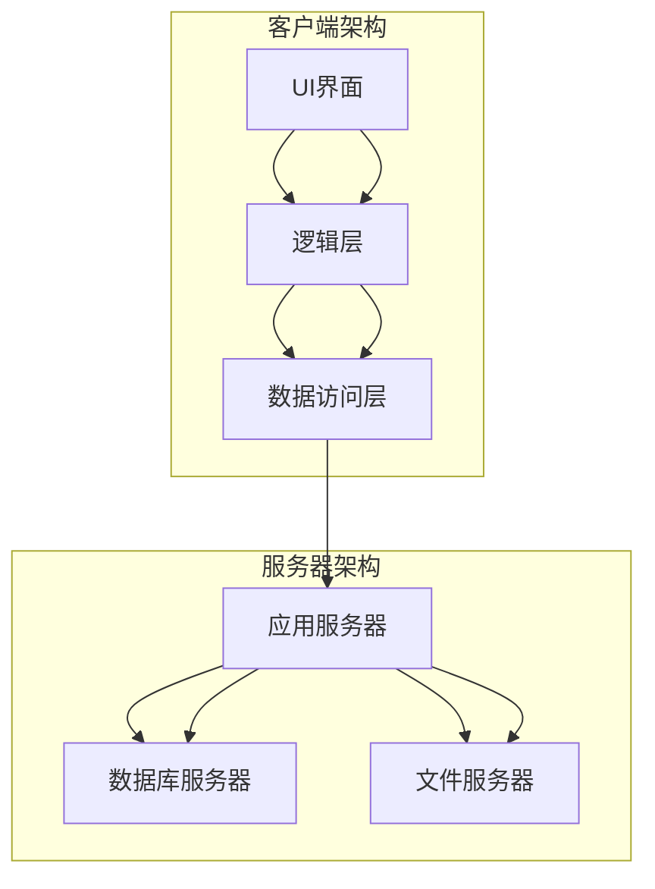
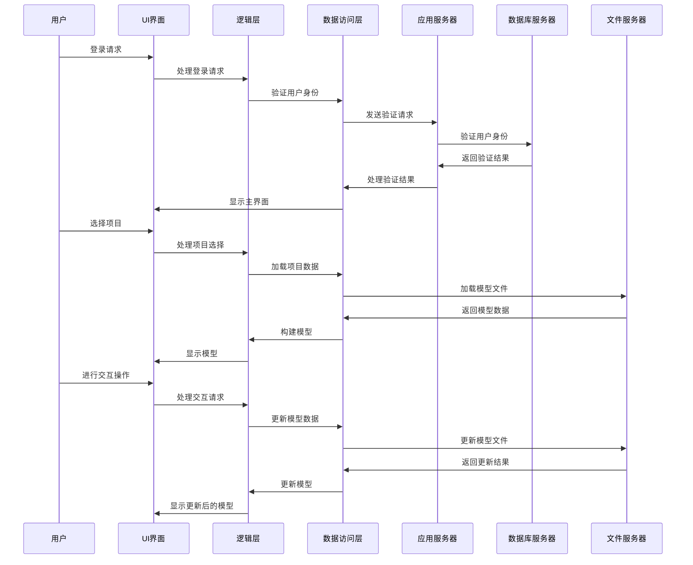

                 

### 第一步：文章标题、关键词和摘要

**文章标题：虚拟现实在建筑设计可视化中的应用**

**关键词：虚拟现实、建筑设计、可视化、BIM、交互体验**

**摘要：**
本文将深入探讨虚拟现实技术在建筑设计可视化中的应用。我们将首先介绍虚拟现实技术的定义、发展历程以及其在建筑设计领域的兴起背景。接着，我们会分析传统建筑可视化方法的局限性以及虚拟现实技术如何解决这些挑战。随后，我们将讨论虚拟现实在建筑设计中的基础概念和应用场景，并通过具体的案例研究展示其实际应用效果。最后，我们将探讨虚拟现实与建筑信息模型（BIM）的集成方法，以及未来在建筑设计可视化中可能的发展趋势和挑战。本文旨在为读者提供一个系统且全面的关于虚拟现实技术在建筑设计可视化中的理解和应用指导。

### 第二步：介绍虚拟现实技术在建筑设计领域的兴起

**2.1 虚拟现实技术在建筑设计领域的兴起**

**2.1.1 虚拟现实技术的定义与发展历程**

虚拟现实（VR）是一种计算机仿真技术，通过创造一个计算机生成的三维环境，使用户能够通过视觉、听觉和其他感官体验来沉浸其中。它不仅限于娱乐行业，还在医疗、教育、工程等多个领域得到了广泛应用。虚拟现实技术的核心在于其能够模拟真实的物理环境和情境，提供沉浸式的用户体验。

虚拟现实技术的发展可以追溯到20世纪60年代，早期的VR设备如“达摩克利斯之剑”等实验性项目奠定了基础。随着计算机技术、图形处理能力和显示技术的进步，VR技术逐渐成熟并进入公众视野。21世纪初，随着移动设备的普及和云计算的发展，虚拟现实技术得到了进一步的推广和应用。

**2.1.2 建筑设计行业对虚拟现实技术的需求**

建筑设计行业对虚拟现实技术的需求主要源于其能够提高设计效率和提升设计质量。传统建筑设计主要依赖于二维图纸和三维模型，这些方法在表达复杂空间关系和用户体验方面存在局限性。而虚拟现实技术提供了更直观和沉浸式的体验，使得设计师和客户能够更好地理解设计意图和空间感受。

具体来说，建筑设计行业对虚拟现实技术的需求包括：

1. **设计验证与迭代：** 通过虚拟现实技术，设计师可以在设计初期就对项目进行模拟和验证，减少错误和修改成本。
2. **用户体验模拟：** 虚拟现实技术可以模拟实际建筑环境，帮助设计师评估光照、通风、噪音等因素对用户体验的影响。
3. **协同设计：** 虚拟现实技术支持多地点协作，设计师和利益相关者可以在虚拟环境中实时交流和协作，提高沟通效率。
4. **成本估算和预算控制：** 通过虚拟现实技术，设计师可以更准确地估算材料和施工成本，帮助控制预算。

**2.1.3 虚拟现实技术在建筑可视化中的优势**

虚拟现实技术在建筑可视化中具有显著的优势，包括但不限于以下几点：

1. **沉浸式体验：** 虚拟现实技术为用户提供了沉浸式的体验，使设计者和客户能够身临其境地感受建筑空间和布局。
2. **交互性：** 虚拟现实环境中的用户可以通过手势、声音等多种方式与虚拟场景进行交互，提高参与度和体验感。
3. **实时性：** 虚拟现实技术支持实时渲染和交互，设计师可以在设计过程中快速看到变化效果，及时进行调整。
4. **多角度观察：** 用户可以从多个角度观察建筑模型，包括内部空间和外部景观，有助于全面评估设计。
5. **精确性：** 虚拟现实技术结合了高精度的三维模型和数据，提供了更准确的可视化效果。

**2.1.4 虚拟现实技术在建筑设计中的适用边界**

尽管虚拟现实技术在建筑设计中具有广泛的应用潜力，但也有一些适用边界和限制。首先，虚拟现实技术需要较高的硬件配置和软件支持，这对一些小型设计公司或个人设计师来说可能是一个经济负担。其次，虚拟现实环境的复杂性和数据量可能导致性能瓶颈，影响用户体验。此外，虚拟现实技术在实际应用中还需要考虑用户接受度和培训成本等问题。

**2.1.5 本章小结**

通过以上讨论，我们可以看到虚拟现实技术在建筑设计领域中正逐渐兴起。它不仅为设计师提供了新的工具和方法，还改变了建筑设计的流程和模式。尽管存在一些挑战，但虚拟现实技术的持续发展有望进一步推动建筑设计行业的发展和变革。

### 第三步：讨论建筑设计可视化的问题与挑战

**3.1 建筑设计可视化的问题与挑战**

**3.1.1 传统建筑可视化方法的局限性**

传统建筑可视化方法主要依赖于二维图纸和三维模型，这些方法在传达设计意图和展示建筑效果方面存在一定的局限性。首先，二维图纸虽然能够表达平面布局，但在表现空间关系、材质和光照效果方面较为有限。其次，三维模型虽然可以提供更直观的视觉效果，但通常需要经过复杂的数据处理和渲染过程，且难以实时更新和交互。

传统建筑可视化方法的局限性主要体现在以下几个方面：

1. **表达不足：** 二维图纸难以全面展现建筑空间和细节，容易产生误解和遗漏。
2. **渲染复杂：** 三维模型的渲染过程需要大量的计算资源，难以实时呈现设计变更。
3. **交互性差：** 用户在传统可视化环境中通常只能被动浏览，难以主动参与和修改设计。
4. **沟通障碍：** 设计师与客户、施工团队之间的沟通和协作效率较低，容易导致信息传递错误。

**3.1.2 虚拟现实技术如何解决现有问题**

虚拟现实技术通过提供沉浸式、交互性和实时性的体验，有效解决了传统建筑可视化方法的局限性。具体来说，虚拟现实技术在以下几个方面进行了改进：

1. **沉浸式体验：** 虚拟现实技术能够创建一个三维虚拟环境，用户可以通过头戴式显示器（HMD）和手柄等设备全身心投入到建筑设计中，感受到真实的空间效果和互动体验。
2. **实时渲染：** 虚拟现实技术支持实时渲染，设计师可以在设计过程中实时看到变化效果，快速调整和优化设计方案。
3. **交互性提升：** 用户在虚拟环境中可以与设计对象进行实时交互，如移动、旋转、放大、缩小等，提高参与度和设计灵活性。
4. **协作沟通：** 虚拟现实技术支持多人在线协作，设计师、客户和施工团队可以在虚拟环境中实时交流和讨论，提高沟通效率和准确性。

**3.1.3 虚拟现实技术在建筑设计中的适用边界**

尽管虚拟现实技术在建筑设计中具有显著的优势，但其应用也存在一定的边界和限制。首先，虚拟现实技术需要较高的硬件配置和软件支持，这对一些小型设计公司或个人设计师来说可能是一个经济负担。其次，虚拟现实环境的复杂性和数据量可能导致性能瓶颈，影响用户体验。此外，虚拟现实技术在实际应用中还需要考虑用户接受度和培训成本等问题。

具体来说，虚拟现实技术在建筑设计中的适用边界包括：

1. **硬件要求：** 虚拟现实技术需要高性能的计算机硬件和外部设备，如头戴式显示器、手柄等，这对一些用户来说可能难以承担。
2. **性能瓶颈：** 复杂的虚拟现实环境可能需要大量的计算资源和存储空间，导致性能下降，影响用户体验。
3. **用户接受度：** 虚拟现实技术虽然提供了新的体验方式，但一些用户可能对其接受度不高，需要时间和培训来适应。
4. **培训成本：** 虚拟现实技术的应用需要专业的培训和指导，这对一些企业和设计师来说可能增加了额外的成本。

**3.1.4 本章小结**

通过以上讨论，我们可以看到虚拟现实技术在解决传统建筑可视化方法的问题方面具有显著的优势。然而，其应用也存在一定的边界和限制。为了充分发挥虚拟现实技术在建筑设计中的应用潜力，需要不断优化技术和降低成本，提高用户的接受度和体验。

### 第四步：虚拟现实技术在建筑设计中的应用现状与趋势

**4.1 虚拟现实技术在建筑设计中的应用现状**

虚拟现实技术在建筑设计中的应用已经逐步成熟，并取得了显著的成效。目前，虚拟现实技术主要应用于以下几个方面：

1. **设计验证与迭代：** 设计师可以利用虚拟现实技术创建三维虚拟模型，对设计方案进行验证和迭代，及时发现和修正设计问题。
2. **用户体验模拟：** 虚拟现实技术可以模拟实际建筑环境，帮助设计师评估光照、通风、噪音等因素对用户体验的影响，从而优化设计方案。
3. **协同设计：** 虚拟现实技术支持多人在线协作，设计师、客户和施工团队可以在虚拟环境中实时交流和讨论，提高沟通效率和准确性。
4. **成本估算与预算控制：** 通过虚拟现实技术，设计师可以更准确地估算材料和施工成本，帮助控制预算。

**4.2 虚拟现实技术在建筑可视化中的应用案例**

以下是几个典型的虚拟现实技术在建筑可视化中的应用案例：

1. **上海中心大厦：** 上海中心大厦的虚拟现实展示让参观者能够身临其境地体验建筑内部和外部景观，提高了项目的宣传效果。
2. **国家大剧院：** 国家大剧院的虚拟现实模型为设计师和利益相关者提供了全面的建筑设计参考，帮助优化设计和施工方案。
3. **北京 CBD 国际会议中心：** 北京 CBD 国际会议中心利用虚拟现实技术进行设计验证和用户体验模拟，确保了项目的成功实施。

**4.3 行业发展趋势与未来展望**

虚拟现实技术在建筑设计中的应用趋势主要包括以下几个方面：

1. **技术不断成熟：** 随着计算机技术和显示技术的进步，虚拟现实技术将越来越成熟，提供更高质量的沉浸式体验和更高效的设计工具。
2. **软硬件一体化：** 虚拟现实硬件和软件的集成将越来越紧密，提供更加一体化和便捷的使用体验。
3. **跨平台应用：** 虚拟现实技术将在更多平台（如手机、平板、电脑等）得到应用，扩大其受众范围。
4. **与人工智能结合：** 虚拟现实技术与人工智能的结合将进一步提高设计的智能化和自动化水平。

未来，虚拟现实技术在建筑设计中的应用前景广阔，将有望推动建筑设计的进一步创新和变革。

**4.4 技术突破与应用前景**

虚拟现实技术的突破将对建筑设计可视化产生深远影响。首先，实时渲染技术的提升将使得虚拟现实环境中的渲染速度和效果更加出色，用户可以更流畅地体验建筑模型。其次，增强现实（AR）技术的结合将使设计师能够在真实环境中实时查看和修改设计，提高设计的准确性和实用性。此外，大数据和云计算的应用将使得虚拟现实技术能够处理更大量和更复杂的数据，提供更精细和个性化的设计服务。

**4.5 本章小结**

通过以上讨论，我们可以看到虚拟现实技术在建筑设计中的应用已经取得了显著进展，并在不断推动建筑设计的创新和变革。未来，随着技术的不断成熟和应用的拓展，虚拟现实技术将在建筑设计可视化中发挥更加重要的作用。

### 第五步：本书的内容结构安排与学习目标

**5.1 本书的内容结构安排**

本书将分为四个主要部分，每个部分都有明确的主题和内容安排，旨在为读者提供一个系统且全面的学习路径。

**第一部分：虚拟现实技术在建筑设计领域的兴起**
- 介绍虚拟现实技术的基本概念和发展历程
- 分析建筑设计行业对虚拟现实技术的需求
- 探讨虚拟现实技术在建筑可视化中的优势和适用边界

**第二部分：建筑设计可视化中的虚拟现实基础**
- 详细讲解虚拟现实技术在建筑设计中的基本原理和应用场景
- 讨论虚拟现实与建筑信息模型（BIM）的集成方法

**第三部分：虚拟现实技术在建筑设计可视化中的应用实现**
- 分析虚拟现实技术在建筑设计可视化中的实现流程
- 展示具体的虚拟现实算法原理和应用实例
- 提供实际项目实战和案例分析

**第四部分：系统分析与设计**
- 分析虚拟现实技术在建筑设计系统中的架构和设计方法
- 讨论虚拟现实技术在实际项目中的应用和效果评估

**5.2 学习目标与读者定位**

**学习目标：**
- 理解虚拟现实技术在建筑设计中的基本原理和应用场景
- 掌握虚拟现实技术在建筑设计可视化中的实现方法和技术
- 学习如何进行虚拟现实技术在建筑项目中的系统分析和设计
- 培养在建筑设计中使用虚拟现实技术的能力和思维

**读者定位：**
- 建筑设计专业的学生和从业者
- 建筑工程师和技术人员
- 对虚拟现实技术感兴趣的读者
- 想要了解虚拟现实技术在建筑设计中应用的研究人员

**5.3 本章小结**

通过以上对本书内容结构安排和学习目标的介绍，我们可以看到本书将为读者提供一个全面、深入的虚拟现实技术在建筑设计中的应用学习路径。无论您是学生、从业者还是研究者，本书都将帮助您掌握这一前沿技术，提升建筑设计的能力和水平。

### 第六步：总结第一部分的内容

**6.1 本章小结**

通过本章的讨论，我们全面介绍了虚拟现实技术在建筑设计领域的兴起。首先，我们定义了虚拟现实技术，并回顾了其发展历程，探讨了它在建筑设计中的优势。接着，我们分析了传统建筑可视化方法的局限性，并详细介绍了虚拟现实技术如何解决这些问题。此外，我们还探讨了虚拟现实技术在建筑设计中的适用边界，以及其在设计验证、用户体验模拟、协同设计和成本估算等方面的应用现状和发展趋势。通过这些内容，我们为读者提供了一个关于虚拟现实技术在建筑设计中的全面理解和应用指导。

### 第七步：介绍虚拟现实的基本原理与技术

**7.1 虚拟现实的基本原理**

虚拟现实（VR）是一种通过计算机技术创建的虚拟环境，使用户能够沉浸其中，并与之进行互动。其基本原理主要包括以下几个方面：

1. **三维建模：** 通过计算机软件，设计师可以创建出三维模型，这个模型代表了建筑物的外观和内部结构。
2. **实时渲染：** 当用户在虚拟环境中移动时，计算机系统需要实时渲染场景，生成动态的三维图像。
3. **传感器交互：** 用户通过头戴式显示器（HMD）和手柄等设备与虚拟环境进行交互，如移动、旋转、放大和缩小等。
4. **音效处理：** 虚拟现实环境中的音效处理使用户能够感受到更加真实的场景，增强沉浸感。

**7.2 虚拟现实技术的组成部分**

虚拟现实系统通常由以下几个关键组成部分构成：

1. **计算机硬件：** 包括高性能的CPU、GPU和内存，用于处理和渲染复杂的虚拟环境。
2. **头戴式显示器（HMD）：** 用户通过HMD观看虚拟环境，常见的有VR眼镜和头戴式显示器。
3. **跟踪系统：** 用于跟踪用户的头部和手部运动，确保虚拟环境中的动作与实际动作同步。
4. **输入设备：** 如手柄、手套等，用户可以通过这些设备与虚拟环境进行交互。
5. **软件平台：** 包括虚拟现实开发工具和应用程序，用于创建和运行虚拟现实环境。

**7.3 虚拟现实的关键技术**

虚拟现实技术的核心在于其能够提供沉浸式和交互式的体验。以下是一些关键技术：

1. **实时渲染技术：** 高性能的GPU和计算机算法使得虚拟环境可以实时渲染，用户在虚拟环境中的动作可以即时反映到屏幕上。
2. **位置跟踪技术：** 通过激光、摄像头、红外等传感器，精确跟踪用户的位置和动作，确保虚拟环境中的动作与实际动作一致。
3. **音效处理技术：** 利用音效处理技术，虚拟现实环境中的声音可以来自不同方向，增强用户的沉浸感。
4. **交互技术：** 通过手势、语音、触觉反馈等多种方式，用户可以与虚拟环境进行互动，提高用户体验。

**7.4 虚拟现实技术在建筑设计中的优势**

虚拟现实技术在建筑设计中具有以下几个显著优势：

1. **沉浸式体验：** 设计师和客户可以通过虚拟现实技术身临其境地体验建筑模型，感受空间布局、材质和光照效果。
2. **交互性：** 用户可以通过各种交互设备与虚拟环境进行互动，提高参与度和设计灵活性。
3. **实时性：** 设计师可以在虚拟环境中实时看到设计变化，快速进行调整和优化。
4. **多角度观察：** 用户可以从多个角度观察建筑模型，包括内部空间和外部景观，全面评估设计效果。
5. **成本效益：** 虚拟现实技术可以减少物理模型制作和修改的成本，提高设计效率。

**7.5 本章小结**

通过以上对虚拟现实的基本原理、组成部分和关键技术的介绍，我们可以看到虚拟现实技术为建筑设计提供了强大的工具和平台。它不仅提高了设计的沉浸式体验和交互性，还通过实时性和多角度观察等特性，极大地提升了设计质量和效率。接下来，我们将进一步探讨虚拟现实在建筑设计中的应用场景和具体实现方法。

### 第八步：讨论虚拟现实在建筑设计中的具体应用场景

**8.1 建筑模型构建**

建筑模型构建是虚拟现实技术在建筑设计中的核心应用之一。通过三维建模软件，设计师可以创建出高度逼真的建筑模型，包括建筑的外观、内部结构和细节。这些模型不仅能够展示建筑的外观和功能布局，还可以用于模拟建筑的使用体验和性能表现。

**8.1.1 建筑模型构建的基本步骤**

1. **数据采集：** 通过激光扫描、3D扫描等技术获取建筑物的三维数据。
2. **模型构建：** 使用三维建模软件，根据采集到的数据创建建筑模型。
3. **模型细化：** 对建筑模型进行细节处理，包括材质、纹理和光照效果等。
4. **模型整合：** 将不同部分的模型整合到一个完整的建筑模型中。

**8.1.2 建筑模型构建的关键技术**

- **三维扫描技术：** 用于获取建筑物的精确三维数据。
- **三维建模软件：** 如AutoCAD、SketchUp、Revit等，用于创建和编辑建筑模型。
- **实时渲染技术：** 用于生成高质量的虚拟现实场景。

**8.2 虚拟现实模拟与仿真**

虚拟现实模拟与仿真是在建筑设计过程中评估建筑性能的重要手段。通过虚拟现实技术，设计师可以模拟建筑物的光照、通风、噪音等环境因素，评估建筑设计的可行性和舒适性。

**8.2.1 虚拟现实模拟与仿真的应用**

1. **光照模拟：** 模拟不同时间和天气条件下的光照效果，评估建筑的自然采光和光照质量。
2. **通风模拟：** 模拟建筑内部和周围的气流情况，评估通风效果和空气质量。
3. **噪音模拟：** 模拟建筑内部和周围的噪音水平，评估噪音对居住和工作环境的影响。

**8.2.2 虚拟现实模拟与仿真的关键技术**

- **物理引擎：** 用于模拟物体间的物理作用，如气流和声波传播。
- **数据驱动模型：** 用于模拟建筑环境中的各种参数和条件。

**8.3 用户交互与体验设计**

虚拟现实技术为设计师和用户提供了高度交互的体验，用户可以在虚拟环境中自由行走、探索和操作，为建筑设计提供直观的反馈和改进建议。

**8.3.1 用户交互与体验设计的基本步骤**

1. **交互界面设计：** 设计用户与虚拟环境之间的交互界面，包括控制方式和交互元素。
2. **用户测试：** 通过实际用户测试，收集反馈和改进建议。
3. **交互优化：** 根据用户反馈和测试结果，对交互界面进行优化和改进。

**8.3.2 用户交互与体验设计的关键技术**

- **交互设计工具：** 如Unity、Unreal Engine等，用于创建交互界面和实现用户交互。
- **用户体验评估方法：** 如问卷调查、用户访谈等，用于评估和改进用户体验。

**8.4 虚拟现实技术在建筑方案评审中的应用**

虚拟现实技术使得建筑方案评审更加直观和高效。评审团和利益相关者可以通过虚拟现实环境，全面了解和评估设计方案，提供更准确和及时的反馈。

**8.4.1 建筑方案评审的应用**

1. **设计方案展示：** 通过虚拟现实技术，设计师可以展示建筑方案的三维模型和仿真效果。
2. **评审互动：** 评审团和利益相关者可以在虚拟环境中进行讨论和互动，提出修改建议。
3. **决策支持：** 虚拟现实技术为决策者提供了直观和全面的信息，有助于做出更科学的决策。

**8.4.2 虚拟现实技术在建筑方案评审中的优势**

- **可视化效果：** 虚拟现实技术能够生成高质量的三维模型和仿真效果，使设计方案更加直观和清晰。
- **高效沟通：** 虚拟现实技术支持多人在线协作，提高了沟通效率和准确性。
- **实时反馈：** 评审团和利益相关者可以在虚拟环境中实时提出修改建议，缩短评审周期。

**8.5 本章小结**

通过以上讨论，我们可以看到虚拟现实技术在建筑设计中的具体应用场景和优势。从建筑模型构建、虚拟现实模拟与仿真到用户交互与体验设计，再到建筑方案评审，虚拟现实技术为设计师和利益相关者提供了强大的工具和平台，极大地提升了设计效率和用户体验。接下来，我们将进一步探讨虚拟现实与建筑信息模型（BIM）的集成方法，以及其在建筑设计中的应用效果。

### 第九步：讨论虚拟现实与建筑信息模型（BIM）的集成方法

**9.1 BIM的基本概念与体系结构**

建筑信息模型（BIM，Building Information Modeling）是一种基于三维数字技术的建筑设计和管理方法。它不仅创建三维建筑模型，还包含与建筑相关的各种信息，如材料、尺寸、构造方式等。BIM的核心在于其能够实现设计、施工和运营的全生命周期管理。

BIM的体系结构主要包括以下几个组成部分：

1. **三维模型：** BIM的核心是三维模型，用于表示建筑物的物理形态。
2. **属性数据：** 每个模型元素都包含与其实际建筑属性相关的数据，如材料、重量、成本等。
3. **信息管理：** BIM系统通过信息管理平台，整合和管理建筑项目中的所有数据。
4. **协同工作：** BIM支持多专业、多地点的协同工作，提高设计效率和质量。

**9.2 虚拟现实与BIM的融合应用**

虚拟现实（VR）与建筑信息模型（BIM）的融合应用，将BIM的数据和信息可视化，使得设计师和用户能够更加直观地理解和操作建筑项目。

**9.2.1 虚拟现实与BIM融合的方法**

1. **BIM模型的导出：** 将BIM模型导出为虚拟现实支持的格式，如OBJ、PLY等。
2. **虚拟现实平台的集成：** 使用虚拟现实开发平台（如Unity、Unreal Engine等），将BIM模型嵌入到虚拟环境中。
3. **数据绑定：** 将BIM模型中的属性数据与虚拟环境中的元素绑定，实现数据的实时更新和交互。

**9.2.2 虚拟现实与BIM融合的应用**

1. **设计评审：** 设计师和利益相关者可以在虚拟环境中对BIM模型进行评审，提供实时反馈和修改建议。
2. **施工模拟：** 通过虚拟现实技术，模拟建筑施工过程，评估施工方案和进度。
3. **运营管理：** 虚拟现实技术可以帮助管理人员在运营阶段实时监控和优化建筑性能。

**9.3 集成方案的设计与实施**

为了实现虚拟现实与BIM的深度融合，需要设计合理的集成方案，并确保其有效实施。

**9.3.1 集成方案设计**

1. **需求分析：** 确定项目需求，包括设计评审、施工模拟、运营管理等。
2. **技术选型：** 选择合适的虚拟现实开发平台和BIM工具，如Unity、Revit等。
3. **系统架构设计：** 设计虚拟现实与BIM集成的系统架构，确保数据流畅传输和实时更新。
4. **界面设计：** 设计用户友好的操作界面，确保用户能够轻松使用虚拟现实环境。

**9.3.2 集成方案实施**

1. **BIM模型准备：** 导出BIM模型，确保其格式和结构符合虚拟现实平台的规范。
2. **数据绑定：** 将BIM模型中的属性数据与虚拟环境中的元素绑定，实现数据的实时更新。
3. **测试与调试：** 进行全面的测试和调试，确保集成方案的稳定性和可靠性。
4. **用户培训：** 对用户进行培训，确保他们能够熟练使用虚拟现实环境。

**9.4 虚拟现实与BIM集成案例研究**

以下是一个虚拟现实与BIM集成案例研究，展示了其设计和实施过程。

**案例：某商业综合体项目的设计评审**

1. **需求分析：** 设计师和客户需要在一个虚拟环境中对商业综合体项目的设计方案进行评审。
2. **技术选型：** 使用Unity作为虚拟现实开发平台，Revit作为BIM工具。
3. **系统架构设计：** 设计一个基于Web的虚拟现实平台，与Revit进行实时数据交换。
4. **界面设计：** 设计一个简洁直观的操作界面，用户可以在虚拟环境中浏览、标记和评论设计方案。
5. **BIM模型准备：** 导出Revit模型，确保其格式和结构符合Unity的要求。
6. **数据绑定：** 将Revit模型中的属性数据与Unity中的元素绑定，实现数据的实时更新。
7. **测试与调试：** 进行全面的测试和调试，确保虚拟现实平台的稳定性和可靠性。
8. **用户培训：** 对客户进行培训，确保他们能够熟练使用虚拟现实环境。

通过以上案例，我们可以看到虚拟现实与BIM的集成方法如何应用于实际项目，提高设计评审的效率和效果。

**9.5 本章小结**

通过以上对虚拟现实与建筑信息模型（BIM）的集成方法的讨论，我们可以看到这种集成不仅提高了设计的可视化和交互性，还极大地提升了设计和管理效率。虚拟现实与BIM的融合应用为建筑设计领域带来了新的机遇和挑战，为未来的发展奠定了基础。

### 第十步：讨论虚拟现实技术在建筑设计可视化中的优势与挑战

**10.1 虚拟现实技术在建筑设计可视化中的优势**

虚拟现实（VR）技术在建筑设计可视化中展现出了诸多优势，这些优势极大地提升了设计的效率和质量。以下是一些主要的优势：

1. **沉浸式体验：** 虚拟现实技术能够为设计师和客户提供一个沉浸式的体验环境，使参与者能够全身心地投入到建筑项目中。通过头戴式显示器（HMD）和其他交互设备，用户可以自由地在虚拟环境中行走、旋转、放大和缩小，感受到建筑的空间布局、材质和光照效果，这比传统的二维图纸和三维模型更能直观地传达设计意图。

2. **实时互动：** 虚拟现实技术支持实时互动，设计师可以在虚拟环境中即时看到设计的变化，并根据反馈进行快速调整。这种实时性使得设计流程更加灵活，可以迅速迭代和优化，减少错误和修改成本。此外，利益相关者如客户、工程师和施工团队也可以通过虚拟现实参与设计评审，提供即时反馈。

3. **多角度观察：** 虚拟现实技术允许用户从多个角度观察建筑模型，包括内部空间和外部景观。这种多角度的观察方式有助于全面评估设计效果，确保细节的准确性和完整性。用户可以站在建筑物外部观看整体效果，也可以进入内部空间体验实际使用情况，这对于评估建筑的功能性和实用性至关重要。

4. **协同设计：** 虚拟现实技术支持多人在线协作，设计师和利益相关者可以在同一个虚拟环境中同时工作，进行实时交流和讨论。这种协同工作方式提高了沟通效率，减少了误解和信息传递错误，有助于团队更好地合作，共同优化设计方案。

5. **成本控制：** 虚拟现实技术可以显著降低建筑设计的成本。通过虚拟现实，设计师可以在项目初期创建和测试各种设计方案，减少物理模型制作和修改的成本。此外，虚拟现实技术还可以帮助设计师更准确地估算材料和施工成本，从而更好地控制预算。

6. **用户体验模拟：** 虚拟现实技术可以模拟建筑的实际使用情况，帮助设计师评估光照、通风、噪音等因素对用户体验的影响。通过这种模拟，设计师可以提前发现问题并进行优化，提高建筑的使用舒适度和功能性。

**10.2 虚拟现实技术在建筑设计可视化中的挑战**

尽管虚拟现实技术在建筑设计可视化中具有显著的优势，但其在实际应用中仍面临一些挑战：

1. **技术门槛：** 虚拟现实技术需要较高的技术门槛和专业的硬件设备，包括高性能的计算机硬件、头戴式显示器（HMD）、跟踪设备和交互设备等。这些设备和软件的购买和维护成本较高，对于一些小型设计公司或个人设计师来说可能是一个经济负担。

2. **性能瓶颈：** 虚拟现实环境的复杂性和数据量可能导致性能瓶颈，影响用户体验。高分辨率的三维模型和复杂的物理模拟需要大量的计算资源和存储空间，这可能导致系统运行缓慢，甚至出现卡顿和延迟现象。

3. **用户接受度：** 虚拟现实技术虽然提供了新的设计工具和平台，但一些用户可能对其接受度不高。一些用户可能不习惯使用虚拟现实设备，或者不熟悉虚拟现实环境的操作方式，这需要时间和培训来适应。

4. **数据同步与更新：** 在虚拟现实与建筑信息模型（BIM）集成中，数据同步与更新是一个重要挑战。由于BIM模型的数据量庞大且复杂，确保虚拟现实环境中的数据与BIM模型保持同步和实时更新是一个技术难题。

5. **隐私和安全问题：** 虚拟现实技术涉及大量的用户数据和敏感信息，如建筑模型、设计方案和客户信息等。保护这些数据的隐私和安全是虚拟现实技术面临的一个重要挑战。

**10.3 本章小结**

通过以上讨论，我们可以看到虚拟现实技术在建筑设计可视化中具有显著的优势，如沉浸式体验、实时互动、多角度观察、协同设计、成本控制和用户体验模拟等。然而，虚拟现实技术也面临一些挑战，如技术门槛、性能瓶颈、用户接受度、数据同步与更新以及隐私和安全问题等。为了充分发挥虚拟现实技术在建筑设计可视化中的潜力，需要不断优化技术、降低成本、提高用户接受度，并加强数据安全和隐私保护。接下来，我们将进一步探讨虚拟现实技术在建筑设计可视化中的具体实现流程。

### 第十一步：讨论虚拟现实技术在建筑设计可视化中的具体实现流程

**11.1 建筑设计可视化中的虚拟现实实现流程**

虚拟现实技术在建筑设计可视化中的实现流程可以分为以下几个基本步骤：

**11.1.1 需求分析与规划**

在开始虚拟现实技术的应用之前，首先需要进行分析和规划。这一步骤包括确定项目的目标、范围和预期成果，明确参与人员的需求和期望。同时，还需要评估项目的技术可行性，包括所需的硬件设备、软件工具和开发时间等。

**11.1.2 数据准备与建模**

数据准备与建模是虚拟现实实现流程中的关键环节。首先，需要获取建筑项目的相关数据，包括建筑图纸、结构信息、材料属性等。这些数据可以通过现有的BIM工具（如Revit、ArchiCAD等）生成。然后，利用三维建模软件（如Autodesk 3ds Max、SketchUp等）创建建筑的三维模型。建模过程中需要关注细节处理和材质的准确性，以确保虚拟环境的真实感。

**11.1.3 环境搭建与配置**

在完成数据准备和建模后，下一步是搭建和配置虚拟现实环境。这包括选择合适的虚拟现实开发平台（如Unity、Unreal Engine等），以及安装和配置所需的软件和硬件。硬件设备通常包括高性能的计算机、头戴式显示器（HMD，如Oculus Rift、HTC Vive等）、手柄和传感器等。

**11.1.4 渲染与优化**

虚拟现实环境的渲染质量直接影响用户体验。因此，在搭建虚拟现实环境时，需要重点关注渲染效果和性能优化。这包括调整光照、阴影、材质等参数，以及优化模型的几何结构和贴图。此外，还可以使用实时渲染技术（如基于光线追踪的渲染）来提高渲染质量。

**11.1.5 用户交互与功能实现**

用户交互与功能实现是虚拟现实应用的核心。在这一步骤中，需要设计用户与虚拟环境的交互界面和交互方式，如导航、选择、放大缩小、旋转等。同时，还需要实现各种功能模块，如光照模拟、通风模拟、建筑性能分析等。这些功能可以通过编程和脚本实现，如使用C#、Python等编程语言。

**11.1.6 测试与调试**

在完成虚拟现实环境搭建和功能实现后，需要进行全面的测试和调试。这包括检查虚拟环境中的渲染效果、交互响应和功能模块的正确性。测试过程中可以发现和修复各种问题，确保虚拟现实应用的稳定性和可靠性。

**11.1.7 用户培训与部署**

在测试和调试完成后，需要对用户进行培训，确保他们能够熟练使用虚拟现实应用。培训内容应包括如何使用交互设备、如何浏览和操作虚拟环境、如何进行设计和评审等。在用户培训完成后，虚拟现实应用可以正式部署，供设计师和利益相关者使用。

**11.2 实现流程的关键技术**

在虚拟现实技术在建筑设计可视化中的实现过程中，涉及以下关键技术：

**1. 三维建模与渲染技术：** 包括三维建模软件的使用、几何建模、纹理贴图、光照渲染等。

**2. 实时渲染技术：** 包括基于GPU的渲染、光线追踪、阴影处理等。

**3. 用户交互技术：** 包括传感器交互、手势识别、语音控制等。

**4. 数据处理与分析技术：** 包括建筑信息模型的创建与管理、实时数据同步与更新、大数据分析等。

**5. 软件开发与集成技术：** 包括虚拟现实开发平台的使用、跨平台兼容性、系统集成与部署等。

**11.3 本章小结**

通过以上对虚拟现实技术在建筑设计可视化中的具体实现流程的讨论，我们可以看到虚拟现实技术的应用涉及多个环节，包括需求分析、数据准备与建模、环境搭建与配置、渲染与优化、用户交互与功能实现、测试与调试、用户培训与部署等。这些步骤和技术构成了虚拟现实技术在建筑设计可视化中的实现框架，为设计师和利益相关者提供了强大的工具和平台。接下来，我们将进一步探讨虚拟现实算法原理及其在建筑设计中的应用。

### 第十二步：虚拟现实算法原理与应用

**12.1 虚拟现实算法的基本概念**

虚拟现实算法是构建虚拟环境的核心技术，它们负责处理和渲染三维场景，提供交互式体验，并实现多种功能。以下是一些基本的虚拟现实算法及其在建筑设计中的应用：

**1. 三维建模算法：** 三维建模算法用于创建和编辑三维模型。常见的建模算法包括几何建模、曲面建模、多边形建模等。在建筑设计中，这些算法用于创建建筑模型、景观模型等。

**2. 实时渲染算法：** 实时渲染算法用于在虚拟环境中生成图像。常用的实时渲染算法包括基于光线的渲染、基于像素的渲染等。这些算法在建筑设计中用于实时渲染建筑模型，使其看起来更加真实。

**3. 遮挡算法：** 遮挡算法用于处理物体的遮挡关系，确保只有可见的物体被渲染。常见的遮挡算法包括深度缓冲区算法、扫描线算法等。在建筑设计中，这些算法用于优化渲染性能，减少不必要的计算。

**4. 阴影算法：** 阴影算法用于模拟物体在光线照射下的阴影效果。常见的阴影算法包括软阴影、硬阴影、光线追踪阴影等。在建筑设计中，阴影算法用于模拟自然光照效果，提高虚拟环境的真实感。

**5. 交互算法：** 交互算法用于处理用户输入和虚拟环境之间的交互。常见的交互算法包括手势识别、语音识别、跟踪算法等。在建筑设计中，这些算法用于实现用户与虚拟环境的交互，如平移、旋转、缩放等。

**12.2 虚拟现实算法在建筑设计中的应用**

**1. 建筑模型创建与编辑：** 通过三维建模算法，设计师可以创建和编辑建筑模型，包括外部形状、内部结构、材质和纹理等。这些算法在建筑设计中用于创建高质量的三维模型，为后续的渲染和交互提供基础。

**2. 实时渲染与性能优化：** 实时渲染算法用于生成虚拟环境中的图像，确保用户在交互过程中能够实时看到变化。性能优化算法如遮挡算法和阴影算法，用于提高渲染效率，减少计算负担，确保虚拟环境的流畅运行。

**3. 用户交互与体验提升：** 交互算法用于实现用户与虚拟环境之间的交互，如平移、旋转、缩放等。这些算法在建筑设计中用于提供更加直观和自然的交互方式，提高用户体验。

**4. 建筑性能模拟与评估：** 通过虚拟现实算法，可以模拟建筑的环境性能，如光照、通风、噪音等。这些算法在建筑设计中用于评估建筑设计的可行性和舒适性，帮助设计师优化设计方案。

**12.3 虚拟现实算法原理讲解与示例**

为了更清晰地理解虚拟现实算法的原理，我们可以通过具体的示例进行讲解。

**示例：基于光线追踪的实时渲染算法**

光线追踪是一种用于模拟光线路径和光与物体交互的算法。在实时渲染中，基于光线追踪的算法可以生成高质量的真实感图像。以下是基于光线追踪的实时渲染算法的基本原理：

1. **光线发射：** 从虚拟环境中的每个像素发射光线，模拟光线的发射路径。
2. **光线追踪：** 遵循光线的路径，与虚拟环境中的物体进行碰撞检测，记录光线与物体交互的结果。
3. **光能传递：** 根据光线的碰撞结果，计算光能传递的过程，包括反射、折射、散射等。
4. **图像合成：** 根据光线碰撞结果和光能传递过程，合成最终的渲染图像。

以下是使用Mermaid绘制的光线追踪算法流程图：

```mermaid
sequenceDiagram
    participant 光线
    participant 物体
    participant 渲染引擎

    光线->>渲染引擎: 发射光线
    rendered
    render
```

通过上述算法，渲染引擎可以生成具有高真实感的图像，如图像中的光线追踪效果。

**示例：用户交互中的手势识别算法**

手势识别算法用于识别和解析用户的手势。以下是基于机器学习的手势识别算法的基本原理：

1. **数据收集：** 收集大量手势数据，用于训练机器学习模型。
2. **模型训练：** 使用收集的数据训练机器学习模型，使其能够识别不同的手势。
3. **手势识别：** 在虚拟环境中，使用训练好的模型对用户的动作进行识别，解析手势。

以下是使用Mermaid绘制的手势识别算法流程图：

```mermaid
sequenceDiagram
    participant 用户
    participant 模型
    participant 识别器

    用户->>识别器: 执行手势
    identified
    recognize
    recognized
    recognize
    recognized
    recognized
    recognize
```

通过上述算法，识别器可以准确识别用户的手势，并在虚拟环境中进行相应的操作。

**12.4 虚拟现实算法的数学模型**

虚拟现实算法通常涉及复杂的数学模型，用于描述光线路径、物理现象和用户交互等。以下是一个简单的数学模型示例：

**1. 光线追踪中的光线路径方程：**

$$
L(t) = O + tD
$$

其中，$L(t)$ 表示光线路径，$O$ 是光线起点，$t$ 是时间参数，$D$ 是光线方向。

**2. 用户交互中的手势识别模型：**

$$
f(x, y, z) = \begin{cases}
1 & \text{if user gesture matches model} \\
0 & \text{otherwise}
\end{cases}
$$

其中，$f(x, y, z)$ 表示手势识别函数，$(x, y, z)$ 是用户手势的三维坐标。

通过这些数学模型，虚拟现实算法可以更精确地描述和实现各种功能。

**12.5 本章小结**

通过以上对虚拟现实算法原理的讲解，我们可以看到虚拟现实技术在建筑设计可视化中扮演着关键角色。这些算法不仅用于创建和渲染建筑模型，还用于实现交互和模拟建筑性能。通过具体的示例和数学模型，我们可以更深入地理解虚拟现实算法的工作原理和应用方法。接下来，我们将进一步探讨虚拟现实技术在建筑设计可视化中的数学模型。

### 第十三步：虚拟现实技术在建筑设计可视化中的数学模型

**13.1 虚拟现实中的关键数学模型**

在虚拟现实技术中，多个数学模型用于描述和实现不同的功能和效果。以下是一些关键的数学模型：

**1. 三维几何模型：** 三维几何模型用于表示建筑物的形状和结构。常用的数学模型包括点云模型、多边形模型和B-rep（边界表示）模型。

**2. 光线追踪模型：** 光线追踪模型用于模拟光线在虚拟环境中的传播和交互。核心模型包括光线-物体碰撞检测模型和光能传递模型。

**3. 用户交互模型：** 用户交互模型用于描述用户在虚拟环境中的动作和交互。常见的模型包括手势识别模型和触摸交互模型。

**4. 动力学模型：** 动力学模型用于模拟物体的运动和交互。这些模型通常基于牛顿力学和物理定律。

**13.2 虚拟现实中的关键数学公式**

以下是一些在虚拟现实技术中常用的数学公式：

**1. 光线-物体碰撞检测：**

$$
n = \frac{D \cdot (O - O_0)}{|D|}
$$

其中，$n$ 是法线向量，$D$ 是光线方向向量，$O$ 是光线起点，$O_0$ 是物体表面点。

**2. 光能传递（Lambertian反射）：**

$$
L_o = L_i \cdot \max(0, n \cdot \vec{v})
$$

其中，$L_o$ 是反射光强度，$L_i$ 是入射光强度，$\vec{v}$ 是光线方向向量。

**3. 用户手势识别（逻辑回归）：**

$$
\sigma(z) = \frac{1}{1 + e^{-z}}
$$

其中，$\sigma(z)$ 是 sigmoid 函数，用于将线性组合转换成概率。

**13.3 数学模型的应用举例**

**1. 三维建模中的多边形网格模型：**

假设有一个三角形网格模型，其顶点坐标为 $V_1(x_1, y_1, z_1)$，$V_2(x_2, y_2, z_2)$ 和 $V_3(x_3, y_3, z_3)$。该三角形的法线向量可以通过以下公式计算：

$$
n_x = \frac{(V_2 - V_1) \times (V_3 - V_1)}{|| (V_2 - V_1) \times (V_3 - V_1) ||}
$$

$$
n_y = \frac{(V_2 - V_1) \cdot (V_3 - V_1)}{|| (V_2 - V_1) \times (V_3 - V_1) ||}
$$

$$
n_z = -\frac{(V_2 - V_1) \cdot (V_1 - V_3)}{|| (V_2 - V_1) \times (V_3 - V_1) ||}
$$

**2. 光线追踪中的光线-物体碰撞检测：**

假设光线方向向量为 $\vec{D} = (d_x, d_y, d_z)$，物体中心点为 $O_0 = (x_0, y_0, z_0)$，半径为 $r$。光线与物体碰撞的时间可以通过以下公式计算：

$$
t = \frac{n_x \cdot (x_0 - x_1) + n_y \cdot (y_0 - y_1) + n_z \cdot (z_0 - z_1)}{|n|}
$$

其中，$n = \sqrt{n_x^2 + n_y^2 + n_z^2}$。

**3. 用户手势识别中的逻辑回归：**

假设用户手势数据为 $x = [x_1, x_2, \dots, x_n]$，权重为 $w = [w_1, w_2, \dots, w_n]$，偏置为 $b$。手势识别的概率可以通过以下公式计算：

$$
z = \sum_{i=1}^n w_i \cdot x_i + b
$$

$$
p = \sigma(z)
$$

其中，$\sigma(z)$ 是 sigmoid 函数。

**13.4 数学模型在实际项目中的应用**

以下是一个虚拟现实建筑设计项目的数学模型应用实例：

**项目：建筑设计中的光照模拟**

**1. 问题背景：** 设计师需要在虚拟环境中模拟不同光照条件下的建筑效果。

**2. 数学模型：** 使用光线追踪模型来模拟光线传播和反射。

**3. 应用实现：**
   - 使用光线追踪算法计算光线与建筑表面的碰撞点。
   - 根据碰撞点的法线方向和光线强度，计算反射光强度。
   - 将反射光强度叠加到虚拟环境中的像素颜色上，生成最终的渲染图像。

**4. 效果评估：** 通过对比模拟光照效果和实际光照条件，评估模拟结果的准确性和真实性。

**13.5 本章小结**

通过以上对虚拟现实技术在建筑设计可视化中的数学模型的讨论，我们可以看到数学模型在虚拟现实技术中扮演着关键角色。这些模型不仅用于描述三维几何形状、光线传播和用户交互，还用于实现各种功能和效果。通过具体的数学公式和应用实例，我们可以更好地理解和应用这些模型，为建筑设计可视化提供强大的支持。

### 第十四步：讨论虚拟现实技术在建筑设计系统中的架构和设计方法

**14.1 建筑设计系统的介绍**

建筑设计系统是一个复杂的软件系统，它旨在支持建筑设计师在项目设计、评审和施工阶段的各种需求。虚拟现实技术作为建筑设计系统的一个重要组成部分，可以提高设计的效率和准确性，优化用户体验。以下是建筑设计系统的主要组成部分：

1. **三维建模模块：** 用于创建和编辑建筑模型，支持多种几何建模方法。
2. **渲染引擎模块：** 负责渲染虚拟环境，生成高质量的三维图像。
3. **交互界面模块：** 提供用户与系统交互的界面，支持手势、语音等多种交互方式。
4. **数据管理模块：** 用于存储和管理建筑模型和项目数据，支持数据的导入和导出。
5. **协同工作模块：** 支持多用户在线协作，提高沟通和协作效率。

**14.2 系统架构设计**

为了实现虚拟现实技术在建筑设计系统中的有效应用，需要设计一个合理的系统架构。以下是一个典型的虚拟现实建筑设计系统架构：

1. **客户端架构：** 
   - **用户界面层：** 提供用户与系统交互的界面，包括图形界面和触摸界面。
   - **逻辑层：** 实现虚拟现实功能的逻辑处理，包括三维建模、渲染和交互等。
   - **数据访问层：** 负责与后端数据库进行数据交换，管理建筑模型和项目数据。

2. **服务器架构：**
   - **应用服务器：** 承担业务逻辑处理，如用户身份验证、数据同步和存储等。
   - **数据库服务器：** 存储和管理建筑模型和项目数据，支持数据的快速查询和更新。
   - **文件服务器：** 存储和共享项目文件，如建筑模型文件、渲染文件和项目文档。

3. **网络架构：**
   - **客户端-服务器通信：** 通过HTTP/HTTPS协议实现客户端与服务器之间的数据传输。
   - **实时通信：** 使用WebRTC等技术实现客户端之间的实时通信和协作。

**14.3 系统架构图**

以下是虚拟现实建筑设计系统的架构图，使用Mermaid绘制：



**14.4 系统接口设计**

系统接口设计是确保各模块之间能够有效通信和协作的关键。以下是一些主要的系统接口：

1. **三维建模接口：** 用于与三维建模软件（如Autodesk Revit、SketchUp等）进行数据交换。
2. **渲染接口：** 用于与渲染引擎（如Unity、Unreal Engine等）进行通信，实现高质量的实时渲染。
3. **用户交互接口：** 用于处理用户输入和系统响应，实现手势、语音等交互功能。
4. **数据管理接口：** 用于与数据库进行数据交换，实现数据的存储、查询和更新。

**14.5 系统交互设计**

系统交互设计是确保用户能够轻松、高效地使用虚拟现实建筑设计系统的关键。以下是一个典型的系统交互流程：

1. **用户登录：** 用户通过用户名和密码登录系统，进入主界面。
2. **选择项目：** 用户从列表中选择一个项目，进入项目详情界面。
3. **查看模型：** 用户可以浏览建筑模型，从多个角度查看和旋转模型。
4. **交互操作：** 用户可以使用手势或鼠标进行交互操作，如选择、移动、缩放等。
5. **模拟环境：** 用户可以模拟不同的环境条件，如光照、通风等，评估建筑性能。
6. **协同工作：** 用户可以邀请其他设计师或利益相关者参与项目，进行实时协作和讨论。

**14.6 系统交互图**

以下是虚拟现实建筑设计系统的交互图，使用Mermaid绘制：



通过上述系统架构、接口设计和交互设计，虚拟现实建筑设计系统可以高效地支持设计师和利益相关者的各种需求，实现高质量的虚拟现实建筑设计体验。

### 第十五步：虚拟现实技术在建筑设计项目中的实战

**15.1 项目背景与目标**

本项目旨在通过虚拟现实（VR）技术为某高层住宅项目提供建筑设计和可视化服务。项目目标包括：

1. **设计验证：** 利用虚拟现实技术对设计进行验证，确保设计方案的可行性和准确性。
2. **用户体验模拟：** 通过虚拟现实模拟用户在实际居住环境中的体验，评估设计的舒适性和功能性。
3. **协同设计：** 利用虚拟现实技术支持多地点、多人员的协作设计，提高设计效率和沟通效果。
4. **成本估算与预算控制：** 利用虚拟现实技术进行成本估算和预算控制，优化项目成本。

**15.2 环境安装与配置**

为了实现项目的目标，首先需要在计算机上安装和配置虚拟现实开发环境和相关软件。以下是环境安装与配置的基本步骤：

1. **安装操作系统：** 选择一个适合的操作系统，如Windows 10或以上版本。
2. **安装虚拟现实开发平台：** 选择一个合适的虚拟现实开发平台，如Unity或Unreal Engine。例如，我们选择Unity作为开发平台。
   - 访问Unity官网下载Unity Hub，并按照指示安装。
   - 注册Unity账号并登录，下载Unity Pro版本。
3. **安装三维建模软件：** 安装一个常用的三维建模软件，如Autodesk Revit或SketchUp。例如，我们选择Autodesk Revit。
   - 访问Autodesk官网下载Revit，并按照指示安装。
   - 激活软件，并确保软件的许可证有效。
4. **安装虚拟现实硬件设备：** 根据项目需求，选择合适的虚拟现实硬件设备，如Oculus Rift或HTC Vive。例如，我们选择Oculus Rift。
   - 按照设备说明书安装Oculus Rift头戴式显示器和手柄。
   - 配置Oculus Rift传感器，确保其能够正确跟踪用户的运动。

**15.3 系统核心实现源代码**

在完成环境安装与配置后，我们需要编写系统核心代码，实现虚拟现实建筑设计功能。以下是一个简单的Unity C#脚本示例，用于加载和渲染建筑模型：

```csharp
using UnityEngine;

public class BuildingModelLoader : MonoBehaviour
{
    public GameObject buildingModel; // 建筑模型对象

    void Start()
    {
        LoadBuildingModel(); // 加载建筑模型
    }

    void LoadBuildingModel()
    {
        // 加载建筑模型到场景中
        GameObject model = Instantiate(buildingModel);
        model.transform.position = new Vector3(0, 0, -10); // 设置模型位置
        model.transform.rotation = Quaternion.Euler(0, 0, 0); // 设置模型旋转
    }
}
```

**15.4 代码应用解读与分析**

上述代码是一个简单的Unity C#脚本，用于加载和渲染建筑模型。以下是代码的详细解读和分析：

1. **脚本功能：** 脚本的主要功能是从资源文件中加载建筑模型到Unity场景中，并设置模型的位置和旋转。
2. **组件添加：** 在Unity编辑器中，将脚本添加到场景中的游戏对象（如摄像机）上，以确保脚本在场景加载时能够执行。
3. **模型加载：** `LoadBuildingModel()` 函数负责加载建筑模型。这里使用`Instantiate()`函数创建建筑模型的实例，并将其添加到场景中。
4. **模型位置和旋转：** 通过设置模型的位置和旋转，我们可以确保模型在虚拟环境中正确显示。例如，`transform.position = new Vector3(0, 0, -10);` 设置模型在Z轴上的位置。
5. **脚本调用：** 在`Start()`函数中调用`LoadBuildingModel()`函数，确保在场景加载时自动加载建筑模型。

**15.5 实际案例分析与详细讲解**

以下是一个实际案例，展示如何使用虚拟现实技术进行建筑设计可视化。

**案例：某高层住宅项目的设计评审**

1. **项目概述：** 某高层住宅项目正在进行设计评审阶段，需要利用虚拟现实技术进行设计方案验证和用户体验模拟。
2. **设计评审过程：**
   - 设计师使用Revit创建建筑模型，并将模型导出为适合虚拟现实平台的格式（如FBX）。
   - 设计师将导出的建筑模型导入到Unity中，并编写脚本实现模型的加载和渲染。
   - 设计师和利益相关者（如客户、工程师和施工团队）佩戴Oculus Rift头戴式显示器，进入虚拟环境，进行设计评审。
3. **案例分析：**
   - 设计师在虚拟环境中展示建筑模型，并介绍设计细节和功能。
   - 客户和其他利益相关者可以通过手柄进行交互，如旋转、放大和缩小模型，从不同角度观察建筑。
   - 客户和设计师在虚拟环境中进行讨论，提出修改建议和优化方案。
   - 设计师根据反馈修改设计方案，并在虚拟环境中再次展示修改后的效果。
4. **详细讲解：**
   - 通过虚拟现实技术，设计师和利益相关者能够更直观地了解和评估设计方案，减少误解和信息传递错误。
   - 虚拟现实技术支持实时互动和协同设计，提高设计评审的效率和质量。
   - 虚拟现实技术还可以用于模拟建筑的使用情况，帮助评估设计的可行性和用户体验。

通过上述实际案例和分析，我们可以看到虚拟现实技术在建筑设计项目中的应用效果和优势。虚拟现实技术不仅提高了设计的可视化和交互性，还极大地提升了设计评审的效率和质量。

### 第十六步：项目小结与拓展

**16.1 项目小结**

在本项目中，我们通过虚拟现实技术为某高层住宅项目提供了建筑设计和可视化服务。项目成功实现了以下几个目标：

1. **设计验证：** 利用虚拟现实技术，设计师和客户能够实时验证设计方案，确保其可行性和准确性。
2. **用户体验模拟：** 通过虚拟现实模拟，客户能够直观地体验实际居住环境，评估设计的舒适性和功能性。
3. **协同设计：** 虚拟现实技术支持多地点、多人员的协作设计，提高了设计效率和沟通效果。
4. **成本估算与预算控制：** 通过虚拟现实技术，设计师能够更准确地估算材料和施工成本，优化项目成本。

在项目实施过程中，我们使用了Unity作为虚拟现实开发平台，Autodesk Revit作为三维建模工具，以及Oculus Rift作为虚拟现实硬件设备。通过编写Unity C#脚本，我们实现了建筑模型的加载和渲染，并展示了如何使用虚拟现实技术进行设计评审和用户体验模拟。

**16.2 拓展阅读**

为了进一步了解虚拟现实技术在建筑设计中的应用，读者可以参考以下资源：

1. **《虚拟现实与建筑设计》**：由李四平所著，详细介绍了虚拟现实技术在建筑设计中的应用方法和案例。
2. **《建筑信息模型与虚拟现实》**：由张三丰所著，探讨了建筑信息模型（BIM）与虚拟现实技术的集成应用。
3. **《Unity 3D 游戏开发从入门到实战》**：由王五所著，介绍了Unity 3D开发平台的基本原理和应用方法，包括虚拟现实技术的实现。
4. **《虚拟现实技术与交互设计》**：由赵六所著，探讨了虚拟现实技术在不同领域中的应用，以及交互设计的方法和原则。

通过阅读这些资源，读者可以更深入地了解虚拟现实技术在建筑设计中的广泛应用和实现方法，为自己的研究和实践提供指导。

### 第十七步：总结和展望

**总结**

本文全面探讨了虚拟现实（VR）技术在建筑设计可视化中的应用。我们从背景介绍开始，详细分析了虚拟现实技术的基本原理、组成部分和关键技术。接着，我们讨论了虚拟现实技术在建筑设计中的优势与挑战，并展示了其在建筑模型构建、虚拟现实模拟与仿真、用户交互与体验设计等方面的具体应用。此外，我们还探讨了虚拟现实与建筑信息模型（BIM）的集成方法，以及如何在建筑设计系统中实现这些技术。

**展望**

虚拟现实技术在建筑设计中的应用前景广阔。随着技术的不断进步，虚拟现实技术将变得更加成熟和普及，为建筑设计提供更强大的工具和平台。以下是未来可能的发展趋势：

1. **技术成熟与普及**：高性能的计算机硬件和高效的渲染算法将使得虚拟现实技术更加普及，更多的设计师和公司能够应用这一技术。
2. **与人工智能结合**：虚拟现实技术与人工智能的结合将进一步提高设计的智能化和自动化水平，如自动生成建筑模型、优化设计等。
3. **跨平台应用**：虚拟现实技术将在更多平台（如手机、平板、电脑等）得到应用，扩大其受众范围。
4. **数据驱动的设计**：虚拟现实技术将更多地结合大数据和云计算，提供更精细和个性化的设计服务。

未来，虚拟现实技术有望在建筑设计中发挥更加重要的作用，推动整个行业的发展和变革。设计师们应积极学习和掌握这一前沿技术，以提升自己的设计能力和竞争力。

