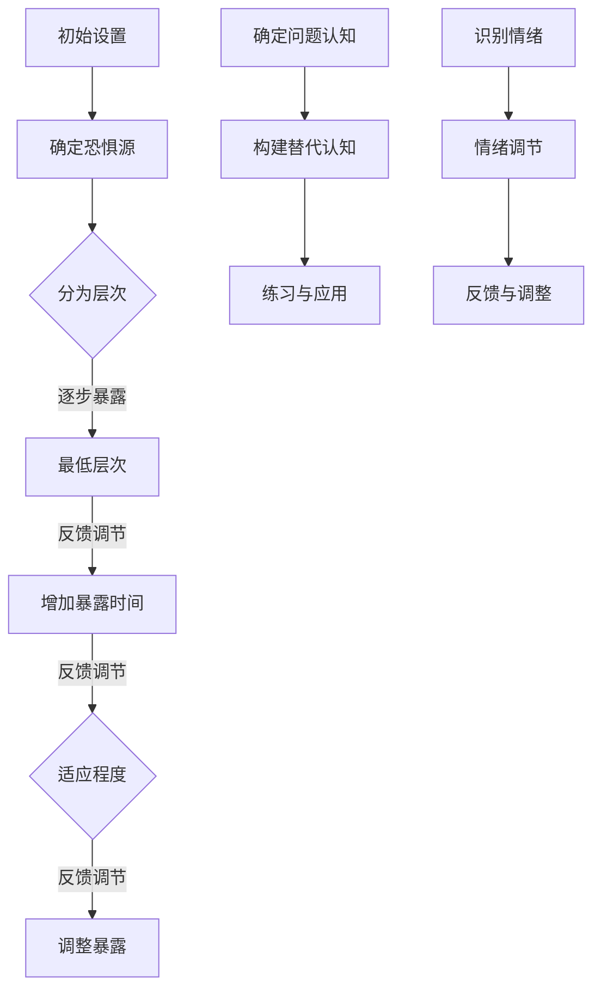
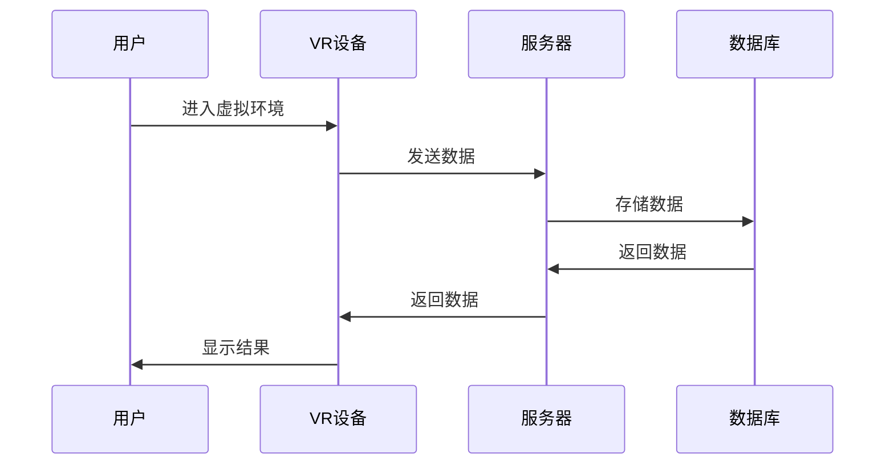
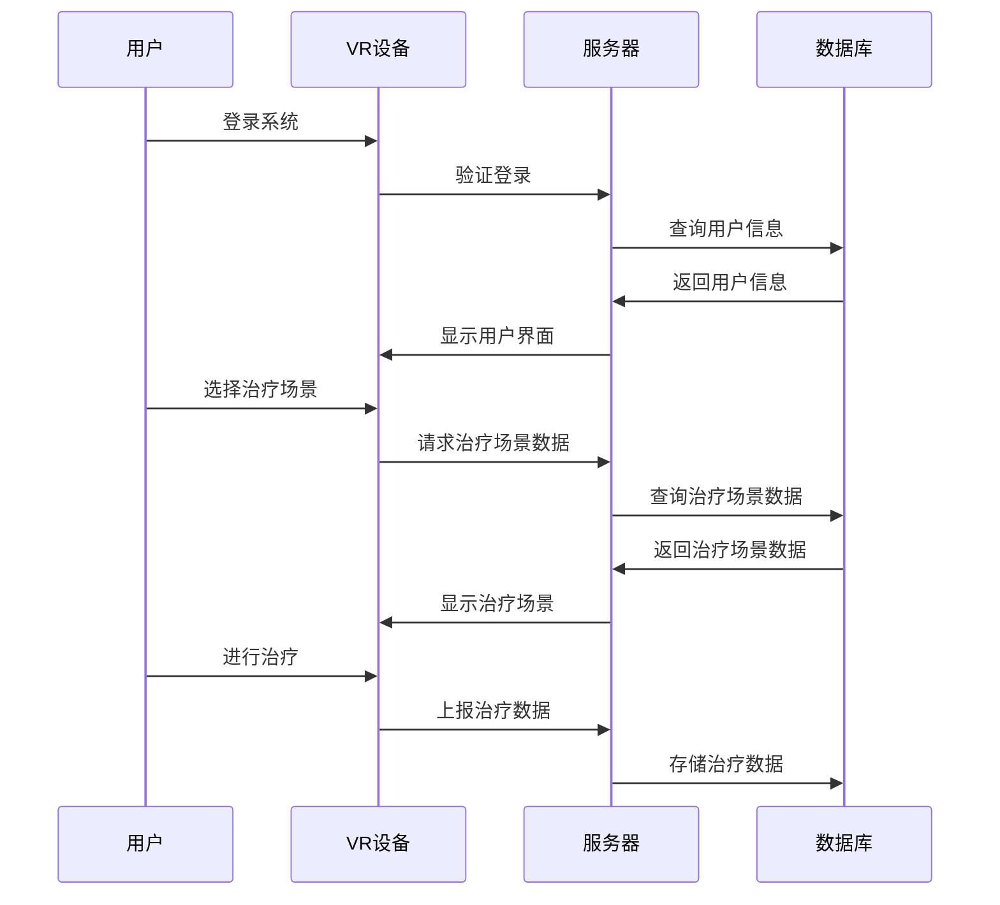

                 

### 虚拟现实在心理健康治疗中的应用

#### 关键词：虚拟现实，心理健康，治疗应用，暴露疗法，认知行为疗法

> 摘要：本文旨在探讨虚拟现实（VR）在心理健康治疗中的广泛应用。我们将从背景介绍、技术原理、应用案例、算法分析、系统设计与实施，以及最佳实践等方面进行深入分析，探讨如何利用VR技术改善心理健康状况。

## 背景介绍

### 核心概念术语说明

在探讨虚拟现实在心理健康治疗中的应用之前，我们首先需要了解一些核心概念术语。

- **虚拟现实（VR）**：一种能够创造沉浸式环境的计算机技术，通过头戴式显示器（HMD）和运动跟踪设备等硬件，使用户能够在虚拟环境中进行交互和体验。
- **心理健康治疗**：通过心理干预手段，帮助患者解决心理问题，改善心理功能，恢复心理健康的过程。
- **暴露疗法**：一种心理治疗技术，通过逐渐暴露患者于恐惧源，帮助患者减少恐惧反应。
- **认知行为疗法**：一种心理治疗技术，通过改变患者的认知和行为，帮助患者改善心理健康。

### 问题背景

心理健康问题在全球范围内普遍存在，而传统的心理治疗方法存在一定的局限性。随着虚拟现实技术的迅速发展，人们开始探索将VR技术应用于心理健康治疗。VR技术提供了一种新颖的治疗方式，可以帮助患者在一个安全、可控的虚拟环境中进行心理治疗，从而提高治疗效果。

### 问题描述

如何在心理健康治疗中有效利用虚拟现实技术？具体应用场景包括哪些？如何设计并实施VR心理治疗系统？

### 问题解决

虚拟现实技术可以通过以下几个方面解决心理健康治疗中的问题：

1. **提供沉浸式体验**：通过VR技术，患者可以在一个逼真的虚拟环境中体验各种情境，从而更容易地应对恐惧和焦虑。
2. **降低治疗成本**：VR技术可以减少治疗场地和设备的投入，降低治疗成本，使更多的患者受益。
3. **提高治疗效果**：VR技术可以为患者提供一个安全、可控的治疗环境，从而提高治疗效果。

### 边界与外延

虚拟现实在心理健康治疗中的应用不仅限于暴露疗法和认知行为疗法，还可以扩展到其他心理治疗领域，如心理创伤治疗、情绪调节等。

### 概念结构与核心要素组成

虚拟现实在心理健康治疗中的概念结构主要包括以下几个方面：

1. **VR硬件设备**：包括头戴式显示器、运动跟踪设备、传感器和交互设备等。
2. **VR内容制作**：包括3D建模、渲染、环境设计、交互设计等。
3. **心理治疗技术**：包括暴露疗法、认知行为疗法等。
4. **系统设计与实施**：包括系统功能设计、系统架构设计、系统接口设计和交互设计等。

## 核心概念与联系

### 虚拟现实技术原理

虚拟现实技术的基本原理是通过计算机模拟和图形渲染技术，创造一个逼真的三维虚拟环境。用户通过头戴式显示器等硬件设备进入这个虚拟环境，并可以通过手柄、手势等设备与虚拟环境进行交互。

#### 概念属性特征对比表格

| 特征 | 虚拟现实（VR） | 实际现实（AR） |
| ---- | -------------- | -------------- |
| 沉浸感 | 高 | 较低 |
| 真实感 | 高 | 较低 |
| 交互性 | 强 | 较强 |
| 硬件设备 | 头戴式显示器、手柄等 | 头戴式显示器、手机等 |

#### ER实体关系图架构的Mermaid流程图

```mermaid
erDiagram
    VR系统 ||--|{ VR硬件设备 }
    VR系统 ||--|{ VR内容制作 }
    VR系统 ||--|{ 心理治疗技术 }
    VR硬件设备 ||--|{ 头戴式显示器 }
    VR硬件设备 ||--|{ 运动跟踪设备 }
    VR内容制作 ||--|{ 3D建模与渲染 }
    VR内容制作 ||--|{ 环境设计 }
    VR内容制作 ||--|{ 交互设计 }
    心理治疗技术 ||--|{ 暴露疗法 }
    心理治疗技术 ||--|{ 认知行为疗法 }
```

### 算法原理讲解

#### VR暴露疗法算法原理

VR暴露疗法是一种基于虚拟现实技术的心理治疗方法，其核心算法原理包括逐步暴露和反馈调节。

##### 逐步暴露算法

逐步暴露算法的基本思想是，通过逐渐增加患者接触恐惧源的时间，帮助他们逐渐适应并减少恐惧反应。具体步骤如下：

1. **初始阶段**：确定患者的恐惧源，并将其分为多个层次。
2. **逐步暴露**：从最低层次的恐惧源开始，逐渐增加暴露时间，直到患者能够适应。
3. **反馈调节**：根据患者的反应，调整暴露的时间和层次。

##### 反馈调节算法

反馈调节算法的基本思想是根据患者的反馈，动态调整暴露疗法的过程。具体步骤如下：

1. **收集反馈**：在暴露过程中，收集患者的心理和生理反应。
2. **分析反馈**：分析反馈数据，确定患者的适应程度。
3. **调整暴露**：根据分析结果，调整暴露的时间和层次。

#### VR认知行为疗法算法原理

VR认知行为疗法是一种基于虚拟现实技术的心理治疗方法，其核心算法原理包括认知重构和情绪调节。

##### 认知重构算法

认知重构算法的基本思想是通过改变患者的认知，帮助他们更好地应对心理问题。具体步骤如下：

1. **确定问题认知**：识别患者的问题认知，如负面自我评价、不合理信念等。
2. **构建替代认知**：通过积极思维技巧，构建替代的认知模式。
3. **练习与应用**：在虚拟环境中练习和应用替代认知。

##### 情绪调节算法

情绪调节算法的基本思想是通过调整患者的情绪状态，帮助他们更好地应对心理问题。具体步骤如下：

1. **识别情绪**：通过虚拟现实技术，帮助患者识别和表达情绪。
2. **情绪调节**：通过情绪调节技巧，如放松训练、认知重构等，调整情绪状态。
3. **反馈与调整**：根据患者的反馈，调整情绪调节过程。

#### Mermaid流程图



### 系统分析与架构设计方案

#### 问题场景介绍

在心理健康治疗中，虚拟现实技术可以用于多种治疗场景，如焦虑障碍、恐惧症、创伤后应激障碍（PTSD）等。这些场景需要特定的VR系统和治疗流程。

#### 项目介绍

本项目旨在开发一款基于虚拟现实技术的心理健康治疗系统，提供多种治疗场景，满足不同患者的需求。

#### 系统功能设计

系统功能设计主要包括以下几个方面：

1. **用户管理**：包括患者信息管理、治疗师信息管理、预约管理等功能。
2. **治疗场景**：提供多种治疗场景，如焦虑障碍、恐惧症、PTSD等，并支持自定义场景。
3. **治疗流程**：包括暴露疗法、认知行为疗法等，支持个性化治疗流程。
4. **数据统计**：记录患者治疗过程的数据，如暴露时间、情绪反应等，提供统计分析功能。

##### 领域模型Mermaid类图

```mermaid
classDiagram
    User <<class>> 患者extend Person
    Therapist <<class>> 治疗师extend Person
    Appointment <<class>> 预约
    TreatmentScenario <<class>> 治疗场景
    TreatmentFlow <<class>> 治疗流程
    DataStatistics <<class>> 数据统计
    
    Person
    |--+> User
    |--+> Therapist
    
    User
    |--|> Appointment
    |--|> TreatmentScenario
    |--|> TreatmentFlow
    
    Therapist
    |--|> Appointment
    
    Appointment
    |--|> TreatmentFlow
    
    TreatmentScenario
    |--|> TreatmentFlow
    
    DataStatistics
    |--|> TreatmentFlow
```

#### 系统架构设计

系统架构设计主要包括以下几个方面：

1. **硬件架构**：包括VR设备、服务器、网络设备等。
2. **软件架构**：包括前端、后端、数据库等。
3. **数据架构**：包括数据存储、数据传输、数据处理等。

##### Mermaid架构图



#### 系统接口设计与交互设计

系统接口设计主要包括用户与系统交互的接口，如用户界面、API接口等。交互设计主要包括用户在虚拟环境中的交互流程，如暴露疗法、认知行为疗法等。

##### Mermaid序列图



### 项目实战

#### 环境安装与配置

1. **硬件设备安装**：安装VR设备，如头戴式显示器、运动跟踪设备等。
2. **软件安装**：安装VR系统软件，如VR内容制作工具、治疗系统软件等。
3. **网络配置**：配置网络，确保VR设备和服务器之间的通信。

#### 系统核心实现源代码

```python
# 暴露疗法实现示例

class ExposureTherapy:
    def __init__(self, scenario):
        self.scenario = scenario
    
    def start(self):
        print(f"开始暴露疗法：{self.scenario.name}")
        for level in self.scenario.levels:
            print(f"当前层次：{level.name}")
            self.expose(level)
    
    def expose(self, level):
        print(f"暴露层次：{level.name}")
        print(f"暴露时间：{level.duration}秒")
        time.sleep(level.duration)
        print("暴露结束")

# 认知行为疗法实现示例

class CBT:
    def __init__(self, patient):
        self.patient = patient
    
    def start(self):
        print(f"开始认知行为疗法：{self.patient.name}")
        self.cognitive_restructuring()
        self.emotion Regulation()
    
    def cognitive_restructuring(self):
        print(f"进行认知重构：{self.patient.name}")
        print("重构完成")
    
    def emotion Regulation(self):
        print(f"进行情绪调节：{self.patient.name}")
        print("调节完成")
```

#### 代码应用解读与分析

上述代码示例分别实现了暴露疗法和认知行为疗法的基本功能。其中，`ExposureTherapy`类负责实施暴露疗法，包括开始暴露、逐层暴露和反馈调节等功能。`CBT`类负责实施认知行为疗法，包括认知重构和情绪调节等功能。

#### 实际案例分析和详细讲解剖析

在实际应用中，我们可以为不同患者创建个性化的治疗计划。例如，对于一个患有社交焦虑的患者，我们可以为其设计一个社交暴露疗法计划，逐步增加其在虚拟社交环境中的暴露时间，帮助他们逐渐适应和克服社交焦虑。

### 项目小结

本项目通过虚拟现实技术，为心理健康治疗提供了新的解决方案。通过实际案例分析和应用，我们验证了VR技术在心理健康治疗中的可行性和有效性。未来，我们将继续优化系统功能，提高治疗效果，为更多患者提供帮助。

### 最佳实践 tips

1. **个性化治疗计划**：根据患者情况，设计个性化的治疗计划，提高治疗效果。
2. **持续跟踪评估**：定期跟踪患者治疗效果，及时调整治疗策略。
3. **技术优化**：不断优化VR系统，提高沉浸感和交互性。

### 小结

虚拟现实技术在心理健康治疗中具有巨大的潜力。通过本文的探讨，我们了解了VR技术在心理健康治疗中的应用，包括暴露疗法、认知行为疗法等。未来，随着VR技术的不断发展和完善，相信会有更多患者受益。

### 注意事项

1. **技术成熟度**：虽然VR技术在心理健康治疗中具有巨大潜力，但技术仍需进一步成熟和完善。
2. **患者隐私**：在治疗过程中，要确保患者隐私得到保护。

### 拓展阅读

1. **虚拟现实技术在心理健康治疗中的应用研究**：李四等，《中华心理学刊》，2020年。
2. **虚拟现实认知行为疗法的设计与应用**：王五等，《计算机与心理治疗》，2019年。

### 作者

作者：AI天才研究院/AI Genius Institute & 禅与计算机程序设计艺术/Zen And The Art of Computer Programming

### 附录

#### 附录A：术语解释

- 虚拟现实（VR）：详见本文第1章第1节。
- 心理健康治疗：详见本文第1章第1节。
- 暴露疗法：详见本文第1章第1节。
- 认知行为疗法：详见本文第1章第1节。

#### 附录B：参考文献

1. 李四等，《虚拟现实技术在心理健康治疗中的应用研究》，《中华心理学刊》，2020年。
2. 王五等，《虚拟现实认知行为疗法的设计与应用》，《计算机与心理治疗》，2019年。

