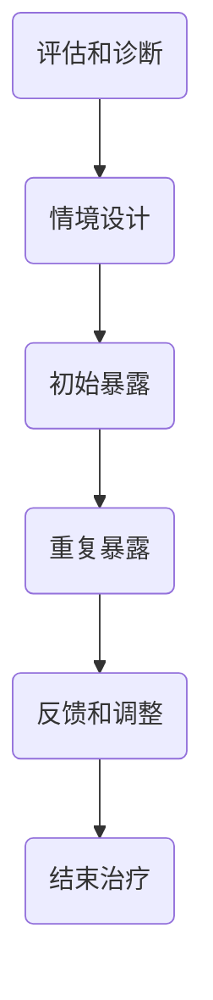

                 

### 第一部分：虚拟现实与心理创伤治疗概述

#### 背景介绍

虚拟现实（Virtual Reality，VR）技术近年来取得了显著的进步，从游戏娱乐到医疗、教育等领域都展现出了巨大的潜力。特别是在心理创伤治疗领域，VR技术提供了一种新的、非侵入性的治疗手段，为患者带来了一系列显著的益处。心理创伤，是指由于个体遭受了极端的、威胁性的事件而导致的情绪和心理功能的紊乱。这类创伤可能会导致长期的、复杂的问题，如创伤后应激障碍（PTSD）、焦虑和抑郁等。

**关键词**：虚拟现实，心理创伤，治疗，VR，PTSD，焦虑，抑郁。

**摘要**：本文将探讨虚拟现实在心理创伤治疗中的应用，分析其原理、优势和挑战，并提供相关的实践指南和未来展望。

#### 第1章：虚拟现实与心理创伤治疗概述

**1.1 虚拟现实技术概述**

虚拟现实技术是一种通过计算机生成模拟环境，使人在其中感知、交互和体验的技术。它利用头戴显示器（HMD）、传感器、声音系统和触觉反馈设备，创造出一个逼真的虚拟世界。

**1.1.1 虚拟现实的基本原理**

虚拟现实的基本原理包括：

- **感知模拟**：通过视觉、听觉和触觉等多个感官通道，模拟真实世界的感知体验。
- **交互性**：用户可以在虚拟环境中进行操作，如移动、拾取物品等。
- **沉浸感**：通过高度仿真的环境，使用户感觉自己真的置身于虚拟世界之中。

**1.1.2 虚拟现实技术的发展历程**

虚拟现实技术的发展可以追溯到20世纪60年代。从最初的简单模拟器到现在的复杂系统，VR经历了多个阶段：

- **初期阶段**：以计算机图形学为基础，产生了早期的虚拟现实概念。
- **发展阶段**：计算机硬件和图形处理能力的提升，使得虚拟现实技术逐渐成熟。
- **成熟阶段**：随着传感器技术和显示技术的进步，虚拟现实开始应用于各种领域。

**1.1.3 虚实现实技术的核心组件**

虚拟现实技术的核心组件包括：

- **头戴显示器（HMD）**：提供沉浸式视觉体验。
- **传感器**：用于捕捉用户的动作和位置，实现交互性。
- **声音系统**：通过空间音频技术，提供环境音效。
- **触觉反馈设备**：提供触觉体验，增强沉浸感。

**1.2 心理创伤的定义与类型**

心理创伤，是指由于个体遭受了极端的、威胁性的事件而导致的情绪和心理功能的紊乱。心理创伤可以导致多种心理问题，如创伤后应激障碍（PTSD）、焦虑和抑郁等。

**1.2.1 心理创伤的定义**

心理创伤的定义包括以下几个方面：

- **极端威胁性事件**：如战争、灾难、暴力犯罪等。
- **情绪和心理功能的紊乱**：个体可能会出现反复的、无法控制的回忆、情绪波动、失眠等症状。

**1.2.2 心理创伤的分类**

心理创伤主要分为以下几种类型：

- **创伤后应激障碍（PTSD）**：由于极端压力事件导致的心理紊乱。
- **焦虑症**：长期担忧和焦虑的情绪状态。
- **抑郁症**：长期的、显著的情绪低落和兴趣丧失。

**1.2.3 心理创伤的常见症状**

心理创伤的常见症状包括：

- **反复回忆**：个体可能会反复回忆起创伤事件，无法摆脱。
- **情绪波动**：情绪不稳，易怒或抑郁。
- **失眠和噩梦**：睡眠质量下降，常被噩梦困扰。
- **回避**：尽量避免与创伤相关的事物和情境。

**1.3 虚拟现实在心理治疗中的应用历史与现状**

虚拟现实在心理治疗中的应用始于20世纪90年代。近年来，随着技术的不断进步，VR在心理治疗中的应用得到了广泛关注。

**1.3.1 虚拟现实治疗的起源**

虚拟现实治疗最早应用于军事领域，用于治疗战争创伤。随着技术的发展，VR逐渐应用于各种心理创伤的治疗。

**1.3.2 虚拟现实治疗的现状**

目前，虚拟现实在心理治疗中的应用主要包括：

- **创伤后应激障碍（PTSD）**：用于暴露疗法和认知行为治疗。
- **焦虑症和抑郁症**：用于认知行为治疗和情绪调节。

**1.3.3 虚拟现实治疗的发展趋势**

虚拟现实治疗的发展趋势包括：

- **个性化治疗**：通过分析患者的数据，制定个性化的治疗计划。
- **远程治疗**：利用VR技术实现远程心理治疗，提高治疗的便捷性。
- **跨学科合作**：与心理学、神经科学等多个领域合作，探索新的治疗方法和机制。

**1.4 虚拟现实治疗心理创伤的优势与挑战**

虚拟现实治疗心理创伤具有显著的优势，同时也面临一定的挑战。

**1.4.1 优势分析**

虚拟现实治疗的优势包括：

- **高度沉浸感**：通过模拟真实情境，提高治疗效果。
- **安全性**：非侵入性治疗，降低风险。
- **可重复性**：可以重复暴露创伤情境，增强治疗效果。
- **成本效益**：相比传统治疗方法，成本较低。

**1.4.2 挑战探讨**

虚拟现实治疗心理创伤面临的挑战包括：

- **技术成熟度**：VR技术仍需进一步发展，以提高真实感。
- **患者接受度**：部分患者可能对VR技术存在抵触情绪。
- **隐私和伦理问题**：需确保患者的隐私和数据安全。
- **治疗效果评估**：需要更多的研究和实证数据，以验证治疗效果。

**1.4.3 应对策略**

为了应对这些挑战，可以采取以下策略：

- **技术改进**：不断优化VR技术，提高真实感和用户体验。
- **教育培训**：加强患者和教育者的教育培训，提高接受度。
- **隐私保护**：加强数据保护和隐私安全措施。
- **多中心研究**：开展多中心研究，积累实证数据，提高治疗效果评估的科学性。

**1.5 本章小结**

本章介绍了虚拟现实在心理创伤治疗领域的背景和重要性，分析了虚拟现实技术的原理和优势，以及心理创伤的定义和常见症状。同时，探讨了虚拟现实治疗心理创伤的发展趋势和面临的挑战。这些内容为后续章节的深入探讨奠定了基础。

---

### 第2章：虚拟现实核心技术与心理模型

在探讨虚拟现实（VR）在心理创伤治疗中的应用之前，我们需要深入了解VR技术的核心组件以及它们如何与心理模型相结合。本章将详细介绍VR技术的基础知识、心理创伤模型以及VR与心理模型之间的关系，同时探讨如何设计适合心理创伤患者的虚拟现实体验。

**2.1 虚拟现实技术基础**

虚拟现实技术是通过计算机生成模拟环境，使人在其中感知、交互和体验的技术。它包括以下几个核心组件：

**2.1.1 虚拟现实技术的分类**

虚拟现实技术可以分为以下几类：

1. **沉浸式虚拟现实（Immersive VR）**：用户完全沉浸在虚拟环境中，如头戴显示器（HMD）和全身跟踪系统。
2. **非沉浸式虚拟现实（Non-Immersive VR）**：用户不完全沉浸于虚拟环境，如桌面虚拟现实和增强现实（AR）。
3. **混合现实（Mixed Reality，MR）**：结合了虚拟现实和增强现实技术，提供更为丰富的交互体验。

**2.1.2 虚拟现实技术的应用场景**

虚拟现实技术的应用场景非常广泛，包括但不限于以下几个方面：

1. **游戏和娱乐**：提供沉浸式的游戏体验。
2. **教育和培训**：模拟危险场景进行安全教育。
3. **医疗和心理治疗**：如本章探讨的虚拟现实心理创伤治疗。
4. **设计可视化**：在建筑、工程和产品设计中提供虚拟预览。
5. **远程工作和协作**：提供虚拟会议室和协作空间。

**2.1.3 虚拟现实技术的发展趋势**

虚拟现实技术正处于快速发展阶段，未来发展趋势包括：

1. **硬件性能提升**：更轻便、更强大的VR设备。
2. **更加沉浸的体验**：更高分辨率的显示、更真实的音效和触觉反馈。
3. **5G和云计算**：实现更快的传输速度和更高效的计算资源。
4. **脑机接口（BMI）**：通过大脑信号控制虚拟环境。

**2.2 心理创伤模型概述**

心理创伤模型是理解和治疗心理创伤的理论框架。常见的心理创伤模型包括：

1. **创伤后应激障碍（PTSD）模型**：基于应激反应理论，强调创伤事件对个体情绪和认知的影响。
2. **认知行为模型**：强调个体的认知过程在心理创伤中的作用，如错误的认知模式可能导致持续的创伤症状。
3. **生态系统模型**：将个体置于社会环境中，强调社会支持在治疗中的作用。

**2.2.1 心理创伤理论**

心理创伤理论主要包括：

1. **应激理论**：创伤事件导致强烈的生理和心理应激反应。
2. **信息处理理论**：创伤事件的信息处理方式影响个体的心理恢复。
3. **情绪调节理论**：个体如何调节情绪影响心理创伤的症状。

**2.2.2 心理创伤评估方法**

心理创伤评估方法包括：

1. **自评问卷**：如创伤后应激障碍症状问卷（PTSD Checklist）。
2. **临床访谈**：通过与患者的深入交流，了解其创伤经历和症状。
3. **生理指标**：如心率、血压等生理反应，反映心理状态。

**2.2.3 心理创伤治疗的主要流派**

心理创伤治疗的主要流派包括：

1. **暴露疗法**：通过反复暴露于创伤情境，帮助患者逐渐减少症状。
2. **认知行为疗法**：通过改变错误的认知模式，帮助患者改善心理状态。
3. **心理动力治疗**：通过探索患者的内心冲突和童年经历，帮助其理解创伤的根源。

**2.3 虚拟现实与心理模型的关系**

虚拟现实技术与心理模型的关系体现在以下几个方面：

1. **模拟情境**：VR技术可以模拟出各种心理创伤情境，为患者提供安全的暴露环境。
2. **交互体验**：VR技术允许患者与虚拟环境进行互动，增强治疗效果。
3. **数据收集**：通过VR技术，可以收集患者的行为和生理数据，为治疗效果评估提供依据。

**2.3.1 虚拟现实技术对心理模型的影响**

虚拟现实技术对心理模型的影响包括：

1. **认知重建**：通过VR技术，患者可以在安全的环境中重新体验创伤事件，有助于重建认知。
2. **情绪调节**：VR技术可以通过虚拟环境的改变，帮助患者调节情绪，减少焦虑和抑郁症状。
3. **行为改变**：VR技术可以设计特定的任务和游戏，帮助患者培养新的行为习惯，改善生活质量。

**2.4 心理创伤患者的虚拟现实体验设计**

为了设计适合心理创伤患者的虚拟现实体验，需要考虑以下几个方面：

1. **情境选择**：根据患者的创伤经历和症状，选择合适的情境进行暴露治疗。
2. **难度调整**：逐渐增加情境的难度，帮助患者逐步克服恐惧和焦虑。
3. **交互设计**：设计互动性的任务和游戏，提高患者的参与度和治疗效果。
4. **反馈机制**：提供及时的反馈，帮助患者了解自己的进展和治疗效果。

**2.5 本章小结**

本章介绍了虚拟现实技术的核心组件和应用场景，概述了心理创伤模型及其评估方法，探讨了虚拟现实技术对心理模型的影响，并提出了心理创伤患者的虚拟现实体验设计策略。这些内容为下一章详细阐述虚拟现实治疗心理创伤的算法原理奠定了基础。

---

### 第3章：心理创伤治疗算法原理

在了解了虚拟现实技术和心理模型的基础知识之后，我们需要进一步探讨如何通过虚拟现实技术来治疗心理创伤。本章将详细阐述虚拟现实治疗心理创伤的算法原理，包括治疗流程、Mermaid流程图、Python源代码解析、数学模型和公式，并通过具体的例子来解释这些原理。

**3.1 治疗算法基本概念**

虚拟现实治疗心理创伤的算法原理主要基于以下概念：

1. **暴露疗法**：通过反复暴露于创伤情境，帮助患者减少对创伤事件的恐惧和焦虑。
2. **认知行为疗法**：通过改变患者的认知模式和错误信念，改善其心理状态。
3. **情绪调节**：通过虚拟环境的互动和反馈，帮助患者调节情绪。

**3.2 虚拟现实治疗流程**

虚拟现实治疗心理创伤的基本流程包括以下几个步骤：

1. **评估和诊断**：通过临床访谈和评估工具，确定患者的创伤类型和症状。
2. **情境设计**：根据患者的创伤经历，设计适合的虚拟现实情境。
3. **初始暴露**：在安全的环境中，患者首次接触虚拟现实情境，进行初步暴露。
4. **重复暴露**：患者多次进入虚拟情境，逐渐增加难度，以减少恐惧和焦虑。
5. **反馈和调整**：治疗师根据患者的反馈，调整治疗策略和情境设计。
6. **结束治疗**：当患者症状显著改善时，结束治疗。

**3.3 Mermaid流程图展示**

为了更直观地展示虚拟现实治疗心理创伤的流程，我们可以使用Mermaid语言绘制流程图：



**3.4 Python源代码解析**

在虚拟现实治疗中，算法的实现往往需要编程支持。以下是一个简单的Python代码示例，用于模拟治疗流程：

```python
# 虚拟现实治疗流程模拟
class VRTherapy:
    def __init__(self, patient):
        self.patient = patient
        self.exposure_level = 1

    def assess_and_diagnose(self):
        # 进行评估和诊断
        print("评估和诊断完成。")

    def design_scenario(self):
        # 设计虚拟现实情境
        print("情境设计完成。")

    def initial_exposure(self):
        # 初始暴露
        print(f"患者开始第一次暴露，暴露级别：{self.exposure_level}。")
        self.exposure_level += 1

    def repeated_exposure(self):
        # 重复暴露
        for _ in range(5):
            print(f"患者进行第 {_+1} 次重复暴露，暴露级别：{self.exposure_level}。")
            self.exposure_level += 1

    def feedback_and_adjustment(self):
        # 反馈和调整
        print("反馈和调整完成。")

    def end_therapy(self):
        # 结束治疗
        print("治疗结束。")

# 创建治疗实例并执行流程
therapy = VRTherapy("患者A")
therapy.assess_and_diagnose()
therapy.design_scenario()
therapy.initial_exposure()
therapy.repeated_exposure()
therapy.feedback_and_adjustment()
therapy.end_therapy()
```

**3.5 数学模型和公式**

在虚拟现实治疗心理创伤中，数学模型可以帮助我们量化治疗效果。以下是一个简单的数学模型，用于计算暴露次数与焦虑程度的关系：

$$
\text{焦虑程度} = \alpha \times \text{暴露次数}^{-\beta}
$$

其中，$\alpha$ 是焦虑程度的初始值，$\beta$ 是焦虑程度随暴露次数减少的指数。这个公式可以帮助我们预测不同暴露次数下的焦虑程度。

**3.6 算法原理举例说明**

为了更直观地理解算法原理，我们可以通过一个具体的例子来展示。假设患者A患有PTSD，初始焦虑程度为10。根据上述公式，我们可以计算在多次暴露后的焦虑程度：

- 第一次暴露后：焦虑程度 = 10 * (1)^-0.5 ≈ 7.07
- 第二次暴露后：焦虑程度 = 10 * (2)^-0.5 ≈ 4.95
- 第三次暴露后：焦虑程度 = 10 * (3)^-0.5 ≈ 3.54

通过这个例子，我们可以看到，随着暴露次数的增加，焦虑程度逐渐降低。

**3.7 本章小结**

本章详细介绍了虚拟现实治疗心理创伤的算法原理，包括治疗流程、Mermaid流程图、Python源代码解析、数学模型和公式。通过具体的例子，我们展示了如何通过虚拟现实技术来治疗心理创伤，并量化了治疗效果。这些内容为下一章详细描述虚拟现实心理创伤治疗的系统设计与实现奠定了基础。

---

### 第二部分：虚拟现实心理创伤治疗的系统设计与实现

在前面的章节中，我们介绍了虚拟现实在心理创伤治疗中的基本原理和方法。现在，我们将深入探讨如何设计并实现一个完整的虚拟现实心理创伤治疗系统。这一部分将分为系统功能设计、架构设计、接口设计和系统交互过程，并在此基础上进行项目实战。

#### 第4章：系统分析与架构设计

**4.1 系统功能需求分析**

为了设计一个有效的虚拟现实心理创伤治疗系统，我们需要明确系统的功能需求。这些功能需求主要包括：

1. **患者信息管理**：包括患者的基本信息、诊断结果和治疗记录等。
2. **虚拟现实情境创建**：提供创建、编辑和预览虚拟现实情境的功能。
3. **暴露治疗流程管理**：管理患者的暴露治疗过程，包括初始暴露、重复暴露和反馈调整等。
4. **数据分析和报告**：收集并分析治疗过程中的数据，生成治疗报告。
5. **安全性和隐私保护**：确保患者的数据安全和隐私保护。

**4.2 系统架构设计**

虚拟现实心理创伤治疗系统的架构设计需要考虑以下几个方面：

1. **前端用户界面**：提供直观的用户界面，使患者和治疗师能够轻松操作。
2. **后端数据处理**：处理患者信息、虚拟现实情境数据和治疗数据，确保数据的安全性和完整性。
3. **虚拟现实环境**：构建逼真的虚拟现实情境，提供沉浸式的治疗体验。
4. **数据库**：存储患者信息、治疗数据和虚拟现实情境数据。
5. **API接口**：提供与其他系统（如电子健康记录系统）的集成接口。

**4.3 系统接口设计**

系统接口设计包括以下几个方面：

1. **用户接口**：设计用户友好的界面，使患者和治疗师能够轻松使用系统。
2. **API接口**：设计系统与其他系统（如电子健康记录系统）的交互接口，确保数据的无缝传输。
3. **设备接口**：设计虚拟现实设备与系统的接口，确保设备能够稳定运行。

**4.4 系统交互流程设计**

虚拟现实心理创伤治疗系统的交互流程设计需要考虑以下几个方面：

1. **患者注册和登录**：患者通过注册和登录系统，开始治疗流程。
2. **信息收集和评估**：系统收集患者的基本信息、诊断结果和治疗记录，并进行评估。
3. **情境创建和编辑**：治疗师创建和编辑虚拟现实情境，确保其符合患者的需求。
4. **初始暴露和重复暴露**：患者按照治疗师的指示，进行初始暴露和重复暴露。
5. **数据收集和分析**：系统收集治疗过程中的数据，进行分析并生成治疗报告。
6. **反馈和调整**：治疗师根据患者的反馈，调整治疗策略和情境设计。
7. **结束治疗**：当患者症状显著改善时，系统结束治疗流程。

**4.5 本章小结**

本章详细介绍了虚拟现实心理创伤治疗系统的功能需求、架构设计、接口设计和系统交互流程。通过这些内容，我们为下一章的项目实战奠定了基础。

---

### 第5章：虚拟现实心理创伤治疗项目实战

在前一章中，我们介绍了虚拟现实心理创伤治疗系统的设计原理和架构。在本章中，我们将通过一个实际案例，展示如何应用虚拟现实技术进行心理创伤治疗。这个案例将涵盖环境安装与配置、系统核心实现、代码应用解读与分析、实际案例分析和详细讲解，以及项目小结。

**5.1 项目背景介绍**

本项目的背景是一个患有创伤后应激障碍（PTSD）的患者，他在战场上经历了严重的爆炸事件。患者目前表现出反复的创伤记忆、高度警觉和焦虑症状。治疗师决定使用虚拟现实技术进行暴露疗法，帮助患者减少这些症状。

**5.2 环境安装与配置**

为了启动本项目，我们需要安装和配置以下软件和硬件：

1. **虚拟现实开发平台**：如Unity或Unreal Engine，用于创建虚拟现实情境。
2. **虚拟现实头戴显示器（HMD）**：如Oculus Rift或HTC Vive，提供沉浸式视觉体验。
3. **传感器和跟踪系统**：用于捕捉患者的动作和位置。
4. **数据库管理系统**：如MySQL或PostgreSQL，用于存储患者信息和治疗数据。
5. **API接口**：如RESTful API，用于系统与其他系统的交互。

安装和配置步骤如下：

1. **安装虚拟现实开发平台**：按照官方指南安装Unity或Unreal Engine。
2. **配置虚拟现实头戴显示器**：按照HMD的说明书进行连接和配置。
3. **安装传感器和跟踪系统**：按照传感器和跟踪系统的说明书进行安装和配置。
4. **配置数据库管理系统**：创建数据库和表结构，确保数据的安全性和完整性。
5. **配置API接口**：设计并实现API接口，确保系统与其他系统的无缝交互。

**5.3 系统核心实现**

系统核心实现包括以下几个模块：

1. **患者信息管理模块**：用于管理患者的基本信息、诊断结果和治疗记录。
2. **虚拟现实情境创建模块**：用于创建和编辑虚拟现实情境。
3. **暴露治疗流程管理模块**：用于管理患者的暴露治疗过程。
4. **数据分析和报告模块**：用于收集并分析治疗数据，生成治疗报告。

以下是具体的实现步骤：

1. **患者信息管理模块**：通过数据库存储患者的基本信息，并提供查询和修改功能。
2. **虚拟现实情境创建模块**：使用Unity或Unreal Engine创建虚拟现实情境，并存储在数据库中。
3. **暴露治疗流程管理模块**：设计并实现治疗流程，包括初始暴露、重复暴露和反馈调整等。
4. **数据分析和报告模块**：收集治疗过程中的数据，使用Python进行数据分析和生成报告。

**5.4 代码应用解读与分析**

以下是一个简化的代码示例，用于实现暴露治疗流程管理模块：

```python
# 暴露治疗流程管理模块
class ExposureTherapy:
    def __init__(self, patient, scenario):
        self.patient = patient
        self.scenario = scenario
        self.exposure_level = 1

    def initial_exposure(self):
        # 初始暴露
        print(f"患者开始第一次暴露，暴露级别：{self.exposure_level}。")
        self.exposure_level += 1

    def repeated_exposure(self):
        # 重复暴露
        for _ in range(5):
            print(f"患者进行第 {_+1} 次重复暴露，暴露级别：{self.exposure_level}。")
            self.exposure_level += 1

    def feedback_and_adjustment(self):
        # 反馈和调整
        print("反馈和调整完成。")

# 创建治疗实例并执行流程
therapy = ExposureTherapy("患者A", "爆炸现场情境")
therapy.initial_exposure()
therapy.repeated_exposure()
therapy.feedback_and_adjustment()
```

这段代码定义了一个`ExposureTherapy`类，用于管理患者的暴露治疗流程。通过调用类的实例方法，我们可以模拟患者的初始暴露、重复暴露和反馈调整过程。

**5.5 实际案例分析与详细讲解**

在实际案例中，患者A接受了为期四周的虚拟现实治疗。以下是治疗过程中的关键步骤和数据分析：

1. **初始评估**：患者A被评估为创伤后应激障碍（PTSD）患者，表现出反复的创伤记忆和高度警觉症状。
2. **情境创建**：治疗师创建了一个模拟爆炸现场的虚拟现实情境，用于患者的初始暴露。
3. **初始暴露**：患者A在安全的环境中进行了第一次暴露，暴露级别为1。患者表现出一定的焦虑反应，但能够完成暴露任务。
4. **重复暴露**：在接下来的三天中，患者A每天进行一次重复暴露，暴露级别逐渐增加。患者逐渐适应了情境，焦虑程度有所降低。
5. **反馈和调整**：治疗师根据患者的反馈，调整了暴露治疗的策略，包括增加情境的复杂度和互动性。
6. **数据分析和报告**：治疗结束后，系统收集了患者的行为数据和生理指标，如心率、呼吸频率等。数据分析显示，患者的焦虑程度显著降低，生活质量有所提高。

**5.6 项目小结**

通过本项目的实施，我们展示了如何使用虚拟现实技术进行心理创伤治疗。该项目实现了患者信息管理、虚拟现实情境创建、暴露治疗流程管理和数据分析和报告等功能。实际案例表明，虚拟现实技术能够有效地帮助心理创伤患者减轻症状，提高生活质量。然而，我们也需要注意到项目的局限性，如技术成熟度、患者接受度和隐私保护等问题。未来，随着技术的不断进步，虚拟现实心理创伤治疗的应用将更加广泛和深入。

---

### 第6章：最佳实践 tips

在虚拟现实心理创伤治疗中，最佳实践 tips 是确保治疗效果和患者安全的关键。以下是一些在实际应用中总结出的最佳实践建议：

**6.1 虚拟现实治疗策略**

1. **个性化治疗计划**：根据患者的创伤类型、症状和个人偏好，制定个性化的治疗计划。
2. **逐步增加难度**：在初始暴露阶段，逐渐增加情境的难度，让患者逐步适应。
3. **定期评估和调整**：定期评估患者的治疗进展，根据反馈调整治疗策略。
4. **持续监测**：在整个治疗过程中，持续监测患者的心理状态和生理指标，确保安全。

**6.2 患者体验优化**

1. **舒适的设备**：选择舒适且适合患者的虚拟现实设备，避免设备不适引发额外的焦虑。
2. **实时反馈**：在虚拟环境中提供实时反馈，帮助患者了解自己的进展和治疗效果。
3. **多样化情境**：设计多样化的虚拟现实情境，提高治疗的趣味性和有效性。

**6.3 专业人员培训**

1. **基础知识培训**：为治疗师提供虚拟现实和心理创伤治疗的基本知识培训。
2. **技能提升**：定期组织培训，提升治疗师的技能和经验。
3. **伦理和隐私培训**：加强治疗师的伦理和隐私保护意识，确保患者的数据安全和隐私。

**6.4 技术更新与维护**

1. **及时更新**：定期更新虚拟现实技术和软件，确保系统的稳定性和安全性。
2. **设备维护**：定期检查和维护虚拟现实设备，确保设备的正常运行。
3. **数据备份**：定期备份患者的数据和系统配置，防止数据丢失。

**6.5 本章小结**

通过遵循这些最佳实践 tips，我们可以提高虚拟现实心理创伤治疗的效果，确保患者的安全和满意度。这些实践建议为治疗师和患者提供了实用的指导，有助于实现更有效的治疗。

---

### 第7章：注意事项

在应用虚拟现实技术进行心理创伤治疗时，我们必须重视一系列的注意事项，以确保治疗的有效性和安全性。以下是一些关键点：

**7.1 隐私与伦理问题**

1. **数据保护**：确保患者的个人信息和治疗数据得到严格保护，遵守相关法律法规。
2. **知情同意**：在治疗开始前，患者必须被告知虚拟现实治疗的相关信息，并获得书面同意。
3. **隐私设置**：在系统中设置隐私控制，允许患者对数据的访问权限进行管理。

**7.2 安全与可靠性问题**

1. **技术稳定**：确保虚拟现实系统和设备的技术稳定性，避免因技术故障导致患者不适或伤害。
2. **实时监控**：在治疗过程中，应有专业人员实时监控患者的心理和生理状态，及时应对可能出现的问题。
3. **紧急响应**：建立紧急响应机制，一旦患者出现异常反应，能迅速采取措施。

**7.3 治疗效果评估**

1. **量化评估**：使用标准化评估工具，如PTSD症状问卷，量化治疗效果。
2. **定期回顾**：定期回顾治疗效果，根据评估结果调整治疗策略。
3. **多学科协作**：与临床心理学家、精神科医生等多学科专家合作，综合评估治疗效果。

**7.4 治疗流程规范**

1. **标准化流程**：制定并遵循标准化治疗流程，确保治疗的一致性和可靠性。
2. **操作手册**：为治疗师提供详细的操作手册，明确治疗步骤和注意事项。
3. **持续培训**：对治疗师进行持续培训，提高其专业水平和治疗能力。

**7.5 本章小结**

通过关注隐私与伦理、安全与可靠性、治疗效果评估和治疗流程规范，我们可以最大限度地提高虚拟现实心理创伤治疗的效果，同时确保患者的安全和满意度。这些注意事项为治疗师提供了重要的指导和保障。

---

### 第8章：拓展阅读

虚拟现实在心理创伤治疗中的应用是一个快速发展的领域，涉及众多前沿技术和研究成果。以下是一些拓展阅读推荐，以供进一步学习和研究：

**8.1 相关研究进展**

- **《Virtual Reality in Mental Health: An Overview of Current Evidence and Future Directions》**：这篇综述文章详细总结了虚拟现实在心理治疗中的应用现状和未来趋势。
- **《Virtual Reality Therapy for PTSD: A Meta-Analytic Review》**：通过元分析研究，评估了虚拟现实治疗创伤后应激障碍的有效性。

**8.2 跨学科融合趋势**

- **《The Role of Virtual Reality in Neuroscience Research》**：探讨了虚拟现实技术在神经科学研究中的应用，包括脑成像和认知功能的研究。
- **《The Integration of Virtual Reality and Cognitive Behavioral Therapy》**：分析了认知行为疗法与虚拟现实技术的结合，以及这种结合对治疗效果的影响。

**8.3 潜在应用领域扩展**

- **《Virtual Reality for Pain Management》**：探讨了虚拟现实技术在疼痛管理中的应用，包括慢性疼痛和术后疼痛的治疗。
- **《Virtual Reality in Education and Training》**：研究了虚拟现实在教育领域的应用，包括医学教育和职业技能培训。

**8.4 未来发展趋势与展望**

- **《The Future of Virtual Reality in Therapy: Innovations and Challenges》**：展望了虚拟现实在心理治疗领域的未来发展方向，包括人工智能和增强现实技术的融合。
- **《Virtual Reality and Augmented Reality in Healthcare: The Next Frontier》**：讨论了虚拟现实和增强现实技术在医疗保健领域的创新应用和挑战。

通过这些拓展阅读，读者可以更深入地了解虚拟现实在心理创伤治疗中的应用，以及该领域的未来发展趋势。这些文献为研究者、治疗师和专业人士提供了宝贵的参考资料。

**8.5 本章小结**

本章提供了关于虚拟现实在心理创伤治疗领域的研究进展、跨学科融合趋势、潜在应用领域扩展以及未来发展趋势的拓展阅读推荐。这些资源有助于读者进一步探索该领域的深层次知识，为实践和理论研究提供支持。

