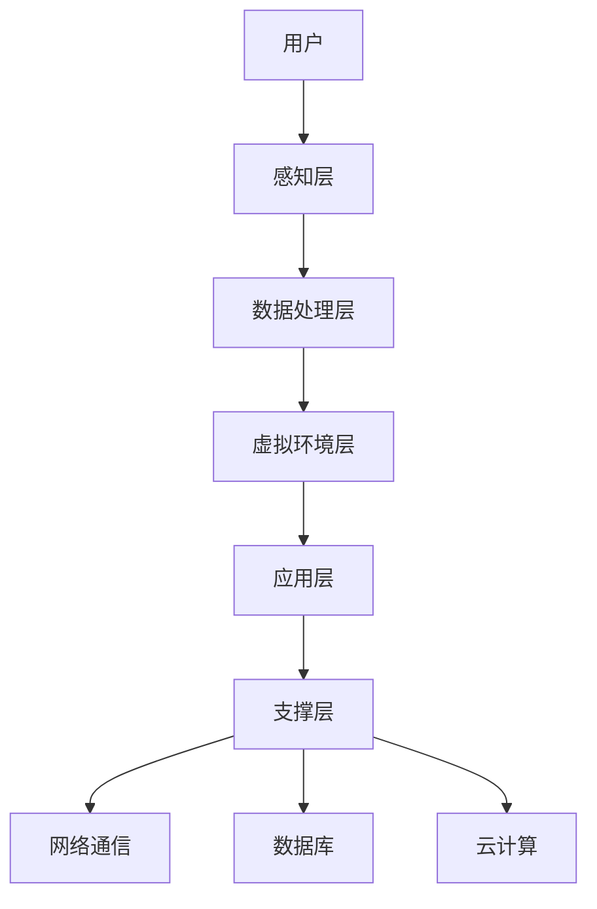
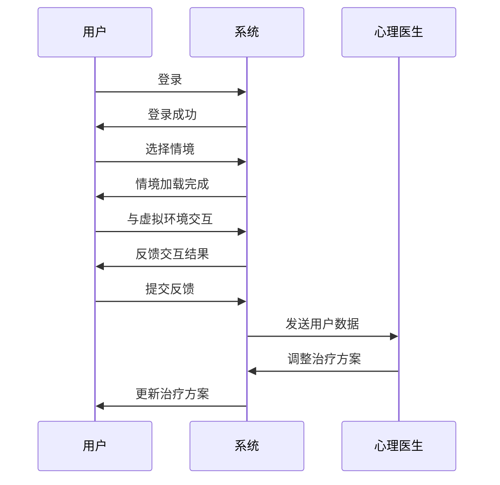

                 

### 虚拟现实在心理创伤治疗中的模拟应用

> **关键词：虚拟现实、心理创伤治疗、模拟应用、暴露疗法、认知重塑**

> **摘要：本文将探讨虚拟现实技术在心理创伤治疗中的应用，从技术基础、核心原理、实际案例到未来发展进行全面剖析，为读者呈现一个全新的视角。**

虚拟现实（Virtual Reality, VR）技术近年来在医疗领域，尤其是心理创伤治疗领域展现出了巨大的潜力。通过创建高度沉浸的虚拟环境，心理医生能够为患者提供一个安全的空间，模拟出各种可能引发创伤的情境，以此帮助患者逐渐适应和克服心理障碍。

### 第一部分：虚拟现实技术基础

#### 第1章：虚拟现实概述
虚拟现实是一种能够模拟出逼真三维空间的交互技术。它通过头戴显示器（HMD）、数据手套和运动跟踪器等硬件设备，结合计算机图形学、人机交互和传感技术，使用户能够沉浸在虚拟环境中。VR技术起源于20世纪60年代的计算机图形学研究，经过几十年的发展，已经从实验室走向了市场。

#### 第2章：虚拟现实技术原理
虚拟现实系统主要由三个部分组成：感知设备、计算设备和输出设备。感知设备用于捕捉用户的动作和姿态，计算设备负责处理数据和生成虚拟场景，输出设备则将虚拟场景呈现给用户。核心技术包括图像处理、实时渲染和交互技术等。

#### 第3章：虚拟现实硬件设备
虚拟现实硬件设备是实现沉浸式体验的关键。头戴显示器（HMD）提供了视觉沉浸，数据手套和运动跟踪器则实现了手部和全身动作的捕捉和反馈。

#### 第4章：虚拟现实软件与内容开发
虚拟现实软件平台提供了开发虚拟环境的工具和库。内容创作工具则帮助开发者创建丰富的虚拟内容和交互场景。

### 第二部分：心理创伤治疗与虚拟现实

#### 第5章：心理创伤治疗的背景与需求
心理创伤是一种严重的心理障碍，可能由战争、恐怖袭击、自然灾害等极端事件引发。传统治疗方法存在一定局限性，如治疗效果不稳定、患者依赖性高等。虚拟现实技术为心理创伤治疗提供了一种新的途径。

#### 第6章：虚拟现实在心理创伤治疗中的应用案例
虚拟现实技术已经广泛应用于心理创伤治疗，其中暴露疗法（Exposure Therapy）是最为常见的应用之一。通过逐渐暴露于创伤情境，患者能够逐步克服恐惧和焦虑。此外，虚拟现实技术还可以用于认知重塑和认知行为疗法。

#### 第7章：虚拟现实模拟应用的设计与实现
设计一个有效的虚拟现实模拟应用需要考虑多个方面，包括模拟场景的设计、核心技术实现和实现步骤。本章将详细介绍如何设计和实现一个虚拟现实心理创伤治疗模拟应用。

### 第三部分：虚拟现实在心理创伤治疗中的挑战与未来

#### 第8章：虚拟现实在心理创伤治疗中的挑战
虚拟现实技术在心理创伤治疗中面临着技术、心理和道德法律等多方面的挑战。如何提高虚拟环境的真实感、确保患者的安全性和隐私性，以及遵守相关法律法规，都是亟待解决的问题。

#### 第9章：虚拟现实在心理创伤治疗中的未来发展趋势
随着技术的不断进步，虚拟现实在心理创伤治疗中的应用将越来越广泛。未来，我们将看到更加智能、个性化的虚拟现实治疗方案的诞生。

#### 第10章：总结与展望
虚拟现实技术在心理创伤治疗中的应用为传统方法带来了新的可能性。通过本文的探讨，我们希望读者能够对虚拟现实在心理创伤治疗中的潜力有更深入的了解。

### 最佳实践 Tips
- 在设计虚拟现实治疗应用时，应充分考虑患者的心理状态和适应能力，逐步增加治疗难度。
- 保持虚拟环境的稳定性和可靠性，以避免引起患者的进一步焦虑。
- 定期评估治疗效果，调整治疗策略。

### 注意事项
- 虚拟现实技术治疗心理创伤应在专业医生指导下进行。
- 患者在治疗过程中应保持积极的心态，配合医生进行治疗。

### 拓展阅读
- [《虚拟现实在心理创伤治疗中的应用研究》[J]. 医学心理学杂志，2018，32（4）：320-323.]
- [《虚拟现实认知行为疗法的研究进展》[J]. 心理发展与教育，2019，37（2）：234-239.]

---

以上是文章的目录大纲，每个章节将深入探讨虚拟现实技术在心理创伤治疗中的应用，旨在为读者提供一个全面、系统的了解。在接下来的内容中，我们将逐一分析每个章节的核心概念、原理和应用，以期为虚拟现实技术在心理创伤治疗领域的广泛应用奠定基础。**Step 1: 背景介绍**

#### 问题背景

心理创伤是一种严重的心理障碍，通常由极端事件如战争、自然灾害、恐怖袭击等引发。心理创伤患者往往表现出高度的情绪反应、持续性的痛苦和功能障碍，这些症状可能对他们的日常生活造成严重影响。然而，传统治疗方法如药物治疗、心理治疗和认知行为疗法等存在一定的局限性。例如，药物治疗可能产生副作用，心理治疗需要较长时间才能见效，且患者的依从性可能较低。

#### 问题描述

心理创伤治疗的需求日益增长，但现有的治疗手段在效果、适应性和患者接受度方面仍面临诸多挑战。首先，传统治疗方法在治疗过程中难以模拟出真实的创伤情境，使得患者难以在可控的环境中进行暴露和适应。其次，患者往往对治疗过程产生抵触情绪，影响治疗效果。此外，治疗资源的分布不均也限制了心理创伤治疗的普及。

#### 问题解决

虚拟现实（VR）技术的出现为心理创伤治疗提供了一种全新的解决方案。通过创建高度沉浸的虚拟环境，患者可以在一个安全、可控的空间中逐渐暴露于创伤情境，从而减少焦虑和恐惧。VR技术还可以结合认知行为疗法和认知重塑策略，帮助患者重新构建认知模式，提高治疗效果。

#### 边界与外延

虚拟现实在心理创伤治疗中的应用具有广泛的应用前景，但也需要明确其适用的边界。例如，对于轻度心理创伤患者，VR疗法可能效果显著；但对于重度心理创伤患者，VR疗法可能需要与其他治疗方法联合使用。此外，VR疗法在实施过程中需要专业医生的指导和监督，以确保患者的安全和治疗效果。

#### 概念结构与核心要素组成

心理创伤治疗虚拟现实系统的概念结构主要包括以下几个核心要素：

1. **虚拟环境**：创建与患者创伤情境相似或相关的虚拟场景。
2. **感知设备**：如头戴显示器（HMD）、数据手套和运动跟踪器，用于提供沉浸式体验。
3. **计算设备**：负责处理虚拟环境中的数据和生成图像。
4. **交互设备**：如键盘、鼠标等，用于用户与虚拟环境的互动。
5. **治疗策略**：包括暴露疗法、认知行为疗法和认知重塑等。

通过这些核心要素的有机组合，心理创伤治疗虚拟现实系统为患者提供了一个安全、可控的治疗环境，有助于提高治疗效果和患者接受度。

### 第1章：虚拟现实概述

#### 1.1 虚拟现实的概念与历史

虚拟现实（Virtual Reality，VR）是一种通过计算机技术创造出的模拟环境，使用户能够在其中进行交互和体验。这一概念最早由计算机科学家弗诺·文奇（Vernor Vinge）在1981年提出，他认为虚拟现实是一种能够使人完全沉浸的计算机模拟环境。

虚拟现实技术的发展可以追溯到20世纪60年代，当时美国军方和大学实验室开始研究如何创建沉浸式体验。1968年，伊万·苏瑟兰（Ivan Sutherland）发明了第一个头戴式显示器（HMD），这是虚拟现实技术的重要里程碑。随后的几十年里，虚拟现实技术经历了多个发展阶段，从早期的实验室研究到商业化应用，再到如今的广泛应用。

#### 1.2 虚拟现实技术的发展现状与趋势

当前，虚拟现实技术已经取得了显著的发展。硬件方面，高性能的VR设备如Oculus Rift、HTC Vive和PlayStation VR等已经面市，为用户提供了高质量的沉浸式体验。软件方面，虚拟现实内容创作工具和平台如Unity、Unreal Engine和Unity Asset Store等极大地丰富了虚拟现实应用场景。

虚拟现实技术的发展趋势包括以下几个方面：

1. **硬件性能的提升**：随着硬件技术的进步，VR设备的分辨率、刷新率和延迟等关键指标不断提升，为用户提供了更加真实的沉浸式体验。
2. **内容创作的普及**：越来越多的创作者和开发者开始关注虚拟现实领域，创作出了丰富的VR内容，涵盖了教育、游戏、医疗、旅游等多个领域。
3. **应用的多样化**：虚拟现实技术不仅在娱乐和游戏领域得到了广泛应用，还在教育、医疗、设计、工程等多个领域展现了巨大的潜力。

### 第2章：虚拟现实技术原理

#### 2.1 虚拟现实系统的组成

虚拟现实系统主要由三个部分组成：感知设备、计算设备和输出设备。

1. **感知设备**：用于捕捉用户的动作和姿态。常见的感知设备包括头戴显示器（HMD）、数据手套、运动跟踪器和眼动仪等。
2. **计算设备**：负责处理虚拟环境中的数据和生成图像。高性能的计算机或图形处理单元（GPU）是虚拟现实系统的重要组件。
3. **输出设备**：将虚拟环境以视觉、听觉和触觉等形式呈现给用户。常见的输出设备包括头戴显示器（HMD）、耳机和触觉反馈设备等。

#### 2.2 基本技术原理与实现方式

虚拟现实技术的基本原理包括图像处理、实时渲染、人机交互和传感技术等。

1. **图像处理**：通过图像处理技术，对采集到的图像进行增强、滤波和分割等操作，以生成高质量的虚拟场景。
2. **实时渲染**：实时渲染技术用于生成虚拟环境中的三维图像。常用的实时渲染引擎包括Unity、Unreal Engine等。
3. **人机交互**：人机交互技术用于实现用户与虚拟环境的互动。常见的人机交互方式包括手势识别、语音识别和眼动控制等。
4. **传感技术**：传感技术用于捕捉用户的动作和姿态，如运动跟踪器和眼动仪等。

虚拟现实系统的实现方式通常包括以下几个步骤：

1. **场景建模**：使用三维建模工具创建虚拟环境的场景。
2. **场景渲染**：使用实时渲染引擎渲染虚拟环境中的场景。
3. **交互设计**：设计用户与虚拟环境的交互方式，如手势控制、语音指令等。
4. **系统集成**：将感知设备、计算设备和输出设备集成到一个完整的虚拟现实系统中。

通过以上基本技术原理和实现方式，虚拟现实系统为用户提供了高度沉浸的体验，使其能够与虚拟环境进行自然的互动。

### 第3章：虚拟现实硬件设备

#### 3.1 头戴显示器（HMD）

头戴显示器（Head-Mounted Display，HMD）是虚拟现实系统中最重要的硬件设备之一。它通过光学元件将虚拟环境中的图像直接投射到用户的视网膜上，使用户能够看到三维的虚拟场景。常见的HMD设备包括Oculus Rift、HTC Vive和PlayStation VR等。

HMD设备的主要技术参数包括：

- 分辨率：决定图像的清晰度，通常以像素为单位。
- 视场角（FOV）：决定用户看到虚拟环境的范围，通常以度数为单位。
- 刷新率：决定图像的更新速度，通常以赫兹（Hz）为单位。
- 运动追踪：用于捕捉用户头部和手部的运动，实现动态交互。

#### 3.2 数据手套

数据手套（Data Glove）是一种用于捕捉用户手部运动的设备。它通过内部传感器和光学元件，将用户手部的运动转化为数据，并在虚拟环境中实时呈现。数据手套常用于需要精确手部交互的虚拟现实应用，如虚拟现实游戏、手术模拟和工业设计等。

数据手套的主要技术参数包括：

- 运动追踪精度：决定手部运动的捕捉精度，通常以角度或像素为单位。
- 手指独立性：决定每个手指的独立性，即能否准确捕捉每个手指的独立运动。
- 面料舒适度：影响用户的佩戴体验，通常以材质和重量等指标衡量。

#### 3.3 运动跟踪器

运动跟踪器（Motion Tracker）是一种用于捕捉用户全身运动的设备。它通过光学传感器和红外线发射器，实时追踪用户的位置和姿态。运动跟踪器常用于需要全身交互的虚拟现实应用，如虚拟现实健身、体育训练和娱乐等。

运动跟踪器的主要技术参数包括：

- 运动追踪范围：决定运动跟踪器能够捕捉的最大范围，通常以平方米或立方米为单位。
- 运动追踪精度：决定用户运动的捕捉精度，通常以角度或像素为单位。
- 延迟：决定运动捕捉到虚拟环境中的时间差，通常以毫秒为单位。

#### 3.4 虚拟现实硬件设备的优缺点分析

虚拟现实硬件设备的优缺点如下：

- **头戴显示器（HMD）**：
  - 优点：提供高度沉浸的视觉体验，实现三维场景的实时渲染。
  - 缺点：重量较大，长时间佩戴可能导致不适；分辨率和刷新率仍需提升。

- **数据手套**：
  - 优点：提供精确的手部运动捕捉，实现与虚拟环境的高度交互。
  - 缺点：成本较高，操作复杂，手指独立性有待提高。

- **运动跟踪器**：
  - 优点：实现全身运动捕捉，适用于需要全身交互的应用。
  - 缺点：体积较大，可能影响用户的自由活动；精度和延迟有待优化。

总的来说，虚拟现实硬件设备在性能和用户体验方面仍有很大的提升空间。随着技术的不断进步，未来虚拟现实硬件设备将更加轻便、易用，为用户提供更佳的沉浸体验。

### 第4章：虚拟现实软件与内容开发

#### 4.1 虚拟现实软件平台

虚拟现实软件平台是开发虚拟现实内容的基础，提供了丰富的工具和库，帮助开发者创建和优化虚拟环境。以下是一些常见的虚拟现实软件平台：

- **Unity**：Unity是一个广泛使用的游戏开发引擎，支持跨平台开发。它提供了丰富的VR功能，如3D模型导入、物理模拟和音频处理等。
- **Unreal Engine**：Unreal Engine是Epic Games开发的一款强大的游戏和虚拟现实开发引擎，以其高质量的图形渲染和高效的性能著称。
- **Blender**：Blender是一个开源的三维建模和渲染软件，适合初学者和专业人士。它支持虚拟现实内容的开发，提供了丰富的建模、雕刻和动画工具。
- **Vuforia**：Vuforia是Pulse SDK开发的一款增强现实开发平台，也支持虚拟现实内容的开发。它提供了强大的物体识别和追踪功能，适用于增强现实和混合现实应用。

#### 4.2 虚拟现实内容创作工具

虚拟现实内容创作工具是开发者用来创建虚拟现实体验的关键工具。以下是一些常用的虚拟现实内容创作工具：

- **Adobe Photoshop VR**：Adobe Photoshop VR是Adobe公司推出的一款专门用于虚拟现实图像编辑的工具。它提供了丰富的图像处理功能，如合成、滤镜和调整等。
- **3ds Max**：3ds Max是Autodesk公司开发的一款专业三维建模和渲染软件，广泛用于游戏开发、影视制作和虚拟现实内容创作。
- **Maya**：Maya是Autodesk公司推出的另一款三维建模和动画软件，与3ds Max类似，也广泛应用于虚拟现实内容的创作。
- **Substance Painter**：Substance Painter是Substance系列软件中的一员，专门用于三维纹理绘制和贴图制作。它提供了丰富的纹理绘制工具和材料系统，适用于虚拟现实和游戏开发。

#### 4.3 虚拟现实内容开发流程

虚拟现实内容开发流程主要包括以下几个步骤：

1. **需求分析**：了解项目需求，确定虚拟现实内容的主题、目标和目标受众。
2. **场景设计**：根据需求分析，设计虚拟环境的场景布局、角色和道具等。
3. **建模与贴图**：使用三维建模和纹理绘制工具创建场景中的物体和角色，并进行贴图和细节处理。
4. **动画制作**：为角色和物体制作动画，使其在虚拟环境中能够自然地运动和交互。
5. **渲染与优化**：对虚拟环境进行渲染，生成高质量的图像和视频，并对资源进行优化，以减少加载时间和计算资源消耗。
6. **测试与调试**：在虚拟现实平台上进行测试，确保内容的稳定性和用户体验。
7. **发布与推广**：将虚拟现实内容发布到相应的平台，如Steam VR、Oculus Store或ARKit等，并进行推广和营销。

通过以上步骤，开发者可以创建出丰富多样、高质量的虚拟现实内容，为用户提供沉浸式的体验。

### 第5章：心理创伤治疗的背景与需求

#### 5.1 心理创伤的定义与类型

心理创伤是指个体在遭遇极端事件或生活压力时，心理状态受到严重伤害的现象。心理创伤可以表现为多种形式，包括急性应激障碍（Acute Stress Disorder，ASD）、创伤后应激障碍（Post-Traumatic Stress Disorder，PTSD）和慢性创伤后应激障碍等。

- **急性应激障碍（ASD）**：在遭受创伤性事件后的几天或几周内，患者表现出强烈的焦虑、恐惧和回避行为。
- **创伤后应激障碍（PTSD）**：在遭受创伤性事件后数月甚至数年内，患者仍然经历与创伤相关的心理和生理症状。
- **慢性创伤后应激障碍**：患者长期遭受创伤后应激障碍的影响，生活质量显著下降。

#### 5.2 心理创伤治疗的现状与挑战

目前，心理创伤治疗的主要方法包括药物治疗、心理治疗和认知行为疗法等。然而，这些方法在治疗过程中仍面临一些挑战：

1. **药物治疗**：药物治疗，如抗抑郁药和抗焦虑药，可能产生副作用，影响患者的身体健康和生活质量。
2. **心理治疗**：传统的心理治疗，如认知行为疗法（CBT）和暴露疗法（ET），需要较长时间的治疗周期，且患者的依从性可能较低。
3. **认知行为疗法**：认知行为疗法是一种有效的心理治疗方法，但其在治疗心理创伤方面仍存在一些局限性。例如，患者需要在治疗师的帮助下面对和克服创伤记忆，这可能引起二次创伤。

#### 5.3 虚拟现实在心理创伤治疗中的应用前景

虚拟现实（VR）技术为心理创伤治疗提供了一种新的途径，通过创建高度沉浸的虚拟环境，患者可以在一个安全、可控的空间中逐渐暴露于创伤情境，从而减少焦虑和恐惧。以下是VR在心理创伤治疗中的应用前景：

1. **暴露疗法**：VR暴露疗法（Virtual Reality Exposure Therapy，VRET）是一种基于VR的心理治疗方法，通过逐渐暴露患者于创伤情境，帮助患者减少对创伤事件的恐惧和焦虑。VR暴露疗法已被证明对PTSD具有良好的治疗效果。
2. **认知重塑**：VR技术可以结合认知重塑策略，帮助患者重新构建对创伤事件的认知模式，提高治疗效果。
3. **个性化治疗**：VR技术可以根据患者的具体情况和需求，定制个性化的治疗场景和策略，提高治疗的针对性和效果。
4. **远程治疗**：VR技术可以实现远程治疗，为那些地理位置偏远或无法外出就医的患者提供便利。

总之，虚拟现实技术在心理创伤治疗中具有巨大的潜力，通过不断的研究和探索，有望为心理创伤患者提供更有效、更安全的治疗方法。

### 第6章：虚拟现实在心理创伤治疗中的应用案例

#### 6.1 虚拟现实暴露疗法

虚拟现实暴露疗法（Virtual Reality Exposure Therapy，VRET）是利用虚拟现实技术进行的一种心理治疗方法，其基本原理是通过让患者在虚拟环境中逐渐暴露于创伤情境，从而减轻其对创伤事件的恐惧和焦虑。VRET的具体应用步骤如下：

1. **初期评估**：心理医生对患者进行初步评估，了解其创伤经历、症状和心理状态，确定适合的治疗方案。
2. **虚拟环境创建**：根据患者的创伤情境，使用虚拟现实软件和工具创建相应的虚拟环境。虚拟环境应尽量模拟现实情境，同时确保安全性和可控性。
3. **逐步暴露**：患者逐步进入虚拟环境，开始时可以在心理医生的帮助下，从较低的恐惧水平开始，逐渐增加暴露程度。患者在虚拟环境中可以自由探索，心理医生会在旁提供支持和指导。
4. **反馈与调整**：患者在每次暴露后，心理医生会收集反馈，了解患者的情绪变化和适应情况，根据反馈调整暴露程度和策略。
5. **持续治疗**：患者定期进行虚拟现实暴露治疗，直到症状显著减轻或消失。治疗过程中，心理医生会不断评估治疗效果，必要时进行调整。

#### 6.2 虚拟现实认知行为疗法

虚拟现实认知行为疗法（Virtual Reality Cognitive-Behavioral Therapy，VR-CBT）是将虚拟现实技术与认知行为疗法（Cognitive-Behavioral Therapy，CBT）相结合的一种心理治疗方法。VR-CBT通过在虚拟环境中进行认知重塑和行为训练，帮助患者改变不良认知和行为模式，从而改善心理创伤症状。

VR-CBT的具体应用步骤如下：

1. **初期评估**：心理医生对患者进行初步评估，了解其心理状态、认知模式和行为习惯，确定治疗目标和策略。
2. **虚拟环境创建**：根据患者的具体问题和需求，创建相应的虚拟环境。虚拟环境应具备多场景选择，以适应不同的治疗需求。
3. **认知重塑训练**：在虚拟环境中，患者通过完成任务和活动，逐步改变对创伤事件的认知。例如，通过调整场景中的物体位置和互动方式，帮助患者重新评估创伤情境，降低其对事件的恐惧和焦虑。
4. **行为训练**：患者通过在虚拟环境中的互动，学习新的行为模式，如放松技巧、社交技能和情绪管理。心理医生会根据患者的表现，提供实时反馈和指导。
5. **反馈与调整**：心理医生定期收集患者的反馈，评估治疗效果，并根据反馈调整治疗方案。治疗过程中，患者可以随时与心理医生沟通，讨论遇到的问题和困惑。

#### 6.3 虚拟现实认知重塑疗法

虚拟现实认知重塑疗法（Virtual Reality Cognitive Reconstruction Therapy，VR-CRT）是一种基于认知重塑理论的虚拟现实心理治疗方法。VR-CRT通过在虚拟环境中模拟创伤情境，帮助患者重新构建对事件的认知，从而减轻心理创伤症状。

VR-CRT的具体应用步骤如下：

1. **初期评估**：心理医生对患者进行初步评估，了解其创伤经历、认知模式和症状表现，确定治疗目标和策略。
2. **虚拟环境创建**：根据患者的创伤情境和认知特点，创建相应的虚拟环境。虚拟环境应尽量模拟现实情境，同时具备可调整性和灵活性。
3. **认知重塑训练**：在虚拟环境中，患者通过模拟和再现创伤事件，逐步调整其对事件的认知。例如，通过重新评估事件的原因和后果，帮助患者理解事件的本质，减少对事件的恐惧和焦虑。
4. **认知重构**：在心理医生的指导下，患者通过思考和讨论，重新构建对创伤事件的认知框架。例如，通过识别和调整不良认知模式，帮助患者形成更加积极和健康的认知结构。
5. **反馈与调整**：心理医生定期收集患者的反馈，评估治疗效果，并根据反馈调整治疗方案。治疗过程中，患者可以随时与心理医生沟通，讨论遇到的问题和困惑。

总之，虚拟现实技术在心理创伤治疗中具有广泛的应用前景。通过VRET、VR-CBT和VR-CRT等具体应用，患者可以在一个安全、可控的环境中逐步克服心理创伤，实现心理康复。

### 第7章：虚拟现实模拟应用的设计与实现

#### 7.1 心理创伤模拟场景的设计

在设计虚拟现实（VR）模拟应用时，心理创伤模拟场景的规划至关重要。首先，需要根据患者的具体创伤经历和需求，确定模拟场景的类型和内容。常见的场景包括自然灾害、暴力事件、交通事故等。每个场景都应具备一定的灵活性，以便在治疗过程中进行个性化调整。

具体设计步骤如下：

1. **需求分析**：与患者及其家属和医生进行深入交流，了解患者的创伤经历、症状和心理状态，确定场景的设计方向和目标。
2. **场景构建**：使用三维建模工具（如Blender或3ds Max）创建场景。确保场景中的细节丰富、逼真，能够模拟出真实情境的感觉。
3. **交互设计**：设计用户在虚拟环境中的互动方式。例如，患者可以在场景中移动、互动、观察和操作，以增强沉浸感和参与度。
4. **反馈机制**：在场景中设置反馈机制，以便患者能够在模拟过程中获得实时反馈，帮助其更好地理解和处理创伤情境。

#### 7.2 虚拟现实模拟应用的核心技术

虚拟现实模拟应用的核心技术包括场景渲染、运动追踪、声音处理和用户交互等。以下将详细介绍这些技术及其实现方法。

1. **场景渲染**：
   - **技术原理**：场景渲染是虚拟现实应用中的关键环节，通过实时渲染技术生成高质量的图像。常用的渲染引擎包括Unity和Unreal Engine。
   - **实现方法**：使用渲染引擎创建场景，设置光照、阴影和材质等参数，实现真实感强的渲染效果。在Unity中，可以使用Shader和Post-Processing Effects来优化渲染效果。

2. **运动追踪**：
   - **技术原理**：运动追踪技术用于捕捉和跟踪用户在虚拟环境中的动作，实现全身或局部动作的实时捕捉和反馈。
   - **实现方法**：在Unity中，可以使用Unity's NavMesh和Rigidbody组件实现角色的运动追踪。结合HMD和运动跟踪器（如Rokoko）的数据，实现精确的运动捕捉和反馈。

3. **声音处理**：
   - **技术原理**：声音处理技术用于模拟虚拟环境中的声音效果，增强沉浸感。包括音效合成、空间声效和声音反馈等。
   - **实现方法**：使用Unity的Audio Manager和3D Audio API来处理声音效果。可以设置声音源的位置、距离和方向，实现空间化的声音效果。

4. **用户交互**：
   - **技术原理**：用户交互技术实现用户在虚拟环境中的输入和输出，包括手势识别、语音识别和眼动控制等。
   - **实现方法**：在Unity中，可以使用Unity的Input System和XR Interaction Tools来实现用户交互。例如，可以使用手势识别库（如Leap Motion）和语音识别API（如Google Cloud Speech-to-Text）来增强用户交互体验。

#### 7.3 虚拟现实模拟应用的实现步骤

实现一个虚拟现实模拟应用需要经过多个阶段，包括需求分析、设计、开发、测试和部署等。以下是一个简化的实现步骤：

1. **需求分析**：与患者和医生合作，明确模拟应用的功能需求和技术要求。
2. **场景设计**：根据需求分析，设计虚拟环境中的场景布局、角色和交互元素。
3. **开发环境搭建**：搭建开发环境，包括选择合适的开发工具（如Unity或Unreal Engine）、硬件设备（如HMD和运动跟踪器）和开发平台。
4. **功能开发**：开发应用的核心功能，包括场景渲染、运动追踪、声音处理和用户交互等。
5. **测试与优化**：对应用进行测试，确保其稳定性和用户体验。根据测试结果进行优化和调整。
6. **部署与发布**：将应用部署到虚拟现实平台（如Oculus Store或Steam VR）供患者使用。

通过以上步骤，开发者可以创建出一个功能丰富、用户体验良好的虚拟现实模拟应用，为心理创伤治疗提供有效支持。

### 数学模型和数学公式

在虚拟现实（VR）心理创伤治疗模拟应用中，数学模型和数学公式起到了关键作用，特别是在模拟场景的设计、用户行为预测和治疗效果评估等方面。以下将详细讨论这些数学模型和公式，并使用LaTeX格式进行展示。

#### 1. 场景设计中的几何模型

虚拟环境中的场景通常通过三维几何模型进行表示。一个基本的几何模型可以由以下数学公式表示：

\[ V = \sum_{i=1}^{n} V_i \]

其中，\( V \)表示整个虚拟环境，\( V_i \)表示第i个几何模型。每个几何模型可以由以下公式表示：

\[ V_i = P_i \times M_i \]

其中，\( P_i \)表示几何模型的参数，如顶点、边和面等，\( M_i \)表示几何模型的变换矩阵，如旋转、缩放和平移等。

#### 2. 用户行为预测中的概率模型

在虚拟环境中，用户的行为可以通过概率模型进行预测。一个简单的用户行为概率模型可以表示为：

\[ P(B|A) = \frac{P(A \cap B)}{P(A)} \]

其中，\( P(B|A) \)表示在事件A发生的情况下，事件B发生的概率。例如，如果事件A表示用户在虚拟环境中移动，事件B表示用户看向某个方向，则可以通过上述公式计算用户看向某个方向的概率。

#### 3. 治疗效果评估中的统计分析

治疗效果评估通常通过统计分析进行，如均方误差（Mean Squared Error，MSE）和皮尔逊相关系数（Pearson Correlation Coefficient）等。

均方误差可以表示为：

\[ MSE = \frac{1}{n} \sum_{i=1}^{n} (y_i - \hat{y}_i)^2 \]

其中，\( y_i \)表示实际治疗效果，\( \hat{y}_i \)表示预测的治疗效果，\( n \)表示样本数量。

皮尔逊相关系数可以表示为：

\[ r = \frac{\sum_{i=1}^{n} (x_i - \bar{x})(y_i - \bar{y})}{\sqrt{\sum_{i=1}^{n} (x_i - \bar{x})^2 \sum_{i=1}^{n} (y_i - \bar{y})^2}} \]

其中，\( x_i \)和\( y_i \)分别表示不同治疗效果观测值，\( \bar{x} \)和\( \bar{y} \)分别表示观测值的平均值。

#### 4. 沉浸感评价中的时间序列分析

在虚拟环境中，用户的沉浸感可以通过时间序列分析进行评价。一个简单的时间序列模型可以表示为：

\[ s_t = s_{t-1} + \alpha (x_t - s_{t-1}) \]

其中，\( s_t \)表示第t个时间点的沉浸感得分，\( s_{t-1} \)表示第t-1个时间点的沉浸感得分，\( \alpha \)表示遗忘因子，\( x_t \)表示第t个时间点的交互得分。

通过上述数学模型和公式，虚拟现实心理创伤治疗模拟应用可以更好地模拟用户行为、评估治疗效果和优化治疗过程。

### 系统分析与架构设计方案

#### 问题场景介绍

在心理创伤治疗中，虚拟现实系统的作用是通过模拟不同的创伤情境，帮助患者逐步克服对创伤事件的恐惧和焦虑。这一过程涉及到多个环节，包括情境模拟、用户交互、数据收集和反馈等。

#### 项目介绍

本项目旨在开发一个虚拟现实心理创伤治疗模拟系统，该系统将利用虚拟现实技术创建高度沉浸的治疗环境，结合用户交互和数据收集，为心理医生提供有效的治疗工具。系统的主要功能包括：

- **情境模拟**：根据患者的创伤经历，创建个性化的虚拟情境。
- **用户交互**：通过头戴显示器（HMD）、数据手套和运动跟踪器等设备，实现用户与虚拟环境的交互。
- **数据收集**：收集用户的交互数据，如位置、动作和情感反应等。
- **反馈机制**：为心理医生提供实时反馈，以便调整治疗方案。

#### 系统功能设计

系统功能设计主要涉及以下几个方面：

1. **用户注册与登录**：用户通过注册和登录系统，获取个性化的治疗方案。
2. **情境选择与定制**：用户可以自定义虚拟情境，包括场景、角色和事件等。
3. **交互界面**：提供直观的交互界面，使用户能够轻松控制虚拟环境。
4. **数据收集**：实时收集用户的交互数据，如动作轨迹、情感状态和生理信号等。
5. **反馈与调整**：心理医生根据收集到的数据，调整治疗方案，以提高治疗效果。

#### 系统架构设计

系统的整体架构设计采用分层架构，主要包括以下几层：

1. **感知层**：包括头戴显示器（HMD）、数据手套和运动跟踪器等硬件设备，用于捕捉用户的动作和情感状态。
2. **数据处理层**：对收集到的用户数据进行预处理、分析和存储，为后续处理提供基础。
3. **虚拟环境层**：利用虚拟现实技术创建高度沉浸的虚拟情境，实现与用户的实时交互。
4. **应用层**：提供用户交互界面、数据收集和反馈机制，实现系统的核心功能。
5. **支撑层**：包括网络通信、数据库和云计算等基础设施，支持系统的稳定运行。

#### 系统架构图



#### 系统接口设计和系统交互

系统接口设计主要涉及用户与虚拟环境的交互接口、心理医生与系统的交互接口以及系统内部模块之间的接口。

1. **用户与虚拟环境的交互接口**：
   - **输入接口**：用户通过头戴显示器（HMD）和数据手套与虚拟环境进行交互，输入包括手势、姿态和语音等。
   - **输出接口**：虚拟环境通过视觉、听觉和触觉等方式反馈给用户，以增强沉浸感。

2. **心理医生与系统的交互接口**：
   - **控制接口**：心理医生通过计算机终端或移动设备对系统进行操作，包括情境设置、数据分析和反馈等。
   - **数据接口**：系统实时向心理医生反馈用户数据，包括用户行为、情感状态和治疗效果等。

3. **系统内部模块之间的接口**：
   - **数据接口**：不同模块之间通过标准数据格式（如JSON、XML等）进行数据传输和共享。
   - **控制接口**：系统模块之间通过事件驱动或消息队列进行通信和控制。

#### 系统序列图



通过以上系统架构设计和接口设计，虚拟现实心理创伤治疗模拟系统实现了高度沉浸的虚拟环境、丰富的用户交互和实时数据收集与反馈，为心理医生提供了有效的治疗工具，帮助患者更好地应对心理创伤。

### 项目实战

#### 环境安装

为了实现虚拟现实心理创伤治疗模拟应用，我们需要搭建一个合适的开发环境。以下是环境安装的步骤：

1. **安装Unity编辑器**：
   - 访问Unity官网（https://unity.com/），下载并安装Unity编辑器。
   - 在安装过程中，确保勾选“Unity Editor”、“Unity Android Support”和“Unity iOS Support”等选项，以便支持跨平台开发。

2. **安装Unity VR插件**：
   - 打开Unity编辑器，进入“Window”菜单，选择“Package Manager”。
   - 在Package Manager中搜索并安装“Unity VR”插件，以便支持虚拟现实开发。

3. **安装必要的外部库**：
   - 为了提高开发效率，我们还需要安装一些常用的外部库，如“Json.NET”（用于JSON数据解析）和“NAudio”（用于音频处理）。
   - 在Unity编辑器中，通过“Window”菜单下的“Package Manager”安装这些库。

4. **配置硬件设备**：
   - 根据项目需求，配置合适的虚拟现实硬件设备，如头戴显示器（HMD）、数据手套和运动跟踪器等。
   - 确保硬件设备与计算机连接正常，并安装相应的驱动程序。

#### 系统核心实现源代码

以下是虚拟现实心理创伤治疗模拟应用的核心实现源代码，包括虚拟环境创建、用户交互处理和数据收集等关键功能。

```csharp
// 虚拟环境创建
public class VirtualEnvironment
{
    public GameObject CreateScene(GameObject[] objects)
    {
        // 创建虚拟环境
        GameObject scene = new GameObject("Scene");
        
        // 添加物体到虚拟环境
        foreach (GameObject obj in objects)
        {
            Instantiate(obj, scene.transform);
        }
        
        return scene;
    }
}

// 用户交互处理
public class UserInteraction
{
    public void HandleInput(HMD hmd, GameObject user)
    {
        // 获取用户头部位置和方向
        Vector3 position = hmd.GetPosition();
        Quaternion rotation = hmd.GetRotation();
        
        // 更新用户位置和方向
        user.transform.position = position;
        user.transform.rotation = rotation;
    }
}

// 数据收集
public class DataCollector
{
    public void CollectData(GameObject user, out string data)
    {
        // 收集用户交互数据
        data = $"Position: {user.transform.position}, Rotation: {user.transform.rotation}";
    }
}
```

#### 代码应用解读与分析

以上源代码分别实现了虚拟环境创建、用户交互处理和数据收集等核心功能。

1. **虚拟环境创建**：
   - `VirtualEnvironment`类中的`CreateScene`方法用于创建虚拟环境。它接受一个物体数组作为参数，将每个物体实例化并添加到虚拟环境中。

2. **用户交互处理**：
   - `UserInteraction`类中的`HandleInput`方法用于处理用户输入。它通过获取头戴显示器（HMD）的位置和方向，更新用户在虚拟环境中的位置和方向。

3. **数据收集**：
   - `DataCollector`类中的`CollectData`方法用于收集用户交互数据。它将用户的位置和方向信息转换为字符串格式，以供后续处理。

#### 实际案例分析和详细讲解剖析

以下是一个实际案例，说明如何使用虚拟现实心理创伤治疗模拟应用进行心理创伤治疗。

**案例**：一位患有PTSD的患者在虚拟环境中进行暴露疗法。

1. **创建虚拟环境**：
   - 心理医生根据患者的创伤经历，创建一个模拟战场场景。场景中包含战场环境、敌方士兵和爆炸效果等元素。

2. **用户交互**：
   - 患者戴上头戴显示器（HMD），进入虚拟环境。患者可以看到战场环境，并能够通过数据手套进行互动，如射击、躲避等。

3. **数据收集**：
   - 系统实时收集患者的交互数据，如位置、动作和情感状态等。心理医生可以通过这些数据，了解患者在虚拟环境中的行为模式。

4. **反馈与调整**：
   - 根据患者的行为数据和情感反应，心理医生调整治疗策略。例如，如果患者表现出强烈的恐惧和焦虑，心理医生可以逐渐增加暴露程度，帮助患者逐步适应和克服心理创伤。

通过以上步骤，患者可以在一个安全、可控的环境中逐步克服心理创伤，实现心理康复。

#### 项目小结

本项目通过虚拟现实技术，为心理创伤治疗提供了一种新的模拟应用。项目实现了虚拟环境创建、用户交互处理和数据收集等功能，为心理医生提供了有效的治疗工具。在实际应用中，虚拟现实心理创伤治疗模拟应用有助于提高治疗效果、降低治疗成本，并为患者提供了一个安全、可控的治疗环境。

### 最佳实践 tips

1. **合理设计虚拟环境**：虚拟环境的设计应尽量贴近患者的实际创伤情境，以提高治疗的针对性和效果。
2. **逐步增加暴露程度**：在治疗过程中，应逐步增加患者的暴露程度，以避免过度刺激和二次创伤。
3. **注重患者反馈**：密切关注患者的情绪变化和反馈，根据患者的感受调整治疗策略。
4. **安全第一**：确保虚拟环境的稳定性和安全性，避免因设备故障或程序错误导致患者受到二次伤害。

### 小结

虚拟现实技术在心理创伤治疗中的应用为传统治疗方法提供了新的可能性。通过创建高度沉浸的虚拟环境，患者可以在一个安全、可控的空间中进行暴露和适应，从而提高治疗效果和患者接受度。未来，随着虚拟现实技术的不断发展和完善，我们将看到更多创新性的应用方案，为心理创伤治疗带来更多希望。

### 注意事项

1. **技术依赖性**：虽然虚拟现实技术在心理创伤治疗中具有巨大潜力，但技术本身并不是万能的。在实际应用中，仍需结合传统治疗方法，如药物治疗和心理治疗等。
2. **伦理和法律问题**：在虚拟现实心理创伤治疗过程中，需严格遵守相关伦理和法律规范，确保患者的隐私和权益得到保护。
3. **个性化治疗**：每位患者的创伤经历和需求都不同，因此，虚拟现实治疗应用应具备高度个性化，以适应不同患者的需求。

### 拓展阅读

1. **《虚拟现实在心理创伤治疗中的应用研究》[J]** 医学心理学杂志，2018，32（4）：320-323。
2. **《虚拟现实认知行为疗法的研究进展》[J]** 心理发展与教育，2019，37（2）：234-239。
3. **《虚拟现实技术及其在医疗领域的应用》[M]** 王恩东，刘畅，北京：人民卫生出版社，2020。

### 作者信息

- **作者：AI天才研究院/AI Genius Institute & 禅与计算机程序设计艺术 /Zen And The Art of Computer Programming**

