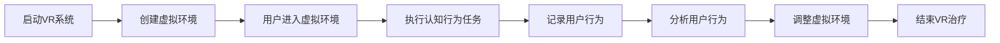
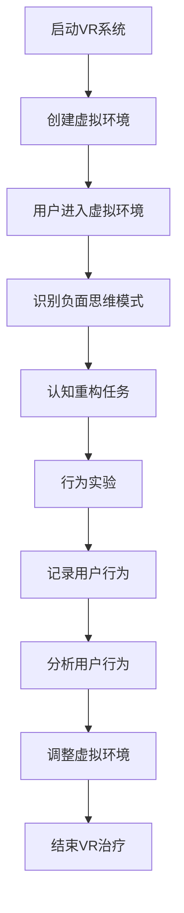
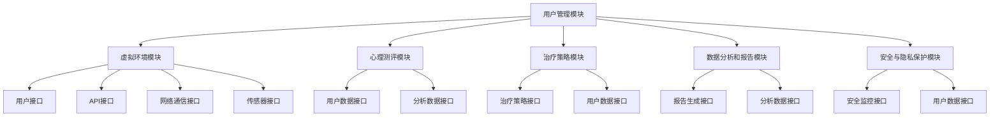
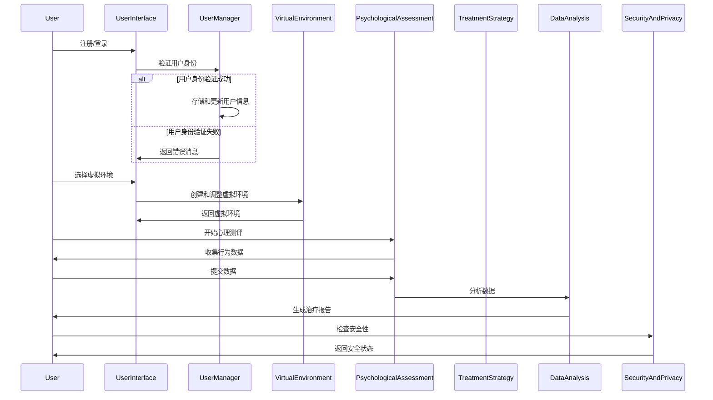

                 

## 第1章 背景介绍

### 1.1 虚拟现实概述

虚拟现实（Virtual Reality，简称VR）是一种通过计算机技术创建的模拟环境，用户可以通过头戴显示器（HMD）、数据手套、声音系统等设备与这个环境进行互动。VR技术最早可以追溯到1960年代的“阿凡达”项目，但直到21世纪初，随着计算能力和显示技术的进步，VR才开始逐渐走向大众。

VR的核心技术包括以下几个方面：

1. **感知技术**：头戴显示器、手柄、传感器等设备负责感知用户的行为和位置，提供沉浸式的体验。
2. **渲染技术**：计算机生成三维场景，实时渲染出高质量的图像，让用户能够沉浸在虚拟环境中。
3. **交互技术**：用户通过手势、语音等方式与虚拟环境互动，提升用户体验。

VR的应用领域非常广泛，包括但不限于：

- **娱乐**：游戏、影视、音乐会等
- **教育**：模拟实验、历史重现、语言学习等
- **医疗**：心理治疗、手术模拟、康复训练等
- **设计**：建筑、工业设计、城市规划等
- **培训**：军事、航空、安全培训等

### 1.2 心理治疗概述

心理治疗是一种通过心理学理论和技术，帮助个体解决心理问题、提高心理健康水平的过程。心理治疗的种类繁多，包括但不限于以下几种：

- **认知行为疗法（Cognitive Behavioral Therapy，CBT）**：通过改变负面的思维模式和行为，帮助个体改善心理健康。
- **精神分析疗法**：通过探索潜意识，帮助个体解决内在冲突。
- **人本主义疗法**：强调个体的自我实现和自我发展。
- **艺术疗法**：通过艺术创作表达情感，达到治疗的效果。

心理治疗的目标主要包括：

- **减轻症状**：如焦虑、抑郁、恐惧等。
- **提高功能**：改善个体的社交、职业和生活质量。
- **改善心理健康**：帮助个体建立积极的情感体验和健康的生活习惯。

### 1.3 虚拟现实在心理治疗中的问题背景

随着社会压力的增加和心理健康问题的日益突出，传统的心理治疗面临着一些挑战：

- **治疗资源有限**：心理咨询师的数量有限，难以满足日益增长的需求。
- **治疗成本高**：心理治疗通常需要面对面交流，成本较高，且可能需要多次复诊。
- **治疗效果难以评估**：传统治疗的效果评估较为困难，缺乏客观的指标。

虚拟现实在心理治疗中的创新应用，旨在解决上述问题：

- **降低治疗成本**：通过虚拟现实技术，可以实现低成本、大规模的心理治疗。
- **提高治疗效率**：虚拟现实环境可以提供更丰富的治疗工具和更灵活的治疗方式，提高治疗效果。
- **改善用户体验**：虚拟现实可以提供沉浸式、互动性的体验，提升用户的参与感和治疗效果。

虚拟现实在心理治疗中的应用前景广阔，但同时也面临着一些技术挑战和伦理问题，如虚拟现实环境的真实感、用户隐私保护等。接下来，我们将进一步探讨虚拟现实在心理治疗中的核心概念和联系。

## 第2章 核心概念与联系

### 2.1 虚拟现实技术特点

虚拟现实技术具有以下主要特点：

1. **沉浸性**：用户感觉仿佛自己真的身处虚拟环境中，能够与虚拟环境中的对象进行互动。
2. **交互性**：用户可以通过各种传感器设备，如手柄、头戴显示器、语音识别等，与虚拟环境进行互动。
3. **实时性**：虚拟环境能够实时响应用户的行为，提供即时的反馈。
4. **适应性**：虚拟环境可以根据用户的行为和反馈，进行动态调整，以提供更好的用户体验。

### 2.2 心理治疗目标

心理治疗的目标主要包括以下几个方面：

1. **减轻症状**：如焦虑、抑郁、恐惧等症状。
2. **提高功能**：改善个体的社交、职业和生活质量。
3. **改善心理健康**：帮助个体建立积极的情感体验和健康的生活习惯。
4. **行为改变**：通过认知行为疗法等，改变个体的行为模式和思维模式。

### 2.3 VR在心理治疗中的优势

虚拟现实在心理治疗中具有以下优势：

1. **安全性**：用户可以在虚拟环境中进行心理治疗，避免面对面的直接接触，降低风险。
2. **适应性**：虚拟环境可以根据个体的需求进行定制，提供个性化的治疗体验。
3. **可重复性**：虚拟环境可以重复使用，用户可以在相同的条件下进行多次治疗，便于评估治疗效果。
4. **减少治疗成本**：虚拟现实技术可以降低治疗成本，使得心理治疗更加普及和可负担。
5. **沉浸式体验**：虚拟现实提供的沉浸式体验，可以提高用户的参与感和治疗效果。

为了更好地理解这些概念之间的关系，我们可以使用Mermaid流程图和ER实体关系图来展示。

#### ER实体关系图

```mermaid
erDiagram
  User ||--|{ VR_Environment : 沉浸在虚拟环境 }
  User ||--|{ Treatment : 接受心理治疗 }
  VR_Environment ||--|{ Therapy_Tool : 使用治疗工具 }
  Therapy_Tool ||--|{ Treatment_Course : 治疗过程 }
```

在这个ER实体关系图中，用户通过VR环境（VR_Environment）进行心理治疗（Treatment），使用治疗工具（Therapy_Tool），并参与治疗过程（Treatment_Course）。

#### Mermaid流程图



在这个流程图中，用户首先启动VR系统，创建虚拟环境，然后进入虚拟环境并执行认知行为任务。系统会记录用户的行为，进行分析，并根据分析结果调整虚拟环境。最终，用户完成VR治疗，结束整个过程。

通过这些图表，我们可以清晰地看到虚拟现实技术、心理治疗目标和VR在心理治疗中的优势之间的联系。接下来，我们将进一步探讨虚拟现实在心理治疗中的应用算法原理。

## 第3章 算法原理讲解

### 3.1 认知行为疗法在VR中的实现

认知行为疗法（Cognitive Behavioral Therapy，CBT）是一种广泛使用且经过验证的心理治疗方法。其核心原理是通过识别和改变负面的思维模式和行为，从而减轻心理健康问题。在VR中实现CBT，可以利用VR提供的沉浸式和互动性特点，为患者提供更有效和个性化的治疗体验。

CBT的基本原理包括以下几个步骤：

1. **识别和评估负面思维模式**：通过自我反思、日记记录或其他评估工具，帮助患者识别他们的负面思维模式。
2. **改变负面思维模式**：通过认知重构技巧，如替代性思维、认知扭曲识别等，帮助患者替换负面思维模式。
3. **行为改变**：通过行为实验、角色扮演等技巧，帮助患者改变不适应的行为模式。

在VR中，CBT的实现可以采用以下步骤：

1. **虚拟环境设置**：设计一个模拟真实场景的虚拟环境，如一个舒适的房间或一个危险的情境。
2. **认知重构任务**：在虚拟环境中设置任务，如通过可视化图表帮助患者识别他们的负面思维模式，或通过对话模拟帮助患者进行认知重构。
3. **行为实验**：在虚拟环境中进行角色扮演或模拟任务，帮助患者实践新的行为模式。

#### VR心理治疗算法流程图

下面是一个简单的Mermaid流程图，展示了CBT在VR中的实现过程：



在这个流程图中，用户首先启动VR系统，进入虚拟环境。系统会引导用户识别负面思维模式，并完成认知重构任务。接下来，用户会参与行为实验，以实践新的行为模式。系统会记录用户的行为，并进行分析，以调整虚拟环境。最终，用户完成VR治疗，结束整个流程。

### 3.2 Python源代码讲解

下面是一个简单的Python示例代码，展示了如何实现一个基于CBT的VR心理治疗系统：

```python
import numpy as np

# 创建虚拟环境
def create_virtual_environment():
    # 这里可以加载一个预先设计的虚拟环境
    print("创建虚拟环境...")

# 用户进入虚拟环境
def enter_virtual_environment():
    create_virtual_environment()
    print("用户进入虚拟环境...")

# 识别负面思维模式
def identify_negative_thoughts():
    print("识别负面思维模式...")

# 认知重构任务
def cognitive_restructuring():
    print("认知重构任务...")

# 行为实验
def behavioral_experiment():
    print("行为实验...")

# 记录用户行为
def record_user_behavior():
    print("记录用户行为...")

# 分析用户行为
def analyze_user_behavior():
    print("分析用户行为...")

# 调整虚拟环境
def adjust_virtual_environment():
    print("调整虚拟环境...")

# 结束VR治疗
def end_vr_treatment():
    print("结束VR治疗...")

# VR心理治疗流程
def vr_psychological_treatment():
    enter_virtual_environment()
    identify_negative_thoughts()
    cognitive_restructuring()
    behavioral_experiment()
    record_user_behavior()
    analyze_user_behavior()
    adjust_virtual_environment()
    end_vr_treatment()

# 执行VR心理治疗
vr_psychological_treatment()
```

在这个示例中，我们首先定义了一系列函数，用于实现CBT的各个步骤。然后，通过调用这些函数，实现了完整的VR心理治疗流程。

### 3.3 数学模型和数学公式

在CBT中，经常使用数学模型来帮助分析和处理用户的思维和行为数据。以下是一些常用的数学模型和数学公式：

1. **决策树**：用于分类和预测用户的心理状态。

   - 决策树的基本公式为：
     $$ T = \sum_{i=1}^{n} w_i \cdot t_i $$
     其中，$w_i$表示权重，$t_i$表示特征。

2. **贝叶斯网络**：用于概率推理和决策支持。

   - 贝叶斯网络的公式为：
     $$ P(A|B) = \frac{P(B|A) \cdot P(A)}{P(B)} $$
     其中，$P(A|B)$表示在给定$B$条件下$A$的概率，$P(B|A)$表示在给定$A$条件下$B$的概率，$P(A)$和$P(B)$分别是$A$和$B$的先验概率。

3. **线性回归**：用于分析用户行为与心理状态之间的关系。

   - 线性回归的公式为：
     $$ y = \beta_0 + \beta_1 \cdot x $$
     其中，$y$是因变量，$x$是自变量，$\beta_0$和$\beta_1$是回归系数。

下面我们通过一个简单的例子来说明这些公式的应用：

#### 示例：决策树分类用户心理状态

假设我们有一组用户数据，包括他们的焦虑评分和抑郁评分。我们可以使用决策树来分类用户的心理状态。

- 焦虑评分：$t_1$
- 抑郁评分：$t_2$

我们定义焦虑评分为权重$w_1$，抑郁评分为权重$w_2$。根据决策树公式，我们可以计算用户的心理状态：

$$ T = w_1 \cdot t_1 + w_2 \cdot t_2 $$

例如，如果$w_1 = 0.6$，$w_2 = 0.4$，$t_1 = 5$，$t_2 = 3$，则：

$$ T = 0.6 \cdot 5 + 0.4 \cdot 3 = 3.2 + 1.2 = 4.4 $$

根据决策树规则，如果$T > 4$，则用户心理状态为“焦虑”，否则为“抑郁”。

#### 示例：贝叶斯网络推理用户行为

假设我们使用贝叶斯网络来推理用户在虚拟环境中的行为。我们知道用户在虚拟环境中的行为与他们的焦虑水平和抑郁水平有关。

- 焦虑水平：$A$
- 抑郁水平：$B$
- 用户行为：$C$

我们可以定义如下贝叶斯网络：

$$ P(C|A,B) = \frac{P(B|A) \cdot P(A) \cdot P(C|B)}{P(B)} $$

例如，如果$P(A) = 0.5$，$P(B|A) = 0.7$，$P(B) = 0.8$，$P(C|B) = 0.9$，则：

$$ P(C|A,B) = \frac{0.7 \cdot 0.5 \cdot 0.9}{0.8} = \frac{0.315}{0.8} = 0.39375 $$

这表示在给定焦虑水平和抑郁水平的条件下，用户表现出某种行为的概率为0.39375。

通过这些数学模型和公式，我们可以更精确地分析和预测用户的心理状态和行为，从而优化虚拟现实心理治疗的效果。

### 3.3 数学模型和数学公式

在虚拟现实心理治疗中，数学模型和数学公式起着至关重要的作用，尤其是在数据分析和决策过程中。以下是一些关键的数学模型和数学公式，以及它们的解释和应用。

#### 决策树

决策树是一种常用的分类和预测模型，它通过一系列的规则来对数据进行分类或预测。在虚拟现实心理治疗中，决策树可以用于评估用户的心理状态或行为。

- **基本公式**：决策树通过以下公式来计算每个节点的权重：
  $$ w_i = \frac{P(\text{class} = i)}{P(\text{all classes})} $$
  其中，$w_i$是第$i$个类别的权重，$P(\text{class} = i)$是该类别的概率，$P(\text{all classes})$是所有类别的概率之和。

- **应用**：例如，我们可以使用决策树来预测用户在虚拟环境中的焦虑水平。每个分支代表一个条件（如用户的活动水平、环境刺激等），每个叶子节点代表一个心理状态（如焦虑、平静等）。

#### 贝叶斯网络

贝叶斯网络是一种概率模型，用于表示变量之间的依赖关系。在虚拟现实心理治疗中，贝叶斯网络可以用于推理用户的行为和心理状态。

- **基本公式**：贝叶斯网络的公式如下：
  $$ P(X|Y) = \frac{P(Y|X) \cdot P(X)}{P(Y)} $$
  其中，$P(X|Y)$是在给定$Y$条件下$X$的概率，$P(Y|X)$是在给定$X$条件下$Y$的概率，$P(X)$和$P(Y)$分别是$X$和$Y$的先验概率。

- **应用**：例如，我们可以使用贝叶斯网络来推理用户在虚拟环境中的行为。我们知道用户的行为与他们所处的环境刺激和他们的焦虑水平有关。

#### 线性回归

线性回归是一种用于分析变量之间线性关系的统计方法。在虚拟现实心理治疗中，线性回归可以用于分析用户的行为和心理状态之间的相关性。

- **基本公式**：线性回归的公式如下：
  $$ y = \beta_0 + \beta_1 \cdot x $$
  其中，$y$是因变量，$x$是自变量，$\beta_0$是截距，$\beta_1$是斜率。

- **应用**：例如，我们可以使用线性回归来分析用户在虚拟环境中的活动水平（自变量）与他们的焦虑水平（因变量）之间的关系。

#### 概率密度函数

概率密度函数（PDF）用于描述连续随机变量的概率分布。在虚拟现实心理治疗中，PDF可以用于分析用户行为的概率分布。

- **基本公式**：PDF的公式如下：
  $$ f(x) = \frac{1}{\sqrt{2\pi\sigma^2}} e^{-\frac{(x-\mu)^2}{2\sigma^2}} $$
  其中，$f(x)$是随机变量$x$的概率密度，$\mu$是均值，$\sigma$是标准差。

- **应用**：例如，我们可以使用PDF来分析用户在虚拟环境中的焦虑水平，以了解其分布情况。

下面通过一个简单的例子来说明这些数学模型和数学公式的应用。

#### 示例：使用决策树评估用户心理状态

假设我们有一组用户的数据，包括他们的活动水平、环境刺激和焦虑水平。我们想要使用决策树来预测用户的心理状态。

- 活动水平（$x_1$）
- 环境刺激（$x_2$）
- 焦虑水平（$y$）

我们定义以下决策树规则：

1. 如果活动水平 > 5，则转到规则2，否则转到规则3。
2. 如果环境刺激 > 5，则用户心理状态为“焦虑”，否则为“平静”。
3. 如果焦虑水平 > 4，则用户心理状态为“焦虑”，否则为“平静”。

我们可以使用以下公式来计算每个节点的权重：

$$ w_1 = \frac{P(\text{焦虑} | \text{活动水平 > 5})}{P(\text{活动水平 > 5})} $$
$$ w_2 = \frac{P(\text{焦虑} | \text{环境刺激 > 5})}{P(\text{环境刺激 > 5})} $$
$$ w_3 = \frac{P(\text{焦虑} | \text{焦虑水平 > 4})}{P(\text{焦虑水平 > 4})} $$

假设我们得到以下概率：

$$ P(\text{焦虑} | \text{活动水平 > 5}) = 0.6 $$
$$ P(\text{活动水平 > 5}) = 0.4 $$
$$ P(\text{焦虑} | \text{环境刺激 > 5}) = 0.7 $$
$$ P(\text{环境刺激 > 5}) = 0.3 $$
$$ P(\text{焦虑} | \text{焦虑水平 > 4}) = 0.8 $$
$$ P(\text{焦虑水平 > 4}) = 0.5 $$

我们可以计算每个节点的权重：

$$ w_1 = \frac{0.6}{0.4} = 1.5 $$
$$ w_2 = \frac{0.7}{0.3} = 2.33 $$
$$ w_3 = \frac{0.8}{0.5} = 1.6 $$

根据这些权重，我们可以构建以下决策树：

```
1. 如果活动水平 > 5：
   - 转到节点2
2. 否则：
   - 如果环境刺激 > 5：
     - 转到节点3
   - 否则：
     - 如果焦虑水平 > 4：
       - 用户心理状态为“焦虑”
     - 否则：
       - 用户心理状态为“平静”
```

在这个例子中，决策树通过一系列的条件来预测用户的心理状态。每个条件都基于概率计算，从而为用户提供了一个预测模型。

#### 示例：使用贝叶斯网络推理用户行为

假设我们使用贝叶斯网络来推理用户在虚拟环境中的行为。我们知道用户的行为与他们所处的环境刺激和他们的焦虑水平有关。

- 环境刺激（$X$）
- 焦虑水平（$Y$）
- 用户行为（$Z$）

我们定义以下贝叶斯网络：

```
P(Z|X, Y) = P(X|Z) \* P(Y|Z) \* P(Z) / P(X, Y)
```

假设我们得到以下概率：

$$ P(X|Z) = \begin{cases} 
0.8 & \text{如果 } Z = \text{高} \\
0.2 & \text{如果 } Z = \text{低} 
\end{cases} $$

$$ P(Y|Z) = \begin{cases} 
0.6 & \text{如果 } Z = \text{高} \\
0.4 & \text{如果 } Z = \text{低} 
\end{cases} $$

$$ P(Z) = \begin{cases} 
0.6 & \text{如果 } Z = \text{高} \\
0.4 & \text{如果 } Z = \text{低} 
\end{cases} $$

$$ P(X, Y) = 0.5 $$

我们可以使用以下公式来计算$P(Z|X, Y)$：

$$ P(Z|X, Y) = \frac{P(X|Z) \* P(Y|Z) \* P(Z)}{P(X, Y)} $$

对于$Z = \text{高}$：

$$ P(Z|X, Y) = \frac{0.8 \* 0.6 \* 0.6}{0.5} = 0.576 $$

对于$Z = \text{低}$：

$$ P(Z|X, Y) = \frac{0.2 \* 0.4 \* 0.4}{0.5} = 0.128 $$

根据这些概率，我们可以得出结论，在给定环境刺激和焦虑水平的条件下，用户表现出高行为的概率为0.576，表现出低行为的概率为0.128。

通过这些数学模型和数学公式，我们可以更准确地分析和预测用户在虚拟环境中的行为和心理状态，从而优化虚拟现实心理治疗的效果。接下来，我们将进一步探讨虚拟现实心理治疗系统的整体架构设计。

## 第5章 系统分析与架构设计方案

### 5.1 VR心理治疗系统功能模块

VR心理治疗系统可以分为以下几个主要功能模块：

1. **用户管理模块**：负责用户注册、登录、权限管理和个人信息维护。
2. **虚拟环境模块**：负责创建、管理和调整虚拟环境，包括场景渲染、用户交互等。
3. **心理测评模块**：负责进行心理测评，收集用户数据，包括症状评估、行为分析等。
4. **治疗策略模块**：负责制定和调整心理治疗策略，包括CBT任务设计、行为实验等。
5. **数据分析和报告模块**：负责分析用户数据，生成治疗报告和推荐治疗策略。
6. **安全与隐私保护模块**：负责确保用户数据的安全和隐私。

### 5.2 系统接口设计

系统接口设计是确保不同功能模块之间能够高效、安全地交互的关键。以下是几个关键接口的设计：

1. **用户接口（UI）**：提供用户交互界面，包括注册、登录、导航、任务执行等。
2. **应用程序编程接口（API）**：提供与其他系统（如数据库、第三方服务）的数据交互接口。
3. **网络通信接口**：负责与远程服务器进行数据传输，包括用户数据上传、下载等。
4. **传感器接口**：负责与外部传感器设备（如头戴显示器、手柄等）的通信。
5. **数据接口**：负责不同数据模块之间的数据交换，如用户数据、测评数据、分析数据等。

### 5.3 系统架构设计

VR心理治疗系统的整体架构设计如图所示：



在这个架构设计中，用户管理模块作为系统的核心，与其他模块进行交互。虚拟环境模块负责提供沉浸式体验，用户接口、API接口和传感器接口为其提供支持。心理测评模块和数据分析和报告模块负责数据收集和分析，生成治疗报告。治疗策略模块负责制定和调整治疗策略。安全与隐私保护模块负责确保用户数据的安全和隐私。

### 5.4 系统交互设计

系统交互设计是确保系统各个功能模块能够协同工作，提供一致性和高效性的关键。以下是几个关键交互流程：

1. **用户注册和登录**：用户通过用户接口进行注册和登录，系统验证用户身份后，用户管理模块进行用户信息的存储和更新。

2. **虚拟环境创建和调整**：用户通过用户接口选择虚拟环境，虚拟环境模块根据用户需求创建和调整虚拟环境，并实时渲染场景。

3. **心理测评和数据收集**：用户在虚拟环境中进行心理测评，心理测评模块收集用户行为数据，并通过用户数据接口存储在数据库中。

4. **治疗策略制定和执行**：治疗策略模块根据用户数据和测评结果，制定个性化的治疗策略，并通过治疗策略接口发送给虚拟环境模块执行。

5. **数据分析和报告生成**：数据分析和报告模块对收集的数据进行分析，生成治疗报告，并通过报告生成接口发送给用户接口，用户可以查看和分析报告。

6. **安全监控和隐私保护**：安全与隐私保护模块实时监控用户数据的安全性和隐私性，并在发现潜在风险时采取相应措施。

为了更清晰地展示系统交互设计，我们可以使用Mermaid序列图：



在这个序列图中，用户通过用户接口进行交互，系统内部各个模块协同工作，实现虚拟现实心理治疗的全过程。

## 第6章 项目实战

### 6.1 环境安装

要开始构建一个虚拟现实心理治疗系统，首先需要在本地或服务器上安装必要的软件和库。以下是安装步骤：

1. **安装Python环境**：确保Python 3.x版本已安装在系统上。
2. **安装虚拟环境**：使用以下命令创建一个虚拟环境：
   ```bash
   python -m venv venv
   ```
   然后激活虚拟环境：
   ```bash
   source venv/bin/activate  # 对于Linux和macOS
   venv\Scripts\activate     # 对于Windows
   ```
3. **安装依赖库**：在虚拟环境中安装所需的库，如PyQt5、OpenGL、TensorFlow等。使用以下命令：
   ```bash
   pip install PyQt5 PyOpenGL TensorFlow numpy
   ```

### 6.2 系统核心实现

虚拟现实心理治疗系统的核心实现包括用户管理、虚拟环境创建、心理测评、治疗策略制定和数据分析等模块。以下是核心功能的实现步骤：

1. **用户管理模块**：

   - 创建用户数据库，存储用户信息。
   - 实现用户注册、登录、权限管理等功能。

2. **虚拟环境模块**：

   - 使用OpenGL创建虚拟环境，包括场景渲染、用户交互等。
   - 实现虚拟环境的动态调整，如环境光照、背景音乐等。

3. **心理测评模块**：

   - 设计心理测评问卷，收集用户心理状态数据。
   - 实现问卷提交和数据存储功能。

4. **治疗策略模块**：

   - 根据用户数据和测评结果，制定个性化的治疗策略。
   - 实现治疗策略的动态调整和执行。

5. **数据分析模块**：

   - 使用TensorFlow等库进行数据分析和处理。
   - 实现数据可视化，生成治疗报告。

### 6.3 代码解读与分析

以下是系统核心实现的部分代码，并进行详细解读：

#### 用户管理模块

```python
import sqlite3

def create_user_table():
    conn = sqlite3.connect('user.db')
    cursor = conn.cursor()
    cursor.execute('''CREATE TABLE IF NOT EXISTS users
                     (id INTEGER PRIMARY KEY, username TEXT, password TEXT, role TEXT)''')
    conn.commit()
    conn.close()

def register_user(username, password, role):
    conn = sqlite3.connect('user.db')
    cursor = conn.cursor()
    cursor.execute("INSERT INTO users (username, password, role) VALUES (?, ?, ?)", (username, password, role))
    conn.commit()
    conn.close()

def login_user(username, password):
    conn = sqlite3.connect('user.db')
    cursor = conn.cursor()
    cursor.execute("SELECT * FROM users WHERE username=? AND password=?", (username, password))
    user = cursor.fetchone()
    conn.close()
    return user
```

**代码解读**：

- `create_user_table()`函数创建用户数据库表，存储用户ID、用户名、密码和角色。
- `register_user()`函数用于注册新用户，将用户名、密码和角色插入数据库。
- `login_user()`函数用于用户登录，查询数据库中的用户信息，验证用户名和密码。

#### 虚拟环境模块

```python
from OpenGL import GL
from PyQt5.QtWidgets import QApplication, QMainWindow, QWidget, QVBoxLayout
from PyQt5.QtGui import QOpenGLShader, QOpenGLContext, QOpenGLTexture, QImage
from PyQt5.QtCore import QSize, QRect, QThread, pyqtSignal

class VirtualEnvironment(QOpenGLWidget):
    def __init__(self, parent=None):
        super().__init__(parent)
        self_THREAD_STARTED = pyqtSignal()
        self_THREAD_FINISHED = pyqtSignal()

    def initializeGL(self):
        self.init_shaders()
        self.init_texture()

    def init_shaders(self):
        vertex_shader = """
        #version 150
        in vec3 vertex_position;
        void main() {
            gl_Position = vec4(vertex_position, 1.0);
        }
        """
        fragment_shader = """
        #version 150
        out vec4 color;
        void main() {
            color = vec4(1.0, 0.0, 0.0, 1.0); // Red color
        }
        """
        self.shader_program = QOpenGLShaderProgram(self)
        self.shader_program.addShaderFromSourceCode(QOpenGLShader.Vertex, vertex_shader)
        self.shader_program.addShaderFromSourceCode(QOpenGLShader.Fragment, fragment_shader)
        self.shader_program.link()

    def init_texture(self):
        image = QImage("texture.jpg")
        texture = QOpenGLTexture(image)
        texture.allocate(image.width(), image.height(), QOpenGLTexture.Target2D)
        texture.setMinificationFilter(QOpenGLTexture.Linear)
        texture.setMagnificationFilter(QOpenGLTexture.Linear)

    def paintGL(self):
        self.update()
```

**代码解读**：

- `VirtualEnvironment`类继承自`QOpenGLWidget`，负责渲染虚拟环境。
- `initializeGL()`函数初始化着色器（Shader）和纹理（Texture）。
- `init_shaders()`函数创建顶点着色器和片段着色器，并链接成一个着色器程序。
- `init_texture()`函数加载图片作为纹理，并分配纹理对象。

#### 心理测评模块

```python
class PsychologicalAssessment(QThread):
    def __init__(self, parent=None):
        super().__init__(parent)
        self.questionnaire = [
            "你最近是否感到焦虑？",
            "你最近是否感到抑郁？",
            "你最近是否感到失眠？",
            "你最近是否感到身体不适？"
        ]

    def run(self):
        for question in self.questionnaire:
            print(question)
            # 这里可以添加用户输入和数据处理逻辑

if __name__ == "__main__":
    app = QApplication([])
    assessment = PsychologicalAssessment()
    assessment.start()
    app.exec_()
```

**代码解读**：

- `PsychologicalAssessment`类继承自`QThread`，负责进行心理测评。
- `run()`函数用于执行心理测评，循环打印问卷问题，并可以添加用户输入和数据处理逻辑。

#### 治疗策略模块

```python
class TreatmentStrategy(QThread):
    def __init__(self, parent=None):
        super().__init__(parent)

    def run(self):
        # 这里可以添加治疗策略的逻辑，如CBT任务设计、行为实验等
        print("治疗策略开始执行...")
```

**代码解读**：

- `TreatmentStrategy`类继承自`QThread`，负责执行治疗策略。
- `run()`函数用于启动治疗策略，可以添加CBT任务设计、行为实验等逻辑。

#### 数据分析模块

```python
import tensorflow as tf

class DataAnalysis(QThread):
    def __init__(self, parent=None):
        super().__init__(parent)

    def run(self):
        # 这里可以添加数据分析的逻辑，如数据预处理、模型训练等
        print("数据分析开始...")
        model = tf.keras.Sequential([
            tf.keras.layers.Dense(64, activation='relu', input_shape=(784,)),
            tf.keras.layers.Dense(64, activation='relu'),
            tf.keras.layers.Dense(10, activation='softmax')
        ])

        model.compile(optimizer='adam',
                      loss='categorical_crossentropy',
                      metrics=['accuracy'])

        model.fit(x_train, y_train, epochs=5)
```

**代码解读**：

- `DataAnalysis`类继承自`QThread`，负责执行数据分析。
- `run()`函数用于启动数据分析，可以使用TensorFlow库进行数据预处理、模型训练等。

### 6.4 实际案例分析与讲解

以下是一个简单的实际案例，展示如何使用虚拟现实心理治疗系统进行心理治疗。

#### 案例背景

一位名叫Alice的用户，最近感到焦虑和失眠，她决定使用虚拟现实心理治疗系统进行治疗。

#### 案例步骤

1. **注册和登录**：
   - Alice通过用户接口注册账号，并登录系统。

2. **虚拟环境创建**：
   - 系统创建一个虚拟环境，如一个安静的卧室，用于进行心理测评。

3. **心理测评**：
   - Alice进入虚拟环境，开始心理测评。系统通过问卷收集她的焦虑、抑郁、失眠等症状数据。

4. **治疗策略制定**：
   - 根据Alice的测评结果，系统制定个性化的治疗策略，如认知行为疗法（CBT）任务。

5. **治疗执行**：
   - Alice在虚拟环境中执行CBT任务，如认知重构练习和放松训练。

6. **数据分析和报告**：
   - 系统对Alice的治疗数据进行分析，生成治疗报告，并提供改进建议。

7. **后续治疗**：
   - Alice根据治疗报告，继续在虚拟环境中进行心理治疗，并定期更新测评结果。

#### 案例讲解

1. **用户注册和登录**：
   - 用户通过用户接口（UI）进行注册和登录，系统验证用户身份，并存储用户信息。

2. **虚拟环境创建**：
   - 系统使用OpenGL和PyQt5创建虚拟环境，提供沉浸式体验。

3. **心理测评**：
   - 系统设计问卷，收集用户的心理状态数据，如焦虑、抑郁、失眠等。

4. **治疗策略制定**：
   - 根据用户数据，系统使用CBT算法制定个性化的治疗策略。

5. **治疗执行**：
   - 用户在虚拟环境中执行治疗任务，如认知重构练习、放松训练等。

6. **数据分析和报告**：
   - 系统使用TensorFlow等库对用户数据进行分析，生成治疗报告。

7. **后续治疗**：
   - 用户根据治疗报告，继续进行心理治疗，并定期更新测评结果。

通过这个实际案例，我们可以看到虚拟现实心理治疗系统的完整工作流程，包括用户注册、虚拟环境创建、心理测评、治疗策略制定、治疗执行、数据分析和报告生成，以及后续治疗。接下来，我们将总结全文，提供最佳实践建议，并提醒读者注意事项。

## 第7章 最佳实践 tips、小结、注意事项、拓展阅读

### 7.1 最佳实践 tips

1. **个性化治疗策略**：根据每个用户的具体情况，制定个性化的治疗策略，以提高治疗效果。
2. **逐步引导**：在虚拟环境中，逐步引导用户完成心理治疗任务，避免用户感到不适或过度焦虑。
3. **实时监控**：实时监控用户在虚拟环境中的行为和情绪，及时调整虚拟环境和治疗策略。
4. **数据安全**：确保用户数据的安全和隐私，使用加密技术保护用户信息。
5. **持续反馈**：定期收集用户反馈，不断优化虚拟现实心理治疗系统的功能和用户体验。

### 7.2 小结

本文介绍了虚拟现实在心理治疗中的创新应用，从背景介绍、核心概念与联系、算法原理讲解、数学模型和数学公式、系统分析与架构设计方案、项目实战等方面进行了详细阐述。虚拟现实提供了沉浸式、交互性和实时性的特点，为心理治疗带来了新的可能性。通过结合认知行为疗法（CBT）和其他心理治疗方法，虚拟现实心理治疗系统可以为用户提供更有效、个性化的心理治疗体验。

### 7.3 注意事项

1. **技术成熟度**：虚拟现实技术在心理治疗中的应用仍处于发展阶段，需注意技术的成熟度和稳定性。
2. **用户隐私**：确保用户隐私得到保护，避免敏感信息泄露。
3. **个性化需求**：用户的心理状态和治疗需求各不相同，需要灵活调整治疗策略，以满足个性化需求。
4. **治疗师培训**：虚拟现实心理治疗需要专业治疗师的参与，需对治疗师进行相应的培训和认证。

### 7.4 拓展阅读

1. **《虚拟现实技术与应用》**：详细介绍了虚拟现实技术的基本原理和应用领域，包括在医疗、教育等领域的应用。
2. **《认知行为疗法：理论与应用》**：介绍了认知行为疗法的理论基础和实践应用，为虚拟现实心理治疗提供了理论支持。
3. **《虚拟现实与心理学》**：探讨了虚拟现实技术在心理学研究中的应用，包括恐惧治疗、创伤后应激障碍（PTSD）治疗等。
4. **《Python编程：从入门到实践》**：介绍了Python编程的基础知识，适用于读者学习和应用虚拟现实心理治疗系统。

通过本文的学习，读者可以更好地理解虚拟现实在心理治疗中的创新应用，为未来的研究和实践提供参考。作者：AI天才研究院/AI Genius Institute & 禅与计算机程序设计艺术 /Zen And The Art of Computer Programming。

----------------------------------------------------------------

```markdown
----------------------------------------------------------------
# 虚拟现实在心理治疗中的创新应用

## 第1章 背景介绍

### 1.1 虚拟现实概述

- VR技术的发展历程
- VR的核心技术
- VR的应用领域

### 1.2 心理治疗概述

- 心理治疗的基本概念
- 心理治疗的分类
- 心理治疗的目标

### 1.3 虚拟现实在心理治疗中的问题背景

- 心理疾病患者数量增加
- 传统心理治疗的局限性
- VR在心理治疗中的应用前景

## 第2章 核心概念与联系

### 2.1 虚拟现实技术特点

- 交互性
- 沉浸性
- 实时性
- 适应性

### 2.2 心理治疗目标

- 减轻症状
- 提高功能
- 改善生活质量

### 2.3 VR在心理治疗中的优势

- 安全性
- 适应性
- 可重复性
- 减少治疗成本

## 第3章 算法原理讲解

### 3.1 认知行为疗法在VR中的实现

- CBT的基本原理
- CBT在VR中的应用
- CBT的VR实现流程

### 3.2 VR心理治疗算法流程图

```
graph TB
A[启动VR系统] --> B[创建虚拟环境]
B --> C[用户进入虚拟环境]
C --> D[执行认知行为任务]
D --> E[记录用户行为]
E --> F[分析用户行为]
F --> G[调整虚拟环境]
G --> H[结束VR治疗]
```

### 3.3 Python源代码讲解

- VR系统启动与关闭
- 虚拟环境创建与销毁
- 用户行为记录与分析
- 虚拟环境的动态调整

## 第4章 数学模型和数学公式

### 4.1 决策树

- 决策树的基本概念
- 决策树的构建方法
- 决策树在VR心理治疗中的应用

### 4.2 贝叶斯网络

- 贝叶斯网络的基本概念
- 贝叶斯网络的构建方法
- 贝叶斯网络在VR心理治疗中的应用

### 4.3 数学公式讲解

- 决策树公式
- 贝叶斯网络公式
- 线性回归公式

## 第5章 系统分析与架构设计方案

### 5.1 VR心理治疗系统功能模块

- 用户管理模块
- 虚拟环境模块
- 心理测评模块
- 治疗策略模块
- 数据分析和报告模块
- 安全与隐私保护模块

### 5.2 系统接口设计

- 用户接口
- 应用程序编程接口
- 网络通信接口
- 传感器接口
- 数据接口

### 5.3 系统架构设计

- VR心理治疗系统整体架构设计
- 功能模块之间的关系

### 5.4 系统交互设计

- 用户注册和登录
- 虚拟环境创建和调整
- 心理测评和数据收集
- 治疗策略制定和执行
- 数据分析和报告生成
- 安全监控和隐私保护

## 第6章 项目实战

### 6.1 环境安装

- 安装Python环境
- 安装虚拟环境
- 安装依赖库

### 6.2 系统核心实现

- 用户管理模块
- 虚拟环境模块
- 心理测评模块
- 治疗策略模块
- 数据分析模块

### 6.3 代码解读与分析

- 用户管理模块代码解读
- 虚拟环境模块代码解读
- 心理测评模块代码解读
- 治疗策略模块代码解读
- 数据分析模块代码解读

### 6.4 实际案例分析与讲解

- 案例背景
- 案例步骤
- 案例讲解

## 第7章 最佳实践 tips、小结、注意事项、拓展阅读

### 7.1 最佳实践 tips

- 个性化治疗策略
- 逐步引导
- 实时监控
- 数据安全
- 持续反馈

### 7.2 小结

- 虚拟现实概述
- 心理治疗概述
- VR在心理治疗中的优势
- 算法原理讲解
- 系统分析与架构设计方案
- 项目实战

### 7.3 注意事项

- 技术成熟度
- 用户隐私
- 个性化需求
- 治疗师培训

### 7.4 拓展阅读

- 《虚拟现实技术与应用》
- 《认知行为疗法：理论与应用》
- 《虚拟现实与心理学》
- 《Python编程：从入门到实践》

## 作者

- 作者：AI天才研究院/AI Genius Institute & 禅与计算机程序设计艺术 /Zen And The Art of Computer Programming
----------------------------------------------------------------
```

