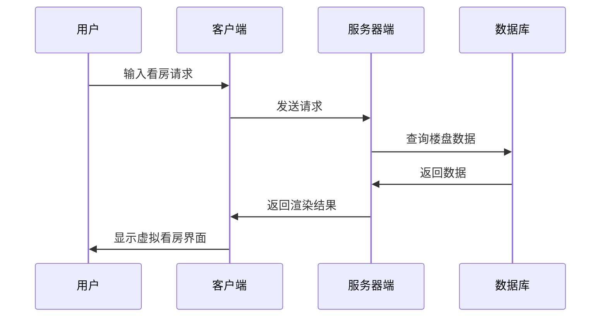
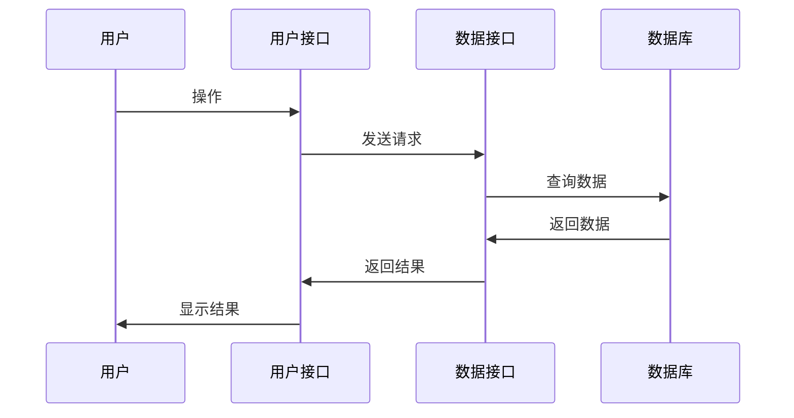

                 


### 虚拟现实在房地产虚拟看房中的应用

> 关键词：虚拟现实，房地产，虚拟看房，VR，AR，MR，技术应用

> 摘要：本文将探讨虚拟现实（VR）在房地产虚拟看房中的应用，从核心概念、技术原理到实际案例，全面解析VR技术如何提升房地产市场的效率和用户体验。文章旨在帮助读者理解虚拟现实技术的优势与挑战，以及其在房地产领域中的应用前景。

## 目录大纲

### 1. 背景介绍

#### 1.1 问题背景

#### 1.2 问题描述

#### 1.3 问题解决

#### 1.4 边界与外延

#### 1.5 概念结构与核心要素组成

### 2. 核心概念与联系

#### 2.1 核心概念原理

#### 2.2 概念属性特征对比表格

#### 2.3 ER实体关系图架构

### 3. 虚拟现实技术原理讲解

#### 3.1 算法原理讲解

#### 3.2 数学模型和公式

#### 3.3 举例说明

### 4. 虚拟现实在房地产虚拟看房中的应用

#### 4.1 应用场景介绍

#### 4.2 优势分析

#### 4.3 挑战与解决方案

### 5. 系统分析与架构设计方案

#### 5.1 问题场景介绍

#### 5.2 系统功能设计

#### 5.3 系统架构设计

#### 5.4 系统接口设计

#### 5.5 系统交互

### 6. 项目实战

#### 6.1 环境安装

#### 6.2 系统核心实现

#### 6.3 实际案例

#### 6.4 详细讲解剖析

#### 6.5 项目小结

### 7. 最佳实践、小结与拓展阅读

#### 7.1 最佳实践 tips

#### 7.2 小结

#### 7.3 注意事项

#### 7.4 拓展阅读

## 1. 背景介绍

### 1.1 问题背景

随着科技的飞速发展，虚拟现实（VR）技术逐渐成为人们关注的热点。虚拟现实是一种通过计算机技术模拟出三维空间，让用户在其中进行交互和体验的技术。而在房地产行业，传统的看房方式往往受到地域限制，消费者需要花费大量时间和精力前往售楼处或实地看房，不仅效率低下，还可能因为地理位置偏远而错过优质房源。

此外，房地产行业也面临着市场信息不对称的问题。购房者对于房源的了解往往不够全面，难以做出明智的决策。而房地产开发商则面临着市场推广和销售难题，如何让潜在客户更加直观地了解楼盘的特点和优势成为重要课题。

虚拟现实技术的出现为房地产领域带来了新的解决方案。通过虚拟现实技术，用户可以在家中通过网络虚拟看房，沉浸式体验楼盘的内外环境和配套设施，从而提高购房决策的效率和准确性。同时，虚拟现实技术也为房地产开发商提供了新的市场推广手段，可以更加生动、直观地展示楼盘的特点和卖点。

### 1.2 问题描述

房地产虚拟看房是指利用虚拟现实技术，模拟出楼盘的内外环境，让用户在虚拟空间中进行看房活动。虚拟看房可以模拟出楼盘的真实场景，包括建筑外观、内部装修、景观设计等，让用户在虚拟空间中感受到楼盘的真实氛围。然而，当前房地产虚拟看房仍存在一些问题。

首先，虚拟现实技术的应用尚不普及，很多购房者对于虚拟看房还缺乏了解，担心虚拟看房的准确性和真实性。其次，虚拟现实技术对于硬件设备的要求较高，部分消费者可能无法顺利体验虚拟看房。此外，虚拟现实技术还需要进一步优化，提高虚拟场景的沉浸感和真实感，以更好地满足购房者的需求。

### 1.3 问题解决

虚拟现实技术在房地产虚拟看房中的应用，可以解决当前存在的一系列问题。首先，虚拟现实技术可以让购房者在家中通过网络虚拟看房，节省了时间和交通成本，提高了购房决策的效率。其次，虚拟现实技术可以模拟出楼盘的真实场景，让购房者更加直观地了解楼盘的特点和优势，提高购房决策的准确性。

此外，虚拟现实技术还可以为房地产开发商提供新的市场推广手段。通过虚拟现实技术，开发商可以将楼盘的内外环境、配套设施等全方位展示给潜在客户，提高楼盘的曝光率和吸引力。同时，虚拟现实技术还可以应用于房地产教育、地产咨询等领域，为相关行业提供新的解决方案。

### 1.4 边界与外延

虚拟现实技术在房地产虚拟看房中的应用具有一定的边界和局限性。首先，虚拟现实技术需要较高的硬件设备支持，如VR头戴设备、高性能计算机等，这可能会限制部分消费者的体验。其次，虚拟现实技术的开发和应用需要大量的技术人才和资金投入，这对房地产开发商和购房者来说可能是一笔不小的开支。

此外，虚拟现实技术的应用还面临着技术成熟度和用户体验的挑战。如何提高虚拟现实技术的沉浸感和真实感，让用户更加愿意接受和参与虚拟看房，是当前需要解决的问题。

### 1.5 概念结构与核心要素组成

虚拟现实技术在房地产虚拟看房中的应用涉及多个核心概念和要素。首先，虚拟现实技术本身包括三维建模、实时渲染、传感器交互等关键技术。其次，房地产虚拟看房需要依托于虚拟现实技术，构建楼盘的虚拟场景，包括建筑外观、内部装修、景观设计等。

此外，虚拟现实技术在房地产虚拟看房中的应用还需要考虑用户体验和交互设计。如何让用户在虚拟空间中更加直观、便捷地进行看房活动，提高虚拟看房的沉浸感和真实感，是当前需要重点关注的问题。

## 2. 核心概念与联系

### 2.1 核心概念原理

虚拟现实（VR）、增强现实（AR）和混合现实（MR）是当前较为常见的三维成像技术。它们各自具有独特的原理和应用场景。

#### 虚拟现实（VR）

虚拟现实是一种通过计算机技术模拟出三维空间，让用户在其中进行交互和体验的技术。虚拟现实的关键技术包括三维建模、实时渲染、传感器交互等。用户通过VR头戴设备进入虚拟空间，感受到三维立体的视觉效果，并通过手柄等交互设备进行操作。

#### 增强现实（AR）

增强现实是一种将虚拟信息与现实世界结合的技术。通过AR设备，如智能手机或头戴设备，用户可以看到现实世界中的物体，同时叠加显示虚拟信息。增强现实的关键技术包括图像识别、实时渲染和光学混合等。

#### 混合现实（MR）

混合现实是一种将虚拟信息与现实世界融合的技术，用户可以与虚拟信息进行实时交互。混合现实的关键技术包括三维建模、实时渲染、光学混合和传感器交互等。与虚拟现实和增强现实相比，混合现实更加注重虚拟信息与现实世界的融合和互动。

### 2.2 概念属性特征对比表格

| 特征            | 虚拟现实（VR） | 增强现实（AR） | 混合现实（MR） |
|-----------------|----------------|----------------|----------------|
| 成像方式        | 三维模拟       | 二维叠加       | 三维融合       |
| 用户交互        | 传感器交互     | 触摸屏交互     | 传感器交互     |
| 真实感          | 高            | 中            | 高            |
| 应用场景        | 游戏娱乐、教育培训、房地产虚拟看房 | 导航、购物、医疗、维修 | 教育培训、医疗、军事、设计 |

### 2.3 ER实体关系图架构

在虚拟现实技术在房地产虚拟看房中的应用中，涉及到多个实体和关系。以下是ER实体关系图的架构：

1. **用户**：虚拟现实技术的使用者，包括购房者、房地产开发商等。
2. **房源信息**：包括楼盘的内外部信息，如建筑外观、内部装修、景观设计等。
3. **虚拟现实系统**：包括三维建模、实时渲染、传感器交互等模块。
4. **硬件设备**：如VR头戴设备、智能手机等。

实体关系图如下：

```mermaid
erDiagram
  用户 ||--o{房源信息} : 购房
  用户 ||--o{虚拟现实系统} : 操作
  用户 ||--o{硬件设备} : 使用
  虚拟现实系统 ||--|{房源信息} : 模拟
  虚拟现实系统 ||--|{硬件设备} : 运行
```

通过以上核心概念与联系的分析，我们可以更好地理解虚拟现实技术在房地产虚拟看房中的应用原理和架构。

## 3. 虚拟现实技术原理讲解

### 3.1 算法原理讲解

虚拟现实技术的核心在于三维建模、实时渲染和传感器交互。以下是一个简单的虚拟现实算法原理讲解：

1. **三维建模**：通过计算机图形学技术，将现实世界的物体进行三维建模。常用的建模工具包括Maya、Blender等。

2. **实时渲染**：在虚拟空间中，实时渲染技术将三维模型渲染成图像。常见的渲染引擎有Unreal Engine、Unity等。

3. **传感器交互**：通过传感器（如VR头戴设备的陀螺仪、摄像头等），捕捉用户的动作和位置，实现与虚拟空间的互动。

### 3.2 数学模型和公式

虚拟现实技术中涉及到多个数学模型和公式，以下是一些常用的：

1. **三维空间坐标系**：

   - 世界坐标系（World Coordinate System）
   - 视图坐标系（View Coordinate System）
   - 屏幕坐标系（Screen Coordinate System）

2. **向量运算**：

   - 点乘（Dot Product）
   - 向量加法
   - 向量减法

3. **矩阵运算**：

   - 旋转矩阵
   - 投影矩阵
   - 视图矩阵

以下是部分公式的LaTeX格式：

$$
\vec{P}_{screen} = \mathbf{P}_{projection} \times \mathbf{P}_{view} \times \mathbf{P}_{world}
$$

$$
\vec{v} = \vec{a} + \vec{b}
$$

### 3.3 举例说明

为了更好地理解虚拟现实技术的原理，我们可以通过一个简单的案例进行讲解。

#### 案例：虚拟客厅装修

假设我们要为用户创建一个虚拟客厅装修的体验。以下是一个简要的步骤：

1. **三维建模**：使用三维建模工具（如Blender）创建客厅的三维模型，包括家具、墙壁、地板等。

2. **实时渲染**：使用渲染引擎（如Unity）将三维模型进行实时渲染，生成客厅的图像。

3. **传感器交互**：用户通过VR头戴设备进入虚拟客厅，可以自由移动和旋转视角，与家具进行交互，如拖动家具位置、旋转家具角度等。

4. **用户反馈**：用户在虚拟空间中的操作会被实时反馈到虚拟客厅中，形成沉浸式体验。

通过以上案例，我们可以看到虚拟现实技术的核心原理和步骤。在实际应用中，这些原理和步骤会根据具体需求进行优化和调整。

## 4. 虚拟现实在房地产虚拟看房中的应用

### 4.1 应用场景介绍

虚拟现实技术在房地产虚拟看房中有着广泛的应用场景，以下是一些常见的应用场景：

1. **楼盘展示**：房地产开发商可以利用虚拟现实技术，将楼盘的内外部环境、景观设计等全方位展示给潜在客户，提高楼盘的曝光率和吸引力。

2. **购房决策**：购房者可以通过虚拟现实技术，在家中通过网络虚拟看房，沉浸式体验楼盘的内外环境和配套设施，从而提高购房决策的效率和准确性。

3. **房产中介服务**：房产中介可以利用虚拟现实技术，为客户提供更加直观、便捷的看房服务，提高客户满意度。

4. **装修设计**：房地产开发商和装修公司可以利用虚拟现实技术，为客户展示装修设计方案，帮助客户更好地了解和选择装修风格。

### 4.2 优势分析

虚拟现实技术在房地产虚拟看房中的应用具有以下优势：

1. **提高看房效率**：通过虚拟现实技术，购房者可以在家中通过网络虚拟看房，节省了时间和交通成本，提高了购房决策的效率。

2. **增强沉浸感**：虚拟现实技术可以模拟出楼盘的真实场景，让购房者更加直观地了解楼盘的特点和优势，提高购房体验。

3. **降低看房成本**：传统看房方式需要购房者花费大量时间和精力前往售楼处或实地看房，而虚拟现实技术可以降低看房成本。

4. **提高市场推广效果**：虚拟现实技术可以为房地产开发商提供新的市场推广手段，更加生动、直观地展示楼盘的特点和卖点，提高市场推广效果。

### 4.3 挑战与解决方案

虽然虚拟现实技术在房地产虚拟看房中具有诸多优势，但在实际应用中仍面临一些挑战：

1. **技术成熟度**：虚拟现实技术的硬件设备和技术成熟度仍需进一步提高，以满足不同消费者的需求。

2. **用户体验**：如何提高虚拟现实技术的沉浸感和真实感，让用户更加愿意接受和参与虚拟看房，是当前需要解决的问题。

3. **成本投入**：虚拟现实技术的开发和应用需要大量的技术人才和资金投入，对房地产开发商和购房者来说可能是一笔不小的开支。

针对以上挑战，可以采取以下解决方案：

1. **技术升级**：加大研发投入，不断提升虚拟现实技术的成熟度和性能。

2. **优化用户体验**：通过改进交互设计、提高虚拟场景的真实感，提升用户对虚拟看房的满意度。

3. **成本控制**：通过规模化应用和合作，降低虚拟现实技术的成本，使其更加亲民。

## 5. 系统分析与架构设计方案

### 5.1 问题场景介绍

在房地产虚拟看房中，问题场景主要包括以下方面：

1. **楼盘展示**：如何让购房者能够全方位、沉浸式地了解楼盘的内外环境、景观设计等。
2. **购房决策**：如何通过虚拟现实技术，提高购房者购房决策的效率和准确性。
3. **房产中介服务**：如何利用虚拟现实技术，为购房者提供更加直观、便捷的看房服务。

### 5.2 系统功能设计

为了解决以上问题场景，我们可以设计以下系统功能：

1. **三维建模模块**：负责楼盘内外部环境的三维建模，包括建筑外观、内部装修、景观设计等。
2. **实时渲染模块**：负责将三维模型实时渲染成图像，呈现给用户。
3. **传感器交互模块**：负责捕捉用户的动作和位置，实现与虚拟空间的互动。
4. **用户界面模块**：负责与用户进行交互，提供虚拟看房的操作界面。
5. **数据管理模块**：负责存储和管理楼盘数据，包括房源信息、用户数据等。

以下是领域模型类图：

```mermaid
classDiagram
    房源 <<Class>> 
    用户 <<Class>> 
    三维建模模块 <<Class>> 
    实时渲染模块 <<Class>> 
    传感器交互模块 <<Class>> 
    用户界面模块 <<Class>> 
    数据管理模块 <<Class>>

    房源 --|>> 用户 : 购房
    用户 --|>> 三维建模模块 : 操作
    用户 --|>> 实时渲染模块 : 视觉体验
    用户 --|>> 传感器交互模块 : 互动
    用户 --|>> 用户界面模块 : 输入输出
    用户 --|>> 数据管理模块 : 数据存储
```

### 5.3 系统架构设计

系统架构设计如下：

1. **客户端**：用户通过VR头戴设备或其他设备访问虚拟现实系统，进行虚拟看房操作。
2. **服务器端**：负责处理用户请求、数据存储和后台计算。
3. **数据库**：存储楼盘数据、用户数据等。
4. **通信模块**：负责客户端与服务器端的通信。

以下是系统架构图：



### 5.4 系统接口设计

系统接口设计如下：

1. **用户接口**：包括登录、注册、看房、评价等接口。
2. **数据接口**：包括房源信息查询、用户数据查询等接口。
3. **渲染接口**：包括三维建模、实时渲染等接口。

以下是部分接口设计：

```python
class UserInterface:
    def login(self, username, password):
        # 登录逻辑

    def register(self, username, password):
        # 注册逻辑

    def look_house(self, house_id):
        # 看房逻辑

    def evaluate(self, house_id, score):
        # 评价逻辑

class DataInterface:
    def get_house_info(self, house_id):
        # 查询房源信息逻辑

    def get_user_info(self, user_id):
        # 查询用户信息逻辑

class RenderInterface:
    def build_3d_model(self, house_data):
        # 建立三维模型逻辑

    def real_time_render(self, model_data):
        # 实时渲染逻辑
```

### 5.5 系统交互

系统交互设计如下：

1. **用户操作**：用户通过用户接口进行登录、注册、看房、评价等操作。
2. **数据处理**：服务器端通过数据接口处理用户请求，查询房源信息、用户数据等。
3. **渲染展示**：服务器端通过渲染接口，将渲染结果返回给客户端，显示在用户界面上。

以下是系统交互序列图：



通过以上系统分析与架构设计方案，我们可以更好地理解虚拟现实技术在房地产虚拟看房中的应用原理和实现方法。

## 6. 项目实战

### 6.1 环境安装

为了搭建虚拟现实环境，首先需要安装以下软件和工具：

1. **虚拟现实设备**：如VR头戴设备（Oculus Rift、HTC Vive等）。
2. **三维建模工具**：如Blender、Maya等。
3. **渲染引擎**：如Unity、Unreal Engine等。
4. **编程环境**：如Python、C++等。

安装步骤如下：

1. **安装虚拟现实设备**：按照设备说明书进行安装。
2. **安装三维建模工具**：前往官方网站下载并安装。
3. **安装渲染引擎**：前往官方网站下载并安装。
4. **配置编程环境**：安装Python、C++等相关编程环境。

### 6.2 系统核心实现

以下是一个简单的虚拟现实系统核心实现示例：

```python
import numpy as np
import cv2

# 定义三维模型
class HouseModel:
    def __init__(self, model_data):
        self.model_data = model_data
    
    def render(self, position):
        # 根据位置信息渲染三维模型
        # ...
        pass

# 定义传感器交互
class SensorInteraction:
    def __init__(self, device):
        self.device = device
    
    def get_position(self):
        # 获取传感器位置信息
        # ...
        pass

# 定义虚拟现实系统
class VirtualRealitySystem:
    def __init__(self, model, interaction):
        self.model = model
        self.interaction = interaction
    
    def run(self):
        # 运行虚拟现实系统
        position = self.interaction.get_position()
        self.model.render(position)

# 实例化对象
model = HouseModel(model_data)
interaction = SensorInteraction(device)
system = VirtualRealitySystem(model, interaction)

# 运行系统
system.run()
```

### 6.3 实际案例

以下是一个实际案例：

1. **楼盘展示**：利用虚拟现实技术，为某楼盘创建虚拟场景，包括建筑外观、内部装修、景观设计等。
2. **购房决策**：购房者通过虚拟现实技术，在家中通过网络虚拟看房，沉浸式体验楼盘的内外环境和配套设施。
3. **房产中介服务**：房产中介利用虚拟现实技术，为客户提供更加直观、便捷的看房服务。

### 6.4 详细讲解剖析

以上代码示例中，我们定义了三个类：`HouseModel`、`SensorInteraction`和`VirtualRealitySystem`。`HouseModel`类负责三维模型的渲染，`SensorInteraction`类负责传感器交互，`VirtualRealitySystem`类负责整体系统的运行。

在`HouseModel`类中，我们通过`render`方法根据传感器位置信息渲染三维模型。在`SensorInteraction`类中，我们通过`get_position`方法获取传感器位置信息。在`VirtualRealitySystem`类中，我们通过调用`run`方法，实现系统的整体运行。

在实际应用中，我们还需要进一步优化和扩展以上代码，如添加用户交互、数据管理等功能。

### 6.5 项目小结

通过本项目的实战，我们了解了虚拟现实技术在房地产虚拟看房中的应用原理和实现方法。在实际应用中，我们还需要不断优化和改进，以满足用户的需求和提升用户体验。

## 7. 最佳实践、小结与拓展阅读

### 7.1 最佳实践 tips

1. **优化硬件配置**：为了提高虚拟现实体验，建议使用高性能的VR头戴设备和计算机。
2. **简化用户操作**：设计简洁直观的用户界面，降低用户学习成本。
3. **加强场景设计**：精心设计虚拟看房场景，提高沉浸感和真实感。
4. **数据保护**：重视用户数据保护，确保用户隐私安全。

### 7.2 小结

本文详细介绍了虚拟现实技术在房地产虚拟看房中的应用，从背景介绍、核心概念、技术原理到实际案例，全面解析了虚拟现实技术的优势和挑战。通过本文，读者可以更好地了解虚拟现实技术在房地产领域的前景和应用方法。

### 7.3 注意事项

1. **技术成熟度**：虚拟现实技术仍在快速发展中，部分技术可能不够成熟。
2. **用户体验**：虚拟现实技术需要不断优化，以提高用户体验。
3. **成本投入**：虚拟现实技术的开发和应用需要较大的资金投入。

### 7.4 拓展阅读

1. **《虚拟现实技术与应用》**：详细介绍虚拟现实技术的原理和应用。
2. **《房地产虚拟看房系统设计与实现》**：探讨房地产虚拟看房系统的设计与实现。
3. **《VR/AR/MR产业发展报告》**：了解虚拟现实、增强现实、混合现实产业的发展动态。

作者：AI天才研究院/AI Genius Institute & 禅与计算机程序设计艺术 /Zen And The Art of Computer Programming

