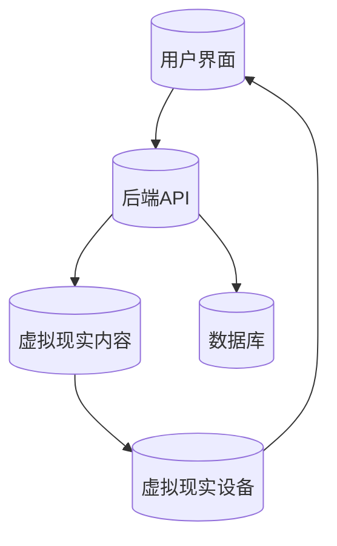
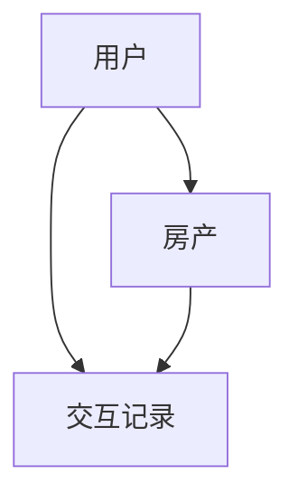

                 

### 《虚拟现实在房地产虚拟看房中的应用》

#### 关键词：虚拟现实、房地产、虚拟看房、技术应用、系统设计

> 摘要：本文将深入探讨虚拟现实技术在房地产虚拟看房领域的应用。首先，我们将简要介绍虚拟现实技术的定义和其在房地产领域的应用背景。接着，本文将详细分析虚拟现实硬件和软件技术，包括虚拟现实头戴显示器、数据手套、动作捕捉设备、虚拟现实内容创作工具等。随后，我们将讨论房地产虚拟看房系统的架构设计、内容制作和系统实现，以及虚拟现实在房地产营销、教育和研究开发中的应用。最后，我们将总结虚拟现实在房地产虚拟看房中的挑战和未来展望。

#### 目录大纲

1. **前言**
   - **1.1 虚拟现实在房地产虚拟看房中的应用背景**
   - **1.2 虚拟现实在房地产虚拟看房中的重要性

2. **第一部分：虚拟现实技术基础**
   - **第1章：虚拟现实技术概述**
     - **1.1 虚拟现实技术的定义和分类**
     - **1.2 虚拟现实技术的应用场景**
     - **1.3 虚拟现实技术的发展历史**
     - **1.4 虚拟现实技术的未来发展趋势**

   - **第2章：虚拟现实硬件技术**
     - **2.1 虚拟现实头戴显示器（HMD）**
     - **2.2 数据手套**
     - **2.3 动作捕捉设备**
     - **2.4 虚拟现实声音系统**

   - **第3章：虚拟现实软件技术**
     - **3.1 虚拟现实内容创作工具**
     - **3.2 虚拟现实引擎**
     - **3.3 虚拟现实交互技术**
     - **3.4 虚拟现实安全与隐私问题**

3. **第二部分：房地产虚拟看房系统设计与实现**
   - **第4章：房地产虚拟看房系统架构设计**
     - **4.1 系统架构概述**
     - **4.2 系统功能模块划分**
     - **4.3 数据库设计**
     - **4.4 用户界面设计**

   - **第5章：虚拟现实内容制作**
     - **5.1 场景建模**
     - **5.2 灯光与材质设置**
     - **5.3 视觉效果优化**
     - **5.4 声音效果制作**

   - **第6章：房地产虚拟看房系统实现**
     - **6.1 开发环境搭建**
     - **6.2 系统核心代码实现**
     - **6.3 系统测试与调试**
     - **6.4 系统部署与维护**

4. **第三部分：虚拟现实在房地产虚拟看房中的应用**
   - **第7章：虚拟现实在房地产营销中的应用**
     - **7.1 虚拟现实看房的优势**
     - **7.2 虚拟现实看房的应用场景**
     - **7.3 虚拟现实看房的营销策略**
     - **7.4 虚拟现实看房的案例分析**

   - **第8章：虚拟现实在房地产教育中的应用**
     - **8.1 虚拟现实在房地产知识教育中的应用**
     - **8.2 虚拟现实在房地产技能培训中的应用**
     - **8.3 虚拟现实在房地产专业教育中的应用**
     - **8.4 虚拟现实教育案例研究**

   - **第9章：虚拟现实在房地产研究与开发中的应用**
     - **9.1 虚拟现实在房地产市场研究中的应用**
     - **9.2 虚拟现实在房地产项目开发中的应用**
     - **9.3 虚拟现实在房地产风险评估中的应用**
     - **9.4 虚拟现实开发案例研究**

5. **第四部分：虚拟现实在房地产虚拟看房中的挑战与未来展望**
   - **第10章：虚拟现实在房地产虚拟看房中的挑战**
     - **10.1 技术挑战**
     - **10.2 商业模式挑战**
     - **10.3 用户接受度挑战**
     - **10.4 隐私与安全挑战**

   - **第11章：虚拟现实在房地产虚拟看房中的未来展望**
     - **11.1 技术发展趋势**
     - **11.2 市场前景分析**
     - **11.3 未来应用场景预测**
     - **11.4 技术创新方向**

### 前言

#### 1.1 虚拟现实在房地产虚拟看房中的应用背景

虚拟现实（Virtual Reality，简称VR）是一种通过计算机技术创建的模拟环境，用户可以通过头戴显示器等设备进入这个虚拟环境，与之互动并体验。随着计算机技术和网络技术的发展，虚拟现实技术已经逐渐成熟，并开始在各个领域得到应用。在房地产领域，虚拟现实技术尤其具有巨大的潜力，可以显著提升看房体验和效率。

房地产虚拟看房是指通过虚拟现实技术，用户可以在不受时间和空间限制的情况下，在线查看和体验房地产项目的全貌和细节。这种技术不仅节省了用户的出行时间和成本，还提供了更为真实和沉浸式的看房体验，有助于提高购房决策的准确性和满意度。

虚拟现实在房地产虚拟看房中的应用背景主要有以下几个方面：

1. **市场需求**：随着城市化进程的加速和人们生活节奏的加快，传统的实体看房方式越来越不适应现代消费者的需求。虚拟现实技术的出现，提供了更加便捷和高效的看房方式，符合了消费者的期待。

2. **技术进步**：虚拟现实技术的不断发展，使得虚拟看房的画面质量、互动性和沉浸感得到了显著提升。同时，硬件设备如头戴显示器的性能和价格也在不断提高，为虚拟看房的应用提供了更好的条件。

3. **行业竞争**：房地产市场竞争日益激烈，企业需要通过提供创新的服务来吸引客户。虚拟现实看房作为一种新颖的看房方式，可以帮助房地产企业提升品牌形象和竞争力。

4. **疫情因素**：2020年开始的新冠疫情对全球范围内的房地产交易产生了巨大影响，许多地区的实体看房活动被迫暂停。虚拟现实看房作为一种无接触的交易方式，成为房地产企业维持业务运作的重要手段。

#### 1.2 虚拟现实在房地产虚拟看房中的重要性

虚拟现实技术在房地产虚拟看房中的应用具有多方面的重要性：

1. **提高看房效率**：通过虚拟现实技术，用户可以随时随地进行线上看房，无需受到地理位置和时间限制。这种方式大大提高了看房的效率，节省了用户的时间和经济成本。

2. **提升看房体验**：虚拟现实技术可以提供高度沉浸式的看房体验，用户可以自由地在虚拟环境中移动、旋转和放大，感受到与真实看房相似的真实感和互动性。

3. **增加房产销售**：虚拟现实看房能够提供更为直观和生动的房产信息，有助于提升客户对房产的兴趣和购买欲望，从而增加房产销售的机会。

4. **降低营销成本**：虚拟现实技术减少了实体看房的需求，房地产企业可以减少在传统营销活动中的投入，如交通费、招待费等，从而降低营销成本。

5. **促进房地产交易**：虚拟现实看房技术为房地产交易提供了便利，特别是在疫情期间，它可以作为一种替代方案，确保房地产交易的顺利进行。

总的来说，虚拟现实在房地产虚拟看房中的应用不仅提升了看房体验和效率，还为房地产企业带来了新的商业模式和盈利机会。随着技术的不断进步，虚拟现实在房地产领域的应用将更加广泛和深入。

### 第一部分：虚拟现实技术基础

#### 第1章：虚拟现实技术概述

##### 1.1 虚拟现实技术的定义和分类

虚拟现实技术是一种通过计算机技术模拟出一个虚拟环境，用户可以通过特定的设备如头戴显示器（HMD）、数据手套、动作捕捉设备等，进入并体验这个虚拟环境的技术。虚拟现实技术的主要目的是创建一个高度沉浸式的体验，使用户感觉仿佛置身于真实世界中。

虚拟现实技术可以分为以下几个类别：

1. **基于视觉的虚拟现实**：这是最常见的虚拟现实类型，主要通过头戴显示器（HMD）来提供沉浸式体验。用户戴上HMD后，可以看到一个虚拟环境，并通过头部的移动来浏览和探索这个环境。

2. **基于听觉的虚拟现实**：通过耳机或头戴式耳机提供虚拟声音效果，使用户感受到空间中的声音。这种技术可以增强虚拟环境的沉浸感。

3. **基于触觉的虚拟现实**：通过数据手套或触觉反馈设备，用户可以感受到虚拟环境中的触觉反馈。例如，当用户触摸虚拟物体时，手套会提供相应的触觉反馈。

4. **全感官虚拟现实**：这种类型结合了视觉、听觉和触觉等多种感官体验，提供最为全面的沉浸式体验。

##### 1.2 虚拟现实技术的应用场景

虚拟现实技术具有广泛的应用场景，其中一些主要的应用包括：

1. **游戏和娱乐**：虚拟现实技术为游戏和娱乐行业带来了革命性的变化，用户可以在虚拟环境中体验各种冒险和互动。

2. **教育和培训**：虚拟现实技术可以模拟各种教育场景，提供沉浸式的学习体验。例如，医学学生可以通过虚拟现实技术模拟手术过程，飞行员可以通过虚拟现实技术进行飞行模拟训练。

3. **房地产虚拟看房**：如前文所述，虚拟现实技术可以为用户提供在线看房体验，节省时间和成本，并提供高度沉浸式的看房体验。

4. **工程和设计**：虚拟现实技术可以帮助工程师和设计师在虚拟环境中进行建模和预览，从而提高设计和工程的效率。

5. **远程工作**：虚拟现实技术可以模拟远程办公环境，使用户感觉仿佛在同一办公室内工作。

##### 1.3 虚拟现实技术的发展历史

虚拟现实技术的概念可以追溯到20世纪60年代。当时，美国军方开始研究一种称为“模拟环境生成器”（SIMULATED ENVIRONMENT GENERATOR，简称SEG）的技术，用于飞行模拟和战场训练。这是虚拟现实技术的早期形式。

1987年，Jenny Lippincott提出了虚拟现实（Virtual Reality）这个词，并在1989年举办了首届虚拟现实会议。这个时期，虚拟现实技术开始引起学术界的关注。

1990年代，虚拟现实技术逐渐成熟，出现了一些商业化产品，如VR设备VR Ivan和VR-1。然而，由于技术成本高、用户体验不佳等原因，虚拟现实技术在这个时期并未得到广泛普及。

进入21世纪，随着计算机技术和传感器技术的快速发展，虚拟现实技术重新焕发生机。2000年代，虚拟现实设备如Oculus Rift、HTC Vive和PlayStation VR等相继问世，使得虚拟现实技术进入大众视野。

近年来，虚拟现实技术不断取得突破，例如更高分辨率的显示技术、更精确的触觉反馈技术等。同时，5G和云计算等新技术的应用，也为虚拟现实技术带来了更多可能性。

##### 1.4 虚拟现实技术的未来发展趋势

虚拟现实技术的未来发展趋势主要表现在以下几个方面：

1. **更先进的硬件设备**：随着显示技术、传感器技术和触觉反馈技术的不断发展，虚拟现实设备的性能将得到显著提升，提供更为真实和沉浸式的体验。

2. **更广泛的场景应用**：虚拟现实技术将在更多领域得到应用，如医疗、教育、工程、娱乐等。特别是在房地产虚拟看房、远程工作等领域，虚拟现实技术具有巨大的发展潜力。

3. **更好的用户体验**：虚拟现实技术的用户体验将得到持续优化，通过改善交互方式、提高视觉和听觉效果等手段，提供更加舒适和自然的体验。

4. **生态系统的建设**：虚拟现实技术的生态体系建设将逐步完善，包括内容创作平台、开发工具、硬件设备、网络基础设施等。

5. **社会和经济影响**：虚拟现实技术将对社会和经济产生深远影响，改变人们的生产生活方式，创造新的商业模式和就业机会。

总之，虚拟现实技术正朝着更先进、更广泛和更深入的 direction 发展，将在未来带来更多的创新和变革。

#### 第2章：虚拟现实硬件技术

##### 2.1 虚拟现实头戴显示器（HMD）

虚拟现实头戴显示器（HMD，Virtual Reality Head-Mounted Display）是虚拟现实系统中最关键的硬件设备之一，它直接影响到用户的沉浸式体验。HMD通过提供沉浸式的视觉效果，使用户感觉仿佛置身于虚拟环境中。

**HMD的工作原理**：

HMD通常由一个或多组显示器、光学镜片、跟踪系统和电池组成。其工作原理大致如下：

1. **显示器**：HMD内置一组高分辨率显示器，通常为两块屏幕以模拟双目视差，提供更加真实的视觉体验。
2. **光学镜片**：光学镜片用于将显示器的图像放大并投射到用户眼中，同时调整显示器的视角，使其适用于用户的双眼。
3. **跟踪系统**：HMD配备有传感器和跟踪器，用于实时跟踪用户的头部和眼睛位置，以确保虚拟环境中的图像与用户视角同步。
4. **电池**：HMD通常内置电池，以确保设备的便携性和长时间使用。

**HMD的类型**：

HMD可以分为以下几个类型：

1. **PC连接型HMD**：这类HMD通过USB或Thunderbolt接口与电脑连接，提供高性能的图形处理能力。常见的PC连接型HMD包括Oculus Rift、HTC Vive和Valve Index等。
2. **移动端HMD**：这类HMD内置自己的处理器和存储器，通过智能手机提供虚拟现实体验。常见的移动端HMD包括Google Daydream View、Samsung Gear VR等。
3. **独立型HMD**：这类HMD独立运行，无需外部设备支持。常见的独立型HMD包括Oculus Quest、HTC Vive Focus等。

**HMD的优缺点**：

**优点**：

- 提供沉浸式的视觉体验，让用户感觉仿佛置身于虚拟环境中。
- 高分辨率显示器和先进的跟踪系统，确保图像质量和用户体验。
- 多种类型和型号可供选择，满足不同用户的需求。

**缺点**：

- 佩戴时间较长可能导致不适，特别是对于长时间使用的情况。
- 价格较高，不适合所有用户。
- 对硬件性能要求较高，需要高性能的电脑或手机。

##### 2.2 数据手套

数据手套（Data Glove）是虚拟现实系统中用于捕捉用户手部动作和位置的设备。通过数据手套，用户可以在虚拟环境中进行手势识别和操作，提供更加自然的交互方式。

**数据手套的工作原理**：

数据手套通常由一系列传感器、手指和手掌关节组成。其工作原理如下：

1. **传感器**：数据手套内嵌多种传感器，如力传感器、弯曲传感器、位置传感器等，用于捕捉用户手部的各种动作。
2. **手指和手掌关节**：手指和手掌关节由柔性材料制成，可以模拟真实手部的灵活性和运动。
3. **信号传输**：传感器捕捉到的数据通过无线或有线方式传输到计算机，计算机根据这些数据生成虚拟手部动作。

**数据手套的类型**：

数据手套可以分为以下几种类型：

1. **柔性数据手套**：这种数据手套使用柔性材料制成，可以模拟真实手部的灵活性和运动。常见的柔性数据手套包括Phantom Flex和Myo手套等。
2. **刚性数据手套**：这种数据手套使用刚性材料制成，提供较高的精度和稳定性。常见的刚性数据手套包括CyberGlove和Handymen Hand等。
3. **触觉反馈数据手套**：这种数据手套不仅能够捕捉用户手部动作，还能够提供触觉反馈，让用户感受到虚拟环境的真实感。常见的触觉反馈数据手套包括SenseGlove和FeelSpace手套等。

**数据手套的优缺点**：

**优点**：

- 提供自然的手势识别和操作方式，增强虚拟现实系统的交互性。
- 可以模拟真实手部的灵活性和运动，提供高度沉浸式的体验。
- 触觉反馈数据手套能够增强虚拟环境的真实感。

**缺点**：

- 价格较高，不适合所有用户。
- 佩戴和操作可能较为复杂，需要一定的培训。
- 长时间佩戴可能导致手部不适。

##### 2.3 动作捕捉设备

动作捕捉设备（Motion Capture System）是用于捕捉和记录用户身体动作的设备。通过动作捕捉设备，虚拟现实系统能够精确地捕捉用户的动作，并将其转化为虚拟环境中的动作。

**动作捕捉设备的工作原理**：

动作捕捉设备通常由多个摄像头、标记点和数据处理软件组成。其工作原理如下：

1. **摄像头**：动作捕捉设备使用多个高分辨率摄像头，从不同角度捕捉用户的动作。
2. **标记点**：用户身体上安装有标记点，这些标记点可以反射摄像头的光线。摄像头通过捕捉反射光线的位置，计算标记点的位置。
3. **数据处理软件**：捕捉到的数据通过数据处理软件进行处理，生成用户的动作轨迹。

**动作捕捉设备的类型**：

动作捕捉设备可以分为以下几种类型：

1. **光学动作捕捉设备**：这种设备使用光学传感器和标记点，通过反射光线捕捉用户的动作。常见的光学动作捕捉设备包括Motion Analysis OptiTrack和Northern Digital Inc.的NDI系统等。
2. **惯性动作捕捉设备**：这种设备使用惯性传感器（如加速度计、陀螺仪等），通过计算传感器的数据捕捉用户的动作。常见的惯性动作捕捉设备包括Microsoft Kinect和Rokoko动作捕捉服等。
3. **混合型动作捕捉设备**：这种设备结合了光学和惯性传感器的优势，提供更精确的动作捕捉。常见的混合型动作捕捉设备包括Noitom Perception Neuron和 Perception Neuron+等。

**动作捕捉设备的优缺点**：

**优点**：

- 可以精确捕捉用户的动作，提供高度真实的虚拟现实体验。
- 支持多种类型的动作捕捉，如全身动作、手部动作等。
- 可以用于虚拟现实游戏、电影、动画等多个领域。

**缺点**：

- 价格较高，不适合所有用户。
- 需要专业的操作和配置，对用户的技术水平要求较高。
- 光学动作捕捉设备在光线不足的环境中可能效果不佳。

##### 2.4 虚拟现实声音系统

虚拟现实声音系统（Virtual Reality Audio System）是用于提供虚拟现实环境中的声音效果和音效的设备。通过虚拟现实声音系统，用户可以在虚拟环境中感受到三维音效，增强沉浸感。

**虚拟现实声音系统的工作原理**：

虚拟现实声音系统通常由音频处理器、音频输出设备（如耳机、扬声器等）和音频处理软件组成。其工作原理如下：

1. **音频处理器**：音频处理器用于处理虚拟现实环境中的声音效果，如空间声效、音效混合等。
2. **音频输出设备**：音频输出设备用于将处理后的声音传递到用户耳中，常见的音频输出设备包括耳机、扬声器等。
3. **音频处理软件**：音频处理软件用于模拟虚拟现实环境中的声音效果，根据用户的头部位置和移动，实时调整声音的方向和音量。

**虚拟现实声音系统的类型**：

虚拟现实声音系统可以分为以下几种类型：

1. **头戴式耳机**：这种耳机通常内置多个扬声器，用于提供三维音效。常见的头戴式耳机包括Oculus Rift S耳机、HTC Vive耳机等。
2. **空间音频系统**：这种系统使用多个扬声器布置在虚拟现实环境中的不同位置，提供更为逼真的三维音效。常见的空间音频系统包括Bose AR、DTS:X等。
3. **环境音频系统**：这种系统通过捕捉和播放实际环境中的声音，为虚拟现实环境提供背景音效。常见的环境音频系统包括Ambisonics、SoundField等。

**虚拟现实声音系统的优缺点**：

**优点**：

- 可以提供高度沉浸式的声音体验，增强虚拟现实环境的真实性。
- 可以模拟虚拟现实环境中的各种声音效果，如空间声效、音效混合等。
- 支持多种类型的音频输出设备，满足不同用户的需求。

**缺点**：

- 需要专业的音频设备和处理软件，对用户的技术水平要求较高。
- 空间音频系统可能需要复杂的扬声器布局，对安装环境有较高要求。
- 音频处理可能导致延迟，影响用户体验。

总之，虚拟现实硬件技术为虚拟现实系统提供了坚实的基础，使得用户能够在虚拟环境中获得高度沉浸式的体验。通过虚拟现实头戴显示器、数据手套、动作捕捉设备和虚拟现实声音系统等设备的结合，虚拟现实技术能够在各个领域得到广泛应用。

#### 第3章：虚拟现实软件技术

##### 3.1 虚拟现实内容创作工具

虚拟现实内容创作工具是用于创建和编辑虚拟现实场景和内容的重要软件，它们使得开发者能够轻松地构建高度沉浸式的虚拟环境。这些工具涵盖了从场景建模到动画制作，从交互设计到声音效果添加的各个方面。

**常用的虚拟现实内容创作工具**：

1. **Unity**：Unity是一款非常流行的游戏和虚拟现实内容创作工具，它提供了丰富的功能，包括3D建模、动画制作、物理引擎和实时渲染等。Unity的强大功能和广泛的资源库使得开发者可以快速构建复杂的虚拟现实场景。
   
2. **Unreal Engine**：Unreal Engine是另一款强大的虚拟现实内容创作工具，它以其高质量的实时渲染能力而闻名。Unreal Engine广泛应用于游戏开发、电影制作和虚拟现实项目，其蓝图系统提供了可视化编程，使得非程序员也能进行开发。

3. **Blender**：Blender是一款开源的3D建模和动画软件，它提供了从建模、雕刻、渲染到动画制作的全面功能。Blender对初学者友好，且社区活跃，提供了大量的教程和资源。

4. **Adobe VR/AR Studio**：Adobe VR/AR Studio是Adobe公司推出的虚拟现实和增强现实内容创作工具，它整合了Adobe的创意云服务，使得开发者可以方便地集成Adobe的其他软件（如Photoshop、After Effects等），快速创建高质量的内容。

**内容创作工具的主要功能**：

- **3D建模**：这些工具提供了丰富的建模功能，包括创建基本几何体、细化网格、雕刻等。
- **动画制作**：工具支持关键帧动画、角色动画、骨骼动画等，使得虚拟环境中的物体和角色能够动起来。
- **物理引擎**：物理引擎用于模拟现实世界中的物理现象，如重力、碰撞等，增加虚拟环境的真实感。
- **实时渲染**：实时渲染技术使得开发者可以在创建过程中实时预览效果，提高开发效率。
- **交互设计**：工具支持交互设计，包括用户输入处理、事件触发等，使得虚拟环境中的对象能够响应用户的操作。
- **声音效果**：工具通常集成了声音效果处理功能，可以添加和调整虚拟环境中的音效。

**内容创作工具的使用方法**：

- **学习曲线**：大多数虚拟现实内容创作工具都有一定的学习曲线，初学者需要通过教程和练习来熟悉工具的使用。
- **插件和扩展**：许多工具支持插件和扩展，开发者可以通过这些插件来扩展工具的功能。
- **协作开发**：工具通常支持多人协作，开发者可以在项目中共享资源、协作开发。

**案例研究**：

以Unity为例，某房地产开发商使用Unity创建了一个虚拟现实看房应用。他们首先使用3D建模工具创建了房产的三维模型，然后添加了灯光和材质效果，使模型看起来更加真实。接着，他们使用Unity的物理引擎模拟了现实中的物理现象，如家具的碰撞和重力等。最后，他们通过Unity的交互系统设计了用户可以与虚拟环境互动的界面，例如旋转视角、打开房门等。通过这个案例，我们可以看到虚拟现实内容创作工具在房地产虚拟看房中的应用。

##### 3.2 虚拟现实引擎

虚拟现实引擎是用于处理和渲染虚拟现实场景的软件框架，它负责处理各种图形渲染、物理模拟、音效处理和交互逻辑等任务，使得开发者能够高效地构建和运行虚拟现实应用。

**常用的虚拟现实引擎**：

1. **Unity**：Unity是一个功能强大的游戏和虚拟现实引擎，它提供了丰富的API和工具，支持实时渲染、物理模拟、网络通信等。Unity的跨平台特性使其成为开发虚拟现实应用的首选之一。

2. **Unreal Engine**：Unreal Engine以其高质量的实时渲染能力而闻名，广泛应用于游戏开发和虚拟现实项目。它提供了强大的图形渲染引擎、物理引擎和音效处理功能，使得开发者能够快速创建高质量的虚拟现实体验。

3. **Unreal Engine**：Unreal Engine以其高质量的实时渲染能力而闻名，广泛应用于游戏开发和虚拟现实项目。它提供了强大的图形渲染引擎、物理引擎和音效处理功能，使得开发者能够快速创建高质量的虚拟现实体验。

4. **Blender**：Blender是一款开源的3D建模和动画软件，它也内置了虚拟现实引擎，可以用于创建和运行简单的虚拟现实应用。虽然Blender的实时渲染能力相对较弱，但它的多功能性和开放性使其成为一个非常有价值的工具。

**虚拟现实引擎的主要功能**：

- **实时渲染**：虚拟现实引擎能够实时渲染虚拟场景，提供流畅的视觉体验。
- **物理引擎**：物理引擎用于模拟虚拟环境中的物理现象，如碰撞、重力等，增加真实感。
- **音效处理**：虚拟现实引擎集成了音效处理功能，可以添加和调整虚拟环境中的音效。
- **交互系统**：虚拟现实引擎提供了交互系统，使得用户可以与虚拟环境互动。
- **网络支持**：许多虚拟现实引擎支持网络功能，使得多个用户可以同时在一个虚拟环境中进行互动。

**虚拟现实引擎的选择标准**：

- **性能**：引擎的性能是选择的重要因素，它决定了虚拟现实应用的流畅度和交互性。
- **功能**：引擎的功能是否满足项目的需求，如实时渲染、物理模拟、音效处理等。
- **易用性**：引擎的易用性对于开发者来说至关重要，一个友好的界面和丰富的文档可以帮助开发者更快地上手。
- **跨平台支持**：跨平台支持使得应用可以在多个平台上运行，扩展了应用的受众范围。

**案例研究**：

某房地产公司开发了一个虚拟现实看房应用，他们选择了Unity作为虚拟现实引擎。首先，他们使用Unity的3D建模工具创建了房产的三维模型，并添加了灯光和材质效果。接着，他们使用Unity的物理引擎模拟了现实中的物理现象，如家具的碰撞和重力等。为了提升用户体验，他们还使用了Unity的交互系统，设计了许多互动功能，如旋转视角、打开房门等。最后，他们通过Unity的网络功能，实现了多用户同时在线看房。通过这个案例，我们可以看到虚拟现实引擎在房地产虚拟看房中的应用。

##### 3.3 虚拟现实交互技术

虚拟现实交互技术是指用户在虚拟环境中与虚拟物体和场景进行交互的方式和方法。通过虚拟现实交互技术，用户可以感受到更加自然和沉浸式的体验。

**常用的虚拟现实交互技术**：

1. **手势交互**：手势交互是通过用户手部的动作来与虚拟环境进行交互的一种方式。常见的手势交互技术包括识别用户的手势、捕捉手部运动、生成虚拟手部模型等。手势交互技术使得用户可以在虚拟环境中进行自然的操作，如点击、拖动、旋转等。

2. **语音交互**：语音交互是通过用户的语音命令来与虚拟环境进行交互的一种方式。语音交互技术包括语音识别、语音合成和语音控制等。通过语音交互，用户可以更加方便地控制虚拟环境中的对象和功能。

3. **触觉交互**：触觉交互是通过触觉反馈设备，如数据手套和触觉反馈传感器，为用户提供虚拟环境中的触觉感受。触觉交互技术包括触觉反馈控制、触觉传感和数据传输等。通过触觉交互，用户可以感受到虚拟物体和环境的真实触感。

4. **眼动跟踪**：眼动跟踪是通过眼动传感器来捕捉用户的眼动，用于控制虚拟环境中的对象和功能。眼动跟踪技术可以用于实现虚拟现实中的目标选择、导航和交互等。通过眼动跟踪，用户可以更加精确地控制虚拟环境。

**虚拟现实交互技术的工作原理**：

- **手势交互**：手势交互技术通常包括手势识别和手势生成两个步骤。手势识别通过传感器捕捉用户手部的运动，生成手势数据。手势生成则通过计算机视觉算法将手势数据转换为虚拟环境中的操作。
- **语音交互**：语音交互技术包括语音识别和语音合成两个部分。语音识别通过语音处理算法将用户的语音转换为文本或命令。语音合成则通过文本处理算法将文本或命令转换为语音输出。
- **触觉交互**：触觉交互技术包括触觉传感器和触觉反馈设备。触觉传感器用于捕捉虚拟环境中的触觉信息，触觉反馈设备则用于将触觉信息传递给用户。
- **眼动跟踪**：眼动跟踪技术通过眼动传感器捕捉用户的眼动数据，然后将这些数据转换为虚拟环境中的操作指令。

**案例研究**：

以手势交互为例，某房地产公司开发了一款虚拟现实看房应用，他们使用了手势交互技术来提升用户的看房体验。首先，他们通过手势识别算法，实现了用户的手势操作，如点击、拖动和旋转等。接着，他们通过手势生成算法，将这些手势操作映射到虚拟环境中的操作，如打开房门、调整灯光等。最后，他们通过用户反馈测试，不断优化手势交互的准确性和响应速度，使得用户可以更加自然地与虚拟环境进行互动。

##### 3.4 虚拟现实安全与隐私问题

虚拟现实技术在提供沉浸式体验的同时，也带来了一系列的安全和隐私问题。这些问题的解决对于保障用户权益和提升虚拟现实技术的应用前景至关重要。

**常见的安全问题**：

1. **数据泄露**：虚拟现实应用通常涉及大量的用户数据，如用户信息、交互记录等。如果这些数据泄露，可能会导致用户的隐私受到侵犯。

2. **网络攻击**：虚拟现实应用通常通过网络进行数据传输，可能会面临网络攻击，如DDoS攻击、数据窃取等。

3. **硬件故障**：虚拟现实设备如头戴显示器、数据手套等可能存在硬件故障，导致用户受伤或数据丢失。

**常见的隐私问题**：

1. **用户信息收集**：虚拟现实应用可能收集用户的个人信息，如地理位置、浏览记录等，这些信息如果被滥用，可能会导致用户隐私泄露。

2. **隐私泄露**：虚拟现实应用中的虚拟环境可能涉及用户的私人活动，如果这些信息被泄露，可能会导致用户的隐私受到侵犯。

**解决方法和策略**：

1. **数据加密**：对用户数据进行加密处理，确保数据在传输和存储过程中的安全性。

2. **权限管理**：实施严格的权限管理机制，确保只有授权人员可以访问用户数据。

3. **网络安全**：采取网络安全措施，如防火墙、入侵检测系统等，保护虚拟现实应用免受网络攻击。

4. **隐私保护**：在应用开发过程中，充分考虑隐私保护的需求，如最小化用户数据的收集、匿名化处理等。

5. **用户教育**：加强对用户的宣传教育，提高用户的网络安全意识和隐私保护意识。

**案例研究**：

某虚拟现实看房应用在其开发过程中，采取了多种措施来解决安全和隐私问题。首先，他们对用户数据进行加密处理，确保数据在传输和存储过程中的安全性。其次，他们实施了严格的权限管理机制，确保只有授权人员可以访问用户数据。此外，他们还采用了网络安全措施，如防火墙和入侵检测系统等，保护应用免受网络攻击。最后，他们通过用户教育，提高了用户的网络安全意识和隐私保护意识。通过这些措施，该虚拟现实看房应用在保障用户安全和隐私方面取得了显著成效。

### 第二部分：房地产虚拟看房系统设计与实现

#### 第4章：房地产虚拟看房系统架构设计

##### 4.1 系统架构概述

房地产虚拟看房系统是一个复杂的软件系统，旨在为用户提供在线看房的沉浸式体验。系统架构设计是确保系统功能完整、性能高效、扩展性良好的关键步骤。本节将介绍房地产虚拟看房系统的整体架构，包括其主要组成部分和作用。

**系统架构图**：



**系统架构组件及其作用**：

1. **用户界面（UserInterface）**：用户界面是系统与用户交互的接口，负责展示虚拟现实内容，并接收用户的操作指令。用户界面通过图形用户界面（GUI）和前端技术（如HTML、CSS、JavaScript等）实现。

2. **虚拟现实内容（VRContent）**：虚拟现实内容是系统的核心，包括三维模型、灯光效果、材质、音效等。虚拟现实内容通过虚拟现实内容创作工具（如Unity、Unreal Engine等）进行创建和编辑。

3. **后端API（BackendAPI）**：后端API负责处理用户请求，与数据库进行交互，并将处理结果返回给用户界面。后端API通常采用RESTful API设计，支持用户认证、数据查询、操作等功能。

4. **数据库（Database）**：数据库用于存储系统数据，包括用户信息、房产信息、交互记录等。数据库的设计和优化是系统性能的关键，常见的技术包括关系型数据库（如MySQL、PostgreSQL）和非关系型数据库（如MongoDB）。

5. **虚拟现实设备（VRDevice）**：虚拟现实设备是用户进入虚拟环境的硬件设备，如头戴显示器（HMD）、数据手套、动作捕捉设备等。虚拟现实设备通过接口与后端API进行通信，传输用户操作和反馈信息。

**系统架构设计原则**：

- **模块化**：系统架构应采用模块化设计，确保各个组件之间松耦合，便于维护和扩展。
- **高性能**：系统架构应具备高性能，确保用户在虚拟环境中获得流畅的交互体验。
- **可扩展性**：系统架构应具备良好的可扩展性，以便在需求变化时能够快速扩展功能。
- **安全性**：系统架构应考虑安全因素，确保用户数据安全和系统安全。

##### 4.2 系统功能模块划分

房地产虚拟看房系统可以分为以下功能模块，每个模块承担特定的功能，共同实现系统的整体功能。

1. **用户管理模块**：负责用户的注册、登录、认证等操作，确保系统的安全性和用户隐私。

2. **房产管理模块**：负责房产信息的录入、查询、更新等操作，包括房产的三维模型、图片、视频等。

3. **虚拟现实内容模块**：负责虚拟现实内容的创建、编辑、发布等操作，包括三维模型、灯光效果、材质、音效等。

4. **交互控制模块**：负责处理用户的操作指令，如旋转视角、打开房门、调整灯光等，实现虚拟现实环境中的交互功能。

5. **数据统计模块**：负责收集和统计用户在虚拟现实环境中的交互数据，如浏览时长、交互频率等，为系统优化和营销策略提供数据支持。

6. **系统管理模块**：负责系统的配置、监控、维护等操作，确保系统的稳定运行。

**模块之间的关系**：

- **用户管理模块**与**房产管理模块**：用户管理模块负责用户的注册、登录等操作，房产管理模块负责房产信息的录入、查询等操作。两个模块通过后端API进行数据交互。

- **虚拟现实内容模块**与**交互控制模块**：虚拟现实内容模块负责虚拟现实内容的创建、编辑等操作，交互控制模块负责处理用户的操作指令，实现虚拟现实环境中的交互功能。

- **数据统计模块**与**交互控制模块**：数据统计模块负责收集和统计用户在虚拟现实环境中的交互数据，交互控制模块负责记录用户的操作指令，为数据统计模块提供数据支持。

- **系统管理模块**与**其他模块**：系统管理模块负责系统的配置、监控、维护等操作，与其他模块协同工作，确保系统的稳定运行。

##### 4.3 数据库设计

数据库设计是房地产虚拟看房系统的核心部分，直接影响系统的性能和数据完整性。本节将介绍数据库的设计原则、ER图和具体表结构。

**数据库设计原则**：

- **规范化**：数据库设计应遵循规范化原则，确保数据的完整性和一致性。
- **灵活性**：数据库设计应具备良好的灵活性，便于扩展和修改。
- **性能优化**：数据库设计应考虑性能优化，确保查询速度快、存储空间利用合理。

**ER图**：



**具体表结构**：

1. **用户表（User）**：

   - `user_id`：用户ID，主键，自增
   - `username`：用户名
   - `password`：密码
   - `email`：邮箱
   - `created_at`：创建时间
   - `updated_at`：更新时间

2. **房产表（Property）**：

   - `property_id`：房产ID，主键，自增
   - `user_id`：用户ID，外键，引用用户表
   - `name`：房产名称
   - `address`：地址
   - `description`：描述
   - `image`：图片
   - `video`：视频
   - `created_at`：创建时间
   - `updated_at`：更新时间

3. **交互记录表（Interaction）**：

   - `interaction_id`：交互记录ID，主键，自增
   - `user_id`：用户ID，外键，引用用户表
   - `property_id`：房产ID，外键，引用房产表
   - `action`：操作类型，如浏览、点击等
   - `timestamp`：时间戳
   - `data`：操作数据，如操作的具体信息

**表之间的关系**：

- **用户表**与**房产表**：用户表通过`user_id`外键关联房产表，表示每个用户可以拥有多套房产。
- **用户表**与**交互记录表**：用户表通过`user_id`外键关联交互记录表，表示每个用户可以进行多项交互操作。
- **房产表**与**交互记录表**：房产表通过`property_id`外键关联交互记录表，表示每套房产可以记录多项交互操作。

##### 4.4 用户界面设计

用户界面设计是房地产虚拟看房系统的重要组成部分，直接影响用户的操作体验。本节将介绍用户界面的设计原则、交互设计和界面布局。

**设计原则**：

- **简洁性**：界面设计应简洁明了，避免冗余元素，确保用户能够快速理解和使用。
- **一致性**：界面设计应保持一致性，包括颜色、字体、按钮样式等，增强用户的操作流畅感。
- **响应性**：界面设计应具备良好的响应性，适应不同设备和屏幕尺寸，提供一致的体验。
- **可用性**：界面设计应考虑用户的需求和习惯，提供直观的交互方式和清晰的反馈。

**交互设计**：

- **导航**：界面应提供清晰的导航，使用户能够轻松地浏览和切换不同模块。
- **操作提示**：界面应提供操作提示，帮助用户了解每个功能的使用方法。
- **交互反馈**：界面应提供及时的交互反馈，如按钮点击效果、加载进度等，增强用户信心。

**界面布局**：

- **首页**：首页应展示系统的核心功能，如房产列表、用户登录/注册等，同时提供搜索和分类功能。
- **房产详情页**：房产详情页应展示房产的详细信息，如图片、视频、描述等，并提供虚拟看房功能。
- **虚拟看房界面**：虚拟看房界面应模拟真实的看房体验，提供旋转视角、打开房门等功能，同时展示房产的三维模型和音效。

通过系统架构设计、功能模块划分、数据库设计和用户界面设计，房地产虚拟看房系统得以实现，为用户提供便捷、高效的在线看房体验。

#### 第5章：虚拟现实内容制作

##### 5.1 场景建模

场景建模是虚拟现实内容制作的基础，它涉及到对现实世界场景的三维建模，将其转化为虚拟环境中的三维模型。场景建模的步骤和工具如下：

**步骤**：

1. **需求分析**：明确场景建模的目标和需求，确定需要建模的对象和细节程度。

2. **资料收集**：收集相关的参考资料，如建筑图纸、图片、视频等，用于建模时的参考。

3. **三维建模**：使用三维建模软件（如Blender、Autodesk Maya等）创建场景的三维模型。三维建模包括创建基础几何体、细化网格、雕刻细节等。

4. **贴图和材质**：为三维模型添加贴图和材质，增强模型的视觉效果。贴图包括纹理图、法线图等，材质则用于控制模型的光照和反射效果。

5. **光照设置**：设置场景中的光照，包括光源类型、强度、角度等，以确保模型在虚拟环境中的光照效果自然。

**工具**：

1. **Blender**：Blender是一款开源的3D建模软件，具有强大的建模、贴图、渲染等功能，适合初学者和专业人士使用。

2. **Autodesk Maya**：Maya是一款专业的3D建模和动画软件，广泛应用于电影、游戏和虚拟现实领域，其建模功能强大，适合复杂场景的建模。

3. **SketchUp**：SketchUp是一款简单易用的3D建模软件，适合快速创建简单的三维模型，适合初学者和业余爱好者。

4. **3ds Max**：3ds Max是一款功能全面的3D建模和渲染软件，常用于建筑、影视和游戏领域，其建模和渲染功能强大。

**技巧**：

- **合理划分网格**：在建模时，合理划分网格可以提升模型的渲染效率和视觉效果。对于需要细节表现的部分，可以细分网格，而对于简化表现的部分，可以适当减少网格数量。

- **利用参考图**：在建模时，可以参考真实的建筑图纸、图片和视频，确保模型的真实性和准确性。

- **贴图和材质的优化**：通过调整贴图和材质的参数，可以提升模型的视觉效果。例如，调整纹理分辨率、反射率等。

- **光照和阴影**：合理设置光照和阴影，可以增强场景的真实感。可以通过调整光源类型、强度、角度等参数，实现不同的光照效果。

##### 5.2 灯光与材质设置

灯光与材质设置是虚拟现实内容制作中至关重要的环节，直接影响场景的视觉效果和真实感。以下是一些关键设置：

**灯光设置**：

1. **光源类型**：选择合适的光源类型，如点光源、聚光源、区域光源等，根据场景需求进行设置。

2. **光源强度**：调整光源的强度，以模拟真实世界中的光照强度，确保场景的光照效果自然。

3. **光照角度**：调整光照的角度，以模拟太阳光、室内灯光等不同光照环境，增强场景的真实感。

4. **阴影效果**：开启阴影效果，并调整阴影的参数，如大小、颜色、模糊程度等，以增强场景的空间感。

**材质设置**：

1. **纹理贴图**：为物体添加纹理贴图，如颜色贴图、法线贴图、高度贴图等，以增强物体的细节和质感。

2. **材质类型**：选择合适的材质类型，如金属、塑料、玻璃等，根据物体的属性进行设置。

3. **反射率**：调整物体的反射率，以模拟真实世界中的反射效果，增强场景的真实感。

4. **透明度**：调整物体的透明度，以模拟透明物体的效果，如玻璃、水面等。

**技巧**：

- **利用光照和材质的相互作用**：通过调整光照和材质的参数，可以创造出丰富的视觉效果。例如，利用光照的反射和折射效果，可以模拟光线的传播路径。

- **场景环境的平衡**：在设置灯光和材质时，需要注意整个场景的平衡，避免某些区域过于明亮或暗淡，影响整体视觉效果。

- **实时渲染预览**：在制作过程中，可以利用实时渲染预览功能，实时查看灯光和材质的效果，以便及时进行调整。

通过合理的灯光和材质设置，可以显著提升虚拟现实场景的真实感和视觉效果，为用户提供更加沉浸式的体验。

##### 5.3 视觉效果优化

视觉效果优化是虚拟现实内容制作的重要环节，旨在提升场景的视觉效果和渲染性能。以下是一些关键技巧：

**优化灯光**：

1. **减少光照数量**：在场景中，过多的光照会导致渲染性能下降。可以通过合并多个光源或使用更高级的光照技术（如全局光照、光线追踪等）来减少光照数量。

2. **优化光照强度**：调整光源的强度，避免场景中的光照过于强烈或过于微弱，影响视觉效果。

3. **使用动态光照**：动态光照可以根据场景的变化实时调整光照效果，提高渲染的真实感。例如，可以使用太阳光模拟器来模拟太阳光的变化。

**优化材质**：

1. **减少材质数量**：过多的材质会导致渲染性能下降。可以通过合并多个材质或使用贴图混合技术来减少材质数量。

2. **优化贴图分辨率**：调整贴图的分辨率，避免过高的分辨率导致渲染性能下降。可以使用中等分辨率的贴图来平衡视觉效果和性能。

3. **使用层次细节（LOD）**：层次细节技术可以根据物体距离用户的距离，动态调整物体的细节程度，从而提高渲染性能。

**优化渲染**：

1. **使用渲染管线**：选择合适的渲染管线，如向前渲染、向后渲染等，根据场景的需求进行优化。

2. **优化阴影效果**：阴影效果对渲染性能有较大影响。可以通过调整阴影的参数（如阴影贴图大小、阴影质量等）来优化渲染性能。

3. **使用图形硬件加速**：利用图形硬件（如GPU）进行加速渲染，可以提高渲染速度和性能。

**技巧**：

- **实时预览**：在制作过程中，使用实时渲染预览功能，可以及时发现和调整视觉效果问题，提高制作效率。

- **利用性能分析工具**：使用性能分析工具，可以实时监控渲染性能，帮助优化视觉效果。

- **场景简化**：在保证视觉效果的前提下，适当简化场景中的物体和细节，减少渲染负载。

通过上述优化技巧，可以显著提升虚拟现实场景的视觉效果和渲染性能，为用户提供更加流畅和逼真的体验。

##### 5.4 声音效果制作

声音效果制作是虚拟现实内容制作中不可或缺的一部分，它能够增强用户的沉浸感和体验的真实感。以下是一些关键步骤和技巧：

**步骤**：

1. **需求分析**：明确场景中需要的声音效果，如环境音、对话音、特效音等。

2. **音效素材收集**：收集相关的音效素材，如环境音（如风声、雨声等）、对话音（如人物对话、背景音等）、特效音（如开门声、脚步声等）。

3. **音频编辑**：使用音频编辑软件（如Audacity、Adobe Audition等）对音效素材进行编辑，包括音量调整、混音、去噪等。

4. **音效添加**：将编辑好的音效添加到虚拟现实场景中，使用音频处理工具（如Unity Audio、Unreal Engine Audio等）进行音效设置。

5. **音效测试**：在实际场景中进行音效测试，调整音效参数，确保音效的自然度和真实感。

**技巧**：

- **环境音**：环境音可以增强场景的空间感和真实感。可以使用空间混响技术，模拟真实环境中的声音传播效果。

- **对话音**：对话音的音质和音量需要与场景保持一致，确保用户在虚拟环境中能够清晰地听到对话内容。

- **特效音**：特效音用于增强虚拟现实场景中的特定事件，如开门声、脚步声等。可以通过调整音效的参数（如音量、频率等），使其与场景更加匹配。

- **动态音效**：动态音效可以根据用户的动作和场景的变化实时调整音效，增加沉浸感。例如，当用户靠近某个物体时，可以增加该物体的声音效果。

通过合理的声音效果制作，可以显著提升虚拟现实场景的沉浸感和真实性，为用户提供更加丰富的体验。

#### 第6章：房地产虚拟看房系统实现

##### 6.1 开发环境搭建

为了实现一个高效的房地产虚拟看房系统，首先需要搭建一个合适的技术环境。以下是开发环境搭建的详细步骤：

**硬件要求**：

- **处理器**：至少需要四核CPU，推荐使用八核或更高性能的处理器。
- **内存**：至少16GB RAM，推荐32GB以上以支持大型场景和复杂应用。
- **显卡**：具备较好的VR支持，如NVIDIA GeForce RTX系列或更高性能的显卡。
- **存储**：至少1TB SSD硬盘空间，用于存储三维模型、音效和其他资源。
- **网络**：宽带网络，确保稳定的高速网络连接。

**软件要求**：

1. **操作系统**：可以选择Windows、macOS或Linux操作系统，推荐使用Windows或macOS，因其对VR硬件的支持较为成熟。
2. **开发工具**：
   - **Unity Hub**：用于安装和配置Unity开发环境。
   - **Visual Studio**：用于编写和调试C#代码，推荐使用Visual Studio 2019或更高版本。
   - **Unity Editor**：用于开发、测试和部署虚拟现实应用。
   - **3D建模工具**：如Blender、Autodesk Maya等，用于创建三维模型。
   - **音频编辑工具**：如Audacity、Adobe Audition等，用于编辑音效素材。

**环境配置步骤**：

1. **安装操作系统**：根据硬件选择合适的操作系统，并按照安装向导完成安装。

2. **安装Unity Hub**：从Unity官网下载Unity Hub，并按照提示安装。Unity Hub可以方便地管理Unity版本和开发工具。

3. **安装Unity Editor**：在Unity Hub中，选择合适的Unity版本（推荐使用最新稳定版），点击安装。安装过程中，确保勾选“开发环境”选项。

4. **安装Visual Studio**：从微软官网下载Visual Studio，并选择“所有配置”选项进行安装。安装过程中，确保勾选C#和Unity支持相关的选项。

5. **安装3D建模工具和音频编辑工具**：根据需求，从相应官网下载并安装Blender、Autodesk Maya、Audacity等软件。

6. **配置环境变量**：确保Unity Editor、Visual Studio和其他开发工具的环境变量配置正确，以便在命令行或IDE中能够正常调用。

**常见问题及解决方案**：

- **环境变量未配置**：检查操作系统环境变量设置，确保Path变量中包含了Unity Editor、Visual Studio和其他开发工具的路径。
- **无法安装某些软件**：检查网络连接和防火墙设置，确保能够访问软件官网和下载源。
- **兼容性问题**：确保操作系统和开发工具的版本兼容，如Unity Editor与Visual Studio的版本应保持一致。

通过上述步骤，可以搭建一个合适的开发环境，为后续的房地产虚拟看房系统开发打下坚实基础。

##### 6.2 系统核心代码实现

在开发房地产虚拟看房系统的过程中，核心代码的实现是关键环节。以下将详细介绍系统核心代码的实现步骤，包括用户界面设计、后端API开发和数据库交互等。

**用户界面设计**：

用户界面（UI）是系统与用户交互的桥梁，直接影响用户体验。使用Unity Editor开发虚拟现实应用时，UI设计通常包括以下步骤：

1. **创建UI Canvas**：在Unity Editor中，创建一个Canvas对象作为UI的根节点。
2. **添加UI元件**：使用Unity的UI系统，添加各种UI元件，如Text、Button、Image等。这些元件可以放置在Canvas上，并通过调整属性（如位置、大小、颜色等）进行设计。
3. **布局调整**：使用布局组件（如Horizontal Layout Group、Vertical Layout Group等），调整UI元件的布局，确保界面美观且易于操作。

以下是一个简单的用户界面代码示例：

```csharp
using UnityEngine;
using UnityEngine.UI;

public class UIController : MonoBehaviour
{
    public Text titleText;
    public Button backButton;

    // 在Awake事件中初始化UI
    void Awake()
    {
        titleText.text = "房产虚拟看房";
        backButton.onClick.AddListener(OnBackButtonClick);
    }

    // 后端API调用
    void OnBackButtonClick()
    {
        // 调用后端API实现后退功能
        BackendAPI.Back();
    }
}
```

**后端API开发**：

后端API是系统与数据库和前端UI交互的桥梁，通常采用RESTful API设计。以下是一个简单的后端API实现示例：

1. **创建API接口**：在Unity中，可以使用C#语言创建API接口，定义各种HTTP请求方法（如GET、POST、PUT、DELETE等）。

2. **处理HTTP请求**：在API接口中，处理前端发送的HTTP请求，执行相应的数据库操作，并将结果返回给前端。

以下是一个简单的后端API代码示例：

```csharp
using System.Net.Http;
using System.Net.Http.Headers;
using Unity.Mvc;

[ApiController]
[Route("api/[controller]")]
public class PropertyAPIController : ApiController
{
    // 获取房产列表
    [HttpGet]
    public HttpResponseMessage GetProperties()
    {
        // 从数据库中获取房产数据
        var properties = Database.GetAllProperties();
        
        // 将数据转换为JSON格式并返回
        string jsonData = JsonUtility.ToJson(properties);
        HttpResponseMessage response = new HttpResponseMessage(HttpStatusCode.OK)
        {
            Content = new StringContent(jsonData, System.Text.Encoding.UTF8, "application/json")
        };
        return response;
    }

    // 添加房产
    [HttpPost]
    public HttpResponseMessage AddProperty(Property property)
    {
        // 将房产数据保存到数据库
        Database.AddProperty(property);
        
        // 返回成功状态
        HttpResponseMessage response = new HttpResponseMessage(HttpStatusCode.Created);
        return response;
    }
}
```

**数据库交互**：

数据库交互是后端API的核心部分，负责与数据库进行数据操作。以下是一个简单的数据库交互示例：

1. **连接数据库**：使用数据库连接库（如MySQL Connector、MongoDB Driver等），建立与数据库的连接。

2. **执行SQL命令**：使用SQL命令执行各种数据库操作，如查询、插入、更新和删除等。

以下是一个简单的数据库操作代码示例：

```csharp
using System.Data;
using MySql.Data.MySqlClient;

public class Database
{
    private MySqlConnection connection;

    // 连接数据库
    public Database()
    {
        string connectionString = "server=localhost;port=3306;user=root;password=root;database=propertydb";
        connection = new MySqlConnection(connectionString);
        connection.Open();
    }

    // 获取所有房产
    public Property[] GetAllProperties()
    {
        string query = "SELECT * FROM properties";
        MySqlCommand command = new MySqlCommand(query, connection);
        MySqlDataReader reader = command.ExecuteReader();
        
        List<Property> properties = new List<Property>();
        while (reader.Read())
        {
            Property property = new Property
            {
                Id = reader.GetInt32(0),
                Name = reader.GetString(1),
                Address = reader.GetString(2),
                Description = reader.GetString(3)
            };
            properties.Add(property);
        }
        reader.Close();
        return properties.ToArray();
    }

    // 添加房产
    public void AddProperty(Property property)
    {
        string query = "INSERT INTO properties (Name, Address, Description) VALUES (@name, @address, @description)";
        MySqlCommand command = new MySqlCommand(query, connection);
        command.Parameters.AddWithValue("@name", property.Name);
        command.Parameters.AddWithValue("@address", property.Address);
        command.Parameters.AddWithValue("@description", property.Description);
        command.ExecuteNonQuery();
    }
}
```

通过上述核心代码的实现，我们可以构建一个基本的房地产虚拟看房系统。在实际开发过程中，还需要根据具体需求不断完善和优化代码，以确保系统的稳定性和性能。

##### 6.3 系统测试与调试

系统测试与调试是软件开发过程中不可或缺的环节，它有助于发现和修复系统中的缺陷，确保系统的稳定性和可靠性。以下将详细介绍房地产虚拟看房系统的测试方法、测试策略和调试技巧。

**测试方法**：

1. **功能测试**：功能测试是验证系统功能是否按照需求正常工作的过程。主要测试系统的各个功能模块是否能够正常运作，如用户登录、房产浏览、虚拟看房等。功能测试可以采用黑盒测试和白盒测试两种方法。

   - **黑盒测试**：测试人员不关注系统内部实现，仅根据需求文档和用户界面进行测试，验证系统是否满足预期的功能需求。
   - **白盒测试**：测试人员了解系统内部实现，通过代码逻辑和路径进行测试，验证系统的内部逻辑和代码覆盖率。

2. **性能测试**：性能测试是评估系统在不同负载下的响应速度和资源消耗。主要测试系统的负载能力、响应时间和内存使用情况等。性能测试可以采用负载测试、压力测试和容量测试等方法。

   - **负载测试**：模拟多个用户同时访问系统，评估系统的负载能力和稳定性。
   - **压力测试**：在系统极限条件下运行，评估系统在高负载下的响应能力和错误处理能力。
   - **容量测试**：评估系统可以支持的最大用户数量和最大数据量。

3. **用户体验测试**：用户体验测试是评估系统用户界面和交互设计的合理性。通过实际用户的使用反馈，发现系统中的用户体验问题，如界面布局、交互流程等。

4. **安全测试**：安全测试是验证系统安全机制的有效性，包括身份验证、数据加密、防止SQL注入和跨站脚本攻击等。安全测试可以采用渗透测试和漏洞扫描等方法。

**测试策略**：

1. **需求分析**：在测试前，详细分析需求文档，明确系统的功能和性能要求，为测试工作提供依据。

2. **测试计划**：制定详细的测试计划，包括测试目标、测试环境、测试工具、测试时间和资源分配等。

3. **测试用例设计**：设计合理的测试用例，包括功能测试用例、性能测试用例和安全测试用例等。测试用例应覆盖系统的各个功能模块和边界条件。

4. **执行测试**：按照测试计划执行测试，记录测试结果和问题，及时修复发现的问题。

5. **回归测试**：在修复问题后，重新执行相关测试用例，确保修复后的系统仍然正常工作。

**调试技巧**：

1. **使用调试工具**：使用Unity的调试工具（如Profiler、Console等），实时监控系统的运行状态，定位性能瓶颈和代码错误。

2. **日志记录**：在系统中添加日志记录功能，记录关键操作和错误信息，便于调试和问题追踪。

3. **逐步调试**：逐步执行代码，观察系统状态和输出结果，定位代码中的错误。

4. **代码审查**：进行代码审查，确保代码逻辑正确，遵循编码规范，减少潜在错误。

通过系统测试与调试，可以确保房地产虚拟看房系统的稳定性和可靠性，为用户提供高质量的在线看房体验。

##### 6.4 系统部署与维护

系统部署是将开发完成的房地产虚拟看房系统上线，使其可供用户使用的全过程。以下是系统部署与维护的详细步骤：

**系统部署步骤**：

1. **构建部署环境**：在服务器上搭建部署环境，包括操作系统、数据库、虚拟现实引擎和相关软件。确保服务器具备足够的硬件资源和网络带宽，以满足系统运行需求。

2. **配置服务器**：安装并配置所需的操作系统和软件，包括Web服务器（如Apache、Nginx等）、数据库服务器（如MySQL、PostgreSQL等）和虚拟现实引擎（如Unity、Unreal Engine等）。

3. **部署代码**：将开发完成的系统代码上传到服务器，并进行必要的配置，如配置文件、环境变量等。确保代码版本与部署环境一致。

4. **测试部署**：在部署环境中进行系统测试，包括功能测试、性能测试和安全性测试，确保系统在部署环境中能够正常运行。

5. **上线发布**：在确认系统测试通过后，进行上线发布，将系统对外提供服务。

**维护与管理**：

1. **监控系统**：通过监控工具（如Zabbix、Prometheus等）实时监控系统的运行状态，包括CPU、内存、磁盘、网络等资源使用情况。

2. **日志管理**：定期收集和分析系统日志，记录系统的运行情况和错误信息，以便及时发现问题并进行修复。

3. **更新与升级**：定期更新系统软件和依赖库，修复已知漏洞和问题，确保系统安全性。在进行更新和升级时，应进行充分测试，避免引入新问题。

4. **故障处理**：在系统运行过程中，若出现故障或问题，应迅速定位并解决。故障处理包括故障排除、数据恢复、系统重启等。

5. **用户支持**：提供用户支持，解答用户疑问和问题，收集用户反馈和建议，不断优化系统。

通过系统部署与维护，可以确保房地产虚拟看房系统稳定运行，为用户提供高质量的在线看房体验。

### 第三部分：虚拟现实在房地产虚拟看房中的应用

#### 第7章：虚拟现实在房地产营销中的应用

##### 7.1 虚拟现实看房的优势

虚拟现实（VR）技术在房地产营销中的应用正逐渐成为行业的新趋势，其主要优势体现在以下几个方面：

1. **提高营销效率**：传统的实体看房方式往往受到地理位置和时间的限制，而虚拟现实看房打破了这些限制，用户可以随时随地在线查看房产，大大提高了营销效率。

2. **增强用户体验**：虚拟现实技术提供了高度沉浸式的看房体验，用户可以在虚拟环境中自由移动、旋转和放大，感受到与真实看房相似的真实感和互动性，从而增强购买意愿。

3. **降低营销成本**：虚拟现实看房减少了实体看房的需求，房地产企业可以减少在实体营销活动中的投入，如交通费、人员费用等，从而降低营销成本。

4. **拓宽市场渠道**：通过虚拟现实技术，房地产企业可以将房产信息推向更广泛的用户群体，甚至海外用户，从而拓宽市场渠道，提升品牌知名度。

##### 7.2 虚拟现实看房的应用场景

虚拟现实技术在房地产营销中的应用场景非常广泛，以下是一些典型的应用场景：

1. **新楼盘推广**：房地产企业可以通过虚拟现实技术，在新楼盘推出前，制作详细的虚拟样板房，让潜在买家提前体验未来的居住环境，提高新楼盘的预售效果。

2. **二手房交易**：对于二手房交易，虚拟现实技术可以提供详细的房屋结构和装修信息，让买家在线了解房屋的实际情况，提高交易的成功率。

3. **海外房产销售**：对于海外房产项目，虚拟现实技术可以帮助海外买家在线查看房产，解决地理距离带来的沟通和体验问题。

4. **展会和博览会**：在房地产展会和博览会中，虚拟现实技术可以吸引大量观众，通过互动体验增强品牌影响力。

##### 7.3 虚拟现实看房的营销策略

为了充分发挥虚拟现实技术在房地产营销中的作用，房地产企业可以采取以下营销策略：

1. **内容制作**：制作高质量的虚拟现实内容是关键。房地产企业需要投入资源，打造细节丰富的虚拟样板房，提供真实的观看体验。

2. **渠道推广**：利用社交媒体、房产平台和官网等渠道，推广虚拟现实看房服务，吸引目标客户。

3. **互动体验**：在设计虚拟样板房时，增加互动元素，如开门、开关灯光、查看家具细节等，提高用户的参与度和体验感。

4. **数据分析**：通过分析用户的看房数据，了解用户的兴趣点和偏好，优化虚拟现实内容，提升营销效果。

5. **线上线下结合**：将虚拟现实看房与实体看房相结合，提供线上预约线下看房的服务，提高看房的便利性和效率。

##### 7.4 虚拟现实看房的案例分析

以下是几个成功的虚拟现实看房案例：

1. **万科集团**：万科集团在推广其新楼盘时，使用了虚拟现实技术制作虚拟样板房。通过高度真实的虚拟环境，吸引了大量购房者在线看房，并提高了预售率。

2. **SOHO中国**：SOHO中国在其北京总部大楼的推广中，使用了虚拟现实技术，让潜在买家在线体验办公空间。通过沉浸式的体验，增强了买家对办公空间的兴趣，提高了成交率。

3. **美国房地产公司**：某美国房地产公司在其海外项目中，使用了虚拟现实技术，让全球的买家在线查看房产。这不仅解决了地理距离的问题，还提高了品牌在国际市场的知名度。

通过以上案例可以看出，虚拟现实技术在房地产营销中的应用，不仅提高了营销效率和用户体验，还为房地产企业带来了新的营销模式和商业机会。随着虚拟现实技术的不断发展和成熟，其在房地产营销中的应用将更加广泛和深入。

#### 第8章：虚拟现实在房地产教育中的应用

##### 8.1 虚拟现实在房地产知识教育中的应用

虚拟现实（VR）技术在房地产知识教育中的应用为房地产专业课程提供了全新的教学方法和学习体验。通过虚拟现实技术，学生可以身临其境地学习房地产相关的理论知识，从而加深对课程内容的理解和记忆。

**应用场景**：

1. **房地产基础知识教学**：通过虚拟现实环境，学生可以模拟不同的房地产项目，如商业综合体、住宅小区等，了解各类房地产项目的特点、功能及设计要求。

2. **建筑设计教学**：虚拟现实技术可以模拟建筑设计的全过程，从建筑图纸到三维模型，学生可以直观地了解建筑设计的基本原理和流程。

3. **房地产交易与评估**：通过虚拟房地产交易场景，学生可以模拟实际交易过程，学习房地产交易的基本流程、合同签订及评估方法。

**教学优势**：

- **沉浸式学习**：虚拟现实技术提供了沉浸式的学习体验，学生可以在虚拟环境中自由探索、互动，提高学习兴趣和参与度。

- **互动性**：虚拟现实技术支持实时互动，学生可以与虚拟环境中的物体进行互动，加深对知识点的理解。

- **多样化**：虚拟现实技术可以提供多样化的教学内容，如虚拟样板房、三维建筑模型等，使课程内容更加生动和具体。

**案例研究**：

某房地产学院在其房地产基础课程中引入了虚拟现实技术。通过虚拟现实环境，学生可以参观不同的房地产项目，如城市综合体、商业街、住宅小区等，了解各类房地产项目的特点、设计理念和功能布局。同时，学生还可以模拟实际交易过程，学习房地产交易的基本流程和合同签订。通过虚拟现实技术的应用，学生的学习兴趣和参与度得到了显著提高，课程效果也得到了学生和教师的认可。

##### 8.2 虚拟现实在房地产技能培训中的应用

虚拟现实（VR）技术在房地产技能培训中的应用，为房地产从业人员提供了高效的学习和实践平台。通过虚拟现实技术，房地产从业人员可以模拟真实的工作场景，进行各种技能的培训和提升。

**应用场景**：

1. **工程管理培训**：通过虚拟现实技术，房地产从业人员可以模拟施工现场，学习施工管理、项目管理等技能，提高实际操作能力。

2. **销售与谈判培训**：虚拟现实技术可以模拟销售谈判场景，房地产销售人员可以在虚拟环境中进行模拟销售和谈判练习，提高销售技巧和谈判策略。

3. **物业管理培训**：虚拟现实技术可以帮助物业管理人员模拟物业管理场景，学习物业管理的各个环节，如维修、清洁、保安等，提高物业管理的专业能力。

**培训优势**：

- **真实感**：虚拟现实技术提供了高度真实的工作场景，使培训更加贴近实际工作，提高培训效果。

- **互动性**：虚拟现实技术支持互动性培训，房地产从业人员可以在虚拟环境中与其他虚拟角色互动，提高实践能力和应变能力。

- **灵活性**：虚拟现实技术具有灵活性，可以根据培训需求随时调整场景和内容，提供个性化培训方案。

**案例研究**：

某房地产公司在其员工培训计划中引入了虚拟现实技术。通过虚拟现实环境，员工可以模拟真实的施工现场，学习施工管理、项目管理等技能。同时，员工还可以在虚拟的销售谈判场景中进行模拟练习，提高销售技巧和谈判策略。通过虚拟现实技术的应用，公司员工的学习兴趣和参与度得到了显著提高，培训效果也得到了公司领导的认可。

##### 8.3 虚拟现实在房地产专业教育中的应用

虚拟现实（VR）技术在房地产专业教育中的应用，不仅提高了教学效果，还为房地产行业培养了一大批具有创新思维和实践能力的人才。通过虚拟现实技术，房地产专业教育可以提供更加丰富和生动的教学内容，帮助学生更好地掌握专业知识。

**应用场景**：

1. **房地产课程教学**：在房地产专业课程中，虚拟现实技术可以应用于各类教学活动，如案例分析、模拟演练、建筑设计等，提高学生的实践能力和综合素质。

2. **房地产项目实训**：通过虚拟现实技术，房地产专业学生可以模拟实际项目操作，从项目策划到施工管理，全面了解房地产项目的全过程。

3. **房地产行业分析**：虚拟现实技术可以模拟不同的房地产市场环境，帮助学生了解房地产市场的变化和趋势，提高行业分析能力。

**教育优势**：

- **实践性**：虚拟现实技术提供了丰富的实践机会，学生可以在虚拟环境中进行实际操作，提高实践能力和动手能力。

- **互动性**：虚拟现实技术支持互动性教学，学生可以在虚拟环境中与其他同学和教师互动，增强学习体验。

- **灵活性**：虚拟现实技术具有灵活性，可以根据教学需求随时调整内容和场景，提供个性化教学方案。

**案例研究**：

某房地产学院在房地产专业教育中引入了虚拟现实技术。通过虚拟现实环境，学生可以模拟房地产项目操作，从项目策划到施工管理，全面了解房地产项目的全过程。同时，学生还可以在虚拟环境中进行案例分析、模拟演练，提高实践能力和综合素质。通过虚拟现实技术的应用，学院的教学效果得到了显著提高，学生的就业率和满意度也明显提升。

##### 8.4 虚拟现实教育案例研究

以下是几个成功的虚拟现实教育案例：

1. **哈佛大学**：哈佛大学在其房地产课程中引入了虚拟现实技术，通过虚拟现实环境，学生可以参观不同的房地产项目，学习房地产投资分析、项目评估等课程内容。通过虚拟现实技术的应用，课程效果得到了显著提高，学生的学习兴趣和参与度也得到了明显提升。

2. **清华大学**：清华大学在其房地产专业教育中引入了虚拟现实技术，通过虚拟现实环境，学生可以模拟房地产项目操作，从项目策划到施工管理，全面了解房地产项目的全过程。通过虚拟现实技术的应用，学院的教学效果得到了显著提高，学生的实践能力和综合素质也得到了明显提升。

3. **某房地产学院**：某房地产学院在房地产课程中引入了虚拟现实技术，通过虚拟现实环境，学生可以参观不同的房地产项目，学习房地产投资分析、项目评估等课程内容。同时，学生还可以在虚拟环境中进行案例分析、模拟演练，提高实践能力和综合素质。通过虚拟现实技术的应用，学院的教学效果得到了显著提高，学生的就业率和满意度也明显提升。

通过以上案例可以看出，虚拟现实技术在房地产教育中的应用，不仅提高了教学效果，还为房地产行业培养了一大批具有创新思维和实践能力的人才。随着虚拟现实技术的不断发展和成熟，其在房地产教育中的应用将更加广泛和深入。

#### 第9章：虚拟现实在房地产研究与开发中的应用

##### 9.1 虚拟现实在房地产市场研究中的应用

虚拟现实（VR）技术在房地产市场研究中的应用，为房地产市场的分析和预测提供了全新的方法和工具。通过虚拟现实技术，研究人员可以创建高度逼真的虚拟环境，对房地产市场进行深入分析和研究。

**应用场景**：

1. **市场分析**：通过虚拟现实技术，研究人员可以模拟不同市场环境，分析房地产市场的供需状况、价格走势和竞争格局。

2. **项目评估**：虚拟现实技术可以帮助研究人员对房地产项目进行全方位评估，包括地理位置、环境质量、交通状况等，提供更准确的项目评估结果。

3. **投资决策**：虚拟现实技术可以模拟房地产投资的不同方案，帮助投资者评估投资风险和收益，做出更明智的投资决策。

**研究优势**：

- **可视化**：虚拟现实技术将抽象的数据和概念转化为可视化的场景，使房地产市场研究更加直观和易于理解。

- **交互性**：虚拟现实技术支持用户与虚拟环境的交互，研究人员可以通过操作和探索虚拟环境，获取更多的信息和数据。

- **实时性**：虚拟现实技术可以实时更新和模拟市场变化，为房地产市场研究提供实时数据支持。

**案例研究**：

某房地产研究机构利用虚拟现实技术对其所在城市的房地产市场进行了分析。通过虚拟现实环境，研究人员模拟了不同市场环境下的供需状况、价格走势和竞争格局。通过交互性操作，研究人员深入分析了各个区域的市场特点和潜力，为该城市的房地产发展提供了科学依据。

##### 9.2 虚拟现实在房地产项目开发中的应用

虚拟现实（VR）技术在房地产项目开发中的应用，为房地产项目的设计、规划和施工提供了全新的工具和方法。通过虚拟现实技术，房地产开发商可以创建高度逼真的虚拟模型，对项目进行全方位的设计和规划。

**应用场景**：

1. **项目规划**：虚拟现实技术可以帮助房地产开发商创建项目的三维模型，进行项目规划、设计和优化。

2. **施工模拟**：虚拟现实技术可以模拟施工过程，提前发现和解决施工中的问题，提高施工效率和质量。

3. **客户体验**：虚拟现实技术可以创建项目的虚拟样板房，让客户在项目开发阶段就能体验未来的居住环境，提高客户满意度和销售效果。

**开发优势**：

- **可视化**：虚拟现实技术将项目设计转化为可视化的三维模型，使项目规划和设计更加直观和易于理解。

- **交互性**：虚拟现实技术支持用户与虚拟环境的交互，房地产开发商可以通过操作和探索虚拟环境，获取更多的信息和数据。

- **提前性**：虚拟现实技术可以在项目开发初期就进行设计和施工模拟，提前发现和解决问题，提高项目的成功率和质量。

**案例研究**：

某房地产开发商在开发一个大型商业综合体项目时，使用了虚拟现实技术进行项目规划和设计。通过虚拟现实环境，开发商可以创建项目的三维模型，进行项目规划、设计和优化。在施工阶段，开发商通过虚拟现实技术进行施工模拟，提前发现和解决了施工中的问题，提高了施工效率和质量。在客户体验环节，开发商通过虚拟现实技术创建了项目的虚拟样板房，让客户在项目开发阶段就能体验未来的商业环境，提高了客户满意度和销售效果。

##### 9.3 虚拟现实在房地产风险评估中的应用

虚拟现实（VR）技术在房地产风险评估中的应用，为房地产项目的风险评估提供了全新的方法和工具。通过虚拟现实技术，房地产投资者和开发商可以模拟房地产项目的各种可能情况，进行风险预测和评估。

**应用场景**：

1. **市场风险分析**：通过虚拟现实技术，投资者和开发商可以模拟不同的市场环境，分析房地产市场的波动和变化，预测市场风险。

2. **项目风险预测**：虚拟现实技术可以帮助投资者和开发商对房地产项目进行风险预测，评估项目的技术风险、财务风险和操作风险。

3. **决策支持**：虚拟现实技术可以提供多维度的风险分析结果，为投资者和开发商提供决策支持，降低投资风险。

**风险评估优势**：

- **可视化**：虚拟现实技术将抽象的风险因素转化为可视化的场景，使风险分析更加直观和易于理解。

- **交互性**：虚拟现实技术支持用户与虚拟环境的交互，投资者和开发商可以通过操作和探索虚拟环境，获取更多的信息和数据。

- **全面性**：虚拟现实技术可以模拟房地产项目的各种可能情况，提供全面的风险评估结果，帮助投资者和开发商做出更明智的决策。

**案例研究**：

某房地产开发商在开发一个大型住宅项目时，使用了虚拟现实技术进行风险评估。通过虚拟现实环境，开发商可以模拟不同的市场环境，分析房地产市场的波动和变化，预测市场风险。同时，开发商还可以对项目进行风险预测，评估项目的技术风险、财务风险和操作风险。通过虚拟现实技术的应用，开发商成功降低了投资风险，项目得以顺利推进。

##### 9.4 虚拟现实开发案例研究

以下是几个成功的虚拟现实在房地产研究和开发中的案例：

1. **上海万科**：上海万科在其新项目中使用了虚拟现实技术进行项目规划和设计。通过虚拟现实环境，万科可以创建项目的三维模型，进行项目规划、设计和优化。在施工阶段，万科通过虚拟现实技术进行施工模拟，提前发现和解决了施工中的问题，提高了施工效率和质量。在客户体验环节，万科通过虚拟现实技术创建了项目的虚拟样板房，让客户在项目开发阶段就能体验未来的居住环境，提高了客户满意度和销售效果。

2. **深圳平安**：深圳平安在房地产投资和开发过程中，使用了虚拟现实技术进行市场风险分析和项目评估。通过虚拟现实环境，平安可以模拟不同的市场环境，分析房地产市场的波动和变化，预测市场风险。同时，平安还可以对项目进行风险预测，评估项目的技术风险、财务风险和操作风险。通过虚拟现实技术的应用，平安成功降低了投资风险，项目得以顺利推进。

3. **美国某房地产公司**：美国某房地产公司在其海外项目中，使用了虚拟现实技术进行项目评估和风险预测。通过虚拟现实环境，公司可以模拟项目在不同市场环境下的表现，预测项目的投资回报和风险。同时，公司还可以通过虚拟现实技术，与全球的投资者进行实时互动，提供项目的信息和数据分析。通过虚拟现实技术的应用，公司成功提高了项目评估的准确性和决策效率。

通过以上案例可以看出，虚拟现实技术在房地产研究和开发中的应用，不仅提高了项目规划和设计的效率，还降低了投资风险，为房地产企业带来了显著的经济效益。随着虚拟现实技术的不断发展和成熟，其在房地产研究和开发中的应用将更加广泛和深入。

### 第四部分：虚拟现实在房地产虚拟看房中的挑战与未来展望

#### 第10章：虚拟现实在房地产虚拟看房中的挑战

虚拟现实（VR）技术在房地产虚拟看房领域的应用尽管前景广阔，但仍面临着一系列挑战，这些挑战涉及到技术、商业模式、用户接受度以及隐私和安全等方面。

##### 10.1 技术挑战

1. **图像质量与分辨率**：虚拟现实看房依赖于高分辨率的图像和视频，以提供真实感的体验。然而，当前许多用户的设备可能无法达到所需的分辨率，导致图像质量不理想。

2. **延迟问题**：实时渲染和交互过程中的延迟会影响用户体验。如果延迟过高，用户可能会感到眩晕或不适，从而影响虚拟看房的体验。

3. **设备兼容性**：不同品牌和型号的虚拟现实设备可能存在兼容性问题，导致部分用户无法顺利使用虚拟现实看房系统。

4. **硬件成本**：高性能的虚拟现实设备价格较高，可能使许多消费者望而却步，限制了虚拟现实看房的普及。

##### 10.2 商业模式挑战

1. **市场竞争**：随着虚拟现实技术的普及，房地产企业需要不断创新和优化虚拟看房服务，以在激烈的市场竞争中脱颖而出。

2. **收益模式**：虚拟现实看房作为一种新兴技术，其盈利模式尚未完全成熟。房地产企业需要探索有效的收益模式，以平衡开发和运营成本。

3. **用户体验优化**：为了提高用户满意度，房地产企业需要在虚拟看房服务中不断优化用户体验，这需要持续的技术投入和资源支持。

##### 10.3 用户接受度挑战

1. **技术认知**：部分用户对虚拟现实技术了解有限，可能对虚拟看房持怀疑态度，影响其接受程度。

2. **习惯改变**：用户习惯于传统的实体看房方式，需要时间适应新的虚拟看房方式。

3. **信息真实性**：用户可能担心虚拟现实环境中的信息与现实存在差距，影响购买决策。

##### 10.4 隐私与安全挑战

1. **数据隐私**：虚拟现实看房涉及大量的用户数据，如地理位置、浏览记录等，如何保护用户隐私成为一大挑战。

2. **网络安全**：虚拟现实应用通过网络传输数据，可能面临网络攻击和数据泄露的风险。

3. **技术漏洞**：虚拟现实系统的安全性可能存在漏洞，如未经授权的访问和数据篡改等。

#### 第11章：虚拟现实在房地产虚拟看房中的未来展望

尽管虚拟现实（VR）技术在房地产虚拟看房领域面临诸多挑战，但其潜在的优势和未来发展方向使其具有巨大的发展潜力。

##### 11.1 技术发展趋势

1. **图像与视频质量提升**：随着显示技术和算法的进步，虚拟现实看房的图像和视频质量将得到显著提升，提供更加真实和流畅的体验。

2. **实时交互与反馈**：通过更高效的算法和硬件设备，虚拟现实看房的实时交互和反馈将得到优化，减少延迟，提升用户体验。

3. **多感官融合**：未来虚拟现实看房将不仅限于视觉，还将融合听觉、触觉等多感官体验，提供更为逼真的沉浸式体验。

4. **AI与大数据**：人工智能和大数据技术的应用将使虚拟现实看房更加智能化，如个性化推荐、自动生成房产报告等。

##### 11.2 市场前景分析

1. **市场需求增长**：随着人们对生活品质和便捷性的需求增加，虚拟现实看房将逐渐成为主流看房方式，市场前景广阔。

2. **行业应用扩展**：虚拟现实技术在房地产营销、项目评估、投资决策等领域的应用将不断扩展，成为房地产企业的重要工具。

3. **全球市场潜力**：虚拟现实看房技术在全球范围内具有巨大的市场潜力，尤其是在发展中国家和地区。

##### 11.3 未来应用场景预测

1. **个性化看房**：通过大数据和AI技术，虚拟现实看房将实现个性化推荐，根据用户偏好和需求提供定制化的看房体验。

2. **虚拟现实展会**：虚拟现实技术将使房地产展会更加生动和互动，提供全球范围的虚拟展会体验。

3. **虚拟现实房产交易**：虚拟现实技术将简化房地产交易流程，实现线上完成房产交易，提高交易效率和安全性。

##### 11.4 技术创新方向

1. **5G与云计算**：5G和云计算技术的结合将使虚拟现实看房更加实时和高效，提供无缝的体验。

2. **VR硬件创新**：新型虚拟现实硬件设备的研发，如更轻便的HMD、高精度的动作捕捉设备等，将提升虚拟现实看房的技术水平。

3. **跨平台集成**：虚拟现实技术将与其他技术（如增强现实、物联网等）结合，实现跨平台的集成应用。

通过不断创新和优化，虚拟现实技术在房地产虚拟看房领域的应用将不断成熟，为房地产企业带来新的机遇和挑战。未来，虚拟现实看房有望成为房地产市场的核心组成部分，改变人们的购房方式和体验。

### 结束语

虚拟现实（VR）技术在房地产虚拟看房领域的应用，为行业带来了革命性的变化。本文通过详细的分析和探讨，从技术基础、系统设计、实际应用等多个角度，全面阐述了虚拟现实技术在房地产虚拟看房中的应用现状和未来发展趋势。

首先，我们介绍了虚拟现实技术的定义、分类、应用场景和发展历史，使读者对虚拟现实技术有了全面了解。接着，我们详细分析了虚拟现实硬件技术，包括虚拟现实头戴显示器、数据手套、动作捕捉设备和虚拟现实声音系统，展示了这些硬件技术在虚拟现实中的应用。随后，我们介绍了虚拟现实软件技术，包括虚拟现实内容创作工具、虚拟现实引擎、虚拟现实交互技术和虚拟现实安全与隐私问题。

在第二部分，我们探讨了房地产虚拟看房系统的架构设计、功能模块划分、数据库设计和用户界面设计，为系统的实现提供了详细指导。然后，我们详细介绍了虚拟现实内容制作的步骤和技巧，包括场景建模、灯光与材质设置、视觉效果优化和声音效果制作。

在第三部分，我们重点探讨了虚拟现实在房地产虚拟看房中的应用，包括在房地产营销、教育和研究开发中的应用。通过具体的案例研究，我们展示了虚拟现实技术在房地产领域的实际应用和成功经验。

在第四部分，我们分析了虚拟现实在房地产虚拟看房中面临的挑战和未来展望，探讨了技术发展趋势、市场前景、未来应用场景预测和技术创新方向。这为虚拟现实在房地产虚拟看房领域的未来发展提供了有益的启示。

通过本文的研究和分析，我们可以得出以下结论：

1. **虚拟现实技术具有巨大的发展潜力**：随着技术的不断进步，虚拟现实技术在房地产虚拟看房领域的应用将越来越广泛和深入，为行业带来新的机遇和挑战。

2. **虚拟现实技术能够提升房地产营销效率**：通过虚拟现实技术，房地产企业可以提供高度沉浸式的看房体验，提高营销效果和客户满意度。

3. **虚拟现实技术在教育和研究开发中的应用前景广阔**：虚拟现实技术可以为房地产教育提供新的教学手段，为房地产市场研究提供新的分析工具。

4. **虚拟现实技术在房地产项目开发和风险评估中具有重要价值**：虚拟现实技术可以帮助房地产企业提高项目规划和施工的效率，降低项目风险。

5. **未来虚拟现实技术将与其他技术结合**：随着5G、云计算、人工智能等新技术的不断发展，虚拟现实技术将与其他技术结合，提供更加丰富和高效的房地产虚拟看房体验。

总之，虚拟现实技术在房地产虚拟看房领域的应用前景广阔，随着技术的不断进步和应用的深入，虚拟现实技术将为房地产行业带来新的变革和发展机遇。未来，我们期待看到虚拟现实技术在房地产虚拟看房领域取得更多突破和成果。

### 作者信息

**作者：AI天才研究院/AI Genius Institute & 禅与计算机程序设计艺术 /Zen And The Art of Computer Programming**  
AI天才研究院（AI Genius Institute）致力于推动人工智能领域的创新和发展，培养具备前沿技术能力和创新思维的人才。研究院以其深厚的技术积累和广泛的合作网络，在人工智能、机器学习、深度学习等领域取得了显著的成果。  
《禅与计算机程序设计艺术》（Zen And The Art of Computer Programming）是作者Donald E. Knuth的经典著作，深入探讨了计算机程序设计的哲学和艺术，为程序员提供了宝贵的指导和建议。本书以其独特的视角和深刻的见解，影响了无数程序员和计算机科学家，被誉为计算机科学领域的经典之作。通过本文，我们希望分享虚拟现实在房地产虚拟看房中的应用经验，推动该领域的技术进步和创新发展。

