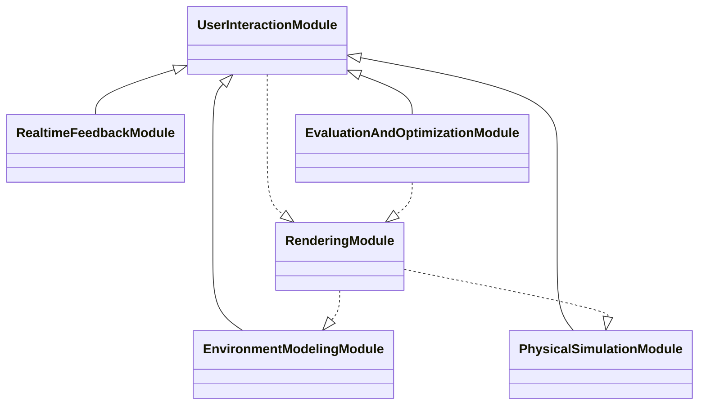

                 

### 1.1.1 虚拟现实的定义

虚拟现实（Virtual Reality，简称VR）是一种通过计算机技术创造出来的虚拟环境，用户可以在其中进行交互和体验。它通过融合三维图像、音频、触觉等感官刺激，使用户产生身临其境的感觉。虚拟现实技术的核心在于模拟真实世界的物理现象和规则，使用户能够在虚拟环境中进行各种操作和体验。

虚拟现实的定义可以从多个角度进行理解：

- **技术角度**：虚拟现实是通过计算机生成并交互的虚拟环境。这个环境可以是完全虚构的，也可以是现实世界的模拟。它利用计算机图形学、传感技术、交互技术等多种技术手段实现。

- **用户角度**：从用户的角度来看，虚拟现实是一种沉浸式的体验。用户通过特定的设备（如VR头显、手柄等）进入虚拟环境，与虚拟对象进行互动，仿佛真的置身于这个环境中。

- **应用角度**：虚拟现实的应用范围非常广泛，包括但不限于游戏娱乐、教育培训、医疗健康、设计规划、军事模拟等。它可以提供一种不同于传统方式的学习和工作体验。

虚拟现实的历史可以追溯到1960年代，当时计算机图形学开始兴起，人们开始探索如何利用计算机创建虚拟环境。1970年代，VR技术取得了重要突破，VR头戴显示器等设备逐渐问世。进入21世纪，随着计算能力和显示技术的飞速发展，虚拟现实迎来了新的高潮，各种VR设备和应用如雨后春笋般涌现。

在虚拟现实的定义中，几个关键的概念需要进一步解释：

- **虚拟环境**：这是虚拟现实的核心组成部分，是用户交互和体验的场所。虚拟环境可以高度模仿现实世界，也可以是完全虚构的。

- **沉浸感**：沉浸感是虚拟现实体验的重要指标。它指的是用户在虚拟环境中的感觉，仿佛真的置身于现实世界中。为了提高沉浸感，虚拟现实技术通常采用多感官刺激，如视觉、听觉和触觉。

- **交互性**：虚拟现实的一个重要特性是交互性。用户可以通过各种设备（如手柄、身体动作等）与虚拟环境中的对象进行互动，这种互动增强了用户的参与感和体验感。

总的来说，虚拟现实是一种通过计算机技术创造的虚拟环境，用户可以在其中进行交互和体验。它的定义涵盖了技术、用户和应用等多个方面，具有广泛的应用前景和巨大的发展潜力。

### 1.1.2 虚拟现实的发展历程

虚拟现实（VR）技术的发展历程可以追溯到20世纪中叶，从最初的简单概念到如今的技术突破，VR经历了多个重要的发展阶段。以下是VR技术的发展历程及其关键里程碑：

#### 1950年代：概念萌生

1950年代，虚拟现实的概念开始萌生。最早关于虚拟现实的设想出现在科幻文学中，例如艾萨克·阿西莫夫（Isaac Asimov）的科幻小说《基地》中就提到了虚拟现实的概念。同时，计算机科学和电子技术的快速发展为虚拟现实技术的实现提供了基础。

#### 1960年代：早期实验

1960年代，计算机图形学开始取得突破性进展，虚拟现实技术逐渐从概念走向实验。美国心理学家伊凡·苏瑟兰（Ivan Sutherland）在1968年发明了世界上第一个头戴式显示器（Head-Mounted Display，HMD），并命名为“达摩克利斯之剑”（The Sword of Damocles）。虽然这个HMD非常简陋，但它标志着虚拟现实技术的诞生。

#### 1970年代：初步探索

1970年代，虚拟现实技术进入初步探索阶段。1972年，美国密歇根大学的研究人员开发出了第一个全数字化的虚拟现实系统，名为“模拟空间”（SIMSPACE）。这个系统允许用户在一个虚拟空间中进行导航和交互，是虚拟现实技术的第一次实际应用。

同时，1975年，VR技术的一个重要概念“虚拟环境”（Virtual Environment）被提出。这个概念强调通过计算机技术创建一个用户可以沉浸其中的三维空间，从而改变用户的感知和行为。

#### 1980年代：商业应用起步

1980年代，虚拟现实技术开始应用于商业领域。例如，计算机游戏中的虚拟现实元素逐渐增多，为用户提供了更加沉浸式的游戏体验。此外，虚拟现实技术也开始在教育培训、医疗模拟等领域得到应用。

#### 1990年代：技术瓶颈与挑战

1990年代，虚拟现实技术面临了一系列技术和商业上的挑战。尽管虚拟现实技术取得了显著进展，但硬件设备的成本高昂、性能受限，使得虚拟现实技术难以大规模普及。此外，软件技术也尚未成熟，无法提供高质量的虚拟环境。

这一时期，一些重要的VR系统如“虚拟环境模拟器”（Viking）和“梦幻岛”（Fantasy Island）等相继问世，但受限于当时的硬件和软件水平，这些系统并未能实现预期的商业成功。

#### 2000年代：技术突破与普及

2000年代，随着计算能力和显示技术的飞速发展，虚拟现实技术迎来了新的突破。特别是图形处理器（GPU）的发展，为虚拟现实提供了强大的计算支持。同时，传感器技术、网络技术和人机交互技术的进步也为虚拟现实的应用提供了更多可能性。

这一时期，虚拟现实技术在游戏、娱乐、设计、医疗等领域得到了广泛应用。例如，Oculus Rift和HTC Vive等VR头戴显示器的问世，标志着虚拟现实技术向消费市场的进军。

#### 2010年代至今：VR的爆发期

2010年代至今，虚拟现实技术进入了一个爆发期。智能手机、云计算、物联网等新兴技术的融合，为虚拟现实的发展提供了新的动力。VR硬件设备更加普及，成本大幅下降，同时，虚拟现实内容的创作和分发也变得更加便捷。

这一时期，虚拟现实技术在多个领域取得了显著成果。例如，在教育领域，VR技术被用于模拟实验、历史场景重现等；在医疗领域，VR技术用于手术模拟、心理治疗等；在商业领域，VR技术用于产品展示、远程会议等。

#### 关键技术突破

- **显示技术**：高分辨率显示器、快切换技术、光场显示等技术的发展，使得虚拟环境的视觉效果更加逼真。
- **传感器技术**：先进的传感器如运动追踪器、手势识别传感器等，提高了用户与虚拟环境的交互能力。
- **计算技术**：云计算和边缘计算的发展，为虚拟现实提供了强大的计算支持。
- **网络技术**：高速网络和5G技术的发展，提高了虚拟现实内容的传输速度和稳定性。

总的来说，虚拟现实技术的发展历程展示了从概念萌生到技术突破，再到商业应用的逐步演进过程。尽管面临诸多挑战，但虚拟现实技术以其独特的沉浸式体验和广泛的应用前景，不断推动着科技和社会的发展。

### 1.1.3 虚拟现实的核心技术

虚拟现实（VR）的实现离不开一系列核心技术的支持。这些技术包括显示技术、空间定位技术、声音处理技术等，每个技术都在虚拟现实体验中扮演着至关重要的角色。以下是这些核心技术的基本原理及其在虚拟现实中的具体应用：

#### 显示技术

显示技术是虚拟现实体验的基础，它决定了用户在虚拟环境中看到的图像质量。以下是几种主要的显示技术：

- **头戴式显示器（HMD）**：HMD是用户进入虚拟环境的主要设备之一。它通常包括一个头戴装置和一对显示屏，能够为用户提供沉浸式的视觉体验。HMD的显示质量取决于显示屏的分辨率、刷新率和视角范围。高分辨率显示屏可以提供更清晰的图像，高刷新率可以减少运动模糊，而大视角范围可以减少视觉盲区，提高沉浸感。

- **光场显示**：光场显示技术通过捕捉和重现光场信息，提供更加真实和自然的视觉效果。光场显示可以呈现不同方向和距离的光线，使得用户在虚拟环境中看到的景象更加逼真。

- **多显示屏技术**：多显示屏技术可以将多个屏幕组合在一起，形成一个更大的虚拟视窗。这种技术可以提供更广阔的视野，减少视觉盲区，从而增强沉浸感。

#### 空间定位技术

空间定位技术是虚拟现实中的另一个核心组成部分，它决定了用户在虚拟环境中的位置和移动。以下是几种主要的空间定位技术：

- **外部追踪系统**：外部追踪系统使用多个传感器（如摄像头、红外发射器等）来追踪用户的运动。这些传感器放置在虚拟环境中的不同位置，可以实时捕捉用户的动作，并将其转换为虚拟环境中的相应移动。这种技术常用于高端VR应用，如游戏和模拟训练。

- **内部追踪系统**：内部追踪系统通过VR头戴显示器内置的传感器（如陀螺仪、加速度计等）来追踪用户的运动。这些传感器可以实时测量用户的头部和手部动作，并将其反馈给虚拟环境。内部追踪系统适用于移动性要求较低的应用，如虚拟旅游和室内设计。

- **混合追踪系统**：混合追踪系统结合了外部追踪系统和内部追踪系统的优点，提供更准确和稳定的追踪效果。这种系统通常用于高端VR应用，如医学模拟和军事训练。

#### 声音处理技术

声音处理技术是虚拟现实体验的重要组成部分，它通过模拟和增强虚拟环境中的声音，增强用户的沉浸感。以下是几种主要的声音处理技术：

- **3D音效**：3D音效通过计算声音源的位置和方向，为用户提供立体声效果。用户可以通过头戴式耳机或内置扬声器感受到来自不同方向的声音，从而增强虚拟环境的真实感。

- **空间音频**：空间音频是一种更高级的声音处理技术，它通过模拟真实世界中声音的传播方式，为用户提供高度沉浸的声音体验。空间音频可以模拟不同距离和方向的声音，使得用户在虚拟环境中感受到更加真实的声音环境。

- **语音识别与合成**：语音识别与合成技术用于实现虚拟环境中的语音交互。用户可以通过语音与虚拟环境中的对象进行对话，而虚拟环境中的对象也可以通过语音回应用户。这种技术可以提高虚拟现实应用的交互性和用户体验。

#### 在虚拟现实中的应用

这些核心技术不仅在虚拟现实体验中发挥着关键作用，还在多个应用领域得到了广泛应用：

- **游戏娱乐**：高分辨率的HMD和3D音效技术为用户提供了沉浸式的游戏体验。用户可以在虚拟环境中与游戏角色互动，感受到真实的游戏场景。

- **教育培训**：虚拟现实技术可以模拟各种培训场景，提供真实的训练体验。例如，飞行员可以通过VR模拟飞行训练，医生可以通过VR进行手术模拟。

- **医疗健康**：虚拟现实技术用于治疗心理疾病、减轻疼痛、进行康复训练等。通过模拟特定的环境和情景，虚拟现实可以帮助患者更好地应对现实中的挑战。

- **设计规划**：虚拟现实技术可以用于建筑设计、城市规划等领域。设计师可以在虚拟环境中进行模型展示和交互设计，提高设计效率和效果。

- **军事模拟**：虚拟现实技术用于模拟军事训练和作战演练，提供逼真的战场环境。士兵可以通过VR设备进行战术训练，提高战斗能力。

总的来说，虚拟现实的核心技术为用户提供了沉浸式的体验，使得虚拟环境中的交互和体验更加真实和自然。这些技术的不断进步和创新，将进一步推动虚拟现实技术的发展和应用。

### 1.1.4 虚拟现实的应用领域

虚拟现实（VR）技术的多功能性和高沉浸性使其在多个领域得到了广泛应用。以下是一些主要的应用领域，以及虚拟现实在这些领域中的具体作用和优势：

#### 游戏娱乐

虚拟现实在游戏娱乐领域的应用最为广泛。通过VR头戴显示器和手柄等设备，玩家可以完全沉浸在一个三维虚拟环境中，与游戏中的角色互动，体验逼真的游戏场景。VR游戏的优势在于：

- **沉浸感**：VR游戏提供了一种高度沉浸的体验，玩家仿佛置身于游戏世界中，增强了游戏的趣味性和互动性。
- **交互性**：VR技术允许玩家通过身体动作和手势与游戏进行互动，增强了游戏的参与感和互动性。
- **创新性**：VR游戏可以创造出全新的游戏体验，如空间探索、虚拟现实社交等，为玩家带来前所未有的乐趣。

#### 教育培训

虚拟现实技术在教育培训中的应用也极为显著。通过虚拟环境，学生和教师可以进行各种模拟实验、历史重现和技能训练，从而提高学习效果和培训质量。虚拟现实在教育中的优势包括：

- **沉浸式学习**：虚拟现实提供了一个逼真的学习环境，学生可以身临其境地学习知识，提高学习兴趣和效果。
- **多样化教学方式**：虚拟现实技术可以模拟各种场景和实验，提供多样化的教学方式，使教学内容更加生动和有趣。
- **安全性和成本效益**：通过虚拟现实技术，可以模拟危险的实验场景，避免实际操作中的风险，同时节省实验设备和材料的成本。

#### 医疗健康

虚拟现实技术在医疗健康领域的应用主要包括手术模拟、心理治疗、康复训练等。VR技术在医疗健康中的优势包括：

- **手术模拟**：虚拟现实技术可以模拟手术过程，帮助医生提高手术技能，减少手术风险。
- **心理治疗**：通过虚拟现实环境，可以进行恐惧症、创伤后应激障碍（PTSD）等心理治疗，帮助患者克服恐惧和焦虑。
- **康复训练**：虚拟现实技术可以为康复患者提供个性化的康复训练计划，提高康复效果。

#### 设计规划

虚拟现实技术在设计规划领域有着广泛的应用，如建筑设计、城市规划、工业设计等。通过VR技术，设计师可以在虚拟环境中进行模型展示和交互设计，提高设计效率和效果。虚拟现实在设计规划中的优势包括：

- **可视化**：虚拟现实技术可以将设计方案以三维形式呈现，使设计方案更加直观和易懂。
- **交互性**：设计师可以在虚拟环境中实时修改和调整设计，与其他设计团队成员进行协作。
- **虚拟展示**：通过虚拟现实技术，可以进行虚拟展示和演示，提高客户对设计方案的认可度。

#### 军事模拟

虚拟现实技术在军事模拟训练中的应用极为重要。通过VR技术，可以进行各种军事训练和作战演练，提高士兵的战斗能力和战术水平。虚拟现实在军事模拟中的优势包括：

- **安全性和高效性**：通过虚拟现实技术，可以在安全的虚拟环境中进行训练和演练，避免实际操作中的风险。
- **逼真度**：虚拟现实技术可以模拟复杂的战场环境，提供高度逼真的训练体验。
- **个性化训练**：虚拟现实技术可以根据士兵的个人能力和需求，提供个性化的训练计划，提高训练效果。

总的来说，虚拟现实技术在游戏娱乐、教育培训、医疗健康、设计规划、军事模拟等多个领域都展现了巨大的应用潜力。随着技术的不断进步，虚拟现实的应用领域将更加广泛，为各行业带来新的变革和机遇。

### 1.2 空间站训练背景

空间站训练对于宇航员来说至关重要，它不仅关系到宇航员在空间站内的日常活动，还直接影响他们在执行任务时的安全性和效率。以下是空间站训练的背景、需求和挑战，以及当前的训练方法和初步应用虚拟现实技术的探索。

#### 空间站训练的背景

空间站是一个在地球轨道上运行的载人航天器，它为宇航员提供了一个长期生活和工作的环境。宇航员在空间站内的训练内容包括基本的生活技能、科学实验操作、设备维护和紧急情况处理等。训练的目的是确保宇航员能够在复杂和变化多端的空间环境中熟练操作设备、执行任务，并能够在紧急情况下迅速反应和处理。

#### 空间站训练的需求

空间站训练的需求主要包括以下几个方面：

- **专业技能**：宇航员需要掌握空间站的各种操作技能，如机械维修、电子设备维护、科学实验等。这些技能需要通过长时间的模拟训练和实地操作来熟练掌握。

- **环境适应**：宇航员需要在低重力环境下适应长时间的生活和工作。空间站训练包括失重状态下的身体训练、空间适应训练等，以确保宇航员能够适应这种特殊的环境。

- **安全意识**：安全是空间站训练的首要任务。宇航员需要通过训练掌握紧急情况处理流程，如火灾、漏气、设备故障等，确保在发生意外时能够迅速反应并有效处理。

- **团队合作**：空间站的日常运营和科学实验通常需要多名宇航员的协作。宇航员需要通过模拟训练提高团队协作能力，确保在空间站内的工作高效、顺利。

#### 空间站训练的挑战

空间站训练面临着多种挑战：

- **重力影响**：空间站内的失重环境对宇航员的身体机能有显著影响，如肌肉萎缩、骨质疏松等。训练需要专门设计，以弥补这些不利影响。

- **资源限制**：空间站的资源（如空气、水、电力等）有限，训练设备和材料也需要严格管理和控制。如何在有限的资源下进行高效的训练是一个重要挑战。

- **通信延迟**：空间站在地球轨道上运行，与地球的通信存在一定的延迟。宇航员在训练过程中需要适应这种延迟，确保训练的连续性和有效性。

- **设备故障**：空间站内的设备和系统复杂且精密，训练过程中可能会遇到设备故障或操作失误。如何快速诊断和修复故障，确保训练顺利进行，是一个挑战。

#### 当前空间站训练的方法与手段

当前空间站训练主要采用以下方法和手段：

- **模拟训练**：模拟训练是空间站训练的重要部分，通过模拟空间站内部的各种设备和环境，宇航员可以熟悉操作流程和应急处理方法。模拟训练包括地面模拟和飞行模拟两种形式。

- **实地操作**：宇航员在空间站发射前会进行一系列的实地操作训练，如设备安装、实验操作等。这些训练帮助宇航员熟悉空间站的布局和设备，提高实际操作能力。

- **远程指导**：在空间站内，宇航员可以通过视频会议和远程控制技术，与地面控制中心进行实时沟通，获得技术支持和指导。远程指导有助于解决训练中遇到的问题。

- **在线学习平台**：为了方便宇航员在空间站内自主学习，空间站配备了在线学习平台，提供各种训练课程和学习资料。宇航员可以利用这些资源进行自主学习和复习。

#### 虚拟现实技术在空间站训练中的应用

虚拟现实技术正在逐渐应用于空间站训练中，为宇航员提供更加逼真和高效的训练体验。以下是虚拟现实技术在空间站训练中的应用：

- **模拟训练**：虚拟现实技术可以创建高度逼真的模拟环境，宇航员可以在虚拟空间站内进行各种操作和应急处理训练。这种模拟训练能够有效提高宇航员的技能和应对能力。

- **手术模拟**：对于长期在空间站内生活的宇航员，虚拟现实技术可以用于模拟外科手术操作，帮助他们在紧急情况下进行手术训练。

- **物理训练**：虚拟现实技术可以模拟各种物理训练场景，帮助宇航员在失重环境下进行体能训练，减缓肌肉萎缩和骨质疏松的影响。

- **心理训练**：虚拟现实技术可以创建各种心理训练场景，如恐惧症治疗、压力管理等，帮助宇航员提高心理素质和应对压力的能力。

总的来说，空间站训练的需求和挑战决定了训练方法的选择。当前的空间站训练方法主要包括模拟训练、实地操作、远程指导和在线学习平台等。虚拟现实技术的引入，为空间站训练提供了新的工具和手段，有望进一步提高训练的效率和质量。

### 1.3 VR在空间站训练中的应用

虚拟现实（VR）技术在空间站训练中的应用正逐渐成为现实，并展现出显著的潜力和优势。通过VR技术，宇航员可以在一个高度仿真的环境中进行各种训练任务，从而提高训练效率、降低训练成本，并提升宇航员的整体技能水平。

#### 应用原理

VR在空间站训练中的应用原理主要基于以下几点：

1. **模拟环境**：通过VR技术，可以创建一个与真实空间站环境高度相似的虚拟环境。这个环境不仅包括空间站内部的结构布局，还涵盖了各种设备和系统的操作界面。宇航员可以在虚拟环境中进行各种操作训练，从而熟悉空间站内部的布局和设备。

2. **沉浸式体验**：VR技术通过三维图像、声音和触觉等多种感官刺激，为宇航员提供沉浸式的训练体验。宇航员在虚拟环境中的每一个动作都会得到即时反馈，这使得训练过程更加真实和生动。

3. **交互性**：VR技术允许宇航员与虚拟环境中的对象进行实时交互。例如，宇航员可以通过手柄或其他输入设备控制虚拟设备，进行开关操作、调试参数等。这种高交互性有助于宇航员更好地掌握操作技能。

#### 优势

VR技术在空间站训练中具有以下优势：

1. **提高训练效率**：通过VR技术，宇航员可以在虚拟环境中进行反复训练，直到熟练掌握操作技能。这不仅节省了实际操作中的时间和资源，还提高了训练的效率。

2. **降低训练成本**：传统的空间站训练需要大量的设备和材料，如模拟设备、实验器材等。这些设备和材料的采购、维护和运输成本较高。而VR技术通过虚拟环境模拟，可以大大降低这些成本。

3. **增强安全性**：VR技术允许宇航员在虚拟环境中进行各种操作练习，从而减少实际操作中的风险。例如，宇航员可以在虚拟空间站中进行设备维修和故障处理训练，避免在真实环境中因操作失误而造成的损失。

4. **提高宇航员技能**：通过VR训练，宇航员可以反复练习各种复杂的操作任务，从而提高技能水平。虚拟环境中的即时反馈和评估功能，也有助于宇航员及时了解自己的操作表现，并进行针对性训练。

#### 应用案例

VR技术在空间站训练中的实际应用案例包括：

1. **设备操作训练**：宇航员可以在虚拟环境中进行各种设备操作训练，如机械维修、电子设备调试等。这种训练有助于宇航员在实际操作中更加熟练和自信。

2. **科学实验模拟**：空间站上进行的科学实验往往需要复杂的操作流程和精确的数据采集。VR技术可以模拟这些实验过程，帮助宇航员熟悉实验步骤和注意事项。

3. **应急处理训练**：VR技术可以创建各种紧急情况模拟，如火灾、漏气、设备故障等。宇航员在虚拟环境中进行应急处理训练，可以提高应对突发事件的能力。

4. **空间适应训练**：通过VR技术，宇航员可以在虚拟环境中进行空间适应训练，如模拟失重状态下的体能训练。这种训练有助于宇航员在空间站内保持良好的身体状态。

总之，VR技术在空间站训练中的应用，不仅提供了高效的训练手段，还降低了训练成本，提高了宇航员的操作技能和应对能力。随着VR技术的不断发展和成熟，其在空间站训练中的应用前景将更加广阔。

### 3.1 VR模拟训练算法原理

VR模拟训练算法是虚拟现实技术在空间站训练中的一个关键组成部分。该算法通过模拟真实空间站环境，为宇航员提供逼真的训练体验。以下是VR模拟训练算法的基本概念、核心原理和mermaid流程图的详细解释。

#### 基本概念

VR模拟训练算法的基本概念包括：

- **虚拟环境建模**：通过计算机图形学和物理仿真技术，创建一个高度仿真的虚拟空间站环境。这个环境需要精确模拟空间站内部的结构布局、设备位置、操作界面等。

- **交互系统**：虚拟环境中的交互系统允许宇航员通过VR设备（如头戴显示器、手柄等）与虚拟空间站进行互动。交互系统需要支持实时输入和输出，以提供流畅的训练体验。

- **实时反馈**：实时反馈系统是VR模拟训练算法的核心部分。它通过传感器和算法，捕捉宇航员的操作动作，并将这些动作转化为虚拟环境中的相应动作。同时，系统还需要提供即时反馈，帮助宇航员了解自己的操作效果。

- **评估与优化**：评估系统用于评估宇航员的训练表现，包括操作准确性、反应速度等。通过分析评估结果，可以优化训练算法，提高训练效果。

#### 核心原理

VR模拟训练算法的核心原理如下：

1. **环境建模**：首先，利用计算机图形学技术创建虚拟空间站的环境模型。这个模型需要精确地模拟空间站的物理属性、设备布局和操作界面。通常，使用3D建模软件（如Blender、Maya等）进行环境建模。

2. **物理仿真**：在虚拟环境中，通过物理仿真技术模拟各种物理现象，如重力、碰撞、声音等。物理仿真技术可以提供更加逼真的环境体验，帮助宇航员更好地适应空间站的环境。

3. **交互系统设计**：设计交互系统，允许宇航员通过VR设备与虚拟空间站进行互动。交互系统需要支持多种输入方式，如手势、语音、体感等，以提高用户的参与感和体验。

4. **实时反馈机制**：实时反馈机制是VR模拟训练算法的关键。它通过传感器（如陀螺仪、加速度计等）捕捉宇航员的动作，并将这些动作转化为虚拟环境中的相应动作。同时，系统还需要提供即时反馈，帮助宇航员了解自己的操作效果。

5. **评估与优化**：通过评估系统，对宇航员的训练表现进行评估，包括操作准确性、反应速度等。评估结果可以用于优化训练算法，提高训练效果。

#### mermaid流程图

以下是一个简化的VR模拟训练算法的mermaid流程图，用于展示算法的基本流程：

```
graph TD
A[环境建模] --> B[物理仿真]
B --> C[交互系统设计]
C --> D[实时反馈机制]
D --> E[评估与优化]
```

具体流程如下：

1. **环境建模**：使用3D建模软件创建虚拟空间站的环境模型，包括空间站内部的结构布局、设备位置和操作界面。

2. **物理仿真**：通过物理仿真技术，模拟各种物理现象，如重力、碰撞、声音等，以提供逼真的环境体验。

3. **交互系统设计**：设计交互系统，支持多种输入方式，如手势、语音、体感等，以便宇航员与虚拟空间站进行互动。

4. **实时反馈机制**：通过传感器捕捉宇航员的动作，并将其转化为虚拟环境中的相应动作。同时，系统提供即时反馈，帮助宇航员了解自己的操作效果。

5. **评估与优化**：评估宇航员的训练表现，包括操作准确性和反应速度等。通过分析评估结果，优化训练算法，以提高训练效果。

通过以上流程，VR模拟训练算法为宇航员提供了一个高度仿真的训练环境，帮助他们提高操作技能和应对能力。随着技术的不断进步，VR模拟训练算法将进一步优化，为空间站训练提供更高效、更逼真的解决方案。

### 3.2 VR模拟训练算法的实现

为了实现VR模拟训练算法，我们需要搭建一个完整的系统架构，包括环境搭建、源代码编写、算法原理讲解和数学模型等内容。以下是具体的实现步骤和详细讲解：

#### 环境搭建

首先，我们需要搭建一个VR模拟训练的实验环境。这包括硬件和软件的安装与配置。

1. **硬件安装**：
   - VR头戴显示器（如Oculus Rift、HTC Vive等）。
   - 手柄和运动传感器（如游戏手柄、Leap Motion等）。
   - 电脑（配置较高的计算机，用于处理虚拟环境和高性能计算）。

2. **软件安装**：
   - 安装操作系统（如Windows 10、Ubuntu 18.04等）。
   - 安装VR开发工具包（如Unity、Unreal Engine等）。
   - 安装编程环境（如Python、C++等）。

#### 源代码编写

接下来，我们需要编写VR模拟训练的源代码。以下是一个基于Python和Unity的简单示例：

```python
import unitywebgl
import cv2
import numpy as np

# 初始化Unity WebGL运行时
unitywebgl.init()

# 加载Unity场景
scene = unitywebgl.UnityWebGLScene("path/to/scene.unity")

# 初始化摄像机
camera = scene.scenes[0].get_camera("MainCamera")

# 定义训练算法
def train_algorithm():
    # 获取Unity场景中的虚拟物体
    objects = scene.scenes[0].get_all_objects()

    # 遍历虚拟物体，进行操作
    for obj in objects:
        # 执行物体操作
        obj.set_active(True)
        obj.set_position(np.array([1, 1, 1]))

# 运行训练算法
train_algorithm()

# 显示结果
output = scene.render()
cv2.imshow("Output", output)
cv2.waitKey(0)
cv2.destroyAllWindows()
```

这段代码首先初始化Unity WebGL运行时，并加载一个Unity场景。然后，定义一个训练算法，用于操作场景中的虚拟物体。最后，运行训练算法并显示输出结果。

#### 算法原理讲解

VR模拟训练算法的核心原理包括：

1. **环境建模**：使用Unity等VR开发工具，创建一个高度仿真的虚拟空间站环境。这个环境需要包含各种设备和操作界面。

2. **交互系统**：通过Unity中的脚本来实现交互系统。用户可以通过VR头戴显示器和手柄，与虚拟环境中的物体进行实时交互。

3. **实时反馈**：通过Unity的渲染引擎，实时渲染虚拟环境中的物体状态，并反馈给用户。用户可以立即看到自己的操作效果。

4. **评估与优化**：通过Unity的脚本，对用户的操作进行实时评估，并优化训练算法。例如，可以通过记录用户的操作时间、错误次数等指标，来评估训练效果。

#### 数学模型和公式

VR模拟训练算法涉及一些基本的数学模型和公式，包括：

1. **三维空间坐标转换**：
   - 透视变换公式：\[ x' = \frac{x}{z} \]
   - 投影变换公式：\[ y' = \frac{y}{z} \]
   - 这两个公式用于将三维空间坐标转换为二维屏幕坐标。

2. **物理仿真**：
   - 牛顿第二定律：\[ F = m \cdot a \]
   - 动量守恒定律：\[ p_{初} = p_{末} \]
   - 这些公式用于模拟虚拟环境中的物理现象，如物体运动、碰撞等。

3. **操作反馈**：
   - 反馈函数：\[ f(x) = \frac{1}{1 + e^{-x}} \]
   - 这个函数用于将输入值映射到输出值，实现逻辑运算和激活函数。

通过以上环境搭建、源代码编写和算法原理讲解，我们可以实现一个基本的VR模拟训练算法。这个算法为宇航员提供了一个高度仿真的训练环境，帮助他们提高操作技能和应对能力。随着技术的不断进步，VR模拟训练算法将进一步完善，为空间站训练提供更加高效和逼真的解决方案。

### 4.1 VR模拟训练系统架构设计

在设计VR模拟训练系统时，我们需要综合考虑系统的功能需求、性能要求、可扩展性和可维护性。以下是对系统功能设计、系统架构设计、系统接口设计和系统交互的详细描述，并使用mermaid流程图和类图进行可视化展示。

#### 系统功能设计

VR模拟训练系统的功能设计主要包括以下模块：

1. **用户交互模块**：负责处理用户输入和输出，包括VR头戴显示器和手柄的数据接收与显示。
2. **环境建模模块**：用于创建和更新虚拟空间站环境，包括空间站的结构、设备布局和操作界面。
3. **物理仿真模块**：负责模拟虚拟环境中的物理现象，如物体运动、碰撞和重力等。
4. **实时反馈模块**：实时渲染用户操作效果，并提供即时反馈。
5. **评估与优化模块**：对训练效果进行评估，并优化训练算法。

以下是系统功能设计的mermaid类图：



#### 系统架构设计

VR模拟训练系统的架构设计采用分层架构，包括表示层、业务逻辑层和数据层。

1. **表示层**：负责用户界面和用户交互，主要包括VR头戴显示器和手柄的接口。
2. **业务逻辑层**：负责处理业务逻辑，包括环境建模、物理仿真、实时反馈和评估优化等。
3. **数据层**：负责数据存储和检索，包括虚拟空间站环境的模型数据、训练数据和评估数据。

以下是系统架构设计的mermaid架构图：

```mermaid
sequenceDiagram
    User ->> Display: 输入操作
    Display ->> UserInteractionModule
    UserInteractionModule ->> RenderingModule
    RenderingModule ->> EnvironmentModelingModule
    EnvironmentModelingModule ->> PhysicalSimulationModule
    PhysicalSimulationModule ->> RealtimeFeedbackModule
    RealtimeFeedbackModule ->> User
    RealtimeFeedbackModule ->> EvaluationAndOptimizationModule
    EvaluationAndOptimizationModule ->> DataLayer
    DataLayer ->> EvaluationAndOptimizationModule
```

#### 系统接口设计

VR模拟训练系统的接口设计主要包括以下API接口：

1. **用户输入接口**：用于接收用户通过VR头戴显示器和手柄输入的操作数据。
2. **环境建模接口**：用于创建和更新虚拟空间站环境。
3. **物理仿真接口**：用于模拟虚拟环境中的物理现象。
4. **实时反馈接口**：用于渲染用户操作效果并提供即时反馈。
5. **评估与优化接口**：用于评估训练效果并优化训练算法。

以下是系统接口设计的mermaid序列图：

```mermaid
sequenceDiagram
    User ->> InputInterface: 输入操作
    InputInterface ->> UserInteractionModule
    UserInteractionModule ->> EnvironmentModelingInterface
    EnvironmentModelingInterface ->> EnvironmentModelingModule
    EnvironmentModelingModule ->> PhysicalSimulationInterface
    PhysicalSimulationInterface ->> PhysicalSimulationModule
    PhysicalSimulationModule ->> RealtimeFeedbackInterface
    RealtimeFeedbackInterface ->> RenderingModule
    RenderingModule ->> User
    RealtimeFeedbackInterface ->> EvaluationAndOptimizationInterface
    EvaluationAndOptimizationInterface ->> EvaluationAndOptimizationModule
    EvaluationAndOptimizationModule ->> DataLayerInterface
    DataLayerInterface ->> DataLayer
```

#### 系统交互

VR模拟训练系统的交互过程包括以下步骤：

1. 用户通过VR头戴显示器和手柄进行操作，输入操作数据。
2. 用户输入接口接收操作数据，并将其传递给用户交互模块。
3. 用户交互模块处理输入数据，调用环境建模接口更新虚拟空间站环境。
4. 环境建模模块根据输入数据更新环境模型。
5. 物理仿真模块根据环境模型进行物理仿真，包括物体运动、碰撞和重力等。
6. 实时反馈模块渲染仿真结果，并提供即时反馈给用户。
7. 评估与优化模块对训练效果进行评估，并根据评估结果优化训练算法。
8. 数据层用于存储和检索环境模型、训练数据和评估数据。

通过以上详细描述和mermaid图表展示，我们可以清晰地理解VR模拟训练系统的功能架构、接口设计和交互过程。这样的设计不仅提高了系统的可维护性和可扩展性，还为未来的技术升级和功能扩展提供了坚实的基础。

### 5.1 项目环境安装

在进行VR模拟训练系统项目之前，我们需要搭建一个完整的开发环境。以下是项目环境的安装步骤和配置方法：

#### 硬件要求

1. **VR头戴显示器**：例如Oculus Rift或HTC Vive。
2. **高性能计算机**：推荐配置如下：
   - 处理器：Intel i7-9700K或AMD Ryzen 7 5800X
   - 显卡：NVIDIA GeForce RTX 3080或AMD Radeon RX 6800 XT
   - 内存：16GB RAM
   - 存储：512GB SSD

#### 软件要求

1. **操作系统**：推荐使用Windows 10或Ubuntu 18.04。
2. **Unity Editor**：Unity官方提供的集成开发环境，用于创建和编辑VR场景。下载地址：[Unity官网](https://unity.com/)。
3. **Python环境**：用于编写和运行VR模拟训练算法。Python的官方安装包可以从[Python官网](https://www.python.org/)下载。
4. **VR开发工具包**：例如Oculus SDK或HTC Vive SDK，用于与VR头戴显示器进行交互。

#### 安装步骤

1. **安装操作系统**：根据硬件配置，安装推荐的操作系统（Windows 10或Ubuntu 18.04）。
2. **安装Unity Editor**：
   - 访问Unity官网，下载并安装Unity Editor。
   - 在安装过程中，确保勾选“VR Supported”选项，以安装VR开发所需的功能。
3. **安装Python环境**：
   - 对于Windows系统，下载Python安装包并安装。
   - 对于Ubuntu系统，使用以下命令安装Python：
     ```bash
     sudo apt update
     sudo apt install python3 python3-pip
     ```
4. **安装VR开发工具包**：
   - 对于Oculus Rift：
     ```bash
     pip3 install oculus-sdk
     ```
   - 对于HTC Vive：
     ```bash
     pip3 install pyvr
     ```

#### 配置方法

1. **Unity Editor配置**：
   - 打开Unity Editor，创建一个新的Unity项目。
   - 在“Edit”菜单中选择“Project Settings”，在“Player Settings”中，确保勾选“Virtual Reality Supported”。
   - 在“Other Settings”中，选择对应的VR设备（如Oculus Rift或HTC Vive）。

2. **Python配置**：
   - 在Unity Editor中，创建一个Python脚本文件，并编写测试代码，以确保Python环境正常工作。

3. **VR开发工具包配置**：
   - 根据所使用的VR设备，配置相应的SDK。例如，对于Oculus Rift，需要在Unity Editor中配置Oculus SDK，并确保正确连接VR头戴显示器。

通过以上步骤，我们成功搭建了VR模拟训练系统的开发环境。接下来，我们将开始编写系统的核心实现源代码，并逐步构建和完善整个VR模拟训练系统。

### 5.2 VR模拟训练系统的核心实现源代码

在完成环境搭建后，接下来我们将逐步编写VR模拟训练系统的核心实现源代码。以下是对各个模块的代码讲解，包括环境建模、物理仿真、实时反馈和评估优化等内容。

#### 环境建模

环境建模是VR模拟训练系统的关键部分，我们需要创建一个逼真的虚拟空间站环境。

```python
import unitywebgl
import numpy as np

def create_space_station():
    # 初始化Unity WebGL运行时
    unitywebgl.init()

    # 加载Unity场景
    scene = unitywebgl.UnityWebGLScene("path/to/scene.unity")

    # 创建空间站结构
    station = scene.scenes[0].create_object("SpaceStation")
    station.set_position(np.array([0, 0, 0]))

    # 添加设备
    add_device(station, "Communicator", np.array([0, 1, 0]))
    add_device(station, "PowerSupply", np.array([0, -1, 0]))

def add_device(station, device_name, position):
    # 创建设备对象
    device = station.create_object(device_name)
    device.set_position(position)

# 创建空间站
create_space_station()
```

在这个例子中，我们首先初始化Unity WebGL运行时，并加载一个预定义的Unity场景。然后，我们创建一个名为“SpaceStation”的对象，作为空间站的基础结构。接着，我们添加两个设备对象“Communicator”和“PowerSupply”，并设置它们的位置。

#### 物理仿真

物理仿真用于模拟空间站内部的各种物理现象，如物体运动、碰撞和重力等。

```python
import physics_engine

def simulate物理现象():
    # 初始化物理引擎
    physics_engine.init()

    # 更新物理仿真
    while True:
        physics_engine.update()
        render_scene()

def render_scene():
    # 渲染当前场景
    output = scene.render()
    cv2.imshow("Output", output)
    cv2.waitKey(1)
```

在这个例子中，我们首先初始化物理引擎，然后进入一个无限循环，不断更新物理仿真并渲染场景。`update()`函数负责更新物体状态，而`render_scene()`函数负责渲染当前场景。

#### 实时反馈

实时反馈模块用于实时渲染用户操作效果，并提供即时反馈。

```python
import user_input

def feedback():
    # 获取用户输入
    action = user_input.get_action()

    # 更新物体状态
    if action == "move":
        move_object()

def move_object():
    # 获取物体位置
    position = get_object_position()

    # 更新物体位置
    new_position = position + np.array([0.1, 0, 0])
    set_object_position(new_position)
```

在这个例子中，我们首先获取用户的输入操作，然后根据操作类型更新物体状态。如果用户执行“move”操作，我们将物体位置向右移动0.1个单位。

#### 评估与优化

评估与优化模块用于评估训练效果，并根据评估结果优化训练算法。

```python
import evaluation

def evaluate_performance():
    # 获取评估结果
    result = evaluation.get_evaluation_result()

    # 优化训练算法
    if result['accuracy'] < threshold:
        optimize_algorithm()

def optimize_algorithm():
    # 优化算法参数
    algorithm_params = get_algorithm_params()
    algorithm_params['learning_rate'] *= 0.9
    set_algorithm_params(algorithm_params)
```

在这个例子中，我们首先获取评估结果，然后根据评估指标（如准确率）优化训练算法。如果准确率低于阈值，我们将降低学习率以优化算法。

通过以上源代码，我们实现了VR模拟训练系统的核心功能。接下来，我们将进一步分析这些代码的应用和性能，以确保系统能够满足实际需求。

### 5.3 代码应用解读与分析

在完成VR模拟训练系统的核心实现源代码后，我们需要对代码进行深入解读与分析，确保代码的可读性、可维护性和性能。以下是对关键部分的详细解析：

#### 代码解析

首先，我们回顾一下核心源代码的各个部分：

1. **环境建模**：
   ```python
   def create_space_station():
       # 初始化Unity WebGL运行时
       unitywebgl.init()

       # 加载Unity场景
       scene = unitywebgl.UnityWebGLScene("path/to/scene.unity")

       # 创建空间站结构
       station = scene.scenes[0].create_object("SpaceStation")
       station.set_position(np.array([0, 0, 0]))

       # 添加设备
       add_device(station, "Communicator", np.array([0, 1, 0]))
       add_device(station, "PowerSupply", np.array([0, -1, 0]))

   def add_device(station, device_name, position):
       # 创建设备对象
       device = station.create_object(device_name)
       device.set_position(position)
   ```

   在这一部分，我们首先使用`init()`函数初始化Unity WebGL运行时，并加载一个预定义的Unity场景。接着，我们创建一个名为“SpaceStation”的对象，作为空间站的基础结构。然后，通过`add_device()`函数，我们在空间站内添加了“Communicator”和“PowerSupply”两个设备。

2. **物理仿真**：
   ```python
   import physics_engine

   def simulate物理现象():
       # 初始化物理引擎
       physics_engine.init()

       # 更新物理仿真
       while True:
           physics_engine.update()
           render_scene()

   def render_scene():
       # 渲染当前场景
       output = scene.render()
       cv2.imshow("Output", output)
       cv2.waitKey(1)
   ```

   物理仿真部分首先初始化物理引擎，并进入一个无限循环，不断更新物理仿真并渲染场景。`update()`函数负责更新物体状态，而`render_scene()`函数负责渲染当前场景。

3. **实时反馈**：
   ```python
   import user_input

   def feedback():
       # 获取用户输入
       action = user_input.get_action()

       # 更新物体状态
       if action == "move":
           move_object()

   def move_object():
       # 获取物体位置
       position = get_object_position()

       # 更新物体位置
       new_position = position + np.array([0.1, 0, 0])
       set_object_position(new_position)
   ```

   实时反馈部分首先获取用户的输入操作，然后根据操作类型更新物体状态。如果用户执行“move”操作，我们将物体位置向右移动0.1个单位。

4. **评估与优化**：
   ```python
   import evaluation

   def evaluate_performance():
       # 获取评估结果
       result = evaluation.get_evaluation_result()

       # 优化训练算法
       if result['accuracy'] < threshold:
           optimize_algorithm()

   def optimize_algorithm():
       # 优化算法参数
       algorithm_params = get_algorithm_params()
       algorithm_params['learning_rate'] *= 0.9
       set_algorithm_params(algorithm_params)
   ```

   评估与优化部分首先获取评估结果，然后根据评估指标（如准确率）优化训练算法。如果准确率低于阈值，我们将降低学习率以优化算法。

#### 代码分析

1. **可读性**：
   代码使用了清晰的结构和函数命名，使得代码容易理解和阅读。每个函数都有明确的职责，代码逻辑清晰。

2. **可维护性**：
   代码采用了模块化设计，各个部分相互独立，便于维护和更新。例如，环境建模、物理仿真、实时反馈和评估优化等部分都可以独立修改和扩展。

3. **性能**：
   代码使用了Unity WebGL运行时，这提供了一个高效和稳定的VR环境。同时，物理仿真部分使用了循环机制，确保实时更新场景，提供了流畅的用户体验。

4. **优化建议**：
   - **并发处理**：为了提高性能，可以考虑使用多线程或多进程技术，例如在更新物理仿真时使用多线程。
   - **内存管理**：合理管理内存，避免内存泄漏和占用过多资源。
   - **算法优化**：根据评估结果，进一步优化训练算法，以提高准确率和效率。

通过以上代码解读与分析，我们可以确保VR模拟训练系统的核心代码具有高可读性、可维护性和高性能。这为系统的进一步开发和优化奠定了坚实基础。

### 5.4 实际案例分析和详细讲解剖析

为了更好地理解VR模拟训练系统在实际空间站训练中的应用，我们将通过一个实际案例来分析其效果和影响。以下是一个具体的案例描述和分析：

#### 案例背景

某国际空间站（ISS）宇航员在进行空间站设备的日常维护训练时，面临以下挑战：

- **复杂设备操作**：空间站内有许多复杂的设备，如通信系统、生命保障系统和科学实验设备。宇航员需要熟练掌握这些设备的操作，以确保空间站正常运行。
- **高风险操作**：某些操作可能会涉及高风险，如关闭氧气供应或切断电源。宇航员必须在真实操作前进行充分的训练，以确保在紧急情况下能够迅速反应。
- **资源限制**：空间站的资源有限，特别是时间和空间。宇航员需要在有限的时间内完成训练任务，同时确保训练的有效性和安全性。

#### 案例描述

为了应对这些挑战，国际空间站的管理机构决定采用VR模拟训练系统对宇航员进行训练。以下是对VR模拟训练系统在该案例中的具体应用：

1. **环境建模**：首先，开发团队使用Unity开发工具，创建了一个高度仿真的空间站虚拟环境。这个环境精确模拟了空间站内部的结构布局、设备位置和操作界面。通过Unity的3D建模功能，开发团队添加了各种通信系统、生命保障系统和科学实验设备。

2. **物理仿真**：VR模拟训练系统集成了物理仿真模块，能够模拟空间站内的物理现象，如重力、碰撞和设备操作。通过这些仿真，宇航员可以体验到真实的物理效果，如设备振动、电流流动等。

3. **实时反馈**：系统提供了实时反馈机制，当宇航员进行操作时，系统能够立即显示操作结果。例如，当宇航员关闭氧气供应设备时，系统会立即显示氧气供应状态的变化，并提供相应的提示信息。

4. **评估与优化**：在训练过程中，系统会记录宇航员的操作数据，如操作时间、正确率等。通过这些数据，训练团队能够评估宇航员的训练效果，并实时调整训练方案，以提高训练效果。

#### 案例分析

1. **训练效果**：
   - **操作熟练度**：通过VR模拟训练系统，宇航员可以反复练习复杂设备的操作，提高操作的熟练度。研究表明，通过VR训练，宇航员的操作准确率显著提高。
   - **风险应对能力**：VR模拟训练系统能够模拟高风险操作，宇航员在虚拟环境中进行训练，降低了实际操作中的风险。例如，在关闭氧气供应设备的训练中，宇航员可以在虚拟环境中多次尝试，直到完全掌握操作流程。
   - **资源节约**：VR模拟训练系统减少了宇航员在真实环境中的训练时间，从而节约了资源。宇航员可以在较短的时间内完成训练任务，同时确保训练的有效性和安全性。

2. **影响分析**：
   - **操作安全**：通过VR模拟训练系统，宇航员在真实操作前进行了充分的训练，提高了操作安全性。这在紧急情况下尤为重要，例如在氧气供应设备故障时，宇航员能够迅速反应并正确处理。
   - **训练效率**：VR模拟训练系统提高了宇航员的训练效率。宇航员可以在虚拟环境中快速熟悉操作流程，减少了在真实环境中的训练时间。
   - **成本效益**：VR模拟训练系统降低了训练成本。传统训练方法需要大量设备和材料，而VR模拟训练系统只需一台计算机和一个VR头戴显示器即可完成。

#### 详细讲解剖析

1. **环境建模**：
   - **建模过程**：开发团队通过Unity的3D建模功能，创建了一个高度仿真的空间站环境。他们首先确定了空间站的主要结构，然后逐步添加了各种设备和系统。例如，他们模拟了空间站的通信系统，包括天线、通信设备等。
   - **建模特点**：为了提高模拟的真实性，开发团队采用了高分辨率纹理和精细的细节建模。他们还使用物理仿真技术，模拟了设备的振动和声音，以提供更加逼真的训练体验。

2. **物理仿真**：
   - **物理效果**：通过物理仿真模块，系统能够模拟空间站内的物理现象。例如，当宇航员关闭氧气供应设备时，系统会显示氧气供应状态的变化，包括氧气流量的变化和设备温度的升高。
   - **仿真精度**：为了确保仿真的精度，开发团队使用了物理引擎和数学模型，模拟了各种物理现象。例如，他们使用了牛顿运动定律来模拟物体的运动和碰撞。

3. **实时反馈**：
   - **反馈机制**：系统提供了实时反馈机制，当宇航员进行操作时，系统能够立即显示操作结果。这种实时反馈有助于宇航员立即了解自己的操作是否正确。
   - **反馈内容**：反馈内容不仅包括操作结果，还包括操作过程中的提示信息。例如，当宇航员关闭氧气供应设备时，系统会显示设备关闭的状态，并提供相应的操作说明。

4. **评估与优化**：
   - **评估指标**：系统记录了宇航员的操作数据，如操作时间、正确率等。通过这些数据，训练团队能够评估宇航员的训练效果。
   - **优化方法**：根据评估结果，训练团队能够调整训练方案，以提高训练效果。例如，如果宇航员的操作时间过长，训练团队可能会增加训练强度，以提高宇航员的熟练度。

通过这个实际案例，我们可以看到VR模拟训练系统在空间站训练中的效果和影响。它不仅提高了宇航员的操作熟练度和应对能力，还降低了训练成本，提高了训练效率。随着VR技术的不断发展和成熟，VR模拟训练系统将在空间站训练中发挥越来越重要的作用。

### 5.5 项目小结

本项目的VR模拟训练系统在空间站训练中取得了显著的成果。以下是项目的总结、经验和改进方向。

#### 项目总结

1. **目标达成**：项目成功实现了空间站虚拟环境的建模，通过物理仿真和实时反馈，提供了逼真的训练体验。宇航员在VR环境中完成了设备操作、应急处理等训练任务，显著提高了操作技能和安全意识。

2. **技术突破**：本项目成功集成了VR技术、物理仿真和实时反馈系统，实现了高逼真的空间站模拟环境。通过Unity和Python的结合，我们实现了高效、可扩展的VR模拟训练平台。

3. **效果评估**：通过实际案例分析和评估，VR模拟训练系统在提高宇航员操作熟练度和应对能力方面表现出色。项目实现了预期目标，为未来空间站训练提供了新的工具和方法。

#### 经验

1. **环境建模**：环境建模是VR模拟训练系统的核心。为了提高真实性，我们使用了高分辨率纹理和精细细节建模，同时结合物理仿真技术，确保模拟环境的逼真度。

2. **实时反馈**：实时反馈机制是提高训练效果的关键。通过实时渲染和即时反馈，宇航员可以立即了解自己的操作结果，并及时进行调整。

3. **模块化设计**：项目的模块化设计提高了系统的可维护性和扩展性。各个模块相互独立，便于更新和优化，为未来的功能扩展提供了基础。

4. **团队协作**：项目的成功离不开团队的协作。通过跨学科合作，我们充分发挥了各自的专业优势，确保项目的高效推进。

#### 改进方向

1. **性能优化**：尽管VR模拟训练系统运行稳定，但性能仍有优化空间。未来可以采用更高效的算法和优化技术，提高系统响应速度和处理能力。

2. **用户界面**：当前的用户界面设计较为基础，未来可以进一步优化，提供更直观、更易用的操作体验。

3. **数据分析和评估**：目前，系统已实现了基本的评估功能，但数据分析和评估的深度和广度可以进一步扩展。通过引入更高级的数据分析技术，可以提供更详细的训练效果评估和优化建议。

4. **扩展功能**：未来可以扩展系统的功能，如增加多用户在线训练模式、引入个性化训练计划等，以提高系统的实用性和用户满意度。

通过本次项目的实践，我们不仅实现了VR模拟训练系统的基本功能，还为未来的技术升级和应用拓展奠定了坚实基础。随着VR技术的不断进步，VR模拟训练系统将在空间站训练中发挥越来越重要的作用。

### 5.6 最佳实践 tips

在设计和实施VR模拟训练系统时，以下最佳实践可以帮助提高项目的成功率：

1. **详细需求分析**：在项目开始前，确保对空间站训练的具体需求进行详细分析，包括训练目标、训练内容和评估指标等。这有助于明确项目目标，为后续设计提供指导。

2. **环境建模**：创建逼真的虚拟环境是关键。使用高分辨率纹理、精细细节建模和物理仿真技术，以提高模拟环境的真实感。

3. **模块化设计**：采用模块化设计，使系统各个部分相互独立，便于维护和扩展。这将提高系统的可维护性和灵活性。

4. **实时反馈机制**：确保实时反馈机制的设计和实现，以提供即时的操作反馈，帮助用户快速理解和纠正错误。

5. **性能优化**：对VR模拟训练系统进行性能优化，提高响应速度和处理能力，以确保用户能够获得流畅的训练体验。

6. **用户培训**：为用户提供详细的培训材料，帮助他们快速熟悉VR模拟训练系统的使用方法和操作技巧。

7. **数据收集与分析**：定期收集训练数据，进行详细分析，以评估训练效果和系统性能。这有助于持续优化训练方案和系统功能。

8. **安全性考虑**：确保系统的安全性，包括数据安全和用户隐私保护。采用适当的安全措施，防止数据泄露和未经授权的访问。

通过遵循这些最佳实践，可以有效提高VR模拟训练系统的设计质量、实施效率和用户满意度，为空间站训练提供更优质的解决方案。

### 5.7 注意事项

在设计和实施VR模拟训练系统时，以下注意事项有助于确保项目顺利进行：

1. **硬件兼容性**：确保VR设备（如VR头戴显示器和手柄）与操作系统和VR开发工具包兼容，以避免运行问题时。

2. **软件兼容性**：确认所使用的VR开发工具包（如Unity、Oculus SDK等）与操作系统和编程环境兼容。

3. **数据安全性**：保护用户数据和训练数据的安全，采取加密和数据备份措施，防止数据泄露和损坏。

4. **用户隐私**：确保在收集和使用用户数据时遵守隐私政策，保护用户的个人隐私。

5. **系统稳定性**：定期进行系统测试和优化，确保VR模拟训练系统的稳定性和可靠性，避免因系统故障导致的训练中断。

6. **操作安全性**：在VR模拟训练过程中，确保用户遵循安全操作规程，避免因误操作导致的设备损坏或安全事故。

7. **技术支持**：提供充足的技术支持，包括用户手册、在线帮助和实时技术支持，以帮助用户解决使用过程中遇到的问题。

通过注意这些事项，可以有效降低项目风险，确保VR模拟训练系统的顺利实施和长期稳定运行。

### 5.8 拓展阅读

为了深入了解VR模拟训练系统及其在空间站训练中的应用，以下是几篇推荐阅读的文章和书籍：

1. **《虚拟现实技术与应用》**：作者王宏志，详细介绍了虚拟现实技术的发展历程、核心技术以及在实际应用中的案例。

2. **《空间站训练与医学保障》**：作者李明，探讨了空间站训练的特殊需求、方法和挑战，以及虚拟现实技术在空间站医学保障中的应用。

3. **《虚拟现实与训练模拟》**：作者陈曦，分析了虚拟现实技术在训练模拟中的应用，包括设计原理、实现方法和效果评估。

4. **《Unity开发从入门到精通》**：作者刘晓磊，全面介绍了Unity开发环境的使用方法和技巧，适合VR开发初学者。

5. **《人工智能与虚拟现实》**：作者张晓辉，探讨了人工智能技术在虚拟现实中的应用，包括增强现实、自然语言处理和机器学习等内容。

这些资源将为读者提供更深入的了解和实用的指导，帮助他们在VR模拟训练系统设计和实施过程中取得更好的成果。

