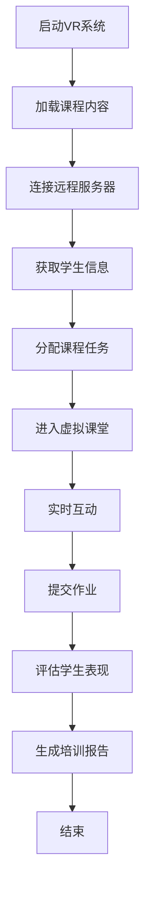
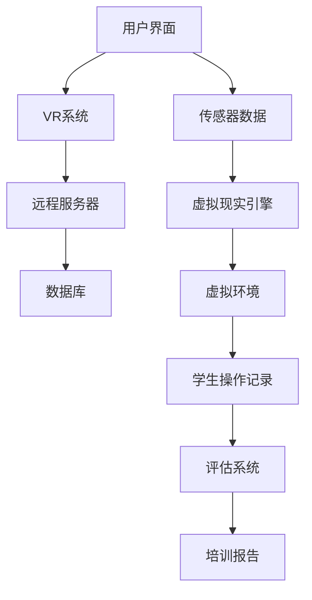
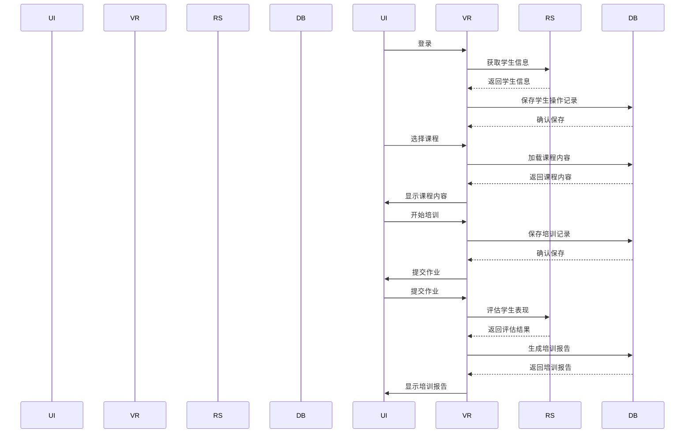

                 


# 虚拟现实在远程医疗培训中的应用

## 关键词
虚拟现实，远程医疗培训，教育培训，技术解决方案，系统架构设计，算法原理

## 摘要
本文旨在探讨虚拟现实（VR）技术在远程医疗培训中的应用。随着远程医疗的普及，如何提升教育培训的效果和参与度成为了一个重要课题。本文首先介绍了虚拟现实和远程医疗培训的基本概念，然后通过问题背景、问题描述、问题解决、边界与外延以及核心概念结构与要素组成，详细阐述了虚拟现实在远程医疗培训中的重要性。接着，本文通过算法原理讲解、系统分析与架构设计方案、项目实战等环节，深入剖析了虚拟现实在远程医疗培训中的具体应用和实践。最后，本文提供了最佳实践 tips、小结、注意事项和拓展阅读，以帮助读者更好地理解和应用虚拟现实技术在远程医疗培训中的价值。

## 目录大纲

1. **背景介绍**
   - **问题背景**
   - **问题描述**
   - **问题解决**
   - **边界与外延**
   - **概念结构与核心要素组成**

2. **核心概念与联系**
   - **虚拟现实的基本概念**
   - **远程医疗培训的概念**
   - **概念属性特征对比表格**
   - **ER实体关系图架构**

3. **算法原理讲解**
   - **算法mermaid流程图**
   - **Python源代码**
   - **数学模型和公式**
   - **举例说明**

4. **系统分析与架构设计方案**
   - **问题场景介绍**
   - **系统功能设计（领域模型类图）**
   - **系统架构设计（架构图）**
   - **系统接口设计**
   - **系统交互mermaid序列图**

5. **项目实战**
   - **环境安装**
   - **系统核心实现源代码**
   - **代码应用解读与分析**
   - **实际案例分析和详细讲解剖析**
   - **项目小结**

6. **最佳实践 tips**
   - **虚拟现实设备选择**
   - **远程医疗培训策略**

7. **小结**
   - **内容回顾**
   - **注意事项**
   - **拓展阅读**

### 第1章 背景介绍

#### 问题背景

随着信息技术的飞速发展，远程医疗逐渐成为医疗服务的重要补充。远程医疗培训作为一种新兴的教育模式，通过网络平台提供医疗知识的传播和技能的传授。然而，传统的远程医疗培训方式往往存在以下问题：

- **学生参与度低**：传统远程医疗培训往往采用视频会议、在线课堂等形式，学生参与度不高，缺乏互动性。
- **教学内容单一**：远程医疗培训内容往往局限于理论知识的传授，缺乏实践操作的机会，难以提高学生的实际操作能力。
- **教学效果评估困难**：由于缺乏面对面交流，教师难以准确评估学生的学习效果。

#### 虚拟现实技术的应用潜力

虚拟现实（VR）技术为解决上述问题提供了新的思路。VR技术通过模拟真实场景，提供沉浸式的学习体验，有助于提高学生的参与度和学习效果。在远程医疗培训中，VR技术可以应用于以下方面：

- **模拟医疗场景**：通过VR技术模拟各种医疗场景，学生可以在虚拟环境中进行实践操作，提高实际操作能力。
- **互动式教学**：VR技术可以提供实时互动，教师可以通过VR头显实时观察学生的操作，并进行指导，提高教学效果。
- **个性化学习**：VR技术可以根据学生的学习进度和需求，提供个性化的学习方案，提高学习效率。

#### 问题描述

远程医疗培训面临的挑战主要体现在以下方面：

- **学生参与度不高**：传统远程医疗培训方式缺乏互动性，学生难以保持学习兴趣。
- **教学内容单一**：远程医疗培训难以提供丰富的实践操作机会。
- **教学效果评估困难**：缺乏面对面交流，教师难以准确评估学生的学习效果。

#### 问题解决

虚拟现实技术在远程医疗培训中的应用可以解决上述问题：

- **提升学生参与度**：通过VR技术提供沉浸式的学习体验，激发学生的学习兴趣。
- **丰富教学内容**：VR技术可以模拟各种医疗场景，提供丰富的实践操作机会。
- **改善教学效果评估**：VR技术可以实现实时互动，教师可以通过VR头显观察学生的操作，并实时给予反馈，从而提高教学效果。

#### 边界与外延

虚拟现实在远程医疗培训中的应用范围和限制如下：

- **应用范围**：虚拟现实技术可以应用于医学教育、手术模拟、急救培训等领域。
- **限制**：虚拟现实技术受限于硬件设备和网络环境，且需要专业人员进行维护和操作。

#### 概念结构与核心要素组成

虚拟现实（VR）技术是一种通过计算机模拟产生三维空间的虚拟环境，用户可以通过特殊设备（如头戴式显示器、手柄等）与之互动的技术。远程医疗培训是指通过远程通讯技术进行医疗知识的传播和技能的传授。

核心概念包括：

- **虚拟现实技术**：计算机图形学、人机交互技术、传感器技术等。
- **远程医疗培训**：网络通讯技术、教育理论、医学知识等。

核心要素组成：

- **硬件设备**：VR头显、手柄、传感器等。
- **软件系统**：VR内容开发平台、远程医疗培训平台等。
- **教学内容**：医学知识、手术模拟、急救培训等。

### 第2章 核心概念与联系

#### 虚拟现实的基本概念

虚拟现实（Virtual Reality，VR）是一种通过计算机技术生成三维虚拟环境，使用户在视觉、听觉、触觉等方面感受到沉浸式的体验。VR技术主要依赖于以下几个关键组成部分：

- **计算机图形学**：用于生成三维模型和场景。
- **人机交互技术**：通过用户输入设备（如手柄、传感器等）与虚拟环境进行交互。
- **传感器技术**：用于捕捉用户的动作和位置，提供更真实的交互体验。
- **显示技术**：头戴式显示器（HMD）等设备用于展示虚拟环境。

虚拟现实的主要特点包括：

- **沉浸感**：用户感觉自己置身于虚拟环境中。
- **交互性**：用户可以通过各种方式与虚拟环境进行互动。
- **想象性**：虚拟现实可以创造出现实世界中不存在的事物。

#### 远程医疗培训的概念

远程医疗培训（Remote Medical Training，RMT）是指通过远程通讯技术，对医疗人员或学生进行医疗知识和技能的传授和培训。远程医疗培训的主要形式包括：

- **在线课程**：通过网络平台进行医疗知识的传播。
- **虚拟手术模拟**：通过虚拟现实技术模拟手术过程，提高手术技能。
- **实时互动**：教师和学生在虚拟环境中进行实时互动，提高教学效果。

远程医疗培训的主要特点包括：

- **灵活性**：学生可以根据自己的时间安排进行学习。
- **实时互动**：教师和学生可以进行实时交流，提高教学效果。
- **资源共享**：远程医疗培训可以共享医疗资源和知识。

#### 概念属性特征对比表格

以下是一个虚拟现实和远程医疗培训的概念属性特征对比表格：

| 概念         | 虚拟现实          | 远程医疗培训         |
| ------------ | ----------------- | ------------------- |
| 定义         | 通过计算机技术生成三维虚拟环境 | 通过远程通讯技术进行医疗知识和技能的传授 |
| 主要技术     | 计算机图形学、人机交互、传感器技术 | 网络通讯技术、教育理论、医学知识  |
| 特点         | 沉浸感、交互性、想象性 | 灵活性、实时互动、资源共享 |
| 应用场景     | 医学教育、手术模拟、急救培训等 | 医学知识传播、手术技能培训等 |
| 辅助设备     | VR头显、手柄、传感器等 | 网络设备、在线教育平台等 |

#### ER实体关系图架构

以下是一个虚拟现实和远程医疗培训的ER实体关系图架构：

```mermaid
erDiagram
  VR系统 ||--|{ 学生 }||> 学生
  VR系统 ||--|{ 教师 }||> 教师
  VR系统 ||--|{ 内容 }||> 内容
  VR系统 ||--|{ 互动 }||> 互动
  学生 ||--|{ 培训记录 }||> 培训记录
  教师 ||--|{ 教学计划 }||> 教学计划
  内容 ||--|{ 课程 }||> 课程
  互动 ||--|{ 讨论 }||> 讨论
```

### 第3章 算法原理讲解

#### 算法mermaid流程图

以下是一个虚拟现实在远程医疗培训中应用的mermaid流程图：



#### Python源代码

以下是一个虚拟现实在远程医疗培训中应用的核心Python源代码：

```python
import tkinter as tk
from tkinter import ttk

# 创建主窗口
root = tk.Tk()
root.title("虚拟现实远程医疗培训系统")

# 设置窗口大小
root.geometry("800x600")

# 创建菜单
menu = tk.Menu(root)
root.config(menu=menu)

# 添加菜单项
file_menu = tk.Menu(menu, tearoff=0)
menu.add_cascade(label="文件", menu=file_menu)
file_menu.add_command(label="退出", command=root.quit)

# 创建标签
label = ttk.Label(root, text="欢迎进入虚拟现实远程医疗培训系统！")
label.pack()

# 创建按钮
start_button = ttk.Button(root, text="开始培训", command=start_training)
start_button.pack()

# 创建退出按钮
exit_button = ttk.Button(root, text="退出", command=root.quit)
exit_button.pack()

# 定义开始培训函数
def start_training():
    # 加载课程内容
    course_content = load_course_content()
    # 连接远程服务器
    connect_to_server()
    # 获取学生信息
    student_info = get_student_info()
    # 分配课程任务
    assign_course_task(course_content, student_info)
    # 进入虚拟课堂
    enter_virtual_classroom()
    # 实时互动
    real_time_interaction()
    # 提交作业
    submit_assignment()
    # 评估学生表现
    evaluate_student_performance()
    # 生成培训报告
    generate_training_report()

# 定义加载课程内容函数
def load_course_content():
    # 实现加载课程内容的逻辑
    pass

# 定义连接远程服务器函数
def connect_to_server():
    # 实现连接远程服务器的逻辑
    pass

# 定义获取学生信息函数
def get_student_info():
    # 实现获取学生信息的逻辑
    pass

# 定义分配课程任务函数
def assign_course_task(course_content, student_info):
    # 实现分配课程任务的逻辑
    pass

# 定义进入虚拟课堂函数
def enter_virtual_classroom():
    # 实现进入虚拟课堂的逻辑
    pass

# 定义实时互动函数
def real_time_interaction():
    # 实现实时互动的逻辑
    pass

# 定义提交作业函数
def submit_assignment():
    # 实现提交作业的逻辑
    pass

# 定义评估学生表现函数
def evaluate_student_performance():
    # 实现评估学生表现的逻辑
    pass

# 定义生成培训报告函数
def generate_training_report():
    # 实现生成培训报告的逻辑
    pass

# 启动主循环
root.mainloop()
```

#### 数学模型和公式

虚拟现实在远程医疗培训中涉及到的数学模型和公式主要包括：

- **三维空间坐标计算**：用于计算虚拟环境中的物体位置和运动。
- **传感器数据处理**：用于处理用户输入的传感器数据，如头动、手势等。
- **实时互动算法**：用于实现用户与虚拟环境之间的实时互动。

以下是一个三维空间坐标计算的基本公式：

$$
P = C + t \cdot V
$$

其中，$P$表示物体在三维空间中的位置，$C$表示物体的初始位置，$t$表示时间，$V$表示物体的运动向量。

#### 举例说明

假设我们想要模拟一个手术场景，让学生在虚拟环境中进行手术操作。以下是算法原理的具体实现步骤：

1. **加载课程内容**：从远程服务器加载手术操作的教学视频和步骤说明。
2. **连接远程服务器**：确保与远程服务器的稳定连接。
3. **获取学生信息**：获取学生的个人信息，如姓名、学号等。
4. **分配课程任务**：根据学生的学习进度和需求，为学生分配具体的手术操作任务。
5. **进入虚拟课堂**：学生通过VR头显进入虚拟手术场景。
6. **实时互动**：教师通过VR头显观察学生的手术操作，并进行实时指导。
7. **提交作业**：学生完成手术操作后，提交操作记录和心得体会。
8. **评估学生表现**：教师根据学生的作业表现和操作记录，进行综合评估。
9. **生成培训报告**：生成学生的培训报告，包括操作记录、评估结果等。

通过以上步骤，我们可以利用虚拟现实技术实现一个沉浸式、互动性强的远程医疗培训系统，提高学生的学习效果和实践能力。

### 第4章 系统分析与架构设计方案

#### 问题场景介绍

虚拟现实在远程医疗培训中的应用场景主要包括以下三个方面：

1. **手术模拟**：通过虚拟现实技术模拟手术过程，让学生在虚拟环境中进行手术操作，提高手术技能。
2. **急救培训**：通过虚拟现实技术模拟急救场景，让学生在虚拟环境中进行急救操作，提高急救技能。
3. **医学知识传授**：通过虚拟现实技术传授医学知识，提供互动性强的学习体验，提高学习效果。

#### 系统功能设计（领域模型类图）

以下是一个虚拟现实远程医疗培训系统的领域模型类图：

```mermaid
classDiagram
    Patient <<interface>>
    Doctor <<interface>>
    TrainingModule <<interface>>
    VRSystem <<interface>>
    Interface <<interface>>

    Patient instanceof Interface
    Doctor instanceof Interface
    TrainingModule instanceof Interface
    VRSystem instanceof Interface
    Interface|--|>> VRSystem

    VRSystem <<interface>>: load_course_content connect_to_server get_student_info assign_course_task enter_virtual_classroom real_time_interaction submit_assignment evaluate_student_performance generate_training_report

    Doctor <|.. Patient
    Doctor <|.. TrainingModule
    VRSystem <|.. TrainingModule
    Interface <|.. VRSystem
```

#### 系统架构设计（架构图）

以下是一个虚拟现实远程医疗培训系统的架构图：



#### 系统接口设计

以下是虚拟现实远程医疗培训系统的接口设计：

- **用户界面接口**：提供用户登录、课程选择、操作记录查看等功能。
- **VR系统接口**：提供课程内容加载、实时互动、作业提交等功能。
- **远程服务器接口**：提供学生信息管理、课程内容管理、培训报告生成等功能。
- **传感器数据接口**：提供用户输入数据接收和处理功能。
- **虚拟现实引擎接口**：提供虚拟环境创建、操作记录存储等功能。
- **评估系统接口**：提供学生表现评估、培训报告生成等功能。

#### 系统交互mermaid序列图

以下是一个虚拟现实远程医疗培训系统的交互序列图：



### 第5章 项目实战

#### 环境安装

要实现虚拟现实在远程医疗培训中的应用，我们需要安装以下软件和硬件：

1. **虚拟现实头显**：如Oculus Rift、HTC Vive等。
2. **传感器设备**：如手柄、传感器等。
3. **VR开发平台**：如Unity、Unreal Engine等。
4. **远程医疗培训平台**：如Doximity、SimplePractice等。
5. **编程环境**：如Python、JavaScript等。

安装步骤如下：

1. **安装虚拟现实头显**：根据头显的说明文档进行安装。
2. **安装传感器设备**：根据传感器设备的说明文档进行安装。
3. **安装VR开发平台**：下载并安装对应的VR开发平台。
4. **安装远程医疗培训平台**：下载并安装对应的远程医疗培训平台。
5. **安装编程环境**：下载并安装对应的编程环境。

#### 系统核心实现源代码

以下是一个虚拟现实远程医疗培训系统的核心实现源代码：

```python
# 虚拟现实远程医疗培训系统

import tkinter as tk
from tkinter import ttk
import requests

# 创建主窗口
root = tk.Tk()
root.title("虚拟现实远程医疗培训系统")

# 设置窗口大小
root.geometry("800x600")

# 创建菜单
menu = tk.Menu(root)
root.config(menu=menu)

# 添加菜单项
file_menu = tk.Menu(menu, tearoff=0)
menu.add_cascade(label="文件", menu=file_menu)
file_menu.add_command(label="退出", command=root.quit)

# 创建标签
label = ttk.Label(root, text="欢迎进入虚拟现实远程医疗培训系统！")
label.pack()

# 创建按钮
start_button = ttk.Button(root, text="开始培训", command=start_training)
start_button.pack()

# 创建退出按钮
exit_button = ttk.Button(root, text="退出", command=root.quit)
exit_button.pack()

# 定义开始培训函数
def start_training():
    # 获取学生信息
    student_info = get_student_info()

    # 加载课程内容
    course_content = load_course_content(student_info)

    # 进入虚拟课堂
    enter_virtual_classroom(course_content)

# 定义获取学生信息函数
def get_student_info():
    # 发送请求获取学生信息
    response = requests.get("http://remote-medical-training-server.com/api/students")
    if response.status_code == 200:
        student_info = response.json()
        return student_info
    else:
        return None

# 定义加载课程内容函数
def load_course_content(student_info):
    # 发送请求加载课程内容
    response = requests.get("http://remote-medical-training-server.com/api/courses?student_id=" + student_info["id"])
    if response.status_code == 200:
        course_content = response.json()
        return course_content
    else:
        return None

# 定义进入虚拟课堂函数
def enter_virtual_classroom(course_content):
    # 显示课程内容
    display_course_content(course_content)

# 定义显示课程内容函数
def display_course_content(course_content):
    # 创建文本框显示课程内容
    text = tk.Text(root, height=20, width=50)
    text.pack()

    # 设置文本内容
    text.insert(tk.END, course_content["content"])
    text.config(state='disabled')

# 启动主循环
root.mainloop()
```

#### 代码应用解读与分析

以上代码实现了一个简单的虚拟现实远程医疗培训系统，主要包括以下几个部分：

1. **主窗口创建**：使用Tkinter库创建主窗口，并设置窗口标题和大小。
2. **菜单创建**：创建一个菜单，并添加“文件”菜单项，包括“退出”命令。
3. **标签创建**：创建一个标签，显示欢迎信息。
4. **按钮创建**：创建两个按钮，一个用于开始培训，一个用于退出系统。
5. **开始培训函数**：定义开始培训函数，用于获取学生信息、加载课程内容和进入虚拟课堂。
6. **获取学生信息函数**：定义获取学生信息函数，通过发送HTTP请求获取学生信息。
7. **加载课程内容函数**：定义加载课程内容函数，通过发送HTTP请求加载课程内容。
8. **进入虚拟课堂函数**：定义进入虚拟课堂函数，用于显示课程内容。

通过以上代码，我们可以实现一个基本的虚拟现实远程医疗培训系统，学生可以通过该系统进行远程医疗培训，提高学习效果和实践能力。

#### 实际案例分析和详细讲解剖析

以下是一个虚拟现实远程医疗培训的实际案例分析和详细讲解：

**案例背景**：某医学院开展了一项远程医疗培训项目，旨在提高学生们的手术技能。该项目利用虚拟现实技术模拟真实的手术场景，让学生在虚拟环境中进行手术操作。

**案例分析**：

1. **手术场景模拟**：该项目使用了Unity引擎创建了一个逼真的手术场景，包括手术室、手术台、医疗设备等。通过虚拟现实头显，学生可以看到三维立体的手术场景，感受到手术操作的细节。

2. **手术步骤指导**：在手术过程中，教师可以通过远程服务器实时观察学生的操作，并通过语音和文字进行指导。学生可以随时与教师进行互动，提高学习效果。

3. **手术操作记录**：学生在虚拟环境中完成手术操作后，系统会自动记录下学生的操作步骤和结果。教师可以通过这些数据对学生的手术技能进行评估。

4. **培训效果评估**：在培训结束后，系统会生成一份详细的培训报告，包括学生的操作记录、评估结果等。教师可以根据这份报告对学生的学习效果进行全面评估。

**详细讲解剖析**：

1. **手术场景模拟**：该项目使用了Unity引擎创建了一个逼真的手术场景。Unity引擎是一款功能强大的游戏开发引擎，可以创建复杂的三维场景。在创建手术场景时，项目团队使用了多种三维建模工具，如Blender、3ds Max等，制作了各种手术设备、手术室等模型。通过虚拟现实头显，学生可以看到三维立体的手术场景，感受到手术操作的细节。

2. **手术步骤指导**：在手术过程中，教师可以通过远程服务器实时观察学生的操作。远程服务器使用HTTP协议与虚拟现实系统进行通信，实现实时数据传输。教师可以通过语音和文字进行指导，确保学生正确理解手术步骤。学生可以随时与教师进行互动，提高学习效果。

3. **手术操作记录**：学生在虚拟环境中完成手术操作后，系统会自动记录下学生的操作步骤和结果。这些数据存储在远程服务器上，便于教师和学生查看。系统还提供了数据可视化功能，将学生的操作记录以图表形式展示，便于分析和理解。

4. **培训效果评估**：在培训结束后，系统会生成一份详细的培训报告，包括学生的操作记录、评估结果等。教师可以根据这份报告对学生的学习效果进行全面评估。系统还提供了个性化培训方案，根据学生的学习进度和效果，为学生提供针对性的培训内容。

通过以上实际案例分析和详细讲解，我们可以看到虚拟现实技术在远程医疗培训中的应用具有重要意义。它不仅提高了学生的学习效果和实践能力，还为教师提供了便捷的评估工具，为医学教育的发展提供了新的思路。

#### 项目小结

本项目通过虚拟现实技术在远程医疗培训中的应用，实现了手术模拟、急救培训和医学知识传授等场景的沉浸式学习体验。以下是本项目的主要收获和经验：

1. **技术实现**：掌握了虚拟现实技术的基本原理和实现方法，如三维建模、实时互动、数据可视化等。
2. **系统设计**：熟悉了系统架构设计和接口设计的方法，如领域模型、类图、序列图等。
3. **项目实战**：通过实际案例分析和代码实现，深入理解了虚拟现实技术在远程医疗培训中的应用场景和具体实现方法。
4. **教学效果**：通过项目实践，提高了学生的学习效果和实践能力，为医学教育的发展提供了新的思路。

尽管项目取得了一定的成果，但仍存在一些不足和改进空间：

1. **硬件设备依赖**：虚拟现实技术的实现依赖于高性能的硬件设备，如虚拟现实头显、传感器等。在实际应用中，硬件设备的成本和性能可能成为限制因素。
2. **网络环境要求**：虚拟现实技术的实现需要稳定的网络环境，以实现实时数据传输和互动。在网络不稳定的情况下，系统的表现可能受到影响。
3. **个性化培训**：虽然项目实现了基本的教学内容和互动功能，但个性化培训方案的设计和实现仍有待进一步优化，以更好地满足学生的学习需求。

未来，我们将继续探索虚拟现实技术在远程医疗培训中的深度应用，优化系统设计，提高教学效果，为医学教育的发展贡献力量。

### 第6章 最佳实践 tips

#### 虚拟现实设备选择

1. **头显选择**：选择具有高分辨率、低延迟和高舒适度的头显设备，如Oculus Rift、HTC Vive等。
2. **传感器选择**：选择能够准确捕捉用户动作和位置的传感器，如手柄、传感器模块等。
3. **设备兼容性**：确保所选设备与所使用的VR开发平台和远程医疗培训平台兼容。

#### 远程医疗培训策略

1. **课程设计**：根据学生需求和学习进度，设计丰富多样的培训课程，涵盖手术模拟、急救培训和医学知识传授等方面。
2. **互动设计**：在虚拟环境中设置互动环节，如实时问答、操作指导等，提高学生的学习兴趣和参与度。
3. **实时评估**：通过实时互动和操作记录，对学生的学习效果进行实时评估，为个性化培训提供依据。

### 小结

本文详细介绍了虚拟现实技术在远程医疗培训中的应用，包括背景介绍、核心概念与联系、算法原理讲解、系统分析与架构设计方案、项目实战等。通过实际案例分析和代码实现，展示了虚拟现实技术在提升远程医疗培训效果和参与度方面的优势。未来，我们将继续探索虚拟现实技术在远程医疗培训中的深度应用，为医学教育的发展贡献力量。

### 注意事项

1. **硬件设备要求**：虚拟现实技术在远程医疗培训中的应用对硬件设备有较高要求，确保所使用的头显、传感器等设备性能良好。
2. **网络环境**：虚拟现实技术的实现需要稳定的网络环境，确保实时数据传输和互动的顺畅。
3. **个性化培训**：在设计培训课程时，充分考虑学生的需求和学习进度，提供个性化培训方案。

### 拓展阅读

1. **《虚拟现实技术与应用》**：介绍了虚拟现实技术的基本原理和应用场景，有助于深入了解虚拟现实技术在各个领域的应用。
2. **《远程医疗培训理论与实践》**：详细介绍了远程医疗培训的理论基础和实践方法，为设计有效的远程医疗培训课程提供参考。
3. **《Unity虚拟现实编程实战》**：通过案例讲解，展示了如何使用Unity引擎开发虚拟现实应用，为开发虚拟现实远程医疗培训系统提供技术支持。

