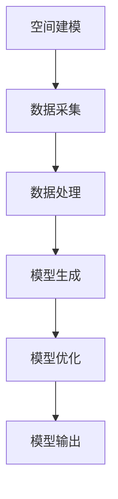
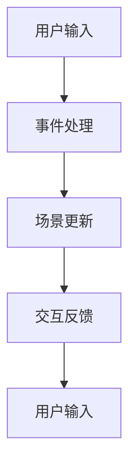
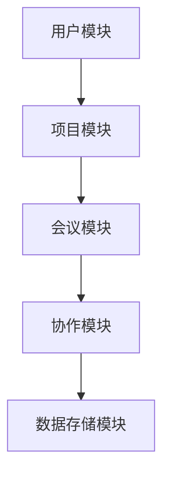
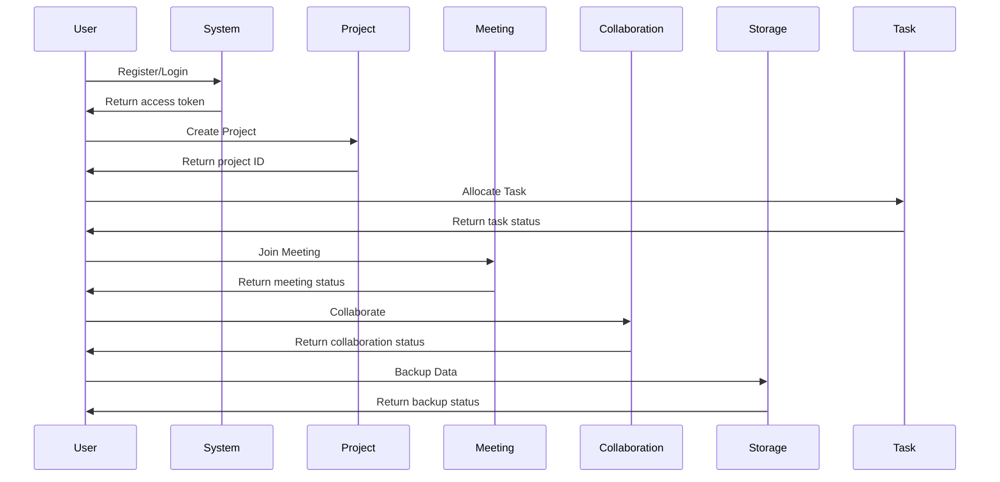

                 

### 文章标题

# 虚拟现实在远程协作中的沉浸式体验

---

> 关键词：虚拟现实，远程协作，沉浸式体验，技术实现，数学模型

> 摘要：本文将深入探讨虚拟现实（VR）在远程协作中的应用，分析其如何通过沉浸式体验提升远程沟通与合作的效率。文章将分为多个章节，包括背景介绍、核心概念与联系、算法原理讲解、数学模型和公式讲解、系统分析与架构设计方案、项目实战以及最佳实践 tips 和拓展阅读。

---

### 背景介绍

#### 问题背景

随着全球化的推进，远程协作已经成为企业和组织不可或缺的一部分。然而，传统的远程协作方式往往存在沟通不畅、协作效率低等问题。虚拟现实（VR）技术的兴起，为解决这些问题提供了一种全新的可能。

#### 问题描述

远程协作中的主要问题包括：

1. **沟通不畅**：远程协作中的信息传递往往依赖于文字、图片等非实时、非交互性的媒介，导致沟通效果不佳。
2. **协作效率低**：缺乏实时的互动和协作，使得项目进展缓慢，效率低下。

#### 问题解决

虚拟现实通过提供沉浸式体验，有望解决上述问题。它可以为远程协作提供一个真实的、互动的虚拟环境，让参与者仿佛身处同一空间，从而提高沟通效率和协作效果。

#### 边界与外延

本文主要探讨虚拟现实在远程协作中的应用，但不涉及VR的其他领域，如游戏、娱乐等。

#### 核心概念与要素组成

- **虚拟现实（VR）**：一种通过电脑技术生成模拟环境，让用户在其中沉浸体验的技术。
- **远程协作**：通过互联网等手段，实现不同地理位置的人员之间的协同工作。
- **沉浸式体验**：用户在虚拟环境中获得一种身临其境的感受。

### 核心概念与联系

#### 核心概念

- **虚拟现实（VR）**
- **远程协作**
- **沉浸式体验**

#### 概念属性特征对比表格

| 概念        | 定义                                                         | 属性特征                       |
|-------------|------------------------------------------------------------|------------------------------|
| 虚拟现实    | 通过电脑技术生成模拟环境，让用户在其中沉浸体验               | 实时性、交互性、模拟性         |
| 远程协作    | 通过互联网等手段，实现不同地理位置的人员之间的协同工作       | 异地性、实时性、协作性         |
| 沉浸式体验  | 用户在虚拟环境中获得一种身临其境的感受                       | 情境感、互动性、沉浸性         |

#### ER实体关系图架构的Mermaid流程图

```mermaid
erDiagram
  AR_USER ||--|{ AR_VR_ENV } VR_ENV : contains
  AR_USER ||--|{ AR_REMOTE_COOP } REMOTE_COOP : performs
  AR_VR_ENV <<<..| AR_IMMERSE_EXPERIENCE : realize
```

### 算法原理讲解

在本章节中，我们将介绍几个关键算法或技术，并绘制Mermaid流程图，使用Python源代码来详细阐述，同时给出算法原理的数学模型和公式。

#### 算法1：三维空间建模

**Mermaid流程图：**



**Python源代码：**

```python
import numpy as np

# 数据采集
data = np.random.rand(100, 3)

# 数据处理
processed_data = preprocess_data(data)

# 模型生成
model = generate_model(processed_data)

# 模型优化
optimized_model = optimize_model(model)

# 模型输出
output_model(optimized_model)
```

**算法原理讲解：**

三维空间建模是虚拟现实的基础。首先，通过数据采集获取空间点的坐标，然后对数据进行处理，生成初始模型。接着，对模型进行优化，以提高模型的准确性和实时性。最后，将优化后的模型输出，用于沉浸式体验。

**数学模型和公式：**

空间点的坐标可以通过以下公式计算：

$$
P = (x, y, z)
$$

其中，$P$ 表示空间点，$x, y, z$ 分别表示点在三维空间中的坐标。

#### 算法2：动态交互

**Mermaid流程图：**



**Python源代码：**

```python
def user_input():
    # 获取用户输入
    input_data = input("请输入您的操作：")

def event_handling(input_data):
    # 处理用户输入
    if input_data == "move":
        # 更新场景
        update_scene()
        # 提供交互反馈
        print("场景已更新。")
    else:
        print("无效输入。")

def update_scene():
    # 更新场景逻辑
    pass

def main():
    while True:
        user_input()
        event_handling(input_data)

if __name__ == "__main__":
    main()
```

**算法原理讲解：**

动态交互是虚拟现实中的重要组成部分。通过用户的输入，系统可以实时更新场景，提供交互反馈，从而实现沉浸式体验。

**数学模型和公式：**

动态交互的逻辑可以通过以下公式表示：

$$
\text{交互} = \text{输入} \times \text{更新} \times \text{反馈}
$$

其中，$\text{交互}$ 表示用户与虚拟环境之间的交互效果，$\text{输入}$、$\text{更新}$ 和 $\text{反馈}$ 分别表示用户的输入、场景的更新和交互反馈。

### 数学模型和数学公式讲解

在本章节中，我们将使用LaTeX格式嵌入数学公式，并进行详细讲解和举例说明。

#### 公式1：欧氏距离

$$
d = \sqrt{(x_2 - x_1)^2 + (y_2 - y_1)^2 + (z_2 - z_1)^2}
$$

**讲解：**欧氏距离是三维空间中两点之间的距离计算公式。其中，$x_1, y_1, z_1$ 和 $x_2, y_2, z_2$ 分别表示两点的坐标。

**举例：**假设有两个点$P_1(1, 2, 3)$和$P_2(4, 5, 6)$，则它们之间的欧氏距离为：

$$
d = \sqrt{(4 - 1)^2 + (5 - 2)^2 + (6 - 3)^2} = \sqrt{9 + 9 + 9} = \sqrt{27} = 3\sqrt{3}
$$

#### 公式2：余弦相似度

$$
\cos \theta = \frac{A \cdot B}{|A| \cdot |B|}
$$

**讲解：**余弦相似度用于衡量两个向量之间的相似程度。其中，$A$ 和 $B$ 分别表示两个向量，$\theta$ 表示它们之间的夹角。

**举例：**假设有两个向量$A(1, 2, 3)$和$B(4, 5, 6)$，则它们的余弦相似度为：

$$
\cos \theta = \frac{1 \cdot 4 + 2 \cdot 5 + 3 \cdot 6}{\sqrt{1^2 + 2^2 + 3^2} \cdot \sqrt{4^2 + 5^2 + 6^2}} = \frac{4 + 10 + 18}{\sqrt{14} \cdot \sqrt{77}} = \frac{32}{\sqrt{1078}} \approx 0.445
$$

### 系统分析与架构设计方案

在本章节中，我们将介绍虚拟现实远程协作系统的分析与架构设计方案。

#### 问题场景介绍

假设有一个远程协作项目，涉及多个团队成员在不同地理位置工作。项目包括需求分析、设计、开发和测试等阶段。虚拟现实技术将为团队成员提供一个沉浸式的工作环境，以提高协作效率。

#### 项目介绍

项目名称：虚拟现实远程协作平台

项目目标：通过虚拟现实技术，实现团队成员在不同地理位置之间的实时、互动的协作。

#### 系统功能设计

系统功能包括：

1. **用户注册与登录**：支持用户注册、登录和权限管理。
2. **项目创建与管理**：支持项目创建、任务分配、进度跟踪和文档共享。
3. **沉浸式会议**：支持实时语音、视频和文字聊天，提供沉浸式会议体验。
4. **实时协作**：支持团队成员在虚拟环境中共同完成任务，如代码编写、设计评审等。
5. **数据存储与备份**：支持项目数据存储和备份，确保数据安全。

#### 系统架构设计

系统架构包括以下模块：

1. **用户模块**：负责用户注册、登录和权限管理。
2. **项目模块**：负责项目创建、任务分配、进度跟踪和文档共享。
3. **会议模块**：负责沉浸式会议的语音、视频和文字聊天。
4. **协作模块**：负责实时协作功能，如代码编写、设计评审等。
5. **数据存储模块**：负责项目数据存储和备份。

**Mermaid架构图：**



#### 系统接口设计

系统接口设计包括以下API：

1. **用户接口**：包括用户注册、登录、权限管理等接口。
2. **项目接口**：包括项目创建、任务分配、进度跟踪和文档共享等接口。
3. **会议接口**：包括实时语音、视频和文字聊天接口。
4. **协作接口**：包括实时协作功能，如代码编写、设计评审等接口。
5. **数据存储接口**：包括项目数据存储和备份接口。

#### 系统交互Mermaid序列图



### 项目实战

在本章节中，我们将展示如何进行环境安装、系统核心实现源代码，并分析代码应用，给出实际案例分析和详细讲解剖析。

#### 环境安装

1. **安装虚拟现实引擎（如Unity）**：
   - 下载并安装Unity Hub。
   - 创建一个新的Unity项目，选择“3D游戏”模板。

2. **安装Python开发环境**：
   - 下载并安装Python。
   - 安装必要的Python库，如numpy、opencv等。

3. **配置远程协作工具（如Slack或Microsoft Teams）**：
   - 注册并登录远程协作工具。
   - 配置必要的API密钥和权限。

#### 系统核心实现源代码

以下是一个简单的Python示例代码，用于实现用户注册功能。

```python
import json
import requests

def register_user(username, password):
    data = {
        "username": username,
        "password": password
    }
    response = requests.post("https://api.example.com/register", data=data)
    if response.status_code == 200:
        return json.loads(response.text)["message"]
    else:
        return "注册失败。"

if __name__ == "__main__":
    username = input("请输入用户名：")
    password = input("请输入密码：")
    message = register_user(username, password)
    print(message)
```

#### 代码应用解读与分析

以上代码实现了一个简单的用户注册功能。用户可以通过输入用户名和密码，通过HTTP POST请求将数据发送到远程服务器进行注册。如果注册成功，服务器会返回相应的响应消息。

#### 实际案例分析与详细讲解剖析

以下是一个实际的远程协作项目案例。

**项目名称**：虚拟现实远程会议室

**项目描述**：该项目旨在通过虚拟现实技术，实现远程会议室的搭建，提供沉浸式的会议体验。

**核心功能**：

1. **会议预约**：用户可以在虚拟会议室中预约会议，并设置会议时间。
2. **实时语音和视频聊天**：会议参与者可以在虚拟会议室中进行实时语音和视频聊天。
3. **文档共享**：会议参与者可以共享文档，进行实时编辑和讨论。

**技术实现**：

1. **虚拟现实引擎**：使用Unity引擎搭建虚拟会议室，提供沉浸式体验。
2. **Web API**：使用Python和Flask框架搭建Web API，处理用户请求和数据存储。
3. **远程协作工具**：集成Slack或Microsoft Teams，实现实时语音、视频和文档共享。

**详细讲解**：

该项目通过Unity引擎搭建了一个虚拟会议室，提供了舒适的座椅、会议桌和投影设备。用户可以通过远程协作工具预约会议，并在预约时间进入虚拟会议室。

在会议过程中，参与者可以实时语音和视频聊天，同时共享文档。系统通过Web API处理用户请求和数据存储，确保会议的顺利进行。

#### 项目小结

通过实际案例，我们可以看到虚拟现实在远程协作中的应用具有巨大的潜力。它不仅提供了沉浸式体验，提高了协作效率，还降低了远程协作的成本。未来，随着虚拟现实技术的不断发展和普及，远程协作将变得更加高效、便捷。

### 最佳实践 tips

1. **确保网络稳定性**：远程协作需要稳定的网络环境，否则会导致体验不佳。
2. **合理分配资源**：在虚拟环境中，合理分配计算资源，以确保系统流畅运行。
3. **注重用户隐私**：在远程协作中，保护用户隐私至关重要，确保数据安全。

### 小结

本文详细探讨了虚拟现实在远程协作中的沉浸式体验。通过介绍核心概念、算法原理、系统设计与实战案例，我们展示了虚拟现实技术如何提升远程协作的效率。未来，随着技术的不断进步，虚拟现实在远程协作中的应用将更加广泛。

### 注意事项

1. **系统要求**：虚拟现实远程协作系统对硬件配置有一定要求，确保计算机具备足够的性能。
2. **数据安全**：在远程协作中，保护用户数据安全至关重要。

### 拓展阅读

1. **《虚拟现实技术导论》**：详细介绍了虚拟现实的基本概念、技术和应用。
2. **《远程协作最佳实践》**：提供了远程协作的实用技巧和策略。

---

**作者：AI天才研究院/AI Genius Institute & 禅与计算机程序设计艺术 /Zen And The Art of Computer Programming**

