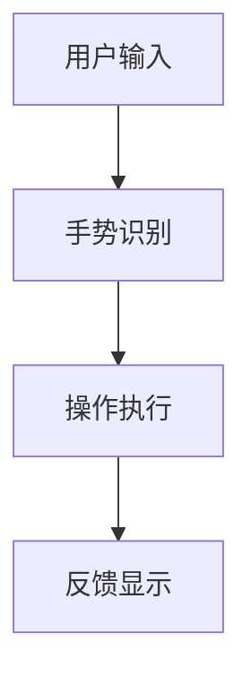
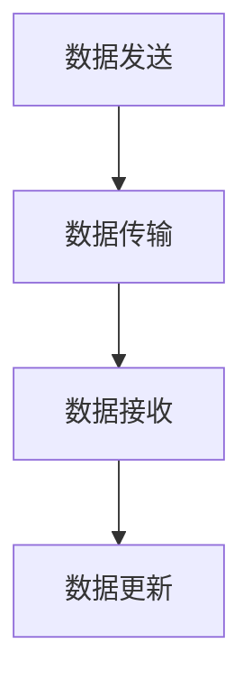
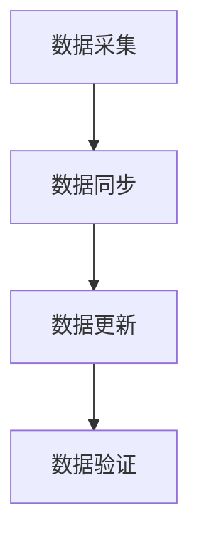
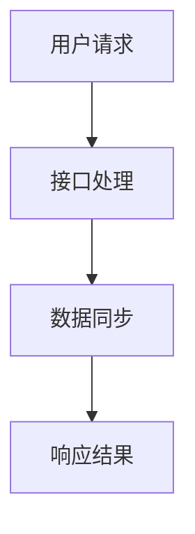

                 

### 《虚拟现实在远程协作办公中的创新应用》

#### **关键词：**

- **虚拟现实（VR）**
- **远程协作办公**
- **沉浸式体验**
- **人机交互**
- **协作平台**

#### **摘要：**

本文旨在探讨虚拟现实技术在远程协作办公领域的创新应用。随着远程办公的普及，如何在虚拟环境中实现高效、互动的团队协作成为亟待解决的问题。本文首先介绍了虚拟现实和远程协作办公的基本概念和背景，随后详细分析了虚拟现实在远程协作办公中的应用场景和关键技术。通过具体的算法原理讲解、系统架构设计和项目实战案例，本文为读者提供了一个全面、深入的虚拟现实远程协作办公解决方案。

## 第一部分：虚拟现实与远程协作办公概述

### 第1章：虚拟现实技术基础

#### 1.1 虚拟现实的定义与历史发展

虚拟现实（Virtual Reality，简称VR）是一种通过计算机技术创建的模拟环境，使用户在视觉、听觉和触觉等方面感受到沉浸式的体验。VR技术的发展可以追溯到20世纪60年代的美国，当时的科学家们开始探索如何使用计算机技术模拟现实世界。

1968年，美国计算机科学家伊凡·苏瑟兰（Ivan Sutherland）发明了第一个头戴式显示器（Head-Mounted Display，HMD），这被认为是虚拟现实技术的开端。随着计算机技术和显示技术的不断发展，VR技术逐渐成熟，并在游戏、娱乐、教育培训等领域得到广泛应用。

#### 1.2 虚拟现实的关键技术

虚拟现实技术包括以下几个方面：

1. **显示技术**：显示技术是VR的核心，主要包括头戴式显示器（HMD）、立体投影等。高分辨率的显示器可以提供更清晰的视觉体验，减少视觉疲劳。

2. **传感器技术**：传感器技术用于捕捉用户的动作和位置，常见的传感器包括头部跟踪器、手部跟踪器和全身跟踪器等。这些传感器可以实时跟踪用户的动作，使虚拟环境与用户动作同步。

3. **交互技术**：交互技术是用户与虚拟环境之间的桥梁，主要包括手势识别、语音识别等。通过这些技术，用户可以更自然地与虚拟环境进行交互。

4. **音效技术**：音效技术在VR中扮演着重要角色，通过头戴式耳机等设备，用户可以感受到来自虚拟环境的立体声效，增强沉浸感。

#### 1.3 虚拟现实的应用领域

虚拟现实技术在多个领域得到广泛应用：

1. **游戏和娱乐**：VR游戏是虚拟现实技术最早的应用领域之一，用户可以在虚拟环境中体验游戏乐趣。

2. **教育培训**：虚拟现实技术可以模拟各种场景，提供沉浸式的教学体验，提高学习效果。

3. **设计建模**：虚拟现实技术在建筑设计、工业设计等领域有广泛的应用，设计师可以在虚拟环境中进行设计和修改。

4. **医疗健康**：虚拟现实技术可以用于医疗手术模拟、心理治疗等领域，提供更加安全、有效的解决方案。

#### 1.4 虚拟现实的优势与挑战

虚拟现实技术具有以下优势：

1. **沉浸式体验**：虚拟现实技术可以提供身临其境的体验，使用户在虚拟环境中感受到更加真实的存在感。

2. **交互性**：虚拟现实技术支持用户与虚拟环境的互动，用户可以更加自然地控制虚拟世界。

3. **跨领域应用**：虚拟现实技术具有广泛的应用前景，可以应用于游戏、娱乐、教育、医疗等多个领域。

然而，虚拟现实技术也面临着一些挑战：

1. **硬件成本**：高分辨率的显示器、传感器等硬件设备成本较高，限制了虚拟现实技术的普及。

2. **技术成熟度**：虽然虚拟现实技术已经取得了一定的进展，但仍然需要进一步优化和改进。

3. **隐私和安全**：虚拟环境中的数据安全和用户隐私保护是虚拟现实技术面临的重要问题。

### 第2章：远程协作办公的背景与需求

#### 2.1 远程协作办公的现状

随着互联网技术的快速发展，远程协作办公已经成为现代企业的一种常见工作方式。根据统计，全球约有30%的员工已经采用远程办公模式。远程协作办公不仅提高了工作效率，还降低了企业的运营成本。

然而，远程协作办公也面临着一些挑战。首先，团队成员之间缺乏面对面的沟通，容易导致信息传递不畅。其次，远程协作办公需要高效的工具和平台来支持团队协作。此外，远程协作办公还要求员工具备良好的自我管理能力和沟通技巧。

#### 2.2 远程协作办公的挑战与问题

远程协作办公的挑战和问题主要包括：

1. **沟通不畅**：缺乏面对面的沟通容易导致误解和冲突，影响团队协作效率。

2. **工作边界模糊**：远程办公使得工作时间和生活时间的界限变得模糊，可能导致员工过度劳累。

3. **工具选择困难**：市场上存在大量的远程协作工具，企业需要选择适合自身需求的工具。

4. **数据安全和隐私保护**：远程协作涉及大量的敏感数据，需要确保数据的安全和隐私。

#### 2.3 虚拟现实在远程协作办公中的应用前景

虚拟现实技术在远程协作办公中具有广泛的应用前景：

1. **沉浸式会议**：通过虚拟现实技术，团队成员可以在虚拟会议室中召开会议，实现面对面的交流。

2. **虚拟办公环境**：虚拟现实技术可以创建一个模拟的办公环境，员工可以在虚拟环境中办公，提高工作效率。

3. **虚拟培训**：虚拟现实技术可以模拟各种培训场景，提供沉浸式的培训体验。

4. **虚拟团队协作**：虚拟现实技术支持团队成员在虚拟环境中进行协作，提高团队协作效率。

### 第3章：虚拟现实在远程协作办公中的应用场景

#### 3.1 虚拟会议室

虚拟会议室是虚拟现实在远程协作办公中最直接的应用场景之一。通过虚拟现实技术，团队成员可以在虚拟会议室中召开会议，实现面对面的交流。虚拟会议室具有以下优点：

1. **沉浸式体验**：虚拟会议室提供了沉浸式的会议体验，使团队成员感觉仿佛置身于同一个房间。

2. **灵活便捷**：虚拟会议室不受地理位置限制，团队成员可以随时随地参加会议。

3. **互动性强**：虚拟会议室支持团队成员之间的互动，如手势、表情等。

#### 3.2 虚拟培训与教育

虚拟现实技术在教育培训领域具有广泛的应用。通过虚拟现实技术，可以创建一个模拟的培训环境，使学员能够身临其境地学习。虚拟培训与教育的优点包括：

1. **沉浸式学习体验**：虚拟现实技术提供了沉浸式的学习体验，有助于提高学习效果。

2. **场景模拟**：虚拟现实技术可以模拟各种场景，使学员能够在真实环境中学习。

3. **互动性强**：虚拟培训支持学员之间的互动，提高学习互动性。

#### 3.3 虚拟团队协作

虚拟现实技术支持团队成员在虚拟环境中进行协作。虚拟团队协作的优点包括：

1. **空间灵活性**：虚拟团队协作不受地理位置限制，团队成员可以在不同的地方进行协作。

2. **高效沟通**：虚拟现实技术提供了高效、直观的沟通方式，有助于提高团队协作效率。

3. **协作可视化**：虚拟团队协作可以将团队成员的工作过程和进展可视化，提高协作透明度。

#### 3.4 虚拟客户支持与服务

虚拟现实技术在客户支持与服务领域也有广泛应用。通过虚拟现实技术，企业可以创建一个模拟的客户支持环境，提供沉浸式的客户服务。虚拟客户支持与服务的优点包括：

1. **沉浸式服务体验**：虚拟现实技术提供了沉浸式的服务体验，使客户感觉仿佛与实际工作人员面对面交流。

2. **高效响应**：虚拟现实技术支持快速响应客户需求，提高客户满意度。

3. **成本效益**：虚拟客户支持与服务降低了企业的运营成本，提高工作效率。

## 第二部分：虚拟现实在远程协作办公中的技术实现

### 第4章：虚拟现实硬件与软件配置

#### 4.1 虚拟现实硬件设备

虚拟现实硬件设备是实现虚拟现实体验的关键组成部分。以下是一些常见的虚拟现实硬件设备：

1. **头戴式显示器（HMD）**：头戴式显示器是虚拟现实的核心设备，它将用户沉浸在虚拟环境中。常见的HMD包括Oculus Rift、HTC Vive和Valve Index等。

2. **跟踪设备**：跟踪设备用于捕捉用户的动作和位置，包括头部跟踪器、手部跟踪器和全身跟踪器等。这些设备可以实时跟踪用户的动作，使虚拟环境与用户动作同步。

3. **输入设备**：输入设备包括控制器、键盘、鼠标等，用于用户与虚拟环境的交互。

4. **音响设备**：音响设备用于提供虚拟现实环境中的音效，增强沉浸感。常见的音响设备包括头戴式耳机、环绕声系统等。

#### 4.2 虚拟现实软件平台

虚拟现实软件平台是虚拟现实应用的开发和运行环境。以下是一些常见的虚拟现实软件平台：

1. **Unity**：Unity是一个强大的游戏和虚拟现实开发平台，支持跨平台开发，具有丰富的开发工具和资源。

2. **Unreal Engine**：Unreal Engine是一个高性能的虚拟现实游戏和虚拟现实开发引擎，支持实时渲染和物理模拟。

3. **Blender**：Blender是一个开源的虚拟现实软件，支持3D建模、动画和渲染，适合独立开发者和小型团队。

#### 4.3 硬件与软件的集成与配置

虚拟现实硬件与软件的集成与配置是一个复杂的过程，需要考虑以下几个方面：

1. **硬件兼容性**：确保所选硬件设备与虚拟现实软件平台兼容，以避免兼容性问题。

2. **系统配置**：根据虚拟现实软件的要求，配置合适的计算机硬件，包括CPU、GPU、内存等。

3. **驱动程序安装**：安装相应的硬件驱动程序，确保硬件设备能够正常工作。

4. **软件配置**：根据项目需求，配置虚拟现实软件，包括场景设置、交互逻辑等。

### 第5章：虚拟现实场景设计

#### 5.1 场景设计与规划

虚拟现实场景设计是虚拟现实应用开发的重要环节。以下是一些场景设计与规划的步骤：

1. **需求分析**：分析虚拟现实应用的需求，确定场景的功能、交互方式和用户体验。

2. **场景建模**：使用3D建模软件创建场景模型，包括建筑物、家具、装饰等。

3. **材质与光照**：为场景模型添加材质和光照效果，增强场景的真实感。

4. **交互设计**：设计场景中的交互元素，如按钮、菜单等，使用户能够与场景进行互动。

5. **场景布局**：根据用户需求，合理安排场景布局，提高用户体验。

#### 5.2 空间布局与设计原则

虚拟现实场景的空间布局需要考虑以下几个方面：

1. **用户体验**：确保用户在虚拟环境中有舒适的空间体验，避免空间拥挤或过于空旷。

2. **功能分区**：根据场景的功能需求，合理安排各个功能区域，提高空间利用效率。

3. **路径规划**：设计合理的路径规划，使用户能够方便地到达各个区域。

4. **视觉效果**：注重场景的视觉效果，提高用户的视觉体验。

#### 5.3 虚拟现实交互设计

虚拟现实交互设计是用户与虚拟环境之间的桥梁，以下是一些虚拟现实交互设计的原则：

1. **直观性**：交互设计应直观易懂，使用户能够快速上手。

2. **一致性**：保持交互元素的一致性，减少用户的学习成本。

3. **反馈**：为用户的操作提供及时的反馈，增强用户的交互体验。

4. **易用性**：优化交互流程，提高交互效率。

### 第6章：虚拟现实远程协作算法

#### 6.1 虚拟现实远程协作算法概述

虚拟现实远程协作算法是虚拟现实远程协作应用的核心，负责实现用户在虚拟环境中的协作和互动。以下是一些常见的虚拟现实远程协作算法：

1. **人机交互算法**：人机交互算法用于实现用户与虚拟环境之间的交互，包括手势识别、语音识别等。

2. **通信算法**：通信算法用于实现虚拟环境中的数据传输和通信，包括实时视频传输、音频传输等。

3. **数据同步与更新算法**：数据同步与更新算法用于确保虚拟环境中各个用户的数据一致性和实时性。

#### 6.2 人机交互算法

人机交互算法是虚拟现实远程协作算法的重要组成部分，以下是一个简单的人机交互算法的Mermaid流程图：



具体实现如下：

```python
# 示例：使用手势控制虚拟物体移动
def gesture_control(object, gesture):
    if gesture == "left":
        object.position += Vector3(-1, 0, 0)
    elif gesture == "right":
        object.position += Vector3(1, 0, 0)
    # 更多的手势处理逻辑
    return object
```

#### 6.3 通信算法

通信算法用于实现虚拟环境中的数据传输和通信，以下是一个简单的通信算法的Mermaid流程图：



具体实现如下：

```python
# 示例：实时视频传输
def video_stream(sender, receiver):
    while True:
        frame = sender.capture_frame()
        receiver.send_frame(frame)
        time.sleep(0.01)
```

#### 6.4 数据同步与更新算法

数据同步与更新算法用于确保虚拟环境中各个用户的数据一致性和实时性，以下是一个简单的数据同步与更新算法的Mermaid流程图：



具体实现如下：

```python
# 示例：位置同步
def sync_positions(agents):
    for agent in agents:
        agent.position = server.get_position(agent.id)
```

### 第7章：虚拟现实远程协作系统架构

#### 7.1 系统架构设计与组件

虚拟现实远程协作系统架构设计需要考虑以下几个方面：

1. **前端架构**：前端架构负责虚拟环境的渲染和交互，常用的前端架构有单页面应用（SPA）和前后端分离架构。

2. **后端架构**：后端架构负责处理数据同步、通信和存储等，常用的后端架构有微服务架构和分布式架构。

3. **数据库设计**：数据库设计用于存储用户数据、场景数据和通信数据等。

4. **安全架构**：安全架构用于确保系统的安全性和数据隐私。

#### 7.2 系统接口设计与实现

系统接口设计是实现系统各组件之间通信和协作的关键，以下是一个简单的系统接口设计的Mermaid流程图：



具体实现如下：

```python
# 示例：用户登录接口
def login(username, password):
    user = server.get_user(username)
    if user and user.password == password:
        return "登录成功"
    else:
        return "登录失败"
```

#### 7.3 系统安全与隐私保护

系统安全与隐私保护是虚拟现实远程协作系统设计的重要环节，以下是一些安全与隐私保护的措施：

1. **数据加密**：对敏感数据进行加密，确保数据传输的安全性。

2. **身份认证**：使用身份认证机制，确保用户身份的合法性。

3. **访问控制**：设置访问控制策略，确保系统资源的访问权限。

4. **日志审计**：记录系统操作日志，便于追踪和审计。

#### 7.4 系统性能优化

系统性能优化是提高虚拟现实远程协作系统用户体验的重要手段，以下是一些性能优化的方法：

1. **异步处理**：使用异步处理技术，减少线程阻塞，提高系统并发处理能力。

2. **缓存机制**：使用缓存机制，减少数据库查询次数，提高数据访问速度。

3. **负载均衡**：使用负载均衡技术，均衡系统负载，提高系统稳定性。

4. **代码优化**：优化系统代码，减少资源消耗，提高系统运行效率。

## 第三部分：虚拟现实在远程协作办公中的最佳实践

### 第8章：虚拟现实远程协作办公案例分析

#### 8.1 案例一：虚拟会议室实践

**项目介绍**：

虚拟会议室项目旨在为远程团队提供一种高效的会议解决方案。通过虚拟现实技术，团队成员可以在虚拟会议室中召开会议，实现面对面的交流。

**系统功能设计**：

1. **会议预约**：用户可以预约会议时间和参会人员。
2. **虚拟会议室创建**：系统根据预约信息创建虚拟会议室。
3. **实时视频与音频传输**：支持实时视频和音频传输，确保会议质量。
4. **手势与表情互动**：用户可以通过手势和表情进行互动。
5. **会议记录与回放**：记录会议过程，支持会议回放。

**系统架构设计**：

1. **前端架构**：使用Vue.js实现单页面应用，提供用户界面。
2. **后端架构**：使用Spring Boot实现后端服务，处理数据同步和通信。
3. **数据库设计**：使用MySQL存储用户数据、会议数据和通信数据。
4. **安全架构**：使用OAuth2.0进行身份认证和访问控制。

**系统接口设计**：

1. **用户登录接口**：用于用户登录。
2. **会议预约接口**：用于预约会议。
3. **虚拟会议室创建接口**：用于创建虚拟会议室。
4. **视频与音频传输接口**：用于实时视频和音频传输。

**系统交互设计**：

1. **用户界面设计**：提供直观、易用的用户界面。
2. **交互逻辑设计**：使用Mermaid流程图描述用户与系统之间的交互逻辑。

**实际案例分析与详细讲解剖析**：

虚拟会议室项目在实际应用中取得了良好的效果。通过虚拟现实技术，团队成员可以在虚拟会议室中召开会议，实现面对面的交流，提高了会议效率。同时，项目采用了安全架构和接口设计，确保了系统的安全性和可靠性。

**项目小结**：

虚拟会议室项目展示了虚拟现实技术在远程协作办公中的潜力。通过虚拟现实技术，企业可以提供高效、互动的远程协作解决方案，提高团队协作效率。

#### 8.2 案例二：虚拟培训与教育应用

**项目介绍**：

虚拟培训与教育应用项目旨在为企业和学校提供一种沉浸式的培训和教育解决方案。通过虚拟现实技术，用户可以在虚拟环境中进行学习和培训。

**系统功能设计**：

1. **课程预约**：用户可以预约课程和学习时间。
2. **虚拟课堂创建**：系统根据预约信息创建虚拟课堂。
3. **实时互动**：支持实时视频、音频和文字互动。
4. **场景模拟**：提供各种模拟场景，用于实践操作。
5. **学习记录与评价**：记录用户学习过程，提供评价和建议。

**系统架构设计**：

1. **前端架构**：使用React实现单页面应用，提供用户界面。
2. **后端架构**：使用Spring Boot实现后端服务，处理数据同步和通信。
3. **数据库设计**：使用MySQL存储用户数据、课程数据和通信数据。
4. **安全架构**：使用OAuth2.0进行身份认证和访问控制。

**系统接口设计**：

1. **用户登录接口**：用于用户登录。
2. **课程预约接口**：用于预约课程。
3. **虚拟课堂创建接口**：用于创建虚拟课堂。
4. **实时互动接口**：用于实时视频、音频和文字互动。

**系统交互设计**：

1. **用户界面设计**：提供直观、易用的用户界面。
2. **交互逻辑设计**：使用Mermaid流程图描述用户与系统之间的交互逻辑。

**实际案例分析与详细讲解剖析**：

虚拟培训与教育应用项目在企业和学校中取得了良好的应用效果。通过虚拟现实技术，用户可以在虚拟环境中进行学习和培训，提高了学习效果。同时，项目采用了安全架构和接口设计，确保了系统的安全性和可靠性。

**项目小结**：

虚拟培训与教育应用项目展示了虚拟现实技术在教育培训领域的应用潜力。通过虚拟现实技术，企业可以提供沉浸式的培训和教育解决方案，提高学习效果。

#### 8.3 案例三：虚拟团队协作实践

**项目介绍**：

虚拟团队协作项目旨在为远程团队提供一种高效的协作解决方案。通过虚拟现实技术，团队成员可以在虚拟环境中进行协作。

**系统功能设计**：

1. **任务管理**：支持任务创建、分配和跟踪。
2. **文档共享**：支持文档上传、下载和编辑。
3. **实时沟通**：支持实时视频、音频和文字沟通。
4. **虚拟会议室**：支持虚拟会议室创建和会议召开。
5. **进度跟踪**：实时跟踪项目进度，提供进度报告。

**系统架构设计**：

1. **前端架构**：使用Vue.js实现单页面应用，提供用户界面。
2. **后端架构**：使用Spring Boot实现后端服务，处理数据同步和通信。
3. **数据库设计**：使用MySQL存储用户数据、任务数据和文档数据。
4. **安全架构**：使用OAuth2.0进行身份认证和访问控制。

**系统接口设计**：

1. **用户登录接口**：用于用户登录。
2. **任务管理接口**：用于任务创建、分配和跟踪。
3. **文档共享接口**：用于文档上传、下载和编辑。
4. **实时沟通接口**：用于实时视频、音频和文字沟通。
5. **虚拟会议室接口**：用于虚拟会议室创建和会议召开。

**系统交互设计**：

1. **用户界面设计**：提供直观、易用的用户界面。
2. **交互逻辑设计**：使用Mermaid流程图描述用户与系统之间的交互逻辑。

**实际案例分析与详细讲解剖析**：

虚拟团队协作项目在实际应用中取得了良好的效果。通过虚拟现实技术，团队成员可以在虚拟环境中进行高效协作，提高了团队协作效率。同时，项目采用了安全架构和接口设计，确保了系统的安全性和可靠性。

**项目小结**：

虚拟团队协作项目展示了虚拟现实技术在团队协作领域的应用潜力。通过虚拟现实技术，企业可以提供高效的协作解决方案，提高团队协作效率。

#### 8.4 案例四：虚拟客户支持与服务案例分析

**项目介绍**：

虚拟客户支持与服务项目旨在为用户提供一种高效的客户服务解决方案。通过虚拟现实技术，企业可以在虚拟环境中提供客户支持和服务。

**系统功能设计**：

1. **客户服务预约**：用户可以预约客户服务时间。
2. **虚拟客服中心创建**：系统根据预约信息创建虚拟客服中心。
3. **实时互动**：支持实时视频、音频和文字互动。
4. **问题跟踪**：实时跟踪用户问题，提供解决方案。
5. **客户满意度调查**：提供客户满意度调查，优化服务。

**系统架构设计**：

1. **前端架构**：使用React实现单页面应用，提供用户界面。
2. **后端架构**：使用Spring Boot实现后端服务，处理数据同步和通信。
3. **数据库设计**：使用MySQL存储用户数据、问题数据和客户满意度数据。
4. **安全架构**：使用OAuth2.0进行身份认证和访问控制。

**系统接口设计**：

1. **用户登录接口**：用于用户登录。
2. **客户服务预约接口**：用于预约客户服务。
3. **虚拟客服中心创建接口**：用于创建虚拟客服中心。
4. **实时互动接口**：用于实时视频、音频和文字互动。
5. **问题跟踪接口**：用于跟踪用户问题。

**系统交互设计**：

1. **用户界面设计**：提供直观、易用的用户界面。
2. **交互逻辑设计**：使用Mermaid流程图描述用户与系统之间的交互逻辑。

**实际案例分析与详细讲解剖析**：

虚拟客户支持与服务项目在实际应用中取得了良好的效果。通过虚拟现实技术，企业可以在虚拟环境中提供高效、互动的客户支持和服务，提高了客户满意度。同时，项目采用了安全架构和接口设计，确保了系统的安全性和可靠性。

**项目小结**：

虚拟客户支持与服务项目展示了虚拟现实技术在客户支持与服务领域的应用潜力。通过虚拟现实技术，企业可以提供高效的客户服务解决方案，提高客户满意度。

### 第9章：虚拟现实远程协作办公最佳实践

#### 9.1 成功经验与启示

虚拟现实远程协作办公的最佳实践可以从以下案例中获得启示：

1. **注重用户体验**：成功项目普遍注重用户体验，提供直观、易用的界面和交互设计。
2. **确保系统安全性**：成功项目采用安全架构和身份认证机制，确保系统的安全性和数据隐私。
3. **优化系统性能**：成功项目采用异步处理、缓存机制和负载均衡等技术，提高系统的性能和稳定性。
4. **持续迭代与优化**：成功项目持续关注用户反馈，不断进行迭代和优化，提高用户体验和系统性能。

#### 9.2 潜在挑战与应对策略

虚拟现实远程协作办公面临以下潜在挑战：

1. **硬件成本**：高分辨率的显示器、传感器等硬件设备成本较高，限制了虚拟现实技术的普及。应对策略是推广普及，降低硬件成本，同时提供租赁和共享方案。
2. **技术成熟度**：虚拟现实技术仍处于发展阶段，需要进一步优化和改进。应对策略是持续关注技术进展，积极引进和采用新技术。
3. **数据安全和隐私保护**：虚拟环境中的数据安全和用户隐私保护是重要问题。应对策略是采用数据加密、身份认证和访问控制等技术，确保数据安全和用户隐私。

#### 9.3 未来发展趋势与展望

虚拟现实远程协作办公的未来发展趋势包括：

1. **技术成熟与普及**：随着技术的不断发展和成熟，虚拟现实远程协作办公将得到更广泛的应用。
2. **个性化与定制化**：虚拟现实远程协作办公将根据用户需求提供个性化的解决方案，满足不同场景和需求。
3. **智能化与自动化**：虚拟现实远程协作办公将逐渐引入人工智能和自动化技术，提高工作效率和用户体验。
4. **跨界融合**：虚拟现实远程协作办公将与更多领域进行跨界融合，如虚拟现实购物、虚拟旅游等，提供更丰富的应用场景。

### 第10章：小结与拓展阅读

#### 10.1 全书总结

本文全面探讨了虚拟现实在远程协作办公领域的创新应用。首先介绍了虚拟现实和远程协作办公的基本概念和背景，随后详细分析了虚拟现实在远程协作办公中的应用场景和技术实现。通过具体的算法原理讲解、系统架构设计和项目实战案例，本文为读者提供了一个全面、深入的虚拟现实远程协作办公解决方案。

#### 10.2 虚拟现实在远程协作办公中的发展趋势

虚拟现实在远程协作办公中的发展趋势包括：

1. **技术成熟与普及**：随着虚拟现实技术的不断发展和成熟，虚拟现实远程协作办公将得到更广泛的应用。
2. **个性化与定制化**：虚拟现实远程协作办公将根据用户需求提供个性化的解决方案，满足不同场景和需求。
3. **智能化与自动化**：虚拟现实远程协作办公将逐渐引入人工智能和自动化技术，提高工作效率和用户体验。
4. **跨界融合**：虚拟现实远程协作办公将与更多领域进行跨界融合，如虚拟现实购物、虚拟旅游等，提供更丰富的应用场景。

#### 10.3 拓展阅读建议

对于希望深入了解虚拟现实在远程协作办公领域的读者，以下是一些拓展阅读建议：

1. **虚拟现实技术基础**：《虚拟现实技术导论》
2. **远程协作办公最佳实践**：《远程协作：打造高效远程团队》
3. **人工智能在虚拟现实中的应用**：《人工智能：一种现代方法》
4. **虚拟现实与远程协作办公案例研究**：《虚拟现实与远程协作办公案例集》

作者：AI天才研究院/AI Genius Institute & 禅与计算机程序设计艺术 /Zen And The Art of Computer Programming

-------------------------------------------------------------------

## 附录：相关术语解释

在本技术博客中，我们使用了以下专业术语：

### **虚拟现实（VR）**

虚拟现实（Virtual Reality，简称VR）是一种通过计算机技术创造的模拟环境，让用户在视觉、听觉和触觉等方面感受到沉浸式的体验。它利用计算机生成一个模拟的三维环境，用户可以通过头戴式显示器（HMD）、手柄和其他传感器设备与这个环境进行互动。

### **远程协作办公**

远程协作办公是指团队成员在不同地理位置通过互联网和其他通信技术协同工作。这种方式允许员工在家中、咖啡店或其他地点工作，而无需每天到办公室。

### **沉浸式体验**

沉浸式体验是指用户在虚拟环境中完全沉浸在当前任务中，感觉自己置身于现实世界的替代环境中。这种体验通常通过高分辨率显示器、立体声和触觉反馈来实现。

### **人机交互（HCI）**

人机交互（Human-Computer Interaction，简称HCI）是指研究人类与计算机系统交互的过程，包括设计、评估和实现交互界面，以确保用户能够高效、舒适地使用计算机。

### **实时通信**

实时通信是指在数据传输过程中，发送方和接收方几乎同时交换信息。这在虚拟现实远程协作中非常重要，以确保所有参与者能够同步地进行交流。

### **算法**

算法是一系列定义明确的规则或步骤，用于解决特定问题。在虚拟现实远程协作中，算法用于处理数据同步、图像渲染和用户交互等任务。

### **系统架构**

系统架构是指系统的整体结构和组件之间的关系，包括硬件、软件和网络配置。在虚拟现实远程协作中，系统架构决定了系统如何实现功能以及如何处理数据流。

### **最佳实践**

最佳实践是指业界公认的、有效的做法，用于解决特定问题或实现特定目标。在虚拟现实远程协作中，最佳实践提供了设计、实施和优化系统的指导。

### **用户体验（UX）**

用户体验（User Experience，简称UX）是指用户在使用产品或服务时的一系列感受和反应。在虚拟现实远程协作中，用户体验包括界面设计、交互流畅度和功能易用性。

### **数据同步与更新算法**

数据同步与更新算法用于确保远程协作中各个用户的数据一致性。这些算法负责处理数据传输、存储和更新，以保持虚拟环境的实时性。

### **安全性**

安全性是指在虚拟现实远程协作中保护数据和用户隐私的措施。这包括数据加密、身份验证和访问控制等技术。

通过这些术语的解释，我们希望读者能够更好地理解虚拟现实在远程协作办公中的应用和实现细节。如果您对任何术语有进一步的问题，欢迎在评论区提出。

