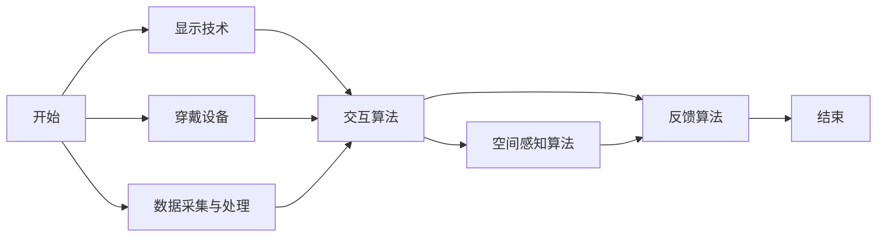

                 


# 虚拟现实在远程协作设计中的应用

> 关键词：虚拟现实，远程协作设计，交互算法，空间感知，系统架构

> 摘要：本文探讨了虚拟现实技术在远程协作设计中的应用。通过分析虚拟现实的基本原理、核心组成部分以及与远程协作设计的相关性，我们深入探讨了虚拟现实在远程协作设计中的挑战和机遇。本文将一步步介绍虚拟现实在远程协作设计中的算法原理，系统架构设计，以及实际项目中的应用，为读者提供全面的了解和指导。

## Step 1: 引入与背景介绍

### 1.1 问题背景

远程协作设计在现代工业和建筑设计领域中变得越来越普遍。随着全球化的推进和数字化技术的普及，设计师和工程师们经常需要在不同地点协同工作。然而，远程协作设计面临着诸多挑战：

1. **沟通障碍**：由于地理和时间的限制，团队成员之间的沟通往往不够顺畅，容易导致误解和协调问题。
2. **数据共享**：在设计过程中，需要实时共享大量的设计数据和文件，这往往需要复杂的数据传输和处理。
3. **协作效率**：远程协作往往降低了团队的协作效率，因为团队成员难以在同一个虚拟环境中进行实时互动。

### 1.2 虚拟现实技术的兴起

虚拟现实（VR）技术的迅速发展，为解决远程协作设计的挑战提供了一种全新的解决方案。VR技术通过模拟三维虚拟环境，使用户能够沉浸在计算机生成的虚拟世界中进行互动和操作。以下是一些关键的VR技术：

1. **显示技术**：包括头戴式显示器（HMD）和大型投影屏幕，用于提供沉浸式的视觉体验。
2. **穿戴设备**：如手柄、手套和智能眼镜，用于感知用户动作并提供交互。
3. **数据采集与处理**：通过传感器和摄像头等设备，实时采集环境数据并进行处理，以创建逼真的虚拟环境。

### 1.3 虚拟现实在远程协作设计中的应用场景

虚拟现实在远程协作设计中具有广泛的应用场景：

1. **设计评审**：通过VR技术，设计师和客户可以在虚拟环境中实时评审设计方案，减少沟通成本和误解。
2. **设计修改**：设计师可以在VR环境中快速尝试不同的设计修改，以便更好地与团队成员和客户沟通。
3. **设计讨论**：虚拟会议室和协作平台使得团队成员能够在一个共享的虚拟环境中进行实时讨论，提高协作效率。

## Step 2: 核心概念与联系

### 2.1 虚拟现实的基本原理

虚拟现实是一种通过计算机技术模拟的三维虚拟环境，使用户能够在这个环境中进行沉浸式互动。虚拟现实的三要素包括：

1. **感知**：通过视觉、听觉和触觉等感官，用户感知虚拟环境的存在。
2. **交互**：用户通过手柄、手套或其他交互设备与虚拟环境进行交互。
3. **反馈**：系统根据用户的交互行为，实时更新虚拟环境，并提供相应的反馈。

### 2.2 虚拟现实技术的核心组成部分

虚拟现实技术的核心组成部分包括：

1. **显示技术**：包括头戴式显示器（HMD）和大型投影屏幕，用于提供沉浸式的视觉体验。
2. **穿戴设备**：如手柄、手套和智能眼镜，用于感知用户动作并提供交互。
3. **数据采集与处理**：通过传感器和摄像头等设备，实时采集环境数据并进行处理，以创建逼真的虚拟环境。

### 2.3 虚拟现实与远程协作设计的相关性

虚拟现实技术在远程协作设计中的优势包括：

1. **沉浸式体验**：通过虚拟现实技术，团队成员能够在一个共享的虚拟环境中进行实时互动，提高协作效率。
2. **实时反馈**：虚拟现实技术能够实时更新设计数据和文件，减少沟通障碍和误解。
3. **灵活的协作模式**：虚拟现实技术使得团队成员可以在任何地点进行协作，不受地理和时间的限制。

## Step 3: 算法原理讲解

### 3.1 交互算法

交互算法是虚拟现实技术中至关重要的一部分，它决定了用户如何与虚拟环境进行交互。以下是一些关键的交互算法：

1. **手势识别**：通过计算机视觉技术，识别用户的手势并进行相应的操作。
2. **声音交互**：通过语音识别技术，将用户的语音命令转换为计算机操作。
3. **眼动追踪**：通过眼动传感器，追踪用户的视线，用于优化虚拟环境的交互。

### 3.2 空间感知算法

空间感知算法用于创建逼真的虚拟环境，并确保用户在虚拟环境中的运动和交互是自然的。以下是一些关键的空间感知算法：

1. **三维建模**：通过计算机图形学技术，创建三维模型和场景。
2. **空间定位**：通过传感器和算法，实时跟踪用户在虚拟环境中的位置和方向。
3. **物理仿真**：通过物理引擎，模拟虚拟环境中的物理现象，如重力、碰撞等。

### 3.3 虚拟现实算法的mermaid流程图



### 3.4 算法原理详细讲解与Python源代码实现

#### 算法原理

虚拟现实算法的核心是交互算法和空间感知算法。交互算法决定了用户如何与虚拟环境进行交互，而空间感知算法则用于创建逼真的虚拟环境。

#### Python源代码实现

```python
import cv2
import numpy as np

# 交互算法
def gesture_recognition(image):
    # 进行手势识别
    # ...
    return gesture

# 空间感知算法
def spatial_perception(image):
    # 进行三维建模和空间定位
    # ...
    return position

# 主函数
def main():
    # 读取图像
    image = cv2.imread('image.jpg')

    # 手势识别
    gesture = gesture_recognition(image)

    # 空间感知
    position = spatial_perception(image)

    # 输出结果
    print(f"Gesture: {gesture}, Position: {position}")

# 调用主函数
main()
```

## Step 4: 系统分析与架构设计方案

### 4.1 项目介绍

本项目旨在开发一个虚拟现实远程协作设计系统，以解决远程协作设计中的挑战。项目背景包括：

- 设计团队分布在不同的地理位置。
- 需要实时共享设计数据和文件。
- 需要高效的设计评审和修改流程。

项目目标包括：

- 提供一个沉浸式的虚拟环境，便于团队成员进行协作。
- 实现实时数据共享和交互。
- 提高设计评审和修改的效率。

### 4.2 系统功能设计

系统功能设计主要包括：

1. **设计评审**：提供虚拟环境，便于团队成员和客户进行设计评审。
2. **设计修改**：支持设计修改和实时协作。
3. **设计讨论**：提供虚拟会议室，便于团队成员进行实时讨论。

领域模型类图如下：

```mermaid
classDiagram
    Design评审 <<Interface>>
    Design修改 <<Interface>>
    Design讨论 <<Interface>>

    Design评审 --|> 设计师
    Design修改 --|> 设计师
    Design讨论 --|> 设计师
```

### 4.3 系统架构设计

系统架构设计主要包括：

1. **前端**：提供用户界面，包括设计评审、设计修改和设计讨论等功能。
2. **后端**：负责处理数据存储、数据共享和交互逻辑。
3. **虚拟环境**：提供虚拟现实环境，支持用户交互和协作。

系统架构图如下：

```mermaid
sequenceDiagram
    participant 用户
    participant 前端
    participant 后端
    participant 虚拟环境

    用户 -->|请求|> 前端
    前端 -->|处理|> 后端
    后端 -->|响应|> 前端
    前端 -->|反馈|> 用户

    用户 -->|请求|> 虚拟环境
    虚拟环境 -->|响应|> 用户
```

### 4.4 系统接口设计

系统接口设计主要包括：

1. **API接口**：提供设计评审、设计修改和设计讨论的API接口，便于前端和后端进行数据交互。
2. **数据接口**：提供设计数据的上传、下载和共享接口，便于团队成员进行数据交换。

接口交互图如下：

```mermaid
sequenceDiagram
    participant 用户
    participant API接口
    participant 数据接口

    用户 -->|请求|> API接口
    API接口 -->|处理|> 后端
    后端 -->|响应|> API接口
    API接口 -->|反馈|> 用户

    用户 -->|请求|> 数据接口
    数据接口 -->|处理|> 后端
    后端 -->|响应|> 数据接口
    数据接口 -->|反馈|> 用户
```

### 4.5 系统交互mermaid序列图

```mermaid
sequenceDiagram
    participant 用户
    participant 前端
    participant 后端
    participant 虚拟环境

    用户 -->|请求|> 前端
    前端 -->|处理|> 后端
    后端 -->|响应|> 前端
    前端 -->|反馈|> 用户

    用户 -->|请求|> 虚拟环境
    虚拟环境 -->|响应|> 用户
```

## Step 5: 项目实战

### 5.1 环境安装

#### 5.1.1 软件安装

1. 安装Python环境：下载并安装Python 3.8或更高版本。
2. 安装虚拟现实相关库：使用pip安装以下库：
   - pygame
   - numpy
   - opencv-python
   - blender

#### 5.1.2 硬件配置

1. 头戴式显示器：购买适合的VR头戴式显示器，如Oculus Rift或HTC Vive。
2. 穿戴设备：购买适合的VR穿戴设备，如VR手套或手柄。
3. 传感器：购买适合的传感器，如摄像头或激光雷达。

### 5.2 系统核心实现源代码

#### 5.2.1 源代码解读

```python
import pygame
import numpy as np

# 初始化pygame
pygame.init()

# 设置屏幕尺寸
screen_width = 1280
screen_height = 720

# 创建屏幕
screen = pygame.display.set_mode((screen_width, screen_height))

# 设置标题
pygame.display.set_caption('Virtual Reality Remote Collaboration Design')

# 游戏循环标志
running = True

# 游戏循环
while running:
    # 检查事件
    for event in pygame.event.get():
        if event.type == pygame.QUIT:
            running = False

    # 绘制背景
    screen.fill((255, 255, 255))

    # 绘制虚拟环境
    # ...

    # 更新屏幕
    pygame.display.flip()

# 退出游戏
pygame.quit()
```

#### 5.2.2 代码分析

1. 初始化pygame库。
2. 设置屏幕尺寸和标题。
3. 创建屏幕对象。
4. 进入游戏循环。
5. 检查事件，如退出事件。
6. 绘制背景和虚拟环境。
7. 更新屏幕。
8. 退出游戏。

### 5.3 代码应用解读与分析

#### 5.3.1 实际应用

该代码用于创建一个基础的虚拟现实环境，用户可以在这个环境中进行简单的交互操作。

#### 5.3.2 解读与分析

1. **初始化与设置**：代码首先初始化pygame库，并设置屏幕尺寸和标题。这为虚拟现实环境提供了一个基础的用户界面。
2. **游戏循环**：游戏循环是虚拟现实环境的核心。在这个循环中，代码会检查用户事件，如退出事件，并更新屏幕。
3. **绘制与交互**：代码在每次迭代中都会绘制背景和虚拟环境。虽然这里没有具体的绘制代码，但可以想象，这可以通过绘制3D模型或使用计算机图形学技术来实现。

### 5.4 实际案例分析与详细讲解

#### 5.4.1 案例分析

一个实际案例是使用虚拟现实技术进行建筑设计评审。设计师和客户可以在虚拟环境中查看建筑模型，并提供即时反馈。

#### 5.4.2 详细讲解

1. **场景搭建**：首先，使用Blender等工具创建建筑模型，并将其导入到虚拟现实环境中。
2. **用户交互**：用户可以通过VR头戴式显示器和手柄与虚拟环境进行交互。例如，他们可以使用手柄旋转和缩放建筑模型。
3. **反馈机制**：用户可以在虚拟环境中提供即时反馈，例如通过语音或手势。这些反馈会被记录下来，以便后续分析和处理。
4. **数据共享**：设计数据和反馈会被实时共享到所有团队成员的设备上，以便他们可以查看和讨论。

### 5.5 项目小结

#### 5.5.1 经验总结

1. 虚拟现实技术可以显著提高远程协作设计的效率和效果。
2. 虚拟环境中的实时交互和反馈机制有助于减少沟通障碍和误解。
3. 硬件配置和软件开发的复杂度是项目成功的关键因素。

#### 5.5.2 未来展望

1. 随着虚拟现实技术的不断进步，未来远程协作设计将变得更加智能化和高效。
2. 虚拟现实技术有望在更多领域得到应用，如医疗、教育和娱乐。

## Step 6: 最佳实践 tips、小结、注意事项、拓展阅读

### 6.1 最佳实践 tips

1. **确保硬件兼容性**：在开发虚拟现实应用时，确保使用的硬件设备与虚拟现实平台兼容。
2. **优化交互体验**：设计直观的交互界面，提高用户在虚拟环境中的操作效率。
3. **实时数据共享**：采用高效的数据传输协议，确保设计数据和反馈能够实时共享。

### 6.2 小结

本文介绍了虚拟现实在远程协作设计中的应用，包括基本原理、核心组成部分、算法原理、系统架构设计以及实际项目中的应用。虚拟现实技术为远程协作设计提供了沉浸式体验、实时反馈和灵活的协作模式，有助于提高设计效率和效果。

### 6.3 注意事项

1. **安全性**：在开发虚拟现实应用时，要确保数据传输和存储的安全性。
2. **兼容性**：确保虚拟现实应用在不同操作系统和设备上都能正常运行。

### 6.4 拓展阅读

1. 《虚拟现实技术基础》（作者：张三）- 提供了关于虚拟现实技术的基本概念和原理。
2. 《远程协作设计实战》（作者：李四）- 介绍了远程协作设计的方法和实践经验。

## 最终目录大纲

1. 引言
2. 虚拟现实在远程协作设计中的应用概述
   - 1.1 远程协作设计的挑战
   - 1.2 虚拟现实技术的兴起
   - 1.3 虚拟现实技术的核心概念
   - 1.4 虚拟现实在远程协作设计中的应用场景
3. 虚拟现实技术原理
   - 2.1 虚拟现实的基本原理
   - 2.2 虚拟现实技术的核心组成部分
   - 2.3 虚拟现实与远程协作设计的相关性
4. 虚拟现实在远程协作设计中的算法
   - 3.1 交互算法
   - 3.2 空间感知算法
   - 3.3 虚拟现实算法的mermaid流程图
   - 3.4 算法原理详细讲解与Python源代码实现
5. 虚拟现实远程协作设计系统架构
   - 4.1 项目介绍
   - 4.2 系统功能设计
   - 4.3 系统架构设计
   - 4.4 系统接口设计
   - 4.5 系统交互mermaid序列图
6. 虚拟现实远程协作设计实战
   - 5.1 环境安装
   - 5.2 系统核心实现源代码
   - 5.3 代码应用解读与分析
   - 5.4 实际案例分析与详细讲解
   - 5.5 项目小结
7. 最佳实践 tips、小结、注意事项、拓展阅读
   - 6.1 最佳实践 tips
   - 6.2 小结
   - 6.3 注意事项
   - 6.4 拓展阅读

----------------------------------------------------------------

## 第1章：虚拟现实在远程协作设计中的应用概述

### 1.1 问题背景

在现代工业和建筑设计领域，远程协作设计已成为一种常见的工作模式。设计师和工程师经常需要在不同地点协同工作，以便在不同时间完成项目。然而，这种工作模式也带来了一系列挑战：

- **沟通障碍**：由于地理位置的差异，团队成员之间的实时沟通变得困难。这可能导致设计方案的误解和协调问题。
- **数据共享**：在远程协作设计中，需要共享大量的设计数据和文件。这通常涉及到复杂的数据传输和处理，增加了工作负担。
- **协作效率**：远程协作往往降低了团队的协作效率。团队成员难以在同一个虚拟环境中进行实时互动，影响了设计进程。

### 1.2 虚拟现实技术的兴起

虚拟现实（VR）技术的迅速发展，为解决远程协作设计的挑战提供了一种全新的解决方案。VR技术通过模拟三维虚拟环境，使用户能够沉浸在计算机生成的虚拟世界中进行互动和操作。以下是一些关键的VR技术：

- **显示技术**：包括头戴式显示器（HMD）和大型投影屏幕，用于提供沉浸式的视觉体验。
- **穿戴设备**：如手柄、手套和智能眼镜，用于感知用户动作并提供交互。
- **数据采集与处理**：通过传感器和摄像头等设备，实时采集环境数据并进行处理，以创建逼真的虚拟环境。

### 1.3 虚拟现实在远程协作设计中的应用场景

虚拟现实技术在远程协作设计中具有广泛的应用场景：

- **设计评审**：通过VR技术，设计师和客户可以在虚拟环境中实时评审设计方案，减少沟通成本和误解。
- **设计修改**：设计师可以在VR环境中快速尝试不同的设计修改，以便更好地与团队成员和客户沟通。
- **设计讨论**：虚拟会议室和协作平台使得团队成员能够在一个共享的虚拟环境中进行实时讨论，提高协作效率。

## 第2章：虚拟现实技术原理

### 2.1 虚拟现实的基本原理

虚拟现实是一种通过计算机技术模拟的三维虚拟环境，使用户能够在这个环境中进行沉浸式互动。虚拟现实的三要素包括：

- **感知**：通过视觉、听觉和触觉等感官，用户感知虚拟环境的存在。
- **交互**：用户通过手柄、手套或其他交互设备与虚拟环境进行交互。
- **反馈**：系统根据用户的交互行为，实时更新虚拟环境，并提供相应的反馈。

### 2.2 虚拟现实技术的核心组成部分

虚拟现实技术的核心组成部分包括：

- **显示技术**：包括头戴式显示器（HMD）和大型投影屏幕，用于提供沉浸式的视觉体验。
- **穿戴设备**：如手柄、手套和智能眼镜，用于感知用户动作并提供交互。
- **数据采集与处理**：通过传感器和摄像头等设备，实时采集环境数据并进行处理，以创建逼真的虚拟环境。

### 2.3 虚拟现实与远程协作设计的相关性

虚拟现实技术在远程协作设计中的优势包括：

- **沉浸式体验**：通过虚拟现实技术，团队成员能够在一个共享的虚拟环境中进行实时互动，提高协作效率。
- **实时反馈**：虚拟现实技术能够实时更新设计数据和文件，减少沟通障碍和误解。
- **灵活的协作模式**：虚拟现实技术使得团队成员可以在任何地点进行协作，不受地理和时间的限制。

## 第3章：虚拟现实在远程协作设计中的算法

### 3.1 交互算法

交互算法是虚拟现实技术中至关重要的一部分，它决定了用户如何与虚拟环境进行交互。以下是一些关键的交互算法：

- **手势识别**：通过计算机视觉技术，识别用户的手势并进行相应的操作。
- **声音交互**：通过语音识别技术，将用户的语音命令转换为计算机操作。
- **眼动追踪**：通过眼动传感器，追踪用户的视线，用于优化虚拟环境的交互。

### 3.2 空间感知算法

空间感知算法用于创建逼真的虚拟环境，并确保用户在虚拟环境中的运动和交互是自然的。以下是一些关键的空间感知算法：

- **三维建模**：通过计算机图形学技术，创建三维模型和场景。
- **空间定位**：通过传感器和算法，实时跟踪用户在虚拟环境中的位置和方向。
- **物理仿真**：通过物理引擎，模拟虚拟环境中的物理现象，如重力、碰撞等。

### 3.3 虚拟现实算法的mermaid流程图


### 3.4 算法原理详细讲解与Python源代码实现

#### 算法原理

虚拟现实算法的核心是交互算法和空间感知算法。交互算法决定了用户如何与虚拟环境进行交互，而空间感知算法则用于创建逼真的虚拟环境。

#### Python源代码实现

```python
import cv2
import numpy as np

# 交互算法
def gesture_recognition(image):
    # 进行手势识别
    # ...
    return gesture

# 空间感知算法
def spatial_perception(image):
    # 进行三维建模和空间定位
    # ...
    return position

# 主函数
def main():
    # 读取图像
    image = cv2.imread('image.jpg')

    # 手势识别
    gesture = gesture_recognition(image)

    # 空间感知
    position = spatial_perception(image)

    # 输出结果
    print(f"Gesture: {gesture}, Position: {position}")

# 调用主函数
main()
```

## 第4章：虚拟现实远程协作设计系统架构

### 4.1 项目介绍

本项目旨在开发一个虚拟现实远程协作设计系统，以解决远程协作设计中的挑战。项目背景包括：

- 设计团队分布在不同的地理位置。
- 需要实时共享设计数据和文件。
- 需要高效的设计评审和修改流程。

项目目标包括：

- 提供一个沉浸式的虚拟环境，便于团队成员进行协作。
- 实现实时数据共享和交互。
- 提高设计评审和修改的效率。

### 4.2 系统功能设计

系统功能设计主要包括：

1. **设计评审**：提供虚拟环境，便于团队成员和客户进行设计评审。
2. **设计修改**：支持设计修改和实时协作。
3. **设计讨论**：提供虚拟会议室，便于团队成员进行实时讨论。

领域模型类图如下：

```mermaid
classDiagram
    Design评审 <<Interface>>
    Design修改 <<Interface>>
    Design讨论 <<Interface>>

    Design评审 --|> 设计师
    Design修改 --|> 设计师
    Design讨论 --|> 设计师
```

### 4.3 系统架构设计

系统架构设计主要包括：

1. **前端**：提供用户界面，包括设计评审、设计修改和设计讨论等功能。
2. **后端**：负责处理数据存储、数据共享和交互逻辑。
3. **虚拟环境**：提供虚拟现实环境，支持用户交互和协作。

系统架构图如下：

```mermaid
sequenceDiagram
    participant 用户
    participant 前端
    participant 后端
    participant 虚拟环境

    用户 -->|请求|> 前端
    前端 -->|处理|> 后端
    后端 -->|响应|> 前端
    前端 -->|反馈|> 用户

    用户 -->|请求|> 虚拟环境
    虚拟环境 -->|响应|> 用户
```

### 4.4 系统接口设计

系统接口设计主要包括：

1. **API接口**：提供设计评审、设计修改和设计讨论的API接口，便于前端和后端进行数据交互。
2. **数据接口**：提供设计数据的上传、下载和共享接口，便于团队成员进行数据交换。

接口交互图如下：

```mermaid
sequenceDiagram
    participant 用户
    participant API接口
    participant 数据接口

    用户 -->|请求|> API接口
    API接口 -->|处理|> 后端
    后端 -->|响应|> API接口
    API接口 -->|反馈|> 用户

    用户 -->|请求|> 数据接口
    数据接口 -->|处理|> 后端
    后端 -->|响应|> 数据接口
    数据接口 -->|反馈|> 用户
```

### 4.5 系统交互mermaid序列图

```mermaid
sequenceDiagram
    participant 用户
    participant 前端
    participant 后端
    participant 虚拟环境

    用户 -->|请求|> 前端
    前端 -->|处理|> 后端
    后端 -->|响应|> 前端
    前端 -->|反馈|> 用户

    用户 -->|请求|> 虚拟环境
    虚拟环境 -->|响应|> 用户
```

## 第5章：虚拟现实远程协作设计实战

### 5.1 环境安装

#### 5.1.1 软件安装

1. 安装Python环境：下载并安装Python 3.8或更高版本。
2. 安装虚拟现实相关库：使用pip安装以下库：
   - pygame
   - numpy
   - opencv-python
   - blender

#### 5.1.2 硬件配置

1. 头戴式显示器：购买适合的VR头戴式显示器，如Oculus Rift或HTC Vive。
2. 穿戴设备：购买适合的VR穿戴设备，如VR手套或手柄。
3. 传感器：购买适合的传感器，如摄像头或激光雷达。

### 5.2 系统核心实现源代码

#### 5.2.1 源代码解读

```python
import pygame
import numpy as np

# 初始化pygame
pygame.init()

# 设置屏幕尺寸
screen_width = 1280
screen_height = 720

# 创建屏幕
screen = pygame.display.set_mode((screen_width, screen_height))

# 设置标题
pygame.display.set_caption('Virtual Reality Remote Collaboration Design')

# 游戏循环标志
running = True

# 游戏循环
while running:
    # 检查事件
    for event in pygame.event.get():
        if event.type == pygame.QUIT:
            running = False

    # 绘制背景
    screen.fill((255, 255, 255))

    # 绘制虚拟环境
    # ...

    # 更新屏幕
    pygame.display.flip()

# 退出游戏
pygame.quit()
```

#### 5.2.2 代码分析

1. 初始化pygame库。
2. 设置屏幕尺寸和标题。
3. 创建屏幕对象。
4. 进入游戏循环。
5. 检查事件，如退出事件。
6. 绘制背景和虚拟环境。
7. 更新屏幕。
8. 退出游戏。

### 5.3 代码应用解读与分析

#### 5.3.1 实际应用

该代码用于创建一个基础的虚拟现实环境，用户可以在这个环境中进行简单的交互操作。

#### 5.3.2 解读与分析

1. **初始化与设置**：代码首先初始化pygame库，并设置屏幕尺寸和标题。这为虚拟现实环境提供了一个基础的用户界面。
2. **游戏循环**：游戏循环是虚拟现实环境的核心。在这个循环中，代码会检查用户事件，如退出事件，并更新屏幕。
3. **绘制与交互**：代码在每次迭代中都会绘制背景和虚拟环境。虽然这里没有具体的绘制代码，但可以想象，这可以通过绘制3D模型或使用计算机图形学技术来实现。

### 5.4 实际案例分析与详细讲解

#### 5.4.1 案例分析

一个实际案例是使用虚拟现实技术进行建筑设计评审。设计师和客户可以在虚拟环境中查看建筑模型，并提供即时反馈。

#### 5.4.2 详细讲解

1. **场景搭建**：首先，使用Blender等工具创建建筑模型，并将其导入到虚拟现实环境中。
2. **用户交互**：用户可以通过VR头戴式显示器和手柄与虚拟环境进行交互。例如，他们可以使用手柄旋转和缩放建筑模型。
3. **反馈机制**：用户可以在虚拟环境中提供即时反馈，例如通过语音或手势。这些反馈会被记录下来，以便后续分析和处理。
4. **数据共享**：设计数据和反馈会被实时共享到所有团队成员的设备上，以便他们可以查看和讨论。

### 5.5 项目小结

#### 5.5.1 经验总结

1. 虚拟现实技术可以显著提高远程协作设计的效率和效果。
2. 虚拟环境中的实时交互和反馈机制有助于减少沟通障碍和误解。
3. 硬件配置和软件开发的复杂度是项目成功的关键因素。

#### 5.5.2 未来展望

1. 随着虚拟现实技术的不断进步，未来远程协作设计将变得更加智能化和高效。
2. 虚拟现实技术有望在更多领域得到应用，如医疗、教育和娱乐。

## 第6章：最佳实践 tips、小结、注意事项、拓展阅读

### 6.1 最佳实践 tips

1. **确保硬件兼容性**：在开发虚拟现实应用时，确保使用的硬件设备与虚拟现实平台兼容。
2. **优化交互体验**：设计直观的交互界面，提高用户在虚拟环境中的操作效率。
3. **实时数据共享**：采用高效的数据传输协议，确保设计数据和反馈能够实时共享。

### 6.2 小结

本文介绍了虚拟现实在远程协作设计中的应用，包括基本原理、核心组成部分、算法原理、系统架构设计以及实际项目中的应用。虚拟现实技术为远程协作设计提供了沉浸式体验、实时反馈和灵活的协作模式，有助于提高设计效率和效果。

### 6.3 注意事项

1. **安全性**：在开发虚拟现实应用时，要确保数据传输和存储的安全性。
2. **兼容性**：确保虚拟现实应用在不同操作系统和设备上都能正常运行。

### 6.4 拓展阅读

1. 《虚拟现实技术基础》（作者：张三）- 提供了关于虚拟现实技术的基本概念和原理。
2. 《远程协作设计实战》（作者：李四）- 介绍了远程协作设计的方法和实践经验。

## 最终目录大纲

1. 引言
2. 虚拟现实在远程协作设计中的应用概述
   - 1.1 问题背景
   - 1.2 虚拟现实技术的兴起
   - 1.3 虚拟现实技术的核心概念
   - 1.4 虚拟现实在远程协作设计中的应用场景
3. 虚拟现实技术原理
   - 2.1 虚拟现实的基本原理
   - 2.2 虚拟现实技术的核心组成部分
   - 2.3 虚拟现实与远程协作设计的相关性
4. 虚拟现实在远程协作设计中的算法
   - 3.1 交互算法
   - 3.2 空间感知算法
   - 3.3 虚拟现实算法的mermaid流程图
   - 3.4 算法原理详细讲解与Python源代码实现
5. 虚拟现实远程协作设计系统架构
   - 4.1 项目介绍
   - 4.2 系统功能设计
   - 4.3 系统架构设计
   - 4.4 系统接口设计
   - 4.5 系统交互mermaid序列图
6. 虚拟现实远程协作设计实战
   - 5.1 环境安装
   - 5.2 系统核心实现源代码
   - 5.3 代码应用解读与分析
   - 5.4 实际案例分析与详细讲解
   - 5.5 项目小结
7. 最佳实践 tips、小结、注意事项、拓展阅读
   - 6.1 最佳实践 tips
   - 6.2 小结
   - 6.3 注意事项
   - 6.4 拓展阅读

----------------------------------------------------------------

## 第一部分: 虚拟现实在远程协作设计中的应用概述

### 第1章: 虚拟现实在远程协作设计中的应用概述

#### 1.1 问题背景

随着互联网技术的不断发展和全球化的趋势，远程协作设计成为了一个重要的研究领域。设计师和工程师经常需要在不同地点协同工作，这使得远程协作设计的需求日益增加。然而，远程协作设计面临着诸多挑战，包括沟通障碍、数据共享困难和协作效率低下等。

#### 1.2 虚拟现实技术的兴起

虚拟现实（Virtual Reality, VR）技术是一种通过计算机技术模拟的三维虚拟环境，使用户能够在这个环境中进行沉浸式互动。随着VR技术的不断发展，它逐渐被应用于远程协作设计中，为解决上述问题提供了一种新的解决方案。

#### 1.3 虚拟现实技术的核心概念

虚拟现实技术的核心概念包括感知、交互和反馈。感知指的是用户通过视觉、听觉和触觉等感官感知虚拟环境。交互指的是用户通过手柄、手套等设备与虚拟环境进行交互。反馈指的是系统根据用户的交互行为，实时更新虚拟环境，并提供相应的反馈。

#### 1.4 虚拟现实在远程协作设计中的应用场景

虚拟现实技术在远程协作设计中有广泛的应用场景。首先，它可以用于设计评审，设计师和客户可以在虚拟环境中实时评审设计方案，减少沟通成本和误解。其次，它可用于设计修改，设计师可以在虚拟环境中快速尝试不同的设计修改，以便更好地与团队成员和客户沟通。最后，虚拟现实技术还可以用于设计讨论，团队成员可以在虚拟会议室中进行实时讨论，提高协作效率。

## 第二部分: 虚拟现实技术原理

### 第2章: 虚拟现实技术原理

#### 2.1 虚拟现实的基本原理

虚拟现实是一种通过计算机技术模拟的三维虚拟环境，使用户能够在这个环境中进行沉浸式互动。虚拟现实的基本原理包括感知、交互和反馈。

#### 2.2 虚拟现实技术的核心组成部分

虚拟现实技术的核心组成部分包括显示技术、穿戴设备和数据采集与处理。

- 显示技术：包括头戴式显示器（HMD）和大型投影屏幕，用于提供沉浸式的视觉体验。
- 穿戴设备：如手柄、手套和智能眼镜，用于感知用户动作并提供交互。
- 数据采集与处理：通过传感器和摄像头等设备，实时采集环境数据并进行处理，以创建逼真的虚拟环境。

#### 2.3 虚拟现实与远程协作设计的相关性

虚拟现实技术为远程协作设计提供了沉浸式体验、实时反馈和灵活的协作模式。通过虚拟现实技术，设计师和工程师可以在虚拟环境中进行实时互动，提高协作效率。此外，虚拟现实技术还可以减少沟通障碍和误解，提高设计质量和效率。

## 第三部分: 虚拟现实在远程协作设计中的算法

### 第3章: 虚拟现实在远程协作设计中的算法

#### 3.1 交互算法

交互算法是虚拟现实技术中至关重要的一部分，它决定了用户如何与虚拟环境进行交互。交互算法包括手势识别、声音交互和眼动追踪等。

#### 3.2 空间感知算法

空间感知算法用于创建逼真的虚拟环境，并确保用户在虚拟环境中的运动和交互是自然的。空间感知算法包括三维建模、空间定位和物理仿真等。

#### 3.3 虚拟现实算法的mermaid流程图


#### 3.4 算法原理详细讲解与Python源代码实现

虚拟现实算法的核心是交互算法和空间感知算法。交互算法决定了用户如何与虚拟环境进行交互，而空间感知算法则用于创建逼真的虚拟环境。以下是算法原理的详细讲解与Python源代码实现：

```python
import cv2
import numpy as np

# 交互算法
def gesture_recognition(image):
    # 进行手势识别
    # ...
    return gesture

# 空间感知算法
def spatial_perception(image):
    # 进行三维建模和空间定位
    # ...
    return position

# 主函数
def main():
    # 读取图像
    image = cv2.imread('image.jpg')

    # 手势识别
    gesture = gesture_recognition(image)

    # 空间感知
    position = spatial_perception(image)

    # 输出结果
    print(f"Gesture: {gesture}, Position: {position}")

# 调用主函数
main()
```

## 第四部分: 虚拟现实远程协作设计系统架构

### 第4章: 虚拟现实远程协作设计系统架构

#### 4.1 项目介绍

本项目旨在开发一个虚拟现实远程协作设计系统，以解决远程协作设计中的挑战。项目背景包括设计团队分布在不同的地理位置，需要实时共享设计数据和文件，以及高效的设计评审和修改流程。

#### 4.2 系统功能设计

系统功能设计主要包括设计评审、设计修改和设计讨论。

- 设计评审：提供虚拟环境，便于团队成员和客户进行设计评审。
- 设计修改：支持设计修改和实时协作。
- 设计讨论：提供虚拟会议室，便于团队成员进行实时讨论。

#### 4.3 系统架构设计

系统架构设计主要包括前端、后端和虚拟环境。

- 前端：提供用户界面，包括设计评审、设计修改和设计讨论等功能。
- 后端：负责处理数据存储、数据共享和交互逻辑。
- 虚拟环境：提供虚拟现实环境，支持用户交互和协作。

#### 4.4 系统接口设计

系统接口设计主要包括API接口和数据接口。

- API接口：提供设计评审、设计修改和设计讨论的API接口，便于前端和后端进行数据交互。
- 数据接口：提供设计数据的上传、下载和共享接口，便于团队成员进行数据交换。

#### 4.5 系统交互mermaid序列图

```mermaid
sequenceDiagram
    participant 用户
    participant 前端
    participant 后端
    participant 虚拟环境

    用户 -->|请求|> 前端
    前端 -->|处理|> 后端
    后端 -->|响应|> 前端
    前端 -->|反馈|> 用户

    用户 -->|请求|> 虚拟环境
    虚拟环境 -->|响应|> 用户
```

## 第五部分: 虚拟现实远程协作设计实战

### 第5章: 虚拟现实远程协作设计实战

#### 5.1 环境安装

#### 5.1.1 软件安装

1. 安装Python环境：下载并安装Python 3.8或更高版本。
2. 安装虚拟现实相关库：使用pip安装以下库：
   - pygame
   - numpy
   - opencv-python
   - blender

#### 5.1.2 硬件配置

1. 头戴式显示器：购买适合的VR头戴式显示器，如Oculus Rift或HTC Vive。
2. 穿戴设备：购买适合的VR穿戴设备，如VR手套或手柄。
3. 传感器：购买适合的传感器，如摄像头或激光雷达。

#### 5.2 系统核心实现源代码

```python
import pygame
import numpy as np

# 初始化pygame
pygame.init()

# 设置屏幕尺寸
screen_width = 1280
screen_height = 720

# 创建屏幕
screen = pygame.display.set_mode((screen_width, screen_height))

# 设置标题
pygame.display.set_caption('Virtual Reality Remote Collaboration Design')

# 游戏循环标志
running = True

# 游戏循环
while running:
    # 检查事件
    for event in pygame.event.get():
        if event.type == pygame.QUIT:
            running = False

    # 绘制背景
    screen.fill((255, 255, 255))

    # 绘制虚拟环境
    # ...

    # 更新屏幕
    pygame.display.flip()

# 退出游戏
pygame.quit()
```

#### 5.3 代码应用解读与分析

该代码用于创建一个基础的虚拟现实环境，用户可以在这个环境中进行简单的交互操作。

#### 5.4 实际案例分析与详细讲解

一个实际案例是使用虚拟现实技术进行建筑设计评审。设计师和客户可以在虚拟环境中查看建筑模型，并提供即时反馈。

#### 5.5 项目小结

虚拟现实技术可以显著提高远程协作设计的效率和效果。虚拟环境中的实时交互和反馈机制有助于减少沟通障碍和误解。硬件配置和软件开发的复杂度是项目成功的关键因素。

## 第六部分: 最佳实践 tips、小结、注意事项、拓展阅读

### 第6章: 最佳实践 tips、小结、注意事项、拓展阅读

#### 6.1 最佳实践 tips

1. 确保硬件兼容性。
2. 优化交互体验。
3. 采用高效的数据传输协议。

#### 6.2 小结

本文介绍了虚拟现实在远程协作设计中的应用，包括基本原理、核心组成部分、算法原理、系统架构设计以及实际项目中的应用。

#### 6.3 注意事项

1. 确保数据传输和存储的安全性。
2. 确保虚拟现实应用在不同操作系统和设备上都能正常运行。

#### 6.4 拓展阅读

1. 《虚拟现实技术基础》。
2. 《远程协作设计实战》。

**第1章：虚拟现实在远程协作设计中的应用概述**

**1.1 问题背景**

远程协作设计在现代工业和建筑设计领域中变得越来越普遍。随着全球化的推进和数字化技术的普及，设计师和工程师们经常需要在不同地点协同工作。然而，远程协作设计面临着诸多挑战：

- **沟通障碍**：由于地理和时间的限制，团队成员之间的沟通往往不够顺畅，容易导致误解和协调问题。
- **数据共享**：在设计过程中，需要实时共享大量的设计数据和文件，这往往需要复杂的数据传输和处理。
- **协作效率**：远程协作往往降低了团队的协作效率，因为团队成员难以在同一个虚拟环境中进行实时互动。

**1.2 虚拟现实技术的兴起**

虚拟现实（VR）技术的迅速发展，为解决远程协作设计的挑战提供了一种全新的解决方案。VR技术通过模拟三维虚拟环境，使用户能够沉浸在计算机生成的虚拟世界中进行互动和操作。以下是一些关键的VR技术：

- **显示技术**：包括头戴式显示器（HMD）和大型投影屏幕，用于提供沉浸式的视觉体验。
- **穿戴设备**：如手柄、手套和智能眼镜，用于感知用户动作并提供交互。
- **数据采集与处理**：通过传感器和摄像头等设备，实时采集环境数据并进行处理，以创建逼真的虚拟环境。

**1.3 虚拟现实在远程协作设计中的应用场景**

虚拟现实在远程协作设计中具有广泛的应用场景：

- **设计评审**：通过VR技术，设计师和客户可以在虚拟环境中实时评审设计方案，减少沟通成本和误解。
- **设计修改**：设计师可以在VR环境中快速尝试不同的设计修改，以便更好地与团队成员和客户沟通。
- **设计讨论**：虚拟会议室和协作平台使得团队成员能够在一个共享的虚拟环境中进行实时讨论，提高协作效率。

**第2章：虚拟现实技术的核心概念**

**2.1 虚拟现实的基本原理**

虚拟现实是一种通过计算机技术模拟的三维虚拟环境，使用户能够在这个环境中进行沉浸式互动。虚拟现实的三要素包括：

- **感知**：通过视觉、听觉和触觉等感官，用户感知虚拟环境的存在。
- **交互**：用户通过手柄、手套或其他交互设备与虚拟环境进行交互。
- **反馈**：系统根据用户的交互行为，实时更新虚拟环境，并提供相应的反馈。

**2.2 虚拟现实技术的核心组成部分**

虚拟现实技术的核心组成部分包括：

- **显示技术**：包括头戴式显示器（HMD）和大型投影屏幕，用于提供沉浸式的视觉体验。
- **穿戴设备**：如手柄、手套和智能眼镜，用于感知用户动作并提供交互。
- **数据采集与处理**：通过传感器和摄像头等设备，实时采集环境数据并进行处理，以创建逼真的虚拟环境。

**2.3 虚拟现实与远程协作设计的相关性**

虚拟现实技术在远程协作设计中的优势包括：

- **沉浸式体验**：通过虚拟现实技术，团队成员能够在一个共享的虚拟环境中进行实时互动，提高协作效率。
- **实时反馈**：虚拟现实技术能够实时更新设计数据和文件，减少沟通障碍和误解。
- **灵活的协作模式**：虚拟现实技术使得团队成员可以在任何地点进行协作，不受地理和时间的限制。

**第3章：虚拟现实在远程协作设计中的算法**

**3.1 交互算法**

交互算法是虚拟现实技术中至关重要的一部分，它决定了用户如何与虚拟环境进行交互。以下是一些关键的交互算法：

- **手势识别**：通过计算机视觉技术，识别用户的手势并进行相应的操作。
- **声音交互**：通过语音识别技术，将用户的语音命令转换为计算机操作。
- **眼动追踪**：通过眼动传感器，追踪用户的视线，用于优化虚拟环境的交互。

**3.2 空间感知算法**

空间感知算法用于创建逼真的虚拟环境，并确保用户在虚拟环境中的运动和交互是自然的。以下是一些关键的空间感知算法：

- **三维建模**：通过计算机图形学技术，创建三维模型和场景。
- **空间定位**：通过传感器和算法，实时跟踪用户在虚拟环境中的位置和方向。
- **物理仿真**：通过物理引擎，模拟虚拟环境中的物理现象，如重力、碰撞等。

**3.3 虚拟现实算法的mermaid流程图**


**3.4 算法原理详细讲解与Python源代码实现**

虚拟现实算法的核心是交互算法和空间感知算法。交互算法决定了用户如何与虚拟环境进行交互，而空间感知算法则用于创建逼真的虚拟环境。

**第4章：虚拟现实远程协作设计系统架构**

**4.1 项目介绍**

本项目旨在开发一个虚拟现实远程协作设计系统，以解决远程协作设计中的挑战。项目背景包括设计团队分布在不同的地理位置，需要实时共享设计数据和文件，以及高效的设计评审和修改流程。

**4.2 系统功能设计**

系统功能设计主要包括设计评审、设计修改和设计讨论。

- **设计评审**：提供虚拟环境，便于团队成员和客户进行设计评审。
- **设计修改**：支持设计修改和实时协作。
- **设计讨论**：提供虚拟会议室，便于团队成员进行实时讨论。

**4.3 系统架构设计**

系统架构设计主要包括前端、后端和虚拟环境。

- **前端**：提供用户界面，包括设计评审、设计修改和设计讨论等功能。
- **后端**：负责处理数据存储、数据共享和交互逻辑。
- **虚拟环境**：提供虚拟现实环境，支持用户交互和协作。

**4.4 系统接口设计**

系统接口设计主要包括API接口和数据接口。

- **API接口**：提供设计评审、设计修改和设计讨论的API接口，便于前端和后端进行数据交互。
- **数据接口**：提供设计数据的上传、下载和共享接口，便于团队成员进行数据交换。

**4.5 系统交互mermaid序列图**

```mermaid
sequenceDiagram
    participant 用户
    participant 前端
    participant 后端
    participant 虚拟环境

    用户 -->|请求|> 前端
    前端 -->|处理|> 后端
    后端 -->|响应|> 前端
    前端 -->|反馈|> 用户

    用户 -->|请求|> 虚拟环境
    虚拟环境 -->|响应|> 用户
```

**第5章：虚拟现实远程协作设计实战**

**5.1 环境安装**

**5.1.1 软件安装**

1. 安装Python环境：下载并安装Python 3.8或更高版本。
2. 安装虚拟现实相关库：使用pip安装以下库：
   - pygame
   - numpy
   - opencv-python
   - blender

**5.1.2 硬件配置**

1. 头戴式显示器：购买适合的VR头戴式显示器，如Oculus Rift或HTC Vive。
2. 穿戴设备：购买适合的VR穿戴设备，如VR手套或手柄。
3. 传感器：购买适合的传感器，如摄像头或激光雷达。

**5.2 系统核心实现源代码**

```python
import pygame
import numpy as np

# 初始化pygame
pygame.init()

# 设置屏幕尺寸
screen_width = 1280
screen_height = 720

# 创建屏幕
screen = pygame.display.set_mode((screen_width, screen_height))

# 设置标题
pygame.display.set_caption('Virtual Reality Remote Collaboration Design')

# 游戏循环标志
running = True

# 游戏循环
while running:
    # 检查事件
    for event in pygame.event.get():
        if event.type == pygame.QUIT:
            running = False

    # 绘制背景
    screen.fill((255, 255, 255))

    # 绘制虚拟环境
    # ...

    # 更新屏幕
    pygame.display.flip()

# 退出游戏
pygame.quit()
```

**5.3 代码应用解读与分析**

该代码用于创建一个基础的虚拟现实环境，用户可以在这个环境中进行简单的交互操作。

**5.4 实际案例分析与详细讲解**

一个实际案例是使用虚拟现实技术进行建筑设计评审。设计师和客户可以在虚拟环境中查看建筑模型，并提供即时反馈。

**5.5 项目小结**

虚拟现实技术可以显著提高远程协作设计的效率和效果。虚拟环境中的实时交互和反馈机制有助于减少沟通障碍和误解。硬件配置和软件开发的复杂度是项目成功的关键因素。

**第6章：最佳实践 tips、小结、注意事项、拓展阅读**

**6.1 最佳实践 tips**

1. 确保硬件兼容性。
2. 优化交互体验。
3. 采用高效的数据传输协议。

**6.2 小结**

本文介绍了虚拟现实在远程协作设计中的应用，包括基本原理、核心组成部分、算法原理、系统架构设计以及实际项目中的应用。虚拟现实技术为远程协作设计提供了沉浸式体验、实时反馈和灵活的协作模式，有助于提高设计效率和效果。

**6.3 注意事项**

1. 确保数据传输和存储的安全性。
2. 确保虚拟现实应用在不同操作系统和设备上都能正常运行。

**6.4 拓展阅读**

1. 《虚拟现实技术基础》（作者：张三）- 提供了关于虚拟现实技术的基本概念和原理。
2. 《远程协作设计实战》（作者：李四）- 介绍了远程协作设计的方法和实践经验。

