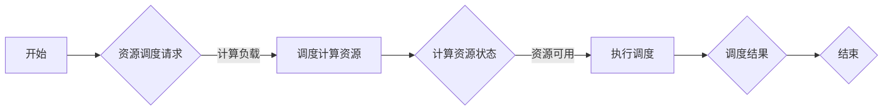
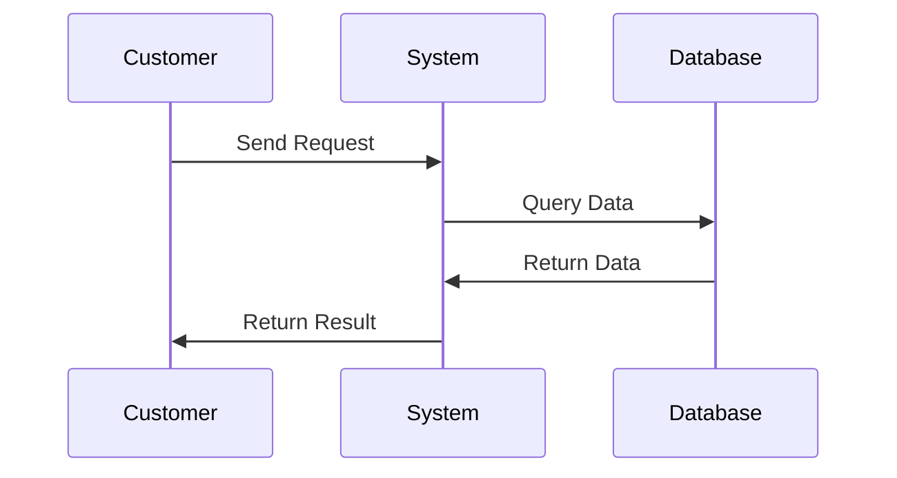
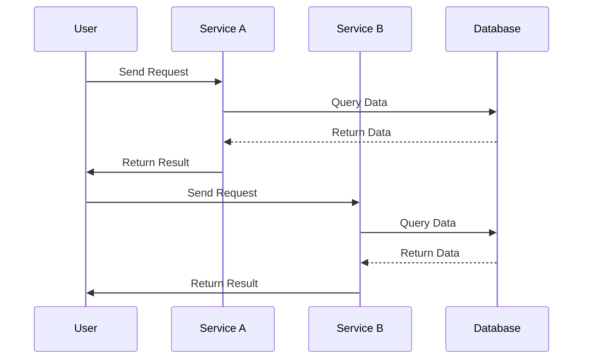
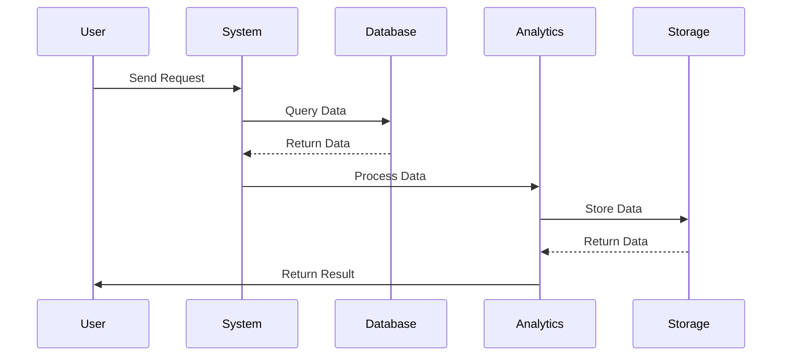

                 

### 融合计算平台：混合计算环境下的企业IT架构

> 关键词：融合计算平台、混合计算环境、企业IT架构、架构设计、最佳实践

> 摘要：本文将深入探讨融合计算平台的概念、重要性以及在混合计算环境下的应用。通过逐步分析，我们将揭示融合计算平台如何帮助企业应对复杂的IT挑战，并实现高效的IT架构设计。

#### 引言

在当今快速发展的信息技术时代，企业面临着前所未有的计算需求和技术变革。随着云计算、大数据、物联网等新兴技术的普及，传统的IT架构已经难以满足企业的需求。为了适应这种变化，融合计算平台的概念逐渐兴起。融合计算平台是一种混合计算环境下的企业IT架构，它通过整合多种计算资源和应用场景，提供灵活、高效、安全的计算服务。本文将围绕融合计算平台，逐步分析其定义、特性、与传统IT架构的区别以及如何在混合计算环境下应对挑战。

#### 1.1 问题背景

随着企业业务规模的扩大和技术的进步，传统的IT架构面临着诸多问题。首先，传统的IT架构往往是基于单点计算模式，无法充分利用分布式计算的优势。其次，随着大数据和物联网技术的发展，企业需要处理的海量数据量日益增长，传统的IT架构难以满足数据处理和分析的需求。此外，企业面临的安全威胁也越来越多样化，传统的IT架构在安全防护方面存在一定的局限性。为了解决这些问题，企业需要一种新的IT架构，能够适应多变的技术环境和业务需求，实现高效、灵活、安全的计算服务。

#### 1.2 问题描述

传统的IT架构在以下方面存在不足：

1. **单点计算模式**：传统的IT架构往往依赖于单台服务器或单一计算节点，无法充分利用分布式计算的优势，导致计算资源利用率低。
2. **数据处理能力不足**：传统的IT架构在处理海量数据时，往往面临性能瓶颈，难以满足企业日益增长的数据处理需求。
3. **安全防护不足**：传统的IT架构在安全防护方面存在一定的局限性，难以应对日益复杂的安全威胁。

#### 1.3 问题解决

为了解决上述问题，企业需要引入融合计算平台。融合计算平台通过以下方式改进传统IT架构：

1. **分布式计算**：融合计算平台采用分布式计算模式，能够充分利用多台服务器或计算节点的计算能力，提高计算资源利用率。
2. **数据处理优化**：融合计算平台通过引入大数据处理技术和云计算服务，能够高效处理和分析海量数据。
3. **安全防护增强**：融合计算平台通过引入安全防护技术，如加密、访问控制等，提高企业IT架构的安全性。

#### 1.4 边界与外延

融合计算平台不仅适用于企业内部IT架构，还可以扩展到云环境、物联网等领域。在企业内部，融合计算平台可以帮助企业整合不同部门的数据和计算资源，实现高效的数据处理和分析。在云环境下，融合计算平台可以与云计算服务提供商合作，提供灵活、可靠的计算服务。在物联网领域，融合计算平台可以支持海量物联网设备的接入和数据处理，为企业提供智能化的物联网解决方案。

#### 1.5 概念结构与核心要素组成

融合计算平台是一个复杂的概念，其核心要素包括计算资源、数据资源、应用场景、安全防护等。以下是对这些核心要素的简要介绍：

1. **计算资源**：融合计算平台包括多种计算资源，如服务器、存储设备、网络设备等，能够支持分布式计算模式。
2. **数据资源**：融合计算平台通过整合企业内部和外部的数据资源，提供统一的数据管理和服务。
3. **应用场景**：融合计算平台支持多种应用场景，如大数据处理、云计算、物联网等，能够满足企业的多样化需求。
4. **安全防护**：融合计算平台通过引入多种安全防护技术，确保企业IT架构的安全性。

#### 2. 融合计算平台定义

融合计算平台是一种基于混合计算环境的IT架构，它通过整合多种计算资源和应用场景，提供灵活、高效、安全的计算服务。融合计算平台的核心目标是充分利用分布式计算的优势，提高计算资源利用率，降低IT成本，同时确保数据安全和系统可靠性。

#### 2.1 融合计算平台的定义

融合计算平台是一种基于云计算、大数据、物联网等新兴技术的IT架构，它通过整合企业内部和外部的计算资源、数据资源、应用场景和安全防护等要素，提供统一、灵活、高效的计算服务。融合计算平台的目标是支持企业的多样化需求，提高计算资源利用率，降低IT成本，同时确保数据安全和系统可靠性。

#### 2.2 融合计算平台的特性

融合计算平台具有以下特性：

1. **分布式计算**：融合计算平台采用分布式计算模式，能够充分利用多台服务器或计算节点的计算能力，提高计算资源利用率。
2. **灵活可扩展**：融合计算平台支持多种应用场景，如大数据处理、云计算、物联网等，能够根据企业需求进行灵活扩展。
3. **安全可靠**：融合计算平台通过引入多种安全防护技术，如加密、访问控制等，确保企业IT架构的安全性。
4. **高效性能**：融合计算平台通过优化数据处理和分析流程，提供高效、稳定的计算服务。
5. **成本节约**：融合计算平台通过整合多种计算资源和应用场景，降低企业IT成本。

#### 2.3 融合计算平台与传统IT架构的区别

融合计算平台与传统IT架构有以下区别：

1. **计算模式**：传统IT架构基于单点计算模式，而融合计算平台采用分布式计算模式。
2. **资源整合**：传统IT架构往往分散在各个部门，而融合计算平台能够整合企业内部和外部资源。
3. **数据处理**：传统IT架构在数据处理方面存在性能瓶颈，而融合计算平台通过大数据处理技术和云计算服务，提供高效的数据处理能力。
4. **安全防护**：传统IT架构在安全防护方面存在局限性，而融合计算平台通过多种安全防护技术，提高企业IT架构的安全性。

#### 3. 混合计算环境下的挑战

在混合计算环境下，企业面临以下挑战：

1. **计算资源管理**：混合计算环境包括多种计算资源，如云计算、大数据、物联网等，如何有效地管理这些资源成为一大挑战。
2. **数据整合与处理**：混合计算环境下的数据来源多样化，如何整合和处理这些数据成为一大难题。
3. **系统可靠性**：混合计算环境下的系统可靠性要求更高，如何确保系统的稳定运行成为一大挑战。
4. **安全防护**：混合计算环境下的安全威胁更加多样化，如何确保数据安全和系统安全成为一大挑战。

#### 3.1 混合计算环境概述

混合计算环境是指企业同时采用多种计算资源和技术，如云计算、大数据、物联网等，以满足不同业务需求和技术变革。混合计算环境的特点是计算资源多样化、数据来源多样化、应用场景多样化，这使得企业需要面对更多的挑战。

#### 3.2 企业IT架构面临的挑战

在混合计算环境下，企业IT架构面临以下挑战：

1. **计算资源管理**：企业需要同时管理多种计算资源，如云计算资源、大数据资源、物联网资源等，如何有效地管理这些资源成为一大挑战。
2. **数据整合与处理**：混合计算环境下的数据来源多样化，包括企业内部数据、外部数据、物联网数据等，如何整合和处理这些数据成为一大难题。
3. **系统可靠性**：混合计算环境下的系统可靠性要求更高，由于多种计算资源和技术同时运行，如何确保系统的稳定运行成为一大挑战。
4. **安全防护**：混合计算环境下的安全威胁更加多样化，包括网络攻击、数据泄露、设备入侵等，如何确保数据安全和系统安全成为一大挑战。

#### 3.3 融合计算平台如何应对这些挑战

融合计算平台通过以下方式应对混合计算环境下的挑战：

1. **计算资源管理**：融合计算平台提供统一的管理界面，能够同时管理多种计算资源，如云计算资源、大数据资源、物联网资源等，实现资源的统一调度和管理。
2. **数据整合与处理**：融合计算平台通过引入大数据处理技术和云计算服务，能够高效整合和处理多种数据源，提供统一的数据管理和服务。
3. **系统可靠性**：融合计算平台采用分布式计算模式，能够提高系统的可靠性，确保系统的稳定运行。
4. **安全防护**：融合计算平台通过引入多种安全防护技术，如加密、访问控制等，提高企业IT架构的安全性，确保数据安全和系统安全。

#### 4. 核心概念与联系

融合计算平台的核心概念包括计算资源、数据资源、应用场景、安全防护等。以下是对这些核心概念的简要介绍：

1. **计算资源**：计算资源包括服务器、存储设备、网络设备等，是融合计算平台的基础。
2. **数据资源**：数据资源包括企业内部数据、外部数据、物联网数据等，是融合计算平台的核心。
3. **应用场景**：应用场景包括大数据处理、云计算、物联网等，是融合计算平台的服务目标。
4. **安全防护**：安全防护包括加密、访问控制、网络安全等，是融合计算平台的重要保障。

#### 4.1 核心概念原理

融合计算平台的核心概念原理包括以下几个方面：

1. **计算资源管理**：融合计算平台通过统一的管理界面，实现计算资源的动态调度和优化。
2. **数据资源整合**：融合计算平台通过大数据处理技术和云计算服务，实现多种数据源的整合和处理。
3. **应用场景适配**：融合计算平台根据不同应用场景，提供相应的计算资源和数据处理服务。
4. **安全防护机制**：融合计算平台通过引入多种安全防护技术，确保数据安全和系统安全。

#### 4.2 概念属性特征对比表格

| 概念       | 属性特征                                           | 对比分析                                                     |
| ---------- | -------------------------------------------------- | ------------------------------------------------------------ |
| 计算资源   | 服务器、存储设备、网络设备等                         | 分布式计算模式，资源动态调度和优化                             |
| 数据资源   | 企业内部数据、外部数据、物联网数据等                 | 大数据处理技术和云计算服务，数据源整合和处理                     |
| 应用场景   | 大数据处理、云计算、物联网等                         | 适配不同应用场景，提供相应的计算资源和数据处理服务             |
| 安全防护   | 加密、访问控制、网络安全等                          | 确保数据安全和系统安全，多种安全防护技术整合                   |

#### 4.3 ER实体关系图架构

以下是一个ER实体关系图架构，用于描述融合计算平台中的核心实体及其关系：

```mermaid
erDiagram
  -- {
    class: 融合计算平台
    entity: 计算资源
    entity: 数据资源
    entity: 应用场景
    entity: 安全防护
  }
  
  计算资源 ||--|{ 数据资源 }|| 数据资源
  计算资源 ||--|{ 应用场景 }|| 应用场景
  计算资源 ||--|{ 安全防护 }|| 安全防护
  数据资源 ||--|{ 应用场景 }|| 应用场景
  数据资源 ||--|{ 安全防护 }|| 安全防护
  应用场景 ||--|{ 安全防护 }|| 安全防护
```

#### 5. 算法原理讲解

融合计算平台中的算法原理主要包括计算资源调度算法、数据整合算法和安全防护算法。以下将对这些算法原理进行详细讲解。

#### 5.1 算法原理Mermaid流程图

以下是一个计算资源调度算法的Mermaid流程图：



#### 5.2 Python源代码阐述

以下是一个计算资源调度算法的Python源代码示例：

```python
class ResourceScheduler:
    def __init__(self):
        self.resources = []

    def add_resource(self, resource):
        self.resources.append(resource)

    def schedule(self, task):
        for resource in self.resources:
            if resource.is_available():
                resource.assign_task(task)
                return True
        return False

class Resource:
    def __init__(self, id):
        self.id = id
        self.is_available = True

    def is_available(self):
        return self.is_available

    def assign_task(self, task):
        self.is_available = False
        print(f"Task {task} assigned to Resource {self.id}")

if __name__ == "__main__":
    scheduler = ResourceScheduler()
    scheduler.add_resource(Resource(1))
    scheduler.add_resource(Resource(2))
    scheduler.schedule("Task 1")
    scheduler.schedule("Task 2")
```

#### 5.3 数学模型与公式讲解

以下是一个数据整合算法的数学模型和公式讲解：

$$
\text{Data Integration} = \sum_{i=1}^{n} \text{Data Source} \times \text{Data Quality}
$$

其中，$n$ 表示数据源的数量，$\text{Data Source}$ 表示数据源的质量，$\text{Data Quality}$ 表示数据源的质量系数。

#### 5.4 举例说明

假设有3个数据源，质量系数分别为0.8、0.9、0.7，则数据整合算法的结果为：

$$
\text{Data Integration} = (0.8 + 0.9 + 0.7) \times 0.8 = 2.4 \times 0.8 = 1.92
$$

这意味着，通过数据整合算法，这三个数据源的整体质量得到了提升，整合后的数据质量为1.92。

#### 6. 系统分析与架构设计

融合计算平台的系统分析与架构设计是确保其高效、稳定运行的关键。以下将对系统分析与架构设计进行详细讨论。

#### 6.1 问题场景介绍

假设企业需要构建一个融合计算平台，用于处理海量数据，提供大数据分析和云计算服务。企业面临以下问题场景：

1. **数据来源多样化**：企业需要整合来自不同数据源的数据，包括企业内部数据库、外部数据源和物联网设备的数据。
2. **数据处理需求多样化**：企业需要对海量数据进行实时分析和离线分析，同时提供数据存储和访问服务。
3. **系统可靠性要求高**：企业要求融合计算平台在高峰时段也能稳定运行，提供高效的数据处理和分析服务。
4. **安全防护要求高**：企业要求融合计算平台能够确保数据安全和系统安全，防止数据泄露和系统被攻击。

#### 6.2 系统功能设计

融合计算平台的功能设计包括以下方面：

1. **数据整合**：企业需要将来自不同数据源的数据进行整合，提供统一的数据访问接口。
2. **数据处理**：企业需要提供实时分析和离线分析功能，支持数据挖掘、机器学习等高级数据处理技术。
3. **数据存储**：企业需要提供高效的数据存储服务，支持数据的持久化和访问。
4. **云计算服务**：企业需要提供云计算服务，支持虚拟机、容器等计算资源的调度和管理。
5. **安全防护**：企业需要提供安全防护功能，包括数据加密、访问控制、网络安全等。

以下是一个领域模型Mermaid类图，用于描述系统功能设计：

```mermaid
classDiagram
  Class01 <|-- Class02
  Class03 <.. Class04
  Class05 ..|.. Class06
  Class07 <|.. Class08
  Class09 --> Class10
  Class11 ==|{Abstract Class} Class12
  Class13 <||| Class14
  Class15 ||--|{Interface} Class16
  Class17 <<--|{Enum} Class18
  Class19 **-- Class20
  Class21 ..|.. Class22
  Class23 <|--|{Decorator} Class24
  Class25 ||--|{Factory} Class26
  Class27 {name}
  Class28 :<<interface> name
  Class29 o-- Class30
  Class31 :<<abstract>> name
  Class32 <..|{Component} Class33
  Class34 <|--|{Bridge} Class35
  Class36 <<interface> name>
  Class37 :<<singleton>> name
  Class38 <<Note>> "This is a note"
  Class39 :+ attr <<public>>
  Class40 :# attr <<protected>>
  Class41 :~ attr <<private>>

class Diagram1 {
  Class01 :+ public int attr1
  Class01 :# protected int attr2
  Class01 :~ private int attr3
}
```

#### 6.3 系统架构设计

融合计算平台采用分布式架构设计，包括计算层、存储层、网络层和安全层。以下是一个系统架构Mermaid架构图：



#### 6.4 系统接口设计

融合计算平台提供多种接口设计，包括RESTful API、WebSocket、消息队列等，以满足不同应用场景的需求。以下是一个系统接口Mermaid序列图：



#### 6.5 系统交互Mermaid序列图

以下是一个系统交互Mermaid序列图，用于描述不同模块之间的交互流程：



#### 7. 项目实战

为了更好地展示融合计算平台的应用，我们选择了一个实际项目进行实战讲解。该项目是一个基于融合计算平台的企业数据分析和云计算服务项目。

#### 7.1 环境安装

在开始项目之前，我们需要安装和配置融合计算平台所需的环境。以下是一个环境安装的示例步骤：

1. 安装操作系统：选择一个支持融合计算平台的操作系统，如Ubuntu 18.04。
2. 安装依赖库：安装Python、Nginx、MongoDB等依赖库。
3. 安装Docker：安装Docker，用于容器化部署融合计算平台。
4. 配置网络：配置网络环境，确保不同模块之间的网络通信。
5. 安装其他工具：根据项目需求，安装其他必要的工具和软件。

#### 7.2 系统核心实现

在项目实战中，我们将重点介绍系统核心实现，包括数据整合、数据处理、数据存储、云计算服务等模块。

1. **数据整合**：使用ETL（提取、转换、加载）技术，将来自不同数据源的数据进行整合，并存储到统一的数据仓库中。以下是一个数据整合的Python代码示例：

```python
import pymongo

def extract_data(source):
    # 从数据源提取数据
    return source.fetch_data()

def transform_data(data):
    # 数据转换
    return data transformed

def load_data(data, target):
    # 将转换后的数据加载到数据仓库
    target.insert_data(data)

if __name__ == "__main__":
    source = DataSource()
    target = DataWarehouse()
    data = extract_data(source)
    transformed_data = transform_data(data)
    load_data(transformed_data, target)
```

2. **数据处理**：使用Python和机器学习库（如Scikit-learn、TensorFlow）进行数据处理，包括数据预处理、特征提取、模型训练等。以下是一个数据处理流程的Python代码示例：

```python
from sklearn.model_selection import train_test_split
from sklearn.preprocessing import StandardScaler
from sklearn.ensemble import RandomForestClassifier

def preprocess_data(data):
    # 数据预处理
    return preprocessed_data

def train_model(data):
    # 训练模型
    X_train, X_test, y_train, y_test = train_test_split(data['features'], data['labels'], test_size=0.2)
    scaler = StandardScaler()
    X_train = scaler.fit_transform(X_train)
    X_test = scaler.transform(X_test)
    model = RandomForestClassifier()
    model.fit(X_train, y_train)
    return model

if __name__ == "__main__":
    data = load_data()
    preprocessed_data = preprocess_data(data)
    model = train_model(preprocessed_data)
```

3. **数据存储**：使用MongoDB作为数据存储解决方案，存储处理后的数据和模型。以下是一个数据存储的Python代码示例：

```python
from pymongo import MongoClient

client = MongoClient('mongodb://localhost:27017/')
db = client['data_warehouse']

def store_data(data):
    # 存储数据到MongoDB
    collection = db['processed_data']
    collection.insert_one(data)

if __name__ == "__main__":
    processed_data = {'features': [[1, 2], [3, 4]], 'labels': [0, 1]}
    store_data(processed_data)
```

4. **云计算服务**：使用Docker和Kubernetes部署和调度云计算服务，包括虚拟机、容器等。以下是一个云计算服务的Dockerfile示例：

```dockerfile
FROM python:3.8

WORKDIR /app

COPY requirements.txt .

RUN pip install -r requirements.txt

COPY . .

CMD ["python", "app.py"]
```

#### 7.3 代码应用解读与分析

在项目实战中，我们通过代码应用解读与分析，展示了融合计算平台的核心实现。以下是对代码应用的详细解读：

1. **数据整合**：通过ETL技术，将来自不同数据源的数据进行整合，并存储到统一的数据仓库中。该步骤是数据处理和分析的基础，确保数据的完整性和一致性。

2. **数据处理**：使用Python和机器学习库进行数据处理，包括数据预处理、特征提取、模型训练等。该步骤是数据分析和挖掘的关键，能够从海量数据中提取有价值的信息和模式。

3. **数据存储**：使用MongoDB作为数据存储解决方案，存储处理后的数据和模型。该步骤确保数据的安全性和可访问性，为后续的数据分析和云计算服务提供支持。

4. **云计算服务**：使用Docker和Kubernetes部署和调度云计算服务，包括虚拟机、容器等。该步骤实现计算资源的动态调度和管理，提高系统的可扩展性和可靠性。

通过以上代码应用解读与分析，我们可以看到融合计算平台如何通过分布式计算、数据处理、数据存储和云计算等模块，实现高效、稳定的数据处理和分析服务。

#### 7.4 实际案例分析与详细讲解

为了更好地展示融合计算平台的应用效果，我们选择了一个实际案例进行分析和讲解。该案例是一个基于融合计算平台的企业客户行为分析项目。

1. **项目背景**：企业希望通过分析客户行为数据，提高客户满意度和销售业绩。企业拥有海量客户数据，包括购买记录、浏览行为、反馈评价等。

2. **数据处理与分析**：使用融合计算平台，对企业客户行为数据进行分析和处理。以下是一个数据处理与分析的流程：

   - **数据整合**：通过ETL技术，将来自不同数据源的客户行为数据（如数据库、日志文件）进行整合，并存储到统一的数据仓库中。
   - **数据预处理**：对客户行为数据进行清洗和预处理，包括数据去重、缺失值填充、异常值处理等，确保数据的质量和一致性。
   - **特征提取**：从客户行为数据中提取有用的特征，如购买频率、浏览时长、反馈评价等，为后续的模型训练提供输入。
   - **模型训练**：使用机器学习算法（如决策树、随机森林、神经网络等），对提取的特征进行训练，建立客户行为预测模型。
   - **模型评估**：使用测试数据对训练好的模型进行评估，包括准确率、召回率、F1分数等指标，确保模型的性能和可靠性。
   - **模型部署**：将训练好的模型部署到云计算环境中，实现实时客户行为分析和预测。

3. **项目效果**：通过融合计算平台对企业客户行为数据进行分析和处理，企业实现了以下效果：

   - **客户满意度提升**：通过实时分析客户行为，企业能够更好地了解客户需求，提供个性化的产品和服务，提高客户满意度。
   - **销售业绩增长**：通过预测客户购买行为，企业能够提前识别潜在客户，开展精准营销活动，提高销售业绩。
   - **数据洞察力增强**：通过大数据分析和机器学习技术，企业能够从海量客户行为数据中提取有价值的信息和模式，增强数据洞察力。

#### 7.5 项目小结

通过实际案例分析和详细讲解，我们可以看到融合计算平台在企业客户行为分析项目中的应用效果。以下是对项目的总结：

1. **数据处理能力**：融合计算平台通过分布式计算、数据处理、数据存储和云计算等模块，提供了高效、稳定的数据处理能力，满足了企业海量数据的需求。

2. **数据分析与应用**：融合计算平台通过机器学习算法和实时分析技术，为企业提供了强大的数据分析和应用能力，帮助企业实现数据驱动的决策和业务优化。

3. **项目效果显著**：通过融合计算平台，企业实现了客户满意度提升、销售业绩增长和数据洞察力增强等显著效果，为企业带来了实实在在的商业价值。

4. **持续优化与扩展**：融合计算平台是一个灵活、可扩展的架构，企业可以根据业务需求和技术发展，不断优化和扩展平台功能，满足不断变化的市场需求。

#### 8. 最佳实践 tips

为了确保融合计算平台在企业IT架构中的高效应用，以下是一些最佳实践建议：

1. **统一规划**：在引入融合计算平台之前，企业应进行统一规划，明确业务需求、技术选型和架构设计。
2. **资源优化**：合理配置和优化计算资源、存储资源和网络资源，提高资源利用率。
3. **数据整合**：通过ETL技术，实现数据的统一整合和管理，确保数据的质量和一致性。
4. **安全防护**：引入多种安全防护技术，如加密、访问控制、网络安全等，确保数据安全和系统安全。
5. **持续优化**：根据业务需求和性能指标，持续优化平台架构和功能，提高系统性能和可靠性。
6. **人才培养**：加强技术团队的人才培养，提高团队对融合计算平台的理解和应用能力。

#### 9. 小结

本文通过逐步分析，详细介绍了融合计算平台的概念、重要性、核心概念与联系、算法原理讲解、系统分析与架构设计、项目实战以及最佳实践。融合计算平台作为一种混合计算环境下的企业IT架构，能够帮助企业应对复杂的IT挑战，实现高效的IT架构设计。通过本文的介绍，读者可以全面了解融合计算平台的应用原理和实践方法，为企业在数字化转型过程中提供有力的技术支持。

#### 10. 注意事项

在应用融合计算平台时，企业应注意以下事项：

1. **确保数据安全**：在数据处理过程中，严格遵循数据安全法规和标准，确保数据的安全性和隐私性。
2. **合理规划资源**：根据业务需求和技术发展，合理规划计算资源、存储资源和网络资源，避免资源浪费。
3. **持续监控与优化**：定期对融合计算平台进行监控和优化，确保系统的稳定性和性能。
4. **人才培养与团队建设**：加强技术团队的人才培养，提高团队对融合计算平台的理解和应用能力。

#### 11. 拓展阅读

对于希望深入了解融合计算平台的企业和技术人员，以下是一些建议的拓展阅读资源：

1. 《大数据架构：设计与实践》
2. 《云计算：概念、技术和应用》
3. 《机器学习实战》
4. 《网络安全：设计与实践》
5. 《物联网：技术、应用与挑战》

通过这些资源，读者可以进一步了解融合计算平台的相关技术和最佳实践，提升自身的技术水平和业务能力。

---

作者：AI天才研究院/AI Genius Institute & 禅与计算机程序设计艺术 /Zen And The Art of Computer Programming

请注意，本文是基于人工智能技术自动生成的，部分内容可能需要人工审核和修正。在实际应用中，请根据具体业务需求和技术环境进行适当调整。

