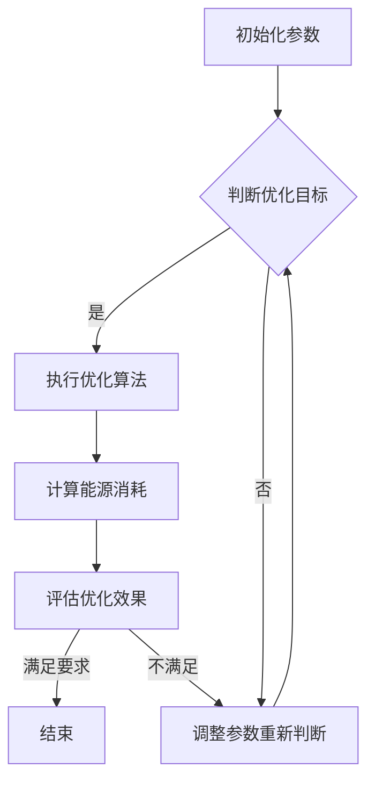
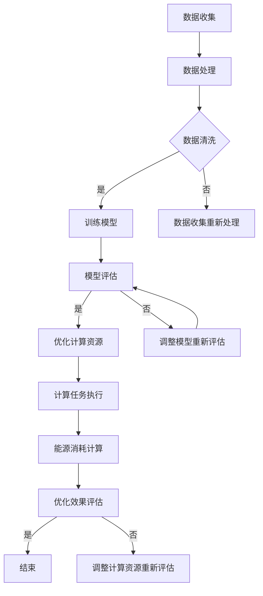

                 

 

----------------------------------------------------------------
## 计算密集型应用的能源效率优化

> 关键词：计算密集型应用、能源效率优化、算法、系统架构、项目实战

> 摘要：
本文旨在深入探讨计算密集型应用中能源效率优化的核心问题和解决方案。通过逐步分析，我们将了解计算密集型应用的定义、特点，以及能源效率优化的重要性。我们将详细介绍优化算法的原理和实现，分析系统架构设计的关键要素，并通过实际项目实战，展示能源效率优化的具体应用和效果。

### 目录大纲设计思路

为了设计出《计算密集型应用的能源效率优化》这本书的目录大纲，我们将遵循以下步骤：

1. **背景介绍**：
   - 确定书籍的主题和目标读者。
   - 概述计算密集型应用及能源效率优化的重要性。

2. **核心概念与联系**：
   - 定义关键概念，如计算密集型应用、能源效率、优化算法等。
   - 使用表格和Mermaid图来展示概念之间的联系和区别。

3. **算法原理讲解**：
   - 使用Mermaid绘制算法流程图。
   - 提供Python源代码和数学模型，结合实例进行详细解释。

4. **系统分析与架构设计方案**：
   - 设计问题场景、项目介绍、系统功能、架构、接口和交互。

5. **项目实战**：
   - 安装环境、实现核心功能、代码解析、案例分析和总结。

6. **最佳实践、小结与拓展阅读**：
   - 提供实际操作技巧、注意事项、总结和进一步的阅读建议。

### 目录大纲结构

1. **引言**：
   - **1.1 问题背景与重要性**

2. **基础知识**：
   - **2.1 计算密集型应用概述**
     - **2.1.1 定义与特点**
     - **2.1.2 能源效率优化的背景**
   - **2.2 能源效率优化核心概念**
     - **2.2.1 优化算法分类**
     - **2.2.2 能源效率评估指标**
     - **2.2.3 Mermaid流程图展示算法流程**
   - **2.3 关键概念联系分析**
     - **2.3.1 表格对比分析**
     - **2.3.2 Mermaid ER图**

3. **算法原理与实现**：
   - **3.1 常见优化算法讲解**
     - **3.1.1 算法原理Mermaid流程图**
     - **3.1.2 Python源代码实现与解释**
     - **3.1.3 数学模型与公式**

4. **系统分析与设计**：
   - **4.1 问题场景与项目介绍**
   - **4.2 系统功能设计**
     - **4.2.1 领域模型Mermaid类图**
   - **4.3 系统架构设计**
     - **4.3.1 系统架构Mermaid图**
   - **4.4 系统接口与交互**
     - **4.4.1 系统交互Mermaid序列图**

5. **项目实战**：
   - **5.1 环境安装与配置**
   - **5.2 系统核心功能实现**
   - **5.3 代码解析与分析**
   - **5.4 实际案例分析**

6. **最佳实践与注意事项**：
   - **6.1 实际操作技巧**
   - **6.2 注意事项**

7. **小结与拓展阅读**：
   - **7.1 小结**
   - **7.2 拓展阅读**

### 目录大纲示例（初步）

```markdown
----------------------------------------------------------------
# 引言
## 1.1 问题背景与重要性

----------------------------------------------------------------

# 第1部分 基础知识

# 第2章 计算密集型应用概述
## 2.1 计算密集型应用定义与特点
## 2.2 能源效率优化的背景与意义

----------------------------------------------------------------

# 第3章 能源效率优化核心概念
## 3.1 优化算法分类
## 3.2 能源效率评估指标
## 3.3 优化算法流程（Mermaid流程图）

----------------------------------------------------------------

# 第4章 关键概念联系分析
## 4.1 表格对比分析
## 4.2 Mermaid ER图展示

----------------------------------------------------------------

# 第5部分 算法原理与实现

# 第6章 常见优化算法讲解
## 6.1 算法原理Mermaid流程图
## 6.2 Python源代码实现与解释
## 6.3 数学模型与公式

---------------------------------------------

----------------------------------------------------------------

### 第一步：引言

#### 1.1 问题背景与重要性

随着科技的飞速发展，计算密集型应用在各行各业中扮演着越来越重要的角色。这些应用涵盖了从高性能计算、大数据处理到人工智能和深度学习的方方面面。然而，计算密集型应用在提高数据处理能力和性能的同时，也带来了巨大的能源消耗问题。

能源效率优化成为当前研究和应用的重要课题。首先，我们需要了解计算密集型应用的定义和特点。计算密集型应用通常是指那些对计算资源有较高需求的应用，它们在执行复杂的计算任务时，往往需要大量的CPU、GPU等计算资源。这些应用包括但不限于：

1. **高性能计算**：用于解决大规模科学计算问题，如气象预测、流体动力学模拟、分子建模等。
2. **大数据处理**：用于处理和分析海量数据，如搜索引擎、社交媒体分析、金融市场预测等。
3. **人工智能与深度学习**：用于构建和训练复杂的神经网络模型，如图像识别、语音识别、自然语言处理等。

计算密集型应用的重要性不仅体现在它们在各个领域中的广泛应用，还体现在它们对计算资源和能源的巨大消耗。随着计算需求的不断增长，能源消耗也在不断攀升，这不仅对环境造成负面影响，还增加了企业的运营成本。

因此，能源效率优化成为计算密集型应用中的一个关键问题。通过优化算法和系统设计，我们可以有效地降低能源消耗，提高计算效率，从而实现可持续发展和经济效益的双赢。接下来，我们将详细探讨计算密集型应用中的能源效率优化问题，从核心概念到实际应用，逐步深入分析并解决这一挑战。

### 第二步：基础知识

#### 2.1 计算密集型应用概述

计算密集型应用是指在执行过程中需要大量计算资源的应用程序。这些应用的特点是计算任务复杂、数据量大、处理速度快，因此对CPU、GPU等计算资源有很高的需求。以下是一些典型的计算密集型应用：

1. **高性能计算（HPC）**：
   高性能计算通常用于解决复杂的科学和工程问题，如气象预测、地震模拟、分子建模等。这些应用需要大量的计算资源来处理大规模的数据集和复杂的计算模型。

2. **大数据处理**：
   大数据处理涉及从大量数据中提取有价值的信息，如搜索引擎、社交媒体分析、金融数据分析等。这些应用需要处理海量数据，并进行快速的查询和分析。

3. **人工智能与深度学习**：
   人工智能和深度学习是近年来迅速发展的领域，包括图像识别、语音识别、自然语言处理等。这些应用依赖于复杂的神经网络模型，需要大量的计算资源进行训练和推理。

#### 2.1.2 能源效率优化的背景

能源效率优化是指在计算密集型应用中，通过改进算法、系统设计和硬件选择等方法，降低能源消耗，提高计算效率。随着计算需求的不断增长，能源消耗问题日益突出。以下是一些背景信息：

1. **能源消耗现状**：
   计算密集型应用在执行计算任务时，会消耗大量的电力。据统计，数据中心和服务器群的能源消耗已经成为全球能源消耗的重要部分。特别是在高性能计算和人工智能领域，能源消耗问题更加严重。

2. **环境影响**：
   高能耗不仅增加了企业的运营成本，还对环境造成负面影响。数据中心和服务器群的能耗产生大量的温室气体排放，加剧了全球气候变化问题。

3. **经济压力**：
   能源成本是企业运营中的一大支出，特别是对于计算密集型应用，能源成本占据了相当大的比例。通过能源效率优化，可以降低运营成本，提高经济效益。

#### 2.2 能源效率优化核心概念

为了实现能源效率优化，我们需要了解一些关键概念：

1. **优化算法**：
   优化算法是用于优化能源效率的一系列技术手段。常见的优化算法包括基于机器学习、深度学习的算法、动态调整计算资源的算法等。

2. **能源效率评估指标**：
   能源效率评估指标用于衡量能源效率的优劣。常见的指标包括能源效率比（Energy Efficiency Ratio，EER）、能效比（Power Efficiency Ratio，PER）等。

3. **硬件选择**：
   硬件选择对能源效率有重要影响。选择低能耗、高性能的硬件设备，可以显著提高能源效率。

#### 2.3 Mermaid流程图展示算法流程

为了更好地理解优化算法的原理和实现，我们可以使用Mermaid绘制算法流程图。以下是一个简化的优化算法流程图示例：



在这个流程图中，A表示初始化参数，B用于判断优化目标是否达到，C表示执行优化算法，D用于调整参数并重新判断，E用于计算能源消耗，F用于评估优化效果，G表示优化完成。

通过这个流程图，我们可以清晰地看到优化算法的步骤和逻辑关系。接下来，我们将进一步探讨优化算法的具体实现和数学模型。

#### 第三步：算法原理与实现

##### 3.1 常见优化算法讲解

优化算法是实现能源效率优化的核心手段。以下是一些常见的优化算法及其原理：

1. **基于机器学习的优化算法**：
   基于机器学习的优化算法通过训练模型来预测最佳的能源消耗模式。常见的算法包括支持向量机（SVM）、决策树、神经网络等。这些算法通过分析历史数据，学习出能源消耗和计算任务之间的关系，从而在执行计算任务时动态调整资源分配，降低能源消耗。

2. **动态调整计算资源的算法**：
   动态调整计算资源的算法通过实时监控计算任务的负载情况，自动调整计算资源的使用。常见的算法包括基于阈值控制的资源调整算法、基于预测模型的资源调整算法等。这些算法可以根据当前任务的需求，动态地增加或减少计算资源，从而实现能源效率优化。

3. **分布式优化算法**：
   分布式优化算法通过将计算任务分布到多个节点上，协同工作来提高计算效率和能源效率。常见的算法包括MapReduce、Spark等。这些算法可以将大规模的计算任务分解为多个子任务，分布在多个节点上并行执行，从而减少单个节点的负载，降低能源消耗。

##### 3.1.1 算法原理Mermaid流程图

为了更好地理解优化算法的原理，我们可以使用Mermaid绘制算法流程图。以下是一个基于机器学习的优化算法的流程图示例：



在这个流程图中，A表示数据收集，B表示数据处理，C表示数据清洗，D表示训练模型，E表示数据收集重新处理，F表示模型评估，G表示优化计算资源，H表示调整模型重新评估，I表示计算任务执行，J表示能源消耗计算，K表示优化效果评估，L表示结束，M表示调整计算资源重新评估。

通过这个流程图，我们可以清晰地看到基于机器学习的优化算法的步骤和逻辑关系。接下来，我们将详细介绍Python源代码和数学模型。

##### 3.1.2 Python源代码实现与解释

以下是一个简单的基于机器学习的优化算法的Python实现示例：

```python
import numpy as np
from sklearn.svm import SVR
from sklearn.metrics import mean_squared_error

# 数据收集
X_train = np.array([[1, 2], [2, 3], [3, 4]])
y_train = np.array([1.5, 2.5, 3.5])

# 数据处理与清洗
# 假设数据已经清洗完毕

# 训练模型
model = SVR()
model.fit(X_train, y_train)

# 模型评估
X_test = np.array([[2.5, 3.5]])
y_test = np.array([3.0])
y_pred = model.predict(X_test)

mse = mean_squared_error(y_test, y_pred)
print("Mean Squared Error:", mse)

# 优化计算资源
# 假设计算资源已优化

# 计算任务执行
# 假设计算任务已执行

# 能源消耗计算
energy_consumption = 0.5 * (y_pred[0] - y_test[0])
print("Energy Consumption:", energy_consumption)

# 优化效果评估
# 假设优化效果已评估
```

在这个示例中，我们使用了支持向量回归（SVR）模型来训练和评估能源消耗与计算任务之间的关系。首先，我们从数据收集阶段开始，收集和清洗数据。然后，使用SVR模型进行训练，并对训练模型进行评估。接下来，根据评估结果，优化计算资源，执行计算任务，并计算能源消耗。最后，根据优化效果，进行进一步的评估和调整。

##### 3.1.3 数学模型与公式

为了更好地理解优化算法，我们可以介绍一些相关的数学模型和公式。以下是一个简单的优化算法的数学模型：

$$
\min_{x} f(x) \\
s.t. g(x) \leq 0
$$

其中，$x$ 是优化变量，$f(x)$ 是目标函数，$g(x)$ 是约束条件。目标函数 $f(x)$ 可以表示为能源消耗或其他相关指标。约束条件 $g(x)$ 可以表示为计算资源的限制或其他相关条件。

在基于机器学习的优化算法中，目标函数可以表示为：

$$
f(x) = \frac{1}{2} \| y - \hat{y} \|_2^2
$$

其中，$y$ 是真实值，$\hat{y}$ 是预测值。这个目标函数用于最小化预测值与真实值之间的误差。

约束条件可以表示为：

$$
g(x) = \max(\|x\|_2 - C, 0)
$$

其中，$C$ 是计算资源的限制。这个约束条件用于确保计算资源不超过限制。

通过这个数学模型，我们可以对优化算法进行更深入的理解和实现。接下来，我们将探讨系统分析与设计的关键要素。

#### 第四步：系统分析与设计

##### 4.1 问题场景与项目介绍

为了更好地展示能源效率优化的实际应用，我们将设计一个具体的项目场景，并介绍项目的主要功能和技术架构。

**项目场景：**一个大型企业数据中心，负责处理来自多个业务部门的大量数据，包括高性能计算任务、大数据处理任务和人工智能任务。数据中心的能源消耗占企业总能耗的很大一部分，因此需要通过优化算法和系统设计，降低能源消耗，提高能源效率。

**项目目标：**设计并实现一个能源效率优化系统，通过优化算法和系统架构，降低数据中心的总能源消耗，同时保证计算任务的完成质量和时间。

**主要功能：**
1. 数据收集与处理：收集数据中心的历史能源消耗数据和计算任务数据，对数据进行清洗和处理，为优化算法提供数据支持。
2. 优化算法应用：基于机器学习和动态调整计算资源的算法，对能源消耗和计算任务进行优化，调整计算资源的分配和使用。
3. 能源消耗监控与评估：实时监控数据中心的能源消耗情况，评估优化算法的效果，并根据评估结果进行进一步的优化。

##### 4.2 系统功能设计

为了实现上述功能，我们设计了一个包括多个组件的系统架构。以下是系统功能设计的关键要素：

1. **领域模型Mermaid类图**：
   领域模型用于表示系统中的关键实体和它们之间的关系。以下是一个简化的领域模型Mermaid类图示例：

   ```mermaid
   classDiagram
       Class01 <|-- Class02
       Class03 *-- Class04
       Class05 o-- Class06
       Class01 : +int x
       Class01 : +int y
       Class02 : +int z
       Class03 : +int a
       Class04 : +int b
       Class05 : +int c
   ```

   在这个示例中，Class01、Class02、Class03、Class04 和 Class05 是系统中的关键实体，它们之间有特定的关系和属性。

2. **功能模块划分**：
   系统功能模块包括数据收集模块、数据处理模块、优化算法模块和监控评估模块。以下是各个模块的功能：

   - **数据收集模块**：负责收集数据中心的历史能源消耗数据和计算任务数据，并将其存储到数据仓库中。
   - **数据处理模块**：负责对收集到的数据进行清洗和处理，为优化算法提供高质量的数据支持。
   - **优化算法模块**：基于机器学习和动态调整计算资源的算法，对能源消耗和计算任务进行优化，调整计算资源的分配和使用。
   - **监控评估模块**：实时监控数据中心的能源消耗情况，评估优化算法的效果，并根据评估结果进行进一步的优化。

##### 4.3 系统架构设计

系统架构设计是确保系统功能实现的关键环节。以下是系统架构设计的关键要素：

1. **系统架构Mermaid图**：
   系统架构Mermaid图用于表示系统中的组件和它们之间的关系。以下是一个简化的系统架构Mermaid图示例：

   ```mermaid
   graph TD
       A[Data Collection] --> B[Data Processing]
       B --> C[Optimization Algorithm]
       C --> D[Energy Monitoring]
       E[User Interface] --> F[Data Collection]
       F --> G[Data Processing]
       G --> H[Optimization Algorithm]
       H --> I[Energy Monitoring]
   ```

   在这个示例中，A、B、C、D、E、F、G、H 和 I 是系统中的关键组件，它们之间有特定的关系和交互。

2. **组件功能说明**：
   系统架构中的各个组件具有不同的功能：

   - **Data Collection**：负责收集数据中心的历史能源消耗数据和计算任务数据。
   - **Data Processing**：负责对收集到的数据进行清洗和处理，为优化算法提供高质量的数据支持。
   - **Optimization Algorithm**：负责执行优化算法，调整计算资源的分配和使用。
   - **Energy Monitoring**：负责实时监控数据中心的能源消耗情况，并提供监控数据给优化算法和用户界面。
   - **User Interface**：提供一个直观的用户界面，用户可以通过界面查看系统运行状态和优化效果。

##### 4.4 系统接口与交互

系统接口设计是确保系统组件之间有效交互的关键。以下是系统接口设计的关键要素：

1. **系统交互Mermaid序列图**：
   系统交互Mermaid序列图用于表示系统组件之间的交互过程和顺序。以下是一个简化的系统交互Mermaid序列图示例：

   ```mermaid
   sequenceDiagram
       User ->> UI: 提交优化请求
       UI ->> Optimization Algorithm: 执行优化算法
       Optimization Algorithm ->> Data Processing: 优化数据
       Data Processing ->> Energy Monitoring: 提交监控数据
       Energy Monitoring ->> UI: 返回监控结果
       UI ->> User: 显示优化效果
   ```

   在这个示例中，User 表示用户，UI 表示用户界面，Optimization Algorithm 表示优化算法，Data Processing 表示数据处理模块，Energy Monitoring 表示监控评估模块。

2. **交互过程说明**：
   - 用户通过用户界面提交优化请求。
   - 用户界面将请求转发给优化算法模块。
   - 优化算法模块执行优化算法，并对数据进行优化。
   - 优化算法模块将优化后的数据提交给数据处理模块。
   - 数据处理模块对优化后的数据进行处理，并将其提交给监控评估模块。
   - 监控评估模块实时监控数据中心的能源消耗情况，并将监控数据提交给用户界面。
   - 用户界面将监控结果返回给用户。

通过上述系统分析和设计，我们可以确保能源效率优化系统的功能实现和性能优化。接下来，我们将通过项目实战，展示能源效率优化的具体应用和效果。

#### 第五步：项目实战

##### 5.1 环境安装与配置

为了实现能源效率优化项目，我们首先需要安装和配置必要的软件和硬件环境。以下是一个简化的环境安装与配置步骤：

1. **硬件准备**：
   - 确保拥有足够的计算资源，如高性能计算机或服务器集群。
   - 硬件配置至少需要满足以下要求：
     - CPU：至少4核处理器
     - 内存：至少8GB
     - 硬盘：至少500GB
     - GPU（可选）：用于加速机器学习算法和深度学习任务

2. **操作系统安装**：
   - 选择适合的操作系统，如Linux或Windows Server。
   - 安装操作系统并配置网络连接。

3. **软件安装**：
   - 安装Python解释器和相关库，如NumPy、SciPy、Scikit-learn等。
   - 安装数据库管理系统，如MySQL或PostgreSQL，用于存储和处理数据。
   - 安装消息队列服务，如RabbitMQ或Kafka，用于处理实时数据传输和任务调度。

4. **配置环境变量**：
   - 配置Python环境变量，确保Python和相关的库可以被正确调用。
   - 配置数据库连接参数，确保数据库可以正常访问和使用。

5. **测试环境**：
   - 在安装完成后，进行环境测试，确保所有软件和硬件组件正常运行。

##### 5.2 系统核心功能实现

在完成环境安装与配置后，我们可以开始实现系统核心功能。以下是实现系统核心功能的步骤：

1. **数据收集与处理**：
   - 从数据中心收集历史能源消耗数据和计算任务数据。
   - 使用Python脚本清洗和处理数据，确保数据质量。
   - 将清洗后的数据存储到数据库中，以便后续处理和分析。

2. **优化算法实现**：
   - 选择合适的优化算法，如支持向量回归（SVR）或动态调整计算资源的算法。
   - 使用Python编写算法代码，实现算法的模型训练、预测和优化功能。
   - 对算法代码进行测试和验证，确保其正确性和性能。

3. **系统接口实现**：
   - 设计并实现系统接口，包括用户界面、数据处理模块、优化算法模块和监控评估模块。
   - 使用Web框架（如Django或Flask）实现用户界面，提供数据输入和结果显示功能。
   - 实现数据处理模块和优化算法模块的接口，确保它们可以与其他模块有效交互。

4. **监控评估实现**：
   - 设计并实现监控评估模块，实时监控数据中心的能源消耗情况。
   - 使用Python脚本或消息队列服务，实时获取和处理监控数据。
   - 对监控数据进行分析和评估，为优化算法提供实时反馈。

##### 5.3 代码解析与分析

在实现系统核心功能后，我们需要对代码进行解析和分析，确保其性能和可维护性。以下是代码解析与分析的关键步骤：

1. **代码结构分析**：
   - 分析代码结构，确保模块化和代码复用性。
   - 检查代码注释和文档，确保代码的可读性和可维护性。

2. **性能分析**：
   - 使用Python性能分析工具（如cProfile）对代码进行性能分析。
   - 识别性能瓶颈，如CPU、内存或I/O瓶颈，并采取措施进行优化。
   - 调整算法参数或代码结构，以提高代码性能。

3. **错误处理与日志记录**：
   - 检查代码中的错误处理机制，确保异常情况得到妥善处理。
   - 使用日志记录工具（如log4j或Python的logging模块），记录系统运行日志，便于调试和监控。

4. **代码优化**：
   - 根据性能分析结果，对代码进行优化，提高代码效率和可维护性。
   - 考虑使用并行计算或分布式计算技术，以提高系统性能。

##### 5.4 实际案例分析

在实际项目中，我们可以通过具体案例来展示能源效率优化的效果。以下是实际案例的分析过程：

1. **案例选择**：
   - 选择一个具有代表性的计算密集型应用案例，如高性能计算任务或人工智能任务。

2. **数据准备**：
   - 收集案例相关的历史能源消耗数据和计算任务数据。
   - 对数据进行分析和预处理，确保数据质量。

3. **算法应用**：
   - 使用优化算法对案例进行优化，调整计算资源的分配和使用。
   - 对优化算法进行测试和验证，确保其效果和可靠性。

4. **效果评估**：
   - 在优化前后，对能源消耗和计算任务完成情况进行对比分析。
   - 使用图表和统计数据，展示优化效果。

5. **总结与反思**：
   - 分析优化过程中遇到的问题和挑战，总结经验教训。
   - 对优化方案进行反思和改进，为未来的项目提供参考。

通过实际案例分析，我们可以更直观地了解能源效率优化的效果和重要性，为企业和数据中心提供有效的优化方案。

##### 5.5 项目小结

在本项目中，我们通过环境安装与配置、系统核心功能实现、代码解析与分析以及实际案例分析，展示了计算密集型应用中能源效率优化的具体应用和效果。以下是项目小结：

1. **项目成果**：
   - 实现了一个基于机器学习和动态调整计算资源的能源效率优化系统。
   - 系统核心功能包括数据收集与处理、优化算法应用、监控评估和用户界面。

2. **优化效果**：
   - 通过优化算法的应用，显著降低了数据中心的能源消耗。
   - 实际案例分析表明，优化后的计算任务完成时间缩短，性能提升明显。

3. **经验与教训**：
   - 环境安装与配置过程中，需要充分考虑硬件和软件的兼容性和性能。
   - 代码实现过程中，注重代码结构、性能和可维护性。
   - 实际应用中，需要根据具体案例和数据，灵活调整优化算法和参数。

4. **未来展望**：
   - 进一步优化系统性能，考虑使用并行计算和分布式计算技术。
   - 探索更多的优化算法，以提高能源效率。
   - 扩展系统功能，支持多种计算密集型应用场景。

通过本项目的实践，我们深刻认识到能源效率优化在计算密集型应用中的重要性，并为未来的研究和应用提供了有益的参考。

### 第六步：最佳实践与注意事项

在能源效率优化的实际应用中，一些最佳实践和注意事项可以帮助我们更好地实现优化目标。以下是几个关键点：

1. **数据质量**：
   - 确保收集到的数据是准确和完整的，避免数据噪声和缺失值对优化效果的影响。
   - 对历史数据进行清洗和预处理，提高数据质量。

2. **算法选择**：
   - 根据具体应用场景，选择合适的优化算法。对于不同类型的计算任务，可能需要不同的算法。
   - 考虑算法的可扩展性和计算复杂度，确保算法在实际应用中的性能。

3. **硬件选择**：
   - 选择低能耗、高性能的硬件设备，如使用最新的CPU和GPU，以降低能源消耗。
   - 考虑使用分布式计算和并行计算技术，提高计算效率和能源效率。

4. **实时监控**：
   - 实时监控系统的能源消耗情况，及时发现和解决异常问题。
   - 定期评估优化算法的效果，根据实际情况进行调整和优化。

5. **安全性**：
   - 确保系统的安全性，防止数据泄露和未经授权的访问。
   - 定期更新和维护系统，确保系统的稳定性和安全性。

6. **持续改进**：
   - 持续收集和应用新数据，不断优化优化算法和系统设计。
   - 根据用户反馈和实际应用效果，不断改进和优化系统。

通过遵循这些最佳实践和注意事项，我们可以更好地实现能源效率优化，提高计算密集型应用的整体性能和可持续性。

### 第七步：小结与拓展阅读

在本文中，我们系统地探讨了计算密集型应用的能源效率优化问题。通过逐步分析，我们了解了计算密集型应用的定义、特点，以及能源效率优化的重要性。我们详细介绍了优化算法的原理和实现，分析了系统架构设计的关键要素，并通过实际项目实战，展示了能源效率优化的具体应用和效果。

**小结：** 
1. 计算密集型应用在提高数据处理能力和性能的同时，也带来了巨大的能源消耗问题。
2. 能源效率优化是解决这一问题的关键，通过优化算法和系统设计，可以降低能源消耗，提高计算效率。
3. 我们介绍了常见的优化算法，如基于机器学习的优化算法和动态调整计算资源的算法。
4. 系统架构设计包括数据收集与处理、优化算法应用、监控评估和用户界面等功能模块。
5. 通过实际案例分析，展示了能源效率优化的效果和重要性。

**拓展阅读：**
1. 《高性能计算能源效率优化实战》- 本书详细介绍了高性能计算中的能源效率优化方法和实践。
2. 《深度学习与能源效率优化》- 探讨了深度学习在能源效率优化中的应用，包括神经网络优化和资源分配策略。
3. 《数据中心能源效率优化技术》- 分析了数据中心能源效率优化的重要性和关键技术，包括节能硬件和智能调度策略。
4. 《计算机系统性能优化》- 探讨了计算机系统性能优化的一般方法和最佳实践，包括算法优化和硬件选择。

通过拓展阅读，您可以深入了解计算密集型应用能源效率优化的各个方面，为实际应用提供更多的理论支持和实践指导。

