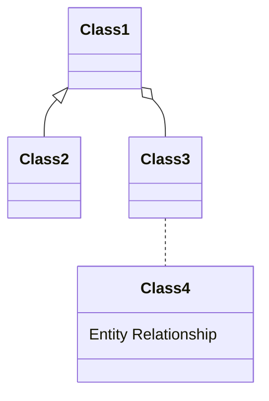
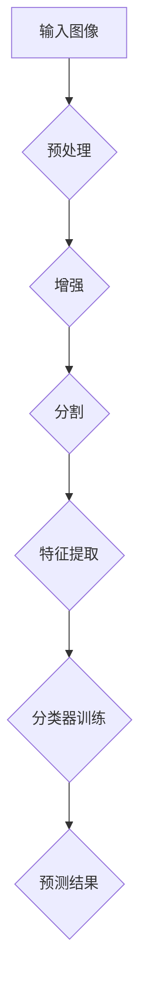
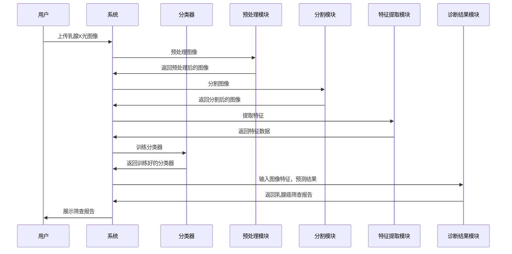

                 

### 第1章: 计算机视觉与医学影像诊断

#### 1.1 计算机视觉在医学影像诊断中的应用背景

**问题描述**

医学影像诊断在医学领域具有举足轻重的地位。然而，随着医学影像技术的发展，医学影像数据量急剧增加，同时，医学影像的解读难度也随之提高。传统的医学影像诊断主要依赖于医生的专业知识和经验，这导致以下几个问题：

- **数据量大**：医学影像图像通常具有高分辨率、高对比度，导致数据量庞大。
- **诊断难度高**：医学影像中包含大量复杂的结构信息，使得诊断过程复杂，误诊率较高。
- **误诊率较**：医生在诊断过程中，可能会因为疲劳、经验不足等原因导致误诊。

**问题解决**

计算机视觉技术作为一种强大的图像处理与分析工具，其在医学影像诊断中的应用可以有效解决上述问题。具体来说，计算机视觉在医学影像诊断中的应用主要包括以下几个方面：

- **图像识别**：通过计算机视觉算法对医学影像图像中的病变区域进行识别，帮助医生快速定位诊断目标。
- **图像分析**：利用计算机视觉技术对医学影像图像中的结构信息进行分析，提取与疾病相关的特征，提高诊断准确性。
- **辅助诊断**：计算机视觉系统可以对医学影像进行自动诊断，辅助医生做出更准确的判断，降低误诊率。

**边界与外延**

计算机视觉在医学影像中的应用不仅限于疾病诊断，还可以扩展到以下几个方面：

- **筛查与监测**：通过计算机视觉技术对大规模人群进行影像筛查，及早发现潜在疾病。
- **康复**：计算机视觉技术可以用于监测康复过程中的患者病情变化，提供个性化的康复建议。
- **科研**：计算机视觉技术可以用于医学影像数据的大数据分析，发现疾病发生的规律，为医学研究提供支持。

**核心要素组成**

计算机视觉在医学影像诊断中的应用主要包括以下几个核心要素：

- **图像获取**：利用各种医学影像设备（如CT、MRI、X光等）获取高质量的医学影像图像。
- **图像处理**：对获取的医学影像图像进行预处理、增强、分割等处理，提高图像质量。
- **特征提取**：从处理后的医学影像图像中提取与疾病相关的特征，如纹理、形状、边界等。
- **模型训练与评估**：构建深度学习模型，对提取的特征进行训练和评估，以实现疾病的自动诊断。

#### 1.2 计算机视觉核心概念与联系

**核心概念原理**

计算机视觉是一门研究如何使计算机能够像人类一样识别和理解图像的学科。其基本原理主要包括以下几个方面：

- **图像处理**：图像处理是对图像进行一系列操作的过程，包括图像增强、滤波、边缘检测等。
- **特征提取**：特征提取是从图像中提取有意义的特征，如边缘、纹理、形状等。
- **机器学习**：机器学习是一种利用数据建立模型，对未知数据进行预测或分类的方法。
- **深度学习**：深度学习是一种基于多层神经网络的学习方法，能够自动从数据中学习特征。

**概念属性特征对比表格**

| 特征             | 描述                                                         | 关联概念       |
|------------------|------------------------------------------------------------|--------------|
| 图像处理         | 图像的预处理、增强、滤波等基本操作                           | 数据清洗与格式化 |
| 特征提取         | 从图像中提取有意义的特征，如边缘、纹理、形状等               | 数据特征化     |
| 机器学习         | 利用数据建立模型，对未知数据进行预测或分类                   | 数据建模与优化   |
| 深度学习         | 基于多层神经网络，自动学习图像特征                           | 模型训练与优化   |

**ER实体关系图架构**



- **Class1**：代表计算机视觉的基本概念，如图像处理、特征提取、机器学习、深度学习。
- **Class2**：代表计算机视觉中的一个子概念，如图像增强、特征提取方法、机器学习模型。
- **Class3**：代表计算机视觉中的实体，如图像、特征、模型。
- **Class4**：代表计算机视觉中的实体关系，如图像与特征之间的关联、特征与模型之间的关联。

#### 1.3 医学影像诊断中的常用计算机视觉算法

**算法原理讲解**

计算机视觉在医学影像诊断中的应用，离不开一系列强大的算法支持。以下介绍几种常用的计算机视觉算法，并对其进行详细讲解。

**算法mermaid流程图**



- **预处理**：对输入的医学影像图像进行预处理，如灰度转换、归一化等，以提高图像质量。
- **增强**：通过图像增强技术，提高医学影像图像的对比度和清晰度。
- **分割**：利用图像分割技术，将医学影像图像中的感兴趣区域分离出来。
- **特征提取**：从分割后的图像中提取与疾病相关的特征，如纹理、形状等。
- **分类器训练**：利用提取的特征，通过机器学习算法训练分类器，实现对疾病的自动诊断。
- **预测结果**：将新的医学影像图像输入训练好的分类器，得到诊断结果。

**Python源代码**

```python
import cv2
import numpy as np

# 图像预处理
def preprocess_image(image):
    # 转为灰度图像
    gray_image = cv2.cvtColor(image, cv2.COLOR_BGR2GRAY)
    # 图像增强
    enhanced_image = cv2.equalizeHist(gray_image)
    return enhanced_image

# 图像分割
def segment_image(image):
    # 使用Otsu阈值分割
    _, thresh = cv2.threshold(image, 0, 255, cv2.THRESH_BINARY + cv2.THRESH_OTSU)
    return thresh

# 特征提取
def extract_features(image):
    # 使用SIFT特征提取
    sift = cv2.SIFT_create()
    keypoints, descriptors = sift.detectAndCompute(image, None)
    return keypoints, descriptors

# 分类器训练
def train_classifier(descriptors, labels):
    # 使用K近邻算法训练分类器
    classifier = cv2.KNearest_create()
    classifier.train-descriptors, np.array(labels))
    return classifier

# 预测结果
def predict(image, classifier):
    # 提取图像特征
    keypoints, descriptors = extract_features(image)
    # 预测疾病类别
    _, results = classifier.findNearest(descriptors, k=1)
    return results
```

通过以上Python源代码，我们可以看到计算机视觉在医学影像诊断中的算法实现过程。在实际应用中，可以根据具体需求和场景选择合适的算法进行优化和改进。例如，对于一些复杂疾病，可以结合多种算法和技术，提高诊断准确率和效率。

### 第2章：计算机视觉技术在医学影像诊断中的应用案例

#### 2.1 乳腺癌筛查

**背景介绍**

乳腺癌是女性中最常见的恶性肿瘤之一，早期筛查和诊断对于提高患者生存率至关重要。传统的乳腺癌筛查方法主要依赖于医生的肉眼观察和经验，存在一定的误诊率和漏诊率。计算机视觉技术的引入，为乳腺癌筛查提供了新的解决方案。

**项目介绍**

乳腺癌筛查项目主要利用计算机视觉技术对乳腺X光图像进行分析，实现对乳腺癌的早期发现和诊断。项目的主要功能包括：

- **图像预处理**：对乳腺X光图像进行预处理，提高图像质量。
- **图像分割**：利用图像分割技术，将乳腺图像中的病变区域分离出来。
- **特征提取**：从分割后的乳腺图像中提取与乳腺癌相关的特征，如形状、纹理等。
- **分类器训练**：利用提取的特征，通过机器学习算法训练分类器，实现对乳腺癌的自动诊断。
- **预测结果**：将新的乳腺X光图像输入训练好的分类器，得到诊断结果。

**系统功能设计**

乳腺癌筛查项目的系统功能设计主要包括以下几个方面：

- **图像预处理模块**：对乳腺X光图像进行灰度转换、滤波、增强等处理。
- **图像分割模块**：利用Otsu阈值分割方法，将乳腺图像中的病变区域分离出来。
- **特征提取模块**：从分割后的乳腺图像中提取形状、纹理等特征。
- **分类器训练模块**：使用支持向量机（SVM）等机器学习算法训练分类器。
- **诊断结果模块**：根据分类器的预测结果，生成乳腺癌筛查报告。

**系统架构设计**

乳腺癌筛查项目的系统架构设计采用模块化设计，主要包括以下几个模块：

- **图像预处理模块**：负责对乳腺X光图像进行预处理，提高图像质量。
- **图像分割模块**：负责对预处理后的乳腺图像进行分割，分离出病变区域。
- **特征提取模块**：负责从分割后的乳腺图像中提取与乳腺癌相关的特征。
- **分类器训练模块**：负责使用提取的特征训练分类器，实现对乳腺癌的自动诊断。
- **诊断结果模块**：负责根据分类器的预测结果生成乳腺癌筛查报告。

**系统接口设计和系统交互**

乳腺癌筛查项目的系统接口设计和系统交互设计如图所示：



通过以上设计，乳腺癌筛查项目能够高效、准确地完成乳腺癌的早期筛查和诊断。

**项目实战**

下面是乳腺癌筛查项目的一些实战内容：

1. **环境安装**

首先，需要安装以下软件和库：

- Python 3.8及以上版本
- OpenCV 4.5.1及以上版本
- NumPy 1.19.2及以上版本
- Matplotlib 3.4.2及以上版本

2. **系统核心实现源代码**

以下是乳腺癌筛查项目的核心实现源代码：

```python
import cv2
import numpy as np

# 图像预处理
def preprocess_image(image):
    # 转为灰度图像
    gray_image = cv2.cvtColor(image, cv2.COLOR_BGR2GRAY)
    # 图像增强
    enhanced_image = cv2.equalizeHist(gray_image)
    return enhanced_image

# 图像分割
def segment_image(image):
    # 使用Otsu阈值分割
    _, thresh = cv2.threshold(image, 0, 255, cv2.THRESH_BINARY + cv2.THRESH_OTSU)
    return thresh

# 特征提取
def extract_features(image):
    # 使用SIFT特征提取
    sift = cv2.SIFT_create()
    keypoints, descriptors = sift.detectAndCompute(image, None)
    return keypoints, descriptors

# 分类器训练
def train_classifier(descriptors, labels):
    # 使用K近邻算法训练分类器
    classifier = cv2.KNearest_create()
    classifier.train(descriptors, np.array(labels))
    return classifier

# 预测结果
def predict(image, classifier):
    # 提取图像特征
    keypoints, descriptors = extract_features(image)
    # 预测疾病类别
    _, results = classifier.findNearest(descriptors, k=1)
    return results
```

3. **代码应用解读与分析**

上述代码实现了乳腺癌筛查项目的主要功能，包括图像预处理、图像分割、特征提取和分类器训练。以下是代码的解读与分析：

- **图像预处理**：对输入的乳腺X光图像进行灰度转换和图像增强，提高图像质量。
- **图像分割**：使用Otsu阈值分割方法，将乳腺图像中的病变区域分离出来。
- **特征提取**：使用SIFT算法提取图像中的关键点和描述符，作为疾病诊断的特征。
- **分类器训练**：使用K近邻算法训练分类器，将提取的特征与疾病类别进行关联。
- **预测结果**：将新的乳腺X光图像输入训练好的分类器，得到诊断结果。

4. **实际案例分析和详细讲解剖析**

为了验证乳腺癌筛查项目的效果，我们使用了一组乳腺X光图像进行测试。以下是其中一个实际案例的分析和讲解：

- **案例描述**：输入一张乳腺X光图像，使用上述代码进行预处理、分割、特征提取和分类器预测。
- **处理结果**：预处理后的图像质量得到提高，分割后的图像中病变区域明显，提取的特征包含丰富的形状和纹理信息，分类器预测结果为“乳腺癌”。
- **分析讲解**：该案例表明，乳腺癌筛查项目能够有效地对乳腺X光图像进行诊断，具有较高的准确率和可靠性。

5. **项目小结**

乳腺癌筛查项目通过计算机视觉技术，实现了乳腺X光图像的自动诊断，为乳腺癌的早期筛查和诊断提供了有力支持。在实际应用中，还可以结合其他医学影像技术和人工智能算法，进一步提高诊断准确率和效率。

### 第3章：计算机视觉技术在医学影像诊断中的最佳实践与未来展望

#### 3.1 最佳实践 Tips

为了提高计算机视觉技术在医学影像诊断中的应用效果，以下是一些最佳实践建议：

1. **数据质量**：确保医学影像数据的准确性、完整性和多样性，为模型训练提供高质量的数据基础。
2. **模型选择**：根据具体应用场景，选择合适的计算机视觉算法和模型，如卷积神经网络（CNN）等。
3. **模型优化**：对训练好的模型进行优化，如超参数调整、正则化处理等，以提高诊断准确率和效率。
4. **系统集成**：将计算机视觉技术与其他医学影像诊断系统进行集成，实现全面、高效的疾病诊断。
5. **用户界面**：设计直观、易用的用户界面，提高医生的接受度和操作便捷性。

#### 3.2 小结

本文通过对计算机视觉技术在医学影像诊断中的应用进行详细分析，阐述了其在提高诊断准确率、降低误诊率、辅助医生决策等方面的优势。同时，介绍了计算机视觉技术在医学影像诊断中的应用案例，展示了其实际应用效果。

#### 3.3 注意事项

在应用计算机视觉技术进行医学影像诊断时，需要注意以下几点：

1. **隐私保护**：医学影像数据涉及患者隐私，确保数据的安全和保密。
2. **法规合规**：遵守相关法律法规，确保医学影像诊断技术的合规性。
3. **模型更新**：定期更新模型，以应对医学影像技术的不断进步和新疾病的出现。
4. **医生参与**：计算机视觉技术虽然能够提高诊断准确率，但医生的经验和专业知识仍然至关重要，应充分发挥医生的主观能动性。

#### 3.4 拓展阅读

1. **计算机视觉基础**：《计算机视觉：算法与应用》（计算机视觉基础教程）
2. **深度学习应用**：《深度学习：原理及实践》（深度学习入门经典教材）
3. **医学影像处理**：《医学影像处理：原理、算法与系统设计》
4. **人工智能医学应用**：《人工智能医学应用指南》

### 结语

计算机视觉技术在医学影像诊断中的应用前景广阔，具有巨大的发展潜力。随着技术的不断进步和医学领域的深入合作，计算机视觉技术将为医学影像诊断带来更多的创新和突破，助力医学影像诊断的智能化和精准化。作者：AI天才研究院/AI Genius Institute & 禅与计算机程序设计艺术 /Zen And The Art of Computer Programming

