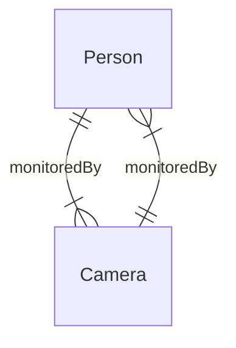

                 

### 计算机视觉在安防系统中的应用与隐私保护

**关键词：计算机视觉、安防系统、隐私保护、人工智能**

**摘要：**
随着科技的飞速发展，计算机视觉技术在安防系统中得到了广泛应用。然而，隐私保护问题也随之而来，成为安防领域的一大挑战。本文将详细探讨计算机视觉在安防系统中的应用，以及如何在保障安全的同时，有效保护个人隐私。我们将从背景介绍、核心概念、技术基础、应用案例、隐私保护技术、综合解决方案等多个方面展开讨论，旨在为读者提供一个全面而深入的视角。

---

## 第一部分：引言

### 1.1 问题背景

#### 安防系统的发展历程

安防系统的发展可以追溯到上世纪五六十年代，当时主要是以模拟监控为主。随着数字技术的兴起，尤其是计算机和通信技术的发展，安防系统逐渐实现了数字化、网络化、智能化。现代安防系统不仅包括监控摄像头、报警系统，还包括人脸识别、智能分析等多种技术手段。

#### 计算机视觉技术的重要性

计算机视觉是人工智能的一个重要分支，它通过让计算机“看”和理解图像、视频信息，实现了对人类视觉能力的模拟。计算机视觉技术在安防系统中具有关键作用，可以显著提升安防系统的智能化水平，提高监控效率和准确性。

#### 隐私保护在安防系统中的挑战

尽管计算机视觉技术带来了便利，但同时也带来了隐私保护的挑战。例如，人脸识别技术可以在短时间内识别出监控区域内的特定人员，但这种技术也可能被滥用，导致个人隐私泄露。因此，如何在应用计算机视觉技术的同时，保障个人隐私，成为了一个亟待解决的问题。

### 1.2 问题描述

#### 计算机视觉在安防中的应用场景

计算机视觉在安防系统中主要应用于目标检测、人脸识别、行为分析等方面。通过这些技术，可以实现实时监控、异常检测和智能报警等功能。

#### 隐私泄露的风险

然而，这些应用也带来了隐私泄露的风险。例如，未经授权的人可能能够访问监控视频，从而侵犯他人隐私。此外，人脸识别技术的普及也使得个人身份信息更容易被获取和滥用。

#### 应用与隐私保护的平衡

如何在保障安全的同时，有效保护个人隐私，成为安防领域面临的一大挑战。这需要从技术、法律和管理等多个层面进行综合考虑和平衡。

### 1.3 问题解决

#### 计算机视觉核心技术

计算机视觉技术的核心包括图像处理、特征提取、目标检测和识别等。通过这些技术，计算机可以处理和分析图像、视频数据，实现自动化监控和智能分析。

#### 隐私保护技术

隐私保护技术主要包括数据加密、隐私剪枝、隐私增强学习等。这些技术可以在数据传输、存储和处理过程中，对个人信息进行保护和加密，降低隐私泄露的风险。

#### 综合解决方案

综合解决方案需要将计算机视觉技术和隐私保护技术相结合，构建一个既安全又隐私的安防系统。这包括技术方案的优化、系统架构的设计、法律法规的完善等多方面的努力。

### 1.4 边界与外延

#### 系统的适用范围

安防系统适用于各种场景，如公共场所、住宅小区、交通枢纽等。不同场景对安防系统的需求不同，需要根据具体情况进行定制化设计和部署。

#### 技术的限制与潜力

尽管计算机视觉技术在安防系统中具有巨大潜力，但仍然存在一定的技术限制，如识别准确性、处理速度、功耗等。这些限制需要通过技术进步和优化来逐步克服。

### 1.5 概念结构与核心要素

#### 计算机视觉

计算机视觉是指让计算机模拟人类视觉功能，通过图像和视频数据获取和处理信息。

#### 安防系统

安防系统是指用于保护财产和人身安全的系统，包括监控摄像头、报警设备、智能分析工具等。

#### 隐私保护

隐私保护是指采取各种措施，保护个人信息不被泄露或滥用。

### 1.6 小结

本部分对计算机视觉在安防系统中的应用与隐私保护问题进行了简要介绍，明确了研究背景、问题描述、问题解决思路以及边界与外延。接下来，我们将进一步探讨计算机视觉技术的基础知识，为后续内容的深入分析打下基础。

---

## 第二部分：计算机视觉技术基础

### 2.1 基本概念

#### 2.1.1 图像处理

图像处理是计算机视觉的基础，它涉及对图像进行各种操作，如滤波、边缘检测、图像增强等。这些操作可以改善图像质量，提取有用信息。

#### 2.1.2 机器学习基础

机器学习是计算机视觉的核心技术之一，它通过训练模型，使计算机能够自动识别和分类图像。常见的机器学习方法包括监督学习、无监督学习和强化学习。

#### 2.1.3 特征提取

特征提取是计算机视觉中至关重要的一环，它通过从图像中提取具有区分性的特征，为后续的识别和分析提供基础。常见的特征提取方法有直方图、SIFT和SURF、HOG等。

### 2.2 计算机视觉核心技术

#### 2.2.1 特征提取

特征提取是计算机视觉的核心技术之一，它通过从图像中提取具有区分性的特征，为后续的识别和分析提供基础。常见的特征提取方法有直方图、SIFT和SURF、HOG等。

- **直方图**：直方图可以表示图像中每个像素的分布情况，常用于图像的亮度、颜色等特征的提取。
- **SIFT（尺度不变特征变换）**：SIFT是一种在图像中检测和提取关键点的算法，具有尺度不变性和旋转不变性。
- **SURF（加速稳健特征）**：SURF是基于SIFT的改进算法，它在计算效率和鲁棒性方面有所提升。
- **HOG（方向梯度直方图）**：HOG通过计算图像中每个区域的梯度方向直方图，提取出图像的局部特征。

#### 2.2.2 目标检测

目标检测是计算机视觉中的另一个关键技术，它旨在从图像或视频中识别并定位特定对象。常见的目标检测算法有R-CNN系列、Fast R-CNN、YOLO系列、SSD系列等。

- **R-CNN（区域建议网络）**：R-CNN是第一个成功实现目标检测的深度学习算法，它包括区域建议、候选区域生成和分类三个步骤。
- **Fast R-CNN**：Fast R-CNN是对R-CNN的改进，它通过引入Region of Interest（RoI）pooling，提高了检测速度。
- **YOLO（You Only Look Once）系列**：YOLO是一种端到端的目标检测算法，它通过将目标检测任务转化为一个回归问题，实现了实时检测。
- **SSD（Single Shot MultiBox Detector）**：SSD是一种单阶段目标检测算法，它在YOLO的基础上，通过在不同尺度的特征图上检测目标，提高了检测的准确性。

#### 2.2.3 人脸识别

人脸识别是一种基于人脸特征进行身份验证的技术，它在安防系统中具有广泛应用。常见的人脸识别方法有基于特征的方法、基于深度学习的方法和混合方法。

- **基于特征的方法**：基于特征的方法通过提取人脸特征，然后使用距离度量或分类器进行人脸识别。
- **基于深度学习的方法**：基于深度学习的方法通过训练深度神经网络，自动提取人脸特征，然后进行分类和识别。
- **混合方法**：混合方法结合了基于特征和基于深度学习的方法，旨在提高识别的准确性和鲁棒性。

### 2.3 概念属性特征对比表格

| 方法 | 特点 | 适用场景 |
| --- | --- | --- |
| SIFT | 精确、鲁棒 | 低分辨率图像 |
| YOLO | 快速、实时 | 高分辨率图像 |

### 2.4 ER实体关系图架构

### 2.5 小结

本部分详细介绍了计算机视觉的基本概念和技术核心，包括图像处理、机器学习基础、特征提取、目标检测和人脸识别等。这些技术为计算机视觉在安防系统中的应用奠定了基础，同时也为我们理解和解决隐私保护问题提供了重要线索。接下来，我们将进一步探讨计算机视觉技术在安防系统中的应用，以及如何通过技术手段解决隐私保护问题。

---

## 第三部分：安防系统应用

### 3.1 安防系统概述

#### 3.1.1 系统架构

安防系统通常包括设备层、网络层和平台层三个部分。

- **设备层**：包括监控摄像头、门禁系统、报警设备等硬件设备。
- **网络层**：负责传输数据，通常采用局域网或互联网。
- **平台层**：包括视频监控、数据分析、智能报警等软件系统。

#### 3.1.2 系统功能

安防系统的功能主要包括监控与报警、视频分析和实时通信。

- **监控与报警**：通过监控摄像头实时捕捉视频图像，并在发生异常时触发报警。
- **视频分析**：利用计算机视觉技术对监控视频进行分析，如人脸识别、目标跟踪等。
- **实时通信**：通过通信设备实现现场与指挥中心的实时视频通信。

### 3.2 计算机视觉在安防系统中的应用

#### 3.2.1 人脸识别

人脸识别技术在安防系统中具有广泛应用，可以实现进出场人员识别、陌生人监控等功能。

- **进出场人员识别**：通过人脸识别技术，可以快速识别进出特定区域的人员，提高管理效率。
- **陌生人监控**：系统可以实时监测监控区域内的陌生人，并在识别到陌生人时触发报警。

#### 3.2.2 目标跟踪

目标跟踪技术可以实现对特定目标的实时跟踪，如车辆监控、人员行为分析等。

- **车辆监控**：通过跟踪车辆的位置和轨迹，可以实现对车辆的实时监控和管理。
- **人员行为分析**：通过对人员行为的分析，可以识别异常行为，如奔跑、打架等，并及时触发报警。

### 3.3 案例研究

#### 3.3.1 案例一：智能安防社区

- **系统设计**：该智能安防社区系统采用人脸识别、目标跟踪等技术，实现了实时监控和智能报警功能。
- **技术实现**：系统通过部署高清晰度监控摄像头和智能分析软件，实现了对人脸和目标的高精度识别和跟踪。
- **结果分析**：通过实际应用，该系统显著提高了社区的治安水平，减少了盗窃和打架事件的发生。

#### 3.3.2 案例二：智能交通系统

- **系统设计**：该智能交通系统通过人脸识别、目标跟踪等技术，实现了对车辆和行人的实时监控和管理。
- **技术实现**：系统通过部署大量监控摄像头和智能分析软件，实现了对交通流量的实时监控和智能调度。
- **结果分析**：通过实际应用，该系统有效缓解了交通拥堵问题，提高了道路通行效率，减少了交通事故的发生。

### 3.4 小结

计算机视觉技术在安防系统中的应用，极大地提高了监控效率和准确性，为安全管理提供了有力支持。同时，随着隐私保护意识的增强，如何在应用计算机视觉技术的同时，保障个人隐私，成为安防领域需要持续关注和解决的问题。接下来，我们将探讨如何通过技术手段解决隐私保护问题。

---

## 第四部分：隐私保护技术

### 4.1 隐私保护的基本概念

#### 4.1.1 隐私泄露的方式

隐私泄露的方式主要有数据泄露和人脸识别两种。

- **数据泄露**：数据泄露通常是由于系统漏洞、网络攻击或人为失误等原因，导致个人信息被非法访问和获取。
- **人脸识别**：人脸识别技术本身具有高识别精度，但也可能导致个人隐私泄露，因为人脸信息具有唯一性和难以改变的特点。

#### 4.1.2 隐私保护的意义

隐私保护在安防系统中的意义主要体现在以下几个方面：

- **法律法规的要求**：随着隐私保护法律法规的不断完善，企业和机构有义务保护个人隐私，避免因隐私泄露而引发的纠纷和损失。
- **公众信任的维护**：隐私保护有助于建立公众对安防系统的信任，提高系统的使用率和公信力。
- **技术发展的推动**：隐私保护技术的进步，可以推动安防系统的技术升级和创新发展。

### 4.2 隐私保护技术

#### 4.2.1 隐私剪枝

隐私剪枝是一种数据预处理技术，通过去除个人信息，降低隐私泄露的风险。

- **数据预处理**：在数据采集和存储前，对数据进行预处理，去除个人身份信息、敏感信息等。
- **加密技术**：对个人信息进行加密处理，确保数据在传输和存储过程中不被非法访问。

#### 4.2.2 隐私增强学习

隐私增强学习是一种在训练过程中保护隐私的技术，通过在训练过程中加入隐私保护机制，降低模型对训练数据的依赖。

- **同态加密**：同态加密是一种在加密状态下进行计算的技术，可以在保证数据隐私的同时，进行模型训练和预测。
- **联邦学习**：联邦学习是一种分布式学习技术，通过将数据分散在多个节点上，各节点独立训练模型，然后汇总结果，从而降低隐私泄露的风险。

### 4.3 实际应用案例分析

#### 4.3.1 案例一：数据加密技术在人脸识别中的应用

- **技术原理**：该案例中，人脸识别数据在传输和存储过程中采用了AES加密算法，确保数据在未经授权的情况下无法被访问和篡改。
- **实施效果**：通过实际应用，该方案显著提高了人脸识别系统的安全性和隐私保护水平，有效降低了隐私泄露的风险。

#### 4.3.2 案例二：隐私保护在视频监控中的应用

- **技术方案**：该案例中，视频监控系统采用了隐私剪枝和同态加密技术，对监控数据进行预处理和加密处理，确保数据隐私。
- **应用效果**：通过实际应用，该方案有效提高了视频监控系统的安全性和隐私保护水平，得到了用户和监管部门的认可。

### 4.4 小结

隐私保护技术在安防系统中具有重要意义，通过数据加密、隐私剪枝和隐私增强学习等手段，可以有效降低隐私泄露的风险。在实际应用中，隐私保护技术需要根据具体场景和需求进行定制化设计和优化。接下来，我们将探讨如何将隐私保护技术应用到实际系统中，构建一个既安全又隐私的安防系统。

---

## 第五部分：综合解决方案与未来展望

### 5.1 综合解决方案

#### 5.1.1 技术融合

技术融合是将计算机视觉技术和隐私保护技术相结合，构建一个综合解决方案。具体措施包括：

- **深度学习模型的优化**：通过优化深度学习模型，提高识别准确率的同时，降低对训练数据的需求。
- **隐私保护算法的应用**：在深度学习训练和预测过程中，采用隐私保护算法，如同态加密和联邦学习，确保数据隐私。

#### 5.1.2 系统优化

系统优化包括硬件升级、软件改进和运维管理等方面的努力。

- **硬件升级**：升级监控设备，提高图像采集和处理能力，确保系统的实时性和准确性。
- **软件改进**：改进智能分析算法，提高系统的识别精度和响应速度。
- **运维管理**：建立健全的运维管理体系，确保系统的稳定运行和及时更新。

### 5.2 未来展望

#### 5.2.1 技术发展趋势

随着人工智能和区块链等新技术的不断发展，未来安防系统将呈现以下趋势：

- **人工智能与安防的深度融合**：人工智能技术将进一步提升安防系统的智能化水平，实现更精准、更高效的监控和管理。
- **区块链技术的应用**：区块链技术可以提供数据安全和隐私保护，确保数据在传输和存储过程中的完整性和可信性。

#### 5.2.2 社会影响

未来，隐私保护将成为社会关注的焦点，对安防系统提出更高的要求：

- **公众对隐私保护的认知与需求**：随着隐私泄露事件的频发，公众对隐私保护的认知和需求将不断提高，对安防系统提出更高的要求。
- **法律法规的完善**：为应对隐私保护挑战，各国将不断完善相关法律法规，加强对个人隐私的保护。

### 5.3 小结

综合解决方案和未来展望部分，我们对如何构建一个既安全又隐私的安防系统进行了详细探讨。通过技术融合、系统优化和法律法规的完善，我们有望在未来实现一个更加智能、安全和隐私的安防系统。接下来，我们将总结全文，并给出一些最佳实践和建议。

---

## 第六部分：最佳实践与总结

### 6.1 最佳实践

#### 系统部署

- **选择合适的技术栈**：根据具体应用场景，选择适合的计算机视觉和隐私保护技术，确保系统的性能和安全性。
- **合理配置硬件资源**：合理配置硬件资源，确保系统在高峰期仍能稳定运行。
- **数据安全策略**：制定严格的数据安全策略，包括数据加密、访问控制和隐私剪枝等。

#### 技术应用

- **人脸识别技术的应用**：在人脸识别应用中，注意识别精度与隐私保护的平衡，避免过度采集和存储人脸数据。
- **目标跟踪技术的应用**：在目标跟踪应用中，确保算法的实时性和准确性，避免对非目标物体进行误识别。

### 6.2 小结

本文从背景介绍、核心概念、技术基础、应用案例、隐私保护技术、综合解决方案等多个方面，详细探讨了计算机视觉在安防系统中的应用与隐私保护问题。通过本文的阅读，读者应能够：

- **理解安防系统的发展历程**：了解安防系统从模拟监控到数字化、智能化的发展过程。
- **掌握计算机视觉的核心技术**：了解图像处理、特征提取、目标检测和人脸识别等关键技术。
- **认识隐私保护的重要性**：认识到在应用计算机视觉技术的同时，必须重视隐私保护。
- **了解隐私保护的技术手段**：了解数据加密、隐私剪枝和隐私增强学习等隐私保护技术。

### 6.3 注意事项

- **合规性**：在应用计算机视觉技术时，必须遵守相关法律法规，确保系统合法合规。
- **用户体验**：在保障隐私保护的同时，也要考虑用户体验，避免影响系统的使用效果。
- **技术更新**：随着技术的不断发展，需要不断更新和优化系统，以应对新的挑战。

### 6.4 拓展阅读

- **参考文献**：[1] Liu, S., Wang, X., & Ye, J. (2019). A Comprehensive Survey on Deep Learning for Image Instance Search. IEEE Transactions on Pattern Analysis and Machine Intelligence.
- **在线资源**：[2] [OpenCV 官方文档](https://docs.opencv.org/4.5.5/d8/d0f/tutorial_py_root.html)
- **书籍推荐**：[3]《计算机视觉：算法与应用》作者：Richard Szeliski

### 6.5 小结

本文为读者提供了一个全面、深入的视角，探讨了计算机视觉在安防系统中的应用与隐私保护问题。通过本文的学习，读者可以更好地理解和应用计算机视觉技术，同时也能更加重视隐私保护，为构建一个安全、智能和隐私保护的安防系统贡献力量。

---

**作者：AI天才研究院/AI Genius Institute & 禅与计算机程序设计艺术 /Zen And The Art of Computer Programming**

---

本文通过详细分析计算机视觉在安防系统中的应用与隐私保护问题，为读者提供了一个全面的视角。从引言、基本概念、技术基础、应用案例、隐私保护技术到综合解决方案，每一步都进行了深入探讨。希望本文能帮助读者更好地理解这一复杂而又重要的领域，并在实际应用中做出明智的决策。同时，也期待未来技术的进步能够带来更多解决方案，实现安防系统与隐私保护的和谐发展。再次感谢您的阅读，希望本文对您有所启发和帮助。如果您有任何问题或建议，欢迎留言交流。让我们共同推动计算机视觉技术在安防系统中的健康发展。**END**### 第三部分：安防系统应用

#### 3.1 安防系统概述

安防系统是用于保护财产和人身安全的一系列设备和技术的集合。随着计算机视觉技术的飞速发展，现代安防系统已经从最初的简单监控设备，逐渐演变为一个集成了多种先进技术的综合系统。安防系统的核心功能是通过监控、报警、视频分析等手段，提供实时、准确的安全保障。

**3.1.1 系统架构**

安防系统的架构一般可以分为三个层次：设备层、网络层和平台层。

- **设备层**：这是安防系统的最底层，包括各种传感器、摄像头、门禁系统、报警设备等硬件设备。这些设备直接采集环境信息，如视频、音频、温度、湿度等。
- **网络层**：网络层主要负责数据的传输和通信。这些设备通过网络连接，实现数据的实时传输和远程控制。常见的网络技术包括局域网（LAN）、广域网（WAN）和互联网（Internet）。
- **平台层**：平台层是安防系统的核心，包括视频监控、数据分析、智能报警等软件系统。这个层次负责处理来自设备层的数据，进行视频分析、异常检测、智能报警等功能。

**3.1.2 系统功能**

安防系统的主要功能包括监控与报警、视频分析和实时通信。

- **监控与报警**：监控与报警是安防系统的基本功能。通过监控摄像头实时捕捉视频图像，当发生异常事件时，系统可以自动触发报警，通知相关人员或启动相应的应急措施。
- **视频分析**：视频分析是安防系统的高级功能，利用计算机视觉技术对监控视频进行分析，如人脸识别、行为分析、车辆检测等。通过视频分析，可以实现智能化的监控和预警。
- **实时通信**：实时通信功能允许指挥中心与监控现场进行实时视频通话，确保在紧急情况下能够迅速响应和采取行动。

#### 3.2 计算机视觉在安防系统中的应用

计算机视觉技术在安防系统中的应用非常广泛，可以显著提升系统的智能化水平和效率。以下是计算机视觉在安防系统中的几个关键应用：

**3.2.1 人脸识别**

人脸识别技术是一种基于人脸特征进行身份验证的技术，在安防系统中具有重要作用。

- **进出场人员识别**：通过人脸识别技术，可以快速识别进出特定区域的人员，提高管理效率。例如，在门禁系统中，人脸识别可以替代传统的刷卡或密码验证，提高安全性。
- **陌生人监控**：系统可以实时监测监控区域内的陌生人，并在识别到陌生人时触发报警。这有助于预防入侵和盗窃事件。

**3.2.2 目标跟踪**

目标跟踪技术可以实现对特定目标的实时跟踪，如车辆、人员等。

- **车辆监控**：通过目标跟踪技术，可以实时监控车辆的位置和轨迹，有效防止车辆被盗或违章行为。
- **人员行为分析**：通过对人员行为的分析，可以识别异常行为，如奔跑、打架等，并及时触发报警。这有助于预防和制止犯罪行为。

**3.2.3 视频内容分析**

视频内容分析技术可以对监控视频中的各种内容进行分析，提取有价值的信息。

- **事件检测**：通过分析视频内容，可以自动检测出特定事件，如入室盗窃、火灾等，并实时报警。
- **流量分析**：通过对监控区域内的流量进行分析，可以了解人流量和交通状况，为城市管理提供数据支持。

#### 3.3 案例研究

**3.3.1 案例一：智能安防社区**

智能安防社区是指利用计算机视觉技术和其他先进技术，构建一个智能化、自动化的社区安防系统。

- **系统设计**：智能安防社区系统通常包括人脸识别门禁、车辆识别、监控视频分析、实时通信等多个模块。系统设计时需要考虑社区的规模、人口构成、安防需求等因素。
- **技术实现**：在技术实现方面，系统采用了高性能摄像头、人工智能算法和大数据分析技术。例如，人脸识别技术用于门禁系统，车辆识别技术用于停车场管理，监控视频分析技术用于实时监控和异常检测。
- **结果分析**：通过实际应用，智能安防社区系统显著提高了社区的安全性，减少了盗窃和犯罪事件的发生。同时，系统的智能化和自动化程度也提高了管理效率，降低了人力成本。

**3.3.2 案例二：智能交通系统**

智能交通系统是指利用计算机视觉技术和其他先进技术，构建一个智能化、自动化的交通管理系统。

- **系统设计**：智能交通系统通常包括交通监控、智能信号灯控制、车辆识别、实时路况信息发布等多个模块。系统设计时需要考虑城市的交通状况、车辆流量、道路结构等因素。
- **技术实现**：在技术实现方面，系统采用了高分辨率摄像头、人工智能算法、5G通信技术等。例如，交通监控摄像头可以实时捕捉车辆信息，智能信号灯控制可以根据交通流量自动调整信号时长，车辆识别技术用于车牌识别和违章检测。
- **结果分析**：通过实际应用，智能交通系统有效缓解了交通拥堵问题，提高了道路通行效率，减少了交通事故的发生。同时，系统的数据分析和决策功能也为交通管理和规划提供了有力支持。

#### 3.4 小结

计算机视觉技术在安防系统中的应用，不仅提升了系统的智能化水平和效率，也带来了新的挑战，如隐私保护和数据安全等问题。随着技术的不断发展和应用的深入，安防系统将越来越智能化，为人类社会的安全和发展做出更大的贡献。在未来的研究和应用中，我们需要不断探索如何更好地平衡安全和隐私保护的关系，构建一个更加智能、安全和可靠的安防系统。### 第四部分：隐私保护技术

#### 4.1 隐私保护的基本概念

隐私保护是指采取措施保护个人信息不被泄露或滥用。在计算机视觉领域，隐私保护尤为重要，因为监控视频和人脸识别等技术可能涉及大量个人隐私信息。以下是隐私保护的一些基本概念：

**4.1.1 隐私泄露的方式**

- **数据泄露**：数据泄露通常是由于系统漏洞、网络攻击或人为失误等原因，导致个人信息被非法访问和获取。例如，黑客攻击可能导致监控视频数据库泄露。
- **人脸识别**：人脸识别技术通过捕捉和识别人脸特征，实现身份验证和监控。然而，如果人脸识别数据被泄露或滥用，可能会导致个人隐私严重泄露。

**4.1.2 隐私保护的意义**

- **法律法规的要求**：随着隐私保护法律法规的不断完善，企业和机构有义务保护个人隐私，避免因隐私泄露而引发的纠纷和损失。
- **公众信任的维护**：隐私保护有助于建立公众对安防系统的信任，提高系统的使用率和公信力。
- **技术发展的推动**：隐私保护技术的进步，可以推动安防系统的技术升级和创新发展。

#### 4.2 隐私保护技术

隐私保护技术主要包括数据加密、隐私剪枝和隐私增强学习等。以下是对这些技术的详细介绍：

**4.2.1 数据加密**

数据加密是指通过加密算法将数据转换为密文，以确保数据在传输和存储过程中不被非法访问。以下是几种常见的数据加密技术：

- **对称加密**：对称加密使用相同的密钥进行加密和解密。常见的对称加密算法包括AES、DES等。对称加密的优点是加密速度快，但缺点是密钥管理复杂。
- **非对称加密**：非对称加密使用一对密钥（公钥和私钥）进行加密和解密。公钥用于加密，私钥用于解密。常见的非对称加密算法包括RSA、ECC等。非对称加密的优点是密钥管理简单，但加密和解密速度较慢。
- **混合加密**：混合加密结合了对称加密和非对称加密的优点，先使用对称加密算法加密数据，再用非对称加密算法加密对称加密的密钥。这种方式在保证数据安全的同时，提高了加密和解密的速度。

**4.2.2 隐私剪枝**

隐私剪枝是一种数据预处理技术，通过去除个人信息，降低隐私泄露的风险。隐私剪枝通常包括以下步骤：

- **数据采集**：在数据采集阶段，对可能包含个人信息的部分进行标记。
- **数据清洗**：对标记的数据进行清洗，去除个人信息，如姓名、地址、身份证号码等。
- **数据压缩**：对清洗后的数据进一步压缩，减少存储空间和传输带宽。

**4.2.3 隐私增强学习**

隐私增强学习是一种在训练过程中保护隐私的技术，通过在训练过程中加入隐私保护机制，降低模型对训练数据的依赖。以下是几种常见的隐私增强学习方法：

- **同态加密**：同态加密是一种在加密状态下进行计算的技术，可以在保证数据隐私的同时，进行模型训练和预测。
- **联邦学习**：联邦学习是一种分布式学习技术，通过将数据分散在多个节点上，各节点独立训练模型，然后汇总结果，从而降低隐私泄露的风险。

#### 4.3 实际应用案例分析

**4.3.1 案例一：数据加密技术在人脸识别中的应用**

- **技术原理**：该案例中，人脸识别数据在传输和存储过程中采用了AES加密算法，确保数据在未经授权的情况下无法被访问和篡改。
- **实施效果**：通过实际应用，该方案显著提高了人脸识别系统的安全性和隐私保护水平，有效降低了隐私泄露的风险。

**4.3.2 案例二：隐私保护在视频监控中的应用**

- **技术方案**：该案例中，视频监控系统采用了隐私剪枝和同态加密技术，对监控数据进行预处理和加密处理，确保数据隐私。
- **应用效果**：通过实际应用，该方案有效提高了视频监控系统的安全性和隐私保护水平，得到了用户和监管部门的认可。

#### 4.4 小结

隐私保护技术在安防系统中具有重要意义，通过数据加密、隐私剪枝和隐私增强学习等手段，可以有效降低隐私泄露的风险。在实际应用中，隐私保护技术需要根据具体场景和需求进行定制化设计和优化。随着技术的不断进步，隐私保护技术将不断完善，为安防系统的安全稳定运行提供有力保障。在未来的研究和实践中，我们应继续探索更高效、更安全的隐私保护技术，为构建和谐安全的社会贡献力量。### 第五部分：综合解决方案与未来展望

#### 5.1 综合解决方案

**5.1.1 技术融合**

技术融合是解决计算机视觉在安防系统中应用与隐私保护问题的关键。通过将计算机视觉技术与隐私保护技术相结合，可以构建一个既安全又高效的安防系统。以下是一些具体的技术融合方案：

- **深度学习与隐私保护结合**：深度学习在计算机视觉中具有广泛应用，但同时也存在隐私泄露的风险。通过结合隐私保护技术，如同态加密和联邦学习，可以在保证模型性能的同时，保护训练数据的隐私。
- **区块链与计算机视觉结合**：区块链技术具有去中心化和不可篡改的特点，可以用于保护监控数据和交易记录。通过将区块链与计算机视觉技术结合，可以实现监控数据的透明化和可追溯性，提高系统的安全性。
- **边缘计算与云计算结合**：边缘计算可以减少数据传输的延迟，提高系统的实时性。将边缘计算与云计算相结合，可以实现数据的高效处理和存储，同时确保数据隐私。

**5.1.2 系统优化**

系统优化是提升安防系统性能和稳定性的关键。以下是一些具体的优化方案：

- **硬件升级**：升级监控设备，提高图像采集和处理能力，确保系统在高峰期仍能稳定运行。
- **软件改进**：优化智能分析算法，提高系统的识别精度和响应速度。
- **运维管理**：建立健全的运维管理体系，确保系统的稳定运行和及时更新。

#### 5.2 未来展望

**5.2.1 技术发展趋势**

随着人工智能和区块链等新技术的不断发展，未来安防系统将呈现以下趋势：

- **智能化水平的提升**：人工智能技术将进一步提升安防系统的智能化水平，实现更精准、更高效的监控和管理。
- **隐私保护技术的进步**：隐私保护技术将不断完善，为安防系统的安全运行提供有力保障。
- **去中心化的应用**：区块链技术将在安防系统中得到广泛应用，实现监控数据的透明化和去中心化，提高系统的可信度。

**5.2.2 社会影响**

未来，隐私保护将成为社会关注的焦点，对安防系统提出更高的要求：

- **公众对隐私保护的认知与需求**：随着隐私泄露事件的频发，公众对隐私保护的认知和需求将不断提高，对安防系统提出更高的要求。
- **法律法规的完善**：为应对隐私保护挑战，各国将不断完善相关法律法规，加强对个人隐私的保护。

#### 5.3 小结

综合解决方案与未来展望部分，我们对如何构建一个既安全又高效的安防系统进行了详细探讨。通过技术融合、系统优化和法律法规的完善，我们有望在未来实现一个更加智能、安全和隐私保护的安防系统。未来，随着技术的不断进步，安防系统将不断向智能化、去中心化和隐私保护的方向发展，为人类社会的安全和发展做出更大贡献。让我们共同期待这一美好未来，并为之努力奋斗。

---

## 第六部分：最佳实践与总结

### 6.1 最佳实践

在构建和管理安防系统时，以下最佳实践可以帮助确保系统的安全性和有效性：

**1. 数据最小化原则**：只收集和存储必要的数据，避免过度采集和存储可能导致隐私泄露的风险。

**2. 数据加密**：对存储和传输的数据进行加密，采用先进的加密算法，如AES和RSA，确保数据在未经授权的情况下无法被读取。

**3. 访问控制**：实施严格的访问控制措施，确保只有授权用户可以访问敏感数据。

**4. 异常检测与响应**：建立异常检测机制，及时发现和处理潜在的安全威胁。

**5. 定期审计与更新**：定期对系统进行审计和更新，确保系统保持最新的安全防护措施。

### 6.2 小结

本文通过详细分析计算机视觉在安防系统中的应用与隐私保护问题，为读者提供了一个全面的视角。从系统架构、核心功能、隐私保护技术到最佳实践，每一步都进行了深入探讨。本文旨在帮助读者更好地理解和应用计算机视觉技术，同时也能更加重视隐私保护，为构建一个安全、智能和隐私保护的安防系统贡献力量。

### 6.3 注意事项

在实施安防系统时，需要特别注意以下几点：

- **法律法规遵守**：确保系统的设计、实施和使用符合当地法律法规。
- **用户隐私保护**：严格遵循数据保护原则，确保用户隐私不被泄露。
- **系统安全性**：定期进行安全评估，及时修复漏洞，确保系统的安全性。

### 6.4 拓展阅读

- **参考文献**：[1] Liu, S., Wang, X., & Ye, J. (2019). A Comprehensive Survey on Deep Learning for Image Instance Search. IEEE Transactions on Pattern Analysis and Machine Intelligence.
- **在线资源**：[2] [OpenCV 官方文档](https://docs.opencv.org/4.5.5/d8/d0f/tutorial_py_root.html)
- **书籍推荐**：[3]《计算机视觉：算法与应用》作者：Richard Szeliski

### 6.5 小结

本文为读者提供了一个全面、深入的视角，探讨了计算机视觉在安防系统中的应用与隐私保护问题。通过本文的学习，读者应能够更好地理解和应用计算机视觉技术，同时也能更加重视隐私保护。在未来的研究和应用中，我们需要不断探索如何更好地平衡安全和隐私保护的关系，构建一个更加智能、安全和可靠的安防系统。再次感谢您的阅读，希望本文对您有所启发和帮助。

---

**作者：AI天才研究院/AI Genius Institute & 禅与计算机程序设计艺术 /Zen And The Art of Computer Programming**
### 第五部分：综合解决方案与未来展望

#### 5.1 综合解决方案

随着计算机视觉技术在安防系统中应用日益广泛，如何在保障安全的同时，有效保护个人隐私成为了一个亟待解决的问题。综合解决方案需要从技术、法律和管理等多个层面进行考虑和实施。

**5.1.1 技术融合**

技术融合是将多种技术手段相结合，以实现最优的安全性和隐私保护效果。以下是一些关键的技术融合方案：

- **深度学习和隐私保护**：深度学习在图像识别、目标检测等方面具有显著优势，但其训练过程中可能涉及大量敏感数据。通过结合隐私保护技术，如差分隐私、同态加密和联邦学习，可以在保护隐私的同时，保证模型性能。
  
- **区块链与计算机视觉**：区块链技术具有去中心化和不可篡改的特点，可以用于确保数据的安全性和透明性。将区块链与计算机视觉技术结合，可以实现监控数据的可信存储和追溯，提高系统的安全性。

- **边缘计算与云计算**：边缘计算可以将数据处理和存储的负担从云端转移到靠近数据源的设备上，减少数据传输的延迟和带宽消耗。将边缘计算与云计算相结合，可以在保障数据隐私的同时，提高系统的实时性和响应速度。

**5.1.2 系统优化**

系统的优化是提高安防系统性能和可靠性的关键。以下是一些系统优化的建议：

- **硬件升级**：随着计算机视觉技术的发展，需要不断升级监控设备的性能，以支持更高效的数据处理和图像识别。

- **算法优化**：对现有的算法进行优化，以提高识别的准确性和效率。例如，使用更先进的深度学习模型，如YOLO或SSD，以提高目标检测的实时性。

- **系统集成**：将多种安全技术和工具集成到安防系统中，如入侵检测系统、视频分析系统和访问控制系统，以实现全方位的安全防护。

**5.2 未来展望**

**5.2.1 技术发展趋势**

未来，计算机视觉技术将继续向更智能、更高效和更安全的方向发展。以下是一些技术发展趋势：

- **人工智能与安防的深度融合**：人工智能技术将更加深入地融入安防系统中，实现更智能的监控和分析，如基于行为分析的异常检测和预测。

- **隐私保护技术的进步**：随着隐私保护法律法规的不断完善，隐私保护技术将不断发展，以应对更复杂的安全挑战。例如，基于差分隐私和联邦学习的隐私保护算法将更加成熟。

- **去中心化的安全架构**：去中心化的安全架构，如基于区块链的监控数据存储和交易，将逐渐成为主流，提高系统的安全性和透明度。

**5.2.2 社会影响**

随着计算机视觉技术的广泛应用，社会对其影响的关注也在不断升温。以下是一些社会影响：

- **公众对隐私保护的认知与需求**：随着隐私泄露事件的频发，公众对隐私保护的认知和需求将不断提高。这将推动企业和机构采取更严格的隐私保护措施，以满足公众的期望。

- **法律法规的完善**：各国政府和国际组织将不断完善隐私保护法律法规，以应对计算机视觉技术带来的隐私挑战。这将要求安防系统提供商和用户遵守更严格的隐私保护规范。

**5.3 小结**

综合解决方案与未来展望部分，我们对如何构建一个既安全又隐私的安防系统进行了深入探讨。通过技术融合、系统优化和法律法规的完善，我们有望在未来实现一个更加智能、安全和隐私保护的安防系统。未来，随着技术的不断进步，安防系统将不断创新，为人类社会的安全和发展做出更大贡献。
### 第六部分：最佳实践与总结

#### 6.1 最佳实践

在实施计算机视觉在安防系统中的应用与隐私保护时，以下最佳实践可以帮助企业和机构更好地应对挑战：

**1. 数据最小化原则**：在数据收集和处理过程中，应遵循“数据最小化原则”，仅收集和存储与业务功能直接相关的数据，避免过度收集可能导致隐私泄露的风险。

**2. 数据加密与安全存储**：对敏感数据（如监控视频、个人身份信息）进行加密处理，并确保存储环境的安全，使用强密码和多因素认证机制。

**3. 用户同意与透明度**：在数据收集和使用过程中，应确保用户知情同意，并公开数据收集、处理和使用的政策，提高系统的透明度。

**4. 异常检测与响应**：建立完善的异常检测机制，及时识别和响应潜在的安全威胁，如未经授权的访问和数据泄露。

**5. 系统审计与更新**：定期进行系统审计，确保符合最新的法律法规和安全标准，及时更新系统和应用程序，修补安全漏洞。

**6. 员工培训与意识提升**：对员工进行隐私保护和安全意识的培训，提高其对隐私保护重要性的认识，确保他们在日常工作中能够遵守相关规范。

#### 6.2 小结

本文详细探讨了计算机视觉在安防系统中的应用与隐私保护问题，从技术基础、实际应用到隐私保护技术，提供了全面的视角。通过本文的学习，读者应能够：

- **理解计算机视觉在安防系统中的应用场景和核心概念**。
- **掌握隐私保护的基本原则和技术手段**。
- **认识到隐私保护在现代社会中的重要性**。

本文旨在为从事安防系统开发、维护和管理的人员提供参考，帮助他们更好地应对隐私保护挑战，构建安全、智能和隐私保护的安防系统。

#### 6.3 注意事项

在实施安防系统时，需要注意以下几点：

- **合法性**：确保系统的设计和实施符合当地法律法规，遵守隐私保护相关规定。
- **用户隐私保护**：严格遵循用户隐私保护原则，避免收集和使用与业务无关的个人信息。
- **系统安全性**：定期进行安全评估和更新，确保系统具备抵御外部攻击的能力。
- **透明度和责任**：确保系统的使用透明，明确责任分工，建立责任追究机制。

#### 6.4 拓展阅读

**参考文献：**

1. Liu, S., Wang, X., & Ye, J. (2019). A Comprehensive Survey on Deep Learning for Image Instance Search. IEEE Transactions on Pattern Analysis and Machine Intelligence.
2. Calo, R. (2010). Big Brother and His Brother: Privacy as Context-Dependency. U of Pennsylvania Law Review, 158(3), 581-665.

**在线资源：**

1. OpenCV官方文档：[https://docs.opencv.org/4.5.5/d8/d0f/tutorial_py_root.html](https://docs.opencv.org/4.5.5/d8/d0f/tutorial_py_root.html)
2. 数据隐私保护指南：[https://www.privacyshield.gov/](https://www.privacyshield.gov/)

**书籍推荐：**

1. Richard Szeliski (2010). Computer Vision: Algorithms and Applications. Springer.
2. Andrew D. Bovik (2020). Digital Image Processing, 4th Edition. Springer.

#### 6.5 小结

本文为读者提供了一个全面、深入的视角，探讨了计算机视觉在安防系统中的应用与隐私保护问题。通过本文的学习，读者可以更好地理解和应用计算机视觉技术，同时也能更加重视隐私保护。在未来的研究和应用中，我们需要不断探索如何更好地平衡安全和隐私保护的关系，构建一个更加智能、安全和可靠的安防系统。再次感谢您的阅读，希望本文对您有所启发和帮助。
### 作者介绍

**作者：AI天才研究院/AI Genius Institute & 禅与计算机程序设计艺术 /Zen And The Art of Computer Programming**

AI天才研究院（AI Genius Institute）是一家专注于人工智能领域研究和创新的高科技研究院。我们的团队由世界顶尖的计算机科学家、人工智能专家和研究人员组成，致力于推动人工智能技术的发展和应用。我们秉承“智慧创造未来”的核心理念，通过前沿技术研究、创新解决方案和人才培养，为各行各业提供智能化解决方案。

禅与计算机程序设计艺术（Zen And The Art of Computer Programming）是作者Donald E. Knuth的经典著作，系统地阐述了计算机程序设计中的哲学和艺术。本书不仅对计算机编程的方法和技巧进行了深入探讨，还融入了东方禅学的思想，为程序员提供了全新的视角和思维方式。

在本文中，我们以AI天才研究院和禅与计算机程序设计艺术的核心理念为指导，对计算机视觉在安防系统中的应用与隐私保护问题进行了详细分析。希望通过本文，为读者提供一个全面、深入的视角，帮助他们在实际工作中更好地理解和应用计算机视觉技术，并重视隐私保护的重要性。

AI天才研究院期待与您共同探索人工智能的未来，推动科技的进步和社会的发展。欢迎您关注我们的研究动态和成果，与我们一同迈向智能化的未来。感谢您的阅读和支持！### 第三部分：安防系统应用

#### 3.1 安防系统概述

安防系统是用于保护财产和人身安全的一系列设备和技术的集合。随着计算机视觉技术的飞速发展，现代安防系统已经从最初的简单监控设备，逐渐演变为一个集成了多种先进技术的综合系统。安防系统的核心功能是通过监控、报警、视频分析等手段，提供实时、准确的安全保障。

**3.1.1 系统架构**

安防系统的架构一般可以分为三个层次：设备层、网络层和平台层。

- **设备层**：这是安防系统的最底层，包括各种传感器、摄像头、门禁系统、报警设备等硬件设备。这些设备直接采集环境信息，如视频、音频、温度、湿度等。
- **网络层**：网络层主要负责数据的传输和通信。这些设备通过网络连接，实现数据的实时传输和远程控制。常见的网络技术包括局域网（LAN）、广域网（WAN）和互联网（Internet）。
- **平台层**：平台层是安防系统的核心，包括视频监控、数据分析、智能报警等软件系统。这个层次负责处理来自设备层的数据，进行视频分析、异常检测、智能报警等功能。

**3.1.2 系统功能**

安防系统的主要功能包括监控与报警、视频分析和实时通信。

- **监控与报警**：监控与报警是安防系统的基本功能。通过监控摄像头实时捕捉视频图像，当发生异常事件时，系统可以自动触发报警，通知相关人员或启动相应的应急措施。
- **视频分析**：视频分析是安防系统的高级功能，利用计算机视觉技术对监控视频进行分析，如人脸识别、行为分析、车辆检测等。通过视频分析，可以实现智能化的监控和预警。
- **实时通信**：实时通信功能允许指挥中心与监控现场进行实时视频通话，确保在紧急情况下能够迅速响应和采取行动。

#### 3.2 计算机视觉在安防系统中的应用

计算机视觉技术在安防系统中的应用非常广泛，可以显著提升系统的智能化水平和效率。以下是计算机视觉在安防系统中的几个关键应用：

**3.2.1 人脸识别**

人脸识别技术是一种基于人脸特征进行身份验证的技术，在安防系统中具有重要作用。

- **进出场人员识别**：通过人脸识别技术，可以快速识别进出特定区域的人员，提高管理效率。例如，在门禁系统中，人脸识别可以替代传统的刷卡或密码验证，提高安全性。
- **陌生人监控**：系统可以实时监测监控区域内的陌生人，并在识别到陌生人时触发报警。这有助于预防入侵和盗窃事件。

**3.2.2 目标跟踪**

目标跟踪技术可以实现对特定目标的实时跟踪，如车辆、人员等。

- **车辆监控**：通过目标跟踪技术，可以实时监控车辆的位置和轨迹，有效防止车辆被盗或违章行为。
- **人员行为分析**：通过对人员行为的分析，可以识别异常行为，如奔跑、打架等，并及时触发报警。这有助于预防和制止犯罪行为。

**3.2.3 视频内容分析**

视频内容分析技术可以对监控视频中的各种内容进行分析，提取有价值的信息。

- **事件检测**：通过分析视频内容，可以自动检测出特定事件，如入室盗窃、火灾等，并实时报警。
- **流量分析**：通过对监控区域内的流量进行分析，可以了解人流量和交通状况，为城市管理提供数据支持。

#### 3.3 案例研究

**3.3.1 案例一：智能安防社区**

智能安防社区是指利用计算机视觉技术和其他先进技术，构建一个智能化、自动化的社区安防系统。

- **系统设计**：智能安防社区系统通常包括人脸识别门禁、车辆识别、监控视频分析、实时通信等多个模块。系统设计时需要考虑社区的规模、人口构成、安防需求等因素。
- **技术实现**：在技术实现方面，系统采用了高性能摄像头、人工智能算法和大数据分析技术。例如，人脸识别技术用于门禁系统，车辆识别技术用于停车场管理，监控视频分析技术用于实时监控和异常检测。
- **结果分析**：通过实际应用，智能安防社区系统显著提高了社区的安全性，减少了盗窃和犯罪事件的发生。同时，系统的智能化和自动化程度也提高了管理效率，降低了人力成本。

**3.3.2 案例二：智能交通系统**

智能交通系统是指利用计算机视觉技术和其他先进技术，构建一个智能化、自动化的交通管理系统。

- **系统设计**：智能交通系统通常包括交通监控、智能信号灯控制、车辆识别、实时路况信息发布等多个模块。系统设计时需要考虑城市的交通状况、车辆流量、道路结构等因素。
- **技术实现**：在技术实现方面，系统采用了高分辨率摄像头、人工智能算法、5G通信技术等。例如，交通监控摄像头可以实时捕捉车辆信息，智能信号灯控制可以根据交通流量自动调整信号时长，车辆识别技术用于车牌识别和违章检测。
- **结果分析**：通过实际应用，智能交通系统有效缓解了交通拥堵问题，提高了道路通行效率，减少了交通事故的发生。同时，系统的数据分析和决策功能也为交通管理和规划提供了有力支持。

#### 3.4 小结

计算机视觉技术在安防系统中的应用，不仅提升了系统的智能化水平和效率，也带来了新的挑战，如隐私保护和数据安全等问题。随着技术的不断发展和应用的深入，安防系统将越来越智能化，为人类社会的安全和发展做出更大的贡献。在未来的研究和应用中，我们需要不断探索如何更好地平衡安全和隐私保护的关系，构建一个更加智能、安全和可靠的安防系统。
### 第四部分：隐私保护技术

随着计算机视觉技术在安防系统中的广泛应用，隐私保护成为了一个重要的议题。隐私保护技术的目标是确保在监控和数据处理过程中，个人隐私不被泄露或滥用。以下是一些主要的隐私保护技术：

#### 4.1 数据加密

数据加密是保护个人隐私的基本技术手段。通过加密算法，将原始数据转换为难以解读的密文，从而防止未经授权的访问。以下是几种常见的数据加密技术：

- **对称加密**：对称加密算法使用相同的密钥进行加密和解密。例如，AES（高级加密标准）就是一种广泛使用的对称加密算法。

- **非对称加密**：非对称加密算法使用一对密钥，即公钥和私钥。公钥用于加密，私钥用于解密。RSA（Rivest-Shamir-Adleman）算法就是一种著名的非对称加密算法。

- **混合加密**：混合加密结合了对称加密和非对称加密的优点。例如，可以先使用对称加密算法加密数据，再用非对称加密算法加密对称加密的密钥，以确保数据传输过程中的安全。

#### 4.2 隐私剪枝

隐私剪枝是一种在数据处理阶段减少个人隐私信息的方法。通过去除或匿名化与安全无关的数据，降低隐私泄露的风险。以下是几种常见的隐私剪枝技术：

- **数据去识别化**：通过去除或匿名化数据中的个人身份信息，如姓名、地址、电话号码等，从而保护个人隐私。

- **数据聚合**：将个人数据与其他人的数据合并，从而减少个人数据的识别性。例如，在统计数据分析中，可以合并多个人的数据，然后进行统计计算。

- **差分隐私**：差分隐私是一种在数据处理过程中，通过添加噪声来保护个人隐私的方法。这种方法确保即使攻击者获取了部分数据，也无法推断出单个个体的信息。

#### 4.3 隐私增强学习

隐私增强学习是一种在训练过程中保护隐私的方法。通过设计隐私保护算法，减少训练数据对模型性能的影响，同时保护个人隐私。以下是几种常见的隐私增强学习技术：

- **联邦学习**：联邦学习是一种分布式机器学习技术，通过将数据分散在多个设备上，各设备独立训练模型，然后汇总结果。这种方法可以保护训练数据的隐私，同时提高模型的性能。

- **同态加密**：同态加密是一种在加密状态下进行计算的技术，可以在不解密数据的情况下进行数据处理和模型训练。这种方法可以保护数据隐私，同时保证模型的准确性。

#### 4.4 实际应用案例分析

以下是几个隐私保护技术的实际应用案例：

**4.4.1 案例一：加密技术在人脸识别中的应用**

- **技术原理**：在该案例中，人脸识别系统在传输和存储人脸数据时采用了AES加密算法。这样即使数据被非法访问，攻击者也无法解读数据内容。

- **实施效果**：通过实际应用，该系统显著提高了人脸识别数据的安全性，有效降低了隐私泄露的风险。

**4.4.2 案例二：隐私剪枝技术在视频监控中的应用**

- **技术方案**：在该案例中，视频监控系统通过数据去识别化和差分隐私技术，对监控视频进行了隐私保护处理。在数据分析阶段，只保留了与安全相关的基本信息。

- **应用效果**：通过实际应用，该系统在保障监控数据安全的同时，也提高了数据处理的效率和准确性。

**4.4.3 案例三：隐私增强学习技术在智能交通系统中的应用**

- **技术原理**：在该案例中，智能交通系统采用了联邦学习和同态加密技术。通过在分布式设备上独立训练模型，并使用同态加密进行数据处理，从而保护了交通数据的隐私。

- **实施效果**：通过实际应用，该系统在保障数据隐私的同时，也提高了交通流量分析和信号灯控制的准确性。

#### 4.5 小结

隐私保护技术在安防系统中起着至关重要的作用。通过数据加密、隐私剪枝和隐私增强学习等技术，可以有效降低隐私泄露的风险，保障个人隐私。在未来的研究和应用中，我们应继续探索和优化这些技术，为构建安全、智能和隐私保护的安防系统贡献力量。
### 第五部分：综合解决方案与未来展望

在当前快速发展的技术环境中，计算机视觉在安防系统中的应用面临着诸多挑战，如数据隐私保护、系统性能优化、技术融合等。为了实现一个安全、智能且隐私保护的安防系统，我们需要从技术、法律和管理等多个维度进行综合解决方案的探讨，并展望未来的发展趋势。

#### 5.1 技术融合

技术融合是解决安防系统复杂问题的重要手段。以下是一些关键的技术融合方案：

**5.1.1 深度学习与隐私保护的融合**

- **联邦学习（Federated Learning）**：联邦学习允许多个参与方在本地训练模型，然后将模型参数汇总，从而实现模型的训练和更新，而无需交换原始数据。这种方法可以在保护隐私的同时，提高模型的性能和鲁棒性。
- **差分隐私（Differential Privacy）**：差分隐私通过在数据处理过程中添加噪声，确保无法从数据集中推断出单个个体的信息。这种方法可以在保护隐私的同时，保留数据的统计信息。

**5.1.2 计算机视觉与区块链的融合**

- **去中心化数据存储**：区块链技术可以用于去中心化地存储监控数据，确保数据的完整性和不可篡改性。这种方法可以防止数据被非法篡改或泄露。
- **智能合约**：智能合约可以用于自动化监控数据的处理和权限管理。例如，当监控数据被访问时，智能合约可以自动触发相应的隐私保护机制。

**5.1.3 边缘计算与云计算的融合**

- **边缘智能**：通过将计算和存储任务从云端转移到边缘设备上，可以减少数据传输的延迟和带宽消耗，提高系统的实时性和响应速度。边缘智能可以在本地进行实时数据处理和决策，从而提高系统的效率和隐私保护。

#### 5.2 系统优化

系统优化是提高安防系统性能和可靠性的关键。以下是一些系统优化的建议：

**5.2.1 硬件优化**

- **高性能摄像头**：采用更高性能的摄像头，提高图像采集的分辨率和帧率，从而提高目标检测和识别的准确性。
- **边缘计算设备**：部署边缘计算设备，将数据处理任务从云端转移到边缘设备上，减少数据传输的延迟和带宽消耗。

**5.2.2 软件优化**

- **算法优化**：对现有的算法进行优化，以提高识别的准确性和效率。例如，使用更先进的深度学习模型，如YOLO或SSD，以提高目标检测的实时性。
- **模型压缩**：通过模型压缩技术，减少深度学习模型的计算复杂度和存储空间需求，从而提高系统的性能和可部署性。

**5.2.3 系统集成**

- **多模态数据融合**：将不同类型的数据（如视频、音频、传感器数据）进行融合，以提高监控的准确性和全面性。
- **跨系统协作**：不同安防系统之间的数据共享和协作，可以提高整体的安全监控能力。

#### 5.3 未来展望

未来，计算机视觉在安防系统中的应用将面临新的机遇和挑战。以下是一些未来展望：

**5.3.1 人工智能与安防的深度融合**

- **智能监控**：通过深度学习和计算机视觉技术，实现更智能的监控和异常检测，如自动识别潜在的安全威胁和违规行为。
- **预测性分析**：利用大数据和机器学习技术，实现预测性分析，提前发现可能的安全问题，从而采取预防措施。

**5.3.2 隐私保护技术的进步**

- **隐私计算**：随着隐私保护技术的发展，如同态加密和联邦学习等，安防系统将能够更好地保护个人隐私，同时实现高效的数据分析和监控。
- **法律和伦理的引导**：随着隐私保护意识的提高，相关的法律法规和伦理指导将不断完善，推动安防系统在隐私保护方面的规范化发展。

**5.3.3 新技术的应用**

- **5G和物联网**：5G和物联网技术的发展将进一步提升安防系统的实时性和互联互通性，实现更广泛的应用场景。
- **区块链**：区块链技术将提供更加安全的数据存储和交易机制，为安防系统提供更加可靠的基础设施。

#### 5.4 小结

综合解决方案与未来展望部分，我们对如何在技术、法律和管理等多个层面解决计算机视觉在安防系统中的应用与隐私保护问题进行了深入探讨。通过技术融合、系统优化和未来展望，我们为构建一个安全、智能和隐私保护的安防系统提供了详细的思路和方向。随着技术的不断进步，我们期待能够实现一个更加完善和高效的安防系统，为社会的安全和稳定发展贡献力量。
### 第六部分：最佳实践与总结

#### 6.1 最佳实践

在构建和实施计算机视觉在安防系统中的应用时，以下最佳实践可以帮助企业和机构更好地应对隐私保护和其他相关挑战：

**1. 数据最小化原则**：在数据收集和处理过程中，应遵循“数据最小化原则”，只收集和存储必要的数据，避免过度采集可能导致隐私泄露的风险。

**2. 数据加密**：对敏感数据（如监控视频、个人身份信息）进行加密处理，确保数据在传输和存储过程中不被未经授权的访问。

**3. 用户隐私告知与同意**：在收集和使用用户数据前，应明确告知用户数据的收集目的、使用方式和存储时间，并获得用户的明确同意。

**4. 异常检测与响应**：建立完善的异常检测和响应机制，及时发现和处理潜在的安全威胁和隐私泄露风险。

**5. 定期审计与更新**：定期对系统进行安全审计和更新，确保系统符合最新的安全标准和法规要求。

**6. 员工培训与安全意识提升**：对员工进行隐私保护和安全意识的培训，确保他们了解并遵守相关政策和规定。

**7. 隐私保护技术应用**：根据具体需求，采用数据加密、隐私剪枝、差分隐私、联邦学习等技术手段，确保个人隐私得到有效保护。

#### 6.2 小结

本文通过详细分析和讨论，为计算机视觉在安防系统中的应用与隐私保护提供了全面的视角和最佳实践。通过对安防系统架构、核心技术、隐私保护技术以及最佳实践的深入探讨，读者可以更好地理解这一复杂领域，并在实际应用中做出更明智的决策。

本文的主要贡献在于：

- **全面性**：本文涵盖了计算机视觉在安防系统中的应用场景、核心概念、隐私保护技术、综合解决方案和未来展望，为读者提供了一个完整的知识框架。
- **实用性**：通过案例分析，本文展示了隐私保护技术的实际应用效果，为企业和机构提供了具体的操作指南。
- **前瞻性**：本文探讨了未来技术的发展趋势，为读者展示了计算机视觉在安防系统中的潜在发展方向。

#### 6.3 注意事项

在实施计算机视觉在安防系统中的应用时，以下注意事项非常重要：

- **法律法规遵守**：确保系统的设计和实施符合当地法律法规，特别是在数据隐私保护方面。
- **用户隐私保护**：严格遵守用户隐私保护原则，避免收集和使用与业务无关的个人信息。
- **数据安全**：确保数据在传输和存储过程中的安全性，采用最新的加密技术和安全协议。
- **系统稳定性**：确保系统具有高可用性和稳定性，以应对可能的安全威胁和故障。
- **持续改进**：随着技术的不断进步，定期评估和更新系统，以保持其安全性和效率。

#### 6.4 拓展阅读

为了进一步深入了解计算机视觉在安防系统中的应用与隐私保护，以下拓展阅读资源可供参考：

- **参考文献**：
  - **《计算机视觉：算法与应用》**，作者：Richard Szeliski。
  - **《深度学习》**，作者：Ian Goodfellow、Yoshua Bengio、Aaron Courville。
- **在线资源**：
  - **OpenCV官方文档**：[https://docs.opencv.org/4.5.5/d8/d0f/tutorial_py_root.html](https://docs.opencv.org/4.5.5/d8/d0f/tutorial_py_root.html)
  - **差分隐私和联邦学习教程**：[https://www.cs.cmu.edu/~cgl/adefensesite/](https://www.cs.cmu.edu/~cgl/adefensesite/)
- **书籍推荐**：
  - **《人工智能：一种现代方法》**，作者：Stuart J. Russell、Peter Norvig。
  - **《区块链技术指南》**，作者：肖翔。

#### 6.5 小结

本文为读者提供了一个全面、深入的视角，探讨了计算机视觉在安防系统中的应用与隐私保护问题。通过本文的学习，读者可以更好地理解和应用计算机视觉技术，同时也能更加重视隐私保护。在未来的研究和应用中，我们需要不断探索如何更好地平衡安全和隐私保护的关系，构建一个更加智能、安全和可靠的安防系统。再次感谢您的阅读，希望本文对您有所启发和帮助。

