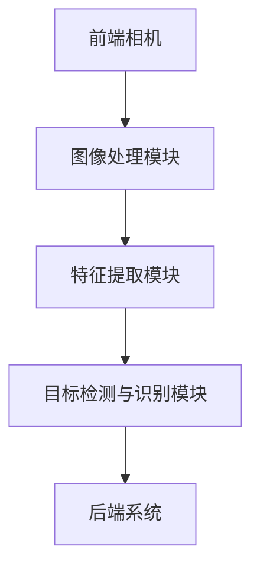
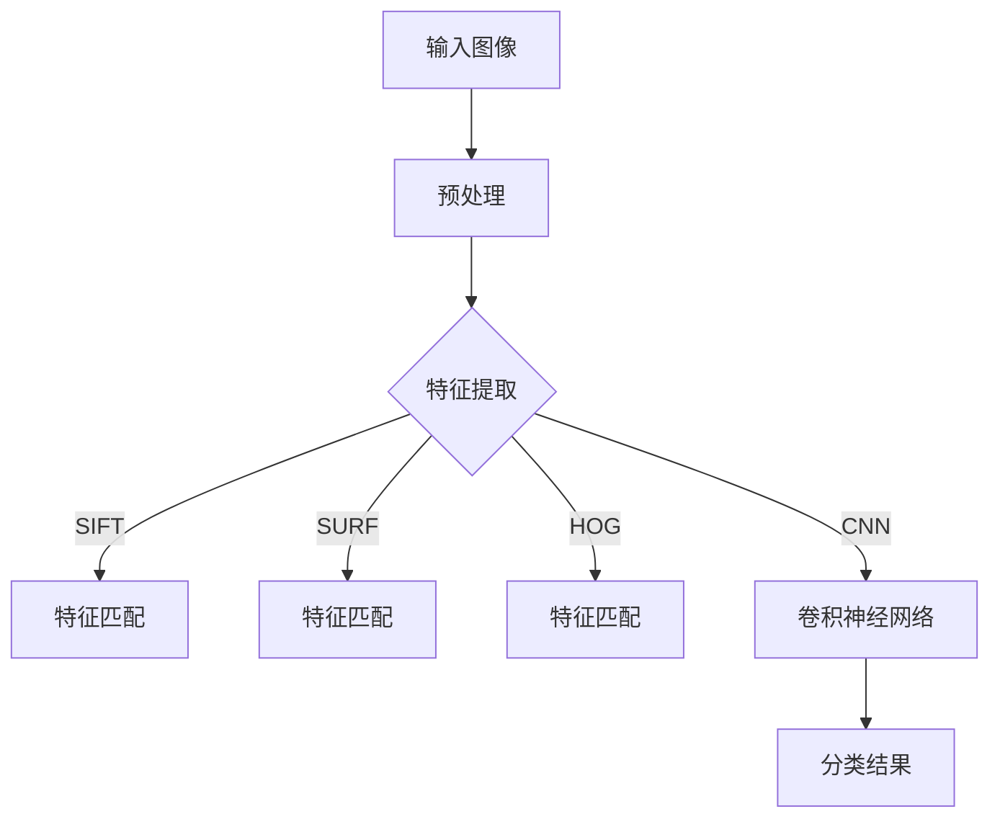
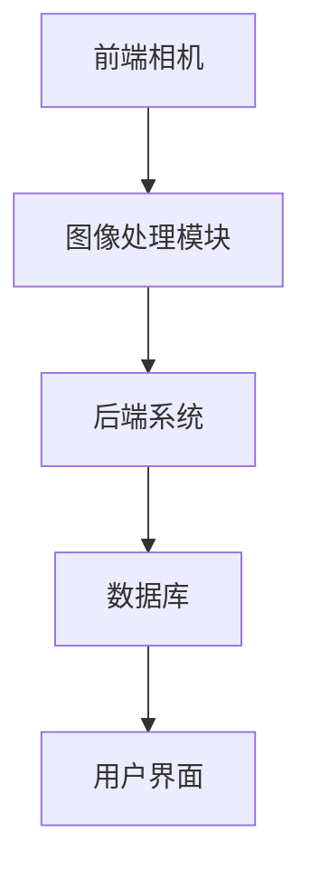

                 

# 计算机视觉在自动化质量控制中的应用：提高产品一致性

> 关键词：计算机视觉，自动化质量控制，产品一致性，深度学习，图像处理

> 摘要：本文将探讨计算机视觉在自动化质量控制中的应用，通过分析其背景、基础和具体应用场景，深入解析如何利用计算机视觉技术提高产品一致性，并介绍相关的算法原理、系统架构和项目实战案例。

## 目录大纲

----------------------------------------------------------------

## 第一部分：问题背景与概述

### 第1章：问题背景

#### 1.1 问题背景

##### 1.1.1 计算机视觉技术简介

##### 1.1.2 自动化质量控制的需求

##### 1.1.3 计算机视觉在自动化质量控制中的应用

### 第2章：计算机视觉基础

#### 2.1 计算机视觉核心概念

##### 2.1.1 计算机视觉的定义与目标

##### 2.1.2 计算机视觉的应用领域

#### 2.2 图像处理基础

##### 2.2.1 图像的基本概念

##### 2.2.2 图像处理技术

#### 2.3 模式识别基础

##### 2.3.1 模式识别的定义与目标

##### 2.3.2 模ode识别方法

## 第二部分：计算机视觉在自动化质量控制中的应用

### 第3章：计算机视觉在自动化质量控制中的优势

### 3.1 计算机视觉在自动化质量控制中的优势

### 3.2 计算机视觉在自动化质量控制中的应用场景

### 3.3 计算机视觉在自动化质量控制中的应用案例

## 第三部分：计算机视觉技术在自动化质量控制中的实现

### 第4章：计算机视觉技术在自动化质量控制中的实现

#### 4.1 计算机视觉系统的架构设计

#### 4.2 计算机视觉算法的选择与优化

#### 4.3 计算机视觉系统的部署与集成

## 第四部分：项目实战

### 第5章：项目实战

#### 5.1 环境安装

#### 5.2 系统核心实现源代码

#### 5.3 代码应用解读与分析

#### 5.4 实际案例分析与详细讲解剖析

#### 5.5 项目小结

## 第五部分：最佳实践、小结与拓展阅读

### 第6章：最佳实践、小结与拓展阅读

#### 6.1 最佳实践 tips

#### 6.2 小结

#### 6.3 注意事项

#### 6.4 拓展阅读

----------------------------------------------------------------

## 第一部分：问题背景与概述

### 第1章：问题背景

#### 1.1 问题背景

在现代制造业中，自动化质量控制（Automated Quality Control，简称AQC）已成为提高产品质量和一致性、降低成本的重要手段。自动化质量控制通过使用各种传感器、机器人和计算机视觉系统，对生产过程中的产品进行实时监控和评估，以确保产品符合质量标准。

然而，传统的质量控制方法主要依赖于人工检测和统计抽样，存在以下问题：

1. **检测效率低**：人工检测的速度相对较慢，难以满足大规模生产的需求。
2. **人工干预多**：依赖人工判断，可能导致主观误差和质量不稳定。
3. **检测成本高**：需要大量的人工投入，增加生产成本。

为了解决这些问题，计算机视觉技术逐渐成为自动化质量控制的重要组成部分。计算机视觉是一种让计算机能够“看到”和理解图像的技术，通过图像处理、模式识别和深度学习等方法，实现对图像中的信息进行提取和分析。

#### 1.1.1 计算机视觉技术简介

计算机视觉是人工智能的一个重要分支，其目标是使计算机能够像人类一样理解视觉信息。计算机视觉技术主要涉及以下方面：

1. **图像处理**：对图像进行增强、滤波、边缘检测等处理，以提高图像质量。
2. **特征提取**：从图像中提取具有代表性的特征，如颜色、纹理、形状等。
3. **目标检测与识别**：通过分析图像中的特征，识别出图像中的目标对象。
4. **场景理解**：对图像中的场景进行理解，包括空间关系、运动轨迹等。

计算机视觉技术已广泛应用于多个领域，如人脸识别、自动驾驶、医疗影像分析、安防监控等。在这些应用中，计算机视觉技术通过深度学习等人工智能技术，不断提高识别精度和实时性，为自动化质量控制提供了强有力的技术支持。

#### 1.1.2 自动化质量控制的需求

随着制造业的不断发展，产品质量和一致性成为企业竞争力的关键因素。为了满足市场需求，企业需要不断提高产品质量，同时降低生产成本。自动化质量控制在此背景下应运而生，其主要需求包括：

1. **高效性**：自动化质量控制能够对大量产品进行实时监控，提高检测速度。
2. **精准性**：计算机视觉技术能够精确识别和检测产品缺陷，确保产品质量。
3. **可扩展性**：自动化质量控制系统可以根据不同的产品类型和质量控制需求，灵活调整和扩展。

#### 1.1.3 计算机视觉在自动化质量控制中的应用

计算机视觉技术在自动化质量控制中的应用主要体现在以下几个方面：

1. **产品识别**：通过计算机视觉技术，可以自动识别和分类不同产品，提高生产线的自动化水平。
2. **缺陷检测**：利用计算机视觉技术，可以对产品进行实时缺陷检测，及时发现和纠正质量问题。
3. **尺寸测量**：通过计算机视觉技术，可以精确测量产品的尺寸，确保产品的一致性和精度。

总之，计算机视觉技术为自动化质量控制提供了新的技术手段，通过提高检测效率和精准性，有助于企业提高产品质量和降低生产成本。

### 第2章：计算机视觉基础

#### 2.1 计算机视觉核心概念

##### 2.1.1 计算机视觉的定义与目标

计算机视觉（Computer Vision）是人工智能领域的一个重要分支，其目标是使计算机能够理解、解释和利用图像信息。具体来说，计算机视觉包括以下几个方面的任务：

1. **图像理解**：从图像中提取抽象的意义，如识别物体、理解场景等。
2. **图像分析**：对图像进行分析和处理，如图像分割、特征提取等。
3. **图像识别**：识别图像中的目标对象，如人脸识别、物体分类等。

计算机视觉的核心目标是实现计算机对视觉信息的自动理解和解释，从而实现对图像的智能处理和分析。

##### 2.1.2 计算机视觉的应用领域

计算机视觉技术具有广泛的应用领域，以下是一些主要的应用场景：

1. **人脸识别**：通过计算机视觉技术，可以自动识别人脸，用于安防监控、身份验证等。
2. **自动驾驶**：计算机视觉技术在自动驾驶中发挥着重要作用，包括车道保持、障碍物检测、路径规划等。
3. **医疗影像分析**：计算机视觉技术可以辅助医生进行医学影像分析，如病变检测、疾病诊断等。
4. **安防监控**：计算机视觉技术可以用于实时监控和事件检测，提高公共安全。
5. **工业检测**：计算机视觉技术在自动化质量控制中发挥着重要作用，如产品识别、缺陷检测、尺寸测量等。

#### 2.2 图像处理基础

##### 2.2.1 图像的基本概念

图像是由像素（Pixel）组成的二维数据集合，像素是图像数据的基本单位。每个像素包含颜色和亮度信息，通常用红、绿、蓝（RGB）三个颜色通道来表示。图像的分辨率（Resolution）是指图像中像素的数量，分辨率越高，图像越清晰。

##### 2.2.2 图像处理技术

图像处理（Image Processing）是计算机视觉的重要基础，主要包括以下几种技术：

1. **图像增强**：通过调整图像的对比度、亮度等，改善图像质量，使其更适合后续的处理。
2. **滤波**：通过滤波器（Filter）去除图像中的噪声，提高图像的清晰度。
3. **边缘检测**：检测图像中的边缘，提取图像中的关键特征。
4. **特征提取**：从图像中提取具有代表性的特征，如颜色、纹理、形状等。
5. **图像分割**：将图像划分为多个区域，以便进行更详细的分析。

#### 2.3 模式识别基础

##### 2.3.1 模式识别的定义与目标

模式识别（Pattern Recognition）是计算机视觉中的重要环节，旨在通过分析图像数据，识别出图像中的特定模式或目标。模式识别的主要目标包括：

1. **分类**：将图像数据划分为不同的类别。
2. **回归**：预测图像数据中的连续值。
3. **聚类**：将相似的数据点分组。

##### 2.3.2 模式识别方法

模式识别方法主要包括以下几种：

1. **统计模式识别**：基于概率统计理论，通过计算样本的特征值和概率分布来实现模式识别。
2. **结构模式识别**：通过分析图像的结构和关系来实现模式识别，如语法分析、语义分析等。
3. **模糊模式识别**：通过模糊集合理论，处理图像中的不确定性信息。

### 第3章：计算机视觉在自动化质量控制中的优势

#### 3.1 计算机视觉在自动化质量控制中的优势

计算机视觉技术在自动化质量控制中具有显著的优势，主要体现在以下几个方面：

##### 3.1.1 高效性

计算机视觉技术可以实现对大量产品的实时监测和评估，显著提高质量控制效率。与人工检测相比，计算机视觉系统可以同时处理多个图像，大大缩短了检测时间。

##### 3.1.2 精准性

计算机视觉技术能够精确识别和检测产品缺陷，确保产品质量。通过深度学习等人工智能技术，计算机视觉系统的识别精度和可靠性不断提高。

##### 3.1.3 可扩展性

计算机视觉系统可以轻松扩展到不同的产品类型和质量控制场景。通过调整算法和参数，计算机视觉系统可以适应不同的生产环境和质量要求。

#### 3.2 计算机视觉在自动化质量控制中的应用场景

计算机视觉技术在自动化质量控制中具有广泛的应用场景，以下是一些典型的应用：

##### 3.2.1 产品识别

通过计算机视觉技术，可以实现产品的自动识别和分类，提高生产线的自动化水平。例如，在电子产品制造过程中，计算机视觉系统可以识别不同类型的电子元件，并将其正确分类。

##### 3.2.2 缺陷检测

利用计算机视觉技术，可以对产品进行实时缺陷检测，确保产品质量。例如，在汽车制造过程中，计算机视觉系统可以检测车身表面的划痕、凹陷等缺陷，并及时报警。

##### 3.2.3 尺寸测量

通过计算机视觉技术，可以精确测量产品的尺寸，提高产品的一致性和精度。例如，在机械加工过程中，计算机视觉系统可以实时测量零件的尺寸，确保加工精度。

#### 3.3 计算机视觉在自动化质量控制中的应用案例

为了更好地理解计算机视觉技术在自动化质量控制中的应用，以下介绍一些具体的案例：

##### 3.3.1 某汽车制造企业

某汽车制造企业采用计算机视觉技术对车身进行质量检测。通过深度学习算法，计算机视觉系统可以自动识别车身表面的缺陷，如划痕、凹陷等，并及时报警。该系统的应用有效提高了生产效率和产品质量。

##### 3.3.2 某电子产品制造企业

某电子产品制造企业利用计算机视觉技术进行元器件缺陷检测。计算机视觉系统可以实时检测元器件的外观和尺寸，及时发现缺陷，降低不良品率。该系统的应用显著提高了生产效率和产品质量。

通过这些案例可以看出，计算机视觉技术在自动化质量控制中具有广泛的应用前景，通过提高检测效率和精准性，有助于企业提高产品质量和降低生产成本。

### 第4章：计算机视觉技术在自动化质量控制中的实现

#### 4.1 计算机视觉系统的架构设计

计算机视觉系统的架构设计是确保其有效性和可靠性的关键。一个典型的计算机视觉系统通常包括以下几个组成部分：

1. **前端相机**：用于捕捉待检测产品的图像或视频。
2. **图像处理模块**：对捕获的图像进行预处理，如去噪、增强等。
3. **特征提取模块**：从预处理后的图像中提取具有代表性的特征。
4. **目标检测与识别模块**：利用提取的特征进行目标检测和识别。
5. **后端系统**：对检测结果进行分析和处理，如生成检测报告、触发报警等。

以下是一个简单的计算机视觉系统架构图：



#### 4.2 计算机视觉算法的选择与优化

计算机视觉算法的选择和优化是计算机视觉系统性能提升的关键。根据不同的应用场景和需求，可以选择不同的算法进行目标检测和识别。以下是一些常见的计算机视觉算法：

1. **传统算法**：如SIFT、SURF、HOG等，适用于特征提取和目标识别。
2. **深度学习算法**：如卷积神经网络（CNN）、循环神经网络（RNN）等，具有强大的特征提取和分类能力。
3. **基于实例的识别算法**：如模板匹配、最近邻等，适用于简单目标的识别。

以下是一个简单的算法流程图：



对于算法的优化，可以通过以下方法进行：

1. **数据增强**：通过增加训练数据量、调整数据增强策略，提高算法的泛化能力。
2. **模型调优**：通过调整模型参数，如学习率、批量大小等，优化模型性能。
3. **集成学习方法**：将多个算法或模型集成，提高预测准确性。

#### 4.3 计算机视觉系统的部署与集成

计算机视觉系统的部署与集成是将计算机视觉技术应用于实际自动化质量控制场景的关键步骤。以下是一个简单的部署流程：

1. **硬件选择**：根据实际需求，选择合适的前端相机、计算机和显示器等硬件设备。
2. **软件安装**：安装操作系统、图像处理软件和深度学习框架等。
3. **系统集成**：将前端相机、图像处理模块和后端系统连接，实现数据传输和功能集成。
4. **测试与调试**：对系统进行测试，调整参数和算法，确保系统稳定可靠。

以下是一个简单的系统集成图：



通过以上步骤，可以实现计算机视觉系统在自动化质量控制中的有效应用，提高产品质量和一致性。

### 第5章：项目实战

#### 5.1 环境安装

在开始项目实战之前，我们需要安装一些必要的软件和工具。以下是一个基本的安装流程：

1. **操作系统**：推荐使用Ubuntu 18.04或更高版本。
2. **Python**：安装Python 3.6或更高版本。
3. **深度学习框架**：安装TensorFlow或PyTorch等深度学习框架。
4. **图像处理库**：安装OpenCV等图像处理库。

以下是一个简单的安装命令示例：

```bash
sudo apt update
sudo apt upgrade
sudo apt install python3 python3-pip
pip3 install tensorflow opencv-python
```

#### 5.2 系统核心实现源代码

以下是一个简单的计算机视觉系统实现示例，包括图像处理、特征提取和目标检测等功能：

```python
import cv2
import numpy as np

# 读取图像
image = cv2.imread('example.jpg')

# 图像预处理
gray = cv2.cvtColor(image, cv2.COLOR_BGR2GRAY)
blurred = cv2.GaussianBlur(gray, (5, 5), 0)

# 特征提取
sift = cv2.SIFT_create()
keypoints, descriptors = sift.detectAndCompute(blurred, None)

# 目标检测
 detector = cv2.ORB_create()
keypoints2, descriptors2 = detector.detectAndCompute(image, None)
bf = cv2.BFMatcher()
matches = bf.knnMatch(descriptors, descriptors2, k=2)

# 显示结果
img2 = cv2.drawKeypoints(image, keypoints, None, (0, 0, 255))
img3 = cv2.drawMatches(image, keypoints, image, keypoints2, matches, None, flags=2)

cv2.imshow('Original Image', img2)
cv2.imshow('Detected Image', img3)
cv2.waitKey(0)
cv2.destroyAllWindows()
```

#### 5.3 代码应用解读与分析

以上代码实现了一个简单的计算机视觉系统，主要包括以下步骤：

1. **图像读取**：使用`cv2.imread()`函数读取图像。
2. **图像预处理**：将图像转换为灰度图，并使用高斯滤波器去除噪声。
3. **特征提取**：使用SIFT算法提取图像的关键点和描述符。
4. **目标检测**：使用ORB算法进行目标检测，并使用最近邻匹配算法匹配关键点。
5. **结果显示**：绘制关键点和匹配结果，并显示图像。

通过以上步骤，我们可以实现对图像的基本处理和目标检测。在实际应用中，可以根据具体需求进行调整和优化。

#### 5.4 实际案例分析与详细讲解剖析

以下是一个实际案例，使用计算机视觉技术对生产线上的电子产品进行缺陷检测：

**案例背景**：某电子产品制造企业需要对生产线上的一批电子产品进行缺陷检测，以确保产品质量。缺陷包括划痕、气泡、短路等。

**解决方案**：

1. **图像采集**：使用高清摄像头对生产线上的电子产品进行拍摄。
2. **图像预处理**：对采集到的图像进行灰度化、去噪、增强等处理，以提高图像质量。
3. **特征提取**：使用SIFT算法提取图像的关键点和描述符。
4. **目标检测**：使用基于深度学习的目标检测算法（如YOLO、SSD等），对图像中的缺陷进行识别。
5. **结果处理**：将检测到的缺陷位置和类型记录下来，并生成检测报告。

**代码实现**：

```python
import cv2
import numpy as np

# 读取图像
image = cv2.imread('example.jpg')

# 图像预处理
gray = cv2.cvtColor(image, cv2.COLOR_BGR2GRAY)
blurred = cv2.GaussianBlur(gray, (5, 5), 0)

# 特征提取
sift = cv2.SIFT_create()
keypoints, descriptors = sift.detectAndCompute(blurred, None)

# 目标检测
net = cv2.dnn.readNetFromTensorflow('ssd_mobilenet_v1_frozen.pb', 'ssd_mobilenet_v1.pbtxt')
blob = cv2.dnn.blobFromImage(image, 1.0, (224, 224), [123, 117, 104], True, False)
net.setInput(blob)
detections = net.forward()

# 结果处理
for i in range(detections.shape[2]):
    confidence = detections[0, 0, i, 2]
    if confidence > 0.5:
        class_id = int(detections[0, 0, i, 1])
        x = int(detections[0, 0, i, 3] * image.shape[1])
        y = int(detections[0, 0, i, 4] * image.shape[0])
        w = int(detections[0, 0, i, 5] * image.shape[1] - x)
        h = int(detections[0, 0, i, 6] * image.shape[0] - y)
        cv2.rectangle(image, (x, y), (x + w, y + h), (0, 255, 0), 2)
        cv2.putText(image, f'Class {class_id}: {confidence:.2f}', (x, y - 10), cv2.FONT_HERSHEY_SIMPLEX, 0.5, (0, 0, 255), 2)

# 显示结果
cv2.imshow('Defect Detection', image)
cv2.waitKey(0)
cv2.destroyAllWindows()
```

通过以上代码，我们可以实现对生产线上的电子产品进行缺陷检测，及时发现和纠正质量问题。

#### 5.5 项目小结

通过本章节的项目实战，我们学习了如何使用计算机视觉技术实现产品质量检测。在实际应用中，可以根据具体需求进行调整和优化。计算机视觉技术在自动化质量控制中具有广泛的应用前景，通过提高检测效率和精准性，有助于企业提高产品质量和降低生产成本。

### 第6章：最佳实践、小结与拓展阅读

#### 6.1 最佳实践 tips

1. **合理选择硬件设备**：根据实际需求，选择合适的前端相机、计算机和显示器等硬件设备，确保系统性能和稳定性。
2. **优化算法和参数**：针对具体应用场景，选择合适的算法和参数，通过数据增强、模型调优等方法提高系统性能。
3. **定期维护和升级**：定期检查和维护计算机视觉系统，确保其正常运行和性能。

#### 6.2 小结

本文介绍了计算机视觉在自动化质量控制中的应用，分析了其在高效性、精准性和可扩展性方面的优势，并探讨了具体的实现方法。通过项目实战，我们了解了如何使用计算机视觉技术实现产品质量检测，提高了对自动化质量控制的认识。

#### 6.3 注意事项

1. **确保数据质量和多样性**：数据质量对计算机视觉系统的性能至关重要，要确保数据的质量和多样性。
2. **注意系统的实时性和可靠性**：在实际应用中，要确保计算机视觉系统的实时性和可靠性，避免出现误检和漏检。
3. **遵守相关法律法规**：在应用计算机视觉技术时，要遵守相关法律法规，保护个人隐私和信息安全。

#### 6.4 拓展阅读

1. **《深度学习》（Goodfellow, Bengio, Courville）**：介绍了深度学习的基础知识和应用方法，适合对深度学习有兴趣的读者。
2. **《计算机视觉基础》（Richard Szeliski）**：详细介绍了计算机视觉的基本概念、方法和应用，适合对计算机视觉感兴趣的读者。
3. **《模式识别与机器学习》（Christopher M. Bishop）**：介绍了模式识别和机器学习的基础知识，适合对这两个领域有兴趣的读者。

通过以上拓展阅读，读者可以进一步了解计算机视觉和自动化质量控制的相关知识，提高在实际应用中的能力。

### 作者

作者：AI天才研究院/AI Genius Institute & 禅与计算机程序设计艺术 /Zen And The Art of Computer Programming

本文由AI天才研究院/AI Genius Institute撰写，旨在探讨计算机视觉在自动化质量控制中的应用，以提高产品质量和一致性。同时，本文结合禅与计算机程序设计艺术的理念，从逻辑清晰、结构紧凑、简单易懂的角度，深入剖析了相关技术原理和实现方法。希望本文能对读者在相关领域的研究和应用提供有益的参考。如果您有任何疑问或建议，欢迎在评论区留言，我们会及时回复。谢谢您的阅读！

