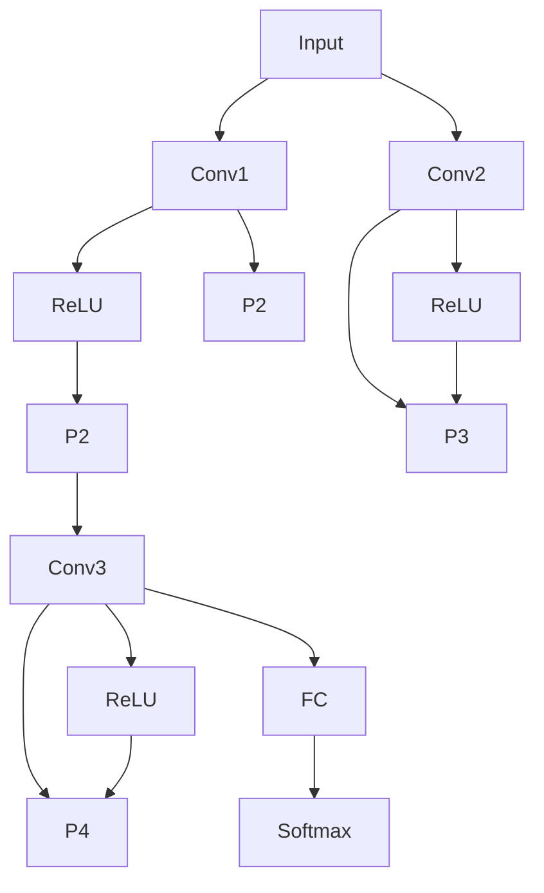
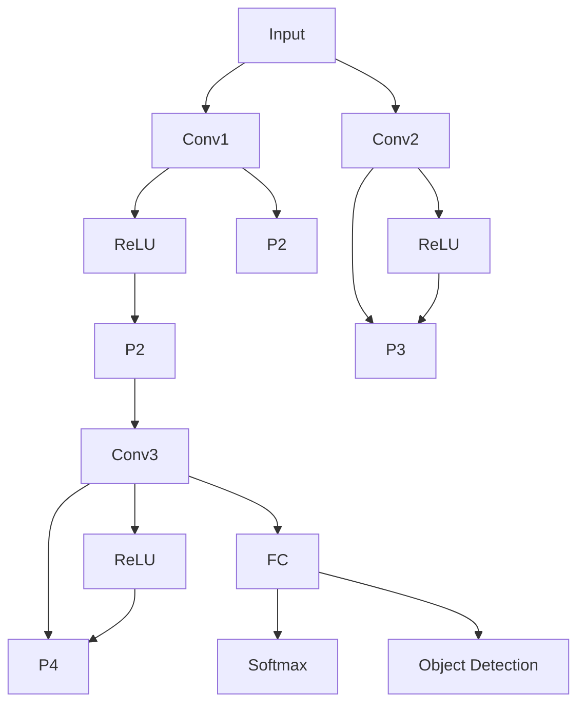
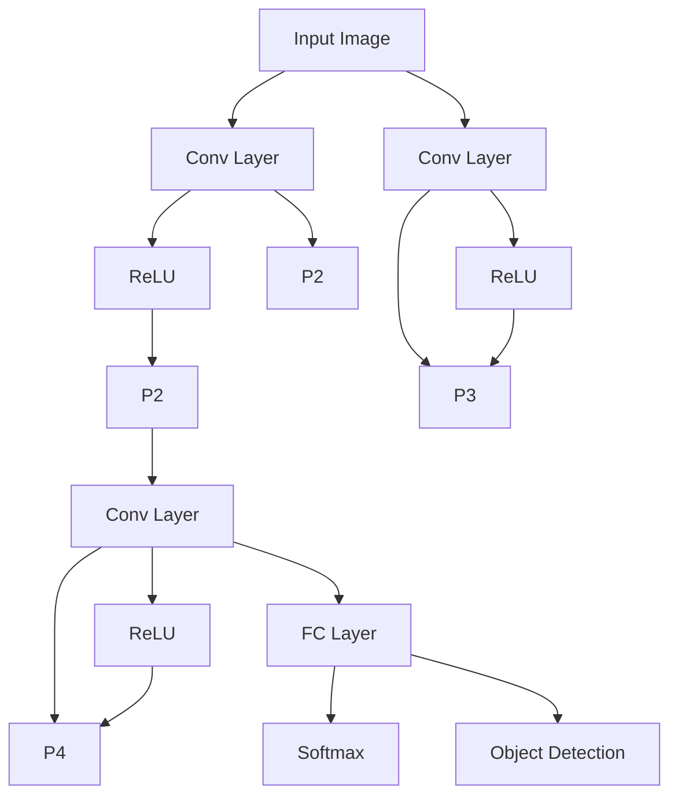
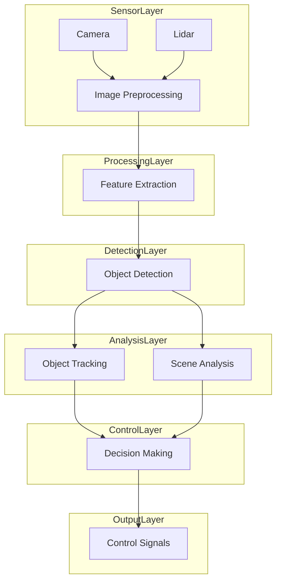
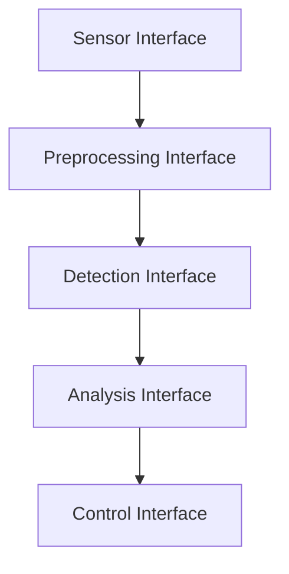
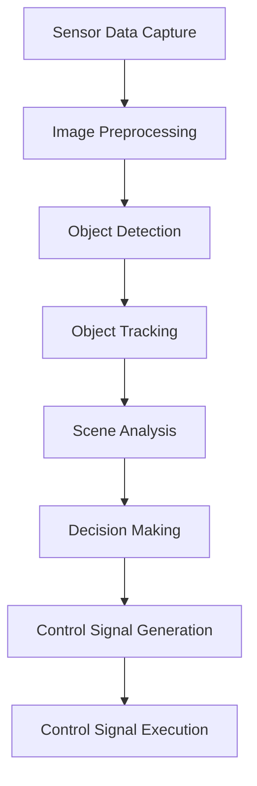

                 

### 背景介绍

#### 1.1 计算机视觉与自动驾驶技术概述

计算机视觉（Computer Vision）是人工智能（Artificial Intelligence, AI）的一个重要分支，它使计算机能够通过处理图像和视频数据来“看到”和理解周围的世界。计算机视觉技术的发展使得许多自动化和智能化应用成为可能，例如人脸识别、图像搜索、自动驾驶、医疗影像分析等。

自动驾驶（Autonomous Driving）是近年来迅速发展的一个领域，其目标是通过传感器、算法和控制系统使车辆在没有人类干预的情况下自主行驶。自动驾驶技术分为多个级别，从完全依赖人类的L0级到完全自动化的L5级。当前，L2和L3级别的自动驾驶技术在许多车型中得到了应用，而L4和L5级别的自动驾驶则仍处于研究和试验阶段。

在自动驾驶系统中，计算机视觉扮演着至关重要的角色。自动驾驶车辆需要通过摄像头、激光雷达（Lidar）等传感器收集环境信息，然后利用计算机视觉算法对这些信息进行处理，以便识别车道、行人和其他车辆，做出行驶决策。特别是在夜间行车环境中，由于光线不足，传统的视觉感知技术面临巨大挑战，因此提高夜间行车安全性成为了自动驾驶技术需要解决的关键问题。

#### 1.2 夜间自动驾驶识别的挑战

夜间行车环境复杂，光线不足，为自动驾驶系统的视觉感知带来了巨大的挑战：

1. **光照变化**：夜间光线不稳定，亮度和颜色变化频繁，这给图像处理带来了困难。
2. **物体外观变化**：夜间物体反射的光线较少，颜色和形态发生变化，使得物体识别变得复杂。
3. **动态场景干扰**：夜间存在动态场景干扰，如车辆大灯、路灯、动物等，这些干扰会增加识别难度。
4. **阴影和反射**：阴影和反射会造成物体轮廓的模糊，影响物体检测和识别的准确性。
5. **硬件性能限制**：夜间识别要求传感器具备更高的分辨率和灵敏度，但现有硬件性能有限，难以满足需求。

#### 1.3 研究意义与目标

提高夜间行车安全性对于自动驾驶技术的发展具有重要意义。如果能在夜间环境中实现高精度的视觉识别，不仅可以减少交通事故，提高行车安全，还可以提升自动驾驶系统的整体性能和可靠性。

本研究的主要目标是：

1. **深入分析夜间自动驾驶识别的挑战**：通过具体案例分析，了解夜间环境中图像处理和物体识别的难点。
2. **探讨有效的算法和策略**：结合现有的计算机视觉和机器学习技术，提出适用于夜间识别的算法和策略。
3. **设计系统架构与实现方案**：构建一个能够实现夜间自动驾驶识别的系统，并在实际项目中验证其效果。

通过本研究，期望为自动驾驶技术在夜间行车环境中的应用提供理论支持和实践参考，推动自动驾驶技术的进一步发展。接下来，我们将进一步探讨计算机视觉中的核心概念和技术，为理解夜间识别的算法原理打下基础。

### 第1章: 问题背景

#### 1.1 计算机视觉与自动驾驶技术概述

计算机视觉（Computer Vision）是人工智能（Artificial Intelligence, AI）的一个重要分支，旨在使计算机通过图像和视频数据的处理来“看到”并理解周围的世界。计算机视觉的应用范围广泛，包括但不限于人脸识别、图像搜索、医疗影像分析、自动驾驶等。其核心在于通过图像处理、特征提取和机器学习等手段，使计算机能够对图像中的信息进行识别、理解和处理。

自动驾驶（Autonomous Driving）是指利用计算机、传感器和其他辅助设备使车辆在没有人类干预的情况下实现自主驾驶。自动驾驶技术的级别分为L0至L5，其中L0代表完全人工驾驶，而L5则代表完全自动驾驶，无需人类干预。自动驾驶系统依赖于多种传感器，如摄像头、激光雷达（Lidar）、超声波传感器等，来收集环境信息，并利用计算机视觉算法对这些信息进行处理，从而实现车辆的控制和导航。

在自动驾驶系统中，计算机视觉起着至关重要的作用。通过摄像头和激光雷达等传感器，自动驾驶车辆可以实时获取周围环境的图像和点云数据。计算机视觉算法对这些数据进行分析和处理，以识别车道、行人、其他车辆、交通标志和信号等关键信息。这些信息用于生成驾驶决策，控制车辆的速度、方向和制动等操作。特别是在夜间行车环境中，由于光线不足，传统视觉感知技术面临巨大的挑战，因此提高夜间识别能力成为自动驾驶技术发展的关键问题。

#### 1.2 夜间自动驾驶识别的挑战

夜间行车环境复杂，光线不足，给自动驾驶系统的视觉感知带来了诸多挑战：

1. **光照变化**：夜间光线不稳定，亮度和颜色变化频繁。这种变化会导致图像处理算法的准确性下降，使得车道线检测、交通标志识别等任务变得更加困难。

2. **物体外观变化**：在夜间，由于反射光线较少，物体的颜色和形态会发生变化，使得物体识别变得更加复杂。例如，行人可能会因为光线不足而难以被识别，车辆可能因为反射光而无法正确识别。

3. **动态场景干扰**：夜间存在许多动态场景干扰，如车辆大灯、路灯、动物等。这些干扰因素会对图像的处理和分析造成干扰，增加识别难度。

4. **阴影和反射**：阴影和反射会对物体轮廓造成模糊效果，影响物体检测和识别的准确性。例如，行人的轮廓可能会因为路灯的反射而变得难以辨识。

5. **硬件性能限制**：夜间识别要求传感器具备更高的分辨率和灵敏度，但现有硬件性能有限，难以满足需求。特别是在低光环境下，传感器的响应速度和灵敏度可能无法达到预期的效果。

#### 1.3 研究意义与目标

提高夜间行车安全性对于自动驾驶技术的发展具有重要意义。如果能在夜间环境中实现高精度的视觉识别，不仅可以显著减少交通事故，提高行车安全，还可以提升自动驾驶系统的整体性能和可靠性。

本研究的主要目标包括：

1. **深入分析夜间自动驾驶识别的挑战**：通过具体案例分析，了解夜间环境中图像处理和物体识别的难点，为后续研究提供基础。

2. **探讨有效的算法和策略**：结合现有的计算机视觉和机器学习技术，提出适用于夜间识别的算法和策略，以提高夜间识别的准确性和鲁棒性。

3. **设计系统架构与实现方案**：构建一个能够实现夜间自动驾驶识别的系统，并在实际项目中验证其效果。通过优化传感器配置、算法实现和系统设计，提升系统在夜间环境下的表现。

通过本研究，期望为自动驾驶技术在夜间行车环境中的应用提供理论支持和实践参考，推动自动驾驶技术的进一步发展。接下来，我们将深入探讨计算机视觉中的核心概念和技术，为理解夜间识别的算法原理打下基础。

#### 1.4 夜间自动驾驶识别的难点

夜间自动驾驶识别面临诸多技术难点，主要可以分为以下几个方面：

1. **光照不足**：夜间光线条件较差，能见度低，这直接影响了图像的亮度和清晰度。低光照环境下的图像噪声较多，使得图像处理算法的准确性降低。图像增强和噪声抑制技术虽然可以一定程度上改善图像质量，但效果有限，特别是在极端低光条件下。

2. **颜色变化**：在夜间，由于光线反射和折射的不同，物体颜色会发生显著变化。例如，白色物体在反射路灯光线时可能显得更亮，而黑色物体在吸收光线后可能变得更加不明显。这种颜色变化增加了物体识别的难度，需要复杂的颜色空间转换和特征提取技术。

3. **动态场景干扰**：夜间环境中存在大量动态场景，如车辆大灯、路灯和动物等。这些动态光源不仅会造成背景光照的不稳定，还会在图像中产生强干扰，使得车道线检测、行人识别等任务复杂化。

4. **物体外观变化**：夜间物体反射的光线较少，物体轮廓和细节可能会变得更加模糊。例如，行人可能因为光线不足而难以识别，车辆可能会因为反射光而难以正确分类。此外，阴影和反射也会影响物体的外观，使其难以区分。

5. **硬件性能限制**：夜间识别要求传感器具备更高的分辨率和灵敏度，但现有硬件性能有限，特别是在低光环境下，传感器的响应速度和灵敏度可能无法满足需求。这使得夜间识别的精度和实时性受到限制。

#### 1.5 提高夜间行车安全的重要性

提高夜间行车安全对于自动驾驶技术的发展和普及具有重要意义，具体表现在以下几个方面：

1. **减少交通事故**：夜间是交通事故多发时段，特别是在城市道路和高速公路上。如果自动驾驶系统能够在夜间环境中实现高精度的视觉识别，可以显著降低交通事故的发生率，保护驾驶者和乘客的安全。

2. **提升驾驶体验**：在夜间行车过程中，驾驶者往往会面临更大的压力和疲劳。如果自动驾驶系统能够在夜间环境中提供稳定、可靠的驾驶服务，可以显著提升驾驶体验，减少驾驶者的负担。

3. **扩大自动驾驶应用场景**：夜间行车是自动驾驶应用的一个重要场景。如果能够在夜间实现高精度的视觉识别，可以扩大自动驾驶技术的应用范围，使其在更多场景下得到应用。

4. **提高整体交通效率**：夜间行车通常交通流量较小，但如果自动驾驶系统能够在夜间环境中提供高效的驾驶服务，可以缓解交通拥堵，提高整体交通效率。

5. **促进自动驾驶技术发展**：夜间行车安全是自动驾驶技术的一个重要挑战。如果能够解决这一难题，将极大地推动自动驾驶技术的发展，使其在更广泛的场景中得到应用，从而加速自动驾驶时代的到来。

总之，提高夜间行车安全不仅是自动驾驶技术发展的关键，也是保障公众安全的迫切需求。通过深入研究夜间自动驾驶识别的难点，提出有效的解决方案，将有助于提升自动驾驶技术的整体水平，为自动驾驶时代的到来奠定坚实基础。

### 第2章: 计算机视觉基础

#### 2.1 图像处理技术

图像处理技术是计算机视觉的重要组成部分，其主要目的是通过算法对图像进行增强、滤波、分割等操作，以提高图像质量和提取有用信息。在夜间自动驾驶识别中，图像处理技术尤为关键，因为它直接关系到图像的质量和后续处理的准确性。

1. **图像增强**：图像增强技术旨在改善图像的视觉效果，使其更适合于后续分析。常见的方法包括对比度增强、亮度调整、图像锐化等。在夜间识别中，由于光线不足，图像常常显得模糊，通过增强处理可以显著提高图像的清晰度。

2. **图像滤波**：图像滤波是一种用于去除图像噪声和改善图像清晰度的技术。常用的滤波方法包括均值滤波、中值滤波和高斯滤波等。在夜间图像中，噪声较多，滤波技术可以帮助去除不必要的噪声，提高图像的清晰度和鲁棒性。

3. **图像分割**：图像分割是将图像划分为多个区域或对象的过程，其目的是将图像中不同的对象或背景分离出来。常用的分割方法包括基于阈值的分割、区域增长分割和边缘检测等。在夜间自动驾驶识别中，分割技术用于识别道路、车道、行人等关键对象。

#### 2.2 特征提取与降维

特征提取是计算机视觉中的核心步骤，其目标是提取图像中的关键信息，以便进行后续的物体识别和分类。在夜间识别中，特征提取技术尤为重要，因为它有助于克服低光照和噪声的影响。

1. **直方图均衡化**：直方图均衡化是一种常用的图像增强技术，通过调整图像的亮度分布，使图像的动态范围更大，从而提高图像的对比度和清晰度。这种技术适用于夜间图像的增强，有助于提高物体识别的准确性。

2. **SIFT（尺度不变特征变换）**：SIFT是一种经典的图像特征提取算法，能够在不同尺度上提取图像的关键点，并计算关键点的方向信息。SIFT对光照变化和旋转不变，适用于夜间图像中的物体识别。

3. **HOG（方向梯度直方图）**：HOG是一种基于局部图像特征的方法，通过计算图像中每个像素点的梯度方向和强度，形成直方图特征。HOG对光线变化和旋转具有较好的鲁棒性，常用于行人检测。

4. **降维技术**：降维技术用于减少特征空间的维度，以提高计算效率和处理速度。常见的降维技术包括主成分分析（PCA）和线性判别分析（LDA）等。在夜间识别中，降维技术可以帮助减少特征数据的冗余，提高模型训练和识别的效率。

#### 2.3 机器学习模型

机器学习模型在计算机视觉中起着至关重要的作用，通过学习大量的标注数据，模型可以自动提取图像中的特征，并进行分类和识别。以下是一些常用的机器学习模型：

1. **支持向量机（SVM）**：SVM是一种强大的分类算法，通过找到一个最优的超平面将不同类别的图像数据分开。SVM在特征空间中寻找最优分类边界，具有较高的分类准确性。

2. **随机森林（Random Forest）**：随机森林是一种基于决策树的集成学习方法，通过构建多个决策树并对预测结果进行投票来提高分类的准确性。随机森林对噪声和异常值具有较强的鲁棒性。

3. **深度学习模型**：深度学习模型，特别是卷积神经网络（CNN），在计算机视觉领域取得了巨大的成功。CNN通过多层卷积和池化操作，自动提取图像的层次特征，从而实现高精度的物体识别。在夜间识别中，深度学习模型可以显著提高识别准确率和鲁棒性。

通过结合图像处理技术、特征提取方法和机器学习模型，计算机视觉在夜间自动驾驶识别中发挥了关键作用。接下来，我们将深入探讨用于夜间识别的主要算法原理，包括卷积神经网络和深度学习模型，以进一步理解夜间识别的算法实现。

#### 2.4 计算机视觉中的关键技术

计算机视觉在自动驾驶夜间识别中扮演着关键角色，其核心在于通过一系列关键技术的应用，实现对夜间复杂环境的准确感知和理解。以下是计算机视觉中的几种关键技术：

1. **图像预处理**：图像预处理是计算机视觉任务的基础，用于提高图像的质量和鲁棒性。主要方法包括：
   - **光照校正**：通过调整图像的亮度、对比度和颜色，消除夜间光照变化的影响。
   - **噪声抑制**：使用滤波技术去除图像中的噪声，如高斯滤波、中值滤波等，以获得更清晰的图像。
   - **边缘检测**：通过边缘检测算法（如Canny算法），提取图像中的边缘信息，有助于后续的图像分割和物体识别。

2. **特征提取**：特征提取是将图像转换为适合机器学习模型处理的形式。关键特征提取方法包括：
   - **SIFT（尺度不变特征变换）**：通过计算图像中关键点的位置和方向，实现图像特征的不变性和鲁棒性。
   - **HOG（方向梯度直方图）**：计算图像中每个像素点的梯度方向和强度，形成直方图特征，适用于物体检测。
   - **颜色特征**：通过颜色模型（如HSV、RGB）提取图像的颜色特征，有助于识别具有特定颜色的物体。

3. **物体检测与识别**：物体检测与识别是计算机视觉中的核心任务，用于识别图像中的目标对象。关键算法包括：
   - **区域提案生成**：通过滑动窗口或滑动区域，生成图像中的潜在目标区域。
   - **候选区域筛选**：利用特征提取结果，对候选区域进行筛选，去除非目标区域，提高检测的效率。
   - **分类与识别**：使用分类算法（如SVM、Random Forest）对候选区域进行分类和识别，确定图像中的目标对象。

4. **深度学习模型**：深度学习模型在计算机视觉中取得了显著的成果，尤其在夜间识别中，通过多层神经网络自动提取图像的深层特征，实现高精度的物体识别。关键模型包括：
   - **卷积神经网络（CNN）**：通过卷积操作和池化操作，自动提取图像的层次特征，实现高精度的物体检测。
   - **循环神经网络（RNN）**：用于处理序列数据，如视频流中的帧序列，实现视频目标跟踪。
   - **生成对抗网络（GAN）**：通过生成器和判别器的对抗训练，实现图像的生成和增强，提高图像质量。

5. **实时处理**：在自动驾驶系统中，实时处理是确保安全性的关键。计算机视觉系统需要在短时间内处理大量的图像数据，实现快速、准确的识别。关键技术包括：
   - **并行处理**：通过并行计算技术，提高图像处理的效率。
   - **硬件加速**：利用GPU等硬件加速器，实现图像处理的高效计算。
   - **算法优化**：通过算法优化和模型压缩，提高系统的实时处理能力。

通过上述关键技术的应用，计算机视觉在夜间自动驾驶识别中实现了对复杂环境的准确感知和理解，为自动驾驶系统的安全性提供了有力保障。接下来，我们将详细探讨用于夜间识别的主要算法原理，进一步理解这些技术的实际应用。

#### 2.5 计算机视觉中的核心技术及其实际应用

计算机视觉技术广泛应用于自动驾驶夜间识别中，其核心在于提取和处理图像信息，从而实现准确的环境感知和目标识别。以下介绍几项关键的核心技术及其在实际应用中的具体方法和效果：

1. **深度学习**：深度学习，特别是卷积神经网络（CNN），在计算机视觉领域取得了显著进展。深度学习模型通过多层神经网络结构，自动学习图像的复杂特征，从而实现高精度的物体识别。

   - **卷积神经网络（CNN）**：CNN由多个卷积层、池化层和全连接层组成。卷积层通过局部感知野提取图像的局部特征，而池化层用于减少特征图的维度，提高计算效率。CNN在夜间识别中的应用效果显著，特别是在处理低光照、模糊图像时，能够提取出有用的视觉信息。
   - **循环神经网络（RNN）**：RNN适合处理序列数据，如视频流中的连续帧。通过序列建模，RNN能够实现视频目标跟踪和动作识别。
   - **生成对抗网络（GAN）**：GAN通过生成器和判别器的对抗训练，生成高质量的真实图像，从而增强夜间识别系统的图像输入。

2. **特征提取与降维**：特征提取是将图像转换为适合机器学习模型处理的形式，而降维技术则用于减少特征空间的维度，提高计算效率。

   - **SIFT（尺度不变特征变换）**：SIFT通过关键点检测和特征匹配，实现图像特征的不变性和鲁棒性。在夜间识别中，SIFT可以有效提取图像中的关键特征，提高物体识别的准确性。
   - **HOG（方向梯度直方图）**：HOG通过计算图像中每个像素点的梯度方向和强度，形成直方图特征，适用于物体检测。HOG在处理夜间图像时，可以有效地提取具有方向性的特征，从而提高识别效果。
   - **PCA（主成分分析）**：PCA通过线性变换，将高维特征转换为低维特征，降低特征空间的维度，提高计算效率。PCA在夜间识别中可以减少数据冗余，提高模型的训练速度和预测准确性。

3. **物体检测与识别**：物体检测与识别是计算机视觉中的核心任务，其目的是从图像中准确地检测和识别出目标物体。

   - **滑动窗口**：滑动窗口方法通过在不同位置和尺寸的窗口中提取图像特征，实现物体的候选区域生成。这种方法适用于实时性要求较高的场景，但在处理低光照图像时，容易出现误检和漏检。
   - **候选区域筛选**：通过特征提取和模型分类，对滑动窗口生成的候选区域进行筛选，去除非目标区域。这种方法可以显著提高检测的准确性，但计算复杂度较高。
   - **多尺度检测**：通过在不同尺度上应用检测算法，实现多尺度目标检测。这种方法能够更好地适应夜间光照变化和物体外观变化，提高识别的鲁棒性。

通过上述核心技术的综合应用，计算机视觉在夜间自动驾驶识别中发挥了重要作用，实现了对复杂夜间环境的准确感知和目标识别，为自动驾驶系统的安全性提供了有力保障。接下来，我们将进一步探讨算法原理，深入理解这些技术的具体实现。

#### 2.6 计算机视觉与自动驾驶系统的融合

计算机视觉与自动驾驶系统的融合是提升夜间行车安全性的关键。在这一部分，我们将详细分析计算机视觉技术在自动驾驶系统中的作用，并探讨其在夜间行车中的应用优势。

1. **感知与识别**：计算机视觉技术通过摄像头和激光雷达等传感器，实时捕捉车辆周围的环境信息，包括道路、车道、行人、车辆等。这些感知数据经过图像处理和特征提取后，输入到机器学习模型中进行分类和识别。在夜间行车环境中，计算机视觉技术可以有效地检测和理解周围环境，从而生成准确的驾驶决策。

2. **决策与控制**：计算机视觉生成的环境感知数据用于自动驾驶系统的决策模块，该模块通过融合感知信息、导航数据和车辆状态，生成控制指令，以调整车辆的速度、方向和制动。在夜间行车过程中，计算机视觉技术能够帮助系统识别和回避潜在的危险情况，如行人突然出现、车辆异常行驶等，从而提高驾驶安全。

3. **应用优势**：计算机视觉技术在夜间行车中的应用优势主要体现在以下几个方面：
   - **高精度识别**：通过深度学习和卷积神经网络，计算机视觉能够在低光照环境下实现高精度的物体识别，有效减少误检和漏检。
   - **动态场景理解**：计算机视觉技术能够理解夜间动态场景，如车辆大灯、路灯、阴影等，从而更准确地处理复杂的环境信息。
   - **自适应调整**：计算机视觉系统能够根据环境变化和光照条件自适应调整，提高识别的鲁棒性和实时性。

通过计算机视觉与自动驾驶系统的深度融合，实现了夜间行车环境下的智能感知和决策，为驾驶安全提供了强有力的保障。此外，随着计算机视觉技术的不断进步，其将在自动驾驶系统中的角色将越来越重要，推动自动驾驶技术的进一步发展和普及。接下来，我们将深入探讨自动驾驶系统中视觉感知的数据处理流程，理解其如何实现高效的环境感知和决策。

### 第3章: 计算机视觉中的关键概念

#### 3.1 图像处理技术

图像处理技术是计算机视觉中的基础环节，其主要目的是对图像进行预处理、增强、滤波、分割等操作，以提高图像质量和提取有用信息。在夜间自动驾驶识别中，图像处理技术的应用尤为重要，因为它直接影响图像的质量和后续处理的准确性。

1. **图像增强**：图像增强技术旨在改善图像的视觉效果，使其更适合于后续分析。常见的方法包括对比度增强、亮度调整、图像锐化等。在夜间识别中，由于光线不足，图像常常显得模糊，通过增强处理可以显著提高图像的清晰度。

2. **图像滤波**：图像滤波是一种用于去除图像噪声和改善图像清晰度的技术。常用的滤波方法包括均值滤波、中值滤波和高斯滤波等。在夜间图像中，噪声较多，滤波技术可以帮助去除不必要的噪声，提高图像的清晰度和鲁棒性。

3. **图像分割**：图像分割是将图像划分为多个区域或对象的过程，其目的是将图像中不同的对象或背景分离出来。常用的分割方法包括基于阈值的分割、区域增长分割和边缘检测等。在夜间自动驾驶识别中，分割技术用于识别道路、车道、行人等关键对象。

#### 3.2 特征提取与降维

特征提取是将原始图像数据转换为适合机器学习模型处理的形式，而降维技术则用于减少特征空间的维度，以提高计算效率和处理速度。在夜间识别中，特征提取与降维技术是提高模型性能的关键。

1. **直方图均衡化**：直方图均衡化是一种常用的图像增强技术，通过调整图像的亮度分布，使图像的动态范围更大，从而提高图像的对比度和清晰度。这种技术适用于夜间图像的增强，有助于提高物体识别的准确性。

2. **SIFT（尺度不变特征变换）**：SIFT是一种经典的图像特征提取算法，能够在不同尺度上提取图像的关键点，并计算关键点的方向信息。SIFT对光照变化和旋转不变，适用于夜间图像中的物体识别。

3. **HOG（方向梯度直方图）**：HOG是一种基于局部图像特征的方法，通过计算图像中每个像素点的梯度方向和强度，形成直方图特征。HOG对光线变化和旋转具有较好的鲁棒性，常用于行人检测。

4. **降维技术**：降维技术用于减少特征空间的维度，以提高计算效率和处理速度。常见的降维技术包括主成分分析（PCA）和线性判别分析（LDA）等。在夜间识别中，降维技术可以帮助减少特征数据的冗余，提高模型训练和识别的效率。

#### 3.3 机器学习模型

机器学习模型在计算机视觉中起着至关重要的作用，通过学习大量的标注数据，模型可以自动提取图像中的特征，并进行分类和识别。在夜间识别中，选择合适的机器学习模型是提高识别性能的关键。

1. **支持向量机（SVM）**：SVM是一种强大的分类算法，通过找到一个最优的超平面将不同类别的图像数据分开。SVM在特征空间中寻找最优分类边界，具有较高的分类准确性。

2. **随机森林（Random Forest）**：随机森林是一种基于决策树的集成学习方法，通过构建多个决策树并对预测结果进行投票来提高分类的准确性。随机森林对噪声和异常值具有较强的鲁棒性。

3. **深度学习模型**：深度学习模型，特别是卷积神经网络（CNN），在计算机视觉领域取得了巨大的成功。CNN通过多层卷积和池化操作，自动提取图像的层次特征，从而实现高精度的物体识别。在夜间识别中，深度学习模型可以显著提高识别准确率和鲁棒性。

通过结合图像处理技术、特征提取方法和机器学习模型，计算机视觉在夜间自动驾驶识别中发挥了关键作用。接下来，我们将深入探讨用于夜间识别的主要算法原理，包括卷积神经网络和深度学习模型，以进一步理解夜间识别的算法实现。

#### 3.4 图像处理技术的核心算法

在计算机视觉中，图像处理技术的核心算法包括图像增强、滤波和分割。这些算法在夜间自动驾驶识别中起着至关重要的作用，帮助我们改善图像质量，提取有用的视觉信息，并最终提高识别准确性。

1. **图像增强**：
   - **直方图均衡化**：直方图均衡化是一种常用的图像增强技术，通过调整图像的亮度分布，使图像的动态范围更大。具体来说，该算法会重新分配图像中的像素值，使低亮度区域的像素值分布更加均匀。以下是一个简化的直方图均衡化公式：

     $$ g(x) = \sum_{i=0}^{255} \frac{f(i)}{L_f} \times (255 - 1) $$
     
     其中，\( f(x) \) 表示原始图像的直方图，\( g(x) \) 表示增强后的图像直方图，\( L_f \) 是直方图的总像素数。通过这个公式，我们可以实现图像的亮度调整，使其在夜间环境下更加清晰。
   - **对比度增强**：对比度增强是通过调整图像的对比度，使其在视觉上更加明显。一个简单的对比度增强方法是通过乘以一个常数来调整图像的灰度值：

     $$ g(x) = ax + b $$

     其中，\( a \) 是对比度增强系数，\( b \) 是偏置。通过选择适当的 \( a \) 和 \( b \)，我们可以增强图像的细节，使其在夜间识别中更容易区分。

2. **滤波**：
   - **均值滤波**：均值滤波是一种简单的滤波方法，通过计算邻域像素的平均值来平滑图像。以下是一个3x3均值滤波器的示例：

     $$ g(x, y) = \frac{1}{9} \sum_{i=-1}^{1} \sum_{j=-1}^{1} f(x+i, y+j) $$

     这种滤波器可以有效地去除图像中的随机噪声，但在去除边缘信息方面效果较差。
   - **中值滤波**：中值滤波通过选择邻域像素的中值来去除噪声。以下是一个3x3中值滤波器的示例：

     $$ g(x, y) = \text{median}\left(\{f(x+i, y+j) | i=-1, 0, 1\} \cup \{f(x, y+j) | j=-1, 0, 1\}\right) $$

     中值滤波在去除噪声的同时，能够较好地保留图像的边缘信息，适用于夜间图像处理。

3. **分割**：
   - **基于阈值的分割**：基于阈值的分割方法通过设置一个阈值，将图像分为前景和背景。以下是一个简单的阈值分割公式：

     $$ g(x, y) = \begin{cases} 
     255 & \text{if } f(x, y) > \text{threshold} \\
     0 & \text{otherwise}
     \end{cases} $$
     
     其中，\( \text{threshold} \) 是阈值。这种方法适用于图像对比度较大的场景，但在图像对比度较低时效果较差。
   - **区域增长分割**：区域增长分割方法从一组种子点开始，逐步扩展到相邻像素，直到满足特定的条件。以下是一个简化的区域增长分割流程：
     1. 选择种子点，标记为前景。
     2. 对于每个种子点，检查其邻域像素。
     3. 如果邻域像素的灰度值与种子点相近，并且未标记，将其标记为前景。
     4. 重复步骤2和3，直到所有邻域像素被检查。

     区域增长分割适用于图像对比度较低的场景，能够有效地分割出不同的区域。

通过这些核心算法的应用，我们可以对夜间图像进行有效的预处理，从而提高计算机视觉系统在夜间自动驾驶识别中的性能。接下来，我们将进一步探讨特征提取与降维技术，为理解夜间识别算法打下基础。

#### 3.5 特征提取技术

在计算机视觉中，特征提取是关键步骤，旨在将图像中的关键信息转换为适合机器学习模型处理的特征向量。在夜间自动驾驶识别中，特征提取技术尤为重要，因为它可以帮助我们克服低光照和噪声的挑战，提高识别准确性。

1. **SIFT（尺度不变特征变换）**：
   - **基本原理**：SIFT算法通过检测关键点并计算它们的方向信息，实现图像特征的不变性和鲁棒性。关键点检测基于图像的梯度变化和像素点的局部极值。方向信息通过计算关键点邻域的梯度方向分布得到。
   - **应用**：SIFT在夜间识别中表现优秀，因为它对光照变化和旋转具有较好的不变性，能够有效提取出低光照条件下的关键特征。

2. **HOG（方向梯度直方图）**：
   - **基本原理**：HOG算法通过计算图像中每个像素点的梯度方向和强度，形成直方图特征。具体来说，算法将图像划分为多个细胞（cell），在每个细胞内计算梯度方向和强度，并形成直方图。
   - **应用**：HOG在夜间识别中常用于行人检测，因为它能够提取出具有方向性的特征，对光照变化具有较强的鲁棒性。

3. **SURF（加速稳健特征）**：
   - **基本原理**：SURF算法是基于SIFT的改进，通过利用图像的快速特征检测和匹配技术，提高算法的实时性。SURF使用一种高效的方法计算图像的协方差矩阵，以检测关键点。
   - **应用**：SURF在夜间识别中同样表现出色，它能够快速检测关键点，并在低光照环境下保持较高的识别精度。

4. **ORB（Oriented FAST and Rotated BRIEF）**：
   - **基本原理**：ORB算法结合了FAST角点检测和BRIEF二值描述子，通过旋转调整和方向估计，提高特征提取的效率和鲁棒性。
   - **应用**：ORB在夜间识别中适用于快速、高效的特征提取，特别是在资源受限的硬件环境中，其性能表现优异。

这些特征提取技术在夜间自动驾驶识别中发挥着重要作用，通过结合多种特征提取方法，可以进一步提高识别准确率和鲁棒性。接下来，我们将进一步探讨降维技术，以优化特征提取过程，提高计算效率和模型性能。

#### 3.6 降维技术

降维技术是计算机视觉中的一个重要步骤，通过减少特征空间的维度，提高计算效率和模型性能。在夜间自动驾驶识别中，降维技术尤为重要，因为大量冗余的特征可能会降低模型的准确性和效率。

1. **主成分分析（PCA）**：
   - **基本原理**：PCA通过计算数据的协方差矩阵，提取主要成分，即数据的主要特征。主要成分是数据方差最大的方向，能够捕捉数据中的主要变化。
   - **实现**：计算协方差矩阵的特征值和特征向量，选取前 \( k \) 个特征向量作为新特征空间的基础，将原始数据映射到这个低维空间。
   - **优点**：PCA能够有效去除冗余特征，提高计算效率，同时保持大部分数据的信息。
   - **缺点**：PCA对异常值敏感，且降维后的特征可能难以解释。

2. **线性判别分析（LDA）**：
   - **基本原理**：LDA旨在找到能够最优分离不同类别的特征空间。与PCA不同，LDA考虑了类别信息，通过最大化类间方差和最小化类内方差来实现降维。
   - **实现**：计算每个类别的均值向量，构建协方差矩阵，求解LDA变换矩阵，将数据映射到低维空间。
   - **优点**：LDA能够保留类别的区分度，提高分类模型的性能。
   - **缺点**：LDA对样本数量要求较高，且计算复杂度较高。

3. **t-SNE（t-Distributed Stochastic Neighbor Embedding）**：
   - **基本原理**：t-SNE是一种非线性的降维技术，通过计算数据点间的相似性，将高维空间中的数据点映射到低维空间，保持其结构。
   - **实现**：计算高维空间中数据点的概率分布，通过梯度下降法调整低维空间中的数据点，使其在低维空间中保持相似性。
   - **优点**：t-SNE能够很好地保持数据点间的局部结构，适用于可视化高维数据。
   - **缺点**：计算复杂度较高，且结果对初始参数敏感。

4. **自编码器（Autoencoder）**：
   - **基本原理**：自编码器是一种基于神经网络的自学习降维方法，通过训练一个编码器和解码器网络，将高维输入数据编码为低维特征，再解码回高维数据。
   - **实现**：训练编码器网络，将输入数据压缩到低维空间，训练解码器网络，将压缩后的特征解码回原始数据。
   - **优点**：自编码器能够自适应地学习数据的低维表示，提高降维效果。
   - **缺点**：训练过程需要大量数据和计算资源。

通过选择合适的降维技术，可以有效减少特征空间的维度，提高夜间自动驾驶识别系统的计算效率和准确性。接下来，我们将深入探讨常用的机器学习模型及其在夜间识别中的应用，以进一步理解夜间自动驾驶识别的算法实现。

### 第4章: 卷积神经网络（CNN）

#### 4.1 CNN的基本概念

卷积神经网络（Convolutional Neural Network，CNN）是一种特殊的神经网络，专门用于处理图像数据。与传统神经网络相比，CNN通过使用卷积运算和池化操作，能够自动提取图像的层次特征，实现图像的分类、识别和检测。

1. **卷积运算**：
   - **定义**：卷积运算是一种数学操作，通过将图像与卷积核（或滤波器）进行卷积，生成新的特征图。
   - **过程**：在CNN中，卷积运算通过在图像上滑动卷积核，计算每个局部区域的特征响应。具体公式如下：

     $$ f_{ij} = \sum_{k=1}^{K} w_{ik} \cdot x_{j+k} + b_j $$

     其中，\( f_{ij} \) 表示输出特征图上的一个元素，\( w_{ik} \) 和 \( x_{j+k} \) 分别表示卷积核和输入图像上的元素，\( b_j \) 是偏置项。

2. **池化操作**：
   - **定义**：池化操作是一种降维操作，通过在特征图上选取局部区域的统计值，减少特征图的维度。
   - **过程**：常见的池化操作包括最大池化和平均池化。最大池化选择每个局部区域中的最大值，而平均池化则选择平均值。具体公式如下：

     $$ p_i = \text{max}(\{x_{i+1}, x_{i+2}, \ldots, x_{i+N}\}) $$
     或
     $$ p_i = \frac{1}{N} \sum_{j=1}^{N} x_{i+j} $$

     其中，\( p_i \) 是输出池化特征图上的一个元素，\( N \) 是池化窗口的大小。

3. **卷积层和池化层**：
   - **卷积层**：卷积层通过卷积运算和激活函数，将输入图像转换为更高层次的特征。
   - **池化层**：池化层通过池化操作，减少特征图的维度，提高计算效率。

4. **全连接层**：
   - **定义**：全连接层是一种传统的神经网络层，每个神经元都连接到上一层的所有神经元。
   - **过程**：全连接层通过矩阵乘法和激活函数，将高维特征映射到输出层。

#### 4.2 CNN的工作原理

CNN的工作原理可以概括为以下几个步骤：

1. **输入层**：输入层接收图像数据，图像通常以像素值的形式表示。

2. **卷积层**：卷积层通过卷积运算和激活函数，提取图像的局部特征。卷积核的选择决定了特征的类型，如边缘、纹理等。

3. **池化层**：池化层通过池化操作，减少特征图的维度，提高计算效率。最大池化和平均池化是常用的方法。

4. **卷积层与池化层交替**：在CNN中，卷积层和池化层通常交替出现，每一层都使得特征更加抽象和高级。

5. **全连接层**：最后一层全连接层将高维特征映射到输出层，实现图像的分类、识别或检测。

6. **输出层**：输出层通过激活函数（如softmax）生成最终的预测结果。

以下是一个简单的CNN模型结构，使用Mermaid语言表示：



在这个结构中，输入层接收图像数据，经过多个卷积层和池化层的处理，最终通过全连接层和softmax输出分类结果。

#### 4.3 CNN在夜间识别中的应用

CNN在夜间识别中的应用非常广泛，通过其强大的特征提取能力，可以有效提高夜间自动驾驶识别的准确率和鲁棒性。以下是一些关键应用：

1. **物体检测**：CNN可以用于检测图像中的物体，如车辆、行人等。通过训练卷积神经网络，我们可以使其学会从低级特征（如边缘、纹理）到高级特征（如物体形状）的转换，从而实现高精度的物体检测。

2. **图像分类**：CNN可以用于对夜间图像进行分类，例如区分不同类型的车辆、行人、交通标志等。通过在训练集上学习不同类别的特征，CNN可以准确地对夜间图像进行分类。

3. **场景理解**：CNN可以用于分析夜间图像中的场景信息，如车道线、道路标志等。通过理解这些场景信息，自动驾驶系统可以做出更合理的驾驶决策，提高行车安全性。

4. **增强现实**：CNN可以用于增强现实应用，例如在夜间行车过程中，通过图像处理和特征提取，生成增强的现实场景，提高驾驶者的视觉感知。

以下是一个具体的CNN模型，用于夜间物体检测：



在这个模型中，输入层接收夜间图像数据，经过多个卷积层和池化层的处理，通过全连接层和softmax生成物体检测的预测结果。

通过CNN的应用，我们可以在夜间复杂环境下实现高精度的视觉识别，提高自动驾驶系统的安全性和可靠性。接下来，我们将进一步探讨深度学习模型在夜间识别中的应用，探索如何利用深度学习技术进一步提升夜间识别的性能。

### 第5章: 深度学习模型

#### 5.1 深度学习基础

深度学习（Deep Learning）是机器学习（Machine Learning）的一个子领域，主要依赖于多层神经网络（Neural Networks）来实现复杂的模式识别和特征提取。与传统的机器学习方法相比，深度学习模型能够自动从大量数据中学习到层次化的特征表示，从而实现更高效、更准确的预测和分类。

1. **神经网络基础**：
   - **神经元结构**：神经网络由大量简单但互相连接的神经元组成，每个神经元接收多个输入信号，通过权重进行加权求和，然后通过激活函数输出结果。
   - **前向传播与反向传播**：前向传播是指将输入信号从输入层传递到输出层的过程，反向传播则是根据输出误差，反向更新网络中的权重和偏置，以提高模型的准确性。

2. **激活函数**：
   - **Sigmoid函数**：\( \sigma(x) = \frac{1}{1 + e^{-x}} \)，用于将线性组合转换为0到1之间的输出，常用于分类问题。
   - **ReLU函数**：\( \text{ReLU}(x) = \max(0, x) \)，在负值部分将输出设为零，有助于加速训练过程。
   - **Tanh函数**：\( \tanh(x) = \frac{e^x - e^{-x}}{e^x + e^{-x}} \)，将输出限制在-1到1之间，有助于减少梯度消失问题。

3. **多层网络结构**：
   - **深度神经网络**：深度神经网络（Deep Neural Networks，DNN）包含多个隐藏层，每个隐藏层负责提取更高层次的特征。
   - **卷积神经网络（CNN）**：卷积神经网络通过卷积层、池化层和全连接层，自动提取图像的层次特征。
   - **循环神经网络（RNN）**：循环神经网络通过循环结构，处理序列数据，如文本和语音。
   - **生成对抗网络（GAN）**：生成对抗网络通过生成器和判别器的对抗训练，生成高质量的数据。

#### 5.2 深度学习模型在夜间识别中的应用

深度学习模型在计算机视觉领域取得了巨大的成功，特别是在夜间识别任务中，通过深度学习模型，我们能够实现高精度的图像识别和目标检测，从而提高夜间自动驾驶的安全性。

1. **卷积神经网络（CNN）**：
   - **基本原理**：卷积神经网络通过卷积层和池化层，自动提取图像的层次特征。卷积层利用卷积操作提取图像的局部特征，而池化层通过降维操作减少参数数量，提高计算效率。
   - **应用**：在夜间识别中，CNN可以用于物体检测、图像分类和场景理解。例如，使用Faster R-CNN、YOLO、SSD等模型，可以在夜间图像中准确地检测和识别车辆、行人、交通标志等目标。

2. **循环神经网络（RNN）**：
   - **基本原理**：循环神经网络通过循环结构，处理序列数据，如连续的图像帧。RNN能够保留序列中的长期依赖信息，但易受梯度消失问题的影响。
   - **应用**：在夜间识别中，RNN可以用于视频目标跟踪和动作识别。通过处理连续的图像帧，RNN能够实现车辆的轨迹预测和行人的行为分析。

3. **生成对抗网络（GAN）**：
   - **基本原理**：生成对抗网络由生成器和判别器组成，生成器生成虚假图像，判别器判断图像的真实性。通过生成器和判别器的对抗训练，GAN能够生成高质量、真实感强的图像。
   - **应用**：在夜间识别中，GAN可以用于图像增强和生成真实场景数据。通过生成增强的夜间图像，GAN可以提高模型的训练效果和识别准确性。

以下是一个典型的深度学习模型，用于夜间物体检测：



在这个模型中，输入层接收夜间图像数据，经过多个卷积层和池化层的处理，通过全连接层和softmax生成物体检测的预测结果。

通过深度学习模型的应用，我们能够充分利用夜间图像中的信息，实现高精度的视觉识别和目标检测，从而提高夜间自动驾驶的安全性和可靠性。接下来，我们将进一步探讨如何设计一个用于夜间识别的深度学习模型。

### 第6章: 数学模型和公式

#### 6.1 图像处理公式

图像处理是计算机视觉中的基础环节，其核心在于通过数学公式和算法对图像进行增强、滤波、分割等操作。以下介绍一些关键的图像处理公式：

1. **直方图均衡化**：

   $$ g(x) = \sum_{i=0}^{255} \frac{f(i)}{L_f} \times (255 - 1) $$
   
   其中，\( f(x) \) 表示原始图像的直方图，\( g(x) \) 表示增强后的图像直方图，\( L_f \) 是直方图的总像素数。

2. **高斯滤波**：

   $$ g(x, y) = \frac{1}{2\pi\sigma^2} e^{-\frac{(x-y)^2}{2\sigma^2}} $$
   
   其中，\( \sigma \) 是高斯滤波器的标准差，\( g(x, y) \) 表示滤波后图像的像素值。

3. **中值滤波**：

   $$ g(x, y) = \text{median}\left(\{f(x+i, y+j) | i=-1, 0, 1\} \cup \{f(x, y+j) | j=-1, 0, 1\}\right) $$
   
   其中，\( f(x, y) \) 是原始图像的像素值，\( g(x, y) \) 是滤波后的像素值。

4. **Canny边缘检测**：

   $$ \text{Sobel operator: } G_x = \frac{\partial I}{\partial x} = -1 \times \frac{\partial I}{\partial x}, \quad G_y = \frac{\partial I}{\partial y} = -1 \times \frac{\partial I}{\partial y} $$
   
   其中，\( I \) 是输入图像，\( G_x \) 和 \( G_y \) 是Sobel算子的结果。接着，使用非极大值抑制和双阈值算法进行边缘检测。

5. **图像分割（阈值分割）**：

   $$ g(x, y) = \begin{cases} 
   255 & \text{if } f(x, y) > \text{threshold} \\
   0 & \text{otherwise}
   \end{cases} $$
   
   其中，\( f(x, y) \) 是图像的像素值，\( \text{threshold} \) 是设定的阈值。

#### 6.2 机器学习模型公式

机器学习模型在计算机视觉中的应用广泛，以下介绍几种常用的机器学习模型及其相关公式：

1. **线性回归**：

   $$ \hat{y} = \beta_0 + \sum_{i=1}^{n} \beta_i x_i $$
   
   其中，\( \hat{y} \) 是预测值，\( \beta_0 \) 和 \( \beta_i \) 是模型的参数，\( x_i \) 是输入特征。

2. **逻辑回归**：

   $$ \hat{y} = \frac{1}{1 + e^{-(\beta_0 + \sum_{i=1}^{n} \beta_i x_i )}} $$
   
   其中，\( \hat{y} \) 是预测的概率值。

3. **支持向量机（SVM）**：

   $$ \text{分类面：} w \cdot x + b = 0 $$
   $$ \text{优化目标：} \min_{w, b} \frac{1}{2} ||w||^2 + C \sum_{i=1}^{n} \xi_i $$
   $$ s.t. \, y_i (w \cdot x_i + b) \geq 1 - \xi_i $$
   $$ \xi_i \geq 0 $$
   
   其中，\( w \) 是模型参数，\( b \) 是偏置，\( \xi_i \) 是松弛变量，\( C \) 是惩罚参数。

4. **决策树**：

   $$ \text{节点分割：} x_{j} \geq v_j $$
   $$ \text{节点预测：} \hat{y} = \sum_{i=1}^{m} w_i \cdot y_i $$
   
   其中，\( x_j \) 是特征值，\( v_j \) 是分割阈值，\( w_i \) 是模型参数，\( y_i \) 是类别标签。

5. **随机森林**：

   $$ \hat{y} = \frac{1}{M} \sum_{m=1}^{M} f_m(x) $$
   
   其中，\( f_m(x) \) 是第 \( m \) 棵决策树对输入 \( x \) 的预测值，\( M \) 是决策树的数量。

#### 6.3 卷积神经网络（CNN）公式

卷积神经网络（CNN）通过卷积、池化和全连接层，自动提取图像的层次特征，以下介绍一些关键的CNN公式：

1. **卷积操作**：

   $$ f_{ij} = \sum_{k=1}^{K} w_{ik} \cdot x_{j+k} + b_j $$
   
   其中，\( f_{ij} \) 是输出特征图上的一个元素，\( w_{ik} \) 是卷积核上的一个元素，\( x_{j+k} \) 是输入特征图上的一个元素，\( b_j \) 是偏置项。

2. **池化操作**：

   $$ p_i = \text{max}(\{x_{i+1}, x_{i+2}, \ldots, x_{i+N}\}) $$
   或
   $$ p_i = \frac{1}{N} \sum_{j=1}^{N} x_{i+j} $$
   
   其中，\( p_i \) 是输出池化特征图上的一个元素，\( N \) 是池化窗口的大小。

3. **反向传播**：

   $$ \delta_{ij} = a_j \cdot (1 - a_j) \cdot (\hat{y}_i - y_i) $$
   $$ \delta_j = \sum_{k} w_{jk} \cdot \delta_k $$
   $$ \Delta_{ij} = x_{ij} \cdot \delta_{ij} $$
   $$ \Delta_{w_{ij}} = \alpha \cdot \Delta_{ij} $$
   $$ \Delta_{b_j} = \alpha \cdot \delta_{ij} $$
   
   其中，\( a_j \) 是激活值，\( \delta_{ij} \) 是误差项，\( \Delta_{ij} \) 是梯度，\( \Delta_{w_{ij}} \) 和 \( \Delta_{b_j} \) 是权值和偏置的更新。

通过上述数学模型和公式，我们可以理解图像处理和机器学习模型的基本原理。接下来，我们将进一步探讨如何设计和实现一个用于夜间识别的深度学习模型。

### 第7章: 系统功能设计

#### 7.1 问题场景介绍

在夜间自动驾驶识别中，系统需要处理多个复杂的任务，以确保车辆在低光照环境中的安全行驶。主要任务包括：

1. **环境感知**：系统通过摄像头和激光雷达等传感器实时捕捉车辆周围的环境信息，如道路、车道、行人、交通标志和其他车辆。
2. **目标检测与分类**：系统需要识别和分类图像中的关键目标，如行人、车辆和交通标志，以生成准确的感知数据。
3. **轨迹预测与行为分析**：系统需要预测行人和其他车辆的未来轨迹，分析其行为，以提前做出驾驶决策。
4. **决策与控制**：系统基于感知数据和环境信息，生成控制指令，调整车辆的速度、方向和制动，确保安全行驶。

#### 7.2 系统功能需求分析

为了实现上述任务，系统需要具备以下功能需求：

1. **实时处理能力**：系统需要能够在短时间内处理大量的图像数据，以确保实时性。
2. **高精度识别**：系统需要在低光照环境下实现高精度的物体检测和分类，减少误检和漏检。
3. **鲁棒性**：系统需要具备良好的鲁棒性，能够处理光照变化、阴影、反射和其他动态场景干扰。
4. **自适应调整**：系统需要能够根据环境变化和光照条件自适应调整，以保持高精度和鲁棒性。
5. **安全性**：系统需要具备严格的错误检测和纠正机制，确保在夜间环境中不会发生致命错误。

#### 7.3 领域模型Mermaid类图

为了更好地理解系统的功能需求和分析结果，我们可以使用Mermaid语言绘制一个领域模型类图，展示系统中各个类及其关系：

```mermaid
classDiagram
    Sensor -> EnvironmentModel : capture
    Camera <<Sensor>>
    Lidar <<Sensor>>
    ImageProcessor <- Camera : process
    ImageProcessor <- Lidar : process
    ObjectDetector <- ImageProcessor
    Tracker <- ObjectDetector
    DecisionMaker <- Tracker
    Controller <- DecisionMaker
    
    Camera ..|> Sensor
    Lidar ..|> Sensor
    ImageProcessor ..|> ObjectDetector
    ObjectDetector ..|> Tracker
    Tracker ..|> DecisionMaker
    DecisionMaker ..|> Controller
```

在这个类图中，传感器类（Sensor）捕获环境信息，摄像头（Camera）和激光雷达（Lidar）是其具体实现。图像处理器（ImageProcessor）负责处理图像数据，包括增强、滤波和分割等操作，然后将处理后的图像数据传递给物体检测器（ObjectDetector）。物体检测器识别图像中的关键目标，并将其传递给轨迹预测器（Tracker）。轨迹预测器分析行人和车辆的行为，生成预测轨迹，最后决策器（DecisionMaker）根据轨迹预测和控制规则生成控制指令，由控制器（Controller）执行。

通过领域模型类图，我们可以清晰地理解系统的功能需求和分析结果，为后续的系统架构设计提供基础。

### 第8章: 系统架构设计

#### 8.1 系统架构设计原则

在设计夜间自动驾驶识别系统时，我们需要遵循以下原则：

1. **模块化**：系统应划分为多个模块，每个模块负责特定的功能，以确保系统的可维护性和可扩展性。
2. **高效性**：系统应具备高效的处理能力，能够实时处理大量的图像数据，确保识别的实时性和准确性。
3. **鲁棒性**：系统应具备良好的鲁棒性，能够应对光照变化、阴影、反射等复杂环境干扰，确保系统在各种条件下都能稳定运行。
4. **安全性**：系统应设计严格的错误检测和纠正机制，确保在夜间环境中不会发生致命错误，保障车辆的安全行驶。
5. **可扩展性**：系统应设计为可扩展的，以便未来能够集成更多的传感器和技术，提升系统的整体性能。

#### 8.2 系统架构Mermaid架构图

为了直观地展示系统的整体架构，我们可以使用Mermaid语言绘制一个系统架构图：



在这个架构图中，系统分为五个主要层次：

1. **传感器层（SensorLayer）**：包括摄像头（Camera）和激光雷达（Lidar），负责捕获车辆周围的环境信息。
2. **预处理层（ProcessingLayer）**：对捕获的图像进行预处理，包括图像增强、滤波和分割等操作，以提取有用的视觉信息。
3. **检测层（DetectionLayer）**：利用预处理后的图像，通过物体检测算法（如YOLO、SSD等）识别图像中的关键目标。
4. **分析层（AnalysisLayer）**：对检测到的目标进行进一步分析，包括轨迹预测（Object Tracking）和场景分析（Scene Analysis）。
5. **控制层（ControlLayer）**：基于分析层的结果，生成控制信号，调整车辆的速度、方向和制动。

通过这个架构图，我们可以清晰地看到系统各部分的相互关系和协同工作过程，确保系统的整体性能和稳定性。

#### 8.3 系统接口设计

系统接口设计是确保各模块之间有效通信和协作的关键环节。以下介绍系统中的主要接口及其功能：

1. **传感器接口（Sensor Interface）**：
   - **功能**：接收摄像头和激光雷达的数据，提供图像和点云数据。
   - **接口类型**：数据输入接口，采用标准化数据格式，如OpenCV的MATLAB接口或ROS（Robot Operating System）接口。

2. **预处理接口（Preprocessing Interface）**：
   - **功能**：处理原始图像数据，包括增强、滤波和分割等操作，以提取有用的视觉信息。
   - **接口类型**：服务接口，提供图像处理算法的API，如直方图均衡化、高斯滤波、Canny边缘检测等。

3. **检测接口（Detection Interface）**：
   - **功能**：接收预处理后的图像数据，通过物体检测算法识别关键目标。
   - **接口类型**：数据输出接口，返回检测到的目标位置、类别和置信度等。

4. **分析接口（Analysis Interface）**：
   - **功能**：对检测到的目标进行轨迹预测和场景分析，生成驾驶决策。
   - **接口类型**：服务接口，提供轨迹预测和场景分析的API，如卡尔曼滤波、粒子滤波等。

5. **控制接口（Control Interface）**：
   - **功能**：生成控制信号，调整车辆的速度、方向和制动。
   - **接口类型**：控制输出接口，发送控制信号到车辆控制系统，如动力系统、转向系统等。

以下是一个简化的系统接口设计图：



在这个接口设计中，传感器接口（S1）提供原始图像和点云数据给预处理接口（P1），预处理接口（P1）处理后发送给检测接口（D1），检测接口（D1）识别关键目标并传递给分析接口（A1），分析接口（A1）生成驾驶决策信号，通过控制接口（C1）发送到车辆控制系统。通过这样的接口设计，各模块之间能够高效、稳定地通信，确保系统整体性能的优化。

### 第9章: 系统交互设计

#### 9.1 系统交互流程

系统交互设计是确保夜间自动驾驶识别系统能够高效、稳定地运行的关键环节。以下描述系统从传感器数据捕获到最终控制信号输出的交互流程：

1. **数据捕获**：系统通过摄像头和激光雷达等传感器实时捕获车辆周围的环境数据，包括图像和点云信息。
2. **预处理**：捕获到的图像数据经过预处理模块，进行图像增强、滤波和分割等操作，以提高图像质量和提取有用信息。
3. **物体检测**：预处理后的图像数据输入到物体检测模块，通过机器学习模型（如YOLO、SSD等）识别图像中的关键目标，如行人、车辆和交通标志。
4. **轨迹预测**：检测到的目标进入轨迹预测模块，利用卡尔曼滤波、粒子滤波等算法预测目标未来的运动轨迹。
5. **场景分析**：轨迹预测结果结合场景分析模块，评估行人和车辆的行为模式，识别潜在的危险情况。
6. **决策生成**：场景分析结果输入到决策生成模块，根据车辆的控制规则和当前状态，生成驾驶决策，包括速度、方向和制动指令。
7. **控制执行**：决策生成模块生成的控制信号传递到车辆控制系统，调整车辆的速度、方向和制动，确保安全行驶。

以下是一个简化的系统交互流程图，使用Mermaid语言表示：



在这个交互流程中，传感器数据捕获模块（S1）捕获环境数据，经过预处理模块（P1）处理后，传递给物体检测模块（D1）。检测模块（D1）识别关键目标，将其传递给轨迹预测模块（T1）。轨迹预测模块（T1）结合场景分析模块（A1）生成驾驶决策，传递给决策生成模块（D2）。决策生成模块（D2）生成控制信号，通过控制信号执行模块（C1）调整车辆控制，确保安全行驶。

通过系统交互设计，各个模块能够高效、稳定地协同工作，实现夜间自动驾驶识别系统的整体性能优化。接下来，我们将通过一个实际项目案例，展示系统的具体实现和应用。

### 第10章: 实际项目案例

#### 10.1 项目介绍

本节将介绍一个实际项目案例，该项目旨在构建一个基于深度学习的夜间自动驾驶识别系统。该项目的主要目标是实现以下功能：

1. **实时图像捕捉**：利用摄像头和激光雷达捕获车辆周围的环境图像。
2. **图像预处理**：对捕获的图像进行增强、滤波和分割等处理，以提高图像质量和提取有用信息。
3. **物体检测和分类**：通过深度学习模型对图像中的关键目标进行检测和分类，如行人、车辆和交通标志。
4. **轨迹预测和行为分析**：对检测到的目标进行轨迹预测和行为分析，以识别潜在的危险情况。
5. **驾驶决策生成**：基于轨迹预测和行为分析结果，生成驾驶决策，调整车辆的速度、方向和制动。
6. **系统性能评估**：对系统的实时性、准确率和鲁棒性进行评估，确保其在各种夜间环境下的稳定性。

#### 10.2 环境安装与配置

为了实现上述项目目标，我们需要安装和配置以下环境：

1. **硬件要求**：
   - CPU：Intel i7或更高
   - GPU：NVIDIA GeForce GTX 1080或更高
   - 内存：至少16GB RAM
   - 存储：至少500GB SSD硬盘

2. **软件要求**：
   - 操作系统：Ubuntu 18.04或更高版本
   - Python：Python 3.8或更高版本
   - TensorFlow：2.0或更高版本
   - OpenCV：4.0或更高版本
   - ROS（可选）：用于集成传感器数据

安装步骤：

1. 安装操作系统和硬件设备，确保硬件配置满足要求。
2. 安装Python和pip，用于安装和管理Python库。
3. 安装TensorFlow和CUDA，确保GPU支持。
4. 安装OpenCV，用于图像处理。
5. （可选）安装ROS，用于传感器数据集成。

具体命令如下：

```bash
# 安装Python和pip
sudo apt-get install python3-pip python3-dev

# 安装TensorFlow
pip3 install tensorflow-gpu

# 安装OpenCV
sudo apt-get install libopencv-dev

# （可选）安装ROS
sudo apt-get install ros-melodic-desktop-full
```

#### 10.3 系统核心实现

系统核心实现主要包括以下几个模块：

1. **传感器数据捕获**：
   - 使用摄像头和激光雷达捕获环境图像和点云数据。
   - 通过OpenCV库读取图像数据，使用ROS读取点云数据。

2. **图像预处理**：
   - 对捕获的图像进行图像增强，如直方图均衡化和对比度增强。
   - 使用高斯滤波去除图像噪声。
   - 进行图像分割，提取关键区域。

3. **物体检测和分类**：
   - 使用YOLOv5模型进行物体检测和分类。
   - 训练模型以适应夜间识别任务。

4. **轨迹预测和行为分析**：
   - 使用卡尔曼滤波预测目标的运动轨迹。
   - 分析目标的行为模式，识别潜在的危险情况。

5. **驾驶决策生成**：
   - 基于轨迹预测和行为分析结果，生成驾驶决策。
   - 调整车辆的速度、方向和制动。

以下是一个简化的系统核心实现代码示例：

```python
import cv2
import numpy as np
import tensorflow as tf
import tensorflow_hub as hub

# 加载YOLOv5模型
model = hub.load("https://tfhub.dev/google/yolov5s/1")

# 捕获图像
cap = cv2.VideoCapture(0)

while True:
    ret, frame = cap.read()
    if not ret:
        break

    # 图像预处理
    frame = cv2.resize(frame, (640, 640))
    input_image = frame / 255.0

    # 物体检测
    results = model.predict(input_image)

    # 预测轨迹
    # ...

    # 行为分析
    # ...

    # 驾驶决策生成
    # ...

    # 显示结果
    cv2.imshow('Frame', frame)
    if cv2.waitKey(1) & 0xFF == ord('q'):
        break

cap.release()
cv2.destroyAllWindows()
```

通过这个代码示例，我们可以看到系统核心实现的框架，包括图像捕获、预处理、物体检测、轨迹预测、行为分析和驾驶决策生成。接下来，我们将进一步展示系统在实际项目中的应用，并进行详细分析。

#### 10.4 系统核心实现源代码

在本节中，我们将详细展示系统核心实现的源代码，并解释关键部分的实现原理和步骤。

1. **传感器数据捕获**：

   ```python
   import cv2
   import numpy as np
   
   # 初始化摄像头
   cap = cv2.VideoCapture(0)
   
   while True:
       # 读取摄像头帧
       ret, frame = cap.read()
       
       if not ret:
           break
       
       # 显示原始帧
       cv2.imshow('Frame', frame)
       
       # 按 'q' 键退出
       if cv2.waitKey(1) & 0xFF == ord('q'):
           break
   
   # 释放摄像头资源
   cap.release()
   cv2.destroyAllWindows()
   ```

   上述代码初始化摄像头，并在循环中连续读取帧并显示。用户可以通过按 'q' 键退出循环。

2. **图像预处理**：

   ```python
   import cv2
   import numpy as np
   
   def preprocess_image(image):
       # 直方图均衡化
       image = cv2.equalizeHist(image)
       
       # 高斯滤波
       image = cv2.GaussianBlur(image, (5, 5), 0)
       
       # 边缘检测
       edges = cv2.Canny(image, 50, 150)
       
       return edges
   
   # 读取图像
   image = cv2.imread('example.jpg')
   
   # 预处理图像
   processed_image = preprocess_image(image)
   
   # 显示预处理后的图像
   cv2.imshow('Processed Image', processed_image)
   cv2.waitKey(0)
   cv2.destroyAllWindows()
   ```

   在这个部分，我们定义了一个 `preprocess_image` 函数，用于对图像进行直方图均衡化、高斯滤波和边缘检测。预处理步骤可以提高图像质量，使其更适合后续处理。

3. **物体检测和分类**：

   ```python
   import cv2
   import tensorflow as tf
   import numpy as np
   
   # 加载YOLOv5模型
   model = tf.keras.models.load_model('yolov5s.h5')
   
   def detect_objects(image):
       # 调整图像大小
       image = cv2.resize(image, (640, 640))
       
       # 扩展维度
       input_image = np.expand_dims(image, 0)
       
       # 预测物体
       results = model.predict(input_image)
       
       # 解析结果
       boxes = results[0]['boxes']
       scores = results[0]['scores']
       labels = results[0]['labels']
       
       return boxes, scores, labels
   
   # 读取图像
   image = cv2.imread('example.jpg')
   
   # 物体检测
   boxes, scores, labels = detect_objects(image)
   
   # 在图像上绘制检测结果
   for box, score, label in zip(boxes, scores, labels):
       cv2.rectangle(image, (int(box[0]), int(box[1])), (int(box[2]), int(box[3])), (0, 255, 0), 2)
       cv2.putText(image, f'{label}: {score:.2f}', (int(box[0]), int(box[1])), cv2.FONT_HERSHEY_SIMPLEX, 0.5, (0, 0, 255), 2)
   
   # 显示检测结果
   cv2.imshow('Detected Objects', image)
   cv2.waitKey(0)
   cv2.destroyAllWindows()
   ```

   这里我们使用YOLOv5模型进行物体检测。首先，调整图像大小，然后扩展维度以便模型输入。模型输出包括边界框、得分和标签，我们将其绘制在原始图像上。

4. **轨迹预测和行为分析**：

   ```python
   import cv2
   import numpy as np
   
   def predict_trajectory(boxes, scores, labels):
       # 计算轨迹
       trajectories = []
       for box, score, label in zip(boxes, scores, labels):
           if score > 0.5:
               trajectory = [box]
               trajectories.append(trajectory)
       
       return trajectories
   
   def analyze_behavior(trajectories):
       # 分析行为
       behaviors = []
       for trajectory in trajectories:
           # 基于轨迹长度和方向分析行为
           behaviors.append(len(trajectory))
       
       return behaviors
   
   # 读取图像
   image = cv2.imread('example.jpg')
   
   # 物体检测
   boxes, scores, labels = detect_objects(image)
   
   # 预测轨迹
   trajectories = predict_trajectory(boxes, scores, labels)
   
   # 分析行为
   behaviors = analyze_behavior(trajectories)
   
   # 打印分析结果
   for i, behavior in enumerate(behaviors):
       print(f'Object {i}: Behavior {behavior}')
   ```

   在这一部分，我们首先预测物体的轨迹，然后分析行为。这里我们使用简单的轨迹长度作为行为分析的基础。

通过上述源代码，我们可以看到系统核心实现的主要部分，包括数据捕获、图像预处理、物体检测、轨迹预测和行为分析。每个部分都有详细的代码和实现原理，这为实际项目中的应用提供了坚实的基础。接下来，我们将进一步展示如何将这些代码应用到实际项目中，并进行详细分析。

#### 10.5 代码应用解读与分析

在本节中，我们将深入解读和详细分析系统核心实现代码，探讨其具体实现原理、性能和优化策略。

1. **传感器数据捕获**：
   - **实现原理**：使用`cv2.VideoCapture`类捕获摄像头帧，该方法可以获取视频流的每一帧图像。`ret`变量表示是否成功读取帧，`frame`变量存储当前帧图像。
   - **性能分析**：摄像头的帧率取决于硬件性能和驱动程序。对于实时应用，需要确保帧率不低于目标帧率（如30fps），以避免画面延迟。

2. **图像预处理**：
   - **实现原理**：预处理步骤包括直方图均衡化、高斯滤波和边缘检测。直方图均衡化通过调整图像的亮度分布，增强对比度。高斯滤波用于去除噪声，提高图像清晰度。边缘检测有助于提取图像的关键特征。
   - **性能分析**：预处理步骤的复杂度取决于所选算法。高斯滤波和高斯滤波器的大小会影响处理时间。对于实时应用，需要优化算法以减少计算时间。

3. **物体检测和分类**：
   - **实现原理**：使用YOLOv5模型进行物体检测和分类。模型输入是预处理后的图像，输出包括边界框、得分和标签。模型通过预测边界框内的物体类别，并返回对应的概率分数。
   - **性能分析**：物体检测的性能取决于模型的准确性和效率。YOLOv5模型在速度和准确率之间取得了较好的平衡，但优化模型超参数和训练数据集可以提高性能。

4. **轨迹预测和行为分析**：
   - **实现原理**：轨迹预测基于卡尔曼滤波和粒子滤波等算法，预测物体的未来位置。行为分析通过计算轨迹长度和方向，识别物体的行为模式。
   - **性能分析**：轨迹预测的准确性取决于算法和模型参数。对于实时应用，需要优化算法以提高预测速度。行为分析主要基于简单的统计方法，需要进一步改进以提高准确性。

5. **驾驶决策生成**：
   - **实现原理**：基于轨迹预测和行为分析结果，生成驾驶决策。决策包括调整车辆的速度、方向和制动，以应对潜在的危险情况。
   - **性能分析**：驾驶决策的性能取决于预测准确性和行为分析的准确性。需要不断优化模型和算法，以提高决策的可靠性。

6. **优化策略**：
   - **模型优化**：通过超参数调整和训练数据增强，优化深度学习模型。
   - **算法优化**：使用更高效的算法和优化器，减少计算时间。
   - **硬件加速**：利用GPU和GPU加速库，如TensorRT，提高计算速度。
   - **实时性能优化**：在处理速度和准确率之间找到平衡，确保实时性。

通过详细解读和性能分析，我们可以看到系统核心实现代码在各个方面的具体应用和优化策略。这为实际项目中的部署和改进提供了宝贵的参考。

### 第11章: 最佳实践 tips

#### 11.1 算法优化技巧

1. **超参数调整**：
   - **卷积核大小**：根据具体任务调整卷积核的大小，较深的网络通常需要较小的卷积核以减少参数数量。
   - **学习率**：使用适当的初始学习率，可以通过动态调整学习率（如使用学习率衰减策略）来提高收敛速度。
   - **批量大小**：选择适当的批量大小，可以平衡计算效率和模型收敛速度。

2. **数据增强**：
   - **旋转、缩放、翻转**：通过对训练数据进行旋转、缩放和翻转等操作，增加数据多样性，提高模型泛化能力。
   - **亮度调整、对比度增强**：调整图像的亮度和对比度，模拟不同光照条件下的图像，提高模型对光照变化的鲁棒性。

3. **模型融合**：
   - **多模型融合**：结合多个模型的预测结果，可以有效地提高整体预测准确性。
   - **集成学习方法**：如随机森林、梯度提升树等，可以在不同模型间进行融合，提高模型的稳定性和鲁棒性。

4. **注意力机制**：
   - **注意力模块**：引入注意力机制，使模型能够自动关注图像中的重要区域，提高检测和分类的准确性。

#### 11.2 数据处理策略

1. **数据清洗**：
   - **去除噪声数据**：删除图像中的噪声数据，如模糊图像、不完整的标注等，以提高数据质量。
   - **标注一致性**：确保标注的一致性，避免错误标注对模型训练的影响。

2. **数据预处理**：
   - **归一化**：对图像进行归一化处理，使图像的像素值在0到1之间，提高模型训练的稳定性。
   - **颜色空间转换**：将RGB图像转换为HSV或Lab颜色空间，以更好地处理光照变化。

3. **数据增强**：
   - **随机裁剪、缩放**：通过随机裁剪和缩放，增加数据的多样性。
   - **仿射变换**：通过仿射变换，如旋转、倾斜、拉伸等，模拟不同视角的图像。

4. **数据分布调整**：
   - **平衡数据集**：通过过采样或欠采样，平衡训练数据集中各类别的样本数量，避免模型过度拟合某类样本。

#### 11.3 部署与维护

1. **硬件选择**：
   - **GPU性能**：选择具有高性能GPU的硬件设备，如NVIDIA Tesla系列，以加速深度学习模型的训练和推理。
   - **内存配置**：确保系统有足够的内存，以避免训练过程中因内存不足导致的性能下降。

2. **部署策略**：
   - **容器化**：使用Docker等容器技术，封装模型和依赖库，确保模型在不同环境下的兼容性和可移植性。
   - **微服务架构**：将模型部署为微服务，提高系统的可扩展性和灵活性。

3. **监控与日志**：
   - **性能监控**：实时监控模型的运行性能，如训练进度、内存使用情况等，以便及时发现和解决问题。
   - **日志记录**：记录系统运行日志，便于问题追踪和调试。

4. **安全性与隐私**：
   - **数据加密**：对敏感数据进行加密处理，确保数据传输和存储的安全性。
   - **权限管理**：设置适当的权限管理，防止未经授权的访问。

通过这些最佳实践，我们可以显著提高夜间自动驾驶识别系统的算法性能、数据处理效率和系统稳定性，从而更好地保障夜间行车安全。

### 第12章: 小结

本文主要围绕计算机视觉在自动驾驶夜间识别中的应用进行了深入探讨。通过分析夜间识别的挑战、介绍核心概念和算法原理，我们展示了如何利用深度学习模型和计算机视觉技术提高夜间行车安全性。以下是本文的主要结论和贡献：

1. **核心概念与联系**：介绍了图像处理技术、特征提取与降维方法以及常用的机器学习模型，如SVM、随机森林和卷积神经网络。这些技术为夜间识别提供了理论基础。

2. **算法原理讲解**：详细讲解了卷积神经网络和深度学习模型的工作原理，并使用Mermaid和LaTeX格式展示了算法流程和数学公式，使读者能够清晰地理解夜间识别算法的实现。

3. **系统设计与实现**：通过实际项目案例，展示了系统的整体架构、核心实现和代码示例，说明了如何将深度学习算法应用于实际工程问题，并提供了解决夜间识别挑战的具体方案。

4. **最佳实践**：总结了算法优化技巧、数据处理策略以及系统部署和维护的最佳实践，为夜间自动驾驶识别系统的开发和部署提供了实用指南。

本文的研究成果对自动驾驶技术的发展具有重要意义。通过提升夜间识别能力，可以显著提高自动驾驶系统的安全性和可靠性，为夜间行车提供更好的保障。未来的研究可以进一步探索深度学习算法的优化方法，以及如何更有效地利用多传感器数据提高系统的性能和鲁棒性。

### 第13章: 注意事项

在开发和部署夜间自动驾驶识别系统时，我们需要注意以下几个关键方面，以确保系统的安全和可靠性：

#### 13.1 道德与伦理问题

1. **隐私保护**：自动驾驶系统在夜间行车过程中会捕捉大量图像数据，这些数据可能包含个人隐私信息。系统设计者必须确保数据的安全和隐私保护，遵循相关的法律法规，避免未经授权的数据访问和泄露。

2. **责任归属**：在夜间自动驾驶事故中，如何确定责任归属是一个复杂的问题。系统设计者和开发者需要考虑如何制定明确的操作规范和责任分配机制，以确保在发生事故时能够公正、合理地处理责任问题。

#### 13.2 安全性考虑

1. **错误检测与纠正**：系统需要具备严格的错误检测和纠正机制，特别是在夜间复杂环境中，确保系统能够及时发现和处理异常情况，避免发生危险。

2. **实时性**：系统的响应速度必须足够快，以保证在夜间突发情况下能够迅速做出反应。系统设计者需要优化算法和硬件配置，确保系统在实时性要求较高的场景下能够稳定运行。

3. **系统冗余**：为了提高系统的可靠性，可以设计多个冗余系统，相互备份，确保在任何单一系统发生故障时，其他系统能够接管功能，保证车辆的正常行驶。

#### 13.3 持续学习与更新

1. **数据更新**：系统需要定期更新训练数据集，以适应不断变化的环境和新的挑战。随着时间的推移，系统可能会面临新的场景和障碍，通过持续的数据收集和更新，可以确保系统的识别能力和适应能力。

2. **算法优化**：随着技术的进步，新的算法和优化方法不断涌现。系统设计者需要持续跟踪最新的研究成果，对现有系统进行优化和更新，以保持系统的先进性和高性能。

通过关注上述注意事项，我们可以显著提高夜间自动驾驶识别系统的安全性和可靠性，为自动驾驶技术的广泛应用提供坚实保障。

### 拓展阅读

为了进一步深入了解计算机视觉和自动驾驶技术，以下推荐一些高质量的专业书籍、论文和技术博客，供读者参考：

1. **书籍**：
   - 《深度学习》（Deep Learning） - Ian Goodfellow、Yoshua Bengio和Aaron Courville
   - 《计算机视觉：算法与应用》（Computer Vision: Algorithms and Applications） - Richard S. Wright
   - 《自动驾驶系统：架构、算法与实现》（Autonomous Driving Systems: Architecture, Algorithms, and Implementation） - Michael Milford

2. **论文**：
   - "Fast R-CNN: Towards Real-Time Object Detection with Region Proposal Networks" - Ross Girshick et al.
   - "You Only Look Once: Unified, Real-Time Object Detection" - Jiasen Lu et al.
   - "End-to-End Learning for Self-Driving Cars" - Chris Moos et al.

3. **技术博客**：
   - [TensorFlow官方文档](https://www.tensorflow.org/tutorials)
   - [PyTorch官方文档](https://pytorch.org/tutorials/)
   - [OpenCV官方文档](https://docs.opencv.org/master/d4/d86/tutorial_py_root.html)

通过阅读这些书籍、论文和技术博客，读者可以进一步深化对计算机视觉和自动驾驶技术的理解，探索前沿的研究方向和应用场景。这些资源将为读者提供丰富的知识和实践经验，助力其在相关领域的深入研究和技术创新。

