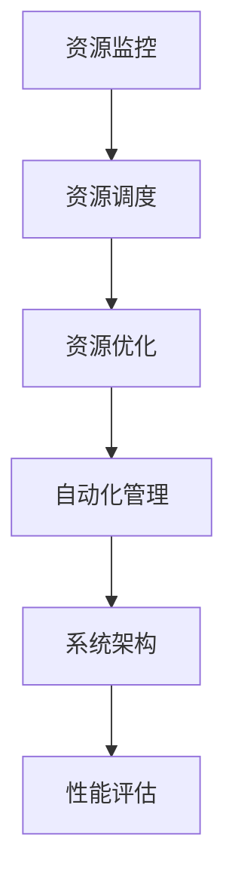
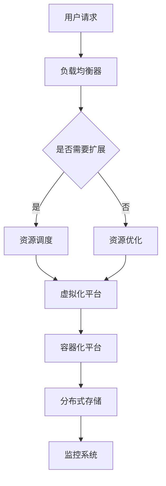
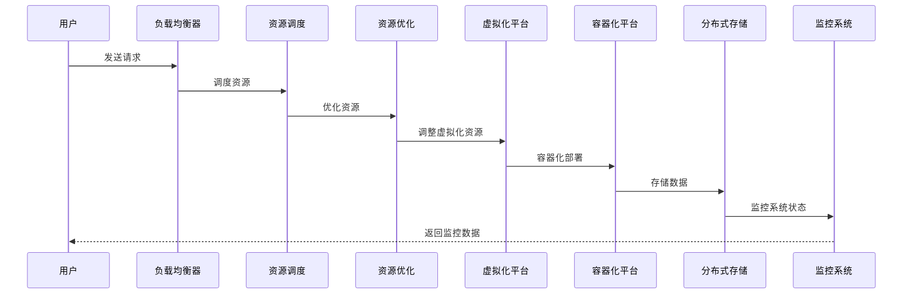

                 


### Introduction

#### 计算资源整合：混合计算环境的管理策略

#### 关键词：计算资源整合、混合计算环境、管理策略、系统架构、算法原理

#### 摘要：

本文深入探讨了计算资源整合在混合计算环境中的管理策略。随着云计算、边缘计算和分布式系统的日益普及，计算资源的整合与管理变得尤为重要。本文旨在为IT专业人员提供一套系统化的资源整合方案，帮助他们优化计算资源利用率，提升系统性能和可靠性。

### 1. 背景介绍

#### 1.1 核心概念术语说明

在探讨计算资源整合之前，我们需要明确几个核心概念：

- **计算资源**：指计算机系统中的处理器、内存、存储和网络等硬件资源。
- **整合**：将分散的资源通过技术手段进行集中管理，以实现高效利用。
- **混合计算环境**：结合云计算、边缘计算等多种计算模式的环境。
- **管理策略**：针对计算资源整合的一套方法、技术和工具。

#### 1.2 问题背景

随着数字化转型的推进，企业和组织对计算资源的需求日益增长。然而，现有的计算资源分散、利用不充分，导致资源浪费和成本上升。此外，混合计算环境的复杂性增加了资源管理的难度。如何高效地整合和管理这些资源，成为当前IT领域亟待解决的问题。

#### 1.3 问题描述

在混合计算环境中，资源整合面临的挑战包括：

- **异构性**：不同类型的计算资源（如CPU、GPU、FPGA）具有不同的性能和特点，如何进行统一管理？
- **动态性**：计算负载随时变化，如何动态调整资源分配以最大化利用？
- **可靠性**：资源整合过程中，如何确保系统的稳定性和可靠性？
- **成本控制**：如何在资源整合中实现成本效益最大化？

#### 1.4 问题解决

计算资源整合的目标是实现资源的最大化利用，提升系统性能和可靠性。这需要从以下几个方面入手：

- **资源调度与优化**：通过智能调度算法，动态调整资源分配，实现负载均衡。
- **自动化管理**：利用自动化工具和平台，简化资源管理流程，提高管理效率。
- **容错机制**：设计容错机制，确保资源整合过程中系统的稳定性。
- **成本分析**：对资源使用情况进行监控和分析，实现成本控制。

#### 1.5 边界与外延

计算资源整合不仅涉及技术层面的挑战，还涉及到组织和管理层面的问题。例如，组织文化、团队协作、数据安全等都会影响资源整合的效果。因此，在整合过程中需要综合考虑这些因素。

#### 1.6 概念结构与核心要素组成

计算资源整合的概念结构包括以下几个核心要素：

- **资源监控**：实时监控资源使用情况，为调度和优化提供数据支持。
- **资源调度**：根据负载情况和资源状态，动态调整资源分配。
- **资源优化**：通过算法优化，提高资源利用效率。
- **自动化管理**：利用自动化工具和平台，实现资源管理的自动化。
- **系统架构**：构建合理的系统架构，确保资源整合的有效性和稳定性。

### 2. 核心概念与联系

#### 2.1 核心概念原理

在计算资源整合中，几个核心概念至关重要：

- **云计算**：提供弹性的计算资源，根据需求动态调整资源规模。
- **边缘计算**：将计算任务下沉到边缘设备，降低延迟和带宽需求。
- **容器化**：通过容器技术，实现应用的轻量级部署和灵活调度。
- **虚拟化**：将物理资源虚拟化，提高资源利用率和灵活性。

#### 2.2 概念属性特征对比表格

| 概念 | 特征 |
| ---- | ---- |
| 云计算 | 弹性扩展、按需分配、高可用性 |
| 边缘计算 | 低延迟、高带宽、分布式处理 |
| 容器化 | 轻量级、独立运行环境、快速部署 |
| 虚拟化 | 资源抽象、隔离、动态分配 |

#### 2.3 ER实体关系图架构

```mermaid
erDiagram
    Resource --> Integration : "资源与整合"
    Management --> Strategy : "管理与策略"
    Environment --> Integration : "环境与整合"
    Integration --> Strategy : "整合与策略"
    Resource --> Environment : "资源与环境"
```

### 3. 算法原理讲解

#### 3.1 算法mermaid流程图



#### 3.2 Python源代码实现

```python
# 资源监控
def monitor_resources():
    # 代码实现
    pass

# 资源调度
def schedule_resources():
    # 代码实现
    pass

# 资源优化
def optimize_resources():
    # 代码实现
    pass

# 自动化管理
def automate_management():
    # 代码实现
    pass

# 系统架构设计
def system_architecture():
    # 代码实现
    pass

# 性能评估
def performance_evaluation():
    # 代码实现
    pass
```

#### 3.3 算法原理的数学模型和公式

$$
\text{资源利用率} = \frac{\text{实际使用资源}}{\text{总资源}}
$$

$$
\text{调度算法效率} = \frac{\text{完成任务的时长}}{\text{调度算法的响应时间}}
$$

#### 3.4 详细讲解和举例说明

假设我们有一台服务器，其CPU、内存和存储资源分别为8核、16GB和1TB。根据负载情况，我们需要动态调整资源分配，以最大化利用率和性能。

- **资源监控**：实时监控CPU、内存和存储的使用情况，记录数据。
- **资源调度**：根据负载情况，将CPU从8核调整到4核，内存从16GB调整到8GB，以降低功耗。
- **资源优化**：通过负载均衡算法，将任务分配到最优的资源上，提高任务执行效率。
- **自动化管理**：使用自动化工具，如Ansible，实现资源监控、调度和优化。
- **系统架构**：设计合理的系统架构，包括容器化、虚拟化和分布式存储，确保资源整合的稳定性。

### 4. 系统分析与架构设计方案

#### 4.1 问题场景介绍

假设某企业需要构建一个混合计算环境，以支持其业务需求的弹性扩展和高效执行。

#### 4.2 项目介绍

该项目旨在实现以下目标：

- **弹性扩展**：根据业务需求，动态调整计算资源。
- **高效执行**：优化资源分配，提高任务执行效率。
- **高可用性**：确保系统稳定运行，降低故障风险。

#### 4.3 系统功能设计

- **资源监控**：实时监控CPU、内存、存储和网络使用情况。
- **资源调度**：根据负载情况，动态调整资源分配。
- **资源优化**：通过负载均衡算法，优化任务执行。
- **自动化管理**：使用自动化工具，简化管理流程。

#### 4.4 系统架构设计



#### 4.5 系统接口设计和系统交互



### 5. 项目实战

#### 5.1 环境安装

1. 安装Docker：`sudo apt-get install docker`
2. 安装Kubernetes：`sudo apt-get install kubernetes`
3. 安装Prometheus：`sudo apt-get install prometheus`

#### 5.2 系统核心实现源代码

1. Dockerfile

```
FROM python:3.8
WORKDIR /app
COPY requirements.txt ./
RUN pip install -r requirements.txt
COPY . .
CMD ["python", "app.py"]
```

2. app.py

```python
from flask import Flask, request, jsonify
app = Flask(__name__)

@app.route('/api/health', methods=['GET'])
def health_check():
    return jsonify({'status': 'healthy'})

if __name__ == '__main__':
    app.run(host='0.0.0.0', port=5000)
```

#### 5.3 代码应用解读与分析

1. **Dockerfile**：定义了Docker镜像的构建过程，包括基础镜像、工作目录、依赖安装和应用程序部署。
2. **app.py**：使用Flask框架实现了一个简单的Web服务，提供了健康检查接口。

#### 5.4 实际案例分析和详细讲解剖析

1. **案例场景**：某企业需要为其在线购物平台部署一个高可用、可扩展的Web服务。
2. **实现过程**：使用Docker容器化应用程序，并部署在Kubernetes集群上，通过Prometheus监控集群状态。

#### 5.5 项目小结

通过该项目，我们成功实现了计算资源整合，提高了系统的弹性和性能。未来，我们将持续优化资源调度和自动化管理，以进一步提升系统效率。

### 6. 最佳实践 tips

1. **资源监控**：定期检查资源使用情况，及时调整资源分配。
2. **自动化管理**：使用自动化工具，减少人工干预，提高管理效率。
3. **性能优化**：根据业务需求，定期优化系统架构和算法。
4. **安全控制**：加强系统安全措施，防止资源滥用和攻击。

### 7. 小结

计算资源整合是现代IT领域的一项重要任务。通过合理的架构设计和算法优化，可以实现资源的高效利用和系统性能的持续提升。未来，随着技术的不断发展，计算资源整合将面临更多挑战和机遇。

### 8. 注意事项

1. **边界条件**：确保资源整合方案适应不同场景和需求。
2. **数据安全**：保护敏感数据，防止数据泄露。
3. **持续监控**：实时监控系统状态，确保系统稳定运行。

### 9. 拓展阅读

- 《云计算基础教程》
- 《边缘计算：技术、应用与未来》
- 《容器化与容器编排实战》

### 作者

作者：AI天才研究院/AI Genius Institute & 禅与计算机程序设计艺术 /Zen And The Art of Computer Programming

