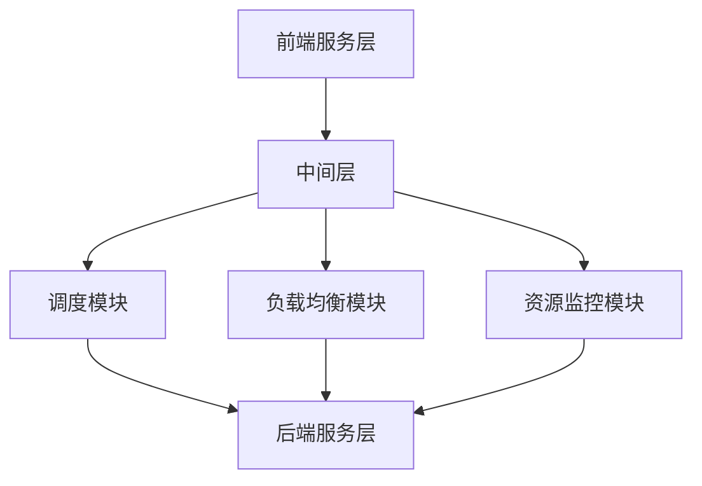
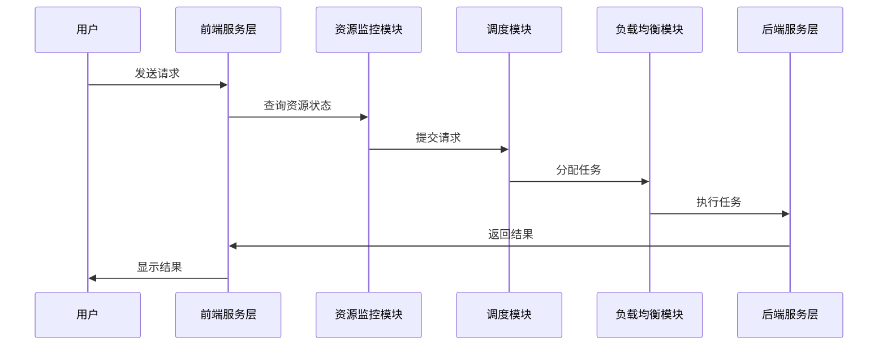
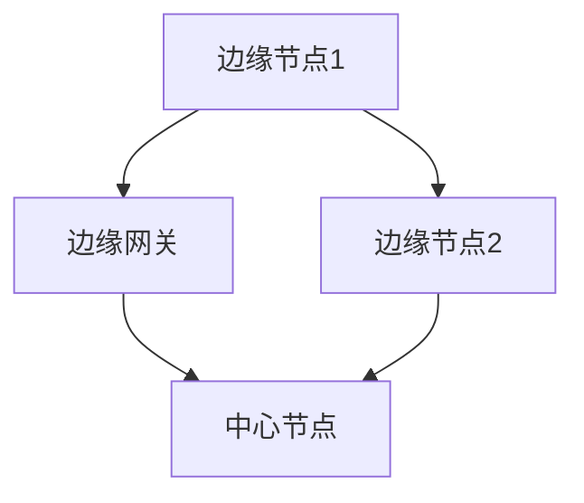
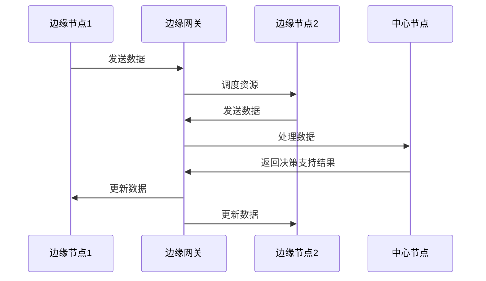
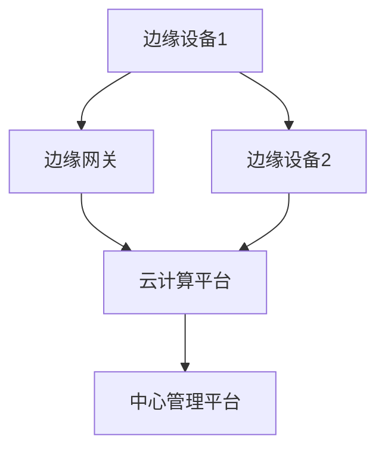
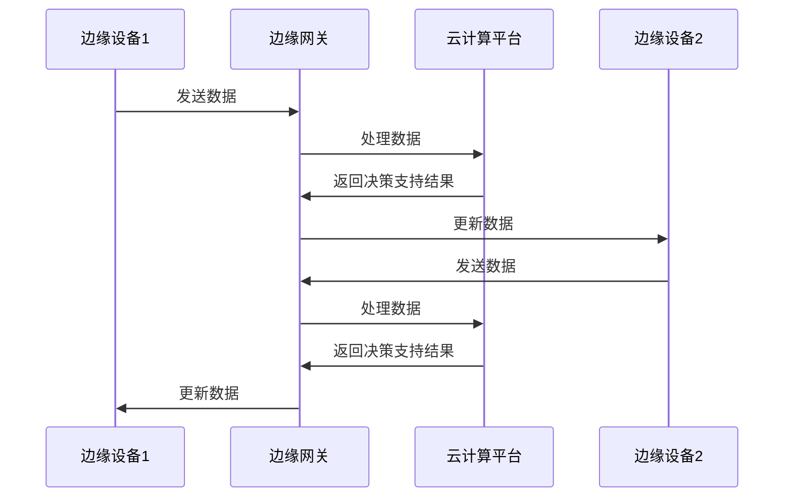
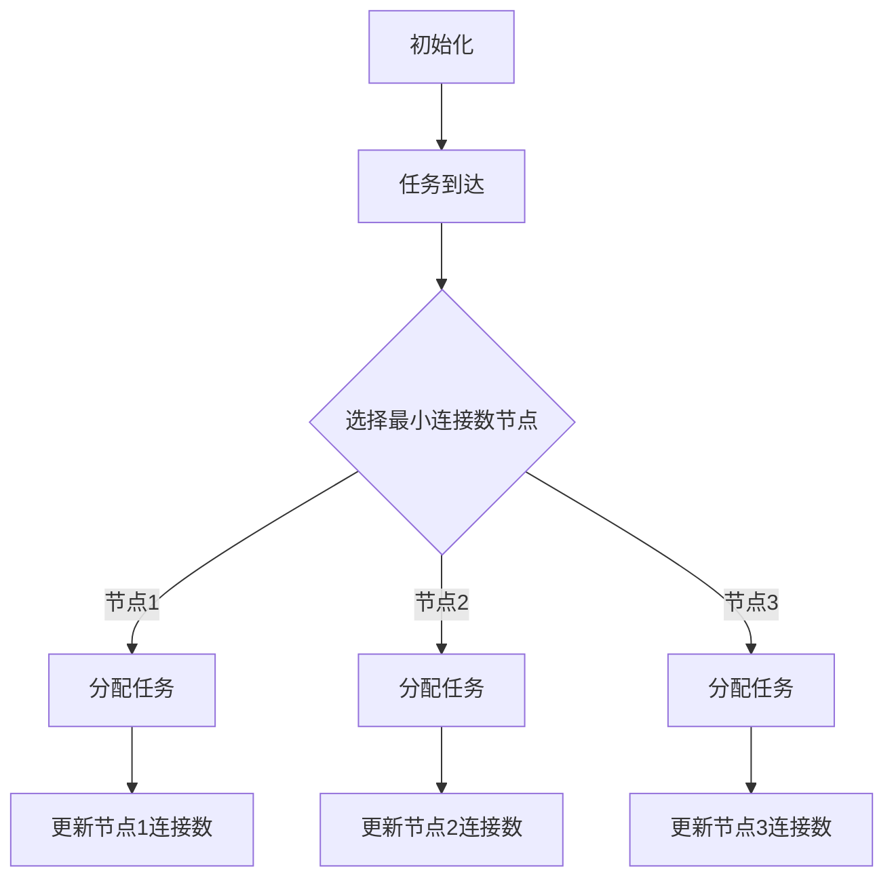
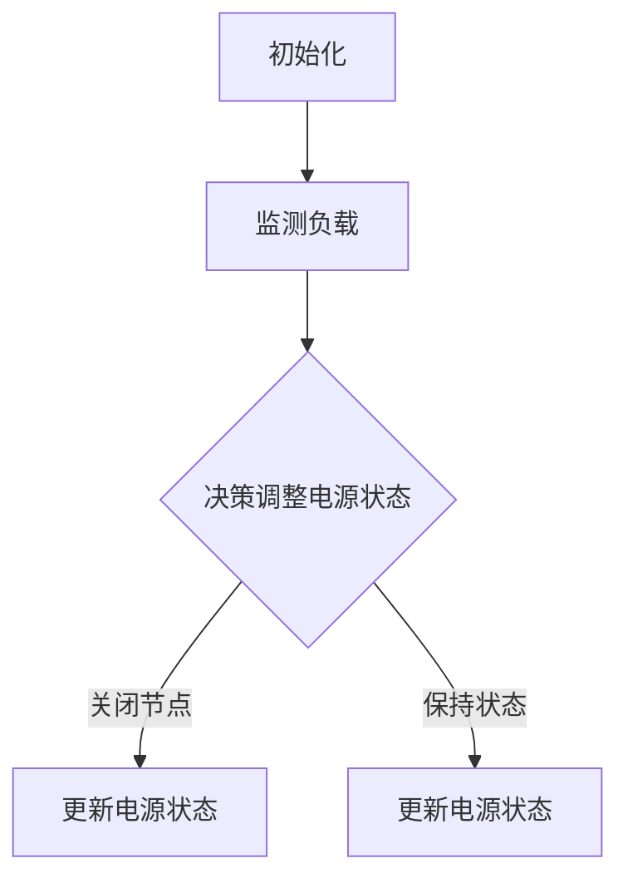
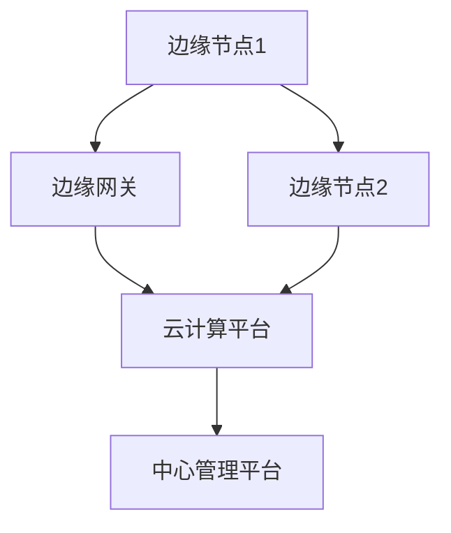
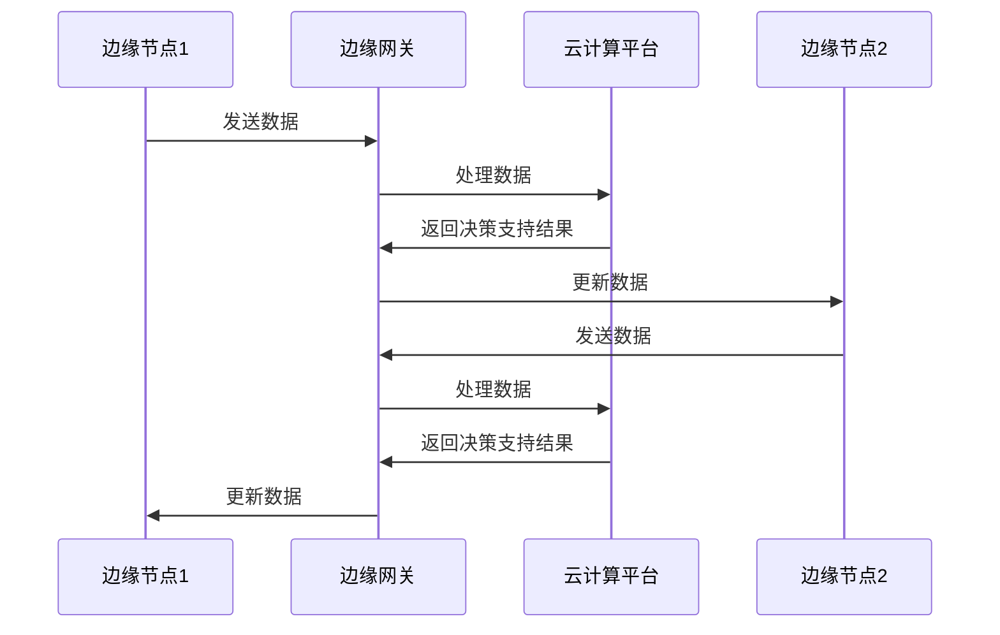

                 

### 计算资源调度：混合计算环境下的效率优化

在当今的数字化时代，计算资源的调度与管理变得日益重要。随着云计算、边缘计算等新型计算模式的兴起，如何优化计算资源调度，以提升整个计算环境的效率，成为了一个亟待解决的问题。本文将围绕计算资源调度这一主题，探讨其在混合计算环境下的效率优化问题。

#### 关键词：

- 计算资源调度
- 混合计算环境
- 效率优化
- 负载均衡
- 虚拟化技术

#### 摘要：

本文首先介绍了计算资源调度的背景与意义，随后对混合计算环境进行了概述，并探讨了效率优化的概念与分类。接着，本文详细分析了资源感知调度机制、负载均衡技术、虚拟化技术以及能源效率优化策略。通过几个实际案例的深入分析，本文展示了计算资源调度在不同计算环境中的应用。最后，本文提出了计算资源调度的算法原理与数学模型，以及项目实战与最佳实践建议。

#### 目录：

1. **第一部分：引言**
   - 1.1 计算资源调度的背景与意义
   - 1.2 混合计算环境概述
   - 1.3 效率优化的概念与分类
   - 1.4 本书结构安排

2. **第二部分：混合计算环境下的计算资源调度技术**
   - 2.1 资源感知调度机制
   - 2.2 负载均衡技术
   - 2.3 虚拟化技术
   - 2.4 能源效率优化

3. **第三部分：应用案例分析**
   - 3.1 云计算环境下的资源调度案例
   - 3.2 边缘计算环境下的资源调度案例
   - 3.3 混合云与边缘计算结合的案例

4. **第四部分：算法原理与数学模型**
   - 4.1 资源调度算法概述
   - 4.2 负载均衡算法原理
   - 4.3 能源效率优化算法

5. **第五部分：项目实战与最佳实践**
   - 5.1 环境安装与配置
   - 5.2 系统核心实现与代码分析
   - 5.3 实际案例分析与详细讲解

6. **第六部分：总结与展望**
   - 6.1 整体回顾
   - 6.2 未来发展趋势
   - 6.3 注意事项与最佳实践
   - 6.4 拓展阅读

---

### 第一部分：引言

#### 1.1 计算资源调度的背景与意义

随着信息技术的飞速发展，计算资源的需求呈现出爆发式增长。传统的计算资源调度方式已无法满足日益复杂的计算需求，尤其是在云计算、边缘计算等新型计算模式中，计算资源的调度问题显得尤为重要。计算资源调度指的是在计算环境中合理分配和调整计算资源，以最大化资源利用率、提高系统性能和降低成本。

**问题描述**：

- 在大规模计算环境中，如何实现高效的资源分配和调度？
- 如何在不同类型的计算需求下，动态调整资源分配策略？
- 如何平衡性能、成本和能源消耗之间的矛盾？

**问题解决**：

计算资源调度通过以下方式解决上述问题：

- **资源感知调度**：根据应用程序的需求和资源可用性，动态调整资源分配。
- **负载均衡**：通过合理分配任务，确保计算资源利用率最大化。
- **虚拟化技术**：将物理资源虚拟化，实现灵活的资源管理和调度。
- **能源效率优化**：通过节能策略，降低计算资源消耗。

**边界与外延**：

计算资源调度涉及多个领域，包括计算机科学、网络技术、算法设计等。其边界包括计算资源类型（如CPU、内存、存储等）、调度策略（如静态调度、动态调度等）以及应用场景（如云计算、大数据处理、边缘计算等）。外延则涉及资源调度算法的改进、调度系统的架构设计以及跨平台的资源调度机制。

#### 1.2 混合计算环境概述

**核心概念**：

混合计算环境是指将多种计算资源（如云计算、边缘计算、数据中心等）集成在一起，形成一个统一的计算体系。其特点包括：

- **多样性**：混合计算环境包含了多种计算资源和网络架构。
- **灵活性**：可以根据不同的应用需求，动态调整资源分配和调度策略。
- **高效性**：通过整合多种资源，提高计算效率和资源利用率。

**概念属性特征对比表格**：

| 特征         | 单一计算环境           | 混合计算环境           |
| ------------ | ---------------------- | ---------------------- |
| 资源类型     | 单一类型资源           | 多种类型资源           |
| 灵活性       | 适应性差，难以调整     | 高适应性，灵活调度     |
| 资源利用率   | 低利用率               | 高利用率               |
| 性能表现     | 受限于单一资源         | 受益于多种资源整合     |
| 能源消耗     | 较高                   | 通过优化降低           |

**ER实体关系图架构**：


在混合计算环境中，关键实体包括计算节点、网络连接、资源池、应用程序等。实体之间的关系如上图所示，通过合理设计实体之间的关系，可以更好地实现计算资源的调度和管理。

#### 1.3 效率优化的概念与分类

**效率优化的定义**：

效率优化是指通过优化计算资源调度策略、算法和系统架构，提高计算资源的利用率和系统性能，降低能耗和成本。

**分类**：

根据目标和方法的差异，效率优化可以分为以下几类：

- **资源利用率优化**：通过调度算法和资源管理策略，最大化计算资源的利用率。
- **性能优化**：通过优化调度策略和算法，提高系统性能，降低响应时间。
- **能源效率优化**：通过节能策略和技术，降低计算资源的能源消耗。
- **成本优化**：通过优化资源分配和调度策略，降低计算资源的成本。

#### 1.4 本书结构安排

**章节概览**：

本书分为六大部分，包括引言、混合计算环境下的计算资源调度技术、应用案例分析、算法原理与数学模型、项目实战与最佳实践以及总结与展望。各部分内容相互关联，构成了一个完整的计算资源调度技术体系。

**学习目标**：

通过本书的学习，读者应达到以下目标：

- 了解计算资源调度的背景与意义。
- 掌握混合计算环境的特征和调度策略。
- 理解效率优化的概念和分类。
- 掌握计算资源调度的算法原理与数学模型。
- 掌握计算资源调度的应用案例和实践经验。
- 能够设计并实现一个高效的计算资源调度系统。

### 第一部分总结

本部分主要介绍了计算资源调度的背景与意义，对混合计算环境进行了概述，并探讨了效率优化的概念与分类。通过这些基础知识的介绍，读者可以对计算资源调度在混合计算环境下的重要性有一个初步的了解。接下来，本文将深入探讨混合计算环境下的具体技术手段和应用案例。


---

### 第二部分：混合计算环境下的计算资源调度技术

在混合计算环境中，计算资源调度的目标是优化资源分配，提高系统性能，降低能源消耗和成本。本部分将介绍几种关键技术，包括资源感知调度机制、负载均衡技术、虚拟化技术和能源效率优化策略。

#### 2.1 资源感知调度机制

**资源感知调度**：

资源感知调度是一种智能调度机制，它能够根据应用程序的需求和当前计算资源的可用性，动态调整资源分配。这种机制的核心在于感知资源状态和应用需求，从而做出实时调整。

**原理与实现**：

资源感知调度机制的实现通常包括以下几个步骤：

1. **资源感知**：实时监控计算资源的状态，包括CPU利用率、内存占用率、网络带宽等。
2. **需求感知**：分析应用程序的运行状态和性能需求，识别其资源需求的变化趋势。
3. **调度策略**：根据资源状态和应用需求，选择合适的调度策略进行资源调整。
4. **反馈调整**：根据调度结果，对调度策略进行反馈调整，以优化资源利用率。

**方法与应用场景**：

资源感知调度机制可以应用于多种场景，如：

- **云计算**：根据云服务的动态需求，合理分配虚拟机资源。
- **边缘计算**：在边缘节点上实时调度计算任务，满足低延迟和高带宽的要求。
- **大数据处理**：在大规模数据处理中，动态调整数据处理节点，提高处理效率。

#### 2.2 负载均衡技术

**负载均衡**：

负载均衡是指在计算环境中，通过合理的任务分配和调度，确保每个计算节点都能充分利用资源，避免单点过载和资源浪费。

**基本概念与作用**：

负载均衡的基本概念包括以下方面：

- **负载分配**：将计算任务合理地分配到不同的计算节点上。
- **负载监测**：实时监测各个计算节点的负载情况，以确保负载均衡。
- **负载转移**：当某个计算节点负载过高时，将部分任务转移到其他节点。

负载均衡的作用主要体现在：

- **提高系统性能**：通过合理分配任务，提高系统的处理能力。
- **提升用户体验**：减少单个节点的响应时间，提升用户访问体验。
- **增强系统稳定性**：避免单点过载，提高系统的可靠性。

**负载均衡算法**：

常见的负载均衡算法包括以下几种：

- **轮询算法**（Round Robin）：按照顺序将任务分配到各个节点。
- **最小连接算法**（Least Connections）：将任务分配到连接数最少的节点。
- **响应时间算法**（Response Time）：根据节点的响应时间来分配任务。

**性能分析**：

不同的负载均衡算法在性能上有不同的表现。轮询算法简单易实现，但可能不适用于负载不均匀的场景。最小连接算法和响应时间算法更能应对动态负载，但实现复杂度较高。

#### 2.3 虚拟化技术

**虚拟化技术**：

虚拟化技术是一种将物理资源抽象为虚拟资源的技术，它允许在一个物理节点上同时运行多个虚拟机，从而提高资源利用率和灵活性。

**工作原理**：

虚拟化技术的工作原理包括以下几个部分：

- **虚拟化层**：在物理资源上建立一个虚拟化层，将物理资源划分为多个虚拟资源。
- **虚拟机管理器**：管理虚拟机的创建、运行和销毁，负责资源分配和调度。
- **虚拟化资源**：虚拟CPU、内存、存储和网络等资源，供虚拟机使用。

**虚拟化资源调度**：

虚拟化资源调度的目标是优化虚拟机的资源分配，提高整体系统性能。常见的调度策略包括：

- **CPU调度**：根据虚拟机的CPU需求，动态调整虚拟机的CPU资源。
- **内存调度**：根据虚拟机的内存需求，调整内存分配策略。
- **存储调度**：优化存储资源的分配和使用，提高数据访问速度。
- **网络调度**：根据网络流量情况，动态调整网络资源的分配。

**性能优化与挑战**：

虚拟化技术的性能优化主要包括：

- **降低虚拟化开销**：通过优化虚拟化层，减少虚拟机运行时的性能损失。
- **资源隔离**：确保虚拟机之间的资源隔离，避免资源争用。
- **高效调度算法**：设计高效的调度算法，提高资源利用率和系统性能。

虚拟化技术面临的挑战包括：

- **性能瓶颈**：虚拟化层可能引入性能瓶颈，影响系统性能。
- **资源管理复杂性**：虚拟化环境中的资源管理更加复杂，需要高效的调度和管理策略。
- **安全性**：虚拟化环境中的安全性和隔离性需要特别关注。

#### 2.4 能源效率优化

**能源效率**：

能源效率是指在计算资源使用过程中，如何降低能源消耗，提高计算效率。在混合计算环境中，能源效率优化变得尤为重要，因为能源消耗直接影响到系统的运行成本和环境影响。

**重要性与现状**：

能源效率的重要性体现在以下几个方面：

- **成本降低**：通过降低能源消耗，可以显著降低运营成本。
- **环境保护**：减少能源消耗有助于减少碳排放，保护环境。
- **系统可靠性**：降低能源消耗可以减少设备的过热风险，提高系统可靠性。

当前能源效率的现状包括：

- **技术进步**：随着硬件和软件技术的发展，计算资源的能效比不断提升。
- **节能意识提高**：企业、政府和科研机构越来越重视能源效率问题，推动了相关技术的发展。
- **节能技术应用**：各种节能技术在计算系统中得到了广泛应用，如节能电源管理、智能冷却系统等。

**能源效率优化策略**：

常见的能源效率优化策略包括：

- **动态电源管理**：根据计算负载动态调整电源供应，降低能耗。
- **智能冷却系统**：通过监测和调节系统温度，降低冷却能耗。
- **高效硬件选择**：选择能效比更高的硬件设备，降低整体能耗。
- **优化调度策略**：通过优化计算任务的调度，减少不必要的计算资源消耗。

**节能算法与实现**：

常见的节能算法包括：

- **基于负载的节能算法**：根据计算负载动态调整计算资源的功率。
- **基于温度的节能算法**：根据系统温度变化调整功耗。
- **基于预测的节能算法**：通过预测未来的负载情况，提前调整能耗。

这些算法的实现通常涉及到复杂的数学模型和实时监测系统，需要结合具体的计算环境进行优化。

### 第二部分总结

本部分详细介绍了混合计算环境下的四种关键技术：资源感知调度机制、负载均衡技术、虚拟化技术和能源效率优化策略。通过这些技术，可以显著提升混合计算环境的效率和性能。接下来，本文将通过实际案例，进一步展示这些技术在混合计算环境中的应用。

---

### 第三部分：应用案例分析

在上一部分中，我们详细介绍了混合计算环境下的计算资源调度技术。本部分将通过几个实际案例，深入探讨这些技术在云计算、边缘计算和混合云与边缘计算结合环境中的应用，并分析其系统功能设计、架构设计以及接口设计。

#### 3.1 云计算环境下的资源调度案例

**案例介绍**：

某大型互联网公司采用云计算环境，提供大规模的在线服务。由于用户数量庞大，如何高效地调度计算资源，以满足用户的需求，成为公司面临的主要挑战。

**系统功能设计**：

在该案例中，系统功能设计主要包括以下模块：

1. **用户请求处理模块**：负责接收用户的请求，并根据请求类型和优先级进行排序。
2. **资源监控模块**：实时监控云计算环境中各个节点的资源状态，包括CPU利用率、内存占用率、网络带宽等。
3. **调度模块**：根据资源状态和用户请求，动态调整资源分配，确保每个用户都能得到及时响应。
4. **负载均衡模块**：通过轮询算法和最小连接算法，合理分配任务到不同的节点，避免单点过载。

**系统架构设计**：

系统架构设计采用了分布式架构，主要组成部分包括：

- **前端服务层**：负责处理用户请求，将请求转发到后端处理。
- **中间层**：包括资源监控模块、调度模块和负载均衡模块，负责资源管理和任务调度。
- **后端服务层**：处理具体的业务逻辑，包括数据处理、存储等。

**Mermaid架构图**：



**系统接口设计**：

系统接口设计主要包括以下接口：

1. **用户请求接口**：接收用户请求，并返回响应结果。
2. **资源状态接口**：提供节点资源状态信息，供调度模块和负载均衡模块使用。
3. **任务分配接口**：用于调度模块和负载均衡模块之间进行任务分配。

**Mermaid序列图**：



#### 3.2 边缘计算环境下的资源调度案例

**案例介绍**：

某智能交通系统采用边缘计算环境，提供实时交通监控和智能决策支持。由于边缘节点分布在不同的地理位置，如何高效地调度计算资源，以满足实时性和低延迟的要求，成为系统的关键挑战。

**系统功能设计**：

在该案例中，系统功能设计主要包括以下模块：

1. **数据采集模块**：负责实时采集交通监控数据，包括车辆速度、流量等。
2. **数据处理模块**：对采集到的数据进行分析和处理，提取有用的信息。
3. **调度模块**：根据边缘节点的资源状态和任务需求，动态调整资源分配。
4. **决策支持模块**：根据处理结果，提供实时交通监控和智能决策支持。

**系统架构设计**：

系统架构设计采用了分布式边缘计算架构，主要组成部分包括：

- **边缘节点**：负责数据采集和初步处理。
- **边缘网关**：负责调度和协调不同边缘节点的资源分配。
- **中心节点**：负责最终的数据处理和决策支持。

**Mermaid架构图**：



**系统接口设计**：

系统接口设计主要包括以下接口：

1. **数据采集接口**：接收边缘节点的监控数据。
2. **数据处理接口**：提供数据分析和处理功能。
3. **调度接口**：用于边缘网关和边缘节点之间的资源调度。
4. **决策支持接口**：提供决策支持结果。

**Mermaid序列图**：



#### 3.3 混合云与边缘计算结合的案例

**案例介绍**：

某智能工厂采用混合云与边缘计算结合的方式，实现生产过程的智能化和自动化。工厂内部署了大量的边缘设备和传感器，同时通过云计算平台进行数据处理和决策支持。如何高效地调度计算资源，以满足大规模生产和实时决策的需求，成为系统的核心挑战。

**系统功能设计**：

在该案例中，系统功能设计主要包括以下模块：

1. **边缘设备管理模块**：负责边缘设备的监控和管理，包括设备的在线状态、资源使用情况等。
2. **边缘数据处理模块**：负责对边缘设备采集的数据进行初步处理和分析。
3. **云计算处理模块**：负责对边缘设备上传的数据进行进一步处理和分析，提供决策支持。
4. **调度模块**：根据边缘设备和云计算平台的状态，动态调整资源分配。

**系统架构设计**：

系统架构设计采用了混合云与边缘计算架构，主要组成部分包括：

- **边缘设备**：负责数据采集和生产监控。
- **边缘网关**：负责边缘设备的数据收集和初步处理。
- **云计算平台**：负责大规模数据处理和决策支持。
- **中心管理平台**：负责整体系统的资源调度和管理。

**Mermaid架构图**：



**系统接口设计**：

系统接口设计主要包括以下接口：

1. **设备管理接口**：用于边缘设备的管理和监控。
2. **数据处理接口**：用于边缘数据处理模块和云计算平台之间的数据传输。
3. **调度接口**：用于中心管理平台和边缘网关之间的资源调度。
4. **决策支持接口**：用于云计算平台向边缘设备提供决策支持。

**Mermaid序列图**：



### 第三部分总结

通过上述三个实际案例，我们可以看到计算资源调度技术在云计算、边缘计算和混合云与边缘计算结合环境中的应用。这些案例展示了系统功能设计、架构设计和接口设计的具体实现，为读者提供了宝贵的实践经验。在下一部分，我们将进一步探讨计算资源调度的算法原理与数学模型。

---

### 第四部分：算法原理与数学模型

在计算资源调度中，算法原理与数学模型起到了关键作用。这些算法和模型不仅帮助优化资源分配，还提供了理论支持，指导实际调度系统的设计和实现。本部分将详细探讨资源调度算法、负载均衡算法和能源效率优化算法的原理，并给出相应的数学模型。

#### 4.1 资源调度算法概述

**调度算法的分类**：

资源调度算法可以根据不同的分类标准进行划分。以下是一些常见的分类方法：

- **按目标分类**：可以分为最大化资源利用率、最小化响应时间、最小化成本等。
- **按方法分类**：可以分为静态调度算法和动态调度算法。
- **按策略分类**：可以分为基于负载均衡的调度算法、基于优先级的调度算法等。

**调度算法的比较**：

不同的调度算法在性能上有不同的表现。以下是一些常见调度算法的比较：

- **轮询算法**：简单易实现，但可能不适用于负载不均匀的场景。
- **最小连接算法**：适用于动态负载，但实现复杂度较高。
- **优先级调度算法**：根据任务的优先级进行调度，但可能引起饥饿问题。
- **动态调度算法**：根据实时负载动态调整资源分配，但需要复杂的实时监测和调整机制。

**调度算法的比较表格**：

| 算法名称 | 优点 | 缺点 | 适用场景 |
| :------: | :--: | :--: | :------: |
| 轮询算法 | 简单易实现 | 可能不均匀 | 稳定负载 |
| 最小连接算法 | 适用于动态负载 | 实现复杂度高 | 动态负载 |
| 优先级调度算法 | 优先处理高优先级任务 | 可能引起饥饿问题 | 任务优先级明确 |
| 动态调度算法 | 根据实时负载调整 | 需要复杂实时监测机制 | 动态负载 |

#### 4.2 负载均衡算法原理

**算法原理讲解**：

负载均衡算法的核心目标是确保计算资源得到充分利用，避免单点过载。以下是一个常见的负载均衡算法——最小连接算法的原理讲解：

- **初始化**：初始化各个计算节点的连接数，并将其设置为0。
- **任务分配**：当有新任务到达时，选择当前连接数最小的节点进行任务分配。
- **连接数更新**：任务分配后，更新节点的连接数。

**算法流程图**：



**Python源代码实现**：

```python
def min_conn_nodes(nodes):
    min_conn = float('inf')
    min_node = None

    for node in nodes:
        if node['connections'] < min_conn:
            min_conn = node['connections']
            min_node = node

    return min_node

def allocate_task(nodes, task):
    min_node = min_conn_nodes(nodes)
    min_node['connections'] += 1
    return min_node

# 示例
nodes = [
    {'id': 1, 'connections': 0},
    {'id': 2, 'connections': 1},
    {'id': 3, 'connections': 2}
]

task = 'new_task'
allocated_node = allocate_task(nodes, task)
print(f"Task '{task}' allocated to node {allocated_node['id']}")
```

**数学模型与公式**：

最小连接算法可以用以下数学模型表示：

$$
\text{min\_node} = \arg\min_{i} (\text{nodes}[i]['connections'])
$$

其中，$\text{min\_node}$ 表示选择的最小连接数节点，$\text{nodes}[i]['connections']$ 表示节点 $i$ 的当前连接数。

#### 4.3 能源效率优化算法

**算法原理讲解**：

能源效率优化算法的目的是在满足性能要求的同时，最大限度地降低计算资源的能源消耗。以下是一个基于动态电源管理的能源效率优化算法的原理讲解：

- **初始化**：初始化各个计算节点的电源状态。
- **监测**：实时监测各个节点的负载情况。
- **决策**：根据节点的负载情况，动态调整节点的电源状态（如关闭低负载节点）。

**算法流程图**：



**Python源代码实现**：

```python
def monitor_and_adjust(nodes):
    for node in nodes:
        if node['load'] < threshold:
            node['power_state'] = 'off'
        else:
            node['power_state'] = 'on'

def adjust_power(nodes, threshold=0.5):
    monitor_and_adjust(nodes)

# 示例
nodes = [
    {'id': 1, 'load': 0.3, 'power_state': 'on'},
    {'id': 2, 'load': 0.8, 'power_state': 'on'},
    {'id': 3, 'load': 0.2, 'power_state': 'on'}
]

adjust_power(nodes)
print(nodes)
```

**数学模型与公式**：

动态电源管理算法可以用以下数学模型表示：

$$
\text{power\_state}[i] = 
\begin{cases}
\text{'off'}, & \text{if } \text{load}[i] < \text{threshold} \\
\text{'on'}, & \text{otherwise}
\end{cases}
$$

其中，$\text{power\_state}[i]$ 表示节点 $i$ 的电源状态，$\text{load}[i]$ 表示节点 $i$ 的负载情况，$\text{threshold}$ 表示设定的负载阈值。

### 第四部分总结

在本部分，我们详细探讨了资源调度算法、负载均衡算法和能源效率优化算法的原理，并给出了相应的数学模型。这些算法和模型为计算资源调度提供了理论支持，指导实际系统的设计和实现。在下一部分，我们将通过项目实战，进一步展示计算资源调度的应用和实践。

---

### 第五部分：项目实战与最佳实践

在上一部分，我们详细探讨了计算资源调度相关的算法原理与数学模型。为了更好地理解和应用这些理论知识，本部分将通过一个实际项目，详细介绍计算资源调度的环境安装与配置、系统核心实现与代码分析，以及实际案例分析和详细讲解。

#### 5.1 环境安装与配置

**计算资源调度环境**：

为了进行计算资源调度的项目实战，我们首先需要搭建一个合适的计算资源调度环境。以下是环境搭建的步骤：

1. **安装操作系统**：选择一个合适的操作系统，如Ubuntu 20.04或CentOS 8，进行安装。
2. **安装虚拟化软件**：安装虚拟化软件，如VMware Workstation或VirtualBox，用于创建虚拟机。
3. **安装调度软件**：安装调度软件，如Apache Mesos或Kubernetes，用于资源调度。
4. **配置网络**：配置网络，确保虚拟机之间能够相互通信。

**实战操作**：

以下是具体的操作步骤：

1. **安装操作系统**：
   - 下载操作系统镜像文件。
   - 使用虚拟化软件创建新的虚拟机，并加载操作系统镜像。
   - 按照操作系统安装向导完成安装。

2. **安装虚拟化软件**：
   - 下载虚拟化软件的安装包。
   - 在操作系统上运行安装命令，完成虚拟化软件的安装。

3. **安装调度软件**：
   - 下载调度软件的安装包。
   - 在操作系统上运行安装命令，完成调度软件的安装。
   - 根据需要配置调度软件，如配置Mesos的主从结构或Kubernetes的集群。

4. **配置网络**：
   - 确保虚拟机之间的网络连接正常。
   - 使用IP地址或域名进行网络访问测试。

通过以上步骤，我们可以搭建一个基本的计算资源调度环境，为后续的项目实战打下基础。

#### 5.2 系统核心实现与代码分析

**系统核心实现**：

在计算资源调度的项目中，系统核心实现是关键部分。以下是系统核心实现的主要功能模块和代码分析：

1. **资源监控模块**：
   - **功能**：实时监控各个节点的资源状态，包括CPU利用率、内存占用率和网络带宽等。
   - **实现**：
     ```python
     import psutil

     def monitor_resources():
         cpu_usage = psutil.cpu_percent()
         memory_usage = psutil.virtual_memory().percent
         network_usage = psutil.net_io_counters()
         return cpu_usage, memory_usage, network_usage
     ```

2. **调度模块**：
   - **功能**：根据资源状态和任务需求，动态调整资源分配。
   - **实现**：
     ```python
     def schedule_tasks(available_resources, tasks):
         assigned_tasks = []
         for task in tasks:
             suitable_node = find_suitable_node(available_resources, task)
             if suitable_node:
                 assigned_tasks.append((suitable_node, task))
                 available_resources[suitable_node]['load'] += task['required_resources']
         return assigned_tasks

     def find_suitable_node(available_resources, task):
         for node, resources in available_resources.items():
             if resources['load'] + task['required_resources'] <= resources['max_load']:
                 return node
         return None
     ```

3. **负载均衡模块**：
   - **功能**：合理分配任务，确保每个节点都能充分利用资源，避免单点过载。
   - **实现**：
     ```python
     def balance_load(available_resources, tasks):
         for task in tasks:
             node = min_conn_nodes(available_resources)
             assigned_tasks.append((node, task))
             available_resources[node]['load'] += task['required_resources']
         return assigned_tasks

     def min_conn_nodes(available_resources):
         min_node = None
         min_load = float('inf')
         for node, resources in available_resources.items():
             if resources['load'] < min_load:
                 min_load = resources['load']
                 min_node = node
         return min_node
     ```

**代码应用解读**：

以上代码片段展示了计算资源调度的核心功能模块。资源监控模块通过`psutil`库实时获取节点的资源状态。调度模块通过分配任务到合适的节点，并更新节点的负载情况。负载均衡模块通过选择最小连接数节点，确保资源得到充分利用。

**代码优化建议**：

- **性能优化**：可以通过多线程或异步编程提高监控和调度的性能。
- **可扩展性**：设计可扩展的架构，支持更多的节点和任务类型。
- **错误处理**：增加错误处理机制，确保系统在异常情况下能够稳定运行。

#### 5.3 实际案例分析与详细讲解

**案例分析**：

为了更好地理解计算资源调度的实际应用，我们选择了一个实际案例——智能交通系统。该系统采用云计算和边缘计算相结合的方式，提供实时交通监控和智能决策支持。

**系统功能设计**：

1. **数据采集模块**：实时采集交通监控数据，包括车辆速度、流量等。
2. **数据处理模块**：对采集到的数据进行分析和处理，提取有用的信息。
3. **调度模块**：根据边缘节点和云计算平台的状态，动态调整资源分配。
4. **决策支持模块**：根据处理结果，提供实时交通监控和智能决策支持。

**系统架构设计**：

系统架构设计采用了分布式架构，包括边缘节点、边缘网关、云计算平台和中心管理平台。边缘节点负责数据采集和初步处理，边缘网关负责调度和协调不同边缘节点的资源分配，云计算平台负责大规模数据处理和决策支持，中心管理平台负责整体系统的资源调度和管理。

**Mermaid架构图**：



**系统接口设计**：

系统接口设计主要包括以下接口：

1. **数据采集接口**：用于边缘节点接收交通监控数据。
2. **数据处理接口**：用于边缘网关和云计算平台之间的数据传输。
3. **调度接口**：用于中心管理平台和边缘网关之间的资源调度。
4. **决策支持接口**：用于云计算平台向边缘节点提供决策支持。

**Mermaid序列图**：



**详细讲解**：

- **数据采集**：边缘节点实时采集交通监控数据，包括车辆速度、流量等。这些数据通过数据采集接口传输到边缘网关。
- **数据处理**：边缘网关对采集到的数据进行初步处理，包括数据清洗、特征提取等，然后通过数据处理接口将数据传输到云计算平台。
- **调度**：中心管理平台根据边缘节点和云计算平台的状态，动态调整资源分配。调度接口用于协调不同节点之间的资源分配。
- **决策支持**：云计算平台对处理后的数据进行分析和处理，提取有用的信息，然后通过决策支持接口向边缘节点提供决策支持。

**总结与反思**：

通过上述案例，我们可以看到计算资源调度在智能交通系统中的应用。该系统通过合理分配和调度计算资源，实现了实时交通监控和智能决策支持。然而，在实际应用中，还需要进一步优化调度算法，提高资源利用率和系统性能。

#### 第五部分总结

在本部分，我们通过项目实战详细介绍了计算资源调度的环境安装与配置、系统核心实现与代码分析，以及实际案例分析和详细讲解。通过这些实战经验，读者可以更好地理解计算资源调度的实际应用，掌握系统设计和实现的核心要点。在下一部分，我们将进一步总结本书的主要内容，并探讨计算资源调度的未来发展趋势。

---

### 第六部分：总结与展望

#### 6.1 整体回顾

本篇博客从计算资源调度的背景与意义出发，详细介绍了混合计算环境下的计算资源调度技术，包括资源感知调度机制、负载均衡技术、虚拟化技术和能源效率优化策略。通过实际案例的分析，展示了计算资源调度在不同计算环境中的应用和实践。此外，我们还探讨了计算资源调度的算法原理与数学模型，并提供了项目实战与最佳实践建议。

#### 6.2 未来发展趋势

随着信息技术的不断发展，计算资源调度技术在未来的发展趋势将呈现出以下几个特点：

1. **智能化**：利用人工智能和机器学习技术，实现更加智能的调度策略，提高资源利用率和系统性能。
2. **自动化**：通过自动化工具和平台，简化计算资源调度的流程，降低人力成本。
3. **弹性扩展**：支持动态扩展和收缩计算资源，以应对不同负载场景。
4. **绿色计算**：进一步优化能源效率，减少能源消耗和碳排放，实现可持续发展。

#### 6.3 注意事项与最佳实践

在使用计算资源调度技术时，需要注意以下几点：

1. **资源监控**：实时监控计算资源状态，确保调度决策基于准确的数据。
2. **负载均衡**：合理分配任务，避免单点过载，提高系统性能。
3. **容错性**：设计容错机制，确保系统在异常情况下能够稳定运行。
4. **安全性**：加强数据保护和隐私安全，确保计算资源调度的安全性。

最佳实践包括：

1. **动态调整**：根据实时负载动态调整资源分配，提高资源利用率。
2. **数据优化**：优化数据传输和处理流程，减少延迟和带宽消耗。
3. **多维度优化**：综合考虑性能、成本和能源消耗，实现全方位的优化。
4. **持续改进**：不断优化调度算法和系统架构，以适应不断变化的需求。

#### 6.4 拓展阅读

对于希望深入了解计算资源调度技术的读者，以下资源可以提供进一步的学习：

1. **学术论文**：阅读最新的学术论文，了解计算资源调度领域的最新研究进展。
2. **开源项目**：参与开源项目，实践计算资源调度的实际应用。
3. **专业书籍**：阅读专业书籍，系统学习计算资源调度的理论知识。
4. **在线课程**：参加在线课程，获取专业的知识和技能。

### 总结

计算资源调度是混合计算环境中至关重要的技术，通过合理的调度策略，可以提高系统性能、降低能源消耗和成本。本文从多个角度详细探讨了计算资源调度的技术、应用和算法，为读者提供了全面的了解。希望本文能够为读者在计算资源调度领域的学习和应用提供有益的参考。

---

**作者：AI天才研究院/AI Genius Institute & 禅与计算机程序设计艺术 /Zen And The Art of Computer Programming**

