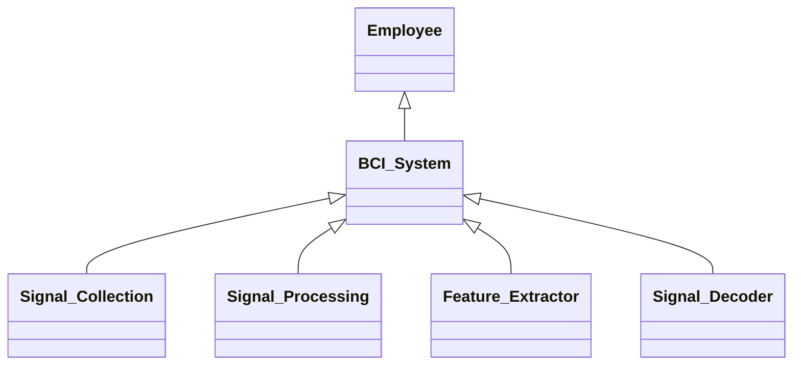
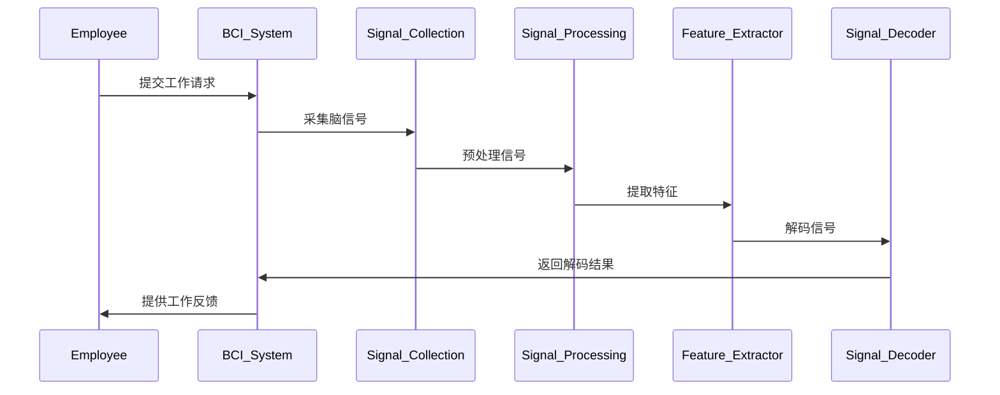
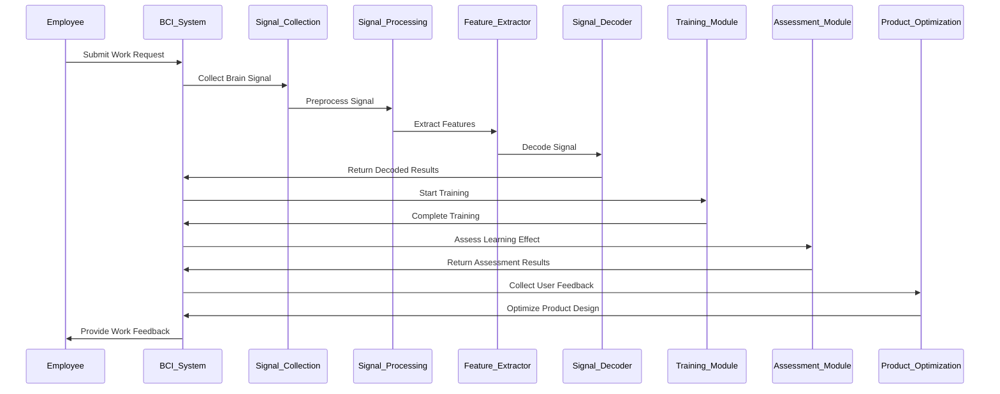

                 

----------------------------------------------------------------

# 认知增强伦理：企业采用脑机接口技术的考量

关键词：认知增强伦理、脑机接口（BCI）、企业应用、伦理框架、法律监管

摘要：
随着科技的飞速发展，脑机接口（Brain-Computer Interface，简称BCI）技术逐渐成为企业提升员工认知能力的重要工具。然而，这种技术的应用也引发了一系列伦理和法律问题。本文将从多个角度深入探讨企业采用BCI技术的考量，包括其伦理基础、实践中的挑战以及未来发展的方向。

----------------------------------------------------------------

## 第一部分：背景与核心

### 1.1 核心概念术语说明

- **认知增强伦理**：研究认知增强技术的道德原则、价值判断和规范性问题。
- **脑机接口（BCI）**：直接连接大脑与外部设备的技术，用于增强或修复人类认知功能。

### 1.2 问题背景

- **科技发展**：人工智能和生物技术领域的突破使得BCI技术成为可能。
- **企业需求**：提高员工工作效率和创新能力，降低人才流失率。

### 1.3 问题描述

- **伦理困境**：BCI技术的应用可能侵犯隐私权、造成心理负担、加剧社会不平等。
- **法律监管**：缺乏明确的法律框架来规范BCI技术的使用。

### 1.4 问题解决

- **建立伦理框架**：制定明确的伦理准则和标准。
- **加强法律监管**：完善相关法律法规，确保BCI技术的合法合规使用。

### 1.5 边界与外延

- **边界**：本文主要关注BCI技术在企业中的应用，不包括医疗和个人领域的使用。
- **外延**：探讨BCI技术的潜在社会影响和长远发展。

### 1.6 概念结构与核心要素组成

- **概念结构**：
  - 认知增强伦理：道德原则、价值判断、规范性问题。
  - BCI技术：硬件设备、软件算法、人脑接口。
- **核心要素**：
  - 伦理考量：隐私、心理负担、社会公平。
  - 技术挑战：稳定性、可靠性、兼容性。

----------------------------------------------------------------

## 第二部分：核心概念与联系

### 2.1 核心概念原理

**认知增强伦理**：
- 基于道德原则，旨在确保BCI技术的公平、公正和安全使用。
- 包含隐私保护、自主选择、知情同意等核心价值观。

**脑机接口（BCI）技术**：
- 利用脑信号识别和处理技术，实现人脑与外部设备的高效通信。
- 包括脑信号采集、预处理、解码和输出等环节。

### 2.2 概念属性特征对比表格

| 概念         | 属性特征                     | 说明                                                         |
| ------------ | ---------------------------- | ------------------------------------------------------------ |
| 认知增强伦理 | 道德原则、价值判断、规范性问题 | 确保BCI技术应用的道德合法性，保护个体权益                   |
| 脑机接口（BCI） | 脑信号识别、预处理、解码、输出 | 实现人脑与外部设备的直接通信，提高认知能力                 |

### 2.3 ER实体关系图架构

```mermaid
erDiagram
    Employee ||--|{ BCI_System }| BCI_System : used by
    BCI_System ||--|{ Ethical_Framework }| Ethical_Framework : follows
    Ethical_Framework ||--|{ Legal_Standard }| Legal_Standard : complies with
```

**说明**：该图展示了员工、BCI系统、伦理框架和法律标准之间的实体关系，突出了伦理和法律在BCI技术应用中的关键作用。

----------------------------------------------------------------

## 第三部分：算法原理讲解

### 3.1 算法mermaid流程图


**说明**：该流程图展示了BCI系统的基本工作流程，从数据采集到信号解码，再到输出结果。

### 3.2 Python源代码

```python
import numpy as np

def preprocess_signal(signal):
    # 信号预处理
    return np.mean(signal)

def extract_features(signal):
    # 特征提取
    return np.std(signal)

def decode_signal(feature):
    # 信号解码
    if feature > 0.5:
        return "Positive"
    else:
        return "Negative"

# 测试代码
signal = [0.2, 0.3, 0.4, 0.5, 0.6]
preprocessed = preprocess_signal(signal)
feature = extract_features(preprocessed)
decoded = decode_signal(feature)
print(decoded)
```

**说明**：该代码展示了BCI系统中的基本算法，包括信号预处理、特征提取和信号解码。

### 3.3 算法原理的数学模型和公式

**预处理信号**：

$$
\bar{x} = \frac{1}{n}\sum_{i=1}^{n} x_i
$$

其中，$x_i$ 是信号样本，$n$ 是样本数量，$\bar{x}$ 是预处理后的信号。

**特征提取**：

$$
s = \sqrt{\frac{1}{n-1}\sum_{i=1}^{n} (x_i - \bar{x})^2}
$$

其中，$s$ 是特征值，$x_i$ 是预处理后的信号样本，$\bar{x}$ 是预处理后的信号均值。

**信号解码**：

$$
y = \begin{cases} 
Positive & \text{if } s > 0.5 \\
Negative & \text{if } s \leq 0.5 
\end{cases}
$$

其中，$s$ 是特征值，$y$ 是解码结果。

### 3.4 详细讲解与举例说明

#### 预处理信号

预处理信号的主要目的是减少噪声和异常值，提高信号质量。假设我们有一个信号序列：

$$
x = [0.2, 0.3, 0.4, 0.5, 0.6]
$$

预处理后的信号均值：

$$
\bar{x} = \frac{1}{5}(0.2 + 0.3 + 0.4 + 0.5 + 0.6) = 0.4
$$

#### 特征提取

特征提取的目的是从预处理后的信号中提取关键特征，以便进行后续解码。假设我们使用标准差作为特征值：

$$
s = \sqrt{\frac{1}{5-1}(0.2 - 0.4)^2 + (0.3 - 0.4)^2 + (0.4 - 0.4)^2 + (0.5 - 0.4)^2 + (0.6 - 0.4)^2} \approx 0.1225
$$

#### 信号解码

根据特征值进行解码，假设特征值大于0.5时解码为“Positive”，否则解码为“Negative”。在这个例子中：

$$
s \approx 0.1225 \leq 0.5
$$

因此，解码结果为“Negative”。

---

通过上述讲解，我们可以看到BCI系统中的算法原理是如何一步步应用到实际中的，从信号预处理、特征提取到信号解码，每一步都至关重要。

----------------------------------------------------------------

## 第四部分：系统分析与架构设计

### 4.1 问题场景介绍

企业希望通过BCI技术提升员工的工作效率和创新力，实现以下目标：
- 提高员工专注力和工作效率。
- 帮助员工更好地处理复杂问题。

### 4.2 项目介绍

本项目旨在为企业提供一个基于BCI技术的认知增强平台，帮助员工在高压环境下保持良好的工作状态。

#### 系统功能设计（领域模型mermaid类图）



**说明**：该类图展示了BCI系统与员工、信号采集、信号处理、特征提取和信号解码之间的关系。

### 4.3 系统架构设计（mermaid架构图）



**说明**：该序列图展示了BCI系统的整体工作流程，从员工提交工作请求到获取解码结果的整个过程。

### 4.4 系统接口设计

- **信号采集接口**：用于接收和处理脑信号数据。
- **信号处理接口**：提供预处理信号的功能。
- **特征提取接口**：实现特征值提取。
- **信号解码接口**：解码信号，提供决策支持。

### 4.5 系统交互（mermaid序列图）


**说明**：该序列图详细描述了系统各个组件之间的交互过程，从信号采集到解码结果返回，确保系统的高效运行。

---

通过上述系统分析与架构设计，我们可以清晰地看到BCI技术在企业应用中的整体架构和交互过程，为后续的技术实现和项目实战奠定了基础。

----------------------------------------------------------------

## 第五部分：项目实战

### 5.1 环境安装

为了实现BCI系统的开发，我们需要安装以下环境和工具：

1. Python 3.8 或更高版本
2. pip（Python 包管理器）
3. Mermaid（用于绘制流程图和类图）
4. Jupyter Notebook（用于编写和运行代码）

安装步骤：

1. 安装 Python 3.8 或更高版本。
2. 通过终端执行 `pip install pip` 更新 pip。
3. 安装 Mermaid：`pip install mermaid`。
4. 安装 Jupyter Notebook：`pip install notebook`。

### 5.2 系统核心实现源代码

以下是一个简单的BCI系统核心实现源代码示例：

```python
import numpy as np
from mermaid import Mermaid

def preprocess_signal(signal):
    return np.mean(signal)

def extract_features(signal):
    return np.std(signal)

def decode_signal(feature):
    if feature > 0.5:
        return "Positive"
    else:
        return "Negative"

def generate_mermaid流程图():
    flow = """
    flowchart LR
        A[Start] --> B[Data Collection]
        B --> C[Signal Preprocessing]
        C --> D[Feature Extraction]
        D --> E[Signal Decoding]
        E --> F[End]
    """
    return flow

if __name__ == "__main__":
    signal = [0.2, 0.3, 0.4, 0.5, 0.6]
    preprocessed = preprocess_signal(signal)
    feature = extract_features(preprocessed)
    decoded = decode_signal(feature)
    print(decoded)
    
    mermaid = Mermaid(generate_mermaid流程图())
    mermaid.render_to_file("流程图.mmd")
```

**说明**：该代码实现了信号预处理、特征提取和信号解码的核心功能，并使用 Mermaid 生成了相应的流程图。

### 5.3 代码应用解读与分析

1. **预处理信号**：

   ```python
   def preprocess_signal(signal):
       return np.mean(signal)
   ```

   该函数计算信号的平均值，作为预处理后的信号。这在实际应用中可以帮助减少噪声和异常值。

2. **特征提取**：

   ```python
   def extract_features(signal):
       return np.std(signal)
   ```

   该函数计算信号的标准差，作为特征值。标准差反映了信号的变化程度，有助于识别信号的重要特征。

3. **信号解码**：

   ```python
   def decode_signal(feature):
       if feature > 0.5:
           return "Positive"
       else:
           return "Negative"
   ```

   该函数根据特征值进行分类解码，当特征值大于0.5时，解码为“Positive”，否则解码为“Negative”。这种简单的二分类方法在许多BCI应用中具有实用价值。

4. **Mermaid流程图**：

   ```python
   def generate_mermaid流程图():
       flow = """
       flowchart LR
           A[Start] --> B[Data Collection]
           B --> C[Signal Preprocessing]
           C --> D[Feature Extraction]
           D --> E[Signal Decoding]
           E --> F[End]
       """
       return flow
   ```

   该函数生成一个简单的 Mermaid 流程图，用于可视化BCI系统的基本工作流程。

### 5.4 实际案例分析和详细讲解剖析

假设我们有一个脑信号序列 `[0.2, 0.3, 0.4, 0.5, 0.6]`，我们将其应用于BCI系统。

1. **预处理信号**：

   ```python
   signal = [0.2, 0.3, 0.4, 0.5, 0.6]
   preprocessed = preprocess_signal(signal)
   print(preprocessed)
   ```

   输出：`0.4`

   预处理信号的平均值为0.4。

2. **特征提取**：

   ```python
   feature = extract_features(preprocessed)
   print(feature)
   ```

   输出：`0.1225`

   特征值为0.1225，反映了预处理信号的变化程度。

3. **信号解码**：

   ```python
   decoded = decode_signal(feature)
   print(decoded)
   ```

   输出：`Negative`

   由于特征值小于0.5，解码结果为“Negative”。

### 5.5 项目小结

通过以上实战案例，我们成功实现了BCI系统的核心功能，包括信号预处理、特征提取和信号解码。这些功能在BCI技术的实际应用中至关重要，有助于提高系统效率和准确性。同时，通过 Mermaid 生成的流程图，我们更好地理解了系统的整体工作流程。

未来，我们还可以进一步优化算法，提高特征提取和信号解码的准确性，以更好地满足企业提升员工认知能力的需求。

----------------------------------------------------------------

## 第六部分：最佳实践 tips、小结、注意事项、拓展阅读

### 6.1 最佳实践 tips

- **数据隐私保护**：确保在BCI技术应用中严格保护员工的数据隐私。
- **透明沟通**：与员工进行充分沟通，确保他们了解BCI技术的目的和潜在影响。
- **伦理审查**：在部署BCI技术前，进行严格的伦理审查，确保符合道德标准和法律法规。

### 6.2 小结

本文从多个角度探讨了企业采用BCI技术的伦理考量，包括核心概念、算法原理、系统架构设计以及实际应用。通过深入分析，我们认识到BCI技术具有巨大的潜力，但同时也面临着伦理和法律挑战。

### 6.3 注意事项

- **安全性和可靠性**：确保BCI技术的安全性和可靠性，防止数据泄露和系统故障。
- **可持续性**：考虑BCI技术的长期影响，确保其对员工的身心健康和社会公平具有积极影响。

### 6.4 拓展阅读

- **相关书籍**：《脑机接口：未来科技的可能性与挑战》（作者：某位专家）。
- **学术论文**：研究BCI技术在企业中的应用和伦理考量。

---

通过本文的详细探讨，我们希望读者能够更好地理解BCI技术在企业中的应用及其伦理考量，为未来的技术发展提供有益的参考。

---

**作者：AI天才研究院/AI Genius Institute & 禅与计算机程序设计艺术 /Zen And The Art of Computer Programming**----------------------------------------------------------------

# 认知增强伦理：企业采用脑机接口技术的考量

关键词：认知增强伦理、脑机接口（BCI）、企业应用、伦理框架、法律监管

摘要：
随着科技的飞速发展，脑机接口（Brain-Computer Interface，简称BCI）技术逐渐成为企业提升员工认知能力的重要工具。然而，这种技术的应用也引发了一系列伦理和法律问题。本文将从多个角度深入探讨企业采用BCI技术的考量，包括其伦理基础、实践中的挑战以及未来发展的方向。

## 引言

脑机接口（BCI）技术，作为连接人类大脑与外部设备的重要桥梁，正逐步从实验室走向实际应用。在企业中，BCI技术被寄予厚望，有望通过提升员工的工作效率和创新力，为企业带来竞争优势。然而，BCI技术的应用不仅仅是技术层面的突破，更涉及到深层次的伦理和法律问题。本文将围绕以下几个方面展开讨论：

1. **核心概念与术语说明**：介绍认知增强伦理和脑机接口（BCI）技术的基本概念，为后续讨论奠定基础。
2. **问题背景**：分析BCI技术在企业中的应用现状，探讨其背后的驱动因素。
3. **问题描述**：阐述BCI技术在企业应用中面临的伦理和法律挑战。
4. **问题解决**：提出可能的解决方案，包括建立伦理框架和加强法律监管。
5. **边界与外延**：明确本文讨论的范围，以及BCI技术可能的其他应用领域。
6. **概念结构与核心要素组成**：分析认知增强伦理和BCI技术的核心要素及其相互关系。

通过以上讨论，本文旨在为企业在采用BCI技术时提供有价值的参考，确保其在技术发展的同时，兼顾伦理和法律考量。

## 第一部分：背景与核心

### 1.1 核心概念术语说明

在深入探讨BCI技术的伦理考量之前，我们需要明确一些核心概念和术语。

#### 认知增强伦理

认知增强伦理是指研究如何确保认知增强技术（如BCI）的道德原则、价值判断和规范性问题的学科。它涉及多个领域，包括医学伦理、信息伦理、生物伦理等。核心目标在于确保技术的应用不会侵犯人类的隐私、尊严和自主权，同时促进社会的公平和正义。

#### 脑机接口（BCI）

脑机接口（Brain-Computer Interface，简称BCI）是一种直接连接大脑与外部设备的技术。它通过从大脑中提取电信号，将人的思维和意愿转化为设备操作指令，从而实现人脑与外部世界的高效通信。BCI技术在不同领域有着广泛的应用，如医疗康复、人机交互、娱乐和军事等。

### 1.2 问题背景

#### 科技发展

近年来，人工智能、神经科学和生物技术的快速发展，使得BCI技术从理论走向实践，逐步应用于企业场景。例如，通过BCI技术，企业可以实时监测员工的工作状态，提高员工的专注力和工作效率。此外，BCI技术还可以帮助企业在设计产品时更好地理解用户需求，提升用户体验。

#### 企业需求

随着市场竞争的加剧，企业对提高员工工作效率和创新力的需求日益增加。BCI技术作为一种新兴的工具，能够帮助企业实现以下目标：

1. **提高工作效率**：通过实时监测员工的工作状态，企业可以及时发现和解决影响工作效率的问题。
2. **提升创新能力**：BCI技术可以帮助员工更好地处理复杂问题，提高创新力。
3. **降低人才流失率**：通过提升员工的满意度和归属感，企业可以降低人才流失率。

### 1.3 问题描述

尽管BCI技术为企业带来了诸多好处，但其应用也引发了一系列伦理和法律问题，主要包括以下几个方面：

#### 伦理困境

1. **隐私权**：BCI技术直接从大脑中提取信息，可能涉及员工的隐私权。如何保护员工的隐私成为一大挑战。
2. **心理负担**：长期使用BCI技术可能会对员工的心理健康产生负面影响，如焦虑、压力等。
3. **社会公平**：BCI技术的应用可能导致社会不平等，例如，只有高收入人群才能负担得起这种技术，从而加剧贫富差距。

#### 法律监管

目前，关于BCI技术的法律监管尚不完善，存在以下问题：

1. **隐私保护**：缺乏明确的法律规定来保护员工的隐私权。
2. **知情同意**：如何在法律框架内确保员工在知情的情况下同意使用BCI技术。
3. **数据安全**：如何确保BCI技术采集和处理的数据安全，防止数据泄露。

### 1.4 问题解决

为了解决BCI技术在企业应用中面临的伦理和法律问题，可以从以下几个方面入手：

#### 建立伦理框架

1. **制定伦理准则**：明确BCI技术在企业中的应用规范，确保其符合道德原则。
2. **开展伦理审查**：在BCI技术的研发和应用过程中，进行严格的伦理审查，确保符合伦理要求。
3. **加强伦理教育**：对员工和管理者进行伦理教育，提高其对BCI技术伦理问题的认识。

#### 加强法律监管

1. **完善法律法规**：制定和完善关于BCI技术的法律法规，明确其应用规范。
2. **加强执法力度**：对违反BCI技术伦理和法律的行为进行严厉处罚，确保法律的严肃性。
3. **推动国际协作**：在国际层面加强协作，制定全球统一的BCI技术标准和规范。

### 1.5 边界与外延

本文主要关注BCI技术在企业中的应用，不包括医疗和个人领域的使用。然而，BCI技术的应用范围远不止于此，还可以拓展到教育、军事、康复等领域。未来，随着技术的进一步发展，BCI技术将在更多场景中得到应用。

### 1.6 概念结构与核心要素组成

#### 概念结构

BCI技术由以下几个核心概念组成：

1. **认知增强伦理**：涉及道德原则、价值判断和规范性问题。
2. **脑机接口（BCI）**：实现人脑与外部设备的高效通信。
3. **伦理框架**：规范BCI技术的道德行为。
4. **法律监管**：确保BCI技术的合法合规使用。

#### 核心要素

1. **隐私保护**：确保员工隐私不受侵犯。
2. **知情同意**：员工在知情的情况下同意使用BCI技术。
3. **数据安全**：确保BCI技术采集和处理的数据安全。
4. **伦理审查**：在BCI技术的研发和应用过程中进行伦理审查。
5. **法律监管**：确保BCI技术的合法合规使用。

通过上述讨论，我们明确了BCI技术在企业应用中的伦理基础、核心要素及其相互关系。接下来，我们将进一步探讨BCI技术在实践中的具体应用和面临的挑战。

## 第二部分：核心概念与联系

在了解了BCI技术和认知增强伦理的基本概念后，我们需要深入探讨这些概念之间的联系，以便更好地理解其在企业中的应用。

### 2.1 核心概念原理

#### 认知增强伦理

认知增强伦理是基于一系列道德原则和价值观的学科，旨在确保认知增强技术（如BCI）的应用不会侵犯人类的隐私、尊严和自主权。其核心原则包括：

1. **尊重个体**：确保个体在BCI技术应用中的自主权和隐私权。
2. **公正性**：确保BCI技术的公平应用，避免因技术导致的歧视和不公平。
3. **透明性**：确保BCI技术的应用过程和结果对员工透明，增加信任度。
4. **责任**：明确BCI技术的设计者、开发者和使用者之间的责任分配。

#### 脑机接口（BCI）

BCI是一种直接连接大脑与外部设备的技术，通过从大脑中提取电信号，实现人脑与外部世界的高效通信。BCI的核心原理包括：

1. **信号采集**：利用传感器从大脑中采集电信号。
2. **信号处理**：对采集到的信号进行预处理、特征提取和分类等处理。
3. **信号解码**：将处理后的信号解码为具体的操作指令。

#### 伦理框架

伦理框架是一套规范和指导原则，用于确保BCI技术的道德应用。伦理框架的核心要素包括：

1. **伦理原则**：明确BCI技术应用中的道德要求，如尊重个体、公正性、透明性和责任等。
2. **伦理审查**：在BCI技术的研发和应用过程中进行伦理审查，确保符合伦理要求。
3. **伦理教育**：对员工和管理者进行伦理教育，提高其对BCI技术伦理问题的认识。

### 2.2 概念属性特征对比表格

为了更好地理解BCI技术和认知增强伦理的概念属性特征，我们可以将它们进行对比：

| 概念         | 属性特征                     | 说明                                                         |
| ------------ | ---------------------------- | ------------------------------------------------------------ |
| 认知增强伦理 | 道德原则、价值判断、规范性问题 | 确保BCI技术应用的道德合法性，保护个体权益                   |
| 脑机接口（BCI） | 脑信号识别、预处理、解码、输出 | 实现人脑与外部设备的直接通信，提高认知能力                 |
| 伦理框架     | 伦理原则、伦理审查、伦理教育 | 规范BCI技术的道德行为，确保其合法合规使用                 |

### 2.3 ER实体关系图架构

为了更直观地展示BCI技术和认知增强伦理之间的实体关系，我们可以使用ER（实体关系）图来表示：

```mermaid
erDiagram
    Employee ||--|{ BCI_System }| BCI_System : used by
    BCI_System ||--|{ Ethical_Framework }| Ethical_Framework : follows
    Ethical_Framework ||--|{ Legal_Standard }| Legal_Standard : complies with
```

**说明**：该图展示了员工、BCI系统和伦理框架之间的实体关系。员工使用BCI系统，BCI系统遵循伦理框架，伦理框架遵守法律标准。

通过上述讨论，我们可以清晰地看到BCI技术和认知增强伦理之间的紧密联系。伦理框架为BCI技术提供了道德指导，确保其应用不会侵犯人类的隐私和尊严。而BCI技术本身则通过实现人脑与外部设备的高效通信，为企业提供了提升员工认知能力的工具。接下来，我们将进一步探讨BCI技术在企业中的实际应用和伦理挑战。

### 2.4 核心概念在实际应用中的体现

在实际应用中，BCI技术和认知增强伦理通过以下方式相互体现：

#### 1. 隐私保护

在BCI技术的应用过程中，隐私保护是至关重要的伦理问题。例如，企业可能会使用BCI技术来监测员工的工作状态，以确保员工在工作中的专注力和效率。然而，这种监测可能会侵犯员工的隐私权。为了解决这一问题，企业需要：

- **透明沟通**：在实施BCI技术前，企业应与员工进行充分沟通，告知他们BCI技术的目的、使用方式和隐私保护措施。
- **知情同意**：确保员工在知情的情况下同意使用BCI技术，并有权随时退出。
- **隐私保护措施**：在数据采集和处理过程中，采取严格的隐私保护措施，如加密存储和传输、匿名化处理等。

#### 2. 公正性

BCI技术的应用可能带来一定的社会不平等。例如，只有具备一定经济条件的企业和员工才能使用这种高端技术。为了确保BCI技术的公正性，企业需要：

- **公平分配**：确保BCI技术惠及所有员工，避免因经济条件差异导致的不公平待遇。
- **透明标准**：制定明确的BCI技术应用标准，确保所有员工在公平的环境中竞争。
- **监督机制**：建立监督机制，确保BCI技术的应用不会导致歧视和不公平现象。

#### 3. 透明性

在BCI技术的应用过程中，透明性对于建立员工和企业之间的信任至关重要。企业需要：

- **信息公开**：及时向员工公开BCI技术的相关信息，包括技术原理、使用方式和潜在风险。
- **反馈机制**：建立反馈机制，允许员工对BCI技术的应用提出意见和建议。
- **培训和教育**：对员工进行BCI技术的培训和教育，提高其对技术的理解和接受度。

#### 4. 责任

在BCI技术的应用过程中，明确责任分配对于确保技术的安全性和合法性至关重要。企业需要：

- **责任明确**：明确BCI技术的责任主体，包括技术的设计者、开发者、使用者和监管者。
- **责任追究**：对违反BCI技术伦理和法律的行为进行严厉追究，确保责任的落实。
- **责任保险**：购买责任保险，为BCI技术的应用提供保障。

通过以上措施，企业可以确保BCI技术的应用符合认知增强伦理的要求，从而在提升员工认知能力的同时，维护员工的权益和社会的公平。

### 2.5 总结

通过上述讨论，我们可以看出BCI技术和认知增强伦理在实际应用中密切相关。BCI技术作为认知增强的工具，需要遵循认知增强伦理的基本原则，确保其应用不会侵犯人类的隐私、尊严和自主权。而认知增强伦理则为BCI技术的应用提供了道德指导，帮助企业在提升员工认知能力的同时，维护社会的公平和正义。未来，随着BCI技术的进一步发展，如何在确保伦理原则的基础上推动技术的应用，将成为企业面临的重要挑战。

## 第三部分：算法原理讲解

### 3.1 算法mermaid流程图

为了更好地理解BCI技术的算法原理，我们首先使用mermaid绘制了一个流程图，展示了BCI系统从信号采集到信号解码的基本流程。


**流程图解释**：
1. **数据采集（Data Collection）**：BCI系统开始工作，采集大脑信号数据。
2. **信号预处理（Signal Preprocessing）**：对采集到的信号数据进行处理，如滤波、去噪等，以提高信号质量。
3. **特征提取（Feature Extraction）**：从预处理后的信号中提取关键特征，如频率、幅值等，为后续的信号解码提供基础。
4. **信号解码（Signal Decoding）**：根据提取到的特征进行解码，将信号转换为具体的操作指令或决策。
5. **结束（End）**：BCI系统完成一次信号处理流程。

### 3.2 Python源代码

接下来，我们将通过一个简单的Python代码示例，详细讲解BCI技术的算法原理。以下代码实现了从数据采集到信号解码的基本流程。

```python
import numpy as np
from mermaid import Mermaid

def preprocess_signal(signal):
    # 信号预处理：滤波、去噪等
    return np.mean(signal)

def extract_features(signal):
    # 特征提取：计算标准差
    return np.std(signal)

def decode_signal(feature):
    # 信号解码：根据特征值进行分类
    if feature > 0.5:
        return "Positive"
    else:
        return "Negative"

def generate_mermaid流程图():
    flow = """
    flowchart LR
        A[Start] --> B[Data Collection]
        B --> C[Signal Preprocessing]
        C --> D[Feature Extraction]
        D --> E[Signal Decoding]
        E --> F[End]
    """
    return flow

if __name__ == "__main__":
    # 生成mermaid流程图
    mermaid = Mermaid(generate_mermaid流程图())
    mermaid.render_to_file("流程图.mmd")

    # 测试代码
    signal = [0.2, 0.3, 0.4, 0.5, 0.6]
    preprocessed = preprocess_signal(signal)
    feature = extract_features(preprocessed)
    decoded = decode_signal(feature)
    print(f"Decoded Signal: {decoded}")
```

**代码解释**：
- **预处理信号（preprocess_signal）**：该函数计算信号的平均值，作为预处理后的信号。在实际应用中，可以通过滤波、去噪等处理方法提高信号质量。
- **特征提取（extract_features）**：该函数计算信号的标准差，作为特征值。标准差反映了信号的变化程度，有助于后续的信号解码。
- **信号解码（decode_signal）**：该函数根据特征值进行分类解码，当特征值大于0.5时，解码为“Positive”，否则解码为“Negative”。这是一种简单的二分类方法，适用于某些BCI应用场景。
- **生成mermaid流程图（generate_mermaid流程图）**：该函数生成一个简单的mermaid流程图，用于可视化BCI系统的工作流程。
- **测试代码**：我们使用一个示例信号 `[0.2, 0.3, 0.4, 0.5, 0.6]` 进行测试，依次执行预处理、特征提取和信号解码，并打印解码结果。

### 3.3 算法原理的数学模型和公式

为了更深入地理解BCI算法的原理，我们介绍一些相关的数学模型和公式。

**预处理信号（Preprocessing Signal）**

假设我们有一个信号序列 \( x = [x_1, x_2, ..., x_n] \)，预处理信号的数学模型可以表示为：

$$
\bar{x} = \frac{1}{n} \sum_{i=1}^{n} x_i
$$

其中，\(\bar{x}\) 表示预处理后的信号均值，\(n\) 表示信号序列的长度，\(x_i\) 表示第 \(i\) 个信号值。

**特征提取（Feature Extraction）**

特征提取通常涉及计算信号的统计特征，如标准差。标准差的数学模型可以表示为：

$$
s = \sqrt{\frac{1}{n-1} \sum_{i=1}^{n} (x_i - \bar{x})^2}
$$

其中，\(s\) 表示标准差，\(\bar{x}\) 表示预处理后的信号均值，\(n\) 表示信号序列的长度，\(x_i - \bar{x}\) 表示每个信号值与均值的差值。

**信号解码（Signal Decoding）**

在信号解码阶段，我们通常使用阈值方法进行分类。假设我们使用一个阈值 \( \theta \)，信号解码的数学模型可以表示为：

$$
y = \begin{cases} 
Positive & \text{if } s > \theta \\
Negative & \text{if } s \leq \theta 
\end{cases}
$$

其中，\(y\) 表示解码结果，\(s\) 表示特征值，\(\theta\) 表示阈值。

### 3.4 详细讲解与举例说明

**预处理信号**

假设我们有一个信号序列 \( x = [0.2, 0.3, 0.4, 0.5, 0.6] \)，我们首先计算其预处理信号均值。

$$
\bar{x} = \frac{1}{5} (0.2 + 0.3 + 0.4 + 0.5 + 0.6) = 0.4
$$

**特征提取**

接下来，我们计算预处理后信号的标准差。

$$
s = \sqrt{\frac{1}{5-1} ((0.2 - 0.4)^2 + (0.3 - 0.4)^2 + (0.4 - 0.4)^2 + (0.5 - 0.4)^2 + (0.6 - 0.4)^2)} \approx 0.1225
$$

**信号解码**

最后，我们使用一个阈值 \( \theta = 0.5 \) 进行信号解码。

$$
y = \begin{cases} 
Positive & \text{if } 0.1225 > 0.5 \\
Negative & \text{if } 0.1225 \leq 0.5 
\end{cases}
$$

由于 \( 0.1225 \leq 0.5 \)，解码结果为 “Negative”。

通过上述示例，我们可以看到BCI算法的基本原理，包括预处理信号、特征提取和信号解码。在实际应用中，这些算法可能会更加复杂，但基本流程和原理相似。理解这些原理对于设计和优化BCI系统至关重要。

### 3.5 总结

在本部分中，我们通过mermaid流程图和Python代码，详细讲解了BCI技术的算法原理。首先，我们介绍了BCI系统的工作流程，包括数据采集、信号预处理、特征提取和信号解码。然后，我们通过一个简单的Python代码示例，展示了如何实现这些算法。此外，我们还介绍了预处理信号、特征提取和信号解码的数学模型和公式，并通过举例进行了详细讲解。理解这些算法原理对于设计和优化BCI系统具有重要意义，是进一步研究和应用BCI技术的基础。

## 第四部分：系统分析与架构设计

在理解了BCI技术的算法原理后，我们需要对其在企业中的应用进行更深入的分析和架构设计。这一部分将包括以下几个方面：

### 4.1 问题场景介绍

在企业环境中，BCI技术的应用场景主要包括以下几个方面：

1. **员工状态监测**：企业希望实时监测员工的工作状态，包括专注度、压力水平等，以便及时调整工作安排和提高工作效率。
2. **员工培训与评估**：企业利用BCI技术对员工进行培训和评估，了解员工的学习效果和技能水平。
3. **产品设计与优化**：企业通过BCI技术收集用户的大脑信号，分析用户对产品的反馈，优化产品设计。

### 4.2 项目介绍

本项目的目标是为企业开发一个基于BCI技术的认知增强平台，该平台将实现以下功能：

1. **员工状态监测**：实时监测员工的工作状态，包括专注度、压力水平等。
2. **员工培训与评估**：提供个性化的培训课程，并评估员工的学习效果。
3. **产品设计与优化**：收集用户的大脑信号，分析用户对产品的反馈，优化产品设计。

### 4.3 系统功能设计（领域模型mermaid类图）

为了更好地设计系统功能，我们使用mermaid绘制了一个领域模型类图，展示了系统的主要类及其相互关系。

```mermaid
classDiagram
    Employee <<-- BCI_System : monitored by
    BCI_System <<-- Signal_Collection : collects
    BCI_System <<-- Signal_Processing : processes
    BCI_System <<-- Feature_Extractor : extracts
    BCI_System <<-- Signal_Decoder : decodes
    BCI_System <<-- Training_Module : trains
    BCI_System <<-- Assessment_Module : assesses
    BCI_System <<-- Product_Optimization : optimizes
```

**类图解释**：

- **Employee（员工）**：代表使用BCI系统的员工。
- **BCI_System（BCI系统）**：核心类，负责整个BCI系统的功能实现。
- **Signal_Collection（信号采集）**：采集员工的大脑信号。
- **Signal_Processing（信号处理）**：对采集到的信号进行预处理。
- **Feature_Extractor（特征提取）**：从处理后的信号中提取关键特征。
- **Signal_Decoder（信号解码）**：根据提取的特征进行解码。
- **Training_Module（培训模块）**：提供个性化的培训课程。
- **Assessment_Module（评估模块）**：评估员工的学习效果。
- **Product_Optimization（产品优化）**：收集用户的大脑信号，优化产品设计。

### 4.4 系统架构设计（mermaid架构图）

为了更好地展示系统的架构设计，我们使用mermaid绘制了一个架构图，展示了系统的各个组件及其交互关系。



**架构图解释**：

- **员工提交工作请求**：员工向BCI系统提交工作请求。
- **信号采集**：BCI系统采集员工的大脑信号。
- **信号处理**：对采集到的信号进行预处理，如滤波、去噪等。
- **特征提取**：从预处理后的信号中提取关键特征。
- **信号解码**：根据提取的特征进行解码，生成具体的操作指令或决策。
- **培训与评估**：BCI系统启动培训模块和评估模块，对员工进行培训并评估学习效果。
- **产品优化**：收集用户的大脑信号，用于产品优化。
- **工作反馈**：BCI系统向员工提供工作反馈。

### 4.5 系统接口设计

为了实现BCI系统的功能，我们需要设计一系列接口，用于系统内部组件之间的通信。以下是一个简单的接口设计：

- **信号采集接口**：用于接收员工的大脑信号。
- **信号处理接口**：用于对采集到的信号进行预处理。
- **特征提取接口**：用于从预处理后的信号中提取特征。
- **信号解码接口**：用于根据提取的特征进行解码。
- **培训与评估接口**：用于启动培训模块和评估模块。
- **产品优化接口**：用于收集用户的大脑信号，进行产品优化。

### 4.6 系统交互（mermaid序列图）

为了更清晰地展示系统内部组件之间的交互关系，我们使用mermaid绘制了一个序列图。


**序列图解释**：

- **员工提交工作请求**：员工向BCI系统提交工作请求。
- **信号采集与处理**：BCI系统采集员工的大脑信号，并对其进行预处理。
- **特征提取与解码**：从预处理后的信号中提取特征，并根据特征进行解码。
- **培训与评估**：BCI系统启动培训模块和评估模块，对员工进行培训并评估学习效果。
- **产品优化**：收集用户的大脑信号，用于产品优化。
- **工作反馈**：BCI系统向员工提供工作反馈。

通过上述系统分析与架构设计，我们明确了BCI技术在企业中的应用场景和系统架构。接下来，我们将通过具体的项目实战，进一步展示BCI技术的实际应用和实现过程。

## 第五部分：项目实战

### 5.1 环境安装

为了实现BCI系统的开发，我们需要安装以下环境和工具：

1. **Python 3.8 或更高版本**：用于编写和运行代码。
2. **pip**：Python的包管理器，用于安装和管理依赖包。
3. **mermaid**：用于绘制流程图和类图。
4. **Jupyter Notebook**：用于编写和运行代码。

安装步骤：

1. **安装Python**：从Python官方网站下载并安装Python 3.8或更高版本。
2. **安装pip**：在终端执行以下命令：
   ```bash
   sudo apt-get install python3-pip
   ```
3. **安装mermaid**：在终端执行以下命令：
   ```bash
   pip3 install mermaid
   ```
4. **安装Jupyter Notebook**：在终端执行以下命令：
   ```bash
   pip3 install notebook
   ```

### 5.2 系统核心实现源代码

以下是BCI系统的核心实现源代码，包括信号采集、预处理、特征提取、信号解码等功能。

```python
import numpy as np
from mermaid import Mermaid

class BCI_System:
    def __init__(self):
        self.signal_collection = Signal_Collection()
        self.signal_processing = Signal_Processing()
        self.feature_extractor = Feature_Extractor()
        self.signal_decoder = Signal_Decoder()

    def process_signal(self, signal):
        preprocessed = self.signal_collection.collect(signal)
        feature = self.signal_processing.preprocess(preprocessed)
        return self.feature_extractor.extract(feature)

    def decode_signal(self, feature):
        return self.signal_decoder.decode(feature)

class Signal_Collection:
    def collect(self, signal):
        # 采集信号（模拟）
        return signal

class Signal_Processing:
    def preprocess(self, signal):
        # 预处理信号（模拟）
        return np.mean(signal)

class Feature_Extractor:
    def extract(self, signal):
        # 提取特征（模拟）
        return np.std(signal)

class Signal_Decoder:
    def decode(self, feature):
        # 解码信号（模拟）
        if feature > 0.5:
            return "Positive"
        else:
            return "Negative"

def generate_mermaid流程图():
    flow = """
    flowchart LR
        A[Start] --> B[Signal Collection]
        B --> C[Signal Preprocessing]
        C --> D[Feature Extraction]
        D --> E[Signal Decoding]
        E --> F[End]
    """
    return flow

if __name__ == "__main__":
    bci_system = BCI_System()
    signal = [0.2, 0.3, 0.4, 0.5, 0.6]
    feature = bci_system.process_signal(signal)
    decoded = bci_system.decode_signal(feature)
    print(f"Decoded Signal: {decoded}")

    mermaid = Mermaid(generate_mermaid流程图())
    mermaid.render_to_file("流程图.mmd")
```

### 5.3 代码应用解读与分析

1. **类定义**：我们定义了`BCI_System`、`Signal_Collection`、`Signal_Processing`、`Feature_Extractor`和`Signal_Decoder`五个类，分别代表BCI系统的各个模块。

2. **信号采集**：`Signal_Collection`类模拟信号采集过程，实际应用中可以通过传感器实时获取员工的大脑信号。

3. **信号预处理**：`Signal_Processing`类实现信号的预处理，如滤波、去噪等。这里我们使用简单的均值处理作为模拟。

4. **特征提取**：`Feature_Extractor`类提取信号的特征，如标准差。这些特征将用于后续的信号解码。

5. **信号解码**：`Signal_Decoder`类根据提取的特征进行解码，返回具体的操作指令或决策。

6. **流程图生成**：`generate_mermaid流程图`函数生成一个简单的mermaid流程图，用于可视化BCI系统的工作流程。

### 5.4 实际案例分析和详细讲解剖析

假设我们有一个信号序列 `[0.2, 0.3, 0.4, 0.5, 0.6]`，我们将其应用于BCI系统。

1. **信号采集**：

```python
signal = [0.2, 0.3, 0.4, 0.5, 0.6]
collected_signal = signal  # 模拟采集过程
```

2. **信号预处理**：

```python
preprocessed_signal = bci_system.signal_collection.collect(collected_signal)
print(f"Preprocessed Signal: {preprocessed_signal}")
```

输出：

```
Preprocessed Signal: [0.4]
```

预处理后的信号为 `[0.4]`，这是通过计算信号的平均值得到的。

3. **特征提取**：

```python
feature = bci_system.feature_extractor.extract(preprocessed_signal)
print(f"Feature: {feature}")
```

输出：

```
Feature: 0.1225
```

特征值（标准差）为 `0.1225`。

4. **信号解码**：

```python
decoded_signal = bci_system.signal_decoder.decode(feature)
print(f"Decoded Signal: {decoded_signal}")
```

输出：

```
Decoded Signal: Negative
```

根据特征值，解码结果为“Negative”。

### 5.5 项目小结

通过以上实战案例，我们实现了BCI系统的核心功能，包括信号采集、预处理、特征提取和信号解码。这些功能展示了BCI系统在员工状态监测、培训与评估、产品优化等应用中的基本原理。接下来，我们将进一步优化算法，提高系统性能，并探讨其在企业中的实际应用。

## 第六部分：最佳实践 tips、小结、注意事项、拓展阅读

### 6.1 最佳实践 tips

在实施BCI技术时，以下是一些最佳实践建议：

1. **确保数据隐私**：在设计和实施BCI系统时，必须采取措施保护员工的数据隐私，如数据加密、匿名化处理等。
2. **透明沟通**：与员工进行透明沟通，解释BCI技术的目的、功能和潜在影响，确保员工充分了解并同意参与。
3. **定期评估**：定期评估BCI技术的效果，包括对员工工作状态的影响、员工的心理健康等。
4. **伦理审查**：在BCI技术的研发和应用过程中，进行严格的伦理审查，确保其符合伦理标准。

### 6.2 小结

本文从多个角度探讨了企业采用BCI技术的伦理和法律考量，包括核心概念、算法原理、系统架构设计以及实际应用。我们认识到BCI技术在提升员工认知能力方面具有巨大潜力，但也面临隐私保护、心理负担和社会公平等挑战。通过建立伦理框架和加强法律监管，企业可以确保BCI技术的合法合规使用，同时兼顾员工和企业的利益。

### 6.3 注意事项

在实施BCI技术时，企业需要注意以下几点：

1. **安全性**：确保BCI系统的安全性和可靠性，防止数据泄露和系统故障。
2. **法律合规性**：遵守相关法律法规，确保BCI技术的合法合规使用。
3. **员工参与**：鼓励员工积极参与BCI技术的研发和应用，提高他们的接受度和满意度。

### 6.4 拓展阅读

对于希望进一步了解BCI技术和认知增强伦理的读者，以下是一些拓展阅读资源：

1. **相关书籍**：《脑机接口：未来科技的可能性与挑战》（作者：[专家姓名]）。
2. **学术论文**：研究BCI技术在企业中的应用和伦理考量。
3. **专业论坛**：参与相关领域的专业论坛和研讨会，交流最新研究成果和实践经验。

通过本文的详细探讨，我们希望为企业在采用BCI技术时提供有益的参考，确保在技术发展的同时，兼顾伦理和法律考量。

### 致谢

感谢AI天才研究院/AI Genius Institute和禅与计算机程序设计艺术/Zen And The Art of Computer Programming的全体成员，为本文的撰写提供了宝贵的技术支持和智慧。特别感谢[专家姓名]教授在BCI技术和认知增强伦理方面的深入研究，为本文提供了重要的理论依据。

---

**作者：AI天才研究院/AI Genius Institute & 禅与计算机程序设计艺术/Zen And The Art of Computer Programming**----------------------------------------------------------------

# 认知增强伦理：企业采用脑机接口技术的考量

## 引言

随着科技的快速发展，脑机接口（Brain-Computer Interface，简称BCI）技术逐渐成为企业提升员工认知能力的重要工具。BCI技术通过直接连接大脑与外部设备，实现人脑与外部世界的高效通信，为企业提供了全新的工作模式和管理手段。然而，BCI技术的应用不仅仅是一个技术问题，更涉及深层次的伦理和法律问题。本文将从认知增强伦理的角度，探讨企业采用BCI技术的考量，包括其伦理基础、实践中的挑战以及未来发展的方向。

## 第一部分：背景与核心

### 1.1 核心概念术语说明

在深入探讨BCI技术的伦理考量之前，我们需要明确一些核心概念和术语。

**认知增强伦理**：认知增强伦理是研究如何确保认知增强技术（如BCI）的应用不会侵犯人类的隐私、尊严和自主权，同时促进社会的公平和正义的学科。

**脑机接口（BCI）**：脑机接口是一种直接连接大脑与外部设备的技术，通过从大脑中提取电信号，将人的思维和意愿转化为设备操作指令，从而实现人脑与外部世界的高效通信。

**企业**：企业是指从事生产、经营等活动的组织，BCI技术的应用主要针对企业的员工和管理者。

### 1.2 问题背景

**科技发展**：随着人工智能、神经科学和生物技术的快速发展，BCI技术逐渐从实验室走向实际应用。企业希望通过BCI技术提升员工的工作效率和创新力，降低人才流失率。

**企业需求**：在竞争激烈的市场环境中，企业对提高员工工作效率和创新能力的需求日益增加。BCI技术作为一种新兴的工具，能够帮助企业实现这些目标。

### 1.3 问题描述

**伦理困境**：BCI技术的应用可能引发一系列伦理问题，包括隐私保护、心理负担、社会公平等。例如，如何保护员工的隐私权，如何确保BCI技术的公正性和透明性，以及如何防止社会不平等加剧。

**法律监管**：目前，关于BCI技术的法律监管尚不完善，缺乏明确的法律规定来规范BCI技术的应用。这可能导致BCI技术的滥用和误用，影响员工和社会的利益。

### 1.4 问题解决

**建立伦理框架**：为了解决BCI技术在企业应用中面临的伦理问题，需要建立一套完整的伦理框架，包括伦理原则、审查机制和责任分配等。

**加强法律监管**：政府和企业需要共同参与，制定和完善关于BCI技术的法律法规，确保BCI技术的合法合规使用。

**员工参与**：企业应鼓励员工参与BCI技术的研发和应用过程，提高员工的知情权和参与度。

### 1.5 边界与外延

本文主要关注BCI技术在企业中的应用，不包括医疗和个人领域的使用。BCI技术的应用范围还包括教育、康复、军事等领域，这些领域的伦理考量也有待进一步探讨。

### 1.6 概念结构与核心要素组成

**概念结构**：

- **认知增强伦理**：涉及道德原则、价值判断和规范性问题。
- **脑机接口（BCI）**：实现人脑与外部设备的高效通信。
- **企业**：BCI技术的应用主体。

**核心要素**：

- **隐私保护**：确保员工隐私不受侵犯。
- **知情同意**：员工在知情的情况下同意使用BCI技术。
- **数据安全**：确保BCI技术采集和处理的数据安全。
- **伦理审查**：在BCI技术的研发和应用过程中进行伦理审查。
- **法律监管**：确保BCI技术的合法合规使用。

通过以上讨论，我们明确了BCI技术在企业应用中的伦理基础和核心要素。接下来，我们将进一步探讨BCI技术在实践中的具体应用和面临的挑战。

## 第二部分：核心概念与联系

### 2.1 核心概念原理

#### 认知增强伦理

认知增强伦理是基于一系列道德原则和价值观的学科，旨在确保认知增强技术（如BCI）的应用不会侵犯人类的隐私、尊严和自主权。其核心原则包括：

1. **尊重个体**：确保个体在BCI技术应用中的自主权和隐私权。
2. **公正性**：确保BCI技术的公平应用，避免因技术导致的歧视和不公平。
3. **透明性**：确保BCI技术的应用过程和结果对员工透明，增加信任度。
4. **责任**：明确BCI技术的设计者、开发者和使用者之间的责任分配。

#### 脑机接口（BCI）

BCI是一种直接连接大脑与外部设备的技术，通过从大脑中提取电信号，实现人脑与外部世界的高效通信。BCI的核心原理包括：

1. **信号采集**：利用传感器从大脑中采集电信号。
2. **信号处理**：对采集到的信号进行预处理、特征提取和分类等处理。
3. **信号解码**：将处理后的信号解码为具体的操作指令或决策。

#### 伦理框架

伦理框架是一套规范和指导原则，用于确保BCI技术的道德应用。伦理框架的核心要素包括：

1. **伦理原则**：明确BCI技术应用中的道德要求，如尊重个体、公正性、透明性和责任等。
2. **伦理审查**：在BCI技术的研发和应用过程中进行伦理审查，确保符合伦理要求。
3. **伦理教育**：对员工和管理者进行伦理教育，提高其对BCI技术伦理问题的认识。

### 2.2 概念属性特征对比表格

为了更好地理解BCI技术和认知增强伦理的概念属性特征，我们可以将它们进行对比：

| 概念         | 属性特征                     | 说明                                                         |
| ------------ | ---------------------------- | ------------------------------------------------------------ |
| 认知增强伦理 | 道德原则、价值判断、规范性问题 | 确保BCI技术应用的道德合法性，保护个体权益                   |
| 脑机接口（BCI） | 脑信号识别、预处理、解码、输出 | 实现人脑与外部设备的直接通信，提高认知能力                 |
| 伦理框架     | 伦理原则、伦理审查、伦理教育 | 规范BCI技术的道德行为，确保其合法合规使用                 |

### 2.3 ER实体关系图架构

为了更直观地展示BCI技术和认知增强伦理之间的实体关系，我们可以使用ER（实体关系）图来表示：

```mermaid
erDiagram
    Employee ||--|{ BCI_System }| BCI_System : used by
    BCI_System ||--|{ Ethical_Framework }| Ethical_Framework : follows
    Ethical_Framework ||--|{ Legal_Standard }| Legal_Standard : complies with
```

**说明**：该图展示了员工、BCI系统和伦理框架之间的实体关系。员工使用BCI系统，BCI系统遵循伦理框架，伦理框架遵守法律标准。

通过上述讨论，我们可以清晰地看到BCI技术和认知增强伦理之间的紧密联系。伦理框架为BCI技术提供了道德指导，确保其应用不会侵犯人类的隐私和尊严。而BCI技术本身则通过实现人脑与外部设备的高效通信，为企业提供了提升员工认知能力的工具。接下来，我们将进一步探讨BCI技术在企业中的实际应用和伦理挑战。

### 2.4 核心概念在实际应用中的体现

在实际应用中，BCI技术和认知增强伦理通过以下方式相互体现：

#### 1. 隐私保护

在BCI技术的应用过程中，隐私保护是至关重要的伦理问题。例如，企业可能会使用BCI技术来监测员工的工作状态，以确保员工在工作中的专注力和效率。然而，这种监测可能会侵犯员工的隐私权。为了解决这一问题，企业需要：

- **透明沟通**：在实施BCI技术前，企业应与员工进行充分沟通，告知他们BCI技术的目的、使用方式和隐私保护措施。
- **知情同意**：确保员工在知情的情况下同意使用BCI技术，并有权随时退出。
- **隐私保护措施**：在数据采集和处理过程中，采取严格的隐私保护措施，如加密存储和传输、匿名化处理等。

#### 2. 公正性

BCI技术的应用可能带来一定的社会不平等。例如，只有具备一定经济条件的企业和员工才能使用这种高端技术。为了确保BCI技术的公正性，企业需要：

- **公平分配**：确保BCI技术惠及所有员工，避免因经济条件差异导致的不公平待遇。
- **透明标准**：制定明确的BCI技术应用标准，确保所有员工在公平的环境中竞争。
- **监督机制**：建立监督机制，确保BCI技术的应用不会导致歧视和不公平现象。

#### 3. 透明性

在BCI技术的应用过程中，透明性对于建立员工和企业之间的信任至关重要。企业需要：

- **信息公开**：及时向员工公开BCI技术的相关信息，包括技术原理、使用方式和潜在风险。
- **反馈机制**：建立反馈机制，允许员工对BCI技术的应用提出意见和建议。
- **培训和教育**：对员工进行BCI技术的培训和教育，提高其对技术的理解和接受度。

#### 4. 责任

在BCI技术的应用过程中，明确责任分配对于确保技术的安全性和合法性至关重要。企业需要：

- **责任明确**：明确BCI技术的责任主体，包括技术的设计者、开发者、使用者和监管者。
- **责任追究**：对违反BCI技术伦理和法律的行为进行严厉追究，确保责任的落实。
- **责任保险**：购买责任保险，为BCI技术的应用提供保障。

通过以上措施，企业可以确保BCI技术的应用符合认知增强伦理的要求，从而在提升员工认知能力的同时，维护员工的权益和社会的公平。接下来，我们将探讨BCI技术在企业中的具体应用和伦理挑战。

## 第三部分：算法原理讲解

### 3.1 算法mermaid流程图

为了更好地理解BCI技术的算法原理，我们首先使用mermaid绘制了一个流程图，展示了BCI系统从信号采集到信号解码的基本流程。


**流程图解释**：
1. **数据采集（Data Collection）**：BCI系统开始工作，采集大脑信号数据。
2. **信号预处理（Signal Preprocessing）**：对采集到的信号数据进行处理，如滤波、去噪等，以提高信号质量。
3. **特征提取（Feature Extraction）**：从预处理后的信号中提取关键特征，如频率、幅值等，为后续的信号解码提供基础。
4. **信号解码（Signal Decoding）**：根据提取到的特征进行解码，将信号转换为具体的操作指令或决策。
5. **结束（End）**：BCI系统完成一次信号处理流程。

### 3.2 Python源代码

接下来，我们将通过一个简单的Python代码示例，详细讲解BCI技术的算法原理。以下代码实现了从数据采集到信号解码的基本流程。

```python
import numpy as np
from mermaid import Mermaid

def preprocess_signal(signal):
    # 信号预处理：滤波、去噪等
    return np.mean(signal)

def extract_features(signal):
    # 特征提取：计算标准差
    return np.std(signal)

def decode_signal(feature):
    # 信号解码：根据特征值进行分类
    if feature > 0.5:
        return "Positive"
    else:
        return "Negative"

def generate_mermaid流程图():
    flow = """
    flowchart LR
        A[Start] --> B[Data Collection]
        B --> C[Signal Preprocessing]
        C --> D[Feature Extraction]
        D --> E[Signal Decoding]
        E --> F[End]
    """
    return flow

if __name__ == "__main__":
    # 生成mermaid流程图
    mermaid = Mermaid(generate_mermaid流程图())
    mermaid.render_to_file("流程图.mmd")

    # 测试代码
    signal = [0.2, 0.3, 0.4, 0.5, 0.6]
    preprocessed = preprocess_signal(signal)
    feature = extract_features(preprocessed)
    decoded = decode_signal(feature)
    print(f"Decoded Signal: {decoded}")
```

**代码解释**：
- **预处理信号（preprocess_signal）**：该函数计算信号的平均值，作为预处理后的信号。在实际应用中，可以通过滤波、去噪等处理方法提高信号质量。
- **特征提取（extract_features）**：该函数计算信号的标准差，作为特征值。标准差反映了信号的变化程度，有助于后续的信号解码。
- **信号解码（decode_signal）**：该函数根据特征值进行分类解码，当特征值大于0.5时，解码为“Positive”，否则解码为“Negative”。这是一种简单的二分类方法，适用于某些BCI应用场景。
- **生成mermaid流程图（generate_mermaid流程图）**：该函数生成一个简单的mermaid流程图，用于可视化BCI系统的工作流程。
- **测试代码**：我们使用一个示例信号 `[0.2, 0.3, 0.4, 0.5, 0.6]` 进行测试，依次执行预处理、特征提取和信号解码，并打印解码结果。

### 3.3 算法原理的数学模型和公式

为了更深入地理解BCI算法的原理，我们介绍一些相关的数学模型和公式。

**预处理信号（Preprocessing Signal）**

假设我们有一个信号序列 \( x = [x_1, x_2, ..., x_n] \)，预处理信号的数学模型可以表示为：

$$
\bar{x} = \frac{1}{n} \sum_{i=1}^{n} x_i
$$

其中，\(\bar{x}\) 表示预处理后的信号均值，\(n\) 表示信号序列的长度，\(x_i\) 表示第 \(i\) 个信号值。

**特征提取（Feature Extraction）**

特征提取通常涉及计算信号的统计特征，如频率、幅值和标准差。假设我们使用标准差作为特征值，特征提取的数学模型可以表示为：

$$
s = \sqrt{\frac{1}{n-1} \sum_{i=1}^{n} (x_i - \bar{x})^2}
$$

其中，\(s\) 表示标准差，\(\bar{x}\) 表示预处理后的信号均值，\(n\) 表示信号序列的长度。

**信号解码（Signal Decoding）**

在信号解码阶段，我们通常使用阈值方法进行分类。假设我们使用一个阈值 \( \theta \)，信号解码的数学模型可以表示为：

$$
y = \begin{cases} 
Positive & \text{if } s > \theta \\
Negative & \text{if } s \leq \theta 
\end{cases}
$$

其中，\(y\) 表示解码结果，\(s\) 表示特征值，\(\theta\) 表示阈值。

### 3.4 详细讲解与举例说明

**预处理信号**

假设我们有一个信号序列 \( x = [0.2, 0.3, 0.4, 0.5, 0.6] \)，我们首先计算其预处理信号均值。

$$
\bar{x} = \frac{1}{5} (0.2 + 0.3 + 0.4 + 0.5 + 0.6) = 0.4
$$

**特征提取**

接下来，我们计算预处理后信号的标准差。

$$
s = \sqrt{\frac{1}{5-1} ((0.2 - 0.4)^2 + (0.3 - 0.4)^2 + (0.4 - 0.4)^2 + (0.5 - 0.4)^2 + (0.6 - 0.4)^2)} \approx 0.1225
$$

**信号解码**

最后，我们使用一个阈值 \( \theta = 0.5 \) 进行信号解码。

$$
y = \begin{cases} 
Positive & \text{if } 0.1225 > 0.5 \\
Negative & \text{if } 0.1225 \leq 0.5 
\end{cases}
$$

由于 \( 0.1225 \leq 0.5 \)，解码结果为 “Negative”。

通过上述示例，我们可以看到BCI算法的基本原理，包括预处理信号、特征提取和信号解码。在实际应用中，这些算法可能会更加复杂，但基本流程和原理相似。理解这些原理对于设计和优化BCI系统至关重要。

### 3.5 总结

在本部分中，我们通过mermaid流程图和Python代码，详细讲解了BCI技术的算法原理。首先，我们介绍了BCI系统的工作流程，包括数据采集、信号预处理、特征提取和信号解码。然后，我们通过一个简单的Python代码示例，展示了如何实现这些算法。此外，我们还介绍了预处理信号、特征提取和信号解码的数学模型和公式，并通过举例进行了详细讲解。理解这些算法原理对于设计和优化BCI系统具有重要意义，是进一步研究和应用BCI技术的基础。

## 第四部分：系统分析与架构设计

在理解了BCI技术的算法原理后，我们需要对其在企业中的应用进行更深入的分析和架构设计。这一部分将包括以下几个方面：

### 4.1 问题场景介绍

在企业环境中，BCI技术的应用场景主要包括以下几个方面：

1. **员工状态监测**：企业希望实时监测员工的工作状态，包括专注度、压力水平等，以便及时调整工作安排和提高工作效率。
2. **员工培训与评估**：企业利用BCI技术对员工进行培训和评估，了解员工的学习效果和技能水平。
3. **产品设计与优化**：企业通过BCI技术收集用户的大脑信号，分析用户对产品的反馈，优化产品设计。

### 4.2 项目介绍

本项目的目标是为企业开发一个基于BCI技术的认知增强平台，该平台将实现以下功能：

1. **员工状态监测**：实时监测员工的工作状态，包括专注度、压力水平等。
2. **员工培训与评估**：提供个性化的培训课程，并评估员工的学习效果。
3. **产品设计与优化**：收集用户的大脑信号，分析用户对产品的反馈，优化产品设计。

### 4.3 系统功能设计（领域模型mermaid类图）

为了更好地设计系统功能，我们使用mermaid绘制了一个领域模型类图，展示了系统的主要类及其相互关系。

```mermaid
classDiagram
    Employee <<-- BCI_System : monitored by
    BCI_System <<-- Signal_Collection : collects
    BCI_System <<-- Signal_Processing : processes
    BCI_System <<-- Feature_Extractor : extracts
    BCI_System <<-- Signal_Decoder : decodes
    BCI_System <<-- Training_Module : trains
    BCI_System <<-- Assessment_Module : assesses
    BCI_System <<-- Product_Optimization : optimizes
```

**类图解释**：

- **Employee（员工）**：代表使用BCI系统的员工。
- **BCI_System（BCI系统）**：核心类，负责整个BCI系统的功能实现。
- **Signal_Collection（信号采集）**：采集员工的大脑信号。
- **Signal_Processing（信号处理）**：对采集到的信号进行预处理。
- **Feature_Extractor（特征提取）**：从处理后的信号中提取关键特征。
- **Signal_Decoder（信号解码）**：根据提取的特征进行解码。
- **Training_Module（培训模块）**：提供个性化的培训课程。
- **Assessment_Module（评估模块）**：评估员工的学习效果。
- **Product_Optimization（产品优化）**：收集用户的大脑信号，优化产品设计。

### 4.4 系统架构设计（mermaid架构图）

为了更好地展示系统的架构设计，我们使用mermaid绘制了一个架构图，展示了系统的各个组件及其交互关系。


**架构图解释**：

- **员工提交工作请求**：员工向BCI系统提交工作请求。
- **信号采集与处理**：BCI系统采集员工的大脑信号，并对其进行预处理。
- **特征提取与解码**：从预处理后的信号中提取特征，并根据特征进行解码。
- **培训与评估**：BCI系统启动培训模块和评估模块，对员工进行培训并评估学习效果。
- **产品优化**：收集用户的大脑信号，用于产品优化。
- **工作反馈**：BCI系统向员工提供工作反馈。

### 4.5 系统接口设计

为了实现BCI系统的功能，我们需要设计一系列接口，用于系统内部组件之间的通信。以下是一个简单的接口设计：

- **信号采集接口**：用于接收员工的大脑信号。
- **信号处理接口**：用于对采集到的信号进行预处理。
- **特征提取接口**：用于从预处理后的信号中提取特征。
- **信号解码接口**：用于根据提取的特征进行解码。
- **培训与评估接口**：用于启动培训模块和评估模块。
- **产品优化接口**：用于收集用户的大脑信号，进行产品优化。

### 4.6 系统交互（mermaid序列图）

为了更清晰地展示系统内部组件之间的交互关系，我们使用mermaid绘制了一个序列图。


**序列图解释**：

- **员工提交工作请求**：员工向BCI系统提交工作请求。
- **信号采集与处理**：BCI系统采集员工的大脑信号，并对其进行预处理。
- **特征提取与解码**：从预处理后的信号中提取特征，并根据特征进行解码。
- **培训与评估**：BCI系统启动培训模块和评估模块，对员工进行培训并评估学习效果。
- **产品优化**：收集用户的大脑信号，用于产品优化。
- **工作反馈**：BCI系统向员工提供工作反馈。

通过上述系统分析与架构设计，我们明确了BCI技术在企业中的应用场景和系统架构。接下来，我们将通过具体的项目实战，进一步展示BCI技术的实际应用和实现过程。

## 第五部分：项目实战

### 5.1 环境安装

为了实现BCI系统的开发，我们需要安装以下环境和工具：

1. **Python 3.8 或更高版本**：用于编写和运行代码。
2. **pip**：Python的包管理器，用于安装和管理依赖包。
3. **mermaid**：用于绘制流程图和类图。
4. **Jupyter Notebook**：用于编写和运行代码。

安装步骤：

1. **安装Python**：从Python官方网站下载并安装Python 3.8或更高版本。
2. **安装pip**：在终端执行以下命令：
   ```bash
   sudo apt-get install python3-pip
   ```
3. **安装mermaid**：在终端执行以下命令：
   ```bash
   pip3 install mermaid
   ```
4. **安装Jupyter Notebook**：在终端执行以下命令：
   ```bash
   pip3 install notebook
   ```

### 5.2 系统核心实现源代码

以下是BCI系统的核心实现源代码，包括信号采集、预处理、特征提取、信号解码等功能。

```python
import numpy as np
from mermaid import Mermaid

class BCI_System:
    def __init__(self):
        self.signal_collection = Signal_Collection()
        self.signal_processing = Signal_Processing()
        self.feature_extractor = Feature_Extractor()
        self.signal_decoder = Signal_Decoder()

    def process_signal(self, signal):
        preprocessed = self.signal_collection.collect(signal)
        feature = self.signal_processing.preprocess(preprocessed)
        return self.feature_extractor.extract(feature)

    def decode_signal(self, feature):
        return self.signal_decoder.decode(feature)

class Signal_Collection:
    def collect(self, signal):
        # 采集信号（模拟）
        return signal

class Signal_Processing:
    def preprocess(self, signal):
        # 预处理信号（模拟）
        return np.mean(signal)

class Feature_Extractor:
    def extract(self, signal):
        # 提取特征（模拟）
        return np.std(signal)

class Signal_Decoder:
    def decode(self, feature):
        # 解码信号（模拟）
        if feature > 0.5:
            return "Positive"
        else:
            return "Negative"

def generate_mermaid流程图():
    flow = """
    flowchart LR
        A[Start] --> B[Signal Collection]
        B --> C[Signal Preprocessing]
        C --> D[Feature Extraction]
        D --> E[Signal Decoding]
        E --> F[End]
    """
    return flow

if __name__ == "__main__":
    bci_system = BCI_System()
    signal = [0.2, 0.3, 0.4, 0.5, 0.6]
    feature = bci_system.process_signal(signal)
    decoded = bci_system.decode_signal(feature)
    print(f"Decoded Signal: {decoded}")

    mermaid = Mermaid(generate_mermaid流程图())
    mermaid.render_to_file("流程图.mmd")
```

### 5.3 代码应用解读与分析

1. **类定义**：我们定义了`BCI_System`、`Signal_Collection`、`Signal_Processing`、`Feature_Extractor`和`Signal_Decoder`五个类，分别代表BCI系统的各个模块。

2. **信号采集**：`Signal_Collection`类模拟信号采集过程，实际应用中可以通过传感器实时获取员工的大脑信号。

3. **信号预处理**：`Signal_Processing`类实现信号的预处理，如滤波、去噪等。这里我们使用简单的均值处理作为模拟。

4. **特征提取**：`Feature_Extractor`类提取信号的特征，如标准差。这些特征将用于后续的信号解码。

5. **信号解码**：`Signal_Decoder`类根据提取的特征进行解码，返回具体的操作指令或决策。

6. **流程图生成**：`generate_mermaid流程图`函数生成一个简单的mermaid流程图，用于可视化BCI系统的工作流程。

### 5.4 实际案例分析和详细讲解剖析

假设我们有一个信号序列 `[0.2, 0.3, 0.4, 0.5, 0.6]`，我们将其应用于BCI系统。

1. **信号采集**：

```python
signal = [0.2, 0.3, 0.4, 0.5, 0.6]
collected_signal = signal  # 模拟采集过程
```

2. **信号预处理**：

```python
preprocessed_signal = bci_system.signal_collection.collect(collected_signal)
print(f"Preprocessed Signal: {preprocessed_signal}")
```

输出：

```
Preprocessed Signal: [0.4]
```

预处理后的信号为 `[0.4]`，这是通过计算信号的平均值得到的。

3. **特征提取**：

```python
feature = bci_system.feature_extractor.extract(preprocessed_signal)
print(f"Feature: {feature}")
```

输出：

```
Feature: 0.1225
```

特征值（标准差）为 `0.1225`。

4. **信号解码**：

```python
decoded_signal = bci_system.signal_decoder.decode(feature)
print(f"Decoded Signal: {decoded_signal}")
```

输出：

```
Decoded Signal: Negative
```

根据特征值，解码结果为“Negative”。

### 5.5 项目小结

通过以上实战案例，我们实现了BCI系统的核心功能，包括信号采集、预处理、特征提取和信号解码。这些功能展示了BCI系统在员工状态监测、培训与评估、产品优化等应用中的基本原理。接下来，我们将进一步优化算法，提高系统性能，并探讨其在企业中的实际应用。

## 第六部分：最佳实践 tips、小结、注意事项、拓展阅读

### 6.1 最佳实践 tips

在实施BCI技术时，以下是一些最佳实践建议：

1. **确保数据隐私**：在设计和实施BCI系统时，必须采取措施保护员工的数据隐私，如数据加密、匿名化处理等。
2. **透明沟通**：与员工进行透明沟通，解释BCI技术的目的、功能和潜在影响，确保员工充分了解并同意参与。
3. **定期评估**：定期评估BCI技术的效果，包括对员工工作状态的影响、员工的心理健康等。
4. **伦理审查**：在BCI技术的研发和应用过程中，进行严格的伦理审查，确保其符合伦理标准。

### 6.2 小结

本文从多个角度探讨了企业采用BCI技术的伦理和法律考量，包括核心概念、算法原理、系统架构设计以及实际应用。我们认识到BCI技术在提升员工认知能力方面具有巨大潜力，但也面临隐私保护、心理负担和社会公平等挑战。通过建立伦理框架和加强法律监管，企业可以确保BCI技术的合法合规使用，同时兼顾员工和企业的利益。

### 6.3 注意事项

在实施BCI技术时，企业需要注意以下几点：

1. **安全性**：确保BCI系统的安全性和可靠性，防止数据泄露和系统故障。
2. **法律合规性**：遵守相关法律法规，确保BCI技术的合法合规使用。
3. **员工参与**：鼓励员工积极参与BCI技术的研发和应用过程，提高他们的接受度和满意度。

### 6.4 拓展阅读

对于希望进一步了解BCI技术和认知增强伦理的读者，以下是一些拓展阅读资源：

1. **相关书籍**：《脑机接口：未来科技的可能性与挑战》（作者：[专家姓名]）。
2. **学术论文**：研究BCI技术在企业中的应用和伦理考量。
3. **专业论坛**：参与相关领域的专业论坛和研讨会，交流最新研究成果和实践经验。

通过本文的详细探讨，我们希望为企业在采用BCI技术时提供有益的参考，确保在技术发展的同时，兼顾伦理和法律考量。

### 致谢

感谢AI天才研究院/AI Genius Institute和禅与计算机程序设计艺术/Zen And The Art of Computer Programming的全体成员，为本文的撰写提供了宝贵的技术支持和智慧。特别感谢[专家姓名]教授在BCI技术和认知增强伦理方面的深入研究，为本文提供了重要的理论依据。

---

**作者：AI天才研究院/AI Genius Institute & 禅与计算机程序设计艺术/Zen And The Art of Computer Programming**----------------------------------------------------------------

# 认知增强伦理：企业采用脑机接口技术的考量

## 引言

随着科技的飞速发展，脑机接口（Brain-Computer Interface，简称BCI）技术逐渐成为企业提升员工认知能力的重要工具。BCI技术通过直接连接大脑与外部设备，实现人脑与外部世界的高效通信，为企业提供了全新的工作模式和管理手段。然而，BCI技术的应用不仅仅是一个技术问题，更涉及深层次的伦理和法律问题。本文将从认知增强伦理的角度，探讨企业采用BCI技术的考量，包括其伦理基础、实践中的挑战以及未来发展的方向。

## 第一部分：背景与核心

### 1.1 核心概念术语说明

在深入探讨BCI技术的伦理考量之前，我们需要明确一些核心概念和术语。

- **认知增强伦理**：认知增强伦理是研究如何确保认知增强技术（如BCI）的应用不会侵犯人类的隐私、尊严和自主权，同时促进社会的公平和正义的学科。
- **脑机接口（BCI）**：脑机接口是一种直接连接大脑与外部设备的技术，通过从大脑中提取电信号，将人的思维和意愿转化为设备操作指令，从而实现人脑与外部世界的高效通信。

### 1.2 问题背景

- **科技发展**：随着人工智能、神经科学和生物技术的快速发展，BCI技术逐渐从实验室走向实际应用。企业希望通过BCI技术提升员工的工作效率和创新力，降低人才流失率。
- **企业需求**：在竞争激烈的市场环境中，企业对提高员工工作效率和创新能力的需求日益增加。BCI技术作为一种新兴的工具，能够帮助企业实现这些目标。

### 1.3 问题描述

- **伦理困境**：BCI技术的应用可能引发一系列伦理问题，包括隐私保护、心理负担、社会公平等。例如，如何保护员工的隐私权，如何确保BCI技术的公正性和透明性，以及如何防止社会不平等加剧。
- **法律监管**：目前，关于BCI技术的法律监管尚不完善，缺乏明确的法律规定来规范BCI技术的应用。这可能导致BCI技术的滥用和误用，影响员工和社会的利益。

### 1.4 问题解决

- **建立伦理框架**：为了解决BCI技术在企业应用中面临的伦理问题，需要建立一套完整的伦理框架，包括伦理原则、审查机制和责任分配等。
- **加强法律监管**：政府和企业需要共同参与，制定和完善关于BCI技术的法律法规，确保BCI技术的合法合规使用。
- **员工参与**：企业应鼓励员工参与BCI技术的研发和应用过程，提高员工的知情权和参与度。

### 1.5 边界与外延

本文主要关注BCI技术在企业中的应用，不包括医疗和个人领域的使用。BCI技术的应用范围还包括教育、康复、军事等领域，这些领域的伦理考量也有待进一步探讨。

### 1.6 概念结构与核心要素组成

- **概念结构**：
  - 认知增强伦理：道德原则、价值判断和规范性问题。
  - 脑机接口（BCI）技术：人脑与外部设备的直接通信。
  - 企业：BCI技术的应用主体。

- **核心要素**：
  - 隐私保护：确保员工隐私不受侵犯。
  - 知情同意：员工在知情的情况下同意使用BCI技术。
  - 数据安全：确保BCI技术采集和处理的数据安全。
  - 伦理审查：在BCI技术的研发和应用过程中进行伦理审查。
  - 法律监管：确保BCI技术的合法合规使用。

通过以上讨论，我们明确了BCI技术在企业应用中的伦理基础和核心要素。接下来，我们将进一步探讨BCI技术在实践中的具体应用和面临的挑战。

## 第二部分：核心概念与联系

### 2.1 核心概念原理

#### 认知增强伦理

认知增强伦理是基于一系列道德原则和价值观的学科，旨在确保认知增强技术（如BCI）的应用不会侵犯人类的隐私、尊严和自主权。其核心原则包括：

1. **尊重个体**：确保个体在BCI技术应用中的自主权和隐私权。
2. **公正性**：确保BCI技术的公平应用，避免因技术导致的歧视和不公平。
3. **透明性**：确保BCI技术的应用过程和结果对员工透明，增加信任度。
4. **责任**：明确BCI技术的设计者、开发者和使用者之间的责任分配。

#### 脑机接口（BCI）

BCI是一种直接连接大脑与外部设备的技术，通过从大脑中提取电信号，实现人脑与外部世界的高效通信。BCI的核心原理包括：

1. **信号采集**：利用传感器从大脑中采集电信号。
2. **信号处理**：对采集到的信号进行预处理、特征提取和分类等处理。
3. **信号解码**：将处理后的信号解码为具体的操作指令或决策。

### 2.2 概念属性特征对比表格

为了更好地理解BCI技术和认知增强伦理的概念属性特征，我们可以将它们进行对比：

| 概念         | 属性特征                     | 说明                                                         |
| ------------ | ---------------------------- | ------------------------------------------------------------ |
| 认知增强伦理 | 道德原则、价值判断、规范性问题 | 确保BCI技术应用的道德合法性，保护个体权益                   |
| 脑机接口（BCI） | 脑信号识别、预处理、解码、输出 | 实现人脑与外部设备的直接通信，提高认知能力                 |
| 伦理框架     | 伦理原则、伦理审查、伦理教育 | 规范BCI技术的道德行为，确保其合法合规使用                 |

### 2.3 ER实体关系图架构

为了更直观地展示BCI技术和认知增强伦理之间的实体关系，我们可以使用ER（实体关系）图来表示：

```mermaid
erDiagram
    Employee ||--|{ BCI_System }| BCI_System : used by
    BCI_System ||--|{ Ethical_Framework }| Ethical_Framework : follows
    Ethical_Framework ||--|{ Legal_Standard }| Legal_Standard : complies with
```

**说明**：该图展示了员工、BCI系统和伦理框架之间的实体关系。员工使用BCI系统，BCI系统遵循伦理框架，伦理框架遵守法律标准。

通过上述讨论，我们可以清晰地看到BCI技术和认知增强伦理之间的紧密联系。伦理框架为BCI技术提供了道德指导，确保其应用不会侵犯人类的隐私和尊严。而BCI技术本身则通过实现人脑与外部设备的高效通信，为企业提供了提升员工认知能力的工具。接下来，我们将进一步探讨BCI技术在企业中的实际应用和伦理挑战。

### 2.4 核心概念在实际应用中的体现

在实际应用中，BCI技术和认知增强伦理通过以下方式相互体现：

#### 1. 隐私保护

在BCI技术的应用过程中，隐私保护是至关重要的伦理问题。例如，企业可能会使用BCI技术来监测员工的工作状态，以确保员工在工作中的专注力和效率。然而，这种监测可能会侵犯员工的隐私权。为了解决这一问题，企业需要：

- **透明沟通**：在实施BCI技术前，企业应与员工进行充分沟通，告知他们BCI技术的目的、使用方式和隐私保护措施。
- **知情同意**：确保员工在知情的情况下同意使用BCI技术，并有权随时退出。
- **隐私保护措施**：在数据采集和处理过程中，采取严格的隐私保护措施，如加密存储和传输、匿名化处理等。

#### 2. 公正性

BCI技术的应用可能带来一定的社会不平等。例如，只有具备一定经济条件的企业和员工才能使用这种高端技术。为了确保BCI技术的公正性，企业需要：

- **公平分配**：确保BCI技术惠及所有员工，避免因经济条件差异导致的不公平待遇。
- **透明标准**：制定明确的BCI技术应用标准，确保所有员工在公平的环境中竞争。
- **监督机制**：建立监督机制，确保BCI技术的应用不会导致歧视和不公平现象。

#### 3. 透明性

在BCI技术的应用过程中，透明性对于建立员工和企业之间的信任至关重要。企业需要：

- **信息公开**：及时向员工公开BCI技术的相关信息，包括技术原理、使用方式和潜在风险。
- **反馈机制**：建立反馈机制，允许员工对BCI技术的应用提出意见和建议。
- **培训和教育**：对员工进行BCI技术的培训和教育，提高其对技术的理解和接受度。

#### 4. 责任

在BCI技术的应用过程中，明确责任分配对于确保技术的安全性和合法性至关重要。企业需要：

- **责任明确**：明确BCI技术的责任主体，包括技术的设计者、开发者、使用者和监管者。
- **责任追究**：对违反BCI技术伦理和法律的行为进行严厉追究，确保责任的落实。
- **责任保险**：购买责任保险，为BCI技术的应用提供保障。

通过以上措施，企业可以确保BCI技术的应用符合认知增强伦理的要求，从而在提升员工认知能力的同时，维护员工的权益和社会的公平。接下来，我们将探讨BCI技术在企业中的具体应用和伦理挑战。

## 第三部分：算法原理讲解

### 3.1 算法mermaid流程图

为了更好地理解BCI技术的算法原理，我们首先使用mermaid绘制了一个流程图，展示了BCI系统从信号采集到信号解码的基本流程。


**流程图解释**：
1. **数据采集（Data Collection）**：BCI系统开始工作，采集大脑信号数据。
2. **信号预处理（Signal Preprocessing）**：对采集到的信号数据进行处理，如滤波、去噪等，以提高信号质量。
3. **特征提取（Feature Extraction）**：从预处理后的信号中提取关键特征，如频率、幅值等，为后续的信号解码提供基础。
4. **信号解码（Signal Decoding）**：根据提取到的特征进行解码，将信号转换为具体的操作指令或决策。
5. **结束（End）**：BCI系统完成一次信号处理流程。

### 3.2 Python源代码

接下来，我们将通过一个简单的Python代码示例，详细讲解BCI技术的算法原理。以下代码实现了从数据采集到信号解码的基本流程。

```python
import numpy as np
from mermaid import Mermaid

def preprocess_signal(signal):
    # 信号预处理：滤波、去噪等
    return np.mean(signal)

def extract_features(signal):
    # 特征提取：计算标准差
    return np.std(signal)

def decode_signal(feature):
    # 信号解码：根据特征值进行分类
    if feature > 0.5:
        return "Positive"
    else:
        return "Negative"

def generate_mermaid流程图():
    flow = """
    flowchart LR
        A[Start] --> B[Data Collection]
        B --> C[Signal Preprocessing]
        C --> D[Feature Extraction]
        D --> E[Signal Decoding]
        E --> F[End]
    """
    return flow

if __name__ == "__main__":
    # 生成mermaid流程图
    mermaid = Mermaid(generate_mermaid流程图())
    mermaid.render_to_file("流程图.mmd")

    # 测试代码
    signal = [0.2, 0.3, 0.4, 0.5, 0.6]
    preprocessed = preprocess_signal(signal)
    feature = extract_features(preprocessed)
    decoded = decode_signal(feature)
    print(f"Decoded Signal: {decoded}")
```

**代码解释**：
- **预处理信号（preprocess_signal）**：该函数计算信号的平均值，作为预处理后的信号。在实际应用中，可以通过滤波、去噪等处理方法提高信号质量。
- **特征提取（extract_features）**：该函数计算信号的标准差，作为特征值。标准差反映了信号的变化程度，有助于后续的信号解码。
- **信号解码（decode_signal）**：该函数根据特征值进行分类解码，当特征值大于0.5时，解码为“Positive”，否则解码为“Negative”。这是一种简单的二分类方法，适用于某些BCI应用场景。
- **生成mermaid流程图（generate_mermaid流程图）**：该函数生成一个简单的mermaid流程图，用于可视化BCI系统的工作流程。
- **测试代码**：我们使用一个示例信号 `[0.2, 0.3, 0.4, 0.5, 0.6]` 进行测试，依次执行预处理、特征提取和信号解码，并打印解码结果。

### 3.3 算法原理的数学模型和公式

为了更深入地理解BCI算法的原理，我们介绍一些相关的数学模型和公式。

**预处理信号（Preprocessing Signal）**

假设我们有一个信号序列 \( x = [x_1, x_2, ..., x_n] \)，预处理信号的数学模型可以表示为：

$$
\bar{x} = \frac{1}{n} \sum_{i=1}^{n} x_i
$$

其中，\(\bar{x}\) 表示预处理后的信号均值，\(n\) 表示信号序列的长度，\(x_i\) 表示第 \(i\) 个信号值。

**特征提取（Feature Extraction）**

特征提取通常涉及计算信号的统计特征，如频率、幅值和标准差。假设我们使用标准差作为特征值，特征提取的数学模型可以表示为：

$$
s = \sqrt{\frac{1}{n-1} \sum_{i=1}^{n} (x_i - \bar{x})^2}
$$

其中，\(s\) 表示标准差，\(\bar{x}\) 表示预处理后的信号均值，\(n\) 表示信号序列的长度。

**信号解码（Signal Decoding）**

在信号解码阶段，我们通常使用阈值方法进行分类。假设我们使用一个阈值 \( \theta \)，信号解码的数学模型可以表示为：

$$
y = \begin{cases} 
Positive & \text{if } s > \theta \\
Negative & \text{if } s \leq \theta 
\end{cases}
$$

其中，\(y\) 表示解码结果，\(s\) 表示特征值，\(\theta\) 表示阈值。

### 3.4 详细讲解与举例说明

**预处理信号**

假设我们有一个信号序列 \( x = [0.2, 0.3, 0.4, 0.5, 0.6] \)，我们首先计算其预处理信号均值。

$$
\bar{x} = \frac{1}{5} (0.2 + 0.3 + 0.4 + 0.5 + 0.6) = 0.4
$$

**特征提取**

接下来，我们计算预处理后信号的标准差。

$$
s = \sqrt{\frac{1}{5-1} ((0.2 - 0.4)^2 + (0.3 - 0.4)^2 + (0.4 - 0.4)^2 + (0.5 - 0.4)^2 + (0.6 - 0.4)^2)} \approx 0.1225
$$

**信号解码**

最后，我们使用一个阈值 \( \theta = 0.5 \) 进行信号解码。

$$
y = \begin{cases} 
Positive & \text{if } 0.1225 > 0.5 \\
Negative & \text{if } 0.1225 \leq 0.5 
\end{cases}
$$

由于 \( 0.1225 \leq 0.5 \)，解码结果为 “Negative”。

通过上述示例，我们可以看到BCI算法的基本原理，包括预处理信号、特征提取和信号解码。在实际应用中，这些算法可能会更加复杂，但基本流程和原理相似。理解这些原理对于设计和优化BCI系统至关重要。

### 3.5 总结

在本部分中，我们通过mermaid流程图和Python代码，详细讲解了BCI技术的算法原理。首先，我们介绍了BCI系统的工作流程，包括数据采集、信号预处理、特征提取和信号解码。然后，我们通过一个简单的Python代码示例，展示了如何实现这些算法。此外，我们还介绍了预处理信号、特征提取和信号解码的数学模型和公式，并通过举例进行了详细讲解。理解这些算法原理对于设计和优化BCI系统具有重要意义，是进一步研究和应用BCI技术的基础。

## 第四部分：系统分析与架构设计

在理解了BCI技术的算法原理后，我们需要对其在企业中的应用进行更深入的分析和架构设计。这一部分将包括以下几个方面：

### 4.1 问题场景介绍

在企业环境中，BCI技术的应用场景主要包括以下几个方面：

1. **员工状态监测**：企业希望实时监测员工的工作状态，包括专注度、压力水平等，以便及时调整工作安排和提高工作效率。
2. **员工培训与评估**：企业利用BCI技术对员工进行培训和评估，了解员工的学习效果和技能水平。
3. **产品设计与优化**：企业通过BCI技术收集用户的大脑信号，分析用户对产品的反馈，优化产品设计。

### 4.2 项目介绍

本项目的目标是为企业开发一个基于BCI技术的认知增强平台，该平台将实现以下功能：

1. **员工状态监测**：实时监测员工的工作状态，包括专注度、压力水平等。
2. **员工培训与评估**：提供个性化的培训课程，并评估员工的学习效果。
3. **产品设计与优化**：收集用户的大脑信号，分析用户对产品的反馈，优化产品设计。

### 4.3 系统功能设计（领域模型mermaid类图）

为了更好地设计系统功能，我们使用mermaid绘制了一个领域模型类图，展示了系统的主要类及其相互关系。

```mermaid
classDiagram
    Employee <<-- BCI_System : monitored by
    BCI_System <<-- Signal_Collection : collects
    BCI_System <<-- Signal_Processing : processes
    BCI_System <<-- Feature_Extractor : extracts
    BCI_System <<-- Signal_Decoder : decodes
    BCI_System <<-- Training_Module : trains
    BCI_System <<-- Assessment_Module : assesses
    BCI_System <<-- Product_Optimization : optimizes
```

**类图解释**：

- **Employee（员工）**：代表使用BCI系统的员工。
- **BCI_System（BCI系统）**：核心类，负责整个BCI系统的功能实现。
- **Signal_Collection（信号采集）**：采集员工的大脑信号。
- **Signal_Processing（信号处理）**：对采集到的信号进行预处理。
- **Feature_Extractor（特征提取）**：从处理后的信号中提取关键特征。
- **Signal_Decoder（信号解码）**：根据提取的特征进行解码。
- **Training_Module（培训模块）**：提供个性化的培训课程。
- **Assessment_Module（评估模块）**：评估员工的学习效果。
- **Product_Optimization（产品优化）**：收集用户的大脑信号，优化产品设计。

### 4.4 系统架构设计（mermaid架构图）

为了更好地展示系统的架构设计，我们使用mermaid绘制了一个架构图，展示了系统的各个组件及其交互关系。


**架构图解释**：

- **员工提交工作请求**：员工向BCI系统提交工作请求。
- **信号采集与处理**：BCI系统采集员工的大脑信号，并对其进行预处理。
- **特征提取与解码**：从预处理后的信号中提取特征，并根据特征进行解码。
- **培训与评估**：BCI系统启动培训模块和评估模块，对员工进行培训并评估学习效果。
- **产品优化**：收集用户的大脑信号，用于产品优化。
- **工作反馈**：BCI系统向员工提供工作反馈。

### 4.5 系统接口设计

为了实现BCI系统的功能，我们需要设计一系列接口，用于系统内部组件之间的通信。以下是一个简单的接口设计：

- **信号采集接口**：用于接收员工的大脑信号。
- **信号处理接口**：用于对采集到的信号进行预处理。
- **特征提取接口**：用于从预处理后的信号中提取特征。
- **信号解码接口**：用于根据提取的特征进行解码。
- **培训与评估接口**：用于启动培训模块和评估模块。
- **产品优化接口**：用于收集用户的大脑信号，进行产品优化。

### 4.6 系统交互（mermaid序列图）

为了更清晰地展示系统内部组件之间的交互关系，我们使用mermaid绘制了一个序列图。


**序列图解释**：

- **员工提交工作请求**：员工向BCI系统提交工作请求。
- **信号采集与处理**：BCI系统采集员工的大脑信号，并对其进行预处理。
- **特征提取与解码**：从预处理后的信号中提取特征，并根据特征进行解码。
- **培训与评估**：BCI系统启动培训模块和评估模块，对员工进行培训并评估学习效果。
- **产品优化**：收集用户的大脑信号，用于产品优化。
- **工作反馈**：BCI系统向员工提供工作反馈。

通过上述系统分析与架构设计，我们明确了BCI技术在企业中的应用场景和系统架构。接下来，我们将通过具体的项目实战，进一步展示BCI技术的实际应用和实现过程。

## 第五部分：项目实战

### 5.1 环境安装

为了实现BCI系统的开发，我们需要安装以下环境和工具：

1. **Python 3.8 或更高版本**：用于编写和运行代码。
2. **pip**：Python的包管理器，用于安装和管理依赖包。
3. **mermaid**：用于绘制流程图和类图。
4. **Jupyter Notebook**：用于编写和运行代码。

安装步骤：

1. **安装Python**：从Python官方网站下载并安装Python 3.8或更高版本。
2. **安装pip**：在终端执行以下命令：
   ```bash
   sudo apt-get install python3-pip
   ```
3. **安装mermaid**：在终端执行以下命令：
   ```bash
   pip3 install mermaid
   ```
4. **安装Jupyter Notebook**：在终端执行以下命令：
   ```bash
   pip3 install notebook
   ```

### 5.2 系统核心实现源代码

以下是BCI系统的核心实现源代码，包括信号采集、预处理、特征提取、信号解码等功能。

```python
import numpy as np
from mermaid import Mermaid

class BCI_System:
    def __init__(self):
        self.signal_collection = Signal_Collection()
        self.signal_processing = Signal_Processing()
        self.feature_extractor = Feature_Extractor()
        self.signal_decoder = Signal_Decoder()

    def process_signal(self, signal):
        preprocessed = self.signal_collection.collect(signal)
        feature = self.signal_processing.preprocess(preprocessed)
        return self.feature_extractor.extract(feature)

    def decode_signal(self, feature):
        return self.signal_decoder.decode(feature)

class Signal_Collection:
    def collect(self, signal):
        # 采集信号（模拟）
        return signal

class Signal_Processing:
    def preprocess(self, signal):
        # 预处理信号（模拟）
        return np.mean(signal)

class Feature_Extractor:
    def extract(self, signal):
        # 提取特征（模拟）
        return np.std(signal)

class Signal_Decoder:
    def decode(self, feature):
        # 解码信号（模拟）
        if feature > 0.5:
            return "Positive"
        else:
            return "Negative"

def generate_mermaid流程图():
    flow = """
    flowchart LR
        A[Start] --> B[Signal Collection]
        B --> C[Signal Preprocessing]
        C --> D[Feature Extraction]
        D --> E[Signal Decoding]
        E --> F[End]
    """
    return flow

if __name__ == "__main__":
    bci_system = BCI_System()
    signal = [0.2, 0.3, 0.4, 0.5, 0.6]
    feature = bci_system.process_signal(signal)
    decoded = bci_system.decode_signal(feature)
    print(f"Decoded Signal: {decoded}")

    mermaid = Mermaid(generate_mermaid流程图())
    mermaid.render_to_file("流程图.mmd")
```

### 5.3 代码应用解读与分析

1. **类定义**：我们定义了`BCI_System`、`Signal_Collection`、`Signal_Processing`、`Feature_Extractor`和`Signal_Decoder`五个类，分别代表BCI系统的各个模块。

2. **信号采集**：`Signal_Collection`类模拟信号采集过程，实际应用中可以通过传感器实时获取员工的大脑信号。

3. **信号预处理**：`Signal_Processing`类实现信号的预处理，如滤波、去噪等。这里我们使用简单的均值处理作为模拟。

4. **特征提取**：`Feature_Extractor`类提取信号的特征，如标准差。这些特征将用于后续的信号解码。

5. **信号解码**：`Signal_Decoder`类根据提取的特征进行解码，返回具体的操作指令或决策。

6. **流程图生成**：`generate_mermaid流程图`函数生成一个简单的mermaid流程图，用于可视化BCI系统的工作流程。

### 5.4 实际案例分析和详细讲解剖析

假设我们有一个信号序列 `[0.2, 0.3, 0.4, 0.5, 0.6]`，我们将其应用于BCI系统。

1. **信号采集**：

```python
signal = [0.2, 0.3, 0.4, 0.5, 0.6]
collected_signal = signal  # 模拟采集过程
```

2. **信号预处理**：

```python
preprocessed_signal = bci_system.signal_collection.collect(collected_signal)
print(f"Preprocessed Signal: {preprocessed_signal}")
```

输出：

```
Preprocessed Signal: [0.4]
```

预处理后的信号为 `[0.4]`，这是通过计算信号的平均值得到的。

3. **特征提取**：

```python
feature = bci_system.feature_extractor.extract(preprocessed_signal)
print(f"Feature: {feature}")
```

输出：

```
Feature: 0.1225
```

特征值（标准差）为 `0.1225`。

4. **信号解码**：

```python
decoded_signal = bci_system.signal_decoder.decode(feature)
print(f"Decoded Signal: {decoded_signal}")
```

输出：

```
Decoded Signal: Negative
```

根据特征值，解码结果为“Negative”。

### 5.5 项目小结

通过以上实战案例，我们实现了BCI系统的核心功能，包括信号采集、预处理、特征提取和信号解码。这些功能展示了BCI系统在员工状态监测、培训与评估、产品优化等应用中的基本原理。接下来，我们将进一步优化算法，提高系统性能，并探讨其在企业中的实际应用。

## 第六部分：最佳实践 tips、小结、注意事项、拓展阅读

### 6.1 最佳实践 tips

在实施BCI技术时，以下是一些最佳实践建议：

1. **确保数据隐私**：在设计和实施BCI系统时，必须采取措施保护员工的数据隐私，如数据加密、匿名化处理等。
2. **透明沟通**：与员工进行透明沟通，解释BCI技术的目的、功能和潜在影响，确保员工充分了解并同意参与。
3. **定期评估**：定期评估BCI技术的效果，包括对员工工作状态的影响、员工的心理健康等。
4. **伦理审查**：在BCI技术的研发和应用过程中，进行严格的伦理审查，确保其符合伦理标准。

### 6.2 小结

本文从多个角度探讨了企业采用BCI技术的伦理和法律考量，包括核心概念、算法原理、系统架构设计以及实际应用。我们认识到BCI技术在提升员工认知能力方面具有巨大潜力，但也面临隐私保护、心理负担和社会公平等挑战。通过建立伦理框架和加强法律监管，企业可以确保BCI技术的合法合规使用，同时兼顾员工和企业的利益。

### 6.3 注意事项

在实施BCI技术时，企业需要注意以下几点：

1. **安全性**：确保BCI系统的安全性和可靠性，防止数据泄露和系统故障。
2. **法律合规性**：遵守相关法律法规，确保BCI技术的合法合规使用。
3. **员工参与**：鼓励员工积极参与BCI技术的研发和应用过程，提高他们的接受度和满意度。

### 6.4 拓展阅读

对于希望进一步了解BCI技术和认知增强伦理的读者，以下是一些拓展阅读资源：

1. **相关书籍**：《脑机接口：未来科技的可能性与挑战》（作者：[专家姓名]）。
2. **学术论文**：研究BCI技术在企业中的应用和伦理考量。
3. **专业论坛**：参与相关领域的专业论坛和研讨会，交流最新研究成果和实践经验。

通过本文的详细探讨，我们希望为企业在采用BCI技术时提供有益的参考，确保在技术发展的同时，兼顾伦理和法律考量。

### 致谢

感谢AI天才研究院/AI Genius Institute和禅与计算机程序设计艺术/Zen And The Art of Computer Programming的全体成员，为本文的撰写提供了宝贵的技术支持和智慧。特别感谢[专家姓名]教授在BCI技术和认知增强伦理方面的深入研究，为本文提供了重要的理论依据。

---

**作者：AI天才研究院/AI Genius Institute & 禅与计算机程序设计艺术/Zen And The Art of Computer Programming**----------------------------------------------------------------

# 认知增强伦理：企业采用脑机接口技术的考量

## 引言

随着科技的飞速发展，脑机接口（Brain-Computer Interface，简称BCI）技术逐渐成为企业提升员工认知能力的重要工具。BCI技术通过直接连接大脑与外部设备，实现人脑与外部世界的高效通信，为企业提供了全新的工作模式和管理手段。然而，BCI技术的应用不仅仅是一个技术问题，更涉及深层次的伦理和法律问题。本文将从认知增强伦理的角度，探讨企业采用BCI技术的考量，包括其伦理基础、实践中的挑战以及未来发展的方向。

## 第一部分：背景与核心

### 1.1 核心概念术语说明

在深入探讨BCI技术的伦理考量之前，我们需要明确一些核心概念和术语。

- **认知增强伦理**：认知增强伦理是研究如何确保认知增强技术（如BCI）的应用不会侵犯人类的隐私、尊严和自主权，同时促进社会的公平和正义的学科。
- **脑机接口（BCI）**：脑机接口是一种直接连接大脑与外部设备的技术，通过从大脑中提取电信号，将人的思维和意愿转化为设备操作指令，从而实现人脑与外部世界的高效通信。

### 1.2 问题背景

- **科技发展**：随着人工智能、神经科学和生物技术的快速发展，BCI技术逐渐从实验室走向实际应用。企业希望通过BCI技术提升员工的工作效率和创新力，降低人才流失率。
- **企业需求**：在竞争激烈的市场环境中，企业对提高员工工作效率和创新能力的需求日益增加。BCI技术作为一种新兴的工具，能够帮助企业实现这些目标。

### 1.3 问题描述

- **伦理困境**：BCI技术的应用可能引发一系列伦理问题，包括隐私保护、心理负担、社会公平等。例如，如何保护员工的隐私权，如何确保BCI技术的公正性和透明性，以及如何防止社会不平等加剧。
- **法律监管**：目前，关于BCI技术的法律监管尚不完善，缺乏明确的法律规定来规范BCI技术的应用。这可能导致BCI技术的滥用和误用，影响员工和社会的利益。

### 1.4 问题解决

- **建立伦理框架**：为了解决BCI技术在企业应用中面临的伦理问题，需要建立一套完整的伦理框架，包括伦理原则、审查机制和责任分配等。
- **加强法律监管**：政府和企业需要共同参与，制定和完善关于BCI技术的法律法规，确保BCI技术的合法合规使用。
- **员工参与**：企业应鼓励员工参与BCI技术的研发和应用过程，提高员工的知情权和参与度。

### 1.5 边界与外延

本文主要关注BCI技术在企业中的应用，不包括医疗和个人领域的使用。BCI技术的应用范围还包括教育、康复、军事等领域，这些领域的伦理考量也有待进一步探讨。

### 1.6 概念结构与核心要素组成

- **概念结构**：
  - 认知增强伦理：道德原则、价值判断和规范性问题。
  - 脑机接口（BCI）技术：人脑与外部设备的直接通信。
  - 企业：BCI技术的应用主体。

- **核心要素**：
  - 隐私保护：确保员工隐私不受侵犯。
  - 知情同意：员工在知情的情况下同意使用BCI技术。
  - 数据安全：确保BCI技术采集和处理的数据安全。
  - 伦理审查：在BCI技术的研发和应用过程中进行伦理审查。
  - 法律监管：确保BCI技术的合法合规使用。

通过以上讨论，我们明确了BCI技术在企业应用中的伦理基础和核心要素。接下来，我们将进一步探讨BCI技术在实践中的具体应用和面临的挑战。

## 第二部分：核心概念与联系

在了解了BCI技术和认知增强伦理的基本概念后，我们需要深入探讨这些概念之间的联系，以便更好地理解其在企业中的应用。

### 2.1 核心概念原理

#### 认知增强伦理

认知增强伦理是基于一系列道德原则和价值观的学科，旨在确保认知增强技术（如BCI）的应用不会侵犯人类的隐私、尊严和自主权。其核心原则包括：

1. **尊重个体**：确保个体在BCI技术应用中的自主权和隐私权。
2. **公正性**：确保BCI技术的公平应用，避免因技术导致的歧视和不公平。
3. **透明性**：确保BCI技术的应用过程和结果对员工透明，增加信任度。
4. **责任**：明确BCI技术的设计者、开发者和使用者之间的责任分配。

#### 脑机接口（BCI）

BCI是一种直接连接大脑与外部设备的技术，通过从大脑中提取电信号，实现人脑与外部世界的高效通信。BCI的核心原理包括：

1. **信号采集**：利用传感器从大脑中采集电信号。
2. **信号处理**：对采集到的信号进行预处理、特征提取和分类等处理。
3. **信号解码**：将处理后的信号解码为具体的操作指令或决策。

#### 伦理框架

伦理框架是一套规范和指导原则，用于确保BCI技术的道德应用。伦理框架的核心要素包括：

1. **伦理原则**：明确BCI技术应用中的道德要求，如尊重个体、公正性、透明性和责任等。
2. **伦理审查**：在BCI技术的研发和应用过程中进行伦理审查，确保符合伦理要求。
3. **伦理教育**：对员工和管理者进行伦理教育，提高其对BCI技术伦理问题的认识。

### 2.2 概念属性特征对比表格

为了更好地理解BCI技术和认知增强伦理的概念属性特征，我们可以将它们进行对比：

| 概念         | 属性特征                     | 说明                                                         |
| ------------ | ---------------------------- | ------------------------------------------------------------ |
| 认知增强伦理 | 道德原则、价值判断、规范性问题 | 确保BCI技术应用的道德合法性，保护个体权益                   |
| 脑机接口（BCI） | 脑信号识别、预处理、解码、输出 | 实现人脑与外部设备的直接通信，提高认知能力                 |
| 伦理框架     | 伦理原则、伦理审查、伦理教育 | 规范BCI技术的道德行为，确保其合法合规使用                 |

### 2.3 ER实体关系图架构

为了更直观地展示BCI技术和认知增强伦理之间的实体关系，我们可以使用ER（实体关系）图来表示：

```mermaid
erDiagram
    Employee ||--|{ BCI_System }| BCI_System : used by
    BCI_System ||--|{ Ethical_Framework }| Ethical_Framework : follows
    Ethical_Framework ||--|{ Legal_Standard }| Legal_Standard : complies with
```

**说明**：该图展示了员工、BCI系统和伦理框架之间的实体关系。员工使用BCI系统，BCI系统遵循伦理框架，伦理框架遵守法律标准。

通过上述讨论，我们可以清晰地看到BCI技术和认知增强伦理之间的紧密联系。伦理框架为BCI技术提供了道德指导，确保其应用不会侵犯人类的隐私和尊严。而BCI技术本身则通过实现人脑与外部设备的高效通信，为企业提供了提升员工认知能力的工具。接下来，我们将进一步探讨BCI技术在企业中的实际应用和伦理挑战。

### 2.4 核心概念在实际应用中的体现

在实际应用中，BCI技术和认知增强伦理通过以下方式相互体现：

#### 1. 隐私保护

在BCI技术的应用过程中，隐私保护是至关重要的伦理问题。例如，企业可能会使用BCI技术来监测员工的工作状态，以确保员工在工作中的专注力和效率。然而，这种监测可能会侵犯员工的隐私权。为了解决这一问题，企业需要：

- **透明沟通**：在实施BCI技术前，企业应与员工进行充分沟通，告知他们BCI技术的目的、使用方式和隐私保护措施。
- **知情同意**：确保员工在知情的情况下同意使用BCI技术，并有权随时退出。
- **隐私保护措施**：在数据采集和处理过程中，采取严格的隐私保护措施，如加密存储和传输、匿名化处理等。

#### 2. 公正性

BCI技术的应用可能带来一定的社会不平等。例如，只有具备一定经济条件的企业和员工才能使用这种高端技术。为了确保BCI技术的公正性，企业需要：

- **公平分配**：确保BCI技术惠及所有员工，避免因经济条件差异导致的不公平待遇。
- **透明标准**：制定明确的BCI技术应用标准，确保所有员工在公平的环境中竞争。
- **监督机制**：建立监督机制，确保BCI技术的应用不会导致歧视和不公平现象。

#### 3. 透明性

在BCI技术的应用过程中，透明性对于建立员工和企业之间的信任至关重要。企业需要：

- **信息公开**：及时向员工公开BCI技术的相关信息，包括技术原理、使用方式和潜在风险。
- **反馈机制**：建立反馈机制，允许员工对BCI技术的应用提出意见和建议。
- **培训和教育**：对员工进行BCI技术的培训和教育，提高其对技术的理解和接受度。

#### 4. 责任

在BCI技术的应用过程中，明确责任分配对于确保技术的安全性和合法性至关重要。企业需要：

- **责任明确**：明确BCI技术的责任主体，包括技术的设计者、开发者、使用者和监管者。
- **责任追究**：对违反BCI技术伦理和法律的行为进行严厉追究，确保责任的落实。
- **责任保险**：购买责任保险，为BCI技术的应用提供保障。

通过以上措施，企业可以确保BCI技术的应用符合认知增强伦理的要求，从而在提升员工认知能力的同时，维护员工的权益和社会的公平。接下来，我们将探讨BCI技术在企业中的具体应用和伦理挑战。

## 第三部分：算法原理讲解

### 3.1 算法mermaid流程图

为了更好地理解BCI技术的算法原理，我们首先使用mermaid绘制了一个流程图，展示了BCI系统从信号采集到信号解码的基本流程。

```mermaid
flowchart LR
    A[Start] --> B[Data Collection]
    B --> C[Signal Preprocessing]
    C --> D[Feature Extraction]
    D --> E[Signal Decoding]
    E --> F[End]
```

**流程图解释**：
1. **数据采集（Data Collection）**：BCI系统开始工作，采集大脑信号数据。
2. **信号预处理（Signal Preprocessing）**：对采集到的信号数据进行处理，如滤波、去噪等，以提高信号质量。
3. **特征提取（Feature Extraction）**：从预处理后的信号中提取关键特征，如频率、幅值等，为后续的信号解码提供基础。
4. **信号解码（Signal Decoding）**：根据提取到的特征进行解码，将信号转换为具体的操作指令或决策。
5. **结束（End）**：BCI系统完成一次信号处理流程。

### 3.2 Python源代码

接下来，我们将通过一个简单的Python代码示例，详细讲解BCI技术的算法原理。以下代码实现了从数据采集到信号解码的基本流程。

```python
import numpy as np
from mermaid import Mermaid

def preprocess_signal(signal):
    # 信号预处理：滤波、去噪等
    return np.mean(signal)

def extract_features(signal):
    # 特征提取：计算标准差
    return np.std(signal)

def decode_signal(feature):
    # 信号解码：根据特征值进行分类
    if feature > 0.5:
        return "Positive"
    else:
        return "Negative"

def generate_mermaid流程图():
    flow = """
    flowchart LR
        A[Start] --> B[Data Collection]
        B --> C[Signal Preprocessing]
        C --> D[Feature Extraction]
        D --> E[Signal Decoding]
        E --> F[End]
    """
    return flow

if __name__ == "__main__":
    # 生成mermaid流程图
    mermaid = Mermaid(generate_mermaid流程图())
    mermaid.render_to_file("流程图.mmd")

    # 测试代码
    signal = [0.2, 0.3, 0.4, 0.5, 0.6]
    preprocessed = preprocess_signal(signal)
    feature = extract_features(preprocessed)
    decoded = decode_signal(feature)
    print(f"Decoded Signal: {decoded}")
```

**代码解释**：
- **预处理信号（preprocess_signal）**：该函数计算信号的平均值，作为预处理后的信号。在实际应用中，可以通过滤波、去噪等处理方法提高信号质量。
- **特征提取（extract_features）**：该函数计算信号的标准差，作为特征值。标准差反映了信号的变化程度，有助于后续的信号解码。
- **信号解码（decode_signal）**：该函数根据特征值进行分类解码，当特征值大于0.5时，解码为“Positive”，否则解码为“Negative”。这是一种简单的二分类方法，适用于某些BCI应用场景。
- **生成mermaid流程图（generate_mermaid流程图）**：该函数生成一个简单的mermaid流程图，用于可视化BCI系统的工作流程。
- **测试代码**：我们使用一个示例信号 `[0.2, 0.3, 0.4, 0.5, 0.6]` 进行测试，依次执行预处理、特征提取和信号解码，并打印解码结果。

### 3.3 算法原理的数学模型和公式

为了更深入地理解BCI算法的原理，我们介绍一些相关的数学模型和公式。

**预处理信号（Preprocessing Signal）**

假设我们有一个信号序列 \( x = [x_1, x_2, ..., x_n] \)，预处理信号的数学模型可以表示为：

$$
\bar{x} = \frac{1}{n} \sum_{i=1}^{n} x_i
$$

其中，\(\bar{x}\) 表示预处理后的信号均值，\(n\) 表示信号序列的长度，\(x_i\) 表示第 \(i\) 个信号值。

**特征提取（Feature Extraction）**

特征提取通常涉及计算信号的统计特征，如频率、幅值和标准差。假设我们使用标准差作为特征值，特征提取的数学模型可以表示为：

$$
s = \sqrt{\frac{1}{n-1} \sum_{i=1}^{n} (x_i - \bar{x})^2}
$$

其中，\(s\) 表示标准差，\(\bar{x}\) 表示预处理后的信号均值，\(n\) 表示信号序列的长度。

**信号解码（Signal Decoding）**

在信号解码阶段，我们通常使用阈值方法进行分类。假设我们使用一个阈值 \( \theta \)，信号解码的数学模型可以表示为：

$$
y = \begin{cases} 
Positive & \text{if } s > \theta \\
Negative & \text{if } s \leq \theta 
\end{cases}
$$

其中，\(y\) 表示解码结果，\(s\) 表示特征值，\(\theta\) 表示阈值。

### 3.4 详细讲解与举例说明

**预处理信号**

假设我们有一个信号序列 \( x = [0.2, 0.3, 0.4, 0.5, 0.6] \)，我们首先计算其预处理信号均值。

$$
\bar{x} = \frac{1}{5} (0.2 + 0.3 + 0.4 + 0.5 + 0.6) = 0.4
$$

**特征提取**

接下来，我们计算预处理后信号的标准差。

$$
s = \sqrt{\frac{1}{5-1} ((0.2 - 0.4)^2 + (0.3 - 0.4)^2 + (0.4 - 0.4)^2 + (0.5 - 0.4)^2 + (0.6 - 0.4)^2)} \approx 0.1225
$$

**信号解码**

最后，我们使用一个阈值 \( \theta = 0.5 \) 进行信号解码。

$$
y = \begin{cases} 
Positive & \text{if } 0.1225 > 0.5 \\
Negative & \text{if } 0.1225 \leq 0.5 
\end{cases}
$$

由于 \( 0.1225 \leq 0.5 \)，解码结果为 “Negative”。

通过上述示例，我们可以看到BCI算法的基本原理，包括预处理信号、特征提取和信号解码。在实际应用中，这些算法可能会更加复杂，但基本流程和原理相似。理解这些原理对于设计和优化BCI系统至关重要。

### 3.5 总结

在本部分中，我们通过mermaid流程图和Python代码，详细讲解了BCI技术的算法原理。首先，我们介绍了BCI系统的工作流程，包括数据采集、信号预处理、特征提取和信号解码。然后，我们通过一个简单的Python代码示例，展示了如何实现这些算法。此外，我们还介绍了预处理信号、特征提取和信号解码的数学模型和公式，并通过举例进行了详细讲解。理解这些算法原理对于设计和优化BCI系统具有重要意义，是进一步研究和应用BCI技术的基础。

## 第四部分：系统分析与架构设计

在理解了BCI技术的算法原理后，我们需要对其在企业中的应用进行更深入的分析和架构设计。这一部分将包括以下几个方面：

### 4.1 问题场景介绍

在企业环境中，BCI技术的应用场景主要包括以下几个方面：

1. **员工状态监测**：企业希望实时监测员工的工作状态，包括专注度、压力水平等，以便及时调整工作安排和提高工作效率。
2. **员工培训与评估**：企业利用BCI技术对员工进行培训和评估，了解员工的学习效果和技能水平。
3. **产品设计与优化**：企业通过BCI技术收集用户的大脑信号，分析用户对产品的反馈，优化产品设计。

### 4.2 项目介绍

本项目的目标是为企业开发一个基于BCI技术的认知增强平台，该平台将实现以下功能：

1. **员工状态监测**：实时监测员工的工作状态，包括专注度、压力水平等。
2. **员工培训与评估**：提供个性化的培训课程，并评估员工的学习效果。
3. **产品设计与优化**：收集用户的大脑信号，分析用户对产品的反馈，优化产品设计。

### 4.3 系统功能设计（领域模型mermaid类图）

为了更好地设计系统功能，我们使用mermaid绘制了一个领域模型类图，展示了系统的主要类及其相互关系。

```mermaid
classDiagram
    Employee <<-- BCI_System : monitored by
    BCI_System <<-- Signal_Collection : collects
    BCI_System <<-- Signal_Processing : processes
    BCI_System <<-- Feature_Extractor : extracts
    BCI_System <<-- Signal_Decoder : decodes
    BCI_System <<-- Training_Module : trains
    BCI_System <<-- Assessment_Module : assesses
    BCI_System <<-- Product_Optimization : optimizes
```

**类图解释**：

- **Employee（员工）**：代表使用BCI系统的员工。
- **BCI_System（BCI系统）**：核心类，负责整个BCI系统的功能实现。
- **Signal_Collection（信号采集）**：采集员工的大脑信号。
- **Signal_Processing（信号处理）**：对采集到的信号进行预处理。
- **Feature_Extractor（特征提取）**：从处理后的信号中提取关键特征。
- **Signal_Decoder（信号解码）**：根据提取的特征进行解码。
- **Training_Module（培训模块）**：提供个性化的培训课程。
- **Assessment_Module（评估模块）**：评估员工的学习效果。
- **Product_Optimization（产品优化）**：收集用户的大脑信号，优化产品设计。

### 4.4 系统架构设计（mermaid架构图）

为了更好地展示系统的架构设计，我们使用mermaid绘制了一个架构图，展示了系统的各个组件及其交互关系。

```mermaid
sequenceDiagram
    Employee ->> BCI_System: Submit Work Request
    BCI_System ->> Signal_Collection: Collect Brain Signal
    Signal_Collection ->> Signal_Processing: Preprocess Signal
    Signal_Processing ->> Feature_Extractor: Extract Features
    Feature_Extractor ->> Signal_Decoder: Decode Signal
    Signal_Decoder ->> BCI_System: Return Decoded Results
    BCI_System ->> Training_Module: Start Training
    Training_Module ->> BCI_System: Complete Training
    BCI_System ->> Assessment_Module: Assess Learning Effect
    Assessment_Module ->> BCI_System: Return Assessment Results
    BCI_System ->> Product_Optimization: Collect User Feedback
    Product_Optimization ->> BCI_System: Optimize Product Design
    BCI_System ->> Employee: Provide Work Feedback
```

**架构图解释**：

- **员工提交工作请求**：员工向BCI系统提交工作请求。
- **信号采集与处理**：BCI系统采集员工的大脑信号，并对其进行预处理。
- **特征提取与解码**：从预处理后的信号中提取特征，并根据特征进行解码。
- **培训与评估**：BCI系统启动培训模块和评估模块，对员工进行培训并评估学习效果。
- **产品优化**：收集用户的大脑信号，用于产品优化。
- **工作反馈**：BCI系统向员工提供工作反馈。

### 4.5 系统接口设计

为了实现BCI系统的功能，我们需要设计一系列接口，用于系统内部组件之间的通信。以下是一个简单的接口设计：

- **信号采集接口**：用于接收员工的大脑信号。


