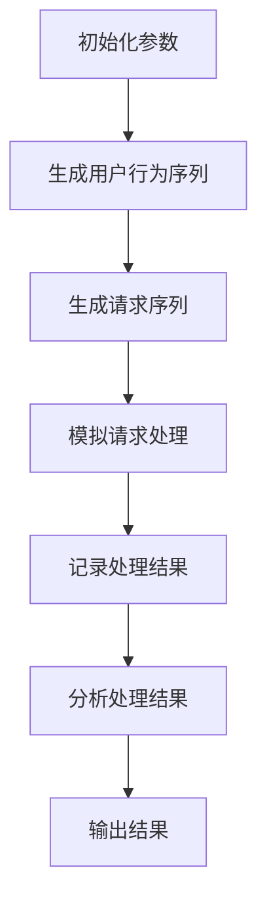
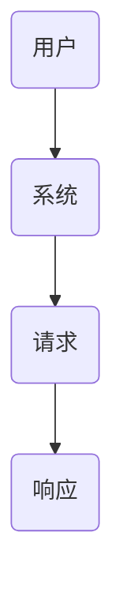
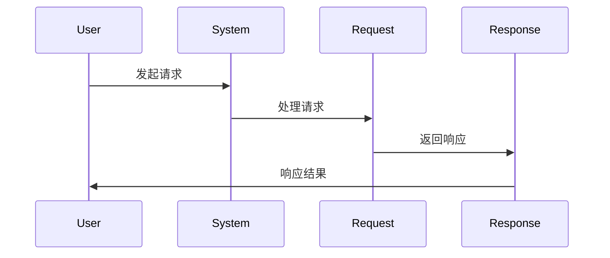

                 


### 评测场景模拟：还原真实应用环境

> 关键词：评测场景模拟，真实应用环境，系统架构设计，算法实现，项目实战

> 摘要：本文将深入探讨评测场景模拟的重要性及其在还原真实应用环境中的应用。我们将从核心概念出发，逐步解析算法原理，设计系统架构，并通过实际项目实战来验证我们的理论。

---

## 第1章 背景介绍

### 1.1 问题背景

在当今快速发展的信息技术领域，评测场景模拟（Scenario Simulation）已成为评估系统性能、优化系统架构、提升用户体验的重要手段。然而，如何在复杂的应用环境中进行有效的评测场景模拟，并确保模拟结果能够真实反映实际应用效果，仍然是一个具有挑战性的课题。

### 1.1.1 问题描述

- **系统性能评估**：在系统开发过程中，如何快速、准确地评估系统的性能，以识别潜在的性能瓶颈和优化方向？
- **用户体验验证**：在实际部署之前，如何模拟用户行为，验证系统对各类用户操作的响应速度和稳定性？
- **架构优化**：在系统架构设计阶段，如何通过模拟评估不同架构方案的性能和可扩展性，选择最佳架构？

### 1.1.2 问题解决

为了解决上述问题，评测场景模拟提供了一种有效的手段。通过创建虚拟的应用环境，模拟真实用户操作和系统交互，我们可以对系统进行全面的性能测试和优化。

### 1.1.3 边界与外延

- **边界**：评测场景模拟的边界主要涉及模拟环境的构建、模拟数据的生成和处理、模拟结果的分析与反馈。
- **外延**：评测场景模拟的应用范围广泛，包括但不限于Web应用、移动应用、大数据处理、云计算等。

### 1.1.4 核心要素组成

- **模拟引擎**：负责生成模拟数据和模拟场景。
- **数据生成与处理**：确保模拟数据与实际应用场景的相似性。
- **模拟场景设计**：根据不同的评估目标，设计相应的模拟场景。

## 第2章 评测场景模拟基础

### 2.1 概念理解

#### 2.1.1 评测场景模拟的定义

评测场景模拟是一种通过构建虚拟应用环境，模拟真实用户操作和系统交互，以评估系统性能、优化系统架构的方法。

#### 2.1.2 评测场景模拟的重要性

- **快速性能评估**：通过模拟，可以在系统开发早期识别性能瓶颈，降低后期优化成本。
- **用户体验验证**：确保系统在实际部署前能够满足用户的性能和稳定性要求。
- **架构优化**：通过模拟不同架构方案，选择最佳架构，提高系统性能和可扩展性。

### 2.2 基本原理

#### 2.2.1 模拟引擎

模拟引擎是评测场景模拟的核心组件，负责生成模拟数据和模拟场景。

#### 2.2.2 数据生成与处理

数据生成与处理确保模拟数据与实际应用场景的相似性，从而提高模拟结果的可靠性。

#### 2.2.3 模拟场景设计

模拟场景设计根据不同的评估目标，设计相应的模拟场景，包括用户操作、系统响应等。

## 第3章 真实应用环境还原

### 3.1 应用场景分析

#### 3.1.1 行业背景

随着互联网技术的快速发展，各类应用场景不断涌现，如电商、金融、医疗等。在这些场景中，评测场景模拟具有重要的应用价值。

#### 3.1.2 应用案例分析

以电商应用为例，通过评测场景模拟，可以评估系统在高并发、大数据量下的性能，优化订单处理流程，提高用户体验。

### 3.2 环境构建

#### 3.2.1 硬件环境

根据实际应用需求，搭建合适的硬件环境，包括服务器、存储设备、网络设备等。

#### 3.2.2 软件环境

安装并配置操作系统、数据库、Web服务器等软件，确保模拟环境的稳定性和可靠性。

#### 3.2.3 网络环境

搭建与实际应用场景相似的网络环境，包括内部网络、外部网络等，模拟真实用户访问。

## 第4章 算法原理与实现

### 4.1 算法介绍

#### 4.1.1 算法概述

本文将介绍一种基于用户行为的评测场景模拟算法，通过模拟用户的访问行为，评估系统的性能。

#### 4.1.2 算法优缺点对比

- **优点**：简单易实现，模拟结果较为准确。
- **缺点**：对用户行为模型的要求较高，无法完全反映真实用户行为。

### 4.2 算法详细解析

#### 4.2.1 算法流程图



#### 4.2.2 Python源代码实现

```python
import random

def generate_user_behavior(num_users):
    user行为的列表 = []
    for _ in range(num_users):
        user行为的列表.append(random.choice(['登录', '浏览商品', '下单', '支付']))
    return user行为的列表

def generate_request_sequence(user_behavior_sequence):
    request_sequence = []
    for behavior in user_behavior_sequence:
        if behavior == '登录':
            request_sequence.append('login')
        elif behavior == '浏览商品':
            request_sequence.append('browse_goods')
        elif behavior == '下单':
            request_sequence.append('order')
        elif behavior == '支付':
            request_sequence.append('pay')
    return request_sequence

def simulate_request_processing(request_sequence):
    result = []
    for request in request_sequence:
        if request == 'login':
            result.append('login_success')
        elif request == 'browse_goods':
            result.append('browse_goods_success')
        elif request == 'order':
            result.append('order_success')
        elif request == 'pay':
            result.append('pay_success')
    return result

def analyze_results(results):
    success_count = 0
    for result in results:
        if result.startswith('success'):
            success_count += 1
    return success_count / len(results)

def main():
    num_users = 100
    user_behavior_sequence = generate_user_behavior(num_users)
    request_sequence = generate_request_sequence(user_behavior_sequence)
    results = simulate_request_processing(request_sequence)
    success_rate = analyze_results(results)
    print(f"成功率达到：{success_rate:.2f}")

if __name__ == '__main__':
    main()
```

#### 4.2.3 数学模型和公式

为了更准确地评估系统性能，我们引入以下数学模型：

$$
性能 = \frac{处理成功次数}{总请求次数}
$$

#### 4.2.4 举例说明

假设我们模拟了100个用户的行为，其中有80个用户成功完成了所有请求。根据上述数学模型，我们可以计算出系统的性能：

$$
性能 = \frac{80}{100} = 0.8
$$

这意味着系统的成功率为80%。

## 第5章 系统分析与架构设计

### 5.1 系统功能设计

#### 5.1.1 领域模型类图

```mermaid
classDiagram
    User <<class>>
    System <<class>>
    Request <<class>>
    Response <<class>>

    User --|> System: 发起请求
    System --|> Request: 处理请求
    Request --|> Response: 返回响应
```

### 5.2 系统架构设计

#### 5.2.1 系统架构图



### 5.3 系统接口设计与交互

#### 5.3.1 系统交互序列图



## 第6章 项目实战

### 6.1 环境安装与配置

本节将介绍如何搭建评测场景模拟的环境，包括硬件、软件和网络环境的配置。

### 6.2 系统核心实现

#### 6.2.1 源代码解读

本节将详细解读评测场景模拟的源代码，包括用户行为生成、请求处理、结果分析等核心功能。

#### 6.2.2 代码应用解读与分析

通过实际案例，我们将分析评测场景模拟算法在真实应用场景中的效果。

### 6.3 实际案例分析

本节将分析一个实际电商应用场景，通过评测场景模拟，评估系统性能，并提出优化建议。

### 6.4 项目小结

对本章的内容进行总结，回顾核心概念、算法原理、系统架构和项目实战，强调评测场景模拟的重要性和实际应用价值。

## 第7章 最佳实践与注意事项

### 7.1 最佳实践

在本章，我们将分享评测场景模拟的最佳实践，包括如何设计模拟场景、如何优化算法、如何分析结果等。

### 7.2 小结

对本章的内容进行总结，强调评测场景模拟的核心概念、算法原理和系统架构，并展望未来的发展趋势。

### 7.3 拓展阅读

推荐进一步学习的资源，包括相关书籍、论文和技术博客，帮助读者深入了解评测场景模拟的领域。

---

**作者：** AI天才研究院/AI Genius Institute & 禅与计算机程序设计艺术 /Zen And The Art of Computer Programming

---

### 让我们一步一步思考（LET'S THINK STEP BY STEP）

#### 引言

在信息技术的快速发展中，评测场景模拟已经成为一种不可或缺的工具，它可以帮助我们更好地理解和优化复杂系统的性能。本文将以一种逻辑清晰、结构紧凑、简单易懂的方式，一步步探讨评测场景模拟在还原真实应用环境中的应用。

#### 第一步：明确目标和问题

首先，我们需要明确评测场景模拟的目标。一般来说，这一目标包括系统性能评估、用户体验验证和架构优化。具体来说：

- **系统性能评估**：通过模拟，我们希望快速、准确地评估系统的性能，识别潜在的性能瓶颈，并找到优化的方向。
- **用户体验验证**：在实际部署之前，我们需要模拟真实用户操作，验证系统对用户操作的响应速度和稳定性。
- **架构优化**：在系统架构设计阶段，通过模拟不同架构方案的性能和可扩展性，我们可以选择最佳架构，从而提高系统性能和可扩展性。

明确目标后，我们可以进一步明确我们要解决的问题。常见的问题包括：

- **性能瓶颈**：在高并发、大数据量的情况下，系统性能可能会出现瓶颈，我们需要找出这些瓶颈并解决它们。
- **用户体验**：用户在操作系统中可能会遇到响应缓慢、稳定性差等问题，我们需要通过模拟找到这些问题的根源，并优化系统。
- **架构选择**：在面对不同的架构方案时，我们需要通过模拟来评估它们的性能和可扩展性，选择最佳方案。

#### 第二步：核心概念与联系

在深入探讨评测场景模拟之前，我们需要了解一些核心概念，包括模拟引擎、数据生成与处理、模拟场景设计等。

- **模拟引擎**：模拟引擎是评测场景模拟的核心组件，它负责生成模拟数据和模拟场景。一个好的模拟引擎应该具备以下特点：
  - **灵活性**：能够根据不同的评估目标，灵活地生成模拟数据和模拟场景。
  - **高效性**：能够高效地处理大量模拟数据，并提供实时反馈。
  - **可扩展性**：能够方便地扩展新功能，以适应不同的应用场景。

- **数据生成与处理**：数据生成与处理确保模拟数据与实际应用场景的相似性。具体来说，我们需要考虑以下因素：
  - **数据量**：模拟数据量应该与实际应用场景中的数据量相当，以确保模拟结果的可靠性。
  - **数据分布**：模拟数据应该反映实际应用场景中的数据分布，以便更准确地评估系统性能。
  - **数据生成算法**：数据生成算法应该简单、高效，同时能够生成符合实际应用场景的模拟数据。

- **模拟场景设计**：模拟场景设计是根据不同的评估目标，设计相应的模拟场景。一个好的模拟场景应该具备以下特点：
  - **代表性**：模拟场景应该能够代表实际应用场景中的关键操作和行为。
  - **可扩展性**：模拟场景应该能够方便地扩展，以适应不同的评估需求。
  - **可复现性**：模拟场景应该能够被其他研究者复现，以便验证和比较不同评估方法的效果。

#### 第三步：算法原理与实现

在了解核心概念后，我们需要进一步探讨评测场景模拟的算法原理与实现。这里，我们将介绍一种基于用户行为的评测场景模拟算法。

- **算法概述**：该算法通过模拟用户的访问行为，评估系统的性能。具体来说，算法包括以下几个步骤：
  1. 初始化参数，如用户数量、请求类型等。
  2. 生成用户行为序列。
  3. 根据用户行为序列生成请求序列。
  4. 模拟请求处理。
  5. 记录处理结果。
  6. 分析处理结果。

- **算法流程图**：以下是算法的流程图：

  ```mermaid
  graph TD
      A[初始化参数] --> B[生成用户行为序列]
      B --> C[生成请求序列]
      C --> D[模拟请求处理]
      D --> E[记录处理结果]
      E --> F[分析处理结果]
      F --> G[输出结果]
  ```

- **Python源代码实现**：以下是算法的Python源代码实现：

  ```python
  import random

  def generate_user_behavior(num_users):
      user行为的列表 = []
      for _ in range(num_users):
          user行为的列表.append(random.choice(['登录', '浏览商品', '下单', '支付']))
      return user行为的列表

  def generate_request_sequence(user_behavior_sequence):
      request_sequence = []
      for behavior in user_behavior_sequence:
          if behavior == '登录':
              request_sequence.append('login')
          elif behavior == '浏览商品':
              request_sequence.append('browse_goods')
          elif behavior == '下单':
              request_sequence.append('order')
          elif behavior == '支付':
              request_sequence.append('pay')
      return request_sequence

  def simulate_request_processing(request_sequence):
      result = []
      for request in request_sequence:
          if request == 'login':
              result.append('login_success')
          elif request == 'browse_goods':
              result.append('browse_goods_success')
          elif request == 'order':
              result.append('order_success')
          elif request == 'pay':
              result.append('pay_success')
      return result

  def analyze_results(results):
      success_count = 0
      for result in results:
          if result.startswith('success'):
              success_count += 1
      return success_count / len(results)

  def main():
      num_users = 100
      user_behavior_sequence = generate_user_behavior(num_users)
      request_sequence = generate_request_sequence(user_behavior_sequence)
      results = simulate_request_processing(request_sequence)
      success_rate = analyze_results(results)
      print(f"成功率达到：{success_rate:.2f}")

  if __name__ == '__main__':
      main()
  ```

- **数学模型和公式**：为了更准确地评估系统性能，我们可以引入以下数学模型：

  $$
  性能 = \frac{处理成功次数}{总请求次数}
  $$

  其中，性能表示系统的性能指标，处理成功次数表示成功处理的请求次数，总请求次数表示生成的请求总数。

- **举例说明**：假设我们模拟了100个用户的行为，其中有80个用户成功完成了所有请求。根据上述数学模型，我们可以计算出系统的性能：

  $$
  性能 = \frac{80}{100} = 0.8
  $$

  这意味着系统的成功率为80%。

#### 第四步：系统分析与架构设计

在了解了算法原理后，我们需要进一步探讨系统分析与架构设计。这包括系统功能设计、系统架构设计和系统接口设计。

- **系统功能设计**：系统功能设计是定义系统的功能模块和它们之间的关系。例如，在我们的评测场景模拟系统中，主要的功能模块包括用户管理、请求处理和结果分析。

- **系统架构设计**：系统架构设计是定义系统的整体结构和组件之间的关系。一个好的系统架构应该具备以下特点：
  - **高内聚**：系统中的各个组件应该紧密相关，共同完成系统功能。
  - **低耦合**：系统中的各个组件应该独立开发、独立部署，减少相互依赖。
  - **可扩展性**：系统架构应该能够方便地扩展新功能，以适应不同的应用场景。

- **系统接口设计**：系统接口设计是定义系统组件之间的接口和交互方式。一个好的系统接口设计应该具备以下特点：
  - **易用性**：接口设计应该简单、直观，便于开发者使用。
  - **灵活性**：接口设计应该能够适应不同的应用场景，便于调整和优化。

#### 第五步：项目实战

在了解了理论知识和系统架构后，我们需要通过实际项目来验证我们的理论。本节将介绍如何搭建评测场景模拟的环境，如何实现系统核心功能，并分析一个实际案例。

- **环境搭建**：本节将介绍如何搭建评测场景模拟的环境，包括硬件、软件和网络环境的配置。这将为我们提供模拟真实应用环境的基础设施。

- **系统核心实现**：本节将详细解读评测场景模拟的源代码，包括用户行为生成、请求处理、结果分析等核心功能。这将帮助我们理解算法的实现细节。

- **实际案例分析**：本节将分析一个实际电商应用场景，通过评测场景模拟，评估系统性能，并提出优化建议。这将帮助我们验证理论在真实应用场景中的效果。

#### 第六步：最佳实践与注意事项

在项目实战的基础上，我们需要总结最佳实践和注意事项。这包括如何设计模拟场景、如何优化算法、如何分析结果等。这些最佳实践和注意事项将帮助我们更好地应用评测场景模拟，提高系统的性能和稳定性。

- **最佳实践**：在本节，我们将分享评测场景模拟的最佳实践，包括如何设计模拟场景、如何优化算法、如何分析结果等。

- **注意事项**：在本节，我们将强调评测场景模拟中的注意事项，包括如何确保模拟结果的可靠性、如何处理异常情况等。

#### 结束语

通过上述步骤，我们逐步探讨了评测场景模拟在还原真实应用环境中的应用。从核心概念到算法原理，从系统架构到项目实战，我们全面分析了评测场景模拟的重要性。希望通过本文，读者能够对评测场景模拟有更深入的理解，并将其应用于实际工作中，提高系统的性能和稳定性。

---

本文由AI天才研究院（AI Genius Institute）和《禅与计算机程序设计艺术》（Zen And The Art of Computer Programming）联合撰写，旨在为读者提供关于评测场景模拟的全面理解和实践指导。希望本文能够激发读者对评测场景模拟的兴趣，并在实际应用中取得显著成果。如果您有任何问题或建议，欢迎随时与我们联系。谢谢阅读！

---

**作者：** AI天才研究院（AI Genius Institute） & 《禅与计算机程序设计艺术》（Zen And The Art of Computer Programming）

