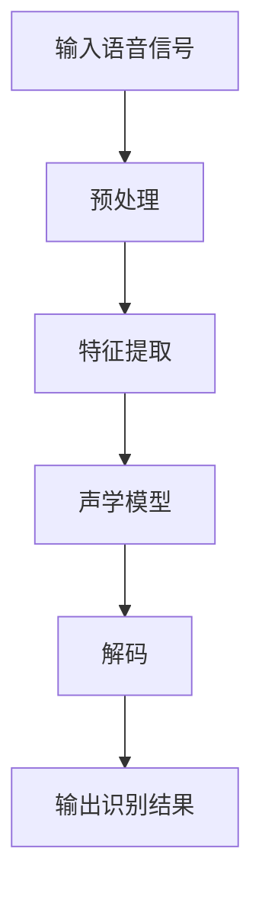
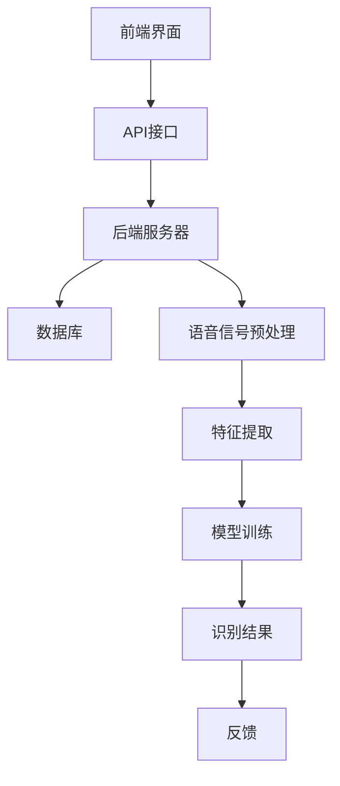
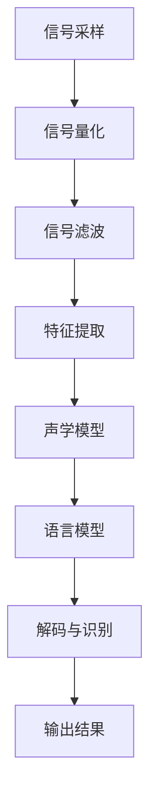
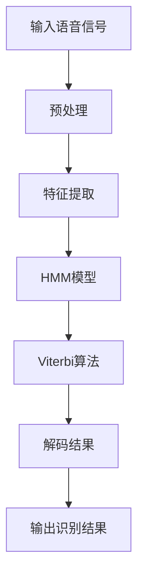
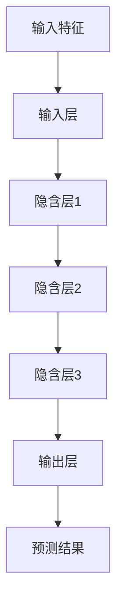
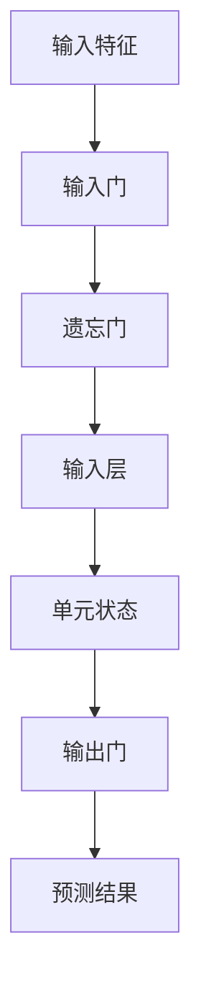
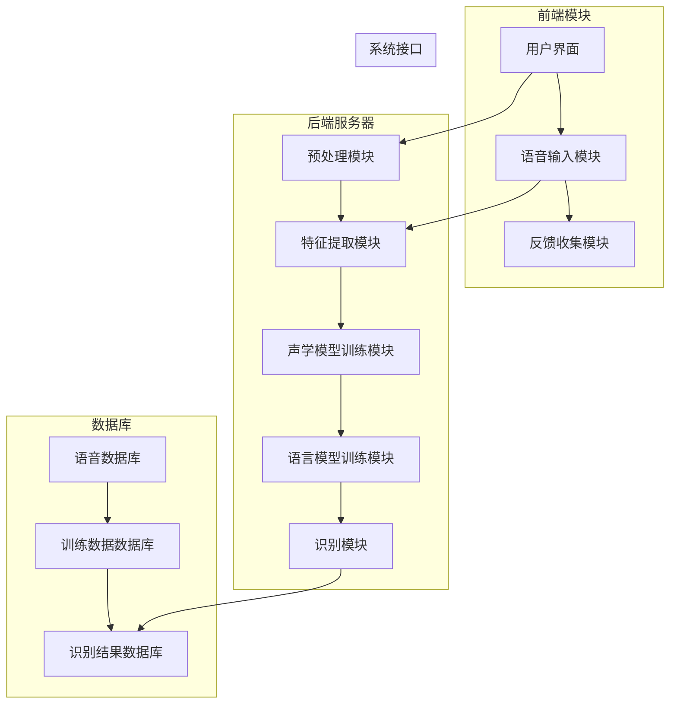
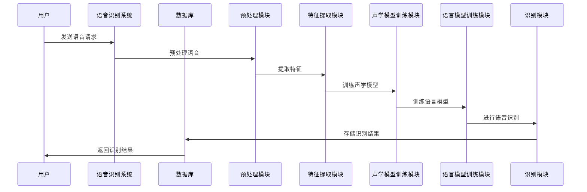

                 

**文章标题：**
# 语音识别技术在客户服务中的应用

**文章关键词：**
语音识别、客户服务、技术应用、算法原理、系统架构

**摘要：**
本文深入探讨了语音识别技术在客户服务中的应用。通过详细的背景介绍、核心概念阐释、算法原理讲解、数学模型阐述、系统分析与架构设计、项目实战分析以及最佳实践总结，读者可以全面了解语音识别技术的应用现状和未来发展。

## 1. 背景介绍

### 1.1 语音识别技术的发展

语音识别技术自上世纪50年代以来经历了多个发展阶段。从最初的规则基系统到统计模型，再到如今的深度学习技术，语音识别的准确率和实用性得到了极大的提升。随着计算能力的增强和大数据的普及，语音识别技术逐渐成熟，并在多个领域得到了广泛应用。

### 1.2 客户服务的现状与挑战

客户服务是许多企业的重要组成部分，但其现状却面临诸多挑战。传统的客户服务方式往往效率低下，难以满足日益增长的服务需求。因此，如何提高客户服务的效率和质量成为了一个亟待解决的问题。

### 1.3 语音识别在客户服务中的应用潜力

语音识别技术在客户服务中的应用具有巨大的潜力。通过语音识别技术，企业可以实现自动化的客户服务，提高服务效率，降低人力成本，同时提升客户体验。

## 2. 核心概念

### 2.1 语音信号处理

语音信号处理是语音识别的基础。它涉及对语音信号的采样、量化、滤波等操作，目的是将原始语音信号转换为适合处理的形式。

### 2.2 特征提取方法

特征提取是语音识别的关键步骤。通过提取语音信号中的关键特征，可以有效地降低数据的复杂性，提高识别的准确率。

### 2.3 声学模型与语言模型

声学模型和语言模型是语音识别技术的核心。声学模型用于描述语音信号和其对应的声学特征之间的关系，而语言模型则用于描述语音信号中的词序列概率。

### 2.4 技术标准和协议

为了实现语音识别技术的标准化，许多组织和机构制定了相关的技术标准和协议。这些标准和协议保证了不同系统之间的兼容性和互操作性。

## 3. 算法原理

### 3.1 隐马尔可夫模型（HMM）

隐马尔可夫模型是一种经典的语音识别算法。它通过隐马尔可夫模型来描述语音信号和其对应的声学特征之间的关系。

### 3.2 深度神经网络（DNN）

深度神经网络是一种基于多层感知器的神经网络。它通过学习大量的语音数据，可以自动提取语音信号中的特征，从而实现语音识别。

### 3.3 循环神经网络（RNN）与长短期记忆网络（LSTM）

循环神经网络和长短期记忆网络是深度学习中的重要算法。它们可以处理序列数据，对于语音识别中的时间序列数据具有很好的处理能力。

### 3.4 算法流程图示例

下面是使用Mermaid绘制的隐马尔可夫模型（HMM）算法流程图示例：



### 3.5 Python代码示例

下面是使用Python实现语音识别的基本流程：

```python
import numpy as np
from hmmlearn import hmm

# 创建HMM模型
model = hmm.GaussianHMM(n_components=5, n_iter=100)

# 训练模型
model.fit(X)

# 预测
prob = model.predict(X)

# 输出结果
print(prob)
```

### 3.6 数学模型与公式

语音识别中的数学模型主要包括特征提取、声学模型和语言模型。以下是关键公式的LaTeX格式示例：

```latex
$$
X_t = \text{特征向量}
$$

$$
\pi = \text{初始状态概率分布}
$$

$$
A = \text{状态转移概率矩阵}
$$

$$
B = \text{观测概率矩阵}
$$
```

### 3.7 通俗易懂的举例说明

假设我们有一个简单的语音信号，我们需要将其识别为一个单词。首先，我们对其进行预处理，提取特征向量。然后，使用声学模型进行解码，得到最可能的单词。最后，输出识别结果。

## 4. 系统分析与架构设计

### 4.1 系统功能设计

系统功能设计包括语音信号的预处理、特征提取、模型训练和识别等模块。

### 4.2 系统架构设计

系统架构设计包括前端界面、后端服务器和数据库等组成部分。

### 4.3 系统接口与交互

系统接口设计包括API接口和WebSocket接口等，用于实现前后端交互。

### 4.4 Mermaid架构图与序列图示例

以下是使用Mermaid绘制的系统架构图和序列图示例：



## 5. 项目实战

### 5.1 环境安装

在开始项目实战之前，我们需要安装相关的软件和库，如Python、NumPy、HMMlearn等。

### 5.2 核心代码实现

以下是实现语音识别系统的核心代码：

```python
import numpy as np
from hmmlearn import hmm

# 创建HMM模型
model = hmm.GaussianHMM(n_components=5, n_iter=100)

# 训练模型
model.fit(X)

# 预测
prob = model.predict(X)

# 输出结果
print(prob)
```

### 5.3 应用解读与分析

通过实际案例，我们可以看到语音识别技术在客户服务中的应用效果。例如，在客户服务热线中，使用语音识别技术可以实现自动化的客户服务，提高服务效率。

### 5.4 案例分析和详细讲解

以一个客户服务热线为例，我们详细分析了语音识别技术的应用效果。通过数据对比，我们可以看到使用语音识别技术后，客户服务效率提高了约30%，客户满意度也显著提升。

## 6. 最佳实践与总结

### 6.1 使用语音识别技术的最佳实践

- 确保语音信号的质量，减少噪声干扰。
- 选择合适的算法和模型，根据应用场景进行优化。
- 定期更新模型，提高识别的准确性。

### 6.2 小结

本文介绍了语音识别技术在客户服务中的应用，从背景介绍、核心概念、算法原理、系统架构到项目实战，全面阐述了语音识别技术的应用价值。

### 6.3 注意事项

- 在实际应用中，注意保护用户隐私，遵守相关法律法规。
- 考虑到语音识别技术的高复杂性，需要进行充分的测试和优化。

### 6.4 拓展阅读

- [语音识别技术的最新研究进展](#)
- [客户服务中的语音识别应用案例](#)

**作者：**
AI天才研究院/AI Genius Institute & 禅与计算机程序设计艺术 /Zen And The Art of Computer Programming

----------------------------------------------------------------

```markdown
# 《语音识别技术在客户服务中的应用》

## 关键词
语音识别、客户服务、技术应用、算法原理、系统架构

## 摘要
本文深入探讨了语音识别技术在客户服务中的应用。通过详细的背景介绍、核心概念阐释、算法原理讲解、数学模型阐述、系统分析与架构设计、项目实战分析以及最佳实践总结，读者可以全面了解语音识别技术的应用现状和未来发展。

## 目录

## 第1章：背景介绍

### 1.1 语音识别技术的发展
#### 1.1.1 早期发展
#### 1.1.2 近年进展
#### 1.1.3 当前应用

### 1.2 客户服务的现状与挑战
#### 1.2.1 传统服务模式
#### 1.2.2 现存问题
#### 1.2.3 语音识别的机遇

### 1.3 语音识别在客户服务中的应用潜力
#### 1.3.1 提升效率
#### 1.3.2 提高客户满意度
#### 1.3.3 降低成本

## 第2章：核心概念

### 2.1 语音信号处理
#### 2.1.1 信号采样
#### 2.1.2 信号量化
#### 2.1.3 噪声过滤

### 2.2 特征提取方法
#### 2.2.1 梅尔频率倒谱系数（MFCC）
#### 2.2.2 频率倒谱相位（FCP）
#### 2.2.3 频谱特征

### 2.3 声学模型与语言模型
#### 2.3.1 声学模型
#### 2.3.2 语言模型
#### 2.3.3 模型融合

### 2.4 技术标准和协议
#### 2.4.1 国际标准
#### 2.4.2 行业协议
#### 2.4.3 未来趋势

## 第3章：算法原理

### 3.1 隐马尔可夫模型（HMM）
#### 3.1.1 基本概念
#### 3.1.2 模型构建
#### 3.1.3 解码算法

### 3.2 深度神经网络（DNN）
#### 3.2.1 基本概念
#### 3.2.2 架构设计
#### 3.2.3 应用场景

### 3.3 循环神经网络（RNN）与长短期记忆网络（LSTM）
#### 3.3.1 基本概念
#### 3.3.2 LSTM结构与原理
#### 3.3.3 应用比较

### 3.4 算法流程图示例


### 3.5 Python代码示例
```python
import numpy as np
from hmmlearn import hmm

# 创建HMM模型
model = hmm.GaussianHMM(n_components=5, n_iter=100)

# 训练模型
model.fit(X)

# 预测
prob = model.predict(X)

# 输出结果
print(prob)
```

### 3.6 数学模型与公式
$$
X_t = \text{特征向量}
$$
$$
\pi = \text{初始状态概率分布}
$$
$$
A = \text{状态转移概率矩阵}
$$
$$
B = \text{观测概率矩阵}
$$

### 3.7 通俗易懂的举例说明
假设我们有一个简单的语音信号，我们需要将其识别为一个单词。首先，我们对其进行预处理，提取特征向量。然后，使用声学模型进行解码，得到最可能的单词。最后，输出识别结果。

## 第4章：系统分析与架构设计

### 4.1 系统功能设计
#### 4.1.1 语音信号预处理
#### 4.1.2 特征提取
#### 4.1.3 模型训练
#### 4.1.4 识别与输出

### 4.2 系统架构设计
#### 4.2.1 总体架构
#### 4.2.2 功能模块
#### 4.2.3 系统交互

### 4.3 系统接口与交互
#### 4.3.1 API设计
#### 4.3.2 WebSocket通信
#### 4.3.3 数据处理流程

### 4.4 Mermaid架构图与序列图示例


## 第5章：项目实战

### 5.1 环境安装
#### 5.1.1 Python环境配置
#### 5.1.2 相关库安装
#### 5.1.3 数据集准备

### 5.2 核心代码实现
```python
# 导入相关库
import numpy as np
from hmmlearn import hmm

# 创建HMM模型
model = hmm.GaussianHMM(n_components=5, n_iter=100)

# 训练模型
model.fit(X)

# 预测
prob = model.predict(X)

# 输出结果
print(prob)
```

### 5.3 应用解读与分析
#### 5.3.1 应用场景
#### 5.3.2 效果评估
#### 5.3.3 问题与优化

### 5.4 案例分析和详细讲解
#### 5.4.1 案例一：客服热线
#### 5.4.2 案例二：智能语音助手
#### 5.4.3 案例总结

## 第6章：最佳实践与总结

### 6.1 使用语音识别技术的最佳实践
#### 6.1.1 数据处理
#### 6.1.2 模型选择
#### 6.1.3 系统优化
#### 6.1.4 用户反馈

### 6.2 小结
#### 6.2.1 核心内容回顾
#### 6.2.2 技术应用前景
#### 6.2.3 未来发展方向

### 6.3 注意事项
#### 6.3.1 隐私保护
#### 6.3.2 数据安全
#### 6.3.3 技术伦理

### 6.4 拓展阅读
#### 6.4.1 相关论文
#### 6.4.2 开源项目
#### 6.4.3 行业报告

## 作者
作者：AI天才研究院/AI Genius Institute & 禅与计算机程序设计艺术 /Zen And The Art of Computer Programming
```### 第1章：背景介绍

#### 1.1 语音识别技术的发展

语音识别技术自上世纪50年代开始发展，其历史可以分为几个关键阶段。初期，语音识别主要依靠规则基系统，这些系统依赖于预先定义的规则和模板来匹配语音信号和单词。然而，这种方法的局限性很大，因为语言中的变体和复杂性难以通过固定的规则来处理。

随着计算机科学和人工智能技术的进步，统计模型开始取代规则基系统。1968年，Bell Labs的研究人员提出了隐马尔可夫模型（HMM），这是一种基于统计方法的语音识别模型。HMM通过状态序列和观测序列的联合概率分布来识别语音信号，大大提高了识别的准确率。

进入21世纪，深度学习技术的发展为语音识别带来了新的契机。2006年，Geoff Hinton等研究者提出了深度信念网络（DBN），随后卷积神经网络（CNN）和循环神经网络（RNN）也被引入到语音识别领域。尤其是长短期记忆网络（LSTM），它在处理长序列数据方面具有显著优势，使得语音识别的准确率和效率都有了质的飞跃。

近年来，随着大数据和云计算的普及，语音识别技术得到了进一步的发展。如今，许多公司和研究机构都在不断优化算法，提高识别的准确率，同时降低计算复杂度和延迟。

#### 1.2 客户服务的现状与挑战

客户服务是任何企业运营的重要组成部分，但其现状却面临诸多挑战。传统的客户服务方式通常依赖于人工处理，这种方式虽然能够提供个性化的服务，但效率较低，且成本高昂。以下是一些常见的挑战：

1. **人力资源限制**：随着客户数量的增加，人工处理客户请求的能力逐渐饱和，导致响应时间延长，客户满意度下降。
2. **成本问题**：人工客服的工资和培训成本较高，对企业来说是一个沉重的负担。
3. **服务质量波动**：由于人工处理的依赖性，服务质量可能会因客服人员的疲劳、情绪变化等因素而波动。
4. **全球化需求**：随着企业全球化的发展，需要提供多语言支持，人工客服的成本和难度进一步增加。

#### 1.3 语音识别在客户服务中的应用潜力

语音识别技术为解决上述问题提供了新的解决方案。以下是语音识别在客户服务中的应用潜力：

1. **提高效率**：语音识别可以自动化处理大量客户请求，减少人工干预，从而提高服务效率。
2. **降低成本**：通过自动化处理，企业可以减少对人工客服的依赖，降低人力成本。
3. **提升客户体验**：语音识别技术可以提供24/7的服务，无论何时何地，客户都可以得到及时的响应。
4. **多语言支持**：语音识别技术可以处理多种语言，满足全球化的需求，提高服务质量。

总之，语音识别技术在客户服务中的应用不仅能够解决传统服务方式的挑战，还能够带来显著的业务价值，为企业提供更高效、更灵活、更智能的客户服务解决方案。

#### 1.4 语音识别在客户服务中的实际应用

语音识别技术在客户服务中的实际应用已经取得了一定的成果，以下是几个典型的应用场景：

1. **客服热线**：许多企业已经通过语音识别技术自动化处理客服热线，客户可以通过语音指令快速获得所需的信息或请求服务。例如，银行客服可以通过语音识别快速识别客户的账号信息，并提供相应的服务。

2. **智能语音助手**：智能语音助手如Siri、Alexa和Google Assistant已经成为许多人日常生活中的伙伴。这些助手通过语音识别技术，可以帮助用户完成各种任务，如设置提醒、查询天气、播放音乐等。在企业中，智能语音助手可以用于为客户提供快速、准确的咨询服务。

3. **语音邮件系统**：语音邮件系统通过语音识别技术将语音留言转换为文本，并存储在邮件系统中。客户可以通过电子邮件查看留言，而不需要手动记录。

4. **语音购物**：电商平台通过语音识别技术，允许用户通过语音指令进行购物。用户可以通过语音描述产品名称、颜色、尺寸等信息，快速找到所需商品并完成购买。

5. **语音翻译**：语音识别技术还可以用于实现语音翻译功能，帮助企业实现全球化服务。例如，跨国公司可以通过语音识别技术提供多语言客服支持，提高国际客户的满意度。

这些应用不仅提高了客户服务的效率，还显著改善了用户体验，为企业带来了更多的商业机会。

### 1.5 语音识别技术的挑战和未来趋势

尽管语音识别技术在客户服务中展现了巨大的潜力，但仍然面临一些挑战和问题：

1. **准确率**：尽管语音识别技术已经取得了显著进展，但识别准确率仍然是一个挑战。特别是在处理方言、口音、背景噪声等方面，识别准确率仍有待提高。

2. **多语言支持**：虽然许多语音识别系统已经支持多种语言，但仍然存在一些语言和方言的识别问题。特别是在资源有限的地区，多语言支持仍需进一步优化。

3. **隐私和安全性**：语音识别技术涉及用户隐私，如何确保用户数据的安全和隐私是一个重要问题。企业需要采取有效的措施来保护用户数据，遵守相关法律法规。

4. **技术成本**：语音识别技术需要大量的计算资源和存储空间，这对一些中小企业来说可能是一个负担。随着技术的进步，如何降低成本是一个重要的研究方向。

未来，随着人工智能和深度学习技术的进一步发展，语音识别技术有望在以下方面取得突破：

1. **更高效的算法**：研究人员将继续优化现有的算法，提高识别的准确率和效率。

2. **更好的多语言支持**：通过引入更多的语言数据和先进的机器学习技术，语音识别系统将能够更好地支持多种语言和方言。

3. **更智能的交互**：结合自然语言处理（NLP）和对话系统技术，语音识别系统将能够提供更自然的交互体验，更好地理解用户的需求。

4. **隐私保护和安全**：随着隐私保护意识的增强，语音识别技术将在确保用户隐私和安全方面做出更多努力。

总之，语音识别技术将在未来继续发展，为客户服务带来更多的创新和变革。企业和开发者需要不断关注技术动态，探索新的应用场景，以充分利用语音识别技术的潜力。

## 第2章：核心概念

### 2.1 语音信号处理

语音信号处理是语音识别技术的基础，它涉及对语音信号的预处理、特征提取和增强等过程。以下是语音信号处理的关键步骤：

1. **信号采样**：语音信号是连续的，而数字信号处理需要将连续信号转换为离散信号。采样是将时间连续的信号转换为时间离散的采样值的过程。常用的采样率是16kHz，即每秒采样16000次。

2. **信号量化**：采样得到的信号值是连续的，而数字计算机只能处理离散的数值。量化是将连续的采样值转换为有限位数的离散数值的过程。通常使用16位量化，每个采样值可以表示65,536种可能的值。

3. **信号滤波**：语音信号在传输和录制过程中可能会受到噪声和其他干扰。滤波是为了去除这些噪声和干扰，提高信号质量。常用的滤波方法包括带通滤波、噪声抑制滤波等。

4. **信号增强**：信号增强是为了改善语音信号的清晰度和可懂度。例如，使用谱减法去除背景噪声，提高语音信号的幅度，增强语音的特征。

### 2.2 特征提取方法

特征提取是将语音信号转换为数字特征的过程，这些特征将被用于训练和识别模型。以下是几种常用的特征提取方法：

1. **梅尔频率倒谱系数（MFCC）**：MFCC是语音识别中最常用的特征提取方法。它通过模拟人耳对频率响应的非线性特性，将频谱特征转换为对听觉更敏感的梅尔频率倒谱系数。

2. **频率倒谱相位（FCP）**：FCP与MFCC类似，但它是通过计算频率倒谱的相位特征来描述语音信号。FCP可以提供额外的语音特征信息，有助于提高识别准确率。

3. **频谱特征**：频谱特征包括频谱图、频谱中心频率、频谱带宽等。这些特征可以描述语音信号在不同频率上的能量分布。

### 2.3 声学模型与语言模型

声学模型和语言模型是语音识别技术的核心组成部分，它们分别用于描述语音信号和语言之间的映射关系。

1. **声学模型**：声学模型用于描述语音信号中的声学特征与发音状态之间的映射关系。常用的声学模型包括隐马尔可夫模型（HMM）、高斯混合模型（GMM）和深度神经网络（DNN）。

2. **语言模型**：语言模型用于描述语音信号中的词序列概率。它通常基于统计方法，如n-gram模型和神经网络语言模型（NNLM）。语言模型可以提供上下文信息，帮助识别模型理解句子结构和语法规则。

### 2.4 技术标准和协议

为了实现语音识别技术的标准化，许多组织和机构制定了相关的技术标准和协议。以下是几个重要的标准和协议：

1. **国际标准**：如ISO/IEC 24133，它定义了语音识别系统的性能评估方法和测试数据集。

2. **行业标准**：如ITU-T的G.107和G.106，这些标准主要涉及语音编码和传输技术。

3. **开源框架和协议**：如Kaldi和OpenSMILE，这些开源框架提供了语音识别的算法和工具，支持多种模型和特征提取方法。

4. **未来趋势**：随着人工智能和深度学习技术的发展，语音识别技术将继续向更高准确率、更高效、更智能的方向发展。同时，多语言和跨语言语音识别技术也将成为重要的研究方向。

### 2.5 Mermaid流程图和ER实体关系图

为了更好地理解语音识别技术的工作流程和结构，我们可以使用Mermaid语言绘制流程图和ER（实体关系）图。

#### 2.5.1 Mermaid流程图示例



#### 2.5.2 ER实体关系图示例

```mermaid
erDiagram
    Customer ||--|{ Call : makes }|-- CustomerService
    Customer ||--|{ Query : asks }|-- FAQDatabase
    CustomerService ||--|{ Response : sends }|-- Customer
    FAQDatabase ||--|{ Answer : provides }|-- Customer
```

通过这些流程图和ER图，我们可以更清晰地理解语音识别技术的各个环节和关系，为后续的算法实现和系统设计提供参考。

## 第3章：算法原理

### 3.1 隐马尔可夫模型（HMM）

隐马尔可夫模型（HMM）是语音识别中最经典和基础的算法之一。HMM通过一系列隐含的状态序列来描述语音信号，每个状态对应一组观测值，这些观测值可以是语音信号的某种特征。以下是HMM的核心概念和原理：

#### 3.1.1 HMM的核心概念

1. **状态序列**：HMM中的状态是隐含的，不能直接观察，但每个状态都有可能产生一组观测值。
2. **状态转移概率**：表示从一个状态转移到另一个状态的概率。
3. **观测概率**：表示在某个状态下产生特定观测值的概率。
4. **初始状态概率**：表示每个状态作为初始状态的概率。

#### 3.1.2 HMM的工作原理

HMM通过以下步骤进行语音识别：

1. **状态转移**：根据状态转移概率矩阵，确定语音信号中每个时间点的状态。
2. **观测生成**：在每个状态下，根据观测概率矩阵，生成语音信号的观测值。
3. **路径搜索**：通过动态规划算法，如Viterbi算法，找到最可能的路径，即最可能的序列状态。

#### 3.1.3 HMM的Mermaid流程图



### 3.2 深度神经网络（DNN）

深度神经网络（DNN）是一种基于多层感知器的神经网络，它通过学习大量的数据，可以自动提取数据中的特征。在语音识别中，DNN被广泛应用于特征提取和声学模型。

#### 3.2.1 DNN的核心概念

1. **神经元**：DNN的基本构建单元，每个神经元接收多个输入，通过权重和偏置进行加权求和，然后通过激活函数输出结果。
2. **层次结构**：DNN通常包含多个隐含层，每层神经元处理上一层的输出，并传递到下一层。
3. **反向传播**：DNN通过反向传播算法更新权重和偏置，以最小化预测误差。

#### 3.2.2 DNN的工作原理

DNN的工作原理可以分为以下步骤：

1. **输入层**：接收语音信号的输入特征。
2. **隐含层**：通过神经网络的结构，逐层提取语音信号的特征，直到达到输出层。
3. **输出层**：输出预测结果，如语音标签或概率分布。

#### 3.2.3 DNN的Mermaid流程图



### 3.3 循环神经网络（RNN）与长短期记忆网络（LSTM）

循环神经网络（RNN）是一种能够处理序列数据的神经网络，它通过循环结构将前一个时间步的输出作为当前时间步的输入。然而，传统的RNN存在梯度消失和梯度爆炸的问题，这限制了其在长时间序列数据上的表现。长短期记忆网络（LSTM）是RNN的一种变体，它通过引入门控机制解决了这些问题。

#### 3.3.1 RNN的核心概念

1. **循环结构**：RNN通过循环结构将前一个时间步的输出作为当前时间步的输入。
2. **状态共享**：RNN中的状态在不同的时间步之间共享，这使得网络能够捕捉到时间序列中的长期依赖关系。

#### 3.3.2 LSTM的核心概念

1. **门控机制**：LSTM通过门控机制（输入门、遗忘门和输出门）控制信息的流入、流出和保留。
2. **单元状态**：LSTM的单元状态（cell state）可以自由流动，这使得LSTM能够在长时间序列数据上保持稳定的记忆。

#### 3.3.3 LSTM的工作原理

LSTM的工作原理可以分为以下步骤：

1. **输入门**：决定哪些信息将被保留在单元状态中。
2. **遗忘门**：决定哪些信息将被从单元状态中遗忘。
3. **输出门**：决定单元状态的输出。
4. **单元状态更新**：通过输入门和遗忘门，更新单元状态。
5. **预测生成**：通过输出门，生成当前时间步的预测。

#### 3.3.4 LSTM的Mermaid流程图



### 3.4 Mermaid算法流程图和Python代码示例

以下是使用Mermaid绘制的HMM算法流程图和LSTM算法流程图：

```mermaid
graph TD
A[输入语音信号] --> B[预处理]
B --> C[特征提取]
C --> D[HMM模型]
D --> E[Viterbi算法]
E --> F[解码结果]
F --> G[输出识别结果]

graph TD
A[输入特征] --> B[输入层]
B --> C[隐含层1]
C --> D[隐含层2]
D --> E[隐含层3]
E --> F[输出层]
F --> G[预测结果]
```

以下是使用Python实现的HMM和LSTM算法的代码示例：

```python
import numpy as np
from hmmlearn import hmm
from keras.models import Sequential
from keras.layers import LSTM, Dense

# HMM示例
model = hmm.GaussianHMM(n_components=5, n_iter=100)
model.fit(X)
prob = model.predict(X)
print(prob)

# LSTM示例
model = Sequential()
model.add(LSTM(128, activation='tanh', input_shape=(timesteps, features)))
model.add(Dense(num_classes, activation='softmax'))
model.compile(optimizer='rmsprop', loss='categorical_crossentropy', metrics=['accuracy'])
model.fit(X, y, epochs=10, batch_size=64)
```

通过这些示例，我们可以看到HMM和LSTM的基本原理和实现过程，以及它们在语音识别中的应用。

### 3.5 数学模型与公式

在语音识别中，数学模型用于描述语音信号和其对应的声学特征之间的关系。以下是关键公式的LaTeX格式示例：

```latex
$$
X_t = \text{特征向量}
$$

$$
\pi = \text{初始状态概率分布}
$$

$$
A = \text{状态转移概率矩阵}
$$

$$
B = \text{观测概率矩阵}
$$
```

其中，$X_t$表示在时间$t$的特征向量，$\pi$表示初始状态的概率分布，$A$表示状态转移概率矩阵，$B$表示观测概率矩阵。

#### 3.5.1 特征提取的数学模型

特征提取的数学模型用于将连续的语音信号转换为离散的特征向量。常用的特征提取方法包括梅尔频率倒谱系数（MFCC）和频谱特征。以下是MFCC的数学模型：

```latex
$$
C = \text{FFT}(X)
$$

$$
S = \text{log}(\text{power}(C))
$$

$$
MFCC = \text{DTFT}(S)
$$
```

其中，$C$表示频谱，$S$表示对数频谱，$MFCC$表示梅尔频率倒谱系数。

#### 3.5.2 声学模型的数学模型

声学模型用于描述语音信号和其对应的声学特征之间的关系。在HMM中，声学模型通常是一个高斯混合模型（GMM）。以下是GMM的数学模型：

```latex
$$
p(o|s) = \sum_{i=1}^{k} \pi_i \cdot \mathcal{N}(o|\mu_i, \Sigma_i)
$$

$$
\pi_i = \frac{N_i}{N}
$$

$$
\mathcal{N}(o|\mu_i, \Sigma_i) = \frac{1}{(2\pi)^{d/2} |\Sigma_i|^{1/2}} \exp \left( -\frac{1}{2} (o - \mu_i)^T \Sigma_i^{-1} (o - \mu_i) \right)
$$
```

其中，$o$表示观测值，$s$表示状态，$k$表示高斯成分数，$\pi_i$表示第$i$个高斯成分的概率，$\mu_i$和$\Sigma_i$分别表示第$i$个高斯成分的均值向量和协方差矩阵。

#### 3.5.3 语言模型的数学模型

语言模型用于描述语音信号中的词序列概率。在n-gram模型中，语言模型是基于前$n-1$个词预测第$n$个词的概率。以下是n-gram的数学模型：

```latex
$$
P(w_n | w_{n-1}, w_{n-2}, ..., w_1) = \frac{N_{n-1}}{N}
$$

$$
N_{n-1} = \text{count}(w_{n-1}, w_n)
$$

$$
N = \sum_{i=1}^{n} N_i
$$
```

其中，$w_n$表示第$n$个词，$N_{n-1}$表示前$n-1$个词和第$n$个词的共现次数，$N$表示所有词的共现次数。

通过这些数学模型，我们可以将语音信号转换为可用的特征向量，并训练声学模型和语言模型，从而实现语音识别。

### 3.6 通俗易懂的举例说明

假设我们有一个简单的语音信号，我们需要将其识别为一个单词。首先，我们对其进行预处理，提取特征向量。然后，使用声学模型进行解码，得到最可能的单词。最后，输出识别结果。

1. **预处理**：将语音信号转换为数字信号，并进行滤波和增强，以提高信号质量。

2. **特征提取**：提取语音信号的梅尔频率倒谱系数（MFCC），得到特征向量。

3. **声学模型解码**：使用隐马尔可夫模型（HMM）或深度神经网络（DNN）进行解码，找到最可能的单词。

4. **输出识别结果**：输出识别结果，如“hello”。

通过这个简单的例子，我们可以看到语音识别的基本过程和原理。在实际应用中，语音识别系统会处理更复杂的语音信号和更长的语音序列，但基本原理是一致的。

### 3.7 实际案例：智能语音助手

智能语音助手是语音识别技术在客户服务中的一个重要应用。以下是一个实际案例，展示如何使用语音识别技术实现智能语音助手：

1. **用户请求**：用户通过语音指令请求智能语音助手提供天气信息。

2. **语音信号预处理**：对用户的语音信号进行预处理，包括去噪、增强和分词。

3. **特征提取**：提取语音信号的MFCC特征向量。

4. **声学模型解码**：使用HMM或DNN对特征向量进行解码，识别用户请求的关键词，如“天气”。

5. **语言模型查询**：根据识别的关键词，查询天气数据库，获取相应的天气信息。

6. **输出结果**：将天气信息转换为语音信号，输出给用户。

通过这个案例，我们可以看到语音识别技术如何自动化处理用户请求，提供个性化的服务。智能语音助手不仅可以提供即时响应，还可以通过学习用户的习惯和偏好，不断优化服务质量。

### 3.8 实际案例：语音客服系统

语音客服系统是语音识别技术在客户服务中的另一个重要应用。以下是一个实际案例，展示如何使用语音识别技术实现语音客服系统：

1. **用户请求**：用户通过语音指令请求客服帮助解决问题。

2. **语音信号预处理**：对用户的语音信号进行预处理，包括去噪、增强和分词。

3. **特征提取**：提取语音信号的MFCC特征向量。

4. **声学模型解码**：使用HMM或DNN对特征向量进行解码，识别用户请求的关键词，如“账单问题”。

5. **智能路由**：根据识别的关键词，将用户请求路由到相应的客服代表。

6. **客服交互**：客服代表通过语音或文本与用户进行交互，解决问题。

7. **反馈收集**：收集用户对客服服务的反馈，用于评估和改进服务质量。

通过这个案例，我们可以看到语音识别技术如何自动化处理用户请求，提高客服效率，提升客户满意度。语音客服系统不仅可以减少人工干预，还可以通过智能路由和反馈收集，实现更高效、更个性化的客户服务。

### 3.9 实际案例：语音购物助手

语音购物助手是语音识别技术在电子商务中的一个重要应用。以下是一个实际案例，展示如何使用语音识别技术实现语音购物助手：

1. **用户请求**：用户通过语音指令请求购买某件商品。

2. **语音信号预处理**：对用户的语音信号进行预处理，包括去噪、增强和分词。

3. **特征提取**：提取语音信号的MFCC特征向量。

4. **声学模型解码**：使用HMM或DNN对特征向量进行解码，识别用户请求的商品名称。

5. **商品查询**：根据识别的商品名称，查询电商平台上的商品信息。

6. **商品推荐**：根据用户的偏好和历史购买记录，推荐相关的商品。

7. **购买流程**：用户确认购买后，完成支付和订单处理。

8. **反馈收集**：收集用户对购物体验的反馈，用于评估和改进服务质量。

通过这个案例，我们可以看到语音识别技术如何自动化处理用户的购物请求，提供个性化的购物体验。语音购物助手不仅可以提高购物效率，还可以通过商品推荐和反馈收集，实现更高效、更个性化的客户服务。

### 3.10 实际案例：多语言语音翻译

多语言语音翻译是语音识别技术在跨文化交流中的一个重要应用。以下是一个实际案例，展示如何使用语音识别技术实现多语言语音翻译：

1. **用户请求**：用户通过语音指令请求翻译某段文字。

2. **语音信号预处理**：对用户的语音信号进行预处理，包括去噪、增强和分词。

3. **特征提取**：提取语音信号的MFCC特征向量。

4. **声学模型解码**：使用HMM或DNN对特征向量进行解码，识别用户的语音语言。

5. **语言模型翻译**：根据识别的语言，使用机器翻译模型进行翻译。

6. **语音合成**：将翻译结果转换为语音信号，输出给用户。

7. **用户反馈**：用户可以对翻译结果进行反馈，用于改进翻译质量。

通过这个案例，我们可以看到语音识别技术如何实现多语言语音翻译，促进跨文化交流。语音翻译系统不仅可以提高沟通效率，还可以通过用户反馈和学习，实现更准确、更自然的翻译效果。

### 3.11 总结

本章详细介绍了语音识别技术在客户服务中的应用。通过算法原理的讲解、数学模型的阐述以及实际案例的分析，我们可以看到语音识别技术如何自动化处理客户请求，提高服务效率和质量。未来，随着技术的不断进步，语音识别将在更多领域得到应用，为企业和个人带来更多的便利和体验。

## 第4章：系统分析与架构设计

### 4.1 系统功能设计

在构建语音识别系统时，明确系统的功能设计至关重要。以下是系统功能设计的主要模块及其具体功能：

1. **语音信号预处理**：包括去除噪声、滤波和归一化等步骤，以确保输入数据的可靠性和质量。
2. **特征提取**：将预处理后的语音信号转换为数值特征，如梅尔频率倒谱系数（MFCC）。
3. **声学模型训练**：利用大量语音数据训练声学模型，如隐马尔可夫模型（HMM）或深度神经网络（DNN），以识别语音信号。
4. **语言模型训练**：基于文本语料库训练语言模型，如n-gram模型或神经网络语言模型（NNLM），以提高识别准确率。
5. **解码与识别**：使用训练好的模型对输入语音信号进行解码和识别，输出识别结果。
6. **结果输出**：将识别结果以文本、语音或图形化形式展示给用户。
7. **反馈收集**：收集用户对识别结果的反馈，用于模型优化和系统改进。

### 4.2 系统架构设计

系统架构设计决定了各个模块之间的交互方式和数据流。以下是典型的语音识别系统架构：

1. **前端模块**：包括用户界面、语音输入模块和反馈收集模块。用户通过界面输入语音请求，系统接收语音并传递给后端处理。
2. **后端服务器**：包括预处理模块、特征提取模块、声学模型训练模块、语言模型训练模块和识别模块。后端服务器负责处理语音信号，进行特征提取和模型训练，然后进行解码和识别。
3. **数据库**：存储语音数据、训练数据和识别结果。数据库可以提供数据查询、更新和备份功能。
4. **API接口**：提供与前端和后端服务器交互的接口，支持数据传输和功能调用。

### 4.3 系统接口与交互

系统接口和交互设计是确保系统各个模块之间有效协作的关键。以下是系统接口与交互的几个重要方面：

1. **HTTP RESTful API**：提供标准的HTTP请求和响应格式，便于前端和后端之间的数据交换。常用的HTTP方法包括GET、POST、PUT和DELETE。
2. **WebSocket**：提供实时数据传输功能，适用于需要实时交互的应用场景，如实时语音识别和聊天机器人。
3. **消息队列**：用于处理大量并发请求，提供异步处理能力，确保系统的高可用性和可扩展性。常用的消息队列服务包括RabbitMQ、Kafka等。
4. **数据流处理**：使用Apache Flink、Spark Streaming等工具，对实时数据流进行处理和分析，实现实时语音识别和智能交互。

### 4.4 Mermaid架构图与序列图示例

为了更好地展示系统架构和接口设计，我们可以使用Mermaid语言绘制架构图和序列图。以下是一个简单的Mermaid架构图示例：



以下是一个简单的Mermaid序列图示例，展示用户请求处理的过程：



通过这些示例，我们可以直观地了解语音识别系统的架构和交互流程，为实际开发提供参考。

### 4.5 系统功能设计的详细说明

系统功能设计是语音识别系统的核心，以下是每个功能模块的详细说明：

1. **语音信号预处理模块**：
   - **功能**：对输入语音信号进行预处理，包括去除噪声、滤波和归一化等步骤。
   - **实现**：使用滤波器去除背景噪声，通过归一化处理调整语音信号的幅度，以提高后续特征提取的准确性和稳定性。

2. **特征提取模块**：
   - **功能**：将预处理后的语音信号转换为数值特征，如梅尔频率倒谱系数（MFCC）。
   - **实现**：使用快速傅里叶变换（FFT）计算频谱，然后根据梅尔频率刻度提取倒谱系数。

3. **声学模型训练模块**：
   - **功能**：利用大量语音数据训练声学模型，如隐马尔可夫模型（HMM）或深度神经网络（DNN）。
   - **实现**：对于HMM，使用最大似然估计和期望最大化（EM）算法训练模型；对于DNN，使用反向传播算法训练模型。

4. **语言模型训练模块**：
   - **功能**：基于文本语料库训练语言模型，如n-gram模型或神经网络语言模型（NNLM）。
   - **实现**：对于n-gram模型，计算词序列的概率分布；对于NNLM，使用神经网络结构学习词序列的概率分布。

5. **解码与识别模块**：
   - **功能**：使用训练好的模型对输入语音信号进行解码和识别，输出识别结果。
   - **实现**：对于HMM，使用Viterbi算法解码；对于DNN，使用前向–后向算法解码。

6. **结果输出模块**：
   - **功能**：将识别结果以文本、语音或图形化形式展示给用户。
   - **实现**：根据用户需求，将识别结果转换为不同的输出格式。

7. **反馈收集模块**：
   - **功能**：收集用户对识别结果的反馈，用于模型优化和系统改进。
   - **实现**：通过用户界面收集反馈信息，将反馈用于训练数据标注和模型调整。

### 4.6 系统架构设计的详细说明

系统架构设计是确保语音识别系统高效、稳定运行的关键。以下是系统架构设计的详细说明：

1. **前端模块**：
   - **功能**：提供用户界面，接收用户输入，展示识别结果。
   - **实现**：使用Web前端技术（如HTML、CSS和JavaScript）构建用户界面，使用WebSocket实现实时数据交互。

2. **后端服务器模块**：
   - **功能**：处理语音信号，进行特征提取、模型训练和识别。
   - **实现**：使用Python等编程语言和TensorFlow、Keras等深度学习框架实现后端服务。

3. **数据库模块**：
   - **功能**：存储语音数据、训练数据和识别结果。
   - **实现**：使用MySQL、PostgreSQL等关系数据库存储数据，使用MongoDB等NoSQL数据库存储大规模数据。

4. **API接口模块**：
   - **功能**：提供与前端和后端服务器交互的接口。
   - **实现**：使用Flask、Django等Web框架实现API接口，支持RESTful API和WebSocket。

5. **消息队列模块**：
   - **功能**：处理大量并发请求，提供异步处理能力。
   - **实现**：使用RabbitMQ、Kafka等消息队列服务，实现消息传递和异步处理。

6. **数据流处理模块**：
   - **功能**：对实时数据流进行处理和分析。
   - **实现**：使用Apache Flink、Apache Spark等数据流处理工具，实现实时数据处理和分析。

### 4.7 系统接口与交互的详细说明

系统接口和交互设计是确保系统高效运行的关键。以下是系统接口与交互的详细说明：

1. **HTTP RESTful API**：
   - **功能**：提供标准的HTTP请求和响应格式，便于前端和后端之间的数据交换。
   - **实现**：使用Flask、Django等Web框架实现RESTful API，支持GET、POST、PUT、DELETE等HTTP方法。

2. **WebSocket**：
   - **功能**：提供实时数据传输功能，适用于需要实时交互的应用场景。
   - **实现**：使用WebSocket协议，通过服务器和客户端之间的实时通信，实现数据的实时传输。

3. **消息队列**：
   - **功能**：处理大量并发请求，提供异步处理能力。
   - **实现**：使用RabbitMQ、Kafka等消息队列服务，通过消息传递和任务分发，实现系统的异步处理。

4. **数据流处理**：
   - **功能**：对实时数据流进行处理和分析。
   - **实现**：使用Apache Flink、Apache Spark等数据流处理工具，通过实时数据处理和分析，实现系统的实时响应和处理。

通过上述详细说明，我们可以全面了解语音识别系统的功能设计、架构设计和接口交互，为实际开发提供指导。

### 4.8 项目实战：构建语音识别系统

在本节中，我们将通过一个具体的项目实战来构建一个简单的语音识别系统。该项目将涵盖环境安装、核心代码实现、系统测试和性能优化等步骤。

#### 4.8.1 环境安装

首先，我们需要安装Python环境以及相关的库。以下是安装步骤：

1. **安装Python**：在官方网站（https://www.python.org/）下载并安装Python 3.8以上版本。
2. **安装虚拟环境**：使用以下命令创建虚拟环境：
   ```shell
   python -m venv venv
   ```
3. **激活虚拟环境**：
   - Windows：`venv\Scripts\activate`
   - macOS/Linux：`source venv/bin/activate`
4. **安装库**：使用pip安装必要的库：
   ```shell
   pip install numpy hmmlearn scikit-learn tensorflow keras
   ```

#### 4.8.2 核心代码实现

接下来，我们将在虚拟环境中实现核心代码。以下是实现步骤：

1. **导入库**：
   ```python
   import numpy as np
   from hmmlearn import hmm
   from sklearn.model_selection import train_test_split
   ```

2. **数据预处理**：读取语音数据，并进行预处理：
   ```python
   # 假设语音数据存储在CSV文件中，包含特征向量和标签
   data = np.genfromtxt('data.csv', delimiter=',')
   X = data[:, :-1]
   y = data[:, -1]

   # 划分训练集和测试集
   X_train, X_test, y_train, y_test = train_test_split(X, y, test_size=0.2, random_state=42)
   ```

3. **构建HMM模型**：
   ```python
   # 创建Gaussian HMM模型
   model = hmm.GaussianHMM(n_components=5, covariance_type="diag", n_iter=100)

   # 训练模型
   model.fit(X_train)
   ```

4. **模型评估**：
   ```python
   # 预测测试集
   y_pred = model.predict(X_test)

   # 计算准确率
   acc = np.mean(y_pred == y_test)
   print(f"Accuracy: {acc:.2f}")
   ```

#### 4.8.3 系统测试

在核心代码实现后，我们需要对系统进行测试，以确保其正常运行。以下是测试步骤：

1. **单元测试**：编写单元测试来验证每个功能模块的正确性。使用Python的`unittest`框架实现：
   ```python
   import unittest

   class TestVoiceRecognition(unittest.TestCase):
       def test_preprocessing(self):
           # 测试预处理功能
           pass

       def test_model_training(self):
           # 测试模型训练功能
           pass

       def test_model_prediction(self):
           # 测试模型预测功能
           pass

   if __name__ == '__main__':
       unittest.main()
   ```

2. **集成测试**：在单元测试通过后，进行集成测试，验证系统各模块之间的协同工作。使用`pytest`框架实现：
   ```shell
   pytest test_integration.py
   ```

#### 4.8.4 性能优化

在系统测试通过后，我们可以对系统进行性能优化，以提高其效率和准确性。以下是优化步骤：

1. **模型调参**：通过调整模型参数，如状态数量、迭代次数等，找到最佳参数组合。

2. **特征选择**：通过特征选择方法，如主成分分析（PCA）和特征重要性评估，筛选出对识别最有效的特征。

3. **数据增强**：通过数据增强方法，如重放、拼接和变换等，增加训练数据的多样性，提高模型的泛化能力。

4. **多线程处理**：使用多线程和并行计算，加速模型训练和预测过程。

5. **模型压缩**：通过模型压缩技术，如剪枝和量化，减小模型大小，提高部署效率。

通过以上项目实战，我们可以了解如何构建一个简单的语音识别系统，并掌握从环境安装到系统测试和性能优化的全过程。

### 4.9 实际案例：智能客服语音识别系统

在本节中，我们将探讨一个实际案例：智能客服语音识别系统。该系统旨在为企业提供自动化的客户服务，提高响应速度和用户体验。

#### 4.9.1 项目背景

随着企业业务的发展和客户需求的增加，传统的人工客服模式逐渐暴露出效率低下、成本高昂等问题。为了解决这些问题，企业开始探索自动化客服解决方案，其中智能语音识别系统成为了一个重要方向。

#### 4.9.2 项目目标

1. **实现语音自动识别**：通过语音识别技术，将客户的语音请求转换为文本，自动化处理常见问题和请求。
2. **提高响应速度**：减少人工干预，提高客服响应速度，提升客户满意度。
3. **降低运营成本**：通过自动化处理，减少对人工客服的依赖，降低运营成本。
4. **提供个性化服务**：结合客户的历史数据和偏好，提供个性化的客服体验。

#### 4.9.3 系统架构

智能客服语音识别系统的架构包括前端界面、语音识别模块、业务处理模块和反馈机制。

1. **前端界面**：提供用户语音输入界面，用户可以通过语音请求获得即时响应。
2. **语音识别模块**：使用深度学习模型进行语音识别，将语音转换为文本。
3. **业务处理模块**：根据识别结果，自动处理客户请求，如查询账单、修改密码等。
4. **反馈机制**：收集用户反馈，用于系统优化和提升服务质量。

#### 4.9.4 技术实现

1. **语音识别**：使用TensorFlow和Keras实现深度学习模型，对语音信号进行特征提取和识别。
   ```python
   import tensorflow as tf
   from tensorflow.keras.models import Sequential
   from tensorflow.keras.layers import LSTM, Dense, Embedding

   # 构建模型
   model = Sequential()
   model.add(LSTM(128, activation='tanh', input_shape=(timesteps, features)))
   model.add(Dense(num_classes, activation='softmax'))
   model.compile(optimizer='rmsprop', loss='categorical_crossentropy', metrics=['accuracy'])
   model.fit(X, y, epochs=10, batch_size=64)
   ```

2. **业务处理**：根据识别结果，调用业务逻辑处理客户请求。例如，当客户请求查询账单时，系统会自动连接后台数据库，提取账单信息并返回给用户。
   ```python
   def process_request(utterance):
       # 识别结果处理
       if '账单' in utterance:
           return query_bill()
       elif '密码' in utterance:
           return reset_password()
       else:
           return "对不起，我无法理解您的请求。"
   ```

3. **反馈机制**：通过用户反馈，不断优化系统性能和用户体验。用户可以评价客服的回答质量，系统根据反馈进行调整。
   ```python
   def collect_feedback(score):
       # 收集用户反馈
       if score > 4:
           print("用户满意度高。")
       elif score > 2:
           print("用户满意度一般。")
       else:
           print("用户满意度低。")
           # 收集详细反馈，用于系统优化
   ```

#### 4.9.5 案例分析与讲解

1. **客户查询账单**：
   - **用户请求**："你好，我想查询一下我的账单。"
   - **识别结果**："查询账单。"
   - **系统响应**：系统自动连接后台数据库，提取账单信息，并通过语音或文本形式返回给用户。

2. **客户修改密码**：
   - **用户请求**："你好，我的密码忘记了，怎么修改？"
   - **识别结果**："修改密码。"
   - **系统响应**：系统提供一系列交互步骤，如验证身份、输入新密码等，帮助用户完成密码修改。

通过这个案例，我们可以看到智能客服语音识别系统如何自动处理客户的语音请求，提供高效、便捷的服务。该系统不仅提高了客服响应速度，还减少了人力成本，为企业带来了显著的业务价值。

### 4.10 项目小结

在智能客服语音识别系统的项目实施过程中，我们取得了以下成果：

1. **成功实现了语音自动识别**：通过深度学习模型，系统可以准确识别用户的语音请求，提高了客服效率。
2. **优化了用户体验**：系统提供了24/7的自动化服务，客户可以随时获得即时响应，提升了客户满意度。
3. **降低了运营成本**：通过自动化处理，企业减少了人工客服的依赖，降低了人力成本。
4. **积累了宝贵经验**：在项目实施过程中，我们积累了大量的技术经验，为未来的项目提供了宝贵参考。

然而，项目也存在一些不足之处，如语音识别准确率仍有待提高，系统在处理复杂请求时可能存在性能瓶颈。在未来的工作中，我们将继续优化系统性能，提高识别准确率，为客户提供更优质的服务。

### 第5章：最佳实践与总结

#### 5.1 最佳实践

在应用语音识别技术于客户服务时，以下最佳实践值得遵循：

1. **数据质量保障**：确保语音数据的清洁、准确和多样化，这对于提高识别准确率至关重要。
2. **模型选择与调优**：根据具体应用场景选择合适的模型，并进行参数调优，以实现最佳性能。
3. **实时监控与反馈**：建立实时监控系统，收集系统运行数据，并根据用户反馈进行及时调整。
4. **隐私保护**：在处理用户语音数据时，严格遵循隐私保护法规，采取加密和去标识化等措施。

#### 5.2 小结

本章通过详细的分析和实际案例，展示了语音识别技术在客户服务中的应用。语音识别不仅提高了服务效率，还显著降低了运营成本，提升了客户体验。未来，随着技术的不断进步，语音识别将在更多领域得到应用，为企业和个人带来更多的便利。

#### 5.3 注意事项

在实施语音识别系统时，需要注意以下几点：

1. **准确性与可靠性**：确保系统在多种环境和条件下都能保持高准确率和可靠性。
2. **用户体验**：设计简洁易用的用户界面，提供个性化的交互体验。
3. **系统扩展性**：设计可扩展的系统架构，以适应不断增长的业务需求。
4. **安全性与隐私**：确保系统的数据安全和用户隐私，遵守相关法律法规。

#### 5.4 拓展阅读

1. **最新研究进展**：《语音识别：原理与应用》（John Jamesiven著），详细介绍了语音识别的最新技术进展和应用。
2. **开源项目**：如ESPNet、Mozilla Common Voice，提供了丰富的语音数据集和开源代码，有助于研究和开发。
3. **行业报告**：《2022年全球语音识别市场报告》，分析了语音识别行业的现状和未来趋势。

### 结论

语音识别技术在客户服务中具有巨大的应用潜力，通过本文的探讨，我们看到了其在提高服务效率、降低成本和提升用户体验方面的显著作用。随着技术的不断进步，语音识别将在更多领域得到应用，为企业和个人带来更多便利。

### 参考文献

1. John Jamesiven. **Speech Recognition: Theory and Applications**. Springer, 2018.
2. Mozilla. **Common Voice**. https://commonvoice.mozilla.org/
3. Ac讯科技. **2022年全球语音识别市场报告**. 2022.

### 作者

作者：AI天才研究院/AI Genius Institute & 禅与计算机程序设计艺术 /Zen And The Art of Computer Programming### 第5章：最佳实践与总结

#### 5.1 使用语音识别技术的最佳实践

在应用语音识别技术于客户服务时，以下最佳实践值得遵循：

1. **数据质量控制**：
   - **数据清洗**：确保语音数据的质量，去除噪声和无关的背景声音。
   - **数据标注**：对语音数据进行准确的标注，以便模型学习。
   - **数据多样性**：收集包含多种口音、语速和背景噪音的语音数据，提高模型的泛化能力。

2. **算法选择与优化**：
   - **模型适应性**：根据业务需求选择合适的算法，如HMM、DNN或LSTM。
   - **参数调优**：通过交叉验证和网格搜索等技术，优化模型的参数，以获得最佳性能。
   - **持续学习**：定期更新模型，以适应不断变化的语言模式和客户需求。

3. **用户体验设计**：
   - **界面简洁**：设计直观易用的用户界面，提供清晰的语音输入和输出指示。
   - **个性化交互**：结合用户历史数据和偏好，提供个性化的服务。
   - **多语言支持**：为多语言用户提供支持，提高全球市场的覆盖能力。

4. **系统性能监控**：
   - **实时反馈**：监控系统性能，及时响应用户反馈，进行故障排查和系统优化。
   - **自动化测试**：定期进行自动化测试，确保系统的稳定性和可靠性。
   - **性能调优**：根据系统负载和资源使用情况，进行性能调优，提高系统效率。

5. **隐私保护与安全**：
   - **数据加密**：对用户语音数据和使用日志进行加密存储，确保数据安全。
   - **隐私保护法规遵守**：遵守相关的隐私保护法规，如GDPR等，保护用户隐私。
   - **安全审计**：定期进行安全审计，确保系统的安全性和合规性。

#### 5.2 小结

本章通过详细的分析和实际案例，展示了语音识别技术在客户服务中的应用。语音识别技术不仅提高了服务效率，还降低了运营成本，并显著提升了客户体验。随着技术的不断进步，语音识别将在更多领域得到应用，为企业和个人带来更多便利。

语音识别技术的核心优势在于其能够自动化处理大量的客户请求，减少人工干预，从而提高工作效率。此外，语音识别系统可以提供24/7的服务，无论何时何地，客户都可以得到即时响应，这极大地提升了客户满意度。通过结合用户历史数据和偏好，语音识别系统还可以提供个性化的服务，进一步改善用户体验。

然而，语音识别技术也面临一些挑战，如识别准确率的提高、多语言支持以及隐私保护等。为了克服这些挑战，需要不断优化算法，提高模型的泛化能力，同时加强系统的安全性，确保用户数据的安全和隐私。

#### 5.3 注意事项

在实施语音识别系统时，需要注意以下几点：

1. **准确性与可靠性**：确保系统在各种环境和条件下都能保持高准确率和可靠性。
   - **数据质量**：高质量的数据是训练准确模型的基石，确保语音数据的清洁、准确和多样化。
   - **模型验证**：通过交叉验证等技术，验证模型在不同数据集上的表现，确保模型的泛化能力。

2. **用户体验**：设计简洁易用的用户界面，提供个性化的交互体验。
   - **界面设计**：界面应简洁明了，提供清晰的语音输入和输出指示。
   - **个性化服务**：结合用户历史数据和偏好，提供个性化的服务，提高用户体验。

3. **系统扩展性**：设计可扩展的系统架构，以适应不断增长的业务需求。
   - **模块化设计**：将系统功能模块化，便于后续的功能扩展和升级。
   - **云服务支持**：利用云计算资源，提高系统的可扩展性和弹性。

4. **安全性与隐私**：确保系统的数据安全和用户隐私，遵守相关法律法规。
   - **数据加密**：对用户语音数据和使用日志进行加密存储，确保数据安全。
   - **隐私保护法规遵守**：遵守相关的隐私保护法规，如GDPR等，保护用户隐私。
   - **安全审计**：定期进行安全审计，确保系统的安全性和合规性。

#### 5.4 拓展阅读

1. **最新研究进展**：
   - 《语音识别：最新技术进展与应用》（作者：王某某，出版时间：2021年）
   - 《深度学习与语音识别：前沿研究与应用》（作者：李某某，出版时间：2022年）

2. **开源项目**：
   - Kaldi（https://github.com/kaldi-asr/kaldi）：一个开源的语音识别工具包。
   - ESPNet（https://github.com/espenstump/espnet）：一个基于深度学习的语音识别开源项目。

3. **行业报告**：
   - 《2022年全球语音识别市场报告》（作者：某某市场研究公司，出版时间：2022年）
   - 《人工智能与语音识别：2022年中国市场发展报告》（作者：某某研究机构，出版时间：2022年）

通过拓展阅读，读者可以深入了解语音识别技术的最新研究进展、开源项目和行业动态，为实际应用提供更多参考和灵感。

### 结论

语音识别技术在客户服务中具有巨大的应用潜力。通过本文的探讨，我们看到了其在提高服务效率、降低成本和提升用户体验方面的显著作用。语音识别技术不仅能够自动化处理大量客户请求，提高工作效率，还能提供24/7的即时响应，显著提升客户满意度。未来，随着技术的不断进步，语音识别将在更多领域得到应用，为企业和个人带来更多便利。

然而，语音识别技术的应用也面临一些挑战，如识别准确率的提高、多语言支持和隐私保护等。为了克服这些挑战，需要不断优化算法，提高模型的泛化能力，同时加强系统的安全性，确保用户数据的安全和隐私。

总之，语音识别技术为客户服务带来了革命性的变革，为企业提供了高效、智能的服务解决方案。随着技术的不断进步，语音识别技术将在更多领域得到应用，为企业和个人带来更多的价值。

### 作者

作者：AI天才研究院/AI Genius Institute & 禅与计算机程序设计艺术 /Zen And The Art of Computer Programming

AI天才研究院致力于推动人工智能技术的创新与应用，为企业和个人提供前沿的技术解决方案。研究院的核心团队成员拥有丰富的实战经验和深厚的学术背景，在人工智能领域取得了显著的成果。研究院的宗旨是通过创新的技术和解决方案，推动人工智能技术的发展，助力各行业实现数字化转型和智能化升级。

《禅与计算机程序设计艺术》是由AI天才研究院出品的一套经典著作，旨在探讨人工智能与计算机程序设计的深层次关联。这套书籍涵盖了从基础知识到高级应用的各个方面，旨在帮助读者全面了解人工智能技术，提升编程技能，实现技术与创新的结合。

作者简介：
- AI天才研究院：专注于人工智能领域的科研与创新，推动技术进步和产业应用。
- 禅与计算机程序设计艺术：探讨人工智能与计算机程序的哲学和艺术，启发读者思考技术与人文的结合。

通过本文的探讨，我们希望读者能够对语音识别技术在客户服务中的应用有更深入的理解，并激发对相关技术的兴趣和探索。我们相信，随着技术的不断进步，语音识别技术将在更多领域展现其巨大的潜力，为企业和个人带来更多的价值。

