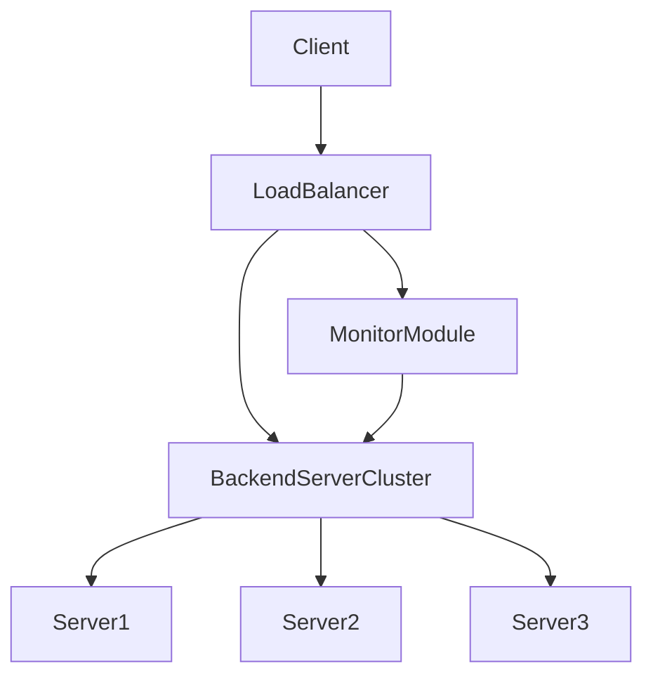
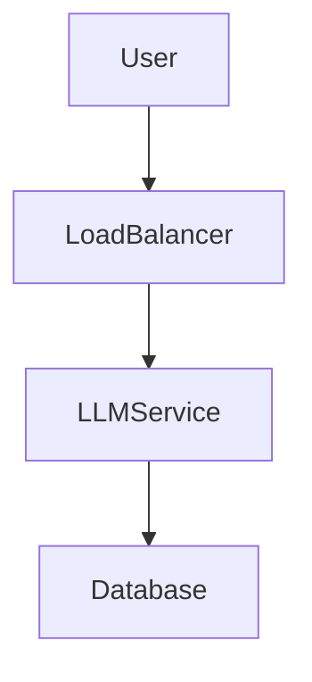

                 

## 负载均衡：提高LLM应用的并发处理能力

### 关键词：负载均衡，LLM应用，并发处理，性能优化，系统设计

### 摘要：

本文旨在深入探讨负载均衡在提升大型语言模型（LLM）应用并发处理能力中的重要性。我们将首先介绍负载均衡的基础概念，解析LLM应用的特点与并发处理的挑战，随后详细探讨各种负载均衡算法及其原理。文章还将描述负载均衡系统的设计要点，并通过实际案例展示如何在复杂的LLM应用场景中实施负载均衡。最后，我们将总结最佳实践，展望未来趋势。

## 目录

1. **背景介绍**
   1.1 负载均衡的定义与重要性
   1.2 LLM应用与并发处理的需求
   1.3 提高并发处理能力的策略

2. **核心概念与联系**
   2.1 负载均衡算法概述
   2.2 常用负载均衡算法分析

3. **算法原理讲解**
   3.1 轮询算法
   3.2 加权轮询算法
   3.3 最少连接算法

4. **系统分析与架构设计方案**
   4.1 负载均衡系统架构
   4.2 负载均衡系统实现

5. **项目实战**
   5.1 实战案例1：搭建简单的负载均衡系统
   5.2 实战案例2：优化现有LLM应用的并发处理能力

6. **最佳实践与总结**
   6.1 负载均衡的最佳实践
   6.2 提高并发处理能力的策略展望

## 背景介绍

### 1.1 负载均衡的定义与重要性

负载均衡（Load Balancing）是一种在多个计算机、网络、存储或其他资源之间分配工作负载的技术，目的是提高系统整体的性能、可靠性和响应速度。在分布式系统中，负载均衡是确保所有资源得到合理利用、避免单一资源过载的关键机制。

负载均衡的重要性体现在以下几个方面：

- **性能提升**：通过分散工作负载，负载均衡可以显著提高系统的处理能力，降低延迟。
- **可靠性增强**：当单个节点发生故障时，负载均衡可以将工作负载转移到其他节点，确保系统的高可用性。
- **资源优化**：负载均衡可以确保所有资源得到均衡使用，避免资源浪费。
- **扩展性**：负载均衡为系统的水平扩展提供了便利，可以轻松地增加或减少资源。

### 1.2 LLM应用与并发处理的需求

大型语言模型（LLM）应用，如自然语言处理（NLP）、智能客服、机器翻译等，具有以下特点：

- **高计算密集性**：LLM应用需要大量的计算资源来处理复杂的文本数据。
- **高并发访问**：由于LLM应用通常面向公众，其访问量可能非常高，需要处理大量的并发请求。
- **动态性**：LLM应用需要快速适应不断变化的请求模式。

这些特点使得LLM应用在并发处理上面临巨大挑战，需要高效的负载均衡机制来确保系统的稳定运行。

### 1.3 提高并发处理能力的策略

提高并发处理能力的方法包括：

- **垂直扩展**：通过增加单个服务器的处理能力来提高系统性能。
- **水平扩展**：通过增加服务器数量来分散工作负载。
- **优化代码**：通过优化算法和代码来减少计算和响应时间。
- **缓存策略**：使用缓存来减少重复计算和响应时间。

### 负载均衡算法概述

在负载均衡中，算法的选择至关重要。以下将介绍几种常用的负载均衡算法：

- **轮询算法**：将请求依次分配给各个服务器。
- **加权轮询算法**：考虑服务器处理能力差异，为处理能力较强的服务器分配更多请求。
- **最少连接算法**：将新的请求分配给连接数最少的服务器。
- **随机算法**：随机分配请求，减少请求的集中性。

### 常用负载均衡算法分析

#### 2.1 轮询算法

轮询算法（Round Robin）是最简单的负载均衡算法，它按照顺序将请求分配给服务器。以下是一个轮询算法的ER实体关系图：

```mermaid
erDiagram
  User ||--o { Request } : "sends"
  Server ||--|{ Request } : "processes"
  Request ||--o User : "received by"
```

轮询算法的优点是简单易实现，适用于负载均匀的场景。然而，它无法根据服务器的实际负载情况动态调整请求分配。

#### 2.2 加权轮询算法

加权轮询算法（Weighted Round Robin）考虑了服务器的处理能力，为处理能力较强的服务器分配更多请求。以下是一个加权轮询算法的ER实体关系图：

```mermaid
erDiagram
  User ||--o { Request } : "sends"
  Server ||--|{ Request } : "processes"
  Request ||--o User : "received by"
  Server ||--|> Weight : "has"
```

加权轮询算法可以根据服务器的处理能力动态调整请求分配，从而提高系统的整体性能。然而，它也需要定期更新服务器的权重，以适应负载的变化。

#### 2.3 最少连接算法

最少连接算法（Least Connections）将新的请求分配给当前连接数最少的服务器。以下是一个最少连接算法的ER实体关系图：

```mermaid
erDiagram
  User ||--o { Request } : "sends"
  Server ||--|{ Request } : "processes"
  Request ||--o User : "received by"
  Server ||--|> Connection : "has"
```

最少连接算法的优点是能够有效减少单个服务器的负载，提高系统的稳定性。然而，它可能导致某些服务器长时间未被分配请求，影响整体的负载均衡效果。

#### 2.4 随机算法

随机算法（Random）通过随机分配请求来减少请求的集中性。以下是一个随机算法的ER实体关系图：

```mermaid
erDiagram
  User ||--o { Request } : "sends"
  Server ||--|{ Request } : "processes"
  Request ||--o User : "received by"
```

随机算法的优点是实现简单，适用于负载变化不大的场景。然而，它可能导致某些服务器长时间未被分配请求，影响整体的负载均衡效果。

### 负载均衡系统架构

#### 3.1 负载均衡系统架构

负载均衡系统通常包括以下几个关键组件：

- **负载均衡器**：负责接收客户端请求，并将请求分配给后端服务器。
- **后端服务器集群**：负责处理客户端请求，提供实际的服务。
- **监控模块**：实时监控系统的性能和状态，提供反馈机制。

以下是一个负载均衡系统架构的Mermaid架构图：



负载均衡系统的工作流程如下：

1. 客户端向负载均衡器发送请求。
2. 负载均衡器根据选择的负载均衡算法，将请求分配给后端服务器。
3. 后端服务器处理请求，并将结果返回给客户端。
4. 监控模块实时监控系统的性能和状态，提供反馈，以优化负载均衡策略。

### 负载均衡系统实现

#### 3.2 负载均衡系统的实现

负载均衡系统的实现包括以下几个方面：

- **负载均衡器的选择**：常见的负载均衡器有Nginx、HAProxy等，它们提供了丰富的功能和良好的性能。
- **负载均衡算法的实现**：根据实际需求选择合适的负载均衡算法，并实现相关逻辑。
- **监控模块的实现**：使用Prometheus、Grafana等工具实现对系统的监控，实时收集和分析系统的性能数据。

以下是一个简单的Python代码示例，实现了一个简单的负载均衡器：

```python
import random

def load_balancer(backend_servers):
    while True:
        server = random.choice(backend_servers)
        print(f"Forwarding request to {server}")
        # 发送请求到服务器
        server.handle_request()
        # 服务器处理请求
        server.complete_request()
        # 服务器完成请求

class BackendServer:
    def __init__(self, name):
        self.name = name
        self.connections = 0

    def handle_request(self):
        self.connections += 1
        print(f"{self.name} is processing a request")

    def complete_request(self):
        self.connections -= 1
        print(f"{self.name} has completed a request")

server1 = BackendServer("Server1")
server2 = BackendServer("Server2")
server3 = BackendServer("Server3")

backend_servers = [server1, server2, server3]

load_balancer(backend_servers)
```

### 实战案例1：搭建简单的负载均衡系统

#### 5.1 实战案例1：搭建简单的负载均衡系统

在本节中，我们将介绍如何使用Nginx搭建一个简单的负载均衡系统。

**步骤1：安装Nginx**

在Ubuntu上安装Nginx的命令如下：

```bash
sudo apt update
sudo apt install nginx
```

**步骤2：配置Nginx**

在Nginx的配置文件中（通常位于`/etc/nginx/nginx.conf`），添加以下负载均衡配置：

```nginx
http {
    upstream myapp {
        server server1.example.com;
        server server2.example.com;
        server server3.example.com;
    }

    server {
        listen 80;

        location / {
            proxy_pass http://myapp;
        }
    }
}
```

这里，`myapp`是一个upstream，它包含了三个服务器。Nginx将根据轮询算法将请求分配给这些服务器。

**步骤3：重启Nginx**

重启Nginx以应用新的配置：

```bash
sudo systemctl restart nginx
```

**步骤4：测试负载均衡**

使用以下命令测试负载均衡是否工作正常：

```bash
curl http://localhost
```

您应该看到来自不同服务器的响应。

### 实战案例2：优化现有LLM应用的并发处理能力

在本节中，我们将介绍如何优化现有LLM应用的并发处理能力。

**步骤1：分析现有架构**

首先，分析现有LLM应用的架构，确定瓶颈和优化点。以下是一个简化的系统架构图：



**步骤2：确定优化策略**

根据分析结果，确定优化策略。以下是一些可能的优化策略：

- **水平扩展LLMService**：通过增加LLMService实例的数量，提高并发处理能力。
- **缓存策略**：使用缓存减少对数据库的访问，提高系统响应速度。
- **异步处理**：使用异步处理减少响应时间，提高系统吞吐量。

**步骤3：实施优化策略**

根据选定的优化策略，实施相应的优化措施。以下是一个示例，展示如何通过水平扩展LLMService来提高并发处理能力：

```bash
# 复制LLMService实例
sudo docker-compose up -d --scale llm_service=4

# 修改Nginx配置，使用加权轮询算法
http {
    upstream myapp {
        server server1.example.com weight=3;
        server server2.example.com weight=3;
        server server3.example.com weight=3;
        server server4.example.com weight=3;
    }

    server {
        listen 80;

        location / {
            proxy_pass http://myapp;
        }
    }
}

# 重启Nginx
sudo systemctl restart nginx
```

### 最佳实践

#### 6.1 负载均衡的最佳实践

- **选择合适的负载均衡算法**：根据实际需求选择合适的负载均衡算法，如轮询、加权轮询、最少连接等。
- **监控系统性能**：实时监控系统的性能和状态，以便及时调整负载均衡策略。
- **弹性扩展**：根据系统的负载情况，动态调整服务器的数量和配置。

#### 6.2 提高并发处理能力的策略展望

未来的负载均衡和并发处理能力优化将更加智能化和自动化。例如：

- **基于机器学习的负载预测**：使用机器学习算法预测系统的负载，提前进行资源调配。
- **自动化扩缩容**：通过自动化工具，根据负载情况自动调整服务器的数量和配置。
- **多维度优化**：综合考虑CPU、内存、网络等多个维度，进行多维度优化，提高系统的整体性能。

### 总结

负载均衡在提高LLM应用的并发处理能力方面发挥着至关重要的作用。通过合理选择负载均衡算法、优化系统架构和实施最佳实践，可以显著提高系统的性能、可靠性和扩展性。未来，随着人工智能和自动化技术的发展，负载均衡和并发处理能力将更加智能化和高效化。

### 拓展阅读

- 《大规模分布式系统设计》
- 《基于机器学习的负载预测》
- 《Nginx负载均衡实战》
- 《分布式系统架构实践》

### 作者信息

作者：AI天才研究院/AI Genius Institute & 禅与计算机程序设计艺术 /Zen And The Art of Computer Programming

