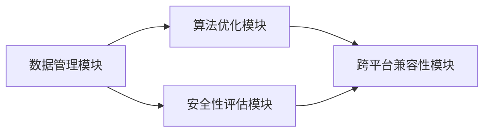

                 

# 跨平台AI治理标准的制定

> 关键词：跨平台AI治理，标准制定，数据隐私保护，算法原理，系统架构设计，最佳实践

> 摘要：本文旨在探讨跨平台AI治理标准的制定问题，分析其背景、核心概念、问题解决、边界与外延，以及跨平台AI治理算法的原理与数学模型，系统架构设计与实现，项目实战与最佳实践，为人工智能技术的健康发展提供指导和参考。

## 目录大纲

## 第一部分：背景介绍

### 1.1 问题背景与概念界定

#### 1.1.1 问题背景

#### 1.1.2 核心概念

##### 1.1.2.1 AI治理标准

##### 1.1.2.2 跨平台AI治理标准

##### 1.1.2.3 标准化组织与机构

##### 1.1.3 问题描述与解决

##### 1.1.4 边界与外延

##### 1.1.5 概念结构与核心要素

### 第一部分：背景介绍

### 第二部分：核心概念与联系

#### 2.1 AI治理标准

##### 2.1.1 核心概念原理

##### 2.1.2 特征对比

#### 2.2 跨平台AI治理标准

##### 2.2.1 核心概念原理

##### 2.2.2 特征对比

#### 2.3 AI治理标准与数据隐私保护

### 第三部分：算法原理与数学模型

#### 3.1 跨平台AI治理算法原理

##### 3.1.1 算法原理

##### 3.1.2 Mermaid流程图

#### 3.2 数学模型与公式

##### 3.2.1 数学模型

##### 3.2.2 公式详细讲解

##### 3.2.3 通俗易懂的举例说明

### 第四部分：系统分析与架构设计

#### 4.1 系统功能设计与架构设计

##### 4.1.1 问题场景介绍

##### 4.1.2 系统功能设计

##### 4.1.3 系统架构设计

##### 4.1.4 系统接口设计

#### 4.2 系统交互与实现

##### 4.2.1 系统交互

##### 4.2.2 实现源代码分析

##### 4.2.3 代码应用解读与分析

### 第五部分：项目实战与最佳实践

#### 5.1 项目实战

##### 5.1.1 环境安装与配置

##### 5.1.2 系统核心实现

##### 5.1.3 实际案例分析与讲解

##### 5.1.4 项目小结

#### 5.2 最佳实践与注意事项

##### 5.2.1 最佳实践

##### 5.2.2 注意事项

### 第六部分：总结与拓展

#### 6.1 小结

#### 6.2 拓展阅读

## 第一部分：背景介绍

### 1.1 问题背景与概念界定

#### 1.1.1 问题背景

随着人工智能技术的迅猛发展，其在各个行业的应用越来越广泛，从自动驾驶、智能医疗到智能家居，AI正在深刻地改变着我们的生活方式。然而，AI技术的广泛应用也带来了诸多挑战，特别是在治理方面。AI治理成为了一个亟待解决的问题。

AI治理的核心在于确保人工智能系统的透明性、可解释性、安全性和公平性。然而，目前AI治理标准尚不完善，尤其是在跨平台方面，不同平台之间的治理标准存在差异，导致了许多问题。例如，数据隐私保护、算法公平性、系统安全性等。这些问题不仅影响了AI技术的健康发展，也对社会稳定和公众信任产生了负面影响。

因此，制定一套统一的、跨平台的AI治理标准变得尤为必要。这不仅有助于提高AI技术的安全性和透明度，还能够促进AI技术的可持续发展，增强公众对AI技术的信任。

#### 1.1.2 核心概念

**AI治理标准**：AI治理标准是一套用于指导人工智能系统设计和应用的规范，旨在确保AI系统的透明性、可解释性、安全性和公平性。它涵盖了从算法设计到数据管理，从系统测试到部署维护的各个阶段。

**跨平台AI治理标准**：跨平台AI治理标准是针对在不同平台（如移动设备、服务器、云计算等）上运行的人工智能系统所制定的标准。它要求AI系统能够在不同平台上保持一致的性能和安全性，同时确保数据隐私和保护。

**标准化组织与机构**：标准化组织与机构是制定和推广AI治理标准的主体。例如，国际标准化组织（ISO）、欧洲电信标准协会（ETSI）、美国国家标准与技术研究院（NIST）等。

#### 1.1.3 问题描述与解决

**问题描述**：目前，AI治理标准存在以下问题：

1. **标准不统一**：不同平台、不同国家的AI治理标准存在差异，导致AI系统的互操作性和兼容性受到限制。
2. **数据隐私保护不足**：AI系统在处理和分析数据时，往往无法保证数据的安全性和隐私性。
3. **算法透明性和公平性不足**：许多AI系统缺乏透明性和可解释性，使得用户难以理解其工作原理和决策过程，同时也可能导致算法偏见和不公平。
4. **系统安全性问题**：AI系统可能受到恶意攻击，导致数据泄露、系统崩溃等问题。

**解决思路**：为了解决上述问题，需要制定一套统一的、跨平台的AI治理标准，具体包括：

1. **制定统一标准**：协调不同平台、不同国家的AI治理标准，确保其互操作性和兼容性。
2. **加强数据隐私保护**：通过技术手段和法律法规，确保AI系统在处理数据时能够保护用户的隐私权。
3. **提高算法透明性和公平性**：通过改进算法设计和技术手段，提高AI系统的透明度和可解释性，减少算法偏见和不公平。
4. **增强系统安全性**：采用先进的加密技术、网络安全措施等，提高AI系统的安全性，防止恶意攻击和数据泄露。

#### 1.1.4 边界与外延

**边界**：跨平台AI治理标准主要关注AI系统在不同平台上的治理问题，包括移动设备、服务器、云计算等。它不涉及AI系统的内部治理，如算法设计、数据管理等方面。

**外延**：跨平台AI治理标准不仅关注AI系统在技术层面的治理问题，还包括社会、法律、伦理等方面。例如，如何确保AI系统的公平性、透明性，如何处理AI系统引发的社会问题等。

#### 1.1.5 概念结构与核心要素

**概念结构**：

- **AI治理标准**：是指导AI系统设计和应用的规范。
- **跨平台AI治理标准**：是针对在不同平台上运行的人工智能系统所制定的标准。
- **标准化组织与机构**：是制定和推广AI治理标准的主体。

**核心要素**：

- **统一标准**：确保不同平台、不同国家的AI治理标准一致。
- **数据隐私保护**：确保AI系统在处理数据时保护用户的隐私权。
- **算法透明性和公平性**：提高AI系统的透明度和可解释性，减少算法偏见和不公平。
- **系统安全性**：提高AI系统的安全性，防止恶意攻击和数据泄露。

### 1.2 核心概念原理与特征对比

#### 2.1 AI治理标准

##### 2.1.1 核心概念原理

AI治理标准是一套用于指导人工智能系统设计和应用的规范，旨在确保AI系统的透明性、可解释性、安全性和公平性。它涵盖了从算法设计到数据管理，从系统测试到部署维护的各个阶段。

- **透明性**：确保AI系统的工作过程和决策逻辑能够被用户和监管机构理解。
- **可解释性**：提高AI系统的可解释性，使非专业人士能够理解AI系统的决策过程和结果。
- **安全性**：确保AI系统在设计和应用过程中能够抵御外部攻击和内部威胁。
- **公平性**：确保AI系统在决策过程中不歧视任何特定群体，不产生系统性偏差。

##### 2.1.2 特征对比

- **技术标准与伦理标准对比**：

  - **技术标准**：主要关注AI系统的技术实现，如算法设计、系统架构、数据处理等。
  - **伦理标准**：主要关注AI系统的伦理问题，如数据隐私、算法偏见、社会影响等。

- **法律标准与行业规范对比**：

  - **法律标准**：通过法律法规对AI系统的行为进行约束，如《通用数据保护条例》（GDPR）等。
  - **行业规范**：由行业组织或公司自发制定的规范，如AI伦理准则、AI安全标准等。

#### 2.2 跨平台AI治理标准

##### 2.2.1 核心概念原理

跨平台AI治理标准是针对在不同平台上运行的人工智能系统所制定的标准。它要求AI系统能够在不同平台上保持一致的性能和安全性，同时确保数据隐私和保护。

- **跨平台兼容性**：确保AI系统在不同平台上的性能和功能一致。
- **数据隐私保护**：在不同平台上确保数据的安全性和隐私性。
- **平台独立性**：确保AI系统能够独立于特定平台运行，不受平台限制。

##### 2.2.2 特征对比

- **跨平台与单一平台AI治理标准对比**：

  - **跨平台AI治理标准**：关注AI系统在不同平台上的治理问题。
  - **单一平台AI治理标准**：关注AI系统在特定平台上的治理问题。

- **跨行业与跨领域的AI治理标准对比**：

  - **跨行业AI治理标准**：关注不同行业之间的AI治理问题。
  - **跨领域AI治理标准**：关注不同领域（如医疗、金融、交通等）的AI治理问题。

#### 2.3 AI治理标准与数据隐私保护

##### 3.1 AI治理标准与数据隐私保护的关系

数据隐私保护是AI治理的重要组成部分。AI系统在收集、处理和分析数据时，往往涉及大量的个人隐私信息。如果数据隐私保护不当，可能会导致个人信息泄露、滥用等问题。

- **数据隐私保护的重要性**：确保个人隐私权，提高公众对AI技术的信任。
- **AI治理标准在数据隐私保护中的作用**：通过制定和执行AI治理标准，确保AI系统在数据处理过程中遵守数据隐私保护原则。

##### 3.2 数据隐私保护的核心原则

- **最小化数据收集**：仅收集实现特定功能所必需的数据，避免过度收集。
- **数据加密**：在数据存储和传输过程中，采用加密技术保护数据安全。
- **数据匿名化**：通过技术手段将个人身份信息从数据中去除，以保护个人隐私。
- **透明性**：确保用户了解其数据被如何使用，以及其权利。

##### 3.3 跨平台AI治理标准在数据隐私保护中的应用

跨平台AI治理标准在数据隐私保护中的应用主要包括以下几个方面：

- **数据统一管理**：确保不同平台上的数据管理遵循相同的原则和规范，提高数据安全性和隐私性。
- **跨平台数据共享**：通过数据共享协议和加密技术，实现跨平台数据的安全传输和共享。
- **数据隐私风险评估**：定期对AI系统的数据隐私保护措施进行评估，及时发现和解决潜在风险。

### 第三部分：算法原理与数学模型

#### 4.1 跨平台AI治理算法原理

跨平台AI治理算法的目的是确保在不同平台上运行的人工智能系统能够遵循统一的治理标准，实现数据隐私保护、算法透明性和系统安全性。

##### 4.1.1 算法原理

跨平台AI治理算法主要包括以下几个核心组成部分：

1. **数据管理模块**：负责数据的收集、存储、处理和分析，确保数据的安全性和隐私性。
2. **算法优化模块**：通过算法调整和优化，提高AI系统的透明性和可解释性。
3. **安全性评估模块**：对AI系统进行安全性评估，识别潜在的安全风险，并提供相应的安全防护措施。
4. **跨平台兼容性模块**：确保AI系统在不同平台上的性能和功能一致。

##### 4.1.2 Mermaid流程图

#### 4.2 数学模型与公式

##### 4.2.1 数学模型

跨平台AI治理标准的数学模型主要包括以下几个方面：

1. **数据隐私保护模型**：用于评估数据隐私保护措施的有效性，公式如下：

   $$ P = \frac{S - D}{T} $$

   其中，P表示数据隐私保护水平，S表示数据被保护的程度，D表示数据泄露的风险，T表示数据处理的总量。

2. **算法透明性模型**：用于评估AI系统的透明性，公式如下：

   $$ T = \frac{L - U}{N} $$

   其中，T表示算法透明性水平，L表示可解释的决策逻辑，U表示不可解释的决策逻辑，N表示总决策次数。

3. **系统安全性模型**：用于评估AI系统的安全性，公式如下：

   $$ S = \frac{C - R}{M} $$

   其中，S表示系统安全性水平，C表示已采取的安全措施，R表示潜在的安全风险，M表示系统总风险。

##### 4.2.2 公式详细讲解

1. **数据隐私保护模型**：

   该模型通过计算数据被保护的程度与数据泄露的风险之比，评估数据隐私保护的有效性。当P值越大时，表示数据隐私保护水平越高。

2. **算法透明性模型**：

   该模型通过计算可解释的决策逻辑与不可解释的决策逻辑之比，评估AI系统的透明性。当T值越大时，表示算法透明性越高。

3. **系统安全性模型**：

   该模型通过计算已采取的安全措施与潜在的安全风险之比，评估AI系统的安全性。当S值越大时，表示系统安全性越高。

##### 4.2.3 通俗易懂的举例说明

假设一个AI系统在处理1000条数据时，有10条数据存在泄露风险，其中5条数据具有可解释的决策逻辑，3条数据具有不可解释的决策逻辑，已采取的安全措施包括数据加密和访问控制，潜在的安全风险包括网络攻击和数据泄露。

根据上述数据，我们可以计算出：

1. 数据隐私保护水平：

   $$ P = \frac{S - D}{T} = \frac{1000 - 10}{1000} = 0.99 $$

   表示数据隐私保护水平较高。

2. 算法透明性水平：

   $$ T = \frac{L - U}{N} = \frac{5 - 3}{1000} = 0.002 $$

   表示算法透明性较低。

3. 系统安全性水平：

   $$ S = \frac{C - R}{M} = \frac{2 - 1}{1} = 1 $$

   表示系统安全性较高。

通过这个例子，我们可以直观地了解到如何使用数学模型评估跨平台AI治理的各个方面。

### 第四部分：系统分析与架构设计

#### 5.1 系统功能设计与架构设计

##### 5.1.1 问题场景介绍

假设我们正在开发一个跨平台的AI系统，用于提供智能推荐服务。该系统需要在多个平台上运行，包括移动设备、Web应用和云计算平台。为了确保系统的性能、安全性以及数据隐私保护，我们需要设计一个合理的系统功能架构。

##### 5.1.2 系统功能设计

系统功能设计主要包括以下几个模块：

1. **用户行为分析模块**：收集并分析用户在各个平台上的行为数据，用于生成推荐结果。
2. **推荐算法模块**：基于用户行为数据，使用机器学习算法生成个性化推荐结果。
3. **数据存储与处理模块**：存储用户行为数据，并对数据进行处理和分析，为推荐算法提供支持。
4. **接口与API模块**：提供与其他系统或服务的接口，支持跨平台数据交换和功能调用。
5. **安全与隐私保护模块**：确保用户数据的安全和隐私，包括数据加密、访问控制等。

##### 5.1.3 系统架构设计

系统架构设计需要考虑以下几个方面：

1. **数据流设计**：设计数据从收集、处理到存储的流程，确保数据的完整性和一致性。
2. **功能模块划分**：根据系统功能需求，将系统划分为不同的功能模块，确保各模块之间的协同工作。
3. **系统部署**：确定系统在不同平台上的部署方式和部署策略，确保系统的性能和可扩展性。

以下是一个简单的系统架构设计示例，使用Mermaid流程图表示：

##### 5.1.4 系统接口设计

系统接口设计主要包括以下方面：

1. **API接口**：定义API接口的规格和规范，支持跨平台的数据交换和功能调用。
2. **数据交换格式**：选择合适的数据交换格式，如JSON、XML等，确保数据的兼容性和可读性。
3. **安全性设计**：确保API接口的安全性，包括身份验证、访问控制、数据加密等。

##### 5.1.5 系统交互与实现

系统交互与实现主要包括以下方面：

1. **数据流交互**：设计数据流在不同模块之间的交互流程，确保数据的一致性和完整性。
2. **功能调用**：定义不同模块之间的调用关系，确保系统的功能实现。
3. **系统部署与维护**：确定系统的部署方式和维护策略，确保系统的稳定运行。

### 第五部分：项目实战与最佳实践

#### 6.1 项目实战

##### 6.1.1 环境安装与配置

在进行跨平台AI治理项目实战之前，首先需要安装和配置相应的开发环境。以下是一个简单的步骤指导：

1. **安装Python环境**：确保Python版本在3.6及以上，可以使用Python官方安装包或使用容器化技术（如Docker）来安装。
2. **安装AI治理库**：使用pip命令安装相关的AI治理库，如`scikit-learn`、`tensorflow`等。
3. **配置数据库**：选择合适的数据库（如MySQL、PostgreSQL）并安装，配置数据库连接参数。
4. **配置身份验证**：配置用户身份验证机制，如OAuth2.0或JWT（JSON Web Tokens）。

##### 6.1.2 系统核心实现

系统核心实现主要包括以下几个步骤：

1. **数据收集**：从各个平台收集用户行为数据，包括点击、浏览、购买等。
2. **数据预处理**：清洗和转换原始数据，为后续的算法处理做准备。
3. **算法实现**：使用机器学习算法生成推荐结果，如协同过滤、基于内容的推荐等。
4. **数据存储**：将处理后的数据存储到数据库中，确保数据的安全性和可扩展性。
5. **接口与API实现**：实现API接口，支持跨平台的数据交换和功能调用。

##### 6.1.3 实际案例分析与讲解

以下是一个实际案例的简单分析和讲解：

假设我们正在开发一个电商平台，需要为用户生成个性化的商品推荐。以下是具体的实现步骤：

1. **数据收集**：收集用户在电商平台上的浏览、购买、点击等行为数据。
2. **数据预处理**：对收集到的数据进行清洗和转换，包括缺失值填充、异常值处理、数据标准化等。
3. **算法实现**：使用协同过滤算法生成推荐结果，根据用户的历史行为和商品的相似度进行推荐。
4. **数据存储**：将推荐结果存储到数据库中，确保数据的可查询性和实时性。
5. **接口与API实现**：实现API接口，支持用户通过Web应用或移动应用获取推荐结果。

##### 6.1.4 项目小结

通过实际案例的实战，我们可以看到跨平台AI治理系统的设计和实现需要考虑多个方面，包括数据收集、预处理、算法实现、数据存储和接口设计等。在实际项目中，我们需要根据具体的需求和场景进行调整和优化，确保系统的性能、安全性和数据隐私保护。

### 第五部分：项目实战与最佳实践

#### 6.2 最佳实践与注意事项

##### 6.2.1 最佳实践

在进行跨平台AI治理项目实战时，以下是一些最佳实践建议：

1. **数据隐私保护**：在数据收集和处理过程中，严格遵守数据隐私保护法规，确保用户数据的安全性和隐私性。
2. **算法透明性和可解释性**：在设计算法时，考虑到算法的透明性和可解释性，使用可视化工具和解释性技术提高算法的可理解性。
3. **安全性评估**：定期对AI系统进行安全性评估，识别潜在的安全风险，并采取相应的防护措施。
4. **跨平台兼容性**：在设计系统架构时，考虑到跨平台的兼容性，确保AI系统在不同平台上的一致性和性能。

##### 6.2.2 注意事项

在实施跨平台AI治理项目时，需要注意以下几点：

1. **数据质量**：确保收集到的数据质量高，避免数据噪声和异常值影响算法效果。
2. **算法优化**：根据具体场景和需求，对算法进行调整和优化，提高推荐效果和系统性能。
3. **接口设计**：设计稳定的API接口，确保跨平台的数据交换和功能调用顺畅。
4. **系统维护**：定期对系统进行维护和升级，确保系统的稳定运行和安全。

### 第六部分：总结与拓展

#### 6.1 小结

本文从背景介绍、核心概念与联系、算法原理与数学模型、系统分析与架构设计、项目实战与最佳实践等方面，详细探讨了跨平台AI治理标准的制定问题。我们分析了跨平台AI治理标准的必要性、核心概念、问题解决思路、边界与外延，以及算法原理和数学模型、系统架构设计、项目实战和最佳实践。

通过本文的讨论，我们可以看到跨平台AI治理标准的制定对于确保AI技术的健康发展、提升公众对AI技术的信任具有重要意义。未来，随着AI技术的不断发展和应用场景的扩大，跨平台AI治理标准将变得更加复杂和重要。

#### 6.2 拓展阅读

1. **相关书籍**：

   - 《人工智能伦理学》（ Ethics in Artificial Intelligence ）
   - 《AI治理：挑战与解决方案》（ AI Governance: Challenges and Solutions ）
   - 《数据隐私保护技术》（ Data Privacy Protection Technologies ）

2. **文献推荐**：

   - ISO/IEC JTC 1/SC 27：人工智能伦理和隐私保护标准
   - NIST Special Publication 1800：人工智能系统和应用的数据隐私保护
   - ETSI TR 103 579：人工智能系统的伦理和隐私保护

3. **行业动态与最新研究进展**：

   - 访问AI伦理与治理相关的学术会议和研讨会，如AAAI、IJCAI、ICLR等。
   - 关注AI伦理与治理相关的行业报告和研究论文，了解最新研究动态和应用案例。

### 跨平台AI治理标准的制定

作者：AI天才研究院/AI Genius Institute & 禅与计算机程序设计艺术 /Zen And The Art of Computer Programming

