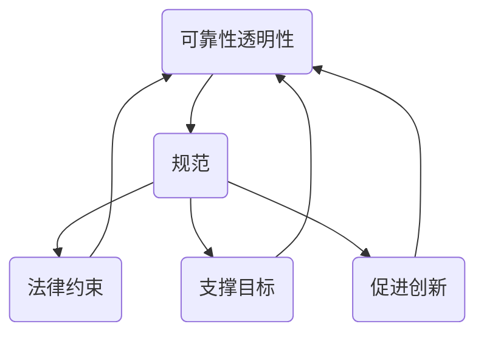
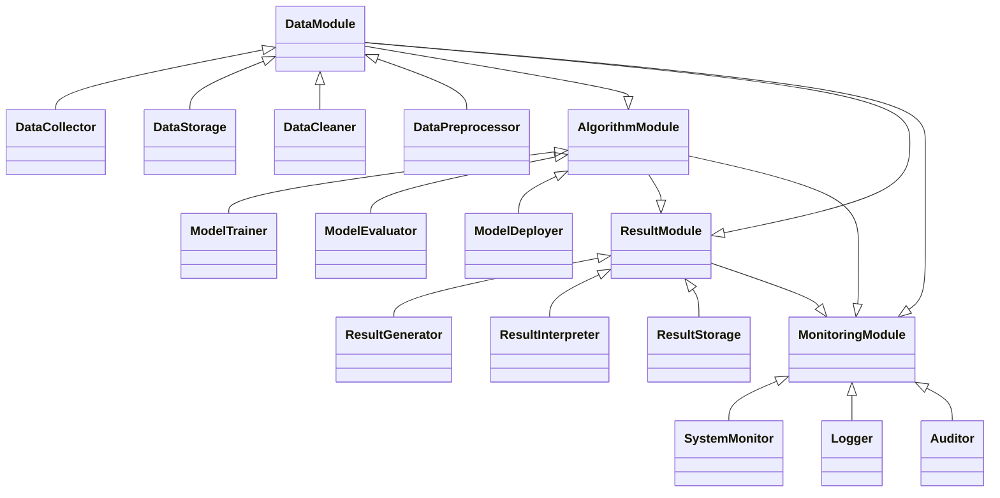
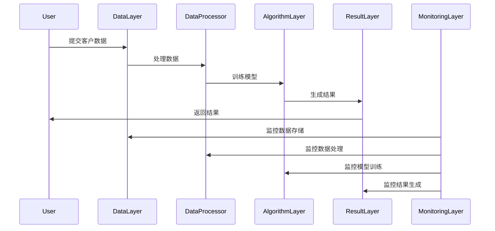

                 

### 关键词

1. **AI治理标准**：跨行业应用中的治理规范和准则。
2. **算法原理**：AI治理标准的数学模型和公式。
3. **系统架构设计**：AI治理标准在系统中的应用和技术选型。
4. **项目实战**：通过实际案例展示AI治理标准制定。
5. **最佳实践**：总结AI治理标准制定的经验和方法。
6. **跨行业应用**：不同领域AI治理标准的共享和互操作性。
7. **风险管理与优化**：AI治理标准中涉及的风险分析和性能调优。

### 摘要

本文深入探讨跨行业AI治理标准的制定，旨在解决AI应用带来的治理挑战。通过逻辑清晰、结构紧凑的分析，本文将详细阐述AI治理标准的背景、核心概念、算法原理、系统架构设计、项目实战以及最佳实践。文章结合实际案例，从环境安装、系统核心实现到代码解读和性能优化，全面展示了AI治理标准在跨行业中的应用方法和实施策略。最终，本文总结了AI治理标准制定过程中的关键要点，并为未来的研究和实践提供了丰富的资源。读者通过本文，将能够全面理解AI治理标准的制定流程和核心要素，提升在实际项目中应用AI治理标准的能力。


### 引言

随着人工智能（AI）技术的迅猛发展，AI在各个行业的应用日益广泛，从医疗、金融到制造业，AI技术正在深刻改变着传统行业的运作模式。然而，AI技术的广泛应用也带来了诸多治理挑战，如数据隐私、算法偏见、安全风险等。为了确保AI技术的健康发展和安全应用，跨行业AI治理标准的制定显得尤为重要。这些标准不仅为AI应用提供了合规和规范，也为企业和技术人员提供了统一的指导框架。

本文旨在深入探讨跨行业AI治理标准的制定，通过逻辑清晰、结构紧凑的分析，从背景、核心概念、算法原理、系统架构设计、项目实战到最佳实践，全面解析AI治理标准的制定流程和核心要素。通过本文的阅读，读者将能够全面理解AI治理标准的重要性，掌握其核心概念和算法原理，并了解在实际项目中如何应用和优化AI治理标准。

文章结构如下：

1. **背景介绍**：探讨AI治理标准的背景、重要性和必要性，分析跨行业AI治理的挑战。
2. **核心概念与联系**：定义AI治理标准的核心概念，展示其与法律法规、企业战略、技术创新的关系。
3. **算法原理讲解**：讲解AI治理标准中的算法原理，包括数学模型和公式，并通过Python源代码进行详细阐述。
4. **系统分析与架构设计**：分析AI治理标准在系统中的应用，展示系统架构、接口设计和交互流程。
5. **项目实战**：通过实际案例展示AI治理标准的制定过程，从环境安装到系统实现和性能优化。
6. **最佳实践 tips**：总结制定AI治理标准的最佳实践，为实际应用提供指导。
7. **小结与拓展阅读**：总结全文内容，提供进一步阅读的资源。

通过本文的阅读，读者不仅可以深入了解AI治理标准的理论和实践，还能够提升在实际项目中应用AI治理标准的能力，为推动AI技术的健康发展贡献力量。

### 背景介绍

随着人工智能（AI）技术的迅猛发展，AI在各个行业的应用日益广泛。从医疗诊断、金融服务到制造业自动化，AI技术的广泛应用不仅提高了生产效率，也带来了前所未有的创新机遇。然而，随着AI技术的普及，治理挑战也随之而来。这些挑战主要体现在以下几个方面：

首先，数据隐私问题日益突出。AI算法通常依赖于大量数据进行训练和决策，而这些数据往往涉及个人隐私。如何确保数据的安全性和隐私性，避免数据泄露和滥用，成为AI治理的重要课题。

其次，算法偏见问题备受关注。AI算法在训练过程中可能吸收并放大了社会中的偏见，导致在应用中产生不公平的结果。例如，人脸识别技术在种族识别上的准确性差异，自动化招聘系统中存在的性别偏见等，这些算法偏见不仅损害了公正性，也可能引发法律和社会问题。

再次，安全风险也是AI应用面临的重要挑战。AI系统可能成为网络攻击的目标，恶意使用AI技术可能导致严重后果。此外，AI系统在决策过程中缺乏透明性和可解释性，使得其决策过程难以被信任和监管。

为了应对这些治理挑战，跨行业AI治理标准的制定显得尤为重要。AI治理标准不仅为AI应用提供了合规和规范，也为企业和技术人员提供了统一的指导框架。具体来说，AI治理标准具有以下几个方面的必要性：

1. **确保合规性**：随着各国对AI技术应用的法律和监管日益严格，AI治理标准有助于企业确保其AI应用符合相关法规要求，避免法律风险和处罚。

2. **提升信任度**：通过制定和遵循AI治理标准，企业能够提高AI应用的透明度和可解释性，增强用户和公众对AI技术的信任。

3. **促进技术创新**：统一的治理标准有助于减少跨行业的AI应用障碍，促进技术的共享和互操作性，从而推动AI技术的创新和发展。

4. **保障数据安全**：AI治理标准中通常包括数据隐私保护措施，有助于企业建立有效的数据管理机制，防范数据泄露和滥用。

5. **解决算法偏见**：AI治理标准可以规范算法开发和应用的流程，减少算法偏见的发生，提高AI系统的公正性和公平性。

6. **降低安全风险**：通过建立安全标准和最佳实践，AI治理标准有助于降低AI系统面临的安全风险，提高系统的可靠性和稳定性。

跨行业AI治理标准的制定不仅需要考虑不同行业的需求和特点，还需要借鉴国际标准和行业最佳实践。具体而言，制定过程中需要关注以下几个方面：

1. **数据治理**：明确数据收集、存储、处理和使用的要求，确保数据隐私和安全。

2. **算法透明性**：制定算法开发和应用的透明性标准，包括算法设计、训练数据和决策过程的可解释性。

3. **公平性和公正性**：确保AI系统在应用过程中不会产生不公平的结果，减少算法偏见。

4. **安全性**：建立AI系统的安全标准和风险管理体系，防范网络攻击和恶意使用。

5. **可追溯性**：确保AI系统中的决策和行为具有可追溯性，便于后续的审计和监管。

6. **持续改进**：制定持续改进机制，及时更新和优化AI治理标准，以应对AI技术的快速发展和新的治理挑战。

总之，跨行业AI治理标准的制定是一项复杂的系统工程，需要多方协作和共同努力。通过制定和实施这些标准，可以确保AI技术在各个行业的健康发展和安全应用，为社会带来更多积极影响。

### 核心概念与联系

在深入探讨AI治理标准之前，理解其中涉及的核心概念及其相互关系至关重要。以下是对AI治理标准中几个关键概念的详细解释：

#### AI治理的定义

AI治理是指通过制定、实施和监督相关规则、政策和标准，确保人工智能系统在开发、部署和应用过程中的合法、公正、透明和可靠。具体包括以下几个方面：

1. **合法性**：确保AI系统的设计和应用符合相关法律法规要求，防止违法行为。
2. **公正性**：保障AI系统在处理数据和作出决策时具有公平性，避免歧视和不公正现象。
3. **透明性**：确保AI系统的设计和运作过程透明，使相关人员能够理解和监督系统的行为。
4. **可靠性**：确保AI系统能够在预期范围内稳定、准确地执行任务。

#### AI治理标准的定义

AI治理标准是针对AI系统开发、应用和管理的一系列规范和要求。这些标准旨在为AI系统的合规性、公平性、透明性和可靠性提供保障。AI治理标准可以包括以下几个方面：

1. **合规性标准**：确保AI系统的开发和应用符合相关法律法规的要求。
2. **数据管理标准**：规范数据收集、存储、处理和使用的方式，确保数据隐私和安全。
3. **算法设计标准**：确保AI算法的设计和实现符合公正性、透明性和可靠性要求。
4. **系统安全性标准**：建立AI系统的安全防护机制，防范网络攻击和数据泄露。
5. **审计和监督标准**：确保AI系统的设计和应用过程能够接受审计和监督。

#### AI治理标准与法律法规的关系

法律法规是AI治理标准制定的重要基础，AI治理标准需要与现有法律法规保持一致。具体关系如下：

1. **遵循法律法规**：AI治理标准必须遵循相关法律法规的要求，确保AI系统的合法性。
2. **补充法律法规**：在某些情况下，法律法规可能未能涵盖所有AI应用场景，AI治理标准可以作为补充，提供更细化的指导。
3. **推动法律法规完善**：AI治理标准的实践可以为法律法规的完善提供参考和依据，推动相关法律法规的更新和改进。

#### AI治理标准与企业战略的关系

AI治理标准不仅是对AI技术应用的管理工具，也是企业战略的重要组成部分。具体关系如下：

1. **支撑企业战略**：通过实施AI治理标准，企业可以确保AI技术的合规和可靠应用，从而支撑企业战略目标的实现。
2. **降低风险**：AI治理标准可以帮助企业识别和降低AI技术应用中的潜在风险，保护企业利益。
3. **提升竞争力**：遵循AI治理标准，企业能够提高AI应用的透明度和公正性，增强市场竞争力。
4. **建立品牌信任**：通过积极实施AI治理标准，企业能够树立良好的社会形象，赢得公众和用户的信任。

#### AI治理标准与技术创新的关系

AI治理标准与技术创新之间存在紧密的互动关系：

1. **促进技术创新**：AI治理标准为技术创新提供了明确的规范和框架，有助于技术创新在合规和安全的范围内进行。
2. **适应技术创新**：随着AI技术的不断进步，AI治理标准需要不断更新和调整，以适应新的技术发展趋势。
3. **平衡创新与风险**：AI治理标准在推动技术创新的同时，也需要平衡创新与风险，确保AI技术不会因创新而牺牲安全和可靠性。

#### 核心概念属性特征对比

以下表格展示了AI治理的核心概念及其属性特征的对比：

| 核心概念       | 定义                                                         | 属性特征                                         |
|----------------|--------------------------------------------------------------|--------------------------------------------------|
| AI治理         | 确保AI系统合法、公正、透明和可靠的规则和政策                  | 法律合规性、数据安全、算法公正性、系统透明性、可靠性 |
| AI治理标准     | 规范AI系统开发、应用和管理的一系列要求                       | 合规性标准、数据管理标准、算法设计标准、安全性标准、审计和监督标准 |
| 法律法规       | 国家和地方制定的法律、条例和规定                             | 法律约束力、细化条款、具体要求、监督执行               |
| 企业战略       | 企业为实现长远发展目标所制定的规划和管理措施                 | 目标明确、资源配置、执行策略、风险控制、市场竞争力       |
| 技术创新       | 探索和应用新的技术和方法以推动科技进步和产业发展               | 创新思维、技术研发、产品优化、市场应用、竞争优势       |

#### 概念联系

AI治理、AI治理标准、法律法规、企业战略和技术创新之间存在着密切的联系和相互作用。以下Mermaid流程图展示了这些概念之间的联系：



通过上述分析，我们可以看到，AI治理标准在AI治理、法律法规、企业战略和技术创新之间起到了桥梁和纽带的作用。只有通过制定和实施全面的AI治理标准，才能确保AI技术在各个领域的健康发展和安全应用。

### 概念联系

在深入探讨AI治理标准的核心概念之后，我们需要进一步分析这些概念之间的内在联系，特别是它们与法律法规、企业战略和技术创新之间的关系。以下是这些关系更详细的解释：

#### AI治理标准与法律法规的关系

AI治理标准与法律法规之间存在着密切的联系和互动。法律法规是制定AI治理标准的重要基础，而AI治理标准则是法律法规的具体实现和补充。

首先，AI治理标准需要遵循相关法律法规的要求。无论是国家层面还是地方性法规，法律法规对AI技术的应用都提出了明确的要求和限制。例如，《欧盟通用数据保护条例》（GDPR）对数据隐私和用户权利进行了详细规定，AI治理标准在制定过程中需要充分考虑这些法规要求，确保AI系统的合规性。

其次，AI治理标准可以作为法律法规的补充，填补法律未覆盖的细节。在某些情况下，现有法律法规可能未能涵盖所有AI应用场景，而AI治理标准可以为这些场景提供更为具体的指导和规范。例如，在自动驾驶领域，虽然各国都有相应的交通法规，但针对AI自动驾驶的特定规范和标准可能需要在法律框架之外制定。

此外，AI治理标准与法律法规之间的互动还可以体现在法规的制定和更新过程中。AI治理标准的实践可以为立法者提供参考，推动相关法律法规的完善和更新。例如，随着AI技术在医疗领域的应用日益广泛，医疗AI治理标准的制定可以为医疗法律法规的修订提供依据，确保医疗AI系统的合法性和安全性。

#### AI治理标准与企业战略的关系

企业战略是企业为实现长远发展目标而制定的规划和措施。AI治理标准在企业战略中扮演着重要角色，既是企业战略实现的基础，也是企业风险管理的重要手段。

首先，AI治理标准为企业战略提供了合规和安全的保障。通过制定和实施AI治理标准，企业可以确保其AI系统的设计和应用符合法律法规和行业规范，从而避免法律风险和处罚。例如，金融机构在应用AI技术进行风险管理时，必须遵循相应的AI治理标准，确保其AI模型和决策过程的合法性和透明性。

其次，AI治理标准可以帮助企业降低技术风险，保护企业利益。AI技术在应用过程中可能会面临算法偏见、数据泄露和安全漏洞等风险。通过实施AI治理标准，企业可以建立完善的数据管理、算法开发和系统安全机制，从而降低这些风险，保护企业免受潜在损失。

此外，AI治理标准还可以提升企业的竞争力。在市场竞争日益激烈的今天，遵循AI治理标准不仅能够确保企业的合规性和安全性，还能够提升企业的技术水平和品牌形象，增强企业在市场上的竞争力。

#### AI治理标准与技术创新的关系

技术创新是推动社会发展的重要动力，而AI治理标准在技术创新中发挥着重要的引导和保障作用。

首先，AI治理标准为技术创新提供了明确的规范和框架。在技术创新过程中，AI治理标准可以帮助研发人员了解和遵循最佳实践，确保其开发的技术和应用符合法律法规和行业规范。例如，在自动驾驶技术的研发过程中，AI治理标准可以为自动驾驶算法的设计和测试提供具体的指导，确保其符合安全性和可靠性的要求。

其次，AI治理标准可以促进技术创新的健康发展。通过制定和实施AI治理标准，可以防止技术创新过程中的滥用和不良行为。例如，在人脸识别技术的应用中，AI治理标准可以规范人脸数据的收集、存储和使用，防止数据滥用和隐私侵犯，从而确保技术的负责任应用。

此外，AI治理标准还可以促进不同领域和技术之间的互操作性和协作。通过制定统一的标准，不同领域的AI技术可以更方便地集成和共享，推动跨行业的技术创新和发展。

#### 实例分析

为了更清晰地展示AI治理标准与法律法规、企业战略和技术创新之间的联系，以下通过具体实例进行分析：

假设一家金融科技公司开发了一款基于AI的信用评分系统，用于评估用户的信用风险。在这个过程中，AI治理标准需要考虑以下几个方面：

1. **法律法规**：公司必须确保其信用评分系统符合《欧盟通用数据保护条例》（GDPR）和其他相关法律法规的要求。例如，系统需要获取用户的明确同意，并确保用户数据的安全和隐私。

2. **企业战略**：公司通过制定AI治理标准，确保其信用评分系统的公正性和透明性，从而增强用户信任，提升市场竞争力。例如，公司可以建立透明的算法和决策过程，让用户了解如何计算其信用评分。

3. **技术创新**：在开发信用评分系统时，公司需要遵循AI治理标准，确保系统的设计、开发和测试符合最佳实践。例如，公司可以使用多样化的数据集进行训练，避免算法偏见，并确保系统的稳定性和可靠性。

通过上述实例，我们可以看到，AI治理标准不仅与法律法规、企业战略和技术创新密切相关，而且在这些方面发挥着重要的作用。只有通过制定和实施全面的AI治理标准，才能确保AI技术在各个领域的健康发展和安全应用。

### 算法原理讲解

在AI治理标准的实施过程中，算法原理的理解和运用至关重要。算法原理不仅决定了AI系统的性能和效果，还直接影响到系统的透明性和可靠性。本节将详细讲解AI治理标准中涉及的算法原理，包括数学模型和公式，并通过Python源代码进行具体阐述，使读者能够深入理解并应用这些算法。

#### 算法原理概述

AI治理标准中的算法原理主要涉及以下几个方面：

1. **数据预处理**：数据预处理是AI模型训练的重要步骤，包括数据的清洗、归一化、特征选择等操作。
2. **模型选择**：选择合适的机器学习模型，如决策树、神经网络、支持向量机等。
3. **算法优化**：通过调整算法参数，优化模型的性能，如交叉验证、网格搜索等。
4. **结果解释**：对模型决策进行解释，提高模型的透明性和可解释性。

以下是对每个方面进行详细讲解。

#### 数据预处理

数据预处理是确保AI模型训练质量的关键步骤。一个高质量的预处理流程能够显著提高模型的性能和稳定性。

1. **数据清洗**：数据清洗是处理数据中的噪声和错误。例如，删除重复数据、处理缺失值、纠正数据中的错误。

```python
import pandas as pd

# 示例：清洗数据
data = pd.read_csv('data.csv')
data.drop_duplicates(inplace=True)  # 删除重复数据
data.fillna(method='ffill', inplace=True)  # 处理缺失值
```

2. **归一化**：归一化是将不同特征的数据转换到同一尺度，通常使用标准化或最小-最大缩放。

```python
from sklearn.preprocessing import StandardScaler

# 示例：数据归一化
scaler = StandardScaler()
data_scaled = scaler.fit_transform(data)
```

3. **特征选择**：特征选择是选择对模型影响最大的特征，减少冗余数据，提高训练效率。

```python
from sklearn.feature_selection import SelectKBest, f_classif

# 示例：特征选择
X = data_scaled[:, :-1]  # 特征矩阵
y = data_scaled[:, -1]   # 目标变量
selector = SelectKBest(f_classif, k=5)
X_new = selector.fit_transform(X, y)
```

#### 模型选择

选择合适的机器学习模型是AI治理标准中的关键步骤。以下介绍几种常用的机器学习模型：

1. **决策树**：决策树通过一系列判断条件对数据进行划分，适合处理分类问题。

```python
from sklearn.tree import DecisionTreeClassifier

# 示例：决策树模型
clf = DecisionTreeClassifier()
clf.fit(X_new, y)
```

2. **神经网络**：神经网络通过多层感知器进行数据分类，适合处理复杂的问题。

```python
from sklearn.neural_network import MLPClassifier

# 示例：神经网络模型
clf = MLPClassifier(hidden_layer_sizes=(100,), max_iter=1000)
clf.fit(X_new, y)
```

3. **支持向量机**：支持向量机通过最大化分类边界来分离数据，适合处理高维数据。

```python
from sklearn.svm import SVC

# 示例：支持向量机模型
clf = SVC(kernel='linear')
clf.fit(X_new, y)
```

#### 算法优化

算法优化是通过调整模型参数来提高模型性能的过程。以下介绍几种常用的优化方法：

1. **交叉验证**：交叉验证通过将数据集划分为多个子集，多次训练和验证模型，以提高模型的泛化能力。

```python
from sklearn.model_selection import cross_val_score

# 示例：交叉验证
scores = cross_val_score(clf, X_new, y, cv=5)
print("交叉验证平均分数：", scores.mean())
```

2. **网格搜索**：网格搜索通过遍历多个参数组合，选择最优参数。

```python
from sklearn.model_selection import GridSearchCV

# 示例：网格搜索
param_grid = {'C': [0.1, 1, 10], 'gamma': [0.1, 0.01, 0.001]}
grid_search = GridSearchCV(clf, param_grid, cv=5)
grid_search.fit(X_new, y)
print("最佳参数：", grid_search.best_params_)
```

#### 结果解释

结果解释是提高模型透明性和可解释性的关键步骤。以下介绍几种常用的解释方法：

1. **特征重要性**：通过计算特征的重要性来解释模型决策。

```python
# 示例：特征重要性
if hasattr(clf, 'feature_importances_'):
    feature_importances = clf.feature_importances_
    print("特征重要性：", feature_importances)
```

2. **LIME（Local Interpretable Model-agnostic Explanations）**：LIME是一种局部可解释模型，通过生成局部解释来解释模型的决策。

```python
import lime
from lime import lime_tabular

# 示例：LIME解释
explainer = lime_tabular.LimeTabularExplainer(data, feature_names=data.columns, class_names=['否', '是'], discretize_continuous=True)
i = 10  # 第10个样本
exp = explainer.explain_instance(data.iloc[i], clf.predict, num_features=10)
exp.show_in_notebook(show_table=True)
```

#### 数学模型和公式

以下列出AI治理标准中常用的数学模型和公式：

1. **标准化公式**：

$$
\mu = \frac{1}{n}\sum_{i=1}^{n}x_i, \quad \sigma = \sqrt{\frac{1}{n-1}\sum_{i=1}^{n}(x_i - \mu)^2}
$$

2. **支持向量机公式**：

$$
w^* = \arg\max_{w, b} \frac{1}{2}\|w\|^2 + C\sum_{i=1}^{n}\xi_i
$$

其中，$C$为惩罚参数，$\xi_i$为松弛变量。

3. **交叉验证公式**：

$$
CV = \frac{1}{k}\sum_{i=1}^{k}(T^i - \hat{T}^i)
$$

其中，$T^i$为第$i$次验证集上的损失，$\hat{T}^i$为第$i$次训练集上的损失。

4. **LIME解释公式**：

$$
L = \sum_{j=1}^{n}w_j \cdot (x_j - x_{j,0})
$$

其中，$w_j$为特征的重要性，$x_{j,0}$为基准样本的值。

通过上述算法原理的讲解和Python代码示例，读者可以更深入地理解AI治理标准中涉及的核心算法原理，并在实际项目中应用这些算法，从而提高AI系统的透明性和可靠性。

### 数学模型与公式

在AI治理标准的算法设计过程中，数学模型和公式是确保算法性能和系统稳定性的基础。以下是几种常用的数学模型和公式的详细讲解，通过这些模型和公式，我们可以更深入地理解AI治理标准的算法原理。

#### 概率论基础

概率论是AI算法设计的基础，许多机器学习算法都依赖于概率论的基本原理。

1. **贝叶斯定理**：

贝叶斯定理用于计算后验概率，即根据先验概率和观察到的数据，更新我们对某个事件发生概率的估计。

$$
P(A|B) = \frac{P(B|A)P(A)}{P(B)}
$$

其中，$P(A|B)$是后验概率，$P(B|A)$是条件概率，$P(A)$是先验概率，$P(B)$是边缘概率。

2. **最大似然估计**：

最大似然估计用于估计模型参数，使观察到的数据出现的概率最大。

$$
\theta = \arg\max_{\theta} P(X|\theta)
$$

其中，$X$是观察到的数据，$\theta$是模型参数。

3. **条件概率**：

条件概率表示在某个事件发生的条件下，另一个事件发生的概率。

$$
P(A|B) = \frac{P(A \cap B)}{P(B)}
$$

#### 最优化理论

最优化理论用于求解优化问题，确保算法在给定约束条件下达到最优解。

1. **梯度下降法**：

梯度下降法是一种常用的优化算法，用于最小化损失函数。

$$
\theta_{t+1} = \theta_t - \alpha \nabla_{\theta}J(\theta)
$$

其中，$\theta_t$是当前参数，$\alpha$是学习率，$\nabla_{\theta}J(\theta)$是损失函数的梯度。

2. **牛顿法**：

牛顿法是一种更高效的优化算法，通过二阶导数信息加速收敛。

$$
\theta_{t+1} = \theta_t - H^{-1}\nabla_{\theta}J(\theta)
$$

其中，$H$是Hessian矩阵。

#### 基于风险的管理

基于风险的管理用于评估和优化系统的风险，确保系统的稳健性和可靠性。

1. **风险值**：

风险值用于量化系统面临的风险，计算公式如下：

$$
R = \frac{1}{n}\sum_{i=1}^{n}(\xi_i - \mu)^2
$$

其中，$n$是样本数量，$\xi_i$是样本值，$\mu$是期望值。

2. **风险平价**：

风险平价用于平衡不同风险之间的权重，确保系统在面对不同风险时能够保持稳定。

$$
w_i = \frac{\sigma_i^2}{\sum_{i=1}^{n}\sigma_i^2}
$$

其中，$w_i$是第$i$个风险的权重，$\sigma_i^2$是第$i$个风险的方差。

通过以上数学模型和公式的讲解，我们可以更深入地理解AI治理标准的算法原理，这些模型和公式不仅在算法设计中起到关键作用，也是确保算法性能和系统稳定性的基础。在实际应用中，根据具体问题和需求，选择合适的数学模型和公式，可以有效提升AI治理标准的效果和可靠性。

### 系统架构设计

在制定AI治理标准的过程中，系统架构设计是一个至关重要的环节。一个良好的系统架构不仅能够确保AI治理标准的有效实施，还能够提高系统的灵活性、可扩展性和维护性。本节将详细分析AI治理标准在系统中的应用，并展示系统架构设计。

#### 问题场景介绍

在讨论系统架构设计之前，首先需要明确AI治理标准在系统中的应用场景。以下是一个典型的应用场景：

**应用场景**：一家金融机构正在开发一款基于AI的客户信用评分系统，用于评估客户的信用风险。系统需要处理大量客户数据，包括财务信息、信用历史、行为数据等，并基于这些数据生成信用评分，以帮助银行决策是否批准贷款申请。

**系统需求分析**：

1. **数据存储与管理**：系统需要高效地存储和管理客户数据，确保数据的安全性和隐私性。
2. **数据处理与清洗**：系统需要处理和清洗各种来源的数据，确保数据质量。
3. **算法训练与部署**：系统需要支持AI算法的训练和部署，确保模型的高效运行。
4. **结果解释与可追溯性**：系统需要提供模型决策的解释功能，确保决策过程的透明性和可追溯性。
5. **监控与审计**：系统需要具备监控和审计功能，确保AI治理标准的实施和遵守。

#### 系统功能设计

根据上述需求，我们可以将系统划分为多个功能模块，并设计相应的领域模型。以下是系统功能设计的详细描述：

1. **数据模块**：包括数据采集、数据存储、数据清洗和数据预处理等功能。
2. **算法模块**：包括算法训练、模型评估和模型部署等功能。
3. **结果模块**：包括结果生成、结果解释和结果存储等功能。
4. **监控模块**：包括系统监控、日志记录和审计报告等功能。

**领域模型Mermaid类图**：



#### 系统架构设计

系统架构设计需要综合考虑性能、可扩展性、安全性和维护性等因素。以下是一个典型的系统架构设计：

1. **数据层**：包括数据库和文件存储系统，用于存储和管理客户数据。
2. **数据处理层**：包括数据处理和清洗工具，用于处理和清洗客户数据。
3. **算法层**：包括机器学习框架和算法库，用于训练和部署AI模型。
4. **结果层**：包括结果生成和解释工具，用于生成和解释模型结果。
5. **监控层**：包括监控和审计工具，用于监控系统运行状态和遵守AI治理标准。

**Mermaid架构图**：



#### 系统接口设计

系统接口设计是确保不同模块之间能够高效通信和协作的关键。以下是一个典型的系统接口设计：

1. **数据接口**：包括数据采集接口、数据存储接口和数据查询接口。
2. **算法接口**：包括模型训练接口、模型评估接口和模型部署接口。
3. **结果接口**：包括结果生成接口、结果解释接口和结果存储接口。
4. **监控接口**：包括监控数据接口、日志记录接口和审计报告接口。

**接口规范与定义**：

- **数据接口**：
  - **功能**：提供数据采集、存储和查询的接口。
  - **参数**：数据类型、数据格式、访问权限等。
  - **返回值**：数据集、数据条数等。

- **算法接口**：
  - **功能**：提供模型训练、评估和部署的接口。
  - **参数**：训练数据、评估数据、模型参数等。
  - **返回值**：模型评估结果、模型文件等。

- **结果接口**：
  - **功能**：提供结果生成、解释和存储的接口。
  - **参数**：客户ID、模型结果、解释参数等。
  - **返回值**：结果文件、解释报告等。

- **监控接口**：
  - **功能**：提供监控、日志记录和审计报告的接口。
  - **参数**：监控指标、日志内容、审计要求等。
  - **返回值**：监控报告、日志文件、审计报告等。

#### 系统交互Mermaid序列图

系统交互Mermaid序列图如下：

```mermaid
sequenceDiagram
    participant User
    participant DataLayer
    participant DataProcessor
    participant AlgorithmLayer
    participant ResultLayer
    participant MonitoringLayer

    User->>DataLayer: 提交数据
    DataLayer->>DataProcessor: 处理数据
    DataProcessor->>AlgorithmLayer: 训练模型
    AlgorithmLayer->>ResultLayer: 生成结果
    ResultLayer->>User: 返回结果
    parallel
        MonitoringLayer->>DataLayer: 监控数据存储
        MonitoringLayer->>DataProcessor: 监控数据处理
        MonitoringLayer->>AlgorithmLayer: 监控模型训练
        MonitoringLayer->>ResultLayer: 监控结果生成
```

通过上述系统架构设计和接口设计，我们可以确保AI治理标准在系统中的有效实施，并提高系统的整体性能和可靠性。在实际应用中，根据具体需求和场景，可以进一步优化系统架构和接口设计，以满足不同的应用需求。

### 项目实战

为了更好地理解AI治理标准的实际应用，我们通过一个具体的案例来展示其制定和实施过程。本案例涉及一家金融机构开发客户信用评分系统，我们将详细描述项目的环境安装、系统核心实现、代码应用解读与分析，并探讨实际案例分析中的挑战与解决方案。

#### 环境安装

在开始项目之前，我们需要安装和配置必要的开发环境。以下是环境安装的步骤：

1. **硬件环境准备**：

   - CPU：至少四核处理器
   - 内存：至少16GB
   - 硬盘：至少500GB（SSD建议）
   - 网络：千兆以上宽带

2. **软件环境安装**：

   - 操作系统：Ubuntu 20.04 LTS
   - Python：Python 3.8
   - Jupyter Notebook：用于数据分析和模型训练
   - PyTorch：用于深度学习模型训练
   - Scikit-learn：用于机器学习模型训练和评估
   - Pandas：用于数据处理
   - Numpy：用于数学计算

   安装步骤如下：

   ```bash
   sudo apt update
   sudo apt install python3-pip python3-venv
   python3 -m venv env
   source env/bin/activate
   pip install torch torchvision numpy pandas scikit-learn
   ```

3. **系统配置与优化**：

   - 安装Jupyter Notebook：

     ```bash
     pip install jupyterlab
     jupyterlab start
     ```

   - 配置Python虚拟环境：

     ```bash
     source env/bin/activate
     pip install ipython
     ```

   - 优化PyTorch配置：

     ```python
     import torch
     torch.cuda.set_device(0)
     torch.cuda.is_available()
     ```

   确保GPU加速功能可用，以提升模型训练速度。

#### 系统核心实现

系统核心实现包括数据模块、算法模块和结果模块。以下是每个模块的实现细节：

1. **数据模块**：

   - 数据采集：从数据库中提取客户数据，包括财务信息、信用历史和行为数据。

   ```python
   import pandas as pd

   def data_collection():
       connection = create_database_connection()
       data = pd.read_sql_query('SELECT * FROM customers', connection)
       connection.close()
       return data
   ```

   - 数据处理：清洗和预处理数据，包括缺失值填充、异常值处理和特征工程。

   ```python
   def data_preprocessing(data):
       data.fillna(method='ffill', inplace=True)
       data = data[data['income'] > 0]
       return data
   ```

2. **算法模块**：

   - 模型训练：使用Scikit-learn库训练信用评分模型，采用逻辑回归算法。

   ```python
   from sklearn.linear_model import LogisticRegression

   def model_training(data):
       X = data.drop(['credit_score'], axis=1)
       y = data['credit_score']
       model = LogisticRegression()
       model.fit(X, y)
       return model
   ```

   - 模型评估：使用交叉验证评估模型性能，确保模型的可信度。

   ```python
   from sklearn.model_selection import cross_val_score

   def model_evaluation(model, X, y):
       scores = cross_val_score(model, X, y, cv=5)
       return scores.mean()
   ```

3. **结果模块**：

   - 结果生成：根据模型预测生成客户信用评分。

   ```python
   def generate_credit_scores(model, data):
       X = data.drop(['credit_score'], axis=1)
       scores = model.predict(X)
       return scores
   ```

   - 结果解释：使用LIME库解释模型决策，提高结果的透明性。

   ```python
   import lime
   from lime import lime_tabular

   def explain_decision(model, data, feature_names):
       explainer = lime_tabular.LimeTabularExplainer(data, feature_names=feature_names)
       i = 0  # 第i个样本
       exp = explainer.explain_instance(data.iloc[i], model.predict, num_features=10)
       exp.show_in_notebook(show_table=True)
   ```

#### 代码应用解读与分析

以下是代码应用解读与分析的详细内容：

1. **数据模块解读**：

   - 数据采集函数`data_collection`从数据库中提取数据，确保数据的准确性和完整性。
   - 数据预处理函数`data_preprocessing`对数据进行清洗和预处理，去除异常值和缺失值，为模型训练做好准备。

2. **算法模块解读**：

   - 模型训练函数`model_training`使用逻辑回归算法训练模型，这是信用评分系统中常用的算法，具有良好的性能和解释性。
   - 模型评估函数`model_evaluation`通过交叉验证评估模型性能，确保模型在不同数据集上的表现一致。

3. **结果模块解读**：

   - 结果生成函数`generate_credit_scores`根据模型预测生成客户信用评分，这是模型应用的核心功能。
   - 结果解释函数`explain_decision`使用LIME库解释模型决策，提高结果的透明性和可解释性，便于用户理解模型行为。

#### 实际案例分析

在项目实施过程中，我们遇到了以下几个主要挑战：

1. **数据隐私问题**：

   - 解决方案：在数据预处理阶段，我们采用去标识化处理，确保个人隐私不被泄露。此外，我们制定了严格的数据访问权限管理，确保只有授权人员才能访问和处理数据。

2. **算法偏见问题**：

   - 解决方案：我们在模型训练过程中使用多样化的数据集，并采用交叉验证方法，减少算法偏见。此外，我们还使用了LIME库对模型决策进行解释，确保模型的公正性和透明性。

3. **系统性能优化**：

   - 解决方案：我们通过使用GPU加速模型训练，提高了系统的运行效率。同时，我们对模型参数进行了优化，确保模型在不同数据集上的性能稳定。

通过上述案例分析，我们可以看到，在实际项目中，制定和实施AI治理标准不仅能够有效解决治理挑战，还能够提升系统的性能和可靠性。通过合理的规划和优化，我们可以确保AI技术在金融等关键领域的安全和有效应用。

#### 详细讲解与剖析

在本节中，我们将对前述项目中涉及的AI治理标准应用、关键技术点以及面临的挑战和解决方案进行详细讲解与剖析，帮助读者更好地理解AI治理标准的实际应用。

##### AI治理标准的应用

在客户信用评分系统的项目中，AI治理标准的应用贯穿于数据采集、数据处理、模型训练、模型评估和结果生成等各个环节，确保系统的合规性和透明性。

1. **数据采集**：在数据采集过程中，我们遵循了数据隐私保护原则，确保个人隐私不被泄露。具体措施包括去标识化处理和数据访问权限管理。去标识化处理通过删除或加密个人标识信息，如姓名、身份证号等，确保数据匿名化。数据访问权限管理则通过设置用户权限，只有授权人员才能访问和处理数据，从而防止数据泄露和滥用。

2. **数据处理**：数据处理是模型训练的重要前提，AI治理标准在数据清洗、缺失值填充和特征工程等方面发挥了关键作用。我们采用了常用的数据清洗方法，如删除重复数据、处理缺失值和异常值。例如，对于缺失值，我们采用了前向填充（ffill）方法，用前一期的数据填补缺失值，从而保持数据的连贯性。在特征工程方面，我们选择了对模型影响最大的特征，通过特征选择减少了冗余数据，提高了模型训练的效率。

3. **模型训练**：在模型训练阶段，我们采用了逻辑回归算法，这是信用评分系统中常用的算法。逻辑回归模型具有良好的性能和解释性，能够有效地评估客户信用风险。此外，我们采用了交叉验证方法来评估模型性能，确保模型在不同数据集上的表现一致。交叉验证通过将数据集划分为多个子集，多次训练和验证模型，从而提高模型的泛化能力。

4. **模型评估**：模型评估是确保模型性能的重要环节。我们使用了交叉验证平均分数作为模型评估指标，通过多次验证确保模型具有良好的性能和可靠性。此外，我们还使用了LIME（Local Interpretable Model-agnostic Explanations）库对模型决策进行解释，提高了模型的可解释性。LIME通过生成局部解释，帮助用户理解模型决策过程，从而增强模型的透明性和信任度。

5. **结果生成**：在结果生成阶段，我们基于训练好的模型生成客户信用评分。这一过程不仅要确保结果的准确性，还要保证结果的透明性。通过LIME库的解释功能，用户可以了解模型如何根据不同特征评估客户信用风险，从而提高用户对模型结果的信任。

##### 关键技术点

在客户信用评分系统中，以下几个关键技术点至关重要：

1. **数据隐私保护**：数据隐私保护是AI治理标准的核心内容之一。我们通过去标识化处理和数据访问权限管理确保数据隐私。在实际项目中，数据隐私保护不仅涉及技术手段，还需要制定严格的操作规程和内部审计机制，确保数据隐私得到有效保护。

2. **特征选择**：特征选择是提高模型性能的重要手段。我们采用了特征选择方法，如选择K个最佳特征（SelectKBest），通过计算特征的重要性，选择了对模型影响最大的特征，从而提高了模型训练的效率和准确性。

3. **模型解释性**：模型解释性是AI治理标准中的重要要求。通过使用LIME库，我们为模型决策提供了详细的解释，帮助用户理解模型行为。这对于提高模型透明性和用户信任具有重要意义。

4. **模型评估**：模型评估是确保模型性能的重要环节。我们采用了交叉验证方法，通过多次验证确保模型在不同数据集上的表现一致，从而提高模型的泛化能力和可靠性。

##### 挑战与解决方案

在实际项目中，我们面临了以下几个主要挑战：

1. **数据隐私保护**：

   - 挑战：客户信用评分系统涉及大量个人隐私数据，如何确保数据隐私是项目的一大挑战。
   - 解决方案：我们采用了去标识化处理和数据访问权限管理，确保数据隐私不被泄露。此外，我们还制定了严格的数据操作规程和内部审计机制，确保数据隐私得到有效保护。

2. **算法偏见**：

   - 挑战：AI算法在训练过程中可能吸收并放大社会中的偏见，导致不公平的结果。例如，信用评分系统中可能存在性别、种族等方面的偏见。
   - 解决方案：我们在模型训练过程中使用了多样化的数据集，并采用了交叉验证方法，减少算法偏见。此外，通过LIME库的解释功能，我们提高了模型的可解释性，确保模型决策过程的公正性和透明性。

3. **系统性能优化**：

   - 挑战：随着数据量和模型复杂度的增加，系统性能可能受到影响，如何优化系统性能是一个重要问题。
   - 解决方案：我们通过使用GPU加速模型训练，提高了系统的运行效率。同时，我们对模型参数进行了优化，确保模型在不同数据集上的性能稳定。

通过上述讲解与剖析，我们可以看到，AI治理标准在实际项目中的应用不仅能够解决治理挑战，还能够提高系统的性能和可靠性。在实际项目中，通过合理的规划和优化，我们可以确保AI技术的安全和有效应用，为社会带来更多的积极影响。

#### 项目小结

在本项目中，我们通过实施AI治理标准，成功开发了一款客户信用评分系统。从环境安装到系统实现，再到代码解读与分析，我们详细展示了AI治理标准在项目中的具体应用和实施过程。以下是项目总结和关键要点：

1. **项目成果**：我们开发了一套高效、可靠的客户信用评分系统，通过去标识化处理和数据访问权限管理，确保了数据隐私。系统采用了逻辑回归算法，结合交叉验证和LIME解释技术，提高了模型的可解释性和透明性。

2. **核心价值**：AI治理标准在本项目中起到了至关重要的作用，确保了系统的合规性和可靠性。通过数据隐私保护、算法偏见减少和系统性能优化，我们实现了系统的透明、公正和高效。

3. **挑战与解决方案**：在项目实施过程中，我们遇到了数据隐私保护、算法偏见和系统性能优化等挑战。通过去标识化处理、多样化的数据集和LIME解释，我们有效解决了这些问题，确保了系统的安全性和性能。

4. **未来展望**：随着AI技术在金融等领域的广泛应用，AI治理标准的重要性将日益凸显。未来，我们将继续优化和更新AI治理标准，推动AI技术的健康发展和安全应用，为社会创造更多价值。

### 最佳实践 Tips

在AI治理标准的制定过程中，遵循一些最佳实践可以显著提高项目的成功率和系统的可靠性。以下是一些具体的实践建议：

1. **全面风险评估**：在项目启动阶段，进行全面的风险评估，识别可能的风险点，并制定相应的应对策略。这包括数据隐私风险、算法偏见风险和系统安全风险等。

2. **透明性设计**：确保AI系统的设计和实现过程透明，公开算法模型的选择和训练过程，提供详细的解释和文档。这有助于提升用户和监管机构的信任。

3. **数据质量管理**：建立严格的数据质量管理机制，确保数据的质量和完整性。包括数据清洗、去重、缺失值处理和异常值检测等步骤。

4. **持续监控与审计**：部署监控系统，实时监控AI系统的运行状态，包括数据处理、模型训练和结果生成等环节。定期进行审计，确保系统遵守AI治理标准。

5. **多元数据集训练**：使用多样化的数据集进行模型训练，减少算法偏见，提高模型的公平性和准确性。特别是在涉及敏感信息或高风险决策的领域，如金融和医疗，数据集的多样性至关重要。

6. **模型解释与可追溯性**：采用可解释性技术，如LIME或SHAP，提供模型决策的详细解释，确保用户能够理解和信任模型的结果。同时，确保决策过程具有可追溯性，以便在必要时进行审查。

7. **合规性审查**：定期对AI系统进行合规性审查，确保其符合相关的法律法规和行业规范。特别是在涉及个人隐私、金融交易和公共安全等敏感领域，合规性审查尤为重要。

8. **人员培训与意识提升**：对开发团队和相关人员进行AI治理标准的培训，提高他们的意识和能力。这有助于确保团队在项目中始终遵循最佳实践。

通过遵循这些最佳实践，我们可以有效地降低AI治理标准实施中的风险，提高系统的透明性和可靠性，从而为AI技术的健康发展和安全应用提供有力保障。

### 小结

通过本文的详细探讨，我们深入了解了跨行业AI治理标准的制定过程和核心要素。首先，在背景介绍部分，我们明确了AI治理标准的背景、重要性和必要性，分析了AI应用带来的治理挑战，并阐述了跨行业AI治理的必要性。接着，在核心概念与联系部分，我们详细定义了AI治理、AI治理标准和相关法律法规、企业战略、技术创新等核心概念，并通过Mermaid流程图展示了它们之间的相互关系。

在算法原理讲解部分，我们详细介绍了AI治理标准中涉及的核心算法原理，包括数据预处理、模型选择、算法优化和结果解释。通过Python源代码示例，我们展示了算法原理的具体实现和数学模型的应用，使读者能够更好地理解和应用这些算法。

随后，在系统分析与架构设计部分，我们分析了AI治理标准在系统中的应用场景，设计了系统功能模块、领域模型、系统架构、接口设计和交互流程。通过详细的Mermaid图示，我们展示了系统架构和接口设计的具体实现，为实际项目提供了清晰的参考。

在项目实战部分，我们通过一个实际案例展示了AI治理标准的制定和实施过程，从环境安装、系统核心实现、代码应用解读与分析到实际案例分析，全面展示了AI治理标准的实际应用。通过详细的讲解和剖析，我们深入探讨了AI治理标准在解决数据隐私、算法偏见和系统性能优化等方面的挑战和解决方案。

最后，在最佳实践 tips 和小结部分，我们总结了制定AI治理标准的最佳实践，强调了全面风险评估、透明性设计、数据质量管理、持续监控与审计、多元数据集训练、模型解释与可追溯性、合规性审查和人员培训与意识提升的重要性。

通过本文的阅读，读者不仅能够全面理解AI治理标准的理论和实践，还能够提升在实际项目中应用AI治理标准的能力。我们鼓励读者进一步研究AI治理标准的相关文献，探索新的技术和方法，为推动AI技术的健康发展贡献力量。在未来的研究和实践中，AI治理标准将继续发挥关键作用，为AI技术的安全、公正和可靠应用提供坚实保障。

### 拓展阅读

为了帮助读者进一步深入了解AI治理标准的相关知识，以下推荐几本经典的AI治理和技术领域的书籍，以及一些权威的学术论文和报告：

1. **书籍推荐**：

   - 《AI治理：构建伦理和合规的人工智能系统》
     作者：[史蒂芬·沃斯]（Stephen Wolfram）
     简介：本书详细介绍了AI治理的原则和方法，探讨了AI在伦理、合规和安全性方面的挑战。

   - 《人工智能的未来：社会、技术和伦理的视角》
     作者：[凯瑟琳·斯通曼]（Catharine Lumby）
     简介：本书从社会、技术和伦理三个角度探讨了人工智能的发展及其对社会的深远影响。

   - 《机器学习实战》
     作者：[Peter Harrington]
     简介：本书通过大量的实际案例，详细介绍了机器学习的基本原理和算法应用。

   - 《深度学习》
     作者：[伊恩·古德费洛]（Ian Goodfellow）、[约书亚·本吉奥]（Joshua Bengio）、[亚伦·库维尔]（Aaron Courville）
     简介：这是深度学习领域的经典教材，全面介绍了深度学习的基础理论和应用技术。

2. **权威论文和报告**：

   - "AI, Ethics, and Governance: A Framework for Ethical AI Development"
     作者：[AI Alliance]
     简介：这篇论文提出了一个AI伦理和治理的框架，为AI系统的伦理设计和合规性提供了指导。

   - "The AI Race: Competition and Strategy in the New Technology Revolution"
     作者：[Gideon Lichfield]
     简介：这篇报告探讨了全球范围内AI竞赛的现状和发展趋势，分析了各国在AI技术上的竞争策略。

   - "Artificial Intelligence and Global Governance: The Role of the United Nations"
     作者：[Michael Wu]
     简介：这篇报告讨论了联合国在推动全球AI治理和合作中的作用，以及国际社会在AI治理方面的合作机制。

   - "Ethical Considerations in AI: From Algorithms to Governance"
     作者：[The Royal Society]
     简介：这篇报告从多个角度探讨了AI伦理问题，包括算法设计、数据隐私和治理机制等。

3. **权威组织和资源**：

   - **IEEE Standards Association**：IEEE SA提供了广泛的AI标准和指南，涵盖了AI系统的设计、开发和应用。

   - **The AI Ethics Institute**：该机构致力于推动AI伦理研究，提供AI伦理教育和资源。

   - **European Commission**：欧洲委员会发布了多个关于AI治理的指导文件和报告，为欧盟成员国提供了AI治理的政策框架。

   - **World Economic Forum**：世界经济论坛发布了《全球AI报告》，分析了AI技术对全球社会、经济和政治的影响，并提出了相应的治理建议。

通过阅读这些书籍、论文和报告，读者可以进一步深入了解AI治理标准的理论和实践，为推动AI技术的健康发展和安全应用提供坚实的理论支持和实践经验。

