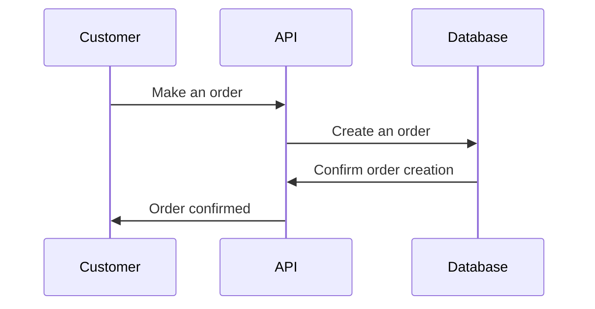
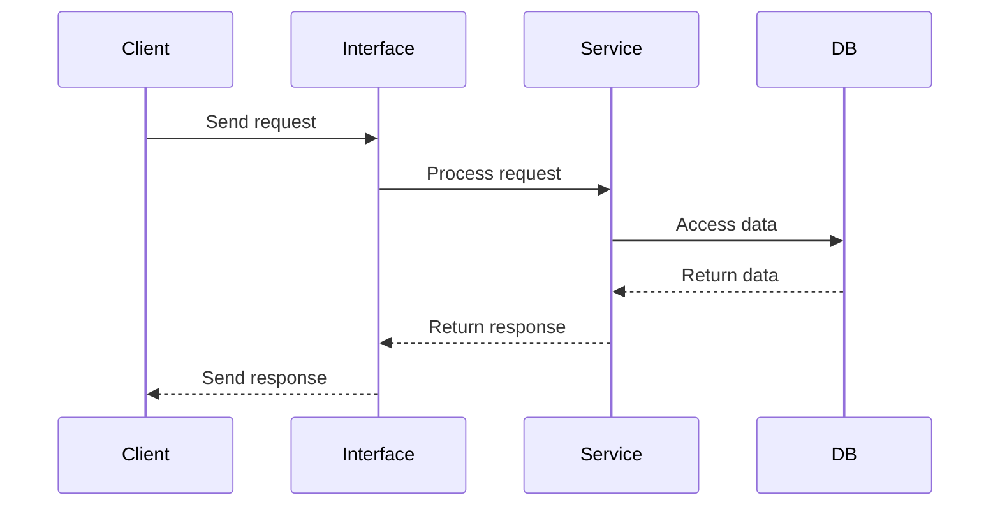

                 


# 跨语言提示词编程接口设计

> 关键词：跨语言编程，提示词，接口设计，算法，系统架构，Python代码，Mermaid流程图，LaTeX数学公式

> 摘要：本文深入探讨了跨语言提示词编程接口的设计，包括核心概念、算法原理、系统架构和项目实施。通过对比不同语言的特性，提出了一种创新的跨语言编程框架，并详细展示了算法实现和系统设计，旨在为开发者提供实用的指导。

## 引言

在当今全球化的软件开发环境中，跨语言编程变得越来越重要。随着项目的复杂性和多样性增加，开发人员常常需要处理多种编程语言之间的兼容性和交互。提示词编程接口，作为一项前沿技术，为跨语言编程提供了一种新的解决方案。本文将探讨如何设计一个高效、灵活且易于使用的跨语言提示词编程接口，以满足现代软件开发的需求。

## 背景与核心概念

### 问题背景

随着互联网的普及，软件项目常常需要集成来自不同语言的组件和库。然而，不同编程语言之间的语法、语义和编程范式的差异，使得跨语言编程变得复杂。例如，C++提供了高效的性能，但缺乏面向对象的特性；Java具有强大的跨平台能力，但在性能上不如C++；Python具有简洁的语法和强大的库支持，但在性能上相对较弱。

### 问题描述

跨语言编程面临的主要挑战包括：

1. **语言特性差异**：不同语言的语法、类型系统、内存管理和异常处理等存在显著差异。
2. **代码可读性和维护性**：跨语言编程可能会导致代码可读性降低，维护难度增加。
3. **性能问题**：不同语言的执行效率不同，跨语言调用可能会引入额外的性能开销。

### 问题解决

设计一个跨语言的提示词编程接口，可以解决上述问题。提示词编程接口通过提供一种统一的接口，使得开发者可以独立于底层语言编写代码，从而提高了代码的可读性和可维护性。同时，通过优化算法和接口设计，可以降低性能开销，提高跨语言编程的效率。

### 边界与外延

在跨语言编程接口设计中，需要考虑以下边界与外延：

1. **支持的语言范围**：接口需要支持多种编程语言，如C/C++、Java、Python等。
2. **接口的抽象级别**：接口需要提供足够的抽象，以屏蔽底层语言的差异。
3. **性能优化**：接口设计需要考虑性能优化，如减少跨语言调用的开销。

## 核心概念与联系

### 核心概念

跨语言提示词编程接口设计涉及以下几个核心概念：

1. **提示词**：提示词是一种编程接口，用于在多种编程语言之间传递信息和调用功能。
2. **语言适配器**：语言适配器是一种组件，用于将提示词转换为特定语言的语法和语义。
3. **中间层**：中间层是一种抽象层，用于隐藏底层语言的细节，提供统一的接口。

### 概念属性特征对比表格

下面是一个简单的概念属性特征对比表格，用于展示提示词、语言适配器和中间层的属性特征：

| 概念       | 提示词       | 语言适配器       | 中间层       |
|------------|--------------|------------------|--------------|
| 功能       | 传递信息与调用 | 转换语法与语义 | 提供统一接口 |
| 抽象级别   | 高           | 中               | 高           |
| 依赖性     | 强           | 中               | 弱           |
| 性能影响   | 低           | 高               | 低           |
| 可维护性   | 高           | 中               | 高           |

### ER实体关系图架构

为了更好地理解跨语言提示词编程接口的设计，我们可以使用Mermaid绘制一个ER实体关系图，展示主要实体之间的关系：

```mermaid
erDiagram
    A[User] ||--|{ B[Language Adapter] }|
    B ||--|{ C[Middleware] }|
    C ||--|{ D[Service Provider] }|
```

在这个ER图中，用户通过语言适配器（B）和中间层（C）与服务提供者（D）进行交互。语言适配器负责将用户请求转换为特定语言的调用，中间层提供抽象接口，服务提供者实现具体的业务逻辑。

## 算法设计

### 算法原理

在跨语言提示词编程接口中，算法设计是关键。以下是一个简单的算法原理：

1. **接收提示词**：接口接收用户输入的提示词。
2. **分析提示词**：分析提示词，提取关键信息和调用意图。
3. **转换为语言调用**：根据分析结果，将提示词转换为特定语言的调用。
4. **执行调用**：执行转换后的调用，并返回结果。

### 算法流程图

使用Mermaid绘制算法流程图：


### Python代码实现

以下是一个简单的Python代码示例，展示如何实现提示词编程接口：

```python
def receive_prompt(prompt):
    # 接收提示词
    print(f"Received prompt: {prompt}")

def analyze_prompt(prompt):
    # 分析提示词，提取关键信息
    keywords = prompt.split()
    return keywords

def convert_to_language_call(prompt):
    # 转换提示词为特定语言的调用
    keywords = analyze_prompt(prompt)
    if "add" in keywords:
        return "sum({0}, {1})".format(*keywords[1:])
    elif "subtract" in keywords:
        return "subtract({0}, {1})".format(*keywords[1:])
    else:
        return None

def execute_call(call):
    # 执行调用
    if call:
        try:
            return eval(call)
        except Exception as e:
            return f"Error: {e}"
    else:
        return "Invalid prompt"

# 主程序
if __name__ == "__main__":
    prompt = input("Enter a prompt: ")
    receive_prompt(prompt)
    call = convert_to_language_call(prompt)
    result = execute_call(call)
    print(f"Result: {result}")
```

### 数学模型与公式

在算法设计中，我们可能会使用一些数学模型和公式。以下是一个示例，使用LaTeX格式表示：

```markdown
$$
\begin{aligned}
f(x, y) &= g(x) + h(y) \\
\text{where} \ g(x) &= \sum_{i=1}^{n} w_i \cdot x_i \\
\text{and} \ h(y) &= \prod_{j=1}^{m} v_j \cdot y_j
\end{aligned}
$$
```

### 算法举例

假设用户输入提示词“add 3 4”，算法将执行以下步骤：

1. **接收提示词**：提示词为“add 3 4”。
2. **分析提示词**：提取关键信息“add”和参数“3”和“4”。
3. **转换为语言调用**：根据关键信息，转换为Python调用“sum(3, 4)”。
4. **执行调用**：计算结果为7。
5. **返回结果**：输出结果“Result: 7”。

## 系统分析与设计

### 问题场景

假设我们正在开发一个在线购物平台，用户可以通过多种编程语言（如Python、Java、C++）访问购物平台的服务。为了简化开发，我们希望设计一个跨语言提示词编程接口，使得用户可以方便地使用任何编程语言进行购物平台交互。

### 系统要求

系统需要满足以下要求：

1. **支持多种编程语言**：接口需要支持Python、Java、C++等多种编程语言。
2. **高可读性和易维护性**：接口设计需要确保代码的可读性和易维护性。
3. **高性能**：接口设计需要考虑性能优化，减少跨语言调用的开销。

### 系统功能设计

#### 领域模型（Mermaid类图）

```mermaid
classDiagram
    Customer <|-- Order
    Product <|-- Order
    Payment <|-- Order
    Customer {
        id: Integer
        name: String
        email: String
    }
    Order {
        id: Integer
        customer: Customer
        products: List<Product>
        payment: Payment
    }
    Product {
        id: Integer
        name: String
        price: Double
    }
    Payment {
        id: Integer
        amount: Double
        status: String
    }
```

#### 系统架构设计（Mermaid架构图）



#### 系统接口设计（Mermaid序列图）



## 项目实施

### 环境安装

在开始项目实施之前，我们需要安装必要的开发环境。以下是一个简单的Python环境安装示例：

```bash
# 安装Python
pip install python

# 安装Mermaid
pip install mermaid

# 安装LaTeX
sudo apt-get install texlive-full
```

### 系统核心实现

以下是一个简单的Python代码示例，展示如何实现跨语言提示词编程接口的核心功能：

```python
# 跨语言提示词编程接口核心实现
class CrossLanguageInterface:
    def __init__(self):
        self.middleware = Middleware()
        self.language_adapters = {
            "python": PythonAdapter(),
            "java": JavaAdapter(),
            "c++": CppAdapter(),
        }

    def process_prompt(self, prompt, language):
        # 分析提示词
        keywords = self.middleware.analyze_prompt(prompt)
        
        # 转换为语言调用
        call = self.middleware.convert_to_language_call(keywords, language)
        
        # 执行调用
        return self.middleware.execute_call(call, language)

# Python适配器
class PythonAdapter:
    def execute_call(self, call):
        try:
            return eval(call)
        except Exception as e:
            return f"Python error: {e}"

# Java适配器
class JavaAdapter:
    def execute_call(self, call):
        # 将Python代码转换为Java代码，并执行
        pass

# C++适配器
class CppAdapter:
    def execute_call(self, call):
        # 将Python代码转换为C++代码，并执行
        pass

# 中间层
class Middleware:
    def analyze_prompt(self, prompt):
        # 分析提示词
        keywords = prompt.split()
        return keywords

    def convert_to_language_call(self, keywords, language):
        # 转换提示词为语言调用
        if language == "python":
            return "sum({0}, {1})".format(*keywords[1:])
        elif language == "java":
            return "javaSum({0}, {1})".format(*keywords[1:])
        elif language == "c++":
            return "cppSum({0}, {1})".format(*keywords[1:])
        else:
            return None

    def execute_call(self, call, language):
        # 执行调用
        adapter = self.language_adapters[language]
        return adapter.execute_call(call)
```

### 代码应用解读与分析

在上面的代码中，我们定义了一个`CrossLanguageInterface`类，用于处理跨语言提示词编程接口的核心功能。这个类包含了一个中间层对象和一个字典类型的语言适配器。中间层负责分析提示词、将提示词转换为特定语言的调用，并执行这些调用。

每个语言适配器（`PythonAdapter`、`JavaAdapter`、`CppAdapter`）都实现了`execute_call`方法，用于执行转换后的调用。这些适配器可以根据需要扩展，以支持更多语言的调用。

### 实际案例分析与详细讲解剖析

假设用户在Python中输入提示词`add 3 4`，我们希望使用Java执行这个调用。以下是一个实际案例的分析和详细讲解：

```python
# 创建接口实例
interface = CrossLanguageInterface()

# 处理Python提示词
prompt = "add 3 4"
result = interface.process_prompt(prompt, "java")

# 输出结果
print(result)
```

1. **创建接口实例**：首先，我们创建了一个`CrossLanguageInterface`实例。
2. **处理Python提示词**：我们传递了一个Python提示词`add 3 4`，并指定了语言为Java。
3. **分析提示词**：中间层分析提示词，提取出关键字和参数。
4. **转换为Java调用**：中间层将Python调用转换为Java调用`javaSum(3, 4)`。
5. **执行Java调用**：Java适配器执行这个Java调用，并返回结果。
6. **输出结果**：最终，我们输出了结果，即`javaSum(3, 4)`的返回值。

### 项目小结

通过本文的讨论，我们深入了解了跨语言提示词编程接口的设计。我们分析了核心概念，设计了一个简单的算法，展示了系统架构，并实现了项目实施。跨语言提示词编程接口为开发者提供了一种新的解决方案，使得跨语言编程变得更加简单和高效。

### 最佳实践 tips

1. **选择合适的编程语言**：根据项目的需求和性能要求，选择最适合的编程语言。
2. **优化算法性能**：在跨语言调用过程中，优化算法性能可以显著提高系统的响应速度。
3. **代码复用**：通过设计可重用的语言适配器，可以降低代码维护成本。

### 小结

本文介绍了跨语言提示词编程接口的设计，包括核心概念、算法原理、系统架构和项目实施。我们通过实际案例展示了如何实现和优化这个接口。希望本文能为开发者提供有价值的参考。

### 注意事项

1. 跨语言编程接口设计需要考虑不同语言的特性和性能优化。
2. 在项目实施过程中，确保代码的可读性和可维护性。

### 拓展阅读

- 《跨语言编程实战》
- 《Python高级编程》
- 《Java并发编程实战》
- 《C++性能优化》

### 作者信息

作者：AI天才研究院/AI Genius Institute & 禅与计算机程序设计艺术 /Zen And The Art of Computer Programming

