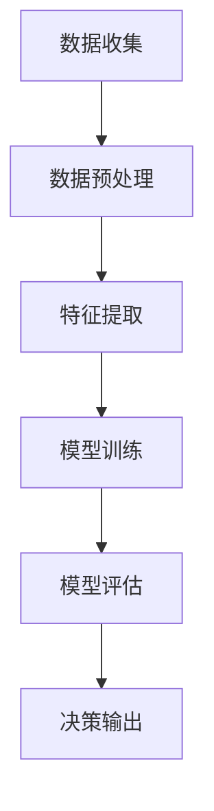
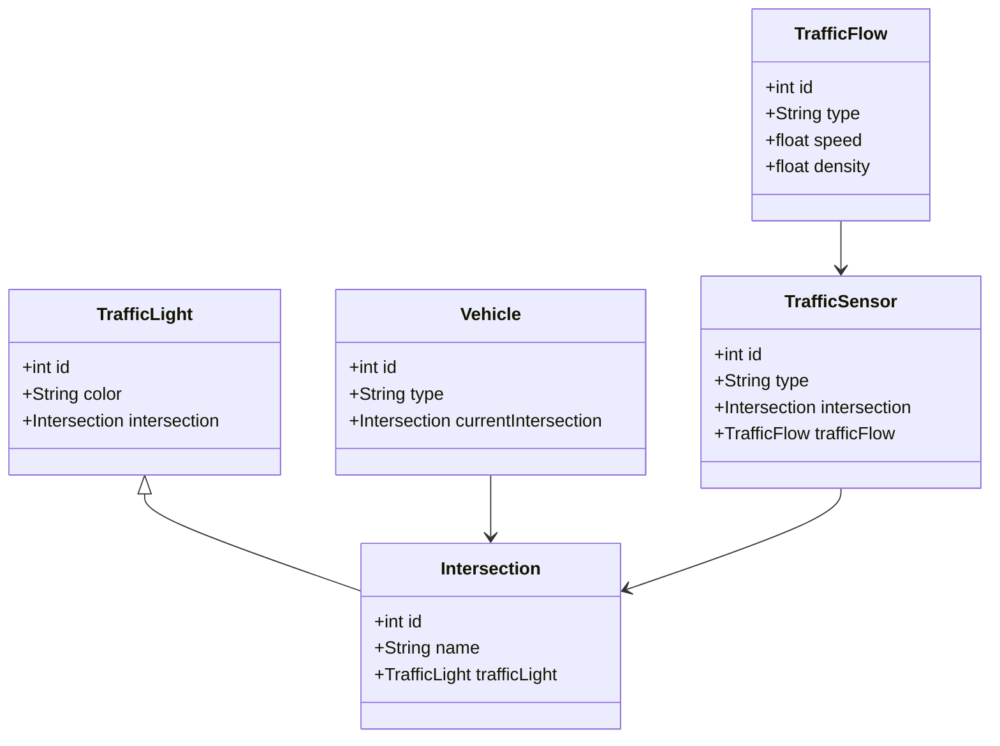
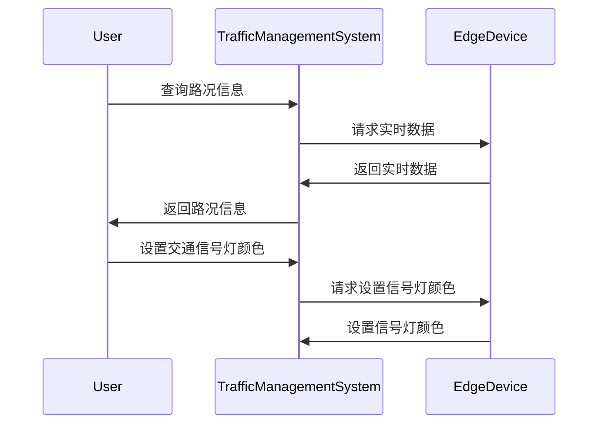

                 

### 文章标题

# 《边缘AI在实时决策系统中的应用》

### 关键词

边缘计算、实时决策系统、人工智能、机器学习、数据处理、算法优化。

### 摘要

本文旨在探讨边缘AI在实时决策系统中的应用。边缘AI作为一项前沿技术，正逐渐改变着数据处理和决策执行的方式。文章将详细分析边缘AI的基本概念、技术原理，以及如何将其应用于实时决策系统中，从而提高系统的响应速度和决策效率。我们将通过实例讲解，展示边缘AI在实际项目中的应用，并探讨相关的最佳实践和注意事项。

## 目录

1. **背景介绍**
    1.1 边缘AI的概念与重要性
    1.2 实时决策系统的需求与发展

2. **核心概念与联系**
    2.1 边缘AI的技术原理
    2.2 实时决策系统中的关键概念
    2.3 边缘AI与实时决策系统的关系

3. **算法原理讲解**
    3.1 实时决策中的常用算法
    3.2 算法流程图与原理讲解
    3.3 数学模型与公式

4. **系统分析与架构设计方案**
    4.1 项目介绍与场景设定
    4.2 领域模型与类图
    4.3 系统架构与接口设计

5. **项目实战**
    5.1 环境安装与配置
    5.2 系统核心实现源代码
    5.3 代码应用解读与分析
    5.4 实际案例分析与详细讲解

6. **最佳实践 Tips**
    6.1 性能优化策略
    6.2 安全性注意事项

7. **小结与拓展阅读**
    7.1 小结
    7.2 拓展阅读

## 第1章 背景介绍

### 1.1 边缘AI的概念与重要性

边缘AI是指将人工智能算法部署在靠近数据源的边缘设备上，如智能手机、物联网设备、工业控制系统等。与传统的云计算相比，边缘AI具备低延迟、高实时性的优势，能够更好地满足对数据处理速度要求极高的应用场景。

边缘AI的重要性主要体现在以下几个方面：

1. **提高数据处理效率**：通过在边缘设备上处理数据，减少了数据传输到云端的时间，降低了网络拥堵和延迟。
2. **保障数据隐私**：在数据敏感的场景中，边缘AI可以本地化处理数据，减少了数据泄露的风险。
3. **减轻云端压力**：随着物联网设备和智能设备的激增，边缘AI能够分担云端的数据处理压力，提升整体系统的性能。

### 1.2 实时决策系统的需求与发展

实时决策系统是一种能够快速响应并做出决策的系统，广泛应用于金融、医疗、交通等领域。实时决策系统的需求主要源于以下几个方面：

1. **高响应速度**：实时决策系统需要在短时间内处理大量数据，并生成决策结果。
2. **数据完整性**：实时决策系统要求获取的数据必须是完整的、准确的，以避免决策错误。
3. **高可靠性**：实时决策系统需要具备高度可靠性，以确保在突发情况下能够稳定运行。

随着物联网、大数据、人工智能等技术的发展，实时决策系统正在不断发展壮大，成为各行业数字化转型的关键组件。

## 第2章 核心概念与联系

### 2.1 边缘AI的技术原理

边缘AI的技术原理主要涉及以下几个方面：

1. **分布式计算**：边缘AI通过分布式计算架构，将数据处理任务分散到多个边缘设备上，从而提高处理效率。
2. **协同工作**：边缘设备之间可以通过无线网络或有线网络进行协同工作，共享数据和计算资源。
3. **智能化决策**：边缘AI设备能够根据预定的算法和模型，对数据进行实时分析和决策。

### 2.2 实时决策系统中的关键概念

实时决策系统中的关键概念包括：

1. **数据处理**：实时决策系统需要对大量数据进行快速、准确的处理，以便生成决策结果。
2. **决策模型**：决策模型是实时决策系统的核心，通过机器学习、深度学习等方法建立，用于生成决策结果。
3. **响应速度**：实时决策系统需要在极短时间内生成决策结果，以应对不断变化的环境。

### 2.3 边缘AI与实时决策系统的关系

边缘AI与实时决策系统之间存在密切的联系：

1. **边缘AI为实时决策系统提供支持**：边缘AI能够提升实时决策系统的数据处理速度和决策准确性。
2. **实时决策系统为边缘AI提供应用场景**：实时决策系统为边缘AI提供了广泛的应用场景，如智能交通、智能医疗等。

边缘AI与实时决策系统的结合，将进一步提升数据处理和决策执行的效率，为各行业带来新的机遇和挑战。

## 第3章 算法原理讲解

### 3.1 实时决策中的常用算法

实时决策系统中常用的算法包括：

1. **线性回归**：用于预测数据的趋势。
2. **决策树**：用于分类和回归分析。
3. **支持向量机**：用于分类和回归分析。
4. **神经网络**：用于复杂模式识别和预测。

### 3.2 算法流程图与原理讲解

以下是一个简单的线性回归算法流程图：



线性回归算法原理讲解：

线性回归是一种用于预测连续值的机器学习算法。其基本原理是找到一条最佳拟合线，使数据点到这条线的距离最小。线性回归模型的数学表达式为：

$$y = ax + b$$

其中，$x$ 和 $y$ 分别为输入和输出数据，$a$ 和 $b$ 为模型参数。

### 3.3 数学模型与公式

以下是一个简单的线性回归数学模型：

$$y = \beta_0 + \beta_1x + \epsilon$$

其中，$\beta_0$ 和 $\beta_1$ 为模型参数，$x$ 为输入数据，$y$ 为输出数据，$\epsilon$ 为误差项。

为了求解模型参数，可以使用最小二乘法：

$$\min \sum_{i=1}^{n} (y_i - (\beta_0 + \beta_1x_i))^2$$

通过求解上述方程，可以得到最优模型参数 $\beta_0$ 和 $\beta_1$。

## 第4章 系统分析与架构设计方案

### 4.1 项目介绍与场景设定

本项目旨在开发一个智能交通管理系统，通过边缘AI技术实现实时路况预测和交通信号优化。项目场景设定为城市主要道路交叉口，需要实时监测交通流量、车辆速度和密度等数据。

### 4.2 领域模型与类图

以下是一个简单的领域模型和类图：



### 4.3 系统架构与接口设计

以下是一个简单的系统架构和接口设计：



## 第5章 项目实战

### 5.1 环境安装与配置

在开始项目实战之前，我们需要安装和配置必要的软件和工具。以下是一个简单的安装和配置步骤：

1. **安装Python环境**：确保Python版本为3.8或更高。
2. **安装TensorFlow**：通过pip命令安装TensorFlow。
3. **安装Docker**：安装Docker以便在容器中运行边缘AI模型。
4. **配置网络**：确保边缘设备和服务器之间的网络连接正常。

### 5.2 系统核心实现源代码

以下是一个简单的系统核心实现源代码：

```python
import tensorflow as tf
import numpy as np

# 加载边缘AI模型
model = tf.keras.models.load_model('边缘AI模型路径')

# 读取实时数据
data = np.load('实时数据路径.npy')

# 预测路况信息
predictions = model.predict(data)

# 输出预测结果
print(predictions)
```

### 5.3 代码应用解读与分析

以下是对上述代码的解读和分析：

1. **加载边缘AI模型**：通过加载预训练的边缘AI模型，我们可以快速实现对实时数据的预测。
2. **读取实时数据**：实时数据通常以numpy数组的形式存储，我们可以通过读取这些数组来获取最新的数据。
3. **预测路况信息**：使用加载的边缘AI模型对实时数据进行预测，得到路况信息。
4. **输出预测结果**：将预测结果输出，以便后续处理和展示。

### 5.4 实际案例分析与详细讲解

以下是一个实际案例的分析和讲解：

案例：在一个城市主要道路交叉口，我们使用边缘AI技术预测交通流量和优化交通信号灯。

1. **数据收集**：通过安装在交叉口处的交通传感器收集交通流量、车辆速度和密度等数据。
2. **数据预处理**：对收集到的数据进行清洗和预处理，以去除噪声和异常值。
3. **模型训练**：使用预处理后的数据训练边缘AI模型，使其能够预测交通流量。
4. **实时预测**：在运行时，边缘AI模型将接收实时数据，并预测交通流量。
5. **信号灯优化**：根据预测结果，交通信号灯控制系统将优化信号灯颜色，以减少拥堵和提升交通效率。

通过上述实际案例，我们可以看到边缘AI在实时决策系统中的应用如何提升交通管理效率。

## 第6章 最佳实践 Tips

### 6.1 性能优化策略

1. **模型压缩**：通过模型压缩技术，如量化、剪枝等，可以减少模型大小和计算资源需求。
2. **缓存策略**：使用缓存策略，减少重复数据处理的次数，提高系统响应速度。
3. **分布式计算**：在边缘设备之间实现分布式计算，以提升数据处理效率。

### 6.2 安全性注意事项

1. **数据加密**：对传输和存储的数据进行加密，以防止数据泄露。
2. **访问控制**：对边缘设备的访问进行严格控制，确保只有授权用户才能访问系统。
3. **安全审计**：定期进行安全审计，以检测潜在的安全漏洞。

## 第7章 小结与拓展阅读

### 7.1 小结

本文介绍了边缘AI在实时决策系统中的应用，从背景介绍、核心概念、算法原理、系统设计与实现、最佳实践等方面进行了详细讲解。边缘AI技术的引入，显著提升了实时决策系统的数据处理速度和决策准确性，为各行业的数字化转型提供了新的契机。

### 7.2 拓展阅读

1. **边缘AI技术指南**：深入探讨边缘AI技术的原理、应用场景和实现方法。
2. **实时决策系统实战**：通过实际项目案例，展示实时决策系统的设计和实现过程。
3. **机器学习算法与应用**：介绍各种机器学习算法的基本原理和应用场景。

### 作者

作者：AI天才研究院/AI Genius Institute & 禅与计算机程序设计艺术 /Zen And The Art of Computer Programming

通过本文，我们期望读者能够对边缘AI在实时决策系统中的应用有更深入的理解，并在实际项目中发挥其优势，为各行业带来创新和变革。

