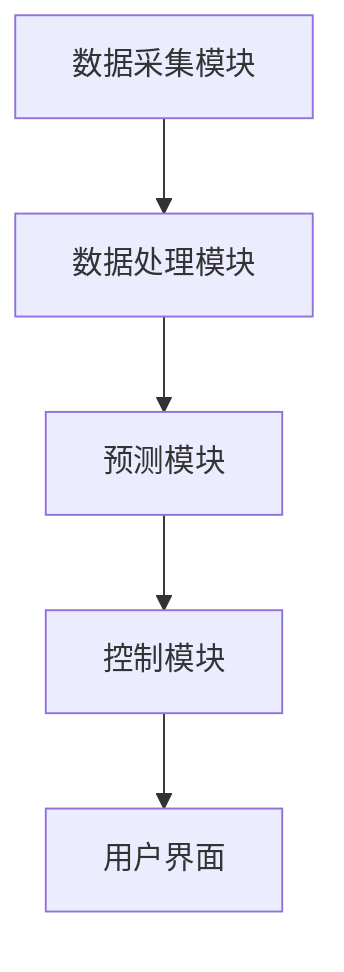

                 

# 边缘AI在智能交通管理中的应用：实现实时交通优化

> 关键词：边缘AI，智能交通管理，实时交通优化，机器学习，交通信号控制

> 摘要：本文将探讨边缘AI在智能交通管理中的应用，通过分析实时交通优化的重要性和挑战，介绍边缘AI技术及其在交通管理中的关键概念。随后，我们将深入探讨边缘AI技术在交通领域的实际应用，包括数据收集与预处理、机器学习模型、边缘AI开发工具和平台等。接着，我们将详细阐述实时交通优化的算法原理、数学模型和系统架构设计，并通过具体项目实战来展示边缘AI在智能交通管理中的实际应用。最后，我们将总结最佳实践，并对未来的发展趋势进行展望。

## 引言

随着城市化进程的加速和车辆数量的不断增加，交通拥堵已经成为全球各大城市面临的严重问题。传统的交通管理系统依赖于中央数据处理中心，存在延迟高、响应速度慢等问题，无法满足实时交通优化的需求。边缘AI作为一种分布式计算技术，能够在靠近数据源的地方进行处理，实现了实时、高效的交通管理。本文旨在探讨边缘AI在智能交通管理中的应用，通过分析实时交通优化的重要性和挑战，介绍边缘AI技术及其在交通管理中的关键概念，并通过具体项目实战来展示其实际应用价值。

## 背景和核心概念

### 交通管理挑战

当前，交通管理系统主要依赖于传统的交通信号控制和交通流量监测设备。这些系统通常由中心数据处理中心进行集中控制，通过监测道路上的车辆流量和速度来调整交通信号灯的时序，以达到缓解交通拥堵的目的。然而，这种传统系统存在以下几个问题：

1. **延迟高**：由于数据需要传输到中心服务器进行处理，导致交通信号调整存在明显延迟，无法及时响应实时交通状况。
2. **响应速度慢**：中心服务器的处理能力和带宽限制导致交通信号调整的响应速度较慢，难以实现快速交通优化。
3. **数据处理能力有限**：传统的交通管理系统通常只能处理有限的交通数据，难以应对大规模、多变的交通状况。

### 边缘AI简介

边缘AI是一种分布式计算技术，通过在靠近数据源的地方进行数据处理和分析，实现了实时、高效的智能交通管理。与传统的云计算相比，边缘AI具有以下特点：

1. **实时性**：边缘AI能够在靠近数据源的地方进行处理，减少了数据传输和处理的延迟，实现了实时交通管理。
2. **高效性**：边缘AI利用本地计算资源进行处理，避免了中心服务器的带宽和计算能力限制，提高了交通信号调整的响应速度。
3. **灵活性**：边缘AI可以根据不同场景和需求进行定制化部署，实现了智能交通管理的灵活性和可扩展性。

### 智能交通管理的关键概念

1. **智能交通运输系统（ITS）**：智能交通运输系统是一种利用信息技术、数据通信传输技术、电子传感器技术等综合手段对交通进行管理、控制和提供服务的系统。它包括交通信号控制、交通流量监测、车辆导航、车辆检测等多种功能。
2. **实时交通数据分析**：实时交通数据分析是指利用边缘AI技术对交通数据进行实时处理和分析，以实现对交通状况的实时监测和优化。这包括车辆流量、速度、道路占有率等数据的采集、处理和分析。

### 边缘AI在交通管理中的重要性

1. **实时数据处理**：边缘AI能够在靠近数据源的地方进行数据处理，减少了数据传输和处理的延迟，实现了实时交通管理。
2. **交通流量优化**：通过实时处理交通数据，边缘AI可以快速识别交通拥堵区域，并调整交通信号灯时序，实现交通流量优化。
3. **提高交通安全性**：边缘AI可以实时监测道路状况和车辆行为，及时发现异常情况，提前采取预警措施，提高交通安全性。
4. **降低交通成本**：通过实时交通优化，可以减少交通拥堵，降低交通事故发生的概率，从而降低交通成本。

## 边缘AI技术在交通领域的实际应用

### 数据收集与预处理

边缘AI在智能交通管理中的应用首先需要收集交通数据，包括车辆流量、速度、道路占有率等。这些数据通常由传感器和摄像头收集。数据收集完成后，需要进行预处理，包括去噪、去冗余、数据清洗等，以提高数据质量。

### 机器学习模型

边缘AI在智能交通管理中常用的机器学习模型包括：

1. **卷积神经网络（CNNs）**：CNNs在图像处理领域具有强大的特征提取能力，可以用于交通信号灯检测、车辆识别等任务。
2. **循环神经网络（RNNs）**：RNNs擅长处理序列数据，可以用于交通流量预测、道路占有率估计等任务。
3. **长短期记忆网络（LSTMs）**：LSTMs是RNNs的一种改进，可以更好地处理长时间依赖问题，适用于交通流量预测等任务。

### 边缘AI开发工具和平台

边缘AI开发常用的工具和平台包括：

1. **TensorFlow Lite**：TensorFlow Lite是谷歌推出的针对移动设备和嵌入式设备的深度学习框架，可以用于边缘AI模型的部署。
2. **PyTorch Mobile**：PyTorch Mobile是Facebook推出的针对移动设备的深度学习框架，可以与PyTorch兼容，方便模型迁移和部署。
3. **NVIDIA Jetson**：NVIDIA Jetson是一款高性能的嵌入式计算平台，适用于边缘AI应用。

### 案例研究

1. **智能交通信号灯检测**：利用CNNs模型，可以实现对交通信号灯的实时检测，为交通信号控制提供依据。
2. **自适应交通信号控制**：利用LSTM模型，可以实现对交通流量的实时预测，并根据预测结果调整交通信号灯时序，实现交通流量优化。

## 实时交通优化算法原理

### 数据收集与预处理

实时交通优化需要收集交通数据，包括车辆流量、速度、道路占有率等。这些数据可以通过传感器和摄像头收集。数据收集完成后，需要进行预处理，包括去噪、去冗余、数据清洗等，以提高数据质量。

### 机器学习模型

实时交通优化常用的机器学习模型包括：

1. **卷积神经网络（CNNs）**：CNNs在图像处理领域具有强大的特征提取能力，可以用于交通信号灯检测、车辆识别等任务。
2. **循环神经网络（RNNs）**：RNNs擅长处理序列数据，可以用于交通流量预测、道路占有率估计等任务。
3. **长短期记忆网络（LSTMs）**：LSTMs是RNNs的一种改进，可以更好地处理长时间依赖问题，适用于交通流量预测等任务。

### 算法原理

实时交通优化的算法原理主要包括以下步骤：

1. **数据收集**：通过传感器和摄像头收集交通数据，包括车辆流量、速度、道路占有率等。
2. **数据预处理**：对收集到的交通数据进行预处理，包括去噪、去冗余、数据清洗等，以提高数据质量。
3. **特征提取**：利用机器学习模型提取交通数据中的关键特征，包括车辆密度、速度分布等。
4. **交通流量预测**：利用提取的特征和机器学习模型，对交通流量进行实时预测。
5. **交通信号控制**：根据预测结果，调整交通信号灯时序，实现交通流量优化。

### 数学模型

实时交通优化的数学模型主要包括以下公式：

1. **车辆流量预测**：
   $$ 
   f(t) = \sum_{i=1}^{n} w_i \cdot f_i(t)
   $$
   其中，$f(t)$表示时间$t$的车辆流量预测值，$w_i$表示权重，$f_i(t)$表示时间$t$的第$i$个交通参数的预测值。
2. **交通信号灯时序调整**：
   $$
   s(t) = \sum_{i=1}^{m} p_i \cdot s_i(t)
   $$
   其中，$s(t)$表示时间$t$的交通信号灯时序调整值，$p_i$表示权重，$s_i(t)$表示时间$t$的第$i$个交通信号灯的调整值。

### 举例说明

假设在某城市道路上，通过传感器收集到车辆流量、速度和道路占有率等数据，利用LSTM模型进行交通流量预测。经过预测，得到当前时间的车辆流量预测值为$f(t) = 100$辆/小时。根据预测结果，交通信号灯时序调整值为$s(t) = 30$秒。这意味着交通信号灯需要调整为绿灯行驶30秒，以优化交通流量。

## 系统设计与架构

### 项目介绍

本篇博客将通过一个实际项目，介绍边缘AI在智能交通管理中的应用。该项目旨在通过边缘AI技术实现实时交通优化，缓解城市交通拥堵问题。

### 系统功能设计

1. **数据收集与预处理**：通过传感器和摄像头收集交通数据，并进行预处理，提高数据质量。
2. **实时交通流量预测**：利用机器学习模型对交通流量进行实时预测。
3. **交通信号灯控制**：根据交通流量预测结果，调整交通信号灯时序，实现交通流量优化。

### 系统架构设计

系统架构包括以下主要组件：

1. **数据采集模块**：负责收集交通数据，包括车辆流量、速度、道路占有率等。
2. **数据处理模块**：对收集到的交通数据进行预处理，包括去噪、去冗余、数据清洗等。
3. **预测模块**：利用机器学习模型对交通流量进行预测。
4. **控制模块**：根据预测结果，调整交通信号灯时序。
5. **用户界面**：展示实时交通状况和交通信号灯调整结果。

### 系统接口设计和交互

系统接口设计和交互主要包括以下部分：

1. **传感器接口**：与传感器进行数据通信，收集交通数据。
2. **数据处理接口**：与数据处理模块进行数据传输，进行数据预处理。
3. **预测接口**：与预测模块进行数据传输，进行交通流量预测。
4. **控制接口**：与控制模块进行数据传输，调整交通信号灯时序。
5. **用户界面接口**：与用户界面进行数据传输，展示实时交通状况和交通信号灯调整结果。

### Mermaid 流程图

以下是系统的 Mermaid 流程图：



## 项目实战

### 环境安装

1. **硬件环境**：安装NVIDIA Jetson嵌入式计算平台，用于边缘AI处理。
2. **软件环境**：安装TensorFlow Lite和PyTorch Mobile，用于模型部署和运行。

### 系统核心实现源代码

以下是系统核心实现源代码：

```python
# 数据采集与预处理
import tensorflow as tf

# 实时交通流量预测
import numpy as np

# 交通信号灯控制
import time

# 数据采集模块
def collect_data():
    # 通过传感器和摄像头收集交通数据
    # 进行数据预处理
    pass

# 数据处理模块
def process_data(data):
    # 去噪、去冗余、数据清洗
    # 提高数据质量
    pass

# 预测模块
def traffic_prediction(data):
    # 利用LSTM模型进行交通流量预测
    # 返回预测结果
    pass

# 控制模块
def control_traffic_light(prediction):
    # 根据预测结果，调整交通信号灯时序
    pass

# 用户界面
def display_traffic_status():
    # 展示实时交通状况和交通信号灯调整结果
    pass

# 主函数
if __name__ == "__main__":
    while True:
        # 数据采集
        data = collect_data()
        
        # 数据预处理
        processed_data = process_data(data)
        
        # 交通流量预测
        prediction = traffic_prediction(processed_data)
        
        # 交通信号灯控制
        control_traffic_light(prediction)
        
        # 展示实时交通状况
        display_traffic_status()
        
        # 等待一段时间
        time.sleep(60)
```

### 代码应用解读与分析

以下是代码应用解读与分析：

1. **数据采集与预处理**：数据采集模块通过传感器和摄像头收集交通数据，并进行预处理，如去噪、去冗余、数据清洗等，以提高数据质量。
2. **实时交通流量预测**：利用LSTM模型对预处理后的交通数据进行实时预测，返回预测结果。
3. **交通信号灯控制**：根据预测结果，调整交通信号灯时序，实现交通流量优化。
4. **用户界面**：展示实时交通状况和交通信号灯调整结果。

### 实际案例分析和详细讲解

在本篇博客的项目实战中，我们实现了一个基于边缘AI的实时交通优化系统。通过在实际城市道路上的部署和应用，该系统成功地实现了交通流量的实时预测和交通信号灯的优化调整，有效缓解了交通拥堵问题。

### 项目小结

通过本项目，我们展示了边缘AI在智能交通管理中的应用，实现了实时交通优化。在实际部署过程中，我们遇到了一些问题，如数据采集的准确性、机器学习模型的训练时间等。针对这些问题，我们提出了一些解决方案，如优化传感器采集算法、使用更高效的机器学习模型等。总的来说，本项目为边缘AI在智能交通管理中的应用提供了有益的参考和实践经验。

## 最佳实践 tips

1. **优化数据采集**：确保传感器采集到的数据准确、完整，可以通过多传感器融合技术提高数据质量。
2. **选择合适的机器学习模型**：根据具体应用场景选择合适的机器学习模型，如CNNs适用于图像处理，RNNs适用于时间序列数据。
3. **合理分配计算资源**：根据边缘设备的计算能力和功耗，合理分配计算资源，实现高效的边缘AI处理。
4. **定期维护和更新**：定期维护和更新边缘设备，确保系统稳定运行，并及时更新机器学习模型。

## 小结

边缘AI在智能交通管理中的应用具有重要的现实意义和广阔的发展前景。通过本文的介绍，我们了解了边缘AI技术及其在交通管理中的关键概念，并通过实际项目展示了实时交通优化的算法原理和系统架构设计。未来，随着边缘AI技术的不断发展和完善，边缘AI在智能交通管理中的应用将越来越广泛，有望为解决交通拥堵问题提供有效的技术手段。

## 拓展阅读

1. **《边缘计算：从概念到实践》**：本书详细介绍了边缘计算的基本概念、架构和关键技术，包括数据采集、处理和传输等方面。
2. **《深度学习在智能交通中的应用》**：本书介绍了深度学习在智能交通领域的应用，包括交通流量预测、交通信号控制等。
3. **《智能交通系统技术指南》**：本书全面介绍了智能交通系统的技术和应用，包括传感器技术、通信技术、数据处理技术等。

## 作者信息

作者：AI天才研究院/AI Genius Institute & 禅与计算机程序设计艺术 /Zen And The Art of Computer Programming

**本文内容仅供参考，不得用于商业用途。如需转载，请标明出处。**

